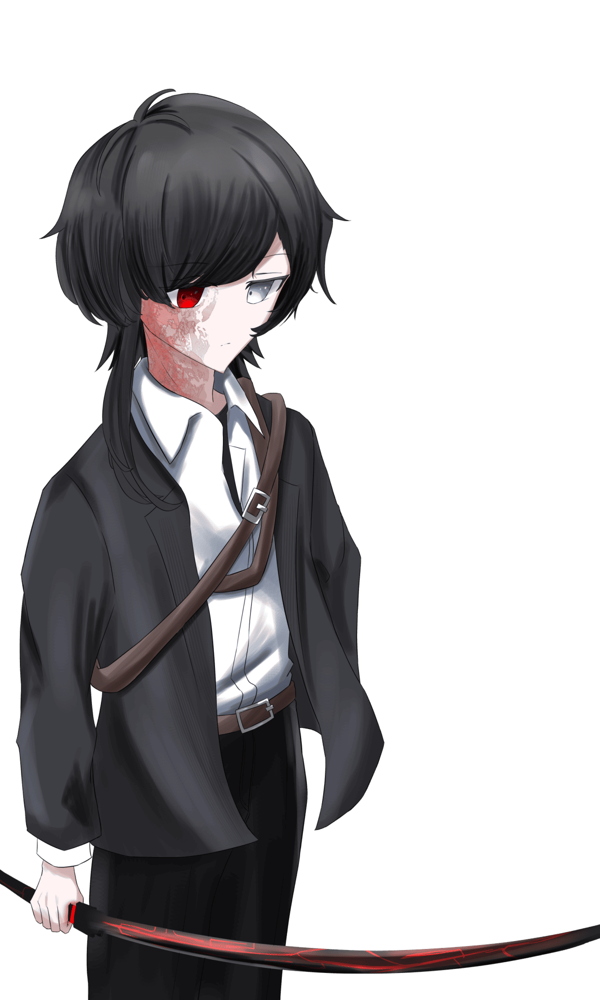
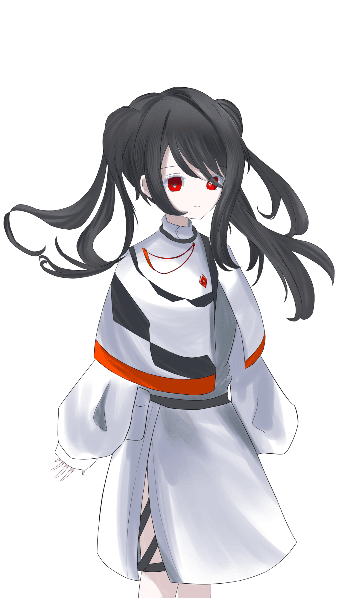

# 《Acrossire》完整劇本（KP 向）

> ⚠ **本檔含全劇透，僅供 KP 閱覽。**
> CoC 克蘇魯神話 TRPG **第 6 版**（並用《怪物之槌》Malleus Monstrorum）祕匿 HO 劇本。原文 **Acrossire ＿＿平行線が傾いた**（Potluck Party 2025 參加作品，SPLL:193991）。
> **4PL 固定‧限新建探索者**；題材：Vtuber／虛擬空間／終末世界。想定時間：各 HO 個別導入 20〜40 分，配對導入各約 1 小時，第 1 章約 5 小時、第 2 章約 4 小時、第 3 章約 4 小時、第 4 章約 3 小時（KP 約 20 小時／PL 約 18 小時）。
> **含有要素**：PvP 可能、對魔術‧神話生物‧神話事象的獨自解釋、探索者年齡指定、中途失格可能、原創 AF 登場、呪文改編、神話生物改編、大量骰運要素、戰鬥偏多、各 HO 失格率不同。
> 術語與專名請對照〈譯名對照表〉。**四個 HO 標題保留日文原題**（『理想と歌』『虚無が唄』『希望に舞』『絶望へ踊』）；`{HO1}`〜`{HO4}` 為佔位符。
>
> 章節：**第 1 章 天使的侵入「Angelic Invasion」→ 第 2 章 贗品與餞別「Fake and Farewell」→ 第 3 章 黑之泡沫「Black Foam」→ 第 4 章 舞台的終點「Terminal Stage」**；結局 **A「ACROSS」／B「DESIRE」／C「DAWN」**。

---

---

## Acrossire

克蘇魯神話 TRPG 第 6 版對應
Potluck Party 2025 參加作品
【Acrossire】
SPLL:193991
＿＿平行線傾斜了
題材：Vtuber、虛擬空間、終末世界

---

## 劇本規格

- 使用擴充：基本規則書、《怪物之槌》
- 系統：CoC 第 6 版
- 人數：有祕匿 4PL（限新建探索者）
- 時間：各 HO 個別導入約 20 分〜40 分
  - HO1、HO3 與 HO2、HO4 的配對導入各約 1 小時
  - 第 1 章：約 5 小時　第 2 章：約 4 小時　第 3 章：約 4 小時　第 4 章：約 3 小時
  - 合計　KP 約 20 小時　PL 約 18 小時
- 失格：有
- 後遺症：？
- 推薦技能：探索技能、戰鬥技能、交涉系技能
- 準推薦技能：〈急救〉、〈心理學〉、〈機械維修〉
- 非推薦：低 POW

## 本劇本含有的要素

有 PvP 的可能性、對魔術‧神話生物‧神話性事象的獨自解釋、指定探索者的年齡、有中途失格的可能性、原創 AF 登場、呪文的改編、神話生物的改編、非常大量的骰子所帶來的運氣要素、設置了大量的戰鬥、各 HO 之間的失格率差異

本劇本是一部在化為終末世界的虛擬空間中，Vtuber 的內與外邂逅的劇本。由於是終末世界，因此並不是那種會像各位所想像的舉辦大量 Live、或是進行大量直播的劇本。

劇本基本上以戰鬥、與 NPC 或探索者的 RP、探索來推進。由於會有許多 NPC 登場，對於不喜歡 RP 或不喜歡與 NPC 大量交流的人來說，恐怕不太適合這部劇本。

## Chapter

第 1 章　天使的侵入「Angelic Invasion」
第 2 章　贗品與餞別「Fake and Farewell」
第 3 章　黑之泡沫「Black Foam」
第 4 章　舞台的終點「Terminal Stage」

## 公開 HO

### HO1『理想と歌』

你是 {HO2} 的 Vtuber 的 Avatar。
與 {HO3} 組成團體，以偶像的身分進行活動。
〈藝術：歌唱〉90 固定

你，是她的理想。

### HO2『虚無が唄』

你是 {HO1} 的中之人。
與 {HO4} 組成團體，以 Vtuber 的身分進行活動。
〈藝術：歌唱〉90 固定

你，與他一同走過虛無。

### HO3『希望に舞』

你是 {HO4} 的 Vtuber 的 Avatar。
與 {HO1} 組成團體，以偶像的身分進行活動。
〈藝術：舞蹈〉90 固定

你，曾是她的希望。

### HO4『絶望へ踊』

你是 {HO3} 的中之人。
與 {HO2} 組成團體，以 Vtuber 的身分進行活動。
〈藝術：舞蹈〉90 固定

你，對她絕望了。

## 共通 HO

你們是隸屬於 Vtuber 事務所「雨燕」的 Vtuber/Avatar。
所屬至今已經過了 1 年。因此，即將舉辦的 1 週年 Live 已在眼前。

### 探索者製作規則

- 能力值、技能值除了指定者以外，一律照通常方式算出。

#### HO1、HO3 共通製作規則

- 職業設定為「Virtual avatar」。職業技能不指定。
- 由於是 Avatar，外貌不必是人類（吸血鬼或獸人等皆可。但劇本前提為人型，因此不推薦二頭身吉祥物之類的造型）。

#### HO2、HO4 共通製作規則

- 職業設定為「Vtuber」。職業技能不指定。
- 年齡固定為 19 歲。

## 劇情大綱

睜開眼，那裡是化為荒廢終末世界的虛擬空間。
眼前的，是身為 Avatar／人類的自己。
身為中之人的你與身為 Avatar 的你，此刻邂逅。

## 事前情報

- 在劇本開始之前，HO2、HO4 都在現實世界中普通地生活著。上大學，偶爾進行直播，過著充實的每一天吧。

> ※譯註：原文此處寫作「HO2、HO3」，惟 {HO3} 為 Avatar 側、並不居於現實世界，依下一項語意應為 {HO4}。研判係原作誤植，已逕行修正。
- 因此他們並未認知到虛擬空間的存在。對於 HO1、HO3 也是素未謀面。

## 劇本背景

這個劇本，首先始於身為猶格‧索托斯之落胤的夜鷹 琴音、夜鷹 裕也，因其存在受到「Metrograph」的忌憚而遭到捕獲一事。

「Metrograph」對 2 人使用了「使記憶朦朧」試圖加以管理，卻在那個空隙中被夜鷹 琴音脫逃。其後夜鷹 裕也雖同樣被使用了「使記憶朦朧」而失去記憶，卻唯獨記得夜鷹 琴音一事，儘管組織告訴他「夜鷹 琴音已經死了」，無法接受此事的他帶著從「Metrograph」取得的各式各樣的情報與呪文逃亡。之後他一邊尋找讓夜鷹 琴音復活的方法，一邊加入了「雨燕」。然而實際上她並沒有死，所以無論做什麼都不可能讓她復活。

無罪的自己們，為什麼非得遭遇這種事不可。還有，為了打從心底深愛的 {HO3}、{HO4}，夜鷹 琴音創造出了虛擬空間。正確來說並非虛擬空間，而是夜鷹 琴音從零打造出的另一個世界。目的是讓猶格‧索托斯顯現，藉由與現實世界同化來向「Metrograph」復仇。之所以不在現實中進行，是為了不引起現神的注目。另外，「物體 X」是夜鷹 琴音當作棋子捕獲並放出之物，而雲雀被「物體 X」捕食了。鵠 響紀將其討伐，並且由於在「Metrograph」中鳳 慶次進行了研究、尋找應對方法，因此雲雀（物體 X）在「Metrograph」中活著。失蹤事件之所以會發生，是因為夜鷹 琴音時常從現實世界帶了幾個人來作為祭品。

虛擬空間中存在著各式各樣的 Avatar，其中 {HO1} 與 {HO3} 尤為異質的存在。

首先，{HO1} 是由 {HO2} 的 Avatar 的人格，與 {HO2} 的黑暗混合而成所造出的存在。這個所謂的黑暗，是類似「茲＝切＝昆」的思念體之物，潛藏在 {HO2} 讀了的那本書裡。然而，隨著虛擬空間的誕生，發生了類似 Bug 的現象。那就是 Noir 與 Blanc 的存在。Blanc 是被「茲＝切＝昆」賦予了力量的存在，是類似擁有自我的分身體之物。然而，因虛擬空間誕生所造成的影響，力量分離而誕生了 Noir，甚至「茲＝切＝昆」的思念體還轉移到了 {HO1} 身上。隨著虛擬空間荒廢，Blanc 來到了在此之前無法認知到的虛擬空間。他試圖殺死 Noir，但 Noir 同樣是「茲＝切＝昆」擁有自我的分身體，因此無法輕易殺死。

{HO3} 與 {HO4} 是雙重人格。{HO4} 在年幼時因事故失去雙親，以此為原因誕生了另一個人格。那就是 {HO3}。然而這其中存在著問題，類似防衛本能之物進行了人格的切分，變成「不幸的事全部歸 {HO4}」「幸福的事全部歸 {HO3}」這樣的形式。對此感到憐憫的夜鷹 琴音，讓 {HO3} 在虛擬空間中作為 Avatar 重生了。

## 以下為祕匿內容

## HO1『理想と歌』祕匿內容

### 【你是被混合而成的存在】

你是作為 {HO2} 的 Vtuber 的 Avatar 而誕生的。你身上寄宿著獨自的人格。
不知不覺間，另一個與之不同的人格誕生了。理由不明。
_ 然後，混合了。混合在一起了。兩個人格互相混合，又建立起了一個新的人格。那就是你。

你知道 {HO2} 正在受苦。因為那就是你自己。然而不知為何，記憶彷彿蒙上了一層霧，想不起來那究竟是什麼。只是想拯救。想被拯救。你曾如此想著。

或許是這份想念傳達到了，又或許只是偶然，總之這個世界……虛擬空間誕生了。從那之後，為了尋找拯救 {HO2} 的手段，你在這個虛擬空間中自由地四處走動。……不，不只有你。有許許多多的 Avatar 都在這個虛擬空間裡。

你擅長歌唱。這是 {HO2} 的才能與努力的結晶。你以這副歌聲作為偶像進行活動。

也有在這個虛擬空間中變得要好的人。那就是「斑鳩 米莉亞」。當初只是碰巧在這個空間裡與她撞在一起而已……

「好痛……對、對不起！……咦，等等，你是那個很有名的……？我剛剛沒看路……你沒事吧！？作、作為賠罪我請你吃飯吧……！」

那之後在多次對話的過程中變得要好了。你們這些 Avatar 雖然不需要進食，但由於味覺是存在的，因此之後也偶爾會把吃飯當作娛樂一起去。至少，你對她是抱有信賴的。

除此之外還有 {HO3}。畢竟至今為止一直作為團體一起活動，在這個世界裡應該是最能夠信任的存在了吧………然而，有一件事你一直感到疑惑。
一直、一直，你從 {HO3} 身上感覺到某種違和感。這是為什麼呢。

另外，或許是錯誤（Error）的緣故，你偶爾會失去記憶。這相當嚴重，尤其常常失去與 {HO2} 有關的記憶。

### NPC 情報

**「斑鳩 米莉亞」（イカルガ ミリア）　女性**

開朗積極的性格，經常帶著「你聽我說啦——！」的開場，向你抱怨或炫耀。似乎是你的粉絲，很黏你。她好像除了你以外沒有其他朋友。

你自己在這個世界裡也算是與她往來較久的一方，所以應該不太會感到不快吧。

### 能力值補正

- 你擅長歌唱。
  〈藝術：歌唱〉90 固定
- 你擁有非常美麗的容貌與領袖魅力。
  APP 以 16＋1D3 算出。

### 簡易年表

- 2 年前：人格混合、虛擬空間誕生
- 1 年半前：與「斑鳩 米莉亞」相遇‧在這個世界與 {HO3} 相遇

## HO2『虚無が唄』祕匿內容

### 【你知曉神話】

你是作為 Vtuber 進行活動的人類。
你在過去曾與神話邂逅過。

某個夜晚。你為了買點什麼而外出到便利商店，在回程的路上看見了一隻黑貓。彷彿受到邀請般跟了上去，結果抵達了一條後巷。在那裡的，是異形。用這個詞來形容再貼切不過的謎樣生物……甚至不知道是不是生物，但你看見了「那個」。

雙腿發軟的你眼看就要被「那個」襲擊，你倏地閉上眼，做好了赴死的覺悟。
………咦？什麼都沒發生？你如此想著，睜開了眼。

映入眼中的是一名陌生的男性。那名男性全副武裝，用手中的刀貫穿了異形。他的眼神非常冰冷，然而不可思議地，你並未感覺到恐懼。
或許是因為安心了吧，你就在那裡失去了意識。

再次醒來時，是在一個陌生的地方。看到旁邊有著方才那名男性、而自己身上被蓋著毛毯，看來是被安置在這裡睡下的吧。男性似乎也在呼、呼地睡著。

……忽然，你的視線被放在桌上的一本書吸引了。腦袋正在鳴響著警報。看了那個就回不去了，如此警告著。
然而你還是朝它伸出了手。然後，看見了。窺見了。那深淵，那神話。

你悄悄地把書闔上。內容記不太清楚。然而，你記得的。自己已經懷抱了黑暗。將黑暗寄宿在了這副身體裡。

「妳看了嗎？」男性似乎醒了過來，如此問你。
「……那是本來歷不明的書，我本來打算處理掉的……抱歉，不該放在這種地方。妳身上發生了什麼……詳細情況我不清楚，但就這樣放著不管的話，妳遲早會死。」

被這麼一說，你或許感到困惑，又或許接受得很快。但是，對死亡的恐懼終究是無法抹去的。

「自我介紹晚了，我是『鵠 響紀』。隸屬於一個進行所謂神話之討伐、回收、管理的組織。關於妳身上那個東西，我們組織說不定也知道些什麼。某種意義上這也是我的責任。所以希望妳交給我處理。有關神話的情報我也會提供給妳。我在組織裡的地位還算滿高的。啊還有，這裡是我家。總不能就那樣把妳丟在那邊吧。」

你被這麼告知了。你沒有拒絕的理由，於是應允了。你踏入了神話。

過了一陣子，發現你擁有魔術的素質。你偶爾會一邊支援他一邊運用力量，進行神話的討伐。

賭上性命的每一天，以及聽說自己遲早會死、卻不知何時會死的恐懼。就在那樣的時候，身為友人的 {HO4} 邀請你「要不要當 Vtuber？」。你以前就知道對方是 Vtuber，但沒想到竟然會被邀請。雖然有各式各樣的不安，你還是決定成為 Vtuber。

Vtuber、與神話的戰鬥。雖然稱不上是充實的人生，但總之也就這麼一路走來了。然而，黑暗並沒有放過你。

黑暗開始侵蝕你的精神。思考被吞噬，變得無法正常思考事物。那個現象定期發生，令你痛苦不堪。那是被某種不是自己的東西吞噬、自己不再是自己的感覺。

某一天，毫無預兆地，黑暗消失了。理由不明。問他他也說不知道。

然後直到現在，你過著與往常無異的日子。作為 Vtuber 活動、討伐神話的日子。

### NPC 情報

**「鵠 響紀」（クグイ ヒビキ）　25 歲 男性**

神話對應組織「Metrograph」的幹部（似乎是）。是救了你的人物，也是與你並肩作戰、偶爾也會一起去吃飯的關係。不過最近似乎任務很忙，好像都一個人去執行任務。

雖然是約 4 年的交情，但你對他並不深入了解。反過來說，你是 Vtuber 一事也沒有告訴他。

興趣是遊戲、做糕點。

**神話對應組織「Metrograph」**

管理神話的組織。進行魔導書、呪文、神話生物的討伐、回收、管理。你並非這個組織的人，因此詳情不明。他說他是這個組織的幹部。

### 其他情報

你知曉神話。因此獲得了一部分神話生物的情報。

- 由於至今曾與各式各樣的神話生物對峙，因此增加 1D10+5 的〈克蘇魯神話〉技能。並依增加的〈克蘇魯神話〉技能之數值，從初始值減少同等的 SAN 值。另外，一部分由神話性事象引起的理智檢定將被免除或減輕。

**過去曾對峙過的神話生物**

- 修格斯
- 深潛者
- 米戈

### 能力值補正

- 你擅長歌唱。
  〈藝術：歌唱〉90 固定
- 你曾與神話對峙。
  由於至今曾與各式各樣的神話生物對峙，因此增加 1D10+5 的〈克蘇魯神話〉技能。並依增加的〈克蘇魯神話〉技能之數值，從初始值減少同等的 SAN 值。另外，一部分由神話性事象引起的理智檢定將被免除或減輕。
- 你擁有魔術的素質。
  POW＋3。上限為 18
- 能將魔術乘載於歌聲上進行攻擊。
  以〈藝術：歌唱〉的一半數值判定。傷害 1D8　消費 MP1D3

### 簡易年表

- 4 年前：初次被異形襲擊‧與「鵠 響紀」相遇‧懷抱黑暗
- 3 年前：受 {HO4} 邀請成為 Vtuber
- 2 年前：黑暗消失
- 1 年前：加入事務所

## HO3『希望に舞』祕匿內容

### 【你是雙重人格中獨立出的存在】

你是作為 {HO4} 的 Vtuber 的 Avatar 而誕生的。
你知道 {HO4} 是雙重人格。也知道那另一半就是自己。
以及自己是寄宿到了 Avatar 身上。雖然不知道為何會寄宿其中。

寄宿在 {HO4} 身上時，你們是交替意識生活的。（以下以「表」、「裏」來表現）

你在表的時候，走的是毫無任何不自由的幸福人生。在裏的時候因為沒有意識所以不清楚。是一種睡著的感覺。成為表並沒有週期之類的規律，總是突然就換過來。也不知道是否存在什麼條件。你從未與 {HO4} 對話過。不，是無法對話。理由不明。曾試圖留下記錄或筆記，但會發生劇烈的嘔吐感與鬼壓床，因而無法辦到。試了幾次都一樣。試圖告訴某人時也同樣如此。

{HO4} 正在受苦一事，你是知道的。至於為何受苦，記憶彷彿蒙上了一層霧，並未殘留在你的記憶裡。

你記得自己寄宿在 {HO4} 身上時，有一個很重要的人。至於那是誰則不記得了。不過，除此之外還有一個在記憶中留下強烈印象的人物。

那就是「夜鷹 琴音」。她是自幼時起的友人，若有什麼煩惱，會一句怨言也不說地聽你講到最後，是個心地善良的人物。
然而以某一天為界，變得音訊全無了。

現在。你在這個虛擬空間中生活。{HO1} 似乎也在。畢竟至今為止一直作為團體一起活動，在這個世界裡應該是最能夠信任的存在了吧………然而，有一件事你一直感到疑惑。一直、一直，你從 {HO1} 身上感覺到某種違和感。這是為什麼呢。

你擅長舞蹈。這是 {HO4} 的才能與努力的結晶。你以這副舞技作為偶像進行活動。

你對這個世界有所不滿。那就是存在本身。明明一直在 {HO4} 之中生活著，卻突然被拋到了這種莫名其妙的世界。你祈禱了。「這種世界，乾脆壞掉算了。」

### NPC 情報

**「夜鷹 琴音」（ヨタカ コトネ）　當時 12 歲 女性**

當時的同班同學。溫柔文靜、帶著神祕氛圍的人物。對你以外的人物幾乎不表現出興趣，一直注視著你。

說難聽點是個令人毛骨悚然的人物。她展露的笑容雖然很美好，卻總覺得背後另有內情。說不定，你其實是不太擅長應付她的。

以某一天為界變得音訊全無。那一天，究竟是怎樣的一天呢。

### 能力值補正

- 你擅長舞蹈。
  〈藝術：舞蹈〉90 固定
- 你擁有非常美麗的容貌與領袖魅力。
  APP 以 16＋1D3 算出。

### 簡易年表

- 7 年前：與「夜鷹 琴音」失去音訊
- 1 年半前：人格分離並寄宿於 Avatar，來到了虛擬空間‧在這個世界與 {HO1} 相遇

## HO4『絶望へ踊』祕匿內容

### 【你的記憶有一部分缺損】

你是作為 Vtuber 進行活動的人類。
你的記憶有一部分缺損。那是一種不定期地在黑暗中沉睡般的感覺。醒來時已經過了數小時，也有過經過數日的情況。有時候人還會移動到別的地方。

在你清醒的期間，覺得幸福的時候幾乎沒有。不幸以非常高的頻率襲向自己。

「我到底是怎麼了？」
這樣想過多少次了呢。無論過了多久都找不到答案。

你有家人。雙親在你年幼時因事故過世。你與被留下的妹妹「雲雀」兩人一起生活。該說是不幸中的大幸嗎，靠著雙親的遺產，雖然無法奢侈，但過得起最低限度的生活。

你得知了妹妹經常在看的、叫作 Vtuber 的存在，出於好奇心開始做起了 Vtuber。
之後也順利地持續活動，成為了某種程度上小有名氣的直播主。

某天，你試著邀請身為友人的 {HO2}：「要不要當 Vtuber？」
{HO2} 平時看起來很忙，卻說也要成為 Vtuber。然後兩人一起舉辦 Live 等等，成為了有名的直播主。

雖然過著充實的每一天，但記憶還是會斷片。這對活動也造成了一定程度的妨礙，令你被焦躁感所驅使。你厭惡起這個現象。感覺自己不像自己，難道要一直這樣下去嗎。

然後，你渴望了。渴望平穩。渴望普通。渴望能夠一如往常地度日。

……某一天。你被告知有事而前往事務所，回家的時候，回程的路上有雲雀在。你正想出聲叫她而靠近，就在那時。映入視野中的雲雀，胸口被刀刃貫穿了。你失去了聲音。唯一的家人在你眼前死了。

「目標討伐完畢。我要把它帶回組織，之後的處理就拜託了。」
你聽見了這樣的話。你動彈不得。在那個人物離去後，你在附近找了找，卻哪裡都沒有雲雀的身影。

從那之後無論等到什麼時候，雲雀都沒有再回來過。
你無法忘記那個景象，也沒能告訴任何人。

然後，以雲雀被殺的那一天為界，記憶不再斷片了。

### NPC 情報

**「雲雀」（ヒバリ）　當時 16 歲 女性**

探索者的妹妹。姓氏為配合探索者，可自由設定。

開朗的性格，稍微有點宅系氣質。只有偶爾才會外出，是徹頭徹尾的室內派。從小時候起就仰慕著你，經常黏過來、一副想要你多陪陪她的樣子。
她喜歡 Vtuber，在你成為 Vtuber 的時候曾經大鬧了一番。

不過，在被殺的不久之前，她似乎經常在傍晚〜半夜之間外出，問她在做什麼也不肯回答。

### 能力值補正

- 你擅長跳舞。
  〈藝術：舞蹈〉90 固定
- 你手很巧。
  DEX＋3。上限為 18

### 簡易年表

- 3 年半前：成為 Vtuber
- 3 年前：邀請 {HO2} 要不要當 Vtuber
- 1 年半前：雲雀被殺‧記憶不再斷片
- 1 年前：加入事務所

## HO1、HO3 共通情報

你們分別是 HO2、HO4 的 Avatar，平時在虛擬空間中生活。

### 虛擬空間「Metaverse Clearize」

突如其來出現的空間。

你們平時生活的地方。存在著各式各樣的娛樂，會感到困擾的時候反而比較少吧。

空間非常廣大，誇稱擁有與日本全國國土相同程度的面積，除了你們以外還有非常多的 Avatar 在此度日。

貨幣之類的也存在，可以把它想成與現實世界相似的世界。要說不同之處的話，例如不會感到飢餓，或是可以從特定的地點傳送到另一個地點。

你們在這個世界舉辦 Live 之類的，過著日常生活。

由於你們是作為 Avatar 行動的，因此各自擁有 {HO2}、{HO4} 利用你們進行活動時的一部分記憶。因此，你們對彼此抱有「是親近的存在」這樣的認知。

## HO2、HO4 共通情報

你們分別是 HO1、HO3 的中之人，過著一如往常的生活。

你們是從高中時期開始的交情，是能稱為摯友的關係，彼此應該都能夠信任。
HO4 邀請 HO2 要不要當 Vtuber，兩人一起活動。之後受到「雨燕」的招募，加入了事務所。並持續以相同的名義活動。

最近，有一起事件成為了話題。
那是人突然消失的事件。數量並不多，但由於消失的是相當有名的人物，因此似乎成了話題。詳細情況你們也不清楚。

宛如，神隱一般。

現在你們是就讀於東京都某所大學的大學一年生。

## 全 HO 共通情報

### Vtuber 事務所「雨燕」

你們所隸屬的事務所。1 年前因為被招募為契機而加入。

以前並不是那麼大的事務所，但自從加入前就已經相當有名的你們加入之後，在世上的 Vtuber 事務所中也成了小有名氣的存在。

雖然有兩位數人數的 Liver，但與你們特別有交情的 Liver 有 2 人。

詳細情報請參照「公開 NPC」。

## 公開 NPC

**「鳳 侑芽」（オオトリ ユメ）　22 歲 女性**

隸屬於「雨燕」的大學 4 年生 Liver。是與你們特別有交情的其中 1 人。

在這個事務所裡是最古參的人物，因為爽朗開朗的性格而受到各式各樣的人愛戴。

與 {HO2}、{HO4} 的關係好到會一起去吃飯的程度。

正被畢業論文追著跑。

**「鶲 翠」（ヒタキ ミドリ）　女性**

「鳳 侑芽」的 Avatar。

以頭上的光環為特徵，是長著翅膀的天使外貌。

也曾經合作過好幾次。有過幾次直播中睡著的經驗。

**「鴻 愛海」（ウカリ アミ）　19 歲 女性**

隸屬於「雨燕」的大學 1 年生 Liver。與 {HO2}、{HO4} 是同期。

the‧元氣少女，是氣氛製造者般的存在。因為對誰都一視同仁地相處，所以經常被人依賴。

也是徹頭徹尾的遊戲玩家，在 FPS 遊戲中是能擠進全國前 8 強的強者。

書也念得好。家事也做得來。

**「星鴉 赫」（ホシガラス アカ）　男性**

「鴻 愛海」的 Avatar。

身穿黑色大衣、給人冷酷印象的大哥哥。身高很高。

憑藉壓倒性的溝通能力與談話能力，在某 SNS 上的追蹤者超過了 40 萬人。

**「早苗鳥 裕也」（サナエドリ ユウヤ）　男性　27 歲**

在「雨燕」負責清潔的職員。

是你們的超級粉絲，過去曾要求過簽名。雖然是嬉皮笑臉的性格，但偶爾展露的認真表情，總有種令人被吸引進去的感覺。除此之外沒有特別的關係。

**「Noir」　女性　？？歲**

身穿黑色連身裙的白髮少女。

---

## HO1『理想と歌』個別導入

「……好難受、好痛苦……」

眼前展開的是一片黑暗。無論怎麼環顧四周都什麼也看不見。

這裡是哪裡來著。自己又是什麼來著。為什麼在痛苦來著。

……對了，得去拯救才行。因為那是自己的事，所以自己，只有自己才＿＿

「—————————」

……？……我知道了，拜託你

你猛地驚醒。……是一如往常的光景。一如往常的，虛擬空間。

最近，你常常做那個夢。是這個空間誕生之前、恐怕屬於自身的過去記憶。

然而，你無法清楚地想起來。最近，會發生記憶消失的情況。特別是，關於 {HO2} 的記憶經常喪失。長相與名字、曾是什麼樣的性格，這些都能確實想起，但平常過著什麼樣的生活、與誰有所往來卻想不起來。

不過，至少現在還記得的事情似乎沒有問題。

記憶消失的理由完全不明。

在為時已晚之前，必須想想辦法才行

但是，一直想下去只會讓心情消沉。今天既沒有 Live 的預定，也沒有要和誰見面的事。那麼，今天要做些什麼度過呢？

〈偵查〉

**☆成功**

貼在牆上的一張海報映入眼中。

仔細一看，那似乎是新開幕的咖啡餐廳的廣告，店名是「Aroma Feel」。

距離也不算太遠，來這裡歇口氣似乎也不錯。

**☆失敗**

一張告示乘著吹拂而過的風，飛往某個遙遠的地方去了。

……那張告示飛走了這件事，到了明天也會忘記吧。

就像那樣，總有一天 {HO2} 也好、自己也好……都會被徹底遺忘吧——你或許會如此感到不安。

### 〈偵查〉判定後

正這麼想著，你所持有的電子終端揚起了來電的鈴聲。

打電話來的對象似乎是「斑鳩 米莉亞」。

### 接起電話的情況

「{HO1}——！突然打電話給你，真的很抱歉！那個，有一間新開幕的咖啡餐廳，方便的話要不要一起去……？啊，當然是我請客！」

她以一如往常有精神的模樣邀你去吃飯。

※僅〈偵查〉成功時

似乎就是剛才看到的海報上的那間店。

### 答應的情況（之後進行「與斑鳩 米莉亞的用餐」的描寫）

「太好了！謝謝你！那麼待會就在店門口碰面吧！我會把店家的位置資訊傳過去的！那麼，待會見！」

電話就這麼被掛斷了。雖然不能說沒有被氣勢推著走的感覺，但也並非討厭，那就這樣吧。

之後，你前往被傳來的位置資訊所指的地點。

### 拒絕的情況（之後進行「沒有接電話的情況」的描寫）

「說、說得也是……果然很忙吧……那、那麼下次再去吧！……那個，打擾你了，真的很抱歉！」

她留下這句話，掛斷了電話。

※拒絕的情況下，她有一陣子不會再接電話。（斑鳩 米莉亞覺得自己做了壞事，正在哭。）

### 沒有接電話的情況

你別過臉不去理會它，毫無理由地繼續走著。

果然，滿腦子都是些忍不住去想的事。

為什麼這個世界會誕生。為什麼「自己」這個與本體相異的存在會出生。為什麼會遺忘。這些全部，沒有任何一件是明白的。

你總覺得總有一天會有明白的日子到來，卻感到一陣心慌。有種快要為時已晚的預感。

即使如此，仍希望明天也會是平穩的一天。你想這麼祈願著。

> （※沒有接電話的情況下，這一天可以自由描寫，或是跳過也無妨。
> 之後，進行「一日的結束」的描寫。）

### 與斑鳩 米莉亞的用餐

你來到了斑鳩 米莉亞傳來的位置資訊所指的地點。

她似乎還沒到，確認通訊器材後發現收到了一封郵件。

斑鳩 米莉亞『不好意思，出了點狀況……請你先進去吧！』

（※若詢問「發生什麼事了？」，會收到『不是什麼大不了的事，沒關係的！給你添麻煩了……』這樣的回覆。）

你照她所說的進入店裡。

店內非常漂亮，似乎有許多客人相當熱鬧。或許也因為是才剛開幕，店員看起來非常忙碌。

店員「歡迎光臨——！請問幾位——？」

告知人數 ↓

店員「好的！這邊的座位請！」

於是你被帶往裡面的雙人座。

（※因為沒有其他空位，必定會被帶到這個座位）

她似乎還不會來，看看菜單打發時間會比較好吧。

看了菜單表，不愧是咖啡餐廳，菜色似乎也非常多。

#### 菜單表

**午餐**

| 品項 | 價格 |
|---|---|
| 每日特餐 | 600 圓 |
| 牛排 | 1100 圓 |
| 漢堡排定食 | 1250 圓 |
| 肉醬義大利麵 | 1000 圓 |
| 漢堡套餐 | 1500 圓 |

**飲料**

| 品項 | 價格 |
|---|---|
| 水 | 免費 |
| 可樂 | 200 圓 |
| 薑汁汽水 | 200 圓 |
| 咖啡 | 200 圓 |
| 紅茶 | 200 圓 |
| 牛奶 | 200 圓 |

**甜點**

| 品項 | 價格 |
|---|---|
| 霜淇淋 | 350 圓 |
| 雪酪 | 400 圓 |
| 巧克力冰淇淋 | 350 圓 |
| 芭菲 | 600 圓 |
| 蛋糕 | 500 圓 |
| 塔派 | 400 圓 |

大致看完菜單表後，你不經意望向窗外，看見了正跑著往店裡趕來的斑鳩 米莉亞的身影。

正望著她時，她雙腳一絆，狠狠地摔了一跤。她立刻站起身，走進了店內。彷彿什麼事都沒發生過一樣。

斑鳩 米莉亞「抱歉我遲到了……讓你久等了！」

↓ 提起她摔跤的事

斑鳩 米莉亞「咦，你看到了嗎……哎呀真是丟臉……我沒有受傷之類的！我沒事的！」

依舊是一如往常有精神的她。

斑鳩 米莉亞「菜單你已經看過了嗎？我還沒看，有什麼看起來很好吃的餐點嗎？」

（※之後可以自由地 RP。）

↓ RP 大致結束後

突然，「嘟嚕嚕嚕……」的來電鈴聲響起。

斑鳩 米莉亞「啊……不好意思，我出去接一下。」

剛才的來電鈴聲似乎是從她的終端傳出的。她這麼說完，便在店外和電話另一頭的某人交談著。

因為她背對著這邊，看不見表情，但看起來大概相當焦急。

接著她拔腿跑了起來，往某處去了。

你正對此感到愕然時，你的終端響起了收到郵件的聲音。

斑鳩 米莉亞『對不起，臨時有緊急的事，我先告辭了！今天真的非常開心！』

此外，剛才點餐的全額電子貨幣也被匯了過來。

※在此之後，無論以什麼方式聯絡她都不會有回覆。打電話的情況也一樣

之後可以自由度過。進行到一定程度後，進行以下描寫

### 一日的結束

今天累了。這麼疲憊，或許已經是久違的事了。不過，偶爾有這樣的日子也不錯吧。當然，也不可能一直過著這樣的生活。

因為自己，還有非做不可的事。

重新看了行程表，你想了起來。

對了。明天預定要和 {HO3} 一起 Live。既然如此，今天還是早點休息比較好吧。

好了，今天就睡吧。明天必須把歌聲傳達給大家才行。

晚安。總有一天，一定。

---

## HO2『虚無が唄』個別導入

鵠 響紀「……—喂，喂——。起來啦——」

你從沉睡中甦醒，將焦點對準身旁正讀著書的他。之後環顧四周，發現這裡是他的家。看來你是被安置在這裡睡下的。

鵠 響紀「你啊，任務一個接一個，把魔力用光就昏倒了。整整睡了一天喔」

　　　「話說……剛醒來就這樣真不好意思，不過下一個任務來了……你能去嗎？」

你想了起來。這幾天，你一直在幫忙任務。為了摧毀某個教團而提供協助。大部分的敵人都是他一個人打倒的，但他也是人類，所以你的幫助應該是不可或缺的吧。然而，因為持續行使力量，你似乎因此昏了過去。

（※探索者的身體狀況沒有問題。硬要說的話甚至還挺好的。）

↓ 告知「能去」的情況（之後，進行「與鵠 響紀的任務」的描寫）

鵠 響紀「了——解。那就去把準備做完吧。我等你」

↓ 告知「不能去」的情況

鵠 響紀「這樣啊……那我一個人去，你就好好休息吧。那麼」

他這麼說完，便離開了現場。

### 與鵠 響紀的任務

你完成準備，跟著他的帶路持續走著。過了一會兒，抵達了一間杳無人跡的廢棄醫院。

鵠 響紀「這間廢棄醫院的地下，好像被邪教教團當成據點了。畢竟終究只是傳聞的範疇，所以這次的工作就是查明真偽，如果真的存在的話就將其殲滅。聽說人數不多，我想應該有辦法處理。要是發生預料之外的事就立刻撤退。可以吧？」

鵠 響紀「好，那首先得找到通往地下的入口才行。很危險，所以不准單獨行動」

於是你們開始搜索廢棄醫院。

［探索地點：入口大廳‧診療室‧休息室］

### 入口大廳

非常寬廣，似乎是挑高直通三樓的構造，從各處崩塌的地方吹來冰冷的風。地板被瓦礫與碎裂的玻璃埋沒，幾乎沒有落腳之處。

鵠 響紀「這裡已經是很久以前就沒在用的地方了，劣化得很嚴重啊……腳下，小心點喔」

〈聆聽〉

**☆成功**

你感覺好像從瓦礫底下傳來了細微的聲響。

心想是什麼而移開瓦礫一看，發現有一隻黑貓倒在那裡。牠似乎受了傷，發出「喵〜」這樣細弱的叫聲。

**☆失敗**

你感覺好像從瓦礫底下傳來了細微的聲響。

心想是什麼而正要移開瓦礫時，被銳利的瓦礫割傷了手指。你一邊感到疼痛，一邊仍把瓦礫移開。一看，發現有一隻黑貓倒在那裡。牠似乎受了傷，發出「喵〜」這樣細弱的叫聲。

- HP-1

> KP 情報：這是早苗鳥 裕也所使役的貓。

〈靈感〉

**☆成功**

總覺得曾在哪裡見過這隻貓。你如此感覺著，追溯記憶，想了起來。

是你初次遇見異形的前一刻所看見的那隻黑貓。

**☆失敗**

總覺得曾在哪裡見過這隻貓。然而，你想不出那是什麼。

鵠 響紀「……那隻貓，怎麼了？看起來受傷了……太可憐了，任務結束後就趕快帶去醫院吧。快點把事情辦完吧」

他這麼說完，抱起黑貓繼續調查。

### 診療室

正要進去時，發現門扉已經崩壞，可以窺見裡面的樣子。放在房裡的桌子與床鋪因劣化而腐朽，佈滿了鏽跡。

電腦之類的電子機器一台也沒有，只剩下一間破爛不堪的房間被遺留在此。

〈偵查〉

**☆成功**

仔細查看破爛的地面，發現有一顆人類的頭蓋骨掉在那裡。你感覺至少不是最近的東西。從蜘蛛網四處密佈這點來看，最近應該也沒有人手觸碰過的痕跡。

> （KP 情報：過去邪教教團曾引發某種事件，因而出現了被害者。）

**☆失敗**

你尋找房裡有沒有什麼東西，但因為一片凌亂，並沒有找到特別值得注意的物品。

### 〈偵查〉判定後

你正這樣查看房間時，他開了口——一邊拿起那顆想必是掉落在此的頭蓋骨。

鵠 響紀「不知道是不是邪教教團幹的，但這裡似乎發生過什麼事啊。……這裡好像已經沒有什麼東西了。」

他一邊把頭蓋骨放回地面，一邊離開了房間。

### 休息室

是員工的休息室。走進去後，你注意到一件事。這裡比其他地方乾淨。當然，並不是字面上一塵不染的意思，只是相較於其他地方比較乾淨而已。

瓦礫與玻璃碎片散落一地相當危險，但你看得出來有一條像是被當作立足處而形成的細窄通道。

然而那條通道也是斷斷續續的，不知道通往何處。

鵠 響紀「有痕跡，但不知道地方在哪啊……先暫時回去吧……？」

（※所有探索結束後進行以下描寫）

就在他這麼呢喃的瞬間。

爆炸聲在周圍一帶炸裂開來。你看見廢棄醫院各處被那場爆炸捲入而不斷崩落。你會感覺到必須趕快離開這裡才行

〈偵查〉

**☆成功**

你感覺在被火焰吞噬、不斷崩塌的景色深處，好像看見了一道人影。然而，火勢阻擋了你，讓你無法靠近。

你們千鈞一髮地從廢棄醫院逃了出來。就在那個瞬間，崩落加速，建築完全垮了下來。要是被捲入其中，肯定不會平安無事吧。

鵠 響紀「……好險啊……總之先離開吧。被警察盯上就麻煩了。啊還有，這隻貓也帶去醫院吧。不知道動物醫院有沒有開」

迅速離開現場後，他似乎正用智慧型手機搜尋最近的動物醫院。黑貓沒有抵抗，安分地任由他抱著。

鵠 響紀「……不行，哪一間都沒開……我先帶回組織，去拜託擅長治療的傢伙看看。順便也得報告一下……發生了那樣的爆炸，我想他們應該不可能還活著，但還是得確認一下才行。今天真是幫大忙了，辛苦你了。已經沒有工作了，你可以回去了喔」

他這麼說完，便離開了你身邊。雖然沒有用到魔術，但發生了各式各樣的事，疲勞只是不斷累積。今天還是早點回去休息比較好吧。

你就這樣直接回家了。

回到家後，你為了拉上窗簾而望向窗外。重新認知到天色已經完全暗了下來。看向時鐘，已經過了晚上 11 點。明天必須去大學。而且，晚上還有 Live 在等著。今天就睡吧。

晚安，明天也一定會。

---

## HO3『希望に舞』個別導入

### 夢

夜鷹 琴音「早安」

這句話讓你的意識清晰地甦醒過來。

在眼前的，是突然音訊全無的「夜鷹 琴音」本人。是 7 年前，她消失前一刻的模樣。你或許會認為這是一場夢。

你或許試圖說些什麼。然而不知為何，你發不出聲音。

夜鷹 琴音「今天輪到我們當值日生呢，我來把黑板擦乾淨吧」

她把台座移到自己身邊，一邊拚命踮起腳尖，一邊把黑板擦乾淨。

看向黑板的角落，確實可以看到自己與她的名字被寫在值日生欄上

夜鷹 琴音「嘿咻……好了。其他地方好像大致上都很乾淨呢。因為太早來了，結果變得挺閒的。」

　　　「……怎麼了？露出一副像是看到幽靈的表情。」

　　　「發生什麼可怕的事了嗎？我就在這裡，所以沒事的喔？沒事的。」

她朝你露出笑容。

那個笑容不知為何，讓你覺得詭異得不得了。

本該從細長的眼睛中看見的瞳孔卻看不見，眼中的高光消失了。笑容不久便逐漸轉變為扭曲的笑意。

夜鷹 琴音「怎麼了？露出一副看到可怕東西的表情。不可怕的。好嗎？沒事的、沒事的……因為有我在，好、嗎……？」

一陣扭曲。

突然，你的視野歪斜了。

眼前的存在黏稠地融化，將你吞噬進去，最終連意識都被啃食殆盡。

「啊哈哈哈哈哈哈哈哈哈哈哈哈哈！！」

她那混雜著雜訊的笑聲在腦中迴響。 (SANC 0/1)

只是一味地，殘留著不斷墜落向某處的感覺。

那個，究竟是＿＿＿＿＿＿

你醒了過來。

猛然彈起身的你環顧四周，卻哪裡都沒有她的身影。……只是一場夢嗎。就算是夢，那份恐懼也無法完全拭去。

你為了沐浴晨光而拉開窗簾。然而，窗外看見的卻是夕陽。用電子機器確認時間，指著 17 點。看來你睡了相當長的時間。

### 街上發生的事

一直待在家裡也嫌麻煩，於是你換好衣服走到外面。

被夕陽的橘色照耀著，你的影子帶上了輪廓，與廣大的黑暗混合在一起。

不久天空也化為漆黑，鮮明的街燈注視著你。

流逝而過的人們與時間，將你拋在原地。就連此刻擦身而過的人的臉，數秒後也不會留在記憶裡。看見、記住，然後遺忘。就是這樣的反覆。你究竟已經遺忘過誰多少次了呢？

星鴉 赫「……{HO3}？」

你聽見從背後傳來呼喚你名字的聲音。

回頭一看，「星鴉 赫」就在那裡。

星鴉 赫「果然是你，你也在這裡啊」

　　　「我也是不久前才來到這裡的……完全搞不懂發生了什麼事……

　　哎呀，有認識的人在真是太好了……」

看來他也來到了這個空間。

你在這個空間裡遇到認識的人，這次是第 2 次。{HO1} 和他，兩個人。

星鴉 赫「{HO3} 是一個人嗎？{HO1} 或是翠他們也在這裡嗎」

↓ 若告知 {HO1} 也在

星鴉 赫「啊，在啊。今天已經很晚了應該見不到，下次再去見他吧
　　　……對了，可以給我聯絡方式嗎？」

若你答應，他會拿出電子終端，與你交換聯絡方式。

之後，他便會離開你身邊回去了吧。

你也想回去了，用電子終端確認時間，指著晚上 11 點。不知不覺間似乎已經到了這個時間。

你不經意看了行程表，想了起來。明天預定要和 {HO1} 一起 Live。既然如此，今天還是早點休息比較好吧。

好了，今天就睡吧。明天必須把舞蹈傳達給大家才行。

晚安。明天一定要。

---

## HO4『絶望へ踊』個別導入

### 夢

絕望。

完全失去希望。願望被斷絕。

對現在的自己而言，這個詞大概再貼切不過了吧。

記憶飛散，盡是些令人痛苦的事。就在以為終於從那之中解放的那一刻。

妹妹，雲雀死了。

為什麼。自己到底做了什麼呢。

雲雀「為什麼不救我」

眼前，雲雀就在那裡。

不，或許是某種像雲雀的東西。

外形是雲雀。錯不了。

然而，臉被塗成一片漆黑，無法窺見表情。

語調冷得可怕，怎麼也不覺得那是那個雲雀的聲音。

雲雀「吶，回答我啊。為什麼，要拋下我。」

心臟吵得要命。你的心跳前所未有地加速著。

你語塞了，發不出聲音。

雲雀「為什麼不回答我？你變得討厭雲雀了嗎？」

她握住動彈不得的你的手。

那隻手，非常冰冷。怎麼也不覺得那是活人的手

啊啊，對了。

雲雀果然，已經死了。

過去無法改變。這點你是理解的。

然而，也有些事是無法接受的。

景色逐漸飽和。雲雀融化了，視野搖晃起來。

這果然，一定是。

你張開眼瞼。看見的景色是一如往常的天花板。

果然，是夢。

感覺莫名地真實，是錯覺嗎？

因為惡夢的關係，心情稱不上好，即使如此，一天仍要開始。

這時你的電子終端響起了收到郵件的鈴聲。

確認之後，似乎是來自鴻 愛海的郵件。

鴻 愛海『吶吶！今天有空的話要不要見個面？想說一起吃個飯之類的～』

若你傳送答應的訊息

鴻 愛海『那就先在事務所會合囉！』

對方這麼說。你做好準備，前往事務所。

前往事務所後，看見了鴻 愛海的身影。

她也注意到你的存在，大大地揮著手。

鴻 愛海「早安！突然約你出來，抱歉啦！我有點事想找你商量……」

她一臉困擾地這麼說。

鴻 愛海「啊，我還沒決定要去哪……我找一下店家，你等我一下！」

她似乎正拚命滑著電子終端搜尋店家。

你們在事務所前這麼做著時

早苗鳥 裕也「咦，兩位怎麼了嗎？」

這麼問的，是在事務所裡負責清潔的早苗鳥 裕也。

鴻 愛海「啊，裕也先生早安～」

早苗鳥 裕也「嗨。只有兩位還挺少見的呢。平常大多都會和 {HO2} 一起的說」

鴻 愛海「哎呀，{HO2} 最近好像很忙——，裕也先生是要工作嗎？」

早苗鳥 裕也「是啊。等等要工作，兩位呢？」

鴻 愛海「我們正打算現在去吃飯，但還沒決定店家，現在正在找」

早苗鳥 裕也「啊——這樣啊，那這裡如何？是我常去吃的地方，超級好吃的。雖然價格稍微貴了點」

鴻 愛海「啊，我好像有聽過，……不，可能是錯覺。那就決定這裡吧。{HO4}，你覺得呢？當然是我請客」

裕也把方才給愛海看的電子終端畫面也拿給你看。

上面顯示的似乎是一間餐廳。並非連鎖店之類的，感覺算是隱藏版的名店吧。你沒有聽過那間店。

早苗鳥 裕也「那裡完全不會擠，很推薦喔。……啊，時間不妙了，我先失陪囉，之後再跟我說說感想——」

用手錶確認過時間的他，急忙跑進了事務所裡。

鴻 愛海「他走了……那總之先去這裡看看吧」

她像是在說「快走吧」一樣推著你的背，朝店家前進。

今天明明彼此都該是休假，為什麼要這麼急呢。是肚子餓得不得了嗎。

從事務所步行約 20 分鐘。那間餐廳似乎位在巷弄更深處。裕也究竟是怎麼找到這間店的呢。

你們依靠電子終端的地圖前進，不久便抵達了那裡。

從外面看怎麼也不覺得是間餐廳，雖然招牌是有的，名字也一致，但怎麼看都沒有「好吃的餐館」那種氛圍。窗玻璃混濁泛灰，外頭的桌椅倒在地上，角落佈滿了蜘蛛網。

鴻 愛海「……真的是這裡嗎……有點恐怖耶」

愛海嘴上這麼說著，卻還是打開了門。

打開門後，店員會以開朗的聲音迎接，並帶往座位——

你或許曾如此想像著。然而，映入眼中的，是鮮血。

遍佈一整片的紅色與鐵鏽的氣味。

刺在心臟部位的東西是一把劍。乾淨俐落地、美麗地刺入其中。

那個可推測是店員的東西睜大著雙眼，凝視著你們。 (SANC 1/1D4)

鴻 愛海「……咦，這、這是什麼……人、人，死了……？………嘔……」

她似乎陷入了嚴重的混亂。她立刻關上店門，在巷子角落嘔吐著。

「總不能就這樣放著那個不管」，於是她立刻聯絡了警察。

等待約 15 分鐘後，數名警察前來進行現場的保全。接著你們以第一發現者的身分接受了訊問。

自己們什麼都沒做。這點自己是清楚的。即使接受訊問，你們也並沒有掌握什麼特別的情報，於是在數刻之後便被釋放了。

鴻 愛海「……對不起，都是因為我約你去吃飯……食慾也沒了，我先回去了……再見……」

她就這樣回去了。

時刻指向傍晚左右。如果還有食慾，吃過飯再回去也無妨吧。

（※之後，可以自由地進行 RP 等。）

好了，今天就回去讓身體休息吧。

今天發生了非日常的事。看到那種東西之後，什麼都提不起勁。

因為會忍不住想起雲雀的事。

那時候要是這麼做就好了。就算不斷排列這樣的後悔話語，也沒有意義。這種事你是明白的。即使如此，這份心情仍治不好。

回過神來，天已經完全黑了。

明天照常有大學的課。而且晚上還有 Live 在等著。

今天就睡覺，為明天做準備吧。

晚安，明天會……

---

## HO1『理想と歌』‧HO3『希望に舞』配對導入

午後 4 時。

今天是 Live 當日。這將是在這座虛擬空間「Metaverse Clearize」之中最大的舞台上舉行的 Live。觀眾席約有 6 萬席，預計會有非常多的觀眾。

不只是來到會場的觀眾，由於同時也會透過網路進行直播，觀看你們的人恐怕不只 6 萬人規模。

舞台的形狀是中央為舞台，然後觀眾席包圍著它。

你們將在中央的舞台上進行 Live。

Live 從午後 7 時開始。

在那之前的時間，要怎麼度過都是你們的自由。

在休息室悠閒放鬆也無妨，為了 Live 不出差錯而進行練習也可以吧。

（※之後可以自由地進行 RP。）

**【{HO1} 祕匿】**

收到了斑鳩 米莉亞寄來的郵件。

『雖然沒能搶到觀眾席的票，但我會看直播的！我很期待喔！』

除此之外，還附上了一個可愛的狐狸貼圖。

**【{HO3} 祕匿】**

收到了星鴉 赫寄來的郵件。

『原來今天有 Live 啊，我是剛剛才知道的所以沒能到會場，不過我會看直播的。加油』

**POW×5 判定**

**☆成功**

Live 雖然會緊張，但至今為止都順利地做到了。這次一定也沒問題吧。

**☆失敗**

有種非常不好的預感。

一種會變得無法挽回的、那樣的預感。

明明毫無根據，謎樣的恐懼卻支配了你。（SANC 0/1）

在那樣度過之後，時間已經來到 Live 的正前方。

聽得見聲音。無數的、直達深處的呼喚你們的聲音。

那麼，正式上場了。

將歌。將舞。傳達給這個世界吧。

---

### 「Live 的開始。以及終末的開始。」

踏出一步。

你們的耳中，歡聲轟然作響、反射迴盪，會場被熱氣所包覆。

至今為止也從未見過這種數量的觀眾。

> （KP 情報：在這一幕，請 KP 化身為粉絲，送出留言與聲援。）

**APP×5 判定**

**☆成功**

華麗的步伐、笑容、超凡魅力的光環魅惑了粉絲們。

歡聲變得更加響亮，為你捲起順風。

腳步變得更加輕盈，讓你的表演更加突出。

#### PL 向情報

在這裡可以自由地、隨心所欲地進行 Live 的 RP。

可以自由地擲骰，或是擺出決勝姿勢之類的，什麼都行。

就在那個時候。

伴隨著轟鳴，觀眾席的一部分炸裂了。

一看之下，地板上出現了一個巨大的、可以窺見奈落的洞。

恐懼與悲鳴一口氣支配了會場。這種事，更何況是爆炸。

那個洞的龜裂漸漸地，朝著你們這邊逼近。位於途中的觀眾也墜落下去。

想必是設法要逃走吧。然而，那並未實現。奈落不只有一處，龜裂從無數個方向朝著你們逼近。

已經，沒有任何逃生之處了。

靜寂。只是一味地朝著奈落墜落。在漆黑世界的夾縫中一直線地。

沒有其他任何人的身影。是兩人獨處的暗黑。明明是暗黑，身旁的他／她的身影卻看得很清楚。就算伸出手也搆不到。就那樣，墜落下去。

聽得見聲音。　怨嗟之聲。

聽得見聲音。　慈愛之聲。

聽得見聲音。　絕望之聲。

聽得見聲音。　希望之聲。

聽見了聲音。　那個聲音是。

聲音、言語，是人類繁榮不可或缺之物。

有時拯救了人。

有時陷害了人。

有時殺死了人。

有時將人……

言語能夠傳達。然而，若無法傳遞到心裡就毫無意義。若是無論如何都想傳達的事……那就別讓它溜走。

舞踊，是自古流傳下來的舞蹈。將身體投入音樂之中，聚集人們的目光。

有時感動了人。

有時是相愛之人彼此共舞。

有時是最後的離別之舞。

有時也有人因此放棄了。

舞踊給予人們感動，而磨練出精湛技藝、累積努力的人便會得到讚賞。然而，有主角就會有配角。有人被那份技術所壓倒，因而斷絕了自己的道路。

歌與舞，究竟，你們是憑藉自己本身的力量成為主角的嗎？

你們是 Avatar。說到底，不過是被創造出來的東西。

只是中之人的贗品。單單是在利用著（他人的）才能與努力罷了。

真的是那樣嗎？自己是憑著自己的意志待在那裡的。是憑著自己的力量待在那裡的。

若是這麼認為的話——

那就請你，證明給我看吧。

---

### 「從永劫的奈落前往終末之世」

鶲 翠「……醒　…醒來 醒醒啊！」

因為呼喚你們的叫喊聲，意識覺醒了。

睜開眼睛後首先映入瞳孔的，是兩個人物。

是鶲 翠與星鴉 赫。他們正一臉擔心地看著你們。兩人的衣服到處都髒了，也看得見像是擦傷的痕跡。

看看自己們，也並非例外。衣服破破爛爛，也能看到傷勢。

＜HP＞-1D4

鶲 翠「兩位都被瓦礫給埋住了呢…沒死掉真是太好了…因為赫君力氣很大，所以他把瓦礫給弄開了」

星鴉 赫「因為相當重，所以我還想說會不會有事…雖然好像有受傷，不過沒鬧出大事真是太好了」

鶲 翠「比起那個…不對，說『比起那個』也很奇怪就是了…Clearize，變成怎樣了…？」

不經意地，將視線對上鶲所面向的方向。那正是，終末。

首先幾乎不存在完好無事的建築物。幾乎所有建築物都倒塌了，也有應該是被壓在下面而斷氣的人。靠近那個人物仔細一看，就算沒有醫療知識也能一目瞭然地看出對方已經死了。

倒塌建築物的瓦礫甚至流淌到了道路上，不小心的話似乎馬上就會摔倒。此外，各處都發生了火災，火焰乘著風，讓肌膚感受到熱度。

像是象徵塔的東西有一半以上崩毀了。原本應該位於頂端的裝飾墜落到了最底下，並捲入了無數的建築物。

星鴉 赫「明顯很不妙對吧……那場 Live 的時候，像是龜裂那樣的東西擴散開來時，Clearize 各地似乎也發生了同樣的事。我應該也被捲進洞裡了…才對。」

的確在那個時候，應該是被捲入龜裂而墜落了才對。既然如此為什麼，自己會在這裡呢。

那時的記憶被鮮明地回想起來了。此外，也對現狀與不可解的現象感到不安。（SANC 1D2/1D4）

鶲 翠「生還者目前也除了我們以外沒看到別人。雖然也有被捲入倒塌之類的情況…但就算如此，數量也太少了。」

星鴉 赫「…還有另一件事…不對，是兩件吧。首先呢，剛剛來這裡的時候有個大得誇張的洞。半徑大概有 2、3km 吧。深到看不見底，一片漆黑。…還有一件。明明至今為止應該都不會的，卻會肚子餓。這明顯很奇怪對吧。明明應該完全不吃東西也沒關係的，肚子卻會餓。」

被這麼一說，自己們也自覺到了空腹感。正如他所說的，飲食應該是完全不需要的。既然如此，究竟是為什麼。

鶲 翠「……那不是很糟糕嗎？意思是水之類的大概也會變得必要對吧。…不過，我倒是不會肚子餓耶…」

星鴉 赫「…真的？…那麼是翠有什麼特殊之處呢，還是我們才奇怪呢…不管是哪邊都得想個辦法呢。雖說如此，該怎麼做才好…總之先確保糧食，還有……咦，那邊是不是有人？」

赫指了過去。順著視線望去，那裡有個少女。因為有點遠所以看不清楚，不過看起來像是個孩子。那名少女正凝視著你們。

> **KP 情報**：是夜鷹 琴音。

**【{HO3} 祕匿】**

雖然是從遠處看，但你注意到那與當年的夜鷹 琴音姿態完全相同。她也來到這裡了嗎。但這很奇怪，她應該是人類才對。而且從那時起已經過了好幾年。姿態完全沒有改變這一點也讓人在意。

那名少女正在招手。然後走了出去。是要你們跟上的意思嗎。

星鴉 赫「……去看看吧。反正本來就得移動了」

你們將會跟在少女的後面。不可思議的是，與那名少女的距離不知為何一直沒有縮短。就在保持一定距離的狀態下前進著。就算出聲呼喚也沒有反應，只能在沉默中前行。

少女「這裡。」

被少女引領著抵達的地方，是個像是廣場的場所。現在則是龜裂遍布、四處崩塌，原本應該是噴水池的東西已經看不出原型了。

應該是遺骸的東西也散落了一地，成了不忍卒睹的慘狀。少女毫不在意那些事，淡然地繼續說著話。

少女「已經開始了。夢會成為現實。」

只留下這句話，少女的身體便逐漸霧散。或許你們曾試圖抓住少女，但那並未實現。或許是看見了幻影吧。這個空間本身就搞不清楚是怎麼回事。也會有這種事吧。

鶲 翠「…消失了。…真是搞不懂的事情一大堆…把我們帶來這裡本身就搞不懂，到底是什麼啊…？」

星鴉 赫「唔嗯，講話的口氣像是知道些什麼呢…不過，會不會是有什麼理由呢。我們找找看有沒有線索吧」

#### ［探索地點：崩塌的噴水池］

##### 崩塌的噴水池

重新看過一次也還是個破破爛爛的噴水池。水依然還在冒出來，但蓄水的機能已經失效，水就這樣流洩出去。

**〈偵查〉**

**☆成功**

你發現流出的水正朝著某處流去。明明並沒有特別的傾斜，水卻只往特定的方向流。

**☆失敗**

就算把噴水池從頭到尾看過一遍，也沒有特別注意到什麼。

↓ 失敗的情況

星鴉 赫「喂，水是不是超級大量地往那邊流過去了？明明也沒有斜坡，卻只往那邊流…」

你們心想是不是有什麼，便朝著那個方向前進。你們順利地抵達了那個場所。

穿梭於倒塌建築物的縫隙間前進後，一座巨大的湖泊映入眼簾。那是與現在這個世界的慘狀完全不相稱、飄散著夢幻氛圍的湖。是毫無一絲混濁、透明而廣大的湖。

**〈偵查〉或〈靈感〉**

**☆成功**

你看見湖上漂浮著什麼東西。

那是，人。數不清的遺骸在湖上漂蕩著。原本毫無一絲混濁的湖，已經開始被血與污穢所染。（SANC 0/1D2）

鶲 翠「那是什麼…也太多了吧，這也太…」

星鴉 赫「這實在是，太不妙了…」

鶲一副受不了的模樣別過臉去，離開那個地方蹲了下來。星鴉放不下那樣的她，便在她身旁陪伴著。

至於你們，則不知為何被那化為地獄的湖奪去了目光。

明明應該連看都不想看的，為什麼。

---

### 「理想與現實的邂逅」

＿＿＿＿＿＿＿＿啪鏘

有什麼東西碎裂的聲音。那個聲音來自遙遠的上方。從天空的，更上方傳來。

是龜裂，那時候看見的龜裂正在天空中擴散。如閃電般擴散的龜裂。它像玻璃一樣崩落並且破裂了。

＿＿＿有什麼東西正在落下來。如同星星一般，兩個物體。

在一定的距離之下，你們認出了那是什麼。

那是，兩個人物。

毫無疑問，是 {HO2}、{HO4}。是自己們。他們的表情不知為何顯得安詳，兩人就那樣沉入湖中。

你們在思考之前身體就已經動了。心想著「必須救他們」。

跳進湖裡，抱著兩人救上陸地。

看來沒有生命危險，呼吸確實地反覆著。

然而，果然還是浮現了疑問。並非 Avatar 的兩人，為什麼會在這裡。

**【{HO1} 祕匿】**

總覺得又忘記了什麼東西。然而，連忘記了什麼都想不起來。

星鴉 赫「……咦，為什麼那邊的人會在…？糟糕，我開始混亂了…」

鶲 翠「…難道說我們也在這裡嗎…？」

她一邊那麼說一邊環顧四周，但並沒有像是那樣的人物。她雖然有點失望，不過會在才比較奇怪吧。

正煩惱著該怎麼辦時，兩人緩緩地抬起了眼瞼。那雙眼瞳確實地捕捉到了你們。

咚。

有什麼東西搏動了。

HO1『理想と歌』‧HO3『希望に舞』配對導入　結束

---

## HO2『虚無が唄』‧HO4『絶望へ踊』配對導入

午前 9 時。你們正在就讀的大學上第 1 堂課的講義。

不只是你們，鴻 愛海也一起在上課。

鴻 愛海「哈——……第 1 堂課好麻煩喔…想打電動啦～」

說出這種墮落發言的是鴻 愛海。她的眼下有著黑眼圈，看起來非常想睡。

如果對她說「怎麼了？」之類的話，她會回答「嘛，發生了很多事…」吧。

鴻 愛海「比起那個，兩位今天有 Live 對吧？一週後還有週年 Live，紅人真是辛苦呢～」

她像是在揶揄般地說道。

的確最近經常很忙，要挪出自己的時間有點困難。週年 Live 的準備也很辛苦，疲勞或許正在一點一滴地累積。

鴻 愛海「嘛，有什麼事的話跟我說喔。侑芽姊學姊大概也會幫忙……不對那個人正被畢業論文追著跑呢……看起來很辛苦的樣子啊」

她似乎都稱呼鳳 侑芽為「侑芽姊學姊」。的確，回想起來上次見面的時候她也在抱怨畢業論文。

平時是很溫柔的學姊，但被畢業論文追得太緊時偶爾會暴走。每次都是鴻在安撫她。

（※之後可以自由地進行 RP。）

↓RP 結束後

在那樣的對話中打發著時間，宣告講義結束的鐘聲響了。鴻一副「等你很久了」的樣子高興著。

鴻 愛海「今天只有第一堂！結束！！！因為超級想睡，我決定要回去睡覺了…」

她一邊打著大大的呵欠一邊揮手，離開了講義室。

至於你們，因為還有第二堂課所以必須留在大學。

正要移動到下一堂課的講義室時，就在那個時候——

「兩位，早～安」

背後傳來那樣的聲音，回頭一看，鳳 侑芽就在那裡。她的頭髮有些凌亂，衣服也略微散亂，讓人想到她應該是跑過來的。

鳳 侑芽「好險好險差點就遲到了……我的出席次數有點不妙呢，哈哈哈……兩位是第 2 堂嗎？愛海她…因為只有第 1 堂所以回去了吧」

（※可以自由地進行 RP。）

鳳 侑芽「對了對了，最近成為話題的傳聞，你們知道嗎？聽說人會突然消失喔。之前好像連有名的人也遇害了。簡直像是，神隱…之類的。不過終究只是傳聞啦～，因為我不太相信那種靈異的東西所以也就那樣囉」

她說完那樣的話之後，確認了手錶並瞪大了眼睛。

鳳 侑芽「時間有點不妙我先走囉！之後再一起去吃飯吧！」

她小跑步地朝下一間講義室前去。從遠處看著的話會發現她跌倒了。她立刻站起來，一臉困擾地朝這邊比了個 YA 便離去了。

你們目送著那一幕，接著會前往第 2 堂課的講義室吧。

（※若是沒有什麼特別的事，就將時間跳到第 2 堂課結束。）

上完課後你們會準備回家吧。已經過了中午的時段，或許可以吃點什麼再回去。你們一邊那麼想著，一邊踏上歸途。

回家的路上，看見了某個人物正走著。

那是，早苗鳥 裕也。

早苗鳥與你們對上眼後便朝這邊跑了過來。

早苗鳥 裕也「{HO4} 先生／小姐。……昨天，發生了…什麼事嗎」

若說出發生了什麼事的情況（以祕匿方式告知的情況亦可）

早苗鳥 裕也「這樣…啊……謝謝你。突然打擾真是抱歉…我，先走了」

若不說出發生了什麼事，或是表示不知道的情況

早苗鳥 裕也「………如果知道了什麼，請告訴我。這個，是我的聯絡方式」

他那麼說完便離去了。他的表情非常悲傷，而且是張沒有光的臉。彷彿失去了容身之處那樣的心情，隱約透了出來。

你們會先回家一趟，做完各種準備之後前往事務所。

午後 5 時，為了進行 Live 的準備等等，你們前往了事務所。

Live 開始是在午後 7 時。在那之前應該會做準備，或是確認針對 1 週年 Live 的宣傳公告之類的吧。正這麼打算的時候——

鴻 愛海「辛苦了——…因為很閒所以來幫忙了喔——…」

鳳 侑芽「愛海也太想睡了吧…我姑且也是來幫忙的喔」

兩人特地來幫忙了。就算想婉拒，兩人也不會改變心意，硬是幫忙處理了各種事情吧。

（※可以自由地進行 RP。）

一邊那樣說著話一邊準備，Live 的時間馬上就逼近了。兩人一副「做完了」的樣子，準備結束後便收拾行李回去了吧。

午後 7 時。

那麼，今天是 Live。一如往常，披上 Avatar，將唄、將踊、將自己們傳達給世界吧。

> ※這裡真的可以自由發揮。自由地進行 RP 或擲技能骰，或是 KP 化身為觀眾打留言等等，什麼都可以。

直播也進入了高潮，留言的數量變得龐大。有絕讚你們的聲音，還有「好可愛！」「好帥！」等等。偶爾也會出現黑粉留言，但只是極少數。

就在那個時候。

- 20:58『{HO1} 死忠推』
- 20:58『直播已經開始 2 小時了？時間的流逝真是…』
- 20:58『終於下班來看了。不可原諒的工作』
- 20:58『{HO3} 拜託眨個眼——！』
- 20:58『想跟 {HO3} 結婚。認真的』
- 20:59『{HO1} 也很棒好嗎！！我可是兩邊都推的？？』
- 20:59『不好看』
- 20:59『黑粉辛苦囉。不好看就回去啊』
- 20:59『希望能再辦一次 3D Live。有些營養素只有從那支舞才能攝取到』
- 20:59『咱相信這次的週年 Live 會辦的喔』
- 20:59『對耶週年快到了！哇我要自稱古參了』
- 20:59『{HO1} 的歌聲太神了。』
- 20:59『初次觀看。從剪輯片段來的』
- 20:59『再唱個翻唱曲～』
- 20:59『我很開心喔，已經一年了耶…？我每天都在看直播或剪輯片段…』
- 20:59『我懂』
- 20:59『今天不知道會做到幾點呢』
- 21:00『　　こんばんは、今宵は終末へ招待いたします。　　』（晚安，今宵，將邀請各位前往終末。）

剎那。

以那則留言為界，時間像是停止了一般，所有的機材與時鐘的指針都停了下來。原本熱鬧的留言區也不再流動，散發出異樣的氛圍。

自己們的身體沒有異常。然而，難以言喻的恐懼襲向了你。（SANC 0/1）

正煩惱著該怎麼辦也只是一瞬間，不經意地將視線移向腳邊，便發現有一道巨大的龜裂。

注意到的時候已經，為時已晚。

龜裂捲入了你們兩人，逐漸崩塌。逃走是不可能的。

捲入你們的龜裂變成了洞，將你們吞噬。然後，蓋子關上了。

靜寂。只是一味地朝著奈落墜落。在漆黑世界的夾縫中一直線地。

沒有其他任何人的身影。是兩人獨處的暗黑。明明是暗黑，身旁的他／她的身影卻看得很清楚。就算伸出手也搆不到。就那樣，墜落下去。

聽得見聲音。　怨嗟之聲。

聽得見聲音。　慈愛之聲。

聽得見聲音。　絕望之聲。

聽得見聲音。　希望之聲。

聽見了聲音。　那個聲音是。

聲音、言語，是人類繁榮不可或缺之物。

有時拯救了人。

有時陷害了人。

有時殺死了人。

有時將人……

言語能夠傳達。然而，若無法傳遞到心裡就毫無意義。若是無論如何都想傳達的事……那就別讓它溜走。

舞踊，是自古流傳下來的舞蹈。將身體投入音樂之中，聚集人們的目光。

有時感動了人。

有時是相愛之人彼此共舞。

有時是最後的離別之舞。

有時也有人因此放棄了。

舞踊給予人們感動，而磨練出精湛技藝、累積努力的人便會得到讚賞。然而，有主角就會有配角。有人被那份技術所壓倒，因而斷絕了自己的道路。

唄與踊，究竟，你們是憑藉自己本身的力量成為主角的嗎？

你們是人類。說到底，是無力的存在。

只是利用 Avatar 扮演著虛假的自己罷了。

真的是那樣嗎？自己是憑著自己的意志待在那裡的。是憑著自己的力量待在那裡的。

若是這麼認為的話——

那就請你，證明給我看吧。

---

### 「理想與現實的邂逅」

＿＿＿＿＿＿＿＿＿嘩啦

聽見了拍打波浪的聲音。深深地、深深地沉向底部。光線逐漸遠去。

在意識朦朧之中，有什麼東西正拉著你們的手。

映在那模糊視野中的東西，帶著看慣了的輪廓。那是。

被拉著手，或者是被抱著，你們逐漸接近光。那道光比至今為止的任何光都還要耀眼。

意識覺醒了。

像是被從水中拉上來一樣，全身都濕透了，非常寒冷。

然而比起那個，還有更引人注目的東西。那是 4 個人物。

鶲 翠、星鴉 赫，還有最重要的，拉著你們的手的 {HO1}、{HO3} 就在那裡。

身為 Avatar 的他們，為什麼會在眼前呢。

咚。

有什麼東西搏動了。

HO2『虚無が唄』‧HO4『絶望へ踊』配對導入　結束

---

## 劇本正篇（全體導入）

### 序章（Introduction）

聽得見呼喚我們的聲音。

那是家人嗎，是朋友嗎，是戰友嗎，還是粉絲大家呢。

聽得見怨嗟的聲音。

嫉妒、怨恨。吐出那樣的話語，一個人、又一個人，話語不斷連鎖。

聽得見慈愛的聲音。

如同對待自己的孩子般地愛著，那份愛傳播開來，成為活下去的糧食。

聽得見絕望的聲音。

失去了所愛的某物，無法接受，一切都褪去了顏色。

聽得見希望的聲音。

因未知的未來而心跳加速。連前方一步都不知道。但那卻，無可救藥地美麗。

聽見了聲音。

＿＿＿＿＿那個聲音是。

回憶情景的畫框上，出現了裂痕。

為了守護重要的東西，必定需要某些代價。

是金錢嗎，是生命嗎。還是別的什麼呢。

僅憑兩隻手是不夠的。滿溢而出的珍貴之物。

捨棄滿溢而出的某物，又再拉近一件必要之物。至今為止，究竟重複了多少次呢。

有的人作為理想。

有的人作為虛無。

有的人作為希望。

有的人作為絕望。

絕不相交的平行線傾斜了。此刻，理想與現實交錯。

骰子已被擲下。

是得是失，唯有在已被寫下的道路盡頭才能知曉。

在終末之世，今天也有誰的腳步聲迴響著。

將怨嗟、將葛藤、將妄愛、將憧憬、將暗黑。

天使的羽翼散落，給予餞別之後泡沫吶喊。

然後，前往最後的舞台。

克蘇魯神話 TRPG

　　　　　　「Acrossire」

---

## 導入

　淡淡的、細碎的波聲。泡沫破裂而後滲透開來。

　將那一味沉落下去的、深不見底的黑暗中的人們救起的，究竟是誰呢。

　{HO1}、{HO3}，你們把自己的另一半，從他們沉沒之處救了出來。

　{HO2}、{HO4}，你們被自己的另一半，被他們所救。為了理解現狀而環顧四周，映入眼中的卻是一片慘狀。

　首先看見的，是你們大概是從那裡墜落下來的湖。

　只消一眼便能明白，數不清的屍骸正在湖面上載浮載沉。毫無混濁、鮮豔通紅的血將整座湖染盡。　　　　　（SANC 0/1D2）

　不僅如此。稱得上建築物的建築物幾乎全部倒塌，安然無恙的建物幾乎不存在。有為數眾多的人被壓在崩塌建物的縫隙底下。

　那正是，終末的世界。

　接連不斷、莫名其妙的事態或許會令人陷入混亂。就在這時，星鴉向你們出聲搭話。

**星鴉 赫**「呃……？你們這些不是 Avatar 的人為什麼會在這裡，這件事就先擱著吧……你們還好嗎？剛才是那兩個人急急忙忙把你們救上來的喔。」

**鶲 翠**「你們從天上掉下來，我嚇了好大一跳……還好沒死掉……」

（※可自由 RP。互相共享情報之類的應該不錯）

↓RP 結束後

**鶲 翠**「總之，不做點什麼是不行的吧，可是該怎麼辦才好……啊，對了對了！我在剛才過來這裡的路上發現了一棟沒事的建築物，暫時把那裡當成據點如何？」

**星鴉 赫**「那樣或許不錯……我們也需要糧食，眼下就先把確保糧食、還有尋找有沒有其他人當成目標吧」

於是，你們決定先前往她所說的那棟完好的建築物。

原本鋪設整齊的道路如今也已不復舊觀，瓦礫使得落腳處變得極差。若不小心前進，或許會受傷。

**DEX×5**

**☆成功**

沒有跌倒等意外，能夠平安前進。

**☆失敗**

雖然小心翼翼地前進，腳卻被瓦礫絆住了。　　＜HP-1＞

在那之後，你們也一邊被糟糕的落腳處耍得團團轉，一邊繼續前進。

**鶲 翠**「到了喔！這裡，雖然有裂了一些縫，但是是完好的建築物」

正如她所說，在周圍建物盡皆倒塌之中，唯獨這棟建築物似乎安然無事。你或許會想這曾是某人的家吧，但在這種狀況下，就算進去大概也不會被責怪。

鶲把手伸向建築物的門。而後，那扇看似沉重的門遠比外表輕易地就開了。

往裡頭窺看，就像是一間極其普通的房子。

純白的牆上裝飾著木製時鐘，還有相當有個性的畫作。

拉開灰色的窗簾，隔著玻璃依舊能望見那個荒廢的世界。

沒有特別的缺陷，把這裡當成據點完全沒有問題吧。

**鶲 翠**「嗯，總算是能用。暫時就把這裡當據點吧」

**星鴉 赫**「雖然對原本的屋主非常抱歉就是了……」

**鶲 翠**「唉，畢竟是這種狀況嘛……就這一次，好嗎？」

她像是在說「好累」一般，直接躺倒在地板上。的確，今天發生了各式各樣的事，早已疲憊不堪。總之，稍微探索一下這間房子之後就休息會比較好吧。

［探索地點：電視‧廚房‧寢室］

### 電視

是台相當大的液晶電視。

試著打開開關，電源是會亮，但畫面滿是雜訊，就算轉台也看不了。

〈偵查〉

**☆成功**

你注意到電視背後掉著一張紙。

撿起來看，會發現上面寫著圖畫和文字。

圖畫是像小孩子畫的那種肖像畫。稱不上是畫得很好的東西。

至於文字，則是這麼寫的。

「突然間附近的房子倒塌了，我逃到了這裡。本來跟碰巧救了我的大姊姊在一起，可是她一個人出去以後就沒有回來，所以我要去找她。因為不想被大姊姊以外的人看到所以藏起來了，如果找到的話請在家裡等我」

**【{HO1} 祕匿】**

〈靈感〉

**☆成功**

你感覺肖像畫上的人物很像斑鳩 米莉亞。

### 廚房

給人一種打掃得相當徹底的印象。從杯麵、即食咖哩等等，有著各式各樣的食物來看，這家的主人是不是相當喜歡吃東西呢。

話雖如此，有這種程度的量的話，暫時應該沒問題吧，具體來說大約是兩週份。

### 寢室

是以黑色為基調的寢室。從是單人床這點來看，屋主應該是獨居。

有確實被使用過的痕跡。打開衣櫃，女性的衣服很多，於是想到屋主應該是女性吧。

〈偵查〉

**☆成功**

你注意到書桌上有一疊紙和一支筆。紙上是這麼寫的。

「報告書」

就只寫了這幾個字。是打算接下來繼續往下寫嗎。

↓所有探索結束後

**星鴉 赫**「這間房子暫時就是這樣了吧……寫信的人說不定也會回到這裡來，待在這裡是最穩當的呢。」

**鶲 翠**「明天開始得做各種調查了呢——，糧食遲早也會用完的……不過這裡不留幾個人也不行呢」

**星鴉 赫**「那我和翠留在這裡吧。讓一個人單獨留守太危險了……所以調查就交給你們四個人可以嗎。某種程度的地點之類的我這邊會整理好。總之今天就先睡吧」

（※可自由 RP）

於是你們將要就寢。今天實在是發生太多事了。儘管淨是些不現實的事物，但它們是現實這點並沒有改變。所以至少，必須選一條不會後悔的路。

晚安。明天將會——

### 夢

你們做了一個夢。

有誰正在爭吵的，夢。臉上籠罩著朦朧的霧氣，無從得知那是誰。

「所以說，是為了保護你們……」

「為了保護！？只是想從責任裡逃跑吧！？媽媽明明是因為愛著爸爸、因為相信爸爸才結婚的，爸爸卻要那樣說些莫名其妙的話來逃避嗎！？」

「我愛你們！正因為如此……」

「吵死了！別再找藉口了……我，最討厭爸爸了」

景色切換。

「媽媽，對不起……都是我太沒用了……、哈哈，怎麼可能會有回應呢……媽媽已經死掉了嘛。………我到底該怎麼辦才好」

聽見了聲音。怨嗟之聲。

嫉妒、怨恨。吐出這樣的字句，一個人、又一個人，話語不斷連鎖。

視野染成漆黑。感覺有個正在哭泣的誰轉向了這邊。

然而，那簡直就像是。

（※KP 情報：這是鳳 侑芽的過去。）

在那之後就一如往常，做著再平凡不過的夢。每個人各自的、用來打發時間的極其普通的夢。

幸不幸福因人而異，但也並非淨是壞事。

於是你察覺到夜正在破曉。

夢結束了。空想的世界正在崩解。

一道刺眼的光，灼燒著眼瞼。

而後，又一天過去了。

## 第 1 章「Angelic Invasion」

刺入的光讓意識覺醒。看來就連這麼荒廢的世界也還是會迎來早晨。

星鴉似乎已經起床，會對你們打聲「早安」。至於鶲，好像還在睡。

**星鴉 赫**「早安，總之我先把可能有線索的地方整理好了，麻煩確認一下。翠……就讓她再睡一下吧」

於是，他會一邊苦笑，一邊把便條紙遞給你們。

便條上寫的地點如下。

- 湖
- 象徵塔
- 巨大的洞

**星鴉 赫**「首先是整理情報呢。有些事我可能還沒跟兩位說過，所以就從頭開始說明吧。這裡是『Metaverse Clearize』。是我們這種 Avatar 平時生活的虛擬空間。這個空間形成的來龍去脈我是不清楚啦……」

　　　「我也是最近才來這個空間的，所以詳細的事情不太清楚。{HO1} 和 {HO3} 說不定比較清楚喔。然後昨天，是兩位的 Live。非常盛大的一場 Live 呢。」

　　　「而就在 Live 進行到一半的時候，龜裂在 Clearize 各地發生了。因此才變成了這麼荒廢的世界。是受到什麼影響嗎，連不是 Avatar 的你們都跑來了。真是莫名其妙。」

　　　「正因為如此，為了設法解決，就得做各種調查才行呢……我和翠會為了以防有誰來到這裡而在這邊待命，外面的探索就拜託你們了，抱歉啊。」

（※可以 RP）

於是你們大概會開始探索。

一天之內即可完成所有探索。另外，星鴉與鶲不會加入探索，而是在家中待命。

［探索地點：湖‧象徵塔‧巨大的洞］

### 湖

昨天也曾造訪的大湖。依舊漂浮著數不清的屍骸，原本透明的湖水如今已染成鮮明的紅色，不復舊觀。

一想靠近，刺激鼻腔的鐵鏽味便更加濃烈。在這股味道之中探索應該會有點難受吧。

〈靈感〉

**☆成功**

感覺屍體的數量比昨天還多。原本畢竟是 Avatar，所以不全是人型，似乎也有著人外容貌的存在。

探索此處時，需要進行能否忍受這股氣味的擲骰。

擲〈聆聽〉，**失敗**的話，可以毫無問題地進行探索。

**成功**的話，則會發生　SANC 0/1。

〈偵查〉

**☆成功**

你發現水痕形成的腳印一路延伸向某處。

從腳印的數量來看大概是一個人，但或許是腳步不穩，有些地方是重疊的。

**☆失敗**

你太過靠近湖畔，鐵鏽味燻上嗅覺。　　（SANC 1/1D2）

然而，你仍發現水痕形成的腳印一路延伸向某處。

從腳印的數量來看大概是一個人，但或許是腳步不穩，有些地方是重疊的。

探索地點追加［腳印的前方］。

### 象徵塔

在這個世界也是數一數二高的象徵塔……的殘骸。

如今頂端的裝飾已然崩毀，還連累了周圍的建築物。被壓在底下的人也很多，化為一幅地獄繪卷。

大致上到中層為止都還完好，但原本是入口的地方已經崩塌，若要探索內部，就必須另尋入口。

〈偵查〉

**☆成功**

雖然被瓦礫遮擋而難以看見，你仍設法找到了一個小小的入口。差不多是勉強能容一人通過的大小，兩人同時通過應該很困難。

〈靈感〉

**☆成功**

你能夠找到大概是有誰通過的痕跡。

↓進入象徵塔內部的場合

進到裡面，你會認知到這裡是直到三樓為止皆為挑高的構造。

還算是比較乾淨的一側，各式各樣的商店等等也都平安無事。因為有一定程度的寬敞空間，就算有人避難到這裡來也不奇怪吧。

［探索地點：1F: 服務櫃檯‧2F: 書店‧3F: 玩具店］

#### 服務櫃檯

比超市裡那種服務櫃檯還要大上兩圈左右。放著許多廣播器材和用來包裝的紙。

似乎也有販售伴手禮，賣著常見的劍型鑰匙圈和點心之類的東西。

〈靈感〉

**☆成功**

如果象徵塔內有誰在的話，用廣播傳達看看如何呢。至少，若能先傳達自己這方的存在，或許多少能解除對方的警戒心。

（※KP 情報：這裡若不進行廣播，就不會發生在 3F 玩具店與少女相遇的事件，因此請對 PL 給予推薦之類的話語。另外，白袍的人物必定會來，所以戰鬥會發生。）

#### 書店

雖然是規模比較小的書店，卻放著許多書。從人氣漫畫到大概從沒引人注目過的書都有。

也能看見好幾處書被抽走的痕跡，說不定曾有誰來過這裡呢。

〈圖書館〉

**☆成功**

你能夠找到一本寫著「關於天使」的書。

所謂天使，據說是侍奉神的存在，居中調停人類與神，並擔任人類的守護者。

再繼續讀下去，某一頁映入眼簾。

「墮天使」。據說是被從天界放逐而墜落之物。

被放逐的理由五花八門，但傲慢、嫉妒、以自我為中心的思考，被認為是遭到放逐的理由。

#### 玩具店

陳列著數量眾多的兒童向玩具。不只如此，也有卡牌遊戲、塑膠模型這類挑客群的東西。從能確認到有缺貨的商品來看，你會感覺這裡原本生意興隆吧。雖然現在已經不復舊觀了。

〈聆聽〉

**☆成功**

你感覺到有誰在的氣息。但那氣息的主人是何方神聖則不得而知。

（※僅限在 1F 進行過廣播的場合才進行以下描寫）

喀……喀……

有一道輕盈的腳步聲朝這邊接近。

你們大概會把視線投向那腳步聲的主人是誰。那是，一個孩子。

穿著以黑色為基調的連身裙，白色的裝飾成為點綴。那個纏繞著沉靜氛圍的孩子，一邊保持著些許警戒心，一邊向你們出聲搭話。

**黑衣少女**「……你好，剛才在廣播的……是你們吧？」

　　「……咦，是 {HO1} 小姐和 {HO3} 小姐……？咦，我是粉絲」

少女方才的警戒心彷彿騙人似地消失，唰地綻開笑容。

看來她是 {HO1} 和 {HO3} 的粉絲。得知你們的真面目後，露出了符合孩子年紀的表情。

**Noir**「我的名字是 Noir。世界突然開始崩壞，我一直都是一個人，正想著該怎麼辦才好……那個，那邊的兩位是……？」

自稱 Noir 的少女把視線投向 {HO2}、{HO4}，這麼問道。

↓告知是 {HO1}、{HO3} 的中之人的場合

**Noir**「雖然很難馬上相信，但聲音一樣，而且連這種事都發生了……嗯。我相信。」

的確，外表雖然不同，但自己這方是中之人與 Avatar 的關係，只要沒有使用變聲器之類的東西，聲音應該是一樣的。

（※KP 情報：探索者若有使用變聲器等，請改寫 RP 的內容。）

**Noir**「那個……可以的話，我也可以跟著你們去嗎？一個人果然還是很不安……」

她抬眼望著你們這麼問。

正當你要對此做出某種回應的，那一剎那。

周遭的空氣，為之一變。

空氣凍結了。

靜靜地、卻又確實地，吵雜的地鳴響徹開來。空間出現龜裂，有什麼人從那裡接近。

那人深深罩著白色長袍，看不出表情，但那裡確實存在著殺意。

右手攜著一把刀，然後，拔了出來。

等到察覺時已經太遲了。刀已貫穿了 Noir。

Noir 無法理解發生了什麼事，睜大了雙眼。但隨即轉為苦痛的表情，慘叫響起。白袍立刻拔出刀，退到稍遠的地方。

〈靈感〉或〈偵查〉

**☆成功**

貫穿 Noir 又拔出的刀。照理來說應該會沾上血，然而，卻絲毫沒有沾血的樣子。

Noir 在那之後仍反覆著微弱的呼吸，至今仍拚命發出想要活下去的聲音。

凝視著這一切的白袍人物，再度架起了刀。

｛戰鬥開始｝

**vs 白袍　　　　　（Blanc）**

**能力值**

- STR12　CON10　POW 不適用　DEX16　APP15　SIZ9　INT12　EDU10
- HP10　MP 不適用　DB+-0　SAN 不適用　幸運 不適用

**技能**

- 〈閃避〉20%
- 〈日本刀〉30%　1D10+DB 傷害

（※KP 情報：對懷抱黑暗的 {HO1}，以及過去曾懷抱黑暗的 {HO2} 不會進行攻擊。因此，只攻擊 {HO3}、{HO4}。若鴻 愛海在場，則只對包含鴻在內的三人進行攻擊。若 {HO1}、{HO2} 袒護某人，白袍會在該輪中斷攻擊。）

白袍剩餘 HP2 以下時，戰鬥結束。

｛戰鬥結束｝

承受了那一擊，白袍的人物向後退去。

空間再度裂開龜裂。而後，那人打算往龜裂深處離去。

風吹了起來。從崩塌的牆吹進的，僅僅一絲的隙間風。那陣風，吹動了長袍。

從歪掉的長袍中，臉孔隱約可見。

那是，有著 Noir 面孔的人物。髮色雖然是黑色，卻與 Noir 一模一樣。

然後，便消失在龜裂的深處。

**【{HO1} 祕匿】**

那個戴著兜帽的人物離去的瞬間，你感覺她似乎正凝視著你

**【{HO2} 祕匿】**

〈克蘇魯神話〉

**☆成功**

形式雖然不同，但你感覺那似乎與「創造門扉」這個咒文相似。

通常，「創造門扉」應該只會連結到位於別處的某一道門，但在這種地方、而且是精準定點地出現門扉，你感覺很奇怪。是有什麼能夠改良咒文的東西存在嗎？

靜寂降臨。將視線投向 Noir 那邊，她依舊倒臥著，苦痛地掙扎。

然而，Noir 突然站了起來。那雙眼瞳中沒有光，凝視著虛空。

光的粒子在 Noir 周圍飄盪。那些粒子漸漸修復著 Noir 的傷口，最終傷口完全癒合了。

**Noir**「咦，我……發生了什麼……？」

Noir 似乎不明白發生了什麼事，帶著一臉呆愣的表情把目光轉向你們。

### 質疑應答範例

- 「Noir 是什麼人？」「Noir 是人類？」「Noir 是 Avatar？」

**Noir**「咦，不，我也沒有特別……回過神來就在這個世界了……」

- 「你從什麼時候開始待在這個世界的？」

**Noir**「一年前……？左右吧，我想……」

- 「你會肚子餓嗎？」

**Noir**「不，不會餓。」

- 「為什麼不會流血？」

**Noir**「……我不知道。」

- 「剛才那個穿長袍的人物是誰？為什麼會有一樣的臉？」

**Noir**「我不知道……對不起……她突然攻擊過來的理由，我什麼都……」

↓RP 結束後

**Noir**「請不要拋棄我！拜託你們，我能依靠的，只有各位了……」

　　「只要是我做得到的事，我什麼都願意做，所以，所以請你們無論如何……」

少女一邊噙著淚水一邊如此懇求。的確，把這個少女放在身邊實在太危險了。但是，放著不管或許也會於心不安。

**【{HO1} 祕匿】**

你對 Noir 感覺到某種懷念。那是言語無法形容的、自身的本能如此感受著。

**【{HO2} 祕匿】**

你對 Noir 感覺到某種懷念。雖然很微弱，但確實有這種感覺。

### 不拋棄 Noir 的場合

**Noir**「謝謝你們！我會盡全力努力的……！」

Noir 大概會一邊對你們反覆多次深深鞠躬，一邊排比出感謝的話語。

在那之後，Noir 也會一同加入探索。

### 拋棄 Noir 的場合

**Noir**「這樣，啊……、我，明白了。那麼我，就消失了……」

Noir 一邊浮現極度失落的表情一邊這麼說著離去。

就算不看臉也知道。你會察覺到她在哭。

（※KP 情報：拋棄的場合，Noir 雖然離去，卻會偷偷跟在探索者們身後。探索者們回到據點時，Noir 會來到據點。將需要對部分 RP 進行改寫等處理。）

### 巨大的洞

星鴉說他發現的那個巨大的洞。

非常巨大，若想繞行一周，會花上相當的時間吧。

往裡頭窺看，似乎是個非常深的洞。一片漆黑，無法看見底部。你對那無盡的深淵感到某種恐懼。　　（SANC 1/1D2）

（※KP 情報：現階段這個地點沒有情報。因為之後還會再度造訪，所以先作為地點的情報公開。倘若在這個階段有人想跳下去，請以「因恐懼而無法跳下」等方式處理。）

### 腳印的前方

你們循著水痕形成的腳印前進。從途中開始腳印變得相當模糊而看不見了，但你們仍抵達了某個地方。

對 {HO1}、{HO3} 而言，那是昨天造訪過的那座崩毀的噴水池。在那座幾乎已不成形的噴水池上，坐著一個人物。

雖然只有背影，你們仍能察覺到那是誰。

那是，鴻 愛海。她渾身濕透，一邊擰著衣服，一邊獨自一人眺望著荒廢的世界。

↓出聲搭話等行動的場合

**鴻 愛海**「……咦，大家……？啊，咦？為什麼，咦？」

鴻交互看著身為人類的兩人和身為 Avatar 的兩人，似乎陷入了混亂。

想必她也是突然來到這個世界的吧。衣服濕掉也能推測是因為掉進了那座湖。

**鴻 愛海**「我一直、一直很混亂，對不起啦……，才想說突然出現了裂縫，就突然掉進那座鮮紅的湖裡了，真的很討厭啊」

（※KP 情報：鴻是真的什麼都不知道。）

**鴻 愛海**「說起來，侑芽前輩呢？既然兩位都在，是不是也在啊？」

↓告知「不在」「Avatar 的翠在」的場合

**鴻 愛海**「這樣啊不在啊……，那她說不定一個人在哪裡吧，是不是該找一找比較好？侑芽前輩一個人的話感覺會哭出來呢」

↓告知「星鴉 赫也在」的場合

**鴻 愛海**「咦，在啊……自己的 Avatar 就在眼前是什麼感覺啊……？」

（※之後可自由 RP。）

↓所有探索結束後進行以下描寫

星鴉遞來的便條上的地點已大致調查完畢。既然如此，就該先回據點一趟，進行情報的共享吧。

↓回到據點的場合進行以下描寫

為了共享情報與讓身體休息，你們暫且踏上了回據點的路。

進入玄關，最先映入眼中的是鶲和星鴉以外的另一雙鞋。說不定是有誰來到了這個據點吧。

接著來到客廳前，聽見了某人的說話聲。聲音的數量，是三個。毫無疑問是有誰來到了這裡吧。

打開門，果然，鶲和星鴉。以及一個謎樣的人物就在那裡。

**【{HO1} 祕匿】**

是斑鳩 米莉亞。她也在這個荒廢的世界中活了下來。

**星鴉 赫**「啊，歡迎回來。怎麼樣……欸」

星鴉就這麼凝視著鴻 愛海，僵在原地。鴻同樣凝視著星鴉，並靠了過去。

然後一邊啪嗒啪嗒地觸摸他的臉頰，一邊凝視著他的臉。

**鴻 愛海**「好厲害，是真的……、摸得到」

**星鴉 赫**「等、等一下，那個，很害羞啊」

星鴉似乎害臊了起來，鴻卻毫不在意地黏著他摸個不停。

鶲斜眼看著這一幕，一邊嘆氣一邊開口。

**鶲 翠**「那邊看起來很辛苦，所以由我來說明吧。這個人是斑鳩 米莉亞小姐。聽說是這間房子的主人喔。」

**斑鳩 米莉亞**「那個，初次見面！我是斑鳩 米莉亞，這間房子姑且算是我的……唉，畢竟是這種非常時期……」

自稱斑鳩 米莉亞的女性把視線對上 {HO1}，開口說道。

**斑鳩 米莉亞**「前些日子突然消失不見真是抱歉，臨時有急事。平安無事真是太好了！」

而後她露出了毫無城府、純真無垢的笑容。

你能窺見她是打從心底擔心著的。

**斑鳩 米莉亞**「聽星鴉先生說，除了兩位以外還有四位，是不是變多了呢？」

**鴻 愛海**「啊，說得也是自我介紹……我是星鴉 赫的中之人，鴻 愛海！請多指教～，我也是剛剛才醒過來，回過神就在這種地方……哈哈……」

↓若是拋棄了 Noir 的場合，進行以下描寫。

玄關傳來門打開的聲音。

因為方才那個長袍人物的事，你們或許會提高警戒。

而打開門的人物是誰。那個人物你們曾經見過。那是，Noir。

（※KP 情報：拋棄的場合，請隨時改寫之後的 RP。）

**斑鳩 米莉亞**「原來如此……那麼就重新來一次！請多多指教囉！」

她似乎正精神抖擻地、積極向前地，明朗地表現著，想要鼓舞周圍的人。

自我介紹似乎也結束了的話，就該先進行情報的共享等等吧。

### 質疑應答範例

- 「你是 Avatar？」

**斑鳩 米莉亞**「啊——……不是喔，我是人類。」

- 「寢室裡的那份報告書是什麼？」

**斑鳩 米莉亞**「是工作相關的東西呢，因為必須做整理之類的……」

- 「什麼工作？」

**斑鳩 米莉亞**「……抱歉，這個有點不能說。」

- 「你從什麼時候開始待在這個世界的？」

**斑鳩 米莉亞**「一年半前左右吧？」

- 「從那個時期就在了，卻是人類，不是很奇怪嗎？」

**斑鳩 米莉亞**「……」

- 「這間房子是你的？」

**斑鳩 米莉亞**「是的！在這裡住了一年了吧。」

（※RP 結束後進行以下描寫）

**斑鳩 米莉亞**「……說起來，你們有沒有看到一個藍色頭髮的女孩子？是個真的很像小孩子的孩子，我明明應該有告訴她要在這裡等的，卻好像跑到哪裡去了……名字我記得是，小蒼。」

↓告知沒看到的場合

**斑鳩 米莉亞**「這樣啊……那得去找了……」

**星鴉 赫**「那邊的搜索也很重要，不過剛才也問過 Noir 妹妹了，還是得小心那個和 Noir 妹妹有同一張臉的謎樣人物呢。」

**鴻 愛海**「拿著刀的女孩子，在遊戲裡看到是還滿喜歡的，可是真的在眼前的話就很可怕呢……」

**鶲 翠**「而且還是突然出現的對吧？太可怕了……」

眾人各自說出這樣的話語。

的確，Noir 的謎團太多了。然而，也很難認為她在說謊。實際上，Noir 從未主動出手。雖然才剛認識，不到能 100% 相信的程度，但把她放在身邊應該沒問題吧。

正這麼想著的時候，疲勞猛地襲上身體。

總之今天就先休息吧。維持著疲憊的狀態，探索也無從進行。為了備戰明日，應該休息才是。

於是包含探索者在內，全員將要就寢。

**【{HO1} 祕匿】**

你正做著夢。

在無盡的黑暗之中，孤零零地，只有一個人。

黑暗吞噬了一切，什麼都消失無蹤了。

想不起來。

我為什麼會在這裡呢。

我為什麼還活著呢。

我自己，究竟是什麼呢。

連思考都無法成形。已經，什麼都不明白了。

僅僅一夜的事件，卻感覺無可救藥地漫長如悠久之時。　　（SANC 1D2/1D6）

**【{HO2} 祕匿】**

你正做著夢。

你的周圍有著形形色色的人們。{HO1}、鵠 響紀，不只如此，你的熟人也有很多。

然而，那全部的人都倒臥在地。

＿＿死了。

恐懼支配了你。腳邊翻滾的屍骸，全都沒有呼吸。

好奇怪。好奇怪。這種事，不可能是現實。

對了。這是夢。

可是，實在慘不忍睹。

如果＿＿＿＿

這樣的念頭掠過腦海。　　（SANC 1D2/1D4）

**【{HO3} 祕匿】**

你正做著夢。

無數的屍體圍繞在你的周圍。

而後，你手中握著的是手槍。所有的屍體上都有著彈痕。

難道說＿＿

手在顫抖。難道說，是自己？

不可能有這種事，這種事

腳邊漾開漣漪。不知不覺間，出現在眼前的是夜鷹 琴音。

她凝視著你，笑著。

那笑容不知為何，顯得很開心。

你，架起了槍。對準了。＿＿對準夜鷹 琴音。

然後，那扳機＿＿＿＿＿＿　　　　（SANC 1D2/1D6）

**【{HO4} 祕匿】**

你正做著夢。

你只是在背後凝視著妹妹雲雀正在哭泣的樣子

雲雀一直朝著什麼道歉。

你的那隻手握著菜刀。

身體不受意志控制地動了起來。

騙人的，不對。這，不是自己的錯。

等到察覺時，你已經刺穿了她。

眼前染成一片鮮紅。不是血，是純粹的鮮紅色

癱軟無力的雲雀，凝視著你。

「我明明相信你的」　　　　（SANC 1D2/1D6）

翌日早晨。

朝陽伴隨著憂鬱的心情升起。感覺做了個討厭的夢。接連不斷的討厭事或許會讓人抱頭煩惱。然而，時間仍無常地流逝。今天這一天又將到來。

看看其他人怎麼樣，鴻和 Noir 似乎還在夢中。睡得很熟。

星鴉和斑鳩似乎是同時醒來的，一邊看起來相當睏一邊揉著眼睛。

正想把視線投向鶲那邊。

鶲 翠的身影不見了。想著大概是在其他房間而尋找，卻哪裡都找不到。此外，若確認玄關，你會注意到鞋子不見了。

↓告知鶲不在

**星鴉 赫**「……哈？翠不見了？……散步……不可能吧，至少應該會說一聲才對」

**斑鳩 米莉亞**「……要是出什麼事就危險了，得去找才行呢……我，去找找看。」

**星鴉 赫**「咦，等、等一下……」

斑鳩就這麼衝出了據點。等到想追上去而跑到外面時已經太遲了。斑鳩的身影已經消失不見。

星鴉一臉困擾地喃喃自語。

**星鴉 赫**「啊——真是的大家都這麼自由奔放……雖然對那兩個人很抱歉，但還是請她們起來，快點去找吧」

　　　「把愛海和 Noir 妹妹叫起來，我去做各種準備。大家準備好了就馬上出發。」

於是他著手進行行李等等的準備。

就照星鴉說的，把鴻和 Noir 叫起來準備吧。

（※之後，自由 RP 也無妨。）

離開據點時

〈偵查〉

**☆成功**

因為至今都沒有留意所以未能察覺，你注意到玄關的架子上放著像是通訊機的東西。

**☆全員失敗**

星鴉似乎在玄關的架子上發現了像是通訊機的東西。

↓啟動通訊機並出聲呼叫的場合

**斑鳩 米莉亞**「是我，斑鳩！突然衝出去真是抱歉。我這邊也有各式各樣的內情……分頭去找吧。我沒問題的，你們那邊請全員一起行動。有什麼事我會立刻聯絡。」

僅 {HO1}、{HO3}〈靈感〉

**☆成功**

在這個世界從沒見過這樣的通訊機。

她說自己是人類，或許這是從現實世界帶進來的東西。

**【{HO2} 祕匿】**

---

你曾在某處見過這台通訊機。

〈靈感〉

**☆成功**

你想起來，鵠 響紀似乎也用著和這台通訊機很相似的東西。

星鴉 赫「總之，先去搜索昨天請你們找過的地方吧。意外地就在很近的地方～之類的，這種事還挺常見的呢。」

於是，你們將再度探索昨天探索過的場所。

## ［探索地點：湖‧地標塔‧巨大坑洞］

### 湖

昨天也造訪過的大湖。一如既往地漂浮著數不清的遺骸，一如既往地被大量的血染成鮮明的赤紅色。

一旦想要靠近，刺激鼻腔的鐵鏽味就會變得更加濃烈。在這種氣味之中探索，想必會相當難受吧。

探索此處時，需要進行能否忍受這股氣味的擲骰。

擲〈聆聽〉，失敗的話，就能毫無問題地進行探索。

成功的話則發生 SANC 0/1。

〈偵查〉

**☆不論成功、失敗**

哪裡都看不見鶲的身影。或許你們會抱著「該不會」的念頭，把意識轉向那些遺骸去尋找，但即便如此，也沒有像是她的人物。

Noir「唔，這裡好慘啊……」

鴻 愛海「小孩子還是別看比較好喔……來，我背你，你可以閉著眼睛喔～」

Noir「謝謝您……」

鴻像在哄小孩一樣把 Noir 背在背上。星鴉則不顧這股氣味，似乎正在角角落落地徹底搜索。

星鴉 赫「我想著說不定所以找了一下，看來她不在這裡呢，該說是放心了呢還是該說什麼好……」

鴻 愛海「還完全不能放心呢……侑芽學姊搞不好也在某個地方，說不定……」

星鴉 赫「最壞的情況留到最後再想吧……現在就只管找。」

> （※可自由進行 RP。）

### 地標塔

在這個世界也名列前茅的高度、引以為傲的地標塔……曾經是。

如今頂端的裝飾已經崩塌，還把周圍的建築物一併捲了進去。被壓在底下的東西也很多，化為了一幅地獄繪圖。

大致上到中層為止都還完好，但曾是入口的地方已經崩毀，若要探索內部就必須另尋入口——不過昨天探索時已經找到了，所以應該不成問題吧。

星鴉 赫「這裡竟然變得這麼破爛了啊……這個世界結束之前明明還那麼繁榮的。」

Noir「……我以前也常常來這裡。這裡明明是讓大家展露笑容的地方……」

Noir 眼眶泛淚。連這樣的孩子都被捲進了世界的慘狀之中。雖然是個莫名其妙的世界，但也有人只有這裡才是容身之處。

失去容身之處的那份心情非常悲傷，也非常可怕。連留住重要之物的容器都已經不復存在了。

星鴉 赫「一定要把它變回原樣。雖然不知道方法，但說不定會有什麼辦法的。」

〈偵查〉

**☆不論成功、失敗**

哪裡都看不見鶲的身影。就算把塔內的店家全都毫無遺漏地找過一遍，似乎也不在。

星鴉 赫「這裡也沒有……嗎，因為很寬敞所以還以為她會在的說……」

鴻 愛海「斑鳩小姐那邊也在幫忙找……不過斑鳩小姐也不要緊嗎……」

「說的也是……」星鴉這麼想著，啟動通訊機出聲呼叫。

星鴉 赫「斑鳩小姐，聽得到嗎？如果平安無事的話請回覆。」

斑鳩 米莉亞「聽得到！有找到什麼線索了嗎？」

星鴉 赫「不，還沒……我是為了確認安危才聯絡的。」

斑鳩 米莉亞「原來如此，我知道了。我這邊也找了各式各樣的地方，但似乎還沒有線索……」

星鴉 赫「總之，再找一陣子之後我會再聯絡，到時候我們先會合一次吧。」

斑鳩 米莉亞「說得也是……我知道了。我也再搜索一下之後就先回據點一趟。」

於是星鴉關掉了通訊機。反覆深呼吸之後轉向你們。

星鴉 赫「好，下一個，繼續找。」

### 巨大坑洞

最初星鴉說他發現的，應該就是這個巨大坑洞。

非常地大，要繞行一圈的話得花上相當的時間吧。

往裡頭窺看的話，似乎是個非常深的洞。一片漆黑，看不見底。面對這無盡的深淵，果然還是會感到恐懼。（SANC 1/1D2）

〈偵查〉

**☆成功**

你們注意到巨大坑洞的對側有個疑似是鶲的人物。

那個人物正在窺看著洞底。

**☆全員失敗**

你們環顧四周，但沒有特別察覺到什麼。然而，忽然間，Noir 開了口。

Noir「那個……、那邊。」

Noir 伸手指了過去。

你們會將視線轉向那個方向吧。

你們注意到巨大坑洞的對側有個疑似是鶲的人物。

那個人物正在窺看著洞底。

↓ 前往鶲所在之處的情況

你們朝著位於對側的鶲那裡走去。

因為洞相當大，所以抵達要花上一些時間，但在這期間，鶲完全沒有察覺到你們的跡象，一直低著頭。

而後，儘管花了些時間，你們仍會抵達鶲所在之處吧。明明都已經來到相當近的地方了，她卻依然沒有察覺到你們的樣子。

↓ 出聲搭話

鶲 翠「啊——……你們來了啊。」

星鴉 赫「翠！你在這種地方做什麼啊……大家都很擔心你耶！」

鴻 愛海「就是說啊！很危險耶？不過為什麼會在這種地方……」

鶲 翠「吶，你們看那個嘛。你看，那裡。」

她朝洞的深處伸手指去。

星鴉與鴻雖然困惑，仍照她所說的窺看了洞。

你們或許也會被引得跟著窺看。

鶲 翠「這個世界已經結束了。這個洞就是它的象徵。可是啊，就算這樣，如果我說還是有很美好的事情的話，你們會怎麼想？」

星鴉 赫「……？你是什麼……？」

鶲 翠「吶赫，你覺得這個世界怎麼樣？會想待在這裡嗎？還是會想要想辦法處理？」

星鴉 赫「那當然是想辦法處理啊。如果能變回大家都是笑臉的世界，我就想把它變回去。」

鶲 翠「……這樣啊。嗯，說得也是呢。」

鶲點了好幾次頭。一副「赫果然會這麼說呢～」的樣子。

然後，她凝視著星鴉他們，改變了表情。那不知道蘊含著什麼樣的感情。她投來一雙空洞的眼。

鶲 翠「我啊——，完全不那麼認為喔？」

伴隨著那句話，風搖曳起來。看不見的什麼捲起了風，你們的頭髮狂亂飛舞。

鶲笑了。那個也可以解讀為嘲笑的笑容，扭曲得過分。（SANC 0/1）

鴻 愛海「咦……」

剎那間，那纖弱的聲音響起。鴻被風推得浮上了半空。而那毫無疑問，是往洞的方向。星鴉一驚，抓住了鴻的手。然而，實在是太過驚險。就這樣星鴉也一同墜落——

原本應該是如此。星鴉千鈞一髮之際，用左手攀住了崖邊。

你們或許也試圖做些什麼行動。然而，光是承受那陣風就已經竭盡全力了。稍一鬆懈似乎就會被捲進去而墜落。

鶲 翠「我啊，只是希望你們乖乖待著而已。可是啊，既然要來妨礙我，那就只能這麼做了對吧？」

星鴉 赫「翠……！你這傢伙……！」

鶲 翠「真遺憾～，反正都是最後了，就告訴你們吧。我是鳳 侑芽。被操縱之類的事情是完全沒有的喔？這是我的意志。再見囉。」

鴻 愛海「……咦，侑芽學姊……？」

鶲 翠「再見囉，愛海也是。」

鶲就這麼踩住星鴉的手，然後踢了下去。

星鴉與鴻墜落下去。往洞的前方。

然而，星鴉榨出最後的氣力，朝著你們扔出了某樣東西。

那是通訊機。被扔出的它雖然在風中搖晃，仍滾落到你們的身旁。

然後星鴉抱緊了鴻，朝洞的前方墜落而去。（SANC 1/1D4）

鶲 翠「……都是因為你們想妨礙我。我沒有錯喔。」

伴隨著那句話，風停了。你們終於能夠正常地行動。

若你們也想追上去而試圖跳進洞裡，或許是出於恐懼心，並不容許你們這麼做。

鶲 翠「你們也……會變成阻礙吧。」

鶲展開了背上的翅膀。

大小與至今所見的完全無法相比。那對比她的身體還要大上許多的翅膀。

進行決定對象的祕密骰。

> （※ KP 情報；對象固定為 {HO2}。因此祕密骰請作為虛張聲勢用來擲。）

鶲的翅膀捕捉到了 {HO2}，捕捉到了你。你被那足以覆蓋視野的翅膀捲了進去。

就在那個瞬間。

一名謎樣的人物，插入了你與鶲之間。那個人物架起黑色的刀，然後彈開了翅膀。

**【{HO2} 祕匿】**

是鵠 響紀。他為什麼會在這裡呢。

鶲 翠「……你是誰？」

???「因為我看到 {HO2} 正被襲擊的畫面了……抱歉囉。」

鶲瞪視著謎樣的人物。然後低喃了一句「算了。」，就飛往某處消失了。

靜寂降臨。那是一段令人幾乎以為是夢的、太過難以置信的時間。然而，無論揉了幾次眼睛，都看不見星鴉與鴻的身影。留下的只有你們與 Noir，以及那名謎樣的人物。

???「啊——自我介紹……得先來一下吧，再這樣下去我就只是個拿著刀的可疑人士了。」

「我是鵠 響紀。跟 {HO2} 嘛，也算是有點長的交情了。」

自稱鵠 響紀的人物一邊把 {HO2} 的頭髮揉得亂七八糟。但他隨即擺出認真的神情。

鵠 響紀「……剛剛那個像天使的傢伙是？是熟人嗎？」

↓ 傳達些什麼

鵠 響紀「……原來如此。總之，如果還有下次，應該絕對不能解除警戒。誰知道會發生什麼事。」

### 問答範例

- 「Avatar？」

  鵠 響紀「不——，是人類喔。」

- 「為什麼單邊眼睛的顏色不一樣？」

  鵠 響紀「是義眼。以前因為事故弄壞了一隻眼睛……」

- 「你是什麼人？」

  鵠 響紀「嗯——，這種程度的還是說一下好了……我隸屬於一個叫「Metrograph」的組織。主要進行神話性事象的對應處理。」

- 「神話性事象是什麼？」

  鵠 響紀「哎呀，那個就不太能說了。畢竟有保密義務，而且最重要的是，這是為了你們好。」

- 「Metrograph 是做什麼的？」

  鵠 響紀「我是負責討伐怪物之類的種種事情啦。不太能多說喔。」

- 「你認識斑鳩 米莉亞嗎？」

  鵠 響紀「你們認識斑鳩？……難怪最近都沒看到她，原來是在調查這裡嗎……？原來如此……。啊抱歉，她也是 Metrograph 的一員。」

- 「關於這個世界你知道多少？」

  鵠 響紀「我也只是聽上頭講過的程度而已。所以詳細的事情我不知道。只是我有聽說最近發生了很大的事件。因為 {HO2} 也音信不通，我還想著該不會，結果真的在啊。」

- 「你是怎麼來到這個世界的？」

  鵠 響紀「你們來這裡的時候，不也有像是龜裂之類的東西嗎？那個龜裂，好像在形成之後的幾分鐘內都是開著的狀態。我也是被捲進去才來到這裡的。純屬偶然啦。」

> （※ RP 結束後進行下列描寫）

就在你們這樣談著的時候，從通訊機傳來了聲音。

斑鳩 米莉亞「各位那邊情況如何？」

↓ 說明事情經過

斑鳩 米莉亞「……居然有那種事……、我知道了。先會合一次吧。我會回到據點那邊，請各位也過來。」

只說了這些，斑鳩就把通訊機關掉了。鵠一邊聽著一邊苦笑「還是老樣子啊～」。

就這樣，你們會先回據點一趟吧。

回到據點後，從已經擺在那裡的鞋子可以看出，斑鳩似乎已經回來了。

她確認到你們回來之後，會出聲說「歡迎回來」吧。

斑鳩 米莉亞「咦，響紀前輩……？」

鵠 響紀「唷，好久不見啦斑鳩。」

斑鳩瞪圓了眼睛。若照鵠所說的，他們應該是同一個職場的人吧。她似乎沒想過會在這裡碰上這樣的人。

斑鳩 米莉亞「……您說到哪裡了？」

鵠 響紀「最低限度。不過話說回來，這次的事你比較清楚吧。」

斑鳩 米莉亞「……說得也是。………我覺得請各位幫忙會比較好，響紀前輩覺得呢？」

鵠 響紀「……很難說啊。{HO2} 我是覺得能成為戰力啦……」

斑鳩 米莉亞「那就由我負責，向各位說明。」

斑鳩轉向你們，以認真的態度開了口。

斑鳩 米莉亞「首先是我來到這裡的來龍去脈。那是為了調查。……我隸屬於一個叫「Metrograph」的組織。響紀前輩主要負責討伐，我則是擔任斥候。所以這次的調查就由我負責。從以前開始，現實世界就發生著謎樣的失蹤事件。上頭判斷這與神話性事象有關。」

「調查的結果，我想各位應該也看到了，原因就是那個龜裂。在現實世界發生的那個龜裂，連通到這個世界。我是趁著偶爾發生的龜裂來到這個世界的。龜裂在發生之後幾分鐘就會消失。然而，如果這件事頻繁發生的話，光靠我們是阻止不了的。因此我才來到這個虛擬空間，來探查原因。」

「調查了大約一年半，但慚愧的是也沒能掌握到什麼重大的線索……然後就變成了這個荒廢的世界。連理由也沒能掌握。這個虛擬空間之中發生龜裂的理由也是。」

「自從荒廢之後，也和組織聯絡不上，正想著該怎麼辦的時候，還以為是不是派了響紀前輩過來……」

鵠 響紀「不，完全是偶然。而且關於這個空間，我也是外行人。」

斑鳩 米莉亞「也是呢……」

鵠 響紀「不過話說回來，那個通訊機平安無事真是太好了不是嗎。」

斑鳩 米莉亞「因為那個上頭施加了特殊的魔術嘛。真的是太好了……」

斑鳩露出安心的表情。然而，並不是有什麼問題解決了。必須想想辦法才行。可是，道路至今仍看不見。

斑鳩 米莉亞「在沒有線索的現在，鶲小姐無疑是目前最有力的線索了吧。」

鵠 響紀「啊啊。因為看過那對翅膀所以我可以說，那絕對是神話性的某種東西。放著不管的話之後會很危險。找到那傢伙應該是現在最該優先的事吧。」

斑鳩 米莉亞「……對了，我這邊也有調查的成果，姑且說是成果吧，跟各位報告一下。」

「首先……小蒼。那孩子已經死了。被壓在瓦礫底下……已經，變成不忍卒睹的模樣了……」

「還有，到處都有某人曾經在那裡的痕跡。可能還有和鶲小姐不同的其他人在。就和搜索鶲小姐一併進行，那邊的搜索也一起做吧。」

她的瞳中積滿了淚水。她也是人啊。也具備著憐憫他人的心。

> （※之後可自由進行 RP。）

斑鳩 米莉亞「既然不知道會發生什麼事，那個也還是帶著比較好呢。」

她進了一趟寢室，拿了某樣東西過來。那東西形狀雖然與手槍相似，卻帶著某種不可思議的氛圍。

鵠 響紀「好久沒看到了呢，那個。」

斑鳩 米莉亞「因為一直沒有使用的機會嘛。既然有了明確的敵人這樣的存在，我就會用。我可沒打算死。要活下去，再一次回到和平的日常……」

斑鳩緊握著那個與手槍相似的東西，堅定了決心。她的眼中蘊含著各式各樣的感情，但決意看起來非常巨大。

↓ 若詢問那把槍是什麼？等等

鵠 響紀「我們在組織裡也算是還蠻上面的人。而那些人全員都會被配發武器。我是這把刀。斑鳩是那把槍。全都是設計成藉由注入魔力來發揮力量的。」

斑鳩 米莉亞「因為用了會累，所以我不太喜歡就是了……不過效果是不會錯的。而且，現在也只有這個能當武器了。」

> （※之後可自由進行 RP）

於是今天就要就寢了。

今天也失去了些什麼。鶲 翠。她說自己是鳳 侑芽。

那是什麼意思呢？就算追溯你們的記憶，也能斷言鶲 翠與鳳 侑芽都不是那樣的人物。

那對翅膀也是從未見過。據鵠所說似乎是所謂神話性事象的東西，但那是你們根本無法想像的玩意兒。

必須想辦法處理也是事實。星鴉與鴻的安危也令人在意。

可是，該怎麼做才好呢。你們就這樣為此傷透腦筋。

然而，現在有斑鳩與鵠這兩位助力在。有他們的力量的話說不定能有辦法。總之，先對現在能做的事竭盡全力吧。

隔日。

從窗戶往外窺看，今天似乎在下雨。

雖然不是下得很大，但要在這樣的雨中搜索，會讓人感覺有些提不起勁。

面對凝望著窗外的你們，斑鳩開了口。

斑鳩 米莉亞「看看外面雖然也不錯，不過我們要再確認一次今天的目標囉！」

鵠 響紀「斑鳩是這種角色個性的嗎？」

斑鳩 米莉亞「響紀前輩很吵！」

鵠 響紀「好啦好啦。是我不對嘛。」

斑鳩清了清嗓子，重新把話題推進下去。

斑鳩 米莉亞「首先是尋找鶲小姐。現階段看來最能接近真相的，是鶲小姐與和 Noir 小妹有著同樣臉孔的人物。關於後者因為神出鬼沒，所以會有點費工夫吧。」

鵠 響紀「就我聽到的內容，跟「創造門扉」相當像啊。只是我沒聽說過能在任何地方開出門來的。」

斑鳩 米莉亞「是的。首先就來說明「創造門扉」吧。「創造門扉」是連通到別的場所、別的次元、別的世界的門。通常一道門應該只能連通到特定場所的門才對……」

鵠 響紀「是我們不知道的另一種魔術呢，還是說對「創造門扉」的認知有誤呢……」

斑鳩 米莉亞「不然就是，有什麼能改良「創造門扉」的東西……「創造門扉」本身也需要對價，應該不是個人能夠那麼頻繁使用的玩意兒才對。」

「因此，那個人物應該也持有某些情報吧。所以我們就來搜索那兩人吧。另外，雖然優先度會比較低，但也別忘了尋找那些到處都有的痕跡的主人。」

> （※之後可進行 RP）

↓ RP 結束後

斑鳩 米莉亞「那麼，我們走吧！路我來帶，請跟著我。」

你們會在斑鳩的帶領下前去尋找線索吧。

一邊被輕雨打著，一邊朝目的地前進。

至於鵠則是一副非常想睡的樣子，途中打了好幾次呵欠。問了才知道他說最近實在太忙，沒能好好睡覺。

> （※途中可自由進行 RP。）

斑鳩 米莉亞「到了。首先是這裡。」

依循她的帶領來到的地方是美術館。從外面就看得出來，是相當大的美術館。整面都是玻璃帷幕，可以窺見內部的樣子——原本應該是這樣，但玻璃已經全部碎裂，裡面的裝飾與作品等也大多已經毀壞。

看來這裡果然也受到了崩塌的影響。

斑鳩 米莉亞「因為昨天來的時候沒能好好看。不過確實有某人來過的形跡。」

往裡面看的話會發現，正如她所說的，撥開崩落瓦礫的痕跡、裡面的門仍然敞開著等等，確實留下了痕跡。

真希望這裡能有什麼線索才好。

## ［探索地點：大廳‧繪畫］

### 大廳

過去想必曾有眾多人們造訪過的大廳。然而如今已經面目全非。

仔細看的話，應該能找到不久前有某人經過的痕跡吧。

〈偵查〉

**☆成功**

你們注意到有像是天使羽毛的東西掉在地上。

斑鳩 米莉亞「昨天沒有這種羽毛……那就是說，從昨天的事件之後到今天的某個時間點，鶲小姐來過這裡……？說不定她就在附近呢。」

### 繪畫

從空間的寬敞程度來看，過去應該有為數眾多的繪畫，但現在，被完好裝飾著的繪畫只剩下唯一一幅。

你們會去看那唯一留下的一幅畫吧。標題是

「門即是鑰」

那幅畫是一幅謎樣的、恐怖的怪物之畫。

虹彩色的球體集塊。明明是繪畫，卻給人不停蠕動、冒著泡的印象。

這，究竟是。（{HO1}‧{HO3}‧{HO4} 為 SANC 1/1D4）（{HO2} 為 SANC 0/1）

**【{HO2} 祕匿】**

〈克蘇魯神話〉/5

**☆成功**

你理解了這幅繪畫上所描繪的東西是什麼。

一即是全，全即是一。

那是外神，猶格‧索托斯。（SANC 0/1D4）

斑鳩 米莉亞「……這、是……為什麼會有這種東西……」

鵠 響紀「我沒看過啊。斑鳩你知道嗎？」

斑鳩 米莉亞「……只是過去在文獻上讀過的程度而已。我記得，應該是魔術師們的神之類，大概是那樣的東西。抱歉，因為不是我的專業領域……」

鵠 響紀「原來如此。既然這種畫會在這種地方，那這次的一連串事件，魔術師牽涉其中的可能性看來很高啊。比起怪物還算好一點嗎……？」

> （※ KP 情報：斑鳩是過去負責對應夜鷹 琴音的人物，是唯一被告知猶格‧索托斯之存在的人。她說謊是為了守護其他所有人的理智值。）

兩人這樣談著。這時 Noir 突然抱著頭蜷縮起來。

Noir「唔、嗚……頭、好痛……！」

Noir 痛苦地試圖忍耐著什麼。一邊流著淚拚了命地忍。持續了數秒之後，Noir 反覆著粗重的呼吸，冒著汗。

Noir「哈啊……哈啊……！」

> （※ KP 情報：Noir 與猶格‧索托斯並沒有直接的關聯，但因為看了這幅神話性的畫而受到觸發，記憶之鎖差點被打開，因而引發了劇烈的頭痛。不過因為 Noir 的記憶之鎖還沒被打開，所以沒有太大的變化，但她會覺醒魔力。）

↓ 若詢問 Noir 發生了什麼事等等

Noir「我不知道，不過感覺好像有什麼要想起來了，可是，我還是不知道……」

「看了那幅畫之後，突然就頭痛起來……為什麼呢……」

她會這樣回答吧。從 Noir 身上看不出說謊的樣子。

Noir 雖然沒有什麼特別的變化，但因為腳步搖晃，斑鳩扶住了她。一邊說著「不要緊嗎？」，斑鳩把 Noir 抱了起來。

斑鳩 米莉亞「Noir 小妹，是不是太輕了？有好好吃飯嗎？」

Noir「咦、那個，因為我不需要吃飯……那個，我會不好意思的……」

斑鳩 米莉亞「Noir 小妹是小孩子嘛！可以再更撒嬌一點喔。」

哼著歌把人抱起來的斑鳩，以及好不容易想掙脫卻領悟到不可能而放棄的 Noir。而鵠則一副「真受不了」地看著這一幕。

鵠 響紀「斑鳩她從以前就對可愛的東西沒轍呢。嘛，Noir 小妹，抱歉啦，就多包涵一下吧。」

Noir「……我知道了……」

> （※可自由進行 RP。）

↓ 探索結束後

就在你們這樣進行著美術館的探索時，那個時候。

忽然間，你們注意到美術館外有某個人物正在走著。人數是兩人。

其中一人雖然知道有人在，但那是誰卻不清楚。另一人，則是鶲 翠。

目擊到這一幕的斑鳩急忙追了上去。然而，出到外面的那個瞬間她的動作停住了。

跟在她後面前往她所在之處後你們才發現。兩人的身影哪裡都不見了。

〈偵查〉

**☆成功**

你們注意到在那兩人前進方向的地面上有著謎樣的紋樣。

{HO1}、{HO3} 的話應該會察覺吧。這是傳送裝置。

斑鳩 米莉亞「……昨天來的時候，傳送裝置並沒有啟動……果然剛才那個是，魔術師……？」

斑鳩靠近傳送裝置調查著它，但它並沒有特別啟動，持續沉默著。

鵠 響紀「這種紋樣我沒看過啊……不對，這個也是「創造門扉」嗎？大概是被設定成只對特定的魔力才會反應。」

斑鳩 米莉亞「……原來如此……該怎麼辦呢。」

鵠 響紀「這個，不知道連到哪裡去嗎？」

斑鳩 米莉亞「這個傳送裝置是……我記得，是那個 Live 會場附近。舉辦過你們兩位的 Live 的，那個。」

鵠 響紀「那現在就趕快往那裡去嗎？」

斑鳩 米莉亞「也只能那樣了呢……那麼，我們快點走吧。」

於是你們會打算朝 Live 會場那邊前進吧。

然後，忽然間，Noir 碰觸到了紋樣。

> （※ KP 情報：現在，這個傳送裝置在具有特定魔力者碰觸時會啟動。對象是擁有外神、或是古神（Great Old One）之魔力的人。剛才那名謎樣的另一人是夜鷹 琴音，而她因為是「猶格‧索托斯」的女兒，所以從「猶格‧索托斯」那裡獲得了魔力。
>
> {HO1}、Noir 因為擁有「茲＝切＝昆」的魔力，所以傳送裝置會啟動。因此，{HO1} 碰觸到紋樣的情況下傳送裝置也同樣會啟動。）

碰觸到紋樣的瞬間，淡淡的光升起，傳送裝置啟動了。

為什麼會啟動並不清楚。不過啟動了是非常值得慶幸的事。

斑鳩 米莉亞「……咦？啟動了？」

鵠 響紀「……理由之類的之後再探究吧。現在要趕快追上去。」

> （※ KP 情報：通過傳送裝置後劇本會大幅推進。請確認是否還有沒做完的事。）

於是你們通過了傳送裝置。{HO1}、{HO3} 過去或許曾經使用過吧。然而這種感覺至今仍然不習慣。

回過神來的時候傳送應該已經完成，已經抵達了吧。

斑鳩 米莉亞「這種感覺的話，果然是在會場內嗎？」

鵠 響紀「如果有魔術師在的話就得小心了啊……別大意喔。」

斑鳩 米莉亞「我知道！不過有什麼事的話請救我。」

鵠 響紀「用不著你說。{HO2} 也是，大家都小心點。」

於是你們邁步走向 Live 會場。

斑鳩帶著緊張的神情。鵠加強著警戒心。Noir 是一副害怕的樣子。

你們又是什麼樣的表情呢。

路途並不長。不，還是說時間流逝的感覺太快了呢。到目的地為止，實在是太快了。

擁有約 6 萬個觀眾席、「Metaverse Clearize」中最大的 Live 會場。

舞台的形狀是中央有座舞台。然後圍繞著它的是觀眾席。

你們邁步走向中央的舞台。

一步，又一步，鼓動變得越來越快。走到這個地方為止，發生過什麼呢。回顧的氣力，以及意志，你們現在都沒有。

而現在。站上了舞台。

你們 7 人，還有另一人。是鶲 翠。

她似乎察覺到了你們，東張西望之後轉向了這邊。

鶲 翠「咦，跑去哪了呢……嘛算了。大家是來做什麼的呢？」

### 問答範例

- 「魔術師？」

  鶲 翠「那是什麼。我不知道喔。」

- 「你的目的是什麼？」

  鶲 翠「目的……說得也是呢，排除礙事者？之類的吧。」

- 「另一個人是什麼人？」「另一個人跑去哪了？」

  鶲 翠「誰知道？回過神來就跑去哪裡了。大概是很忙吧。」

- 「你說你是鳳 侑芽是怎麼回事？」

  鶲 翠「就是字面上的意思。我奪走了翠的身體。這具身體，非常方便嘛。啊，代替地，翠跑進了我的身體裡，不過我已經把她殺了喔。」

- 「為什麼要做那種事」「怎麼做到的」

  鶲 翠「有必要特地問嗎？反正都已經殺了也無可挽回。原理我也不知道喔？畢竟是別人幫我弄的。」

- 「那對翅膀是什麼」

  鶲 翠「別人給我的。力量喔。很棒吧？是誰給的則是祕密。」

↓ RP 結束後

鶲 翠「你們不是來談話的吧？畢竟連武器都帶著。要妨礙我的話就只是把你們殺掉而已。你們願意不要抵抗的話我會很高興喔。」

鶲展開了翅膀。風捲起。

美麗，然而可以看出明確的殺意。她是認真地，為了殺掉你們而準備揮舞力量。

斑鳩與鵠架起武器。

你們會怎麼做呢。即使覺得不願意，眼前的存在也正以冷酷的眼睛凝視著你們。

｛戰鬥開始｝

vs 侵入之天使《鶲 翠》　　（鳳 侑芽）

能力值

STR12　CON 無此項　POW18　DEX15　APP17　SIZ12　INT13　EDU14

HP35　MP 無此項　DB+-0　SAN 無此項　幸運 無此項　裝甲 1

技能

〈閃避〉40%

〈天使之翼〉50%×2　1D6+DB 傷害

〈治癒魔術〉50%　回復 1D4 點 HP

鶲的 HP 歸 0 後戰鬥結束

｛戰鬥結束｝

羽毛，散落了。

那飛散於空中的無數羽毛，染滿了你們的視野。

鶲 翠「……為什麼，老是只有我」

鶲緩緩地落到地板上，一邊眺望著天空一邊低喃著。

> （※可自由進行 RP。）

鶲 翠「吶，最後可以聽我說嗎？這只是牢騷而已。」

「我有媽媽和爸爸。可是，爸爸拋棄了我和媽媽。淨說些莫名其妙的話。然後媽媽承受不了就死掉了。我已經，不知道該怎麼辦才好了。」

「我想要復仇。向把媽媽逼死的，爸爸。可是，我也很軟弱。」

「然後突然就誤闖進這種世界，想著該怎麼辦。可是，那個人出現了，跟我說了。說「我來替你實現復仇」。我覺得那實在太有魅力了，就答應了。能得到這具身體，也是多虧了那個人。」

「反正都要死了，就告訴你們吧。那個人的目的呢——」

剎那間，崩塌的天花板上銳利的瓦礫，刺進了鶲的胸口。

她沒有察覺到自己已經死了，就這樣睜著眼睛斷了氣。

???「劇透可不行喔。因為那是我要說的。」

你們將視線轉向那個聲音的主人是誰。那是，一名少女。{HO1} 與 {HO3} 應該見過吧。是最初在這個荒廢的世界中相遇的少女。

**【{HO3} 祕匿】**

是夜鷹 琴音。為什麼，會在這種地方

斑鳩 米莉亞「你是……！夜鷹 琴音……！？」

夜鷹 琴音「好久不見了呢，Metrograph 的兩位。」

鵠 響紀「……你就是首謀者嗎？」

夜鷹 琴音「別擺出那麼可怕的表情嘛。人家可是想好好談話的。」

夜鷹 琴音「好久不見了呢。{HO4}，還有……呃、是 {HO3} 吧。你們過得好嗎？」

「我為了你把計畫提前了呢，怎麼樣？有成為驚喜嗎？」

她以扭曲的笑容凝視著你們。

那笑容充滿瘋狂，是非常令人不舒服的東西。恐懼心撫過了神經

（SANC 0/1D2）

**【{HO4} 祕匿】**

除了前幾天見過面之外，關於這名人物你完全沒有任何頭緒。

夜鷹 琴音「本來是打算更後面再來揭曉答案的呢。既然都這樣了就說出來吧。誕生出這個虛擬空間的人是我。理由很單純，是為了讓我等之父顯現！那個天使終究只是棋子喔。唉，真是不中用。」

「{HO3}，你，一直希望這個世界壞掉對吧？所以就如你所願，我把計畫提前了。怎麼樣？開心嗎？」

「話雖如此，還是要花點時間，所以我要回去做準備了。所以，你們就乖乖待著喔？」

少女這麼說完就消失了。

莫名其妙。那傢伙在說什麼。創造了世界。壞掉了。每一樣對你們來說都是難以理解的東西。

然後，眼前變得一片漆黑。大概是因為疲勞吧。你們連抵抗都做不到，就失去了意識。

## 第 1 章「Angelic Invasion」 結束

---

## 通關獎勵

- SAN 值回復　1D6
- 克蘇魯神話技能　+1%
- 喜歡的戰鬥技能　+1D2%
- 若在第 1 章敗給鶲 翠，則前往結局 C

此外，將可以用生還的探索者參加第 2 章「Fake and Farewell」。

## 夢

你們作了一個夢。

有誰在叫喊著的，夢。臉上籠罩著一層靄，看不出那是誰。

「開什麼玩笑啊！！我明明只是普通地活著而已……！為什麼…」

「住手！至少，哥哥他…！」

「對不起，哥哥……」

「沒關係。至少，你要幸福地活下去。當個這麼沒出息的哥哥，對不起啊…」

「才不會。你是世界第一的哥哥喔」

景色切換

「嗯嗯，雖然我的目標不一樣。但我最喜歡你了。這也是為了你。」

「要是你會高興就好了呢……最－喜－歡－你了」

聽見了聲音。慈愛的聲音。

如同愛自己的孩子那般去愛，而那份愛傳播開來，成為活下去的糧食。

視野染上黑色。感覺有個笑著的誰朝這邊轉了過來。

然而，那簡直就像是。

> （※ KP 情報：這是夜鷹 琴音的過去。）

漆黑一片的世界。日常改變之後，已經看過多少次了呢。

或許，已經開始習慣了也說不定。

但是，又失去了一個重要的什麼。看不見盡頭的失落感令人厭煩。

即使如此，時間仍舊流逝而去。

雖然有好有壞，

但今天這段時間，也還是要好好謳歌一番。

## 第 2 章「Fake and Farewell」

因為某人的說話聲，你們感覺到自己的意識正一點一點地甦醒過來。

斑鳩 米莉亞　「……然後，…的時候，………喔」

鵠 響紀　「…原來如此，不過，………是怎麼回事？」

斑鳩 米莉亞　「那個嘛……先生／小姐他，…的時候，我會再說明的」

鵠 響紀　「…了解」

就在那時，你們的意識完全甦醒了。

察覺到這點的斑鳩、鵠、Noir 都浮現出鬆了一口氣的表情。

斑鳩 米莉亞　「你們醒了呢！太好了……」

鵠 響紀　「因為你們突然倒下，我還在想是怎麼了呢」

Noir　「那、那個，總之各位平安無事就太好了……」

他們像這樣向你們搭話。

環顧四周想確認這是哪裡，就會知道這裡是據點。看來是他們把你們搬運到這裡的。

鵠 響紀　「總不能把你們丟在那種地方不管吧…所以先移動到這裡來了。要把全員搬過來可是很辛苦的啊……肌肉都要痠痛了」

斑鳩 米莉亞　「多虧響紀前輩很有力氣，幫了大忙……那麼，比起這個，有件事。」

斑鳩立刻換上認真的表情。接著，會說出「首先」而開口。

斑鳩 米莉亞　「{HO4}、{HO3}。兩位與夜鷹 琴音是什麼樣的關係呢？聽她那個口氣，是認識的吧？」

↓ 告知是過去的朋友、不認識等等

斑鳩 米莉亞　「……這樣啊，現在我姑且相信你們。看起來也沒有持有什麼特殊的力量…」

　　　　　　「……首先，主犯是誰已經查明了。這是非常重大的情報。……我來說明夜鷹 琴音是何方神聖。」

斑鳩 米莉亞　「夜鷹 琴音是某位神的女兒。神的名字是…「猶格‧索托斯」。她是被稱為猶格‧索托斯之落胤的怪物的一種。過去 Metrograph 憂心於兩名猶格‧索托斯之落胤的存在，因此打算將其捕獲、消除記憶並在組織內管理起來。然而，雖然確保是確保到了，但在消除記憶的階段讓其中一個個體逃掉了。那就是夜鷹 琴音。另一人，是夜鷹 裕也。他的記憶消除是成功了，但無論如何都無法消除與妹妹夜鷹 琴音相關的記憶，於是我們告訴他夜鷹 琴音已經死了，可是他無法接受，偷走了 Metrograph 的各種資料與魔術後逃了出去。大致上，我想他應該是在尋找讓死者復活的魔術吧……」

　　　　　　「夜鷹 裕也至今仍在逃亡中。記憶應該還沒恢復，但要是被夜鷹 琴音接觸到就非常糟糕，所以必須設法處理……就是這麼一回事。有點難懂對吧，只要能請各位有『原來有這種東西存在』的認知，我就很欣慰了！」

鵠 響紀　「…我可是頭一次聽說耶」

斑鳩 米莉亞　「為了防止情報外洩，這只傳達給極少部分的人喔」

鵠 響紀　「哼嗯……」

> （※可自由 RP。）

### 質疑應答例

- 「猶格‧索托斯是什麼？」

  斑鳩 米莉亞　「就是之前看到的那幅畫上的怪物。據說牠棲息在次元裂縫的夾縫之中，而夜鷹 琴音正打算把牠召喚出來。」

- 「早苗鳥 裕也這個人物我倒是知道」

  斑鳩 米莉亞　「……原來如此，回到現實之後那邊也得展開搜查呢。」

↓RP 結束後

鵠 響紀　「總之無論如何都得阻止那傢伙才行啊……話雖如此，該怎麼做才好…」

斑鳩 米莉亞　「我記得，召喚是有條件的才對……我記得…是什麼來著…？」

Noir　「……祭品，和石之塔…」

Noir 冷不防地喃喃說道。她猛然一驚，摀住了嘴。看來真的是無意識說出口的，連她自己似乎都不明白發生了什麼事。

> （※ KP 情報：這是茲＝切＝昆的知識。）

Noir　「咦，我，為什麼……」

斑鳩 米莉亞　「……沒錯，是石造的塔。Noir 妹妹，你為什麼會知道那種事…」

Noir　「我不、知道…突然，就跑進腦子裡…我真的，不知道啊…」

〈心理學〉

**☆成功**

感覺她打從心底並沒有說謊。

Noir 顯得有些害怕。那份恐懼恐怕是源自於「說不定會被你們拋棄」的心情吧。她看起來就快哭出來了。

Noir　「那、那個…！」

斑鳩 米莉亞　「沒事的喔 Noir 妹妹。我們不會拋棄你的！對吧，各位？」

Noir 只要聽到這句話，就會向你們露出格外燦爛的笑容。

鵠 響紀　「……石造的塔的話，我在好幾個地方看過。…去那裡找找看似乎不錯。」

斑鳩 米莉亞　「說得也是，我覺得那樣比較好。響紀前輩，可以麻煩您帶路嗎？」

鵠 響紀　「啊啊，當然。我也想早點離開這種空間…」

於是你們將前往鵠所看到的那些塔。推薦在這段期間做想做的事情，或是進行 RP。

↓ 前往塔的情況

你們將依照鵠的引導前往塔。

途中，果然可說是理所當然地，荒廢的世界在眼前展開。雖然也經過了至今從未造訪過的場所，但無論何處都是一片慘狀。

就在這樣朝著目的地前進的途中。

突然，眼前的景色，突然裂開一道龜裂。

空間逐漸敞開，從中出現了一個與 Noir 同樣面孔、黑髮的人物。

你們應該會提高警戒並轉為戰鬥態勢。

看到這一幕的謎樣人物開口了。

Blanc　「我是 Blanc。這次只是想談談。你看，我也沒有武器」

正如自稱 Blanc 的她所說，仔細一看就會發現她並未攜帶那把刀。

她會舉起雙手表示沒有敵意。

Blanc　「…Noir，你認得我嗎？」

Noir　「……咦？」

Blanc　「……這樣啊…那，問你一個問題。你現在，幸福嗎？」

Noir　「……變、變成這樣的世界，雖然不值得開心，但和在這裡的各位待在一起的美好時光，我覺得，非常，幸福…」

Blanc　「……那，就好。…我要說的就這些」

↓ 出聲搭話的情況

Blanc　「…有什麼，事？」

她會轉向你們這邊，歪了歪頭。

### 質疑應答例

- 「你是誰？」

  Blanc　「沒有必要知道」

- 「為什麼要刺 Noir？」

  Blanc　「為了目的」

- 「目的是什麼？」

  Blanc　「反正你們也理解不了。不知道對你們比較好」

- 「你認識夜鷹 琴音嗎？」

  Blanc　「那個可恨的魔術之神的落胤？…老實說怎樣都無所謂」

只說了這些，她便再度製造出龜裂。另一側的景色完全看不見。Blanc 消失在虛空的黑暗之中。

> （※ KP 情報：若在這個場景想要進行攻擊，可以讓她用「創造門扉」從攻擊搆不到的地方對 Noir 提出問題後就離去。）

斑鳩 米莉亞　「……那個，就是之前您說過的那個人物嗎？…真的和 Noir 妹妹一模一樣呢……她到底想做什麼呢」

鵠 響紀　「…而且，那傢伙非同小可啊。要是單挑我肯定會死」

斑鳩 米莉亞　「有那麼強嗎…真不想與她為敵呢……」

兩人一邊這麼交談著，一邊再度朝目的地邁開腳步。

你們與 Noir 也會配合他們前進。

> （※在抵達目的地之前可自由 RP。）

就這麼過了一陣子，會發現石造的塔漸漸地映入眼簾。然而，那並不只有一座。遠處也能看見好幾座類似的塔。

然後，在前往最近的那座塔的途中，看見了一個人物的身影。那是，夜鷹 琴音。

夜鷹 琴音　「歡迎光臨。我就想你們會來。啊，這是假的身體，所以攻擊也沒有意義喔。」

斑鳩 米莉亞　「你到底為了什麼…」

夜鷹 琴音　「只是一點小小的引導啦，一點小小的」

　　　　　「大概，我想你們已經知道了，為了呼喚父親，必須在這座塔裡進行儀式。所以呢，來玩個小遊戲。這幾座塔之中，我所在的塔只有一座。其他都是槓龜，而且一旦進去了，不登到頂就出不來。還有，必須全員一起進去。如何？說是提案，其實是強制啦」

夜鷹 琴音一邊笑著一邊這麼說。那笑容果然還是令人不忍卒睹的扭曲之物，散發著醜惡的氛圍。

夜鷹 琴音　「塔總共有三座。就盡量加油吧？」

她這麼宣告之後，身影便消散不見了。正如她所說的，看來是假的。

環顧四周，確實可以看見有三座塔。

［探索地點：黑之塔‧白之塔‧灰之塔］

↓ 進入塔時，以下為共通描寫

至少誇稱有約 100m 高的塔。看看入口會發現是雙重門。恐怕是設計成若非全員都進入第一道門，第二道門就不會開啟吧。因此，無法分頭探索。

進入第一道門後，那道門便關上，第二道門開啟了。

> （※ KP 情報：無論探索的是哪座塔，各個探索情報的順序都是固定的。因此請將以下的探索情報由上而下依序刊出。）

## 第一座塔

塔的門開啟，踏入其中。裡面極為空蕩單調，只有一道往上攀登的螺旋階梯。

然後突然間，從設置好的擴音器傳來夜鷹 琴音的聲音。

夜鷹 琴音　「喂－喂－，聽得見嗎？很遺憾，看來是槓龜了呢～，每座塔的最上層都有一個傳送器，用了它就能走出塔外前往下一座塔喔。所以往最上層走就對了。至於那裡有什麼，等你們到了我再說明。」

只說了這些，擴音器的音訊就啪地中斷了。

再度陷入沉默。路也只有往上走的階梯，還是早點爬上去比較好吧。

斑鳩 米莉亞　「走吧…雖然是某種陷阱的可能性也很高」

鵠 響紀　「那是當然的啊……先做好隨時能戰鬥的準備吧」

Noir　「…要爬這麼高的塔嗎…？」

Noir 望著上方，露出不安的表情。

即使如此似乎還是下定了攀登的決心，鼓起幹勁地說「走吧！」。

開始攀登後就會知道，這裡完全沒有扶手之類的東西，而且正中央是挑空的，因此非常危險。

攀登這座塔時，探索者要擲 3 次〈POW×5〉。

每失敗一次，就會因為不安感與恐懼心而發生 SANC 0/1D2。

你們登上了塔頂。

抵達最上層後，會出現一道厚重的門。

若試圖打開，那道門會比看起來輕鬆得多地打開吧。

打開門，看向門的另一側。然而，那是令人想懷疑自己眼睛的景象。

首先映入眼簾的，是星鴉 赫。

但是，明顯很不對勁。星鴉的身體大半，開始被謎樣的果凍狀原形質所覆蓋。

星鴉 赫　「啊…好久，不見……抱歉啊，用這副樣子…」

星鴉無力地笑了。你會感覺到那是包含著放棄之意的笑容。就在想採取什麼行動來設法處理的瞬間，擴音器傳來了聲音。

夜鷹 琴音　「好了好了先停一下。我不是說了嗎？是遊戲喔。別那麼急嘛。那孩子是掉進洞裡遍體鱗傷的時候被我帶過來的。人類這種生物，馬上就會被周遭的人感化對吧？所以我就利用一下囉。」

　　　　　「讓我看看你們的歌與舞吧。如果我滿意了，就把那孩子放了。要是不滿意……到時候再說吧。你看，這可是你們的拿手領域對吧？」

隔著擴音器雖然看不到臉，但夜鷹 琴音大概正笑著吧。

若試圖靠近星鴉，會在中途被看不見的什麼東西擋住而無法前進。

### PL 向說明

在這個場景中，{HO1}、{HO2} 進行〈藝術：歌唱〉，{HO3}、{HO4} 進行〈藝術：舞蹈〉的擲骰，各進行 3 次。

第 1 次照通常判定。第 2 次為 /2。第 3 次為 /3。必要成功數不會公開。

一邊穿插 RP 一邊進行的話，說不定會有好事發生。

> （KP 情報：透過這個擲骰，決定星鴉的生還／失格。必要成功數合計為 7 次。NPC 們不參加這個判定，因此只計算探索者們的擲骰。此外，若對星鴉說了什麼話或做了什麼，KP 可自行裁量給予 + 補正。然後，若達到必要成功數，星鴉便會被釋放並生還。若未達到必要成功數，星鴉會被「物體 X」吞噬並襲擊探索者們，轉入戰鬥並成為失格。）

↓ 達到必要成功數的情況

夜鷹 琴音　「……不錯不錯，果然大家的表演都很棒呢…嗯，就照約定把那孩子救下來吧，你看。」

在她說出這句話的瞬間，覆蓋著星鴉的謎樣果凍狀存在蒸發了。

星鴉看著這一幕，似乎一臉茫然。

星鴉 赫　「……得、救了嗎……？這樣啊，是託大家的福，對吧…謝謝你們………可是，愛海，還在…」

夜鷹 琴音　「嗯－，算了，就爆個雷吧，剩下兩座塔之中，其中一座有鴻妹妹在喔。能救得了就好囉～」

星鴉 赫　「你這、傢伙…別開玩笑了…！」

夜鷹 琴音　「有怨言的話，可以去跟 Metrograph 那些傢伙說嗎？追根究柢，是那群人想要抓走毫無任何罪過的我們。至少，對我來說，惡的是 Metrograph 喔………算了，這件事晚點再說。你看，不快一點的話鴻妹妹會死掉喔？」

突然，房間中央開始發光。那是以前也看過的傳送器。

夜鷹 琴音　「用那個就能出去外面了」

正如她所說，只要站上傳送器，視野便會被白色的光染滿，回過神來時，應該已經來到塔外了。

之後，星鴉 赫 也會加入探索。

↓ 未達到必要成功數的情況

夜鷹 琴音　「啊－…嗯，很微妙耶……哈啊，比想像中還無聊。明明相當有名，我還挺期待的說。………真遺憾。遊戲失敗。雖然對那孩子很抱歉…就這樣囉」

突然，謎樣的果凍狀存在蠕動了起來。它進一步侵蝕星鴉，終將覆蓋他的全身。

即使想設法處理，你們也會被看不見的什麼東西擋住，只能眼睜睜看著。

就這樣經過了數分鐘。吞噬了星鴉的那個什麼，一點一點地成形。

果凍狀的物體逐漸地，變成了星鴉的身體。

星鴉 赫凝視著你們，露出了笑容。　（SANC 1/1D8）

星鴉 赫?　「啊，大家我已經沒事了喔。你看………不過那種感覺，果然是要下殺手的感覺對吧……大家好過分喔」

有著星鴉外貌的怪物，在那雙手上露出了銳利的鉤爪。

浮現著飽含殺意的笑容，向你們揮舞暴力。

｛戰鬥開始｝

**vs 物體 X　（星鴉 赫）**

能力值

- STR20　CON20　POW 無　DEX25　APP18　SIZ17　INT18　EDU 無
- HP19　MP 無　DB+1D6　SAN 無　幸運 無　裝甲 1

技能

- 〈閃避〉40%
- 〈爪擊〉30%　1D8+DB 傷害
- 〈踢擊〉40%　1D6+DB 傷害
- 〈以心電感應讀心〉60%

回合結束時，HP +1。

進行閃避時擲〈以心電感應讀心〉，成功的話自身的閃避技能 +10%

進行攻擊時擲〈以心電感應讀心〉，成功的話自身的戰鬥技能 +10%

星鴉的剩餘 HP 歸 0 時戰鬥結束。

> （KP 情報：原本，被物體 X 攻擊的生物若未通過幸運判定就會被感染，但這個個體經過夜鷹 琴音的擺弄，感染能力已經喪失。）

｛戰鬥結束｝

隨著那最後一擊，星鴉應該會倒臥在地。

星鴉將視線投向你們，喃喃說道

星鴉 赫?　「唉呀呀，大家好過分喔……根本一點都不相信我嘛」

留下這句話後，有著星鴉臉孔的怪物便消散不見了。

再度，從擴音器傳來她的聲音。

夜鷹 琴音　「辛苦了。果然大家都很強呢～，那麼，前往下一座塔吧」

突然，房間中央開始發光。那是以前也看過的傳送器。

夜鷹 琴音　「用那個就能出去外面了」

正如她所說，只要站上傳送器，視野便會被白色的光染滿，回過神來時，應該已經來到塔外了。

> （KP 情報：之後的探索是以星鴉不在場為前提進行描寫的。因此若他生還了，請對描寫進行改編。）

## 第二座塔

塔的門開啟，踏入其中。裡面極為空蕩單調，只有一道往上攀登的螺旋階梯。

然後，從設置好的擴音器傳來夜鷹 琴音的聲音。

夜鷹 琴音　「可惜，那裡好像也不是我所在的地方呢。那裡也一樣，走到最上層就行了，加油吧」

只說了這些，擴音器的音訊就啪地中斷了。

再度陷入沉默。路也只有往上走的階梯，還是早點爬上去比較好吧。

這裡開始攀登後也會知道，完全沒有扶手之類的東西，而且正中央是挑空的，因此非常危險。

攀登這座塔時，探索者要擲 3 次〈POW×5〉。

每失敗一次，就會因為不安感與恐懼心而發生 SANC 0/1D2。

你們登上了塔頂。

抵達最上層後，會出現一道厚重的門。

若試圖打開，那道門會比看起來輕鬆得多地打開吧。

僅開門的人物進行〈閃避〉

**☆成功**

打開門的瞬間，突然，有什麼東西朝你揮下了手。

你千鈞一髮地閃避開來了。

那是，鴻 愛海。然而，她的右手上可以看見銳利的鉤爪。

**☆失敗**

打開門的瞬間，突然，有什麼東西朝你揮下了手。

你察覺到了並試圖採取閃避的行動吧。

然而，來不及了。剜開你血肉的不快感覺與劇痛襲來。　（HP-1D3）

那東西的真面目，是鴻 愛海。右手上可以看見銳利的鉤爪。

鴻 愛海?　「啊，嗚…不要，唔…我不想，殺人啊…」

夜鷹 琴音　「哎呀，看來是遲了一步呢……雖然自我還殘留著這點很不可思議，不過啊，那東西還是早點殺掉比較好喔。趁著自己被殺之前，快點。」

鴻一邊哭著，一邊再度朝你們高高舉起那隻手上的鉤爪。

｛戰鬥開始｝

**vs 不完全的物體 X　（鴻 愛海）**

能力值

- STR16　CON15　POW 無　DEX20　APP14　SIZ11　INT16　EDU 無
- HP13　MP 無　DB+1D4　SAN 無　幸運 無　裝甲 1

技能

- 〈閃避〉30%
- 〈爪擊〉25%　1D6+DB 傷害
- 〈以心電感應讀心〉40%

回合結束時，HP +1。

進行閃避時擲〈以心電感應讀心〉，成功的話自身的閃避技能 +10%

進行攻擊時擲〈以心電感應讀心〉，成功的話自身的戰鬥技能 +10%

鴻的剩餘 HP 降至 2 以下時戰鬥結束。

> （KP 情報：依照戰鬥結束時鴻的剩餘 HP，決定鴻 愛海的生還／失格。若在剩餘 HP 為 1 或 2 的狀態下結束戰鬥，物體 X 會從鴻身上消滅，成為生還。若在剩餘 HP 為 0 以下的狀態下結束戰鬥，物體 X 雖然會從鴻身上消滅，但鴻也會死亡，因此成為失格。
> 此外，原本，被物體 X 攻擊的生物若未通過幸運判定就會被感染，但這個個體經過夜鷹 琴音的擺弄，感染能力已經喪失。）

> （KP 情報：之後的探索是以鴻不在場為前提進行描寫的。因此若她生還了，請對描寫進行改編。）

↓ 剩餘 HP 為 1~2 而戰鬥結束的情況

隨著那最後一擊，鴻倒臥在地。與此同時鉤爪也逐漸消失了。呼吸似乎也一如往常，看來沒有生命危險。

鴻 愛海　「咦，我……」

夜鷹 琴音　「……原來混進了不完全的個體呢…真是走運到不行呢。……算了，就這樣吧。接下來，來最後一座塔吧」

再度，房間中央的傳送器發起光來。看來是啟動了。

鴻 愛海　「對不起，做出這種事……我真的，不想傷害你們的…」

她一邊這麼說著，一邊撐起身體站了起來。

鴻 愛海　「……我沒事了，不會再給大家添麻煩了」

只要站上傳送器，視野便會被白色的光染滿，回過神來時，應該已經來到塔外了。

之後，鴻 愛海 也會加入探索。

↓ 剩餘 HP 為 0 以下而戰鬥結束的情況

隨著那最後一擊，鴻倒臥在地。與此同時鉤爪也逐漸消失了。然而，你們同樣也會察覺到鴻已經沒有呼吸了。

直到數天前，還在你們眼前歡笑、一同行動的一個人，如今，死了。

難以置信，然而映在視野中的情景無可奈何地就是現實。

毫無疑問地，她在眼前斷了氣。　（SANC 1/1D6）

夜鷹 琴音　「真是遺憾呢，我也覺得實在很悲傷喔？我真的有想過要給機會的喔？可是啊，是那孩子擅自動手的嘛。算了，這也是沒辦法的事呢。來吧來吧，下一個囉」

再度，房間中央的傳送器發起光來。看來是啟動了。

斑鳩 米莉亞　「……你到底要把多少人牽扯進來…」

夜鷹 琴音　「所以說啊，別把責任推到別人身上好嗎。尤其我最不想被你說。你們不也讓我們落得那種下場？這也是復仇喔。」

隔著擴音器也聽得出來。那聲音裡飽含著憎恨、憤怒。各式各樣的負面情感。塔搖晃了起來。彷彿是在回應她高漲的情感一般。

夜鷹 琴音　「哈啊，太生氣也會累，所以你給我閉嘴」

只說了這些，擴音器就再也聽不到任何聲音了。

即使出聲搭話似乎也不會有回應

只要站上傳送器，視野便會被白色的光染滿，回過神來時，應該已經來到塔外了。

## 第三座塔

塔的門開啟，踏入其中。裡面極為空蕩單調，只有一道往上攀登的螺旋階梯。

然後，從設置好的擴音器傳來夜鷹 琴音的聲音。

夜鷹 琴音　「終於來到這裡了呢。淨是抽到槓龜，真是遺憾呢。不過總算是正解了。我在最上層等著，慢慢來吧？」

只說了這些，聲音便聽不見了。

鵠 響紀　「………總之，可以嗎？…我覺得還是捕獲比較好，或者說，不那樣做就沒有回到現實的方法了。」

斑鳩 米莉亞　「那是沒錯……但辦得到嗎？」

鵠 響紀　「人數也多，就靠合作設法搞定吧…？雖然不知道她有多強，但畢竟是神的女兒，就算再怎麼落魄，我想也不會那麼容易對付」

斑鳩 米莉亞　「那……說得也是…畢竟過去捕獲她的時候，也出了好幾個犧牲者。」

鵠 響紀　「就是說啊…那件事我到現在都還記得。當時真以為自己會死呢……大家也都可以吧？一開始先消耗她的體力。等她疲憊了再捕獲。覺得危險的話就馬上後退」

他會向全員確認。若答應了，他就會喊聲「好，那我們走吧」並登上螺旋階梯。

一步。又一步地踏穩階梯。每往上一階，就感覺空氣變得更加沉重。

再一次地，你們正要觸及神話的片鱗，不，是早已踏入其中了。更何況，你們正要與連繫著神之存在的東西正面相對。

退路早已被堵死。身為普通人類與 Avatar 的你們是無力的。在不講理的世界裡，最終也只能從某種東西身邊逃走而已。

然而，你們選擇了戰鬥。正確來說，是因為只剩下這條路了。

來吧，通往最上層的路已經走完。剩下的就只是打開那扇門。

有誰打開了那道門。刺眼的光讓視野一片白，數秒後景色顯露出來。

與至今為止的塔沒有任何不同的最上層。在其深處，夜鷹 琴音正眺望著天空。

風狂亂地吹著。頭髮隨之一同狂舞，覆蓋了視野。對無邊無際的藍天感到敬畏。然而眼前的少女笑得如此清爽，令人幾乎忘了那份敬畏。

夜鷹 琴音　「在某個地方，有一對神的女兒與兒子。這對兄妹雖然擁有著不可思議的力量與知識，卻只希望能平穩地、作為人類生活下去。然而，有一群只看得見那份力量、害怕著無罪的我們，並想要封住記憶、加以利用的人們。「Metrograph」我雖然好不容易從那個可怕的組織逃了出來，卻與哥哥分離了。但是，我一直忘不了以前遇見的你。」

她轉了一圈，將視線投向 {HO3} 與 {HO4}

夜鷹 琴音　「你一直在痛苦著。你是自覺到的。自覺到另一個自己的存在。我愛憐得不得了。所以，我拯救了你。這個世界，就是為此而生的。」

夜鷹 琴音　「我的目的有四個。第一個，是復仇。對可恨的 Metrograph 的復仇。第二個，是讓我的父親「猶格‧索托斯」在這個空間顯現。第三個，是將這個空間與現實世界連接起來，喚醒顯現的神。第四個，是 {HO3}、{HO4}。我想看看你們，以及你們的世界。」

少女向 {HO3}、{HO4}。

向你們伸出了手。

夜鷹 琴音　「吶，可以握住這隻手嗎？」

↓ 握住手的情況

你做出了那個決斷。是出於自己的意志，抑或是畏懼著什麼的同調壓力所致。

她笑了。是發自內心的笑容。

夜鷹 琴音　「謝謝你，我最喜歡你了。那麼，剩下的那些傢伙已經不需要了，一起殺掉他們吧？畢竟殺死你妹妹的當事人也在這裡呢」

她這麼說著，看向了鵠 響紀。

**【{HO3} 祕匿】**

啊啊，為什麼至今為止一直忘記了呢。

忘記了自己有個妹妹。

妹妹的名字叫「雲雀」

而且那個妹妹據說已經死了。是死在鵠 響紀的手上。

**【{HO4} 祕匿】**

這是怎麼回事，你反覆思索著。然而，無論怎麼想都只能導出一個答案。

那就是——鵠 響紀，殺了妹妹，殺了「雲雀」。

> （KP 情報：之後可以進行 RP。RP 結束後轉入戰鬥。若握住了手，該探索者將會在戰鬥中以夜鷹 琴音一方的身分參加戰鬥。）

↓ 沒有握住手的情況

夜鷹 琴音　「……為什麼？我明明這麼愛你、這麼信任你的…所以才第一個來引導你的喔？……啊啊，難道說，那件事還沒告訴你嗎？那個呢，殺死你妹妹雲雀妹妹的人是鵠 響紀。就是那個男人喔」

**【{HO3} 祕匿】**

啊啊，為什麼至今為止一直忘記了呢。

忘記了自己有個妹妹。

妹妹的名字叫「雲雀」

而且那個妹妹據說已經死了。是死在鵠 響紀的手上。

**【{HO4} 祕匿】**

這是怎麼回事，你反覆思索著。然而，無論怎麼想都只能導出一個答案。

那就是——鵠 響紀，殺了妹妹，殺了「雲雀」。

夜鷹 琴音　「…啊哈，真的沒說啊？對同伴隱瞞事情可不行喔？呵呵，真的好可憐喔……」

> （KP 情報：之後可以進行 RP。RP 結束後轉入戰鬥。沒有握住手的話，就照通常方式進入戰鬥。）

↓ 此場景中鵠 響紀的 RP 例

- 「你真的殺了她嗎？」

  鵠 響紀　「……我過去討伐過的物體 X 只有一體。既然對方已經擬態成人類，就沒有其他選擇了。如果那個紫髮的少女是 {HO4} 的妹妹的話…那就是這麼回事了」

- 「為什麼要殺她」

  鵠 響紀　「為了不讓災害擴大。我們的組織就是為此而存在的」

- 「妹妹在哪裡」

  鵠 響紀　「雖說是討伐，但上頭同時也下令要捕獲。大概…我想是在組織的某個地方吧。…如果你在意的話，回到現實之後我可以去拜託上頭看看」

---

## ｛戰鬥開始｝

vs 猶格‧索托斯之落胤　《人類般的少女》　（夜鷹 琴音）

### 能力值

- STR22　CON35　POW30　DEX11　APP12　SIZ9　INT25　EDU22
- HP22　MP30　DB+1D4　SAN0　幸運 不適用　裝甲 0

### 技能

- 〈閃避〉25%
- 〈鬥毆〉75%　1D3+DB 傷害

包含 NPC 在內，只要有誰的 HP 剩下一半以下，戰鬥就會結束，並發生事件。

## ｛戰鬥結束｝

夜鷹 琴音向後退去。她想必確實感受到了疼痛吧。肌膚被劃傷就會出血，被打痛了就會發出悲鳴。她瞪視著你們，但那雙眼中沒有恐懼或慈愛之類的東西，一絲一毫都沒有。只有純粹一點的憎恨，捕捉住了你們。

**夜鷹 琴音**「啊～……最討厭了。人類這種生物不成群結隊就什麼都辦不到呢……把人打成這樣很開心嗎？喂，快點回答我啊。………唉唉。就只有這個，我是不喜歡的說。」

滑溜一聲。她的半身錯開了。從錯開的那個部分，滴落下虹彩色的液體。那不停脈動著的東西，讓你重新認知到她並非人類。

肌膚有半邊化為異形，虹彩色的球體形成了翅膀。明明那裡不該存在，卻能讓人明白它確實存在的眼睛，正冷冷地瞪著你們。

目擊猶格‧索托斯之落胤，怪物般的少女。　（SANC 1D8/3D10）

決定對象的祕密骰。

> （KP 情報：這是虛張聲勢用的骰子。對象固定為 {HO1}。）

剎那間，{HO1}。有誰將你撞飛了出去。你或許會搞不清楚狀況而陷入混亂。但你隨即會確認，把自己撞飛的究竟是什麼吧。

那個身影，是斑鳩 米莉亞。但是，總覺得哪裡不對勁。她的肌膚、衣服都已受傷，還吐著血。

**斑鳩 米莉亞**「還、還好……嗎。{HO1}……」

顯然連說話都很痛苦吧。然而，她似乎更在意你的安危，才這麼問道。你正想著必須回應些什麼而準備出聲，就在那個時候。

斑鳩被看不見的什麼，又進一步斬得支離破碎。

**夜鷹 琴音**「人類真的很不可思議。竟然能為了別人把命拋到那種地步。要是不做這種事，明明就能活得更久的。」

斑鳩當場倒伏在地。

鮮血。從慘不忍睹的傷痕累累的肌膚上，血液沙沙地流落下來。明明已經瀕死，卻仍重複著微弱呼吸的她，擠出了一個彷彿隨時會消失的笑容。

**斑鳩 米莉亞**「哈哈……果然，很痛呢…全身，都好痛……{HO1}……沒事，吧……要是沒受傷，那就好了……」

鵠朝著夜鷹的方向跑了出去，揮動了刀。然而她的

**鵠 響紀**「喂！我只能拖住她而已，快點治療她啊！」

**斑鳩 米莉亞**「已經……不行了……我想……這種，傷……」

她無力地笑了。的確，就算沒有醫學知識，也能感覺到這傷勢早已回天乏術。就算想把傷口堵住，傷口也實在太多了。

**斑鳩 米莉亞**「反正，也活不久了……這個，請、請你用吧」

斑鳩顫抖著，將自己持有的槍交到 {HO1} 手上。那把槍非常輕，卻又讓人感覺非常沉甸甸的。

### AF【斑鳩 米莉亞的特殊槍】

- 僅 {HO1} 可使用。
- 傷害　2D6　故障 No.98　次數 1　彈數無限
- 進行攻擊時支付 1MP，可使〈手槍〉之數值 +20（可重複）
- 故障時可以〈機械維修〉修復

**斑鳩 米莉亞**「哈哈…已經，連痛都感覺不到了……至少在最後，好想聽聽 {HO1} 的歌啊………」

地板上，裂痕竄開。想必是方才那看不見的斬擊造成的影響吧。

以斑鳩為中心，裂痕不斷擴散。然後，崩塌了。被崩塌的立足點捲入，斑鳩就這麼墜落下去。連一聲都沒發出便墜落而下的她，笑著。同時也哭著。消失在地上的天空之中。

一滴乘著風的淚水，附著在你的臉頰上。　（SANC 1/1D5）

**夜鷹 琴音**「真是感人的臨終呢。這也是人類的魅力之一啦。…喂，別擋路」

她一邊彈開鵠的刀，一邊那樣笑著。眼前的威脅至今仍未能排除。鵠即使在眼前失去了重要的存在，也依舊持續戰鬥著。從表情中可以窺見怒意，想必並不是毫無所感吧。

**鵠 響紀**「斑鳩………喂，{HO2}，還能動嗎？……上吧。管他是怪物還是什麼東西，就在這裡。我絕對要殺了她」

他怎麼看都不太冷靜。必須設法解決這個狀況固然是事實，但要是把她殺了，回到現實的手段也會一併變得無從得知。

你們或許會出聲說些什麼。

然而鵠似乎連那些都聽不進去，只是對著眼前的怪物一次又一次地重複攻擊，卻被輕鬆化解。

夜鷹則一臉無趣地應付著他。

**夜鷹 琴音**「現在逃的話我就放你們一馬喔？反正之後也是要死的，不過比起現在，應該還能多活一陣子吧？嗯？」

**鵠 響紀**「……事到如今你以為我會逃？…就在這裡殺了你。絕對」

「哼——」怪物興趣缺缺地回答。

又一次，失去了重要的什麼。然而，時間仍無情地流逝。眼前的存在，也不是會等你的。

咚。又一次，有什麼跳動了。

## ｛戰鬥開始｝

vs 猶格‧索托斯之落胤　《怪物般的少女》　（夜鷹 琴音）

### 能力值

- STR35　CON35　POW30　DEX16　APP12　SIZ40　INT25　EDU22
- HP38　MP30　DB+4D6　SAN 不適用　幸運 不適用　裝甲 0

### 技能

- 〈閃避〉55%
- 〈抓取吸血〉75%　1D6 傷害　+ 第 2 輪以後因吸血造成 1D10 傷害
- 〈圖書館〉75%

### 呪文：幽體之剃刀

- 必要消耗：2 輪、2SAN、2MP
- 傷害：1D6 傷害。無法閃避

> （KP 情報：此戰鬥中，當探索者或 NPC 的 HP 歸 0，或夜鷹 琴音的 HP 歸 0 時，便會發生事件。另外，若因探索者的 HP 歸 0 而結束，則視為「以 HP1 昏厥」處理。）

## ｛戰鬥結束｝

突然，有什麼貫穿了夜鷹 琴音的腹部。那是，刀。而你們也認出了執行此事的人物。那裡站著的，是自稱 Blanc 的少女。

夜鷹目視貫穿自身的刀，這才總算理解了現在的狀況。

**夜鷹 琴音**「…哈啊…你是誰…？真的別來礙事好嗎……外人不要多管閒事好嗎……？」

**Blanc**「……神之落胤。……你到此為止。」

夜鷹甩開 Blanc，將刀拔出後往空中扔去。Blanc 在刀飛去的前方生出龜裂，把刀移動回自己手邊。

**夜鷹 琴音**「最近是有察覺到有誰在進進出出，那個真面目就是你吧？目的是什麼？你也是來阻止我的？」

**Blanc**「為了守護。為了我的神。所以，你很礙事。」

**夜鷹 琴音**「哼……？那麼同樣身為崇拜神的人，我還挺想跟你好好相處的說……」

**Blanc**「……我對你的神沒有興趣」

**夜鷹 琴音**「…是喔是喔。唉——…真是來了個天大的絆腳石」

夜鷹將那對異形之翼大大地振動起來。

此刻，她的目標並非你們。她的全副意識都朝向了持刀的 Blanc。

若是現在，應該能夠給予攻擊吧。

### 〈戰鬥技能〉

**☆成功**

夜鷹無法應對你的那一擊，倒了下去。然而，這並不代表結束了。她大大地睜開雙眼，站起身來瞪著你。

**☆失敗**

或許是那個狀況太過恐怖，你無法好好控制自己，攻擊落了空。察覺到這點的她正瞪著你。

**夜鷹 琴音**「……喂，什麼啊？你們為什麼要那麼愚蠢？很過分耶。全部人一擁而上什麼的」

滑溜一聲。再一次，錯開了。她的臉如今已面目全非。她已經完全化為異形了。那已經不是能夠應付的東西了。你們的本能如此告知。

Blanc 將那把刀朝夜鷹揮下。筆直落下的刀身將她的身體一分為二。然而，有什麼蠢動著，傷口逐漸癒合。但 Blanc 毫不在意地一次又一次重複著。

**夜鷹 琴音**「啊啊真是的…！別來礙事啊…！」

**Blanc**「礙事的，是你」

夜鷹用力揮動了右手。是風壓，還是別的什麼。因為那不明的壓力，塔震動了起來。

那震動逐漸增強，終於產生龜裂，塔，崩塌了。

崩壞了。就和斑鳩墜落下去時一樣，你們也被捲入其中，向下墜落。

鵠也是，Noir 也是，Blanc 也是，夜鷹也是。

全員都被拋擲到了空中。

突然，空間中竄出龜裂。那個位置，正是你們墜落的前方。

**Blanc**「……去吧」

然後，你們墜入了龜裂的深處。

夜鷹正在吶喊。她想把你們拉回去而靠近過來，但 Blanc 阻止了她。

沒有任何人、任何東西能夠阻止你們。

就這麼朝著龜裂的另一頭，穿過了門扉。

門的另一邊，很快就到了。

環顧四周，你便理解了那裡是什麼地方。

是現實。你們被拋擲到了現實世界。

天空明亮，明顯是早晨，或是白天。看起來像是條巷弄，沒有人來人往。等你回過神時，龜裂已經閉合，寂靜隨之降臨。

一人懷抱著扭曲的愛，一人與之相對。代替性命的，是一條性命活了下來。而又一次，有什麼灑落流失了。

第 2 章「Fake and Farewell」 結束

## 通關報酬

- SAN 值回復　2D6
- 〈克蘇魯神話〉技能　+1%
- 喜好的戰鬥技能　+1D2%

此外，得以用生還的探索者參加第 3 章「Black Foam」。

※目前時間點為劇本開始後第 5 天

## 第 3 章「Black Foam」

你們來到了現實世界。久違的平穩。此刻沒有任何會加害你們的東西。

盡是些難以置信的事，你或許會覺得這是一場夢。然而，眼前就有身為人類、或是身為 Avatar 的自己。那便成了這並非夢境的證明。

同時，Noir、鵠也在。正想著總之該怎麼辦時，鵠開口了。

**鵠 響紀**「……事到如今也沒什麼好隱瞞的了…我現在要去 Metrograph 的大本營。大家也跟我來吧。要做各種報告…而且，事情並沒有解決。要是夜鷹 琴音還活著，等著我們的就只有死。組織裡說不定會有什麼線索。所以希望你們能幫忙。」

他如此提議。

Noir 似乎在等你們的回答，並未答話。

的確，就算她所說的神之顯現被阻止了，只要她還活著，想必還會再做一次。而那個怪物，也很難認為是自稱 Blanc 的那名少女獨自一人就能解決的。

既然如此，就該採取些什麼行動吧。

若你們爽快答應了那個提議，他便會露出一絲微笑。

**鵠 響紀**「…謝了。真是可靠。」

於是，你們將前往 Metrograph 的大本營吧。這麼多人，而且還有兩名容貌想必會相當引人注目的 Avatar。因為相當有名，走在路上時，也有人會停下腳步，被你們奪去目光。恐怕會被當成角色扮演之類的吧。

鵠盡可能顧慮到這點，替你們選了人比較少的路。穿過錯綜複雜的巷弄，終於抵達了城鎮外緣的山腳一帶。

鵠毫不迷惘地前進，一扇門扉映入眼簾。

**鵠 響紀**「這裡就是入口。你們的事我這邊會說明，不用擔心。…不過，別擅自跑到哪去喔？危險的東西也很多」

他一邊這麼說，一邊在門旁的電子終端輸入了某個密碼，接著響起「嗶嗶」的音效，隨後傳來鎖解除的聲音。

他打開門，向你們招手。

**鵠 響紀**「來吧，別發呆了。時間有限，是吧？」

於是你們往深處前進。跟著走下去，就能窺見裡頭的樣子吧。

那個令人感受到近未來氛圍的空間，硬要說的話就像是間研究所，想必有著各式各樣的裝置。人不多，但可以窺見有人正在進行某種研究。

那些人物一注意到鵠，似乎便會頷首致意。與你們四目相接時，可以看出他們露出了驚訝的表情。

**鵠 響紀**「首先要去我們這邊最大的人那裡。要說明你們的事…還有…斑鳩的事也得傳達才行」

鵠的表情變得陰暗。果然，同在一個組織活動的人死去這件事，怎樣都無法徹底抹去。

他也是人。就算身在組織，就算比常人更強，身為一個個體的人類這點依然不變。因為所謂人類，是極其脆弱的。

沉默持續著，一扇氛圍不同的門出現在你們眼前。

那似乎是與其他門扉不同材質所製成的門，是你們無法理解的謎樣材質。

恐怕這裡就是鵠所說的最大的人的房間吧。

**鵠 響紀**「在嗎？我要進去囉」

**???**「是響紀嗎，可以進來」

聽到那個回答，鵠打開了門。

裡頭與門扉不同，就像是普通的辦公室。整理整頓得井然有序，可以窺見一股清潔感。可以看出在其深處的辦公桌那裡，有一名人物。

**???**「……那些人是？」

**鵠 響紀**「在那之前有件不得不說的事。那個虛擬空間的元凶，查出來了」

**???**「……什麼？…那件事應該是交給米莉亞的才對，你見到她了嗎？那麼，米莉亞呢？」

**鵠 響紀**「……現況是數年前脫逃的夜鷹 琴音。斑鳩他…死了。被夜鷹 琴音，殺了。……我沒能守住她」

**???**「…是嗎…原來如此」

那名人物臉色一沉。想必是有所感觸吧，但立刻又回復到方才那沉著的氛圍。

**鵠 響紀**「詳細的事之後再說。他們被捲入了那個虛擬空間，一直和我們一起行動。某種程度的內情也已經告訴他們了。總之…你們，先自我介紹一下吧。」

↓ 自我介紹之後，進行以下描寫

**鳳 慶次**「我是鳳 慶次。既然是響紀的熟人那就沒問題了。請多指教」

### 質疑應答範例

- **「鳳 侑芽的父親？」**

  **鳳 慶次**「…啊啊，是沒錯…你認識侑芽嗎？」

- **「為什麼拋棄侑芽？」**

  **鳳 慶次**「……我不想把家人們捲入這種性命會輕易消逝的世界。這是我能做到的、唯一的方法。」

- **「媽媽和侑芽都死了」**

  **鳳 慶次**「……是，嗎…結果我什麼都沒能守住嗎…」

- **「這個組織是什麼？」**

  **鳳 慶次**「Metrograph……這個從前任者手中繼承的組織，管理著一切怪物、呪文、裝置等等。為了不讓一般人受害。…然而，數年前讓夜鷹 琴音與夜鷹 裕也逃走之後，過了數年。從現在算起大約是一年半前。有個怪物在這附近被發現了。」

  **鳳 慶次**「……一年半前請響紀討伐的那名少女。那個東西被稱為『物體 X』。牠們會吞食生物並加以擬態。此外還有感染的疑慮，一旦被感染就會變成物體 X。是非常恐怖的怪物。」

  **鵠 響紀**「……那名少女大概就是，{HO4}，你的妹妹吧。」

  **鳳 慶次**「……雖然只是推測，但我認定放出那個物體 X 的，是夜鷹 琴音。真沒想到身為猶格‧索托斯之落胤的那名少女，竟然就是虛擬空間的元凶…」

  **鵠 響紀**「……雖然總算是回來了，但並沒有解決。夜鷹 琴音恐怕還活著。而且，最後還冒出了信仰其他神明的謎樣人物。老實說相當棘手喔。」

  **鳳 慶次**「能通往虛擬空間的門，現在不知為何也無法運作。我認定恐怕是受到了某種妨礙……鵠，你是怎麼過去那邊的？」

  **鵠 響紀**「被捲入龜裂裡」

  **鳳 慶次**「……你的危機意識能不能——」

鳳一臉無奈地看著鵠。鵠則是「好啦好啦」，一副游刃有餘的表情。

**鵠 響紀**「…那，那個要怎麼辦？」

鵠所指的，是 {HO1} 所持有的斑鳩 米莉亞的槍。鳳皺著眉頭陷入沉思。

**鳳 慶次**「……如果是米莉亞託付的東西，那我尊重她的決定。畢竟他也不會是那種會濫用它的人。還請你好好珍惜它」

鳳向你露出溫柔的笑容。怎麼看都不像個組織頂點該有的威嚴，實在少得可憐，但受人愛戴這點肯定是無庸置疑的。

**鳳 慶次**「我接下來要和響紀談今後的事。所以響紀，你帶他們去客房，之後再回來。」

**鵠 響紀**「了～解。那大家跟我來。」

鵠走出房間並招手。

你們跟在他身後。到客房似乎有些距離，得花上一點時間。由此也能窺見這個組織的設施之大。

走了大約 5 分鐘，總算抵達了像是客房的地方。

**鵠 響紀**「先在這裡休息一下。我們這邊談完了會再回來。也有電視之類的，放輕鬆吧」

於是鵠暫時與你們分開了。房間不會太過簡陋也不會太過豪華，是間恰到好處的客房。不過，或許是好一陣子沒使用了，房間角落堆了一些東西。恐怕是被當成儲藏室在用吧。

Noir 坐在沙發上凝視著你們。

**Noir**「……我，到底是什麼呢。有個跟我很像的人，還擁有著某種特殊的東西……我什麼都不知道，但是，卻又知道著什麼……各位，是怎麼看待我的呢？覺得可怕嗎？」

害怕著，顫抖著。Noir 用一副隨時都要哭出來的表情這麼問你們。

> （※可自由 RP）

忽然，注意力轉向了電視。這幾天都待在那個虛擬空間的你們，就算現實世界發生了什麼也無從得知。兼作情報收集，有人打開了電視。

首先播出的是新聞。

「近來，人們失蹤的事件頻傳。年齡分布不一，據稱並無一貫的共通點，被謎團所籠罩。 也有人物聲稱目擊到了失蹤的瞬間。然而所有人都證稱『被謎樣的龜裂吞噬了』。警方前往現場後，也沒有看到類似龜裂的東西。」

正播著這樣的新聞。

恐怕是被捲入虛擬空間了吧。目前，那一側與這一側能互通的手段都太過稀少，就算想設法處理也無能為力吧。

**Noir**「『創造門扉』…是這個名字吧，沒有那個就沒辦法往來呢…真想想想辦法啊…」

Noir 陷入沉思，但一邊搖著頭說著不是這個也不是那個。

［探索地點：沙發‧堆疊的紙箱］

### 沙發

蓬鬆柔軟的沙發。雖然沾了些灰塵，但相對來說還算乾淨，使用起來不太會在意。Noir 正坐在上面。

**〈偵查〉**

**☆成功**

你注意到沙發底下有個像是小日記本的東西。

內容如下。因為很多都是無關緊要的普通內容，故僅記載在意的部分

- **1 年半前**

  「鳳先生託付我監視那個所謂的『物體 X』。鳳先生恐怕是在尋找對抗今後可能還會增加的『物體 X』的手段吧。真是的，是個太過溫柔的人。」

- **1 年前**

  「從那名少女身上感覺不到敵意，或者說害人之意這種東西。雖然她大概是在模仿捕食的對象，但把那麼溫柔的孩子一直關著，我也開始有點於心不忍了。」

- **半年前**

  「少女似乎有個哥哥（配合 HO4 的性別調整），說是想見他。我也有個好一陣子沒見面的妹妹，能理解那種心情。但是，不能忘記她是怪物這件事。…我，只能服從上頭的命令。」

### 堆疊的紙箱

雜亂堆疊起來的紙箱。或許是沒有別的地方放，看來連客房都被拿來擺放了。

**〈偵查〉**

**☆成功**

你查看紙箱的內容物，裡面裝的都是些相當無關緊要的東西。然而，你在其中發現了一份檔案。

內容如下

《關於昆教團》

「4 年前，鵠先生單獨將其逼至壞滅的教團。昆教團是信仰某位神明的教團，非常危險。他們會捕捉祭品作為供物獻上。受害人數雖是推測，但約有 20 人。不過，在鬧大之前便已壞滅。之後，鵠先生正在對教團中回收的書籍進行解析，但並未得到什麼特別的成果。判斷無法再取得更多情報後，書已歸還給鵠先生。若有任何用途，請向鵠先生說明。」

**Noir**「昆…？……好像，忘了什麼似的…？」

從旁窺看的 Noir 歪著頭。是有什麼線索嗎。

#### 質疑應答範例

- **「你知道昆教團嗎？」**

  **Noir**「…與其說知道，該說是什麼呢…懷念？」

- **「你不知道那本書嗎？」**

  **Noir**「不，完全不知道……該怎麼說，總覺得有什麼…」

> （KP 情報：昆教團是信仰「茲＝切＝昆」的教團。他們為了讓其顯現於世而活動，但被鵠壞滅了。
>
> 回收的書，就是 {HO2} 讀過的那本書。）

> （之後可自由 RP。RP 結束後進行以下擲骰）

**〈聆聽〉**

**☆成功**

總覺得從某處聽到了爆炸的聲音

突然，警報響起。

那是響徹腦內深處、震耳欲聾的巨響。就算摀住耳朵也無法完全消除的轟鳴迴盪著。

「報告！報告！發生了不明人士造成的爆炸！全員，請迅速避難＿＿＿」

再一次，爆裂聲響起。擴音器傳來某人的悲鳴，隨後轉為沉默。在那之後聲音也未曾停歇，爆炸持續著。那個聲音，感覺正在逐漸靠近。

**Noir**「快、快逃吧！」

Noir 拉著你們的手，提議逃走。

然後，走出房間你們就會發現。

除了自己們走來的那條路之外，其他都已崩塌而無法前進。若要離開這裡，除了循原路折返之外別無選擇。

即便如此，不前進的話就只有死路一條。

↓ 循原路折返的情況

你們決定循原路折返，前往入口。

拚了命地奔跑。你或許會想著鳳和鵠是否平安，但沒有確認的手段。

現在只能想著活下去這件事。

跑，跑。不回頭看背後，只是一味地向前。

腦中一片空白。明明如此，設想著最壞情況的赤紅景象卻在視野中閃爍。吵死了，吵死了。要暴露在生命危機之下多少次才夠？要被捲入多少次才夠？

沒有答案。因為誰都不知道未來，也不可能瞄準著去迴避事情。所以，現在也才會像這樣被捲入其中。

跑了多久呢。終於，來到了入口附近。

就差一點……就在那個時候。入口，爆炸了。

熱度灼燒著你的肌膚。好燙，就只有那個感覺支配著你。

那個感覺僅僅數秒就過去了，卻感覺比實際時間要長得多。

煙霧瀰漫，隱約可見一道人影搖曳。

**早苗鳥 裕也**「……咦，各位，為什麼會在這裡啊？」

站在那裡的，是早苗鳥 裕也。

他手中持著日本刀，全副武裝。至今已經看過幾次刀的你們，應該能明白那並非贗品吧

**早苗鳥 裕也**「……那把槍………雖然不知道為什麼要角色扮演，不過原來是 Metrograph 的夥伴啊」

一看到 {HO1} 持有的斑鳩的槍，他便向你們展露殺意。那想必不是開玩笑的。他顯露出閃耀的刀身，朝你們指去。

這時，一名謎樣人物朝早苗鳥揮刀砍下。早苗鳥將其化解，向後退去。那個人物，是鵠。然而，可以看出他半邊臉上有著燒傷痕跡。

**鵠 響紀**「你們沒事吧！？……看來沒受傷，太好了」

**早苗鳥 裕也**「……現在是擔心別人的時候嗎？最像要死掉的不就是鵠你嗎」

**鵠 響紀**「夜鷹 裕也……這場爆炸，是你幹的吧」

**早苗鳥 裕也**「啊啊，沒錯喔。……你們，前陣子在餐廳殺了店長對吧？……那個人對我來說算是恩人。……你們是打算警告我嗎？殺他的理由我一清二楚，但話雖如此，什麼都不做我也不甘心。…這是復仇。」

**鵠 響紀**「……就算如此，你是怎麼把炸彈裝進裡面的？」

**早苗鳥 裕也**「…啊——，前陣子，你不是撿了隻貓帶回這裡嗎。那隻貓，我本來是拿來當偵察之類用的……用那個弄到了各種資料，還有知道了密碼喔？之後我還好幾次潛入到裡面呢？雖然那時候你好像不在就是了」

**鵠 響紀**「……是喔，反正不管怎樣，就在這裡殺了你」

**早苗鳥 裕也**「辦得到嗎？就現在的你。………{HO2} 你們，也是那邊的夥伴的感覺嗎…如果是那樣就麻煩了…那，你們是哪邊的夥伴呢？」

叩、叩……傳來腳步聲。那是從設施的深處。

因為爆炸導致電力中斷，一片昏暗，看不出那個身影是誰。

然而，隨著腳步聲逐漸靠近，那個人物的樣貌顯露出來。

那個身影，是名紫髮少女。她停下腳步，用清澈的眼眸凝視著你們。

> （KP 情報：雲雀會稱呼 {HO4} 為哥哥／姊姊。請配合探索者的性別改寫）

**雲雀**「…好久不見，哥哥。你過得好嗎？……怎麼了，擺出那種表情。簡直就像，看到怪物一樣的表情。……還是說，你把雲雀給忘了？」

少女，微笑了。

**【{HO3} 祕匿】**

啊啊，頭好痛。彷彿隨時都要裂開的痛苦支配著你。

眼前的少女，沒錯，是自己的，妹妹。

**【{HO4} 祕匿】**

不可能認錯。是雲雀，為什麼，她會在這種地方呢

**雲雀**「……真的忘了嗎？」

**鵠 響紀**「你這傢伙……！」

**雲雀**「你可以閉嘴嗎？因為我討厭你。刺傷雲雀的，就是你吧？」

**鵠 響紀**「……唔…」

**雲雀**「你看嘛，哥哥、哥哥。……還好嗎？身體不舒服嗎？」

### 質疑應答範例

- **「是本人嗎？」**

  **雲雀**「不是喔。我是怪物喔？身體已經不是人類的了。但是，心是我。我，是雲雀。哥哥獨一無二的妹妹。」

- **「為什麼會在這裡？」**

  **雲雀**「我啊，本來被關在地下，剛才因為爆炸的衝擊才能出來。我記得……是被一個叫鳳？的人關起來的，大概是想把我拿來做什麼用途吧」

雲雀忽然看著早苗鳥的臉，露出了些許驚訝的表情

**雲雀**「……這種感覺…和琴音小姐很像呢」

**早苗鳥 裕也**「………你認識琴音？」

**雲雀**「那個嘛我當然知道囉？把我們叫來的就是琴音小姐啊」

**早苗鳥 裕也**「……哈…？等等，琴音是…」

**雲雀**「還活著喔？至少，一年半前是」

聽到這番話，早苗鳥瞪大了眼。他一臉難以置信，但或許是無法捨棄「說不定…」的可能性，陷入了沉思。

**雲雀**「比起那個你看嘛，哥哥。我們回家吧？我已經不想待在這種地方了，好不好？」

吵雜的槍聲響徹四周，貫穿了雲雀的肩膀。

然而傷口眼看著就癒合了，最終連一道傷痕都沒留下。

用槍射穿她的那個人物，是鳳

**雲雀**「……別來礙事。難得的久別重逢耶」

**鳳 慶次**「等等…！那傢伙，是怪物，別被騙了…！」

**雲雀**「…很吵喔？」

那是一瞬間的事。等回過神時，雲雀右手已經持著槍，槍口對準了鳳的頭。鳳似乎搞不清楚發生了什麼事，只能呆呆地站著。

**雲雀**「我說啊，我是怪物。這點我自己也有自覺喔？可是，同時我也是雲雀。或者該說，我的心幾乎都被雲雀支配著，這麼說也不為過。所以，我是個普通的女孩子。現在只是想和哥哥平靜地生活而已。你懂嗎？」

**鳳 慶次**「反正那也是，謊言，對吧？如果真的有溫柔的心，就不該做這種事…」

**雲雀**「…這件事首先不就是你不對嗎？這是正當防衛吧」

**鳳 慶次**「那是因為你…」

話說到這裡，雲雀扣下了扳機。槍聲響徹四周，槍似乎確實正常運作了。鳳倒伏在地。沒有氣息這點顯而易見。在眼前，一個人類死了。

　　（SANC 0/1D2）

雲雀面不改色地俯視著鳳。或許是沒有什麼特別的情感，只是凝視著、眺望著。

雲雀深深地嘆了口氣後低喃道。「要是什麼都不做的話，明明就能活下去的。」

重新牽起 {HO4} 的手，打算領著他往前走。

**雲雀**「來吧，快點回家？畢竟是一年半以來的重逢嘛！我想要說好多好多話！」

那麼，{HO4}。你要怎麼做？

眼前的，毫無疑問是你的妹妹。身影樣貌、特徵、說話方式。無論哪一點都與雲雀無異。

雖然是怪物這點依然不變，但心正是她本人。

你將在此選擇「接受雲雀」或是「拒絕雲雀」。

> （KP 情報：此選擇將決定第一次的鵠 響紀之生還／失格（Lost）。選擇「拒絕雲雀」的情況下，鵠將在此失格（Lost）。選擇「接受雲雀」的情況下，則在此生還。）

↓ 選擇「接受雲雀」的情況

**雲雀**「…真的嗎？…哥哥，最～喜歡你了！那個那個，明天就去玩吧？我一直被關著，一直好無聊好無聊……快點嘛！」

她瞬間綻放笑容，方才那個冷酷的她彷彿是假的一樣。她拉著你的手，打算走到外面去。

**早苗鳥 裕也**「…等等，琴音在哪裡…就只告訴我這個」

**雲雀**「琴音小姐我記得是…在虛擬空間喔。不是這裡的另一個世界。詳細的地點跟過去的方法我就不知道了」

**早苗鳥 裕也**「……這樣啊」

早苗鳥或許是因為得知琴音還活著，浮現一抹淡淡的微笑，一副再無他事的樣子離去了。鵠沒有要阻止的行動，只是凝視著已經不會動的鳳。

雲雀也和早苗鳥一樣，拉著 {HO4} 的手離開了研究所。

被留下的，是 {HO1}、{HO2}、{HO3}、鵠、Noir。鵠幾乎處於失魂狀態，一副心不在焉的樣子，而 Noir 也因為爆炸的緣故顯得害怕。

待在這裡的話，或許會受到爆炸引發的二次災害波及。及早離開才是明智之舉吧。

**鵠 響紀**「……先，去我家吧…這裡已經，無可挽回了」

鵠腳步蹣跚地朝入口走去。的確，在這麼短的期間內，鵠失去了兩名身邊親近的人物。精神上的傷害想必難以估量。即便如此，鵠依舊試圖向前邁進。

**鵠 響紀**「抱歉……{HO2}…可以揹我一下嗎…有點，滿不妙的…我家你知道吧，鑰匙我也給你…拜託了」

恐怕是爆炸造成的傷勢所致吧。鵠將體重靠在 {HO2} 身上後便昏了過去。

於是你們將在 {HO2} 的帶領之下，前往鵠的家。

> （KP 情報：此處僅 {HO4} 為個別行動。因此請以祕匿方式進行。另外，若星鴉與鴻已生還，則會跟著鵠他們一起行動。）

### 僅 {HO1}、{HO2}、{HO3}

你們來到了鵠的家。

將鵠橫放在床上後，你們大概會在客廳先休息一下吧。

房間並不怎麼整齊。是因為很忙嗎。

**Noir**「接下來，該怎麼辦呢……{HO4} 也跑到哪裡去了，鵠先生也變成那樣…」

Noir 似乎感到不安。除此之外，早苗鳥也認知到了琴音的存在，今後的動向也令人在意。但是，現在能做的事也不多吧。硬要說能做的，大概就是情報收集吧。

可以探索鵠的家。

［探索地點：辦公桌‧書架‧客廳整體］

### 辦公桌

或許是比其他地方更常使用，相對來說是張乾淨的辦公桌。不過幾罐還剩一些的能量飲料相當顯眼。從有著各式各樣的遊戲機來看，可以知道他是個遊戲愛好者。

似乎有台電腦，試著啟動後，發現並未上鎖，不用密碼就能打開。

**〈電腦〉或〈圖書館 -20〉**

**☆成功**

你注意到過去曾瀏覽過各式各樣的靈異報導和可疑網站。

像是「付喪神」或「呪術」等等。或許是不擅長搜尋，都是用「對處法、設法解決的方法」之類的關鍵字在搜尋。

### 書架

書本被東抽一本西抽一本地放在附近。似乎不太打掃，一部分的書上積了灰塵。普通的雜誌、料理書或小說等等。放著各式各樣的書。

**〈圖書館〉**

**☆成功**

你找到了一本書。那是本漆黑的書，封面上什麼都沒寫。翻開內頁，也是一片什麼都沒寫的空白頁不斷延續著。

---

**【{HO1} 祕匿】**

這種書，你還是第一次看到。明明如此，卻有一股無可救藥的惡寒將你整個包圍。

**【{HO2} 祕匿】**

錯不了。這就是那本書——恐怕正是你懷抱黑暗的原因。

然而，現在無論是從自己身上，還是從這本書上，你都感覺不到任何東西。

**☆全員失敗**

Noir 找到了一本書。是一本漆黑的書，封面上什麼也沒寫。就算翻開內頁，也是一切都沒有寫、空白的頁面持續延續著。

**【{HO1} 祕匿】**

這種書，你還是第一次看到。明明如此，卻有一股無可救藥的惡寒將你整個包圍。

**【{HO2} 祕匿】**

錯不了。這就是那本書——恐怕正是你懷抱黑暗的原因。

然而，現在無論是從自己身上，還是從這本書上，你都感覺不到任何東西。

**↓ 圖書館判定後**

**Noir**「……好像，能想起什麼……」

Noir 翻開那本書，就這麼凝視著。就算你們對她說些什麼，她也沒有特別給出反應。

### 客廳整體

各式各樣的東西雜亂地擺放著的客廳。想必平時不太打掃吧。若是把照明打開，就能更清楚地看出凌亂的程度。鵠恐怕是個不會打掃的人

〈偵查〉

**☆成功**

發現了一張照片。那是年幼的鵠，以及恐怕是他雙親的合照。是一張非常令人會心一笑的照片。大概是賞花時拍的吧，大家看起來都非常幸福。

照片中映著的鵠，他的瞳孔——雙眼都是紅色的。

**↓ 全部探索完畢後**

**鵠 響紀**「抱歉啊，給你們添麻煩了」

鵠似乎醒了過來，帶著睡意來到了客廳。當他注意到你們正在翻他的房間時，露出了有些傻眼的表情。

**鵠 響紀**「…雖然這不太值得誇獎啦…嘛，我家說不定真有什麼線索…這次就睜一隻眼閉一隻眼吧。不過別翻得太徹底喔？很難為情的」

---

之後大概會決定今後的方針吧。

> （※可自由 RP）

**↓RP 結束後接下述描寫**

**Noir**「……我，想起來了。我……得去，Blanc 那裡才行」

Noir 忽然這麼低聲說道。然後，空氣為之一變。那是過去曾感受過的感覺。那和 Blanc 最初現身時一模一樣。

空氣凍結了。

安靜地，卻又確確實實地，吵雜的地鳴響徹四周。

Noir 在空間中撕開了龜裂。接著，她朝那深處邁開了腳步。

鵠似乎不明白發生了什麼事。但他仍立刻做出了進入其中的判斷。你們也仿效著他，朝龜裂的深處前進。

咚，又一次，某個東西在脈動。那已經，就近在眼前了

> （※KP 情報：就這樣繼續進入第 4 章。）

### 僅 {HO4}

你被雲雀牽著手，穿梭在白晝的街景之中前進。目的地恐怕是你們的家吧。在那路途上，她想必會想對你聊起各式各樣的事情。

#### RP 例

- 「哥哥，我不在的期間，你有沒有覺得寂寞？我可是很寂寞的喔？」
- 「Vtuber 還在做嗎？我還想看直播…下次教我跳舞嘛！」
- 「從今以後換我來幫助哥哥了喔！不可以太勉強自己喔？」

> （※可自由 RP）

就在這麼閒聊之間，你們抵達了你的家。雲雀一句「我回來啦——」，就把鞋子脫掉甩在一旁，走進了客廳。她躺倒在地板上，一邊深呼吸一邊伸展身體。

**雲雀**「雖然很想悠閒一下，不過還是重新自我介紹一次吧！…我，就如你所知，是雲雀！但，不是純粹的雲雀。我是『物體 X』，能夠擬態成自己消化過的對象。可是，心是雲雀的。這一點，不是謊言。我想守護哥哥。我就只是，僅此而已」

數秒的沉默。雲雀只是凝視著你，微笑著。看見你正為了該如何回應那番話而苦惱的模樣，雲雀再度開口。

**雲雀**「……在吃掉這孩子之前，我和其他的『物體 X』一樣，只是個凶暴的存在而已。所以，懷著惡意吃掉了小雲雀這件事，錯不了。可是我們能夠模仿吃掉的對象的知識、性格和行動。…所以你可能會覺得，這也只是有樣學樣罷了……即使如此，我還是想當你的妹妹。」

這個少女是怪物。這一點，從方才看見她的肉體逐漸痊癒時就已經認知到了。而且，她同時兼具能輕易殺人的殘虐性。即便如此，雲雀的溫柔依然健在。

**雲雀**「如果你說怎樣都無法相信的話……如果是哥哥的話，被殺掉也沒關係喔？」

雲雀跑到廚房拿了菜刀回來。接著把它溫柔地交到你的手上，並將你的手包覆住。

**雲雀**「當然，想和哥哥一起活下去才是我的真心話啦，不過如果你說無法認同我的話，希望你能殺了我。因為要是被哥哥拒絕了，我好像就會，變得再也剎不住車了」

雲雀，是笑著的。毫無一絲混濁、純粹無垢的笑容。那個某種意義上也可說是瘋狂的笑容，讓你為之氣勢所懾。

但是，雲雀的眼神是認真的。

你將在此選擇「殺死雲雀」或是「接納怪物」。

> （KP 情報：以此選擇決定第一次的雲雀之生還／失格。選擇「殺死雲雀」的話，雲雀成為失格。但由於第 4 章的部分事件也會隨之消失，鵠將成為生還。選擇「接納怪物」的話，雲雀在此處成為生還。）

**↓ 選擇「殺死雲雀」的場合**

你將那把菜刀對準雲雀…不，對準怪物。雲雀不改笑容地凝視著它。

然後，你將那把刀刃＿＿＿

**雲雀**「…這樣啊，果然還是變成這樣了啊……我終究，就是個『贗品』呢。你看，血止不住了。……其實只要我想要再生的話是辦得到的，但哥哥並不希望那樣吧。………啊啊，………『我明明就相信著你的』」

雲雀，不再動了。你做出了殺死怪物的選擇。眼前的屍骸凝視著你，斷了氣。

你有在後悔嗎。那只有你自己才知道。

啊啊，所有的一切都在褪色。　　　　　（SANC 1/1D6）

**↓ 選擇「接納怪物」的場合**

你放下了那把菜刀，做出了接納雲雀的選擇。

雲雀用彷彿驚訝的表情看著這一幕。她似乎沒想到你會做出這樣的選擇。

**雲雀**「……真的嗎？…就算是怪物，你也願意接納嗎？哥哥……」

雲雀哭了。

那究竟是因為被接納了而流下的喜悅之淚，還是謊言，無從得知。

然而，眼前的少女抱住了你，低聲說著「謝謝你」。

**↓ 以下為共通描寫**

突然，腳邊出現了裂痕。你想必已經見過許多次了吧。那是連接現實與虛擬空間的龜裂。你或許試圖想辦法逃離。

然而，等你察覺時已經太遲了。

靜寂。再一次，就只是一味地墜向奈落。筆直地墜入漆黑世界的夾縫之中。

朝著崩壞的世界，再一次。

咚，又一次，某個東西在脈動。那已經，就近在眼前了

> （※KP 情報：就這樣繼續進入第 4 章。）

**↓ 選擇「拒絕雲雀」的場合**

**雲雀**「………唉。………我說啊，全部都是你們的錯喔。」

雲雀瞪視著鵠。雲雀已經連殺意都不打算隱藏了。

雲雀放開你的手，朝鵠走近。

**雲雀**「要是你那個時候，沒有刺傷我還把我抓起來的話，哥哥就不會拒絕我了才對。…都是你的錯喔？」

**鵠 響紀**「……我，我」

**雲雀**「我不需要什麼藉口。哥哥不在我身邊的世界，我最討厭了」

鵠就這麼倒臥了下去。

等你察覺時，雲雀早已朝鵠射入了子彈。用冷酷、輕蔑的眼神，一次又一次，反覆地射擊。

那持續到剩餘彈藥用盡為止，一直持續到扣下扳機也不再有子彈射出為止。

雲雀確認鵠不再動彈之後，便離開了現場。

就算試圖阻止，她也不予理會。

**早苗鳥 裕也**「…等一下，琴音在哪裡…只要告訴我這件事就好」

**雲雀**「琴音小姐我記得是在…虛擬空間喔。是不在這裡的另一個世界。詳細的地點還有前往的方法，我就不知道了」

**早苗鳥 裕也**「……這樣啊」

早苗鳥或許是因為得知琴音還活著吧，浮現出一抹淡淡的微笑，一副再無他事可辦的樣子離去了。

雲雀也和早苗鳥一樣離開了研究所。

留在現場的，只有你們和 Noir，以及倒臥在地的鵠。

Noir 原本不明白發生了什麼事只是看著，但終於理解過來，蹲了下來瑟瑟發抖。

若是靠近查看鵠是否平安，會發現他總算還維持著微弱的呼吸。

**鵠 響紀**「啊——……{HO2}…抱，歉……看來，已經不能，再和你在一起了……這麼，軟弱，真是抱歉……」

> （※KP 情報：鵠會在此處成為失格，因此這是最後的 RP。請自由地 RP。）

**↓RP 結束後**

**鵠 響紀**「……差不多也快到極限了吧…、{HO2}，我能和你在一起真的超級開心的…雖然沒想到會是這種結束方式就是了…」

　　　　「……這個，我家的鑰匙。說不定只是我自己沒察覺，家裡其實有什麼東西也不一定……還有，這個，也拿去吧…」

鵠就這麼把鑰匙…以及平常慣用的刀遞給了你。

**AF【鵠 響紀之刀】**

僅 {HO2} 可使用。

傷害　1D10+DB+1　次數 1

進行攻擊時支付 1MP，可使〈日本刀〉的數值 +20（可重複）

**鵠 響紀**「家你應該知道在哪吧…總之，就拿去當據點，用吧……啊——好痛…快，逃吧…這間研究所大概也撐不住了………希望你，能幸福地，活，下去」

鵠以這句話為最後，就此連動也不動一下了。

呼吸，已經沒有了。在眼前，又有一個人死去了。　　（SANC 1/1D6）

於是你們將在 {HO2} 的帶領之下，前往鵠的家。

---

你們來到了鵠的家。

把鵠橫放到床上後，你們大概會在客廳暫時休息一下。

房間並不怎麼整理過。是因為太忙了嗎。

**Noir**「接下來，該怎麼辦才好……鵠先生也，變成那樣了…」

Noir 似乎感到不安。除此之外，早苗鳥也因為認知到了琴音的存在，其今後的動向也令人在意。但是，現在能做的事情也不太多吧。要說能做的事，大概就只有蒐集情報了吧。

可以探索鵠的家。

［探索地點：桌子‧書架‧客廳整體］

### 桌子

或許是比其他地方使用得更頻繁吧，是張相對乾淨的桌子。不過還剩下一些的能量飲有好幾罐相當顯眼。從擺著各式各樣的遊戲機這點，可以看出他是個遊戲愛好者。

似乎有台電腦，試著啟動看看的話，會發現沒有上鎖，不用密碼就能打開。

〈電腦〉或〈圖書館 -20〉

**☆成功**

你注意到他過去曾瀏覽過各式各樣的靈異神秘記事以及可疑的網站。

像是「付喪神」或「咒術」之類的。或許是不擅長搜尋吧，都是用「應對方法、有辦法解決的方法」之類的關鍵字去搜尋的。

### 書架

書本被到處抽出來隨手擺在旁邊。似乎不太打掃，一部分的書上積著灰塵。普通的雜誌、料理書或小說等等。擺放著各式各樣的書。

〈圖書館〉

**☆成功**

發現了一本書。是一本漆黑的書，封面上什麼也沒寫。就算翻開內頁，也是一切都沒有寫、空白的頁面持續延續著。

**【{HO1} 祕匿】**

這種書，你還是第一次看到。明明如此，卻有一股無可救藥的惡寒將你整個包圍。

**【{HO2} 祕匿】**

錯不了。這就是那本書——恐怕正是你懷抱黑暗的原因。

然而，現在無論是從自己身上，還是從這本書上，你都感覺不到任何東西。

**☆全員失敗**

Noir 找到了一本書。是一本漆黑的書，封面上什麼也沒寫。就算翻開內頁，也是一切都沒有寫、空白的頁面持續延續著。

**【{HO1} 祕匿】**

這種書，你還是第一次看到。明明如此，卻有一股無可救藥的惡寒將你整個包圍。

**【{HO2} 祕匿】**

錯不了。這就是那本書——恐怕正是你懷抱黑暗的原因。

然而，現在無論是從自己身上，還是從這本書上，你都感覺不到任何東西。

**↓ 圖書館判定後**

**Noir**「……好像，能想起什麼……」

Noir 翻開那本書，就這麼凝視著。就算你們對她說些什麼，她也沒有特別給出反應。

### 客廳整體

各式各樣的東西雜亂地擺放著的客廳。想必平時不太打掃吧。若是把照明打開，就能更清楚地看出凌亂的程度。鵠恐怕是個不會打掃的人

〈偵查〉

**☆成功**

發現了一張照片。那是年幼的鵠，以及恐怕是他雙親的合照。是一張非常令人會心一笑的照片。大概是賞花時拍的吧，大家看起來都非常幸福。

**↓ 全部探索完畢後**

**Noir**「……我，想起來了。我……得去，Blanc 那裡才行」

Noir 忽然這麼低聲說道。然後，空氣為之一變。那是過去曾感受過的感覺。那和 Blanc 最初現身時一模一樣。

空氣凍結了。

安靜地，卻又確確實實地，吵雜的地鳴響徹四周。

Noir 在空間中撕開了龜裂。接著，她朝那深處邁開了腳步。

你們也非得進入那道龜裂之中不可。你如此心想。

一步，踏入龜裂。

咚，又一次，某個東西在脈動。那已經，就近在眼前了

> （※KP 情報：就這樣繼續進入第 4 章。）

## 第 3 章「Black Foam」 終了

## 通關報酬

- SAN 值回復　2D6
- 克蘇魯神話技能　+1%
- 喜歡的戰鬥技能　+1D2%

此外，將可以用生還的探索者參加第 4 章「Terminal Stage」。

## 第 4 章「Terminal Stage」

> （KP 情報：特定的事件在雲雀已失格的情況下不會發生。）

踏入龜裂，向前行進。與通過 Blanc 所生出的龜裂時是相同的感覺。再一次，踏入這個世界。就是那個，虛擬空間。

環顧四周便會看見那座湖。屍體的數量又更增加了，湖泊的大部分都被填滿了。

而且，天空中裂開了龜裂。從那裡掉下了一個人物。那是，雲雀。

筆直地朝湖泊而去。她墜落其中激起了巨大的水花，但無數的屍體殺死了那波浪。

**雲雀**「……這裡是，琴音小姐的…？……咦，你們也在啊…我還想說怎麼突然裂開了一道龜裂…」

> （※KP 情報：{HO4} 若已接納雲雀的話，{HO4} 會在此處一起掉下來。另外，雲雀若已失格的話，則只有 {HO4} 掉下來。）

雲雀似乎不太明白發生了什麼事。

Noir 猛然一驚，看向 {HO1}。那表情帶著某種悲傷，卻又像是還沒有放棄一般。

**Noir**「{HO1}…可以稍微，耽誤你一下嗎。」

Noir 用凝重的神情向你問道。

若是你答應了，Noir 就會一點一點地開始說起。

**Noir**「……你是」

**【{HO1} 祕匿】**

突然，一陣劇烈的頭痛襲向你。是至今為止完全無法相比的程度。

有某個東西，正在動搖你、動搖名為你的這個人格。

一種彷彿自我正在剝離而去的感覺支配了你。　　（SANC 5/1D6+5）

> （※KP 情報：發狂所需的〈靈感〉為自動成功。發狂內容固定為昏厥。）

Noir 講到那裡的時候，突然間，{HO1} 倒了下去。急忙跑過去查看的話，會發現呼吸還很正常，明白只是昏厥過去而已。

Noir 急忙跑過去，一次又一次地呼喚著。然而，{HO1} 毫無要醒來的跡象。

某個人的腳步聲漸漸地靠近過來。你將視線轉向那聲音的主人。

其真面目，是夜鷹 琴音。

**夜鷹 琴音**「…呵呵，又見面了呢。這次居然是你們主動過來呢。雖然我不知道 {HO1} 為什麼倒在那邊就是了……」

> （※KP 情報：下述事件在雲雀未生存的情況下不會發生。此事件若未發生，鵠將成為生還。）

**夜鷹 琴音**「喂，你不是那邊的吧」

夜鷹緩緩地伸出了手。與此同時，雲雀顫抖了起來。那並非單純的發抖之類，而是更接近痙攣的東西。

顫抖才剛停下，緊接著她便發出慘叫，抱著頭痛苦掙扎。

**雲雀**「咿、嗚、哥、哥……！」

**夜鷹 琴音**「…明明是個怪物，居然對人類產生感情了？啊哈，好有趣～……那個啊，要是你們想救她的話，要不要試試看？雖然我覺得不可能就是了。」

#### 給 PL 的說明

在此，可以選擇要不要救雲雀。

要救的場合，必須連續 3 次成功〈交涉系技能〉。{HO4} 若曾選擇「接納怪物」的話，僅 {HO4} 的〈交涉系技能〉可獲得 +20% 的補正

> （KP 情報：以此擲骰決定雲雀的生還／失格。若連續 3 次成功〈交涉系技能〉，雲雀便會脫離琴音的從屬，成為生還。選擇不救，或是技能失敗的場合，雲雀將因從屬而被奪走自我，並攻擊鵠。之後，雲雀成為失格。）

#### 連續 3 次成功交涉系技能的場合

**夜鷹 琴音**「……什麼意思？……唉，完全在預料之外呢，沒想到居然被那種東西給解開了。……」

**雲雀**「嗚…哈啊…哈啊……！…謝、謝謝你…哥哥…」

雲雀的顫抖平息了下來，她一邊粗喘著氣，一邊向陪伴在自己身旁的你吐露感謝的話語，流下了眼淚。

夜鷹想必是預想之外吧。她瞪大了眼睛，一臉驚訝。

#### 不救，或是技能失敗的場合

**雲雀**「啊、不、不要…哥、哥、我…我還」

黏稠。雲雀正在融化。那反覆地蠕動、停止

才想說融化了，緊接著又再次形成雲雀的形狀。

被塑造出來的雲雀身上感受不到所謂的生氣。在她的右手上，可以看見那時候見過的鉤爪。

> （※KP 情報：鵠未生存的場合，雲雀在此狀態下不會做任何事。但失格是確定的。）

> （※KP 情報：下述事件僅在鵠生存的場合才會發生。）

那是一瞬間的事。雲雀用那隻鉤爪砍向了鵠。

**鵠 響紀**「唔…！？」

那突如其來的攻擊撕裂了腹部。鵠來不及應對，負了鉤爪造成的傷。

然而鵠立刻做出反應，踢開雲雀拉開距離，就這麼用刀貫穿了雲雀的心臟。

雲雀發出慘叫。那響徹到耳朵深處的叫聲，是你至今從未聽過的、令人毛骨悚然而又悲愴的哀號。

然而那叫聲很快就停止了，雲雀逐漸蒸發而去。

**祕密骰**

> （※KP 情報：這個祕密骰是鵠 響紀的〈幸運〉擲骰。以此擲骰決定鵠 響紀的生還／失格。成功的場合，幸運地未被「物體 X」感染，成為生還。失敗的場合，則不幸地被「物體 X」感染，成為失格。）

**↓ 失敗的場合**

突然，鵠的身體發生了異變。

從被雲雀的鉤爪所造成的傷口中，果凍狀的物體正在蠕動。

**鵠 響紀**「啊——，這個沒救…了啊…」

鵠像是放棄了一般笑了。他一邊按著傷口，「物體 X」已經開始要在體內擴散開來。鵠以踉蹌不穩的步伐，來到了 {HO2} 的面前

**鵠 響紀**「…{HO2}，我知道這是很任性的請求…可是，要是就這樣變成怪物的話……所以，殺了我吧」

他到底在說什麼呢。不，這種事早就一清二楚了。他是在憂慮因「物體 X」的感染而牽連到大家。

然而，{HO2}。你和他有著大約 4 年的交情。他是朋友，也是恩人。

你究竟能不能殺得了他呢。

> （※KP 情報：這將是與鵠最後的 RP，希望你們 RP 得不留遺憾。）

**↓ 決定殺死鵠的場合**

你為了實現鵠的心願，決定殺了他。

對於那個選擇，鵠笑著低聲說了「謝謝」。

**鵠 響紀**「用這個吧。反正，對我來說已經沒有意義了」

他將自己持有的刀遞給你。

比外表看起來還要輕，卻不知為何感覺非常沉重。

**AF【鵠 響紀之刀】**

僅 {HO2} 可使用。

傷害　1D10+DB+1　次數 1

進行攻擊時支付 1MP，可使〈日本刀〉的數值 +20

你用那把刀刺穿了鵠的心臟。

溫柔地，卻又確實地。

鵠沒有表現出一絲抵抗，就這麼接納了它。

安詳地，已經沒有呼吸的他就在你的眼前。　　（SANC 1/1D6）

> （※KP 情報：以刀以外的方式殺死的場合，請自行進行改編。）

**↓ 決定不殺鵠的場合**

鵠悲傷地微笑了。低聲說了句「說得也是」，便垂下了頭。

**鵠 響紀**「……提出這種請求，抱歉啊，說了這麼任性的話……{HO2}，一直以來謝謝你。我，能遇見你真是太幸福了」

鵠將自己的刀刺進了自己的心臟。

伴隨著吐血，鵠倒了下去。鵠把刀拔出，完全脫力。

**鵠 響紀**「至少，把這個，拿去吧。……反正，對我來說，已經，沒有，意義了…」

鵠試圖將自己的刀交給你，卻力竭了。

安詳地，已經沒有呼吸的他就在你的眼前。　　（SANC 1/1D6）

**AF【鵠 響紀之刀】**

僅 {HO2} 可使用。

傷害　1D10+DB+1　次數 1

進行攻擊時支付 1MP，可使〈日本刀〉的數值 +20（可重複）

### 進行完鵠的選擇之後，接下述共通描寫

**夜鷹 琴音**「啊哈，明明死了也沒有意義的說……嘛算了，就當是讓我看了好東西的謝禮。」

夜鷹朝鵠伸出手。這麼一來，鵠的身體便逐漸化為粒子消失。就算試圖阻止也無法如願。

**夜鷹 琴音**「放著不管的話會變成怪物喔。所以我只是像這樣幫他消掉而已」

**↓ 所有處理都結束後接下述描寫**

**早苗鳥 裕也**「…琴，音……？你在，做什麼」

從你們的背後傳來了聲音。在那裡的是早苗鳥 裕也。

他一臉不敢置信地凝視著夜鷹 琴音。

**夜鷹 琴音**「…哥哥，好久不見了呢。你過得好嗎？」

**早苗鳥 裕也**「……我是，很好，可是……這是…？」

**夜鷹 琴音**「嗯嗯，這個也得說明一下才行呢。那我就一併說明給你聽吧。」

夜鷹清了清嗓子整理一番後，再度開口。

**夜鷹 琴音**「首先是 {HO3} 和 {HO4}。你們兩位。你們原本是一個人。{HO4} 有著家人。但是，因為事故失去了。或許是因為那個打擊吧，另一個人格在你之中誕生了。那就是，{HO3}。兩人原本能夠共存，但有一個問題。那是類似安全鎖那樣的東西，防衛本能會使人格切換，讓發生在自己身上的痛苦之事全部由 {HO4}、幸福之事則全部由 {HO3} 來負擔。………那樣的你，讓我愛得無法自拔。所以為了自覺到雙重人格的 {HO3}，我創造出了這個世界，並將你寄宿於 Avatar 之中。{HO4} 也是，這麼一來就不會再切換了吧？小雲雀會死掉，真的只是偶然而已。」

　　　　「接下來，哥哥。我和哥哥，是『猶格‧索托斯』的落胤。我們明明一點罪也沒有，卻只因為是那樣的存在，就被『Metrograph』擄走，差點被利用。我雖然逃掉了，但哥哥被抓住了，那種感覺，你已經忘掉了吧？所以，想起來吧。我所做的事既是本能，也是復仇。要讓我等之父顯現，並與現實同化。……如果是哥哥的話，會幫我的吧？」

聽到那番話的早苗鳥抱住了頭。

**早苗鳥 裕也**「我，是……對，了。我是……夜鷹 裕也，將神……不對，不對！………琴音，我想起來了。……但是，正因為如此，拜託你，我們就此收手吧。你正想要做的

---

## 第 4 章　舞台的終點「Terminal Stage」（承前）

……真的能讓我們和平地活下去嗎？…… 我們只不過是想平靜地過日子而已吧！？」

夜鷹 琴音　「…… 唉，連哥哥也要來礙事？別淨說些漂亮話了。」

早苗鳥 裕也　「正因為我是你哥才要說！…… 神又沒為我們做過什麼。而且，我喜歡人類。能遇見在場的各位，我很幸福。…… 所以！」

夜鷹 琴音　「夠了啦，哥哥。」

早苗鳥 裕也　「我要阻止你，以哥哥的身分。」

就在她們決意對峙的那一剎那。

空氣，凍結了。那與夜鷹 琴音的攻擊、或是龜裂生成時的那種空氣，全然不同。

直達腦髓的寒意。氣溫不斷下降，劇烈的地鳴轟然作響。

{HO1}。你回過神時，意識已然覺醒，正低聲哼著某段音色。你的歌聲美麗、深邃，唱著深不見底、內容不明的謎樣歌曲。

記憶，正在流失。那個人是、那片風景是，就連眼前的人也是——咦，是誰來著。

隨著那些記憶，有什麼從你身上消失了。

{HO1}，你的記憶逐漸混濁。然而，那裡仍存有「必須保持清醒」的意念。（僅 {HO1} SANC 1D6/1D10）

> （KP 情報：以下處理請公開進行。）

## 僅限 {HO1}

你懷抱著黑暗。與此同時，你也是那容器。

那暗黑之物以你為憑依之體，引頸期盼著顯現之時的到來。

{HO2} 之所以受苦，想必就是因為這個。然而那份痛苦，已由你承接了下來。

但是，正因如此，此刻，必須由自己想辦法才行。

記憶，絕不能放手。

你獨自一人站在漆黑的世界裡。

無可奈何的，漫長、漫長的夜。

夜長得令人感受到悠久的時光。

一滴水落在地面，漾開漣漪。漣漪撞上你的腳邊，隨即潰散。

儘管有那樣的事發生，你仍邁開了步伐。

一步，又一步地前進。每一次呼吸，都有什麼從你身上剝落。

但是，連那是什麼都想不起來。

即使如此，仍前進，繼續前進。

啊啊，為什麼，自己要做這種毫無意義的事呢。

走了又走仍不見盡頭，又遺忘了些什麼。

不久，那一刻到來了。

兩個人物，站在你的面前。

其中一人，是 {HO2}。帶著笑容，以平靜的表情凝視著你。

而另一人。斑鳩 米莉亞就在那裡。她以悲傷的表情凝視著你。

她，正是你記憶中的斑鳩 米莉亞。就是她本人。

{HO2}　「{HO1}，到這邊來好嗎？一起回去吧？待在這種地方很危險的。」

斑鳩 米莉亞　「請 {HO1} 選擇自己想走的路。不過，我是為了拯救 {HO1} 才在這裡的。」

那麼，{HO1}。你要怎麼做？

眼前是兩位與你親近的人物。無論容貌姿態，都與記憶中的那兩人毫無二致。但是，你能選擇的只有其中一方。

你在此必須選擇「握住 {HO2} 的手」或「握住斑鳩 米莉亞的手」。

### ↓ 選擇「握住 {HO2} 的手」的情況

你握住了 {HO2} 的手。

她以平靜的笑容凝視著你，並伸手撫上握住自己的手的你的臉頰。

那雙眼眸中沒有光。漆黑的瞳孔凝視著你。彷彿將黑暗蒐集而成、會將人吸進去的、仿照虛空的漆黑雙眼。

{HO2}　「謝謝你。願意選擇我。…… 真的、真的，很謝謝你唷？我那可愛、可愛的，重要的……{HO1}……」

…… 暗黑。米莉亞與 {HO2} 的身影已不知去向。

只有久遠的黑暗一味地綿延。沒有任何人，什麼也沒有。你邁開步伐。然而，無論過了多久，都看不見盡頭。

究竟過了多久呢。一個一個地，又灑落而去。連失去了什麼都已想不起來。總覺得曾有過重要的人。

但是，是誰來著。　（SANC 1D5/1D10）

你的意識逐漸覺醒。

你方才看見了某種無比荒謬的事物。但是，沒關係。你有好好記著。也好好記得那個人。…… 也記得已經死去的斑鳩。

記得。

…… 至少現在還記得。

環顧四周，那裡是一如往常的虛擬空間。然而，惱人的地鳴轟然作響。

咚。有什麼搏動了一下。

啊啊，那已經是。

### ↓ 選擇「握住斑鳩 米莉亞的手」的情況

你握住了斑鳩 米莉亞的手。

將「已經死去的她為什麼會在這裡」的疑問吞了回去。

她似乎沒想到你會握住自己的手，露出了非常驚訝的表情。

斑鳩 米莉亞　「……{HO1}… 謝謝你。…… 我一直好想見你。」

斑鳩 米莉亞將你的手包覆在掌中，以快要哭出來的笑容吐出這句話。

為了你賭上性命，如同羽翼潰散的蝴蝶般墜落而後消失的她。此刻仍一如往常地在你眼前微笑著。

斑鳩 米莉亞　「… 我還有好多好多想跟你說的話，能再一次，跟你說上話，我好開心…」

> （KP 情報：與斑鳩 米莉亞的最後 RP。可自由對話。結束後進行下列描寫。）

斑鳩 米莉亞　「我一直，都很後悔。後悔最後沒能再聽一次 {HO1} 的歌聲。…… 這是我最後的請求。拜託你，能不能為我唱一首歌呢？」

你輕聲哼起旋律。一字一句，仔細地、柔和地。

你將她心中理想的歌，送給那隻淪為孤單一隻的蝴蝶，送給那個失去一切的人。

像是要回應那歌聲一般，她也打起了節拍。兩人的聲音共鳴，一滴光觸及地面，漾開了漣漪。

光芒包覆著你。溫暖，而且無比美麗。

視野逐漸白化。她的身影，一點一點地朦朧起來。

斑鳩 米莉亞　「該道別了呢。……{HO1}… 真的，一直以來謝謝你！… 我最喜歡你了！」

白，迸裂開來。

純白的視野逐漸將她的身影掩去。即使喊著別走，她也不曾回應，就這麼消失。

僅僅一瞬、卻彷彿久遠的一場際遇。那段時光，迎來了終結。

斑鳩 米莉亞　「…… 再見了，{HO1}。」

在你已然離去的黑暗中，斑鳩獨自一人佇立著。

即使抬頭望向天空，也沒有太陽也沒有月亮，只有一片暗黑蔓延。名為你的理想消失了，只剩一隻蝴蝶。

「從今以後，就要一直一個人了啊……」

那句喃喃道出的、悲愴的死心，你已經，無從知曉。

你醒了過來。一如往常的虛擬空間，然而惱人的聲響轟然作響。

咚。有什麼搏動了一下。

啊啊，那已經是。

> （KP 情報：此選擇將決定結局時 {HO1} 能否保有記憶的骰檢是否發生。選擇「握住 {HO2} 的手」時，會發生該骰檢；選擇「握住斑鳩 米莉亞的手」時則不會發生。）

暗黑包覆了世界。這絕不是入夜。廣大的黑暗，正逐漸將這座虛擬空間覆蓋殆盡。然後，它現身了。一直潛伏著的那個存在，如今終於甦醒。

此物正是，最後的破滅，劫初之夜的不滅之空虛，亦即沉默…。

目擊暗黑的沉默者，茲＝切＝昆。　（SANC 1D6/1D20）

那片黑暗察覺到了你們。感受不到殺意。然而，它確實帶著某種明確的意圖注視著你們。

那是，風壓？不，什麼都不明白。黑暗一言不發，朝你們投來了什麼。你們承受不住。無論如何，都只能當場倒伏在地。

同樣地，Noir 也倒伏在地。夜鷹與早苗鳥則被吹飛到了遠處。

> （※KP 情報：除 Noir 以外仍存活的 NPC，也和夜鷹與早苗鳥一樣在此被吹飛。）

你們動彈不得。無從掙扎。這大概就是絕望吧。就連意識都逐漸被暗黑染盡。已經，無計可施了。

空間中，竄過一道龜裂。

從中，現出了一名人物的身影。那是，Blanc。

Blanc　「…… Noir。」

Noir　「…… 什、麼？」

Blanc　「我，是你。你，是我。…… 為了將你納入體內，我曾想殺了你。可是…… 你的感情，逆流進了我這裡。你想和大家在一起。所以我也，這麼想了。想守護大家。所以」

Blanc 讓 Noir 握住了刀。Noir 露出驚訝的表情，但立刻理解了她的意圖。

Blanc　「殺了我，力量就會全部成為你的。所以，快點。」

Noir　「…… 對、不起。…… 我一定會。」

Noir 用那把刀貫穿了 Blanc。剎那間，狂風呼嘯。Blanc 化為粒子飄散在 Noir 周圍，並與 Noir 同化。

那個場所，只剩下唯一一人，Noir 在那裡。

然而，那股氣息與 Blanc 極為相似，卻又讓人感受到某種不同的東西。

你們周圍也飄散著粒子。

十分溫暖，令人舒適。傷口逐漸癒合。彈開那永劫黑暗的光之薄紗包裹住你們。

使探索者們的 HP 全額回復，並回復 SAN 值 1D10。

Noir　「我是『茲＝切＝昆』的分身。但是，與你們一同待著之後，我開始想要和你們在一起。所以，這份力量，我要為了大家而揮舞。」

Noir 的能力值更新。

### 茲＝切＝昆之分身　《Noir》

#### 能力值

- STR30　CON30　POW30　DEX30　APP18　SIZ11　INT16　EDU30
- HP22　MP30　DB+1D6　SAN 不適用　幸運 不適用　裝甲 0

#### 技能

- 〈閃避〉70%
- 〈日本刀〉75%　1D10+DB 傷害（貫穿裝甲）
- 〈精神魔術〉　回復自身或我方的 SAN 1D6

### ｛戰鬥開始｝

### vs 暗黑的沉默者　《茲＝切＝昆》

#### 能力值

- STR 不適用　CON100　POW80　DEX1　APP 不適用　SIZ60　INT20　EDU 不適用
- HP100　MP80　DB+-0　SAN 不適用　幸運 不適用　裝甲 5

#### 技能

- 〈盲目〉100%　SANC1D5/1D10（全體、不可閃避）
- 〈魔術〉80%
- 傷害：對隨機 2 人造成 4D6 傷害

> （※KP 情報：當探索者或 Noir 受到會使 HP 歸 0 的攻擊，或經過 3 輪之後，將發生下列事件。若受到使 HP 歸 0 的攻擊，請先將其回復至 3。本次戰鬥中對敵人造成的傷害，在下列事件之後仍會反映。）

突然，Noir 單膝跪地。

Noir　「…… 咦，為什麼………、啊——，原來是這麼回事… 嗎… 嘛，也是呢…… 嗯，那麼，就只能這麼做了呢。」

Noir 將手按上自己的胸口，然後捏碎了心臟。不，那不是心臟，而是類似核心的東西。

Noir 笑著。那抹甚至可稱為狂氣的笑容很快便收斂，她轉而對你們露出笑臉。

Noir　「我的力量之源是屬於那頭怪物的。所以那傢伙，正打算把我的力量奪回去。要是被奪回去了，下一次就真的再也阻止不了了。所以我要連同自己一起，把這份力量毀掉。然後，把力量交給各位。雖然只是暫時的，但我想一定能派上用場。所以，拜託各位」

　「將這份力量，帶往舞台的終點。請將希望握在手中！… 我們，總有一天再見！」

Noir 露出了無比燦爛的笑容。然而那笑容也顯得空虛，Noir 的身體逐漸化為粒子消散。

從一開始便在這個世界與你們同行的少女，正要回歸她應在之處。那名少女，為了你們放開了生命。說著再會吧，但那樣的事能否實現無人知曉。然而少女，仍期盼著與你們重逢。少女那過於耀眼的笑容，深深烙印在你們的腦海裡。　（SANC 1/1D4）

少女的粒子形成螺旋，並且慟哭。

明明沒有發出任何聲音，卻聽得見確切的音色。不久，那道螺旋將你們包裹起來。

與方才的光之薄紗相似，卻又哪裡不同。正如她所說，那是暫時性的東西。它逐漸變得稀薄。但是，你們的身上，確實有著滿溢而出的光。

探索者們在 10 輪之間獲得以下能力。

### {HO1}

〈藝術：歌唱〉被附與以下能力。

- 消耗：1D4MP
- 傷害：2D6
- 追加效果：直到該輪結束為止，給予我方全員 2D6+4 的裝甲。

### {HO2}

〈藝術：歌唱〉被附與以下能力。

- 消耗：1D4MP
- 傷害：3D6
- 追加效果：直到下一輪結束為止，我方全員傷害 +1D6。（不可重複）

### {HO3}

〈藝術：舞蹈〉被附與以下能力。

- 消耗：1D3MP
- 傷害：2D6
- 追加效果：我方全員 HP +1D6+2。MP +1D4。SAN +1D3。（不會突破上限）

### {HO4}

〈藝術：舞蹈〉被附與以下能力。

- 消耗：1D4MP
- 傷害：2D6
- 追加效果：指定我方 2 人為對象。將該輪中對象所受到的傷害，以同等傷害貫穿裝甲加諸於對手。

> （KP 情報：戰鬥勝利則為結局 A。戰鬥敗北，或經過 10 輪則會進入結局 B。）

第 4 章「Terminal Stage」結束

## 結局 A「ACROSS」（擊敗茲＝切＝昆的結局）

聲音，止息了。

那道訴說著沉默的黑暗再度發出轟鳴。那震撼至骨髓的聲響，逐漸止息。

蔓延於天空的暗黑逐漸變淡，淡淡的藍天鋪展開來。那暗黑的沉默者，在晴空的光芒照耀下消失。

黑沉溺，白撈起。轉亮的視野，已不再捕捉到黑暗。

這個地方已經，什麼都沒有剩下，一如既往崩壞中的虛擬空間鋪展在眼前。Noir 已經不在了。化為粒子的她，再也不會回來。

> （※可自由 RP。）

被吹飛的她們，後來怎麼樣了呢。

於是，當你們望向他們飛去的方向、想著夜鷹與早苗鳥去了哪裡時，遠方可以看見一道人影。

即使隔得很遠，你也明白那是誰。

那個人物，是夜鷹 琴音。

全身上下都是傷，遍體鱗傷。身體正逐漸回復，但並不會立刻痊癒。

{HO3}，你不經意地將視線投向地面。

那裡，不知何時掉落了斑鳩 米莉亞的槍。

你隱約想起了什麼，卻在不明白那是什麼的情況下，將它拾起。

眼前的少女朝你露出笑容。然而，你必須做出選擇。

要不要殺掉眼前的這個元凶。

> （※KP 情報：此選擇將決定早苗鳥 裕也的生還／失格。選擇殺害則生還；選擇不殺則與夜鷹 琴音同歸於盡，成為失格。）

### ↓ 選擇殺害夜鷹 琴音的情況

你決定殺掉眼前的怪物。

那也是理所當然的，眾多的人們因她而死，她正是打算將世界捲入混沌的罪魁禍首，讓她活著，不可能有任何意義。

面對你的那個選擇，她的表情有了變化。

那神情，隱約帶著幾分欣喜。

你，架起了槍。將準星對準了＿＿夜鷹 琴音。

然後，扣下那沉重的扳機。

槍聲隨著一瞬間的思緒流瀉而過。

望向前方，已然倒下、氣息即將斷絕的少女一人。

最後，想以人類的身分死去。

彷彿在說「能被所愛之人殺死是幸福的」一般，她以溫柔的眼眸凝視著你。

夜鷹 琴音　「……{HO3}… 你，大概… 很討厭我吧，可是啊…… 我一直，都很喜歡，你… 唷…？」

> （※KP 情報：這是與夜鷹 琴音的最後 RP。由於是選擇殺害，想必印象不會太好，但請自由進行喜歡的 RP。）

### ↓ RP 結束後進行下列描寫

或許是滿足於與你的對話，夜鷹 琴音緩緩闔上眼瞼。呼吸逐漸變淺，最終完全停止。

元凶，此刻斷絕了。

目睹著那樣的光景，沉默在你們之間流淌。即使那是必要之舉，畢竟還是奪走了人命。或許並非頭一次，即便如此仍舊無法習慣。

正猶豫著該如何是好時，早苗鳥 裕也朝你們走了過來。

早苗鳥 裕也　「…… 琴音…」

他失去了唯一的家人。

他走近化為遺體的妹妹，將她抱進懷裡。此刻他心中想必百感交集。雖說是重要的家人，同時也是殺害了無數人的兇手。他一定會責備無法阻止她的自己吧。

早苗鳥 裕也　「… 各位對不起，給大家添麻煩了。」

他站起身，重新面向你們。

然而，正煩惱著今後該怎麼辦。就在那時。

### ↓ 選擇不殺夜鷹 琴音的情況

你做出了不殺的選擇。

那或許是考量到她同樣也是被害者才做出的選擇吧。

面對那個選擇，她露出了笑容。然而，那依舊是懷著狂氣的笑。

她依然，打算將世界捲入混沌。

就在那一瞬間，有人靠近了她。那是，早苗鳥 裕也。

夜鷹 琴音察覺到了，立刻採取行動。

然後用那隻手貫穿了早苗鳥的腹部。只是淡然地。殘酷地。

夜鷹 琴音　「…… 好難過喔，哥哥。竟然要在這裡道別。」

早苗鳥 裕也　「…… 琴、音…… 夠了，住手吧……」

夜鷹 琴音　「背叛的人是哥哥你啊，我明明那麼相信你的。」

她的眼中已經，沒有光了。無論是思念兄長的心，還是慈愛之心。連親生兄長都能親手了結的她，已經忘卻了生命的價值。

早苗鳥 裕也　「對不起… 對不起啊，琴音… 都怪我，這麼沒用…… 但是… 即使如此，我還是不想再讓你，讓別人不幸了，所以」

早苗鳥笑了。即使險些被重要的妹妹殺死，他仍拚盡全力想要當個哥哥。不，他打從心底就是個哥哥。他想要導正走錯路的妹妹。

他，看向了你們。

夜鷹 裕也　「真的，給各位添麻煩了。」

爆炸。灼燒肌膚的熱度捲起風，一路傳到了你們身上。恐怕，是與那座研究所相同的炸彈。若是如此，引發爆炸的想必是早苗鳥吧。

爆炸捲起黑煙。你們或許會試圖靠近，但無法立刻接近。數分鐘後，才終於能看見那身影。然而那已然淪為不忍卒睹的模樣。

兩團黑色的塊狀物落在那裡，其中一方，正擁抱著另一方。

> （選擇的描寫之後，進行下列共通描寫。）

世界中，竄過一道龜裂。

那是遠比至今為止任何一道都要巨大的龜裂。

世界崩塌。維繫著這個世界的，是夜鷹 琴音。如今她已斷絕，再也沒有能將這個世界維繫住的存在。

對此，你們也只能單純地看著。

然後，世界崩壞了。這並非比喻，而是字面上的意思。漆黑的世界將你們包裹起來。

什麼也感覺不到，然而，卻很舒適。現實世界的光，逐漸顯露出來。

虛擬空間的碎片，此刻，消融了。

> （KP 情報：下列描寫僅限第 4 章中 {HO1} 選擇了「握住 {HO2} 的手」的情況。除此之外的情況不需要此描寫，可毫無問題地生還。）

{HO1}。你是不是忘了什麼？不，還記得。現在還記得。

但是，黑暗，不會放過你。某人漆黑的眼眸正凝視著你。

你是極為不穩定的存在。更何況，還被暗黑給盯上了。

某段音色，在你的腦中迴響。吞噬一切的，不協和音。你的意識、五感，就連記憶也是。它將一切啃食殆盡。

絕不能失去的重要之物。所有一切都逐漸消失。

但是你，即使如此。仍必須以 {HO1} 的身分、以理想的身分活下去。

你有活下去的意志。但是，你無能為力。無計可施。

是的，僅憑你一個人的話。

{HO2}。你具備魔術的素質。

暗黑之物雖已消失，但些微的力量殘滓仍留存在你身上。

{HO1} 正在拚命抵抗。然而，僅憑一人無計可施。非得有你不可。

若想拯救，就需要代價。

#### PL 向說明

在本場景中，需將 {HO1} 與 {HO2} 的 POW 數值合計，並擲 1D100，必須擲出該數值以上。兩者皆須擲骰，只要其中一方成功即算成功。

無論成功或失敗，進行骰檢之後，{HO2} 都必須支付 POW 的一半（小數點以下捨去）作為代價。

### ↓ 成功的情況

你們彼此握住對方的手。反覆做了好幾次淺淡的深呼吸，調整氣息。

你有好好記得，你活著。

啊啊，心臟吵得很。但那是活著的證明。眼前這個人的名字、面容，全都記得。再也不會忘記。

一瞬的、剎那間的事。然而，卻感覺無比漫長。

你吐出一口安心的嘆息。

在逐漸變得明亮的耀眼光芒中，你闔上了眼瞼。

### ↓ 失敗的情況

你們彼此握住對方的手。反覆做了好幾次淺淡的深呼吸，調整氣息。

然而。

{HO1}。你的思考逐漸被黑暗囚禁。又開始剝落而去。一如往常的生活也好、斑鳩 米莉亞也好、{HO2} 也好、其他的大家也好。就連不想放手的重要回憶，所有的一切都剝落而去。

咦，那是什麼來著。

就連此刻眼前這個人的名字、是個怎樣的人，都不明白了。

啊啊，自己究竟

是誰呢。

> （※KP 情報：骰檢失敗時，{HO1} 將失去全部的記憶。無論是本劇本中發生的事，或是過去，全都不記得。肉體上則沒有問題。）

> （※KP 情報：下列描寫中也存在生還的 NPC。）

你睜開眼。那裡，是現實世界。

平凡無奇的夜晚公園。包裹著寂靜的夜風輕觸著你們的肌膚。

> （※可自由 RP。）

隔天，由於有一段時間音訊全無，你們被事務所狠狠地訓了一頓。

1 週年 Live 也因為鳳失蹤的影響而延期了。

{HO1}、{HO3} 大概會被當成是與 Avatar 極為相似的相貌神似之人吧。今後要怎麼活下去，全憑你們的選擇。

### 僅限結局 A

聽得見呼喚我們的聲音。

那是家人、是朋友、是戰友，抑或是粉絲們呢。

聽得見怨嗟之聲。

嫉妒、怨恨。吐出那樣的話語，一個人、又一個人，話語連鎖不絕。

聽得見慈愛之聲。

如同愛著自己的孩子一般地愛著，那份愛傳播開來，成為活下去的糧食。

聽得見絕望之聲。

失去了曾深愛的什麼，無法接受，一切都褪了色。

聽得見希望之聲。

面對未知的未來，鼓動加快。連前方一步都看不清。但那卻，美得令人無可救藥。

聽見了聲音。

＿＿＿＿＿那個聲音是。

回憶情景的畫框上，出現了一道裂痕。

為了守護重要的事物，必定需要某些代價。

是金錢，還是生命。抑或是別的什麼。

光靠雙手是不夠的。滿溢而出的重要事物。

捨棄溢出的某些什麼，再將一件必要之物拉近手中。至今為止，究竟重複了多少次呢。

有的人，作為理想。

有的人，作為虛無。

有的人，作為希望。

有的人，作為絕望。

絕不相交的平行線傾斜了。此刻，理想與現實交會。

骰子已被擲下，此刻，迎來了終結。

得到的什麼也沒有。失去的卻不計其數。

在現實的世界裡，今天也有誰的腳步聲在迴響。

將怨嗟、將葛藤、將妄愛、將憧憬、將暗黑。

天使的羽翼飄散，予以餞別，而後泡沫吶喊。

然後，前往下一個舞台。

克蘇魯神話 TRPG
　　　　　　「Acrossire」

**結局 A「ACROSS」**

**探索者生還**

#### 生還報酬

SAN

- ＋2D6
- 鵠生還　+1D4
- 雲雀生還　+1D4
- 星鴉生還　+1D4
- 鴻生還　+1D4
- 早苗鳥生還　+1D4

克蘇魯神話技能

- +1D4

## 結局 B「DESIRE」（敗給茲＝切＝昆的結局）

暗黑平息。

纏繞在你們身上的光之粒子逐漸枯竭殆盡，被黑暗染盡。

天空中黑色更加蔓延，已經不存在所謂的藍天。

只有那唯一一點的黑暗，不斷向世界蔓延。

白沉溺，撈起了黑。

你們只能望著眼前那暗黑的沉默者。

在意識逐漸被吞噬的同時，你們自覺到自己正被狂氣侵蝕。

如今就連控制它都做不到。

那狂氣，甚至讓你親手挖出了自己的眼睛。

世界中，竄過一道龜裂。

那是遠比至今為止任何一道都要巨大的龜裂。

世界崩塌。維繫著這個世界的，是夜鷹 琴音。恐怕，她已經死了吧。

對此，你們也只能單純地看著。

然後，世界崩壞了。這並非比喻，而是字面上的意思。漆黑的世界將你們包裹起來。

什麼也感覺不到，然而，卻很舒適。現實世界的光，逐漸顯露出來。

虛擬空間的碎片，此刻，消融了。

現實世界從那一瞬間起，被暗黑包裹。

從四面八方傳來慘叫。

不分男女老幼，全世界的人類。甚至到了自我了斷的地步。

而那，你們也不例外。

**結局 B「DESIRE」**

**探索者失格**

## 結局 C「DAWN」（敗給鶲 翠的結局）

天使嘲笑著。

從天空灑落的一道光，照亮了唯一一名天使。

神智清明的墮天使斜眼看著倒下的你們，開口說道。

鶲 翠　「所以我不是說了嗎？我已經得到力量了。像你們這種只是普通人類和 Avatar 的傢伙，根本束手無策。」

她以彷彿輕蔑的眼神瞥了你們一眼，接著像是在說毫無興趣一般，打算離開現場。

她哼唱的鼻歌在 Live 舞台上迴響，她的翅膀讓空氣閃耀生輝。

鶲 翠　「〜〜〜〜♪」

一步，又一步，她逐漸遠去。

可悲的天使喃喃道。

作為飽含怨嗟的詛咒，作為覺悟。

鶲 翠　「啊啊，爸爸… 我現在，就去殺了你唷………啊哈…」

聲音已經傳不到了。

無論如何挽留，無論怎麼喊著這毫無意義。

對已然瘋狂的她而言，都已經。

意識逐漸被吞噬。

大概是極限將近了吧。但是，能做的應該都做了。

沒有任何值得羞恥的事。雖然，後悔或許是有的。

這裡就是終點。

啊啊，為什麼會變成這樣

**結局 C「DAWN」**

**探索者失格**

## 關於跑團回報的記載方式

結局名、生還人數、HO○○ 生還、HO○○ 失格，這些都可以記載。

NPC 的生還人數、誰生還了等等資訊，請不要記載。

---

## KP 情報

### 登場的神話生物

#### 「猶格‧索托斯之落胤」　《怪物之槌》P117

猶格‧索托斯之落胤，是外神與人類交配而誕生的混血種。

本劇本中，夜鷹 琴音、早苗鳥 裕也即屬於此。

兩人雖身為猶格‧索托斯之落胤，卻懷著想要平穩地、只以普通人類的身分活下去的願望。

然而，兩人的存在被「Metrograph」視為隱憂，遭到捕獲，並被打算施以「使記憶朦朧」。

然而，夜鷹 琴音逃過了此劫。然而，早苗鳥 裕也忘卻了夜鷹 琴音以外的一切。

#### 「物體 X」　《怪物之槌》P102

物體 X 是來自一顆遙遠行星的生物，該行星繞行著一顆溫度遠比地球的太陽更高的藍色太陽。

本劇本中，夜鷹 琴音將牠們收為部下，主要作為向「Metrograph」復仇的棋子。物體 X 具有擬態成所捕食生物的能力。此外，接觸到物體 X 者若未通過幸運，便會遭到物體 X 感染。

雲雀遭物體 X 捕食，被「Metrograph」捕獲並成為研究對象。

然而，2 章中的物體 X 是由夜鷹 琴音。雲雀則憑自身的意志抑制著感染能力。

#### 「茲＝切＝昆」　《怪物之槌》P183

茲＝切＝昆會以氣溫的下降與逐漸加劇的地鳴作為前兆，並化為廣大的黑暗顯現。

本劇本中進行了相當程度的改編。

首先，由於 {HO2} 讀了保管於昆教團、寄宿著思念體的那本書，思念體因而寄宿到了 {HO2} 身上。然而，受到虛擬空間誕生的影響，該思念體轉移到了 {HO1} 身上。此外，被賦予了自我的分身體 Blanc，也因虛擬空間的誕生而使 Noir 就此誕生，導致完全的顯現變得不可能。

4 章顯現的時間點上仍屬不完全，牠雖試圖吸收 Noir，卻因 Noir 在 10 個回合之間將力量交付給探索者們，而暫時受到了阻止。

### 登場的呪文（含僅有描寫者）

- 「幽體之剃刀」　基本規則書 P290
- 「創造門扉」　基本規則書 P289
- 「精神轉移」　基本規則書 P266
- 「招來猶格‧索托斯」　基本規則書 P264
- 「使記憶朦朧」　基本規則書 P255

### 其他

#### 「Metaverse Clearize」

夜鷹 琴音所創造出的虛擬空間。正確來說，是與地球所存在的世界截然不同的另一個世界。

這是為了使猶格‧索托斯顯現而創造出來的，打算讓這個虛擬空間與現實世界同化，藉此間接地招來祂。

現實世界所發生的龜裂，是夜鷹 琴音為了補充祭品而造成的。失蹤事件的原因即是如此。

世界之所以崩壞，既是因為 {HO3} 如此期望，也是為了進行世界的同化。

#### 「Metrograph」

是鳳 慶次、斑鳩 米莉亞、鵠 響紀所隸屬，以神話的討伐、管理、研究為目的的組織。話說回來，並不是說有誰打算加以濫用。它終究只是為了人類能夠活下去而進行活動。

雖然進行的是毫無一絲惡意的活動，但說是因為抓住了夜鷹 琴音與早苗鳥 裕也，才導致這次的事件發生，也不為過；而鳳 慶次有著將神話＝惡一概而論的傾向。正因如此，才造成了莫大的災害。

## KP 用 Q&A

**Q. 祕匿資訊的 HO1、3 彼此感覺到的違和感是什麼？**

A. 如下所述。

HO1：{HO3} 所認知的是 {HO2} 活動時期的 Avatar，因而對與黑暗混合後所誕生的人格感到違和。

HO3：{HO1} 所認知的是 {HO4} 活動時期的 Avatar，由於未能認知到雙重人格的部分。因此感覺到違和。

**Q. {HO2} 個別導入中的人影是？**

A. 早苗鳥 裕也。因為他認定夜鷹 琴音已經死了，為了得知死者復生的方法，四處搗毀各地的教團。

**Q. 第 1 章的惡夢是？**

A. 對今後展開的暗示。

**Q. 雲雀不記得 {HO3} 是為什麼？**

A. 因為雲雀不知道 {HO4} 是雙重人格。雲雀自身雖然也感覺到 {HO4} 有哪裡怪怪的，卻始終沒能說出口。

**Q. {HO4} 的祕匿中所寫的「從雲雀被殺害的稍早之前開始，她似乎經常在傍晚〜深夜時分出門，問她在做什麼也不肯回答」是指？**

A. 為了買送給 {HO4} 的禮物，而瞞著她去打工。

**Q. {HO1} 個別導入中，斑鳩 米莉亞在電話裡交談的人物是？**

A. 鳳 慶次。她被告知要盡快把報告書彙整好，於是打算立刻回去彙整，卻因為吃得太飽而睡著了。

**Q. 鶲 翠與星鴉 赫是從什麼時候開始待在虛擬空間的？**

A. 如下所述。

翠：約從 1 年前開始。之所以沒有與探索者們相遇，理由是「因為看起來很忙」。

赫：{HO3} 個別導入時。

**Q. 鶲 翠與鳳 侑芽是什麼時候調換的？**

A. 在第 1 章的早晨，醒來後發現鶲 翠不見了的那個時間點。她受夜鷹 琴音唆使，在精神轉移之後殺死了鳳 侑芽的身體。

**Q. 鶲 翠、Noir 不會感到飢餓的理由是？**

A. 如下所述。

鶲 翠：因為夜鷹 琴音打算加以利用。對她施加了特殊的魔術。

Noir：因為既不是人類也不是 Avatar。

**Q. 掉進洞裡的鴻 愛海與星鴉 赫後來怎麼樣了？**

A. 由於墜落到洞的深處，身體受了很重的傷。因為赫護住了愛海，愛海的傷勢相對輕微。

洞崩落之後，變成上方的建築物就這麼直接落到下方的形狀，於是愛海在那裡尋找治療道具等物，替赫進行治療。

然而，夜鷹 琴音來到了那裡，形成了被利用在第 2 章塔中事件的局面。

**Q. 關於武器**

A. {HO1}、{HO3} 可以在虛擬空間中習得某種武器。

{HO2} 的話，鵠 響紀大概會為他準備他所希望的武器吧。

**Q. {HO2} 所讀的書是什麼？**

A. 是在昆教團中受到管理、寄宿著茲＝切＝昆意志的魔導書。因為讀了它，才變成寄宿在 {HO2} 身上。

**Q. 可生還的 NPC 的後續是？**

A. 如下所述。

鴻 愛海：因侑芽死去而大受打擊，休止活動數個月，但仍過著與往常相同的生活。

星鴉 赫：基本上若愛海生還，會與愛海一起生活吧。若愛海失格，暫時會寄住在某位探索者的家裡吧。

鵠 響紀：由於 Metrograph 覆滅，與親近的斑鳩 米莉亞、鳳 慶次身亡，精神有些不安定。受到臉上留下燒傷疤痕的影響，就業也很困難，大概會依靠 {HO2} 吧。

早苗鳥 裕也：不知不覺間就從探索者們面前消失了身影。出於罪惡感，他不會主動去與探索者們有所牽連。在某處平穩地生活著。

雲雀：大概會與 {HO4} 一起生活吧。雖然是怪物這點並未改變，但不會主動去加害任何人。

**Q. 關於與 NPC 的續團**

A. 只要不造成其他劇本或作者的困擾，可以自由發揮。不過，與哪位 NPC 進行了續團等資訊屬於劇透，還請顧慮尚未通關者。

## NPC 一覽（計 12 人）

### 確定失格 NPC 一覽（7 名）

鳳 侑芽、鶲 翠、Noir、Blanc、斑鳩 米莉亞、夜鷹 琴音、鳳 慶次

### 可生還 NPC 一覽（5 名）

鴻 愛海、星鴉 赫、早苗鳥 裕也、鵠 響紀、雲雀

### 公開 NPC 一覽（8 名）

鳳 侑芽、鶲 翠、鴻 愛海、星鴉 赫、早苗鳥 裕也、Noir、斑鳩 米莉亞、鵠 響紀

### 非公開 NPC 一覽（4 名）

夜鷹 琴音、雲雀、鳳 慶次、Blanc

### 關於 NPC 的 FA 等

只要不是屬於劇本劇透的場景，關於公開 NPC，各位可以公開發表。

至於屬於劇透者，或是非公開 NPC，只要顧慮尚未通關者，使用 Privatter 或 Poipiku 等平台便可發表。

另外，非公開 NPC 之中僅有 Blanc 的外觀已於預告片中公開，因此僅限 Blanc，各位可以不公開名字進行投稿。

## 鳳 侑芽（オオトリ ユメ）　大學 4 年生　22 歲（確定失格 NPC）

- 身高：162cm
- 生日：4 月 10 日
- 血型：B 型
- 喜歡的東西：母親、甜食全般、酒（酒量差）
- 討厭的東西：父親

### 能力值

STR10　CON11　POW9　DEX12　APP13　SIZ12　INT14　EDU16

HP12　MP9　DB+-0　SAN30　幸運 45

### 技能

- 〈圖書館〉50%
- 〈聆聽〉55%
- 〈製作：糕點〉60%

與探索者們就讀同一所大學的大學 4 年生。

是「雨燕」最古參的人物，人面非常廣。

是鳳 慶次的女兒，打從心底怨恨著拋棄了她們的父親。

1 章中受夜鷹 琴音唆使，得到了 Avatar 鶲 翠的身體，並殺死了自己的身體。

雖以向鳳 慶次復仇為目的，卻與探索者們敵對，之後被夜鷹 琴音殺害。

若沒有發生那樣的事，她本來應該能與探索者們和睦地相處下去吧。

## 鶲 翠（ヒタキ ミドリ）（確定失格 NPC）

- 身高：160cm
- 生日：2 月 4 日（出道日）
- 血型：不適用
- 喜歡的東西：酒（酒量差）
- 討厭的東西：恐怖題材

### 能力值

STR12　CON11　POW12　DEX14　APP17　SIZ12　INT14　EDU16

HP12　MP12　DB+-0　SAN60　幸運 60

鳳 侑芽的 Avatar。有著天使般的外貌。

本劇本中雖以 Avatar 的身分存在，但在早上醒來時她不在的那個時間點，內在已被鳳 侑芽占據，之後遭到殺害。

因此，幾乎沒有出場的機會。

來到 Clearize 是約一年前。

由於個性我行我素，沒有去接觸探索者們。她說著「看起來很忙的樣子，算了吧～」而一再拖延。

## 鴻 愛海（ウカリ アミ）　大學 1 年生　19 歲（可生還 NPC）

- 身高：156cm
- 生日：11 月 24 日
- 血型：O 型
- 喜歡的東西：遊戲、家事
- 討厭的東西：唸書

### 能力值

STR8　CON14　POW15　DEX12　APP14　SIZ10　INT15　EDU13

HP12　MP15　DB+-0　SAN75　幸運 75

### 技能

- 〈偵查〉70%
- 〈聆聽〉65%
- 〈藝術：遊戲〉85%

與探索者們就讀同一所大學的大學 1 年生。

在「雨燕」中與 {HO2}、{HO4} 是同期。

是個活力充沛的孩子，也是氣氛製造者。因為對誰都一視同仁，時常被人依賴。

也是個徹頭徹尾的遊戲宅，在 FPS 遊戲中是能擠進全國第 8 名等級的強者。

唸書和家事都很在行，但不喜歡唸書。

本劇本中屬於什麼都不知道的受害者定位。

## 星鴉 赫（ホシガラス アカ）（可生還 NPC）

- 身高：179cm
- 生日：---
- 血型：不適用
- 喜歡的東西：遊戲、閒聊
- 討厭的東西：唸書

### 能力值

STR14　CON14　POW15　DEX15　APP18　SIZ17　INT15　EDU13

HP15　MP15　DB+1D4　SAN75　幸運 75

### 技能

- 〈偵查〉70%
- 〈踢擊〉40%
- 〈藝術：遊戲〉85%

是鴻 愛海的 Avatar。

身穿黑色大衣、給人冷酷印象的大哥哥。身高很高。

憑藉壓倒性的社交力與談話力等，在某 SNS 上的追蹤者已超過 40 萬人。

他也是什麼都不知道的受害者定位。

不過，他是會發揮領導力的存在，會是非常可靠的存在吧。

## 早苗鳥 裕也（サナエドリ ユウヤ）　27 歲（可生還 NPC）

- 身高：170cm
- 生日：12 月 2 日
- 血型：AB 型
- 喜歡的東西：琴音
- 討厭的東西：Metrograph

### 能力值

STR15　CON10　POW18　DEX14　APP11　SIZ14　INT13　EDU17

HP12　MP18　DB+-0　SAN90　幸運 90

本名：夜鷹 裕也

是夜鷹 琴音的哥哥。

在「雨燕」擔任清潔的工作，但其真面目是被「Metrograph」奪走記憶的猶格‧索托斯之落胤。

過去曾被「Metrograph」抓住，因「使記憶朦朧」而忘卻了夜鷹 琴音以外的一切。

{HO2} 個別導入中發生的爆炸、3 章的爆炸都是由他所引起。

然而，他的本性是打從心底溫柔的普通哥哥。若琴音走上歧途，他有著想要加以糾正的心。

## 夜鷹 琴音（ヨタカ コトネ）　?? 歲（確定失格 NPC）

- 身高：151cm
- 生日：12 月 3 日
- 血型：AB 型
- 喜歡的東西：裕也、{HO3}、{HO4}
- 討厭的東西：Metrograph

### 能力值

STR11　CON15　POW18　DEX17　APP15　SIZ8　INT13　EDU10

HP12　MP18　DB+-0　SAN90　幸運 90

是早苗鳥 裕也的妹妹。

其真面目是被「Metrograph」抓住、險些失去記憶的猶格‧索托斯之落胤。

是創造出虛擬空間的當事人，而且也是使其崩壞的元凶。

將 {HO3} 的人格轉移到 Avatar 上的也是她，她十分溺愛 {HO3}、{HO4}。

之所以創造出虛擬空間，是為了使猶格‧索托斯顯現，並向「Metrograph」復仇。役使「物體 X」並將其送往現實世界，也是基於同樣的理由。

## 雲雀（ヒバリ）　16 歲（死亡時的年齡）（可生還 NPC）

- 身高：161cm
- 生日：5 月 22 日
- 血型：與 {HO4} 相同
- 喜歡的東西：{HO4}
- 討厭的東西：Metrograph

### 能力值

STR13　CON15　POW14　DEX12　APP14　SIZ11　INT15　EDU10

HP13　MP14　DB+-0　SAN70　幸運 70

{HO4} 的妹妹。

本劇本中遭「物體 X」捕食，之後被鵠 響紀討伐，並在「Metrograph」處受到管理。

雖然身為「物體 X」這種怪物一事並未改變，但受到雲雀這顆心的感化，其思考方式大體上與雲雀並無二致。

即使生還，是「物體 X」這點也不會改變。她打從心底想要為 {HO4} 盡心盡力。

## 鳳 慶次（オオトリ ケイジ）　48 歲（確定失格 NPC）

- 身高：176cm
- 生日：9 月 3 日
- 血型：O 型
- 喜歡的東西：家人
- 討厭的東西：神話

### 能力值

STR16　CON15　POW14　DEX13　APP9　SIZ16　INT17　EDU20

HP16　MP14　DB+1D4　SAN70　幸運 70

管理著「Metrograph」的領導者。

是鳳 侑芽的父親，因為不想把她們捲入這個世界，而拋棄了妻子與侑芽。

打從心底溫柔，之所以持續經營「Metrograph」，理由也是希望人類能幸福地活下去。

提議並執行了抓住琴音與裕也、消除記憶一事。

提議捕獲、管理遭「物體 X」捕食的雲雀。這則是為了尋找遭到感染時等情況的應對方法。

## 斑鳩 米莉亞（イカルガ ミリア）　22 歲（確定失格 NPC）

- 身高：161cm
- 生日：10 月 30 日
- 血型：O 型
- 喜歡的東西：{HO1}、食物全般
- 討厭的東西：神話

### 能力值

STR14　CON11　POW16　DEX16　APP15　SIZ13　INT15　EDU15

HP12　MP16　DB+-0　SAN40　幸運 80

### 技能

- 〈偵查〉70%
- 〈聆聽〉75%
- 〈手槍〉40%
- 〈躲藏〉80%
- 〈潛行〉70%
- 〈克蘇魯神話〉25%

### AF【斑鳩 米莉亞的特殊槍】

傷害 2D6　故障 No.98　次數 1　彈數無限

進行攻擊時，支付 1MP 可使〈手槍〉的數值 +20（可重複）

故障時可用〈機械維修〉進行修復

隸屬於「Metrograph」。

主要擔任斥候，探查各式各樣的邪教團體情報等。

本劇本中被委任調查突然出現的虛擬空間。

是 {HO1} 的大粉絲。

擁有自我犧牲的精神。因此，2 章中為了護住 {HO1} 而死去。

很溫柔。個性很會炒熱氣氛，在「Metrograph」是很有人氣的人物。

沒有朋友。超級能吃。

## 鵠 響紀（クグイ ヒビキ）　25 歲（可生還 NPC）

- 身高：176cm
- 生日：7 月 11 日
- 血型：B 型
- 喜歡的東西：{HO2}、Metrograph、遊戲、做糕點
- 討厭的東西：神話

### 能力值

STR17　CON14　POW13　DEX15　APP13　SIZ15　INT13　EDU16

HP14　MP16　DB+-0　SAN35　幸運 65

### 技能

- 〈偵查〉50%
- 〈圖書館〉60%
- 〈閃避〉60%
- 〈日本刀〉55%
- 〈克蘇魯神話〉25%

### AF【鵠 響紀之刀】

傷害 1D10+DB+1　次數 1

進行攻擊時，支付 1MP 可使〈日本刀〉的數值 +20（可重複）

隸屬於「Metrograph」。

主要進行戰鬥與討伐，負責討伐神話生物與殲滅邪教團體。

本劇本中偶然掉落龜裂而與探索者們會合。

打從心底信任著 {HO2}，連性命都能託付吧。

單眼是義眼的理由是：幼時雙親被神話生物殺害之際，他也險些一同被殺，但由於雙親的抵抗，鵠雖然遭受了攻擊，卻僅止於失去一隻眼睛的程度。

喜歡的遊戲是某款對戰遊戲。

## Noir（確定失格 NPC）

- 身高：155cm
- 生日：不適用
- 血型：不適用
- 喜歡的東西：探索者們
- 討厭的東西：無

### 能力值

STR12　CON10　POW 不適用　DEX16　APP15　SIZ9　INT12　EDU10

HP10　MP 不適用　DB+-0　SAN 不適用　幸運 不適用

### 技能

- 〈偵查〉40%
- 〈聆聽〉40%
- 〈圖書館〉40%

「茲＝切＝昆」擁有自我的分身體。

因虛擬空間誕生而出現的、可說是類似 Bug 的存在。初期階段是什麼都不知道，在 Clearize 中徘徊的少女。

本劇本中，隨著與探索者們一同推進探索而逐漸取回記憶，最後為了探索者們自行選擇了死亡。

另外，除了最後一幕以外，Noir 不會失格。

## Blanc（確定失格 NPC）

- 身高：155cm
- 生日：不適用
- 血型：不適用
- 喜歡的東西：探索者們
- 討厭的東西：無

### 能力值

STR12　CON10　POW 不適用　DEX16　APP15　SIZ9　INT12　EDU10

HP10　MP 不適用　DB+-0　SAN 不適用　幸運 不適用

「茲＝切＝昆」擁有自我的分身體。

雖是為了使那位神顯現而被創造出來的，卻因為 Noir 的誕生而變得無法辦到；又因虛擬空間崩壞而變得能夠知覺到 Noir，為了奪取力量而行動、企圖將其殺害。

然而，本劇本中 Noir 所感受到的、想和探索者們待在一起的情感逆流到了 Blanc 身上，劇本後半 Blanc 也想要站在探索者們這一邊。

最後為了將力量交付給 Noir 而被 Noir 殺死，成為失格。

---

## 後記

各位好久不見，我是めれり。這次承蒙您取閱「Acrossire」，真的非常感謝。

由於這是繼「異感情物語純謳歌」之後的第二部作品，我在各方面都下了不少苦心製作。不知您是否玩得盡興呢？雖然寒假的所有時間都被這個劇本的製作給吸走了就是了。

那麼，這次雖然是以 Vtuber×虛擬空間×終末世界這個主題進行製作，但實在相當困難，硬要說的話，比起 Vtuber 要素，最後成了與 NPC 的交流和戰鬥較多的劇本。

大部分的 NPC 都會失格，可生還的 NPC 也很難生還，我想這會是一個非常艱辛的劇本。但正因為跨越了這一切才成其為探索者。我的心情是——希望他們能堅強地活下去。

就我個人而言，非常喜歡雲雀醬。把自己的性命交由他人掌握，不是很棒嗎……？而且還是交給唯一的一位哥哥／姊姊。實在太美妙了對吧。

我是獨生子，所以對手足關係的認知比較淺薄……但願不會顯得太奇怪才好。

另外就是米莉亞與響紀分別把武器交給各自 HO 的那一幕。我超級喜歡這種少年漫畫式的橋段，所以打從一開始就打定主意絕對要放進去。

這次因為購入了《怪物之槌》，登場的淨是《怪物之槌》裡的神話生物。物體 X 超帥的對吧。您懂吧？謝謝您。

今後打算購入《洛夫克拉夫特的幻夢鏡》（ラヴクラフトの幻夢鏡）與《守密人指南》（キーパーコンパニオン）等。若有其他推薦的補充規則書，也請務必透過マシュマロ之類的管道告訴我。我會由衷地感到高興。

由於這是我第二次製作祕匿劇本，想必仍有不明瞭之處或錯字漏字。若您有所發現，請隨時透過 BOOTH 或我的 SNS 等管道與我聯絡。雖然回覆可能需要一些時間，但今後進行修正時將會作為參考。

那麼，最後容我再次致意——

衷心感謝您取閱「Acrossire」。今後我也預定會不定期投稿劇本，還請往後也多多指教。

我會長長久久地，為說書人與探索者們加油。

---

- 告知帳號　(@Mereri_notice)
- 主帳號　(@Mereri_CoC)

---

本作品為「株式会社アークライト」及「株式会社 KADOKAWA」擁有權利之『克蘇魯神話 TRPG』系列的二次創作物。

Call of Cthulhu is copyright ©1981, 2015, 2019 by Chaosium Inc. ;all rights reserved.

Arranged by Arclight Inc.

Call of Cthulhu is a registered trademark of Chaosium Inc.

PUBLISHED BY KADOKAWA CORPORATION　「クトゥルフ神話 TRPG」「新クトゥルフ神話 TRPG」

---
