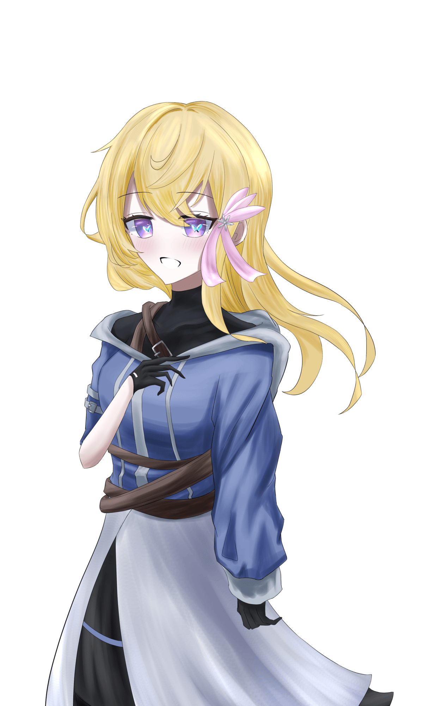

# HO1『理想と歌』　祕匿資訊

> 此檔僅供 {HO1} 玩家閱覽，未經 KP 許可不得分享給其他 PL。

## 公開 HO 本文

### HO1『理想と歌』

你是 {HO2} 這名 Vtuber 的 Avatar。

與 {HO3} 組成團體（Unit），以偶像身分活動中。

〈藝術：歌唱〉90 固定

　你，是她的理想。

## 祕匿內容

### 【你是被混合而成的存在】

你，是作為 {HO2} 這名 Vtuber 的 Avatar 而誕生的。你的體內寄宿著獨有的人格。

不知不覺間，另一個與之相異的人格誕生了。理由不明。

然後，混合了。就這麼混合在一起了。兩個人格相互摻混，又構築出了嶄新的人格。那就是你。

你知道 {HO2} 正在受苦。因為那就是你自己。然而不知為何，記憶就像蒙上了一層霧靄，你想不起那究竟是什麼。只是想拯救。想被拯救。你一直這麼想著。

是這份念想傳達到了，抑或純屬偶然，你不得而知——總之這個世界……虛擬空間誕生了。自那之後，為了尋找拯救 {HO2} 的手段，你便在這個虛擬空間裡自由地四處走動。……而且，並非只有你一個。有許許多多的 Avatar 都身處這個虛擬空間之中。

你擅長歌唱。這是 {HO2} 的才能與努力的結晶。你就以這副歌喉，作為偶像進行活動。

在這個虛擬空間裡，也有與你變得要好的人。那就是「斑鳩 米莉亞」。當初只是碰巧在這個空間裡和她撞在一起而已——

> 「好痛痛……對、對不起！……欸，等等，你是那個很有名的……？我沒看前面……你沒事吧！？我、我請你吃頓飯當作賠罪……！」

之後在一次又一次的交談之中，你們變得要好了。你們 Avatar 雖然不需要進食，但由於味覺是存在的，此後也偶爾把吃飯當成一種娛樂而一同前往。至少，你是信任她的。

除此之外還有 {HO3}。畢竟至今一直都作為同一個團體（Unit）共同活動，在這個世界裡應該算是最值得信任的存在了吧………然而，有一件事你始終感到疑惑。你總是、總是能從 {HO3} 身上感覺到某種違和感。這究竟是為什麼呢。

另外，不知是否為某種錯誤（Error），你偶爾會喪失記憶。這相當嚴重，尤其常常喪失與 {HO2} 有關的記憶。

## NPC 情報

### 「斑鳩 米莉亞」（イカルガ ミリア）　女性

個性開朗又正向，常常一句「你聽我說嘛——！」就跑來向你倒苦水或講些自誇的話。她似乎是你的粉絲，很黏你。聽說她除了你以外沒有別的朋友。

你自己在這個世界裡與她往來的時間也算特別長的一方，因此應該不太會覺得不快。

## 能力值補正

- 你擅長歌唱。
  〈藝術：歌唱〉90 固定
- 你擁有非常美麗的容貌與領袖魅力。
  APP 以 16＋1D3 算出。

## 簡易年表

- **2 年前**：人格混合、虛擬空間誕生
- **1 年半前**：與「斑鳩 米莉亞」相遇‧在這個世界與 {HO3} 相會

## HO1・HO3 共通情報

你們分別是 {HO2}、{HO4} 的 Avatar，平時都在虛擬空間中生活。

### 虛擬空間「Metaverse Clearize」

突如其來出現的空間

你們平時生活的場所。這裡存在著各式各樣的娛樂，會感到困擾的事情反而比較少吧。

這個空間非常廣闊，擁有與日本全國國土相當的面積，除了你們之外，也有非常多的 Avatar 在此度日。

這裡也存在貨幣之類的東西，可以把它想成與現實世界相似的世界。要說不同之處，就是不會感到飢餓，以及能夠從特定場所傳送（Teleport）到另一個場所。

你們在這個世界裡一邊舉辦 Live（演唱會），一邊過著日常生活。

由於你們一直是作為 Avatar 在活動，因此各自保有 {HO2}、{HO4} 利用你們進行活動時的一部分記憶。也因此，你們彼此都認知到對方是親近的存在。

## 探索者製作規則

- 能力值、技能值除了指定者以外，皆照通常方式算出。

### HO1.HO3 共通製作規則

- 職業設定為「Virtual avatar」。職業技能不指定。
- 由於是 Avatar，外貌不必是人類（吸血鬼或獸人等等。但由於劇本以人型為前提，因此不推薦二頭身吉祥物之類的造型）。
</content>
</invoke>
