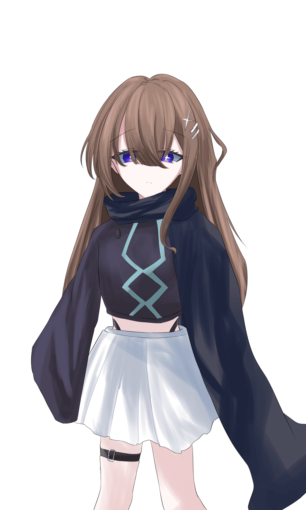

# HO3『希望に舞』　祕匿資訊

> 此檔僅供 {HO3} 玩家閱覽，未經 KP 許可不得分享給其他 PL。

## 公開 HO 本文

### HO3『希望に舞』

你是 {HO4} 這位 Vtuber 的 Avatar。

與 {HO1} 組成團體（Unit），以偶像的身分活動著。

〈藝術：舞蹈〉90 固定

　你，曾是她的希望。

## 祕匿內容

### 【你是雙重人格中獨立出的存在】

你是作為 {HO4} 這位 Vtuber 的 Avatar 而誕生的。

你知道 {HO4} 是雙重人格。也知道那另一半就是自己。

而且知道自己是宿於 Avatar 之上的。雖然不明白為何會宿於其上。

宿於 {HO4} 之中時，你們是一邊輪替意識一邊生活的。（以下以「表」、「裏」來表現）

你在表的時候，走過的是毫無任何不自由的幸福人生。在裏的時候因為沒有意識所以不曉得。那是像在睡覺一樣的感覺。輪到表並沒有什麼週期，而是突然就換過去。有沒有什麼條件你也不清楚。你不曾與 {HO4} 對話過。不，是辦不到。理由不明。你曾試圖留下記錄或筆記，但會發生劇烈的噁心感與鬼壓床，因而做不到。試了幾次都一樣。想要告訴某個人的時候也是同樣的情況。

{HO4} 正在痛苦著，這件事你是知道的。至於為何痛苦，就像記憶蒙上了一層靄一般，並沒有留在你的記憶裡。

你記得自己宿於 {HO4} 之中時，有一個很重要的人。至於那是誰則不記得了。不過，除此之外還有一個強烈留在記憶中的人物。

那就是「夜鷹 琴音」。是自幼時起的友人，只要你有什麼煩惱，她總會一句怨言也不說地聽你講到最後，是個心地善良的人物。

然而，某一天為界，她就音信不通了。

現在。你在這個虛擬空間裡生活著。{HO1} 似乎也在。畢竟至今一直作為團體（Unit）一同活動過來，在這個世界裡應該是最能夠信任的存在了吧………然而，有件事你一直感到疑惑。你一直、一直都從 {HO1} 身上感覺到某種違和感。這是為什麼呢。

你擅長舞蹈。這是 {HO4} 的才能、努力的結晶。你以這身舞術作為偶像活動著。

你對這個世界有所不滿。那就是存在本身。明明是在 {HO4} 之中生活的，卻突然被扔進了這種莫名其妙的世界。你祈求道。「這種世界，乾脆壞掉算了」

## NPC 情報

「夜鷹 琴音」（ヨタカ コトネ）　當時 12 歲　女性

當時的同班同學。是個溫柔、文靜且帶著神祕氛圍的人物。對你以外的人物幾乎不表現出興趣，一直凝望著你。

說得難聽點是個令人毛骨悚然的人物。她展露的笑容雖然很美好，但總覺得背後有什麼隱情。說不定，你其實是不太擅長應付她的。

以某一天為界就音信不通了。那一天，是個什麼樣的日子呢。

## 能力值補正

- 你擅長舞蹈。

  〈藝術：舞蹈〉90 固定

- 你擁有非常美麗的容貌與領袖魅力。

  APP 以 16＋1D3 算出。

## 簡易年表

- **7 年前**：與「夜鷹 琴音」音信不通
- **1 年半前**：人格分離並宿於 Avatar，來到虛擬空間‧在這個世界與 {HO1} 相遇

## HO1・HO3 共通情報

你們分別是 {HO2}、{HO4} 的 Avatar，平時在虛擬空間中生活。

### 虛擬空間「Metaverse Clearize」

突然出現的空間

你們平時生活的場所。存在著各式各樣的娛樂，會感到困擾的時候反而比較少吧。

該空間非常遼闊，誇稱擁有與日本全土相同程度的面積，除了你們之外也有非常多的 Avatar 在此度日。

貨幣之類的也存在，可以把它想成是與現實世界相似的世界。要說不同之處的話，例如不會感到空腹，或是能夠從特定的場所傳送到另一個場所。

你們在這個世界裡一邊舉辦 Live 一邊度過日常。

由於你們是作為 Avatar 行動的，因此各自持有 {HO2}、{HO4} 利用你們活動時的一部分記憶。也因此，彼此都抱持著對方是親近之存在的認知。

## 探索者製作規則

- 能力值、技能值除了指定者以外，均照通常方式算出。

### HO1.HO3 共通製作規則

- 職業設定為「Virtual avatar」。職業技能不指定
- 由於是 Avatar，外貌不需要是人類（吸血鬼或獸人等。但劇本以人型為前提，因此二頭身吉祥物之類的不推薦）
