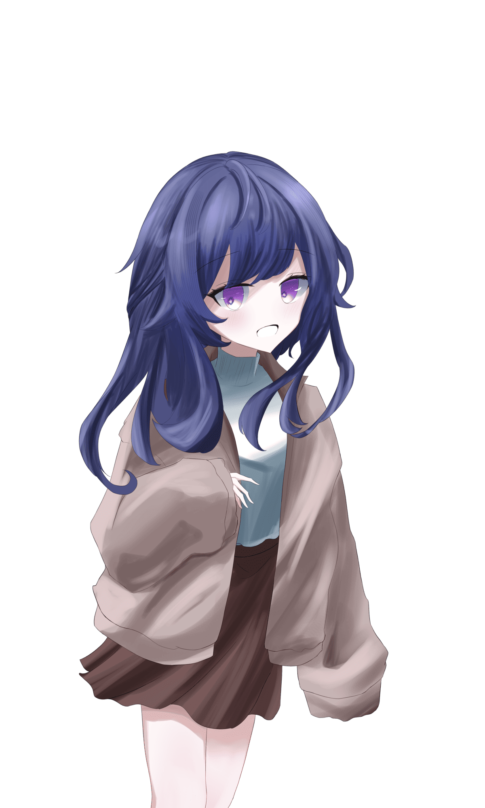

# HO4『絶望へ踊』　祕匿資訊

> 此檔僅供 {HO4} 玩家閱覽，未經 KP 許可不得分享給其他 PL。

## 公開 HO 本文

### HO4『絶望へ踊』

你是 {HO3} 的中之人。
與 {HO2} 組成團體（Unit），以 Vtuber 身分活動。
〈藝術：舞蹈〉90 固定

　你，對她絕望了。

## 祕匿內容

### 【你的記憶有一部分缺損】

你是以 Vtuber 身分活動的人類。

你的記憶有一部分缺損。那是一種不定期地、彷彿在黑暗之中沉睡般的感覺。等到睜開眼時，已經過了數小時，有時甚至已經過了數天。也曾發生過所在地點已經移動了的情況。

在你清醒的這段期間，你幾乎不曾覺得自己是幸福的。不幸以非常高的頻率襲向自己。

「我身上到底發生了什麼事？」

你這樣想過多少次了呢。無論過了多久，答案都找不到。

你有家人。雙親在你年幼時因事故過世。你和留下來的妹妹「雲雀」兩人一起生活。該說是幸運嗎，靠著雙親的遺產雖然無法過得奢侈，但至少能維持最低限度的生活。

你得知了妹妹經常在看的「Vtuber」這種存在，出於好奇心也開始當起 Vtuber。

之後你也順利地持續活動，成為了小有名氣的直播主。

某天，你向身為朋友的 {HO2} 邀約：「要不要當 Vtuber？」

{HO2} 平時看起來很忙，卻也說要成為 Vtuber。之後兩人也一同舉辦 Live 等活動，成了有名的直播主。

雖然過著充實的每一天，記憶卻還是會斷片。活動上也出現了一定程度的妨礙，你被焦躁感驅使著。你對這個現象感到厭煩。彷彿自己已不是自己，難道要一直這樣下去嗎——

於是，你渴望了。渴望平穩。渴望普通。渴望一如往常地度日。

……某一天。你被告知有事要辦而前往事務所，從那裡回家的時候，歸途上出現了雲雀。你正想出聲叫她而靠了過去，就在那一刻。映入視野的雲雀，胸口被刀刃貫穿了。你失去了聲音。唯一的家人在眼前死去了。

「目標討伐完成。我會把她帶回組織，之後的對應就拜託了。」

你聽見了這樣的聲音。你動彈不得。在那個人物離去之後你在附近搜尋，但哪裡都不見雲雀的身影。

在那之後無論等了多久，雲雀都不曾回來。

你無法忘記那幅光景，也不曾告訴任何人。

而且，以雲雀被殺的那天為界，記憶斷片的現象再也沒有發生過。

## NPC 情報

**「雲雀」（ヒバリ）　當時 16 歲　女性**

探索者的妹妹。姓氏為配合探索者，可自由設定。

性格開朗，帶有些許宅氣質。只有偶爾才會出門，是徹頭徹尾的室內派。從小就仰慕著你，經常黏上來，簡直像在說「多陪陪我嘛」。喜歡 Vtuber，在你成為 Vtuber 時興奮得大鬧了一場。

不過，在被殺害的不久之前，她似乎經常在傍晚～深夜這段時間外出，問她在做什麼她也不肯回答。

## 能力值補正

- 你擅長跳舞。
  - 〈藝術：舞蹈〉90 固定
- 你手很巧。
  - DEX ＋3。上限是 18

## 簡易年表

- 3 年半前：成為 Vtuber
- 3 年前：邀請 {HO2} 要不要當 Vtuber
- 1 年半前：雲雀被殺害‧記憶不再斷片
- 1 年前：加入事務所

## HO2・HO4 共通情報

你們分別是 {HO1}、{HO3} 的中之人，過著一如往常的生活。

你們從高中時代起就有往來，是能稱為摯友的關係，彼此都能夠信賴。

{HO4} 邀請 {HO2} 要不要當 Vtuber，兩人一起展開活動。之後受到「雨燕」的招攬，加入了該事務所。目前仍持續以相同的名義活動。

最近，有某個事件成為了話題。

那就是人突然消失的事件。數量雖然不多，但由於消失的是相當有名的人物，似乎因而蔚為話題。詳細情形你們也不清楚。

簡直就像，神隱一般。

現在你們是隸屬於東京都某所大學的大學一年級生。

## 探索者製作規則

- 能力值、技能值除了指定者以外，一律照通常方式算出。

### HO2.HO4 共通製作規則

- 將職業設定為「Vtuber」。職業技能不指定
- 年齡固定為 19 歲
