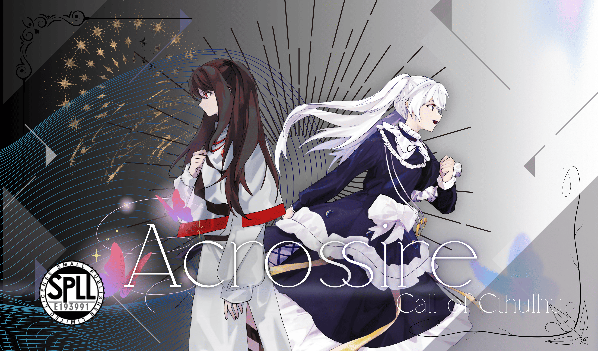
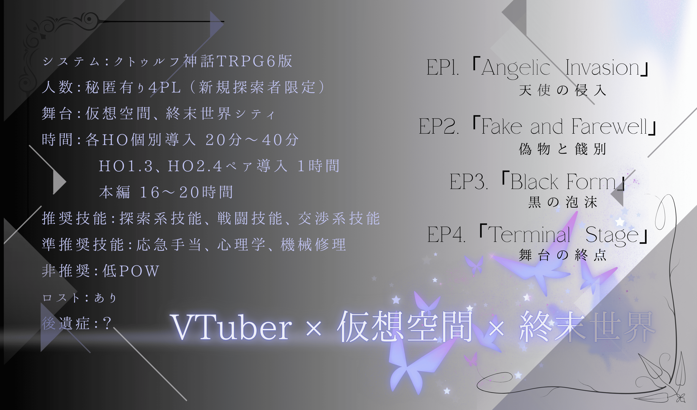
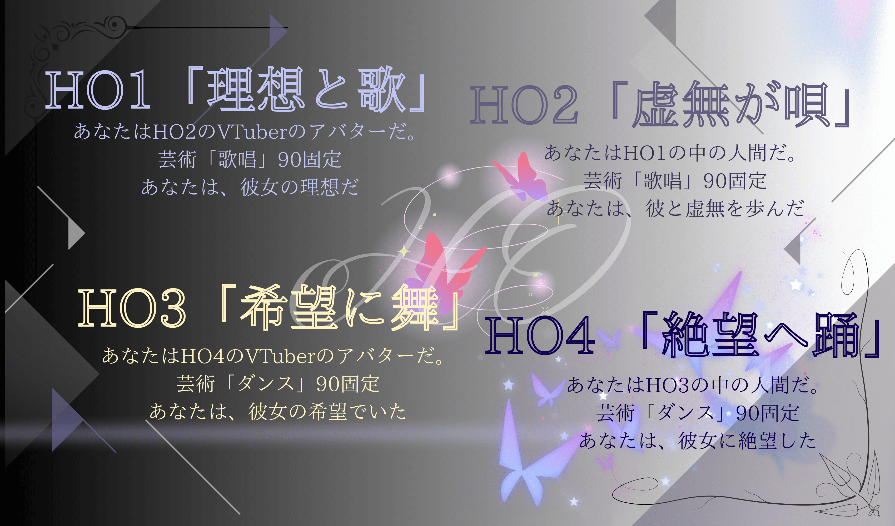
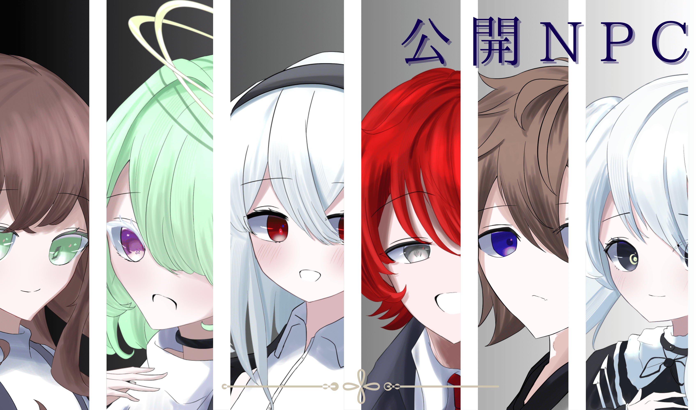
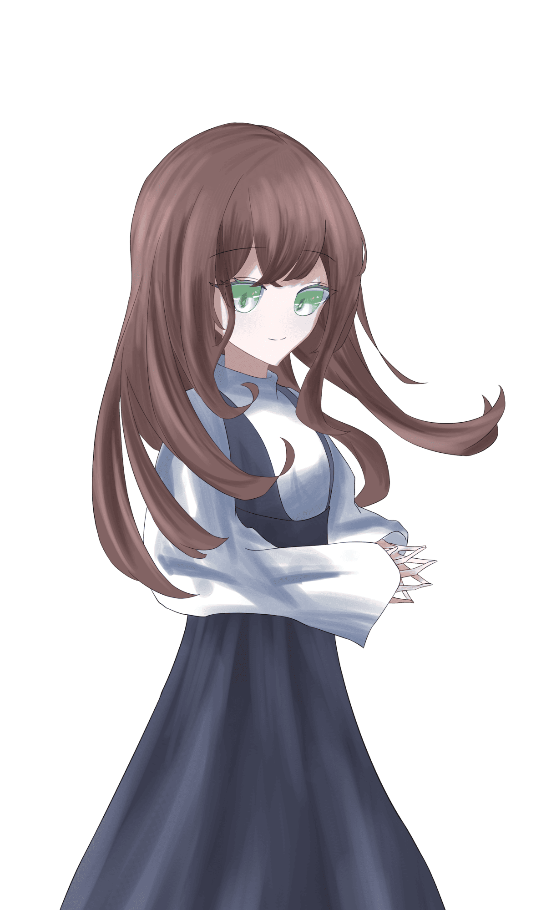
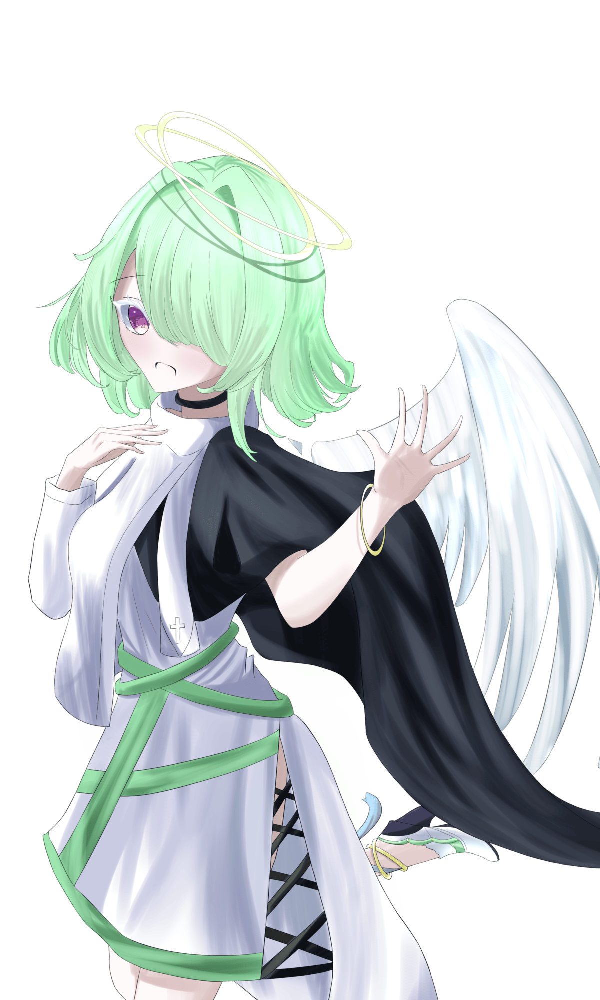
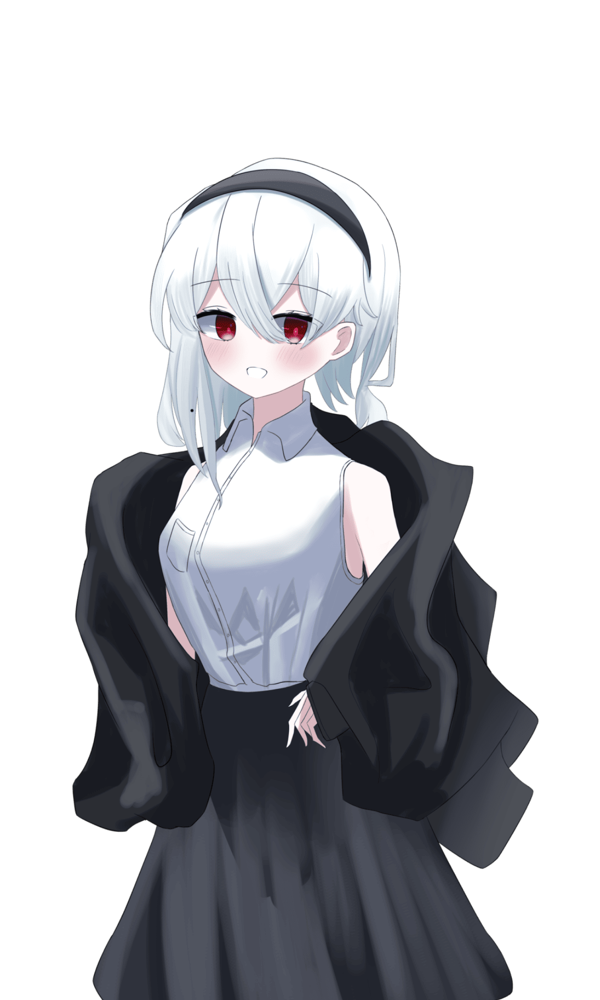
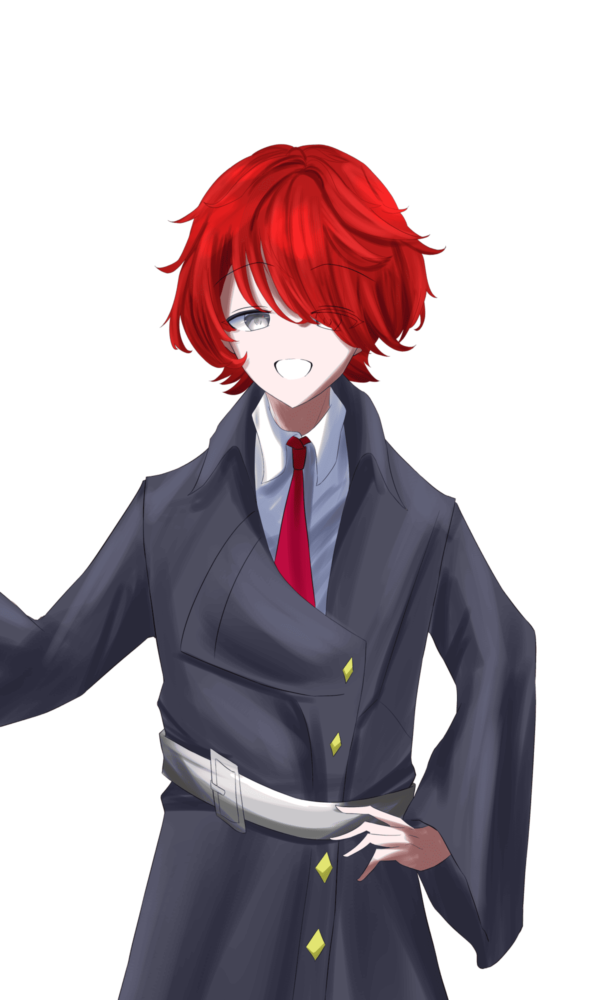
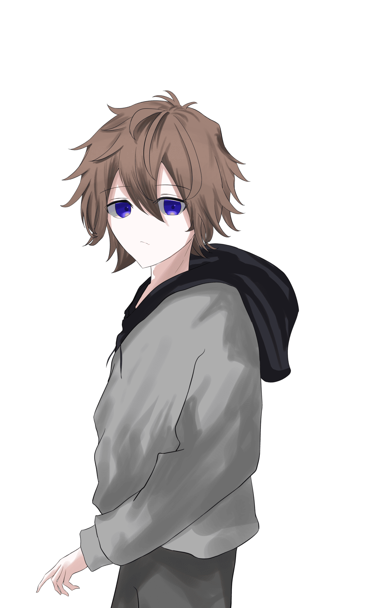
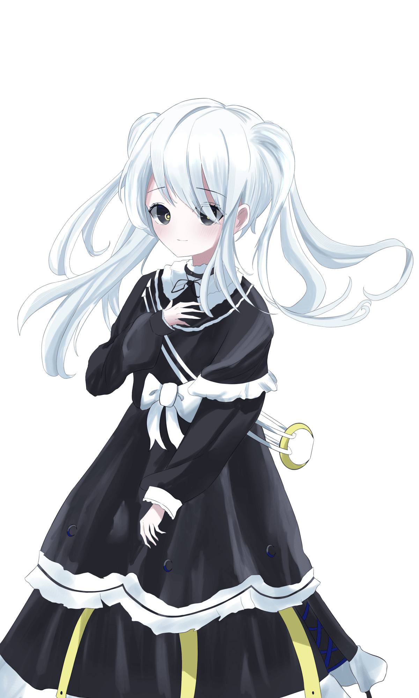

# 《Acrossire》公開資訊

克蘇魯神話 TRPG 第 6 版對應
Potluck Party 2025 參加作品
【 Acrossire 】
SPLL:193991
＿＿平行線傾斜了
題材：Vtuber、虛擬空間、終末世界

---

## 概要

- **使用補充**：基本規則書、《怪物之槌》
- **系統**：CoC 第 6 版
- **人數**：含祕匿 4PL（限新建探索者）
- **時間**：各 HO 個別導入約 20 分〜40 分
  - {HO1}、{HO3} 與 {HO2}、{HO4} 的配對導入各約 1 小時
  - 1 章：約 5 小時　2 章：約 4 小時　3 章：約 4 小時　4 章：約 3 小時
  - 合計　KP 約 20 小時　PL 約 18 小時
- **失格**：有
- **後遺症**：？
- **推薦技能**：探索技能、戰鬥技能、交涉系技能
- **準推薦技能**：〈急救〉、〈心理學〉、〈機械維修〉
- **非推薦**：低 POW

## 劇本含有要素

PvP 的可能性、對魔術‧神話生物‧神話性事象的獨自解釋、探索者年齡的指定、中途失格的可能性、原創 AF 的登場、呪文的改編、神話生物的改編、因骰子數量非常多而產生的運氣要素、設定得相當多的戰鬥、各 HO 之間失格率的差異

本劇本是一部在化為終末世界的虛擬空間中，Vtuber 的內與側邂逅的劇本。由於是終末世界，因此並不是各位所想像的那種會大量舉辦 Live、大量進行直播的劇本。

基本上劇本是以戰鬥、與 NPC 或探索者的 RP、以及探索來推進。由於登場的 NPC 眾多，對於不喜歡 RP 或不喜歡與 NPC 大量交流的人而言，恐怕是不太適合的劇本。

## Chapter

- 第 1 章　天使的侵入「Angelic Invasion」
- 第 2 章　贗品與餞別「Fake and Farewell」
- 第 3 章　黑之泡沫「Black Foam」
- 第 4 章　舞台的終點「Terminal Stage」

## 公開 HO

### HO1『理想と歌』

你是 {HO2} 這名 Vtuber 的 Avatar。
與 {HO3} 組成團體，以偶像的身分活動中。

〈藝術：歌唱〉90 固定

> 你，是她的理想。

### HO2『虚無が唄』

你是 {HO1} 的中之人。
與 {HO4} 組成團體，以 Vtuber 的身分活動中。

〈藝術：歌唱〉90 固定

> 你，與他一同走過虛無。

### HO3『希望に舞』

你是 {HO4} 這名 Vtuber 的 Avatar。
與 {HO1} 組成團體，以偶像的身分活動中。

〈藝術：舞蹈〉90 固定

> 你，曾是她的希望。

### HO4『絶望へ踊』

你是 {HO3} 的中之人。
與 {HO2} 組成團體，以 Vtuber 的身分活動中。

〈藝術：舞蹈〉90 固定

> 你，對她絕望了。

## 共通 HO

你們是隸屬於 Vtuber 事務所「雨燕」的 Vtuber/Avatar。
加入至今已經過了 1 年。因此，差不多要舉辦的 1 週年 Live 已近在眼前。

## 探索者製作規則

- 能力值、技能值除了指定者以外，一律照通常方式算出。

### {HO1}‧{HO3} 共通製作規則

- 職業設定為「Virtual avatar」。職業技能不指定。
- 因為是 Avatar，外貌不需要是人類（吸血鬼或獸人等等。但由於劇本是以人型為前提，因此像二頭身吉祥物那樣的外貌非推薦）。

### {HO2}‧{HO4} 共通製作規則

- 職業設定為「Vtuber」。職業技能不指定。
- 年齡固定為 19 歲。

## 劇情概要（あらすじ）

睜開眼睛，那裡是化為荒廢終末世界的虛擬空間。
在眼前的，是身為 Avatar／人類的自己。
身為中之人的你，與身為 Avatar 的你，如今邂逅。

## 事前情報

- 在劇本開始之前，{HO2}、{HO4} 都在現實世界正常地生活著。上大學，偶爾進行直播，過著充實的每一天吧。
- 因此他們並未認知到虛擬空間的存在。對於 {HO1}、{HO3} 也沒有面識。

> ※譯註：第一項原文寫作「HO2、HO3」，惟 {HO3} 為 Avatar 側、並不居於現實世界，且依第二項語意，此處應為 {HO4}。研判係原作誤植，已逕行修正為 {HO4}。

## 全 HO 共通情報

### Vtuber 事務所「雨燕」

你們所隸屬的事務所。1 年前因為被星探發掘為契機而加入。

以前並不是那麼大的事務所，但在加入前就已經相當有名的你們加入之後，它成為了在世上的 Vtuber 事務所之中也頗有名氣的存在。

事務所裡有著兩位數人數的 Liver（直播主），但與你們特別有面識的 Liver 只有 2 人。

詳細情報請參照「公開 NPC」。

## 公開 NPC

### 「鳳 侑芽」（オオトリ　ユメ）　22 歲 女性

隸屬於「雨燕」的大學 4 年級 Liver（直播主）。是與你們特別有面識的其中一人。

在這間事務所裡是最古參的人物，隨和開朗的性格使她受到形形色色的人愛戴。

與 {HO2}、{HO4} 的交情好到會一起去吃飯的程度。

正被畢業論文追著跑。

### 「鶲 翠」（ヒタキ　ミドリ）　女性

「鳳 侑芽」的 Avatar。

有著以頭頂光環為特徵、生有雙翼的天使外貌。

也曾與你們聯動過好幾次。有過幾次在直播中睡著的經驗。

### 「鴻 愛海」（ウカリ　アミ）　19 歲 女性

隸屬於「雨燕」的大學 1 年級 Liver（直播主）。與 {HO2}、{HO4} 是同期。

根本就是「the‧元氣少女」，是氣氛製造者般的存在。對誰都一視同仁地相處，因此經常被人所倚賴。

同時也是骨子裡的遊戲玩家，在 FPS 遊戲中甚至能打進全國前 8 強，是個實力堅強的高手。

書也會念。家事也做得來。

### 「星鴉 赫」（ホシガラス　アカ）　男性

「鴻 愛海」的 Avatar。

身披黑色大衣、給人冷酷印象的大哥哥。身高很高。

憑藉壓倒性的社交力與談話能力，某 SNS 的追蹤者已超過 40 萬人。

### 「早苗鳥 裕也」（サナエドリ　ユウヤ）　男性　27 歲

在「雨燕」負責清潔工作的職員。

是你們的大粉絲，過去曾向你們要過簽名。個性總是嘻嘻哈哈的，但偶爾展露的認真神情，卻有種讓人不由得被吸引進去的感覺。除此之外並沒有特別的關係。

### 「Noir」　女性　？？歲

身穿黑色連身裙的白髮少女。
