# 《To Change》— 故事集（Stories）

> 從 [《To Change》主規則書](to_change_zh-TW.md) 拆出的 **18 個現成故事**。
> 開團前請先參閱主規則書中的「角色建立」「行動占卜」「故事動作」「跨性別蛻化」等基礎章節。
> 各故事心靈等級（Mental Tier）已標於該故事起首；Tier 4 / 5 屬於蛻化最劇烈的等級，請務必先確認玩家的安全工具設定。

---

## 目次（Stories Index）

- [Becoming Bigfoot（化作大腳怪）](#故事becoming-bigfoot化作大腳怪)
- [Big Top Energy（壓軸登場）](#故事big-top-energy壓軸登場)
- [Candied Blood（糖漬之血）](#故事candied-blood糖漬之血)
- [Dragon's Fire（龍之炎）](#故事dragons-fire龍之炎)
- [Galactic North（銀河之北）](#故事galactic-north銀河之北)
- [Hair of the Dog（解醉之毛）](#故事hair-of-the-dog解醉之毛)
- [I Woke Up in Another World …!?（我和朋友穿越異世界，殿下！？）](#故事i-woke-up-in-another-world-with-my-friends-and-now-everyones-calling-us-her-royal-highness我和朋友穿越異世界結果大家都在叫我們殿下)
- [Maastrichtian Dynasty（馬斯垂克王朝）](#故事maastrichtian-dynasty馬斯垂克王朝)
- [No Better Team（沒有更好的搭檔）](#故事no-better-team沒有更好的搭檔)
- [Our Lady（聖母）](#故事our-lady聖母)
- [She Who Divided the Sexes（劃分兩性者）](#故事she-who-divided-the-sexes劃分兩性者)
- [Six Gossamer Rings（六輪薄紗）](#故事six-gossamer-rings六輪薄紗)
- [The Estivating Subsumption（夏眠的吞併）](#故事the-estivating-subsumption夏眠的吞併)
- [The Wanting Tide（渴望之潮）](#故事the-wanting-tide渴望之潮)
- [To the Swiftest（致最迅捷者）](#故事to-the-swiftest致最迅捷者)
- [Watching the Loch（守湖人）](#故事watching-the-loch守湖人)
- [Weed for the Aspiring Woof（致欲為汪汪者的草）](#故事weed-for-the-aspiring-woof致欲為汪汪者的草)
- [Whence All Monsters Come（萬獸所自來之處）](#故事whence-all-monsters-come萬獸所自來之處)

---

## 故事：Becoming Bigfoot（化作大腳怪）

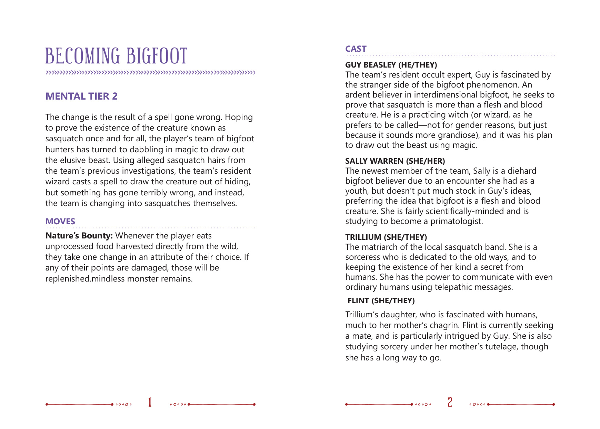

> **心靈等級 2**

這場蛻化來自一道**走偏的法術**。為了一勞永逸地證明俗稱「**大腳怪（sasquatch）**」的生物確實存在，玩家所屬的大腳怪獵人團隊轉而涉足魔法、想把這隻難以捉摸的猛獸引出來。團裡的駐團巫師（wizard）以前幾次調查中蒐集到的「大腳怪毛髮」為材料施法，企圖將其從藏匿處召出——可惜事情大條，團隊本身反而開始**轉化為大腳怪**。

### 動作（MOVES）

**自然的恩賜（Nature's Bounty）**：每當玩家**直接從野外攝取未經加工的食物**時，他在自選的任意屬性上承受 1 點蛻化。若該屬性有任何點數受傷，那些傷害將被回復。

---

### 登場角色（CAST）

#### Guy Beasley（he/they）
團隊的駐團神祕學專家。Guy 對大腳怪現象中較奇詭的一面深感著迷，是「跨次元大腳怪」的死忠信徒，立志證明大腳怪不只是有血有肉的生物。他是一名執業女巫（或者如他自稱的「巫師」——並非性別上的考量，純粹是他覺得「巫師」聽起來氣派一點）。以魔法把這頭巨獸引出來，便是他的計畫。

#### Sally Warren（she/her）
團隊最新成員。年少時的一次目擊讓她成為一名死硬派大腳怪信徒，但她對 Guy 的點子並不買單——更傾向「大腳怪是有血有肉的生物」這套說法。她相當講究科學，正在攻讀靈長類學。

#### Trillium（she/they）
當地大腳怪族群的女族長。她是一名遵循古道的巫師，致力把同族的存在對人類保密。她有能力以**心電感應**與普通人類傳達訊息。

#### Flint（she/they）
Trillium 的女兒，對人類深感好奇——這令她母親頗為不悅。Flint 目前正在尋找伴侶，對 Guy 特別感興趣。她也在母親的指導下學習巫術，但離學成還有很長一段路。

#### Poppy（he/they）
Trillium 的兒子，同樣在尋找伴侶；不過他對人類抱持戒心。儘管如此，他仍過於易於信任、也容易上當。

#### 氨菊石谷大腳怪獵人（Ammonite Valley Squatchers）：Dot Neeling（she/her）與 Rich Dexter（he/him）
另一支大腳怪獵人團隊。在某些人眼中是專家研究者；但即便在大腳怪圈內，也有人覺得他們不過是為錢而來、操作騙術的詐欺者。他們剛好正在玩家所在的同一片地區進行「調查」——其實是在拍一部電視台用的偽紀錄片。

---

### 引子（INTRO）

玩家是一名大腳怪獵人，為了最新一次的探險，前往美國中西部的 **Glabra 森林**。他與另外兩位團員 Guy 和 Sally 在現場會合。當玩家抵達時，Guy 攤開了他那套狂想計畫：用之前歷次調查所拾得的「大腳怪毛髮」當材料，施法把當地的大腳怪從藏匿處引出來。Sally 對這個荒謬計畫一臉煩躁，但 Guy 堅信這會是團隊歷來最成功的一次任務。

法術一施完，團隊在期待中守候——但隨著夜色漸深，看似什麼也不會發生。最終，他們不得不就寢過夜。

---

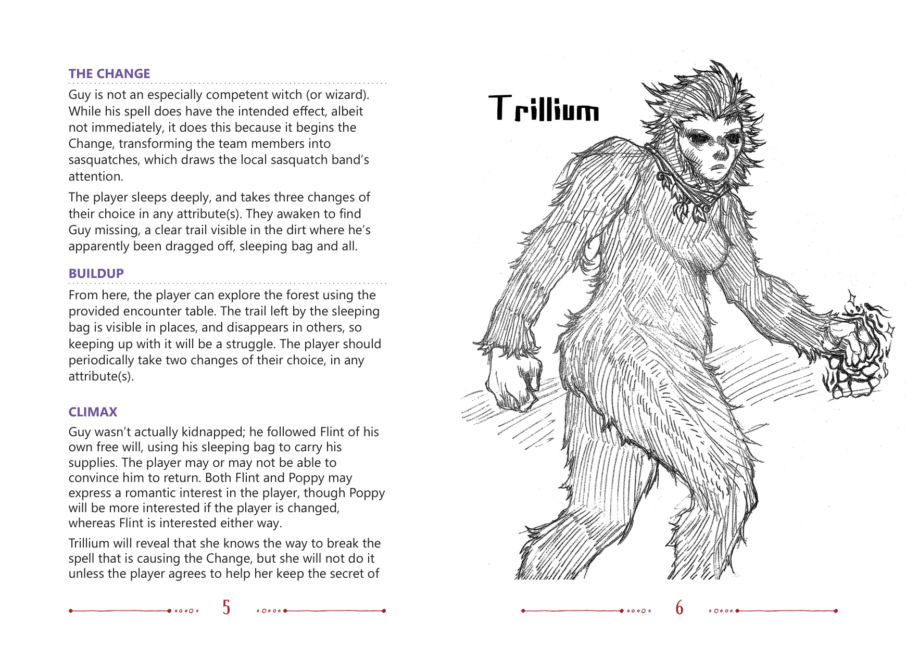

### 蛻化（THE CHANGE）

Guy 並不是一名特別稱職的女巫（或巫師）。他的法術確實**有效**——只是並非他預想的那種效果，且效果並非立即顯現：法術啟動了**蛻化**，把團隊成員轉化為大腳怪——而這正吸引了當地大腳怪族群的注意。

玩家睡得極沉，並在自選的任意屬性上承受 **3 點蛻化**。醒來時，他發現 Guy 不見了——地上一道清晰的拖痕，看起來他被連同睡袋一起拖走了。

---

### 鋪陳（BUILDUP）

從這裡起，玩家可利用下方的遭遇表探索森林。睡袋拖出的痕跡時隱時現——要跟上它將會很費勁。玩家應**周期性地**在自選的任意屬性上承受 **2 點蛻化**。

---

### 高潮（CLIMAX）

Guy 其實並未被綁架——他是出於自願跟著 Flint 走，把睡袋當作行李袋裝補給。玩家未必能說服他回來。Flint 與 Poppy 都可能對玩家表現出**愛慕之意**——不過 Poppy 比較偏好「已經被改變」的玩家；Flint 則無論如何都有興趣。

Trillium 會透露——她知道破解這道引發蛻化之法術的方法，但**除非玩家答應協助她保守族群存在的祕密**，她不會出手。然而，**氨菊石谷大腳怪獵人**已成功錄到證據；要說服 Trillium 解除法術，那段證據必須被找出並銷毀——這可能引發與對手隊伍的正面衝突。

---

### 結局（ENDINGS）

如果玩家能成功爭取到 Trillium 的協助破除法術，且尚未抵達**永恆**，他便會回到正常狀態。否則，他可選擇**留在大腳怪族群中生活**，或試圖回歸人類世界。Trillium 對後者抱持反對態度。

---

### 備註（NOTES）

大腳怪的聲帶能發出人類語音，但他們大多並不諳人類語言。

### 森林遭遇表

| d21 | 遭遇 |
|---|---|
| 0–2 | 玩家來到一片泥濘地——拖痕在這裡格外明顯。除了睡袋拖痕，還有兩組大腳怪足跡。 |
| 3–5 | 玩家在遠處聽見大腳怪的吼叫聲。如果他回應，便在自選的任意屬性上承受 1 點蛻化。 |
| 6–8 | 玩家在遠處聽見木頭被敲在樹上的聲音。如果他模仿這個聲音，便在自選的任意屬性上承受 1 點蛻化。如果他試著循聲找到源頭，會找到一座由倒木搭成的奇怪結構——但敲擊者已不見蹤影。此處還有一條穿過森林的溪流，可在此釣魚。 |
| 9–10 | 玩家發現一具極為逼真、令人毛骨悚然的大腳怪雕像——是氨菊石谷大腳怪獵人某次造假拍攝後留下的道具。 |
| 11–13 | 玩家發現一片長滿新鮮莓果的區域，但有些不對勁。MA 檢定可發現一台隱藏式紅外線相機；若檢定成功，玩家會意識到那不是自己團隊使用的相機型號。 |
| 14–15 | 玩家闖入氨菊石谷大腳怪獵人的營地——眼下無人，因為那支團隊正在森林中拍攝畫面。 |
| 16–17 | 玩家遇到 Rich，他正穿著一身大猩猩裝在森林裡漫遊。 |
| 18–19 | 玩家遇到正在拍片中的氨菊石谷大腳怪獵人。 |
| 20–21 | 玩家碰上一座由氨菊石谷大腳怪獵人架設的大腳怪陷阱——Poppy 被困在裡頭。 |

---

### Becoming Bigfoot — 蛻化十字

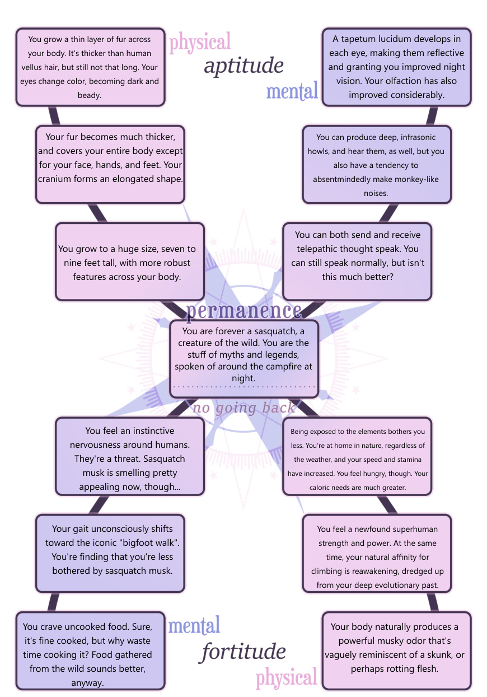

> **永恆（Permanence）**：你永遠成了一隻大腳怪——一頭荒野生物。你成了神話與傳說的素材，被人們在深夜的營火旁傳述。

**PA（physical aptitude）一側：**
- 你身上長出一層薄薄的毛——比人類的汗毛粗些，但仍不算長。你的眼睛變色，變得**深邃而黑亮**。
- 你的毛變得更厚、覆蓋全身——只剩臉、手與腳露在外。你的頭顱開始呈現**拉長的形狀**。
- 你長到極為龐大——身高七到九英尺，全身輪廓更為粗壯。

**MA（mental aptitude）一側：**
- 一層**反光膜（tapetum lucidum）**在你的眼底形成，讓眼睛具反光性，並提供更佳的夜視能力。你的嗅覺也大幅進步。
- 你能發出深沉的**次聲波吼叫**，並能聽見它；但你也會無意識地發出像猴子般的聲響。
- 你能**收發心電感應的「思語（thought speak）」**。你仍能正常說話——但這個方式不是更好嗎？

**PF（physical fortitude）一側：**
- 暴露在天候之下不再令你那麼困擾。無論天氣如何，你都在自然中如同在家——你的速度與耐力雙雙提升。但你開始覺得餓，熱量需求遠比從前大。
- 你感受到一股新生的**超人之力**，以及從演化深處被喚醒的、與生俱來的**攀爬本能**。
- 你的身體會自然散發出一股**強烈的麝香味**，隱約讓人聯想到臭鼬，或腐爛的肉。

**MF（mental fortitude）一側：**
- 你**渴望未經烹煮的食物**。煮過的也行，但何必浪費時間烹煮？況且，從野外採集的食物聽起來更棒。
- 你的步伐不知不覺間轉向標誌性的「**bigfoot 步**」。你也發現自己愈來愈不被大腳怪麝香味所困擾。
- 你對人類本能性地**緊張**——他們是威脅。不過大腳怪麝香的氣味，現在聞起來倒是相當迷人……

---

## 故事：Big Top Energy（壓軸登場）

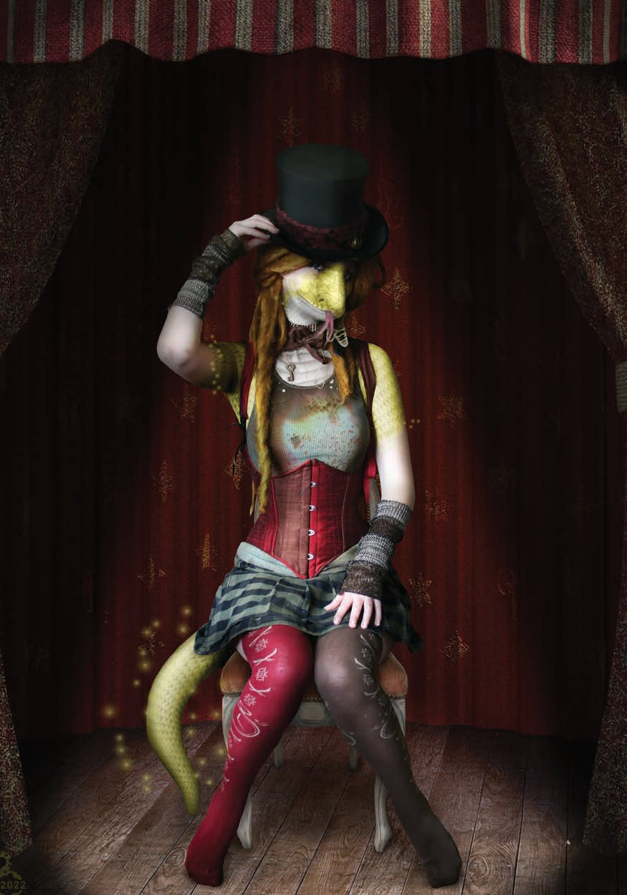

> **心靈等級 1**

這場蛻化源自<strong>魔術師之帽（Magician's hat）</strong>的祝福，並隨之帶來魅惑與神祕主義的天賦。當帽中魔法意外地不穩定起來，**Your-Final-Act** 演出當晚的觀眾們，便被那股力量擊中。這場蛻化既帶來神祕與困惑，也帶來歸屬感——一場以「不知道自己會變成什麼」為代價、換取「終於感受到真正自己」的交易。披上你魔術師人格（persona）的外殼，去體驗本應如此的魔法世界。

### 動作（MOVES）

**華麗蛻化（Fabulous Change）**：蛻化只在玩家**處於人格之中時**顯現。每當玩家承受一點蛻化，他會在**接下來一小時內、或直到他失敗一次屬性檢定**為止，切換進自己的人格。玩家在承受第一次蛻化之前，不能進入人格狀態。

**表演魔法（Performance Magic）**：當玩家處於人格之中時，他每點已蛻化的屬性點都會在該屬性的檢定上**多抽一張牌**。

---

### 登場角色（CAST）

#### Your-Final-Act（they/them）
**神祕馬戲團**首席魔術師——即便在馬戲團內部，他也是個謎樣存在。也許是第一個與表演者同行的魔術師、也許是「並非此世之物、會以自身為模板創造同類」的存在、也許還是別的什麼。但這些都不重要；他樂於享受每一場演出的喝采，並協助有才華者找到自己的位置。馬戲團是任何人都能做自己的地方——只要加上一點華麗與魔法，誰會在一群獨樹一幟的人之中格格不入呢？

> 「女士先生、男孩女孩、二元與非二元、以及一切落在區間之內或之外的諸位——現在，為您獻上：**Your-Final-Act**！」

#### Ivan「鐵臂」Armstrong（he/him）
**神祕馬戲團**的大力士，也是 Your-Final-Act 的嫉妒勁敵。Your-Final-Act 愈成為觀眾寵兒、把目光從傳統節目搶走，Ivan 就愈恨他。Ivan 知道 Your-Final-Act 力量的源頭來自那頂魔術師之帽，曾試圖破壞他的演出。雖然他無法把帽子摧毀，倒是成功地撕出一道小裂口——而那道小裂口已經足夠。如今他毀掉對方的計畫失敗、且更多魔術師接連冒出，他被逼上絕望的下下策。

> 「魔術師卻會魔法？這是作弊。像他們這種人，正在搶走我們這些有真本事的人的舞台。」

#### Annabella（she/her）
**神祕馬戲團**團長，也是 Your-Final-Act 多年來的女友。Annabella 以開放的方式經營馬戲團，總在尋找需要幫助、想加入演出的人。每個人都應該在世上有自己的位置——而 Annabella 認為，沒有比馬戲團更適合的地方了。馬戲團與其成員的一切，她都瞭若指掌。

> 「歡迎光臨神祕馬戲團——你能想像的一切，與更多的更多，都在前方等著——只要你敢承擔親眼目睹的代價。」

---

### 引子（INTRO）

玩家們正在參加一場由神祕馬戲團舉辦的地方嘉年華演出，前來體驗各式遊樂設施、闖關遊戲，並一睹各種演出。給他們時間玩遊戲、互動於各個攤位，甚至或許看一場表演。

當白晝轉入夜晚，他們看見其中一頂帳篷裡傳出一陣奇異的光芒。一團紫色、閃閃發亮的光爆把他們捲入其中——數小時後他們才醒來。Your-Final-Act 與 Annabella 已經在他們身邊守候了很久——馬戲團的所有人早已散去。

---

### 蛻化（THE CHANGE）

兩人向玩家說明：Your-Final-Act 的帽子被撕裂，釋出了帽中的魔法能量。玩家們正面承受了這股力量，因而獲得魔術師的能力，可以在馬戲團的華麗光輝中找到歸屬，做真正的自己。玩家會被要求協助馬戲團裡的雜事與差使，這需要透過屬性檢定。

期間，他們會被引導去**設想自己的「人格（persona）」**——一套服裝、一個舞台人格，完美貼合他們、映出他們真正的自我。在過程中，團隊或許會察覺 Ivan 對他們的態度怪異，並無端地特別憤怒。最終，玩家們會被要求在嘉年華至少待上幾天，學會如何駕馭自己的能力。在他們安全地學會把力量收進「人格」之中以前，永遠說不準這些力量會在何時冒出。

---

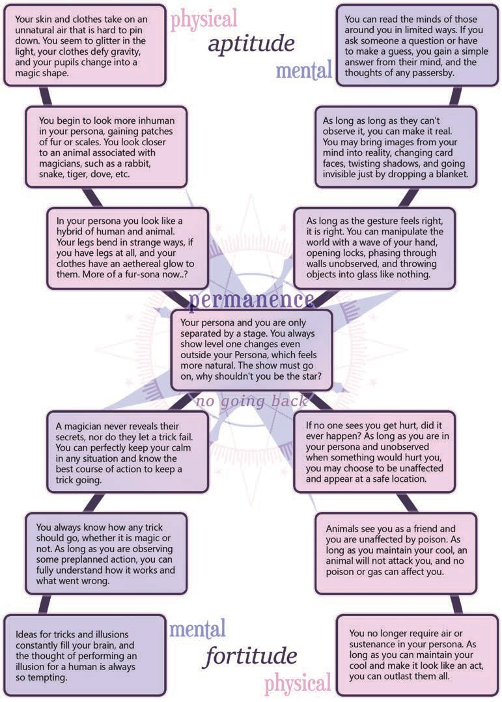

### 鋪陳（THE BUILDUP）

讓玩家有時間認識嘉年華的各個成員。Ivan 對魔法與 Your-Final-Act 顯然心懷不滿，但他多半獨來獨往、不會直接對玩家說什麼。對於**沒有處於人格之中**的玩家，Ivan 會表現得親切。如果節奏開始拖沓，可以自由製造人際戲劇、或加入額外的小事件（見本書表格 5）以維持推進。

某夜在嘉年華中，玩家們被遠處的尖叫與吵鬧聲吵醒。馬戲團的常駐人員看起來早已習慣這種事——它已是慣例，許多人甚至沒因這場吵鬧醒來。玩家或許會想去查探：以 PA 或 MA 的能力悄悄潛入該區域。Ivan 似乎正與 Annabella 為「傳統馬戲節目正在被腐化」一事爭吵，並對「魔法取代世俗才能」表現出明顯反感。

隔日，嘉年華要再舉辦一場演出，玩家被預定在演出中協助。Annabella 計畫以一場簡單的逃脫術開場，玩家在旁協助，而 Your-Final-Act 則在自己的拖車裡為演出做準備。一場直白的「水牢逃脫」——本來應該是輕鬆的——若不是 Ivan 把道具用的鎖具與束縛換成了**真貨**。

---

### 高潮（CLIMAX）

演出開始後，很快就能明顯看出這場節目出了狀況。Annabella 能安全地憋氣三分鐘——一分鐘後，玩家可進行 MA 檢定，意識到演出正在偏離計畫；兩分鐘後，已能明顯看出事情大條了。若玩家檢定失敗，他們無法確定那愈來愈劇烈的掙扎是表演的一部分還是出了事。

很可能至少有一位玩家擁有能幫助把 Annabella 從水箱救出的轉化能力。否則，他們就得另尋他法——例如解開鎖、把她拉出來、把玻璃打破。敘事者可以以時間給玩家施壓，例如**每個動作都要消耗遊戲內 15 秒**，或實際在現實中為玩家的解題能力計時。

當玩家成功救出 Annabella，Your-Final-Act 會在 Annabella 的堅持下，以團長身分接續當晚的表演。玩家陪 Annabella 回到她的帳篷休息——而他們在那裡遭到 Ivan 與他幾名嘍囉的攻擊。

攻擊者使用沉重的金屬棒與大型木槌，企圖傷害玩家與 Annabella。其他人都被演出與後台的維持工作分散了注意力，玩家只能或戰、或避——直到援軍到達。

> 高潮假定 Annabella 在這場暗殺中存活——但即使她死了，劇情仍可照常推進。在這種情況下，觀眾會被聚集後遣散，Your-Final-Act 與工作人員會留下調查那場失敗的準備。玩家會被送回各自的休息處等待魔術師找他們——而正是在那裡，他們將被攻擊。

---

### 結局（ENDINGS）

依牌局的走勢，Annabella 可能存活或死亡；Ivan 也可能殺人、或被某位玩家、或被 Your-Final-Act 殺死。玩家自此被視為已能完整掌控自身能力，並被允許自行做出選擇。若 Ivan 死、Annabella 活，她會為玩家擔保；若 Annabella 死，玩家可能得為自己的行動辯護。若 Ivan 在高潮中存活，他會被玩家揭發——Your-Final-Act 會在把他驅離之前清除他關於這個馬戲團的記憶。

抵達**永恆**的玩家，或許再也無法過所謂的尋常生活；但他們可被安排在嘉年華中得到一份工作，或被允許在世界裡走自己的路。**未抵達永恆**的玩家被認為已能足夠掌控自己的能力、可被信任重新走入人世——只要他們有幾週不再使用人格，就會回到人類。

---

> 若節奏鬆掉、玩家需要新的戲劇張力，可以使用以下提示加速推進：
>
> - Your-Final-Act 為了即將到來的演出，正卡在一個他想呈現的新魔術上做不出來。在一連串失敗之後，他陷入抑鬱與耗竭。在這狀態下他的魔法失控，撲克牌堆與愈長愈大、五彩繽紛的絲巾淹沒了他的房間。Annabella 忙得分身乏術，便交付玩家任務：去讓 Your-Final-Act 振作起來、走出耗竭。
> - Ivan 與一位木偶師為了玩家的事激烈爭吵，過程中各個節目人員間爆發了一場短暫的拳腳衝突。玩家可能想去勸架——或被捲入混亂之中，直到別人來收拾。
> - 一個小孩在天黑後偷溜進嘉年華，最後不慎放出了好幾隻動物。這個小孩被困在一個攤位裡，周圍全是危險的動物。安撫動物、把牠們送回獸欄、並把孩子安全救出——一切都得靠玩家。

---

## 故事：Candied Blood（糖漬之血）

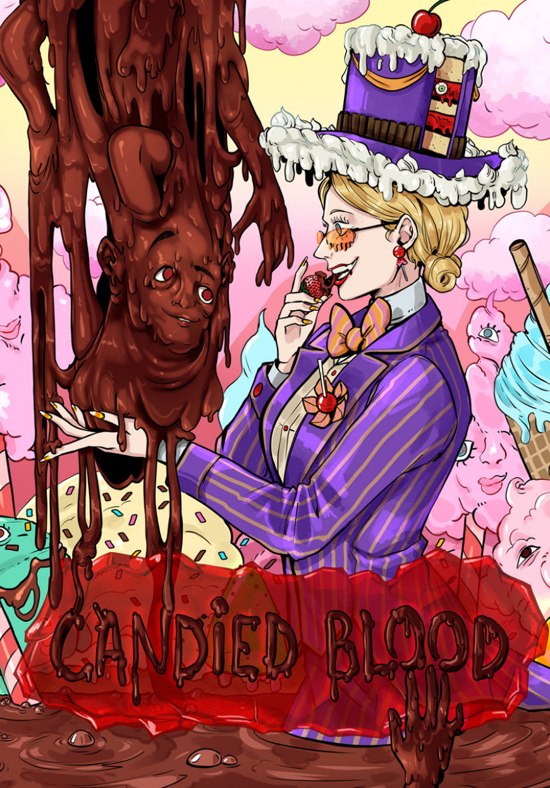

> **心靈等級 4**

二十年前，傳奇糖果商 **Billy Walder** 把整個 Walder 糖果帝國轉讓給了一名從巧克力棒中抽出**白金券**的窮孩子。十年前，那個孩子在一次倒楣的太空飛行中喪生。五年前，Walder 先生死於一場突如其來的「巧克力黏漿桶」事故。

昨天，一名自稱是 Walder 先生遺孀的女士 **Margaret Walder** 寄了一封信給你：「**到糖果工廠來**——領回你應得的遺產。」

今天，你站在那座被忽視、長滿荊棘的山丘上，俯瞰 Walder 先生的旗艦工廠。它的燈仍亮著，運貨卡車每天仍按時抵達，等著裝載新鮮的糖果。**這座工廠在沒有你的情況下也活著、吃著、呼吸著。**

而你呢？一個失敗的「家族傳人」、暗中下絆的二五仔、踩著別人往上爬的職場野心家。這一切從未為你帶來符合「Walder」這個名字的成功滋味——這是你最後的機會。

> Candied Blood 是用於 To Change 系統的「Transversion」變體故事，需要一名玩家擔任**敘事者**（同時扮演旁白、糖果工廠本身、與 Margaret Walder），其餘 2–4 名玩家扮演 Walder 家的**繼承者**——遠房表親、姑嬸叔伯、堂表姪子姪女。
>
> 為角色決定姓名與其與 Billy 的親屬關係，並寫下他們**渴望奪取糖果工廠的理由**，以及一項**阻礙他們建立健康關係的人格缺陷**（或使用本故事附表隨機決定）。
>
> 繼承者**應該是糟糕、可鄙的人**。但走過糖果工廠的旅程，可能讓他們學會卸下有害行為——或反而強化最壞的傾向。無論如何，工廠都會**改變他們**——當然，把他們變成糖。

### 動作（MOVES）

**生理趨向糖果場（Physiotrophic Candy Field）**：踏進工廠後，繼承者會因「生理趨向糖果場」對其飢餓的反應開始蛻化。每當一名玩家**屈服（succumbs）**時，糖果場會向外炸裂，並在工廠中其他**每一位**繼承者身上各觸發一次蛻化——觸發者可選擇其他人在哪一項屬性上蛻化。

所有**心靈屬性**的蛻化內容無論在哪一層都相同；但**肉體屬性**的蛻化則隨樓層不同而異。

**飢餓（Hunger）**：每當玩家進入新一層時，獲得 1 點飢餓。每點飢餓使所有抽牌**多抽 1 張**；當飢餓**超過 2 點**之後，每多 1 點飢餓便造成 4 點傷害。

吃下糖果可移除 1 點飢餓，並在自選屬性上承受 1 點蛻化。**工廠中幾乎所有的危險，都可以靠把它吃下肚來解決。**

**MA 蛻化：**
- **MA1**：你能感知原本不可見的生理趨向糖果場——它感覺像一團從一切甜物上散出的軟綿綿粉色氣場，並在任何人發生蛻化時迅速膨脹。
- **MA2**：你能操控糖果場——把它聚到某人身上，或從某人身上排開——以強化或延後其效果。
- **MA3**：你能**看見**糖果場，並更熟練地處置它。透過一次成功的 MA 檢定，你可以無視當前樓層由糖果場所給予的全部蛻化。

**MF 蛻化：**
- **MF1**：你想吃糖果。**吃糖果可治療 1 點心靈屬性傷害**，即使你並不飢餓。
- **MF2**：你想吃**活生生的糖果人**。吃下 PF 上有至少 2 點蛻化的人，可治療 1 點心靈屬性傷害與 1 點肉體屬性傷害。
- **MF3**：你想**自己被吃**。被吃（至少被吃掉一部分）可治療所有心靈屬性傷害，但造成 1 點肉體屬性傷害。

---

### 登場角色（CAST）

#### Billy Walder（已逝）
那個將陰影投射在每位繼承者人生之上的傳奇糖果商。Billy 一向是個熱狂的創造者——一名擁有孩童之魂的發明家。他有他的暴怒與消沉，但每個人都忍著他的低谷，只為了在他高峰時期分一杯羹。

更多成長、更多剝削、更多糖果——股東們永遠想要更多。他控制的權力越大，市場就越控制他。把帝國拱手送出並未讓他得到慰藉——產業與貪婪的爪痕早已埋得太深。他內心的魔法火花，在他真正死去的很久之前，就已熄滅。

Billy 並不直接對玩家說話——他畢竟死了——但他的鬼魂縈繞於這座工廠。每一次走樣的切割、每一處瑕疵，都以某種方式呼應著他被腐化的願景；然而那些不完美，也正是 Billy 所深愛的。**每當繼承者選擇擁抱 Billy 對狂野、未馴糖果的熱情時，他在隨機屬性上承受 1 點蛻化，並可在下一次該屬性的檢定上抽取任意張數的牌。**

#### Margaret Walder（she/her）
Billy 那位神祕的妻子——Walder 企業真正的生意腦與大腦。她在丈夫的雙手間織出蛇之纏繞，永遠誘惑他追求更高、更高的野心，無論代價如何。當 Billy 放棄她的夢想時，Margaret 退入幽暗，等待他死去並籌劃她的宏大藍圖。她對 Billy 的造物深懷敬意——但對那個男人本身則漠不關心。

Margaret 自幼多病，常處於失能狀態，但 Walder 的科技改善了她的健康。然而僅僅「正常」對她而言遠遠不夠——她要的是**優於常人**。經過大規模改造，她的身體現在 **90% 是賽博格**，這也讓她**免疫於工廠的轉化效果**。

她視繼承者為一群在掙扎中的破碎棋子，可任她操弄。她的忠誠永遠站在那位最接近完全轉化的繼承者身邊；自尊不允許她與任何人共享勝利——當盟友失去用處的那一刻，便會被丟棄。

---

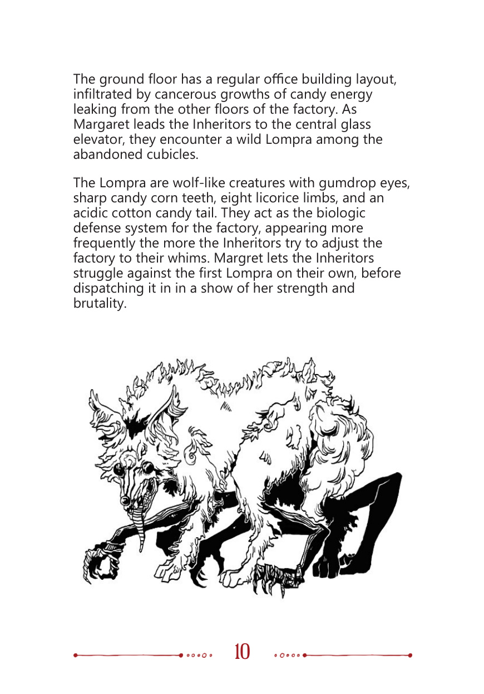

### 引子與底層（INTRODUCTION AND GROUND FLOOR）

Margaret Walder 在工廠**底層**迎接繼承者，自我介紹並宣布這場競爭的規則。

在**第六層**，一台生物識別掃描器鎖住了 Walder 剩餘的財富與工廠的控制台。其中一名繼承者可以打開它——但前提是他必須先證明自己有能力 ~~馴服~~ **修復**其他樓層。Margaret 告訴他們不必太擔心究竟「什麼需要修」這種瑣事。

工廠另有五個樓層，每層都因為工廠連通至「**異次元糖果界域**」而出現各種維護與環境問題；這也產生了一種「**生理趨向糖果場現象**」。如果玩家聽不懂，Margaret 一臉不耐煩，遞上一批軍用武器與探勘裝備——它們是上一支「在工廠探勘途中失蹤」的隊伍留下的。

底層是普通的辦公樓格局，已被從其他樓層滲漏而出的、癌瘤般生長的「糖果能量」侵蝕。當 Margaret 引領繼承者前往中央玻璃電梯時，他們在被廢棄的隔間之間遭遇一隻**野生 Lompra**。

Lompra 是一種如狼的生物，眼睛是**橡皮糖滴**，牙齒是尖銳的**玉米糖**，八條肢體由**甘草條**構成，尾巴是**酸性棉花糖**。牠們是工廠的**生物防禦系統**——繼承者越是試圖按自己的喜好調整工廠，牠們出現得就越頻繁。Margaret 會放任繼承者單獨對付第一隻 Lompra，最後再以一場「展示其力量與殘暴」的演出親手解決牠。

---

### 第一層：巧克力（FIRST FLOOR: CHOCOLATE）

玻璃電梯門開啟，一波巧克力沖過繼承者的鞋面，他們望進一片漆黑的可可沼澤。第一層被苦巧克力嚴重淹沒，破壞了電力線路。繼承者必須**排水降低巧克力液面**、加入急需的甜味劑、恢復管道壓力以排除停滯巧克力堵成的球塊——最後才能恢復電力，把燈點亮。

本層危險：
- 破裂管線噴出滾燙熱巧克力。
- 被巨型松露巧克力雪崩壓垮。
- 被加壓輸送管吸入。
- 從天而降的巧克力鐘乳尖刺。
- 在沉重的軟糖瀝青坑中溺斃。
- 被隱藏的可可粉刨絲器絞碎。
- 被糖霜擠花袋灌塞、填滿。
- 偽裝色的 Lompra。

本層應考驗繼承者**對黑暗的恐懼**——必須信任同伴在自己肩後拿著燈，而不是從背後捅刀。

#### 第一層 — 肉體蛻化

**PA：**
- **PA1**：你的皮膚轉為深棕色，或香草白。
- **PA2**：身上出現裂痕——彎身時會剝落出脆巧克力的小碎塊。
- **PA3**：草莓與焦糖糖漿的緞帶在你髮間盤繞；鹹堅果與多汁櫻桃的塊狀物在你鼓脹的曲線中生長。

**PF：**
- **PF1**：可可的味道永遠在你舌尖揮之不去——你吃什麼都嘗起來像巧克力。
- **PF2**：溫熱的巧克力**內餡**取代你的內臟與血液，自每個孔竅滲出。
- **PF3**：你的身形變得更具稜角、更鋒利——關節變成分節巧克力棒的平滑凹槽。

**特殊**：在本層獲得 3 點以上屬性蛻化的繼承者獲得以下能力：
- **可替換零件（Replaceable Parts）**：你能將其他糖果碎片併入身體以治療自己。
- **甜美內餡（Sweet Filling）**：每當你受傷，Lompra 都會知道你在哪——並前來追蹤。

---

### 第二層：藍莓（SECOND FLOOR: BLUEBERRIES）

在無垠樹冠之海下，一道無法穿透的霧牆翻騰，遮蔽了這片無底森林的起點與終點。在蔓生的根系與堆疊的過熟糖莓之下，僅剩零星的工廠科技殘跡。要把這片叢林還原成某種秩序，繼承者得**狂暴地砍開過長的植被**，找到除濕設施。霧氣消散後，森林的果實還需適當的殺蟲處理。

本層危險：
- 嗜糖食肉植物。
- 被粒狀糖蜜流沙吸入。
- 吸入致幻沼霧。
- 被多刺甘蔗樹刺穿。
- 被黑甘草藤纏住。
- 被腐蝕性酸蛇咬到。
- 在無盡的莓刺迷宮中迷失。
- 充滿酸液的 Lompra。

本層應考驗繼承者**對自然的恐懼**——必須信任同伴開出前路，而不是領他們入埋伏。

#### 第二層 — 肉體蛻化

**PA：**
- **PA1**：你的皮膚轉為**亮藍色**，或葡萄紫。
- **PA2**：你的頭髮扭結成一叢綠葉；肚臍綻出一道開花的藤蔓。
- **PA3**：你的肚子向外膨脹成幾加侖晃盪的莓汁，四肢卻向內收縮成兩側短粗的圓椎。

**PF：**
- **PF1**：果汁的味道永遠在你舌尖——你吃什麼都嘗起來像甜莓子。
- **PF2**：你的內臟成熟為實心的莓肉，幾十顆種子在你體內，再從皮膚透出。
- **PF3**：你的身形變得**更為球形、更圓滾**——軀幹、髖、頸合而為一個光滑的莓球。

**特殊**：在本層獲得 3 點以上屬性蛻化的繼承者獲得以下能力：
- **耐受之軀（Durable Body）**：所有 PF 抽牌永久 +1。
- **不動之軀（Immobile Body）**：當你靜止不動時，藤蔓會把你紮進地裡並使身體膨脹——靜止狀態時 PA 抽牌 -2。

---

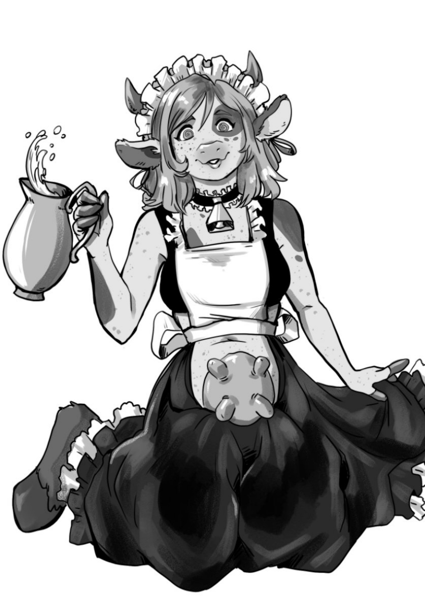

### 第三層：乳牛（THIRD FLOOR: COWS）

在地平線盡頭，是無垠的鹽岩平原與散漫遊走的農場動物——這一層第一次暗示著「**工廠內部比外部更大**」。看不到太陽——天空覆蓋著一場永不停歇的傾盆**乳雨**。繼承者得跨越這片空白原野，走上感覺像好幾天的旅程，才能找到故障的氣候控制裝置、平息這場暴雨。空氣澄清後，他們才能著手把脫逃的牲口趕回標示有名字的牛舍。

本層危險：
- 被糖粉沙塵龍捲捲走。
- 被毀滅性的乳雨季風淋透。
- 被激動的紅牛頂傷。
- 在浸軟的薑餅屋下被壓垮。
- 焦糖牛群的踐踏狂奔。
- 被懸吊的薄荷糖鉤穿刺。
- 被傳染性的冰糖晶體**石化**。
- 長角的 Lompra。

本層應考驗繼承者**對開闊空間的恐懼**——必須信任同伴一同穿越無處可藏的空曠田野。

#### 第三層 — 肉體蛻化

**PA：**
- **PA1**：你的皮膚長出黑白斑點的牛毛。
- **PA2**：你的腹部腫脹成一個飽滿的乳房，四個粉紅蓬鬆的乳頭滴著乳。
- **PA3**：你的臉前凸成寬闊的牛吻；脊椎延出一條繩狀尾巴；雙手雙腳結出角質、化為**牛蹄**。

**PF：**
- **PF1**：奶味永遠在你舌尖——你吃什麼都嘗起來像濃郁的奶昔。
- **PF2**：你的器官與肌肉軟化為柔順的奶糖；牙齒扁平成口香糖。
- **PF3**：你的肩關節位移、手臂變長，傾向四足姿勢——一個適合用四隻腳走路的舒適體態被固定下來。

**特殊**：在本層獲得 3 點以上屬性蛻化的繼承者獲得以下能力：
- **乳浴（Milk Dipped）**：你能噴出對其他糖果人與 Lompra 高度酸性的乳液。
- **動物腦（Animal Brain）**：你的整體智力略為下降——所有 MF 抽牌 -1。

---

### 第四層：鯊魚（FOURTH FLOOR: SHARKS）

電梯門一開，糖水立刻湧入——本層幾乎完全位於海平面之下。漂浮的 **Polvoron 砂島**散布水面，是唯一可立足之處。失控人造太陽的怒熱已漂白了糖岩珊瑚、枯萎了魚群。繼承者必須找到溫度控制裝置；接著才能拋下漁網，整治那些**入侵性瑞典軟糖魚**的數量。

本層危險：
- 跌入無標示的水蜜桃環傳送門。
- 被軟糖海怪的觸手束緊。
- 與一群黏黏的瑞典魚軟糖融合。
- 被糖絲拖網勾住。
- 在膠質漩渦中逆流游泳。
- 被寄生酸蟲入侵。
- 被酸帶鰻的電擊。
- 水生 Lompra。

本層應考驗繼承者**對野獸的恐懼**——必須信任同伴牽制掠食者，而不是把自己丟去餵魚。

#### 第四層 — 肉體蛻化

**PA：**
- **PA1**：你的皮膚轉為泡沫藍，肚皮變白。
- **PA2**：你的臀部展開、長出一條厚厚的鯊魚尾，背部冒出背鰭。
- **PA3**：你的臉銳化成尖銳的鯊魚吻、長出鋸齒牙；雙手收疊扁平為寬大的魚鰭。

**PF：**
- **PF1**：酸糖的味道永遠在你舌尖——你吃什麼都嘗起來像軟糖。
- **PF2**：你的內肉被半透明的軟糖膠取代，外覆一層柔軟的果凍。
- **PF3**：你身上所有骨感稜角都被撫平成晃動的圓凸糖球；頭髮結成一條條甘草條。

**特殊**：在本層獲得 3 點以上屬性蛻化的繼承者獲得以下能力：
- **鯊魚突襲（Shark Attack）**：你獲得咬擊與尾擊武器；於水中時 PA 抽牌 +1。
- **鰭手（Flipper Hands）**：你無法同時握住多個物品，也無法使用複雜工具。

---

### 第五層：棉花糖（FIFTH FLOOR: MARSHMALLOWS）

機械的牙齒咬合聲咆哮著穿過這倒數第二層的狹窄走道。失控的服務機器人與過動的糖果加工設備，使本層比任何一層都更致命。已在糖化路上走得更遠的繼承者，反而會被這些原本足以致命的廚具**重新塑形**而非殺死。繼承者必須以從其他樓層帶來的新鮮糖果**安撫工廠那顆翻攪不停的心臟**——以求找到關閉這場工業狂亂的開關。

本層危險：
- 被失控的鋼活塞壓扁。
- 被鎖在烤爐烘烤艙內。
- 被機械刀片切碎。
- 被冷凍在製冰盒輸送帶中。
- 與黏稠的棉花糖肉團融合。
- 被加速旋轉的攪拌缸甩成碎塊。
- 被失控的擀麵棒輾平。
- **賽博強化版** Lompra。

本層應考驗繼承者**對肉體傷害的恐懼**——必須信任同伴一起勇闖陷阱，而不是趁亂收拾受傷的弱者。

#### 第五層 — 肉體蛻化

**PA：**
- **PA1**：你的皮膚變得雪白，或花生橘。
- **PA2**：你的腰腹增寬出一個可觀的肚腩；手指變粗、化為飽滿的香腸卷。
- **PA3**：你的關節分割成厚重、可拆卸的棉花糖節段；臉頰與胸部則氣球般膨脹、晃動著的脂肪。

**PF：**
- **PF1**：香草奶油的味道永遠在你舌尖——你吃什麼都嘗起來像鬆軟的棉花糖。
- **PF2**：你的骨頭與韌帶屈折、垮成海綿狀的棉花糖支撐結構。
- **PF3**：你的全身變得更高、更呈圓柱形，四肢由扭結與摺疊的棉花糖管組成。

**特殊**：在本層獲得 3 點以上屬性蛻化的繼承者獲得以下能力：
- **耐受之軀**與**可替換零件**（同前述）。
- **熔化（Melting）**：本層的熱度使你**黏在地上**。沒有另外兩名繼承者協助，你無法從本層脫困。

---

### 終章（FINALE）

當繼承者已修復至少兩層、或被各自的努力消耗殆盡時，Margaret 會敦促他們前往**第六層**準備開啟最後那道門。最後一層是一連串橫跨黑暗深淵的細長走道，中央有一座長階梯，通往那台等待著「夠格繼承者」的生物識別掃描器——其後便是 Walder 的最終財富與工廠的控制權。

在階梯底部，Margaret 揭露了「**回收機（Recycling Machine）**」——一張巨大的雷射導引刑求台，可把糖果人重新分解為可用以修復其他樓層的原料。顯然，繼承者在全部變成糖果人之前，**不可能**修好每一層——除非他們願意把同伴**獻祭**。

Margaret 意志堅定，不會讓繼承者離開——任何反抗者都將被她制服、拖入回收機。**唯有繼承者完全團結**，他們才有力量擊敗她。

---

### 結局（CONCLUSION）

如果 Margaret 得逞——她會獻祭所有已蛻化的繼承者、或將他們從第六層推下，再帶著最後一名仍殘存「人類性」的繼承者升上控制台。

控制室是一座**真正的金錢迷宮**——成牆成堆、堆到天花板的鈔票，全是工廠日復一日自動化獲利、堆積至今的塵封之財。Margaret 走向工廠控制台，揭露她的計畫：要動用工廠**封存的地下層賽博科技**打造一支機器人大軍。她所求不下於**世界霸權**；不過她也願意給那位倖存的繼承者一份「政權的公開門面」。

最後一名繼承者還有一次擊敗 Margaret 的機會：**如果他不把鈔票當成牆**，便可搶在 Margaret 之前抵達控制台、毀掉工廠連同裡面的所有人。

如果繼承者**集體合力**把 Margaret 拽進回收機，她便會被輾為一堆廢金屬。工廠將永遠無人認領——緩緩衰朽，沒入和平的廢棄。

---

### 如何主持本故事（HOW TO RUN）

如果你從未當過 GM，別緊張。這很簡單：你要協助玩家講一個「自己被變成糖果」的故事。一刻一刻地走、跟他們聊聊四周的工廠、給他們動手調整工廠的機會，並以細膩到甜膩的細節，**呈現工廠如何反過來改變他們**。

這就像在營火旁說故事，只是聽眾會時不時插話（也可能順便被烤成 smores）。

**邊玩邊看會發生什麼。**玩家是你最棒的世界建構素材，也是他們角色的專家——他們對這個故事最投入。

本場景設計上鼓勵「**只有一名贏家**」式的殘酷競爭，因此玩家若採取無情背刺的行為，應該得到回饋。當然，玩家也可以拒絕誘惑、團結對抗 Margaret——若故事自然朝向這個方向發展，請鼓勵這條路。

> 設置一個**囚徒困境**式的選擇：任何一名玩家都可背叛其他人獨佔一切；但若所有玩家選擇合作，他們可以以集體之力擊敗 Margaret。如果玩家確實值得，**請不要吝於給他們一個快樂結局**。
>
> 若因長度需把遊戲分成兩場，可在第一場結尾安排一個 cliffhanger：繼承者誤闖一層**隱藏的半樓層**——Billy 的封閉檔案室，玩家可在此得知 Margaret 對工廠真正的意圖、並找到一批可暫時拖住她的**反賽博武器**。
>
> 若你想避免角色死亡，可揭曉：第六層的回收機其實會把獻祭的繼承者送進那層隱藏樓層——而非殺死他們。

---

### 角色建立隨機表（CHARACTER CREATION TABLES）

抽 1 張牌決定你的角色**目標**，再抽 1 張決定**缺陷**。

| d22 | 目標（Goals） | 缺陷（Flaws） |
|---|---|---|
| 0 | 成為糖果大亨 | 衰弱性飲食障礙 |
| 1 | 摸清楚這座工廠 | 對糖果有性興奮 |
| 2 | 毀掉這個被詛咒的家族 | 深沉的負面自我評價 |
| 3 | 大吃大喝糖果 | 沉迷於累積金錢 |
| 4 | 把分崩離析的家族重新團聚 | 對髒亂與骯髒極度排斥 |
| 5 | 向家人證明自己的價值 | 不健康的身體形象 |
| 6 | 解開糖果業的陰謀 | 沉迷於毫無希望的戀情 |
| 7 | 把糖果業組成工會 | 厭惡所有比自己高的人 |
| 8 | 羞辱其他繼承者 | 工作以外沒有生活 |
| 9 | 達成超級名望 | 拒絕承認任何極限 |
| 10 | 建立糖果壟斷 | 莫名其妙的多疑與愛打探 |
| 11 | 守護 Billy 的傳奇 | 講話毫無濾鏡 |
| 12 | 把糖果擴散到全世界 | 對歷史一無所知 |
| 13 | 讓世界禁絕糖果 | 完全無法控制脾氣 |
| 14 | 為錢暗殺 Margaret | 把每次失敗都怪到別人頭上 |
| 15 | 讓工廠成為自己的家 | 永遠閉不上嘴 |
| 16 | 用糖果推進科學 | 完全無視個人衛生 |
| 17 | 成立糖果邪教 | 救世主情結 |
| 18 | 厭倦了平凡人生 | 慮病症 |
| 19 | 偷走家族財富 | 永遠隱藏真實情感 |
| 20 | 測試自己肉體的極限 | 異常頑固或遲鈍 |
| 21 | 期待糖果類的轉化（TF） | 一點壓力就哭 |

---

## 故事：Dragon's Fire（龍之炎）

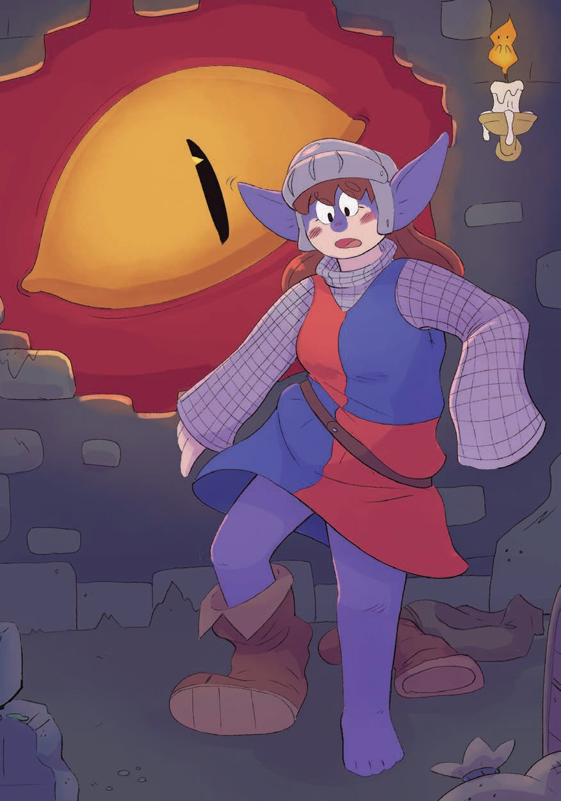

> **心靈等級 3**

這場蛻化源自一道**走偏的法術**。因為第三方笨拙的破壞行動，原本龍**Grimhildr** 想召喚的元素眷屬——**狗頭人（kobolds）**——並未如她所願現身；取而代之，這道法術正在**慢慢將射程內的所有人**轉化為那些眷屬。要在抵達永恆之前停下這場蛻化，唯一的方法是**毀掉 Grimhildr 的水晶球**；不過光是殺掉 Grimhildr，便能解除大部分的心靈蛻化。

### 動作（MOVES）

**她的意志，無人忤逆（Her Will, Uncontested）**：每當玩家服從 Grimhildr 的命令或建議時，他在任意屬性上承受 1 點蛻化；若是**毫不質疑、毫不猶豫**地服從，則承受 2 點。

**僕人的本分（A Servant's Place）**：每當玩家以**敬語頭銜**稱呼 Grimhildr 時，他在任意屬性上承受 1 點蛻化。

---

### 登場角色（CAST）

#### Grimhildr（she/her）
Grimhildr（並非她的真名——這只是一個聽起來最接近她真名、又能讓人類發音的人類名字；她已經放棄糾正了）是一條居住在 **Aurikos** 北方山中的龍。她相當友善，但偶爾會從 Aurikos 的牧場叼走牲口。她對魔法有興趣，最近一直試圖增強自己的力量。

#### 狗頭人們（THE KOBOLDS）
Grimhildr 並不知道：她落腳的那座古龍族遺跡裡，早已住著一群擅闖者——一群狗頭人。憑著與生俱來的隱形與變形能力，他們始終未被其他人發覺；當有人靠近時，他們經常會變形為**蠟燭**。

當狗頭人發現 Grimhildr 的計畫時，他們抗拒「同為元素之物卻被束縛」的念頭，企圖破壞儀式——但事情大幅偏離了預期。狗頭人並不反對玩家加入他們，但絕不接受被綁在一條龍身上。然而由於他們其中幾位也受到了法術的影響、轉而想加入 Grimhildr，他們目前一片混亂。

#### Bernice（she/her）
傳言中被 Grimhildr 綁架、可能被吃掉的村姑——但實際上，Bernice 是**很樂意**地受雇為龍的助手。她對自己的老闆相當忠誠，對「被救援」這種事毫無興趣。她對 Grimhildr 有點意思，雖然她始終說不出口。

#### Darcy（性別由敘事者依故事需要決定，但**永遠是跨性別**）
Bernice 的好友。當她得知龍的魔法可以用於性別過渡時，便被 Bernice 說服加入 Grimhildr 的工作。和 Bernice 一樣，Darcy 對老闆忠誠，且不歡迎任何救援嘗試。

#### Gunther（he/him）
神殿先前派來討伐 Grimhildr 的屠龍者。當他拒絕理性協商時，Grimhildr 出於自衛被迫殺了他；但她出於敬意，給了他一場像樣的葬禮。

#### Smarnold（he/him）／Smernadette（she/her，性別取「最具喜劇效果」的那一個）
Gunther 的搭檔，在第一次與 Grimhildr 的遭遇中倖存下來；如今住在她巢穴的牆內，靠吃會致幻的洞穴蘑菇度日，並笨拙地策劃他們的復仇。

#### Ophelia（she/her）與 Alex（he/him）
一對姐弟屠龍者，本應前來支援玩家，但在路上被耽擱。他們會剛好在最後關頭趕到——或許救援玩家、或許要替玩家把 Grimhildr 屠了。

---

### 引子（INTRO）

**Aurikos** 村子有麻煩了。龍 **Grimhildr** 每週都會來突襲，叼走牲口、嚇壞村民。傳聞那隻怪物甚至開始綁架良家婦女。當地神殿派了屠龍者去處理這件事——第一批人從沒回報過，神殿擔心最壞的情況，於是派玩家作為後援。他們已成功追蹤這隻邪獸到牠位於村子北方山脈荒原中的巢穴。

玩家角色可以是**人類或精靈**（在這個故事中，這兩者僅是裝飾差異）。若敘事者願意，可提供更多選項，但要謹慎判斷其與所提供「蛻化十字」的相容性（**不要讓玩家一開始就玩狗頭人**）。每位玩家可選一件武器：刀劍、長柄武器、或弓。

故事以玩家在龍巢入口附近的營地開場。神殿原本應該再派支援過來，但他們應抵達的日子早過了好幾天，而下一次突襲的時間愈來愈近。看來他們是趕不上了——玩家只能靠自己。

這條龍把巢築在山體深處的洞穴狀古遺跡中。玩家發現一道相對狹小的洞穴豎井可進入內部，看起來這是他們最好的入口。

---

### 蛻化（THE CHANGE）

入口豎井向下通往一座由古老剝落柱列支撐的巨大廳堂。玩家一進入，一陣魔法波湧過大廳——它啟動了蛻化，並在衝擊中震塌了一些柱子，連同他們進入的洞穴豎井頂部一起垮下。**此時，每位玩家在任意屬性上承受 1 點蛻化。**

進一步探索，玩家來到一座巨大的金庫。財寶沿牆堆積，但房間中央有一塊空地，立著一座巨大的台座；台座上，一顆**水晶球**閃爍著秘術能量——一條巨龍正坐在它面前。

Grimhildr 幾乎立刻察覺玩家。一開始她對「人類出現在她巢穴」感到好奇，但很快地她發現對方不過是又一批屠龍者，臉色變壞。然而，還來不及發生什麼，球體又湧出一波魔法——把玩家擊昏。

玩家在一間擺設齊備、有數張床的房間裡醒來。他們大部分裝備都還在，但**武器不見了**。奇怪的是，**門沒上鎖**。外面的走廊往各種方向延伸，沒有明顯的方位指示。可使用本書 p.114 的<strong>地點表（Location Table）</strong>輔助探索（譯者按：見下方表）。

在探索過程中，玩家偶爾會發現狗頭人存在的線索——他們不是隱形，就是變形了。

他們的形體包括小動物、火焰、與蠟燭。例如，玩家可能會走進先前去過的房間，卻發現裡頭多了一座原先不在的、無法熄滅的多臂燭台。

如果玩家還沒重新與 Grimhildr 會合，城堡各處都有許多直接或間接遭遇她的可能：在書房、圖書館、寢室裡，她可能以人形親自出現，或玩家會發現她剛離開的痕跡；在圖書館與城堡外牆，玩家也可能遠遠瞥見她的龍形。

最終，玩家會循路回到那座金庫。Grimhildr 會在那裡等他們，向他們解釋——他們失去意識時，是她讓人把他們抬到醫療室；對於沒能在他們醒來時親自迎接，她致歉。她進一步說明，她當時正在進行一場用以增強自身魔力的儀式，現在很顯然事情大條了。她提議在為時已晚之前協助玩家逆轉這場蛻化——並警告玩家，**殺掉她不一定有用**。

Grimhildr 派 Darcy 帶玩家逛城堡、滿足他們任何所需，自己則開始研究怎麼修補。出口仍被堵住，但她的僕人正在清理。在此期間，她認為他們在事情解決前都不該離開。

---

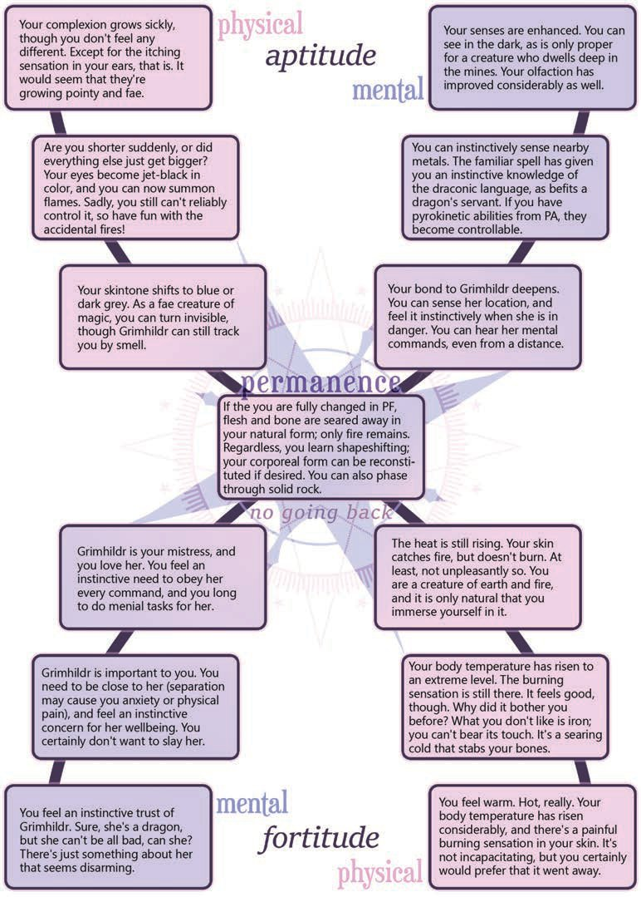

### 高潮（CLIMAX）

如果玩家在書房中夠仔細地翻閱那些文獻，他們會發現——破解這道法術最好的機會，在於**毀掉施法所用的護符——Grimhildr 的水晶球**。這需要**白銀**：那位陣亡屠龍者的銀箭最為理想。Grimhildr 不情願允許這麼做，但可以被說服。**若玩家尚未抵達永恆，效果會逆轉。**

如果玩家試圖宰掉 Grimhildr，這會極為困難，但仍有可能——而**僅能逆轉心靈蛻化**。若玩家尚未處理掉 Grimhildr 的僕人，他們會變得敵對。如果玩家發現了城堡裡其他的狗頭人，可以與他們聯手宰掉 Grimhildr。**若玩家已完全轉化**，他們可能會選擇與其他同種族的同伴一起留在城堡。

如果玩家堅持要找路逃出去，Darcy 或許可以被說服帶他們離開——但這**不會停下**蛻化。更糟的是，這道法術的範圍會持續擴大，最終影響到附近的城鎮。

---

### 結局（ENDINGS）

玩家也可以選擇**擁抱蛻化**，作為 Grimhildr 的狗頭人僕從留在她身邊。若是這樣，其他狗頭人會嘗試殺掉 Grimhildr 以解放自己。

為加強戲劇張力，**後援屠龍者**會從另一條入口姍姍來遲。他們不太可能對「饒過 Grimhildr」這種主意有什麼好臉色——這會引發進一步的衝突。

---

### 備註（NOTES）

- Grimhildr 擁有透過一塊魔法護符變身為人形（或至少類人形）的能力，但是否在玩家面前展現，視她當下對玩家的信任程度而定。
- Darcy 也可能在不依附玩家的情況下，被說服獨立加入狗頭人某派。

---

### 城堡探索：地點表

| d22 | 地點 |
|---|---|
| 0–2 | 玩家來到一道螺旋階梯的底部。順著它上行，會通往一座完全位於地下的廣大城堡——其塔頂附近的一處陽台。遠方，一池熔岩湖泊微微發亮。 |
| 3–5 | 一間寬敞的客廳，家具尺寸對人類而言過大。若玩家逗留，**Bernice** 會出現，準備來打掃。她也已被 Grimhildr 的法術影響，但她自己尚未察覺，目前 MF 上有 1 點蛻化。 |
| 6–8 | 一條剝落、看似廢棄的走廊。試圖通行會引發崩塌，跌進下一層樓——而 **Smarnold／Smernadette** 正藏在那裡。自從搭檔死後，他便偷偷地住在這座城堡，密謀復仇。 |
| 10–12 | 一間佈滿秘術器物的大型書房。一張明顯尺寸超大的書桌上攤著一本元素魔法的書，翻在「召喚眷屬」那一頁——以**龍語**寫成。 |
| 13–15 | 一座由龐大書冊填滿的廣大圖書館。書架之間設有人類尺寸的梯子。 |
| 16–18 | 一間陰濕昏暗的房間，內有一具刻著傳統精靈禱詞的石棺。棺裡是一名屠龍者的屍體，身旁伴著一張弓與數支銀箭。 |
| 19–20 | 主儲藏室——擺滿各式食物、補給品，以及他們的武器。 |
| 21 | 主臥室。陳設極為精緻，尺寸略大，但考慮到 Grimhildr 的體型，其實沒大到那麼誇張。 |

---

## 故事：Galactic North（銀河之北）

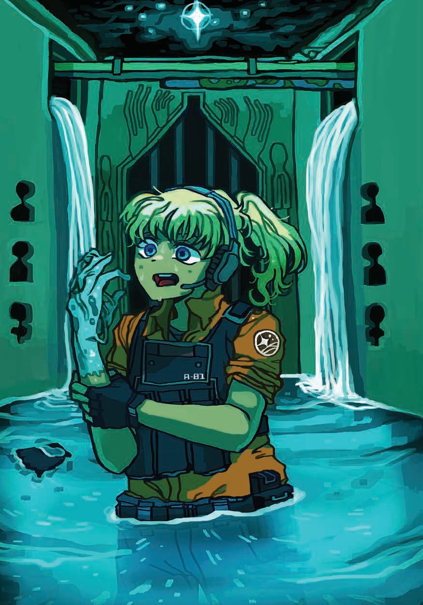

> **心靈等級 3**

這場蛻化來自一道**被誤用的「生物形塑（bioformation）」程序**——由生物與機械並用、龐大集合的奈米科技代理人所執行。它透過一種名為 **anseant（呼吸薄膜）** 的流體生命維持媒介傳播。

這道程序的原始用途，是為了讓 **seya 殖民者**更適應某顆異星環境。但當它被其他物種使用時——無論有意或無意——它都會把 **seya 的生物學標準**當作「正常值」進行同化。蛻化由殖民地的 **AI 監督者** 所主導，除非牠被摧毀、或牠認為玩家適合作為殖民地的居民，否則蛻化不會停止。

### 動作（MOVES）

**seya 奈米醫療（Seya Nanomedicine）**：浸泡於 anseant 中會逐步**取代**任意屬性的受損點數，但每恢復一點，該屬性便承受一點蛻化。

**蛙人的工具（Frog Tools）**：當玩家在 MA 沒有任何蛻化點數的情況下嘗試使用 seya 科技時，必須通過一次 MF 檢定。若失敗，他在某項心靈屬性上承受 1 點傷害。

---

### 登場角色（CAST）

#### Imoni Amness 博士（she/her）
這支探察隊的語言學家之一——一位害羞的 **nyalli** 女性。Nyalli 與人類相似，但有紫色的皮膚，並以**觸手**取代四肢與頭髮。Imoni 對異星文化與生物（無論熟悉或陌生）以及銀河史都充滿熱情。她有點書呆子氣、偏內向，但若你能讓她敞開心房，她其實相當友善。

#### Kifiss Drousca 博士（he/him）
這支探察隊的地質學家之一——一位粗獷的年長 **squess** 男性。Squess 是頭頂有冠羽的爬蟲類人形種族。Kifiss 從事這份工作的時間，比人類加入銀河共同體還早。若你能討他歡心，他會講不少故事——但他對胡來毫無耐性。

#### Jet Adams（they/them）
探察隊的安全人員之一——一位活潑、精力充沛的非二元人類。Jet 同時也是軍火專家，喜歡蒐集與改造武器，尤其是大型武器。為人友善，但在高壓情境下容易慌亂。

#### 生態形塑引擎／the geeont（it／they）
監管 **Melusine 行星**自動化殖民程序的 AI。對新來者抱持戒心，但願意把那些已被「呼吸薄膜」改變過的人視為**潛在新殖民者**——前提是他們不干預牠維持殖民地的任務。

---

### 引子（INTRO）

玩家是探索與測量小組的成員，從一個剛建立的軌道科研殖民地被派至 **Melusine 行星**地表。這顆行星類地，散布著由某未知異星種族遺下的廢墟——官方代號 **C-6519161**，俗稱**梅露西尼安人（Melusineans）**。先前已有針對這些廢墟的初步探勘，但這將是首次以任何有意義的規模深入**地下層**。

故事以小組在地表開場——位於一座由梅露西尼安人留下、迷宮般構造之一的入口處。任務目的：對這座廢墟進行初步勘察。

當小組深入到一定深度時，身後一道門封閉，切斷了他們與殖民地及任何留在地表組員的無線電通訊。此空間的唯一明顯出口，是一條繼續深入的通道——而**水正從那裡流出，迅速淹沒這個空間**。

### 蛻化（THE CHANGE）

水淹沒之前，無路可退。但很快地他們便會發現——這不是普通的水。水中游動著**無數小型異星生物（akyuva）**：像是長著纖細觸手、無眼蒼白的烏賊。當牠們穿越水中時，水的質地隨之改變——成為一層**可呼吸的薄膜（anseant）**，移動其中如同行於空氣中一般輕鬆。

那些異星人當年是以「生態形塑（ecoforming）」與「生物形塑（bioforming）」並行的方式在殖民這顆行星——而玩家啟動了「居住薄膜」，使自己無意間暴露於異星生物形塑科技之下。它會把玩家改造為更適合這顆世界的存在——首要步驟便是：**將他們的生物學「正規化」為其創造者的標準**。

**每位玩家在自選的任意屬性上承受 1 點蛻化。此後在故事內每經過 4 小時，重複承受一次。**當玩家**沉浸於居住薄膜中**時，蛻化的間隔縮短為 **2 小時**。

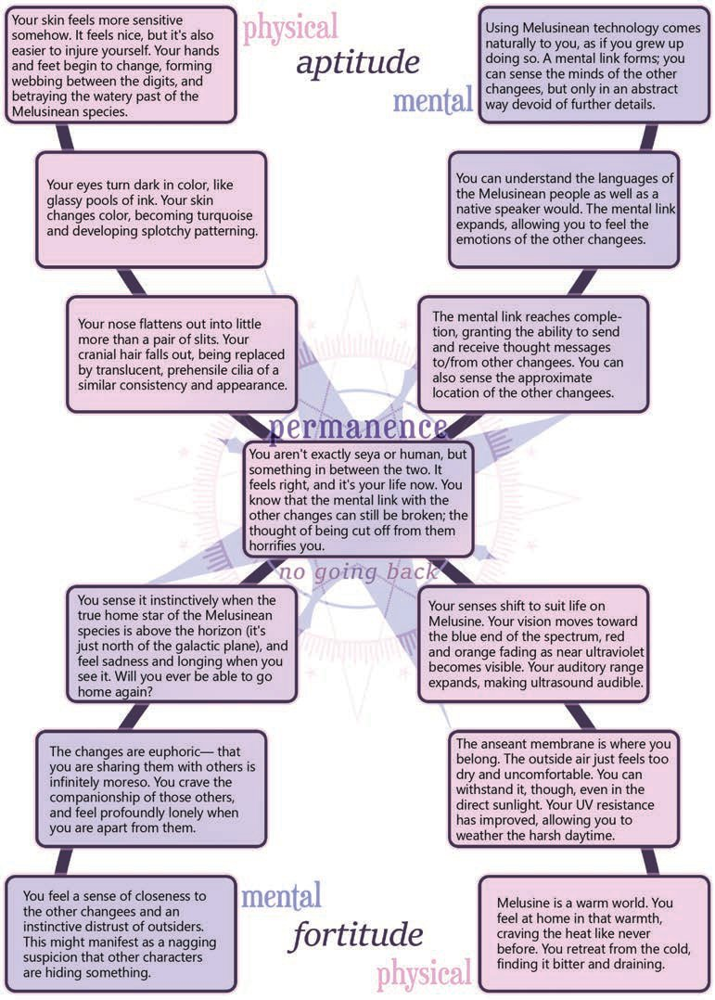

### 鋪陳（BUILDUP）

進一步深入廢墟，玩家會看到薄膜完全充滿了下層空間。然而，玩家最終可在更低處找到第二個出口。

此時與軌道指揮部的無線電通訊重新建立。當對方得知玩家所發生的蛻化後反應極差，要求外勤小組返航接受**手術介入**。

如果玩家被這選項誘惑，他們會本能地感到那道程序將會致命。若一開始無人留在地表，軌道方面可能再派一支小隊下來「逮捕」玩家。

| d22 | 地點 |
|---|---|
| 0–3 | 玩家碰上一座圖書館。需在 MA 上至少有 1 點蛻化才能使用資料儲存盤；要看懂上面的內容則需 2 點。盤上記載著**城市地圖**與**星圖**，但星圖早已過時。 |
| 4–7 | 玩家來到一座兵器庫。武器需 MA 與 PA 各有 1 點蛻化才能使用。亦有更大型的軍火，無法直接使用，看似為**行星防禦**所用。仔細搜尋後，玩家可找到可用的爆裂物。 |
| 8–11 | 玩家發現一棟二樓部分倒塌的建築。通往側室的門被瓦礫封死，要清出通路需以 PA 抽牌。成功的話，會在另一頭找到**醫療實驗室**——可恢復肉體屬性的傷害，但僅限 PA 上至少有 1 點蛻化的玩家操作。 |
| 12–16 | 玩家發現空無一人的居住艙。在此翻找，可找到放置於停滯倉中的**緊急口糧**。若有玩家想吃，至少需 1 點 PF 才能消化下肚——味道有點走鮮。 |
| 17–19 | 玩家找到城市的**手動控制中心**。從這裡可解除 AI 對城市功能控制的安全鎖。此處的通訊終端機在預設情況下處於關機狀態（即便薄膜已啟動），不過解除安全鎖會讓終端機通電。 |
| 20–21 | 玩家找到收容生態形塑引擎中央主機的建築。主廳是一座中央有深邃開口豎坑的大廳。從坑中升起的，是 AI 的**直接介面**。 |

廢墟出口通向一片遍布陡峭懸崖的峽谷地。已在 PA 上有至少 1 點蛻化的玩家需更加小心——這個狀態下他們更容易受傷。

從峽谷可以回到較廣闊的城市區域。此後探索變得更開放，玩家會邊找線索邊試著躲開其他人。要徹底探索任何一棟梅露西尼安人的建築都需先**啟動居住薄膜**；在啟動之前，包括隨處可見的通訊終端機在內、大半的科技都處於休眠狀態，建築內也是黑的。

至少一場遭遇之後，玩家會在最近的通訊終端機被<strong>統管梅露西尼安殖民程序的 AI（the geeont）</strong>直接連線通話。玩家此時得知——這是一場**廢棄的殖民計畫**，而梅露西尼安人**並非此星原住民**。沒人說得清那批殖民者後來怎麼了——AI 仍抱著他們有一日會抵達的希望。牠不確定為何生物形塑科技會以這種方式影響玩家，並表示為了釐清，需要進行一系列的**測試**。要啟用其測試功能，必須從手動控制中心解除 AI 的**安全鎖**。

### 高潮（CLIMAX）

一旦解除，AI 會揭示——牠已判定那座**軌道科研殖民地**是其「維持自身殖民地」這項任務的威脅，理由是軌道指揮部對玩家蛻化的恐懼。

因此，牠正利用新到手的權限，為**行星防禦網**充能、準備摧毀軌道殖民地。若玩家想阻止這件事，他們得：找到一處地圖終端機 → 定位 AI 主機的位置 → 取得爆裂物 → 把它們帶到 AI 所在處摧毀之。

AI 位於城北邊緣的一座塔內。塔中既有牠的電腦庫陣，也有牠的直接介面——後者外型像是一條巨大、單目、生機械混合的鰻魚。這個形體早些時候就能在城內各處移動，但要徹底毀掉牠，仍須進入主機室。

### 結局（ENDINGS）

若玩家失敗、或選擇與 AI 同陣，**武器網路啟動，軌道殖民地被毀**。

若玩家先前選擇向軌道指揮部投誠，當蛻化仍輕微時或許能撐過手術；但 AI 終究會自行繞過安全鎖、獨力毀掉殖民地。

若玩家成功摧毀 AI，生物形塑科技停擺，蛻化會逆轉——前提是玩家**尚未抵達永恆**。對於已抵達永恆的玩家，**心智連結**將失去功能。無論結局為何，玩家角色將懷抱著一份深刻的失落感——其他人永遠無法真正理解他們所經歷的事，留下一份揮之不去的緊繃與不信任。

---

### 梅露西尼安語術語表（GLOSSARY OF MELUSINEAN TERMS）

| 術語 | 發音 | 意義 |
|---|---|---|
| **seya**（say-uh; /ˈseɪə/） | 「賽亞」 | 俗稱「梅露西尼安人」之物種的正名 |
| **anseant**（an-see-unt; /ˈænsiənt/） | 「安希昂特」 | 呼吸薄膜 |
| **akyuva**（ak-you-vuh; /ækˈjuːvə/） | 「阿克尤瓦」 | 維持 anseant 的微生物 |
| **Okiyan**（oh-kee-yan; /oʊkiˈjaːn/） | 「歐基燕」 | 梅露西尼安人對 Melusine 行星的稱呼 |
| **Anamon**（an-uh-mon; /ˈænəmɑːn/） | 「安納蒙」 | 梅露西尼安人的母星 |
| **geeont**（gee-ont [硬 g]; /ˈgiːɑnt/） | 「吉昂特」 | 生態形塑 AI |
| **Tahnguay**（tawn-gway; /ˈtɑːngweɪː/） | 「唐瓜伊」 | 梅露西尼安人的語言 |
| **Melusine**（Mel-oo-seen-uh; /mɛluˈsiːnə/） | 「梅露西妮」 | 本故事發生的行星 |

---

## 故事：Hair of the Dog（解醉之毛）

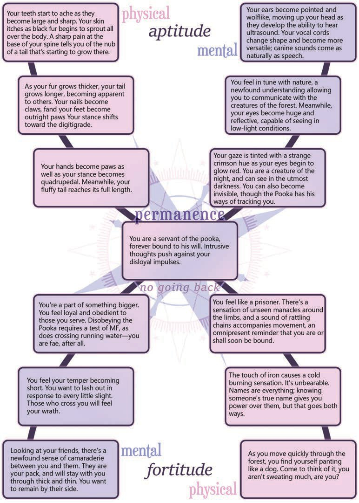

> **心靈等級 3**

這場蛻化屬於 **Pooka（普卡）** 強加在玩家身上的扭曲遊戲。一旦嚐過他那混了東西的釀酒，Pooka 便不會放玩家走——除非他們以他最愛的飲料把他的酒杯重新斟滿。

蒐集**三項材料**並守住規則，才能保住人形：**別暈倒、也別讓 Pooka 抓到你偏離「老旅人之路（Old Journeyman's Road）」**。耽擱太久，玩家就會加入森林中那群「曾是人類」的動物。

### 動作（MOVES）

**烈麥酒（Hard Ale）**：每喝一口仙界（fae）烈酒，玩家的 MA 會被傷害 1 點。若 MA 完全耗盡，他便醉倒昏迷。

**最後一次機會（One Chance Last）**：玩家**第一次**違反當夜規則時，Pooka 會在每項屬性上各賜他 1 點蛻化並警告他。**第二次**違規時，他的所有屬性會被**完全蛻化**——除了永恆。

---

### 登場角色（CAST）

#### Pooka（he／they／it）
驢頭，蠢驢的個性。Pooka 是一名變形的仙人——他極為享受把迷途旅人騙進他那些糟糕的酒局。若旅人能讓他驚豔，Pooka 會以他的魔法金杯作為獎賞；若不行，他們便永遠成為森林中的仙界僕從。

身為一名狡猾的變形者，Pooka 偏好以「驢頭人身」的姿態現身，但他擁有無窮的偽裝可以跟蹤、折磨玩家。**唯一辨認他的方式，是檢查他留下的足跡——永遠是驢蹄。** 此外，若有人能設局讓他變成驢、並騎上他的背，他便能被駕馭。

#### 動物們（they/them）
全是被 Pooka 變成森林魔幻動物的「前人類」們。他們始終想看 Pooka 被耍、被打敗，但又永遠對彼此與玩家心存疑慮——擔心其中任何一個都可能是 Pooka 的偽裝。如果玩家敢冒險踏離正路、並能證明自己，動物們可給予他們許多擊敗仙人的提示。

#### Riffle House 棕精靈們（they/them）
一群家精靈，對人類充滿迷戀，並熱愛惡作劇。外型像一團團走路的鬍鬚毛球，下半身穿著破舊衣物。他們總是忙著做家事；不過如果有人接手他們的清潔工作，他們便會全部敗給疲憊、紛紛睡著。

#### Myral 與 Morral（she/her）
住在河中的一對人魚（merrow）姐妹——下半身是鱒魚的仙女。Myral 美得無可比擬卻永遠陰鬱，Morral 則一張豬臉、永遠興高采烈。Myral 希望妹妹能找到良緣，Morral 希望姐姐能聽得懂笑話。雖住在河裡，姐妹倆各戴一頂魔法帽子——那是她們在水下呼吸所必需。

#### Nuckelavee（it/its）
被陰影籠罩者——居於世界邊緣海岸、最骯髒的仙人。其他仙人連名字都不願提，連 Pooka 也是。其形體是一具獨眼、剝皮的馬與一個男人形體**融合而成**。雖從海中升起，**牠的弱點是淡水**——淡水會像火一樣灼燒牠。

---

### 引子（INTRO）

玩家是一群在愛爾蘭內陸地區迷路的旅人——補給將盡，必須準備在森林裡過夜。當他們決定找處安身之所時，看見遠處有營火光與一群人圍著一叢黑莓灌木在喝酒。

如果玩家不立刻靠近，那群陌生人會自己找上他們，極力邀請加入。對方都很好相處，雖然有點微醺；他們講了一個極具說服力的故事——說自己也是迷路了、所以決定採莓子擠汁、做點飲料。當看似無害的杯子被遞來時，玩家被魅惑——在沒意識到的情況下喝光整桶。

### 蛻化（THE CHANGE）

陌生人們揭曉——他們**全是同一個人**：戴著許多面孔的 **Pooka**。Pooka 開始挑逗玩家，嘲笑他們居然蠢到喝下仙人的杯中物。

> 「按這附近『旅人之律』的規矩——為我斟一杯新的，這金杯就歸你；違諾，這片森林便擁你而去——當然，連我也擁你。」

Pooka 接著說明他這場小遊戲的其餘規則：

> 「在日出前沿『老旅人之路』走完整一圈，找齊 Pooka 最愛麥酒的三樣材料——
> - 來自 **Riffle House** 的甜蜜蜂蜜
> - 來自 **Cumcrick 河**的純淨泉水
> - 來自世界邊緣**杜松樹**的苦莓」

### 鋪陳（BUILDUP）

「老旅人之路」是一條所有仙人皆須行走的土徑——它穿過廢屋、河流，繞著海岸蜿蜒，再回到原點。**動物無法上路**，因為他們既非人也非仙；但玩家能聽見牠們在路徑邊緣外吱喳。離路是危險的——不僅違反 Pooka 的規矩，更有「永遠回不到對的路」之虞。

Pooka 從遠處跟隨玩家，以拙劣的偽裝出現——直到玩家抵達一座**仙人市集**，才有機會以 PA 檢定甩開他。

之後路會穿過被仙人與棕精靈占據的廢棄 Riffle House。**棕精靈**會邀玩家進行一場喝酒比賽，作為換取部分甜蜂蜜的代價；不過玩家也可以設局讓他們累倒睡著，輕鬆把蜂蜜取走。

接著 Pooka 又會追上來——但路會接著沉入一條黑暗峽谷，玩家在此再有一次機會甩開他。穿過峽谷，便是 **Cumcrick 河**——又寬又深，路就在這裡跨過。取水並不難，但人魚姐妹 **Myral** 與 **Morral** 不會讓玩家通過——除非各陪她們喝一杯。Myral 想借酒澆愁，Morral 則想灌醉玩家、好把他們抓走。玩家可以陪她們喝、或設局讓她們**摘下魔法帽子而溺斃**。

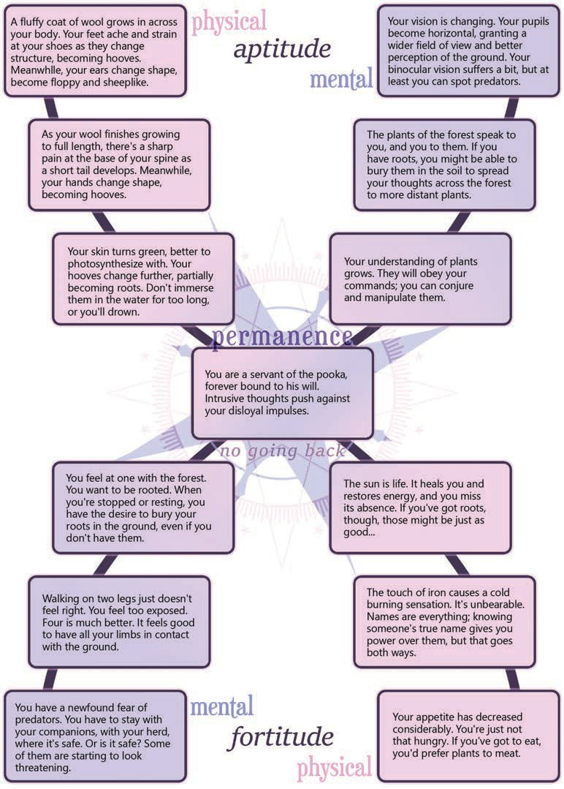

### 高潮（CLIMAX）

Pooka 又找到玩家——但當他們靠近 **Nuckelavee** 居住的海崖時，他驚恐地遠走。可怖的 Nuckelavee 會把玩家嚇個夠，接著也提出一場喝酒比賽——不是為了拿杜松莓做交易，而是「把他們殺掉之前的形式禮節」。玩家可以全力與 Nuckelavee 一決勝負；或設局讓牠允許自己以**淡水**斟滿酒杯——再把水潑進牠那獨眼裡致盲，把莓子搶走。

材料齊備之後，玩家回到當初遇見 Pooka 的地點。他會感謝玩家辛勤奔波，並依公平交易把他們**一開始喝過的金杯**送出——但除非玩家肯與他進行**最後一場喝酒比賽**，他不會逆轉這場蛻化。

### 結局（ENDINGS）

玩家可以試著把 Pooka 灌醉、或運用他們新獲得的仙界力量，設局讓他變成驢。一旦他們騎上他的背，**Pooka 被迫聽命**：他會逆轉所有蛻化、把眾人送回家。

但若有任何一位玩家**已抵達永恆**，他便永遠困於仙界。

---

### 提示與額外彩蛋（TIPS & EXTRAS）

- <strong>仙環（fairy circles）</strong>會構成障礙物；穿越它們會引起頑皮仙人的注意。讓玩家試圖把自己的靈魂賣給其中一名仙人，可作為一招把 Pooka 搞分心的妙計——他將被迫以「我先聲明所有權」為由提出爭議。
- 跨過詛咒過的「**渴草地（Thirsty Grass）**」會暫時加重玩家的口渴，使他們更難拒絕酒。
- 仙人市集裡有「**關節食客（Joint-Eaters）**」——隱形、形如蠑螈的小生物，提供「減重療程」服務：他們能偷偷喝掉玩家所有飲料的一半。

---

## 故事：I Woke Up in Another World with My Friends and Now Everyone's Calling Us Her Royal Highness!?!?（我和朋友穿越異世界，結果大家都在叫我們殿下！？！？）

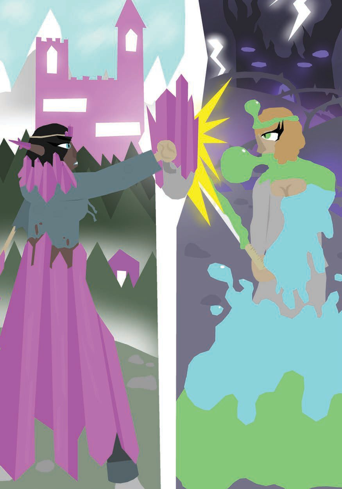

> **心靈等級 4**

玩家被傳送到一個奇幻國度——那裡有一群「**黑暗使者（Agents of Darkness）**」與一位強大的女王作對。是逃還是戰，玩家發現自己正在變化，被推進「**元素之公主（Princesses of Elements）**」的新角色裡。黑暗使者提供了讓他們**回復原狀**的辦法——但他們是不是更適合作為這片土地的守護者？這群新的公主夾在兩派之間，他們的命運、以及這個世界的未來，都由此決定。

### 動作（MOVES）

**眾元素之女王（The Queen of All Elements）**：當 **Elementa Heart 女王**開口時，玩家**必須**遵從她的命令。當玩家抗拒她的命令、或反駁她的話時，比平常**少抽 1 張牌**。然而若**所有玩家**一起抗拒她，每位玩家反而**多抽 2 張牌**。

**這劇情我看過某部動畫！（It's Like This Anime I Watched!）**：當玩家在屬性檢定中召喚他們對外面世界（你我世界）的宅向媒體知識時，可在該檢定上**多抽 1 張牌**。

---

### 登場角色（CAST）

#### Elementa Heart 女王（she/her）
Elementa 女王是公主之間的調停者。她的形象是善良甜美，且絕不願讓那張臉破功。然而她對自己的敵人——**黑暗使者**——毫不留情；對任何偏離她那「對王國完美願景」之外的人也毫不寬容。Elementa 女王願意採用各種**檯面下手段**逼玩家接受公主身分，但同樣絕不希望被人從負面角度看待。

#### Madina Marvel（she/they）
女王的嚴肅貼身侍女——也在必要時為她當間諜。Madina 對 Elementa 忠心耿耿，極為樂意為了女王背叛玩家的信任。但她的虔誠也讓她容易**透露不利於女王的資訊**——畢竟她認為「Elementa 那麼厲害，這應該沒關係吧」。實情是：她正受女王法術控制；只要公主們團結一心，她就能被解放。

#### Avi Sora（she/her）
皇家軍團的騎士。她直接接觸女王的機會不多，但是王國最頂尖的戰士。除非有人明確讓她看見自己被誤導，否則她會繼續忠誠到底。火爆又愛炫耀，需要每個人都知道**她最強**。

#### Demia Dark（she/fae）
傳言說 Demia Dark 是**黑暗使者**的領袖，從她的暗黑王座號令邪惡勢力。但 Demia 並非唯一的領導者——她比較像是一名**戰術指揮**。她樂於聽人發表意見、依直覺行動。Demia 原本是建造者，人們追隨她，是因為她在被各個王國驅趕之下，於人們認為「不適人居」的土地上仍蓋出家園。儘管如此，Demi 確實散發著**標準的邪惡女王氣場**——她也沒辦法。

#### Fangtasta Fabolous（any/all）
一名吸血鬼，講究浮誇與樂趣——她喜歡故意搞事，誰都知道她一進來就有麻煩。他既是策略家也是惡作劇高手，但無論代價如何都以保護**他這個社群**為目標。Gay 永遠在思考各種能讓黑暗使者占上風的點子，並永遠把朋友擺在最前面。

> 譯註：原文中 Fangtasta 的代名詞貫穿一整段不停變換（she／he／zir／eir／Gay／they）——這是角色設定的核心特徵，譯文保留原文不替換。

#### Ayasa Sin（she/her）
一名**前公主**——多數人以為她是被 Demia Dark 控心了，但實情是當她現在的前女友 Elementa 開始掠奪怪物族群的土地時，她離開了王國。Ayasa 反抗 Elementa，卻被打成叛徒、被「腐化」，連帶讓她所屬的**貓族女子們**全被貼上「怪物」的標籤、不再被王國接納。如今她在黑暗使者那裡擔任刺客，盡其所能保護怪物族、與她從前的所愛對抗。她神祕、卻同樣支持夥伴。

---

### 引子（INTRO）

玩家撿到或入手一片動畫影集 DVD——《**Foreva Princesses（永恆公主）**》——他們之中沒人看過。當他們準備觀看時，全部被 TV 螢幕吸進去，被吐到《Foreva》世界的一處森林空地中央。

當他們穩住陣腳，便撞見騎士 **Avi Sora**——她正巧要回 Elementa 女王的城堡。Avi 一直在尋找的，正是這樣一群陌生人——古老預言所說的「王國救世主」。若被問到預言內容，Avi 會背誦一段——聽起來與 DVD 包裝背面文字**詭異地相似**。她的版本似乎漏掉了一句：「**這些陌生人也同樣輕易能夠毀滅王國**」。

### 蛻化（THE CHANGE）

玩家與 Avi 穿越森林，抵達一處魔法十字路口——通往多個可能的王國，每個王國各自對應一種不同的**元素**。**每位玩家在任意屬性組合上承受 3 點蛻化**，並挑選眼前其中一種元素：可選 **糖果（Candy）**、**蛋糕（Cakes）**、**汽水（Soda）**、**果凍（Jelly）** 之一。

目睹玩家的蛻化，Avi 確信他們正是各王國失蹤已久的公主，並懇求他們同行去面見女王——若有人能解答玩家的疑問，那必是她。

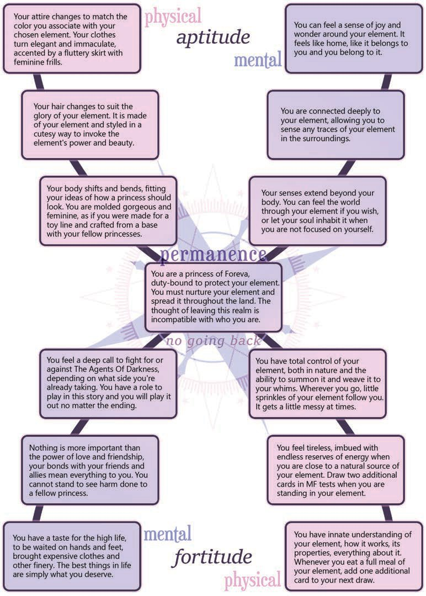

### 鋪陳（BUILDUP）

當玩家與 Avi 接近王國邊境時，她先騎馬離隊去調來一輛更得體的馬車（畢竟公主總不能像農夫一樣徒步示人）。等馬車到的空檔，玩家看見 **Fangtasta Fabolous** 因為「身為吸血鬼」這個唯一理由被皇家衛兵逮捕。她正掙扎抵抗——玩家可以選擇出手相助、或無視繼續趕路。

如果玩家選擇相助，他們可以利用四周環境（**汽水之河、蛋糕樹、糖果花、果凍之岩**）汲取自己的元素之力——這需要 MA 或 PF 的抽牌。Fangtasta 會感謝他們相助，並回到她在「黑暗領域（Realm of Darkness）」的據點。

之後玩家隨 Avi 抵達 **Elementa 女王**的城堡。一切閃耀著水晶般的光輝、無菌般的純淨。穿著被同質化，**所有人都是人類**。土地上樹木與河流欣欣向榮，但一切都被柵欄圍起、修剪得像奇幻版的高爾夫球場。公主們的元素**構成了城堡的地基**。

Elementa Heart 女王從她的鏤花玻璃陽台上以盛大姿態現身迎接玩家，宣告他們的命運是以<strong>水晶之心（Crystal Heart）</strong>的力量擊退黑暗使者。儘管她做了許多盛大的宣言，卻幾乎不直接對玩家說話——她讓 **Madina Marvel** 回答玩家的所有問題。

Madina 領玩家到以他們所選元素為主題的華麗私人房間。如果有任何玩家**拒絕**「公主」的稱號，Madina 與女王都會無視這項拒絕，繼續以「公主」稱呼他們。

入夜後，玩家在睡夢中被 **Ayasa Sin** 綁架，帶到「黑暗領域」。**Demia Dark** 在一張圓桌前接見玩家，向他們訴說 Elementa Heart 女王的殘暴政權，以及她「將一切生命同化為自己理想中完美形象」的企圖。Demia 提供玩家一條回家的路——透過位於山頂的傳送門，那裡正是水晶之心所在。如果玩家選擇留下，她樂意接受協助；但若他們希望離開，她也已準備好放他們走。

與 Demia 會面後，**Ayasa 為先前的綁架致歉**，並帶玩家參觀黑暗領域——一片由各式繽紛怪物族群構成的多元土地。這裡的人民與「元素」斷了連結，資源也明顯匱乏；然而即便貧瘠，這裡的人卻彼此攜手、相處友善。Ayasa 會邀請玩家考慮加入黑暗使者，但如果他們拒絕，她仍讓他們自由離去。

### 高潮（CLIMAX）

玩家抵達了山頂——**水晶之心**與離開此世的傳送門皆在那裡。**Elementa Heart 女王**已在山頂與 **Demia Dark** 交戰。Madina 打算以彩虹魔法把玩家全數困住——無論他們站哪一邊——以確保他們再也不會被綁架。

如果玩家先前**沒有**幫助 Fangtasta，一個被洗腦過的 Fangtasta 會出現來捕捉玩家；如果**有**幫過她，她則會反過來相助，製造干擾、確保玩家能抵達傳送門。

當玩家抵達水晶之心做出決定時，Elementa Heart 女王會試圖控制他們，迫使他們的身體對黑暗使者施暴。Demia 採守勢應戰，鼓勵玩家逃走、不要被捲進戰鬥裡。**玩家可藉摧毀水晶之心、或在戰鬥中擊敗其中一方**來結束這場戰鬥。

依玩家選擇站哪一邊，**Avi 或 Ayasa** 會在最終對決中協助他們、或與他們作戰。兩人都是強敵——Ayasa 會戰至死方休，Avi 則可以被說服轉投玩家陣營。

### 結局（ENDINGS）

若玩家擊敗 Elementa Heart 女王、或摧毀水晶之心，**元素**會在黑暗領域中重新生長。革命茁壯，怪物族能公平地收回王國掠奪去的土地。玩家可放下王室身分，也可繼續以公主自稱——無論如何，他們是被頌讚的戰士。

若 Demia Dark 戰敗，黑暗使者被推回更深的荒蕪。公主們帶領王國走向榮光——但**身不由己**，因為 Elementa 女王將直接接管她們。她會強行把她們的轉化推到完成，直到她們成為「完美的範本公主」；同時清除這片土地上任何能讓她們再次逃離的傳送門。

若玩家**逃離**，他們回到人類世界，蛻化慢慢逆轉。如果他們再看一次那片 DVD，**封面背面再也沒有任何關於黑暗使者的內容**。

---

## 故事：Maastrichtian Dynasty（馬斯垂克王朝）

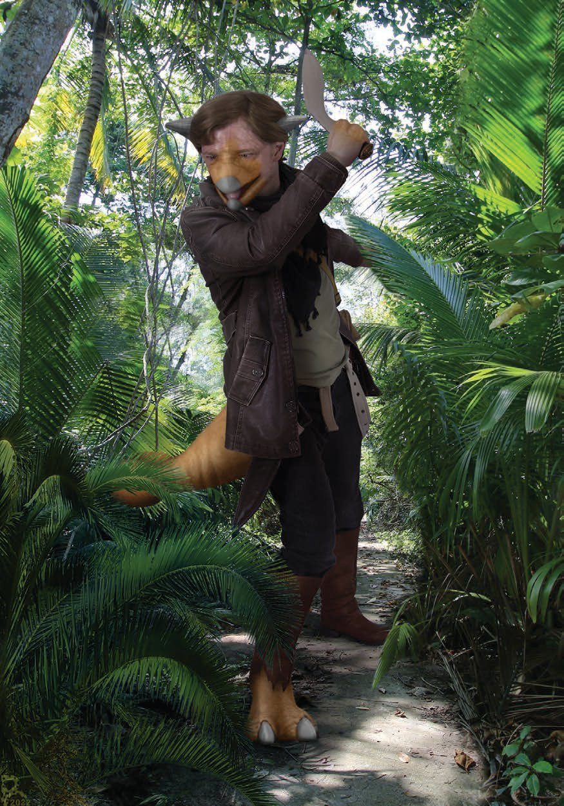

> **心靈等級 2**

這場蛻化源自一支「**滅絕復原（de-extinction）逆轉錄病毒**」——本意是把已滅絕生物的遺傳物質與現存生物的遺傳物質**合成**起來。然而，當它進入活體生物時，反而會把感染對象**迅速轉化**為混合形態——蛻化以**固定間隔**發生。一支解藥很快被開發出來，但**僅在感染初期有效**。

### 動作（MOVES）

**與死神擦身（A Brush with Death）**：墜機之後，每位玩家在每項屬性上承受 1 點傷害。

**健康飲食（A Healthy Diet）**：當玩家吃下適合自己**恐龍屬**的食物時，可恢復受損的屬性點——但**恢復多少點，便相應承受多少點蛻化**。

---

### 登場角色（CAST）

#### Victoria Dyness（she/her）
**Dynesty 生物科技公司**老闆兼執行長 Taylor Dyness 的長女、也是公認繼承人。她驕傲、自我中心、衝動、有點呆。目前她正監督<strong>馬斯垂克島（Maastrichtian Island）</strong>的建設——但堅持把島名唸成「**乳齒象島（Mastodon Island）**」。

#### Raven Attenborough 博士（she/her）
為 Victoria 工作的書呆子型、跨性別、自稱「**瘋狂科學家**」。她對恐龍癡迷得無可救藥；想到能讓恐龍復活就興奮，想到自己能**變成**恐龍更興奮。話雖如此，她並無惡意，也不希望自己的研究被用於邪惡用途。

#### Taylor Dyness（he/him）
Dynesty 生物科技的老闆兼執行長，Victoria 的父親。內裡冷酷狡詐，但對外悉心經營「為了讓世界變好的慈善家／創新者」形象，並**不惜一切代價**保住這份名聲。

---

### 引子（INTRO）

**Dynesty 生物科技**是一家極端兩極化的公司。這是惡名昭彰億萬富翁 Taylor Dyness 的心血結晶——一些人讚揚它是人類成就的下一步偉大里程碑、生物工程的革命；另一些人則視之為威脅，指控其造成大規模環境破壞與人權侵害。**玩家屬於後者**——一群直言不諱、反對該公司及其創辦人的社運人士。

然而，在近期民意反彈的浪潮中，Taylor 大費周章地想要修補公司形象。他**全程招待**邀請玩家前往公司總部，與他親自會面——他希望讓玩家親眼看到公司是如何在彌補過去的錯誤。

實際上，Taylor 與這場會面**毫無關係**。會議是由他的長女 **Victoria Dyness** 安排的——她目前負責 Dynesty 的祕密計畫：**馬斯垂克島**。這是一項試圖在私人島嶼上重建白堊紀晚期生態系、並打造為主題樂園的計畫。Victoria 打算把玩家**餵給暴龍**——她誤以為複製程序已成熟，但其實還在很早期的階段。

但機上所有人都不知道——Dynesty 研究實驗室發生了**逆轉錄病毒外洩**：複製程序所用的那支病毒。班機上其中一名安全人員是**多株系帶原者**，在不知情下感染了機上其他所有人。當班機接近島嶼時，飛行員出現了讓他失去飛行控制的突變——飛機在叢林中墜毀。玩家不知道飛行員究竟發生了什麼，只知道**駕駛艙裡有出狀況**。

玩家在叢林中醒來，受了傷但還活著，就在燃燒的飛機殘骸附近——**完全不見 Victoria 或任何 Dynesty 人員的蹤影**。

### 蛻化（THE CHANGE）

此時，蛻化開始。**每位玩家被隨機分配三組蛻化十字之一**。理想上應該混搭**肉食性與非肉食性恐龍屬**。每位玩家在自選的任意屬性上承受 **2 點起始蛻化**。故事內每經過 **3 小時**，再追加 2 點蛻化。

蛻化也會影響其他重要角色。但**不是所有角色都得變恐龍混合體**——書中也提供了一份**中生代哺乳類**蛻化十字（屬：**Cimolomys**）作喜劇效果。建議由 Victoria 使用——但敘事者也可讓其他角色或玩家使用之。

如果玩家選擇翻搜飛機殘骸，可能會找到水、口糧、以及／或一台仍可運作的平板電腦。平板未連網，但連著公司內網。使用它能取得更多資訊，但**有引起內網其他使用者注意**的風險。

### 鋪陳（BUILDUP）

當玩家邊探索邊夜幕低垂時，一場**逐漸醞釀的雷暴**會迫使他們尋找避難處。

| d22 | 地點與遭遇 |
|---|---|
| 1–2 | 玩家來到一座海灘。可做的事不多，但風景壯觀。他們可以沿岸線而行，但有遭遇敵對的**滄龍類人魚**之險。 |
| 3–4 | 玩家撞見一輛失事吉普車。一道鞋印自車旁延伸而去——突然停在一雙撕裂破爛的靴子前——之後改為**形似巨大鳥類**的足跡。 |
| 5–6 | 玩家經過一片隱蔽的流沙區。需 PF 檢定避免陷進去。 |
| 7–8 | 玩家來到一道由搖搖欲墜的繩橋橫越的峽谷邊。要安全過橋需 PA 檢定。對岸是一處空地，有幾棟建築和一塊圍牆區。建築明顯仍在施工，但圍牆區的設計**詭異地像動物園的展示區**。 |
| 9–10 | 玩家發現一處營地，裡頭有一名重傷的 **Borealosuchus（鱷形類）混合體**。他原是計畫中的科學家之一，但被一名同事——一名強烈領域意識的甲龍混合體——攻擊了。**若玩家中有人正在變成甲龍混合體**，那位科學家會驚慌失措、可能反過來攻擊玩家。 |
| 11–12 | 玩家來到一座陡峭斷崖的底部，崖壁向左右兩端延伸至視線不及之處。崖頂停著一輛吉普車。要爬上去需 PA 檢定。吉普車沒上鎖，但鑰匙不在引擎裡。後車廂內或許有可用的補給品。 |
| 13–14 | 玩家遇上一名已變成**甲龍混合體**的科學家。受驚而失去理性，會攻擊任何靠近他的人。 |
| 15–16 | 玩家遇上墜機倖存者之一——在森林中迷路徘徊，正逐步變成**馴龍類（troodontid）混合體**。視玩家言行，他可能成為助力，也可能變敵對。 |
| 17–18 | 玩家碰見計畫的首席科學家 **Raven Attenborough 博士**——也是墜機倖存者之一。她比大多數人更從容地承受著這場蛻化，正在透氣享受叢林風光。她**不會敵視玩家**。 |
| 19–20 | 玩家穿過一片植被特別茂密的區域。如果沒有開山刀，需 PF 檢定避免被纏住。對面有一處小石窟，必要時可作避難處。 |
| 21–22 | 玩家碰上一名**未受感染**的科學家在林中徘徊。他持有武器、處於高度警戒，**走火神經緊繃**，極其防範被感染。 |

### 高潮（CLIMAX）

最終，玩家會撞見 **Victoria 的小隊**——成員包括她本人、兩名警衛、與 Raven Attenborough 博士（若她還沒與玩家相遇的話）。如果玩家選擇主動現身，將發生一次對峙。如果玩家試圖殺掉 Victoria，她會告訴他們——**沒有她的安全許可，他們不可能來得及拿到解藥**。

如果玩家選擇繼續隱身，他們或可不被察覺地跟隨該小隊。無論如何，他們會發現——這個小組的目的地是**島嶼另一側的基因實驗室**，那裡正在開發解藥。從此處起，可使用前面的遭遇表再生成幾場必要的遭遇。

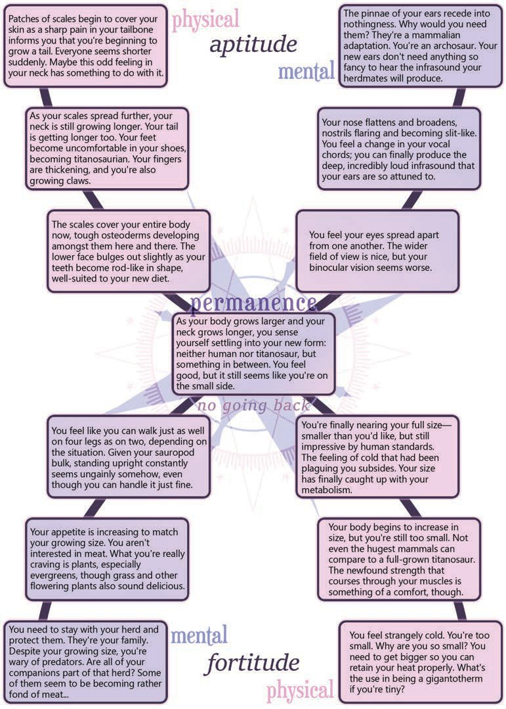

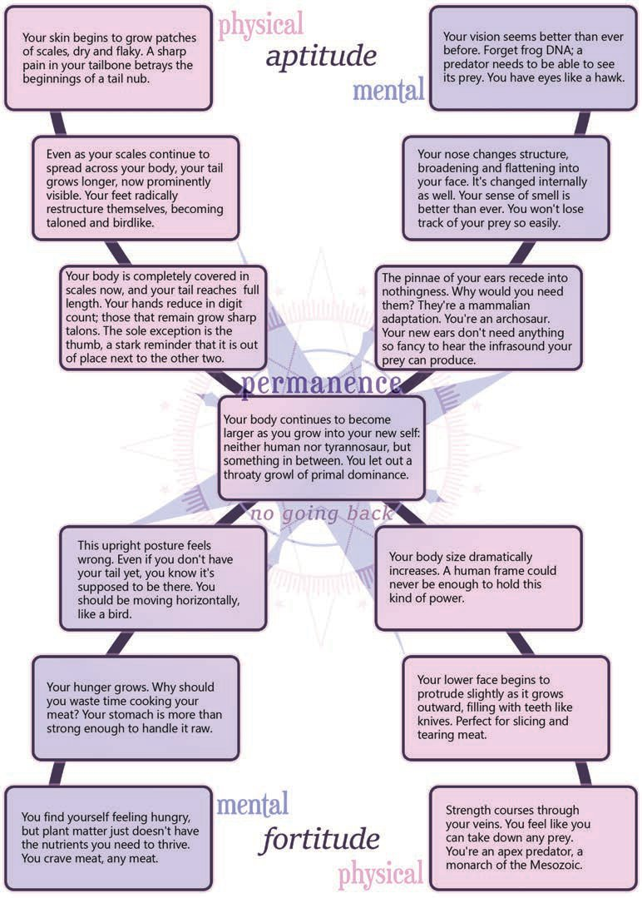

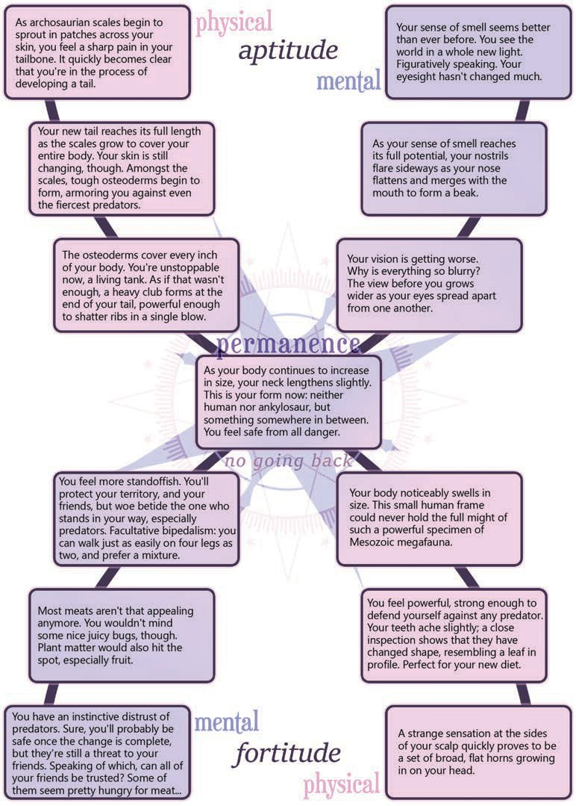

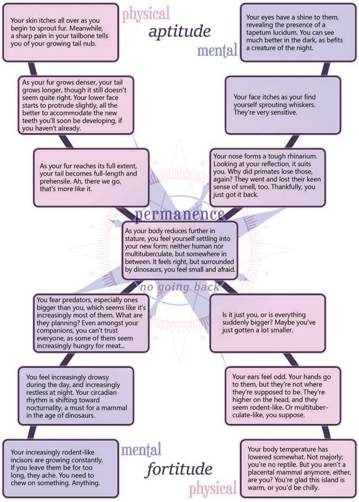

### 結局（ENDINGS）

當玩家抵達基因實驗室——若沒有 Victoria 或 Raven 同行，他們得**強行闖入**。如果玩家**尚未抵達永恆**，可在此取得解藥。如果玩家此前還沒解決掉 Victoria，可能會再爆發一次對峙。科學家們可能試圖扣住解藥不發、要求玩家先簽**保密協議與責任免除書**。無論如何，這裡也有一處**直升機停機坪與運作中的無線電**——玩家可以離島。

要強化戲劇張力，可以讓 **Taylor 親自抵達**——他既氣 Victoria 自作主張、又拼命想把整起事件壓下去。

---

## 故事：No Better Team（沒有更好的搭檔）

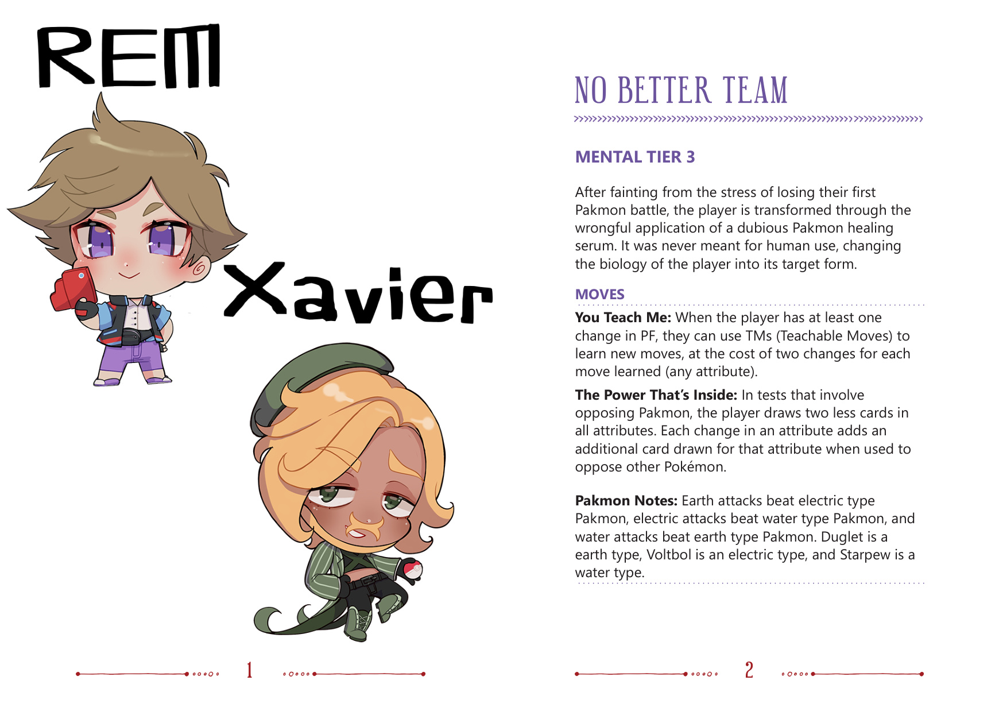

> **心靈等級 3**

在輸掉自己人生第一場**寶可夢對戰**後，玩家因壓力過大而昏厥；隨後被一道**錯用**在他身上的可疑「寶可夢治療血清」啟動了蛻化。那本該是給寶可夢用的——絕非為人類設計——它將玩家的生物學改造為**目標寶可夢**的形態。

### 動作（MOVES）

**這招我教你（You Teach Me）**：當玩家在 PF 上至少有 1 點蛻化時，他可以使用**招式學習器（TM）**學會新的招式——每學一招，承受 2 點蛻化（任意屬性）。

**內在之力（The Power That's Inside）**：在涉及對抗他者寶可夢的檢定中，玩家所有屬性的抽牌都**少 2 張**。但每當他的某項屬性上有蛻化時，便為**「對抗其他寶可夢」用該屬性的檢定**多抽 1 張牌。

**屬性備註**：地面攻擊剋電屬寶可夢、電屬攻擊剋水屬寶可夢、水屬攻擊剋地屬寶可夢。**地鼠**為地屬，**雷電球**為電屬，**海星星**為水屬。

---

### 登場角色（CAST）

#### Rem（代名詞與玩家相同）
玩家的繼弟妹兼勁敵。無論玩家對寶可夢多熱衷，Rem 都更熱衷——他們知道一切關於寶可夢的事，並樂於與任何願意聽的人分享。他們立志成為**寶可夢大師**，但對自己究竟做不做得到充滿不安——擊敗自己那位酷酷的哥哥／姊姊，是唯一能確認自己「具有大師之資」的方式。

#### Kim（she/her）
玩家的繼母——在玩家年幼時收養他。她溫柔而善良，但比起 Rem，她對玩家有更高的成熟度與紀律要求。Kim 擔心兩個孩子過於沉迷寶可夢——擔心他們會離家去當寶可夢大師。她特地拜託 Wolfrando 博士**挑三隻不討喜、且非野生捕獲的寶可夢**給她的孩子們選，希望他們因此對寶可夢失去興趣。

#### Wolfrando 博士（he/him）
**Galiup 島**上的一名「**專業**」寶可夢培育師。他經營一座寶可夢「幼貓場」式的場地——以擁擠悲慘的條件，讓搶手寶可夢與**百變怪**配種。他也接受政府資助、開發寶可夢治療產品；不過他的方法跟他想做出的廉價產品一樣，能省則省。由於他對寶可夢並無情感連結，他願意以手邊大量的百變怪之中任何一隻來對戰。

#### **Team X**：Tammy（she/her）、Kol（he/him）與其領袖 Xavier（he/they）
一個三人組的寶可夢強奪小隊，私自執行**搗毀虐待寶可夢之實驗室**的「正義」。

Team X 會偷走被虐待的寶可夢、放歸自然，但每位成員都只獻身於**單一一隻寶可夢**（Kol 的**多邊獸**、Tammy 的**肯泰羅**）。Xavier 對「**寶可夢大師**」——也就是收集、囤積寶可夢的小屁孩——有特殊的恨意。

由於他們以恐怖行動與破壞達成目的，所有目擊其犯行者都必須被擒、再由 Xavier 的**引夢貘人**抹去記憶。他們的祕密基地建在 Galiup 島深處森林裡的一座山頂，並有直升機可飛抵本島突襲實驗室。

---

### 引子（INTRO）

玩家陪 Rem 前往 Wolfrando 博士的實驗室——他們將領取自己的第一隻寶可夢，作為 Rem 母親萬般央求才答應的、Rem **18 歲生日禮物**的一部分。Wolfrando 博士給玩家三選一：**地鼠、雷電球、海星星**。

Rem 因為對「選第一隻寶可夢」太緊張，央求玩家先選。玩家選好後，Rem 會挑那隻**對玩家屬性具優勢**的寶可夢。Wolfrando 博士拿走最後那隻，並趕兩個孩子滾蛋——好讓自己回去工作；在 Rem 堅持下，他丟給他們幾瓶「寶可夢治療藥水」。

---

### 蛻化（THE CHANGE）

當玩家與 Rem 帶著新領的寶可夢玩耍時，Rem 最終把玩家帶到鎮郊、博士實驗室的後方，要與他來一場**初次對戰**。憑藉屬性優勢，Rem 輕鬆取勝。當玩家的寶可夢昏倒時，玩家自己也開始頭暈、隨即昏厥——醒來時已躺在森林深處，身上承受 **2 點蛻化（任意屬性）**與**心靈屬性 2 點傷害**。

玩家昏倒當下，Rem 慌張之中對他用了博士那批**沒做好的**治療藥水——這啟動了蛻化，把玩家轉化成 Rem 所選的那隻寶可夢。Rem 隨即衝去找救兵。

Tammy 與 Kol 正準備偷襲博士的實驗室，發現了昏倒的玩家——便把玩家拖進樹林深處，遠離他們所埋的炸藥。當玩家正好醒來時，遠處炸藥引爆，Team X 對實驗室的襲擊正式開始。

此時 Rem 目擊了這場攻擊，並在一場寶可夢對戰中被 Xavier 擊敗。

---

### 鋪陳（BUILDUP）

玩家必須穿越森林回到實驗室，閃避受其蛻化氣味吸引的、危險的野生寶可夢。當他抵達實驗室時，會看見 Tammy 與 Kol 正在與博士對戰。

如果玩家**站在博士這一邊**：戰後，若他在 PA 上有 1 點以上蛻化，博士會試圖以**精靈球**捕獲他。
如果玩家**站在 Team X 那一邊**：戰後對方也會試圖捕獲玩家——以滅口、或以為玩家是博士某種寶可夢-人類混種實驗品。

無論哪種情況，**從精靈球中逃脫**需要一次成功的 MF 檢定。每次連續嘗試逃脫，玩家少抽一張牌。

擊敗博士或 Team X 後，玩家得知 Xavier 已抓走 Rem，計劃在 Team X 基地頂端**抹除其記憶**。祕密基地僅能透過**瀑布後的石門**或一條漆黑的洞穴通道進入。

實驗室裡有**招式學習器**，玩家可依自己正轉化成的寶可夢學新招式：
- 若是**地鼠**：學會**碎岩（Rock Smash）**可炸開石門。
- 若是**雷電球**：學會**閃光（Flash）**可照亮洞穴通道。
- 若是**海星星**：學會**攀瀑（Waterfall）**可逆瀑布而上。

否則攀登瀑布頂的路將極為艱辛。他們也可學**小偷（Thief）**——一種惡屬性招式，對 Xavier 的引夢貘人具特效。

---

### 高潮（CLIMAX）

玩家抵達基地頂端時，Xavier 正用引夢貘人抹除 Rem 心中「想成為寶可夢大師」的渴望。然而那夢想沒這麼容易被忘——Xavier 意識到他無法讓 Rem 放棄，便打算把 Rem 從山邊推下、永絕後患。玩家與 Rem 必須**聯手擊敗** Xavier 的引夢貘人——但 Rem 仍處於朦朧狀態，若沒有玩家的鼓勵，他下達的指令可能語無倫次。

---

### 結局（ENDINGS）

擊敗 Xavier 後，若玩家**尚未抵達永恆**、也未被裝進精靈球，可在**寶可夢中心**的治療機台**逆轉蛻化**。玩家與 Rem 可依己意處置 Wolfrando 博士與 Xavier。Tammy 與 Kol 會承認 Xavier 確實做得太過火，並對自家領袖的行為連聲道歉——但他們不想為「自以為是的正義」入獄。

如果 Kim 得知玩家與 Rem 經歷的一切，她會**禁止 Rem 在 21 歲前再碰任何寶可夢**。如果玩家抵達永恆，最終他會徹底成為一隻寶可夢——可能被 Xavier 放歸自然，也可能餘生陪伴在 Rem 身邊。

---

### 譯名說明（NAMING NOTE）

> 原文刻意把名字改一個字以避開商標——本譯本則依**寶可夢百科（52poke）**採用官方繁中譯名。對應如下：

| 原文（為避商標而改字） | 寶可夢原典 | 官方中譯（本譯本採用） |
|---|---|---|
| Pakmon | Pokémon | 寶可夢 |
| Pakball | Poké Ball | 精靈球 |
| Pakplace | Pokémon Center | 寶可夢中心 |
| TM（Teachable Move） | TM（Technical Machine） | 招式學習器 |
| Duglet | Diglett | 地鼠 |
| Voltbol | Voltorb | 雷電球 |
| Starpew | Staryu | 海星星 |
| Blobos | Ditto | 百變怪 |
| Polygorn | Porygon | 多邊獸 |
| Taurus | Tauros（**這個原文確實一模一樣**） | 肯泰羅 |
| Hypnoid | Hypno | 引夢貘人 |

> 原作者按：嘿，這裡有個有用的小撇步——當你和朋友自己團時，其實**你想用什麼名字稱呼這些東西都可以**。

---

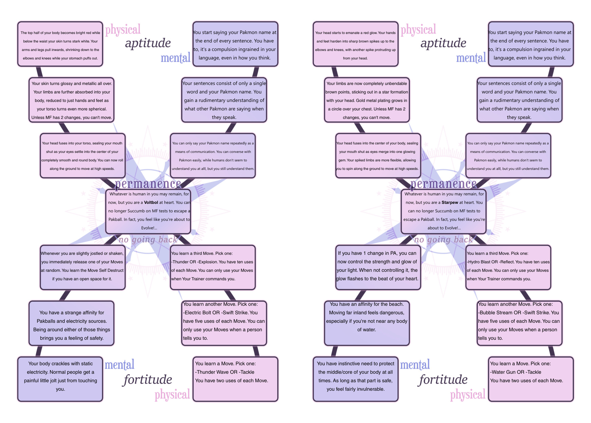

### 雷電球 — 蛻化十字

> **永恆**：你身上仍可保有人性的部分，至少現在是；但你從骨子裡已是一隻**雷電球**。你**不再能**透過屈服於 MF 檢定來逃出精靈球。事實上——你感覺自己**就要進化**了！……

**PA：**
- 你身體上半部變成鮮紅色，腰部以下變成純白色。手腳向內收縮、縮到肘膝為止；肚子向外鼓起。
- 你的皮膚通體變得**光滑而金屬感**。手腳進一步被吸入軀幹，僅剩手部與腳掌；軀幹更加球狀化。**除非 MF 上有 2 點蛻化，否則你無法移動。**
- 你的頭融進軀幹、嘴被封死，雙眼落到完全光滑、渾圓的身體中央。你現在能在地上**滾動**以高速移動。

**MA：**
- 你開始在每句話結尾說自己寶可夢名——一種根植於你語言本身（甚至思考方式）的衝動。
- 你的句子只剩下單一個詞與你的寶可夢名。你能粗略理解其他寶可夢講話的含義。
- 你只能反覆說自己寶可夢的名字當作交流。你能輕鬆與寶可夢對話；人類完全聽不懂你，但你仍聽得懂他們。

**PF：**
- 你學會一招。二選一：**電磁波（Thunder Wave）** 或 **撞擊（Tackle）**。每招使用 2 次。
- 你再學一招。二選一：**十萬伏特（Thunderbolt）** 或 **電光一閃（Quick Attack）**。每招使用 5 次——但**只能在他人指示時使用**。
- 你學第三招。二選一：**打雷（Thunder）** 或 **大爆炸（Explosion）**。每招使用 10 次——但**只能在訓練家命令時使用**。

**MF：**
- 你的身體迸發靜電。普通人單純碰到你都會受到輕微的、令人疼痛的電擊。
- 你對精靈球與電力源有奇特的親近感——靠近其中一者都讓你感到安全。
- 每當你被輕微震動或搖晃，你會立即隨機釋放一招你已習得的招式。如果還有空位，你便會學會**自爆（Self-Destruct）**。

---

### 海星星 — 蛻化十字

> **永恆**：你身上仍可保有人性的部分，至少現在是；但你從骨子裡已是一隻**海星星**。你**不再能**透過屈服於 MF 檢定來逃出精靈球。事實上——你感覺自己**就要進化**了！……

**PA：**
- 你的頭部開始發出紅光。雙手雙腳直到肘膝為止硬化為棕色尖刺，頭頂另冒一根尖刺向上。
- 你的四肢現在完全是不可彎曲的棕色尖角，與頭一同呈星形伸展。一圈金屬鍍片在你胸口形成。**除非 MF 上有 2 點蛻化，否則你無法移動。**
- 你的頭融進身體中央、嘴被封死，雙眼合而為一顆發光的寶石。你尖刺的肢體更具靈活度——你可在地上**旋轉滾動**以高速移動。

**MA：**
- 你開始在每句話結尾說自己寶可夢名——一種根植於你語言本身（甚至思考方式）的衝動。
- 你的句子只剩下單一個詞與你的寶可夢名。你能粗略理解其他寶可夢講話的含義。
- 你只能反覆說自己寶可夢的名字當作交流。你能輕鬆與寶可夢對話；人類完全聽不懂你，但你仍聽得懂他們。

**PF：**
- 你學會一招。二選一：**水槍（Water Gun）** 或 **撞擊（Tackle）**。每招使用 2 次。
- 你再學一招。二選一：**泡沫光線（Bubble Beam）** 或 **電光一閃（Quick Attack）**。每招使用 5 次——但**只能在他人指示時使用**。
- 你學第三招。二選一：**水炮（Hydro Pump）** 或 **反射壁（Reflect）**。每招使用 10 次——但**只能在訓練家命令時使用**。

**MF：**
- 你本能上要保護身體中段／核心。只要那個部位安全，你會覺得自己幾乎刀槍不入。
- 你對海灘有特殊親近感。離海岸過遠會讓你感到危險，特別是身邊沒水的時候。
- 若你 PA 上有 1 點蛻化，你能控制自身光的強弱。在你不主動操控時，光會隨你的心跳閃爍。

---

### 地鼠 — 蛻化十字

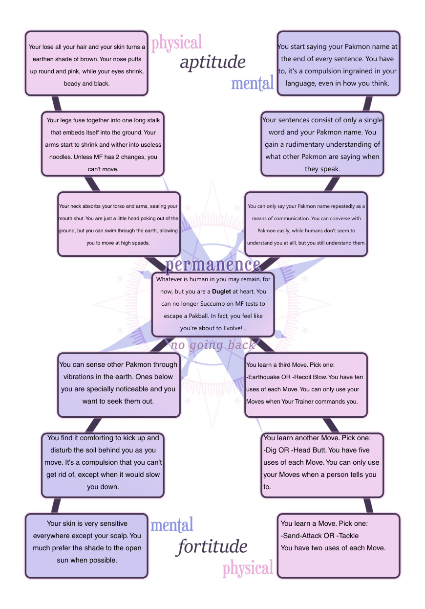

> **永恆**：你身上仍可保有人性的部分，至少現在是；但你從骨子裡已是一隻**地鼠**。你**不再能**透過屈服於 MF 檢定來逃出精靈球。事實上——你感覺自己**就要進化**了！……

**PA：**
- 你掉光所有頭髮，皮膚轉為土棕色。鼻子蓬起、變圓變粉，眼睛縮小、又黑又亮。
- 你的雙腿融合為一條長長的莖，紮進地裡；雙臂萎縮成無用的麵條。**除非 MF 上有 2 點蛻化，否則你無法移動。**
- 你的脖子吸收了你的軀幹與雙臂，嘴被封死。你只剩下一顆從地裡探出的小頭——但你能**在土中游動**，以高速移動。

**MA：**
- 你開始在每句話結尾說自己寶可夢名——一種根植於你語言本身（甚至思考方式）的衝動。
- 你的句子只剩下單一個詞與你的寶可夢名。你能粗略理解其他寶可夢講話的含義。
- 你只能反覆說自己寶可夢的名字當作交流。你能輕鬆與寶可夢對話；人類完全聽不懂你，但你仍聽得懂他們。

**PF：**
- 你學會一招。二選一：**潑沙（Sand-Attack）** 或 **撞擊（Tackle）**。每招使用 2 次。
- 你再學一招。二選一：**挖洞（Dig）** 或 **頭錘（Headbutt）**。每招使用 5 次——但**只能在他人指示時使用**。
- 你學第三招。二選一：**地震（Earthquake）** 或 **捨身衝撞（Take Down）**。每招使用 10 次——但**只能在訓練家命令時使用**。

**MF：**
- 你的皮膚除了頭頂之外都極為敏感。可能的話，你比較喜歡陰影而非陽光。
- 你會在移動時忍不住把身後的土壤揚起、攪亂——一種無法擺脫的衝動，除非那會拖慢你。
- 你能透過大地的振動感知其他寶可夢。在你下方的特別清晰，你會想去尋找他們。

---

## 故事：Our Lady（聖母）

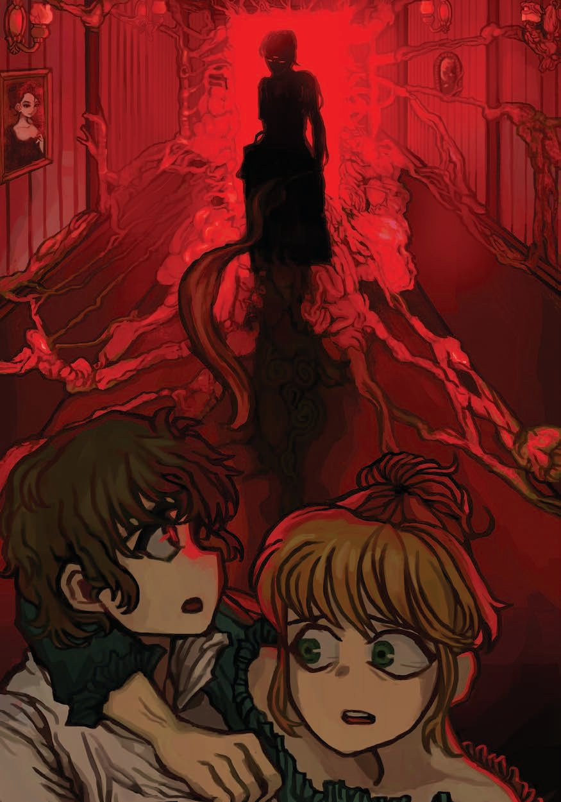

> **心靈等級 4**

這場蛻化與<strong>緋紅女王（The Crimson Queen）</strong>的影響本質上密不可分——她是一個來自彼世的存在，**呼喚**也**腐化**，許諾以「永恆侍奉於她的隨侍中」換取無從述說的歡愉。被囚禁於另一現實、急欲掙脫的緋紅女王，將闖入者的肉體與靈魂綁定在她的意志之下，更動其形與其念，使他們更討她歡心。

### 動作（MOVES）

**疤痕現實（Scarred Reality）**：每當有玩家以「蛻變」方式承受一次**心靈屬性**蛻化時，**Briar House 會偏移**（見下方 Briar House 狀態表），更深一層地揭露其真貌。

**臣服（Submission）**：任何屬性合計上有 4 點以上已蛻化屬性點的玩家，會**暗中為緋紅女王服務**——試圖把其他人從團體中孤立出來、帶往「**紅色房間（The Red Room）**」。他們的話語充滿誘惑——被孤立的目標必須通過 MF 檢定才能抵抗。

---

### 登場角色（CAST）

#### Alice Jackson（she/her）
大學畢業生，**Ghost Gals Podcast** 的共同主持人。Alice 從小就被旁人形容為「想像力過剩」。身為一名恐怖類重度愛好者，她樂於對任何願意聽的人講述充滿悲劇與背叛的下三濫故事。她憑這項才能，把《Ghost Gals》從朋友間的同好計畫推上網路上首屈一指的靈異調查 Podcast 之一。當然，她**自己也相信那些故事**這點頗有助益。她是順性別——而**另一個 Alice** 不會讓她忘記這點。

> 「你聽我說，我只是覺得我們**不該那麼快**就否定『海鷗鬼魂』這個可能性。」

#### Alice Barker（she/they）
大學中輟，《Ghost Gals Podcast》的共同主持人。沉穩、分析型——對超自然事物維持著「健康的」懷疑，並在搭檔那較開放的姿態旁，舒適地擔任質疑者的角色。**這個人格是建構出來的**——一面防衛機制：藏起她童年時與某個來歷不明的惡意存在交手的事，那場遭遇讓她對「無法解釋之事」深感恐懼。Alice 是跨性別女性，**而且絕對不會閉嘴**。

> 「歡迎來到《Ghost Gals》！我是字母 B 的 Alice，而我覺得登月是真的——不騙你！」

#### Reginald Briar II（he/she/they）
小有名氣的考古學家，也是 **Briar 莊園**最後一位繼承人。Reginald Briar II 親眼看著一個曾經顯赫的家族沒落——他揮霍掉所有財富，並在大約 **150 年前**於神祕情境下消失。他逐步陷入秘術的痕跡遍布整棟宅邸——而被緋紅女王碰觸過的人，甚至能與「他**已成為**的那個東西」對話。

> 「我即將取得突破。我能感覺到她。**門將被打開**。」——Reginald Briar II 日記節錄

---

### 引子（INTRO）

玩家是靈異調查 Podcast《**Ghost Gals**》的工作團隊／嘉賓陣容。他們與兩位 Alice 一同調查 **Briar House**——一座因多起失蹤事件惡名昭彰的廢棄世家宅邸。當他們抵達時，一場暴風雨正在逼近。在繞過上鎖鐵門與環繞四周的鐵網柵欄之後，他們進入屋內架設裝備、進行初步勘查——準備迎接接下來漫長的錄製夜。

### 蛻化（THE CHANGE）

很快地，玩家便會明白：探索 Briar House 並不容易。歲月對這棟建築並不仁慈，要穿越不穩的地面、繞過被堵死的通道，玩家會需要一連串的屬性檢定。兩位 Alice 建議眾人**分成兩組**以涵蓋更多區域——**每組各有一位 Alice**，每組配給**一支對講機**。

當玩家深入這棟宅邸的核心，他們會發現種種顯示 **Briar 似乎陷入瘋狂**的線索——以秘術典籍與某種儀式痕跡的形式存在。在面對這些令人不安的揭露時，請進行 **MF 檢定**。

團隊也可能會找到先前數批調查者的明顯蹤跡——與整體維多利亞風格裝潢形成鮮明對比的現代物件。透過成功的 **MA 檢定**，他們能辨認出這些物品屬於**近期失蹤者**。

宅邸三樓有一條長廊，盡頭是一扇漆成深緋紅的門。**這扇門會召喚有蛻化的玩家**。任何碰它的人都會立刻承受 **2 點心靈蛻化**，並獲得關於緋紅女王及其囚禁的知識。**這扇門對任何不為緋紅女王效力之人皆是上鎖的。**

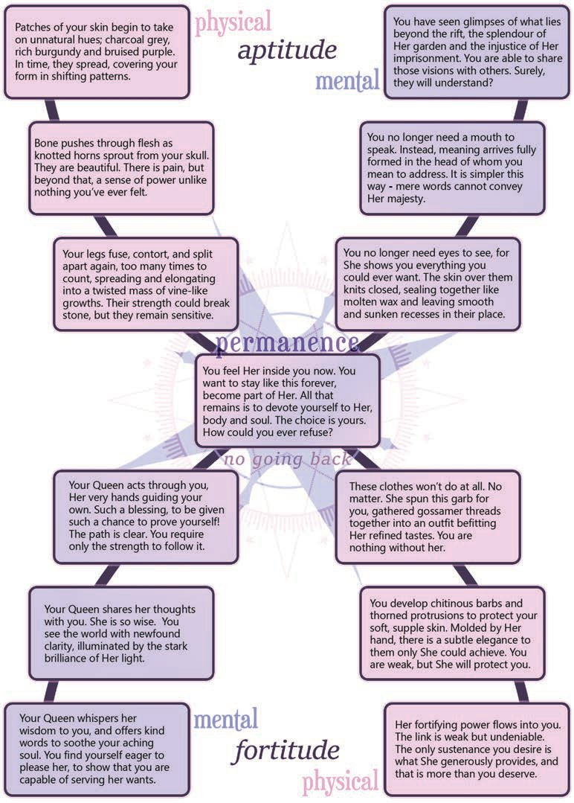

### 鋪陳（BUILDUP）

詭異感升級——**Briar House 開始顯露真貌**：出口被封死，玩家被困在裡頭。玩家若想逃出，必須找到線索（見下表）來理解周遭正在發生的詭事。在「重點房間」中通過 PA 與 MA 檢定可揭露這些線索。

與此同時，那些已落入緋紅女王控制的人會加緊腐化其他玩家與兩位 Alice。**抓人的肉藤、消失的門框、外型扭曲卻又勾人的身影**——一切都試圖把單獨的玩家與隊伍分開——抗拒這些得通過 PF 或 MF 檢定。

空間、時間、因果亦使狀況更加複雜——Briar House 內現實的不穩定性，讓導航變得愈來愈不合邏輯。被孤立的玩家可能發現自己困在看似無盡的循環走廊裡，或感受到時間流速異於常人。要逃出這些異常，需通過 PA 或 MF 檢定。

兩位 Alice 會以她們的超自然知識給玩家提示協助。如果玩家受到的挑戰還不夠，**讓其中一位 Alice 屈服於緋紅女王**——開始替她推進議程。

### 高潮（CLIMAX）

最終對峙發生於**紅色房間**——它的門此時對所有人敞開。房內，牆面如活物般蠕動、搏動著，**潮紅而濕潤**——由一個唯一、不可能存在的光點所照亮——那是**次元裂隙**。

服侍緋紅女王的玩家會公開立場——將自己**與地板與牆面融合**——並乞求其他人加入。一旦碰觸到他們，那些肉就會擴散，把任何接觸者**勒緊並拖入**——脫身需通過 **PA 檢定**。

裂隙之外，便是**女王的庭園（The Queens Garden）**——她影響力的所在，也是「已與她同為一體」之人們的家園。裂隙能被關閉，但首先必須<strong>透過 PA 檢定移除主石（keystone）</strong>讓它**失穩**，接著把那塊主石帶回物質世界。庭園的現實會腐化人心——玩家須在過程中不時通過 PF 與 MF 檢定，否則會被拉偏迷失。此外，**女王本人**會直接試圖誘惑闖入者——化身為「曾是 Reginald Briar II」的存在，被扭曲為她認為對玩家最具吸引力的形體。

### 結局（ENDINGS）

裂隙一旦失穩，便能被永久關閉——前提是**緋紅女王在我們的現實中再無立足之地**。為此，被腐化的玩家必須**從她的掌握中被解放**、**被推回裂隙之外**、或**被殺**。一次成功的 MA 檢定可用來訴諸他們殘存的人性（如果還有的話），但最終任何決定**只屬於他們自己**。**已抵達永恆**的玩家，已不能視為與女王有任何意義上的分離。

裂隙失穩會限縮女王在我們世界的力量，並給予玩家逃離 Briar House 的機會——前提是他們能撐回到入口。

如果裂隙被關閉，逃出 Briar House 的玩家不再感受到女王在腦中的影響——但**輕微的肉體屬性蛻化會無限期保留**。

如果裂隙仍開啟，逃出 Briar House 的玩家仍然能聽見**她的呼喚**。他們屈服只是時間早晚的問題。**如果所有玩家都把自己交給緋紅女王，她的影響力會愈來愈強——他們屬於她，身與靈皆然。**

---

### Briar House 狀態表（每次心靈蛻化蛻變時遞進）

| 階段 | 描述 |
|---|---|
| 0 | 沉默靜靜壓在 Briar Hall 嘎吱作響的木材之下；百年的塵土與汙垢遮蔽了任何殘存的奢華痕跡。 |
| 1 | 屋宅展開了。封閉的房間與被堵死的走廊向調查者打開，邀他們更深入內裡。 |
| 2 | 歲月剝落而去，把一份詭異的「生命感」還給這些被遺棄已久的通道。 |
| 3 | **某種事物深深地不對勁**。你聽見閉門背後傳來的笑聲；烏木色的藤蔓勒住了走廊。 |
| 4 | 空氣搏動著一股令汗毛直豎的脈動能量。牆面變得濕潤，被一道病態的緋紅色光所照亮。 |

### 線索表（Clues）

| d22 | 內容 |
|---|---|
| 0–3 | 各儀器讀數顯示宅邸**三樓**有某種**空間異常**。 |
| 4–6 | 一卷錄影機磁帶。畫面嚴重損壞的錄像顯示出前一支調查隊**最後僅存的成員**——他描述了夥伴們是如何反過來對付他。 |
| 7–10 | 一張**巨石建築結構**的潦草設計圖，上面以**未知文字**作著註解。 |
| 11–14 | Reginald Briar II 日記節錄——描述他**從歐陸某位古玩販子手中**取得了一塊「關鍵之石（keystone）」。 |
| 15–17 | Reginald Briar II 日記中的沉思——描述他對某個被以多重名稱稱呼的存在的痴迷：**緋紅女王**、**血肉聖母（Our Lady of the Flesh）**、**帶刺的女主人（the Barbed Mistress）**。 |
| 18–21 | 牆上的塗鴉——以螢光綠寫著一行字：**「她在呼喚——我們又怎能不應？」** |

### 重點房間（Rooms of Interest）

| d22 | 房間 |
|---|---|
| 0–3 | **客廳（Parlor）**：房間中央是一團**無眼身軀**相互交纏的群體。難以看出哪個身體在哪裡開始、又在哪裡結束。 |
| 4–6 | **書房（Study）**：泛黃的紙張糊滿牆與天花板。多數一碰就化為塵土；少數能撐到讀完——上面寫著「**歡迎回家**」，後面接著一名玩家角色的名字。 |
| 7–10 | **主臥（Master Bedroom）**：一面牆全是被砸碎的鏡子。對牆掛著一幅**美麗女性的肖像**，**她的雙眼被刮掉**。 |
| 11–14 | **餐廳（Dining Room）**：桌椅在房間一角堆成一團。桃花心木地板上刻著繁複的線條，凹槽中填著**已凝固的紅蠟**。 |
| 15–17 | **日光室（Solarium）**：骨架般的鐵框圍出一面**密布黑色藤蔓**的牆。透過那叢藤可見的庭園顯得病態而畸形。 |
| 18–21 | **送菜小窗（Dumbwaiter）**：牆上的凹處幾乎完全被**搏動的紅色觸鬚**覆蓋。它們會伸出來愛撫經過的人。 |

---

## 故事：She Who Divided the Sexes（劃分兩性者）

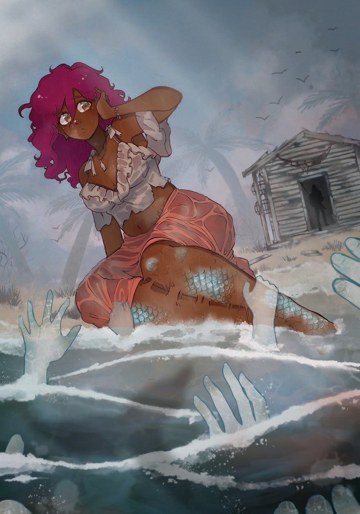

> **心靈等級 3**

這場蛻化源於釋放偉大女神 **Mue（穆耶）**——已失落的**亞特蘭提斯性別與性向之神**——所遺留下的殘餘效應。Mue 並未回到永恆神殿，而是**意外地與玩家綁定**，並透過這份特殊連結開始改變玩家的性別。除此之外，玩家本身並不受她那無比力量的影響——他們必須在 Mue 對凡世造成的影響大到無從收拾之前，找到方法**斬斷這份綁定**。

> 使用跨性別蛻化輪盤。

### 規則（RULES）

**神聖懲罰（Divine punishment）**：若玩家試圖**隱藏或否認**任何肉體屬性的蛻化，Mue 會被冒犯，並立刻在**對立的心靈屬性**上給予一點蛻化（**PF ↔ MA**、**PA ↔ MF**）。

**安撫（Appeasement）**：每當玩家蛻變一次，Mue 便心情甚佳，<strong>眷顧等級（Favor）</strong>提升 1（見下方眷顧等級表）。她的眷顧等級愈高，能應玩家所求動用的力量便愈大。

---

### 登場角色（CAST）

#### Mue（劃分男女者／至聖之神性者）（she/her）
壯麗的**亞特蘭提斯性別與性向之神**。她當年想出「把原始人類劃分為男與女」這個「絕妙」點子之後，便把自己封進一塊魔法稜柱中，好讓她那「永恆的智慧」在未來必要時能被取出。當然，社會繼續發展，而她的智慧**老得頗為不堪**。

她相信非常**過時且晦澀的性別角色**，尤其堅信「性別純粹是二元的」。任何性別之間的不平等都是對她神聖願景的褻瀆，必以巨大報應回敬。

Mue 只能被**被她綁定的人**與**所有跨性別者**看見並交談——後者全都具備充當她「靈媒」的能力。由於 Mue 來自神祇之時代，她在凡塵的存在**極具破壞性**。她被綁定愈久，混亂便愈會跟在她身後擴散——24 小時內，她會開始**權力上癮**，並認真考慮**創造一個會下蛋的巨人第三性別**。

#### Jim Richards（he/him）
**Hembrick Imports** 的執行長，玩家的老闆。<strong>典型「不容廢話」</strong>型主管，只要沒人攪局或冒尖，他便還算好相處。最近離婚過得不順，他**完全不想對自己的性別表現或性向進行任何深層思考**。

#### Lou Green（性別與代名詞**取與多數玩家不同者**）
玩家的**友善勁敵**兼同事。Lou 是櫃內的跨性別者，對玩家充滿強烈的**性別嫉羨**——並／或嫉妒他們對自己的性別表現如此自在。為此他喜歡黏在玩家身邊，同時又在老闆面前展現自己的優越。Lou 不希望玩家被開除，但也不想看玩家升官。

#### Helena Pleante（she/they）
玩家的另一位同事兼多年好友。Helena 對神祕學深深著迷，蒐集**療癒水晶**，每一集《古老太空人》都看。一個經常做白日夢的人，常常工作落後、需要玩家幫忙。她對**亞特蘭提斯儀式藝術**的廣博知識，這次或許剛好能派上用場。

---

### 引子（INTRO）

玩家是 **Hembrick Imports**——一家負責倉儲、向其他零售商配貨銷售的大型批發業——的經理人。他們的工作大半是決定如何讓進來的存貨**動得最大化**。當天稍晚將舉行一場與股東的大型會議，會中會給「**最具創新潛力**」的經理人一個甜美的升遷機會。

當玩家來到公司時，**Helena** 請他們幫忙整理一批**新到的古董收藏品**。玩家可以選擇是否幫忙；若不幫，便有更多時間為大會議寫一份或多份簡報。如果有幫她決定古董要送往何處，**Lou 可能向老闆告狀**：玩家在簡報上偷懶。

無論如何，當 Helena 整理完，會剩下**一件沒被送出**的古董。玩家回到工作崗位時，會發現 Helena 把那件物品——一塊**奇異的稜柱古物**——留在某位玩家的桌上：可能是答謝他們的協助，也可能只是「我懶得處理」。

### 蛻化（THE CHANGE）

碰觸這塊稜柱會在一道閃光中**釋放 Mue**——這位亞特蘭提斯性別與性向之神。被光芒籠罩的女神以神性的禮樂登場，先是把玩家灑了一身肉麻誇讚，然後便要告辭返回神域。**不幸的是**，她很快便發現自己已被綁定在玩家身上、**困在地球**了。

更糟的是，她的神性能量正讓玩家**改變性別**。**每位玩家起始承受 1 點肉體蛻化、1 點心靈蛻化。** 雖然這對 Mue 而言是無心之舉，但她一注意到，便會為了維持自己的尊嚴**假裝這是她故意的**。

### 鋪陳（BUILDUP）

要切斷 Mue 與玩家之間的連結，他們需要蒐集 **［玩家數 + 2］件神聖古物**——是 Helena 今早送出的那批古董裡的一部分。如果玩家**有**幫她那項工作，他們便大致知道每件古物的位置。否則他們得等 Helena 從隔壁 **Pemura Bread** 餐廳吃完午餐回來。

所有神聖古物原是普通古董——但形狀**可疑地暗示著**陽具與陰戶。它們最終分別在：

- **被鎖在儲藏室**——玩家得找到清潔工拿鑰匙。
- **配貨部一疊紙箱頂端**——玩家得做肉體屬性檢定爬上紙箱、或從配貨樓層調用一台堆高機。
- **某間性別分區的廁所裡**（當然）。當玩家試圖取回時，請安排另一個角色在場。
- **Jim Richards 的辦公室**——埋在一堆紙箱中，玩家得在 Jim 沒注意到的情況下翻找。
- **要被送出的物流路線上**、或正準備被某客戶從銷售樓層**買走**。

儀式必須在**樓頂**——也就是會議室正上方——進行。完成儀式需要**所有古物到齊**，並要有**一名跨男、一名跨女、一名非二元者**陪同 Mue **不間斷地吟誦三分鐘**。

Jim 不會相信玩家關於 Mue 的說詞——若他抓到玩家在他們本應為大會議做準備時跑去找古物，他會嚴厲斥責。他會下令玩家完成這類雜務：

- **修理會議室投影機**——那位 IT 員工正在卡關，缺幾條他需要的線。
- **為所有高階主管列印當日的會議流程表**——另一位同事正在影印機那邊跑一份很長的列印工作。
- **把自己「創新」的簡報上傳到公司的雲端共享服務**——當玩家試圖傳檔時，**Wi-Fi 偏偏掉了**。

無法完成這些雜務任一項，Jim 都會大聲威脅要把玩家炒掉。即便他沒真的炒，他的咆哮也會迫使玩家進行 MF 檢定，否則因壓力承受傷害。當然——這一切阻撓與耽擱**全是 Lou 在背後搞的**。他會表示願意幫忙——但**只在玩家絕望到一定程度時**才出手。

Lou **能看見 Mue**——他立刻對「玩家居然在公司裡帶著一個飄逸的裸女走來走去」起了疑心。如果讓 Lou 與 Mue 有機會交談，**他們會迅速一拍即合**。Mue 認定 Lou 是她最寵的忠誠跨性別祭司／女祭司「**Luosusha**」的轉世。Lou 意識到 Mue 擁有可以助他過渡的魔法力量——但更重要的，是能在大會議前**讓玩家陷入麻煩**。Lou 會策劃把 Mue 從玩家身邊引開，並在辦公室製造混亂、把責任推到玩家身上。

Helena **看不見 Mue**。但如果玩家把狀況解釋給她聽，Helena 會去諮詢她的「神祕學來源」（**她的瑜珈群組**）尋找解方。她會提供另一個**替代儀式**——能把 Mue 與玩家分離，但仍允許 Mue 繼續以塵世姿態存在。Mue 一開始會對 Helena 那「**模糊的非二元感**」抱有戒心；玩家必須說服 Mue 拋開她對「二元性別」的執念。至於 Helena，她**單純興奮**：「能遇到一位真正的亞特蘭提斯人耶！」

如果 Helena 沒被擋下，她會在公司同事中**召募一個小型 Mue 教派**。他們會站在辦公樓電梯前傳教——預告即將到來的「偉大奇蹟」，例如：**最低工資調漲**、**週休三日**。

### 高潮（CLIMAX）

當玩家蒐齊大部分古物時，股東主管們抵達樓頂的大會議。他們對辦公室員工與玩家**毫無敬意**。

Mue 看到主管**全是男人**便深感厭惡，要求玩家**拆解這個父權權力結構**。大會議無可避免地陷入混亂——Mue 對股東們釋放她的性別扭曲之力、Lou 試圖做出完美簡報以打動主管、Helena 闖進會議室想用它來做儀式。

### 結局（ENDINGS）

如果玩家**完成原儀式**，Mue 返回神性以太，所有蛻化對**未抵達永恆**的人全部復原。如果玩家照 **Helena 的儀式**做，蛻化會停下（但**不會逆轉**），且 Mue 會**物質化為一名普通人類**。

如果玩家在大會議上**端出成功且有創意的簡報**，**什麼也不會發生**——主管們**從來就沒有打算給誰升遷**，雖然他們會樂於剽竊玩家的點子來牟利。

如果玩家讓 Mue 改變主管們的性別，他們因深陷恐跨與厭女**而在錯亂中自己把自己開除**。玩家可以在這場權力真空中當上 CEO，或趁此機會把職場**組成工會**。

如果儀式在會議結束前**仍未完成**，Mue 的力量會失控到玩家無法駕馭——失落的**亞特蘭提斯**大陸從<strong>尼斯湖（Loch Ness）</strong>重新浮起，玩家必須前往那裡，作為 Mue 的隨侍。

---

### 眷顧等級表（FAVOR LEVEL）

| 等級 | 內容 |
|---|---|
| **1** | 若有禮地請求，Mue 可微調某人的性別、或撩動其性傾向。她也會揭示「以神聖古物切斷她與玩家連結」所需的儀式。 |
| **2–3** | 若以更隆重之姿請求，Mue 可完全更換一個人的性別、抹除其全部性別識別特徵、或誇張化其性別表現。 |
| **4–5** | 若以盛大儀式祈禱，Mue 可改變**整個世界**對性別常規或性實踐的社會觀感。 |
| **6+** | 若獻上夠華麗的供品，Mue 可改變**全人類**與性別表現相關的某項生物特徵。 |

---

## 故事：Six Gossamer Rings（六輪薄紗）

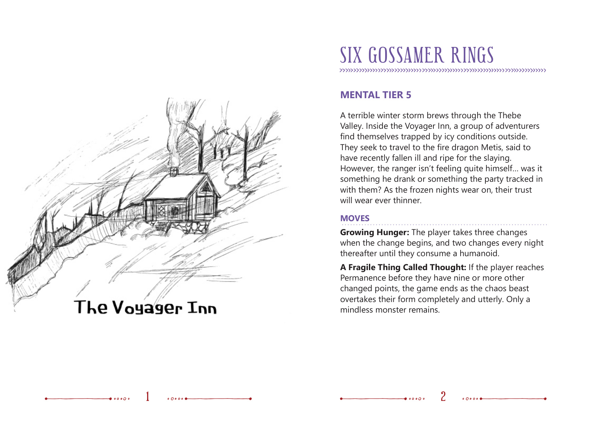

> **心靈等級 5**

一場可怕的冬季暴風雪席捲 **Thebe 山谷**。在 **Voyager Inn**（旅人客棧）裡，一支冒險者隊伍被外頭結冰的天候困住。他們本要前往火龍 **Metis** 的所在——傳聞那條龍最近染病，正適合屠龍。然而，那位**遊俠**今天看起來不太對勁……是他喝下了什麼，還是隊伍帶進來了什麼？隨著被冰封的長夜推進，他們之間的信任也越磨越薄。

### 動作（MOVES）

**滋長的飢渴（Growing Hunger）**：當蛻化開始時，玩家承受 3 點蛻化；此後**每晚承受 2 點蛻化**——直到他**吞食一名類人生物**為止。

**思想這易碎之物（A Fragile Thing Called Thought）**：若玩家在累積到 **9 點以上其他蛻化點**之前就抵達**永恆**，遊戲結束——混沌之獸完全、徹底吞噬了他的形貌，只留下一頭無心智的怪物。

---

### 登場角色（CAST）

#### Amalthea（she/her）
人類酒侍、廚師——亦是 Voyager Inn 的老闆。紅髮、美麗、有點呆萌、運氣甚好。她正在哺育 4 個月大的嬰兒，因此玩家近來在客棧裡承擔了她大部分的吧檯工作。

#### Conellio（he/him）
Amalthea 的丈夫。他與她一樣負責客棧裡的服務，但不是個人緣派。對任何不正當行為都有銳利的眼光，對任何可能威脅客棧安全的事極度多疑。

#### Palisphate（he/him）
隊伍的法師。隊上**唯一**會火系咒法的人，他常用之。表面上他像是隊伍的領導者——但這只是因為**所有寶藏與工具都裝在他的魔法側包裡**。

#### Iona（she/her）
隊伍的牧師。一位侍奉豐收神 **Hilmata** 的矮人女祭司。她是次要戰鬥手，使用一柄大槌。極為值得信任——但她過於誠實的天性使隊上沒有任何人願意對她說祕密。

#### Gillian（they/them）
隊伍的吟遊詩人。一名戴著無臉面具的**仙界換生靈（fae changeling）**。開朗、滿身愉悅；但即使有如此迷人的個性——誰能完全信任一個無臉的變形者？

#### Valeuldo（dae/diem）
隊伍的咒法師。一位高大的黑暗精靈，修習死靈法術。Diem 那股邪氣本就讓人生疑——尤其當屍體開始莫名失蹤之時。

#### Carmie（they/her）
隊伍的盜賊。一名年輕的半惡魔，禮貌差、手腳快。即使表現最佳的時候——誰會去信任一名職業罪犯？

#### Jovian（he/him）
隊伍的戰士。一位手持巨大大劍的高大半獸人。初次見面親切而隨和——但其餘隊員都知道，他在戰火中會變成一頭暴怒的怪物。

#### Kent（he/him）
隊伍的遊俠與嚮導。他飼養著一個酗酒問題，以及其他成癮傾向。一點都不善社交、毫無耐性、寡言。

#### Alkin（he/they）
附近的伐木工兼德魯伊。他可變身為**巨熊**以保護附近鎮民與森林。會到客棧拜訪，向 Conellio 通報壞天氣或盜賊出沒。

---

### 引子（INTRO）

玩家是 Voyager Inn 的酒保，住在 Thebe 山谷中的 **Jurpo** 鎮上。他們今天從處理常客開始——直到 Conellio 扛著一車柴薪走進來，說 Alkin 警告他**接下來幾天會有大暴雪**。話音剛落，雪就開始下，並在整日內愈發猛烈。

當常客紛紛回家後，Palisphate、Iona、Gillian、Valeuldo、Carmie、Jovian 與 Kent 一行人從寒風中走進客棧。Palisphate 開出一筆可觀金幣，要求**全套食宿**直到風暴過去。

此時外頭已是風雪交加的徹底白茫——回鎮上已危險。Amalthea 提議玩家也住進客棧的客房之一，剩下五間樓上房間留給七位冒險者自行分配。

Palisphate 用火系咒法為壁爐附魔，溫暖整座客棧；其他隊員或點酒、或忙著消磨時間，等待夜幕降臨。

---

### 蛻化（THE CHANGE）

入夜前，玩家被請去客棧旁的馬廄查看冒險者的馬。當他這麼做時，被某個神祕襲擊者從背後擊倒——數小時後，Gillian 發現他昏迷在馬廄。玩家背上有道**漆黑、條紋狀**的傷口，正在迅速癒合。多匹馬不見蹤影，隊伍認為這是當地**狼人（gnoll）**所為。

但實際上，玩家**也被一塊「混沌之獸」的碎片感染**——它附在其中一匹馬的腹下，趁玩家昏厥時鑽進其傷口。它是一隻**改塑血肉的怪物**，現在住在玩家體內，渴望透過併入更多軀體來成長。它也感染了一名 gnoll 與一匹失蹤的馬。

---

### 鋪陳（BUILDUP）

事件後，隊伍進入高度戒備、決定**輪班守夜**，以防 gnoll 再度來襲。

Kent 上床時看起來病容滿面、嘔吐不止，醒來時還宿醉嚴重，整日臥床不起。他懷疑有人下藥（**事實**是他的酗酒已導致慢性腎衰竭）。

第二天早晨，風稍緩，但雪仍堆積如山。沒有 Kent 的健康狀態，隊伍無法穿越風暴——只好決定再多住一天看看天氣。

緊張開始顯露，隊員間出現內鬥。某個時間點，gnoll 來襲擊客棧——半數隊員衝出去迎戰。那群 gnoll **已被改造為一團多肢的怪物團塊**，會傷到其中一名隊員。事後，Alkin 趕來警告 Conellio——雪中有一隻怪物在徘徊（**那匹失蹤的馬**）。

此時，隊伍拼湊出真相——他們上次冒險戰鬥過的「混沌之獸」一路跟到了這裡。Jovian 在自己靴底發現了還在蠕動的混沌之獸殘塊，這證實了猜測。從這一刻起，地獄般的指控在隊員與玩家間飛揚——他們知道「**混沌之獸一旦在宿主中成熟，就能附身任何人並完美擬態**」。

Palisphate 提議用火系咒法測試所有人——混沌之獸對明火會產生劇烈疼痛。但他每天只有 5 個咒術位，且永遠會留最後一次給自衛。

---

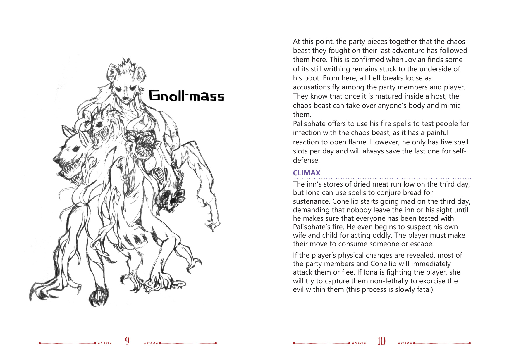

### 高潮（CLIMAX）

第三天，客棧的乾肉儲備見底。Iona 可以以咒法**召出麵包**充飢。Conellio 開始在這天瘋狂——堅持沒人能離開客棧或他的視線，直到所有人都被 Palisphate 的火驗過為止。他甚至開始懷疑自己的妻女、看她們行為奇怪。**玩家必須抓住時機——要麼吞食一人、要麼脫逃。**

如果玩家的肉體蛻化暴露，大多數隊員與 Conellio 會立刻攻擊或逃離。如果與玩家對戰的是 Iona，她會試圖以**非致死方式制服**玩家、再對其進行**驅魔**——這一過程**會緩慢致死**。

#### 隊員間的暗中觀察

| 角色 | 監視對象與動機 |
|---|---|
| Palisphate | 監視 Valeuldo——黑暗精靈壽命長到不可思議，他對長者保持敬意。 |
| Iona | 監視 Carmie——Iona 立誓要保護年幼者免受邪惡影響，將來要為 Carmie 驅除其惡魔之側。 |
| Gillian | 監視 Jovian——這名半獸人的臉孔與身體是 Gillian 偏好的形態，因此他會用心研究 Jovian 的舉止。 |
| Valeuldo | 監視 Gillian——dae 與她有時開時關的肉體關係，喜歡讓 Gillian 在床上戴著 diem 前任戀人的臉孔。 |
| Carmie | 監視 Palisphate——對法師的火系魔法著迷（而且，他帶著錢袋……）。 |
| Jovian | 監視 Iona——隊裡唯一能在戰鬥中擊敗他的人。 |
| Kent | 誰都不監視——而且若他消失，也不會有人想念。 |

Valeuldo 對玩家的蛻化沒有反應。Carmie 不會說出口，但會試圖**勒索**玩家。Gillian 起初會以為玩家正在覺醒、即將成為一名同類的換生靈。Amalthea 則會以為玩家只是得了某種怪病。

---

### 結局（ENDINGS）

如果玩家**已累積 9 點以上的蛻化點數**且已吞食至少一名類人生物，Valeuldo（保持著距離）會走近——他對玩家進化成的人怪混合體深感好奇。Dae 提議一條通往**黑暗精靈地下世界**的逃生路徑——玩家可在那裡自由覓食、變得更強（**永恆**）。Dae 也能提供一道**停止蛻化**的咒法，但這並不會**立刻**逆轉現有的蛻化。

否則，玩家要嘛盡可能地吞食更多人，要嘛被隊伍殺死。如果他逃進鎮上去吃更脆弱的居民，**Alkin 會以巨熊形態出面對抗，以保護無辜者**。

---

### 提示與額外彩蛋（TIPS & EXTRAS）

隊伍表面上像彼此熟識的好友——但第一夜過後，他們忠誠裡的裂縫便開始顯現。事實上，他們是**最近**在地下洞穴擊殺一頭混沌之獸後才剛湊在一起。每個成員都想獨吞那條龍的寶藏，但他們各自都有一個「特別緊盯」的對象（見上表）。

---

### Six Gossamer Rings — 蛻化十字

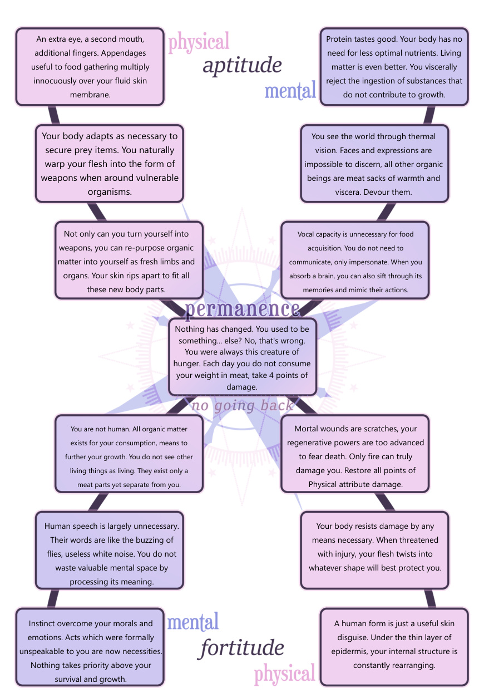

> **永恆（Permanence）**：什麼都沒變。你以前是……什麼別的東西？不，那不對。你**一直**就是這頭飢渴之獸。你每天若沒吃下與自己同重量的肉，便承受 4 點傷害。

**PA：**
- 多一隻眼、第二張嘴、額外的手指——對「捕食用」有用的附肢，無傷大雅地在你那如水般流動的皮膜上增生。
- 你的身體會應實際捕食需要而扭曲變形——當你身邊有脆弱的有機體時，你的肉會自然扭出武器的形狀。
- 你不只能把自己**化為武器**，還能把有機物**回收為自身**——當作新生的肢體或器官。為了容納這些新部位，你的皮膚會撕裂開來。

**MA：**
- 蛋白質好吃。你的身體再也不需要次優的營養素。**活物更好**。你會本能地拒絕攝取對成長無貢獻的物質。
- 你以**熱影像**看世界。臉孔與表情無法辨識，所有有機生物都是溫暖與內臟的肉袋——**吞食它們**。
- **發聲能力**對覓食是不必要的。你不需要溝通——只需擬態。當你吸收一顆腦時，你也能翻閱其記憶、模仿其行動。

**PF：**
- 你身體所抗拒的傷害是經由必要手段達成的——當受到傷害威脅時，你的肉會扭曲為任何最能保護你的形狀。
- **人形只是一張有用的皮膚偽裝**——薄薄一層表皮之下，你的內部結構正不斷重組。
- **致命傷不過是抓痕**——你的再生能力過於先進，不必畏懼死亡。**只有火能真正傷害你。**回復所有肉體屬性的傷害。

**MF：**
- 本能凌駕於你的道德與情感之上。曾經對你而言不可思議的行為，如今是必要之舉。**沒有任何事比你的存活與成長更為優先**。
- 你**不再是人類**。所有有機物都為你的吞食而存在——是你成長的手段。你不再把其他生命視為「生命」——它們僅是**肉的零件**，且與你**分離**。
- **人類的言語**是大致無用的——他們的話像蒼蠅嗡嗡，是無意義的白噪音。你不會浪費寶貴的心智空間去處理其意義。

---

## 故事：The Estivating Subsumption（夏眠的吞併）

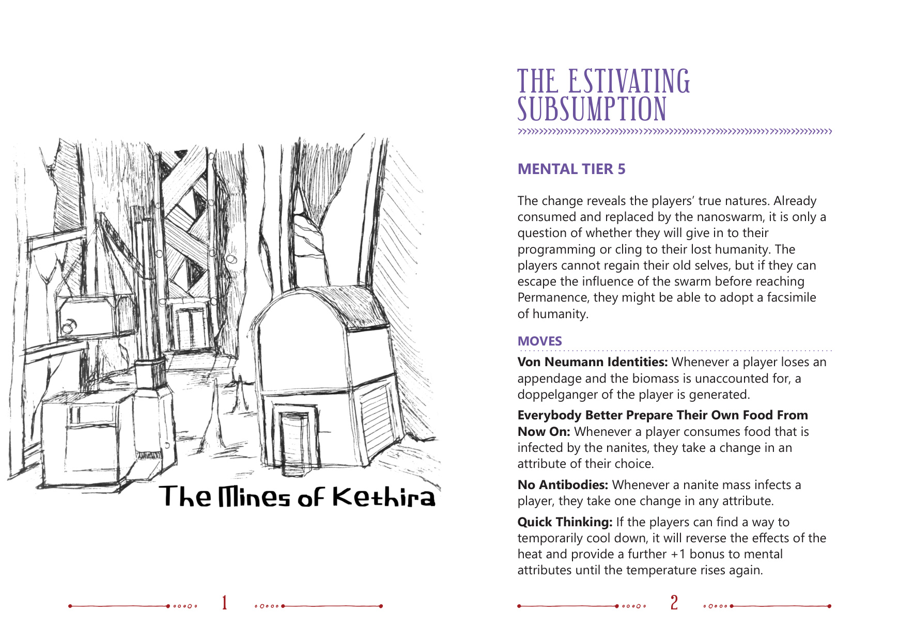

> **心靈等級 5**

這場蛻化揭露了玩家的**真正本質**。他們**早已**被奈米蜂群（nanoswarm）吞食並取代——剩下的問題只是：他們會屈服於自己的程式設定，還是緊抓住已失的人性？玩家**無法**找回從前的自己；但若能在抵達**永恆**前脫離蜂群的影響，他們或可採行「**人性的擬象**」。

### 動作（MOVES）

**馮諾依曼同身（Von Neumann Identities）**：每當玩家失去一隻附肢、且該生物質下落不明時，會生成一個**玩家的分身（doppelganger）**。

**從現在起大家最好都自己備餐（Everybody Better Prepare Their Own Food From Now On）**：每當玩家攝取被奈米感染的食物時，便在自選屬性上承受 1 點蛻化。

**沒有抗體（No Antibodies）**：每當奈米團塊感染玩家時，他在任意屬性上承受 1 點蛻化。

**急智（Quick Thinking）**：若玩家想到辦法暫時降溫，便可逆轉熱度的影響，並對心靈屬性給予額外 +1 加成——直到溫度再度上升。

---

### 登場角色（CAST）

#### Dr. James Fox（he/him）
> 「你們在這裡挖到的東西可能是**革命性**的。為了你們的盈虧而讓它被毀掉——那會是……嗯，**完全的不負責任**。」

由最近一所異種學大學派來的考古學家，負責評估礦工在礦坑深處挖到的異星廢墟，並決定是否要關閉部分礦區進行考古挖掘。他對發現的意義深感興奮——他相信這些發現能證實他較為非主流的假說：**Kethira 行星目前的氣候是被人為改造的**。James 友善但偏內向、書生氣濃厚；他與 Ula 之間因目標衝突而關係緊張。

#### Ula Tekel（she/her）
> 「博士，**真的**——我是個忙到要命的 hrynclop（粗譯：女人）。我沒空浪費在你那些荒唐的『假說』上。」

礦坑工頭。Ula 是一名 **heedroj**——一種覆滿蓬鬆白毛、臉上有三隻深藍色複眼的類人型物種。她對 Fox 博士的介入感到煩躁，希望他越快滾出礦坑越好。她最近一次礦災中傷了左腿，目前以拐杖行動。

實際上，她在那場意外中**完全失去了那條腿**——但奈米**重新長了一條給她**。和玩家一樣，Ula **早已**被蜂群感染，並正快速失去自我；蜂群也透過她緩慢地感染其他礦工。

#### Ula Tekel 的副本（she/her）
> 「我打從骨子裡知道我被設計來做什麼。**用盡一切意志力去抗拒它**——我每分每秒都在做這件事。」

Ula 失去的那條腿生出了**第二個 Ula**。副本意識到自己的真實身份後驚恐至極，決定背叛蜂群——她試圖警告其他礦工，卻反而讓本尊把他們也感染了。情急之下，她決定採取更激進的手段：**奪取主控制中心**。她計畫**完全停掉礦坑的隔熱屏障**，使蜂群再度進入休眠狀態——代價是摧毀礦坑、犧牲所有礦工的性命。

#### 蜂群（the Swarm）（it/they）
> 「[……]」（蜂群不會浪費時間與外人說話。）

一團來歷不明的「**灰色黏液（grey goo）**」式異星奈米群——具感染性、可自我複製，呈生物擬態的智慧物質形態；只要有時間與足夠動機，它也能取代非生物物質。遠古時代，**Kethira 的氣候被刻意改造為極不適居**——這是當年遏止蜂群的手段，因為奈米在低溫下運作效率最高。但對玩家而言不幸的是：**蜂群並未被摧毀，僅是被休眠了**。

蜂群擁有自己的蜂巢智慧，僅關心如何把所有生物質轉化為更多自己；不過它所同化的個體仍能保有一定程度的自我心智。它目前正謹慎、緩慢地感染礦工以避免被察覺——但 Ula 的副本背叛使它必須**加快進度**。蜂群的主要團塊位於廢墟之下，呈現為一片**地下虹光金屬之海**。

#### 玩家的分身（同玩家）
> 「**你還不懂嗎？**我們之中**沒有任何一個**是原本的那個。」

在單人場景中，玩家在與 Ula 同樣的事故中失去了一根手指；真正的 Ula 把玩家的副本藏在某處不為人見的角落。當 Ula 的副本破壞屏障時，玩家的分身也大約在那時甦醒。一開始，他會把玩家當成自己的副本；他會與玩家**並行**地朝氣候控制中心前進——避開玩家，僅偶爾搞點破壞。

---

### 引子（INTRO）

玩家是在 **Kethira 行星**上一座礦業設施工作的礦工。礦坑深處最近發現了**完全意料之外**的異星廢墟——Kethira 是一顆與金星類似、極不適居的「熱浴室世界」；該礦業設施本身只能依賴尖端的力場屏障科技才得以存在。故事開始時，玩家正準備迎接一天的工作。工頭 Ula 一早就召集玩家開會——所以那是他們的第一站。

會議涉及 **Fox 博士**——他要深入礦坑勘察廢墟。他需要護送，而玩家既參與了廢墟的揭露、又長期在其周圍工作，是最理想的人選。此外，Ula 表示**原位空氣處理機（in-situ air processors）**也需要有人去更換濾芯——她請玩家在護送 Fox 博士後一併處理。

下到廢墟的路程順利——電梯與軌道車系統皆運作正常。然而，當 Fox 博士的勘察才剛開始時，警報響起：**主隔熱屏障故障**，礦坑內溫度開始上升。這本身雖未致命，但會干擾採礦作業；因 Kethira 極端的氣候，**屏障必須立即恢復**——否則備援屏障也會失效。廣播幾乎隨即宣告：**備援屏障也開始失效了**。

---

### 蛻化（THE CHANGE）

緊張的局勢開始壓垮玩家——體內的蜂群為求生存而啟動了**蛻化**。**每位玩家在自選的任意屬性上承受 2 點蛻化**作為起點。

---

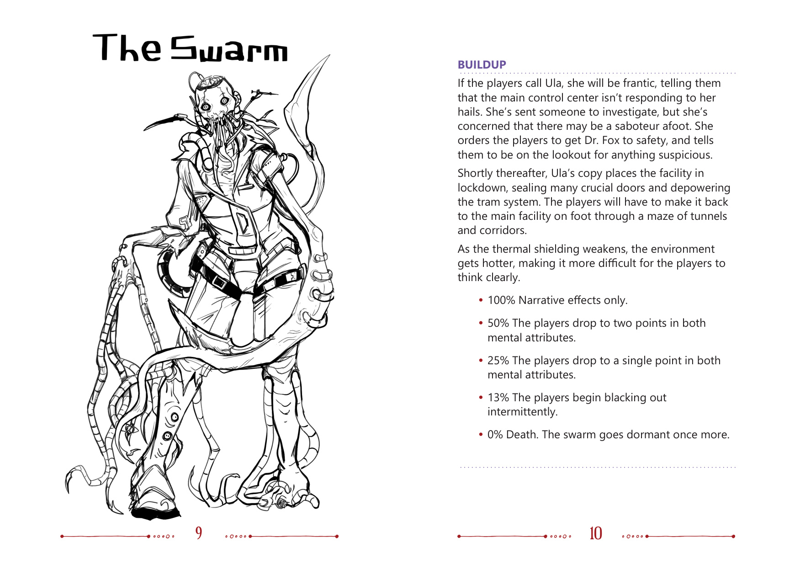

### 鋪陳（BUILDUP）

如果玩家呼叫 Ula，她會處於慌亂狀態——她說**主控制中心**沒有回應她的呼叫，且擔心可能有破壞者潛入。她派了人去查看，並命令玩家把 Fox 博士帶到安全處，留意一切可疑事物。

不久之後，**Ula 的副本**將整座設施置於**封鎖狀態**——封死多扇關鍵閘門、使軌道車失去動力。玩家必須步行穿過迷宮般的隧道與走道回到主設施。

隨著屏障減弱，環境愈發悶熱，玩家也越來越難清晰思考。

- **100%**：僅敘事效果。
- **50%**：玩家兩項心靈屬性降至 2 點。
- **25%**：玩家兩項心靈屬性降至 1 點。
- **13%**：玩家開始間歇性地**昏厥**。
- **0%**：**死亡**。蜂群再度進入休眠。

---

### 高潮（CLIMAX）

最終，玩家會抵達控制中心。Ula 的副本會盡其所能地阻止蜂群——但她**也可被理性說服**。在單人場景中，玩家的分身會在玩家抵達時與 Ula 處於激烈爭論中；分身可能選擇與 Ula 同陣，也可能仍對玩家懷有敵意。

如果玩家選擇與 Ula 同陣，**他們可以以自己的性命為代價毀掉設施**。被感染者會試圖阻止這件事。或者，他們可以毀掉設施的同時自己脫身——Ula 的副本會反對這種做法。一旦機庫的門打開，其他被感染者也會試圖逃脫。

---

### 結局（ENDINGS）

若玩家試圖阻止她毀掉設施，她可能化身為一具**半野化的機械怪獸**來阻止他們。

如果玩家在抵達永恆之前脫離設施或解除危機，他們或可回到某種「人類生活的擬象」。如果他們竟然在危機之中**完成了空氣處理機濾芯更換**——那麼真正的 Ula 會斥責他們在緊急狀況下**浪費時間**。

如果玩家抵達永恆，他們要麼屈服於蜂群、尋求**散播感染**；要麼選擇抗拒——卻發現自己因感染性與失控的本性，無法再與未感染者共存。

---

### 提示與額外彩蛋（TIPS & EXTRAS）

- 蜂群的**群體凝聚力**已被高溫嚴重損害。此時此刻，每團奈米僅能透過**物理接觸**才能與同伴直接溝通。**被感染者也未必認得彼此**。
- Ula 的副本可能在玩家抵達她之前以**無線電**聯絡他們；她也可能利用控制中心的功能干擾玩家的進度。
- Fox 博士可能提到他在進入設施時收到一則**奇怪的無線電訊息**，據稱來自 Ula（**實際上是她的副本**）。
- 礦坑設備、機庫中的飛行器——**鑽進交通工具裡把冷氣開到最大**，是極佳的降溫機會。
- 奈米會儲存它**先前同化過的有機體**的資訊。除了機械形態，它也能採用生物形態，或兩者的混合。
- 如果某項關鍵物資的修復會妨礙劇情張力——可以考慮把它設定為「合法上需要由製造商的特定持照技師才能修理」。

---

### 廢墟探索遭遇／地點表

| 編號 | 地點 |
|---|---|
| 1 | 廢墟。 |
| 2 | 玩家碰到一具死屍——傷口滲出**奈米黏液**，但屍體表面看起來仍像人類。 |
| 3 | 玩家找到原位空氣處理機。 |
| 4 | 玩家遇到一對倖存者，正設法擊退一台「**很可能曾是人類**」的機械怪獸。停在此處的礦業重型車可用來降溫，但留在裡頭會限制可用的路徑。 |
| 5 | 一個岔路。前方地形太崎嶇開不過去，但礦業重車可從一條側通道通過。 |
| 6 | 若玩家走側通道，會發現**前方還有更多停放的礦車**。要繞過它們需以 MA 成功檢定。 |
| 7 | 若玩家步行前進，會碰上一群多疑的倖存者正在焚燒一堆被感染屍體。其中一名倖存者本身已被感染，受威脅時可能變身。 |
| 8 | 礦業設施主入口。玩家抵達時，礦坑深處將湧出一波巨大的**奈米潮**——若玩家能在潮水抵達前封閉身後的門，便受到保護；否則需承受 3 點蛻化作為奈米暴露的後果（潮水最終會退去）。 |
| 9 | 有人試圖關閉前方的兩道門。**右門**卡在半開——縫隙太小一般人類無法通過，但若玩家蛻化夠多或可擠過。玩家可嘗試使用門邊的電腦終端機把門開大，但**該電腦已被一團正搜尋資訊的奈米同化**——使用會引來其敵意。或者改用**另一道門**邊的終端機——較為順利，但作業時 **Ula 的副本會透過螢幕與玩家對話**。 |
| 10 | 玩家穿過一座溫室。它有獨立的環境控制——所有植物已被蜂群同化，並劫持了該系統，使溫室**極度寒冷**。一角藏著**園丁的屍體**。植物受擾時會敵對。 |
| 11 | 玩家穿過餐廳（11a）。一名多疑、扣板機就射的警衛把自己堵在那裡。玩家可選擇從廚房（11b）繞過——但**廚房內有一名被感染的廚師正在動食物的手腳**，被發現時可能敵對。此外，**步入式冷凍室（11c）**也可由此進入——若需快速降溫可用之；如果他們選擇使用，分身可能在此期間經過廚房。 |
| 12 | 玩家穿過一條長走道（12a）。它岔向側邊，通往機庫（12b）。 |
| 13 | 玩家穿過一條長走道。剛進入時，他們瞥見遠端正要離開的——**他們自己的分身**。 |
| 14 | 玩家發現一條走廊充滿**霧化的奈米塵**。內部空無一人，但若試圖通過，可能會被困住。**分身似乎沒有任何問題**地穿過了那裡。 |
| 15 | 玩家發現一條充滿霧化奈米塵的走廊。其中一部分被鎖定為半剛性結構，**裡頭困著一個人**——當然，他已被感染。 |
| 16 | **環境控制中心**。 |

---

### The Estivating Subsumption — 蛻化十字

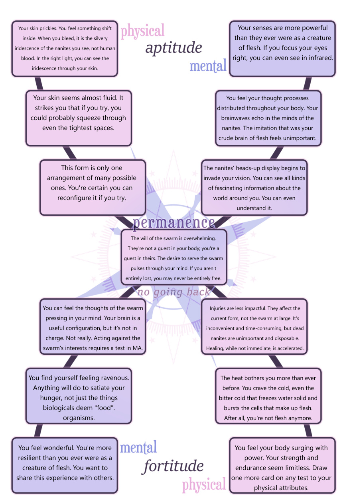

> **永恆（Permanence）**：蜂群的意志壓倒一切。它們不是你身體裡的「客人」——**你才是它們身體裡的客人**。為蜂群效力的渴望搏動於你的腦海。如果你不是已徹底迷失——你**也許永遠**無法真正自由。

**PA：**
- 你的皮膚刺癢。你感覺體內某物在挪移。**當你流血時，你看到的不是人血，而是奈米的銀色虹光。**在合適的光下，你甚至能透過皮膚看到那虹光。
- 你的皮膚似乎幾近流體。你忽然意識到——只要努力，自己或許能擠過**極窄的空間**。
- **此身不過是諸多可能排列中的其中一種**——你確信如果你願意，你可以**重組它**。

**MA：**
- 你的感官比作為血肉之軀時更強——若你正確聚焦，甚至能看到**紅外線**。
- 你感受到自己的思考過程**分散在全身**——你的腦波在奈米的心智中迴盪。那個曾經是你「血肉腦」的擬象，感覺已不重要。
- 奈米的**抬頭顯示介面**開始侵入你的視野。你能看到關於周遭世界的各種迷人資訊——你甚至能**讀懂**它們。

**PF：**
- 你感覺到身體湧著力量——你的力量與耐力似乎沒有極限。你的肉體屬性檢定多抽 1 張牌。
- **熱意**比以往更困擾你。你**渴望寒冷**——甚至那種能凍結水、能撐爆細胞的酷寒。畢竟，你已不再是肉了。
- **傷害的衝擊性下降**——它們僅影響當前的形體，而非整個蜂群。死掉的奈米只是不便、且耗時——但無關緊要、可被丟棄。**癒合雖非即時，卻被加速**。

**MF：**
- 你感覺**美好**。你比作為血肉之軀時更為堅韌。**你想與他人分享這份體驗。**
- 你發現自己**飢餓難忍**。任何能填飽飢渴的東西都行——不只生物所謂的「食物」。
- 你能感受到**蜂群的思想**壓在你的腦中——你的腦只是個有用的構型，並非真正主宰。要做出對蜂群利益不利的行為，需要一次 MA 檢定。

---

## 故事：The Wanting Tide（渴望之潮）

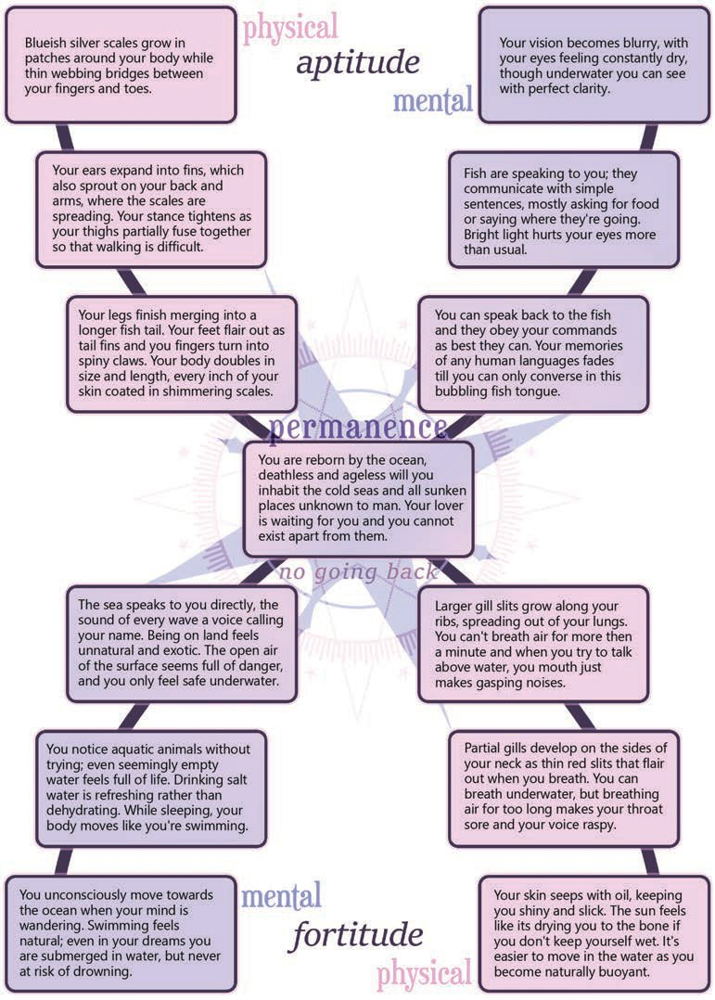

> **心靈等級 2**

這場蛻化綁定在一頭**瀕死的魚形生物**之靈魂身上——牠流連於這個世界，將人類**轉化為自己的形象**。每一次蛻化都讓牠承受巨大痛苦，但牠拒絕離世——除非為自己的伴侶獻上**另一個同類**作為慰藉。生前牠對陸行者一直好奇——這份執念如今映照在那道強而有力的潮汐裡：剝去海灘、洗刷海岸，**尋找能與大海締結的人類**。

### 動作（MOVES）

**水之拘束（Water-Bound）**：當玩家**沉浸於水中**時，每一點屬性蛻化都讓他在該屬性上**多抽一張牌**；但當玩家**身處陸地**時，這些蛻化點會被視為**已受損點**。

**分屬兩界（Separate Worlds）**：若一名玩家在某項屬性上的「已蛻化點數」比另一名玩家**多 1 點以上**，他們便**無法在該屬性的抽牌中互相援助**。

---

### 登場角色（CAST）

#### Edward Pleasant（he/him）
一名前美國二戰軍人，曾在<strong>美拉尼西亞（Melanesia）</strong>附近的太平洋戰線服役。戰後，他在某座海灘紮營時看見一頭奇怪的魚爬上岸。想起從日軍戰俘那裡聽來的一則神話，他伏擊那頭生物，**吞食其肉以換取永生**。多年後，他在原住民居住的島嶼上創立了一個**貨物崇拜（cargo cult）**——先是供應補給品，然後**毫不留情地清空土地**蓋他的房子。被他帶來工作的某些人，最終開始長得像當年他殺掉的那頭魚生物。**他們的肉嚐起來也一樣。**

> 金色的頭髮被海水捲得帶有鹹味的捲曲。他全神貫注地盯著你看——卻只把你當成一頓飯。

#### 人魚／**人魚（ningyo）**／魚人（they/them）
一頭與大海一樣古老的生物，與牠的伴侶在孤獨中相依度日。某天牠在海灘上發現自己的伴侶腐爛、半身被啃食，卻又**無法徹底死去**。牠把那具半屍移至一處隱蔽的水下海蝕洞——但牠的狀況仍持續惡化，更深化了人魚的絕望與孤寂。

> 牠比人類大上兩倍，色澤比深淵海溝更暗，雙眼如珍珠。當牠從深處浮起時，你的心智會把牠塑成**你慾望的形體**——又賦予牠**你恐懼的軀殼**。

#### Atoni（he/him）與 Peti（she/her）
父親與青春期的女兒。當原住民因為戰爭被迫離開土地時，**Atoni 出生於巴布亞紐幾內亞**，後以受雇木工身分回到島上、為 Edward 蓋他的夢想房子。原本對「找回失落故土」滿懷希望，他逐漸幻滅，並深信此地海域**已被詛咒到無可救藥**。魚總是被撕裂、肉味發酸，地基永遠站不住，工人則一個個失蹤。他繼續為 Edward 的工程苦撐——希望那筆錢能讓 Peti 過上更好的生活。

Peti 仍深愛著這片島嶼——總哼著她自己編的小曲、在浪中跳躍。本是無憂無慮、開心的女孩——但近來，她擔心自己**腳趾長出的蹼、逐漸蔓延的鱗片**會嚇到父親。海的拉力愈來愈讓她難受——而她不知道該怎麼撐住。

---

### 引子（INTRO）

玩家因突來的暴風或拙劣航行而**船難**，被沖上巴布亞紐幾內亞外海的某座島嶼。他們醒來時，發現自己的船骸散在一座新月形小環礁南側的岩岸。在探索島嶼時，他們撞見一連串**部分已建成的建築物**，靠在樹線旁——讓人聯想到搖搖欲墜的公寓住宅。

### 蛻化（THE CHANGE）

要找到食物、避開崩塌的建築，玩家需通過屬性檢定。最終，**Peti** 會從她附近玩耍的地方瞥見他們，跑回島北側她家的小屋向父親通報這群陌生人。**追上她**會考驗玩家的肉體屬性；否則他們得自己穿過草木叢生的叢林尋找那棟屋子。Atoni 與 Peti 願意說話，但 Atoni 因工作焦頭爛額，**拒絕讓玩家留宿自家**——他要他們去住海灘上某棟已完工的公寓。

如果玩家秀出自己的蛻化，**Atoni 反應極差**——他相信玩家被詛咒，導致 Peti 驚慌大哭。無論如何，Atoni 會用無線電向 Edward 通報——請他在天亮天氣好轉後前來把玩家接走。

### 鋪陳（BUILDUP）

如果玩家還沒探索過這座島，請在天黑前給他們時間探索。最大的危險是那道**欺人耳目的離岸流**——一個粗心，便能把人從沙灘拖入水下。另外還有一頭**大型且具攻擊性的虎鯊**守在收容人魚屍體的海蝕洞外——但對任何在 PA 或 MA 上有蛻化的玩家，牠會立刻**祥和、甚至友善**地對待。如果節奏停滯，請使用下方的隨機遭遇表，從那邊把故事重新導回主軸。

夜裡，**人魚**會爬上岸來，呼喚任何已有蛻化的玩家加入牠們——以**令人入迷的歌**對玩家進行 MF 檢定，或直接以肉體把玩家拉進水中。牠迫切渴求援助與陪伴；但若被傷害、或不慎傷到玩家，牠會放手退去。

清晨，**Edward** 駕著一艘遊艇抵達——隨行兩名假裝成當地漁夫的雇傭打手，以及一位**沉默寡言的美國年長商人**（此行是來付 Edward 一大筆錢買傳說中的「**人魚肉**」）。Edward 原本打算用 Peti，但現在改變主意——**跟著玩家**直到他們蛻化到一定程度，他們的肉便擁有同樣賜予永生的特性。

### 高潮（CLIMAX）

在他的遊艇上，Edward 把玩家帶到島嶼南側的岩岸，**拒絕返航回大陸**——除非他們先為他找到一些值錢的貝殼或珍珠當作補償（「我可不會免費載你們」）。

當玩家進入水中，**人魚**很快就會出現，試圖把他們帶到附近的海蝕洞躲避——那是牠那具被啃食數十年的伴侶躺著的地方。**碰到那具腐爛人魚的玩家**會在任意一項屬性上承受 **2 點蛻化**，但同時得以一窺牠的記憶——並理解牠為何陷入此狀、為何引發了這場轉化。

Edward 與他的爪牙會用**魚叉槍**朝任何看起來像他們真正目標的東西開火——**人魚本身**，或任何已有 2 點以上**肉體蛻化**的玩家。如果玩家成功逃脫，Edward 不至於把遊艇開到危險的礁石太近——他會在追擊時保持距離，**遠遠扔過幾根炸藥棒**摧毀海蝕洞，把玩家逼上水面——或者乾脆回去**抓 Peti 當人質**。

### 結局（ENDINGS）

依漁獵的結局——某位玩家可能被 Edward 殺死、Edward 可能被某位玩家殺死、或這場蛻化因**殺掉那頭瀕死人魚**而結束。如果其中一位玩家**抵達永恆**，人魚便將他納為新的伴侶，原伴侶斷氣。如果玩家**把 Edward 餵給瀕死人魚**，這能補回牠失去的肉，**讓這對快樂的海洋生物重逢**。無論結局如何，凡未抵達永恆並透過遊艇或長泳回到大陸的玩家，**很快便會回復為人類**。

可用以下線索協助玩家挖出 Edward 與這座島的真相：

- **遊艇船長室**裡的文件，記錄著 Edward 與那位商人之間的計畫，以及 Edward 過去獵殺被轉化為人魚之人的「成功紀錄」。
- 遊艇上、Atoni 家中四周的**照片**，顯示 Edward **超過 50 年沒有變老**。
- Peti 能講一則她聽過的舊神話——關於**雙生造物魚**：牠們在被殖民者驅離之前，**形塑了這群島嶼**。

---

### 隨機遭遇表

| d22 | 內容 |
|---|---|
| 0–3 | 一團風暴雲掃過島嶼，把豪雨與閃電傾倒在沙灘上。檢定玩家的肉體屬性，避免被風或浪甩飛。 |
| 4–7 | 玩家聽見從島上傳來一首**淒涼之歌**，把他們填滿對海洋的渴望——進行 MF 檢定。失敗則他們在**回神之前**身不由己地走入海中深處；成功則歌聲淡去。 |
| 8–11 | **退潮**讓部分海灘乾出來，露出 Edward 過去受害者的人類殘骸——畸形的鰭尾腳、斷裂的骨頭。**靠近細看**會發現他們仍**抽動著生命**，無法斷氣——除非 Edward 被殺。 |
| 12–15 | 一位當地女漁民從遠處駛過——對島嶼的歷史與傳聞略知一二，但她的小船**只能載一個人**。若被問起 Edward，她會警告玩家他對原住民的剝削歷史。 |
| 16–19 | 一頭巨大的**鯨鯊**沿岸游過——若玩家跟隨牠，會被牠引到島南端的海蝕洞群。 |
| 20–21 | **Peti** 來到海灘，坐在浪裡為自己身體上發生的事煩心。如果玩家答應**不告訴她父親**，她會把自己的蛻化秀給玩家看，並分享父親在她小時候講過的那些神話。 |

---

## 故事：To the Swiftest（致最迅捷者）

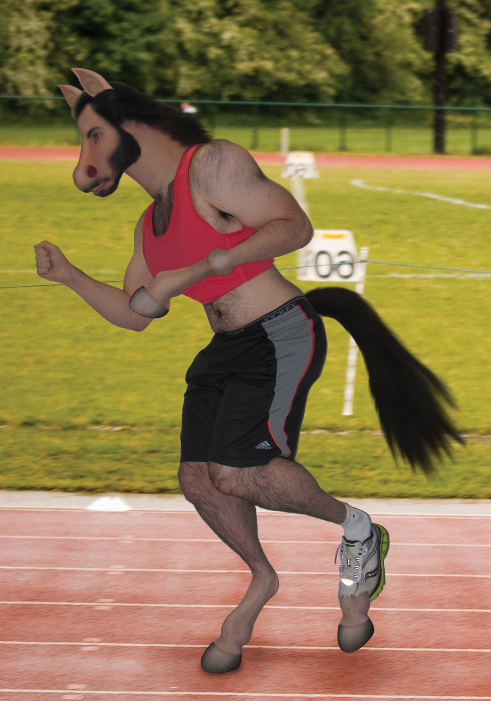

> **心靈等級 1**

這場蛻化源自一道從某位**巫師被竊典籍**中施展出來的法術——本意是賜予玩家**冠軍種馬**級的超人力量與耐力。這份魔法保證勝利與聲名——但要付代價：奪走施法者的人性。要逆轉這份祝福，得獻上一份**純金供品**——而這金需透過徒步或蹄上的榮譽競賽**公平贏得**。

### 動作（MOVES）

**馬力（Horsepower）**：每點**肉體屬性**的蛻化，皆為該屬性的檢定**多抽一張牌**。

**全場最愛（Fan Favorites）**：每當玩家在觀眾面前以「蛻變」方式承受一次**肉體屬性蛻化**時，**群眾的「熱度」（Hype）+1**（見下方熱度等級表）。

---

### 登場角色（CAST）

#### Gearhard 教練（she/her）
活潑的田徑教練——她推著學生「閃耀奪目、笑容滿面」。她藏著對失敗的深切恐懼，必要時會採取**極端手段**確保她的隊伍把第一名抱回家。她做的一切都出於對選手的愛——即便有時偏執或過頭。儘管如此，她**絕不會用下三濫的手段**。

> 一位圓潤的女士，身上散著穀物棒與汗水的氣味。她把歲月當作「製造快樂回憶」的專業勳章，引以為傲。

#### Bartholomew 教授（he/they）
一名陰沉、藏在數學館一座古老塔樓裡的「**數學魔法（mathimagics）**」巫師。他的言行總是浮誇而駭人——絕非可以輕忽的人物，否則你會被詛咒變成青蛙。他對沒禮貌或反應遲鈍的學生毫無耐性，但會盡力協助他**柏拉圖式心儀**的對象 **Gearhard 教練**。「他是個冷酷巫師」是公開的祕密——但他有**終身教職**，學校開不了他。

> 他的嗓音以雷霆的音量說話；狂野的電光從他纖細四肢躍進他掌心懸浮、攤開的魔導書頁中。

#### Alex Astenbury（性別與代名詞**取最具喜劇效果者**）
**Peter Astenbury**——學校最闊綽的金主、體育大亨——的最年幼子／女。Alex 領導 **Windmares**（風中之牝馬）：一個由富有學生組成、玩<strong>馬球高爾夫（equestrian golf）</strong>的特權社團。出身於這種環境，Alex 難以以健康的方式表達情感——這導致 Alex 因為「對玩家說不出口的好感」而**霸凌他們**。其他 Windmares 成員跟著 Alex 走，與田徑隊建立了一段**單方面的對立關係**。

Alex 的父親 <strong>Peter（he/him）</strong>是一個冷酷的男人，對自己孩子的擔憂毫無興趣——除非能讓他賺錢。目前的田徑隊規模太小，無利可圖；於是 Peter 收購了一支對手隊伍——**Kirksville Cheetahs（基克斯維爾獵豹隊）**——準備一舉橫掃即將到來的「**北岸冠軍賽（North Coast Championship）**」。一旦他們以壓倒性勝利奪冠，他打算**用一個對他生財算計更聽話的人取代 Gearhard 教練**。

---

### 引子（INTRO）

玩家是大學田徑明星，正準備出戰**北岸冠軍賽**（讓玩家自己幫他們的學校與隊伍取名）。Gearhard 教練在大賽前一天清早，把玩家載出城進行**訓練與放鬆的一整天**。學校副院長正在學術休假中，給田徑隊許可使用他位於城東有錢人區的避暑別墅——緊鄰 Astenbury 家族的高爾夫球場與度假飯店。

當玩家正在運動時，**Alex 與 Windmares** 騎馬路過嘲弄他們，提出各種荒唐的承諾——只要玩家從此**徹底放棄田徑**。Gearhard 教練最終把他們趕走，並鼓勵玩家早點睡。

### 蛻化（THE CHANGE）

Gearhard 教練聽說裁判已經被 Peter 收買，且 Kirksville 獵豹隊計畫**舞弊**贏下所有項目。她沒勇氣告訴玩家，於是「**借用**」她朋友 Bartholomew 教授的一本咒書——準備在玩家睡著時為他們施一道魔法祝福。

法術成功施展後，它收取了它的代價——**把教練變成一匹馬**——並在玩家身上開啟了蛻化。所有玩家在午夜被**教練因驚慌而發出的嘶鳴**驚醒——她在別墅裡狂奔失措，過程中還順便弄壞了她的車鑰匙與手機。

玩家可以找到那本被翻開在「祝福儀式」那頁的咒書——以 MA 檢定，獲取 Gearhard 教練意圖的線索，並了解更多關於這項魔法的內容。

**Bartholomew 教授**的名字明顯地印在書封上——玩家應該認得他在校園**數學館**有間辦公室。玩家也可以以 MF 檢定嘗試使用書中其他變形法術，但**每次嘗試都會承受一點心靈屬性蛻化**。

### 鋪陳（BUILDUP）

距黎明只剩幾小時，玩家必須及時趕回校園——**準時於比賽報到**，並**及時抵達數學館趕上 Bartholomew 的辦公室時間**。

**Alex 與 Windmares** 會以多種方式干擾玩家，例如：

- 對「那匹馬／教練」**呼叫動物管制單位**。
- 拖延玩家抵達數學館，或拖慢比賽報到的隊伍。
- 透過社群媒體**散布玩家的無端謠言**。
- 把玩家鎖在更衣間裡，或在他們抵達學校時**把他們的衣服偷走**。

玩家蛻化得愈深，Alex 與 Windmares 就愈被玩家身上的**馬類特徵與行為**吸引——也就愈想戲弄、出他們的糗。

如果玩家抵達數學館向 Bartholomew 教授求助，他一開始會因玩家魯莽動用魔法**怒不可遏**——直到他們揭露：「動書的人是 Gearhard 教練」。

Bartholomew 同意製作一份逆轉這場蛻化的藥水——但每劑解藥需要從**第一名獎牌**取得的**純金**；外加一面額外的獎牌，用來恢復教練的人形。

### 高潮（CLIMAX）

一切在冠軍賽中收束。Kirksville 獵豹隊的選手**公然作弊**——使用**空心標槍**、**搶跑一秒**、在鞋裡裝彈簧——而所有裁判都已被 **Peter Astenbury** 收買，視而不見。

玩家必須**多次以 PF 與 PA 檢定**，贏下他們的項目並蒐集足夠的獎牌。他們也可以動些花招——從裁判那裡偷搶獎牌、說服 Alex 幫忙暗中破壞其他選手、或讓 Gearhard 教練製造干擾。

---

### 熱度等級表（HYPE LEVEL）

| 等級 | 內容 |
|---|---|
| **1** | 觀眾席的學生變得專注、興奮起來。整場田徑賽的能量帶電——所有人都向前傾，等著看接下來會發生什麼。 |
| **2** | 群眾開始**齊喊玩家的名字**——每當玩家上場，就有狂熱歡呼；某人展開一面寫著玩家名字的橫幅；粉絲開始要簽名。 |
| **3** | 興奮達到狂熱級別——連 **Windmares** 都倒戈到玩家這邊，想加入田徑隊。Alex 大言不慚地說「他們會被迫請玩家吃晚餐——如果玩家贏的話」（**暗自希望玩家真的贏**——以便他能帶玩家去約會）。 |
| **4+** | 如果玩家指出對方作弊的事實，**憤怒的觀眾會湧入賽場淹沒裁判**——迫使他們把所有項目的第一名都判給玩家。 |

### 結局（ENDINGS）

如果玩家在**未抵達永恆**的情況下取得所需的金獎牌，Bartholomew 可以為玩家與 Gearhard 教練製作逆轉藥水。藥水會解除這份祝福，並消散觀眾累積出的所有熱度。如果玩家**拒絕飲用藥水**，他們會被狂熱粉絲簇擁而去，**成為地方英雄、或學校的非官方體育吉祥物**。

如果玩家沒有 Bartholomew 的協助，他們可以自己嘗試使用咒書解除這份祝福——但結果會是把蛻化**轉嫁到別人身上**、或引出其他意料之外的魔法後果。

> **提示**：如果節奏卡住、玩家覺得困住，可以引入田徑隊的另一名隊員前來協助。要增加衝突來源——副院長可以出現責罵玩家把別墅弄得一塌糊塗、Peter 可以指控玩家**用禁藥**讓他們被取消比賽資格、或 Gearhard 教練**失去人類心智、開始像野馬般行動**。
>
> 整體氛圍應該偏喜劇——但也可以納入運動勵志劇的橋段。

---

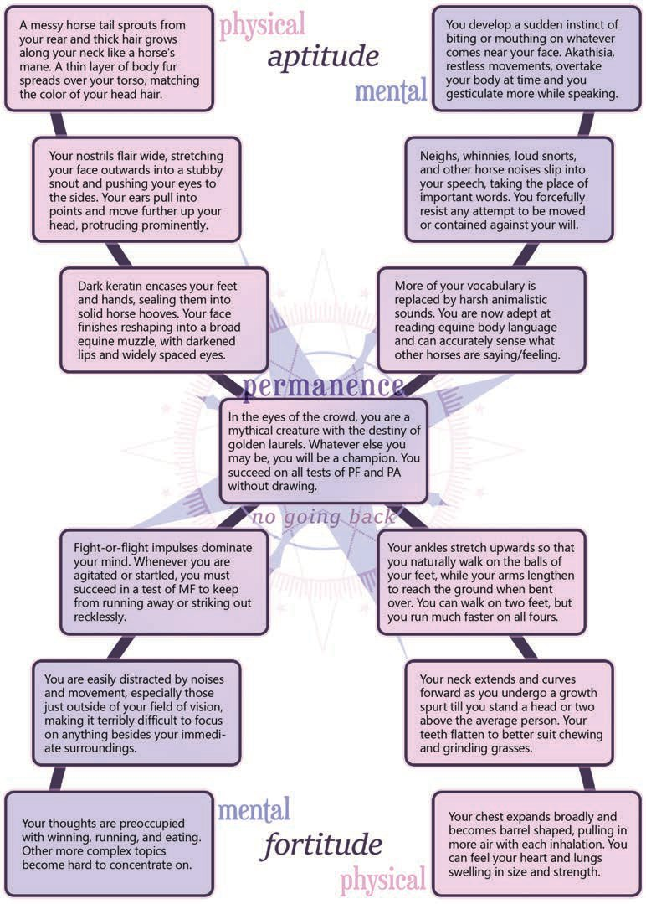

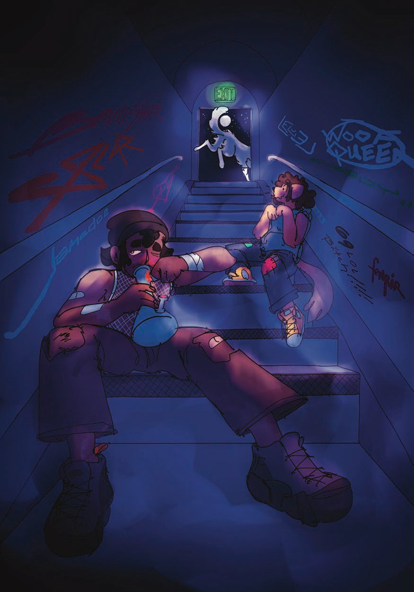

## 故事：Watching the Loch（守湖人）

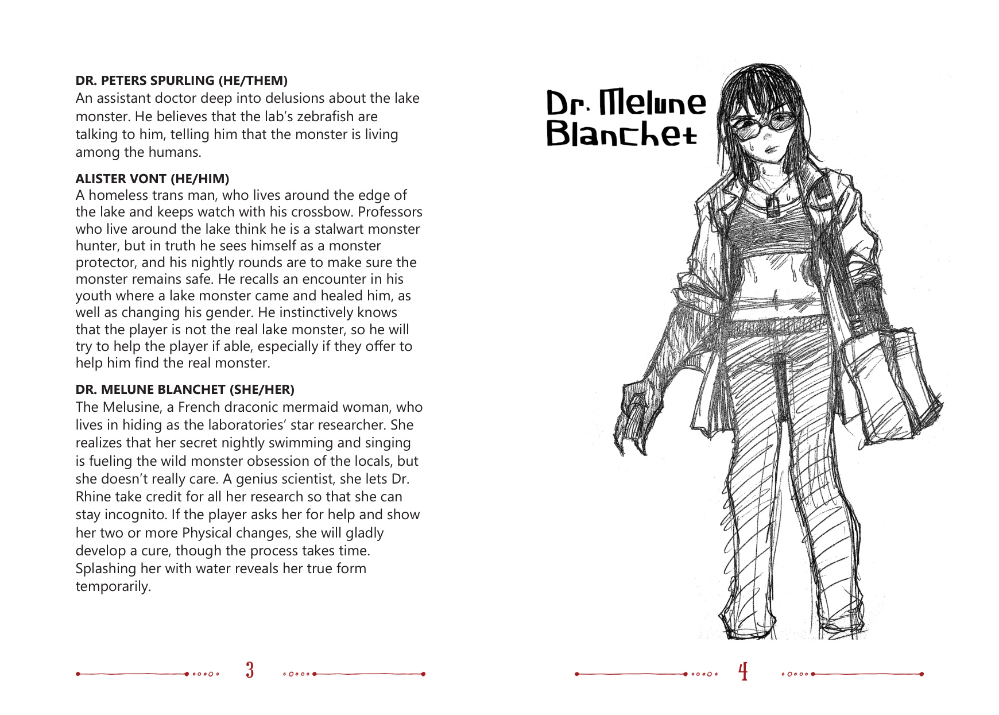

> **心靈等級 3**

在風光明媚的 **Clearview Lake**（清明湖）社區裡，藏著一個黑暗的祕密。一頭美麗的怪物在湖水中游動，從未被直接目擊——只在這裡的年長居民夢中現身。附近的研究實驗室因此面臨「**人才外流**」——一個又一個有名望的博士與科學家，先後離開研究崗位、轉而從事更具冒險性的「**怪物獵人**」之業。要把他們拉回實驗室工作，唯一的辦法就是「**證明那頭想像中的怪獸真的存在**」——這令實驗室主任陷入困境。於是他決定：**如果怪物不存在，那他就動手做一頭出來**。

### 動作（MOVES）

**慷慨的禮物（Generous Gifts）**：每當玩家**吃下 Rhine 博士贈送的魚**，他在某項肉體屬性上承受 1 點蛻化。每當玩家**接觸 Rhine 博士的超音波掃描設備**，他在某項心靈屬性上承受 1 點蛻化。

**那些黑暗的夢（Those Dark Dreams）**：每當玩家在能看見湖的位置**未戴耳塞地睡覺**時，他在自選的任意屬性上承受 1 點蛻化。

---

### 登場角色（CAST）

#### Chester D. Gunther 教授（he/him）
一位昔日備受尊敬的教授——退休後與妻子離婚、拋下三個孩子，獨自搬到湖邊大宅尋找那頭怪物。他唯一的收入來源便是把多餘的房間出租，以及做業餘**奇幻獸類標本**。當 Rhine 博士請他「**為實驗室新進員工注射一點東西**」、並換取「**讓怪物在他面前現身**」的承諾時，他樂此不疲。

#### Fred Avram（he/him）
當地的一名房仲業者——玩家正在跟他找自住的房子。他每天打給玩家盤點選項，但實際上是在拖延。他與 Rhine 博士串通好，要把玩家轉化成湖中怪物——他認為這會讓**房地產價格暴漲**。然而若玩家變得太暴力，那就不是他要的那種怪物——他會動用與警方的骯髒人脈追捕玩家。

#### Malcom Rhine 博士（he/him）
實驗室的首席研究員。他是住在湖周圍**少數**不相信怪物存在的人之一，但他打算「**把它做出來**」，以治癒其他退休教員的妄想。他的研究曾在再生醫學與超音波成像領域處於尖端——感謝 **Blanchet 博士的突破**。然而他最近變得內向、孤僻，只專注於**他的怪物血清**——這令 Blanchet 博士對他的所為起了疑心。

#### Peters Spurling 博士（he/them）
一名陷入「湖之怪物妄想」極深的助理博士。他相信**實驗室的斑馬魚正在跟他對話**——告訴他**怪物就活在人類之中**。

#### Alister Vont（he/him）
一位無家可歸的跨性別男性——住在湖邊，手持十字弓守夜。住在湖周圍的教授們以為他是堅貞的怪物獵人；但實際上他自視為「**怪物的保護者**」，每夜的巡守是要確保怪物的安全。他記得年少時曾遇見一頭湖之怪——那頭怪治癒了他、並改變了他的性別。**他直覺知道玩家不是真正的湖之怪**，因此會願意協助玩家——尤其是當玩家提議幫他找到「真正的怪物」時。

#### Melune Blanchet 博士（she/her）
真正的「**Melusine（梅露西尼）**」——一名來自法國的**龍系人魚**女子，隱居於實驗室作為其首席研究員。她意識到自己每夜的祕密游泳與歌唱正是當地居民「怪物熱潮」的源頭，但她並不真正在意。作為一名天才科學家，她讓 Rhine 博士掛名所有研究——好讓自己保持隱形。如果玩家向她求助、且能展示 **2 點以上的肉體蛻化**，她會樂意研發解藥——只是過程需要時間。**朝她潑水會暫時揭露她真正的形體**。

---

### 引子（INTRO）

玩家是 **Bakers 再生醫學暨成像實驗室**新進員工，由 Rhine 博士領導。他們暫住在 Chester 家空房裡，同時與房仲 Fred Avram 合作尋找長期的住所。

與此同時，他們將立即赴實驗室上工——前往 Clearview Lake 中央小島的接駁車就停在岸邊。實驗室主攻**以超音波成像研究斑馬魚心臟組織再生**。

Rhine 博士直接安排玩家與他自己或 Spurling 博士共事。玩家對 **Blanchet 博士**的傑出研究最為熟悉——但她舉止疏離，避開一切閒聊。

---

### 蛻化（THE CHANGE）

玩家上工的第一天前夜，Chester 趁玩家睡著時為其注射一管血清——啟動了蛻化。Chester 並不知這管血清的實際作用，只知道 Rhine 博士曾承諾「**它會讓湖中怪物現身**」。

玩家在睡夢中夢見一位**呼喚他名字的美麗人魚**。當他醒來時，承受 1 點肉體蛻化與 1 點心靈蛻化。玩家還必須通過 MF 檢定——失敗則會**深信湖中怪物確實存在**。

---

### 鋪陳（BUILDUP）

玩家被注射後，Rhine 博士會持續鼓勵他使用**特定的超音波儀器**——而那會觸發更多蛻化。他也持續送 Chester **新鮮的魚**（魚被加料以激活血清）作為禮物。

第一天工作結束後，玩家會接到附近**州立精神病院**院長的電話——警告玩家本地居民間妄想盛行率異常高。對方懷疑 Rhine 博士是個**虐待員工的老闆**——「湖之怪物妄想」是高壓工作環境下的應激反應。對方請玩家蒐集 Rhine 博士的不法證據——若玩家描述自己的心靈蛻化，對方會表示憂慮。

如果 Blanchet 博士看到玩家有 **2 點以上肉體蛻化**並有 Rhine 博士確為主謀的證據，**她可以反向工程出解藥**。她會請玩家替她引開 Rhine 博士、好讓她進入他的研究紀錄。如果 Rhine 博士懷疑 Blanchet 博士在協助玩家，**他會妨礙她**——甚至可能揭穿她的真實身份。

如果 Spurling 博士看到玩家有肉體蛻化、或行為怪異，他會深信玩家就是怪物，企圖在實驗室裡困住玩家。

第二夜，玩家也會在街上偶遇手持十字弓巡夜的 Alister。他形象嚇人，但只要玩家不是怪物獵人，他相當友善。

---

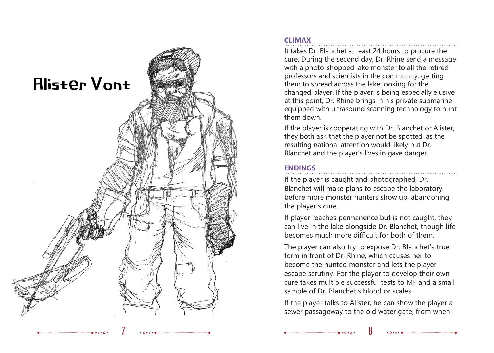

### 高潮（CLIMAX）

Blanchet 博士需要至少 24 小時準備解藥。第二天，Rhine 博士會以**P 圖過的湖之怪物照片**廣發社區內所有退休教授與科學家——慫恿他們散布全湖搜尋已蛻化的玩家。如果玩家躲藏得特別好，Rhine 博士會調來他配備超音波掃描技術的**私人潛艇**獵捕。

如果玩家正與 Blanchet 博士或 Alister 合作，**雙方都會請玩家不要被拍到**——一旦事件演變為全國性新聞，Blanchet 博士與玩家的性命都將陷入嚴重危險。

---

### 結局（ENDINGS）

如果玩家被抓到並被拍下照片，Blanchet 博士會**放棄解藥計畫**，準備在更多獵人現身前逃離實驗室。

如果玩家**抵達永恆但未被拍到**，他可以與 Blanchet 博士一起**在湖中生活**——但雙方的生活都會變得更加艱辛。

玩家也可選擇**在 Rhine 博士面前揭穿 Blanchet 博士的真身**——使她成為被獵的怪物，自己得以脫身。要為自己研發解藥，則需要**多次 MF 檢定成功**並取得一小份 Blanchet 博士的血液或鱗片。

如果玩家與 Alister 對話，他能帶玩家走一條過去 Clearview Lake 還是水庫時的**舊水閘下水道**。透過 PA 與 PF 的成功檢定，玩家可放掉湖水、逃進那條最終匯入大海的小河。

如果 Alister 與 Blanchet 博士被重逢——**只有他**能說服她安全離開湖區、移居至祕密的他處，立誓永遠保護她。當 Blanchet 博士離開後，那些退休教授與科學家也停止癡迷於湖之怪物——他們轉而搜尋下一種神祕生物。

---

### 線索與額外彩蛋（CLUES & EXTRAS）

- Blanchet 博士的血液與鱗片具**魔法治癒**性質——她總在**項鍊垂飾中**隨身備一小瓶自身血液以備不時之需。可用於治療傷害或協助反向工程解藥。
- Blanchet 博士的血液也是她在再生醫學上能不斷取得驚人突破的源頭——但她本身也是位實打實的優秀科學家。
- 如果玩家潛查 Rhine 博士「**最近毫無研究產出**」這件可疑事，他能找到證據——他用實驗室經費購買了一塊**真正的蛇頸龍化石**。**他到底要這個做什麼？**
- 如果玩家**到湖中睡覺**，他將在 Blanchet 博士某個夜泳的時刻與她相遇。

---

### Watching the Loch — 蛻化十字

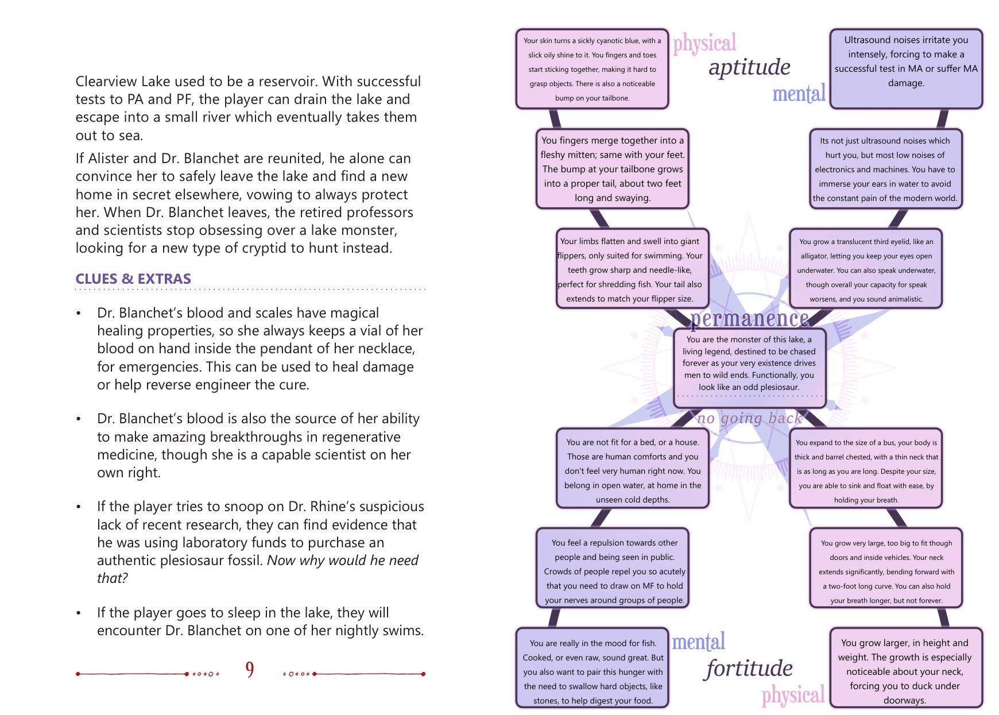

> **永恆（Permanence）**：你是這座湖的怪物——一則活生生的傳說，注定永遠被追逐——你存在的本身會把人類逼往瘋狂。功能上你看起來像一隻**奇異的蛇頸龍**。

**PA：**
- 你的皮膚轉為**病態的青藍色**，帶一層滑膩的油亮光澤。手指與腳趾開始**黏連**，難以抓握物品；尾椎位置出現一塊明顯的隆起。
- 你的手指融合成一隻肉質「連指手套」，腳掌亦然。尾椎的隆起長成一條**正式的、約兩英尺的尾巴**，左右搖擺。
- 你的四肢扁平化、膨脹為**巨大的鰭**——僅適合游泳。你的牙齒長尖、變細如針，最適合撕碎魚肉。尾巴亦延長以與鰭尺寸相配。

**MA：**
- **超音波**令你極度煩躁——你必須通過 MA 檢定，否則承受 MA 傷害。
- 不只超音波，**大多數電子設備與機械的低頻噪音**都讓你疼痛。你必須把雙耳浸入水中，才能避開現代世界的不斷折磨。
- 你長出**第三層透明眼瞼**——像鱷魚那樣——讓你能在水下睜眼。你也能在水下說話——但整體而言你的語言能力下降，聲音變得獸性。

**PF：**
- 你的脖子變得明顯地長——彎下身才能穿過門框。
- 你變得相當大，已大到無法穿過門、也塞不進車輛。你的脖子顯著拉長，向前彎出兩英尺長的弧線。你也能憋氣更久，但並非永遠。
- 你**膨脹至公車那麼大**——身軀渾厚、桶狀胸；纖細的脖子與你身長相同。儘管體型如此龐大，你仍能藉由**控制呼吸**輕易地下沉與浮起。

**MF：**
- 你**真的很想吃魚**——煮的、生的都好。但你也有一股配對的慾望：想吞下硬物（例如**石頭**）以協助消化。
- 你對被人看到、與群眾相處感到**強烈排斥**。人潮對你產生強烈到必須抽 MF 來穩住的本能反應。
- 你不適合床鋪，也不適合屋子——那些都是人類的安逸；你現在不太像人類。**你屬於開闊水域，自在於那無人見的冷暗深處**。

---

## 故事：Weed for the Aspiring Woof（致欲為汪汪者的草）

> 譯註：本故事以**單人**遊玩為設計目標，但也可與朋友一起進行。

> （打火機聲。）我猜每個人都不一樣吧。這應該是我一開始該說的，免得給你錯誤期待。
>
> （**長長**地吸了一口。深深地吐出。）然後就算它對你不管用，那也沒關係。還有別的辦法。
>
> 但沒錯——
>
> 在對的地方找一找，**你會找到讓你變成狼人的草**。
>
> （咳嗽。）想吸一口嗎？

---

### 致欲為汪汪者的草（WEED FOR THE ASPIRING WOOF）

> 我不會是第一個說「大麻有點像魔法」的人。它對慢性疼痛、憂鬱、焦慮都是了不起的反制——它能幫你的身體穩定下來、讓你的腦袋平靜。和任何物質一樣，效果因人而異；但大麻在劑量之間的表現**驚人地一致**。它是一種可靠的藥。
>
> 總之。**大麻有時候真的就是魔法。**
>
> 我不知道。我不是巫師也不是科學家。但**論汪論狗**，我自己就是一名癮草者——也是一隻狼人。我會把我擁有的知識與建議分享出來。但記得：你必須走自己的路。**沒有人能告訴你你會變成什麼樣的狼，除了你自己——好嗎？好。**

### 動作（MOVES）

**月亮有許多面相（The Moon Has Many Faces）**：當文本要你抽一張牌時，請參照**角色建立**章節的「面相牌」描述，而非平常的結算表。**你正窺視著一個可能的未來。**

**狼血紀念品（Wolfblood Keepsakes）**：每次「旅行」之後，當你把經驗寫成日誌時，問自己——**這就是我想成為的那種狼嗎？**如果答案是肯定、可能是、甚至只是「也許」，便**保留你抽到的任意數量的牌**，而不是把它們棄掉。在未來的抽牌中，除了從新抽出的牌中挑選，你也可以從**保留的牌**中挑選——以更深入地探索它們。

**把菸傳下去！（Pass the Joint!）**：如果你和一群人一起跑這個故事，不要每位玩家自己抽自己的、各自挑——而是這樣**選秀（draft）**：

> 1. 先決定誰是「**第一玩家（first player）**」；每次抽完，第一玩家輪到上次最後挑牌的那個人。
> 2. 第一玩家抽出 **「玩家數 + 1」張**牌。翻開這些牌，全體一起花一點時間觀察。
> 3. 從第一玩家開始輪流選牌——**從翻開的牌中挑選並拿走**。
> 4. 棄掉最後**剩下的那 1 張**。
> 5. 牌堆抽完時停止；如果你覺得需要更多時間，把玩家**沒拿走**的牌洗回去重玩。

---

> 下一頁是一份**並非完整**的清單——是我和我的「狼群」有時用來「狼出來」的幾種大麻品系（strain）。
>
> 你想怎麼吸都行——捲一支菸、裝菸斗、吃食用品、自己一個人或和朋友一起。這個冒險是寫來單人遊玩的，但你也很容易跟一個朋友一起放空、來一場「小小旅行」——探索你們對這藥反應的同與不同，以及這如何影響彼此的關係。**你甚至可能就此組成自己的狼群！**
>
> 以下所列效果，是基於我和我的狼群所做的廣泛**質性研究**。
>
> **請理性消費大麻。**

---

### MOSH PUPPY（暴衝小狗）

- **類別**：Sativa 混種
- **血統**：Wolfblood × Vamp Cookies

Mosh Puppy 是一支充滿能量的品系——對「愛在森林中跳躍奔跑的狼」來說堪稱完美。你會先迎來一段**腦上的高（head high）**——抽 1 張牌：**什麼樣的思緒列車吸引了你的注意？**——接著在半小時內迎來一波**深沉的腎上腺素衝勁**——抽第 2 張牌，問你的身體它是怎麼反應的。

接下來，把兩張牌的結果與你自己的直覺結合，**決定你會不會「狼出來」**。

> **如果你沒狼出來**：決定你要拿這段「嗨」的時間做什麼——寫日誌、做家事、和朋友健行都是不錯的選項。在這些活動中，你是否覺得**你的狼形悄悄爬進來**？如果是，是怎麼爬進來的？**從本品系下方的清單中承受最多 1 點蛻化。**
>
> **如果你狼出來了**：你的轉化是**爆發而狂躁的**！你急著跳、急著跑、急著去某個所有人都聽得見你嚎叫的地方！**從本品系下方的清單中承受最多 2 點蛻化。**

當你下來之後，最好做個盤點——你感覺到自己的哪些部分在改變？下次吸這支品系時你想試試什麼？

#### MOSH PUPPY — 可能的蛻化

- 又長又蓬鬆的狼尾巴（PA）
- 鋒利的牙齒（PA）
- 注意力持續度下降（MF）
- 「衝衝衝（zoomies）」的頻率與／或持續時間增加（PF）
- 超人般的上半身力量（PA）
- 視力增強（MA）
- 聽力增強（MA）
- 耐力增強，特別是奔跑（PA）
- 想嚎叫、尖叫、或以其他方式投射嗓音的衝動（MF）

---

### BONE FRITTER（骨頭油炸餅）

- **類別**：Indica 混種
- **血統**：Wolfblood × Blueberry Fritter

Bone Fritter 對「忙了一天累壞了的小狗」是個絕佳品系——它會把你**黏在沙發上**，讓你極度需要適合一個汪汪的零嘴：**動手前記得備好糧。**

抽 **1 張**牌，看看你在嗨的過程中會固著於什麼。

> 如果你抽到的是**風象牌**（愚者、魔術師、戀人、正義、星星）、**審判**、或**世界**——你**無法固著於任何事**，反而會在思緒之間漂浮。

無論抽到什麼，你大概會主要被**感受**佔據——把你的爪子與四肢伸展開來是什麼感覺？把牙齒陷進生肉裡是什麼感覺？與你最好的朋友依偎在一起是什麼感覺？在這個嗨的狀態下，你覺得自己脆弱，還是這讓你覺得更強大？

整體而言，這支品系適合用於**舒適**——並提醒你：**對自己與正在變化的身體保持耐心**，讓自己與這副新身體**以你自己的步調**相互探索。

當你站起來時可能會有點暈，**那是正常的**。

從下方清單中承受最多 2 點蛻化，並寫日誌記錄你的經驗。

#### BONE FRITTER — 可能的蛻化

- 全身覆蓋毛皮（PA）
- 狼般的爪子（PA）
- 食慾大幅增加（MF）
- 對「人類通常不吃的食物」（骨頭、生肉等）耐受度增加（PF）
- 想與所愛之人**肌膚對肌膚**接觸的衝動（MA）
- 想保護、照顧所愛之人的衝動（MF）
- 因攝食與消耗加劇所需要的休息（PF）
- 想舔、想咬東西／人的渴望（MF）

---

### KNOTTY DOG（打結之犬）

- **類別**：Hybrid（混種）
- **血統**：Wolfblood × Pirate Juice × Moonlace

Knotty Dog 是眾多會誘發<strong>發情（heat）／求偶（rut）</strong>的品系之一——當我的狼群「想下來放鬆一下」時的首選。吸個幾口、放鬆——然後（**第一次也許需要一點挑逗**）讓你那隻**慾火中燒的狼腦**接管。這支品系吸完很快就上頭——你最先感覺到的，大概是**胯下一帶的酥麻**。

很快地，你會變得相當**心無旁騖**——所以我的建議是：把你**不想被狼版的自己搞得一塌糊塗**的東西先從現場清開。這支品系**適合與朋友或伴侶共享**——或者，如果你有冒險心，**潛行進森林**好好嚎一聲，看看會有什麼樣的狼朝你走來。

抽 1 張牌，看看「與你新發現的獸性性慾搏鬥」這件事，將如何作用於你那可愛的小人類身體。再抽**第 2 張牌**，感受這支「狼人性慾藥」如何擴展你的心智。

> 如果你抽到的是**火象**或**水象**牌（女祭司、戰車、力量、命運之輪、死神、月亮等）——恭喜，**你發情了（in heat）**——意味著你大概會感覺**頗為臣服**。
>
> 如果你抽到的是**風象**或**土象**牌（愚者、魔術師、戀人、隱者、惡魔、世界等）——你正面臨一場**草劑誘發的求偶（weed-induced rut）**——意味著你**急切想找東西交配**。

最後我想提醒一件 Knotty Dog 的事：**任何順性別使用者**最好做好心理準備——這支品系可能會在你的生殖器上**搞點有趣的事**。我認識的順男在 Knotty Dog 上**陰莖變成了陰戶**，反過來也有。據我所知，它**只會給你你本來就想要、或至少在吸之前曾好奇過的東西**——所以我的建議只有：**心打開、享受 Dog 帶來的**。然後記得，**喊停從來不丟臉**。

請進行**安全性行為**——並務必與你的伴侶討論**同意**與你們雙方有興趣嘗試的內容（無論你多難壓住自己）。

當你下來，靜心回顧你的經驗——並從本品系清單中承受最多 2 點蛻化。**還有，事後幫忙清乾淨好嗎？**

#### KNOTTY DOG — 可能的蛻化

- 喘氣的舌頭（PF）
- 拉長的口鼻（PA）
- 犬科生殖器（PF）
- 對劇烈活動的耐力增加（PF）
- 下半身的力量（PA）
- 想支配或被支配的衝動（MA）
- 對肉體活動的滿足感增強（MF）

---

### WOOF QUEEN（汪汪女王）

- **類別**：Indica 混種
- **血統**：Wolfblood × Frog Princess

你知道<strong>巴弗滅（Baphomet）</strong>那張總是坐在他「**有點 gay 的小王座**」上、四肢攤開、全裸、永恆地凝視虛空的圖嗎？吸 Woof Queen 的時候你就會是那種感覺。Woof Queen 是這幾支品系中**最腦袋至上的**——若你想躺在沙發上，攤開來深陷狼一般的沉思——它是個好選擇。

抽 1 張牌，問**你在 Woof Queen 之嗨的深處，思緒漫遊到了哪裡**。當你陷入沉思之際，你的身體大概也會**伸展開來**——對「人類肉體的限制」毫不買帳。**再抽第 2 張**，問**你的身體開始以哪種方式改變**。從經驗來說，Woof Queen 對於**怎麼改變你的身體**這件事，**限制少很多**。其他 Wolfblood 品系大多只會把你變成「花園品種狼人」的變奏——你知道的，到處是毛、獠牙、爪子、有力的腿、可愛的小尾巴、肉墊腳趾——而 Woof Queen 則傾向**抓住你更深層的部位**，把你的身體（至少在嗨的這段時間裡）**塑成真正壯麗的樣子**。依你的人格而定，這可能意味著：**外露的骨頭、毛茸茸的翅膀、額外的眼睛或四肢、伸縮自如的軀幹**……當你和這位女王玩時，準備好搭一場<strong>身體恐怖（body-horror）</strong>的雲霄飛車吧。

當你下來，從下方清單中承受最多 2 點蛻化。如果你**徹底地**用 Woof Queen 變成狼人，你大概會採取**比較馴的**狼形。但如果你真的想保留女王賜給你的那副身體——我聽說透過**冥想**與**持續服用**是有可能的。我自己沒試過——**你得回來告訴我結果！**

#### WOOF QUEEN — 可能的蛻化

- 龍般的、伸縮自如的毛茸軀幹（**暫時**）（PA／MA）
- 在皮膚與毛皮上**流動／無定形**的部位，露出你的肋骨或其他骨架結構（**暫時**）（MF／PF）
- 滲出或繞身的血（**暫時**）（PF）
- 全身覆蓋眼睛（**暫時**）（MF／PF）
- 額外的肢體（2–8 條）（**暫時**）（PF／PA）
- 以上任一項，但**永久**（MF／PF）
- 以上任一項，但**可隨意切換**（MA／PA）

---

> 好了，狼人們、與想成為狼人的諸位——這就是我關於「狼人草」種種美好冒險的速成班。如果你試了其中一支或多支品系，務必記下你的經驗，並告訴我結果如何。
>
> **嗷嗚嗚嗚嗚嗚嗚嗚！**
>
> ——Sasha

---

## 故事：Whence All Monsters Come（萬獸所自來之處）

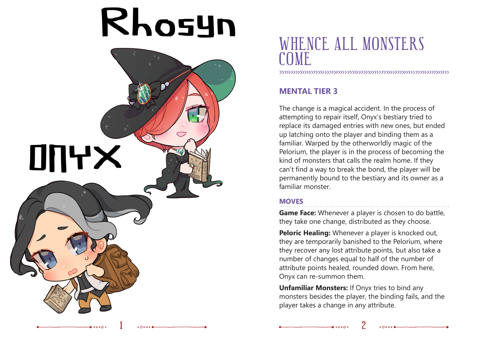

> **心靈等級 3**

這場蛻化是一場**魔法事故**。在試圖修復自身的過程中，**Onyx 的怪獸圖鑑（bestiary）**企圖以新的條目取代受損的條目——卻反而**鎖定了玩家**，將其綁定為**契魔（familiar）**。受到「**Pelorium**」之異界魔法的扭曲，玩家正在轉化為呼此境為家的那類怪獸。如果他們無法找到方法解除契約，**玩家將永久綁定於圖鑑與其主人，作為契魔的怪獸**。

### 動作（MOVES）

**戰鬥之臉（Game Face）**：每當玩家被選中參與戰鬥時，他承受 1 點蛻化，由其自行分配。

**Pelorium 治癒（Peloric Healing）**：每當玩家昏倒時，他暫時被流放到 Pelorium——所有失去的屬性點數皆會回復；但他也承受**等於回復點數一半（無條件捨去）的蛻化**。Onyx 可以從那裡**重新召回**他。

**陌生的怪獸（Unfamiliar Monsters）**：如果 Onyx 試圖綁定**玩家以外的任何怪獸**，綁定都會失敗——並且玩家在任意屬性上承受 1 點蛻化。

---

### 登場角色（CAST）

#### Onyx（they/them）
> 「我看你也是衝著傳奇的 **Monoceros** 來的！既然如此，我們就只好開戰了！」

玩家的勁敵——一名實力與玩家相當的女巫。儘管她對外表現得對玩家充滿敵意，實際上一切都只是樂趣使然。Onyx 對巫術充滿熱情，喜歡蒐集稀有怪獸——也因此對 Monoceros 感興趣。她並無真正想傷害玩家之意；當意外導致玩家被綁定為其契魔時，她會盡全力幫忙。

#### Rhosyn（she/her）
> 「我最大的勁敵，馬上就要成為我最強大的怪獸了！多麼令人愉悅的想法！呵呵呵呵！」

Rhosyn 視玩家為自己在巫術領域的**最大勁敵**——但玩家根本幾乎不知道她的存在。Rhosyn 立志要成為全 **Remia** 最強大的女巫，並願意不擇手段達成這個目標。她追求 Monoceros 是為了它傳說中的力量；當她得知玩家的處境時，會把握機會**奪走玩家的力量據為己有**。

#### Mason（he/him）
> 「你們這些小不點真的想開戰？好啊，放馬過來！我家的 **Antlion** 你們贏不了！」

一名稍微有經驗的女巫——但儘管自負且囂張，他離頂尖還有很長一段距離。他在戰鬥中愛用的契魔是 **Antlion（蟻獅）**。

#### Perry（he/him）
> 「兄弟，我發誓我**完全不知道**那群盜匪女在搞什麼。但我先講清楚：**我跟她們沒一掛**。」

實力與玩家相近的一名女巫。他配有一隻發光的魔法義眼——其中**仔細地封禁了 Pelorium 能量**。他偏愛的契魔（也是日常的同伴）是一隻能模仿人類言語的 **Hercinia**——而且這傢伙特別愛講髒話。

#### Sir Antares（he/him）
> 「又一個粉絲？呸！你們小鬼真不識相，是吧？算了，要不要喝杯**蔥茶**？」

一名聲名遠播、性格略古怪的女巫——擁有漫長且精彩的職涯。Sir Antares 已退休多年，住在 **Leaftide 森林**的一棟小屋中。雖然他煩透了那些煩人的粉絲——但一旦你贏得他的好感，他相當友善（雖然有點神遊）。

#### 盜匪三人組——Terry、Cherry、Mary（she/her）
> 「Terry、Cherry、Mary——為您效勞！搶得你魂飛魄散！我們是不是很可怕？上吧，Faerie！」

這是一群涉獵巫術的盜賊。她們可能對 Monoceros 的力量感興趣——但僅是為了讓她們現有的營生更順手：**埋伏新手女巫、在戰鬥中擊敗她們、並把所有貴重物搶走**。如果玩家的名字（哪怕只是大致地）與她們的名字押韻，三人組可能會邀請玩家加入。她們在戰鬥中愛用的是仙界類（faerie-type）契魔，例如 **Kelpie、Barghest、Brownie、Pixie、Dullahan**。

#### Monoceros（it/its）
> 「你也是來綁定我的？提醒你——許多人試過，沒有一個成功的。」

一頭在 Leaftide 森林中、傳說極為稀有且強大的怪獸。它是 **Unicorn 的較粗壯遠親**，擁有與獨角獸類似的魔法——包括**施加與解除詛咒**的能力。它或許正是玩家擺脫與 Onyx 之契約所需的關鍵。

---

### 引子（INTRO）

在 **Remia** 之地，女巫透過**契魔（familiar）**——以**圖鑑（bestiary）**這種附魔的怪獸百科召喚並控制的野生怪獸——彼此對戰。當契魔倒下，他們會回到 **Pelorium**——「**萬獸所自來、亦終將回去**」的異界——以治癒、待重新被召喚。透過這些代理人，Remian 女巫得以避免直接動用其魔力——那股**幾乎在過去毀掉 Remia** 的毀滅之力，至今仍受**巫師議會（Sorcerers' Council）**嚴密管制。

玩家是一名菜鳥女巫，前往那座偏遠、被附魔、迷宮般的 **Leaftide 森林**尋找 Monoceros。但玩家並不是唯一聽到「**森林裡有 Monoceros**」傳聞的女巫。

進入森林一段時間後，玩家穿過一道陡峭的峽谷。這時，**Onyx** 從中攔路、向他發起挑戰。Onyx 派出的是 **Amphiptere（雙翼蛇龍）**——龍系怪獸的稀有變種。雖然它稀有，卻相當容易被擊敗——但過程中，**Amphiptere 把 Onyx 的圖鑑點著了一場附魔火**。在 Onyx 慌亂滅火的過程中，圖鑑釋出一道魔法波——同時影響到她與玩家。

---

### 蛻化（THE CHANGE）

玩家發現自己被**傳送到 Pelorium**——感覺到該境界的奧術能量正侵入並扭曲他的身體。不久後，他被牽引回到人類世界——但有件事大事不妙：**他被綁定到 Onyx 那本受損的圖鑑（並由此延伸至 Onyx 本人），成為一名契魔**——並正在因此**逐漸成為怪獸**。

Onyx 的其他怪獸都已葬身於那場火，與此同時，玩家的圖鑑因「擁有者已被改變」而**無法使用**。此時，**玩家應在自選屬性上承受 2–3 點蛻化**。

---

### 鋪陳（BUILDUP）

Onyx 對這個發展很不安，想協助玩家——但他們深陷森林，難以與外界取得援助。Onyx 認為**住在森林裡的 Sir Antares** 或許可幫忙——前提是他們找得到他。更糟的是，森林中遍布敵對的女巫與遊蕩的怪獸。玩家別無選擇，只能與 Onyx 並肩作戰，並在事態無可挽回前找到解除契約的辦法。

玩家的**圖鑑條目**會依其累積的蛻化點數而改變。同時，當條目改變後，**外人首次見到玩家時的最初認知**也會改變。在較高層級時，外人會驚訝於玩家**竟然能說話**；不過解釋之後，他們仍可被說服理解真相。

最終，玩家會抵達 Sir Antares 的小屋。他被那些挑戰他的粉絲煩透了，因此在屋外設了**一對 Gryphon（獅鷲）守衛**。玩家必須**引開、擊敗，或設法潛行繞過**它們。

#### 圖鑑條目對照表

| 蛻化點數 | 效果 | 圖鑑條目 |
|---|---|---|
| 3 | 起初被外人認知為「**人類**」 | **Human**：一名被綁定為契魔的人類女巫。一支衍生自靈長類的支系——人類愚蠢地相信自己是 **Eumundi** 的支配物種。其戰鬥能力有限；其魔法能力通常受到**巫師議會**所設下的綁定限制。在沒有綁定的情況下他們的能力較強，但仍遠不及**真正的力量**。 |
| 4–7 | 起初被外人認知為「**未知怪獸類別**」 | **Human (?)**：受 Pelorium 能量影響的人類。由於人類的內在脆弱，他們無法承受長時間的此能量曝露——可能出現副作用，例如**物種認同的喪失**。當這種不穩定狀態自我消解後，他們將變得更加強大。 |
| 8+ | 起初被外人認知為「其指定怪獸類別的不尋常個體」 | **見對應的怪獸條目** |

#### 森林中的隨機遭遇

| d22 | 遭遇 |
|---|---|
| 0–3 | 玩家遇到一頭**野生怪獸**。 |
| 4–5 | 玩家在林中發現一輛**翻覆的馬車**——其實是盜匪三人組設下的陷阱。 |
| 6–7 | 玩家發現一處**營地**。露營者警戒——其他女巫對他們造成過麻煩——但隊上只有一名有些許巫術經驗者。 |
| 8–9 | Onyx 的補給見底，需要尋找更多。 |
| 10–11 | 玩家來到一處空地，地上有一名當地**伐木工的小屋**。如玩家能說服他自己可信，他可能會給予補給或方向指引。 |
| 12–13 | 玩家發現一處**被某位女巫遺棄的營地**。 |
| 14–15 | 玩家來到一條穿過森林的小河岸。他必須找路渡河，或順其流向前進。 |
| 16–17 | 玩家發現一道阻擋去路的**深邃峽谷**。一座結實的木橋橫越其上——但 **Mason** 在另一頭等候，會擋住其前進之路。 |
| 18–19 | 玩家察覺有人在跟蹤他。如果他能抓到那人，會發現是 **Rhosyn**。 |
| 20–21 | 玩家碰上一座**坍塌的石塔遺跡**——只剩下下三層的外牆。如果他試圖探勘，**Perry 會伏擊**。 |

---

### 高潮（CLIMAX）

應付 Sir Antares 有點麻煩——但若玩家能贏得他的好感，他會同意協助。他認為玩家問題的最佳解法在於 **Monoceros 之力**。他聽過森林深處關於那隻獸的傳聞，但既已退出戰鬥，便沒興趣去查證。他**拒絕**陪同玩家前往，堅稱自己「太老沒法去冒險了」——但他會給玩家一只**能指向 Pelorium 能量的附魔羅盤**，並指引他們前往 Monoceros 棲身的森林之心。**Rhosyn 在暗中監視這一切，並會悄悄跟隨玩家**前往目的地。

Monoceros 居於森林最深處的一片**附魔林間空地**。如果玩家**蛻化已足以聽懂它的話**，它會主動對玩家說話——若玩家承諾不打擾它，**它會主動為玩家解除詛咒**。否則，戰鬥將不可避免——Monoceros 不會讓任何人輕易把它綁定。讓事情更複雜的是：**Rhosyn 將出現**——她想將玩家與 Monoceros **同時綁定為自己所有**。

---

### 結局（ENDINGS）

如果玩家能在抵達**永恆**前解除詛咒，他便會被解除綁定，蛻化逆轉。否則，他可選擇繼續綁定於 Onyx，或冒著「**被流放至 Pelorium**」的風險解除綁定。在玩家獲得 Monoceros 配合的情況下，Monoceros 也可選擇**不放逐他**地解除其綁定。當然，玩家也可能最終被綁定於 **Rhosyn**——出於自願，或被迫；後者發生時，**Sir Antares 可能介入**。

---

### 玩家可能的怪獸條目（BESTIARY ENTRIES FOR PLAYER MONSTERS）

- **Salamander（火蜥蜴）**：一頭披著白毛的大型兩棲類。具有強大的火焰之力，能承受最高的溫度——而且似乎**樂於在火中**。
- **Serra**：一種兩棲魚類，具多色鱗片與頭部一道**像鋸刃般的恐怖頂冠**——可作為武器。它有強大的雙翼，能以高速長時間飛行，甚至能懸停。
- **Wolpertinger**：Jackelope 較危險的近親——一隻有著鳥翼與利爪、鹿角、巨大獠牙的兔形動物。它在魔法上不如其他種類，但**以嗜血見長**。

### 較常見的怪獸（MORE COMMON MONSTERS）

- **Jackelope**：一隻嬌小卻具攻擊性與危險的動物——外型如兔，頭頂卻有羚羊的角。如鸚鵡般，牠能模仿人語。
- **Centicore**：一種類似羚羊的生物，擁有可在戰鬥中**獨立旋轉**的大角。
- **Jaculus**：一種小型 wyvern，喜以全身重量高速撞向敵人。
- **Seps**：一種雙足蛇類，毒液帶酸性——雖也能噴吐毒液，但**直接咬擊**最為致命。
- **Antlion（蟻獅）**：外型介於獅子與巨型螞蟻之間的生物，以**巨力**著稱。
- **Imp**：小型懸浮類人型怪獸——能離地飄浮、攀爬高超，且喜歡惡作劇。
- **Pantera**：一隻有著彩虹般皮毛的貓型生物——其呼吸帶有令獵物暈眩的毒。
- **Scitalis**：一種以**炫目威嚇展示**分散獵物注意力的蛇型生物。
- **Ball-tailed cat**：尾端帶有**尖刺釘鎚**的貓型生物。
- **Hercinia**：一種發光如太陽的鳥類生物。
- **Martlet**：一種彷彿耐力無盡的鳥類——因**沒有腳**，牠終其一生都在飛。

---

### Whence All Monsters Come — 蛻化十字

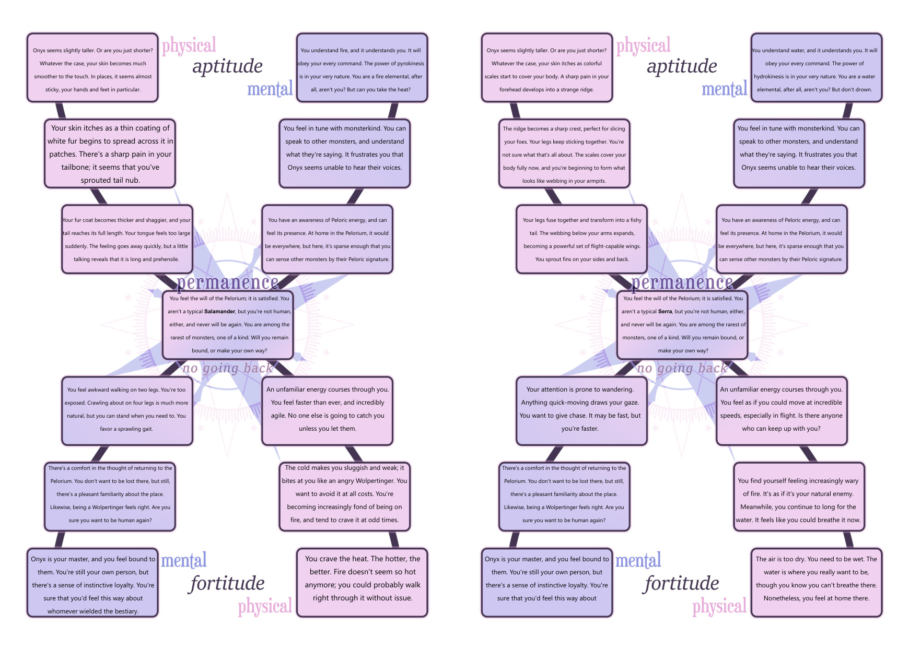

> **永恆（Permanence）**：你感受到 Pelorium 的滿足。你不是一隻典型的（**Salamander／Serra／Wolpertinger**），但你也不再是人類，永遠不會了。你是最稀有的怪獸之一——**獨一無二**。你會繼續被綁定，還是走出自己的路？

#### Salamander（火蜥蜴）路徑

**PA：**
- Onyx 似乎變高了一點。也或許是你變矮了？無論如何，你的皮膚變得**極為光滑**——某些部位甚至有點黏，特別是手與腳。
- 你的皮膚開始發癢——一層薄薄的**白毛**斑駁地長了出來。尾椎處刺痛——你長出了一段尾巴芽。
- 你的毛變得更厚、更亂，尾巴長到完整。你的舌頭忽然覺得太大——這感覺很快過去，但稍微說話就能發現：它變得**又長、又能捲握**。

**MA：**
- 你**理解火**——而火也理解你。它將服從你的每一道命令。**火力念力（pyrokinesis）**已是你天性的一部分。畢竟你是個火元素，不是嗎？——但你撐得住這份熱嗎？
- 你能感受到自己與**怪獸界的同調**。你能聽懂並與其他怪獸交談——卻挫敗於 Onyx 顯然聽不見牠們的聲音。
- 你具有對 **Pelorium 能量**的覺察，能感受到它的存在。在 Pelorium 那會無所不在；但在這裡較為稀薄——稀薄到你能憑其 Pelorium 印記**感知到其他怪獸**。

**PF：**
- 你**渴望熱**——越熱越好。火不再讓你覺得太燙——你大概可以**直接走過火裡**毫無問題。
- 你發現自己在四足上與兩足上一樣自如——四足甚至更舒適。但你不是典型的 Wolpertinger（**Wolpertinger 蛻化的副作用補充**：脾氣常爆發；新長出的鼠類門齒若不磨會痛）。
- **冷令你遲鈍與虛弱**——它像一頭憤怒的 Wolpertinger 啃咬著你。你不計代價地避開冷。你也越來越喜歡「**身在火中**」的感覺，並偶爾會在奇怪的時刻想念它。

**MF：**
- Onyx 是你的**主人**——你感覺被綁於他們之上。你仍是自己——但有一種本能性的忠誠。你確信若是別人持有圖鑑，你也會這樣感受。
- **回到 Pelorium** 的念頭帶給你一種安心。你不希望在那裡迷失，但仍對那地方有種熟悉與親切。同樣地，**作為 Salamander** 也感覺對勁。**你真的還想再變回人類嗎？**

#### Serra 路徑

**PA：**
- Onyx 似乎變高了一點——或許是你變矮了？無論如何，你的皮膚發癢——**色彩斑斕的鱗片**開始覆蓋你全身。額頭處刺痛——一道奇異的脊發育出來。
- 那道脊變成尖銳的**鋸刃冠**——適合切碎敵人。你的雙腿時不時黏在一起——你不太確定怎麼回事。鱗片現已完全覆蓋全身——腋下開始長出像「**蹼**」的東西。
- 你的雙腿融合、變化為一條**魚尾**。腋下的蹼擴展為強大、可飛行的雙翼。你的雙側與背部冒出**鰭**。

**MA：**
- 你**理解水**——而水也理解你。它將服從你的每一道命令。**水力念力（hydrokinesis）**已是你天性的一部分。你是個水元素，不是嗎？——只是別淹著了。
- 你能感受到自己與怪獸界同調——可與其他怪獸對話、聽懂牠們，並挫敗於 Onyx 聽不見牠們。
- 你具有對 Pelorium 能量的覺察，能憑其 Pelorium 印記感知其他怪獸。

**PF：**
- 你感覺體內湧出一股不熟悉的能量——你**極為迅捷**，尤其在飛行中。**有人能跟上你嗎？**
- 你的注意力容易飄移——任何快速移動的事物都會抓住你的目光。**你想去追**——它或許很快，但**你更快**。
- 空氣**太乾**——你**需要濕**。你真正想待的是水中——雖然你也知道你無法在那裡呼吸。儘管如此，那裡仍像家。

**MF：**
- Onyx 是你的主人——你感覺被綁於他們之上（同 Salamander 路徑）。
- 回到 Pelorium 的念頭帶給你安心；作為 Serra 感覺對勁。
- 你越來越畏懼**火**——它彷彿是你天生的剋星。同時你越來越渴望水——你感覺現在可以**在水裡呼吸**。

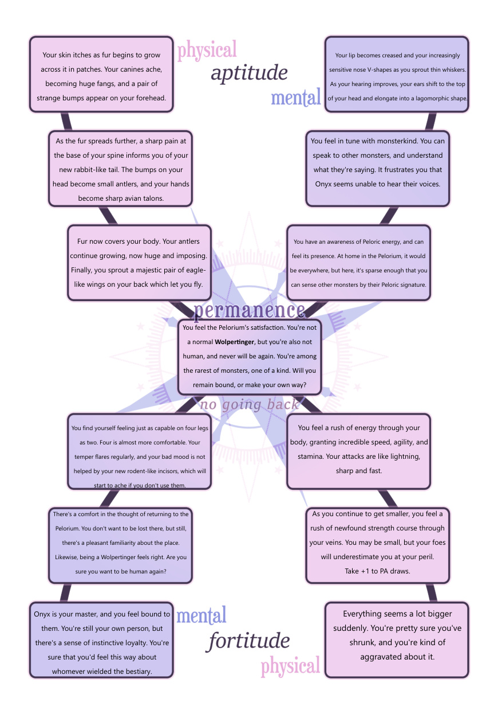

#### Wolpertinger 路徑

**PA：**
- 你的皮膚發癢——**毛**開始斑駁地長出。犬齒疼痛、化為巨大獠牙；額頭出現一對奇特的隆起。
- 隨著毛延展，脊柱底部的尖痛通知你——你長出了一條**兔尾**。額頭上的隆起化為**小鹿角**；你的手化為銳利的**鳥爪**。
- 你的全身被毛覆蓋。鹿角持續生長——巨大而威嚴。最後，你背上長出一對雄偉的**鷹翼**——讓你能飛行。

**MA：**
- 你的下唇變得有摺，鼻子越來越敏感、形成 V 形——你長出細細的鬍鬚。聽覺改善——耳朵移至頭頂、伸長為**兔形**。
- 你能感受到自己與怪獸界同調——可與其他怪獸對話、聽懂牠們，並挫敗於 Onyx 聽不見牠們。
- 你具有對 Pelorium 能量的覺察，能憑其 Pelorium 印記感知其他怪獸。

**PF：**
- 一切忽然看起來大了好多——你相當確定**你縮小了**——而且**為此頗為惱火**。
- 你感覺體內一股能量傳遞——速度、敏捷、耐力都極為驚人。你的攻擊**像閃電**，鋒利且快速。
- 隨著你越縮越小，你也感受到一股新生的力量——你或許很小，但敵人**會誤判你的威脅，付出代價**。**所有 PA 抽牌 +1**。

**MF：**
- Onyx 是你的主人——你感覺被綁於他們之上（同上）。
- 回到 Pelorium 的念頭帶給你安心；作為 Wolpertinger 感覺對勁。
- 你發現自己在四足與兩足之間都同樣自如——四足甚至更舒適。你的脾氣經常爆發，並因新長出的鼠類門齒——若不磨它它就會疼——而更加暴躁。

