# 《To Change》— 繁體中文譯本

> 一款關於「蛻化」的桌上角色扮演遊戲。
> 原作：Ulysses · Ewen
> 解析機制：以塔羅 22 張大阿爾克那組成的「預兆牌」為核心，無骰系統。
> 本譯本為非公式繁中翻譯，依原書頁次逐章翻譯中。

<figure class="cover-art">

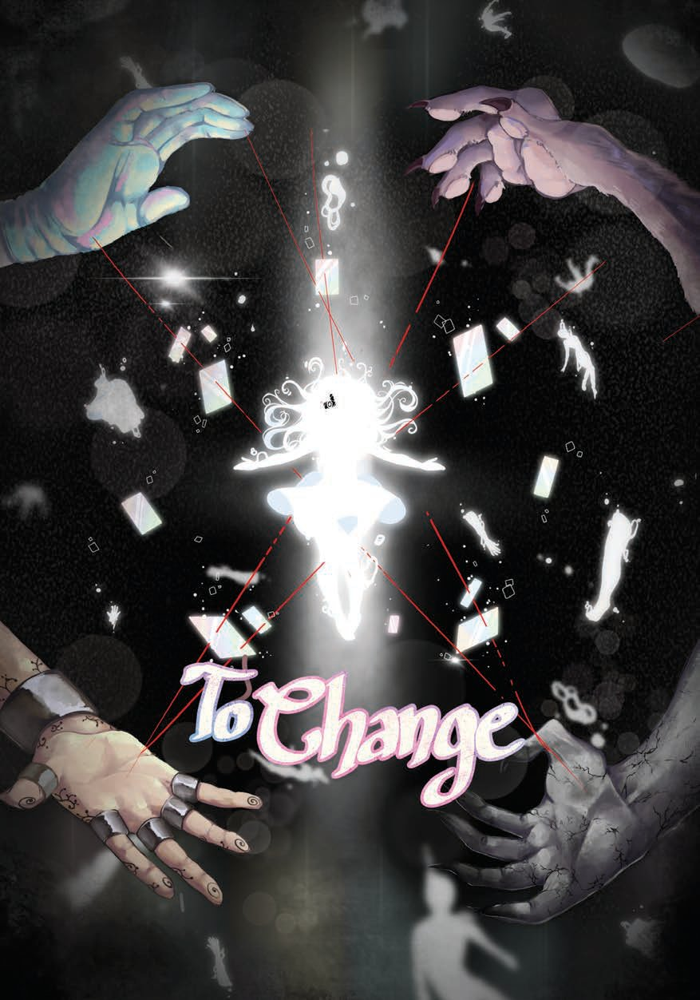

</figure>

---

## 致謝

**Ulysses** — 獻給那個讓本書得以誕生的「蛻化」社群，是你們把這麼多人聚在一起。

**Ewen** — 獻給 FlamboyantChatoyant，你是我最要好的朋友之一。你一路上的支持（與無懈可擊的編校工作）對我而言意義非凡。也獻給所有讀者——你們對我作品的關注，是我繼續走下去的力量。

---

## 目次

- [致謝（Acknowledgements）](#致謝)
- [概要（Overview）](#概要)
- [這是什麼遊戲？（What is this Game?）](#這是什麼遊戲)
- [什麼是「蛻化」？（What is the Change?）](#什麼是蛻化)
- [安全規則](#安全規則)
- [玩家屬性（Player Attributes）](#玩家屬性)
  - [心靈韌性 MF（Mental Fortitude）](#心靈韌性-mf)
  - [心靈天賦 MA（Mental Aptitude）](#心靈天賦-ma)
  - [肉體韌性 PF（Physical Fortitude）](#肉體韌性-pf)
  - [肉體天賦 PA（Physical Aptitude）](#肉體天賦-pa)
- [行動占卜（Resolution）](#行動占卜)
  - [何時抽牌（When to Draw Cards）](#何時抽牌)
  - [預兆牌（Future Deck）](#預兆牌)
- [角色建立（Character Creation）](#角色建立)
- [規則替代與選項（Alternate Rules & Options）](#規則替代與選項)
- [表格（Tables）](#表格)
- [故事動作（Story Moves）](#故事動作)
- [單人遊玩（Solo Play）](#單人遊玩)
- [故事（Stories）— 拆分至獨立檔案](to_change_stories_zh-TW.md)
- [關於本譯本](#關於本譯本)

---

## 概要

我們的行動形塑著未來，而那命運回過頭來，又再形塑我們。即將誕生的這副形體，會是美麗、還是猙獰？被渴望、還是被厭憎？只有那個讀牌的人，能決定他想成為什麼。

「成為另一個人」究竟是什麼意思？還有什麼比你的肌膚、你的身體、你的感官、你的思緒更熟悉？這些特質，難道對你不具有特別的意義嗎？

但熟悉，難道就能阻擋對改變的渴求？你會抵抗未知的悸動嗎？或者，正是這份誘惑，讓你恐懼？

蛻化，是自我探索的第二趟旅程。在生與死之間，我們渴望盡覽一切——能以幾種形體去看，便看遍幾種。怎能甘於只擁有一雙眼？

《To Change》是一款用來探索「一個人或一群人正經歷劇烈蛻化」的遊戲——以及他們在成為某種全新存在的路上，必須承擔的所有後果。

---

## 這是什麼遊戲？
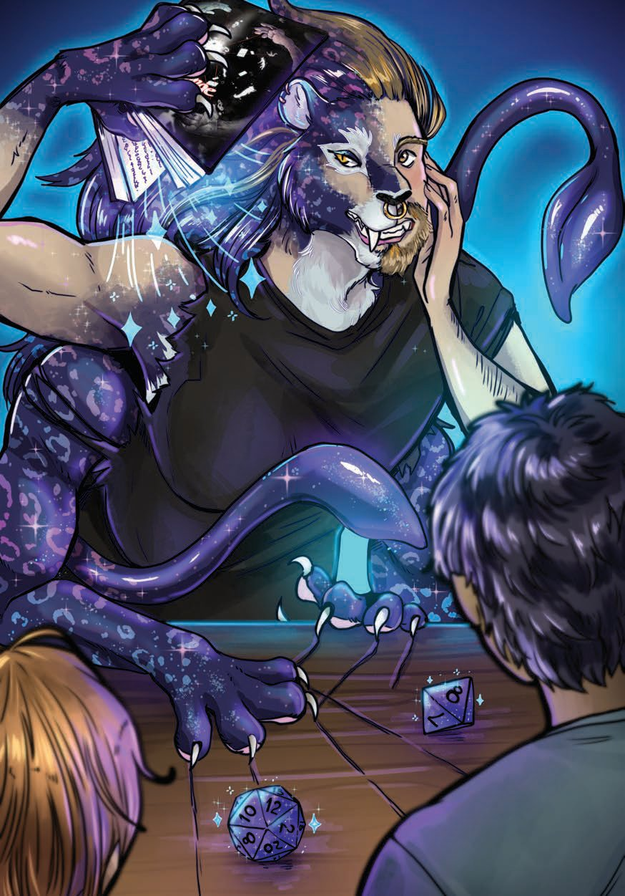
這是一款桌上角色扮演遊戲，設計目標是 1–3 小時的短團務，由一名**敘事者**（亦即慣稱的 GM）主持，1 至 4 名玩家演出。也可以一個人在沒有敘事者的情況下，作為單人札記式遊戲進行。本系統不使用骰子；玩家從**預兆牌**抽牌，以判定他們行動的成敗。

玩家會建立擁有心靈與肉體屬性的角色，這些屬性會隨故事進展而蛻化。敘事者可以使用「動作」來確立自己引導玩家的方式。這層關係的目的，是孕育一個令人激動或熱血的故事——為意外與出人意料的選擇預留空間。

這套系統，是為了訴說那些「沉重而充滿情感拉扯地失去人性」的故事；它同時也適用於那些「昂揚向上、頌揚『成為一隻美麗怪物』之興奮」的故事。

《To Change》的初衷，是擁抱世界各地的跨性別者。**性別轉換**是最古老、最神聖的魔法，必須不惜一切被守護。這個遊戲不歡迎恐跨者、法西斯主義者，以及一切偏執之人。

---

## 什麼是「蛻化」？
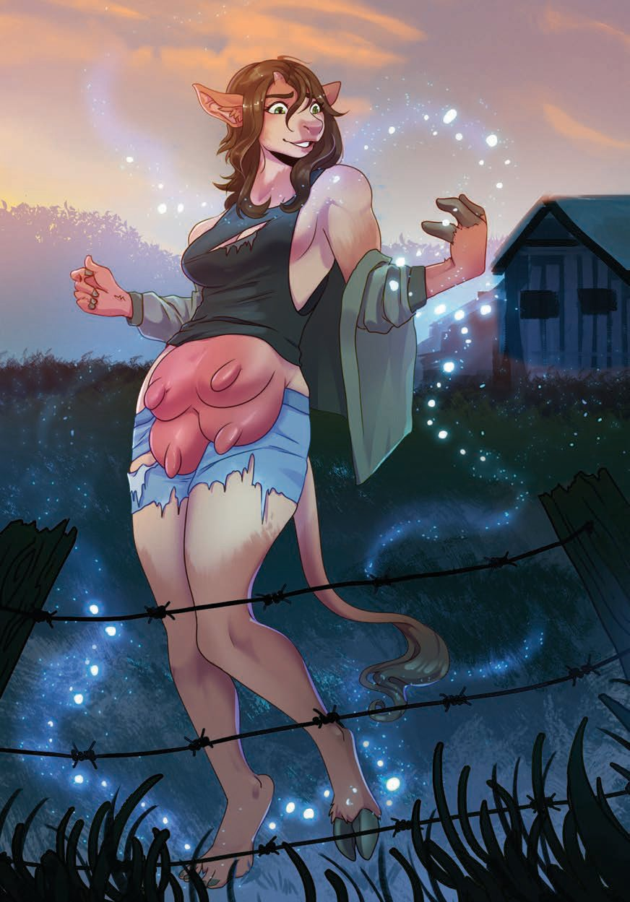
「蛻化」是這個故事的核心，呼應著從人類最早的神話、到我們現代世界的真實人生中，無所不在的「轉化故事」。每一個成長故事，同時也是一個改變的故事；但當我們談論「真正的蛻化」，有幾項原則能讓一場形變特別令人神往。

**蛻化必須兼具正面與負面。** 即使是一副獸性的形體，也可能為了崇高目的而沉浸於它可怖的力量。即使是一副最被渴望的身體，也仍背負著「離開過去、走向未知」的痛楚。

**到了某個臨界，便再也回不去了。** 對於「永恆」的終極恐懼或渴望，籠罩著每一場蛻化。敘事的高潮，應該在這條界線上踉蹌前行，直到那最後一刻的戲劇性抉擇。

**蛻化必須同時牽涉心靈與肉體、內在與外在**——沿著四項屬性，逐步推進。

以上並非嚴格的規範；但若一個故事的核心蛻化運用了上述全部原則，便最能發揮這套系統的精髓。

---

## 安全規則

### 通用
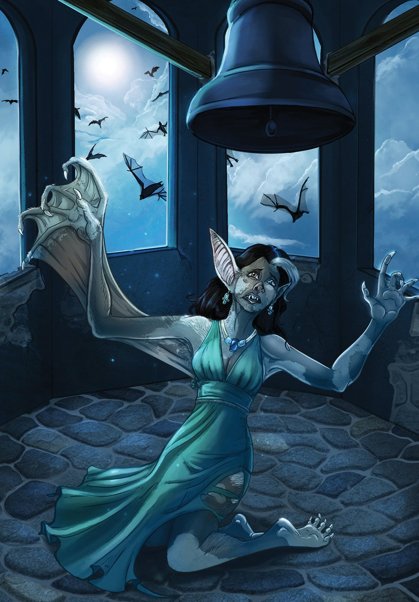
《To Change》的冒險牽涉肉體與心靈的蛻化，其中某些內容對特定玩家而言可能會造成不適或性別焦慮（dysphoria）。為了避免在桌上傷到任何人——包括敘事者——以下提供幾項通用與特定的安全工具，請在開始遊戲前以團體形式一起討論。

**為每位玩家確立各自的「線」與「帷幕」（Lines & Veils）。**

**線**是「絕對不行」——你完全不希望在遊戲中出現的題材，毫無例外。**帷幕**是「視情況而定」——在某些情境下可能會讓你不舒服的題材，但要看狀況。

如果你準備跑的故事碰到了某位玩家的線，請改選別的故事；如果故事碰到了他們的帷幕，請準備好以審慎的方式處理那個題材，並事先給該玩家心理準備。

> 「家庭虐待對我來說是線，我完全不想讓這個題材在我們的遊戲裡出現。昆蟲對我來說是帷幕——有些蟲我可以接受，例如蝴蝶；某些情境下也還行，例如出現在戶外。」

請記得，維護線與帷幕是一個**持續進行**的過程；只要玩家或敘事者有需要，就應該重新確認、重新陳述。

### 特定

**為每位玩家確立各自的「身體等級」與「心靈等級」（body and mental Tiers）。**

**關於肉體蛻化**：詢問玩家——他們角色身體的哪些部位是絕對不希望被改變的。請以你尊重該玩家自身的身體自主權那樣，去尊重他們角色的身體自主權。要把一場蛻化的肉體細節調整成符合玩家意願的版本，通常並不困難。

**關於心靈蛻化**，總共分成五個等級。請詢問玩家對哪一個等級的心靈蛻化會感到不舒服，並避開那些會涉及該類蛻化的故事，或是把該部分修改掉。

- **等級 1（Tier 1）**：侵入性念頭——意識邊緣一閃即逝的暗示。
- **等級 2（Tier 2）**：被觸動的情緒——焦慮、欣快、抑鬱，以及其他強烈感受不請自來地進入你的腦中。
- **等級 3（Tier 3）**：思緒的變動——包括記憶被改寫、對你認知與感知的直接更動。
- **等級 4（Tier 4）**：心智支配——你失去對自己角色及其行動的掌控。
- **等級 5（Tier 5）**：自我之死——失去自我，失去身為人類的心智。

---

## 玩家屬性

每位玩家的角色能力，由四項屬性所定義：

- **心靈韌性 Mental Fortitude**（也有人叫**意志力 Willpower**）
- **心靈天賦 Mental Aptitude**（也有人叫**智力 Intellect**）
- **肉體韌性 Physical Fortitude**（也有人叫**耐力 Endurance**）
- **肉體天賦 Physical Aptitude**（也有人叫**體能 Strength**）

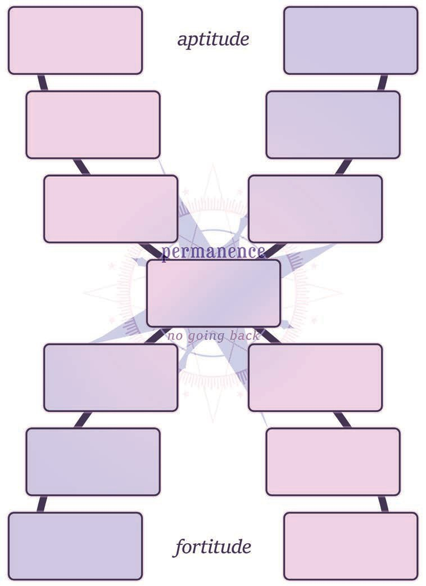

這四項屬性，構成了玩家的「**蛻化交叉（change cross）**」的四條分枝。

這些屬性會因為傷害與壓力而**受損**，受損之後在恢復前都無法使用。屬性可透過治療、休息、心理諮商與用藥恢復。一般而言，「天賦」類屬性的恢復速度比「韌性」類屬性更快。

這些屬性同時也會被**蛻化**——映照出一場無從逃避的轉化：它沿著角色的心靈或肉體向內推進，直到嵌進他存在的核心。

四項屬性的中央，是**永恆之點（point of Permanence）**。一旦這一點被蛻化，這場轉化便無論如何再也無法逆轉。雖然之後仍可繼續蛻化，但已沒有任何辦法回到從前。愈接近永恆之點的點數，被蛻化時所代表的轉化愈劇烈、被傷害時所造成的損傷也愈嚴重。

> 蛻化交叉的配置（自原書圖示）：
> - 上下兩枝為**肉體**
> - 左右兩枝為**心靈**
> - 中央為**永恆之點**

---

### 心靈韌性 MF
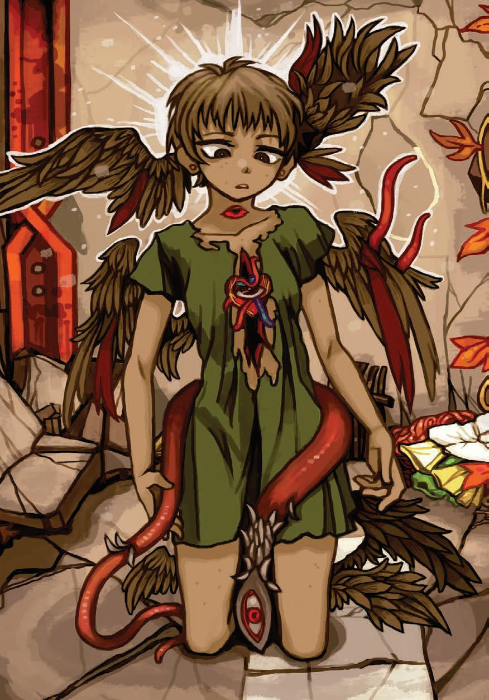

這是你抵抗說服與心靈侵入的能力——在壓力下保持鎮定，在感官超載時仍守住自己思緒的能力。

當你的 MF **受損**，你會變得更容易被暗示左右；持續惡化下去，你會失去自由意志，淪為當下感官的奴隸。若 MF 完全耗盡，你會像一具失神的人偶般行動。

當你的 MF **被蛻化**，那些改變會反映在你的內在思考歷程裡，動搖你最深層的價值與需求。若 MF 被完全蛻化，你便不再以從前的方式思考。

**MF 受到挑戰的情境：**

- 被人逼問真相時，仍守住一個謊。
- 無視從海中傳來、要你拋棄這身皮囊的聲音。
- 說服一個陌生人，相信你是對的。
- 在你心儀的對象面前保持冷靜。
- 阻止一道法術扭曲你的渴望。
- 做出一個違背你自身道德的選擇——即使那個選擇是對的。

---

### 心靈天賦 MA

這是你以心智去吸收世界的能力——快速思考以解決突發問題、迅速分析情勢並擷取相關資訊。

當你的 MA **受損**，你的腦袋會變得混沌而朦朧，到最後連思考都會痛。若 MA 完全耗盡，你的大腦會關機，你也會失去意識。

當你的 MA **被蛻化**，那些改變會反映在你向外的感官上，更動你看、聞、嚐、聽、觸的方式。若 MA 被完全蛻化，你便不再以從前的方式感知這個世界。

**MA 受到挑戰的情境：**

- 在黑巷中尋找移動的影子。
- 在群狼的嗥叫中，分辨出你孩子的哭聲。
- 讀懂一段複雜的歷史文獻。
- 寫一首詩，讓你的伴侶臉紅。
- 摸索老牆上一道可疑的裂縫。
- 認出哪雙是你朋友的眼睛——又哪雙是「戴著他臉孔的東西」的眼睛。

---

### 肉體韌性 PF
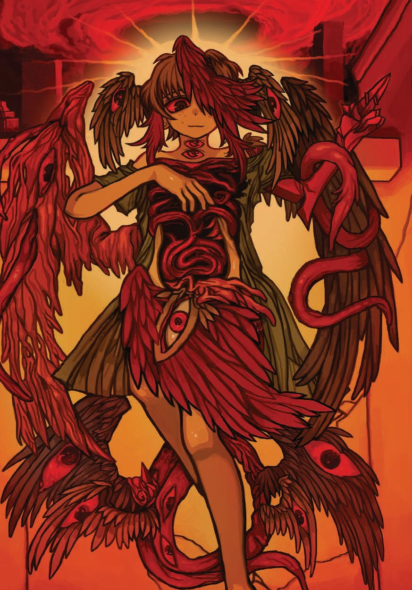

這是你的內在強韌度——抵抗外界衝擊的能力，是你內裡有多堅韌、能扛多少壓力才會崩塌的尺度。

當你的 PF **受損**，你會變得脆弱衰弱，容易受傷、對痛覺敏感。若 PF 完全耗盡，你的身體會關機，你也會失去意識。

當你的 PF **被蛻化**，那些改變發生在你的身體內部——臟器與內臟挪移錯位，扭轉你內部的運作。若 PF 被完全蛻化，你的感受方式便不再像從前。

**PF 受到挑戰的情境：**

- 在刺骨寒風中保住自己的體溫。
- 聽見腳步聲時，在被窩裡裝睡。
- 挨一拳到肚子，臉不皺一下。
- 為一幅裸體肖像擺姿勢。
- 多喝了幾杯之後仍能站著。
- 屏住呼吸，足以再分享最後一個吻。

---

### 肉體天賦 PA

這是你的外在強韌度——對世界施加力量、儘可能快速移動、以行動形塑環境的能力。

當你的 PA **受損**，你會變得疲憊遲鈍，無法移動或反應。若 PA 完全耗盡，你會被癱瘓、力氣徹底放盡。

當你的 PA **被蛻化**，那些改變對外人而言最為顯眼，會直接更動你的外貌。若 PA 被完全蛻化，你的模樣便與從前判若兩人。

**PA 受到挑戰的情境：**

- 攀爬樹枝。
- 把那個一直出現在你夢裡的奇異符號畫下來。
- 把同伴扛在背上。
- 在舞蹈中跟上伴侶的步伐。
- 贏得一場單車競速。
- 撲向綁架你的人，把那只剩下最後一瓶的解藥從他手裡擊落。

---

## 行動占卜
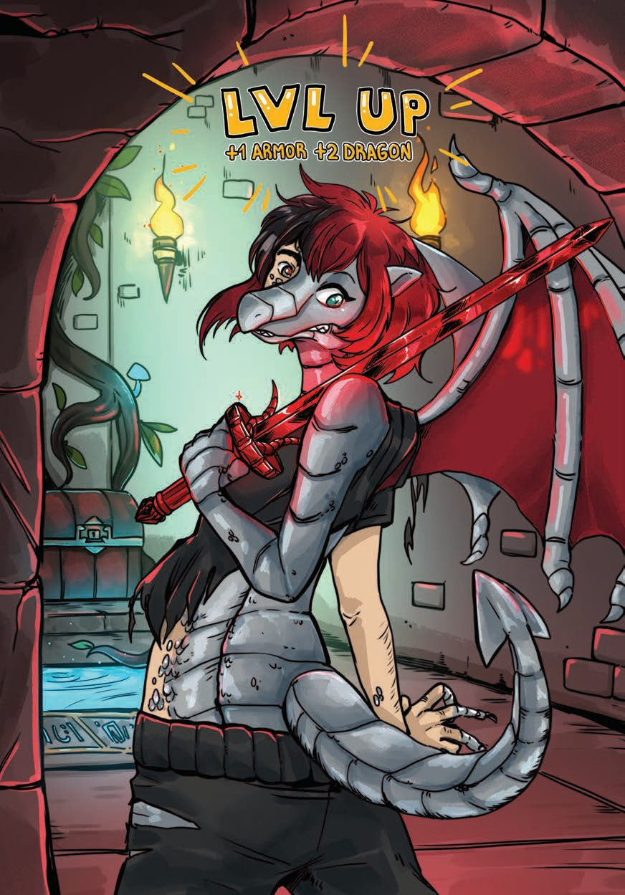

凡是會帶來後果的行動，都會以「從**預兆牌**抽牌」的方式進行檢定與結算——也就是塔羅 22 張大阿爾克那。

玩家抽出並翻開的牌數，等於該次受測屬性目前**未受損的點數**；接著從翻開的牌中**選擇一張**作為自己的命運。

被選中的牌會被棄掉，其餘翻開的牌則洗回牌堆。

玩家隨時可以選擇**蛻變（Succumb）**：以受測屬性中的「一點蛻化」換得行動成功。在這種情況下，所有抽出的牌都會直接洗回牌堆。若該名玩家已沒有可承受的蛻化點數，便不能蛻變。

若有玩家彼此**援助**對方的行動，每多一名援助者，就多抽一張牌。援助者也會一同承擔失敗的後果，以及這次抽牌所引發的任何蛻化。

所有屬性起始皆為 3 點，每受到 1 點傷害便減 1。**已被蛻化**的點數不會改變抽牌數量，除非規則特別註明。一個已蛻化的點數仍可被傷害，反之亦然。

---

### 何時抽牌

**韌性類屬性**通常是**被動**屬性——當玩家的韌性受到外力挑戰時，敘事者才會請玩家抽牌。

**天賦類屬性**通常是**主動**屬性——玩家會嘗試帶有失敗風險的行動，敘事者會要他們抽牌。

讓**失敗**推進故事，避免把玩家逼進死路。

> 你試圖跳過懸崖，卻一腳踩空，跌進谷底。
> （**這讓行動就此停止**）
> 對比：
> 你試圖跳過懸崖，幾乎成功——但必須緊抓住一根斜伸的樹枝才不至於墜落。其他玩家若想助你爬上來，就得抽一張牌。
> （**這引發了更多次抽牌**）

玩家抽得愈多，「蛻變」與週期性出現的**死神**牌帶來的蛻化便會自然累積。可以的話，請讓玩家的失敗驅使他們做出**更多次抽牌**，並引出**未來的併發狀況**。

---

### 預兆牌

22 張大阿爾克那組成的牌堆。下表依塔羅編號 0–XXI 列出每張牌的效果。

| 編號 | 牌名 | 效果 |
|:---:|---|---|
| 0 | 愚者 The Fool | 成功，但永遠是以最糟的方式（受傷、出糗、額外的麻煩）。 |
| I | 魔術師 The Magician | 以<strong>心靈天賦（MA）</strong>取得成功。 |
| II | 女祭司 The High Priestess | 以<strong>心靈韌性（MF）</strong>取得成功。 |
| III | 皇后 The Empress | 以<strong>心靈天賦（MA）</strong>取得成功。 |
| IV | 皇帝 The Emperor | 以<strong>心靈韌性（MF）</strong>取得成功。 |
| V | 教皇 The Hierophant | 以<strong>肉體韌性（PF）</strong>取得成功。 |
| VI | 戀人 The Lovers | 以<strong>肉體韌性（PF）</strong>取得成功。 |
| VII | 戰車 The Chariot | 以<strong>肉體韌性（PF）</strong>取得成功。 |
| VIII | 力量 Strength | 以<strong>肉體天賦（PA）</strong>取得成功。 |
| IX | 隱者 The Hermit | 以<strong>心靈韌性（MF）</strong>取得成功。 |
| X | 命運之輪 Wheel of Fortune | 以<strong>肉體天賦（PA）</strong>取得成功。 |
| XI | 正義 Justice | 在「全體玩家中累積最多蛻化、或並列最多」的那項屬性上取得成功。 |
| XII | 倒吊人 The Hanged Man | 以<strong>肉體天賦（PA）</strong>取得成功。 |
| XIII | 死神 Death | 無可逃避者。**不能被選用**——除非牠是這次占卜中唯一翻開的一張。一旦被選用，視為成功，且**不會被棄掉**。任何一次抽牌中只要翻出死神且最終成功，你便承受一次**蛻化**。 |
| XIV | 節制 Temperance | 失敗，但希望未滅。**所有已棄掉的牌全部洗回牌堆。** |
| XV | 惡魔 The Devil | 成功，且你承受一次**蛻化**。你可以對敘事者**許願**，指定這次轉化的具體樣貌；敘事者必須盡力滿足你的願望——包括減弱、誇大、或在美學層面修飾這次蛻化。 |
| XVI | 高塔 The Tower | 災難性失敗，並引發一場全新危機。**你下一次抽牌時，要多翻開兩張牌。** |
| XVII | 星星 The Star | 以<strong>心靈天賦（MA）</strong>取得成功。 |
| XVIII | 月亮 The Moon | 失敗——或是選擇從牌堆**底部**抽出一張新牌，並必須改用那張牌。然後將那張牌與月亮一同棄掉。 |
| XIX | 太陽 The Sun | 成功，並可看到牌堆**最上方**的下三張牌。 |
| XX | 審判 Judgement | 是成功還是失敗，由**敘事者**決定（在雙人或單人遊戲中，由抽牌的玩家自己決定）。 |
| XXI | 世界 The World | 世界介入並重生。從棄牌堆中取出一張牌（**世界**本身除外），把它放回牌堆，洗牌後重新抽。若場合許可，順便從遊戲中暫離一下，喝點水、休息片刻。 |

> **節制（XIV）** 與 **死神（XIII）** 永遠不會被棄掉。

---

## 玩家提示
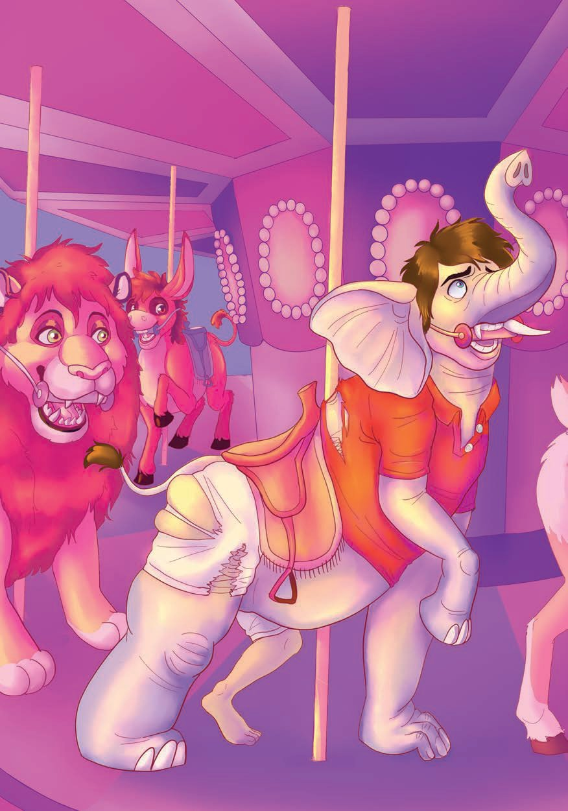
- 「**算牌（card counting）**」預兆牌，可作為計算「某次抽牌成功機率」的方式。**翻看棄牌堆評估自己的勝算並不是「Metagaming（劇外行為）」**，但別讓它拖慢故事節奏。
- **不要害怕蛻變。** 它不是失敗，它是**設計給你用的機制**。即使有一張牌能讓你成功，你也仍然可以選擇蛻變。**有時候只為了看接下來會發生什麼而繼續轉化，是很好玩的。**
- 當敘事者描述你角色身上正在發生的某段轉化時，**插話完全沒問題**——你可以要求他多著墨於某個你喜歡的面向，或請他略過某個讓你不舒服的面向。**你和敘事者一起填細節的「協作描寫」會特別有趣。** 使用<strong>惡魔（The Devil）</strong>牌時，這也正是它鼓勵的玩法。

---

## 敘事者提示

- 玩家**幾乎永遠**可以靠「蛻變」在抽牌中成功——所以**不要讓玩家對「成功會徹底毀掉故事的屬性」抽牌**。
- 在讓玩家對某項屬性抽牌前，**務必先想清楚失敗的後果**。**永遠**用失敗來引入新障礙——一個未來會需要更多次抽牌的障礙。
- 當玩家**即將進行的這次抽牌可能把他推進永恆**時，記得**提醒他**。透過提醒玩家「這意味著你將永遠不再是從前的你」，把張力或興奮感拉高。
- 在描述蛻化時，**盡量不要說**「目前還沒發生什麼」、「你目前還沒注意到什麼」。**即便是心靈蛻化，也會立刻在角色行為上顯現可察覺的影響。**
- 在多人遊戲中，最好**透過該角色自己的感知與感官來描述蛻化**。與其說「Joe，你看見毛從 Bill 臉上長出來」——不如**從正在蛻化的玩家的視角**改寫：「Bill，你的雙頰刺刺地像被細針點了一下，狼一樣的毛從你耳朵與下巴上竄出。」

---

## 角色建立
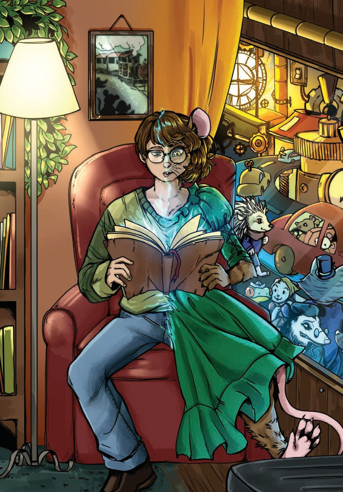
要建立一個角色，請從**大阿爾克那 22 張**中挑出三張牌。

這三張牌依序作為角色的**面相牌（Face card）**、**昇位牌（Rising card）**、**墜位牌（Falling card）**。

- **面相牌**代表角色的核心價值觀、人格中心，並賦予一項與該牌綁定的**特殊能力**。
- **昇位牌**代表角色的成功與好運，以及一項正向人格特質。當角色翻出自己的昇位牌時，他離自己的目標**更靠近一步**，並**多翻開一張牌**加入本次占卜中。
- **墜位牌**代表角色的失敗與壞運，以及一項負向人格特質。當角色翻出自己的墜位牌時，他離自己**恐懼的源頭**更靠近一步，並必須將本次占卜**最先翻開的那一張**洗回牌堆。

在大多數的《To Change》遊戲中，角色的「永久死亡」並不像「永久蛻化」那樣是核心顧慮。角色一旦在某項屬性上累積三點傷害、再對自己的**永恆之點**承受一點傷害，他便會死亡。

---

<section class="char-card">

### 0 — 愚者 The Fool

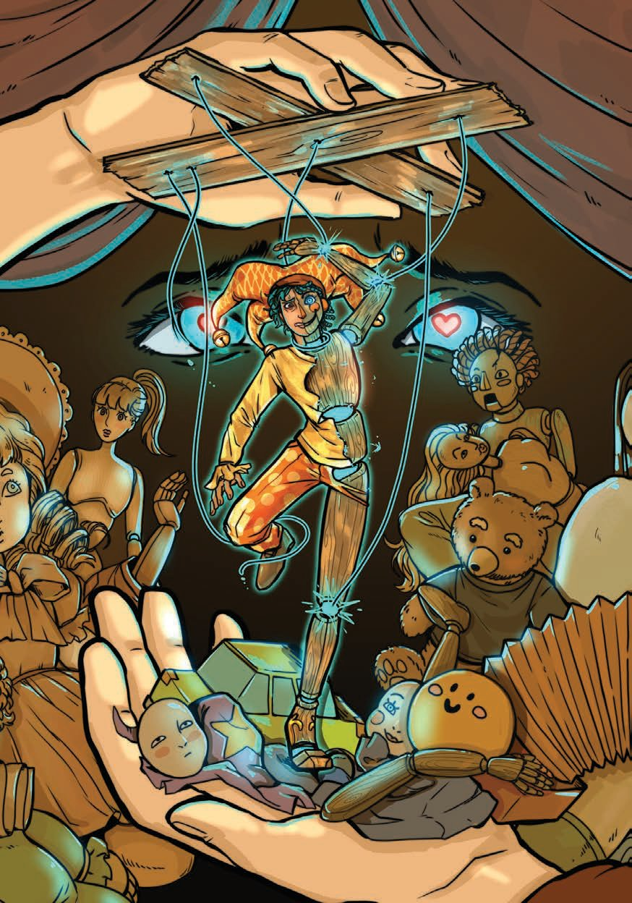

**面相**：你是「喜悅」——順著生命的水流一路歡笑前行。憑著幽默與興致，笑容跟在你身後。也許你不會在任何事上特別出色，但你能在任何事中找到快樂。**每當你抽牌失敗時，若愚者位於棄牌堆中，將他放回牌堆並重新洗牌。**

**昇位**：自由是你的核心；沒有任何一扇門對你關上。多到不可勝數的機會就在你指尖，沒有什麼能阻止你把它們全收下。

**墜位**：羞恥將是你的崩落；難堪如影隨形。若你讓嘲諷牽動你的每一條線，你會被纏進苦惱的網中。

</section>

<section class="char-card">

### I — 魔術師 The Magician

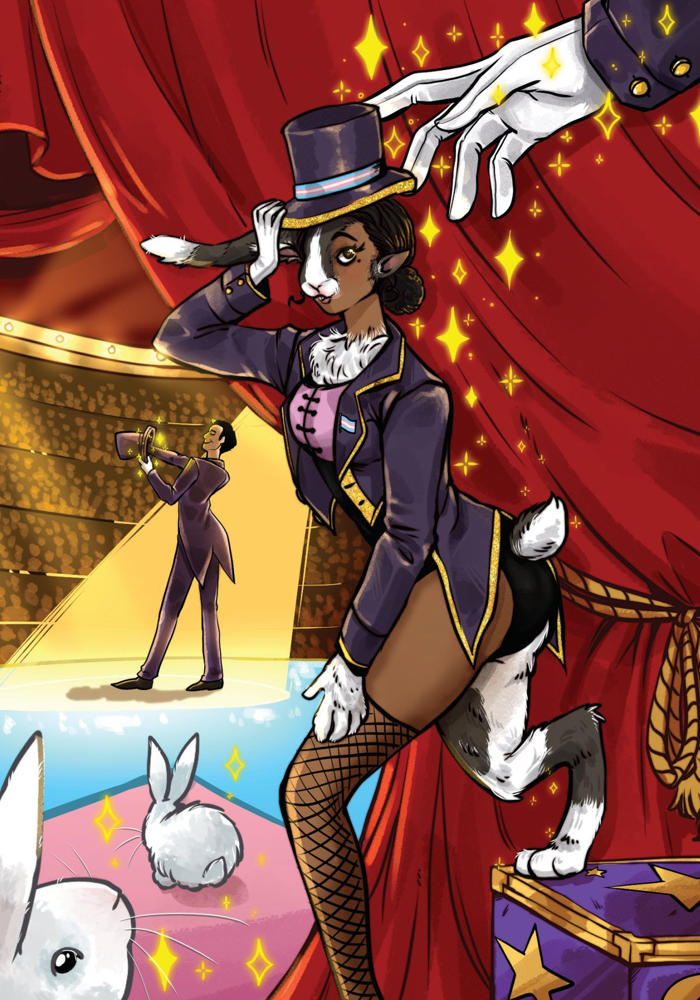

**面相**：你是「創造」——擁有滿溢的可能與潛能。有時你會覺得沒有什麼是你做不到的，沒有任何任務是不可能。無論是虛張聲勢還是膽識，你擁有「絕無動搖的自信」這份天賦。**每當你抽出魔術師時，你在所有屬性上取得成功，且你的成功充滿奇幻色彩，在外行人眼中宛如奇蹟。**

**昇位**：靈感是你的核心；創作的衝動如雷電擊中你。當人們看見你眼中的火花，他們看見的是希望。

**墜位**：猶豫將是你的崩落；對失敗的恐懼在每個轉角拉住你。要成功，你必須接受「並非所有戰役都能贏」。

</section>

<section class="char-card">

### II — 女祭司 The High Priestess

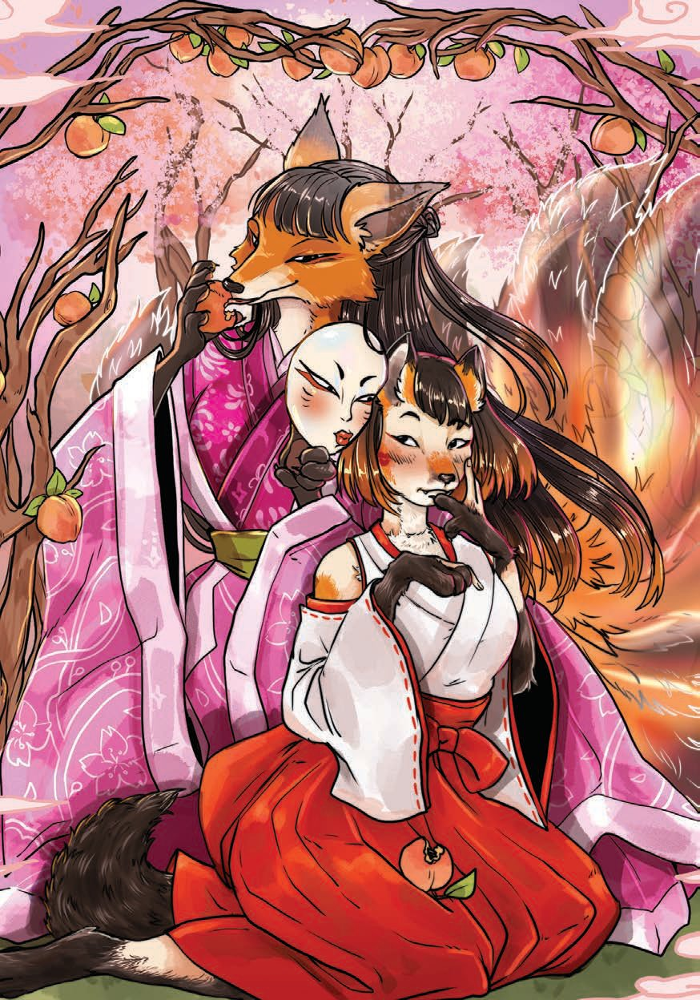

**面相**：你是「映照」——洞察與沉思的鏡面。認識你自己，你便擁有所有答案——儘管總是還有更多的內在尋索可以做。你尋找心中真理的耐心，會帶你穿越所有逆境。**每當你抽出女祭司時，你在所有屬性上取得成功，且你的成功源自你的過去，會喚起一段失落的記憶。**

**昇位**：直覺是你的核心；你信任自己一路所學。在經驗與練習的支撐下，沒有失敗的可能。

**墜位**：懷疑將是你的崩落；質疑自己，一切便失控。要成功，你必須緊握住自己所信的事物。

</section>

<section class="char-card">

### III — 皇后 The Empress

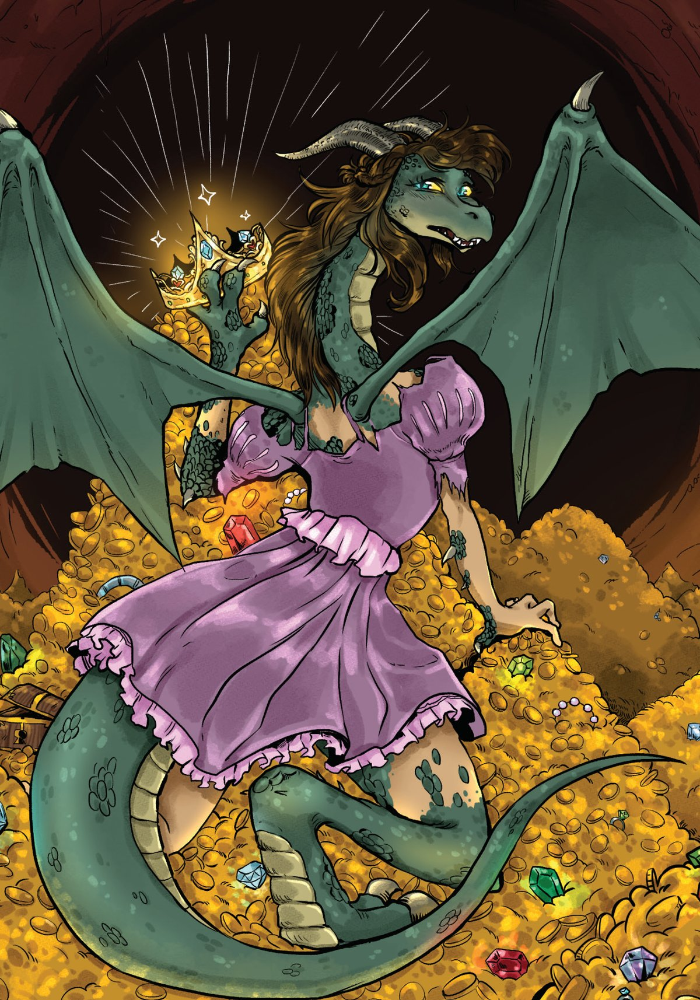

**面相**：你是「關懷」——慈悲與善意的笑顏。家人圍繞著你，無關血緣。你不止息的同理心能擊穿岩石，溫暖任何一顆心。**每當你抽出皇后時，你在所有屬性上取得成功，且你的成功是為了他人之利，與身邊每個人共享。**

**昇位**：陪伴是你的核心；那些你親近的朋友是你力量的來源。彼此扶持，共度所有艱難。

**墜位**：孤獨將是你的崩落；你總緊緊倚賴他人的協助。若你學不會自我支撐，當你獨處時便會崩塌。

</section>

<section class="char-card">

### IV — 皇帝 The Emperor

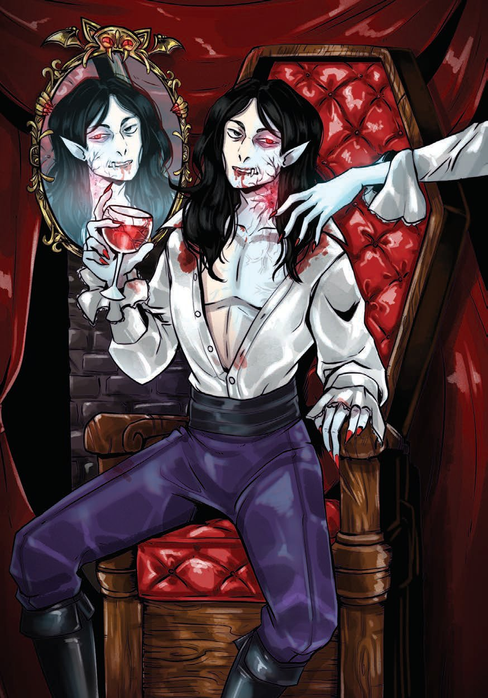

**面相**：你是「指揮」——召喚效忠與服從的驕傲嗓音。在危機之時，人們自然會仰望你；你的命令安撫他們的恐懼。以一雙穩定的手，你能將任何船舶駛過驚濤駭浪。**每當你抽出皇帝時，你在所有屬性上取得成功，且你的成功將你的意志加諸於他人之上，標誌你為一名領導者。**

**昇位**：信任是你的核心；可以倚靠的同袍是最大的寶藏。在盟友手中，你給出的信任能被鍛成牢不可破的劍。

**墜位**：背叛將是你的崩落；連最親近的朋友都顯得可疑。若不信任蒙蔽你的判斷，你的誓言將碎如脆玻璃。

</section>

<section class="char-card">

### V — 教皇 The Hierophant

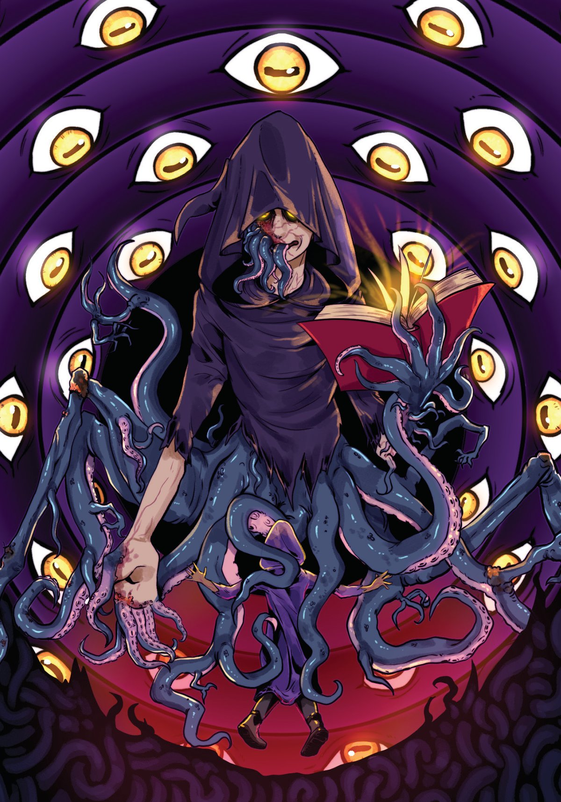

**面相**：你是「博學」——書卷與研究讓你睿智。雖然你百科全書般的知識浩瀚，你並不吝於分享。將不智之人化為學者，是你身為教師的天賦。**每當你抽出教皇時，你在所有屬性上取得成功，且你的成功具有教育意義，留給對方一道難忘的教訓。**

**昇位**：紀律是你的核心；對每個問題你都有一套系統。若你遵循自己的原則與架構，成功應當是「數學上保證」的。

**墜位**：失序將是你的崩落；干擾總在最糟的時刻擊中你。若你不為整理思緒留出空間，混亂會把你拆散。

</section>

<section class="char-card">

### VI — 戀人 The Lovers

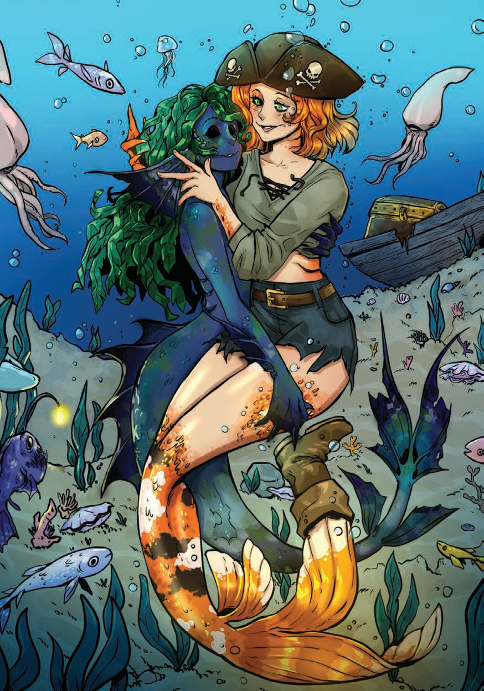

**面相**：你是「愛慕」——對魅力與美毫無設防。溫暖與生命力是你充沛的天賦，自然而然以光餵養其他靈魂。雖然你有時行事有些不顧一切，但你愛你的伴侶勝過這個世界。**每當你抽出戀人時，你在所有屬性上取得成功，且你的成功會把迷戀引向你，餵養著愛之火。**

**昇位**：熱情是你的核心；愛的火柴將你點成熊熊烈焰。當你與你所愛同在，沒有任何箭能穿透你那身由熱忱鑄成的甲冑。

**墜位**：渴慕將是你的崩落；你憎惡自己無法擁有的事物。馴服你對愛的胃口，否則你會吞噬掉所有你珍視的東西。

</section>

<section class="char-card">

### VII — 戰車 The Chariot

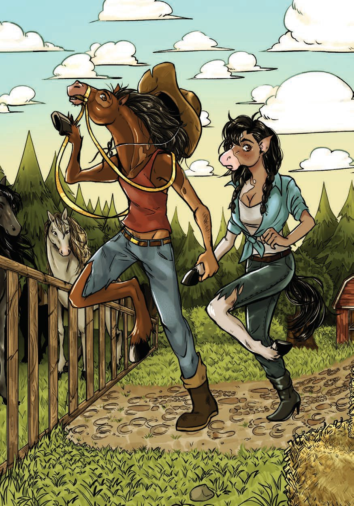

**面相**：你是「驅力」——被掙扎與艱辛逼向前。對逆境並不陌生的你，面對挑戰不會退縮。在你帶傷的指節中混合的那份苦澀，提醒你這條路不饒人——但這正是「你的路」。**每當你抽出戰車時，你在所有屬性上取得成功，且你的成功無可否認，沒有人能質疑。**

**昇位**：競爭是你的核心；沒有競賽就沒有勝利。你會擊倒任何擋路的對手——只為證明你才是最強的。

**墜位**：倦怠將是你的崩落；要鼓起動力總是不易。把你的精力推到極限，否則你永遠會被甩在後頭。

</section>

<section class="char-card">

### VIII — 力量 Strength

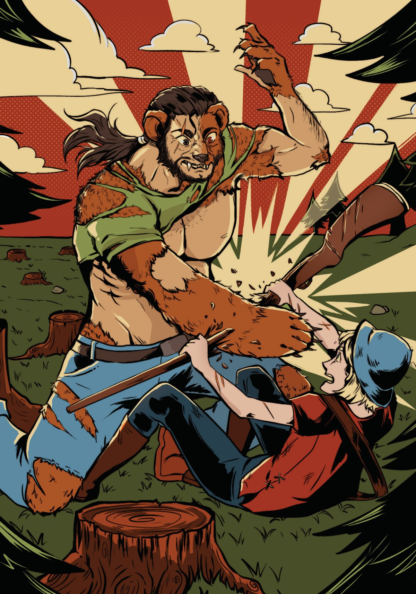

**面相**：你是「力」——穩如一棵古老橡樹。當你紮下腳跟，沒有什麼能扯倒你信念的旗幟。「頑固」是別人對你的污名——拒絕後退並無可羞愧之處。**每當你抽出力量時，你在所有屬性上取得成功，且你的成功宛如超人，搏動著能量與原始的力。**

**昇位**：意志是你的核心；不可摧的意念裹覆你的骨頭。試探你決心的人，將學到「不可屈服」是什麼意思。

**墜位**：怯懦將是你的崩落；恐慌讓你的雙腿背叛你。在火焰前挺立，否則你會在熔爐中被熔解。

</section>

<section class="char-card">

### IX — 隱者 The Hermit

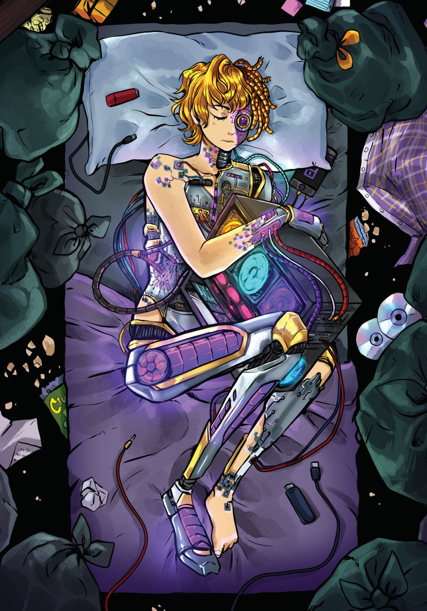

**面相**：你是「好奇」——在每一場巧合中找到線索與象徵。搜尋本身的興奮讓你愉悅，永遠準備好接下一道好謎題與挑戰。即使一輩子不夠把所有答案找齊，你仍會享受這趟旅程。**每當你抽出隱者時，你在所有屬性上取得成功，且你的成功只屬於你自己——沒有人能搶走你行動的功勞。**

**昇位**：指引是你的核心；身為老師，便是帶著目的地學習。當你向他人分享智慧，你的努力會獲得雙倍回報。

**墜位**：歸咎將是你的崩落；指責縈繞於你的惡夢之中。若你無法為自己的行動負責，你的良心便永得不到平靜。

</section>

<section class="char-card">

### X — 命運之輪 Wheel of Fortune

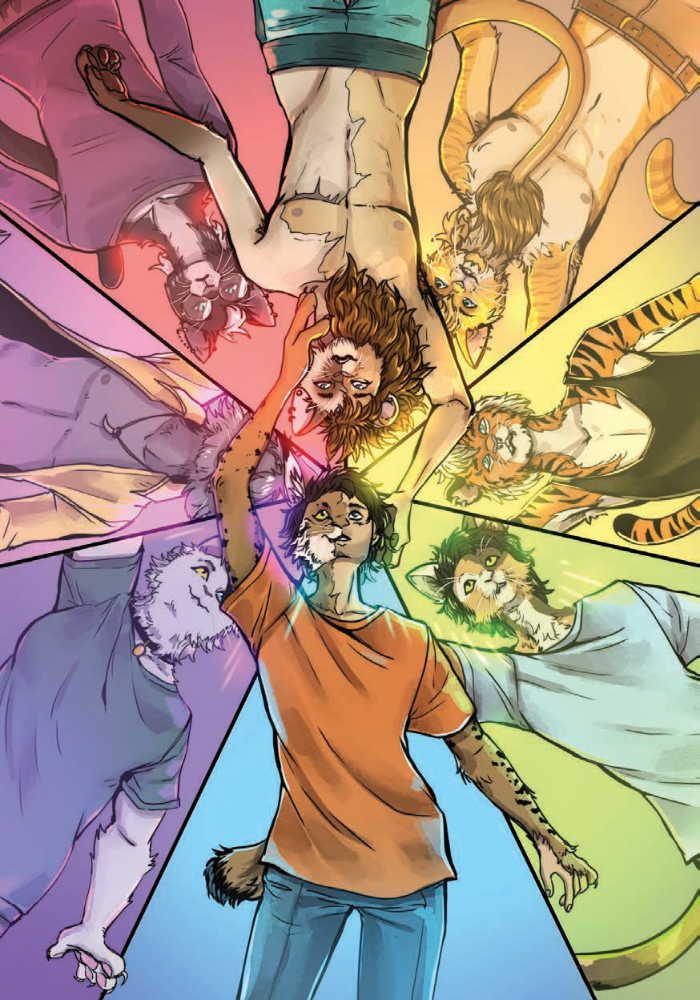

**面相**：你是「幸運」——被勝者的運氣所眷顧。是命運給了你一手好牌，還是你對「繁榮」有銳利的眼光？大概別人口中的「作弊」，其實只是你對「賭注是什麼」的天賦罷了。**每當你抽出命運之輪時，你在所有屬性上取得成功，且你的成功預示著「運勢之潮即將翻轉」。**

**昇位**：流動是你的核心；你能掌握那些看不見的機運之線。行動的時機只持續一個金色的音符——而你早已熟記那聲音。

**墜位**：兇兆將是你的崩落；厄運潛伏在每一道陰影中。若屈從於迷信，便是讓恐懼支配自己的人生。

</section>

<section class="char-card">

### XI — 正義 Justice

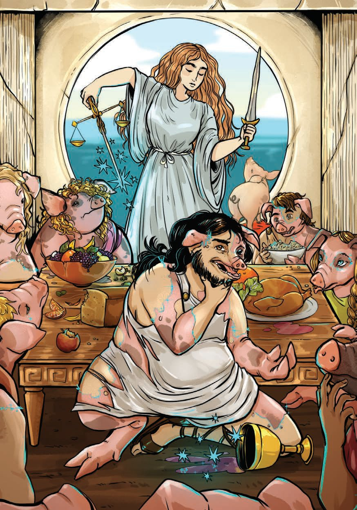

**面相**：你是「責任」——能背起任何重量。你逐字遵守律法，從不背棄諾言、從不撤回契約。履行責任賦予你目的，這也是唯一光榮的活法。**每當你的「蛻化交叉」上水平或垂直對稱地分布著已蛻化的屬性點時，你的每次抽牌都多翻開一張牌。**

**昇位**：自制是你的核心；情緒在你血管中冷靜流動。你絕對的克制能引你穿越熾烈的怒火與凝固的恐懼。

**墜位**：敵意將是你的崩落；憤怒與盛怒攫住你的手。壓住你的怒火，否則仇恨將把你燒成灰燼。

</section>

<section class="char-card">

### XII — 倒吊人 The Hanged Man

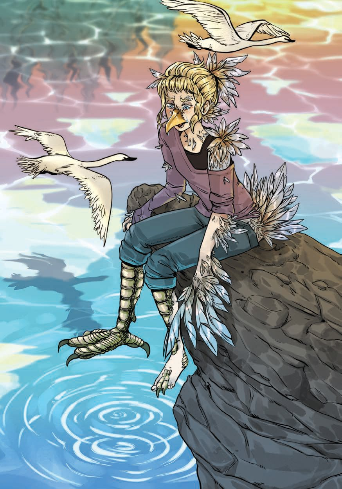

**面相**：你是「自由」——不被諾言或義務綑綁。讓自己被綁住只是一種選擇，而你絕不交出你的飛行。沒有家、沒有避風港，看來活得不容易——但那只是別人從下方仰望你時看到的景象。**每當你抽出倒吊人時，你在所有屬性上取得成功，且你的成功是以「只有你才能理解的方式」運作。**

**昇位**：視野是你的核心；正確的角度能看穿任何困境。你違抗常識的能力，給了你一座觸碰「不可能」的橋。

**墜位**：束縛將是你的崩落；自由表達是你的氧氣。若你無法與秩序與規則共存，你所有的潛能都會在鋼鐵牢籠中腐爛。

</section>

<section class="char-card">

### XIII — 死神 Death

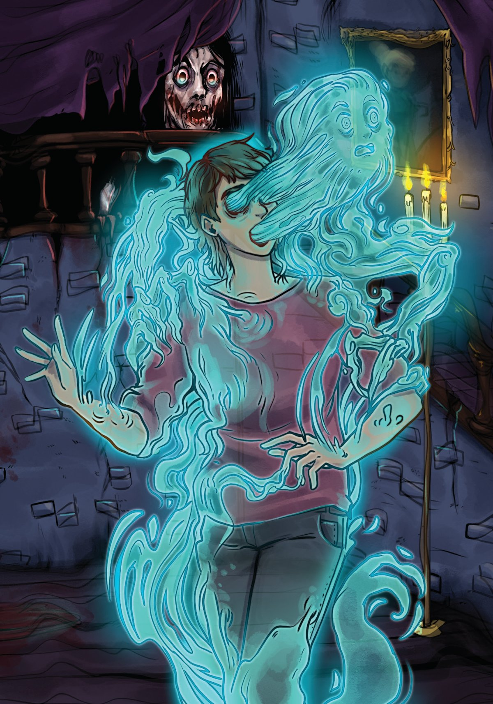

**面相**：你是什麼？因為失憶或不確定，主導你人生的不是答案，而是問題。蛻化早已擁抱你，且差點讓你跪倒。當你再度起身時，你會戴上什麼樣的臉？**每當任何一張牌被使用並棄掉時，你都可以讓那張牌成為你的面相牌——獲得它的能力、並取代你目前的面相牌。**

> 死神**不能**作為昇位牌或墜位牌。

</section>

<section class="char-card">

### XIV — 節制 Temperance

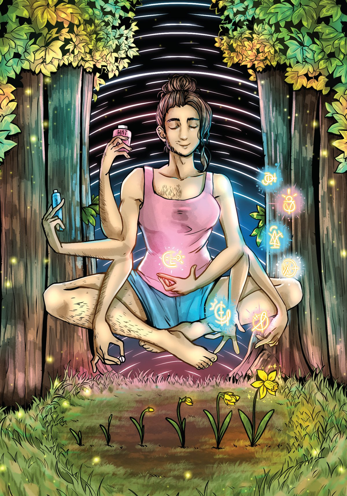

**面相**：你是「靜定」——在任何容器中都能保持靜止的水。無論生命的湍流帶你去哪裡，你都安然接受——因為那是你命運的一部分。不離未來與過去的視野，你也心滿意足地能在當下找到滿足。**每當你承受一次蛻化時，你都可以選擇將它變為「永久」。**

**昇位**：接受是你的核心；自身的任何一部分對你而言都不陌生。即使沒有希望、沒有歸宿，你也拒絕失去你內裡深處的自己。

**墜位**：悔恨將是你的崩落；過去的爪子陷在你的皮膚裡。與你的錯誤達成和解，否則它們會把你撕到見骨。

</section>

<section class="char-card">

### XV — 惡魔 The Devil

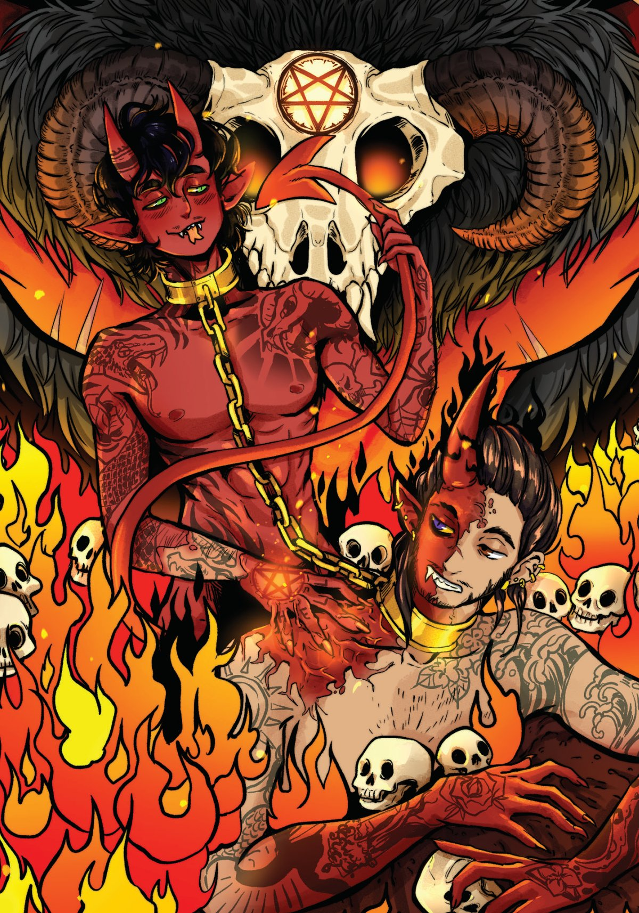

**面相**：你是「狂野」——指甲底下藏著未馴的獸性。衣服與名字，是別人為了藏起利齒而披上的另一層皮。要你毫不留戀地把它們全甩掉、追隨叢林的法則、讓自己理所當然地成為野獸之王，再容易不過。**當你使用惡魔時，由你決定「有多少屬性點被蛻化」與「具體是哪幾點」，即使順序不依規則也行。**

**昇位**：本能是你的核心；感官從不引你走錯路。「戰或逃」是你早已熟悉、信賴到能用命託付的訊號。

**墜位**：衝動將是你的崩落；慾望輕易便能掀翻你的意志。約束你那些原始的需求，否則你將被血液所統治。

</section>

<section class="char-card">

### XVI — 高塔 The Tower

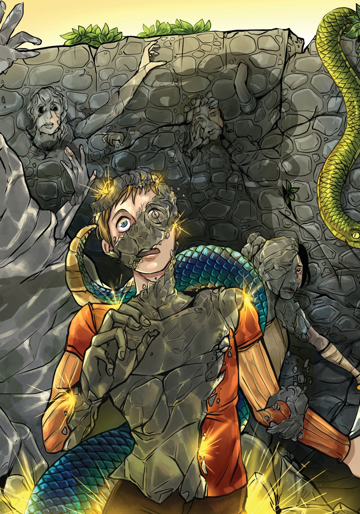

**面相**：你是「災難」——一陣留下不熟悉軌跡的反覆無常之風。危機跟著你走——既然如此，你便讓它在混亂中成為你的盟友。這份動盪總會召喚改變，迫使人們直面那些被自己藏起來的殘酷真相。**當你使用一張牌之後，所有翻開的牌（除了死神與節制）都會被棄掉，而非僅棄掉你使用的那張。**

**昇位**：莽撞是你的核心；後果只會拖慢你的腳步。無視擋路的荊棘，是抵達目標最短的路徑。

**墜位**：必朽將是你的崩落；對死亡的念頭讓你癱瘓。讓自己在生命短暫的禮物面前學會謙卑，否則終點會愈爬愈近。

</section>

<section class="char-card">

### XVII — 星星 The Star

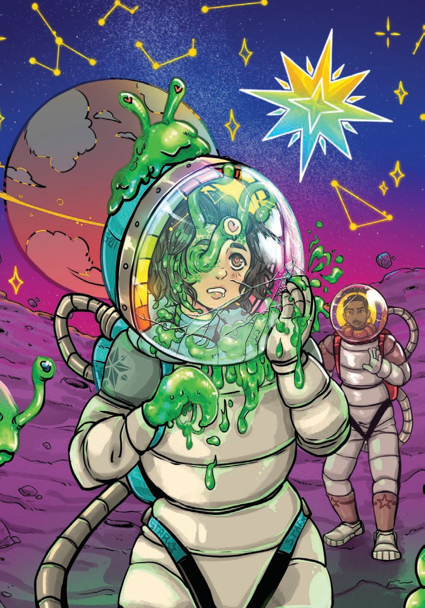

**面相**：你是「天賦」——在你選定的領域中是天生的鬼才。你樣樣通幾門、精通其中少數——但你精通的那少數，已被你打磨到完美。你願意忽略許多其他可能性，只為了讓你的專注閃耀出它應有的光芒。**每當你抽出星星時，你在所有屬性上取得成功，且你的成功是「純粹的天才之筆」。**

**昇位**：表演是你的核心；取悅群眾是你的專長。壓力是你的火種，每一位觀眾都即將見證一場非凡演出。

**墜位**：脆弱將是你的崩落；無助是你的自我實現預言。承認你的弱點，否則你會被銬在每一處不足之上。

</section>

<section class="char-card">

### XVIII — 月亮 The Moon

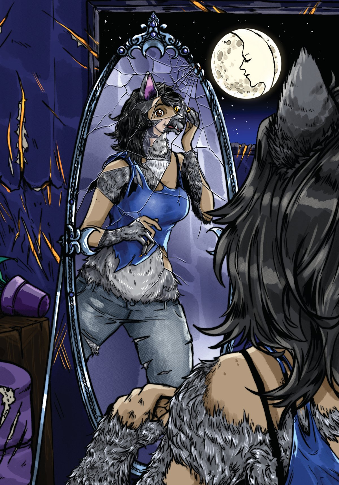

**面相**：你是「神祕」——困住夜晚的迷濃霧。神祕學與靈體現象是你從黑暗中占卜知識的工具。未知的微光，是你的燭火、你的午夜慰藉。**每次抽牌中你可一次將任何一張牌（除了死神或節制）視為「月亮」對待。**

**昇位**：隱密是你的核心；嫻熟於行走那些被遺忘的路徑。一切你的對手所不知道的事，都是你架在他背後的刀。

**墜位**：審視將是你的崩落；你心上的傷疤渴望被藏起。若你始終害怕展現真實的臉，你將如幽靈般遊蕩於世。

</section>

<section class="char-card">

### XIX — 太陽 The Sun

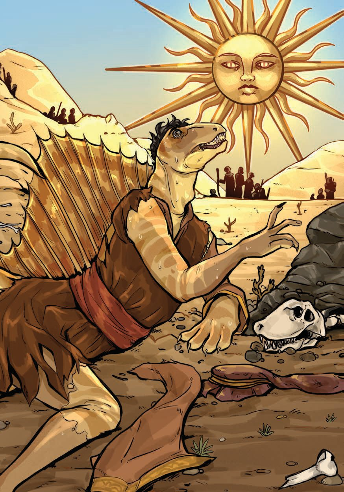

**面相**：你是「希望」——樂觀與生命力的永恆之光。一切挫折都是暫時的，你知道一個更好的世界仍是可能。信念不只是給自己的承諾，它是「尚未誕生的真實」。**每當任何玩家在抽牌中成功、且牌堆被洗牌之後，你可以請敘事者讓你看牌堆最上方那一張。**

**昇位**：夢想是你的核心；拒絕對未來棄手。你高舉的那幅圖像，從來不是要與你一同死去——它必須被實現。

**墜位**：妄念將是你的崩落；你看不清事物本來的樣子。若你不從幻想中解放自己，你的願景便只會是瘋癲。

</section>

<section class="char-card">

### XX — 審判 Judgement

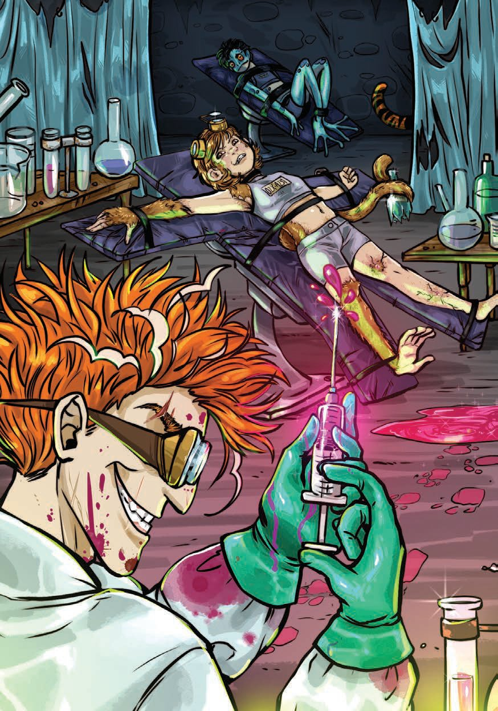

**面相**：你是「真誠」——把靈魂掛在袖口讓所有人看見。你以堅毅而嚴肅的態度，敢於說出心中所想，並反駁任何批評。從不動搖，從不為「身為自己」而道歉。**每當審判被使用時，由你而非敘事者來決定成敗。**

**昇位**：誠實是你的核心；謊言對你而言不自然。從你口中說出的真相，足以鋒利到劈倒任何屏障。

**墜位**：欺騙將是你的崩落；謊言總在你不備之時擊中你。藏起你那容易輕信他人的傾向，否則你會輕易陷入欺瞞的迷宮。

</section>

<section class="char-card">

### XXI — 世界 The World

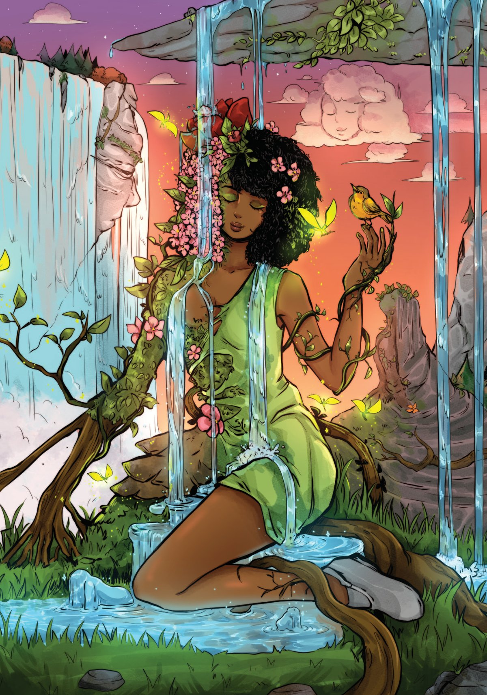

**面相**：你是「連結」——與一切生命交織。在所有的木與石中，自然回應著你，將它們的名字託付給你。有時這份連結令人難以承受，但你在宇宙中的位置就如它本身般沉靜而清明。**當你使用世界時，從棄牌堆中取出任意數量的牌（世界本身除外），把它們放回牌堆——而不是只取一張。**

**昇位**：互助是你的核心；支持不是一條街，而是一張網。在恰當的時機，每一個靈魂都會將你抬起，而你也不會把他們留下。

**墜位**：流亡將是你的崩落；沒有接納，你便活不下去。理解你的獨立，否則你會渴求他人的氣息才能存活。

</section>

---

## 規則替代與選項

### 延伸遊戲與戰役（EXTENDED GAMES AND CAMPAIGNS）

要把《To Change》調整為更長的戰役，你可以：

- **擴展「蛻化交叉」每一項屬性的點數，超過 3 點**——適用於蛻化細節更繁複、進程更綿長的故事。
- **疊加多重「蛻化交叉」**——當玩家在第一個十字上抵達永恆後，他會開始在**第二個**十字上累積點數。
- 使用一個「**蛻化故事動作**」，讓玩家可以透過休息、放棄某次成功、或其他條件**逆轉蛻化**。

### 跨性別蛻化

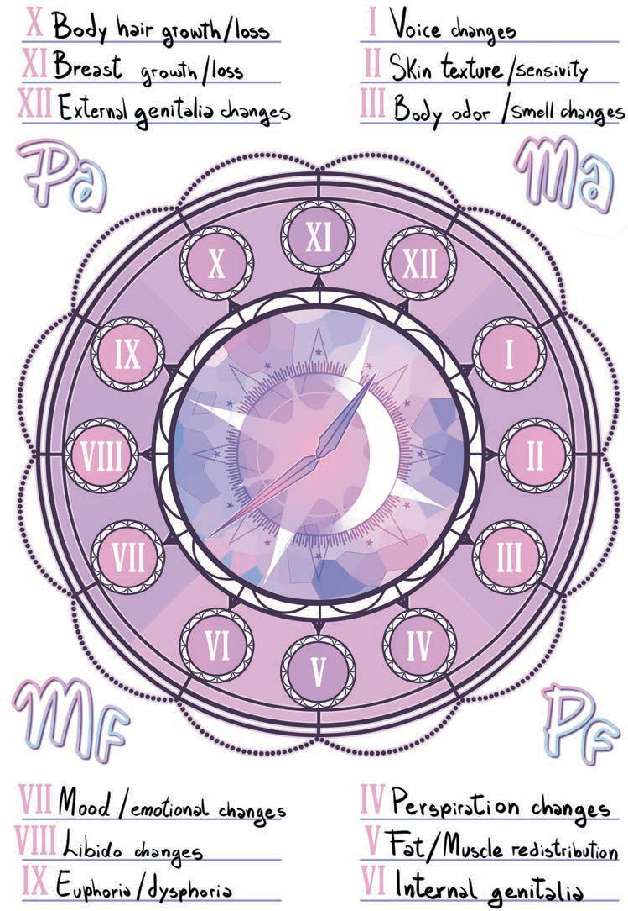
跨性別蛻化在《To Change》裡是特別的存在。

「性別過渡（transitioning）」是現實中的真實歷程，而每位跨性別者所經驗到的都不一樣；若把它窄化成一條線性的路徑，會是一種對這份經驗的失敬。為了表現這種動態，跨性別蛻化改以一面**輪盤**來呈現，而非一般的「蛻化交叉」。

跨性別蛻化仍粗略地依屬性分類，但不像「蛻化交叉」那樣**有先後順序**。當玩家在某項屬性上承受一點蛻化時，鼓勵敘事者讓**玩家自行挑選**該次屬性下要填入的跨性別蛻化項目。玩家會在自己**準備好的時候**抵達永恆，無論他們在輪盤上累積了多少蛻化。

跨性別蛻化輪盤可以**單獨使用**——用於純粹處理性別變動主題的故事；也可以作為**補充／替代蛻化**，融入任何既有故事。希望在冒險中加入跨性別蛻化的玩家，應在開局前與敘事者討論。敘事者也應該抱持接納的態度，讓玩家能藉這個機會、不帶評斷地探索自己的性別認同。

### 無敘事者遊戲（PLAYING WITHOUT A STORYTELLER, GM-LESS）

採取協作式遊玩時，所有玩家從**預兆牌**抽牌，以判定特定角色的成敗。當需要做出影響整體敘事的決定時，**所有玩家各抽 1 張牌**——**牌號最大**的玩家**主導**該決定，**牌號最小**的玩家可以在**最後**為該決定加上**最後一個細節**。

**表格**：本書中各表的數值範圍為 **0–21**。要使用這些表，請洗一次預兆牌，並查看**牌堆底部**那張牌的塔羅編號作為結果。

---

## 表格

### 表格 1：隨機角色（RANDOM CHARACTER TABLE 1）

> **主角型（SUBJECT）：我是誰？我怎麼認識你的？**

| 編號 | 身分 | 與你的關係 |
|---|---|---|
| 0 | 一名陌生人 | 我們是在十字路口偶遇 |
| 1 | 一名學徒 | 我感應到你身上的魔力，主動找上你 |
| 2 | 一名追隨者 | 我尋找答案的路把我帶到你面前 |
| 3 | 一名父母 | 你一直都是家中的世交 |
| 4 | 一名員工 | 我們因工作而相識 |
| 5 | 一名學生 | 你教給我最重要的那一課 |
| 6 | 一名愛慕者 | 我與你有過情感、可能還很親密 |
| 7 | 一名運動員 | 我們的路一次又一次交會 |
| 8 | 一名鬥士 | 我們是某場衝突中對立的雙方 |
| 9 | 一名追尋者 | 你是我親近的朋友與心腹 |
| 10 | 一名賭徒 | 你是我的幸運符 |
| 11 | 一名罪犯 | 我有些祕密只有你知道 |
| 12 | 一名俘虜 | 你曾在我最需要的時候伸手接住我 |
| 13 | 一名自由靈魂 | 我認識你不只一個名字 |
| 14 | 一個迷失的靈魂 | 你曾在一個重要選擇上給我建議 |
| 15 | 一名享樂者 | 我在你身上看到自己，無法移開視線 |
| 16 | 一個破碎的人 | 我曾對你造成嚴重傷害 |
| 17 | 一名探險者 | 你是我的繆思，是我靈感的來源 |
| 18 | 一名演員 | 我夢中總是出現你 |
| 19 | 一名英雄 | 我景仰你，景仰你的成就 |
| 20 | 一個榜樣 | 你成就了今天的我 |
| 21 | 安然者 | 認識你？感覺你**包圍**著我 |

---

### 表格 2：隨機角色（RANDOM CHARACTER TABLE 2）

> **嚮導型（GUIDE）：我是誰？我想要什麼？**

| 編號 | 身分 | 我的目的 |
|---|---|---|
| 0 | 一名商人 | 找出真正的你是誰 |
| 1 | 一名魔術師 | 讓你看見魔法是真的 |
| 2 | 一名願望實現者 | 實現你最深的願望 |
| 3 | 一位長者 | 確保你不負你的傳承 |
| 4 | 一名上司 | 把你塞進一個角色裡 |
| 5 | 一名教師 | 讓你看見更廣闊的世界 |
| 6 | 一名前任 | 以愛俘虜你 |
| 7 | 一名對手 | 把你的極限往外推 |
| 8 | 一隻野生生物 | 助你越過逆境 |
| 9 | 一名先知 | 引你抵達你該去的地方 |
| 10 | 一名遊戲主持者 | 把你想要的東西騙走 |
| 11 | 一名審判者 | 秤量你的靈魂並做出判決 |
| 12 | 一名治癒者 | 卸下你的重擔 |
| 13 | 一名變形者 | 把你扭曲到無人認得 |
| 14 | 一名諮商者 | 把你領上正確的路 |
| 15 | 一份誘惑 | 餵養你的慾望直到把你燒乾 |
| 16 | 一隻怪物 | 把你吞掉，讓你成為我的 |
| 17 | 一名科學家 | 改善並開發你 |
| 18 | 一名巫者 | 把你引入黑暗 |
| 19 | 一位神性 | 試煉你的決心 |
| 20 | 一名藝術家 | 從改變你之中學習 |
| 21 | 自然 | 把你的人生推向下一個循環 |

---

### 表格 3：隨機蛻化（RANDOM CHANGE TABLE 3）

> **任選兩項心靈蛻化面向（MENTAL CHANGE ASPECTS）組合。**

| 編號 | 面向 A | 面向 B |
|---|---|---|
| 0 | 小丑化 | 失去辨識特徵 |
| 1 | 催眠／恍惚 | 風格／時尚品味 |
| 2 | 失憶／記憶更動 | 潛意識 |
| 3 | 受到的性別認知 | 角色翻轉 |
| 4 | 攻擊性／祥和 | 支配／服從 |
| 5 | 洗腦 | 腐化／淨化 |
| 6 | 性吸引力轉向 | 痴迷／依附 |
| 7 | 自願／非自願 | 易受影響 |
| 8 | 視角轉換 | 荷爾蒙 |
| 9 | 獲得知識 | 人格複製 |
| 10 | 蜂巢心智／集體意識 | 多重／共享身體 |
| 11 | 馴化 | 崇拜／虔信 |
| 12 | 心智空白／腦霧 | 出竅 |
| 13 | 成癮 | 發燒／中毒化 |
| 14 | 性別焦慮／性別欣快（dysphoria／euphoria） | 開悟／覺醒 |
| 15 | 野生／野化 | 本能 |
| 16 | 恐懼 | 認同之死 |
| 17 | 異質思緒 | 語言更動 |
| 18 | 聯覺 | 夢境／超現實 |
| 19 | 社會接納 | 譫妄／幻覺 |
| 20 | 漫畫化／誇張化 | 附身 |
| 21 | 自我實現 | 想像／妄想 |

---

### 表格 4：隨機蛻化（RANDOM CHANGES TABLE 4）

> **任選兩項肉體蛻化面向（PHYSICAL CHANGE ASPECTS）組合。**

| 編號 | 面向 A | 面向 B |
|---|---|---|
| 0 | 工具／器械 | 玩具 |
| 1 | 材質／質感 | 虛構 |
| 2 | 擬人化 | 變成另一個人 |
| 3 | 爬蟲類 | 體型／成長 |
| 4 | 不死 | 食物 |
| 5 | 古神／可憎之物（Eldritch／Abomination） | 身體扭曲 |
| 6 | 水生 | 懷孕 |
| 7 | 建築結構／載具 | 突變者 |
| 8 | 哺乳類 | 超能力 |
| 9 | 數位化 | 科技／機械 |
| 10 | 多維 | 結合／融合 |
| 11 | 非擬人化 | 神話 |
| 12 | 服飾／戲服 | 鳥類 |
| 13 | 超自然 | 元素／靈體 |
| 14 | 抽象／風格化 | 跨性別 |
| 15 | 天使／惡魔 | 怪物 |
| 16 | 靜止不動之物 | 半無生命物 |
| 17 | 共生／寄生 | 異星 |
| 18 | 獸化／狼人類（Therianthropy／Were-Creature） | 無脊椎動物 |
| 19 | 混血／奇美拉 | 已絕種動物 |
| 20 | 節肢動物 | 兩棲動物 |
| 21 | 植物／真菌 | 地景／場所 |

---

### 表格 5：小事件（MINOR EVENTS TABLE 5）

| 編號 | 正位小事件 | 逆位小事件 |
|---|---|---|
| 0 | 想到一個機智的笑話 | 弄出大型混亂 |
| 1 | 想起一個有趣的夢 | 一夜難眠 |
| 2 | 反思自己的行動 | 忘記某個關鍵日子 |
| 3 | 與朋友見面 | 與家人見面 |
| 4 | 加入一場社交聚會 | 過勞 |
| 5 | 鑽研某個主題 | 出席一場表演 |
| 6 | 被邀請出去約會 | 計畫被取消 |
| 7 | 結束一場辯論 | 捲入一場爭執 |
| 8 | 看見一隻動物／生物 | 意外受了輕傷 |
| 9 | 接待一名訪客 | 樹立一名敵人 |
| 10 | 找到一件值錢的物品 | 弄丟一件重要物品 |
| 11 | 玩一場技術型遊戲 | 玩一場機運型遊戲 |
| 12 | 出發旅行 | 欣賞風景 |
| 13 | 注意到一個異常 | 被突如其來的變動嚇到 |
| 14 | 創作一件藝術作品 | 批評別人 |
| 15 | 自我愉悅的活動 | 突然渴想某項特定事物 |
| 16 | 換一身穿著 | 被天氣耽擱 |
| 17 | 得知一則突發新聞 | 聽到一則隨口流言 |
| 18 | 聽到一個古怪的故事 | 似曾相識感（déjà vu） |
| 19 | 修好一件物品 | 把某物弄壞 |
| 20 | 整理周遭環境 | 把空閒時間都拿去拖延 |
| 21 | 花時間休息 | 染上小病 |

---

## 故事動作

依據故事中央那場「蛻化」的本質，敘事者可以加入<strong>動作（Move）</strong>來改寫系統規則，使其更貼合該局遊戲。動作完全是**選用的**——有些故事根本不需要任何動作。下列是一份適用於多種蛻化類型的通用動作清單。

### 弱化（WEAKENING）
每當一點屬性點被蛻化時，該屬性點同時受損。

### 強化（STRENGTHENING）
玩家依其已蛻化的屬性點數，**多抽**牌張。

### 條件（CONDITIONAL）
某點屬性可以被蛻化，但其改變只會在**特定情境下**顯現／浮出（例如夜晚、碰水、發怒之時）。

### 傳染（INFECTIOUS）
已蛻化的屬性點，可在某些條件下從一名玩家**傳染**給另一名玩家。

### 共享（SHARED）
若有任何一名玩家以「蛻變」承受蛻化，**全體玩家**都在該屬性上承受一點蛻化。

### 可逆（REVERSIBLE）
當玩家翻出一張本可讓他成功的牌時，他可以**選擇失敗**，以此移除一點蛻化。

### 起始（INITIAL）
玩家在故事一開始便帶著一定數量的「已蛻化」或「已受損」屬性。

### 環境（ENVIRONMENTAL）
依玩家所處的環境，他在特定屬性上抽**較少或較多**的牌（例如：在一個視聽都受阻的場域，心靈天賦檢定要扣牌）。

### 漸進（PROGRESSIVE）
每場主要場景結束時，玩家承受一點蛻化。

### 活力（LIVING）
一個蛻化主動向玩家「自薦」——當玩家蛻變或與之合作時，會給予額外的獎勵。

### 規則（RULES）
當玩家做出某些特定行動時，會以蛻化作為後果。

### 等級（LEVELS）
當玩家累積一定數量的蛻化、或完成一定次數的蛻變時，故事會揭曉新的面向。

### 治療（HEALING）
當玩家恢復某項屬性的傷害時，他同時在該屬性承受一點蛻化。

### 鏡映（MIRRORED）
當玩家在某項屬性上承受一點蛻化時，他在**對立屬性**上承受一點蛻化、或反向取消一點蛻化。

---

## 單人遊玩

《To Change》也可以作為**單人札記式遊戲**進行。你會在一段漫長的蛻化過程中，把自己的經驗寫成一份日誌——藉抽牌決定每一天的事件，以及你的蛻化。

首先，**決定你的這場蛻化**。你可以用**表格 3、4** 隨機產生一個蛻化概念、自行挑一個、或邊跑邊把細節敲出來。

挑一張作為你的**起始牌（Starting card）**——它決定你的蛻化如何開始，並賦予你一條獨有的規則。

遊戲分為**日**進行。每一天，你承受**一點蛻化**（任意屬性），並抽一張牌決定當天的**事件（Event）**。事件的內容會視你目前累積的蛻化總數而定。

你也可以使用**表格 5** 來生成日常瑣事，並用**表格 1、2** 來生成支援角色與他們的動機。

每當你承受一點屬性蛻化，請在「蛻化交叉」的對應分枝寫下發生在你身上的事；並在每天事件結束之後，寫下一篇日誌記錄餘波。

### 單人遊玩（續）（SOLO PLAY CONTINUED）

抽當天的事件牌時，牌可能是**正位**或**逆位**。**正位事件**偏向積極與快樂；**逆位事件**則可能負面而痛苦。如果某張事件牌不適合你的故事，隨時可以重抽。

就像多人遊戲一樣，當你想像出一個有失敗風險的情境時，從牌堆抽牌以決定成敗——或選擇**蛻變**承受一次蛻化。**牌堆會在每天結束時洗回完整的一副。**

你的蛻化終會抵達**永恆**——只是時機問題。標記永恆之後，你不必繼續寫每日日誌，但只要你還想繼續蛻化，遊戲可以一直進行下去。

某些蛻化可能會讓你無法書寫、或無法翻開你的日誌。請使用任何你能想到的工具來記錄你的蛻化。

> **你必須走完這趟旅程。看著鏡子。這將是「那個人」的最後一份紀錄。**
> **若你希望所有人都忘記你曾是誰——燒掉你的日誌，徹底殺死過去的自己。**

---

### 0 — 愚者 The Fool

**起始**：這只是一場巨大的失誤——一場根本不該發生的純粹意外。你不小心做了一個動作，它就要永遠改變你。「都是你自己的錯」這件事或許算個安慰、或許更讓你羞愧；但既然一切進展得這麼快，能不滅頂已是奇蹟。**起始時承受 1–2 點蛻化，分配方式由你決定。每當你承受蛻化時，洗牌並查看牌堆底部的牌——若那張為逆位，改為承受兩點蛻化。**

**若你有 3 點以下蛻化**

- 事件，正位：你對自己的蛻化渾然未覺。寫一篇日誌，因分心、健忘或無知而**忽略你最近的這次蛻化**。
- 事件，逆位：你滿腦子都是你的蛻化。寫一篇日誌，**完全只聚焦於你最近這次蛻化**，其餘一概不提。

**若你有超過 3 點蛻化**

- 事件，正位：你發現了一個笨拙的方式來適應這些蛻化。寫下你為了打理新生活，而養成的那些荒唐行徑。
- 事件，逆位：你的蛻化製造了一場令人羞愧的混亂——而它只會繼續發生。寫下你打算如何（試圖）保住自己的尊嚴。

---

### I — 魔術師 The Magician

**起始**：神祕能量在你體內湧動，秘術扭曲你存在的本質。一種不老的鍊金術，把人性的原料轉化為更易塑形的樣態。這是一股壓倒性的力量，但並非不可改易。導致你蛻化的法術，仍能被影響——即使只是一點點。**起始時承受 1–2 點蛻化，分配方式由你決定。每天若抽到正位事件，你都可以在任意屬性中移除一點或新增一點蛻化。**

**若你有 5 點以下蛻化**

- 事件，正位：你的蛻化慫恿你做出反常之舉。寫下你想沉浸於某些奇異念頭——那些通常並不像你會想的事——的渴望。
- 事件，逆位：你的蛻化要求你違背自己的天性。寫下你被迫以一種與平常自己嚴重相悖、令人不適的方式行事。

**若你有超過 5 點蛻化**

- 事件，正位：你的蛻化讓你抵達前所未有的高度。寫下一段刺激的經歷——那是因為你正在「成為的東西」才得以實現的。
- 事件，逆位：你的蛻化把你推進突如其來的絕望。寫下你願為了一小片過去的自己沉淪到多深，哪怕只有一瞬。

---

### II — 女祭司 The High Priestess

**起始**：蛻化內在於一切生命；你只是找到了重新塑造自己的一個獨特機會，並把它抓住了。無論你成為什麼，那都是一直在你體內的——一個無形的祈願在呼喚自己的名字。你真有可能否認那份潛能嗎？**起始時可承受任意點數的蛻化，分配方式由你決定。當你藉「蛻變」承受蛻化時，由你決定是哪一項屬性。**

**若你有 3 點以下蛻化**

- 事件，正位：你做了一個關於蛻化的夢。寫一篇日誌，記下那神祕的意象，並詮釋你的潛意識在告訴你什麼。
- 事件，逆位：你做了一個關於蛻化的惡夢。寫一篇日誌，記下那令人不安的視像，並詮釋它預示著你身上的何種陰影。

**若你有超過 3 點蛻化**

- 事件，正位：你看世界的方式（也許從字面上）變了。寫下你的蛻化如何讓你向新觀念與新體驗敞開。
- 事件，逆位：你發覺自己內裡永遠是同一個悲傷的人。寫下你的蛻化如何坐實了你對自己最深的恐懼。

---

### III — 皇后 The Empress

**起始**：這場蛻化裡有某種屬於你血脈的東西——它規劃著你脈搏的祖傳航線。這不是你出生時的身體，但其實這份印記從未顯露——直到今年、這個季節、就是今天。如今你的世系全然被揭示，是時候加入家族了。**起始時承受 0–1 點蛻化，分配方式由你決定。每當你蛻變時，當前的事件會與你過去的某個重要時刻產生連結。**

**若你有 3 點以下蛻化**

- 事件，正位：登場一張熟識的臉。寫下你遇見了一位舊友、家人或熟人，以及對方為何看似與你近期的蛻化有所關聯。
- 事件，逆位：登場一名古怪的陌生人。寫下你遇見了某個未知存在——他可能與你過去有牽連、或正是你近期蛻化背後的源頭。

**若你有超過 3 點蛻化**

- 事件，正位：你的羈絆比任何蛻化都堅韌。寫下某位親近的人如何接納你的蛻化、並給予你所需的肯定。
- 事件，逆位：你的蛻化對某些「親人」而言太多了。寫下某位親近的人如何因你的蛻化而厭惡你，並拒絕這個新的你。

---

### IV — 皇帝 The Emperor

**起始**：這場蛻化是被「給」你的——以「具傳染性的包袱」之姿被塞給你。它正在你的內裡探測，尋找一個能突破、進一步擴散的機會。如果你放任它，它能感染整個世界——若你不阻止它，亦然。你會盡你所能將蛻化鎖在自己身上，還是急切地把這份「禮物」散播出去？**起始時承受 0–1 點蛻化，分配方式由你決定。每當你蛻變時，與你最親近的角色開始蛻化。**

**若你有 3 點以下蛻化**

- 事件，正位：有人告訴你不要太擔心你的蛻化。寫下這個人如何把你的蛻化輕輕帶過，視為無關緊要的小事。
- 事件，逆位：有人看到你的蛻化後反應失常。寫下這個人如何不合常理地對你的蛻化恐慌、惶恐失措。

**若你有超過 3 點蛻化**

- 事件，正位：你最終讓某個渴望蛻化的人也跟著蛻化了。寫下你（有意或無意地）如何改變了這個人，以及為什麼他現在的狀態反而更好。
- 事件，逆位：你的蛻化感染了別人，並毀了他。寫下你如何在無意間讓另一個人也跟著轉化、徹底翻覆了他的人生。

---

### V — 教皇 The Hierophant

**起始**：你那一個個徹夜不倦、悉心籌劃的夜晚，全為了這一刻。為了揭開蛻化的祕密，已耗去多少個鑽研的小時？多到再也無法回頭。儀式即將舉行，你長久等待的圓滿就在眼前。祈禱沒出任何差錯——祈禱你已準備好被重塑。**起始時承受 0–1 點蛻化，分配方式由你決定。每當你不靠蛻變而成功時，你下一張事件牌以正位抽出。**

**若你有 4 點以下蛻化**

- 事件，正位：你找到了關於蛻化最終樣貌的一個線索。寫下你如何已經對「抵達永恆時你會變成什麼」有了相對明確的概念。
- 事件，逆位：你完全不知道自己正在變成什麼。寫下你對「抵達永恆時可能降臨在自己身上的事」最糟糕的猜測。

**若你有超過 4 點蛻化**

- 事件，正位：這場蛻化與你的人生方式契合得很好。寫下你的蛻化如何餵養著你對未來的目標。
- 事件，逆位：你的內在如此動盪，使你無法清晰思考。寫下你的蛻化如何把你所有的計畫攪成一團亂。

---

### VI — 戀人 The Lovers

**起始**：你的蛻化與另一個個體相連——可能來自繁星彼端，可能就在你身邊。如果你們彼此原本還沒有愛，那麼你們將在一起發現的那份愛會更壯闊。雙手交握直到終局——你不是一個人在蛻化。**起始時承受 0–1 點蛻化，分配方式由你決定。每天額外抽一張事件牌，並寫下它如何套用到另一個角色身上。**

**若你有 4 點以下蛻化**

- 事件，正位：蛻化讓你愉悅。寫下蛻化如何以一份令你呼吸沉醉的狂喜與溫暖填滿你。**恢復一項肉體屬性的一點傷害。**
- 事件，逆位：蛻化令你痛苦。寫下蛻化如何以一份撕裂你內臟的苦楚與痛感填滿你。**承受一項肉體屬性的一點傷害。**

**若你有超過 4 點蛻化**

- 事件，正位：你的蛻化讓你心愛之人愉悅。寫下你經歷了一場親密接觸——而它因你的蛻化而獲得令人歡喜的加成。
- 事件，逆位：你的蛻化讓你親近之人厭惡。寫下你經歷了一場親密接觸——而它因你的蛻化而陷入糟透了的災難。

---

### VII — 戰車 The Chariot

**起始**：這是你經過所有努力與奮戰之後的盛大獎賞。是否合宜不重要——很少有獎品能像你的這個一樣帶來如此劇烈的轉化。這份戰利品不會讓你忘記它的存在。**起始時承受 1–2 點蛻化，分配方式由你決定。若你在抽到逆位事件之後蛻變，把該事件改為正位並重寫日誌。**

**若你有 3 點以下蛻化**

- 事件，正位：你的蛻化慫恿你拋下熟悉的場景。寫下你必須因為蛻化而搬離原本的居處、遠遠離開。
- 事件，逆位：你的蛻化把你釘在原處。寫下你因為蛻化而無法離開目前的居住處境。

**若你有超過 3 點蛻化**

- 事件，正位：你的蛻化加速了。寫下你的轉化如何加快朝向終點推進。**在你目前累積最多蛻化的屬性上承受一點蛻化。**
- 事件，逆位：你的蛻化慢了下來。寫下——至少目前——你的轉化如何陷入沉睡。**忽略你下一次本該承受的蛻化。**

---

### VIII — 力量 Strength

**起始**：邪惡正威脅毀滅我們的世界。你還沒強到足以阻止它，但「自由或死亡」之間從來就沒有第二條路。對抗不公的這場戰爭會索取許多代價——其中最大的，是你的人性。為了能站起來反抗壓迫者所付的代價，這只算微薄。**起始時承受 1–2 點蛻化，分配方式由你決定。每當你蛻變時，從你最近受損的屬性中恢復一點傷害。**

**若你有 4 點以下蛻化**

- 事件，正位：你能量湧動。蛻化讓你心情飛揚、精神高昂。**今天所有屬性多抽一張牌。**
- 事件，逆位：你連簡單瑣事都提不起勁。蛻化讓你全身上下都被掏空、疲憊不堪。**今天所有屬性少抽一張牌。**

**若你有超過 4 點蛻化**

- 事件，正位：你獲得了能幫助有難友人的力量。寫下你的蛻化如何讓你拉某人脫離困境。
- 事件，逆位：你控制不住自己，把人們置於險境。寫下你的蛻化最終如何在無意間傷害了你所在意的人。

---

### IX — 隱者 The Hermit

**起始**：好奇心終究戰勝了你。你一直好奇「以另一種方式活著」會是什麼感覺。原來那個甩不掉的「如果」夢境，竟是一道預兆。如今你有機會親身體會「真正改變」是什麼滋味，而你不會想錯過任何一秒。**起始時承受 1–2 點蛻化，分配方式由你決定。當你某項屬性已有 3 點蛻化時，抽事件牌時改為抽 3 張選 1 張。**

**若你有 5 點以下蛻化**

- 事件，正位：有人對你的蛻化感到好奇。寫下這個人如何因為對你身上發生之事的興趣而試圖靠近你。
- 事件，逆位：有人對你的蛻化起了疑心。寫下這個人如何因不信任你的「不一樣」而試圖與你保持距離。

**若你有超過 5 點蛻化**

- 事件，正位：你發現了蛻化一個迷人的新面向。**重訪一篇先前的日誌**，補上一段附錄，描述你對自己的新發現。
- 事件，逆位：你揭露了蛻化一個令人不安的新症狀。**重訪一篇先前的日誌**，指認當時你錯失的一個警訊。

---

### X — 命運之輪 Wheel of Fortune

**起始**：世界自身錯位，更動了你的命運——改寫了你註定成為什麼。一張無限分岔的未來之網邀請你挑出「最具轉化潛能」的那一條時間線。現實會調整自己，去追上這份真相。很快地，你會接受這個新的宇宙，以及住在其中的新的你。**起始時承受 1–2 點蛻化，分配方式由你決定。每場遊戲一次，你可以不抽事件牌，而是直接從牌堆中搜出你想要的事件牌使用之。**

**若你有 5 點以下蛻化**

- 事件，正位：你度過了充實愉快的一天。**抽兩張正位的小事件（表格 5）**，並寫下其中之一如何與你的蛻化相關。
- 事件，逆位：你度過了忙亂淒慘的一天。**抽兩張逆位的小事件（表格 5）**，並寫下其中之一如何與你的蛻化相關。

**若你有超過 5 點蛻化**

- 事件，正位：感受會隨時間軟化。**取一個過去的逆位事件，把它變為正位**，並寫下事情自當時起如何往好的方向改變。
- 事件，逆位：人心會隨時間硬化。**取一個過去的正位事件，把它變為逆位**，並寫下事情自當時起如何往壞的方向改變。

---

### XI — 正義 Justice

**起始**：這是你罪行累累之後應得的公平懲罰。連你自己的心都明白，你犯下的錯已深到無法以這個樣子的人生繼續。你需要一場合適的蛻化——一副會反映你所作所為的身體與心靈。**起始時承受 1 點蛻化，分配方式由你決定。在你每項屬性都各有一點蛻化之前，你抽到的所有事件牌一律以逆位結算。**

**若你有 4 點以下蛻化**

- 事件，正位：你的某項蛻化暫時逆轉。寫下你如何利用這場暫時的緩刑。**移除任意屬性的一點蛻化。**
- 事件，逆位：你的某項蛻化暫時逆轉，但隨即以更猛的勢頭回來。**移除任意屬性的一點蛻化；隔天在該屬性上承受兩點蛻化。**

**若你有超過 4 點蛻化**

- 事件，正位：人們看見你掙扎，伸手相助。寫下蛻化如何讓你顯得脆弱，卻同時鞏固了你與他人的關係。
- 事件，逆位：人們在你動盪之際趁火打劫。寫下蛻化如何讓你感到強大，但其他人正在玩弄你的信任。

---

### XII — 倒吊人 The Hanged Man

**起始**：沒有韻律，也沒有理由。有些事情就是會發生。生命永遠在變，並非每件事都會被解釋。某天你醒來時你變了，就這麼簡單。**起始時承受 1 點蛻化，分配方式由你決定。當你抽到一張曾出現過的事件牌時，你可以重抽。**

**若你有 4 點以下蛻化**

- 事件，正位：你注意到一個與蛻化相關、難以置信的巧合。寫下一件無法以單純機率解釋的怪事如何發生。
- 事件，逆位：你開始懷疑這場蛻化是否真實。寫下你如何懷疑自己的感官，提防著「肯定是某種錯覺在騙你」。

**若你有超過 4 點蛻化**

- 事件，正位：你的蛻化使你無所限制。寫下你的轉化如何向你展現前所未聞的可能與喜悅。**恢復一項天賦屬性的一點傷害。**
- 事件，逆位：你的蛻化使你無能為力。寫下你的轉化如何剝奪你的能力，並把你與你所愛之事物隔開。**承受一項天賦屬性的一點傷害。**

---

### XIII — 死神 Death

**起始**：你想不起發生了什麼。一切都模糊不清，只有一個遲鈍的記憶——你已不再是你。**起始時不承受任何蛻化。每次抽事件時，查看牌堆底部的牌；若那張為死神，你的所有記憶一次湧回。那張事件牌成為你新的起始牌。每寫過一篇日誌，便承受一點蛻化。**

**若你有 5 點以下蛻化**

- 事件，正位：你接受了你的蛻化。寫下你如何與命運和解——你會無可挽回地轉化下去，而那沒關係。
- 事件，逆位：你恐懼未來的蛻化。寫下你如何擺脫不了「轉化即終局」的焦慮——真的再也回不去了嗎？

**若你有超過 5 點蛻化**

- 事件，正位：你**唯一**逆轉蛻化的機會！寫下你如何認為自己終於找到結束這一切的方法。當然，你會想用它，回到「正常」……對吧？**若你選擇不使用此事件，你之後所有事件牌都以正位抽出。**
- 事件，逆位：你**唯一**阻止蛻化的機會！寫下你如何認為自己找到了把它擋下來的方法。雖然得抵達永恆，但至少不會「更糟」……對吧？**若你選擇使用此事件，你之後所有事件牌都以逆位抽出。**

---

### XIV — 節制 Temperance

**起始**：溫暖而令人安心，這是你需要的蛻化。你正再一次走進自己的皮囊裡，圓滿你靈魂中所見的那副形狀。這是你的真實自我，你心裡有數。**起始時承受 0–1 點蛻化，分配方式由你決定。透過蛻變而獲得的蛻化不會讓你抵達永恆，除非你允許。**

**若你有 3 點以下蛻化**

- 事件，正位：你刻意更動你的蛻化。寫下你如何在它原定的進程之外，修改了自己轉化的軌跡。
- 事件，逆位：你誤解了蛻化的最終樣貌。寫下你如何發覺自己其實並不是在變成你以為的那個東西。

**若你有超過 3 點蛻化**

- 事件，正位：你看見了未來自己的幻象。**在下一次蛻化發生之前，先寫下對它的描述**；下一篇日誌中，那次蛻化會與你的預測完全一致。
- 事件，逆位：你失去了對自己轉化的控制。在你下一篇日誌寫到一半時，**句子中途中斷**，並立刻在隨機屬性上承受一點蛻化。

---

### XV — 惡魔 The Devil

**起始**：熾熱而狂喜——這是你**想要**的蛻化。甜美如融化的糖，即便你知道它會毀了你。但它感覺如此、如此美好，你不想停下來，你只想要更多、更多、再更多！**起始時承受 1–3 點蛻化，分配方式由你決定。只要你每天都蛻變，你抽到的所有事件牌一律以正位結算。**

**若你有 5 點以下蛻化**

- 事件，正位：蛻化強化你的良好習慣。寫下你的轉化如何協助你維持禮節與自制。
- 事件，逆位：蛻化鼓勵你的壞習慣。寫下你的轉化如何輕易把你拉向惡習與放縱。

**若你有超過 5 點蛻化**

- 事件，正位：你的蛻化使你完整。寫下你如何因新的外貌而滿足、與自己的思緒和平共處。**恢復一項心靈屬性的一點傷害。**
- 事件，逆位：你的蛻化使你支離破碎。寫下你如何在某個刺痛的提醒中，被悔恨刺穿——那是你拋下的人生。**承受一項心靈屬性的一點傷害。**

---

### XVI — 高塔 The Tower

**起始**：劇烈的痛楚一陣陣穿過你被重組的神經。骯髒而腐化的影響正按它們的目的扭曲你。每一步都只應允痛苦，嘲弄你「活下去看看自己被殘害的悽慘終局」。最後，你會以某種方式留下一具被肢解的屍體——雖然它未必是你自己的。**每當你承受一點蛻化時，同時對該屬性承受一點傷害。隨後，起始時承受 1–3 點蛻化與相應傷害，分配方式由你決定。**

**若你有 3 點以下蛻化**

- 事件，正位：你的蛻化讓你失能。寫下蛻化如何給予你一項永久的失能。**對任意屬性承受一點傷害，且永遠無法恢復。**
- 事件，逆位：你的蛻化讓你麻木。寫下蛻化如何鈍化你的感官。**選一項屬性，忽略它接下來兩次的傷害。**

**若你有超過 3 點蛻化**

- 事件，正位：你的對手們得到了應得的下場。寫下那些反對你的勢力如何因試圖控制你而傾覆、跌落。
- 事件，逆位：悲劇降臨在你的朋友與所愛之人身上。寫下一場突如其來的災難如何重擊你身邊的人，以及你如何分擔他們的苦楚。

---

### XVII — 星星 The Star

**起始**：科學與技術的尖端，提供了許多條蛻化的路徑。實驗性的療程、不穩定的注射劑——這些未來研究的果實在你體內翻攪。每一次失敗都只是對你發展過程一道小小的退讓，無非是為日後的改良鋪路。**起始時承受 0–1 點蛻化，分配方式由你決定。每天若抽到逆位事件，你都可以在任意屬性中移除一點或新增一點蛻化。**

**若你有 3 點以下蛻化**

- 事件，正位：你的蛻化遷就你。寫下你的轉化如何讓你覺得它正在依你個別的需求自我調整。
- 事件，逆位：你的蛻化要求你遷就它。寫下你的轉化如何讓你覺得它正在故意激怒你。

**若你有超過 3 點蛻化**

- 事件，正位：你的努力獲得豐厚回報。寫下蛻化如何讓你在最糟劣勢之中仍覺得自己無懈可擊。**你下一次抽牌保證成功。**
- 事件，逆位：你的最佳努力被白費了。寫下不論你怎麼蛻化，你都覺得自己注定失敗。**你下一次抽牌自動失敗。**

---

### XVIII — 月亮 The Moon

**起始**：來自虛空之外的宇宙偏異，將那骯髒的目光投向你，欲改寫「肉之價值」。你的精神在你的骨頭上彎折，以某些不屬於你的破裂嗓音呻吟。皮膚與時空都是慰藉的屏障，但當連現實的織理也跟著你一起變動時，它們撐不久。**起始時承受 1–2 點蛻化，分配方式由你決定。每當你抽到逆位事件，「他們」正在看著——你必須以密語寫下這篇日誌。**

**若你有 3 點以下蛻化**

- 事件，正位：你能藏住自己的轉化。寫下你如何讓自己看起來毫無變化、徹底正常。
- 事件，逆位：你藏不住自己的不一樣。寫下人們如何發現你的蛻化、並開始翻查你的個人過往。

**若你有超過 3 點蛻化**

- 事件，正位：你在匿名中找到平靜。寫下你獲得了一段獨處的時光，能整理思緒、深思自己的蛻化。
- 事件，逆位：你被攤在世人面前。寫下不論你走到哪裡，都有人糾纏你——索要你沒有的答案、或你給不出的恩惠。

---

### XIX — 太陽 The Sun

**起始**：你的人生重新開始。死亡溫柔地把你抱在灰燼中，再一次放開了你。一個重生的靈魂並非毫無不同。無論它是什麼形狀，這是你**再一次與世界相見**的機會。對前世最大的敬意，便是珍惜此生。**起始時承受 1–2 點蛻化，分配方式由你決定。每當你藉休息或治療恢復屬性傷害時，在那些屬性上承受一點蛻化。**

**若你有 5 點以下蛻化**

- 事件，正位：你的蛻化感覺「對」。寫下蛻化如何給你一份**欣快感（euphoria）**——彷彿身上發生的一切都本該如此。**恢復一項韌性屬性的一點傷害。**
- 事件，逆位：你的蛻化感覺「不對」。寫下蛻化如何給你一份**焦慮（dysphoria）**——彷彿事情本不該是這樣。**承受一項韌性屬性的一點傷害。**

**若你有超過 5 點蛻化**

- 事件，正位：你的蛻化教會你一條普世真理。寫下你的轉化如何引發你對「變形之本質」的領悟。
- 事件，逆位：你的蛻化失去了它的重要性。寫下你的轉化如何變得例行公事——驚奇被平庸取代。

---

### XX — 審判 Judgement

**起始**：這是人類的偉大蛻化——一道將社會一舉解體的衝擊波。它會合一全人類嗎？還是把分裂的種子播得更深？你必須以獨有的嗓音與視角，記錄歷史的迴響。讓這份日誌封存舊世界最後的一口氣，並迎來新世界的第一聲啼。**起始時承受 1–2 點蛻化，分配方式由你決定。每當你蛻變時，閉上眼睛，畫一張自己的圖。**

**若你有 3 點以下蛻化**

- 事件，正位：你以為自己在某個別人身上看見了你的蛻化。寫下你如何透過共通的經驗，更好地與他人產生連結。
- 事件，逆位：他人對你而言變得遙遠。寫下你如何無法與「沒像你一樣經歷蛻化的人」維持連結。

**若你有超過 3 點蛻化**

- 事件，正位：你的轉化使你成為別人嫉羨的對象。寫下人們如何渴望你的蛻化、想加入你、經歷同樣的歷程。
- 事件，逆位：你的轉化使你成為別人憐憫的對象。寫下人們如何為你的蛻化哀悼、祈求自己永遠不要落得這般田地。

---

### XXI — 世界 The World

**起始**：大地將你當作迷途的孩子歡迎你回家——它的禮物從不吝於賜予。你從未真的與自然分離，只是一時被切斷了與這顆行星嗓音的聯繫。這份修補以土壤與陽光滋養，伴著大地的耐心而茁壯。是時候紮根了——重建你心中那片庭園。**起始時承受 0–1 點蛻化，分配方式由你決定。你每天最多只能蛻變一次，但蛻變不會讓你蛻化。**

**若你有 4 點以下蛻化**

- 事件，正位：你的蛻化向四面八方延展。寫下自己沒有任何一面向能逃離這場轉化。**接下來兩次蛻化分配在兩項不同屬性上。**
- 事件，逆位：你的蛻化只聚焦於一點。寫下自己只有單一面向在如此劇烈地波動。**接下來兩次蛻化都分配在同一項屬性上。**

**若你有超過 4 點蛻化**

- 事件，正位：你找到了和你一樣的人。寫下你如何遇見了與你共享經驗的人，彼此抒發、彼此學習。
- 事件，逆位：你獨自踏上這趟旅程。寫下你如何被「自己是唯一一個真正知道改變是什麼感覺的人」的孤獨所擊中。

---

## 故事（Stories）

收錄 11 個現成故事，已拆分至獨立檔案：

➡ **[《To Change》故事集 to_change_stories_zh-TW.md](to_change_stories_zh-TW.md)**

> 收錄：Big Top Energy（壓軸登場）、Dragon's Fire（龍之炎）、Galactic North（銀河之北）、Hair of the Dog（解醉之毛）、I Woke Up in Another World …!?（殿下！？）、Maastrichtian Dynasty（馬斯垂克王朝）、Our Lady（聖母）、She Who Divided the Sexes（劃分兩性者）、The Wanting Tide（渴望之潮）、To the Swiftest（致最迅捷者）、Weed for the Aspiring Woof（致欲為汪汪者的草）

---

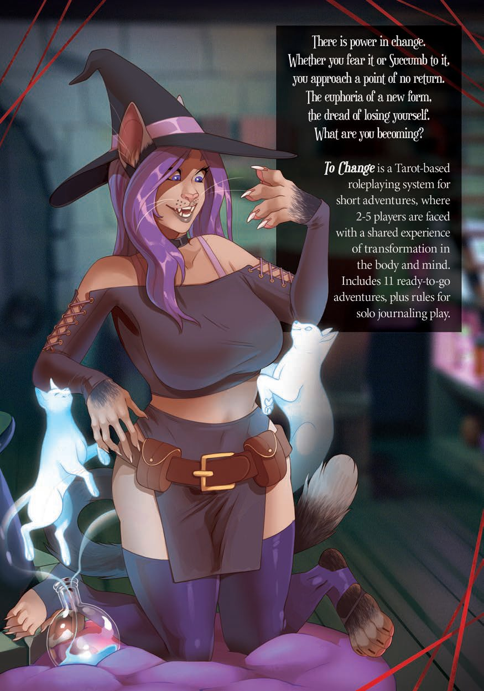

---

## 關於本譯本

本譯本依**原書 PDF**逐章翻譯，採用 PbtA 風的繁中譯名慣例：「動作（Move）」、「敘事者（Storyteller）」等。塔羅 22 張大阿爾克那採通用譯名。

代名詞（she/her、he/him、they/them、she/fae、any/all 等）一律保留**原文**——這是原書對跨性別表達原貌的尊重，不應在中譯中被消除。

英文故事標題保留括註原文，以便對照。原書已知排版限制：本 PDF 共 210 頁，TOC 中所列「製作人員（Credits, p. 211）」未實際收錄於這份檔案，因此譯本未列。
