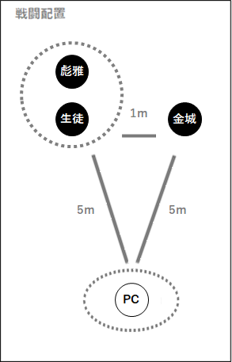

# Till tomorrow, mates!（明天見，夥伴！）

> 〔**Double Cross The 3rd Edition** 劇本・**GM 向全劇透**〕本檔含完整劇情、真相與 NPC 數據，**玩家請勿閱讀**。
>
> 一個關於信賴與「搭檔（buddy）」的青春向 DX3 劇本：UGN 兒童的畢業考試，看似揭發潛入校園的 FH 探員，實則是教官彪雅一手導演的整人惡作劇。PL 3 人・含 PC③ 秘匿 HO。
>
> 本檔為非官方繁體中文翻譯，僅供持有正版者個人遊玩參考。系統用語依 [`DX3_譯名對照表.md`](DX3_譯名對照表.md)（來源：資源站 doublecross3rd）。

---

### 本檔內容（請用左側目錄導覽）

- **劇本概要・HO・NPC 介紹**：劇本資料、目次、PC①②③ 與 PC③ 秘匿 HO、NPC 一覽
- **開場（OP）與中段（Middle）**：場景 0〜7、畢業考試、第一／第二課題、情報收集、FS 判定
- **觸發事件（場景 7〜10）**：疑惑、裏事情、巷弄密會、Who is FH？
- **高潮（Climax）與 NPC 數據**：場景 12 舞台開幕、高潮戰鬥、金城／彪雅 數據、戰鬥後
- **結尾（Ending）與後記**：場景 13〜15、賽後、後記
- **PC③ 秘匿 HO**：PC③ 個別劇本資料（雙重間諜）

---

## 劇本概要・HO・NPC 介紹

你們是 UGN Children（UGNチルドレン）
──的訓練生，是尚未成熟的雛鳥。
為了獨當一面，必須組成搭檔，並通過所被賦予的試驗。
在那裡，心、技、體，以及與搭檔之間的團隊合作都將受到考驗。
無論個體的力量多麼出眾，
總有一些不彼此協力就無法跨越的高牆。
那是至關重要的第一步。
這是某些超越者成為彼此相棒（搭檔）之前的第 0 話。

Double Cross the 3rd Edition
「Till tomorrow, mates!」（明天見，夥伴！）

Double Cross──那是意味著背叛的詞語？

1/21

### PL 向資訊

### ■劇本資料

【人數】1～3 人（與 NPC 單挑／雙人／隊伍）
【時間】語音團（ボイセ）：約 4 小時、半文字團（半テキ）：約 6 小時
【消費經驗值】0 點
【配布經驗值】新規 4 點（Easy Effect 份）
【備註】
・全員為攻擊手（アタッカー）也沒問題
・無中段戰鬥
・可使用既有 PC（經驗值需與其他 PC 對齊）

使用的規則書・補充本
・PL：規則書 1、2
・GM：規則書 1、2（若有更佳：效果檔案庫《エフェクトアーカイブ》、Linkage Mind《リンケージマインド》、Infinity Code《インフィニティコード》）

適合這樣的人！
・想以少人數迅速地玩一場 Double Cross
・已有／想創作相棒、搭檔、隊伍取向的 PC
・適合希望變得要好的 PC 們
・想嘗試 FS 判定

### ■HO

・若為新規角色，PC 為就讀燈蔭學園的國中生／高中生
※若為繼續使用的角色，掩護用身份（カヴァー）僅限於本劇本期間
・設定上 PC 彼此為點頭之交的程度，但不限於此
・由於還是訓練生，可以沒有代號（Code Name）
・基於學園的性質，PC 的年齡不必統一

PC①
工作（ワークス）：任意　掩護用身份（カヴァー）：國中生／高中生
路易絲：金城亞希（推薦感情　P：友情／N：敵愾心）
　身為燈蔭學園的學生兼超越者的你，與既是好友也是好對手的金城一同切磋琢磨，度過著學園生活。
　某天，你突然因校內廣播而被集合到講堂。
※由於設計上單人本（ソロシ）也能進行，因此 PC① 的存在感較弱。

PC②
工作（ワークス）：任意　掩護用身份（カヴァー）：國中生／高中生
路易絲：彪雅（推薦感情　P：感服／N：不安）
　身為燈蔭學園的學生兼超越者的你，從 Children 的教官彪雅那裡受教良多。
　今天也一如往常地埋首於戰鬥訓練的你，彪雅告訴你接下來將會發生有趣的事。

PC③
工作（ワークス）：任意　掩護用身份（カヴァー）：國中生／高中生
路易絲：雙院秘書官（推薦感情　P：同情／N：不安）
　身為燈蔭學園的學生兼超越者的你，因緣際會之下，與學園長的秘書官變成了會站著閒聊的交情。
　某天的深夜，你將與秘書官相約見面。
※適用於 PL 為 3 人且其中有經驗者的情況
※附有秘匿 HO

### ■舞台

東京近郊　燈蔭市（ひかげし）
　燈蔭市是距離市中心搭電車約一個半小時的近郊都市。同時也是以附設學生宿舍的小・中・高一貫制學校「燈蔭學園」為中心的學園都市。
　人口約 7 萬人。住宅區眾多，整座城市治安良好，對學生而言是安全的環境。每逢文化祭、體育祭等活動時，學園周邊便與市政府協力炒熱氣氛，是個和睦融洽的地區。
　學園後方有著標高 700m 以上的燈蔭山，自然景觀也恰到好處地豐富。
　然而這座學園有著不為人知的一面。
　雖然對一般人保密，但就讀這所學園的學生約有五分之一是超越者。這裡是一所超越者養成機構，年紀尚幼的超越者孩子們混在非超越者的學生之中，學習一般常識與關於變節者病毒的知識。
　他們畢業後通常會以 UGN Children／探員（エージェント）／伊利格爾（Illegal）的身份各奔前程。
　此外，考量到並非就讀國中、高中之適齡者，或是各式各樣的情況，也有人僅在燈蔭學園接受數週或一年等短期間的教育。

### ■NPC

・金城亞希（かねしろ あき）
就讀燈蔭學園的超越者女學生。冷靜沉著、成績優秀的優等生。
並非朋友很多的類型，但個性認真而誠實。

・彪雅（ひゅうが）
燈蔭學園 Children 們的女性教官。情緒高昂、為人親切隨和。
有著「～たまえ（～吧）」這類說不上是高傲還是怎樣、略顯自大的口吻。

・安心院鶯（あじむ うぐいす）
燈蔭學園的學園長。總是沉穩冷靜的成熟女性。

・學園長秘書官
黑髮戴眼鏡、理智的男性。平時不太常見。

　以下為 GM 向資訊。

2/21　目次

### 目次

「Till tomorrow, mates!」
PL 向資訊
■劇本資料
■HO
■舞台
■NPC
目次
GM 向資訊
■故事
■使用條款
■注意事項
■NPC
■秘匿 HO（PC③）
開場階段
OP 場景 0：深夜的幽會（PC③）
OP 場景 1：非日常的日常（PC①）
OP 場景 2：與教官的訓練（PC②）
中段階段
場景 3：畢業考試（PC①②③）
■情報收集
場景 4：第一課題（PC①②）
■FS 判定
場景 5：秘密的對話（主持人）
場景 6：第二課題（PC①）
■情報收集
觸發事件
場景 7：優等生的說詞（PC①）
場景 8：疑惑的眼神（PC③）
場景 X：他／她的內情（PC③）
場景 9：後巷的密會（PC②）
場景 10：Who is FH…?（PC①②③）
■情報收集
觸發事件
場景 11：注視著的影子（主持人）
高潮階段
場景 12：舞台開幕（PC①②③）
■高潮戰鬥
■NPC 數據
■戰鬥結束後的描寫
結尾階段
場景 13：所有的真相
場景 14：“Till tomorrow, mates!”
觸發事件
場景 15：Let's be buddies again!
賽後（After Play）
後記
版權頁

### GM 向資訊

### ■故事

　PC 們是燈蔭學園的學生，是 UGN Children 之雛鳥般的存在，日夜在學園中學習。
　就在三月的某一天，PC 們將與隊友一同挑戰為了成為獨當一面之超越者的畢業考試。
　然而，這場考試途中發生了問題。第二課題本應是──找出潛入燈蔭學園的 FH，但 UGN 日本支部長霧谷卻告知：「這並非考試，而是真實。」而且，由於若 UGN 大規模行動極可能被察覺，因此他希望身為 Children 雛鳥的 PC 們能夠協助。
　在懷疑學園長的秘書官是否可疑而展開調查的過程中，友人金城與教官彪雅的不可思議的行動逐漸引起注意。操縱學生們、設下陷阱欲將秘書官與 PC 們陷害入局的 FH，正是「扮丑的愉快犯」彪雅。
　PC 們將就各種意義上都是幕後黑手的彪雅逼入絕境並將其打倒，從而揭開真相──這一連串的事件，其實是名為「裏第二課題」、牽動了 UGN 與燈蔭學園的一場盛大的整人式畢業考試。
　在那之後便迎來畢業，並在稍遠的未來重逢，劇本至此結束。

### ■使用條款

Don't repost this scenario and pictures.
・使用本劇本時，即視為同意以下使用條款。擔任 GM 之前務必確認。
　https://www.pixiv.net/novel/show.php?id=16139150

### ■注意事項

・擔任 GM 之前，希望你確認劇本是否有更新。
　https://ypsilon.booth.pm/items/1715528
・本劇本是出於「想呈現兩位 PC 相遇的故事！」之宗旨而製作的劇本。因此，為了避免角色原菌化，可視侵蝕率情況調整戰鬥難度。
・基本上是以 1～2 人用設計的劇本。不過，也可經調整後以 3 人遊玩。供參考，《てぃるめいEXTRA（小提醒 EXTRA）》中備有 3 人用的追加 HO、場景等。
・若作為單人劇本，要讓 GM 的 PC 作為隊友登場時，將其設為 PC②。若有 2 名 PL，則可作為 PC③ 或金城的定位登場。
・即使是與 FH 相關的 PC，只要過去並非 FH，也能參加本劇本。

3/21　目次

### ■NPC

閃電雙子（Lightning Twins）
「煌耀雙星」金城亞希（かねしろ あき）
性別：女　　年齡：與 PC 同齡／15 歲
血統：三重混血（Tri Breed）
症狀：天使光環《エンジェルハイロゥ》／煉金化形《モルフェウス》／天縱之才《ノイマン》
工作／掩護用身份：UGN Children／UGN Children
第一人稱：我（私）　　第二人稱：你（あなた）
就讀燈蔭學園的超越者女學生。冷靜沉著、成績優秀的優等生。
並非朋友很多的類型，但個性認真而誠實。
正因那份認真與優秀，被彪雅看上，被選拔為反派角色（ヒール役）。

　Crime Crown（クライム・クラウン）
「扮丑的愉快犯」彪雅（ひゅうが）
性別：女　　年齡：不詳
症狀：幻象投影《ソラリス》／天縱之才《ノイマン》
工作／掩護用身份：UGN 支部長／燈蔭學園教官
第一人稱：我（私）　　第二人稱：你（君、○○くん）
燈蔭學園 Children 們的女性教官。情緒高昂、為人親切隨和。
有著「～たまえ（～吧）」這類說不上是高傲還是怎樣、略顯自大的口吻。
本劇本的幕後黑手。由於本性上就覺得有趣，所以樂在其中、興致勃勃。她那顆腦袋容易往有趣的事或壞點子上動，不過據說也有好好地進行學生指導。（本人談）
雖然並未公開，但其實是 UGN 燈蔭市支部的支部長。經常翹班溜出去。

「月下冰人」安心院鶯（あじむ うぐいす）
性別：女
症狀：固有結界《オルクス》
工作／掩護用身份：UGN 探員／燈蔭學園學園長
D 路易絲（Ｄロイス）：無瑕之石《無疵なる石》（LM-P.111）
外貌：綠色長髮、連身裙
第一人稱：我（私）　　第二人稱：您（貴方）
說話帶敬語、總是沉穩冷靜的燈蔭學園學園長。
她是特殊的賢者之石的適合者，擁有強大的固有結界之力。
她不因此而驕傲，那股力量是為了守護學生與學園而發揮的。
與彪雅的交情可追溯至學生時代，是相識甚久、也是被耍得最團團轉的人物。
有一說認為，比起外敵，替彪雅善後反而更加辛苦。

雙院秘書官
性別：男
症狀：冰凍火柱《サラマンダー》／天縱之才《ノイマン》
工作／掩護用身份：UGN 探員
身兼守護學園長之護衛的秘書官。黑髮眼鏡、理智的男性。
從其他支部為了考試而被調來的 UGN 探員。
在第二課題中扮演潛入的 FH 角色，與學生們周旋。
不幸地被彪雅纏上、被耍得團團轉的其中一人。

4/21　目次

### ■秘匿 HO（PC③）

　你因緣際會之下，與學園長秘書官變成了會站著閒聊的交情，也漸漸時不時聽到秘書官對彪雅的抱怨。據說是──又是太招搖、又是不做事、又是莫名其妙被纏上等等……看起來實在很辛苦。
　似乎在某處聽聞了這些話的彪雅，向你提出了某個請求。
「畢業考試的第二課題中，希望你扮演秘書官的協助者角色──雙重間諜（ダブルクロス）。」
　看樣子彪雅知道你與秘書官的交情，於是這差事便落到了你頭上。
　就這樣，你將在某天的深夜潛入學園長室，並在那之後立刻與秘書官會合。

【請求事項】
・潛入學園長室，取得記錄媒體
・之後與秘書官會合，將記錄媒體交給對方
・在事跡敗露之前對其他學生守口如瓶，已被叮囑
・將學生手冊託付給彪雅

※建議公開 HO 的時機
・場景 8 以後
若要公開 HO，請向 GM 宣告。其後會發生回想場景。

※若 GM 持有 UG（Universal Guardian／ユニバーサルガーディアン），可採用雙重劇情提示（Double Handout，UG-P.98），以 RHO 路易絲：彪雅（推薦感情　P：任意／N：不信感）的形式提示。

※GM 資訊：彪雅之所以親自提出這件事，是因為那樣看起來比較有趣，同時也是為了讓人更容易明白主導者是彪雅而非秘書官。

### 開場階段

### OP 場景 0：深夜的幽會（PC③）

#### GM 解說

　登場的僅有 PC③。
　在 PC①、PC② 的場景約一週前，PC③ 依照彪雅的指示潛入學園長室，並在之後的後巷與秘書官會合。

> 描寫・台詞
> 　三月某日的深夜。
> 　你一邊閃避著步步進逼的追擊之手，一邊朝著某個地方前進。

―詢問 PC 此時是什麼樣的裝扮―
※GM 資訊：因為之後要描寫被監視攝影機拍下的身影

> 　你避開人們的目光，抵達了那個地方。然而，那扇門前卻有著看似警衛的人物擋路。但這也在預料範圍之內。
> 　你必須運用效果來突破這個場面。

※他們是臨時演員（エキストラ），因此僅憑演出即可應付。

> 　你毫不在意地越過擋路的障礙進入房間，搜尋著耳聞過的地點，那裡確實有著一個小型記錄媒體。
> 　不宜久留。你大概會立刻離開那個地方。
> 　之後，當你迅速前往等候之人應在的後巷，他──學園長秘書官，就在那裡。

※若 PC③ 處於變身或變裝狀態，請要求其解除。理由是那之後也會用到。此處請勿提及彪雅或考試的事。

> 秘書官「有問題嗎？」
> 「那樣就好。」
> 「那麼，記錄媒體就──」
> 「確實收下了。」

當你將媒體交出，秘書官便將它收入懷中。

> 「你的任務暫且到此為止。」
> 「不過，因為這件事，今後你很有可能被盯上。多加小心。」

> 　秘書官沒有再多說什麼，你們就此分別。
> 　那麼，接下來得在不被發現破壞門禁外出的情況下，回到宿舍才行。

### 結末

　當 PC③ 回到宿舍，場景結束。

5/21　目次

---

## 開場（OP）與中段（Middle）

### OP 場景 1：非日常的日常（PC①）

#### GM 解說

　登場者僅 PC①。

　這是 PC① 與金城正在進行個別訓練、兩人交談途中，學生們被召集的場景。

　透過 RP 傳達金城的角色個性，同時決定她與 PC 之間的關係性。

> **描寫・台詞**
>
> 　3 月某日。
>
> 　你正在地下訓練場進行個別訓練。對「普通」的學生而言這是不可能的事，但你是超越者。非日常的日常，早已是理所當然之事。

※ 請 PC 做一次〈白兵〉／〈射擊〉／〈RC〉或〈交涉〉判定後進行以下描寫。

> 　在稍遠處的計分式虛擬射擊（之類的場地）那邊，金城正站在那裡。
>
> 　只見她俐落地調勻一口氣，下一刻，她手中握著的手槍便接連響起數聲槍鳴，那些子彈幾乎全都貫穿了靶心。
>
> 　金城注意到 PC① 後，會摘下護目鏡開口招呼。
>
> 金城「辛苦了。你那邊的訓練也結束了嗎？」

　金城是就讀於燈蔭學園的超越者學生，是連老師們都讚譽有加的優等生。你與她是良友亦是良敵，與她以及其他學生們一同切磋琢磨，度過著學園生活。

> ─RP─

※ PC 對命中判定的感想等等。

> 　正聊著這些話時，只有超越者才聽得見的校內廣播（透過《シークレットトーク》（EA-P.133）所發出）響起。
>
> 「公告欄上記有姓名的相關超越者學生們，請於 18 時前到大講堂集合。重複一次……」
>
> 　雖然事前並沒有特別聽說有什麼集會，但確認公告欄後，發現兩人似乎都是相關學生。
>
> 　金城也一臉不可思議地歪著頭。
>
> 「你有聽說過有什麼事嗎？」
>
> 「那麼，我們走吧。」

> **結末**
>
> 　與金城一同前往大講堂，場景結束。

### OP 場景 2：與教官的訓練（PC②）

#### GM 解說

　登場者僅 PC②。

　這是 PC② 在訓練場接受彪雅指導的場景。

　要讓人留下印象：彪雅既會確實地進行指導，又是個帶著俏皮個性的人物。若能營造出意味深長的感覺更好。

> **描寫・台詞**
>
> 　3 月某日。
>
> 　你正在訓練場接受彪雅教官的個別戰鬥指導。
>
> 　對於還很稚嫩的超越者──你，彪雅一邊施加幻象投影的支援效果，一邊進行指導。
>
> 彪雅「在接受隊友的支援之後，要如何行動才是關鍵。要是只會被人背著抱著，那可稱不上是團隊喔。」
>
> 「來吧，放馬過來！」

※ 請 PC 做一次〈白兵〉／〈射擊〉／〈RC〉或〈交涉〉判定後進行以下描寫。

> 「想著就算一個人也行的時候──看吧，側翼太鬆懈了。這樣可是會從旁邊被『砰！』地一下解決掉的喔。」
>
> 　隨著這句話，就在你身旁發生了一場小型爆炸，你被炸飛了出去。
>
> 　過了一段時間後，彪雅結束了訓練。
>
> 「嗯，差不多就到這裡吧。今天就到此為止。辛苦了！」之類地說著訓練的感想。
>
> 「話說回來……」
>
> 　你忽然注意到彪雅正目不轉睛地凝視著你。
>
> 「沒什麼，我只是覺得，比起一開始，你也成長了不少呢。變得相當強了。這樣的話，『接下來』也不成問題了吧。」
>
> 「說起來──你還不知道吧？接下來會發生有趣的事喔。」
>
> 　彷彿是在等待她說出這句話一般，只有超越者才聽得見的校內廣播（透過《シークレットトーク》（EA-P.133）所發出）響起。
>
> 「公告欄上記有姓名的相關超越者學生們，請於 18 時前到大講堂集合。重複一次……」
>
> 「看吧！來，去吧。你也是相關的學生喔！」
>
> 　彪雅一臉開心地目送你離去。

> **結末**
>
> 　PC② 前往大講堂，場景結束。彪雅之後也會前往大講堂。

---

### 中段階段

### 場景 3：畢業考試（PC①②③）

#### GM 解說

　登場者為全體 PC。

　告知畢業考試的內容與隊伍對手。之後穿插自我介紹，隊伍將商討要如何面對這場考試。

　也可以透過情報收集來調查畢業考試的相關事宜。

> **描寫・台詞**
>
> 　當暮色染上校舍之時，你們被召集到了大講堂。
>
> 　站在講台上的是教官之一的彪雅。而這座燈蔭學園的學園長，以及站在他身旁、最近偶爾會看到的一名戴眼鏡的男性也在一旁待命。
>
> 　彪雅浮現不敵的笑容，開口如此說道。
>
> 彪雅「那麼，諸君。說到 3 月──你們覺得是什麼呢？」
>
> 　面對這突如其來的提問，講堂頓時一陣騷動，她接著說下去。
>
> 「聚集在這裡的，是前途無量的超越者諸君。要說這些人在 3 月會舉辦的大型活動是什麼──沒錯！畢業！終於到了破殼而出、化為雛鳥的時刻了，蛋兒們！」
>
> 「我，彪雅，在此宣布舉行畢業考試！！」
>
> 「話雖如此，也並不是說現在馬上就要開始。詳細的內容就交給安心院來說明吧。」
>
> 　安心院學園長傳達了以下內容。

『關於畢業考試』

- 畢業考試分為第一課題與第二課題兩項
- 將於從現在起一週後的週一至週五期間舉行
- 第一課題：至今所學的總複習。會考驗各式各樣學過的事物之基礎與應用。
- 第二課題：模擬實際任務的模擬任務。內容將於完成第一課題者依序告知。

> 安心院「還有，這是最重要的一點──畢業考試，將由隨機選出的 2 人一組搭檔，或 3 人一組的隊伍來進行挑戰。考試結果也會以隊伍為單位評定，因此請大家齊心協力，努力取得好成績。」
>
> 彪雅「為何要隨機分組，年少的蛋兒們當然會感到不滿吧。然而這是踏入社會所必須的事！」
>
> 「等你們真正接下任務時，未必都能和交情好、合得來的成員搭檔。當然也會有與合不來的人組隊的時候。視情況而定，甚至還會與 FH 一起──」
>
> 安心院「這是希望在本學園學習過的各位，都能擁有靈活的思考方式。」
>
> 彪雅「越早習慣越好。這可以說是一種職業體驗呢。好好努力吧，蛋兒們！」
>
> 安心院「考試的概要就是以上這些。詳情請閱讀發放的資料。隊友將在稍後於螢幕上發表。」
>
> 　資料發下來後等待了一會兒，螢幕上以某對戰型遊戲「○○參戰！」般的演出方式，接連發表了一支支隊伍。
>
> 　然後，你們的隊友被發表了出來。
>
> 　PC①、PC②、PC③ 似乎要組成一隊。彼此或許曾聽說過對方，但基本上至今並沒有密切的交集。
>
> 　你們會在講台上互相致意、自我介紹吧。
>
> ─RP─
>
> 　就這樣，你們相遇了，並組成了隊伍。

### 情報收集

> 　周圍的學生們在談論這樣的話題。
>
> 「話說回來，畢業考試什麼的也太突然了吧。」
>
> 「好歹也讓我們準備一下考試嘛。」
>
> 「能不能跟學長姐打聽一下啊……」

　如果 PC 們也在意究竟是怎樣的考試，可以向認識的學長姐或考過試的學生打聽消息。

『關於第一課題』
〈情報：八卦〉達成值 7

> 　第一項是筆試。會考有關變節者病毒的問題。
>
> 　第二項是體育館的障礙競技。
>
> 　第三項是在福利社的物資調達。
>
> 　第四項是模擬戰鬥。
>
> 　至於第二課題，據說因為下了封口令，幾乎沒有什麼情報。

※ 透過取得考試的相關知識，便能事前擬定對策，因此每人 1 次，第一課題中任意一項判定可獲得 ＋3D 的加成。

> **結末**
>
> 　與隊伍同伴自我介紹、進行情報收集後，場景結束。

### 場景 4：第一課題（PC①②）

#### GM 解說

　登場者為全體 PC。

　這是接受第一課題的場景。進行 FS 判定。

※ 若 GM 未持有增補 IC，也可以將各項判定（〈知識〉、〈肉體〉、〈調達〉、〈白兵〉／〈射擊〉／〈RC〉／〈交涉〉）各成功 1 次來處理。在此情況下，沒有經驗值。

**FS 判定的描寫**

> 進行值 0：前往隊伍被分配到的教室，接受考試。看來最先是從筆試開始。隨著試官的信號，眾人一齊面向桌子，唯有紙上書寫文字的聲音傳入耳中。
>
> 進行值 6：模擬戰鬥開始前，PC① 能看見在不同分組中作戰的金城的身影。她以相當出色的配合，毫無懸念地通過了考試。

> **描寫・台詞**
>
> 　好不容易完成了第一課題，正喘口氣時，你們被召集了。
>
> 「完成第一課題的學生們，將進行第二課題的說明。請到大講堂集合。」
>
> 　大講堂裡，似乎並非所有應試的學生都到齊了。可以看出，比起第一課題說明時，約有半數的座位空了出來。
>
> 　講台上站著安心院學園長與那位戴眼鏡的男性。
>
> 安心院「各位，第一課題辛苦了。」
>
> 「事不宜遲，容我進入第二課題的說明。這第二課題，是僅向比某個規定等級更早完成第一課題的各位傳達的模擬任務。」
>
> 秘書官「至於其內容──將請各位找出潛入這座學園、從學園長室盜走資料的 FH 探員角色。」
>
> 「在 UGN 燈蔭市支部以及其他支部、高等部的超越者各位協助下，情報與痕跡已散布在學園各處。請以這些為線索，在週五的 24 時前取回被帶走的情報，並向彪雅報告，考試即告結束。」
>
> 安心院「說明就是以上這些。若無疑問等，就從此刻起開始第二課題。」

『關於第二課題』

- 僅限比某個規定 Lv 更早完成第一課題的學生
- 在 UGN 燈蔭市支部以及其他支部、高等部的超越者協助下，情報與痕跡已散布在學園各處
- 找出潛入學園盜走資料的 FH 探員角色，並取回被帶走的情報
- 在週五的 24 時前向彪雅報告・提交情報，考試即告結束

> **結末**
>
> 　平安完成第一課題、並被告知第二課題後，場景結束。

### FS 判定

名稱：通過第一課題！
終了：經過 6 輪
判定：〈知識：變節者病毒〉
難易度：7
最大達成值：30
經驗值：3 點
完成值：11

> 進行值 2：〈肉體〉
>
> 　筆試之後是實技測驗。下一個試場似乎是體育館。
>
> 　館內設置了好幾項障礙設施，宛如季節錯置的運動會一般。
>
> 　將之後的判定變更為【肉體】難易度 7。

> 進行值 4：〈調達〉
>
> 　任務中的物資調達也是重要的事。請適當地購買「急救手當套組」。
>
> 　成功的話便能實際入手。最多至人數份為止。亦可使用財產點數。
>
> 　將之後的判定變更為〈調達〉難易度 8。

> 進行值 6：〈白兵〉／〈射擊〉／〈RC〉／〈交涉〉
>
> 　調達完物資後就是最後的課題了。從通過課題者開始依序，與同樣在應考畢業考試的學生進行模擬戰。
>
> 　將之後的判定變更為〈白兵〉／〈射擊〉／〈RC〉／〈交涉〉命中判定的難易度 15。
>
> 　另外，進行進行判定的角色會受到 2D10 的 HP 傷害。（可軽減）

**備考**

- 透過使用適當的簡易效果（イージーエフェクト），可以對判定骰加值。

### ●てぃるめい突發事件表（ハプニングチャート）

※ 突發事件表由 PC 來擲骰。
※ 擲骰的骰數最低為 1 顆。

> 1：正常運作。沒有特別的修正。
> 2：因為昨晚太晚睡，突然一陣強烈睡意襲來……本輪中，擲突發事件表的角色所進行的進行判定，骰 -2 顆。
> 3：是擅長的領域！腦袋變得清晰起來！本輪中，擲突發事件表的角色所進行的進行判定，骰 +2 顆。
> 4：肚子餓得無法集中。本輪中進行的進行判定，骰 -2 顆。
> 5：和朋友聊天，重振精神。本輪中進行的進行判定，骰 +2 顆。
> 6：稍微休息一下。沒有特別的修正。
> 7：是前一天預習過的地方！本輪中，最大達成值 +10。
> 8：明明確實記得有學過卻一時想不起來……本輪中，擲突發事件表的角色所進行的進行判定，難易度 +1D10。
> 9：因緊張產生的腎上腺素使變節者病毒活性化。本輪中進行進行判定的角色，於判定後立即增加 1D10 點侵蝕率。
> 10：事前擬定的作戰正好奏效。本輪中，進行判定成功的角色，進行值 +1。

### 場景 5：秘密的對話（主持人）

#### GM 解說

　PC 不可登場。

　金城被彪雅意味深長地搭話，並被告知第二課題（接下擔任反派角色一事）。

> **描寫・台詞**
>
> 　第一課題結束、走出體育館的金城，被某個人物搭了話。
>
> 彪雅「呀，金城同學。第一課題似乎順利平安結束了呢。辛苦了！」
>
> 金城「彪雅教官……您辛苦了。」
>
> 彪雅「怎麼樣，考試的狀況如何？」
>
> 金城「還不錯。無論如何，我都想盡全力做到最好。」
>
> 彪雅「不愧是優等生金城同學會有的回答！嗯……那麼，果然還是你最合適了。」
>
> 「那麼，金城同學。我有件事想拜託你。在這趕時間的當下實在不好意思，能聽我說說嗎？」

> **結末**
>
> 　彪雅向金城提出請求，並浮現不敵的笑容後，場景結束。

### 場景 6：第二課題（PC①）

#### GM 解說

　登場者為 PC①。其他 PC 的登場為任意，但建議登場。

　當 PC 正著手進行第二課題時，被 UGN 職員叫去，由霧谷告知畢業考試的真正目的。

　PC 將在此前提下進行情報收集。

> **描寫・台詞**
>
> 　當你正思考著要如何著手第二課題時，被試官之一叫住了。
>
> 「您是 PC① 同學（以及其隊伍成員）吧。關於前幾天告知的第二課題，有些事想向您轉達。」
>
> 　答應後，你被引導到一間無人的空教室。
>
> 　試官取出平板裝置，設定好後給 PC 們看。
>
> 　顯示在上面的，是一名身穿剪裁精良的西裝、臉上浮現柔和笑容的男性。
>
> 霧谷「您好。考試的狀況如何呢？」
>
> 「我是霧谷雄吾。您或許知道，我是 UGN 日本支部的支部長。」

Q：為何支部長會出現？等等

> 「那麼，我們進入正題吧。」
>
> 　從平和的氛圍轉變為帶著緊張感、令人屏息的氣氛。
>
> 「傳達給各位學生的第二課題，其實──FH 探員潛入燈蔭學園一事，是真實發生的事。」
>
> 「為了避免引起混亂，表面上以課題為名目配置 UGN 探員，並在這期間找出 FH 探員，這才是這第二課題的真正目的。」
>
> 「之所以要把這件事告訴你們，是因為希望你們能協助我們。話雖如此，要做的事和現在的考試一樣，就當作是找出 FH 探員即可。」
>
> 「理由在於，若由成年的探員公然行動，被對方察覺的可能性會很高。然而，若是孩子──還是見習生的你們，對方應該會掉以輕心。而最重要的是，對這座學園最熟悉的，正是身為學生的你們。」
>
> 「怎麼樣，可以拜託你們嗎？」

Q：為何是我們？
A：基於至今的成績與第一課題的表現而定。

> （接下委託）「非常感謝。」
>
> 「報告就請拜託向你們搭話的那位試官。因為即使是學園內的教官，現在也是嫌疑人之一。」
>
> 「這件事只告訴了一部分的學生。由於可能招致混亂，請不要對其他學生多加談論。」
>
> 　通信以「請務必多加小心」這句話而中斷。

### 情報收集

> 　聽到 FH 探員確實潛入這個說法的 PC 們，將著手調查 FH 探員。

　在情報收集中，可以調查以下項目。

- ●『監視攝影機紀錄調查』
　〈情報：UGN〉／〈知識：電子工學〉達成值 6、達成值 8、達成值 10
- ●『關於學園的保全系統』
　〈情報：八卦、UGN〉達成值 9

『監視攝影機紀錄調查』

〈情報：UGN〉〈知識：電子工學〉達成值 6
> 　監視攝影機確認到深夜潛入學園長室的某人。學園長室應該是有上鎖的，但那似乎也被突破了。
>
> 　由於沒有情報外洩，因此推測犯人是已經知曉保全系統的人，或是有與保全相關的人被幻象投影的效果《蝕む声》所操控等可能性。

〈情報：UGN〉〈知識：電子工學〉達成值 8
> 　調查的結果，得知入侵者很可能是燈蔭學園的學生。
>
> 　街上的監視攝影機也拍到了入侵者在那之後，於後巷與疑似學園長秘書官的男子接觸的樣子。
>
> 　然而，監視攝影機的影像似乎遭到動了手腳，無法得知入侵者是誰等詳情。

〈情報：UGN〉〈知識：電子工學〉達成值 10
> 　能夠解析被動過手腳的影像。
>
> 　拍在上面的是──PC③。
>
> 　另外，學園長室裡似乎還掉落了疑似 PC③ 私人物品的東西。

『關於學園的保全系統』

〈情報：八卦、UGN〉達成值 9
> 　能進入學園長室的，似乎只有安心院學園長、秘書官，以及數名教官。他們對保全系統應該很清楚。
>
> 　另外，還能取得擁有幻象投影症狀人物的名單。除了你們認識的人與不認識的學生之外，彪雅、安心院學園長、秘書官等十幾人的名字也記載在名單上。

> **結末**
>
> 　進行情報收集、穿插 RP 等之後，場景結束。

> ※ 關於《蝕む声》請參照 EA-P.157。

### 觸發事件

### 場景 7：優等生的說詞（PC①）

**條件**

　已進行『監視攝影機紀錄調查』的情報收集。

#### GM 解說

　登場者為 PC①。其他 PC 不可登場。

　PC① 被金城叫去，被告知因為懷疑秘書官是 FH，希望 PC① 能協助。這是暗示週五將有事發生的場景。

> **描寫・台詞**
>
> 　週四，PC① 獨自一人時，金城向他搭話。她確認周圍沒有人之後，壓低聲音開始說話。
>
> 金城「欸。第二課題的事，你聽說了嗎？」
>
> 「不是課題，而是真的有 FH 探員潛入進來的那件事。我也是從霧谷日本支部長那裡聽說的。」
>
> 「你，還有你們，我就覺得你們是這樣的人。」
>
> 「看你們平常的訓練，還有第一課題就知道了。」
>
> 「可疑人物的目標，已經有頭緒了嗎？」
>
> 「我認定秘書官很可疑。他明明最近才來到學園，卻被過度信任，而且還有其他幾個可疑之處。」
>
> 　據她所說，他是幻象投影，還有目擊情報指出他曾出入警備室。
>
> 　「所以呢，我有件事想拜託你。」她先這麼開了個頭，接著說道。
>
> 「我打算找幾個人去質問他。如果你願意協助我們，明天 20 時請來大講堂。人手多一點比較好。」
>
> 「彪雅教官也說會協助我們。」

Q：FH 的報告對象不是應該是試官嗎？
A：「聯絡不上他。情況可能變糟了也說不定。」

Q：彪雅不也是幻象投影／嫌疑人候補嗎？
A：「……彪雅教官很久以前就在學園了，是位值得信賴的教官嘛。」

Q：難道不是秘書官嗎？
A：「……我確信秘書官就是。剩下的你自己去調查就會明白了。」

> 　你感到金城的樣子不像平常的她，有種違和感。雖然看起來也不像在焦急，但她原本不該是這種急性子的個性。

※ GM 情報：可以表現得頑固到讓人懷疑「她是不是被幻象投影的效果操控了？」的程度，沒有問題。

> 　大致說完一輪後，她像是想起什麼似地開口。
>
> 「PC③ 同學，是你的隊友對吧？他好像和秘書官很親近，會不會因此被懷疑了呢。聽說他被其他學生叫去了。」

> **結末**
>
> 　PC③ 退場／金城沒有要說的話而離開現場後，場景結束。

---

## 觸發事件（場景 7〜10）

### 場景 8：疑惑的目光（PC③）

條件
　場景 7 結束後緊接著進行。

#### GM 解說

　登場的是 PC③。其他 PC 可從中途登場。
　這是 PC③ 被人糾纏「你是 FH 對吧？！」的場景。

描寫・台詞

> 　你一直與其他 PC 分開行動。
> 　不經意間，你察覺到視線正集中在自己身上。有幾名學生看著你，鬼鬼祟祟地低聲交談著。
> 「就是那傢伙嗎？」「現在好像只有一個人。」等等。
> 　其中幾人像是下定了決心，向你搭話。
> 「你就是 PC③ 嗎？」
> 「有件關於第二課題的事想問你。」
> 「希望你跟我們來一趟。」

　PC③ 答應的話，便會被帶到校舍後方。

> 「我們聽說，有某個人在學園長室裡撿到了你的學生手冊。」
> 「而且我們也實際看過了那本手冊。」
> 「也就是說──你就是 FH 探員，對吧？」

Q：「某個人」是誰？
A：〈交涉〉難易度 8 成功，便可得知是聽彪雅教官說的。

> 　無論你怎麼說，在他們眼中那都只像是在找藉口。
> 「你打算裝傻到底是嗎？」
> 「算了，反正只要打倒你，我們就達成目標了！」

　進入臨戰態勢的學生們向 PC③ 撲了過來。
　此處其他 PC 可以登場。
　由於學生們是臨時演員，可以用演出方式擊退。

> 「你們算什麼東西！打算幫 FH 的忙嗎！」
> 「可惡！你給我記住！」

　學生們撂下這類狠話後便離去。

―RP―

> ※GM 情報：若 PC③ 似乎正在煩惱 HO 公開的時機，現在正是恰當的時候，應該這樣告訴他。

結末
　若場景 6 的情報收集中還有未取得的情報，可在此處再進行一次判定。
　當 PC 之間無話可說時，場景結束。

### 場景 X：他／她的內情（PC③）

條件
　PC③ 要談論自己的秘匿 HO 時。

#### GM 解說

　登場的 PC 僅 PC③。場景維持繼續即可。
　這是 PC③ 被彪雅拜託成為第二課題協助者時的回想場景。

描寫・台詞

> 　你因為某個偶然，與學園長秘書官變成了會站著閒聊的交情，於是時常零零碎碎地聽到彪雅的牢騷。據說──又是太愛出風頭、又是不做事、又是莫名其妙地纏著人等等……實在是相當辛苦的樣子。
> 　就在過著這樣日子的某天，那是畢業考試前約一～兩週的某日。
> 　彪雅似乎不知從哪裡聽聞了你和秘書官是會交談的交情，於是興致勃勃地向你搭話。

彪雅「PC③ 同學，聽說你最近和那位秘書官交情很好，還一起說我的壞話？」

> 　那與其說是責備，倒不如說帶著某種揶揄的語氣。看來他並沒有真心要怪罪的意思。

> 「啊哈哈，剛剛那只是開個小玩笑啦！──不過，就拜託名聲有點不太好的你一件事吧。」
> 「作為畢業考試的第二課題，我希望你來當『雙重間諜（ダブルクロス）』。」
> 「要做的事就是在深夜潛入學園長室，把放在書桌第三個抽屜裡的記錄媒體拿出來，交給秘書官。」
> 「順便再把那些起疑心的學生們好好應付一下吧。」
> 「畢竟是相當重的工作呢。只要你好好完成，內申分數和成績都會大大加分喔。」

　彪雅一口氣說到這裡，便嘿嘿一笑。

> 「雖然我說是『拜託』，不過都已經聽到這裡了，你會接下來的吧？」
> 「就拜託你囉！當然，這件事對其他學生，就算是交情好的孩子也要保密喔？」
> 「啊，對了。關於這件事還有一個請求。」
> 「能不能把你的學生手冊借給我？考試結束後我一定會還你的。」
> 「那麼之後詳細的安排就請你和秘書官商量囉！交給你啦～！」

　就這樣，你在某日深夜潛入學園長室取得記錄媒體後，便定下了與秘書官會合並把它交給對方的安排──。

結末
　結束回想場景，穿插 PC 之間的 RP，待大致談妥後，場景結束。

### 場景 9：後巷的密會（PC②）

條件
　場景 8 結束後。

#### GM 解說

　登場的是 PC②。其他 PC 是否登場任意。
　追蹤離開宿舍的金城，PC 們會目擊到她與正在使用完全演技《完全演技》（EA-P.95）的彪雅進行意味深長的對話。這是刻意說給 PC 聽、好讓 PC 懷疑彪雅的對話。
　另外，金城【感覺】很高，已經察覺 PC 在跟蹤，因此使用兔耳《ウサギの耳》（ルール2-P.82）一邊調整距離與時機等，一邊加以誘導。

描寫・台詞

> 　星期四的夜晚，你正在宿舍裡分享至今取得的情報等，並加以整理。
> 　就在這時，你目擊到金城一邊在意著旁人的目光，一邊偷偷地走出宿舍。時間明明應該早已過了門禁，被傳為優等生的她，究竟要去哪裡呢。

●追上去
　雖然你也會因此違反門禁，但只要不被任何人發現應該就沒問題。

●試圖向金城搭話
　距離有些微妙地拉開，要出聲叫住她似乎很難。就算大聲喊叫，也無法保證她會停下來。

> 　金城不時停下腳步，看似在警戒，但 PC 仍能就這樣不被發現地跟在後面。
> 　接著，當她抵達某條後巷時，便與某人開始交談。從那聲色可以聽出對方是彪雅。

※以下的對話要在不被 PC 插話的情況下進行。

彪雅「呀，金城同學。晚安。」
「進行得如何？那位死板的秘書官同學，有順利地被懷疑嗎？」

金城「大部分的學生都毫不懷疑這只是個課題，認為秘書官就是 FH。要取得他們的協助很容易，棘手的是那些被告知這其實並非課題的學生。」

彪雅「既然連那位霧谷都親自出馬了，學生們也不得不相信這是真的吧。真是的，UGN 上層也淨做些多餘的事。」
「──不過，一切到明天都會了結。剩下的只是把可憐的祭品供奉上去而已。我很期待『你們』的活躍喔。」

金城「……是，請交給我。」

　隨後，彪雅與金城立刻以瞬間退場《瞬間退場》（ルール1-P.329）離開了現場。

結末
　只剩下 PC② 被留在原地，場景結束。

### 場景 10：Who is FH…?（PC①②③）

#### GM 解說

　登場的是全體 PC。
　這是根據金城與 PC① 的對話、金城與彪雅的密會等線索，再次進行情報收集的場景。
　應告知 PC 下一個場景將是高潮，並讓他們進行路易絲整理、調達判定（最多 1 次）等。

描寫・台詞

> 　星期五了。你們必須匯整至今的情報，查明究竟誰才是 FH。

### ■情報收集

　在情報收集中，可調查以下項目。

●『關於秘書官』〈情報：UGN〉達成值 6、達成值 9
●『關於彪雅』〈情報：UGN、傳聞〉達成值 6、達成值 9、達成值 20

『關於學園長秘書官』

〈情報：UGN〉達成值 6
　畢業考試大講堂上站在安心院學園長身旁的男性，似乎就是那位秘書官。據傳是個沉默寡言、不苟言笑又冷酷的男人。也有傳聞說，他曾被彪雅揶揄「你既不太說話又無趣呢。真不愧是冰之使者！」之類的話。
　看來他似乎是最近才來到燈蔭市的。此前不太聽說有人見過他，但在這次考試期間，學園內、街上以及警備室等各種地方都有人目擊到他。

〈情報：UGN〉達成值 9
　秘書官似乎是為了畢業考試而由其他 UGN 支部派遣來的探員。
　UGN 登錄的最初資料是冰凍火柱《サラマンダー》／天縱之才《ノイマン》，但最近留下了追記為幻象投影《ソラリス》的紀錄。進行該項修正的，看來是彪雅。

『關於彪雅』

〈情報：UGN、傳聞〉達成值 6
　燈蔭學園的 Children 們的教官。為非編制人員，除了學園教官以外還做些什麼成謎。性格是喜好有趣事物、愛出風頭。畢業考試上播放的隊友發表影片，據說就是彪雅執導的。
　症狀是幻象投影《ソラリス》／天縱之才《ノイマン》的混血種（Cross Breed），代號似乎是「Crime Crown」。
　考試期間，他似乎叫了幾名學生過去。

〈情報：UGN、傳聞〉達成值 9
　可以向 UGN 職員打聽到關於彪雅的事。
「彪雅先生明明頭腦很好，那份才智卻老往歪腦筋上用，是個只要開心什麼都好的快樂主義者，或者該說……總之有種愉快犯的傾向。被他耍得團團轉的人也不在少數……」
「也因此，他被取的代號才會是『扮丑的愉快犯（crime clown）』呢。」
「你們也要小心別被他耍得團團轉喔。」
　那名職員就這樣向你們送上了鼓勵。

〈情報：UGN、傳聞〉達成值 20
　他與安心院學園長是舊識，而且竟然似乎還是 UGN 燈蔭市支部的支部長──！？
　你想起了學園長說明第二課題時的話。
『請 UGN 燈蔭市支部及其他支部、高等部的各位超越者協助──』

結末
　進行情報收集後，便能隱約察覺彪雅有些可疑。即使想把這件事告訴負責的 UGN 職員，也聯絡不上；就算告訴其他教員，也會被當成考試而不予理會。情況變成只能靠 PC 們自行解決。
　PC 們前往大講堂的話，便進入高潮。

### 觸發事件

條件
　前往會見秘書官。

#### GM 解說

　登場的 PC 任意。場景維持繼續即可。
　秘書官自始至終都以『潛入的 FH 探員角色』與 PC 們接觸。
　即使不去會見秘書官也能推進到高潮，因此未必一定要與秘書官會面。

描寫・台詞

> 　秘書官似乎在學園長室正旁邊的事務室裡工作。打開事務室的門，或許是被大量文件包圍的緣故，一名疲態盡顯的青年正面對著辦公桌。
> 　他朝 PC 們瞥了一眼，旋即又把目光移回文件上，開口說道。

秘書官「有什麼事嗎？如你們所見，我很忙。」

Q：關於症狀的追記
A：「三重混血（Tri Breed）也有後來才發生的例子。沒什麼好奇怪的。」

Q：是否被某人叫去過？／其他不便回答的問題
A：「沒有必要說。」
※GM 情報：基於考試的需要，他無法透露詳情。

PC③：將彪雅拜託的事告訴了 PC 們
A：「你竟然說出去了……」
　↓
Q：PC③ 與秘書官是不是被彪雅騙了？
A：「彪雅先生是 FH？怎麼可能。這終究只是考試吧。」

Q：會不會是彪雅的自導自演（謊言）？
A：「如果真是那樣，那也該直接當面對本人說吧。」

※GM 情報：秘書官雖然知道第二課題畢業考試的概要，但不會說出其真相。

結末
　若要離開事務室，場景結束。

### 場景 11：注視著的身影（主持人）

條件
　PC 宣言星期五前往大講堂。

#### GM 解說

　PC 不可登場。
　這是 UGN 中略有頭臉的大人物們在討論「就算進行彪雅所構想的這種考試，真的不要緊嗎……」的場景。

描寫・台詞

> 　那是一間透著昏暗感的監控室。佔滿整面牆的數座監視器上，映照出燈蔭學園各式各樣的場所。
> 　映照出的不只是場所。從學園的學生到教師，彷彿要把燈蔭學園的所有人都映照出來似的。
> 　看著監視器的、其中一名全息影像（ホログラム）開口說道。
> 「這當中的某人就是 FH 的間諜，嗎……」
> 「真的不要緊嗎？這種『考試』，一步走錯學生們就有危險。」

霧谷「不會有事的。如果是他們的話──一定能貫徹到底完成任務，就這麼相信吧。」

> 　他們再次凝視著監視器。那上面映照出了 PC 們的身影。

結末
　當霧谷與 UGN 的大人物們注視著 PC 們時，場景結束。

---

## 高潮（Climax）與 NPC 數據

### 高潮階段

### 場景12：舞台開幕（PC①②③）

#### GM 解說

　彪雅與金城及其他學生一起，質問逼問秘書官的場景。會把 PC 捲入並導入戰鬥。

　若要取得 S 路易絲，最好在戰鬥結束之前完成。

#### 描寫・台詞

> 　當 PC 們進入大講堂時，人似乎已經到齊了。彪雅如此開口說道。
>
> 彪雅　「這下演員看來都到齊了呢。」
>
> 秘書官「彪雅先生，原來您也在啊。在這種時間把人叫出來，到底有什麼事？跟您不同，這邊可是很忙的。」
>
> 彪雅　「真是令人嘆息啊……沒想到身為學園高層的秘書官，竟然是 FH 的人！」
>
> 「不過這一切今天就到此為止了。是該繳清你的罪業的時候了。」
>
> 秘書官「我是 FH？你在胡說八道些什麼啊。」
>
> 彪雅　「證據可是好好地留在監視攝影機裡喔。」
>
> 秘書官「怎麼會──不過，那是……！」
>
> 　秘書官打算這樣反駁，但守在後方的學生們將秘書官團團圍住。
>
> 　金城並未加入其中，而是站在彪雅身旁。她只是朝你們這邊瞥了一眼，也不開口搭話。你們要怎麼做？

##### ●若選擇袖手旁觀

> 彪雅　「（對 PC 們）哎呀，你們不就是被秘書官騙了、還協助他的那些學生嗎！」
>
> 「什麼意思？你們不是看過監視攝影機的影像了嗎？深夜裡與秘書官密會、看起來像是學生的人物。」
>
> 「就請你們來當那名學生的角色與證人吧。當一個被 FH 巧妙地誆騙、慘遭殺害的可憐學生──這樣的證人！」
>
> 「It's a showtime!」

##### ●若選擇指出彪雅就是 FH

> 彪雅　「看來學生之中也有優秀的好苗子呢。」
>
> 「正如你們所說──幕後黑手就是我，『扮丑的愉快犯（Crime Crown）』。至今為止的一切，全都是我所安排的遊戲。」
>
> 「那麼，就請優秀的你們來當證人吧。當一個被 FH 巧妙地誆騙、慘遭殺害的可憐學生──這樣的證人！」
>
> 「It's a showtime!」

##### ●若選擇指出這是彪雅的自導自演

> 彪雅　「啊哈哈哈哈！太精彩了！如我所期待、甚至超乎預期！沒想到你們竟能查到這種地步啊。」
>
> 「既然都被識破了，那也沒辦法。沒錯，這一切都是自導自演的鬧劇。是我所安排的遊戲。」
>
> 「把我們打倒為止，才是真正的第二課題。而看穿這一點，正是裏最終課題。」
>
> 「也就是說，只要你們能打倒我，就能堂堂正正地合格！──那麼，裏最終課題就在此開始吧！」

### 高潮戰鬥

- 戰鬥結束條件：彪雅戰鬥不能
- ※戰鬥開始時不進行衝動判定
- ※秘書官視為另一場戰鬥，不參戰
- 戰鬥配置：PC 為 1 接戰區，相距 5m 處有彪雅與學生 1 體（探員：阻擋者）為 1 接戰區，其旁有金城為 1 接戰區

#### ●戰鬥計畫

**彪雅**

- 第 1 輪最初的先制過程
  1. 以加速之刻《加速する刻》搶在金城之前行動。再使用「▼絕望的舞台」。對象為 PC 們的接戰區。（※整場劇本僅 1 次）
  2. 放棄自身的行動手番；或在持有 EA 且 PC 的侵蝕率未超過 100% 的情況下，於主要行動使用「▼箱裝小丑」。對象為侵蝕率較低的 PC 的接戰區。
- 第 2 輪以後
  於準備過程使用加速《アクセル》，將行動值提升至 20。於主要行動以對象：金城使用「▼學生指導」。
- 戰鬥不能時
  自身陷入戰鬥不能時，使用蘇生復活《蘇生復活》。
  ※在 PC 全員的路易絲數未減少 2 個以上，且侵蝕率未達 130% 以上／非第 3 輪以後的情況下

> 台詞：彪雅（戰鬥中）
>
> 「站得真好。這才是我培育出來的學生啊！」
>
> 「呵呵呵……不錯的攻擊嘛！是我的指導奏效了嗎？就是這個調子！」等等，開心地出言挑釁。

**金城**

- 最初的一輪
  次要行動使用「▼雙星」製作射擊武器。
  主要行動對 PC 人數最多的接戰區使用「▼閃耀繁星」。
- 之後的各輪
  使用《ギガンティックモード》後，次要行動使用「▼雙星」。
  主要行動對 PC 人數最多的接戰區使用「▼閃耀繁星」；若 PC 分散開來，則使用「▼燦爛繁星」。
  ※若有路易絲數 5 以下的 PC，則進行單體攻擊
  ※對象：PC 侵蝕率相近時取路易絲數較多者，路易絲數相同時取侵蝕率較低者
- 戰鬥不能時
  金城陷入戰鬥不能時，由彪雅使用生命之水《アクアウィターエ》。

**學生**

（探員：阻擋者（ルール2-P.265））
每輪 1 次放棄主要行動，使用《イージスの盾》《砂の盾》，對彪雅進行掩護（Covering）。
※無裝甲值，無杜拉鋁盾（ルール1-P.176）
※關於掩護（ルール1-P.262）

### NPC 數據

※效果數據依規則書記載。

#### 金城 亞希（かねしろ あき）　／　二つ名「煌耀雙星（煌めく双星）」

**症狀**：天使光環《エンジェルハイロゥ》／煉金化形《モルフェウス》／天縱之才《ノイマン》

| 領域 | 值 | 技能 |
|---|---|---|
| 【肉體】 | 1 | 〈回避〉1 |
| 【感覺】 | 9 | 〈射擊〉4 |
| 【精神】 | 1 | 〈意志〉1 |
| 【社會】 | 1 | 〈情報：UGN〉2 |

【HP】53　【行動值】19　裝甲值：8（UGN 防彈護甲：ルール2-P189）　侵蝕率：100%（骰+3 顆）

**取得效果**（※侵蝕率修正已反映）

> ▼天使光環《エンジェルハイロゥ》
> 微塵《小さな塵》2Lv（ルール1-P.100）
> 兔耳《ウサギの耳》1Lv（ルール2-P.82）
>
> ▼煉金化形《モルフェウス》
> 巨大化型態《ギガンティックモード》1Lv（ルール1-P.141）
> 百連射《ハンドレッドガンズ》2Lv（ルール1-P.142）
> 雙重創造《ダブルクリエイト》2Lv（ルール2-P.137）
> 質感變換《テクスチャーチェンジ》1Lv（ルール2-P.141）
>
> ▼天縱之才《ノイマン》
> 雙重決鬥《デュアルデュエル》2Lv（ルール1-P.147）
> 多重武器《マルチウェポン》1Lv（ルール1-P.148）
>
> ▼一般效果
> 集中：天使光環《コンセントレイト：エンジェルハイロゥ》3Lv（ルール1-P.169）
>
> ▼敵人效果
> 瞬間退場《瞬間退場》1Lv（ルール1-P.329）
> 生命增強《生命増強》1Lv（ルール1-P.329）

**連攜數據**

> ▼雙星《双星》
> 《ハンドレッドガンズ》《ダブルクリエイト》
> 解說：製作 2 把攻擊力+7 的〈射擊〉武器
> 描寫：套在那與優等生頭銜不太相稱的手指上的戒指，變化為雙槍。
>
> ▼閃耀繁星《綺羅綺羅星》
> 《コンセントレイト：エンジェルハイロゥ》《小さな塵》《マルチウェポン》《ギガンティックモード》《デュアルデュエル》
> 時機：主要行動　技能：〈射擊〉
> 難度：對決　對象：範圍（選擇）　射程：30m
> 骰：12　暴擊值：7　攻擊力：18
> 解說：以雙槍進行射擊攻擊，閃避（ドッジ）的暴擊值+1，所裝備的武器破壞，1 場景最多 2 次
> 描寫：那雙手中的手槍，光芒逐漸收束。就這樣朝天高舉的槍口，如流星般的光彈精準無比地朝 PC 傾瀉而下──！
>
> ▼燦爛繁星《綺羅星》
> 《コンセントレイト：エンジェルハイロゥ》《小さな塵》《マルチウェポン》
> 時機：主要行動　技能：〈射擊〉
> 難度：對決　對象：單體　射程：30m
> 骰：12　暴擊值：7　攻擊力：18
> 解說：以雙槍進行射擊攻擊

#### 彪雅（ひゅうが）　／　二つ名「扮丑的愉快犯（道化たる愉快犯）」

**症狀**：幻象投影《ソラリス》／天縱之才《ノイマン》

| 領域 | 值 | 技能 |
|---|---|---|
| 【肉體】 | 2 |  |
| 【感覺】 | 2 |  |
| 【精神】 | 6 | 〈RC〉4 〈意志〉6 〈知識〉2 |
| 【社會】 | 4 | 〈調達〉1 〈情報：UGN〉6 |

【HP】50(30)　【行動值】10　裝甲值：1（決勝戰服（勝負服）：ルール2-P.188）　侵蝕率：120%（骰+3 顆）

**取得效果**（※侵蝕率修正已反映）

> ▼幻象投影《ソラリス》
> 寧靜《トランキリティ》2Lv（ルール1-P.165）
> 毒霧《ポイズンフォッグ》3Lv（ルール1-P.166）
> 狂戰士《狂戦士》2Lv（ルール1-P.167）
> 生命之水《アクアウィターエ》2Lv（ルール1-P.167）
> 加速《アクセル》5Lv（ルール2-P.166）
> 戰乙女的引導《戦乙女の導き》2Lv（ルール2-P.166）
> 藥錠《タブレット》4Lv（ルール2-P.168）
> 墜落的絕望《堕ちる絶望》3Lv（ルール2-P.171）
> 青梅竹馬《竹馬の友》1Lv（ルール2-P.173）
> 爆裂《エクスプロージョン》2Lv（EA-P.114）
>
> ▼天縱之才《ノイマン》
> 黑市《ブラックマーケット》3Lv（ルール1-P.148）
> 完全演技《完全演技》1Lv（EA-P.95）
>
> ▼一般效果
> 集中：幻象投影《コンセントレイト：ソラリス》3Lv（ルール1-P.169）
>
> ▼敵人效果
> 加速之刻《加速する刻》1Lv（ルール1-P.328）
> 瞬間退場《瞬間退場》1Lv（ルール1-P.329）
> 蘇生復活《蘇生復活》1Lv（ルール1-P.330）
> 生命增強Ⅱ《生命増強Ⅱ》1Lv（ルール2-P.244）

※PL 為 3 人時，可將生命增強Ⅱ《生命増強Ⅱ》改為 2Lv
※使用 Effect Archive（EA）時，請修正寧靜《トランキリティ》的消費 HP 等數值。

**連攜數據**

> ▼絕望的舞台《絶望の舞台》
> 《堕ちる絶望》《コンセントレイト：ソラリス》《トランキリティ》《ポイズンフォッグ》＋《タブレット》
> 時機：主要行動　技能：〈RC〉
> 難度：對決　對象：範圍（選擇）　射程：視界
> 骰：12　暴擊值：7
> 解說：使用自動行動《タブレット》，將射程改為視界。命中判定後，於〈意志〉對決中勝過對象時，發生難度 9 的衝動判定。消費 HP 3 點。
> 描寫：「來吧，把你們的衝動展現給我看！」
> 那聲音如同枷鎖，銀色冰冷的霧氣將 PC 們團團圍繞。一旦吸入那霧氣，內心深處便萌生出陰暗黑沉的情感，體內的變節者病毒強烈地起了反應。
>
> ▼學生指導《生徒指導》
> 《戦乙女の導き》《狂戦士》＋《タブレット》
> 時機：主要行動　技能：〈RC〉
> 難度：自動　對象：金城　射程：視界
> 解說：使用自動行動《タブレット》，將射程改為視界。對象的下一次主要行動的判定骰+6 顆、暴擊值-1、攻擊力+5
> 描寫：「金城同學，妳明白的吧？」
> 伴隨那詭異的笑聲，銀色的風環繞於金城周圍。曾受過彪雅指導的人，想必都親身體會過那是什麼。
> 金城下一次的攻擊，將會比方才更加增強威力吧。
>
> ▼《アクアウィターエ》（生命之水）
> 時機：自動　技能：－
> 難度：自動　對象：金城　射程：視界
> 解說：回復金城的戰鬥不能（HP.20）
> 描寫：「能打倒金城同學，做得相當不錯嘛。──不過，還得讓她繼續工作才行。」
> 銀色的水珠滴落於金城身上，旋即被光芒包覆，待那光芒平息時，金城已再度站了起來。

※持有 EA 的情況

> ▼箱裝小丑《箱詰めのピエロ》
> 《エクスプロージョン》《コンセントレイト：ソラリス》《ポイズンフォッグ》＋《タブレット》
> 時機：主要行動　技能：〈RC〉
> 難度：對決　對象：範圍（選擇）　射程：視界
> 骰：9　暴擊值：7
> 解說：與 PC 處於不同接戰區時，使用自動行動《タブレット》，將射程改為視界。（不使用《トランキリティ》）
> 描寫：銀色冰冷的期待塊狀物，數個將 PC 們團團包圍。它們宛如驚嚇箱，從被觸碰之處燃起火焰並爆炸。

### 戰鬥後　描寫・台詞

> 　彪雅臉上掛著笑容，當場癱倒在地。
>
> 　秘書官那邊的戰鬥似乎也告一段落，周圍是被凍成冰、跪倒在地的學生們，而站在其中心的，正是秘書官。

──RP──

> 　就在這麼忙亂之際，大講堂的門突然打開，安心院學園長趕了過來。
>
> 安心院
> 「各位，你們還好嗎……！」
>
> 　學園長看到那慘狀，倒抽了一口氣。接著她奔向傷痕累累的 PC 們，使用治癒之水《癒しの水》與 D 路易絲『無瑕之石（無疵なる石）』（LM-P.111）。

※HP 全回復
※優先將學園相關人士的泰特司變更為路易絲

> 彪雅
> 「還沒……怎麼能以這種形式結束……！」
>
> 　原本倒下的彪雅站了起來，取出暗藏的手槍抵向 PC②。
>
> 「這下，就結束了……！」
>
> 　接著，比 PC 們行動還要更快，扳機被扣下，乾澀的槍聲響徹四周。
>
> 　連閃避都來不及，從那裡流出的血──卻沒有。從槍口射出的，是五彩繽紛的紙花與布條。
>
> 　然後，從你們的正上方落下了一顆彩球（くす玉）。從中垂下的布條上，這樣寫著。
>
> 『畢業考試・最終課題合格，恭喜！』

### 結末

　戰鬥結束後，進行上述描寫，在你以為「被彪雅用槍射中了……？」的瞬間，場景結束。

　回溯（バックトラック）之後，進入結尾階段。

---

## 結尾（Ending）與後記

### 結尾階段

### 場景 13：所有的真相

#### GM 解說

　總合結尾。PC 全員登場。

　超級解謎大揭密時間。

> **描寫・台詞**
>
> 　面對一臉茫然的 PC 們，彪雅露出神清氣爽、卻又極為惡劣的笑容說道。
>
> 彪雅　「第二課題合格，恭喜啦，菜鳥蛋們！」

　彷彿配合著那聲音，原本倒下的學生們也紛紛起身，現場瀰漫著「結束了啊」的氣氛。

　事情的來龍去脈是這樣的。據說有 FH 探員潛入這場考試的這個說法，本身的確是真的，但這其實是一場「演戲」的畢業考試。它是每隔數年一次、只指派給少數幾組隊伍的特別課題，而被選為承接這項課題的隊伍，正是 PC 們。

　彪雅一臉得意洋洋地如此說明。

> 彪雅　「只要把霧谷搬出來，大家就不得不相信了吧？　代價是得讓他幫忙接下這份麻煩的工作，這點是缺點啦，不過確實是一招妙棋。不愧是我！」
>
> 秘書官　「我可沒聽說會被這樣硬拉出來。」

　秘書官一臉不滿地說道，而金城則一臉抱歉地向 PC 們道歉。

> 金城　「對不起。彪雅教官來問我的時候，是我推薦了你們……」

　彷彿要佐證這些都不是謊話，學園長也開口了。

> 安心院　「這樣的考試，我一直反對，覺得對學生們的負擔太大了……」
>
> 彪雅　「安心院你太死板了啦。要讓蛋破殼而出，這不正是再合適不過的衝擊嗎！」
>
> 「再說了，要是有個世界真的會逼這些菜鳥蛋去面對那種無理難題，那也太悽慘了！照理說，潛入進來的應該會是早已大顯身手的 Children 們才對。這一點也正是解開謎題的鑰匙之一呢！」
>
> 「──當然啦，偶爾蛋們真的遇上那種狀況也並非不可能就是了。」
>
> 「哎呀，不過我心裡也是很痛的喔？　雖說是考試，要讓無辜的協力者學生來掩護，又要攻擊、又要被攻擊的，唉。」

　彪雅一臉根本沒這麼想的表情，厚顏無恥地說著；而同樣身為攻擊一方的金城，則似乎有些坐立難安地聽著這番話。

> 「好了，雖然我想各位也經歷了不少辛苦，不過畢業考試到此結束！話雖如此，這也是課題。整個經過要好好寫成報告書提交上來。畢竟這可是『模擬任務』啊。」
>
> 安心院　「期限還早，今天就請好好休息吧。各位辛苦了。」

#### 結末

　把事情的真相大致說明完，結束問答之類的環節後，本場景結束。

### 場景 14：「Till tomorrow, mates!」

#### GM 解說

　PC 全員登場。

　順利通過考試的 PC 們，將回歸原本的日常生活。

> **描寫・台詞**
>
> 　考試課題提交完畢、畢業在即的某一天。PC 們被金城以「為前幾天的事賠罪」為由，邀約一同吃飯。
>
> 金城　「前幾天真的很對不起。」
>
> 「雖說是考試，但被交代『不准手下留情』，結果我打得相當盡興……你們的傷沒事吧？」

　穿插了一段考試後近況之類的 RP 之後，金城像是想起什麼似地開口。

> 「我一直有點在意，PC① 你們接下來打算怎麼辦？是要以 Children 的身分活動、還是成為伊利格爾（Illegal），又或者……」

　只要 PC 不說自己要加入 FH，金城基本上都會做出尊重其意願的回應。然後，她會說自己打算就這樣繼續隸屬於 UGN。

> ―RP―

　無論是未來已定的人，還是尚未決定的人，都即將從這所燈蔭學園畢業。他們將以在這所學園所學到的一切為糧食，踏上各自的旅程。

　若所追尋的目標不同，此刻便將就此別離。但即便如此，你們或許在某一天、某個地方，仍會再度相遇。

　你們那作為起點的第零話，便如此落下帷幕。而當你們再度相遇之時──。

#### 結末

　聽完各自對未來的方針後，本場景結束。

### 觸發事件

### 場景 15：Let's be buddies again!

#### 條件

　PC 全員直接成為 UGN 相關人士的情況。

#### GM 解說

　PC 全員登場。

　PC 們在不知情的狀況下隸屬於同一個 UGN 支部，意外重逢的場景。

　若所屬尚未決定，則他們會前往燈蔭市支部等任意支部。

> **描寫**
>
> 　你們在從燈蔭學園畢業後，各自隸屬／協力於某個 UGN 支部。
>
> 　然後，3 月 31 日。在和煦的陽光下、櫻花飛舞之時，你們在自己即將隸屬的那個 UGN 支部的支部長室門前，不期而遇。
>
> ―RP―
>
> 　敲了門走進支部長室，執務桌的後方坐著一個人物。
>
> 彪雅／任意 UGN 支部長
>
> 「歡迎到來。我是○○。這裡的支部長。」
>
> 「不囉嗦，從明天起，各位就要正式接下這個○○市支部的任務了。那麼，關於那份任務，基本上要請各位組成隊伍去執行。」
>
> 「猜到了嗎？　那位搭檔就是現在身旁的這位。」
>
> 「我聽說各位曾經組過隊。我很期待喔。」

　面對這奇妙的巧合，你們或許會不由得彼此對望。

　無論如何，你們再度組成了搭檔（Buddy）。從現在起，才是真正的開始。

#### 結末

　大致說明完畢後，便離開支部長室。待 PC 之間 RP 結束後，本場（Session）結束。

### 賽後（After Play）

#### ●經驗值

達成劇本目的

①畢業考試合格：8 點

②在高潮戰鬥結束前，向彪雅提及這是一場演戲（狂言）：2 點

・FS 判定：3 點

・D 路易絲（Ｄロイス）（GM 持有增補（Supplement）的情況）：1 點

#### ●Session 結束後

・各位的感想，將成為作者邁向明天的希望。
　若能麻煩各位發發推特之類的，我會很開心。

・簡稱是「てぃるめい」。

・劇透請使用 fusetter、privatter 等工具。

・將配布素材中宣傳預告（Trailer）的截圖投稿到 SNS 是可以的，但屆時請不要放入劇本中登場的 NPC 圖像，拜託各位了。

・若有問題等等，歡迎隨時與我聯絡。

#### ●參考文獻

全般

矢野俊策／F.E.A.R.（2009）《ダブルクロスThe 3rd Edition ルールブック 1》株式會社 KADOKAWA

矢野俊策／F.E.A.R.（2009）《ダブルクロスThe 3rd Edition ルールブック 2》株式會社 KADOKAWA

矢野俊策／F.E.A.R.（2012）《ダブルクロスThe 3rd Edition データ集 エフェクトアーカイブ》株式會社 KADOKAWA

Special thanks！

1 期生：あるて、ぐの

2 期生：ま、相棒くん（即光嶋頼斗）

3 期生：かなぴー、ゆけ、D 王

### 後記

　對了，我想跑搭檔題材（Buddy）的故事。

　我是作者 Hinat。

　感謝各位閱讀本劇本。這部作為我第一個雙重十字（Double Cross）劇本的作品，各位覺得如何呢？如果能讓各位覺得有趣、玩得開心，那便是我的榮幸。

　話說回來，由於我很喜歡讀劇本或回放（Replay）的後記，自己也是那種會動筆寫的類型，加上這也兼作製作劇本時的備忘錄，所以會寫得很長。

　某次偶然的機緣下，在我人生第二次的雙重十字 Session 中，發生了「GM 原創 NPC 成為搭檔」這樣的事。對方願意陪伴我這個相當愛胡來、愛把人耍得團團轉的自 PC，這實在讓我太開心了，於是「真希望還能再和這兩個人一起跑 Session 啊，不，是想跑，想跑和搭檔君（相棒くん）一起的搭檔劇本，想跑想跑就是想跑～～～！！」

　懷著這樣的念頭，我開始好奇「成為搭檔之前的故事／走向成為搭檔的這段歷程，究竟會是怎樣的呢」，本劇本的宣傳預告便由此誕生。畢竟，視情況也是會有像水和油一樣（合不來）的搭檔嘛。對了，就是這個！！

　然而，我是那種寫不出世人所謂「情緒場（エモシ）」的人。而且身為作者這也是理所當然的，但有個煩惱就是──劇情太容易被讀者預先看穿了。因為是第零話，所以不想讓人原菌化，卻又想稍微讓人著急一下。只有兩次 Session 經驗的新手，也寫不出那麼複雜的劇本……！這種時候來救場的，就是二段式反轉（二段落ち）！我超愛二段式反轉！但又會不安地想，這種類型的背叛或設局，在雙重十字裡到底被不被允許呢……一邊這麼擔心，一邊還是試著寫了下去。

　好在結局是 Happy（？）收場才算過關，不過我覺得本來像這樣欺騙 PL 的資訊或展開，大概不太好。好孩子壞孩子都不要模仿喔！！！！！！！！

　再多聊一點劇本的事。

　我喜歡彪雅這種愛胡鬧的人。用 GM 之類的身分去扮演會很開心呢。題外話一句，彪雅之所以是幻象投影（ソラリス），是因為有「他使用了侵蝕之聲《蝕む声》」的嫌疑，以及我想用那個 PC 幾乎絕不會用的墜落的絕望《堕ちる絶望》。

　然後是 FS 判定。我不知為何就是喜歡它。或許是因為回放裡常常出現，同公司的《Arianrhod（アリアンロッド）》裡也有的緣故吧。說是為了寫這個劇本才去買了 IC（Infinite Chaos）也不為過。本劇本的 FS 判定就像玩票性質一樣，所以我也很想用 PL 的身分認真跑一次正經的 FS 判定。FS 判定真的很棒。

　就這樣，本劇本塞滿了我各式各樣的「想做的事」。願這對各位而言會是一場美好的 Session。

2019 年 12 月 21 日　Hinat

### 奧付（版權頁）

雙重十字 The 3rd Edition

《Till tomorrow, mates!》

・作者＝Hinat／燈蔭市的帽子屋

（Twitter：@hnt_ssk／@Hatter_Hikage）

（BOOTH：https://ypsilon.booth.pm ）

●本作是「矢野俊策」「F.E.A.R.」「株式會社 KADOKAWA」所擁有權利之《ダブルクロス The 3rd Edition》的二次創作物。

(C)Shunsaku Yano/FarEast Amusement Research Co.,Ltd. 2009「ダブルクロス The 3rd Edition」

●本劇本為非官方劇本。與原作者、出版社均無任何關係。

●本劇本為虛構作品。與實際存在的個人、團體、地名、事件等均無任何關係。

---

## PC③ 秘匿 HO

【PC③用劇本資料】

在這份劇本資料中，PC③扮演的是深夜與秘書官密會的學生角色。
「Till tomorrow, mates! _PC③.pdf」即是已將以下所有變更全部納入的版本。

―――――――――――――――――――――

### PL 情報

PC③
工作（ワークス）：任意　掩護用身份（カヴァー）：國中生／高中生
路易絲：學園長秘書官（推薦感情　P：同情／N：不安）

　身為燈蔭學園學生兼超越者的你，因緣際會之下與學園長秘書官變成了會站著閒聊的交情。
　而在某天的深夜，你約好要與秘書官碰面。
※僅限 PL 為 3 人且有經驗者在場時
※附秘匿 HO

―――――――――――――――――――――

### 秘匿 HO

　你因緣際會之下與學園長秘書官變成了會站著閒聊的交情，於是時不時就會聽到他對彪雅的抱怨。據他說──又是太招搖、又是不做事、又是動不動就被找麻煩等等……看來真是辛苦得很。
　而似乎是從某處聽聞了這些對話的彪雅，向你提出了一項請託。
「在畢業考試的第二課題中，我希望你成為秘書官的協力者角色──也就是雙重間諜（ダブルクロス）。」
　看樣子彪雅知道你和秘書官的交情，這差事便落到了你頭上。
　就這樣，你將在某天的深夜潛入學園長室，隨後立刻與秘書官會合。

【請託內容】
・潛入學園長室並取得記錄媒體
・之後與秘書官會合，將記錄媒體交給他
・被叮囑在事跡敗露之前，對其他學生一律保密
・將學生手冊交給彪雅保管

※HO 公開的推薦時機
・第 8 場景之後
若要公開 HO，須先向 GM 宣告。其後會發生回想場景。

※若 GM 持有 UG（Universal Guardian），
　可採用雙重劇情提示（ダブルハンドアウト，UG-P98），並以 RHO 的路易絲：彪雅（推薦感情　P：任意／N：不信任）形式提示。

※GM 情報：彪雅之所以親自開口提出此事，理由是這樣比較有趣，
　同時也是為了讓人更容易看出主導者是彪雅而非秘書官。

―――――――OP 場景 0：深夜的幽會（PC③）――――――――――――――

### OP 場景 0：深夜的幽會（PC③）

#### GM 解說

　登場者僅有 PC③。
　在 PC①、PC②的場景約一週前，PC③依照彪雅的指示潛入學園長室，隨後在後巷與秘書官會合。

#### 描寫・台詞

> 　三月某日的深夜。
> 　你一邊閃避著步步逼近的追擊之手，一邊朝著某個地點前進。

―詢問 PC 是什麼樣的打扮―
※GM 情報：為了之後描寫監視攝影機所拍到的身影

> 　你避開人們的視線，抵達了那個地點。然而，那裡卻有一名疑似警衛的人物擋在前方。但這也在預料範圍之內。
> 　你必須運用效果來突破這個場面。

※他們是臨時演員，僅靠演出即可應付。

> 　你毫不在意地越過擋路的障礙進入房間，搜尋著聽聞過的地點，那裡確實放著一個小型記錄媒體。
>
> 　不宜久留。你應該會立刻離開現場。
> 　之後，當你迅速前往應有待會之人在的後巷，他──學園長秘書官就在那裡。

※若 PC③有變身或變裝，要請其解除。理由是這之後同樣會用得上。在此處不要提及彪雅或考試之事。

秘書官
> 「沒問題吧？」
> 「那就好。」
> 「那麼，把記錄媒體──」
>
> 「確實收下了。」

當你交出媒體後，秘書官將其收進懷中。

> 「你的任務暫且就到此為止。」
> 「不過，因為這件事，今後你很有可能會被盯上。多加小心。」

　秘書官沒有再多說什麼，你們就此分別。
　接下來，可得在不被發現破壞門禁外出的情況下回到宿舍才行。

結末
　當 PC③回到宿舍後，場景結束。

―――――――場景 6．第二課題（PC①）――――――――――――――

### 場景 6．第二課題（PC①）

#### 情報收集

『監視攝影機的記錄調查』

〈情報：UGN〉〈知識：電子工學〉達成值 6
　監視攝影機拍到有某人在深夜潛入學園長室。學園長室照理說應該上了鎖，但那道鎖似乎也被突破了。
　由於沒有情報外洩，因此推測犯人可能是早已知曉保全系統的人，或是有負責保全的人被幻象投影的效果侵蝕之聲《蝕む声》操縱等可能性。

〈情報：UGN〉〈知識：電子工學〉達成值 8
　調查的結果得知，入侵者恐怕是燈蔭學園的學生。
　街上的監視攝影機也拍到入侵者其後在後巷與一名疑似學園長秘書官的男子接觸的樣子。
　然而，監視攝影機的影像似乎遭到動過手腳，無法得知入侵者是誰等詳情。

〈情報：UGN〉〈知識：電子工學〉達成值 10
　可以解析遭到動過手腳的影像。
　拍在其中的是──PC③。
　另外，學園長室裡似乎掉落了疑似 PC③私人物品的東西。

※拍到的是 OP 場景 0 的情景。

―――――――場景 7：優等生的說法（PC①）――――――――――――――

### 場景 7：優等生的說法（PC①）

　在話大致說完之際，她像是想起什麼般開口。
> 「PC③同學，是你的隊友吧？」
> 「他好像和秘書官很要好，所以才被懷疑了吧。聽說他被其他學生叫了出去。」

―――――――場景 8：疑惑的目光（PC③）――――――――――――――

### 場景 8：疑惑的目光（PC③）

條件
　場景 7 結束後立即進行

#### GM 解說

　登場者為 PC③。其他 PC 可從中途登場。
　這是 PC③被人糾纏「你就是 FH 吧？！」的場景。

#### 描寫・台詞

> 　你正與其他 PC 分頭行動。
> 　忽然察覺視線都集中到了自己身上。有幾名學生看著你，鬼鬼祟祟地在議論著什麼。
> 「那傢伙就是嗎？」「現在好像是一個人。」之類的。
>
> 　其中幾人像是下定了決心般向你搭話。
> 「你就是 PC③嗎？」
> 「有些關於第二課題的事想問你。」
> 「希望你跟我們走一趟。」

　PC③若答應，便會被帶到校舍後方。

> 「我們從某個人那裡聽說，你的學生手冊掉在學園長室裡。」
> 「而且實際上也讓我們看過了。」
> 「也就是說──你就是 FH 探員，對吧？」

Q：某個人是誰？
A：〈交渉〉難易度 8 成功，即可得知是聽彪雅教官說的。

> 　無論你怎麼解釋，在他們看來那都只是藉口罷了。
> 「打算裝傻到底是嗎。」
> 「算了，只要打倒你，我們就達成目標了！」

　進入臨戰態勢的學生們向 PC③襲來。

在此處其他 PC 可登場。
學生們是臨時演員，可用演出擊退。

> 「你們是怎樣！打算幫 FH 嗎！」
> 「可惡！給我記著！」

學生們撂下這類狠話後離去。

―RP―
※GM 情報：若 PC③正在為 HO 的公開時機而苦惱，應告知現在正是恰當時機。

結末
　若場景 6 的情報收集還有未取得的情報，可在此處進一步進行判定。
　當 PC 之間沒有可談的事情後，場景結束。

―――――――場景 X：他／她的內情（PC③）――――――――――――――

### 場景 X：他／她的內情（PC③）

條件
　PC③要談論自己的秘匿 HO 時

#### GM 解說

　登場的 PC 僅有 PC③。場景維持繼續狀態即可。
　這是 PC③回想起彪雅請託他擔任第二課題協力者時的回想場景。

#### 描寫・台詞

> 　你因緣際會之下與學園長秘書官變成了會站著閒聊的交情，於是時不時就會聽到他對彪雅的抱怨。據他說──又是太招搖、又是不做事、又是動不動就被找麻煩等等……看來真是辛苦得很。
>
> 　而在過著這樣日子的、畢業考試前約 1～2 週的某日。
> 　看樣子彪雅似乎從某處聽聞了你和秘書官有交談的交情，於是一臉開心地向你搭話。
> 「PC③同學，聽說你最近和那位秘書官感情很好，還一起說我的壞話呢？」

　那與其說是抱怨，倒不如說帶著幾分揶揄的口吻。他應該並非真心想責備。

> 「啊哈哈，剛剛那只是開個小玩笑啦！──不過，對於名聲有點不太好的你，我有件事想拜託你。」
> 「作為畢業考試的第二課題，我希望你成為雙重間諜（ダブルクロス）。」
>
> 「要做的事呢，就是在深夜潛入學園長室，把放在書桌第 3 個抽屜裡的記錄媒體取來交給秘書官。」
> 「順便再好好地應付那些前來懷疑你的學生們吧。」
> 「畢竟是相當重要的工作呢。要是你好好地完成，操行分數和成績都會加不少分喔。」

　彪雅一口氣說到這裡，然後賊笑了起來。

> 「雖然我說是拜託，但既然你都聽到這裡了，會接下來的吧？」
> 「就拜託你囉！當然，這件事對其他學生──就算是感情好的孩子，也要保密喔？」
>
> 「啊，對了。關於這件事，我還有一個請求。」
> 「能把你的學生手冊借給我嗎？考試結束後我會好好還你的。」
>
> 「那麼，之後詳細的安排就請你和秘書官商量囉！交給你啦～！」

　就這樣，你便定下了在某天深夜潛入學園長室取得記錄媒體後，與秘書官會合並交給他的計畫──。

結末
　結束回想場景，穿插 PC 之間的 RP 並大致談過一輪之後，場景結束。

―――――――觸發事件――――――――――――――

### 觸發事件

條件
　前去與秘書官會面。

#### GM 解說

　登場的 PC 為任意。場景維持繼續狀態即可。
　秘書官自始至終都以『潛入中的 FH 探員角色』來面對 PC 們。
　由於不去見秘書官也能推進至高潮階段，因此並非一定要與秘書官會面。

#### 描寫・台詞

> 　秘書官似乎在學園長室正旁邊的事務室裡工作。打開事務室一看，或許是因為被大量文件包圍，一名疲態盡顯的青年正伏案而坐。
> 　他瞥了 PC 們一眼，又立刻將目光移回文件上開口道。
> 「有什麼事嗎？如你所見，我正忙著。」

Q：關於症狀的追加記載
A：「三重混血（Tri Breed）也有後來才發生的例子。並不是什麼奇怪的事。」

Q：是被誰叫出去的嗎？／其他不便回答的提問
A：「沒有必要說。」
※GM 情報：基於考試上的原因，無法透露詳情

PC③：向 PC 們說了彪雅的請託之事
A：「你說出去了啊……」
　↓
Q：PC③和秘書官是不是被彪雅騙了
A：「彪雅先生是 FH？怎麼可能。這終究只是考試吧。」

Q：是不是彪雅的謊言把戲
A：「如果真是那樣，那應該直接向本人說才對吧。」
※GM 情報：秘書官知道第二課題畢業考試的概要，但不會說出其真相。

結末
　若離開事務室，則場景結束。

---

> ＊ 本文件為《Till tomorrow, mates!》之繁中翻譯。原作著作權屬原作者所有；譯文僅供持有正版者個人遊玩參考。
