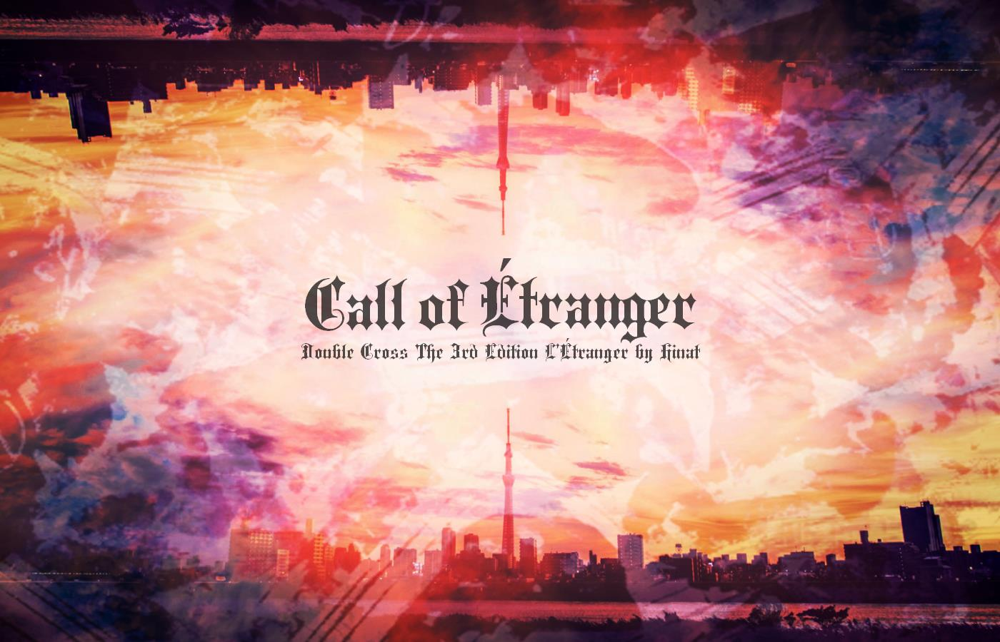

# Call of Étranger〜異邦人の喚び声〜 — PL 向事前公開資料

> 〔**Double Cross 3rd ×（克蘇魯神話）** 跨系統轉換劇本・玩家事前公開資料〕PL 3〜4 人。可先行閱覽的公開資訊（劇本資料、生涯路徑・路易絲、探索者 HO、特殊規則）。
>
> 原作：Hinat／灯蔭市の帽子屋。本檔為非官方繁中翻譯，僅供持有正版者個人遊玩參考。用語依 [`DX3_譯名對照表.md`](DX3_譯名對照表.md)。

---

## PL 向資訊

### ■預告（Trailer）

> 平淡無奇的日常之中，存在著「非日常」。
> 對你而言，那在某種意義上正是「日常」。
> 世界就是如此輕易地變貌。
> 你應該早就親身體會過了。
>
> 然而──今日的「那」，與昨日為止的「那」並不相同。
>
> 在似是而非的非日常裡，以覺醒的力量，
> 迎擊襲來的狂氣。
> 你必須持續抗拒下去。
>
> Double Cross The 3rd Edition　莉特蘭潔（リトランジェ）
> 『Call of Étranger ～異邦人的喚聲～』
>
> ──有個喚著誰、喚著什麼的聲音

### ■劇本資料

| 項目 | 內容 |
|---|---|
| 人數 | 3～4 人 |
| 時間 | 語音團 4～6 小時 |
| 階段（ステージ） | N 市（通常階段） |
| 經驗值 | 新建+4 點（相當於 2 個簡易效果） |

**劇情大綱**

> 原本過著普通「日常」的 PC 們，回過神來不知何時竟成了超越者。從一幕不可思議的光景開始，被捲入種種匪夷所思事件的 PC 們，是否能夠平安回到日常？

**特記**

- 傾向（CoC：DX3＝5：5）
- 有特殊規則
- 以「假如 CoC 的探索者成為超越者會如何」為前提，採【將探索者轉換（convert）後遊玩】的「假如」劇本。遊玩時前提為 PC 們擁有至今為止在 CoC 中的經歷。

**必備**

- CoC：CoC 的角色卡、克蘇魯神話 TRPG
- DX3：規則書 1、規則書 2

**可使用的補充資料**

- 由 GM 自行決定
- ※「Crawling Chaos（クロウリングケイオス）」僅限生涯路徑部分（阿撒托斯症狀《アザトースシンドローム》、覺醒：神命、經歷：曼哈頓的慘劇 皆不可選擇）

**適合這樣的人**

- ◎平常玩 CoC，但也想試試 Double Cross 的人
- ◎想讓探索者成為超越者
- ◎對 UGN、FH 等組織還不太了解
- ○想玩一場略為與眾不同的 Double Cross
- ○想玩規則書所刊載官方劇本以外的新手劇本
- △想以 UGN 為主玩組織題材
- △想玩「正統的 Double Cross」
- ×想詳細設定成為超越者的覺醒理由
- ×想玩 PC 編號角色定位明確的 HO

**PC 製作提示**

- PC 強度預設為範例角色等級。攻擊手最好取得《集中力》《コンセントレイト》2Lv，且命中判定的骰子至少能擲 7 顆。
- 若攻擊手少於半數，戰鬥難度提高的可能性很高。
- 完全沒有倫理觀的罪犯、或過於不合作的 PC，有可能不適合本劇本。即使不積極，也建議使用能夠協助 NPC（UGN 一方）的 PC。
- 劇本方除上述 PC 選擇之外，不會對之後角色卡的處理方式加以限制。引退的探索者、平常不可能相遇的探索者組合等等，希望各位享受各種「假如」的可能性。

### ■生涯路徑・路易絲

- 工作（ワークス）：選擇接近探索者職業者（UGN 工作以外） or 變節者存在（レネゲイドビーイング）。
- ※將工作設為變節者存在時，若原本並非人外的探索者，建議取得《起源：人類》《オリジン：ヒューマン》。

- 掩護用身份（カヴァー）：記載探索者的職業。

- 邂逅：選擇神話事象，對象的路易絲為『謎之聲』（推薦感情　P：親近感／N：脅威）。
（※由於 PC②會與劇本路易絲重複，在沒有 D 路易絲的情況下，劇本開始時的路易絲僅為三個固定路易絲。）

- 固定路易絲：務必取得三個。但不可將規則書或補充資料中刊載的 Double Cross 官方 NPC 作為初期固定路易絲。

- 以下 D 路易絲不可選擇：
　賢者之石／愚者之黃金／輪迴之獸／遺產繼承者／無瑕之石／黃泉歸來／被選中者／伸張正義者／UGN 專用／FH 專用／通常階段外／HR 記載的 D 路易絲
- ※LM-No.60、61、93～95 僅限符合解說內容的探索者。

### ■劇情提示（HO）

> 本劇本中，請各位分別選擇一個『探索者 HO』與一個『劇本 HO』。
> 劇本 HO 不可重複，但探索者 HO 可以重複。

※本劇本中的 HO 是出發地點、或牽涉頻率較高之 NPC 的差異，並沒有 PC 編號各自的角色定位。

- PL 為 3 人時，採 PC①～PC③。
- 將工作設為變節者存在時，若原本並非人外的探索者，建議取得『起源：人類』。
- PC 們對自己是超越者一事並無自覺。
- 不會說日語的外國人、人外探索者亦可選擇。

#### 【HO 的範例】

**・延續探索者的 PC②**
工作／掩護用身份：任意／任意
路易絲：賽蒂（推薦感情　P：庇護／N：憐憫）

> 你做了一個不可思議的夢。除此之外，你本應一如往常地過著日常。
> 那個謎之聲令你在意。是的，那肯定是預兆。
> 你被泥巴般的怪物襲擊並擄走。
> 你「又」被捲入了什麼之中。

**・失落（Lost）探索者的 PC②**
工作／掩護用身份：任意／任意
路易絲：謎之聲（推薦感情　P：親近感／N：脅威）

> 你那時候確實應該已經死了。然而不知為何卻這樣活著。是因為神話事象而復活了嗎，又或者「死亡的記憶」本身就是個錯誤？
> 那個謎之聲令你在意。是的，那肯定是預兆。
> 你被泥巴般的怪物襲擊並擄走。
> 你「又」被捲入了什麼之中。

#### 探索者 HO

##### ■延續探索者
工作／掩護用身份：任意／任意

> 你做了一個不可思議的夢。除此之外，你本應一如往常地過著日常。

##### ■失落（Lost）探索者
工作／掩護用身份：任意／任意

> 你那時候確實應該已經死了。然而不知為何卻這樣活著。是因為神話事象而復活了嗎，又或者「死亡的記憶」本身就是個錯誤？

##### ■SAN0 探索者
工作／掩護用身份：任意／任意

> 你做了一個不可思議的白日夢。或許是以此為契機，你回復了正氣，正打算回到從前的日常。

##### ■別時代探索者（現代以外）
工作／掩護用身份：變節者存在（建議起源：人類）／任意

> 你回過神來，發現自己身處與方才不同的地方。那是個你完全沒有印象的陌生土地，你就這樣被困在那種地方動彈不得。

※別時代探索者等原本並非人外的變節者存在，其出身：突然的覺醒／轉生體／孤獨之魂／使命／強制解放／天之注視／謎之出生
（為何身為變節者存在的詳細理由，請不要設定。）

#### 劇本 HO

##### ■PC①
推薦探索者：延續／SAN0〉別時代
路易絲：賽蒂（推薦感情　P：庇護／N：憐憫）

> 你在 N 市中央公園與異國的孩子・賽蒂相遇。
> 明明應該是初次見面，卻不知為何令你在意的這個不可思議的孩子，似乎失憶了，只記得自己的名字。

##### ■PC②
推薦探索者：全部
路易絲：謎之聲（推薦感情　P：親近感／N：脅威）

> 那個謎之聲令你在意。是的，那肯定是預兆。
> 你被泥巴般的怪物襲擊並遭到綁架。
> 你「又」被捲入了什麼之中。

##### ■PC③
推薦探索者：全部
路易絲：山吹旭（推薦感情　P：誠意／N：隔閡）

> 黃昏時分，你突然遭到泥巴般的怪物襲擊。
> 出手相救的偵探・山吹說你已成為超人，
> 並拜託你一起協助調查事件。

##### ■PC④
推薦探索者：延續／SAN0／別時代〉失落
路易絲：PC②（推薦感情　P：任意／N：不安）

> 黃昏時分，你看見泥巴般的怪物擄走了人。
> 難道「又」有匪夷所思的事件正在發生嗎？
> 出於好奇心，又或是善意，你決定追在那怪物身後。

### ■特殊規則

#### 【人脈（コネ）】

> PC 全員皆為覺醒框（覚醒枠），因此本劇本中不可取得道具『人脈：UGN 幹部』（規則 1-P.179）。

#### 【〈克蘇魯神話〉】

> 依探索者的克蘇魯神話技能之技能值，決定技能 LV 與骰數。
> 此技能無法以分配經驗值來成長。可獲得侵蝕率帶來的骰子加值。

| 技能值 | 骰式 |
|---|---|
| 0～9% | （1+骰子加值）dx+0 |
| 10～19% | （1+骰子加值）dx+1 |
| 20～29% | （2+骰子加值）dx+2 |
| 30～39% | （3+骰子加值）dx+3 |
| …… | …… |

※此外，GM 亦可在團中將以下規則作為選擇規則（オプションルール）套用。若使用選擇規則，須事先向 PL 商量・告知。

#### 【正氣度喪失】

> 本劇本中，比照 CoC 進行正氣度喪失擲骰。此外，可於團結束後進行正氣度回復。

- 初期 SAN 值：CoC 中的［最終 SAN 值］

※現在 SAN 值不明的探索者：［初期 SAN 值］-10-［克蘇魯神話技能］之值

※SAN0 探索者：團中再行告知

---

※次頁以後為 GM 向資訊。擔任 PL 者請勿閱讀。

---

---

> ＊ 本文件為《Call of Étranger》之繁中翻譯。原作著作權屬 Hinat（灯蔭市の帽子屋）所有；譯文僅供持有正版者個人遊玩參考。
