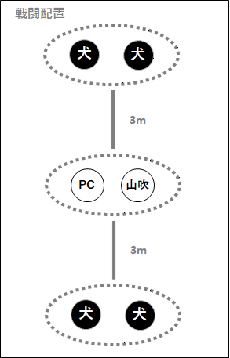
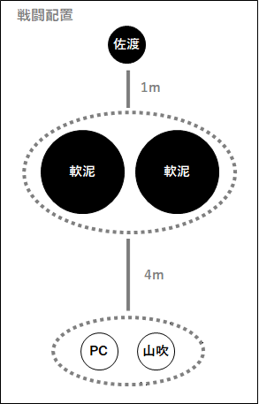

# Call of Étranger〜異邦人の喚び声〜 — 完整劇本（GM 向）

> 〔**Double Cross The 3rd Edition ×（克蘇魯神話 TRPG）** 跨系統轉換劇本・**GM 向全劇透**〕本檔含完整劇情、真相與 NPC 數據，**玩家請勿閱讀**。PL 3〜4 人。
>
> 給克蘇魯神話 TRPG 探索者「轉生」進 DX3 世界的入坑橋樑劇本：平行世界、異邦人、來自泥沼的怪物與邪神的喚聲。為「莉特蘭潔（リトランジェ）」戰役第一章。
>
> 原作：Hinat／灯蔭市の帽子屋（《DoubleCross The 3rd Edition》×《克蘇魯神話 TRPG》二次創作）。本檔為非官方繁中翻譯，僅供持有正版者個人遊玩參考。用語依 [`DX3_譯名對照表.md`](DX3_譯名對照表.md)。

---

## 本檔內容（請用左側目錄導覽）

- **PL 向資訊／GM 向資訊**：劇本資料、HO、特殊規則、機關、NPC、原創敵人效果
- **開場階段**：場景 1〜6（含延續／失格／SAN0／異時代 探索者別開場）
- **中段階段＋觸發事件**：場景 7〜14、情報收集、中段戰鬥、NPC 數據
- **高潮階段**：場景 15、高潮戰鬥、佐渡／不定形軟泥 數據、戰鬥後
- **結尾階段＋賽後**：場景 16〜20、經驗值、後記、參考文獻

## PL 向資訊

### ■預告（Trailer）

> 平淡無奇的日常之中，存在著「非日常」。
> 對你而言，那在某種意義上正是「日常」。
> 世界就是如此輕易地變貌。
> 你應該早就親身體會過了。
>
> 然而──今日的「那」，與昨日為止的「那」並不相同。
>
> 在似是而非的非日常裡，以覺醒的力量，
> 迎擊襲來的狂氣。
> 你必須持續抗拒下去。
>
> Double Cross The 3rd Edition　莉特蘭潔（リトランジェ）
> 『Call of Étranger ～異邦人的喚聲～』
>
> ──有個喚著誰、喚著什麼的聲音

### ■劇本資料

| 項目 | 內容 |
|---|---|
| 人數 | 3～4 人 |
| 時間 | 語音團 4～6 小時 |
| 階段（ステージ） | N 市（通常階段） |
| 經驗值 | 新建+4 點（相當於 2 個簡易效果） |

**劇情大綱**

> 原本過著普通「日常」的 PC 們，回過神來不知何時竟成了超越者。從一幕不可思議的光景開始，被捲入種種匪夷所思事件的 PC 們，是否能夠平安回到日常？

**特記**

- 傾向（CoC：DX3＝5：5）
- 有特殊規則
- 以「假如 CoC 的探索者成為超越者會如何」為前提，採【將探索者轉換（convert）後遊玩】的「假如」劇本。遊玩時前提為 PC 們擁有至今為止在 CoC 中的經歷。

**必備**

- CoC：CoC 的角色卡、克蘇魯神話 TRPG
- DX3：規則書 1、規則書 2

**可使用的補充資料**

- 由 GM 自行決定
- ※「Crawling Chaos（クロウリングケイオス）」僅限生涯路徑部分（阿撒托斯症狀《アザトースシンドローム》、覺醒：神命、經歷：曼哈頓的慘劇 皆不可選擇）

**適合這樣的人**

- ◎平常玩 CoC，但也想試試 Double Cross 的人
- ◎想讓探索者成為超越者
- ◎對 UGN、FH 等組織還不太了解
- ○想玩一場略為與眾不同的 Double Cross
- ○想玩規則書所刊載官方劇本以外的新手劇本
- △想以 UGN 為主玩組織題材
- △想玩「正統的 Double Cross」
- ×想詳細設定成為超越者的覺醒理由
- ×想玩 PC 編號角色定位明確的 HO

**PC 製作提示**

- PC 強度預設為範例角色等級。攻擊手最好取得《集中力》《コンセントレイト》2Lv，且命中判定的骰子至少能擲 7 顆。
- 若攻擊手少於半數，戰鬥難度提高的可能性很高。
- 完全沒有倫理觀的罪犯、或過於不合作的 PC，有可能不適合本劇本。即使不積極，也建議使用能夠協助 NPC（UGN 一方）的 PC。
- 劇本方除上述 PC 選擇之外，不會對之後角色卡的處理方式加以限制。引退的探索者、平常不可能相遇的探索者組合等等，希望各位享受各種「假如」的可能性。

### ■生涯路徑・路易絲

- 工作（ワークス）：選擇接近探索者職業者（UGN 工作以外） or 變節者存在（レネゲイドビーイング）。
- ※將工作設為變節者存在時，若原本並非人外的探索者，建議取得《起源：人類》《オリジン：ヒューマン》。

- 掩護用身份（カヴァー）：記載探索者的職業。

- 邂逅：選擇神話事象，對象的路易絲為『謎之聲』（推薦感情　P：親近感／N：脅威）。
（※由於 PC②會與劇本路易絲重複，在沒有 D 路易絲的情況下，劇本開始時的路易絲僅為三個固定路易絲。）

- 固定路易絲：務必取得三個。但不可將規則書或補充資料中刊載的 Double Cross 官方 NPC 作為初期固定路易絲。

- 以下 D 路易絲不可選擇：
　賢者之石／愚者之黃金／輪迴之獸／遺產繼承者／無瑕之石／黃泉歸來／被選中者／伸張正義者／UGN 專用／FH 專用／通常階段外／HR 記載的 D 路易絲
- ※LM-No.60、61、93～95 僅限符合解說內容的探索者。

### ■劇情提示（HO）

> 本劇本中，請各位分別選擇一個『探索者 HO』與一個『劇本 HO』。
> 劇本 HO 不可重複，但探索者 HO 可以重複。

※本劇本中的 HO 是出發地點、或牽涉頻率較高之 NPC 的差異，並沒有 PC 編號各自的角色定位。

- PL 為 3 人時，採 PC①～PC③。
- 將工作設為變節者存在時，若原本並非人外的探索者，建議取得『起源：人類』。
- PC 們對自己是超越者一事並無自覺。
- 不會說日語的外國人、人外探索者亦可選擇。

#### 【HO 的範例】

**・延續探索者的 PC②**
工作／掩護用身份：任意／任意
路易絲：賽蒂（推薦感情　P：庇護／N：憐憫）

> 你做了一個不可思議的夢。除此之外，你本應一如往常地過著日常。
> 那個謎之聲令你在意。是的，那肯定是預兆。
> 你被泥巴般的怪物襲擊並擄走。
> 你「又」被捲入了什麼之中。

**・失落（Lost）探索者的 PC②**
工作／掩護用身份：任意／任意
路易絲：謎之聲（推薦感情　P：親近感／N：脅威）

> 你那時候確實應該已經死了。然而不知為何卻這樣活著。是因為神話事象而復活了嗎，又或者「死亡的記憶」本身就是個錯誤？
> 那個謎之聲令你在意。是的，那肯定是預兆。
> 你被泥巴般的怪物襲擊並擄走。
> 你「又」被捲入了什麼之中。

#### 探索者 HO

##### ■延續探索者
工作／掩護用身份：任意／任意

> 你做了一個不可思議的夢。除此之外，你本應一如往常地過著日常。

##### ■失落（Lost）探索者
工作／掩護用身份：任意／任意

> 你那時候確實應該已經死了。然而不知為何卻這樣活著。是因為神話事象而復活了嗎，又或者「死亡的記憶」本身就是個錯誤？

##### ■SAN0 探索者
工作／掩護用身份：任意／任意

> 你做了一個不可思議的白日夢。或許是以此為契機，你回復了正氣，正打算回到從前的日常。

##### ■別時代探索者（現代以外）
工作／掩護用身份：變節者存在（建議起源：人類）／任意

> 你回過神來，發現自己身處與方才不同的地方。那是個你完全沒有印象的陌生土地，你就這樣被困在那種地方動彈不得。

※別時代探索者等原本並非人外的變節者存在，其出身：突然的覺醒／轉生體／孤獨之魂／使命／強制解放／天之注視／謎之出生
（為何身為變節者存在的詳細理由，請不要設定。）

#### 劇本 HO

##### ■PC①
推薦探索者：延續／SAN0〉別時代
路易絲：賽蒂（推薦感情　P：庇護／N：憐憫）

> 你在 N 市中央公園與異國的孩子・賽蒂相遇。
> 明明應該是初次見面，卻不知為何令你在意的這個不可思議的孩子，似乎失憶了，只記得自己的名字。

##### ■PC②
推薦探索者：全部
路易絲：謎之聲（推薦感情　P：親近感／N：脅威）

> 那個謎之聲令你在意。是的，那肯定是預兆。
> 你被泥巴般的怪物襲擊並遭到綁架。
> 你「又」被捲入了什麼之中。

##### ■PC③
推薦探索者：全部
路易絲：山吹旭（推薦感情　P：誠意／N：隔閡）

> 黃昏時分，你突然遭到泥巴般的怪物襲擊。
> 出手相救的偵探・山吹說你已成為超人，
> 並拜託你一起協助調查事件。

##### ■PC④
推薦探索者：延續／SAN0／別時代〉失落
路易絲：PC②（推薦感情　P：任意／N：不安）

> 黃昏時分，你看見泥巴般的怪物擄走了人。
> 難道「又」有匪夷所思的事件正在發生嗎？
> 出於好奇心，又或是善意，你決定追在那怪物身後。

### ■特殊規則

#### 【人脈（コネ）】

> PC 全員皆為覺醒框（覚醒枠），因此本劇本中不可取得道具『人脈：UGN 幹部』（規則 1-P.179）。

#### 【〈克蘇魯神話〉】

> 依探索者的克蘇魯神話技能之技能值，決定技能 LV 與骰數。
> 此技能無法以分配經驗值來成長。可獲得侵蝕率帶來的骰子加值。

| 技能值 | 骰式 |
|---|---|
| 0～9% | （1+骰子加值）dx+0 |
| 10～19% | （1+骰子加值）dx+1 |
| 20～29% | （2+骰子加值）dx+2 |
| 30～39% | （3+骰子加值）dx+3 |
| …… | …… |

※此外，GM 亦可在團中將以下規則作為選擇規則（オプションルール）套用。若使用選擇規則，須事先向 PL 商量・告知。

#### 【正氣度喪失】

> 本劇本中，比照 CoC 進行正氣度喪失擲骰。此外，可於團結束後進行正氣度回復。

- 初期 SAN 值：CoC 中的［最終 SAN 值］

※現在 SAN 值不明的探索者：［初期 SAN 值］-10-［克蘇魯神話技能］之值

※SAN0 探索者：團中再行告知

---

※次頁以後為 GM 向資訊。擔任 PL 者請勿閱讀。

---

## GM 向資訊

### ■故事

> 這是來到了似是而非的平行世界的探索者們的故事。

> 原本應如往常般過著日常的 PC 們，某天因為看見了一幕不可思議的光景，在不知不覺間覺醒成為超越者。

> 就在那期間，他們在 N 市與不定形軟泥遭遇。PC①、②與賽蒂被這怪物擄走，PC③、④則協助偵探山吹。

> 在被擄者集中收容的廢棄大樓會合的 PC 們，從山吹口中得知自己成為了能夠對抗神話生物的特殊超越者『異邦人』，並聽聞了失蹤事件一事。

> 失蹤事件是身為佐比賣黨員的佐渡，為了與邪神接觸而尋找必要的『守密者（キーパー）』所引發的。當與佐渡對峙時，他將與自己持有的石頭產生共鳴的賽蒂稱作『守密者』並擄走。

> 只要打倒不定形軟泥及其本體佐渡，事件即可解決，並能從廢棄大樓脫出。

> 回到日常的 PC 們，日後被山吹叫了出去。然後得知如今所在之處乃是平行世界，而非日常尚未結束，才正要開始。

### ■概念

> 想讓正在玩 CoC、對 Double Cross 有興趣的人，即使不太理解世界觀也來玩玩 Double Cross。沒錯，就是轉換劇本。這是一個「想把 CoC 的 PL 招攬到 Double Cross 來呀～～～」的劇本。（請盡量對 Double Cross 新手溫柔一些。）

> 為了方便理解，採用了封閉式（クローズド）、偏 CoC 的故事，並減少了 Double Cross 特有的組織要素等。此外，藉由使用既有的 PC，便不必重新思考角色設定與 RP 方向，目的是讓玩家更容易把資源投注在系統理解上。

### ■使用規約

- 使用本劇本時，視為已同意以下使用規約。擔任 GM 前務必確認。
　https://www.pixiv.net/novel/show.php?id=16139150

### ■諸注意

- 擔任 GM 前，希望各位確認劇本是否已更新。
　https://ypsilon.booth.pm/items/3318854

- PL 資訊的【特記】中雖記載為「假如」的故事，但若有 PL 覺得探索者來到平行世界是一種偷襲（騙し討ち），可以僅對該通關 PL 從一開始就告知這是平行世界。不過，就劇本的立場而言，平行世界要到劇本終盤才會提及，因此請勿忘記對未通關 PL 的顧慮。

- DX3 雖有『給予致命一擊』（規則 1-P.247）的規則，但本劇本中的『神話生物』即使未給予致命一擊，也以戰鬥後死亡來處理。

- 賽後（After Play）中亦會後述，但團後角色卡的處理方式交由 PL 決定。

- 『～異邦人的喚聲～』乃所謂的日文標題，原題為『Call of Étranger』。此外『莉特蘭潔（リトランジェ）』是以本劇本為第 1 章的戰役（Campaign）名稱。
※由於幾乎沒有戰役的劇透，已通關的 PL 閱讀本劇本也沒有問題。

※基本上請將其作為一個略留謎團的單篇（モノプレイ）劇本來遊玩。
「這裡到底是怎麼回事？」之類的地方，多半是與戰役相連的部分。戰役劇本於 2021 年 10 月時點正在熱烈試玩中，但是否公開，取決於試玩結果，以及作者在能否不被作業打擊到心折、整理出資料的氣力。
22/04/30 追記　戰役的試玩已完整跑完一次。由於難度偏高、調整不易，目前預定僅提供給有意願者。若本劇本廣為流傳，或收到希望出續篇的呼聲，或許會公開。

### ■機關（ギミック）

#### 【平行世界】

> 本劇本最大的機關，是 PC 們以看見不可思議的光景為契機，來到了平行世界，並成為超越者。將探索者原本所在的世界稱為 CoC 世界線、本劇本的世界稱為 DX 世界線，將來自並非 DX 世界線之平行世界者稱為『異邦人』，以下皆如此記載。

> 平行世界最大的差異，在於只有 CoC 世界線才存在克蘇魯神話中的邪神與神話生物，而只有 DX 世界線才存在變節者病毒與超越者。

> 圍繞著原本不存在於 DX 世界線的神話生物與異邦人的故事，即為本劇本，亦即莉特蘭潔戰役。

> 異邦人雖會對世界感到違和，但不會立刻察覺到這是平行世界。因為 DX 世界線中有著與 CoC 世界線幾乎相同的存在與環境。不過，由於平行世界的同一存在不會同時存在，目前尚不清楚究竟是被替換（入れ替わった）了，還是被取而代之（成り替わった）了。

> 在來自平行世界的異邦人之中，也有像神話生物那樣原本不存在於 DX 世界線的存在。這類存在會以由變節者病毒構成的變節者存在的形式被誕生出來。別時代探索者的工作之所以被指定為變節者存在，便是出於此因。
> 若非別時代探索者的 PC 是變節者存在，GM 須留意：DX 世界線的該 PC 已經死亡，或是原本就不存在的存在。

> 此外，異邦人即使是使用不同語言者，也能夠隱約地溝通意思。感覺上就像是用隻字片語在交談。若取得了天縱之才《ノイマン》的《杜立德醫生》《ドクタードリトル》（規則 2-P.149），則應能毫無問題地對話。
> ※參考了異界來訪者（CE-P.89）。

#### ●相同 HO 的探索者

> 本劇本中，亦可讓某劇本裡相同 HO 的探索者齊聚一堂來遊玩。
> 只要 PC 們不詳細談論自己所經歷的神話事象，應該不會立刻對「有著相同境遇的人」這件事感到違和。
> 問題在於出身已確定、必然只該有一人的 HO──例如「○○家的長男」之類。當然是可以同桌的（※），但必須思考其在 DX 世界線的處理方式。
> 妥當的處理是：其中一方視為 DX 世界線存在的人，另一方則視為不曾存在，讓其工作選擇變節者存在。或者，設定為雙胞胎、兄弟姊妹之類也很有趣。

※雖然前述「平行世界的同一存在不會同時存在」，但若是相同 HO，只要名字、外貌、思想不同，不就不能稱為同一存在了嗎？

#### ●出身地・居住地的問題

> 為了能參照規則書、方便理解，同時也是預設探索者多半為日本人，因此將階段設為東京近郊的 N 市。
> 然而，依探索者不同，也可能並非出身東京。失落探索者或別時代探索者的情況無須特別考慮，但若非如此（例如有 3 名延續・SAN0 探索者，其中 1 人出身不同等情況），就需要請玩家思考 PC 為何會在 N 市。
> 極端而言，身為平行世界之人的 PC 未必過著幾乎相同的生活，因此即使 DX 世界線與 CoC 世界線的所在地有所差異也沒有問題。不過，若要讓 PL 在未被告知這是平行世界的情況下也能毫無違和地融入劇本，比起突然被丟到陌生的地方，還是思考一個「身在 N 市也不奇怪」的理由比較好。
> 若是並非居住於日本的探索者（外國人等），則與 PL 商量後，設定為「因某些緣故暫時滯留於日本東京近郊，而有機會造訪 N 市」會比較順暢。

#### 【路易絲】

##### ●謎之聲

> 異邦人從 CoC 世界線來到 DX 世界線時，在一片白色空間中所聽見的、不知是何人發出的謎之聲。
> PC 只要對這個『謎之聲』結有路易絲，便能憑藉奇妙的親近感或既視感，認識（辨識）出異邦人及神話生物。若未結有路易絲，PC 便不會感受到這種奇妙的親近感，GM 須留意。

#### 【正氣度喪失】

> 本劇本中，將 Double Cross 的『暴走』與 CoC 的『發狂』視為相似之物。
> 若已取得 PL 的同意，可作為選擇規則進行〈正氣度喪失〉擲骰。在此情況下，喪失值取 CoC 中的約 1/2（例：1/1d8→1/1d4）。倘若劇本中的〈正氣度喪失〉擲骰使正氣度歸 0，則視為發生衝動判定。
> 此外，請於團結束後給予正氣度回復的報酬。

> 將正氣度喪失值設為 1/2，乃基於以下理由。請勿為了調整難度而變更此值。

- 首先，遊戲系統本身並非 CoC。
- 身為探索者的 PC 們，是比 DX 世界線之人更習慣神話事象的異邦人。
- 因來到平行世界而成為變節者存在的神話生物，已不再是與此前完全相同的存在。

### ■NPC

### <賽蒂（セティー）>
> 「對、不起……我什麼都不記得了……」

中性、黑髮褐膚、容貌帶有異國風情的孩子。看起來不像日本人，但溝通上似乎沒有問題。身上戴著鑰匙般的項鍊。
似乎失憶了，除了名字以外沒有任何關於自身的記憶。然而對大人、尤其是穿著黑衣的男性懷有警戒心。對於令他感到親近感的 PC 們則沒那麼戒備。

**基本數據**

| 項目 | 內容 |
|---|---|
| 血統（ブリード） | 不明 |
| 症狀 | 不明 |
| 工作／掩護用身份 | 變節者存在／迷途孩童（迷子） |
| 性別／年齡 | 不詳／十幾歲中段 |
| 第一人稱／第二人稱 | ワタシ／アナタ |

> ※第一人稱為了不與山吹重複而設為「ワタシ」，但可變更。性別與口吻皆由 GM 任意決定。
> ※立場（スタンス）：基本上聽從 PC 的行動方針。台詞描寫雖少，但作為不會成為敵人的友方 NPC，請 GM 在不被討厭的程度內，依自己的喜好進行 RP。

### <「小小偵探（リトル・ホームズ）」> <山吹旭（やまぶき あさひ）>
> 「我沒辦法對有困難的人坐視不管。畢竟我是偵探嘛。」

童顏且身高僅 155cm，因而常被當成年輕人看待，這點他雖有些在意，但也已經習慣了。性格穩重，為了幫助有困難的人而成為偵探。
他是一名因被捲入神話事象而陷入狂氣、曾住進精神科的前探索者，但與 PC 們一樣突然來到了平行世界，是個異邦人。在那當下他取回了正氣，並憑藉至今為止身為探索者的經驗以及天縱之才《ノイマン》的思考能力，察覺到自己所在之處乃是平行世界。
得知平行世界中也發生著神話事象後，他作為 UGN 非法者（イリーガル）開始積極協助，異邦人對策班「莉特蘭潔」便因此設立。

**基本數據**

| 項目 | 內容 |
|---|---|
| 血統（ブリード） | 混血（クロスブリード） |
| 症狀 | 天縱之才《ノイマン》／固有結界《オルクス》 |
| 工作／掩護用身份 | 偵探／偵探 |
| 性別／年齡 | 男／34 |
| 第一人稱／第二人稱 | 僕／君、あなた |

> ※立場（スタンス）：雖不想牽連一般人，但以解決事件為優先。為了不讓突然成為超越者的 PC 們更加混亂，基本上直到結尾階段為止都不會告知這裡是平行世界。

### <「佐比賣黨員（さひめとういん）」> <佐渡（さわたり）>
> 「神，是不是、不、在、這裡呢？」

本劇本中引發失蹤事件的黑袍男子。是被不定形軟泥(*1)所佔據的佐比賣黨員(*2)之一。說話方式會奇怪地斷句，面無表情也是因此之故。
因來到 DX 世界線而成為變節者存在，並擁有了某種程度的智性。他將當時在場的其他員工與動物，當作自己的分體──不定形軟泥與不定形之犬(*3)──來使役。
由於與克托尼亞人（クトーニアン）之間的心電感應斷絕，他正試圖以從來自憂戈斯者（米‧戈／ミ＝ゴ）那裡聽來的情報為基礎，再度嘗試接觸。

> ※克蘇魯邪教・現在（クトゥルフカルト・ナウ）
> 　*1……P.36、122
> 　*2……P.36
> 　*3……P.122
> ※P.122 為刊載劇本中所記載的數據，閱覽時請注意。

**基本數據**

| 項目 | 內容 |
|---|---|
| 血統（ブリード） | 純粹種（ピュアブリード） |
| 症狀 | 變換自在《エグザイル》 |
| 工作／掩護用身份 | 變節者存在／狂信者 |
| 性別／年齡 | 男／44 |
| 第一人稱／第二人稱 | 俺／お前 |

### <同僚>

與 PC 們同樣是異邦人的超越者，UGN 異邦人對策班「莉特蘭潔」的一員。
原本與山吹一同調查失蹤事件，卻在分頭行動時被不定形軟泥抓住。在被擄去的地方，一邊照料其他異邦人一邊探查狀況，並與外部取得聯繫。

> ※立場（スタンス）：本劇本中，會做出為保護失蹤者而待命之類的行動，不參與戰鬥。終究只是 NPC，解決事件的選擇與戰鬥應由 PC 進行。
>
> ※關於同僚：GM 若願意，可讓自己的探索者作為 NPC 登場。數據組法與 PC 相同，並將固定路易絲之一結在『謎之聲』上。即使在此情況下，為了不破壞戰鬥平衡，立場也維持不變。

### ■原創敵人效果

> 以下效果的詳細內容會在劇本中隨時記載，因此無須記住。

#### 誘人入狂之存在《狂気に誘う存在》

| 項目 | 內容 |
|---|---|
| 最大等級 | 5 |
| 時機 | 自動（オート） |
| 技能 | － |
| 難易度 | 參照效果 |
| 對象 | 參照效果 |
| 射程 | 參照效果 |
| 侵蝕值 | － |
| 限制 | 神話生物 |

> 效果：使看見「誘人入狂之褻瀆存在」者萌生莫名的恐懼，引發精神異常。
> 看見神話生物的『異邦人』以外的所有角色，會發生難易度［LV×5+10］的衝動判定。此外，該場景中無法使用《結界術》《ワーディング》，持續中的《結界術》《ワーディング》會被解除。當此敵人死亡時，此效果解除。此效果不會因侵蝕率而提升等級。

> 對『異邦人』的效果如下：
>
> ・無正氣度喪失：神話生物造成的高潮（クライマックス）衝動判定，難易度為 11。
>
> ・有正氣度喪失：讓看見神話生物的『異邦人』進行〈正氣度喪失〉擲骰。一次喪失 5 點以上時，難易度 11；正氣度歸 0 時，進行難易度［LV×5+10］的衝動判定；除此之外為難易度 9。
> 　此外，神話生物造成的高潮衝動判定，不與〈正氣度喪失〉擲骰者重複。

> ※簡而言之，異邦人較不易受到影響，但普通的超越者一旦與神話生物遭遇：
> ・《結界術》《ワーディング》被無效化
> ・發狂而暴走者眾多
> ・容易因衝動而原菌化（ジャーム化）

#### 異界同胞《異界の同胞》

| 項目 | 內容 |
|---|---|
| 最大等級 | 1 |
| 時機 | 常時 |
| 技能 | － |
| 難易度 | 自動 |
| 對象 | 單體 |
| 射程 | 至近 |
| 侵蝕值 | － |
| 限制 | 神話生物 |

> 效果：憑藉不可思議的連結感受到奇妙的親近感與既視感，能夠判別出『異邦人』的效果。

### ■時間軸

> 數個月前：成為廢棄大樓
> ↓
> 一個月前：開始發生失蹤事件
> ↓
> 數日前：同僚失蹤
> ↓
> 劇本當日：與同僚取得聯繫
> ↓
> PC 們看見不可思議的光景
> ↓
> 傍晚
> PC②被綁架
> PC④看見 PC②被綁架
> ↓
> PC①與賽蒂被綁架
> PC③與山吹相遇
> ↓
> PC③、山吹與 PC④相遇
> PC①、②、賽蒂相遇
> ↓
> PC 全員、賽蒂、山吹相遇

※與同僚取得聯繫之所以間隔了一段時間，是因為昏迷的時間、與其他異邦人交談以掌握現狀的時間，加上隨身物品被沒收，沒有手機等可立即聯繫的手段之故。
※同僚將當場那些不習慣使用力量的超越者治療回復後尋求協助，請對方以簡易效果取得了聯繫。

#### 【Tips：UGN 異邦人對策班「莉特蘭潔」】

> 通稱：莉特蘭潔
> 解說：設置於 UGN 日本支部的特殊對策班。
> 　將疑似來自平行世界、會無效化《結界術》《ワーディング》並使人發狂的特殊原菌定義為『神話生物』，將平行世界之人定義為『異邦人』，負責對其進行對策的便是莉特蘭潔。
> 　異邦人的超越者皆是曾遭遇過神話事象者。或許因為如此，他們即使與神話生物相對，也能夠使用《結界術》《ワーディング》。正因如此，莉特蘭潔的成員是由異邦人的非法者所構成。

※莉特蘭潔雖然還有其他班員，但大家都因其他事件而外出，所以這次的失蹤事件只由山吹與同僚兩人負責。

※劇本中也有如上所述以【Tips：○○】整理的事項，Tips 可以口頭傳達，也可以直接作為情報提示。

## 開場階段（オープニングフェイズ）

### ■預告（Trailer）

> 平淡無奇的日常之中所存在的「非日常」。
> 那對你而言，在某種意義上正是「日常」。
> 世界就是如此輕易地變貌。
> 你應當早已親身知曉這一點。
>
> 然而──今天的「那個」，與昨日以前的「那個」有所不同。
>
> 在似是而非的非日常裡，用覺醒的力量，
> 去面對來襲的狂氣。
> 你必須持續抗拒下去。
>
> Double Cross The 3rd Edition　莉特蘭潔（リトランジェ）
> 『Call of Étranger ～異邦人的喚聲～』
>
> ──有個聲音，正在呼喚著某個人、某種東西

### 場景1：彼方傳來的喚聲（守密者場景）

#### 描寫・台詞

> 睜開眼睛時，眼前展開的是一片白。所能感受到的，也是白、白、白。換言之，是「無」。
> 你身處於一個連自身的存在都變得曖昧、甚至分不清究竟有沒有的空間之中。
> 忽然，某個人、某種東西向你問道。

> 「厭懼死亡嗎……渴望生存嗎……想要力量嗎」
> 「若是……終結……便成為……我之物吧」

> 越到後面，聲音越是微弱而難以聽清。然而，某個人確實如此期望著。

> ──啊啊，是啊。我可不想在這裡以這種方式終結。所以……

#### 結末

> 當某個人回應了那不可思議的聲音，場景結束。

#### GM 向解說

登場的 PC：無
登場的 NPC：無

這是守密者場景。不過所有 PC 都會在之後各自的登場場景裡看到這幅光景。

這是從 CoC 世界線被拋向 DX 世界線之際所看見的光景場景。所有異邦人都會知覺到這幅光景。

※關於守密者場景（ルール1-P.204）

### 場景：探索者別開場

#### 流程

1. PC②（探索者別 OP＋場景2）
2. PC④（探索者別 OP＋場景3）
3. PC③（探索者別 OP＋場景4）
4. PC①（探索者別 OP＋場景5）
5. 場景6

或

1. 探索者別 OP 全員份
2. 場景2
3. 場景3

#### ■延續探索者

##### 描寫・台詞

> 在一片純白的空間裡，不知從何處傳來聲音。
> 那不知是誰的聲音，向你、或向著不知何人地訴說著。那是一段不可思議的時間，感覺既像一瞬間，又像數分鐘，也像數小時。
>
> 忽然睜開眼，發現自己身處移動中的電車／公車內。
> 你或許會抱持著「真是個不可思議的夢」這樣的感想。而且，總覺得今天會是個與平常不同的日子。
> 你來到 N 市，剛辦完某件事。
> ─前往 PC 編號的場景─

#### ■失格探索者（Lost）

##### 描寫・台詞

> ──你死了。不，是被殺了。被某種褻瀆性的存在，又或者是被崇拜它的瘋狂之人所殺。眼前漸漸地暗了下來，最終你閉上了雙眼。
>
> 在一片純白的空間裡，不知從何處傳來聲音。
> 那不知是誰的聲音，向你、或向著不知何人地訴說著。那是一段不可思議的時間，感覺既像一瞬間，又像數分鐘，也像數小時。
>
> 在那之後，又過了多久呢。忽然，一抹柔和的橙色刺激著眼瞼。你對這種感覺感到不可思議，睜開雙眼──你正站在一片黃昏時分、陌生的大樓街區之中。
>
> 你明明確實在那一天、那一刻死去了。然而為什麼，自己會像這樣站在這裡？是因為至今所體驗過的種種不可解的事象而復活了嗎？又或者，自己曾經死去的那段記憶本身就是錯的？
> 而這股湧現而出的不可思議力量，究竟是什麼──？
> ─前往 PC 編號的場景─

##### GM 向解說

PC 會在探索者別開場知覺到「純白空間的光景」之後成為超越者，並進行登場判定。
每位的劇情提示狀況各有不同，但共通點在於：都在純白的空間裡聽見了謎之聲（場景1的描寫）。只要流程不變，可以配合各個探索者來改寫描寫。

---

##### GM 向解說（延續探索者）

登場的 PC：僅延續探索者
登場的 NPC：無

若 PC 並非變節者存在（レネゲイドビーイング），讓他在家中醒來也可以；不過為了演出場景16的違和感，安排在屋外醒來會比較方便。

---

##### GM 向解說（失格探索者）

登場的 PC：僅失格探索者
登場的 NPC：無

PC 從死去到現在過了多少時間可以任意設定，但至少已經過了數日。若難以決定，可將現在設定為 2021 年，與 PL 商量。

> 〈正氣度喪失〉明明應該死了卻還活著：1/1d3

#### ■SAN0 探索者

##### 描寫・台詞

> 任由衝動將自己交付給狂氣的日子。你心裡某處曾以為，這樣的日子會一直持續下去。然而，那樣的日常卻突然迎來終結。某一刻，彷彿是被刺眼的光照得眼花，眼前一瞬間變得一片純白。
>
> 在一片純白的空間裡，不知從何處傳來聲音。
> 那不知是誰的聲音，向你、或向著不知何人地訴說著。那是一段不可思議的時間，感覺既像一瞬間，又像數分鐘，也像數小時。
>
> 不經意間，有某種東西直接觸碰到你最重要的部分，那或許可稱之為靈魂的東西。那無從抗拒的、褻瀆性的暴力，使你的心產生質變──而它，又如同開始時那般突然地平息下來。然後，你的世界恢復了原狀。回到了毫無任何異常、一如往常的景色之中。
>
> 你的內在，確實有某種東西改變了。彷彿大夢初醒般的心境。不僅如此，你也察覺到一股從未感受過的力量正在自己體內翻騰。在尚未明白那究竟是什麼的情況下，你仍想回到原本的日常，那是個黃昏時分。
> ─前往 PC 編號的場景─

#### ■異時代探索者／變節者存在 PC

##### 描寫・台詞

> 你正過著一如往常的日常。你並不認為自己做了什麼異於平常的事。然而就在跨過某棟建築物入口的瞬間，你眼前變得一片純白。
>
> 在一片純白的空間裡，不知從何處傳來聲音。
> 那不知是誰的聲音，向你、或向著不知何人地訴說著。那是一段不可思議的時間，感覺既像一瞬間，又像數分鐘，也像數小時。
>
> 忽然，視野晃動起來。身體被強行搖晃、被反覆揉捏。你感受到那樣的衝擊與噁心感。
> 那彷彿會永遠持續下去的時間，過了一陣子後便結束了，視野恢復了正常。然而，那時的你已經站在一個完全沒有印象的地方。即使回過頭，方才所在的場所也已經連影子都沒有了。
>
> 不僅如此，你還覺得有什麼與至今不同。彷彿自己不再是自己，彷彿身體被重新改造過一般……。
> 陌生的場所、陌生的建築、陌生的機械，盡是些陌生的事物，你正不知該如何是好而呆立原地之際──。
> ─前往 PC 編號的場景─

##### GM 向解說（SAN0 探索者）

登場的 PC：僅 SAN0 探索者
登場的 NPC：無

若 PC 住進精神科病房，可在恢復正氣後、經診察取得外出許可，暫且回家一趟。

> ※在此使正氣度回復 30+1d10。

---

##### GM 向解說（異時代探索者／變節者存在 PC）

登場的 PC：僅異時代探索者／變節者存在 PC
登場的 NPC：無

> 〈正氣度喪失〉噁心感、以及移動到了不同的場所：0/1

### 場景2：泥之怪物（PC②）

#### 描寫・台詞

> ─探索者別開場─

> 當你走進人煙稀少的後巷時，傳來了狗的低吼聲。不知不覺間，數隻黑狗彷彿要阻擋去路般地將你團團圍住。
> 那些並非普通的狗。狗的表面緩緩地起伏波動。這並非眼睛的錯覺。它們以一種彷彿連「噗咕」一聲都能聽見的不自然方式，勉強維持著狗的形狀，是某種不定形的東西。
> 你正茫然失措時，不定形之犬襲了過來！

> ●Case：逃跑
> 你反射性地躲開，總算從那裡拔腿狂奔。
> 然而，那些有複數隻的怪物，宛如正在進行狩獵般追趕著你，將你逼到後巷的死路盡頭。堵住退路的犬之怪物，彷彿要將你解決掉似地再度襲來。然而，你在那一刻感受到了體內湧現的不可思議力量。如果是現在，或許能與這些傢伙對抗。
> ↓
> ●Case：抵抗
> 你以不可思議的力量成功與犬之怪物對抗。這種事，至今你應該是辦不到的。
> 或許是因為這份驚訝，你晚了一瞬才察覺。等到察覺時，從背後逼近的黑色之物已覆蓋上你的身體，你毫無還手之力，意識與身體都被黑色所吞沒。
>
> 醒來時，你身處某個塵土飛揚的房間裡。看來你的隨身物品都被沒收，並被囚禁在這個房間之中。從窗戶觀察情況，可以看出這裡似乎是廢棄大樓街區。
>
> 過了一會兒，眼前突然出現一名身著黑色長袍的男子。並沒有聽見從房門進來的聲音，他就像滲出來似地出現在那裡。那是一個面無表情、眼神有些空洞、氣氛詭異的男子。

佐渡「你，是『kī-pā（守密者）』嗎？」

> 男子毫不在意你的提問或反抗，將右手中拿著的某樣東西朝你的方向舉起。隨即又放下那隻手，發出了一聲彷彿帶著落寞的低語。

佐渡「──不是，嗎」

> 只低喃了這麼一句，男子便如同融化般地從原地消失了。

#### 結末

> 佐渡退場後，場景結束。

#### GM 向解說

登場的 PC：僅 PC②
登場的 NPC：不定形之犬、不定形軟泥

PC② 看見了不可思議的純白光景之後，遭到不定形之犬襲擊，被不定形軟泥捕獲，並被擄至廢棄大樓。
在廢棄大樓裡，PC② 被佐渡問道「你是守密者（キーパー）嗎？」，當佐渡得知不是守密者後，便立刻從原地消失。這是個演出「佐渡正在尋找『守密者』」的場景。

> 〈正氣度喪失〉看見了不定形之犬：1/1d3

> ※若已對「謎之聲」結下路易絲
> 突然被捲入不可解之事，這對你而言並不陌生。或許正因如此，你對不定形之犬感到一種既視感般的東西。

> ※這隻不定形之犬是臨演（エキストラ），因此可以不提升侵蝕率、僅以效果的演出將其擊退。

> ※若已對「謎之聲」結下路易絲
> 對明明應是初次見面的男子，也感到一種既視感般的東西。

### 場景3：那個人去了何方（PC④）

#### 描寫・台詞

> ─探索者別開場─

> 走在 N 市鬧區與廢棄大樓街區之間的你，在某個瞬間突然察覺到自己竟能使用類似超能力的東西。至今為止，這種事你應該是辦不到的。
>
> 接著引起你注意的是某種聲響。廢棄大樓街區的後巷裡，似乎有什麼人在。
>
> 你彷彿被某種東西吸引、被引導著去觀看那一幕。
> 數隻野犬般的生物正在襲擊一個人。
> 而被襲擊的人物，正以類似超能力的力量將牠們擊退。
>
> 你或許會以為這是場夢，又或者是在看特攝片的拍攝現場。然而，事情並未就此結束。
> 在 {PC②} 的背後，一隻彷彿從地面融出來的巨大泥狀怪物出現了。它將那如同嘴巴的什麼東西大大張開，緊接著便把 PC② 整個吞下，如同融化般地沒入地面消失了。犬狀的怪物也朝某處奔逃而去。
>
> 你目睹了不得了的東西。「果然又」有不可解的事件正在發生。
> 面對那種怪物，警察大概靠不住，也不會相信你吧。
>
> 這對你而言，在某種意義上是個機會。那種怪物作為練習不可思議力量的對手再合適不過，說不定還能把怪物本身給解決掉。
> 更重要的是，你的直覺正告訴你。此刻應該追上去。
> 趁現在，應該還能追上那隻怪物。

#### 結末

> 當怪物消失後，讓 PC④ 思考接下來該怎麼辦，在適當的時機結束場景。

#### GM 向解說

登場的 PC：僅 PC④
登場的 NPC：不定形之犬、不定形軟泥

PC④ 看見不可思議的純白光景之後，目擊到 PC② 遭泥狀怪物襲擊並被擄走的場景。
GM 若引導 PC「這是個使用不可思議超能力＝效果的機會」，PC 會更容易行動。

> 〈正氣度喪失〉遠遠地看見了泥之怪物：1/1d3

> ※若已對「謎之聲」結下路易絲
> 對不定形之犬感到一種既視感般的東西。

### 場景4：變化的日常（PC③）

#### 描寫・台詞

> ─探索者別開場─

> 走在人煙稀少的道路上，或許就是這一點不妙。它從黃昏時分的陰影中冷不防地現身。
> 起初看起來會像是一隻渾身泥濘的狗。然而，並非如此。狗本身就是泥！而且，那怪物似乎已將你鎖定為目標。
>
> 那隻詭異的狗以不可思議的方式伸長前肢撲了過來。你在千鈞一髮之際擺動身體，竟以不可思議的力量將犬之怪物彈飛了出去。
> 狗一邊低吼一邊重整姿勢，更進一步發動追擊。就在那一瞬間，隨著一聲「危險！」，聲音驟然歸於寂靜，一股不可思議的感覺擴散開來，槍聲響起，攻擊被偏轉開來。

山吹「趁現在牠膽怯時攻擊牠！」

> 從你背後對怪物開槍的青年，這樣對你說。
> 明明覺得自己不可能與這種怪物匹敵，但你卻在怪物面前感受到湧起的力量與衝動。說不定正如他所說，能夠打倒它。
>
> 令人吃驚的是，你竟以不可思議的力量擊退了不定形之犬。至今為止，你應該沒有這種力量。這究竟是什麼？你或許會感到這樣的困惑。
>
> 助你一臂之力的青年擔心地出聲詢問。

山吹「沒事就好。你沒受傷吧？」

##### Q：剛才的怪物和那股力量到底是什麼？

> A：「剛才那隻怪物是原菌（ジャーム），而你那股力量，我想應該是超越者（オーヴァード）的力量……難道你不知道嗎？」
> 「能像剛才的你那樣使用超常能力的人，就叫做超越者。」並簡單地說明超越者。

> 「我還沒報上名號呢。我叫山吹旭。是個偵探。」
> 「你很可能會再次被剛才那種怪物盯上。我希望能向你說明詳情──」
> 正說到這裡，青年接到一通電話。他說了句「可能是工作的事」便致歉接聽。
> 「喂……是……神話生物！？……詳細地點也查清楚了是吧。我知道了，馬上趕過去。」
>
> 「抱歉，本來想等冷靜下來再談的，但現在沒有慢慢來的時間了。希望你能跟我一起來。」
> 他以認真的表情這麼一說，便立刻奔了出去。看來想聽他說明，就只能跟上去了。

#### 結末

> 若 PC③ 答應並跟著山吹走，場景結束。

#### GM 向解說

登場的 PC：僅 PC③
登場的 NPC：山吹、不定形之犬

這是 PC③ 在看見不可思議的純白光景之後，於街上行走時遭不定形之犬襲擊，被碰巧在場的山吹所救的場景。
山吹當時正循同僚的情報前往廢棄大樓街區的途中。當他得知遭襲擊的 PC③ 是個一無所知的異邦人，便打算說明超越者的事，但在那之前，UGN 傳來了「PC① 遭襲擊的事件」與「失蹤者所在地」的情報。在那之後，PC③ 順勢與山吹一同行動。

> 〈正氣度喪失〉看見了不定形之犬：1/1d3

> ※若已對「謎之聲」結下路易絲
> 突然被捲入不可解之事，這對你而言並不陌生。或許正因如此，你對不定形之犬感到一種既視感般的東西。

> ※不可思議的感覺：山吹的《結界（ワーディング）》

> ※這隻不定形之犬是臨演（エキストラ），因此可以不提升侵蝕率、僅以演出將其擊退。

> ※若已對「謎之聲」結下路易絲
> 對青年感到一股奇妙的親近感。

### 場景5：異國的孩子（PC①）

#### 描寫・台詞

> ─探索者別開場─

> 日頭將落之際，當你走在 N 市中央公園一帶時，有什麼東西吸引了你的目光。
> 你朝那邊望去，那裡有個黑髮、膚色偏黑的孩子。那孩子似乎也正看著你，兩人「啪」地對上了視線。
> 年齡約莫是十多歲的中後段，個子不高，有著中性而帶異國風情的容貌。一看就身著異國服飾，很容易推測出並非日本人。
>
> 孩子東張西望地看了看周圍，雖然滿臉警戒，卻仍像下定決心般，戰戰兢兢地向你搭話。

セティー「那個，不好意思……！這裡，是哪裡呢……？」

> A：是 N 市中央公園
> A：「N 市中央公園……」
> 　孩子以一副不太明白的語氣鸚鵡學舌般地重複。
> Q：從哪裡來的？／父母呢？／其他還知道些什麼嗎？
> A：「我、我不知道，啊。」
> Q：名字呢？
> A：「賽蒂（セティー），啊……大概……」
> 從應答看來，這孩子的記憶似乎相當混亂。

##### 〈知覺〉判定（難易度7）

> 正打算移動到別處時，你忽然察覺。察覺到你們身上突然籠罩了一道陰影。回過頭──那裡有個巨大的黑色之物。距離太近，無法掌握它的全貌，但你憑藉那不凡的經驗，理解到自己正身處危險的狀態。
> 從那龐大的身軀中，數條泥之觸手彷彿要捕捉你們般氣勢洶洶地伸了出來。

##### 〈迴避〉判定（難易度8／知覺判定失敗則自動失敗）

> ●Case：成功　泥之觸手大幅地與你擦身而過，襲向背後恰好經過的一輛公車。橫翻的公車發出巨響爆炸，那陣爆風隨即折磨、苛虐你們的身體，奪走了你們的意識。
>
> ●Case：失敗　你被滑膩的觸手捕獲，連人帶身被吞入泥中。就這樣以非比尋常的力量被緊緊勒住，意識漸漸模糊了。

#### 結末

> 因不定形軟泥的攻擊引發公車爆炸，PC① 在失去意識的同時感受到超越者的力量，場景至此結束。

#### GM 向解說

登場的 PC：僅 PC①
登場的 NPC：賽蒂（セティー）、不定形軟泥

這是 PC① 遇見劇本路易絲（シナリオロイス）賽蒂，之後遭不定形軟泥擄走的場景。
賽蒂沒有來到此地之前的記憶，回過神時人就在 N 市中央公園。為了多少掌握一些令人不安的現狀，她向感到親近感的 PC① 搭話。PC① 越是符合「成人」「男性」「黑色衣服」這些條件，她的警戒心就越大。
稍微對話一番後，當她打算思考接下來該怎麼辦、或想換個地方時，不定形軟泥便襲了過來，將她與 PC② 一樣擄走。

> ※若已對「謎之聲」結下路易絲
> 這毫無疑問是初次見到的孩子。明明應是初次見面，卻對這孩子感到一股奇妙的親近感。

> ※即使對這番應答使用《真偽感知（真偽感知）》等，也看不出有說謊的樣子。

> 〈正氣度喪失〉認知到不定形之泥：1/1d3

> ※若已對「謎之聲」結下路易絲
> 突然被捲入不可解之事，這對你而言並不陌生。或許正因如此，你對不定形之怪物感到一種既視感般的東西。

> ※賽蒂是臨演（エキストラ），故自動失敗。

### 場景6：渴求之聲（守密者場景）

#### 描寫・台詞

> 在光線無法觸及的昏暗黑暗之中，男子獨自一人佇立著，只是不斷地呢喃著什麼。

佐渡
> 「……沒有……什麼也……」
>
> 「聽不、見……聽不見……」
>
> 「為什麼……？」
>
> 「我的神，究竟，在哪裡呢……」

> 即使如祈禱般高舉雙手，也沒有任何聲音回應。
> 男子周圍，只有彷彿要融入黑暗般的黑色泥濘在蠢動著。

#### 結末

> 淡出後，場景結束。

#### GM 向解說

登場的 PC：無
登場的 NPC：佐渡

這是守密者場景。佐比賣黨員佐渡正嘗試使用心電感應（テレパシー）卻失敗了。這是個用來演出詭異氛圍、以及「有某種事正在發生」的場景。

## 中段階段（ミドルフェイズ）

### 場景 7：行蹤不明事件（PC③④）

#### 描寫・台詞

> 山吹：「邊走邊說吧，我簡單講解一下。」

山吹（用《導きの華》變出山吹色的花朵等等）一邊展示效果，一邊先針對超越者進行說明。

【Tips：關於超越者】

> 山吹：「我是協助 UGN 的非法者（イリーガル）。」

PC③與山吹根據電話得到的情報，來到某棟廢棄大樓附近時，與一路追著犬狀怪物而來的 PC④碰面。

> 山吹：「你是……！為什麼會在這種地方……」

從 PC④口中聽到 PC②的事情後，山吹露出苦澀的表情說：「又有人被神話生物擄走了……」

> 「你們應該已經和剛才那種泥狀的犬怪物遭遇過好幾次了吧。我們把那種怪物稱作『神話生物』。」

> 「而我現在正與 UGN 合作，調查 N 市近郊發生的行蹤不明事件。一般認為這起事件和泥狀的神話生物有關。」

【Tips：行蹤不明事件】

> 「和我一起調查的同僚也在幾天前消失了，好不容易才連絡上，才知道了這個地點。據那個人說，被盯上的人似乎有共通點，而我和你們都符合這個條件。」

> 「接下來的事情——{PC③}先生，雖然剛才也說過了，但你可能還會再被那種怪物襲擊。不管怎樣都很危險，不過比起一個人，我想一起行動會更安全。可以的話，要不要一起行動呢？」

若答應，便會和山吹一起調查眼前的廢棄大樓。

> 山吹：「根據情報，被擄走的人似乎被帶進了這棟廢棄大樓。」

那棟大樓位於廢棄大樓街的一角。大樓的大廳附近有那隻黑色泥狀的犬徘徊著，窗戶都放下了百葉窗，無法窺探內部的情形。

山吹提議不要從明顯有怪物的入口正面突破，而是從隔壁大樓經由屋頂潛入。

#### 結末

潛入大樓內部後，場景結束。

#### GM 向解說

登場的 PC：僅 PC③④
登場的 NPC：山吹

PC②與④會合，由山吹說明超越者、UGN 與行蹤不明事件的場景。若有新手在場，可在此說明【Tips：關於超越者】。

【Tips：關於超越者】
・關於超越者（ルール1-P.271）
・關於變節者病毒（ルール1-P.271）
・關於 UGN（ルール1-P.274）
・關於 UGN 的活動（ルール1-P.275～276）

> ※若已與「謎之聲」結成路易絲
> PC 們彼此見面時會相互感到奇妙的親近感，而 PC④對山吹也會有同樣的感覺。

【Tips：行蹤不明事件】
・大約從一個月前開始發生
・行蹤不明者多達十幾人
・行蹤不明者消失前後，都有人作證看見泥狀的怪物，因此認為兩者有關
・不只是超越者，連一般人也行蹤不明
・被擄走的人有共通點，PC③、④與山吹皆符合

> Q：所謂的共通點是什麼？
> A：「曾遭遇過神話事象算是一個，還有——你們不覺得對我們有種親近感嗎？這也是共通點喔。」

### 場景 8：被擄走之處（PC①②）

#### 描寫・台詞

PC②：

> 在那名男子離去後沒過多久，又不知從何處冒出的泥狀怪物，把兩個人放在了那地方。
> 一人是 PC①，一人是一看就知道是異國的孩童。兩人似乎都昏迷了。

PC①：

> 回過神來，發現自己身處一間沒開燈的昏暗房間裡。怪物的攻擊／那導致巴士爆炸，被捲入其中的你身負重傷——本以為如此，但你卻毫髮無傷。然而那劇烈的疼痛，感覺卻像是真實發生過的。
> 確認狀況後，你發現除了自己之外，還有剛才一起的孩童與 PC②在這裡，而且自己的行李已經不見了。

> ※若已與「謎之聲」結成路易絲
> 彼此之間，以及對賽蒂，都感到奇妙的親近感。

> 賽蒂（對 PC①）：「你還好嗎……？」

孩童不安地四處張望，環視室內與你們。

> 賽蒂（對 PC②）：「你不是，那個奇怪傢伙的，同伴吧……？」

由於是這樣的狀況，孩童似乎連對 PC②也有所警戒，但只要加以否定，孩童就會露出稍微安心的表情。

把你們帶來的怪物目的為何不得而知。無論如何，你們都必須從這個被關起來的地方逃出去。

#### 【肉體】判定（難易度 7）／適當的簡易效果（イージーエフェクト）

可以從房間脫逃。

#### 結末

進行脫逃房間的判定後，場景結束。

#### GM 向解說

登場的 PC：僅 PC①②
登場的 NPC：賽蒂

被泥狀怪物擄走的 PC①與賽蒂，被關進和 PC②同一間房間而會合的場景。會在交談中掌握狀況，並一起從房間脫逃。

> Q：能用簡易效果或飛行狀態從窗戶脫逃嗎？
> A：依效果的內容而定，若只有自身或許可行，但其他 PC 或賽蒂就會被丟下。另外也請考量，不習慣使用效果的 PC 是否會想到從 4 樓的窗戶脫逃這種點子。
> GM 可警告 PL：大樓周圍有不定形之犬徘徊，因此無法避免戰鬥，藉此引導他們進入大樓內部。

> ※判定失敗的情況下，會由下一場景會合的 PC 們把門打開。

### 場景 9：與同胞的邂逅（PC①②③④）

#### 描寫・台詞

打開被關起來的房間時，房間裡的眾人，與從屋頂降下、正在調查大樓內部的山吹及 PC③④相遇。

> 山吹：「你們是不是被黑色泥狀怪物擄走的人？我是山吹旭，是來救援的偵探。」

山吹仔細端詳 PC 們以及賽蒂後，先說了句「可能會問些奇怪的問題」，接著繼續說：

> 山吹：「最近有沒有看過不可思議的純白光景、或聽過什麼聲音？或者突然身體能力變強、能使出像超能力一樣的力量之類的？」
> A：看過／聽過／能使用

> 賽蒂：「在一片純白的地方聽到奇怪的聲音……好像有過。也好像感覺到了不可思議的力量……」
> 山吹：「果然是這樣啊……」

山吹確認 PC 們是超越者後，便如同先前一樣說明超越者與當前狀況。

> 山吹：
> 「襲擊你們的泥狀怪物，是一種叫『原菌（ジャーム）』的超越者末路之姿。超越者過度使用力量的話，變節者病毒就會暴走，淪為任憑衝動擺布、失去理性的怪物。那就叫做原菌。」

> 「而在那些原菌之中，像今天這樣的怪物有點特殊，為了區分，我們稱之為『神話生物』。你們至今應該也見過類似那種來歷不明的怪物——也就是神話生物吧。」

> 「超越者通常能使用一種叫《ワーディング》的、可以讓非超越者的人們無效化的結界般的力量，但神話生物的特異之處在於，面對它時精神出現異常的超越者，會變得無法使用《ワーディング》。不過有一部分被稱為異邦人的超越者似乎具有耐性，是個例外，而這個例外就是在這裡的我們。」

【Tips：關於異邦人】

說明完這些後，山吹表示應該還有其他被擄走的人，想去尋找，希望大家一起行動。

樓梯附近有大樓內部的樓層地圖。雖然也有電梯，但似乎沒在運作。

【Tips：樓層地圖】

> 山吹：「1 樓入口附近有犬怪物是肯定的。我想與其亂動，不如從上往下看比較好。」

#### 結末

看過樓層地圖後決定行動方針，場景結束。山吹提議從上往下查看。

#### GM 向解說

登場的 PC：PC 全員
登場的 NPC：賽蒂、山吹

PC①②正要從被關起來的房間脫逃時，與山吹及 PC②④會合的場景。和場景 7 一樣，由山吹進行現狀說明，並追加說明關於『異邦人』的部分。

> ※若已與「謎之聲」結成路易絲
> PC 們會對彼此，以及對賽蒂、山吹感到親近感。

> ※若 PC 全員都做完自我介紹，建議在此依 PC 編號順序（①→②→③→④→①）取得 PC 之間的路易絲。讓每位 PC 至少對一人取得路易絲，藉此營造出相互之間都有牽連的狀態。

> ※關於原菌（ルール1-P.272）

【Tips：關於異邦人】
會無效化《ワーディング》並使人發狂的特殊原菌稱為『神話生物』；
能感受到奇妙親近感、且曾遭遇過神話事象、即使面對神話生物也能使用《ワーディング》的人，則稱為『異邦人』。

> ※給 PL：把異邦人＝探索者來理解就沒問題了。

【Tips：樓層地圖】
・屋頂
・4F：辦公室（PC①②所在的樓層）
・3F：保全室
・2F：辦公室
・1F：大廳、警衛室
・B1F：電氣室

### 場景 10：探索（PC③）

#### 描寫・台詞

由於大樓內部也有犬怪物徘徊，因此要一邊避免被怪物發現，一邊探索大樓內部。

##### ●保全室（3 樓）

這是一間維持電子鎖鎖閉狀態的房間。
撬開門後，室內關著數名虛弱無力的人。
行蹤不明者雖然衰弱，但肉眼可見的傷勢很少。看來把人擄來之後就放置不管了。

> ※若已與「謎之聲」結成路易絲
> 對被關起來的人們都一致感到奇妙的親近感與既視感。

山吹一邊查看眾人的狀態，一邊苦澀地低聲說道。

> 山吹：「跟聽說的一樣，行蹤不明的人們好像全都是異邦人。只能認為是有意鎖定下手的。」

##### ●〈知覺〉判定（難易度 6）

在辦公桌與辦公桌之間，掉著一本用得很舊的手帳。內容起初是些無關緊要的事，後來逐漸變成用劇烈顫抖的筆跡潦草寫下的字句，有些地方還有像是液體滲開的痕跡。
開示『某人的手帳』。

##### ●辦公室（2 樓）

如同 4 樓與 3 樓一樣，數人被關在上了電子鎖的房間裡。其中一人看見山吹後出聲喊道。

> 同僚：「啊，山吹先生！你來了啊！」
> 山吹：「太好了，你沒事……！情況如何？」
> 同僚：「大家的狀態都不太好……最好馬上送去醫院。」

【Tips：行蹤不明者的狀況】

> 山吹：
> 「衰弱的人似乎很多，要是發生無法應付的問題就糟了，所以我想請他來照看被擄走的人們。」
> 「很抱歉，希望你們就這樣繼續幫忙。現在能正常行動、能依靠的就只有你們了。」

#### GM 向解說

登場的 PC：PC③。由於是情報收集場景，建議全員登場。
登場的 NPC：賽蒂、山吹

這是一邊尋找行蹤不明的人們、一邊進行情報收集的場景。在 3 樓可以找到數名行蹤不明者與『某人的手帳』，在 2 樓可以找到山吹的同僚與其餘的行蹤不明者。

##### 『某人的手帳』

> 同事佐渡突然性情大變。
> 一直說什麼『佐比賣黨（さひめとう）』之類的。
> 記得公司的前身組織好像就叫那個名字……
> 不只如此。
> 沒有心電感應、必須接觸神、知不知道巫女在哪，諸如此類。
> 真是個莫名其妙的瘋子。難道入了什麼奇怪的宗教嗎？
> ──
> 電力系統壞了
> 大家都被殺了，變成了奇怪的泥
> 數量增加，外面也有，逃慢了
> 那傢伙是超越者嗎？
> 不知為何，一面對那些傢伙就無法使用《ワーディング》
> 雖然勉強在固守籠城，但是……
> ──
> 聽見蟲鳴的聲音 是幻聽嗎？
> 非得在這裡死掉不可嗎
> 為什麼會落得這種下場

【Tips：行蹤不明者的狀況】
・被怪物抓住時，行李被沒收了
・只要不試圖逃跑，怪物就不會襲擊、也不會接觸過來，因此大家都儘量不刺激它、乖乖待著
・非超越者居多，且行蹤不明者幾乎全員都很衰弱，因此一邊保護一邊脫逃很困難
・黑色長袍的男子逢人就問被擄來的人「『守密者（キーパー）』是你嗎？」。一般認為他是為了尋找『守密者』才引發這起事件

#### ■情報收集項目

##### ●『黑色長袍的男子』
〈情報：UGN〉難易度 7

##### ●『關於這棟大樓』
〈知識：神祕學〉難易度 6、難易度 8
〈情報：八卦〉難易度 7、難易度 9

##### ●『不定形的怪物』
〈知識：神祕學〉難易度 8
〈克蘇魯神話〉難易度 7

##### ●3 樓、2 樓的探索結束

到目前為止，連同 PC 在內共找到十多人，似乎與行蹤不明的報案數目吻合。

> 山吹：
> 「不過，像你們這樣沒報案卻被擄走的人說不定還有，姑且也確認一下樓下吧。」
> 「也得處理一下那個黑袍男子才行呢……」

#### 結末

結束情報收集，前往 1 樓後場景結束。

#### GM 向解說_2

場景 10、12 中可調查左列的項目。
針對情報收集項目的判定與調達判定，每次登場各可進行最多 1 次。
若 PC 全員判定失敗的情況重複了 2 次，可由山吹代為進行判定。

> ※補充：用〈情報：八卦〉所得知的內容，是在 CoC 世界線中也發生過的事。

##### 『黑色長袍的男子』

〈情報：UGN〉7

> 這名男子既不是 UGN 相關人士，也不是敵對組織 FH 的探員，更不是被警方盯上的那種罪犯。直到最近為止，似乎都沒有引起這樣引人注目的行動或騷動。
> 由於能感受到既視感，因此認為他是『異邦人』。

##### 『關於這棟大樓』

〈知識：神祕學〉6　〈情報：八卦〉7

> 這裡原本應該是幾個月前倒閉的一家小公司的大樓。據說發生了某種醜聞，沒怎麼收拾就變成了空置的承租單位。在那之後就沒再被當作辦公室使用，似乎也加入了廢棄大樓群的行列。

〈知識：神祕學〉8　〈情報：八卦〉9

> 這棟大樓發生的醜聞，似乎是集體失蹤事件。當時值夜班的人全部失蹤，至今仍下落不明。
> 由於這棟大樓原本是被稱為邪教組織的『佐比賣黨』旗下集團企業的子公司，因此在神祕學論壇上，有人懷疑這起事件與佐比賣黨之間的關聯性。

> ※補充：〈知識：神祕學〉以達成值 8、〈情報：八卦〉以達成值 9，可同時抽取出兩段情報。

##### 『不定形的怪物』

〈知識：神祕學〉8　〈克蘇魯神話〉7

> 多在行蹤不明者附近，於傍晚到夜間被目擊。由於精準地只擄走異邦人，因此可以確定它能夠辨識出異邦人。
> 雖然用效果能暫時打倒它，但很快就會復活。這些都只是末端，本體似乎在某處。黑色長袍的男子或許就是本體。

## 觸發事件（トリガーイベント）

### 場景 11：鑰匙的主人（PC①②③④）

#### 描寫・台詞_戰鬥前

賽蒂對 PC①以及在場的人搭話。

> 賽蒂：
> 「各位，總覺得對這種事很習慣，好像不怎麼驚訝的樣子。」
> 「事件啦怪物啦，是很常見的事情嗎……？不會害怕嗎？」

> 「還有，有件有點在意的事——」
> 「總覺得這個，應該是非常重要的東西，但又好像不是普通的項鍊……」

賽蒂給大家看的，是身上配戴的、形狀像鑰匙的項鍊。它有手掌般大小，很難想成是實用的鑰匙。

> 山吹：「可以稍微讓我看一下嗎？」

得到賽蒂同意後，山吹正要伸手去拿的瞬間，項鍊「啪嘰」一聲彈開了他的手。

> 賽蒂：「你、你沒事吧！？」
> 山吹：「這是……」

##### ●〈RC〉判定（難易度 7）

被彈開的瞬間，從項鍊感受到強烈的變節者反應。

> 山吹：「……說不定是 EX 變節者病毒。如果拿去 UGN 研究變節者病毒的地方給人看看，我想就能知道更詳細的情況了。」
> 賽蒂：「這樣啊……我知道了。」

> 山吹：「還有沒有其他在意的事，或想起來的事呢？」
> 賽蒂：「……沒有，對不起。」
> 山吹：「別在意。既然忘記了，說不定那是不想起來比較好的事……」

#### 結末

在對話告一段落的適當時機，場景結束。

#### 條件

降到 1F／試圖脫逃

#### GM 向解說

登場的 PC：PC①。建議 PC 全員登場。
登場的 NPC：賽蒂、山吹

正在看監視攝影機的佐渡，與在大樓內走動的 PC 們接觸。在靠近時，發現賽蒂就是『守密者』，於是把她擄往地下電氣室的場景。之後便與不定形之犬展開中段戰鬥。

> ※即使其他 PC 試圖觸碰，也會同樣被彈開。

> Q：EX 變節者病毒？
> A：山吹：「變節者病毒不只會侵蝕人，連動物或無機物也會侵蝕。而被侵蝕的東西就叫 EX 變節者病毒……不過，會把人彈開這種事，我倒是不太聽說過。」

### 場景 12：阻路之泥（PC①②③④）

#### 描寫・台詞_戰鬥前

降到 1 樓、前往大廳後，發現大樓的出入口及大樓周圍都有不定形的泥狀犬群徘徊。數量眾多，看來要從這裡出去很困難。

正在觀察情況時，從警衛室走出一名身穿黑色長袍般衣物的壯年男子。{PC②}認得出這就是先前那名男子。
男子明顯地望向你們這邊，並且漸漸拉近距離。

> 佐渡：「你們，要去，哪裡？不能，讓你們，逃走。回去。」

> 賽蒂：「……！」

賽蒂像是害怕逼近的男子般，躲到了 {PC①} 的身後。
隨著男子靠近而後退時，一陣騷動般，空氣彷彿沸騰般地，數隻不定形之犬從地板冒出，退路被封死。

男子更進一步靠近時，賽蒂的胸口與男子手中的某物突然像是相互呼應般發出光芒。賽蒂戰戰兢兢地把掛在脖子上的項鍊拉出來，那形似鑰匙之物正閃耀著銀色光芒。
看見它的男子像是瞪視般地凝視著賽蒂。

> 佐渡：「持有鑰匙之人！你，就是『守密者（きーぱー）』嗎……！」

男子的手臂以不可能的動作伸長，越過 PC 們的頭頂捕住賽蒂。賽蒂發出小小的悲鳴，就這樣被泥狀的手臂纏繞，被拉到男子身邊。然後他們像是溶入地板般，從那裡消失了蹤影。

> 山吹：「等、等等！」

正要追上去時，更多犬怪物像是阻擋你們去路般出現。進退兩難，首先必須打倒眼前這些不定形的泥之犬。

#### 描寫・台詞_戰鬥後

> 山吹：
> 「總算是把它們打倒了……」
> 「剛才那個男人，那種傢伙不知道會做出什麼事。不快點找到賽蒂的話，那孩子就危險了……！」
> 「那邊的警衛室也來看看吧。長袍男子是從那裡出來的，說不定能查到什麼。」

#### 結末

山吹提議為了尋找賽蒂而調查警衛室。決定下一個行動方針後，場景結束。

#### 條件

緊接在場景 11 之後

#### GM 向解說

登場的 PC：PC 全員
登場的 NPC：賽蒂、山吹、佐渡、不定形之犬

正在看監視攝影機的佐渡，與在大樓內走動的 PC 們接觸。在靠近時，發現賽蒂就是『守密者』，於是把她擄往地下電氣室的場景。之後便與不定形之犬展開中段戰鬥。

> ※若已與「謎之聲」結成路易絲
> 對於應是初次見面的男子，會感到既視感般的某種感覺。

> ※以效果而言會是以下的動作
> ①《伸縮腕》＋《妖の招き》＋《デビルストリング》
> ②《融合》
> ③《神出鬼没》

#### ■中段戰鬥

##### PL 向解說

戰鬥結束條件：全部敵人戰鬥不能

戰鬥配置：PC 與山吹同處 1 個接戰（エンゲージ），在 PC 接戰的前方與後方各相隔 3m 處，有不定形之犬×2 構成的 2 個接戰。

##### GM 向解說

###### ●戰鬥平衡
・不定形之犬的數量設為與 PC 人數相同。

###### ●戰鬥計畫

▼不定形之犬
・主要過程（メインプロセス）
　次要動作（マイナー）使用《骨の剣》製作武器。
　主要動作（メジャー）使用《伸縮腕》。對象為侵蝕率最低的 PC。

・反應（リアクション）
　使用《イベイジョン》。

▼山吹旭
　侵蝕率固定為 100%。不進行 HP 管理，也不作為攻擊對象。
　主要動作（メジャーアクション）使用「▼基於經驗法則的推理」。若有支援系的 PC，可選擇待機並使用「▼為他人之力」。基本上不待機，而是進行支援。

> 〈正氣度喪失〉PC 中有人復生（リザレクト）了：1／1d3
> 你們親眼目睹了自己或他人死去的瞬間——然而才這麼想，那一瞬間，他卻一邊流著血，一邊再次站了起來！

#### ■NPC 數據

### 不定形之犬

一隻由原菌化成的泥狀生物，外形如黑色泥犬。它能精準辨識並擄走異邦人，作為神話生物末端徘徊於大樓內外，以部隊（トループ）形式行動。

**基本數據**
| 項目 | 內容 |
|---|---|
| 種別／血統（ブリード）／症狀 | 部隊（トループ）／純粹種（ピュアブリード）／變換自在《エグザイル》 |
| 能力值 | 【肉體】5【感覺】6【精神】1【社會】2 |
| 技能 | 〈白兵〉4 |
| 侵蝕率／HP／行動值／裝甲值 | 100%（骰+3 顆）／31／13／3 |

**取得效果**（※已反映侵蝕率帶來的修正）
> ●變換自在《エグザイル》
> ・伸縮腕《伸縮腕》3Lv（ルール1-P.130）
> ・骨之劍《骨の剣》2Lv（ルール1-P.130）
> ・異形之步《異形の歩み》1Lv（ルール2-P.124）
> ・異能指尖《異能の指先》1Lv（ルール2-P.124）
> ・生體侵入《生体侵入》1Lv（ルール2-P.125）
>
> ●變節者存在（レネゲイドビーイング）
> ・源初：群落《オリジン：コロニー》2Lv（ルール2-P.329）
>
> ●敵人效果（エネミーエフェクト）
> ・迴避《イベイジョン》1Lv（ルール1-P.328）
> ・誘人入狂之存在《狂気に誘う存在》1Lv（原創）
> ・異界同胞《異界の同胞》1Lv（原創）

**組合數據（コンボデータ）**

▼《伸縮腕》
| 項目 | 內容 |
|---|---|
| 時機／技能 | 主要（メジャー）／〈白兵〉 |
| 難易度／對象／射程 | 對決／單體／視界 |
| 骰子／關鍵值／攻擊力 | 8／10／+7 |

> 解說：以《骨の剣》進行單體的白兵攻擊。
> 描寫：使腿、手臂或尾巴硬化，化為泥之鞭揮擊而來。

▼《イベイジョン》
| 項目 | 內容 |
|---|---|
| 時機 | 自動（オート） |

> 解說：將閃避（ドッジ）的達成值固定為 18。

### 「小小偵探」山吹旭

UGN 旗下的非法者，異邦人對策班「莉特蘭潔（リトランジェ）」的班長，原為 CoC 探索者。以拳槍與引導之華支援同伴，沉著地引導被捲入事件的 PC 們。

**基本數據**
| 項目 | 內容 |
|---|---|
| 血統（ブリード）／症狀 | 混血（クロスブリード）／天縱之才《ノイマン》・固有結界《オルクス》 |
| 能力值 | 【肉體】1【感覺】3【精神】5【社會】3 |
| 技能 | 〈運轉：汽車〉2 〈射擊〉3 〈知覺〉1 〈意志〉2 〈調達〉1 〈情報：UGN〉3 〈情報：八卦〉3 |
| 〈克蘇魯神話〉 | 21%（2dx+2） |
| 侵蝕率／HP／行動值／裝甲值 | 100%（骰+3 顆）／—／11／0 |
| 裝備 | 手槍（ルール1-P.177）、武器箱（ウェポンケース，ルール1-P.180） |

**取得效果**（※已反映侵蝕率帶來的修正）
> ●天縱之才《ノイマン》
> ・建議《アドヴァイス》2Lv（ルール1-P.146）
> ・靈感《インスピレーション》2Lv（ルール1-P.146）
> ・戰鬥系統《コンバットシステム》3Lv（ルール1-P.147）
> ・守護之彈《守りの弾》1Lv（ルール2-P.146）
> ・密碼解讀《暗号解読》1Lv（ルール2-P.148）
> ・杜立德博士《ドクタードリトル》1Lv（ルール2-P.149）
> ・側寫《プロファイリング》1Lv（ルール2-P.149）
>
> ●固有結界《オルクス》
> ・引導之華《導きの華》5Lv（ルール1-P.154）
>
> ●一般
> ・反射神經：天縱之才《リフレックス：ノイマン》3Lv（ルール1-P.171）

**組合數據（コンボデータ）**

▼基於經驗法則的推理
《アドヴァイス》《導きの華》
| 項目 | 內容 |
|---|---|
| 時機／技能 | 主要（メジャー）／〈交渉〉 |
| 難易度／對象／射程 | 自動／單體／視界 |

> 解說：以尚未行動的任意 PC 為對象。對象的下一次主要動作關鍵值 -1、判定的骰子 +2 顆、達成值 +10。
> 描寫：山吹的花在四周飛舞。帶著幾分溫暖的光之花瓣，為你指引出下一步的道路。
> 「那些傢伙攻擊的瞬間會出現一瞬間的破綻。就瞄準那裡！」

▼為他人之力
《守りの弾》《コントロールソート》《リフレックス：ノイマン》
| 項目 | 內容 |
|---|---|
| 時機／技能 | 自動（オート）＋反應（リアクション）／〈射擊〉 |
| 難易度／射程 | 對決／20m |
| 骰子／關鍵值 | 10／7 |

> 解說：以自動裝備手槍，進行〈射擊〉判定。若達到對象的達成值以上，該次攻擊即為失敗。
> 描寫：泥之怪物的攻擊正要捉住你——剎那間，槍聲響起。如同救下 PC③的那一刻一樣，攻擊被山吹的手槍偏轉開了。

### 場景 13：畫面的另一側（PC②）

#### 描寫・台詞

大樓內各處都昏暗，看來沒有通電，但警衛室似乎不一樣。映出大樓內部的監視攝影機影像，顯示在好幾台監視器上。

##### ●調查室內：〈知覺〉判定（難易度 6）

在監視器前的辦公桌角落，發現一張被揉成團的紙。
打開一看，似乎是潦草寫下的便條。

##### ●調查監視器

在多台監視器之中，目光被電氣室的監視器吸引。那上面映出，在昏暗的空間中站著一名黑色長袍的男子。
→描寫場景 14

隔著畫面雖然無法得知他在說些什麼，但從監視器可知他人在地下的電氣室。

> 山吹：
> 「如果那個男人是泥之怪物的本體，那他恐怕比犬怪物強上許多。我們小心一點過去吧。」
> 「變節者的侵蝕率好像也上升不少了，你們也別太勉強喔。」

這麼說的山吹，露出了有點難受的表情。
即使有人說要留在這裡，山吹也會以把大家捲入事件的一方自居，必定一起前往地下。

#### 結末

要向 PL 傳達：前往電氣室便會進入高潮。取得路易絲或進行 RP 後，場景結束。
路易絲的對象，建議為 PC、山吹、賽蒂、不定形的怪物、黑色長袍的男子（佐渡）。

#### 條件

進入警衛室

#### GM 向解說

登場的 PC：PC②。由於是高潮前的最後一個場景，建議 PC 全員登場。
登場的 NPC：山吹

在這個場景中，針對情報收集項目的判定與調達判定，每次登場各可進行最多 1 次。

##### 『潦草寫下的便條』

> 來自憂戈斯者的見解
>
> 聽不見心電感應
> →需要巫女
> 　≒守密者（キーパー）
>
> 守密者就在異邦人之中

> ※關於『來自憂戈斯者』，可用〈克蘇魯神話〉難易度 7 進行判定

##### 『來自憂戈斯者』

〈克蘇魯神話〉7

> 別名米‧戈（ミ＝ゴ），是一種與昆蟲也有幾分相似的神話生物。具有足以與人類進行交涉或交易的智能，並擁有人類科學尚未追上的、先進的裝置與技術。

### 場景 14：傳不到的聲音（主持人／マスター）

#### 描寫・台詞

僅有微弱的緊急照明燈亮著的昏暗空間，那裡有兩個人物。
一人是身穿黑色長袍的男子——佐渡，另一人是被黑泥捉住的賽蒂。在他們腳邊，有以白線描繪、像是魔法陣般的東西。

佐渡小聲呢喃著神的名號。然而只有寂靜蔓延開來，沒有任何事情發生的跡象。
他右手拿著像是石頭的東西，面無表情地俯視賽蒂質問道。

> 佐渡：「石頭，沒有先前，那樣的反應了……你，不是，守密者（きーぱー）嗎？為什麼，無法，喚出神？」
> 賽蒂：「你在，說什麼……？」

被奪去自由的孩童，只能極度害怕地顫抖著反問回去。男子像是沒在聽她說話般，喃喃地反覆著自言自語。

> 佐渡：
> 「是被，來自憂戈斯者，騙了嗎，還是說，需要，其他的條件？」
> 「跟先前一樣的，條件是……」

男子周圍的黑泥蠢動起來。然後視線朝上，轉向了攝影機的方向。

#### 結末

在男子像是「要不要把剛才那些 PC 帶來」般地把視線投向上層樓的地方，場景結束。
之後便回到場景 12。（不需要再次提升侵蝕率）

#### 條件

調查監視器。

#### GM 向解說

登場的 PC：無
登場的 NPC：賽蒂、佐渡

描寫警衛室監視器上所映出影像的場景。並不是真的聽得見台詞。

## 高潮階段（クライマックスフェイズ）

### 場景15：與異邦人們的相對（PC①②③④）

#### 戰鬥前描写・台詞

> 走下昏暗的階梯，推開電氣室的鐵門。
> 室內燈光昏暗，你們在這片微光中走了進來。

> 當你們與那名男子對峙時，項鍊上的鑰匙與男子手中的石頭再度發出光芒。

> 賽蒂「各位……！」
> 佐渡「石頭有反應了……！原來如此，原來是你們，才是必要的啊！這下，省了，帶你們，過來的，工夫了。」
> 山吹「放開賽蒂！」

> 男子並未回應你們的話語，只是喃喃自語著。

> 佐渡
> 「在這裡，無法，與主交信。」
> 「主也好，神也罷，都不在。」
> 「那麼，只能，把祂喚來。」
> 「為此，需要，代替巫女的，『守密者（きーぱー）』。如今，我，應該，就能，喚來我的，主、神了。」

> 「『來自憂戈斯者』，雖然，叫我，別殺，異邦人，但，需要，活祭品。你們，我會殺。成為神的，活祭品，吧。」

> ―（觀察 PC 的反應）―

> 山吹「這不是能溝通的對象……只憑衝動與慾望行動的怪物──這就是原菌（ジャーム）！身為人卻又加害於人的裏切叛徒（ダブルクロス），只能將其打倒！」

> 正如山吹所說，男子似乎不是能正常對話的對象。
> 當你們進入臨戰態勢，彷彿要擋在男子與你們之間一般，不知從何處湧現的泥漿形成了巨大的形體。男子自身的手臂也化作泥漿般變形，散發出明顯不屬於人類的壓迫感。

不定形軟泥使用《狂気に誘う存在》。

> ※衝動判定後，移轉至高潮戰鬥。

#### GM 向解說

> 登場的 PC：全體 PC
> 登場的 NPC：賽蒂、山吹、佐渡

> 將在電氣室與佐渡對峙。佐渡聲稱為了招來邪神，需要身為「守密者」的賽蒂，並打算把 PC 們當作活祭品。
> 之後便進入高潮戰鬥。

#### 《狂気に誘う存在》

> ※令其進行難易度 11 的衝動判定。
> ※關於衝動判定（ルール1-P.213）。

> ※若採用追加規則進行正氣度判定時，依下列方式，須比衝動判定更早擲骰：
> 〈正氣度喪失〉與不定形軟泥對峙：1/1d10

> 一次喪失 5 點以上正氣度：難易度 11 的衝動判定
> 上述以外：難易度 9 的衝動判定

### ■高潮戰鬥

#### PL 向解說

戰鬥結束條件：全體敵人戰鬥不能

戰鬥配置：PC 與山吹為 1 個接戰，相隔 4m 處有不定形軟泥×2 為 1 個接戰，再相隔 1m 處有佐渡為 1 個接戰。

- 佐渡因為挾持著賽蒂，所以不會成為敵人的攻擊對象。
- 處於不定形軟泥封鎖的狀態。要與佐渡接戰，必須先解除封鎖。只要打倒 1 隻不定形軟泥，封鎖即可解除。

> ※關於封鎖（ルール1-P.240）。

#### GM 向解說（2）

●戰鬥平衡

- PL 為 4 人時，設定為在無防禦資源的情況下昇華 1～2 次泰特司。請均衡地選擇對象。
- PL 為 3 人時，將佐渡的《生命增強》調降 1Lv。
- 擁有攻擊手段的 PC 在 2 人以下時，將不定形軟泥減少 1 隻。

●戰鬥計畫

▼佐渡

- 主要過程
  最初的次要過程使用《骨之劍》製作武器。
  主要過程若能進行範圍攻擊則使用「▼擴散的異形軟泥」，無法時則使用「▼異形的泥腕」。對象為路易絲數量較多 ≧ 侵蝕率較低的 PC。

- 反應
  使用《歪曲之軀》進行格擋。
  > ※關於格擋（ルール1-P.245～246）。

- 戰鬥不能時
  受到會導致戰鬥不能的傷害時使用《透過》。其後使用《加速之刻》以插入方式進行主要過程。

▼山吹旭

侵蝕率固定為 100%。不進行 HP 管理，亦不作為攻擊對象。但若有支援系／格擋型 PC，為避免奪走其職責，在佐渡最初的範圍攻擊時，視為已達極限而使其陷入戰鬥不能。

主要過程基本上使用「▼基於經驗法則的推理」。對象為尚未行動的 PC／命中判定數值看似較低的 PC。

「▼為他人之力」僅在路易絲已泰特司化 2 個以上的 PC，或侵蝕率超過 120% 的 PC 成為攻擊對象時才使用。

▼不定形軟泥

次要過程使用《骨之劍》《起源：群落》製作武器，主要過程使用「▼泥之觸手」。其後的輪也進行同樣的主要動作。對象優先選擇不在同一接戰的 PC，且為路易絲數量較多 ≧ 侵蝕率較低的 PC。

### ■NPC 數據

#### 「佐比賣黨員」佐渡（さわたり）

被不定形軟泥附身的佐比賣黨狂信者。

**基本數據**

| 項目 | 內容 |
|---|---|
| 血統（ブリード）／症狀 | 純粹種（ピュアブリード）／變換自在《エグザイル》 |
| 能力值 | 【肉體】8【感覺】4【精神】6【社會】2 |
| 技能 | 〈白兵〉4 〈意志〉4 〈情報：裏社會〉1 |
| 侵蝕率／HP／行動值／裝甲值 | 120%（骰+3 顆）／102／14／3 |

**取得效果**（※已反映侵蝕率帶來的修正）

> ●變換自在《エグザイル》
> ・伸縮臂《伸縮腕》3Lv（ルール1-P.130）
> ・骨之劍《骨の剣》2Lv（ルール1-P.130）
> ・歪曲之軀《歪みの体》2Lv（ルール1-P.130）
> ・巨化《ジャイアントグロウス》2Lv（ルール1-P.131）
> ・透過《透過》1Lv（ルール1-P.131）
> ・妖物之誘《妖の招き》2Lv（ルール2-P.118）
> ・貪婪之拳《貪欲なる拳》2Lv（ルール2-P.122）
> ・生命之劍《命の剣》1Lv（ルール2-P.123）
> ・融合《融合》1Lv（ルール2-P.123）
> ・異形之步《異形の歩み》1Lv（ルール2-P.124）
> ・異能指尖《異能の指先》1Lv（ルール2-P.124）
> ・生體侵入《生体侵入》1Lv（ルール2-P.125）

> ●變節者存在（レネゲイドビーイング）
> ・人類鄰人《ヒューマンズネイバー》1Lv（ルール1-P.329）
> ・起源：群落《オリジン：コロニー》2Lv（ルール1-P.329）

> ●一般效果
> ・專注：變換自在《コンセントレイト：エグザイル》3Lv（ルール1-P.169）

> ●敵人效果
> ・加速之刻《加速する刻》1Lv（ルール1-P.328）
> ・生命增強《生命増強》2Lv（ルール1-P.329）
> ・神出鬼沒《神出鬼没》1Lv（ルール2-P.252）
> ・異界同胞《異界の同胞》1Lv（原創）

**連招數據**

> ▼異形的泥腕
> 《コンセントレイト：エグザイル》《伸縮腕》《貪欲なる拳》《命の剣》
> 時機：主要　技能：〈白兵〉
> 難易度：對決　對象：單體　射程：視界
> 骰數：14　關鍵值：7　攻擊力：15
> 解說：以《骨之劍》進行單體的白兵攻擊。
> 描写：化為泥漿的手臂奇妙地伸縮，隨即以不屬於人類的動作試圖捕捉你。

> ▼擴散的異形軟泥
> 《コンセントレイト：エグザイル》《伸縮腕》《貪欲なる拳》《命の剣》《ジャイアントグロウス》
> 時機：主要　技能：〈白兵〉
> 難易度：對決　對象：範圍（選擇）　射程：視界
> 骰數：14　關鍵值：7　攻擊力：2D+15
> 解說：以《骨之劍》進行範圍（選擇）的白兵攻擊。
> 描写：泥漿之臂已不見原本手臂的形狀，分裂成無數而展開，將你們吞沒，試圖斷絕你們的氣息。

#### 不定形軟泥

原菌化的泥狀生物。高潮戰的敵人。

**基本數據**

| 項目 | 內容 |
|---|---|
| 血統（ブリード）／症狀 | 純粹種（ピュアブリード）／變換自在《エグザイル》 |
| 能力值 | 【肉體】8【感覺】2【精神】1【社會】2 |
| 技能 | 〈白兵〉4 〈意志〉4 |
| 侵蝕率／HP／行動值／裝甲值 | 100%（骰+3 顆）／37／5／5 |

**取得效果**（※已反映侵蝕率帶來的修正）

> ●變換自在《エグザイル》
> ・伸縮臂《伸縮腕》3Lv（ルール1-P.130）
> ・骨之劍《骨の剣》5Lv（ルール1-P.130）
> ・妖物之誘《妖の招き》3Lv（ルール2-P.118）
> ・融合《融合》1Lv（ルール2-P.123）
> ・異形之步《異形の歩み》1Lv（ルール2-P.124）
> ・異能指尖《異能の指先》1Lv（ルール2-P.124）
> ・生體侵入《生体侵入》1Lv（ルール2-P.125）

> ●變節者存在（レネゲイドビーイング）
> ・起源：群落《オリジン：コロニー》2Lv（ルール1-P.329）

> ●敵人效果
> ・閃避《イベイジョン》1Lv（ルール1-P.328）
> ・神出鬼沒《神出鬼没》1Lv（ルール2-P.252）
> ・誘人入狂之存在《狂気に誘う存在》1Lv（原創）
> ・異界同胞《異界の同胞》1Lv（原創）

**連招數據**

> ▼泥之觸手
> 《伸縮腕》《妖の招き》
> 時機：主要　技能：〈白兵〉
> 難易度：對決　對象：單體　射程：視界
> 骰數：11　關鍵值：10　攻擊力：10
> 解說：以《骨之劍》進行單體的白兵攻擊。優先攻擊不在同一接戰的 PC。
> 描写：以泥之觸手捕捉，一邊勒緊一邊將其拉近。

> ▼《イベイジョン》
> 時機：自動
> 解說：將閃避的達成值固定為 22。

### ■戰鬥後描写・台詞

> 佐渡「可惡……異邦人，這些，傢伙……！啊啊，神啊……請賜予，我們，祝福……」
> 男子如此呻吟著倒下，就這樣彷彿融化般消失了。
> 那泥漿般的怪物也不知何時消失了蹤影，賽蒂也被解放出來。威脅已然遠去。

> 賽蒂「各位……！」
> 山吹「賽蒂，妳沒事吧？」
> 賽蒂「我沒事，倒是各位都傷痕累累的……」

> 山吹「居然連這種魔法陣都準備好了……難道他真的打算在這裡招來邪神嗎……」
> 佐渡原本所在的位置，只留下一座魔法陣與一塊明滅閃爍的石頭。
> 山吹
> 「這塊石頭我會帶回 UGN 調查。它似乎單方面知道賽蒂的事，或許能從這裡查出些什麼。」

> 「事件的善後就交給我吧。賽蒂也暫時由我這邊保護。」
> 「你們今天應該也累了，過些日子我有事想再跟你們談談。三天後，能不能來一趟 UGN 的 N 市支部呢？」
> 解散之際，山吹以「捲入事件時希望能聯絡到你們」為由，請大家交換聯絡方式，並另外表示日後有事想談。

#### 結局

> 將所有敵人打倒後戰鬥結束。山吹聯絡 UGN 的處理班，事件即告解決。移轉至回溯（バックトラック）與結尾。

#### GM 向解說（3）

> 戰鬥結束後，不定形軟泥、不定形之犬、佐渡都化為塵埃消失。
> 山吹回收佐渡持有的石頭，並在與 PC 們交換聯絡方式後，告知希望他們前來 UGN，以便講解關於異邦人的事。

> ※這裡＝平行世界

> ※關於回溯（バックトラック）（ルール1-P.220-222）。
> ※本劇本未使用 E 路易絲，因此回溯僅以 PC 的路易絲進行。

## 結尾階段（エンディングフェイズ）

### 場景16：身處不同時代的你

#### 描写・台詞

> 街上高樓林立，眼前展開的是至今從未見過的景色。看來這裡無疑是與你至今所處的時代截然不同的地方。也就是說，你既沒有錢，也沒有家。
> 走投無路的你，大概只能仰賴 UGN 了。

> 山吹「UGN 以超越者與一般社會的共存為目的，所以也會對超越者提供支援。只要你願意以超越者的身分協助 UGN 的工作或活動，我想衣食住應該不會有問題。你覺得如何？」

> 也就是說，只要成為 UGN 的特務（エージェント）或非法者（イリーガル），UGN 似乎就會支援你的生活。

> 山吹「賽蒂看來也是超越者。比起去警察那裡，我想待在 UGN 對妳也比較好。我帶妳過去吧。」
> 賽蒂「那，那就麻煩你了。」

#### 結局

> 在 UGN 受到照顧也好、其他安排也好，場景即告結束。

### 場景17：細微的違和感

#### 描写・台詞

> 平安回到家、鬆了一口氣之際，你察覺到一絲違和感。

●Case：獨居的情況

- 家中物品的位置，總覺得與出門前有微妙的不同。
- 老家打來電話，向你提起「之前電話裡說的那件事」，可你卻完全不記得這回事。即便指出這點，對方也只當作「是不是跟別人講過了」。

●Case：與某人同住的情況

- 與家人同住的情況：被端上來的，是與平常喝的不一樣的飲料。指出這點時，對方歪著頭說「是不是拿錯了？」。

#### 結局

> RP 結束後，場景即告結束。

#### 條件

> PC 為不同時代探索者的情況。

#### GM 向解說

> 登場的 PC：僅限不同時代探索者的 PC
> 登場的 NPC：賽蒂、山吹

> 由於生活的時代不同，這類 PC 沒有居住的家，因此山吹提議讓其進入 UGN 的保護之下。
> 若 PL 提議，住在其他 PC 的家裡也未嘗不可。
> 若有無法回家、想接受 UGN 照顧的 PC，可在此處作為共通結尾。

#### 條件

> （非變節者存在的）繼續探索者或 SAN0 探索者的情況。

#### GM 向解說

> 登場的 PC：僅限符合條件的 PC
> 登場的 NPC：無／同住者

> 由於平行世界的 PC 採取了不同的行動，因而令其感到一絲違和感的場景。若對方似乎要追問詳情，適時切斷場景即可。
> 若有相同 HO 的 PC，其登場與演出方式交由 GM 決定。

### 場景18：明確的違和感

#### 描写・台詞

> 你本該再也不會回到這個家了。然而你卻彷彿因神的惡作劇之類，再次身處此地。

●Case：獨居的情況

> 開鎖進門後，你察覺到違和感。
> 或許是你死後有人來收拾過。然而，這麼想又顯然太有生活感了。
> 沒被使用過的杯子、彷彿昨天才買的新鮮食材。怎麼看都只能認為，直到不久前都還有人在這裡正常地生活著。

●Case：與某人同住的情況

> 「哎呀，怎麼有點晚啊？我記得你今天說晚餐前左右會回來的。」
> 同住者一見到你的臉，便會以擔心過頭的口吻發脾氣。
> 明明距離你死去那天已過了相當長的時間，卻完全沒人提起這回事。

#### 結局

> RP 結束後，場景即告結束。

### 場景19：無處容身的你

#### 描写・台詞

> 你姑且回到了自己家──本該是回到家了。然而你卻在家門前僵住了。

●Case：獨居的情況

- 鑰匙打不開。
- 門牌不一樣了。

●Case：與某人同住的情況

- 家人沒有住在那裡。
- 對方說不認識 PC③。

#### 結局

> 若向山吹說明關於家的狀況，他會表示 UGN 可以幫上忙。
> RP 結束後，場景即告結束。

#### 條件

> PC 為失落（ロスト）探索者的情況。

#### GM 向解說

> 登場的 PC：失落探索者
> 登場的 NPC：無／同住者

> 回到家的 PC 察覺到明確違和感的場景。家中與周遭人們的樣子，都不像是 PC 已經死去的模樣。
> 若有相同 HO 的 PC，其登場與演出方式交由 GM 決定。

#### 條件

> PC 為非不同時代探索者的變節者存在的情況。

#### GM 向解說

> 登場的 PC：僅限變節者存在的 PC
> 登場的 NPC：無

> 變節者存在的 PC，是這個世界裡並不存在的人類，因此沒有自己的家。
> 若有複數處於相同狀況的 PC，最好讓他們同時登場、一併演出。

### 場景20：所謂異邦人，亦即──（PC①②③④）

#### 描写・台詞

> 那之後過了數日，你們平安回到了家，無法回家者則暫時棲身於 UGN。
> 為了進行各種說明與商談今後的事，你們再度受山吹之邀，前往 UGN 的 N 市支部，再次與他碰面。

> 山吹「首先是關於賽蒂的事。目前就連 UGN 也查不到她詳細的個人資料，所以她或許原本就不是住在日本的人。」

> 談完賽蒂的事後，山吹帶著幾分凝重的神情，如此開口：

> 山吹
> ★「今天找你們來，是因為有些事必須先說清楚。為了在這個世界活下去，這大概是你們最好先知道的事。」

> ★「這裡，並不是我們原本生活的、會被捲入神話事象的世界──而是所謂的平行世界（パラレルワールド）。」

> 「你們難道不覺得奇怪嗎？比方說，」
> ・家裡的樣子變了
> ・身邊熟悉的人變了
> ・明明應該死了卻又復活了
> ・存在著生活在不同時代的人

> 「若把這裡當作另一個世界，許多地方就說得通了。」

> 「這裡所說的『異邦人』，指的就是被認為是從平行世界來的人。」
> 「異邦人的共通點，不只是彼此會感到一種奇妙的親近感，以及都曾遭遇神話事象而已。正如昨天聽說的，在不可思議的白色光景中聽見聲音，也是其一。我想，世界肯定就是在那個時候改變的。聽大家的說法，很多人都是從那之後才能使用超越者的力量。」

> ★「我也向 UGN 日本支部長霧谷先生打聽了不少。據說這個世界至今並沒有像神話生物那樣的原菌。而且還有個差異是──我，我們所牽涉過的那類神話事象，在這裡並未發生過。實際上並非完全的有無之別，而是有由其他原因引發的類似事件之類，各種模式都有。」

#### GM 向解說

> 登場的 PC：全體 PC
> 登場的 NPC：賽蒂、山吹

> 山吹向 PC 們說明此處乃平行世界的場景。
> 左記的台詞不必全部講完，但標有 ★ 的台詞為必講。

> Q：賽蒂為何會說日語？
> A：「我想大概是天縱之才《ノイマン》的效果——杜立德博士《ドクタードリトル》吧。她跟其他國家的人似乎也能毫無問題地對話。」

> 「天縱之才裡有個叫做靈感《インスピレーション》的效果，是『抵達正確答案的靈光一閃之力』。雖然要說它只是單純的直覺也無話可說，但我確信這裡無疑就是平行世界。」

> ★「而且，如果我們原本的世界裡，就存在著像 UGN 與超越者這樣擁有以異能戰鬥之力、又有組織地行動的存在，那麼被捲入神話事象而受苦的人，不就會少很多了嗎……雖然這只是我單純的臆測啦。」

> ―RP 或 Q&A 等―

> 當你們表現出姑且接受的態度後，山吹先聲明「這絕對不是強制」，然後接著說：
> ★「肯定還會發生牽涉到神話生物的事件。到那時，能不能以 UGN 的非法者或特務的身分協助我們呢？」
> ★「在那前方，或許也藏著回到原本世界的線索。」

> A：答應
> 賽蒂「在這過程中，說不定也能想起些什麼……我也來幫忙！」
> 山吹「謝謝。異邦人並沒有那麼多，這幫了大忙。」

> 你們的答覆讓山吹露出略微鬆了口氣的表情，並重新做了自我介紹。
> 山吹「我是 UGN 異邦人對策班『莉特蘭潔（リトランジェ）』的山吹旭。今後請多指教。」

#### 結局

> 進行標題呼喚（タイトルコール）後，劇本結束。

> ※靈感《インスピレーション》（ルール1-P.146）。

#### ●與山吹的 Q&A

> Q：我們究竟處於什麼樣的狀況？
> A：「因為我自己身邊的事物幾乎都沒有改變，所以我想，這個世界原本就有跟我們一樣的人類存在。」
> 「只不過究竟是只有精神被替換了，還是取代了原本存在的人，又或者像世界五分鐘前假說那樣，是把相同的東西原樣複製出來的狀態，這三者中的哪一個，我就不得而知了……」

> Q：沒有家的 PC 呢？
> A：「這純粹是推測，不過可以想到的可能性有三個。①因為採取了與自己完全不同的行動，所以不知其所在地；②因某種原因，在這個世界裡已經身故；③又或者，原本就不存在於這個世界。」
> 「若是前兩者，我想能在 UGN 查到狀況。」

> Q：能回到原本的世界嗎？
> A：「就連我們究竟為何會來到這個世界，是偶發的，還是出於某種意圖的，都還搞不清楚，所以是不是有回去的方法都還不知道。我們也正在調查這個。」

> Q：原本的世界變得怎麼樣了？
> A：「不知道。」

> Q：神話生物的存在也很奇怪，是這意思嗎？
> A：「據說它們是最近才開始引發事件的，所以說不定它們也同樣是從平行世界來的。」

> ●對於還沒回家的 PC
> 「狀況很可能與原本的世界有所改變，所以我想你最好還是先好好回一趟家。」
> 「畢竟可能會有不該在的人出現，或該在的人卻不見了。一起住的人說不定正擔心著你呢。」

## 賽後（アフタープレイ）

### ●經驗值

- 經驗值的檢核項目（ルール1-P.211）：5 點
- 劇本目的（解決失蹤事件）：6 點

> 合計：11＋依最終侵蝕率而定的經驗值

- 克蘇魯神話技能
  ──不定形軟泥：+2%

> ※採用正氣度喪失追加規則的情況
> ・經驗值：+1 點
> ・正氣度報酬：+2d4

### ●會程結束後的說明

- 本劇本作為【轉換探索者來遊玩】的「假如」劇本提供，因此若非作為戰役（キャンペーン）遊玩時，PC 的處置（要當作其真的來到了平行世界，還是當作一段「假如」的故事）交由 PL 決定。但劇本結束後（停留於平行世界期間）的 SAN 值與克蘇魯神話技能，請勿反映到原本的角色卡上。
- 「此處乃平行世界」一事屬於劇透。提及劇透內容時，請使用 fusetter 或 privatter 等工具。
- 各位的感想是我們的動力，通關後若能發推特（Tweet）等與我們分享，我們會非常開心。
- 也有問卷，方便的話還請回答。
  https://forms.gle/W4NvG9YnDhUBy5PF9
- 將會程的截圖發布到 SNS 是可以的。屆時，還請勿拍攝到劇本中登場的 NPC。

### ●意象主題

- 結尾時播放的開場主題曲
  「Another World」／WEAVER
- 作者的 BGM 歌單
  https://privatter.net/p/7985253

### あとがき（後記）

> 我是作者 HInat。感謝您閱讀、或實際遊玩了這個劇本。

> 本劇本是將 2019 年夏天時「好想做這樣一個戰役」的構想加以醞釀，又聽聞《克蘇魯爬行》（クロウリングケイオス）即將發售而進一步擱置，再因方向性的分歧而解散，並盡可能地以面向新手為意識反覆斟酌、再三琢磨，最終成為與當時方案約改變了 70% 左右的劇本。
> 若完成竟要花上這麼多時間，我不免覺得早在兩年前就該更認真地構思了。對於從 9 月公開預告起就一直等待的各位，我滿懷歉意與感激之情。

> 明明應該是在寫雙重十字（ダブルクロス）的劇本，為什麼卻在拼命查 CoC 的資料呢……這念頭我反覆冒出了好幾次，是的。我是抱著盡可能讓 CoC 的 PL 容易上手的心意製作的。是抱著這個心意的。雖然不算是作為彌補，但由於本來就是想做戰役才動筆，機關（ギミック）與設定就稍微細了些，GM 或許會有點辛苦。但一定能搞定的沒問題的我為你加油！若有任何疑問，還請隨意透過推特等方式與我聯絡。

> 大家一起來玩雙重十字吧！！讓身邊更多人成為雙重十字的 PL 吧！！！！──最近這份心情正全速狂飆，若能稍微為此盡一份力，我會很高興的。一起來玩雙重十字吧！！！！

> 2021 年 10 月 31 日　Hinat

### Special thanks！

●測試玩家們

> 1 班：あき乃、暁、掛琉
> 2 班：神威、iz、ものぐさ
> 3 班：あおばひなた、黎、とーん。
> 4 班：うみ、水面、柏餅、矢車

●製作群（敬稱省略）

> 敵人插畫：あおばひなた（Twitter：@aoba_hinata）
> 免費素材 ぱくたそ（www.pakutaso.com）

### ●參考文獻

全般

> 矢野俊策／F.E.A.R.（2009）《ダブルクロス The 3rd Edition ルールブック 1》株式會社 KADOKAWA
> 矢野俊策／F.E.A.R.（2009）《ダブルクロス The 3rd Edition ルールブック 2》株式會社 KADOKAWA
> 桑迪・彼得森、林恩・威利斯等著，中山てい子・坂本雅之譯（2004）《クトゥルフ神話TRPG》株式會社 KADOKAWA、Enterbrain

異界來訪者

> 矢野俊策／F.E.A.R.（2018）《ダブルクロス The 3rd Edition データ&ルールブック レネゲイドウォー カッティングエッジ　ダブルクロス The 3rd Edition ルールブック》株式會社 KADOKAWA

佐比賣黨、不定形軟泥、不定形之犬

> 坂本雅之、內山靖二郎、坂東真紅郎等／Arkham Members（2013）《クトゥルフ神話TRPG クトゥルフカルト・ナウ》Enterbrain

### 奧付（版權頁）

> 《ダブルクロス The 3rd Edition リトランジェ》
> 『Call of Étranger ～異邦人の喚び声～』

> ・作者＝Hinat／灯蔭市の帽子屋
> （Twitter：@hnt_ssk／@Hatter_Hikage）
> （BOOTH：https://ypsilon.booth.pm ）

> ●本作為以「矢野俊策」「F.E.A.R.」「株式會社 KADOKAWA」所擁有權利之《ダブルクロス The 3rd Edition》，以及「株式會社 Arclight」與「株式會社 KADOKAWA」所擁有權利之《クトゥルフ神話TRPG》為基礎的二次創作物。

> (C)Shunsaku Yano/FarEast Amusement Research Co.,Ltd. 2009「ダブルクロス The 3rd Edition」

> Call of Cthulhu is copyright ©1981, 2015, 2019 by Chaosium Inc.; all rights reserved. Arranged by Arclight Inc.
> Call of Cthulhu is a registered trademark of Chaosium Inc.
> PUBLISHED BY KADOKAWA CORPORATION「クトゥルフ神話TRPG」

> ●本劇本為非公式劇本。與原作者、出版社均無任何關係。

> ●本劇本為虛構作品。與實際存在的個人、團體、地名、事件等均無任何關係。

---

> ＊ 本文件為《Call of Étranger》之繁中翻譯。原作著作權屬 Hinat（灯蔭市の帽子屋）所有；譯文僅供持有正版者個人遊玩參考。
