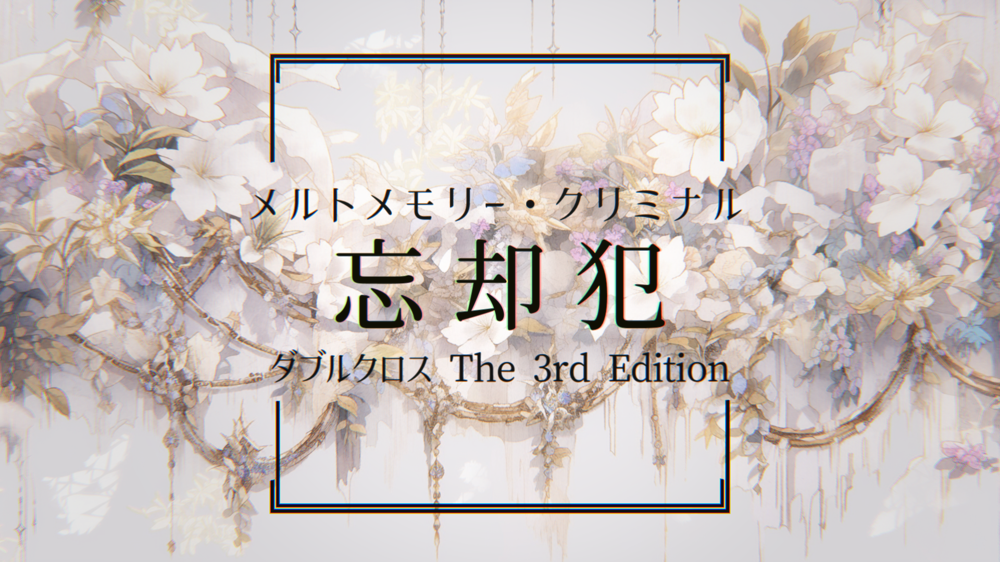

# 忘却犯（メルトメモリー・クリミナル）— 完整劇本（GM 向）

> 〔**Double Cross The 3rd Edition** 劇本・**GM 向全劇透**〕本檔含完整劇情、真相、NPC／敵人數據與全結局，**玩家請勿閱讀**。PL 2 人。
>
> 追查自身罪行的失憶犯罪者 × 刑警與罪犯的搭檔 × 女主角早已死去——關於記憶、罪與「賢者之石」的故事。
>
> 原作：Jorge／studio SISTER（《DoubleCross The 3rd Edition》二次創作）。本檔為非官方繁中翻譯，僅供持有正版者個人遊玩參考。用語依 [`DX3_譯名對照表.md`](DX3_譯名對照表.md)。

---

## 本檔內容（請用左側目錄導覽）

- **概念・概要・權利・用語・劇本資料**
- **開場前（プリプレイ）**：故事、PC 與香恋／大衛的背景、預告、PC1／PC2 HO
- **主要遊玩**：開場（場景 1〜3）→中段（場景 4〜10・情報收集・聖杯實驗室戰）→高潮（場景 11 融化記憶・罪犯）→回溯→結尾（場景 12〜14）
- **賽後**：經驗值
- **資料**：NPC 數據（香恋／大衛・門澤爾／北条芳司／白魔導士／黑騎士）、組織・道具

## 概念

> 追查著自己罪行的、喪失記憶的犯罪者
> ×
> 犯罪者與刑警的搭檔
> ×
> 女主角早已死去

## 概要

本作是 DoubleCross The 3rd Edition 的劇本。
設定為 PL 2 人。

### 本作所包含的元素

- 調味料程度的暴力
- 失憶
- 刑警與犯罪者的搭檔
- 賢者之石

## 權利表記

本作是 DoubleCross The 3rd Edition（著：矢野俊策／F.E.A.R.、KADOKAWA）的二次創作作品。
本作的著作權歸屬於 Jorge／studio SISTER。
若要將利用本作所製作的作品重新公開，須註明利用了本作之事實。
除以下禁止事項外，允許一切利用。此外，為了易於理解，也將允許事項的一部分一併明記。

### 特別允許的事項

- 商業利用（透過利用而產生利益的行為）
- 在團務中的利用（包含有償的活動）
- 在直播・影片中的利用（包含產生利益者）
- 公開利用本作製作的 Replay（包含產生利益者）
- 利用時對內容的改編
- 以本作為基礎製作新的劇本、續篇等（包含有償頒布）
- 為了在團務中使用而向參加者再次發布（包含 PL 向情報等的部分再次發布）
- 在 SNS 上發表包含劇透的感想等
- 在已知劇透的情況下進行遊玩

### 禁止事項

- 違反 [TRPG 二次創作活動指南](https://www.arclight.co.jp/trpg-rights/%e4%ba%8c%e6%ac%a1%e5%89%b5%e4%bd%9c%e6%b4%bb%e5%8b%95%e3%81%ae%e3%82%ac%e3%82%a4%e3%83%89%e3%83%a9%e3%82%a4%e3%83%b3/) 的行為
- 宣稱為自己的創作
- 將本作本身、或本作的一部分向不特定多數人再次發布的行為
- 販售本作本身、或本作一部分的行為
- 將為團務而再次發布的本作用於該團務以外目的的行為

## 用語定義

### 規則書・補充包的略稱

在參照官方的規則書、補充包時，有時會使用以下略稱。「DoubleCross The 3rd Edition」予以省略。

| 略稱   | 名稱                            |
| :--- | :---------------------------- |
| ルール1 | 規則書 1                         |
| ルール2 | 規則書 2                         |
| 上級   | 上級規則書                         |
| PE   | 補充包 Public Enemy（パブリックエネミー）   |
| IC   | 補充包 Infinity Code（インフィニティコード） |
| DR   | 舞台集 Discolored Realm（ディスカラードレルム） |
| UG   | 補充包 Universal Guardian（ユニバーサルガーディアン） |
| RU   | 數據集 Renegades Urge（レネゲイズアージ）  |
| EA   | 數據集 Effect Archive（エフェクトアーカイブ） |
| LM   | 數據集 Linkage Mind（リンケージマインド）   |
| OC   | 舞台集 Overclock（オーバークロック）       |
| HR   | 數據集 Human Relation（ヒューマンリレーション） |
| TR   | 補充包 Time Regain（タイムリゲイン）      |
| RW   | 數據＆規則書 Renegade War（レネゲイドウォー） |
| CE   | 數據＆規則書 Renegade War Cutting Edge（レネゲイドウォー カッティングエッジ） |
| BC   | 數據＆規則書 Bad City（バッドシティ）       |
| IA   | 數據集 Item Archive（アイテムアーカイブ）   |

### 判定式

指將行為判定時所使用的判定值、關鍵值、技能值，以及對它們的修正彙整標示的算式。
以
［判定值］dx［關鍵值］+［技能值］
的形式標示。

### 連攜（コンボ）的標示

以如下方式標示連攜。

- 【連攜名】：連攜的名稱。
- 《效果名》：所組合的效果。
- 〔效果中：○○〕：對該連攜賦予效果的其他數據。連攜數據已反映此效果。
- 〔效果使用：○○〕：在該連攜附近使用效果的數據。如道具的使用、D 路易絲的使用等。已反映於連攜數據。
- 〔自動：○○〕：在該攻擊之前、格擋之前、判定之前等，使用此連攜的時機附近所使用的自動動作。
- 〔使用武器：○○〕：在該連攜所進行的攻擊、格擋等所使用的武器。武器的攻擊力、對命中判定的修正、格擋值等已反映於連攜數據。

## 劇本資料

- 舞台：基本舞台
- 經驗值：全新建卡（フルスクラッチ）＋300 點
- 必須規則書：ルール1、ルール2、上級、IC、EA、LM、IA
- 其他使用規則書由 PL、GM 商議

## 開場前（プリプレイ）

### 故事

#### PC1 的背景

PC1 是職業犯罪者，靠犯罪維生。然而，他決意絕對不殺人。

3 年前，PC1 聽聞了賢者之石的傳聞。出於好奇也好、為了金錢也罷，為了取得它，他接觸了據說持有賢者之石的女性——香恋（かれん）。他與目的相同的大衛（デヴィット）合作，懷柔香恋，探查賢者之石的情報。在這過程中，他成了香恋的戀人。

然而在蒐集情報的過程中，發現香恋所持有的賢者之石早已與香恋適合，要將其摘出便伴隨著香恋的死。基於不殺人的信條，又或是因為對香恋動了真情，PC1 放棄了取得賢者之石。

然而合作的大衛對此表示反對，強行奪取賢者之石。更進一步地，他奪走了 PC1 的記憶，並安排好狀況，將罪名嫁禍給 PC1。

PC1 在喪失了最近 3 年份記憶的狀態下展開劇本。

#### PC2 的背景

PC2 是隸屬於 R 擔遺產係的刑警。妹妹是香恋。

他曾追查名為「聖杯實驗室（グレイルラボ）」的、隸屬於公會（ギルド）旗下的犯罪組織，但只抓到了末端，連其本體的真面目都無法掌握。

妹妹去了戀人 PC1 那裡之後便一去不回，成了不歸之人。

#### 香恋的背景

香恋是隸屬於 UGN 的 R 實驗室（Rラボ）的研究員，與賢者之石「星嶺石（せいれいせき）」適合。R 實驗室在研究一件名為「守護精靈的大盾」的遺產。

「星嶺石」是特殊的賢者之石，需獻上持有者的性命方能完成。而與此同時，「守護精靈的大盾」則是將賢者之石嵌入其中便能啟動的遺產。香恋將「守護精靈的大盾」視如己出般珍惜，總有一天要以自己的「星嶺石」啟動它，是她的夢想。

為此，她需要在自己完成「星嶺石」之後——也就是自己死後——將其託付、並為她啟動「守護精靈的大盾」的對象。香恋在與 PC1 親近的過程中，逐漸被他的人格所吸引。她雖隱約察覺 PC1 的目的是自己的賢者之石，但即便如此仍想將「星嶺石」託付給 PC1。

然而某日，在以 PC1 的名義被約出的地點等待著她的，是企圖奪取香恋賢者之石的大衛。香恋遭大衛之手身負致命傷，在彌留之際完成了「星嶺石」，殞命離世。

#### 大衛的背景

大衛曾隸屬於名為「聖杯實驗室（グレイルラボ）」的組織，現在則作為自由身（フリー）活動的職業犯罪者。他擁有奪取他人記憶的力量。

大衛從大約 3 年前起，便以香恋所持有的賢者之石為目標展開行動，並與目的相同的 PC1 合作。然而隨著調查的推進，他開始反對 PC1 不從香恋手中奪取賢者之石的態度。因此大衛決定單獨奪取賢者之石，並將罪名嫁禍給 PC1。

他殺害了香恋，奪走了賢者之石，並趁其不備奪走 PC1 的記憶，讓 R 擔將其逮捕。

#### 劇本中發生的事

喪失記憶的 PC1 被 R 擔逮捕，被冠上殺害香恋以及強奪賢者之石的嫌疑。接著，依照 R 擔遺產係係長北条的指示，PC1 雖然是重要關係人，卻仍要與 PC2 一同進行案件的搜查。最初 PC1 與 PC2 會起衝突（也許），但兩人會一同展開搜查。

搜查上的關鍵道具有 3 個。其一是香恋的遺物、唯有以正確步驟才能打開的文匣——「匿匿匣（ハイドボックス）」。其一是香恋曾研究、卻在香恋死亡的同時被某人奪走的遺產——「守護精靈的大盾」。另一個則是從香恋遺體中被抽走的賢者之石——「星嶺石」。

一展開搜查，最初找到的盡是 PC1 殺害香恋的情況證據。然而與此同時，也會查明 PC1 曾與一名叫大衛的男子合夥、以及他過去曾隸屬於「聖杯實驗室」等事。繼續搜查大衛與「聖杯實驗室」，便能發現「聖杯實驗室」的據點。

潛入「聖杯實驗室」，將其殲滅。如此一來便會發現「聖杯實驗室」中保管著被奪走的「守護精靈的大盾」，並成功將其取得。此外，也會成功取得大衛的詳細個人資料。資料中記載著他現在仍在從事他人記憶的買賣，以及那些記憶的保管地點。

前往記憶的保管地點，並從中尋找 PC1 的記憶。找到後，PC1 取回記憶。其結果是，查明 PC1 原本並無殺害香恋的意圖，並且加上由香恋告訴他的「匿匿匣」的開啟方法也得以判明。

打開「匿匿匣」，取得香恋的日記。其中記載著：香恋早已察覺 PC1 是為了賢者之石才接近自己；即便如此，她仍信任 PC1，打算將賢者之石託付給他等事。

確定真凶為大衛。鎖定他的所在並予以擊破，即為劇本通關。

### 預告（Trailer）

> 喪失了罪之記憶的犯罪者
> 失去摯愛家人的獵犬
> 命運離奇的搭檔挑戰犯罪搜查
>
> 被奪走的賢者之石
> 被封印的日記
> 下落不明的遺產
>
> 當記憶被取回之時，一切都將真相大白
>
> DoubleCross The 3rd Edition
> 「忘卻犯——融化記憶・罪犯（メルトメモリー・クリミナル）」
> DoubleCross，那是意味著背叛的詞語

### 劇情提示（HO）

#### PC1 用劇情提示

- 推薦掩護用身份（カヴァー）：職業犯罪者、怪盜、詐欺師等
- 劇本路易絲：失去的記憶（執著／猜疑心）

你是職業犯罪者，靠犯罪維生。擅長的犯罪以竊盜或詐欺為佳。此外，你以「唯獨不殺人」作為信條。

某日，你作為一起毫無記憶的強盜殺人案的重要關係人遭警方逮捕。更進一步地，你發現自己喪失了最近 3 年份的記憶。

你可將〈藝術：犯罪〉〈知識：犯罪〉〈情報：犯罪〉之中任一個技能的等級＋20。所分配的數值如「5（25）」這般，與分配前的數值分開記述，藉由經驗值提升技能時則參照分配前的數值來進行。不過此處〈藝術：犯罪〉代表對犯罪的審美感之高、或嗅覺之敏銳、非語言思考能力之高；〈知識：犯罪〉代表對犯罪見識之深；〈情報：犯罪〉代表取得犯罪相關情報之能力之高。

#### PC2 用劇情提示

- 推薦掩護用身份（カヴァー）：刑警
- 劇本路易絲：香恋（庇護／悔悟）

你是 R 擔遺產係的刑警。你有一個名叫香恋、隸屬於 UGN 的 R 實驗室（Rラボ）的妹妹。

你以前曾搜查名為「聖杯實驗室（グレイルラボ）」、隸屬於公會（ギルド）旗下的研究組織，卻無法掌握其實態。

身為妹妹的香恋有一個名叫 PC1 的戀人。此外，她與特殊的賢者之石「星嶺石」適合。然而某日她被發現成了遺體，胸口的賢者之石被抽走了。而作為該案件的重要關係人，PC1 浮上檯面。

你依上司的命令，要與身為重要關係人的 PC1 本人兩個人一同搜查該案件。

## 主要遊玩

### 開場（オープニング）階段

#### 場景 1：最後的一天
- 場景玩家：PC2

##### 解說
PC2 的個別開場。香恋被殺害的那天、離家外出時的場景。

##### 描寫

> 與昨日相同的今日、與今日相同的明日——本該如此的，直到那一天為止。
> 某個休假日。你一如往常地目送妹妹出門。
>
> 香恋
> 「我出門囉——」
>
> 香恋
> 「今天晚上應該會很晚！說不定不回家也說不定？」
>
> 香恋
> 「是約會喔，約會。雖然很突然，但（PC1 的名字）說有重要的事要說、把我約出去。你覺得是什麼事呢？」
>
> 香恋
> 「那麼，我出門啦！」
>
> 然而她真的再也沒有回來。
> 到了隔天晚上仍杳無音訊，擔心遲遲不歸的她的你，展開了搜尋。結果，在 PC1 的住處發現了她的遺體。

##### 結末
簡單地 RP 後結束場景。香恋登場便是這個場景為最後一次。

#### 場景 2：3 年的空白
- 場景玩家：PC1

##### 解說
PC1 的個別開場。發現自己喪失了 3 年份的記憶。

##### 描寫

> 那天你一醒來，腦袋便不自然地一片渾沌。渾沌的腦袋變得清醒分明，是在身體遭 R 擔拘束的時候。
> 你現在身在偵訊室。負責偵訊的是 R 擔遺產係的北条芳司（ほうじょう ほうじ）係長。
>
> 芳司
> 「那麼？讓我聽聽你昨天做了什麼吧。」
>
> 芳司
> 「被害者前天說要去見你，便離家外出。被害者的遺體被發現的地點，也是你的住處。這樣還說毫無關係，太勉強了吧？我想聽你說得詳細點。」
>
> 然而理所當然地，喪失記憶的你連身為被害者的香恋都不認識。
>
> 芳司
> 「……話對不上啊。不過從交談的感覺來看，我判斷你的腦袋並沒有出毛病。但有哪裡不對勁。你有沒有什麼頭緒？」
>
> 芳司
> 「你，知道今天是西元幾年幾月幾日嗎？」
>
> 芳司
> 「那是 3 年前的日期。你該不會……記憶飛了？」
>
> 芳司
> 「……有個簡單的確認方法。我們這裡好歹也有記憶操作的人員。讓那傢伙來確認一下吧。」
>
> 芳司
> 「看來不是裝傻啊。是真的喪失了 3 年份的記憶。頭緒……怎麼可能會有。」
>
> 芳司
> 「就這樣把你當作犯人逮捕並不是多難的事。我們也很忙。這案子就這麼了結也行，你想怎麼辦？」
>
> 芳司
> 「很好。但就像我說的，我們也不是閒人。所以也要請你最大限度地配合。」
>
> 芳司
> 「依我的看法，這案子不是你幹的。所以，憑你自己的力量去證明它。」
>
> 芳司
> 「而且最重要的是……自己的因緣，想自己來解決吧？」

##### 結末
PC1 同意協助搜查後，結束場景。

#### 場景 3：暗中活動
- 場景玩家：―

##### 解說
主持人場景（マスターシーン）。頭目的介紹場景。

##### 描寫

> 男人凝視著收於掌心之中的美麗石頭。
>
> 大衛
> 「我並不是特別想要賢者之石……只是想親眼看一眼罷了。」
>
> 大衛
> 「所以說啊，要是你說你想要，我讓給你也無所謂。」
>
> 大衛
> 「可是啊……工作做到一半就撂挑子，這可不行吧。」
>
> 大衛
> 「盯上的獵物絕不放走。我做這行靠的就是這個名號。」
>
> 大衛
> 「明明以為跟你能合作愉快的，真是太可惜了……」
>
> 大衛
> 「算了，就好好給警察添一陣子麻煩吧。」

##### 結末
做完描寫後結束場景。

### 中段（ミドル）階段

#### 場景 4：遭遇
- 場景玩家：PC2

##### 解說
芳司命令 PC1、PC2 合作進行搜查的場景。在此之後的中段階段場景中，基本上兩名 PC 都會登場。

##### 描寫
> 你們兩人被遺產係係長北条芳司叫去。
>
> 芳司
> 「直接切入正題吧。『賢者之石』的強盜殺人案。這次的案件，就交給你負責。」
>
> 芳司
> 「然後呢，那時候把這傢伙當作搜查協助者帶上。」
>
> 說著，芳司用手指向 PC1。
>
> 芳司
> 「怎麼？對我的安排有意見？」
>
> 芳司
> 「把重要關係人當協助者是破例，這種事我當然知道。但要這麼說的話，身為被害者親屬的你，我一樣可以把你從負責人選裡剔除喔？」
>
> 芳司
> 「你們兩個，都想親手了結這案子吧？這就是體察了這一點的、我的妙手安排。」
>
> 芳司
> 「……說真的，這傢伙對犯罪的知識是貨真價實。能讓他協助的話，會是一大助力。」
>
> 芳司
> 「要是這傢伙想逃跑、或者你覺得他完全派不上用場，憑你的判斷把他送回來就行。只不過那時候，你也得從這次的負責人選裡退出，做好這個心理準備。」
>
> 芳司
> 「所以說，我自己也知道這是在亂來。但這大概，是最『好』的辦法。」
>
> 芳司
> 「那麼，就是這麼回事，剩下的就靠你們兩個加油了。」

##### 結末
PC 答應加入搜查後結束場景。

#### 場景 5：搜查開始
- 場景玩家：PC1

##### 解說
PC 之間互相把想說的話說出來的場景。

此外，本次案件中所追究的罪行是「殺害香恋」以及「奪取賢者之石」，罪狀為「強盜殺人」。在案件的搜查中，提示以下 3 個道具是關鍵。

- 香恋的遺物文匣，「匿匿匣（ハイドボックス）」。其構造像是香恋自己製作的拼圖一般，不依正確步驟便無法打開。目前為止，尚不清楚開啟方法。
- 香恋所研究的遺產，「守護精靈的大盾」。在與香恋之死同一時期，從研究所被奪走。
- 香恋所適合的賢者之石「星嶺石」。從香恋的遺體中被抽走。

##### 結末
提示情報、充分 RP 後結束場景。

#### 場景 6：消息靈通者
- 場景玩家：PC1

##### 解說
拜訪 PC1 認識的情報販子、偽造商等的場景。問出 3 年前「PC1 曾把賢者之石當作下一份工作的目標」「曾製作為了接近香恋的偽造身分證」等事。此外，在這過程中暗示大衛的存在。

##### 描寫

> 你們接觸了 PC1 交情甚好的情報販子。
>
> 情報販子
> 「喲，好久不見。大概有一年沒見了吧？」
>
> 情報販子
> 「3 年前？這麼說來，記得我曾應你的詢問，把『賢者之石』的種種告訴了你呢。」
>
> 情報販子
> 「當時感覺就像是『下一份工作就是這個』。」
>
> 情報販子
> 「那麼，順利嗎？」
>
> 情報販子
> 「對了，今天大衛沒一起來啊。換搭檔啦？」
>
> 情報販子
> 「誰是誰……那不就是你的搭檔嘛？他為了偷出賢者之石而負責後援。」

#### 情報收集

##### 解說
進行情報收集。

##### 情報收集項目

- 關於大衛：〈情報：地下社會〉7
- 關於賢者之石「星嶺石」：〈知識：變節者病毒〉〈情報：UGN〉8
- 關於遺產「守護精靈的大盾」：〈知識：變節者病毒〉〈情報：UGN〉7
- 關於組織「聖杯實驗室」：〈藝術：犯罪〉〈知識：犯罪〉〈情報：犯罪〉30

##### 關於大衛

大衛・門澤爾（デヴィット・メンゼル）。31 歲，男性。隸屬於公會（ギルド）的職業犯罪者，本人有時也自稱怪盜。

似乎從 3 年前起便與 PC1 一同以奪取賢者之石「星嶺石」為目標活動。與據稱持有賢者之石的香恋接觸交由 PC1 負責，自己則專心致志於後援。

擁有曾隸屬於「聖杯實驗室」的過去。

擁有「將記憶取出並物質化」的能力，並利用該能力進行情報的買賣等。被認為與 PC1 的失憶也有關聯。

##### 關於賢者之石「星嶺石」

香恋所適合的特殊賢者之石。在適合期間尚屬未完成，不具任何力量，但藉由「持有者注入全部的過去與未來」而完成。所謂「注入全部的過去與未來」，即是獻上自己的性命之意。

完成的「星嶺石」，是在賢者之石之中也擁有更強力量的特別之物。

##### 關於遺產「守護精靈的大盾」

香恋所研究的遺產。其權能據稱是「回應無辜星辰的願望，守護並戰鬥」。

尚屬未完成，藉由與賢者之石組合而完成。所組合的賢者之石的力量越強，其權能便越是強力。

##### 關於組織「聖杯實驗室」

接受公會（ギルド）支援的遺產研究機構。為達目的，連犯罪行為也在所不惜。

很早以前便著眼於香恋所研究的「守護精靈的大盾」，趁此次香恋遭殺害的混亂，從她的研究設施奪取的嫌疑濃厚。

此外，他們也持有關於以前曾隸屬於此的大衛的詳細情報，若詳細調查研究所，或許也能取得他正在買賣的記憶的相關情報。

研究所的地點得以判明，變得可供調查。

##### 結末
所有情報都公開後，進入下一個場景。

#### 場景 7：聖杯實驗室
- 場景玩家：PC2

##### 解說
進行聖杯實驗室調查的場景。若取得搜查令、從正面踏入搜查，會受到警衛的抵抗，演變為戰鬥。若以隱密行動潛入，會被警衛發現，演變為戰鬥。

戰鬥勝利的情況下，可發現被偷走的守護精靈的大盾。此外，可取得關於大衛的詳細數據，並能鎖定他在進行記憶買賣時作為保管地點利用的倉庫位置。並暗示 PC1 的記憶也很有可能被放置在那裡。

##### 結末
取得情報與守護精靈的大盾。

##### 戰鬥要件
- 戰鬥結束條件：敵人全滅
- 接戰（エンゲージ）：［警衛 A、警衛 B、高級警衛］…5m…［警衛 C、警衛 D］…5m…［PC］

##### 戰鬥方案

###### 警衛
反應以『安心安全』進行。

###### 主要過程使用的連攜
- 第 1 次：『魔眼式特殊警棍』『劈兜＋』
- 第 2 次以後：『魔眼式特殊警棍』『劈兜』

###### 高級警衛
反應（リアクション）以『驟雨』進行。

###### 主要過程使用的連攜
- 第 1 次：『冰柱（つらら）的尖雨』『霧隱的旋穿＋』
- 第 2 次以後：『冰柱（つらら）的尖雨』『霧隱的旋穿』

##### 警衛

###### 基本數據

|        |                      |
| :----- | :------------------- |
| 種別     | 一般                   |
| 血統（ブリード）   | 混血（Cross）                 |
| 症狀 | 疾速靈猿《ハヌマーン》／重力魔眼《バロール》           |
| 能力值    | 【肉體】5【感覺】2【精神】3【社會】4 |
| 技能     | 〈白兵〉7〈迴避〉5 |
| 侵蝕率    | 130%                  |
| HP    | 63               |
| 行動值    | 7                  |
| 裝甲值    | 8                  |

###### E 路易絲
不應存在之物《ありえざる存在》
不應存在之物《あり得ざる存在》

###### 效果
生命增強《生命増強》1
迴避《イベイジョン》1
魔眼槍《魔眼槍》2
戰鬥節拍《バトルビート》4
瞬速之刃《瞬速の刃》4
鎌鼬《かまいたち》2
疾風劍《疾風剣》2
音速攻擊《音速攻撃》4
再起波濤《さらなる波》5
紅蓮之衣《紅蓮の衣》2
肉體強化《フィジカルエンハンス》4
全射程《オールレンジ》6
攻擊加成《アタックボーナス》5
極限解放《リミットリリース》2

###### 連攜

『魔眼式特殊警棍』
魔眼槍《魔眼槍》＋戰鬥節拍《バトルビート》
［時點：次要動作］［技能：―］［難易度：自動成功］［對象：自身］［射程：至近］
- 製作武器
- 在該主要過程期間……
	- 使用疾速靈猿《ハヌマーン》效果進行的判定骰＋4 個

『兜割』
瞬速之刃《瞬速の刃》＋鎌鼬《かまいたち》＋疾風劍《疾風剣》＋音速攻擊《音速攻撃》＋再起波濤《さらなる波》＋紅蓮之衣《紅蓮の衣》＋肉體強化《フィジカルエンハンス》＋全射程《オールレンジ》＋〔效果中：『魔眼式特殊警棍』〕
［時點：主要動作］［技能：〈白兵〉］［難易度：對決］［對象：單體］［射程：視界］
- 判定式：28dx9＋3　攻擊力：18　的白兵攻擊
- 對進行格擋（ガード）的對象造成的傷害＋10
- 對此攻擊進行的反應骰－2 個

『兜割＋』
瞬速之刃《瞬速の刃》＋鎌鼬《かまいたち》＋疾風劍《疾風剣》＋音速攻擊《音速攻撃》＋再起波濤《さらなる波》＋紅蓮之衣《紅蓮の衣》＋肉體強化《フィジカルエンハンス》＋全射程《オールレンジ》＋攻擊加成《アタックボーナス》＋〔自動：極限解放《リミットリリース》〕＋〔效果中：『魔眼式特殊警棍』〕
［時點：主要動作］［技能：〈白兵〉］［難易度：對決］［對象：單體］［射程：視界］
- 判定式：28dx8＋3　攻擊力：33　的白兵攻擊
- 對進行格擋（ガード）的對象造成的傷害＋10
- 對此攻擊進行的反應骰－2 個
- 次數限制：1／劇本

『安心安全』
閃避（ドッジ）＋〔效果中：迴避《イベイジョン》〕
［時點：反應］［技能：〈迴避〉］［難易度：對決］［對象：自身］［射程：至近］
- 進行達成值：21　的閃避（ドッジ）

##### 高級警衛

###### 基本數據

|        |                      |
| :----- | :------------------- |
| 種別     | 一般                   |
| 血統（ブリード）   | 混血（Cross）                 |
| 症狀 | 天使光環《エンジェルハイロゥ》／固有結界《オルクス》          |
| 能力值    | 【肉體】2【感覺】5【精神】4【社會】7 |
| 技能     | 〈射擊〉5〈知覺〉4 |
| 侵蝕率    | 150%                  |
| HP    | 108               |
| 行動值    | 14                  |
| 裝甲值    | 10               |

###### E 路易絲
不應存在之物《ありえざる存在》
不應存在之物《ありえざる存在》
不應存在之物《ありえざる存在》
不應存在之物《ありえざる存在》
超越活性《超越活性》

###### 效果
生命增強Ⅱ《生命増強Ⅱ》4
火焰光環《フレイムリング》5
陽炎之衣《陽炎の衣》4
玻璃之劍《ガラスの剣》3
主之右臂《主の右腕》6
微塵《小さな塵》6
空間扭曲射擊《空間歪曲射撃》4
集中：固有結界《コンセントレイト：オルクス》3
樞要陣形《要の陣形》4
客製化《カスタマイズ》4
全射程《オールレンジ》6
武裝連結《アームズリンク》6
神之眼《神の眼》2

###### 道具
命運之石（デスティニーストーン）
死刻印

###### 連攜

『冰柱（つらら）的尖雨』
火焰光環《フレイムリング》＋陽炎之衣《陽炎の衣》
［時點：次要動作］［技能：―］［難易度：自動成功］［對象：自身］［射程：至近］
- 製作武器
- 在該主要過程期間……
	- 進入隱密狀態
- 次數限制：4／場景

『霧隱的旋穿』
玻璃之劍《ガラスの剣》＋主之右臂《主の右腕》＋微塵《小さな塵》＋空間扭曲射擊《空間歪曲射撃》＋集中：固有結界《コンセントレイト：オルクス》＋樞要陣形《要の陣形》＋客製化《カスタマイズ》＋全射程《オールレンジ》＋武裝連結《アームズリンク》＋〔效果中：『冰柱（つらら）的尖雨』〕
［時點：主要動作］［技能：〈射擊〉］［難易度：對決］［對象：3 體］［射程：視界］
- 判定式：25dx7＋3　攻擊力：38　的射擊攻擊
- 隱密狀態
- 對此攻擊……
	- 反應骰－5 個
	- 格擋（ガード）的格擋值－5
- 次數限制：4／劇本

『霧隱的旋穿＋』
玻璃之劍《ガラスの剣》＋主之右臂《主の右腕》＋微塵《小さな塵》＋空間扭曲射擊《空間歪曲射撃》＋集中：固有結界《コンセントレイト：オルクス》＋樞要陣形《要の陣形》＋客製化《カスタマイズ》＋全射程《オールレンジ》＋武裝連結《アームズリンク》＋〔效果使用：命運之石（デスティニーストーン）＋死刻印〕＋〔效果中：『冰柱（つらら）的尖雨』〕
［時點：主要動作］［技能：〈射擊〉］［難易度：對決］［對象：3 體］［射程：視界］
- 判定式：25dx7＋23　攻擊力：88　的射擊攻擊
- 隱密狀態
- 對此攻擊……
	- 反應骰－5 個
	- 格擋（ガード）的格擋值－5
- 次數限制：1／劇本

『驟雨』
神之眼《神の眼》
［時點：反應］［技能：〈知覺〉］［難易度：對決］［對象：自身］［射程：至近］
- 進行判定式：8dx10＋4　的閃避（ドッジ）

#### 場景 8：失去的記憶
- 場景玩家：PC1

##### 解說
前往大衛保管記憶的倉庫。PC1 將在那裡發現並取回自己的記憶。保全可以隱密突破，也可以強行破壞。

其結果是查明：PC1 原本並沒有打算殺害香恋來奪取賢者之石；同時也查明了匿匿匣的開啟方式。不願殺害的理由，可以是出於信條，也可以是因為真心愛上了香恋。

##### 描寫

> 你們抵達了一座倉庫。它偽裝成一棟極為普通的獨棟住宅，乍看之下與周圍住宅區的建築並無不同。
> 然而只要稍加調查，就會發現這裡布署著與那些房子無法相提並論的嚴密保全。

##### 描寫 2

> 進入內部後，那是一個寬敞的房間。牆上並排著好幾座巨大的櫃子，裡頭密密麻麻地擺滿了裝有閃閃發光液體的小瓶。
> 你被其中一瓶強烈地吸引。

##### 描寫 3

> 打開那只小瓶的蓋子，裡頭的液體便輕飄飄地流瀉到空中。接著它們碰觸到你的眉心，像被吸入般消失。
> 然後你想起了 3 年份的記憶。

##### 描寫 4

> 的確，大衛和你最初是為了奪取據說由香恋持有的賢者之石，才接近她。
> 在這過程中，你與香恋成為了戀人，藉由更加親密而獲取情報。
> 然而某天夜裡，她坦白了：賢者之石已經與她適合，一旦取出她就會死。
> 得知此事的你，決定放棄奪取賢者之石。然而大衛主張就算殺了她也該奪取，你與他因這方針而起了爭執。
> 被 R 擔逮捕那天的前一晚，你被大衛叫了出去，在那場爭執之末，記憶被奪走了。

##### 描寫 5

> 某一天的記憶。香恋與你兩人一同度過。

香恋
> 「對了，我一直想給你看這個。」

> 她取出一只文匣。其表面複雜地刻著幾何花紋，散發出一股不可思議的氛圍。

香恋
> 「這是匿匿匣（ハイドボックス）。是我做的拼圖盒。除非依照正確的步驟，否則打不開。」

香恋
> 「我為了以防萬一，把日記放在裡面。我希望你知道這個盒子的開法。」

香恋
> 「因為萬一我有個三長兩短，我希望託付身後事的人是你。」

香恋
> 「我相信你一定不會背叛我。最後一定會體會我的遺志。」

香恋
> 「那麼，我來教你開法吧。」

> 說著，她把複雜的步驟告訴了你。然後——

香恋
> 「最後，會要求一句通關密語。密語是——『星辰花（スターチス）』。它的花語是『remembrance（記憶）』。」

##### 結末
描寫結束後場景結束。也可以從回想回到現在進行 RP。

#### 場景 9：匿匿匣
- 場景玩家：PC1

##### 解說
開啟匿匿匣，閱讀封存在內部的日記的場景。

##### 描寫

> 你逐步解開匿匿匣。
> 它像花苞綻放般開啟，從中露出一本筆記本。是一本厚厚的筆記本。
> 翻開後，裡面以香恋的字跡寫著日記。

日記
> 「今天去見了那個人。久違地感受到自己正在戀愛。我被那個人吸引。」

日記
> 「那個人是出於盤算才接近我的，這件事其實我知道。目標多半是我持有的『星嶺石』吧。即便如此，我仍對那個人感到魅力，這是為什麼呢。」

日記
> 「我有一個夢想。就是完成『守護精靈的大盾』。這孩子需要強力的賢者之石。而最適合的，一定是我的『星嶺石』。不過，要完成『星嶺石』，我必須獻出生命。這件事本身無妨。這是我想做的事，命我都豁出去。但問題是，在我死後，需要有『某個人』把『星嶺石』嵌進『守護精靈的大盾』裡……」

日記
> 「我知道那個人想要『星嶺石』。但同時，我也覺得他是值得信賴的對象。我相信那個人一定能實現我的夢想。」

日記
> 「我想把匿匿匣的開法教給那個人。如果你在我死後讀到這本日記，希望你用『星嶺石』完成『守護精靈的大盾』。無論在什麼狀況下，我一定會在完成『星嶺石』之後才死去。」

日記
> 「還有，請你替我向哥哥（姐姐）道歉。對不起，過著這麼任性的人生。但我的活法由我自己選。活法也就是死法。我的人生，想用來完成『守護精靈的大盾』。」

> 最後一頁是這麼寫的。

日記
> 「今天，那個人突然聯絡我說想見面。文句有點奇怪。也許出了什麼事，有種不好的預感……」

##### 結末
最後那段文句，指的是大衛從 PC1 手中奪走記憶後，用那台終端機發送的訊息。
進行描寫並讓玩家做出反應後，場景結束。

#### 場景 10：藏身之處
- 場景玩家：PC2

##### 解說
鎖定大衛藏身之處的場景。
以〈知覺〉〈情報：傳聞〉其中之一進行難易度 9 的判定，只要其中任一人成功即可鎖定藏身之處。若兩人都失敗，則再次登場進行重判，反覆直到成功為止。

##### 結末
大衛打算潛逃出境，正在機場。鎖定藏身之處後場景結束，進入高潮階段。

### 高潮階段

#### 場景 11：融化記憶・罪犯
- 場景玩家：PC1

##### 解說
高潮階段。在機場與大衛對峙並將其擊破。

##### 描寫

> 你撥開機場大批人潮，尋找大衛。
> 他正在貴賓室悠閒地喝著咖啡。

大衛
> 「喲。你來得真快啊。再多等我一會兒，我就能平安地跟日本說再見了呢。」

大衛
> 「邊走邊聊吧。」

> 說著，大衛離開了貴賓室。

大衛
> 「看你這樣子，記憶倉庫已經翻過了吧……」

大衛
> 「你想要奪回的，是這個吧？」

> 說著，大衛從口袋裡取出一塊美麗閃耀、拳頭大小的石頭。它閃著淡淡的櫻花色光芒。

大衛
> 「『星嶺石』。這已經完成了。那女人明知會被我奪走，卻在臨死之際把它完成了。真不知道在想什麼。」

大衛
> 「我自己倒不覺得這東西有什麼特別的價值。光是偷到手就滿足了……不過，把它還給你，可真讓人不爽。你把到手的獵物，因為無聊的信條和情感給扔了。這對『我們』而言可是不行的。自尊心不允許這種事。」

大衛
> 「所以要做的事很簡單。就來一場力量的較量吧。你們贏了，要逮捕我也好、奪回石頭也好，隨你們的便。我贏了，就照計畫讓我潛逃。光是這樣還不夠盡興，你們手上那面守護精靈的大盾，我也一併拿走好了。」

> 大衛從口袋裡取出兩張有厚度的圓盤。將它們拋向空中，它們便在空中無視質量與體積地變形，化為兩具約 2m 高的機器人。

大衛
> 「EX 原菌兵就讓我用一下吧。一個人對付你們兩個，看來挺吃力的。」

##### 結末
擊破大衛後場景結束。

##### 戰鬥要件
- 戰鬥結束條件：擊破大衛
- 接戰（エンゲージ）：［白魔導士（ホワイトメイガス）］…5m…［大衛,黑騎士（ブラックナイト）］…5m…［PC］

##### 戰鬥方案

###### 大衛
僅第 1 輪在準備過程（セットアッププロセス）使用『小行星的力學』。

在最初的先制過程（イニシアチブプロセス）使用『完全安裝』。在第 1 輪期間使用『鼓舞之雷』，僅第 1 輪進行 2 次行動。這 2 次安排成不與原本的手番連續。

對白魔導士的攻擊使用『力之靈水』，以提升傷害下限。當 HP 第一次歸 0 時，使用『破滅願望』。其後以『不死』回復一次戰鬥不能。

反應在第 1 輪以『不可見之僕＋』進行，之後以『不可見之僕』進行。

###### 主要過程使用的連攜
- 第 1 次：『輝煌軌道砲』『春雷』
- 第 2 次：『裝填』『秋颪』
- 第 3 次：『纏毒』『夏霧』
- 第 4 次以後：『裝填』『冬礫』

###### EX 原菌兵：白魔導士（ホワイトメイガス）
反應以『W_dodge』進行。閃避（ドッジ）成功時，使用一次『W_whirlwind_of_haze』。

當被 PC 接戰（エンゲージ）時，次要動作改用『W_minor＋』代替『W_minor』，從該接戰脫離後再進行攻擊。

###### 主要過程使用的連攜
- 第 1 次：『W_minor』『W_major_ex』
- 第 2 次以後：『W_minor』『W_major』

###### EX 原菌兵：黑騎士（ブラックナイト）
反應以『B_guard』進行，預期會受到大量傷害時，使用一次『B_guard_ex』。

以『B_cover』掩護（カバーリング）對大衛的攻擊。若該掩護被抵銷，可能的話以『B_devil string』抵銷該抵銷。除此之外的用途不使用『B_devil string』。

###### 主要過程使用的連攜
- 『B_major』

##### 大衛

###### 基本數據

|        |                      |
| :----- | :------------------- |
| 種別     | 一般                   |
| 血統（ブリード）   | 混血（Cross）                 |
| 症狀 | 雷擊黑犬《ブラックドッグ》／幻象投影《ソラリス》           |
| 能力值    | 【肉體】9【感覺】3【精神】5【社會】8 |
| 技能     | 〈白兵〉9〈迴避〉5〈射擊〉9〈知覺〉3〈RC〉9〈知識：犯罪〉21〈交涉〉9〈情報：公會〉9  |
| 侵蝕率    | 173%                  |
| HP    | 193             |
| 行動值    | 11                  |
| 裝甲值    | 10                  |

###### D 路易絲
記憶探索者《記憶探索者》
亞純血《亜純血》

###### E 路易絲
不應存在之物《ありえざる存在》
不應存在之物《ありえざる存在》
不應存在之物《ありえざる存在》
不應存在之物《ありえざる存在》
超越活性《超越活性》

###### 效果
生命增強《生命増強》5
硬線連結《ハードワイヤード》5
雷之加護《雷の加護》5
機械動作《メカニカルアクション》5
騷靈《ポルターガイスト》3
電離飛行《イオノクラフト》7
光輝之刃《シャインブレード》14
毒之刃《毒の刃》12
雷之牙《雷の牙》5
雷之殘滓《雷の残滓》7
武裝連結《アームズリンク》5
攻擊程式《アタックプログラム》7
微塵《小さな塵》7
罪人之枷《罪人の枷》5
閃光電漿《フラッシングプラズマ》3
振動球《振動球》12
荊棘之環《茨の輪》7
毒霧《ポイズンフォッグ》5
疫病爆發《アウトブレイク》3
焦熱彈丸《焦熱の弾丸》12
寧靜《トランキリティ》7
雷擊《雷攻撃》7
集中：幻象投影《コンセントレイト：ソラリス》3
不可見之僕《見えざる僕》3
完全安裝《フルインストール》5
鼓舞之雷《鼓舞の雷》3
力之靈水《力の霊水》5
自爆裝置《自爆装置》7

###### 道具
最後一擊（ラストワン）
軌道砲（レールガン）×2
RG 彈匣（RGカードリッジ）×3
武器箱（ウェポンケース）
小行星的力學（小惑星の力学）
鎖定瞄準器（ロックオンサイト）×5
不死（ネバーダイ）

###### 連攜（コンボ）

小行星的力學『小惑星の力学』
〔效果使用：小行星的力學《小惑星の力学》〕
［時點：準備過程］［技能：―］［難易度：自動成功］［對象：場景（選擇）］［射程：視界］
- 該輪期間……
	- 任意角色全體的【行動值】＋10
- 次數限制：1／劇本

閃耀軌道砲『輝くレールガン』
光刃《シャインブレード》＋騷靈《ポルターガイスト》＋雷之加護《雷の加護》＋毒之刃《毒の刃》
［時點：次要動作］［技能：―］［難易度：自動成功］［對象：自身］［射程：至近］
- 該場景期間……
	- 選定武器的攻擊力＋18
	- 破壞「軌道砲」，攻擊力＋［遭破壞武器的攻擊力］
- 該主要過程期間……
	- 雷擊黑犬效果造成的判定骰＋5 個
	- 攻擊力＋12

裝填『装填』
雷之加護《雷の加護》＋機械動作《メカニカルアクション》＋毒之刃《毒の刃》＋〔效果使用：RG 彈匣《RGカードリッジ》〕
［時點：次要動作］［技能：―］［難易度：自動成功］［對象：自身］［射程：至近］
- 該主要過程期間……
	- 雷擊黑犬效果造成的判定骰＋5 個
	- 攻擊力＋12
- 軌道砲的使用次數＋1
- 次數限制：3／劇本

纏毒『纏毒』
毒之刃《毒の刃》
［時點：次要動作］［技能：―］［難易度：自動成功］［對象：自身］［射程：至近］
- 該主要過程期間……
	- 攻擊力＋12

春雷『春雷』
閃光電漿《フラッシングプラズマ》＋振動球《振動球》＋荊棘之輪《茨の輪》＋焦熱彈丸《焦熱の弾丸》＋雷擊《雷攻撃》＋集中：幻象投影《コンセントレイト：ソラリス》＋〔效果中：閃耀軌道砲『輝くレールガン』＋完全安裝『フルインストール』〕
［時點：主要動作］［技能：〈RC〉］［難易度：對決］［對象：場景（選擇）］［射程：視界］
- 判定式：27dx7＋9　攻擊力：90　的射擊攻擊
- 無視裝甲值
- 命中時……
	- 該輪期間……
		- 對象進行的所有判定骰－7 個
- 次數限制：1／劇本

夏霧『夏霧』
振動球《振動球》＋荊棘之輪《茨の輪》＋毒霧《ポイズンフォッグ》＋大爆發《アウトブレイク》＋焦熱彈丸《焦熱の弾丸》＋集中：幻象投影《コンセントレイト：ソラリス》＋靜謐《トランキリティ》＋〔效果中：閃耀軌道砲『輝くレールガン』＋纏毒『纏毒』〕
［時點：主要動作］［技能：〈RC〉］［難易度：對決］［對象：場景（選擇）］［射程：視界］
- 判定式：17dx7＋9　攻擊力：76　的射擊攻擊
- 無視裝甲值
- 命中時……
	- 該輪期間……
		- 對象進行的所有判定骰－7 個
- 消耗 HP 5 點
- 次數限制：1／劇本

秋風『秋颪』
雷之牙《雷の牙》＋雷之殘滓《雷の残滓》＋武裝連結《アームズリンク》＋攻擊程式《アタックプログラム》＋微塵《小さな塵》＋罪人之枷《罪人の枷》＋〔效果中：閃耀軌道砲『輝くレールガン』＋裝填『装填』＋完全安裝『フルインストール』〕＋〔使用武器：軌道砲〕
［時點：主要動作］［技能：〈射擊〉］［難易度：對決］［對象：單體］［射程：100m］
- 判定式：32dx7＋29　攻擊力：66　的射擊攻擊
- 此攻擊無法進行格擋
- 命中時……
	- 給予邪毒等級 7
	- 該輪期間……
		所有判定的達成值－10

冬礫『冬礫』
雷之牙《雷の牙》＋雷之殘滓《雷の残滓》＋武裝連結《アームズリンク》＋攻擊程式《アタックプログラム》＋微塵《小さな塵》＋罪人之枷《罪人の枷》＋〔效果中：閃耀軌道砲『輝くレールガン』＋裝填『装填』〕＋〔使用武器：軌道砲〕
［時點：主要動作］［技能：〈射擊〉］［難易度：對決］［對象：單體］［射程：100m］
- 判定式：17dx7＋29　攻擊力：66　的射擊攻擊
- 此攻擊無法進行格擋
- 命中時……
	- 給予邪毒等級 7
	- 該輪期間……
		所有判定的達成值－10

不可見之僕＋『見えざる僕＋』
不可見之僕《見えざる僕》＋〔效果中：完全安裝『フルインストール』〕
［時點：反應］［技能：〈RC〉］［難易度：對決］［對象：自身］［射程：至近］
- 判定式：24dx10＋9　的閃避

不可見之僕『見えざる僕』
不可見之僕《見えざる僕》
［時點：反應］［技能：〈RC〉］［難易度：對決］［對象：自身］［射程：至近］
- 判定式：9dx10＋9　的閃避

完全安裝『フルインストール』
完全安裝《フルインストール》
［時點：先制過程］［技能：―］［難易度：自動成功］［對象：自身］［射程：至近］
- 該輪期間……
	- 所有判定骰＋15 個
- 次數限制：1／劇本

鼓舞之雷『鼓舞の雷』
鼓舞之雷《鼓舞の雷》
［時點：先制過程］［技能：―］［難易度：自動成功］［對象：單體］［射程：視界］
- 對象進行追加的主要過程
- 次數限制：1／劇本

力之靈水『力の霊水』
力之靈水《力の霊水》
［時點：自動動作］［技能：―］［難易度：自動成功］［對象：單體］［射程：視界］
［使用時點：傷害骰的前一刻］
- 該傷害＋7D
- 無法以自身為對象
- 次數限制：1／輪

破滅願望『破滅願望』
自爆裝置《自爆装置》＋〔效果中：最後一名（ラストワン）〕
［時點：自動動作］［技能：―］［難易度：自動成功］［對象：場景］［射程：視界］
［使用時點：自身的 HP 歸 0 的瞬間］
- 對對象造成 9D 的 HP 傷害
- 次數限制：1／劇本

不死『ネバーダイ』
〔效果使用：不死《ネバーダイ》〕
［時點：自動動作］［技能：―］［難易度：自動成功］［對象：自身］［射程：至近］
［使用時點：自身陷入戰鬥不能時］
- 回復戰鬥不能
- 回復 HP 4D
- 次數限制：1／劇本

##### EX 原菌兵：白魔導士（ホワイトメイガス／White Magus）

###### 基本數據

|        |                      |
| :----- | :------------------- |
| 種別     | 一般                   |
| 血統     | 混血（Cross）                 |
| 症狀     | 鮮血真祖《ブラムストーカー》／天使光環《エンジェルハイロゥ》           |
| 能力值    | 【肉體】5【感覺】10【精神】5【社會】5 |
| 技能     | 〈白兵〉10〈迴避〉10〈射擊〉10〈知覺〉10〈RC〉10 |
| 侵蝕率    | 150%                  |
| HP    | 235               |
| 行動值    | 25                  |
| 裝甲值    | 10                  |

###### E 路易絲
超越活性《超越活性》
超越活性《超越活性》

###### 效果
生命增強Ⅱ《生命増強Ⅱ》10
迴避《イベイジョン》1
光芒疾走《光芒の疾走》4
血液控制《ブラッドコントロール》6
主之恩惠《主の恩恵》4
光之手《光の手》2
光之弓《光の弓》11
滅亡之光《滅びの光》4
破壞之光《破壊の光》6
主之右臂《主の右腕》6
集中：天使光環《コンセントレイト：エンジェルハイロゥ》4
紅之刃《紅の刃》11
血族《血族》11
侵蝕之赤《蝕む赤》10
始祖血統《始祖の血統》4
攻擊加值《アタックボーナス》6
破滅天使《破滅の天使》2
星塵之雨《スターダストレイン》4　場景化
水晶之眼《水晶の眼》2
神之眼《神の眼》2
明鏡止水《明鏡止水》2
地獄之血《ヘルズブラッド》4
朦朧旋風《朧の旋風》2

###### 連攜（コンボ）

『W_minor』
血液控制《ブラッドコントロール》＋主之恩惠《主の恩恵》
［時點：次要動作］［技能：―］［難易度：自動成功］［對象：自身］［射程：至近］
- 該主要過程期間……
	- 天使光環效果的判定骰＋4 個
	- 鮮血真祖效果的判定骰＋6 個

『W_minor＋』
血液控制《ブラッドコントロール》＋主之恩惠《主の恩恵》＋光芒疾走《光芒の疾走》
［時點：次要動作］［技能：―］［難易度：自動成功］［對象：自身］［射程：至近］
- 該主要過程期間……
	- 天使光環效果的判定骰＋4 個
	- 鮮血真祖效果的判定骰＋6 個
- 進行戰鬥移動

『W_major』
光之手《光の手》＋光之弓《光の弓》＋滅亡之光《滅びの光》＋主之右臂《主の右腕》＋集中：天使光環《コンセントレイト：エンジェルハイロゥ》＋紅之刃《紅の刃》＋血族《血族》＋侵蝕之赤《蝕む赤》＋始祖血統《始祖の血統》＋〔效果中：『W_minor』〕
［時點：主要動作］［技能：〈RC〉］［難易度：對決］［對象：範圍（選擇）］［射程：視界］
- 判定式：32dx7＋10　攻擊力：61　的射擊攻擊
- 至近不可
- 命中時……
	- 給予邪毒等級 10
- 消耗 HP 3 點
- 次數限制：6／場景

『W_major_ex』
光之手《光の手》＋光之弓《光の弓》＋滅亡之光《滅びの光》＋主之右臂《主の右腕》＋集中：天使光環《コンセントレイト：エンジェルハイロゥ》＋紅之刃《紅の刃》＋血族《血族》＋侵蝕之赤《蝕む赤》＋始祖血統《始祖の血統》＋攻擊加值《アタックボーナス》＋破滅天使《破滅の天使》＋星塵之雨《スターダストレイン》＋〔自動：明鏡止水《明鏡止水》＋地獄之血《ヘルズブラッド》〕＋〔效果中：『W_minor』〕
［時點：主要動作］［技能：〈RC〉］［難易度：對決］［對象：場景（選擇）］［射程：視界］
- 判定式：32dx7＋10　攻擊力：79＋8D　的射擊攻擊
- 不受降低骰數的效果影響
- 此攻擊無法被效果或道具的效果降低達成值，也無法使其失敗
- 至近不可
- 命中時……
	- 給予邪毒等級 10
- 消耗 HP 3 點
- 次數限制：1／場景、1／劇本

『W_dodge』
神之眼《神の眼》＋水晶之眼《水晶の眼》＋〔效果中：迴避《イベイジョン》〕
［時點：反應］［技能：〈知覺〉］［難易度：對決］［對象：自身］［射程：至近］
- 達成值：42　的閃避

『W_whirlwind_of_haze』
朦朧旋風《朧の旋風》
［時點：自動動作］［技能：―］［難易度：自動成功］［對象：自身］［射程：至近］
［使用時點：閃避成功的瞬間］
- 進行追加的主要過程
- 主要過程結束後，消耗 HP 10 點
- 次數限制：1／劇本

##### EX 原菌兵：黑騎士（ブラックナイト／Black Knight）

###### 基本數據

|        |                      |
| :----- | :------------------- |
| 種別     | 一般                   |
| 血統     | 混血（Cross）                 |
| 症狀     | 異變魔獸《キマイラ》／冰凍火柱《サラマンダー》           |
| 能力值    | 【肉體】10【感覺】1【精神】1【社會】1 |
| 技能     | 〈白兵〉10〈迴避〉10〈射擊〉10〈知覺〉10〈RC〉10 |
| 侵蝕率    | 150%                  |
| HP    | 241               |
| 行動值    | 7                  |
| 裝甲值    | 10                  |

###### E 路易絲
不可能存在《ありえざる存在》
不可能存在《ありえざる存在》
不可能存在《ありえざる存在》
超越活性《超越活性》
超越活性《超越活性》

###### 效果
生命增強Ⅱ《生命増強Ⅱ》10
野獸之力《獣の力》6
炎之刃《炎の刃》6
全射程《オールレンジ》6
烈焰之舌《フレイムタン》5
集中：冰凍火柱《コンセントレイト：サラマンダー》3
冰盾《氷盾》2
魔人之盾《魔人の盾》8
軍神守護《軍神の守り》2
惡魔之弦《デビルストリング》4

###### 道具
極光劍
霧氣牆（ヴェイパーウォール）

###### 連攜（コンボ）

『B_major』
野獸之力《獣の力》＋炎之刃《炎の刃》＋全射程《オールレンジ》＋烈焰之舌《フレイムタン》＋集中：冰凍火柱《コンセントレイト：サラマンダー》＋〔使用武器：極光劍〕
［時點：主要動作］［技能：〈白兵〉］［難易度：對決］［對象：單體］［射程：視界］
- 判定式：20dx7＋9　攻擊力：59　的白兵攻擊
- 無視裝甲值

『B_guard』
格擋＋〔使用武器：霧氣牆〕＋〔自動：冰盾《氷盾》〕
［時點：反應］［技能：―］［難易度：自動成功］［對象：自身］［射程：至近］
- 格擋值：27　的格擋

『B_guard_ex』
格擋＋〔使用武器：霧氣牆〕＋〔自動：冰盾《氷盾》＋魔人之盾《魔人の盾》〕
［時點：反應］［技能：―］［難易度：自動成功］［對象：自身］［射程：至近］
- 格擋值：107　的格擋
- 次數限制：1／場景

『B_cover』
軍神守護《軍神の守り》
［時點：自動動作］［技能：―］［難易度：自動成功］［對象：自身］［射程：至近］
［使用時點：傷害骰的前一刻］
- 進行掩護（カバーリング）
	- 即使已行動過也可進行，且不會視為已行動
- 次數限制：1／主要過程

『B_devil string』
惡魔之弦《デビルストリング》
［時點：自動動作］［技能：―］［難易度：自動成功］［對象：單體］［射程：視界］
［使用時點：宣告自動動作效果的瞬間］
- 抵銷該效果
	- 僅限「限制：―」者
- 次數限制：4／劇本

### 回溯（バックトラック）
進行回溯。使用過的 E 路易絲為 25 個。

### 結尾階段

#### 場景 12：精靈
- 場景玩家：PC1

##### 解說
戰鬥剛結束的場景。決定大衛的處置。基本上採取逮捕方針，但若想優先復仇，也可以將其殺害。

此外，也可以使用從大衛身上回收的「星嶺石」來完成「守護精靈的大盾」。

##### 描寫

> 機場雖然略有破壞，但沒有重大人員傷亡，成功擊破了大衛。

##### 描寫2（完成守護精靈的大盾的情況）

> 將「星嶺石」嵌入「守護精靈的大盾」的中央。於是周圍蔓延開幻想般的光芒，不久便彷彿被吸入大盾般收束起來。觸碰盾牌會感到微微的溫暖，從那裡似乎傳來了一句『謝謝你』。

##### 結末
充分進行 RP 後，場景結束。

#### 場景 13～14

##### 解說
進行個別結尾。關於 PC1 的處置，這次的事件可以視為冤罪而獲判無罪釋放，也可以因其餘罪而逮捕。請參加者商議後決定結局。

PC2 的個別結尾，可以進行替香恋掃墓等情節。

## 賽後（After Play）

### 經驗值

本劇本「達成劇本目的」的經驗值如下。

|  達成項目    | 經驗值    |
| :-- | :----------- |
|  擊破了大衛   |  5 點  |
|  完成了守護精靈的大盾   |  3 點  |
|  E 路易絲   |  25 點  |
|  D 路易絲   |  2 點  |

## 資料

### 角色

#### 香恋（かれん）

PC2 的妹妹，也是 PC1 的戀人。與名為「星嶺石」的特殊賢者之石相適合。隸屬於 UGN 的 R 實驗室，研究著名為「守護精靈的大盾」的遺產。她像對待自己的孩子般疼愛這件遺產，並一直想著總有一天要為它注入生命。

**生涯路徑（ライフパス）**

| 項目 | 內容 |
| :-- | :----------- |
| 年齡  | 23 歲 |
| 性別  | 女性           |
| 星座  | 天蠍座          |
| 生日 | 11/7          |
| 身高  | 152cm        |
| 體重  | 49kg         |
| 血型 | A 型           |

**基本數據**

| 項目 | 內容 |
| :----- | :------------------- |
| 種別     | 一般                   |
| 工作（ワークス）   | UGN 特工 |
| 掩護用身份（カヴァー）   | 研究者       |
| 血統   | 純粹種                 |
| 症狀 | 天使光環《エンジェルハイロゥ》        |
| 衝動     | 吸血                   |
| 能力值    | 【肉體】2【感覺】1【精神】10【社會】4 |
| 技能     | 〈白兵〉1〈迴避〉3〈意志〉4〈知識：變節者病毒〉6〈知識：遺產〉7 其他  |
| 侵蝕率    | 32%                  |

**興趣嗜好**

| 項目 | 內容 |
| :----- | :------ |
| 喜歡的東西  | 「守護精靈的大盾」、PC1、PC2 |
| 喜歡的食物 | 義式蔬菜湯（ミネストローネ）  |
| 討厭的東西  |  無意義的人生   |
| 討厭的食物 | 極度油膩的食物 |
| 平均入浴時間 | 40min   |
| 平均睡眠時間 | 6h      |
| 興趣     | 思考   |

#### 大衛・門澤爾（デヴィット・メンゼル／David Menzel）

隸屬於公會（ギルド）的職業犯罪者。曾與 PC1 合作，覬覦香恋持有的賢者之石。因與 PC1 意見分歧，便獨自實行了奪取賢者之石的計畫。同時也奪走了 PC1 的記憶。過去曾隸屬於名為「聖杯實驗室」的組織。

擁有奪取他人記憶並使其物質化的能力，並利用此能力進行情報買賣等勾當。

懷有破滅願望，抱持著「想盡可能牽連更多人一同赴死」的夢想。

**生涯路徑（ライフパス）**

| 項目 | 內容 |
| :-- | :----------- |
| 年齡  | 31 歲 |
| 性別  | 男性           |
| 星座  | 金牛座          |
| 生日 | 4/29          |
| 身高  | 181cm        |
| 體重  | 72kg         |
| 血型 | B 型           |

**基本數據**

| 項目 | 內容 |
| :----- | :------------------- |
| 種別     | 一般                   |
| 工作（ワークス）   | 公會成員（ギルドメンバー） |
| 掩護用身份（カヴァー）   | 怪盜   |
| 血統   |  混血（Cross）       |
| 症狀 |   雷擊黑犬《ブラックドッグ》／幻象投影《ソラリス》    |
| 衝動     | 自傷  |
| 能力值    | 【肉體】9【感覺】3【精神】5【社會】8 |
| 技能     | 〈白兵〉9〈迴避〉5〈知識：犯罪〉21〈情報：公會〉9 其他  |
| 侵蝕率    | 173%                  |

**興趣嗜好**

| 項目 | 內容 |
| :----- | :------ |
| 喜歡的東西  | 無從賦予意義的死亡 |
| 喜歡的食物 | 沙威瑪（ケバブ） |
| 討厭的東西  |  完成、完結   |
| 討厭的食物 | 各種生菜 |
| 平均入浴時間 | 15min   |
| 平均睡眠時間 | 4h      |
| 興趣     | 籌畫犯罪計畫 |

#### 北条芳司（ほうじょう ほうじ）

擔任 R 擔遺產係係長的刑警。是個優秀人物、功績卓著，但會做出無視慣例、常識、有時甚至無視法律的胡來調度。誰都納悶他為何沒被開除，但他今天依然在當警察。據傳聞，他似乎握有警視總監的把柄。

**生涯路徑（ライフパス）**

| 項目 | 內容 |
| :-- | :----------- |
| 年齡  | 48 歲 |
| 性別  | 男性           |
| 星座  | 射手座          |
| 生日 | 12/10        |
| 身高  | 179cm        |
| 體重  | 63kg         |
| 血型 | O 型           |

**基本數據**

| 項目 | 內容 |
| :----- | :------------------- |
| 種別     | 一般                   |
| 工作（ワークス）   | 警官 |
| 掩護用身份（カヴァー）   | 刑警  |
| 血統   |  混血（Cross）       |
| 症狀 |   天使光環《エンジェルハイロゥ》／天縱之才《ノイマン》    |
| 衝動     | 解放  |
| 能力值    | 【肉體】4【感覺】5【精神】3【社會】7 |
| 技能     | 〈射擊〉11〈情報：警察〉9 其他  |
| 侵蝕率    | 91%                  |

**興趣嗜好**

| 項目 | 內容 |
| :----- | :------ |
| 喜歡的東西  | 合理的調度 |
| 喜歡的食物 | 蕎麥麵 |
| 討厭的東西  |  缺乏效率的組織   |
| 討厭的食物 | 套餐料理 |
| 平均入浴時間 | 10min   |
| 平均睡眠時間 | 4h      |
| 興趣     | 暗中活動 |

#### EX 原菌兵：白魔導士（ホワイトメイガス／White Magus）

大衛所持有的 EX 原菌兵（可使用效果的機器人）。

**生涯路徑（ライフパス）**

| 項目 | 內容 |
| :-- | :----------- |
| 身高  | 195cm        |
| 體重  | 81kg         |

**基本數據**

| 項目 | 內容 |
| :----- | :------------------- |
| 種別     | 一般                   |
| 血統   | 混血（Cross）                 |
| 症狀 | 鮮血真祖《ブラムストーカー》／天使光環《エンジェルハイロゥ》           |
| 能力值    | 【肉體】5【感覺】10【精神】5【社會】5 |
| 技能     | 〈白兵〉10〈迴避〉10〈射擊〉10〈知覺〉10〈RC〉10  |
| 侵蝕率    | 150%                  |

#### EX 原菌兵：黑騎士（ブラックナイト／Black Knight）

大衛所持有的 EX 原菌兵（可使用效果的機器人）。

**生涯路徑（ライフパス）**

| 項目 | 內容 |
| :-- | :----------- |
| 身高  | 210cm        |
| 體重  | 94kg         |

**基本數據**

| 項目 | 內容 |
| :----- | :------------------- |
| 種別     | 一般                   |
| 血統   | 混血（Cross）                 |
| 症狀 | 異變魔獸《キマイラ》／冰凍火柱《サラマンダー》           |
| 能力值    | 【肉體】10【感覺】1【精神】1【社會】1 |
| 技能     | 〈白兵〉10〈迴避〉10〈射擊〉10〈知覺〉10〈RC〉10 |
| 侵蝕率    | 150%                  |

### 組織・道具・其他

#### 匿匿匣（ハイドボックス／Hide Box）

香恋製作的特殊文匣。其本身就是一個複雜的拼圖，若不依正確步驟便無法打開。香恋將日記收藏在其中。

#### 「星嶺石（せいれいせき）」

香恋與之相適合的特殊賢者之石。最初尚未完成，不具任何效果，但持有者注入自己的過去與未來（獻出生命）後便會完成，成為擁有絕大力量的神器（アーティファクト）。

已知完成後的「星嶺石」即使在賢者之石中，也是擁有特別強大力量者。

#### 「守護精靈的大盾」

香恋研究的遺產。尚未完成，需在中央的孔洞嵌入相適合的賢者之石，才能作為遺產發揮功能。其權能據說是「回應無辜星辰的願望、守護並戰鬥」。嵌入的賢者之石越強，權能的力量便越強。

所謂「回應無辜星辰的願望、守護並戰鬥」，簡單來說，就是成為守護無罪之人的力量這樣的意思。

#### 「聖杯實驗室（グレイルラボ／Grail Lab）」

受公會支援的遺產研究機構。當然，為達目的也不惜染指犯罪行為。

#### R 擔遺產係

正式名稱為「變節者病毒相關事件負責獨立搜查課・遺產神器負責係」。是 R 擔的部門，調查遺產、賢者之石等變節者病毒相關事件中，要求更高專業性的案件。

---

> ＊ 本文件為《忘却犯（メルトメモリー・クリミナル）》之繁中翻譯。原作著作權屬 Jorge／studio SISTER 所有；譯文僅供持有正版者個人遊玩參考。
