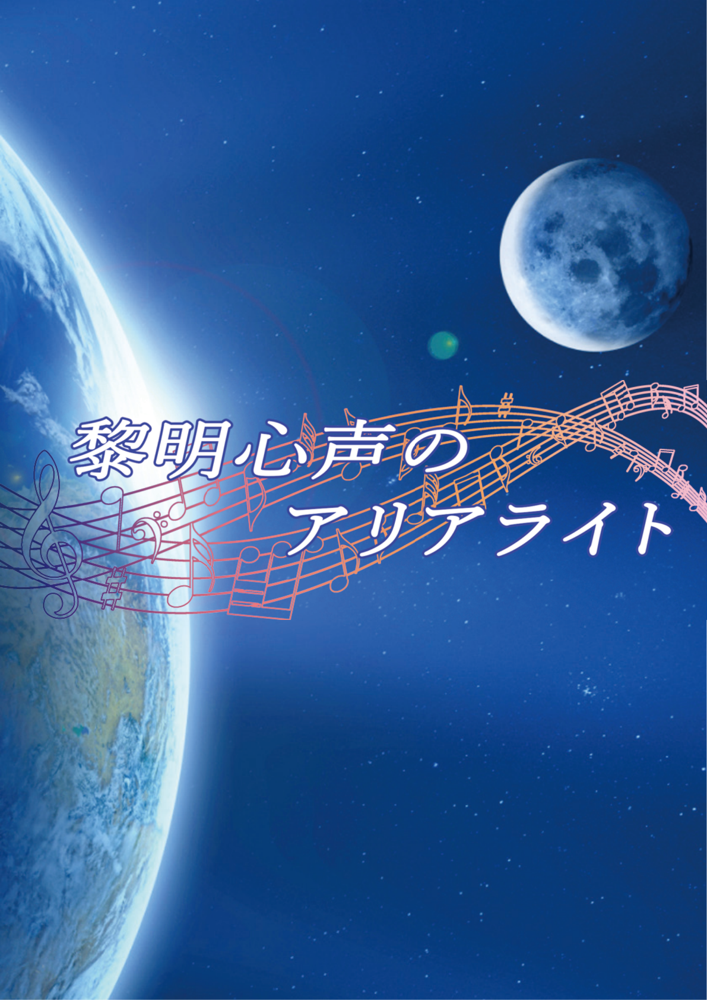

# 黎明心声のアリアライト — 完整劇本（GM 向）

> 〔**Double Cross The 3rd Edition** 劇本・**GM 向全劇透**〕本檔含完整劇情、真相、NPC／敵人數據與全結局，**玩家請勿閱讀**。PL 2 人，含 A／B／C 三路線。
>
> 變節者擴散兵器「妮克絲」、被囚的少女「艾露」與她的歌，以及橫亙在拯救與使命之間的抉擇——關於黎明、心聲與詠嘆之光的故事。
>
> 原作：サークル彩霧雪／イズミユキ（《DoubleCross The 3rd Edition》非公式劇本）。本檔為非官方繁中翻譯，僅供持有正版者個人遊玩參考。用語依 [`DX3_譯名對照表.md`](DX3_譯名對照表.md)。

<p align="center"></p>

---

## 本檔內容（請用左側目錄導覽）

- **劇本資料（PL 向）／GM 向資訊**：概要、HO、用語、GM 情報
- **共通路線**：開場（主持人場景・開場）→中段（含原菌戰、妮克絲真相、路線分歧點）
- **A 路線／B 路線／C 路線**：各自的高潮、回溯、結尾（A 殲滅・B 待命・C 拯救）
- **敵人・NPC 數據**：阿爾吉烏斯／劍／艾露／白辺壯一
- **附錄（短篇小說）・後記**

## 劇本資料（PL 向）

Double Cross The 3rd Edition　非官方劇本書

**黎明心聲的詠嘆之光（アリアライト）**
（黎れいめいしんせい明心声のアリアライト）

### 目次

目次
本書的閱讀方式
STAFF
劇本部分
開場前（プリプレイ）
劇本概要
預告（Trailer）
劇情提示（HO）
　全員共通劇情提示
　PC1 劇情提示
　PC2 劇情提示
NPC
用語
※注意※
GM 情報
故事：共通路線
故事：A 路線
故事：B 路線
故事：C 路線
開場階段
中段階段
中段戰鬥
敵人數據
　A 路線
　B 路線
高潮階段（A 路線）
結尾階段（A 路線）
事後處理（A 路線）
結尾階段（B 路線）
事後處理（B 路線）
C 路線
高潮階段（C 路線）
結尾階段（C 路線）
事後處理（C 路線）
高潮戰鬥（A・C 路線）
敵人數據
NPC 數據：艾露（エイル）
NPC 數據：白辺壯一
附錄（Appendix）
短篇故事
後記
版權頁

### 本書的閱讀方式

　本同人書籍是《Double Cross The 3rd Edition（以下簡稱 DX3rd）》的非官方劇本書。
　本書大致可分為 3 個部分。本項將就各部分加以解說。

#### ◆劇本部分

　本書的主要部分。
　收錄了原創劇本《黎明心聲的詠嘆之光（アリアライト）》。
　分為《開場前（プリプレイ）》、《GM 情報》、《劇本本篇》3 個部分，「GM 情報」以後預設僅供 GM 閱讀。

#### ◆附錄（Appendix）

　本書的次要部分。
　收錄了登場於《黎明心聲的詠嘆之光（アリアライト）》中的 NPC——「拳聖」白辺壯一與「百萬之砂（ミリオンサンズ）」艾許・雷德里克（Ash Redrick）的短篇故事，以及後記。

#### ◆版權頁

　收錄了關於本書製作者的諸般資訊、著作權相關記述等。

### STAFF

**◆劇本創作**
イズミユキ

**◆劇本顧問**
だみ、misto

**◆撰寫**
イズミユキ

**◆DTP**
イズミユキ

**◆編輯**
イズミユキ、だみ、misto、みさみさ

### 劇本部分　SCENARIO PART

**◆關於內容的複製**
　關於劇本部分的《開場前（プリプレイ）》、《劇情提示（HO）》、《NPC》、《用語》各項，僅限以輔助順利進行團務準備為目的之場合，准許在常識與良知的範圍內複製其內容。

### 開場前（プリプレイ）

▼PL 人數：2 人
▼使用階段：基本階段
▼經驗值：初期配發 130 點 + 追加配發 50 點 + 簡易效果（イージーエフェクト）取得用 6 點。合計 186 點。
▼使用規則書・補充包（略稱）：
　必須：基本 1・2、上級、IC、EA、LM
　可使用：PE、UG、RU、HR、RW、RWCE、BC、其他經 GM 認可的補充包
　※建議事先協調參加者的補充包持有狀況，統一環境。
　※採用 HR 時，道具『天之火』禁止取得。
▼推薦技能：〈意志〉
▼配發資源：劇本途中，以下資源將配發給 PC。
　・《原初之紫：妖精之手（原初の紫：妖精の手）》　3 回分
　・常時，使所有情報收集的達成值 +5 的效果。
▼其他：
　由於人數較少，強烈建議 PC 兩人皆具備攻擊能力。
　建議行動值 6 以上。行動值在 9 以上時，較容易對敵人取得先手。
　由於登場的敵人為複數體，具備範圍攻擊手段時較容易在戰鬥中取得優勢。
　依 PC 的選擇，劇本的路線將會分歧。

### 預告（Trailer）

聯絡領主（リエゾンロード）「操演者」所擁有的惡魔之力——變節者擴散兵器妮克絲（ニュクス）。
其試運轉導致大型都市全境原菌化（ジャーム化）的空前慘劇就此發生。
落於下風的 UGN 以衛星砲「天之火」進行廣域焚燒，勉強守住了日常。
有鑑於此，UGN 中樞評議員艾許・雷德里克（Ash Redrick）決定投入精銳遊擊部隊雷恩茲（レインズ）。
強襲聯絡領主率領的 FH 部族之戰艦。

於化為戰場的艦內所遇見的，是一名遭幽閉的少女。
年輕的日常守護者們並不知曉。
這場邂逅，正是左右人類未來的戰鬥之序曲。

**《黎れいめいしんせい明心声のアリアライト（黎明心聲的詠嘆之光）》**

如此這般，貫穿星辰的旋律（センリツ）盈滿世界——。

### 劇本概要

　聯絡領主（リエゾンロード）「操演者」所擁有的變節者擴散兵器妮克絲（ニュクス）。
　其試運轉使一整座都市盡數覺醒，發生了大規模的原菌化（ジャーム化）現象。
　藉由衛星砲「天之火」的廣域焚燒，以及情報隱蔽，UGN 勉強將其鎮壓。
　將事態看得極為嚴重的 UGN 本部，決定出動精銳遊擊部隊雷恩茲（レインズ）。
　令其襲擊聯絡領主率領的 FH 部族「迪納米斯（デュナミス）」之戰艦——。

### 劇情提示（HO）

#### 全員共通劇情提示

▼工作（ワークス）/ 掩護用身份（カヴァー）……UGN 特工兒童（エージェント・チルドレン）/ 雷恩茲隊員
▼劇本路易絲……艾露（エイル）　　　指定感情（不建議變更）……○P：盡力/N：不安
▼內容……
　你是隸屬於 UGN 精銳遊擊部隊雷恩茲（レインズ）的年輕（10 多歲～20 歲出頭左右）超越者。
　你與 PC2 是彼此將後背託付給對方的搭檔般的關係。
　強襲 FH 戰艦之際，你與 PC2 在艦內發現了一名遭幽閉的少女。
　決意保護尋求救助的少女——艾露（エイル），你們開始從戰艦撤退。
▼備考……
　最好是能保護艾露、並能為她積極盡力・交流的 PC。

#### PC1 劇情提示

▼工作（ワークス）/ 掩護用身份（カヴァー）……UGN 特工兒童（エージェント・チルドレン）/ 雷恩茲隊員
▼劇本路易絲……妮克絲（ニュクス）　　　推薦感情……P：執著/ ○N：威脅
▼內容……
　你是隸屬於 UGN 精銳遊擊部隊雷恩茲（レインズ）的年輕（10 多歲～20 歲出頭左右）超越者。
　你與 PC1 是彼此將後背託付給對方的搭檔般的關係。
　強襲 FH 戰艦的雷恩茲，未能發現目標妮克絲（ニュクス），更讓「操演者」得以脫離。
　為了不讓惡魔的超兵器再被使用——再度決意破壞妮克絲的你，開始從戰艦撤退。
▼備考……
　最好是優先考量身為 UGN 之使命的 PC。

> 上方「PC1 劇情提示」標題與內容於原書中分別對應 PC1、PC2 兩張提示卡：指定艾露（エイル）為路易絲者為 PC1，指定妮克絲（ニュクス）為路易絲者為 PC2。

### NPC

▼艾露（エイル）
　女性。年齡不明（外貌為十多歲中段）。
　於「操演者」的戰艦中被發現的少女。
　除了向 PC 尋求救助的一句話以外不發一語，以筆談進行意思溝通。
　探索著自己能做的事，主動提議要協助從戰艦撤退的 PC。
　或許是受到曾遭 FH 幽閉的影響，對所謂的日常頗為生疏。

▼「操そうえんしゃ演者」阿爾吉烏斯・雷福德（Argius Rayford）
　男性。年齡不明（外貌為壯年）。
　君臨於 FH 頂點的聯絡領主（リエゾンロード）。
　以使全人類覺醒為超越者、並使其抵達更前方的階梯為目的。
　率領 FH 部族「迪納米斯（デュナミス）」，並以戰艦作為移動據點。

▼「拳けんせい聖」白しらべ辺壮そういち一
　男性。58 歲。
　雷恩茲的隊長。異變魔獸（キュマイラ）/ 疾速靈猿（ハヌマーン）的超越者。
　將格鬥術鍛鍊至極限的使用者，其本領在 UGN 中被傳為最強。
　兼具足以擔任精銳部隊之長的實力，與守護日常到底的信念之人物。

▼雷恩茲（レインズ）
　PC 們所隸屬的、UGN 中樞評議會直屬的精銳遊擊部隊。
　與攻擊獵犬（ストライクハウンド）並列，享有 UGN 最強部隊的盛名，成員全員皆為最精銳的超越者。
　由於需在世界各地展開作戰，擁有潛水艦、航空機等不分陸海空的移動手段。

▼妮克絲（ニュクス）
　據說為「操演者」所擁有的變節者擴散兵器。
　形狀等詳情不明，但具有提升廣範圍變節者濃度的力量。
　「操演者」的戰艦上似乎裝載著某種重要之物，被認為極可能即是妮克絲。

▼天之火
　由 UGN 中樞評議員艾許・雷德里克（Ash Redrick）持有使用權的衛星兵器。
　藉由收束變節者並作為雷射照射，得以進行廣域焚燒。

### ※注意※

　下一頁起，「GM 情報」的部分將開始。
　為了愉快地遊玩本劇本，也請務必過目以下注意事項。

　「GM 情報」以後的部分包含大量的劇本劇透。以 PL 身分遊玩本劇本者，敬請避免閱覽。

　在你以 GM 或 PL 身分遊玩過本劇本之後談論其內容時，請對未讀・未玩過的人留意劇透。尤其是在網際網路上的留言板或 SNS 等公開場合的處理方式，敬請注意。

## GM 向資訊

### GM 情報

**▼開幕**
　由阿爾吉烏斯・雷福德所操縱的妮克絲（ニュクス），引發了大都市全境原菌化（ジャーム化）的事件。UGN 以天之火的廣域焚燒勉強鎮壓了事態，並為破壞妮克絲而投入雷恩茲（レインズ）。令其強襲迪納米斯（デュナミス）的戰艦。

**▼第一幕**
　身為雷恩茲隊員的 PC，在襲擊的敵戰艦中，保護了除了尋求救助的一句話以外不發一語的少女艾露（エイル）。
　另一方面，白辺壯一與阿爾吉烏斯的死鬥未分勝負，便迎來了阿爾吉烏斯脫離、以及破壞妮克絲失敗的結局。雷恩茲避免窮追，將敵戰艦炸毀轟沉後返回據點。

**▼第二幕**
　帶著艾露回到據點的 PC，依照她希望有人陪伴的願望，在據點內開始共同生活。
　由於對艾露的問訊陷入困難，PC 奉壯一之命與艾露一同外出，試圖解開她的心結。一行人前往遊戲中心遊玩。在艾露於設置的節奏遊戲中打出最高分數的直後，遊戲中心內發生了複數的原菌（ジャーム）。擊破原菌的 PC 帶著艾露返回據點。

**▼第三幕**
　PC 受壯一之命，調查遊戲中心內的原菌發生事件。
　查明的是：艾露是妮克絲啟動的鑰匙，而原菌是在她遊玩節奏遊戲之際的聲音所引發的。以及，她的聲音中寄宿著魅惑之力這項情報。那也意味著，PC1 與艾露所結下的羈絆，是藉由魅惑之力人為產生的。
　艾露被雷恩茲收容於單人牢房。
　壯一前去探訪牢房，然而……他所受的《腦部入侵（ブレインジャック）》與《融合》被解除，潛藏於他體內的阿爾吉烏斯現出了身影。阿爾吉烏斯告知：若不想被 UGN 殺死，就以自身的意志履行鑰匙的職責。然而艾露懷抱著與 PC 的羈絆，拒絕了那番話語。阿爾吉烏斯奪去艾露的自由意志，與她一同脫離現場。

**▼第四幕**
　PC 從壯一口中問出實情。此時，由阿爾吉烏斯發動的世界規模媒體入侵（メディアジャック）發生，被操縱的艾露的歌聲響起。世界各地的變節者濃度開始上升。PC 為打開局面，再度進行調查。調查的結果，查明地球的衛星「月」才是妮克絲的真身，並查明利用艾露的歌與天之火便可封印月球。

　依照 UGN 的命令抹殺艾露（A 路線）
　靜觀事態（B 路線）
　為拯救艾露而戰（C 路線）

　PC 被迫做出選擇。依此處的選擇，劇本將會分歧。
　分歧後的各故事，記載於下一頁。

### 故事：共通路線

（依第四幕的選擇，故事分歧為以下三條路線。）

### 故事：A 路線

**▼最終幕**
　選擇抹殺艾露的 PC，在激戰之末於摩天樓的屋頂擊破阿爾吉烏斯。恢復神智的艾露，理解了自己所引發的慘狀與 PC 的選擇，從摩天樓縱身一躍自決而去。

**▼閉幕**
　數日後，正在退租與艾露度過短暫共同生活的房間的 PC，一邊回想艾露所遺留的話語，一邊回歸雷恩茲的日常。

### 故事：B 路線

**▼閉幕**
　選擇靜觀事態的 PC。PC 以外的雷恩茲向阿爾吉烏斯挑戰，以壯一的殉職為代價贏得了勝利。恢復神智的艾露，理解了自己所引發的慘狀，從摩天樓縱身一躍自決而去。數日後，前往壯一墓前祭拜的 PC，與同樣正在祭拜的「百萬之砂（ミリオンサンズ）」艾許・雷德里克（Ash Redrick）相遇並交談。將守護了世界、犧牲而去者們的名字銘刻於心，PC 回歸雷恩茲的日常。

### 故事：C 路線

**▼第四幕**
　選擇拯救艾露的 PC。壯一試探 PC 的覺悟，並承諾協助。目送出擊的 PC 之後，壯一以昔日養父的身分說服艾許，取得了天之火的控制碼。

**▼最終幕**
　PC 抵達摩天樓的屋頂，在與阿爾吉烏斯的戰鬥中成功使艾露恢復神智。借助為了重要之人而歌唱的艾露之力，PC 擊破了阿爾吉烏斯。
　戰鬥之後，借 PC 之手站起的艾露，朝向妮克絲（ニュクス）紡織歌聲。經天之火收束的旋律被放射向月球，封印了其力量。沐浴於黎明之光，PC 與艾露分享了勝利。

**▼閉幕**
　另一方面，壯一為了就天之火的私自利用一事自首，再度與艾許取得聯繫。打算接受懲罰的壯一，艾許卻回答「寄去的代碼只是普通的便條」，反而說出掛念壯一安危的話語。結束通訊的壯一，向亡故的女兒訴說：艾許同樣也守護了世界給她看。
　一連串的事件落幕，UGN 為情報隱蔽耗費了 3 個月的時間之後。PC 受到因妮克絲被封印而失去鑰匙之力的艾露之邀，外出上街。以肉聲交談、愉快地度過爭取來的平穩的艾露。PC 對於與成為雷恩茲操作員見習生的她共度的全新日常，心馳神往。

## 共通路線（共通ルート）

### 開場階段

#### ◆主持人場景1◆ 開幕：慘劇

**◆解說**

變節者擴散兵器妮克絲（ニュクス）的試運轉，導致一整座大都市全數原菌化。UGN 以天之火進行廣域焚燒鎮壓事態，並命令雷恩茲（レインズ）抹殺聯絡領主（リエゾンロード），破壞妮克絲。

▼描寫

> ──那裡，是地獄。
>
> 所有具有生命的存在皆墮落為原菌，方才還是鄰人的怪物彼此之間，展開了以血洗血的殺戮。
>
> 街景燃燒，人們死去，苦痛與瘋狂的咆哮迴盪不絕。在俯瞰那片地獄的摩天樓上，一名男子佇立著。

阿爾吉烏斯・雷福德（Argius Rayford）

> 「妮克絲的試運轉看來是成功了。然而，真是精彩。」

▼描寫

> 以深沉而銳利的嗓音如此低語的那名男子──聯絡領主「操演者」回過頭去。雖無從窺知他視線的盡頭為何，但他的表情中，確實懷有喜悅。
>
> 對於這場慘劇、這場殺戮、化為壓倒性奔流在街上翻騰的變節者病毒，他滿足地見證著，並予以肯定。

阿爾吉烏斯・雷福德

> 「嚇到了嗎。也難怪。」
>
> 「但是，看好了。光是試運轉就足以讓一整座都市覺醒的壓倒性力量。」
>
> 「這正是為我那宿願開拓道路之物──」

▼描寫

> 唐突地切斷話語，與世界為敵的 FH 之王仰望被黑煙籠罩的天空，銳利地瞇起雙眸。

阿爾吉烏斯・雷福德

> 「哦……UGN 出乎意料地，決斷也挺快的。」
>
> 「離脫。成果已經充分取得。」

▼描寫

> 「操演者」宣告《瞬間退場》與《瞬間退場Ⅱ》。混入展開的領域之中，消失了身影。
>
> 而後，遲了數秒。光之柱撕裂陰雲，自宇宙（そら）傾注而下。
>
> 那是 UGN 所保有的衛星兵器天之火所施放的，以收束變節者雷射對一整座都市為對象的廣域焚燒。
>
> 街景、人們、曾經理所當然存在於此的日常的一切，皆被光所吞沒、蒸發殆盡。
>
> 而當光芒消散之時──那裡只剩下化為焦土的街景。

UGN 職員

> 「……確認廣域焚燒完成……生體反應，無法檢出。」

▼描寫

> 對於那份報告，握著天之火扳機的男子、UGN 中樞評議員艾許・雷德里克（Ash Redrick）以彷彿咬碎苦蟲般的表情回應。

艾許・雷德里克

> 「……不可大意。繼續進行周邊區域的索敵。」
>
> 「並以評議員權限命令最優先的情報隱蔽工作。即刻著手。」

UGN 職員

> 「是！　將安排向周邊地區派遣工作員的請求，以及與相關各國的協調。」

艾許・雷德里克

> 「……你還真是幹了好事，聯絡領主……！」

#### ◆開場階段◆

▼描寫

> 任由怒火擠出話語，艾許將拳頭重重砸在座椅的扶手上。
>
> 天之火施行的廣域焚燒，以及隨之而來的情報隱蔽就此執行，並向世界各國的 UGN 支部發出通報。
>
> FH 部族「迪納米斯（デュナミス）」所操縱的變節者擴散兵器妮克絲。其試運轉導致一座大型都市原菌化、毀滅。
>
> 見證了情報的傳達，艾許低語。

艾許・雷德里克

> 「……動用雷恩茲。」

UGN 職員

> 「動用他們……可是那樣的話，就欠了穩健派一個天大的人情……！」

艾許・雷德里克

> 「我不會說第二次。不能再讓那惡魔般的兵器被使用了！」
>
> 「除了以最大戰力將其撃滅之外，別無他路。」

▼描寫

> UGN 精銳遊擊部隊雷恩茲。
>
> 與艾許所掌握的天之火使用權同等、甚至更勝一籌的，UGN 所持的王牌。據說足以比肩攻擊獵犬（ストライクハウンド）的最大戰力。
>
> 率領那支部隊的隊長雖是親 UGN 穩健派的人物……但為了守護世界這份大義，眼下並非在意派閥之爭這等小事的時候。
>
> 因為足以引發此等局面的事態，已經發生了。

艾許・雷德里克

> 「給雷恩茲的命令有兩個。破壞妮克絲。然後──」
>
> 「──取下聯絡領主『操演者』阿爾吉烏斯・雷福德的首級。」

**◆結尾**

演完準備好的描寫後場景結束。

#### ◆開場1◆ 第一幕：邂逅

PC 全員

**◆解說**

受 UGN 中樞評議會敕命的雷恩茲，以潛水艦強襲聯絡領主的戰艦。進擊的 PC 們發現並保護了被幽禁於艦內的少女艾露（エイル）。

▼描寫

> 你們是隸屬於雷恩茲的超越者。受 UGN 中樞評議會──通稱樞軸（アクシズ）敕命，正欲襲擊 FH 部族「迪納米斯」所保有的戰艦。
>
> 施加了匿蹤改裝的雷恩茲潛水艦急速浮上，橫靠於航行中的迪納米斯戰艦旁。
>
> 從敞開的艙口，UGN 最強的精銳們躍身而出。站在突入部隊最前頭的，是雷恩茲隊長「拳聖」白辺壯一。

白辺壯一

> 「作戰目標是破壞妮克絲，以及聯絡領主的首級。竭盡死力。雷恩茲，前進！」

（從 PC 得到了回應）

▼描寫

> 遵從隊長的命令，你們開始向敵戰艦進擊。彷彿與此呼應一般，眾多 FH 成員上前迎擊。
>
> 為了阻止雷恩茲的猛攻，FH 成員射出的子彈逼近而來。然而──。

（敵人是臨時演員，就讓 PC 以描寫擊倒吧）

> 你們對擋路的敵人毫不在意，向戰艦深處進擊，將所有房間地毯式搜索。
>
> 如此擊破了好幾名 FH 成員後抵達的，是一扇施加了嚴密鎖定的門。
>
> 若憑你們的力量，要突破鎖定踏入深處也是可能的吧。要繼續前進嗎？

（PC 突破了門，繼續前進）

> 突破了門，以臨戰態勢突入的房間之中──。
>
> ──癱坐在地板上屏住呼吸、以不安的表情仰望你們的，一名少女的身影就在那裡。
>
> 她想必是察覺到了周遭展開的騷亂吧。少女凝視著闖入的你們之後，將臉轉向 PC1，下定決心般地開口。

艾露

> 《……救、救我》

> ※艾露的肉聲，與效果的標記同樣以《》框住。這是表現她的聲音蘊藏著魔性之力的演出。

▼描寫

> 只發出這一句話，少女便閉上了口。是因恐懼而無法動口，抑或是其他原因。在那之後，她再也不願開口說話。

（PC 表明要救助艾露）

> 少女點了點頭，拿起手邊的紙與筆，以文字向你們傳達。

艾露

> 『謝謝你。我，叫艾露。』

> ※艾露的筆談，以『』框住。

▼描寫

> 在 FH 戰艦上發現的、被幽禁的少女艾露。你們一面保護她，一面繼續作戰。

**◆結尾**

PC 保護艾露後場景結束。

#### ◆主持人場景2◆ 第一幕：「拳聖」vs「操演者」

**◆解說**

在戰艦的後部甲板，白辺壯一與阿爾吉烏斯・雷福德對峙。UGN 最強的個人戰力與聯絡領主之戰就此揭開序幕。

▼描寫

> 在雷恩茲攻入的戰艦後部甲板，兩名男子對峙著。
>
> 一人，是全身纏繞著非比尋常鬥氣的「拳聖」。被列為 UGN 最強個人戰力的男子，白辺壯一。
>
> 另一人，是讓六振感染了 EX 變節者病毒的劍隨侍於空中的 FH 之王。「操演者」阿爾吉烏斯・雷福德。

阿爾吉烏斯・雷福德

> 「竟能得見素有 UGN 最強之名的雷恩茲隊長『拳聖』。戰場果然有趣。」

白辺壯一

> 「毀滅一整座都市、踐踏無數日常的你，要來談論戰場之妙嗎。真是笑不出來的玩笑。」
>
> 「我不會問第二次。妮克絲在哪裡。」

阿爾吉烏斯・雷福德

> 「當然在我手中。無論是妮克絲、世界，還是人類的未來。」

白辺壯一

> 「……是嗎。」

▼描寫

> 簡短回答的下一瞬。壯一的身影高速消失，後部甲板響起沉重的打擊聲。
>
> 「拳聖」於剎那間放出的一擊，卻被隨侍於王的劍所擋下。

阿爾吉烏斯・雷福德

> 「別急著赴死。難得如此相見。難道你不想盡情地以力與技互相碰撞嗎。」

白辺壯一

> 「我奉命取你首級。那便以拳相談──！」

▼描寫

> 壯一再度展現神速的移動。隨即，阿爾吉烏斯的劍刺進了他方才所立之處。

阿爾吉烏斯・雷福德

> 「果然疾（はや）啊。若不總動員我的刃，怕是難以與你交手吧？」

白辺壯一

> 「嘖……說得倒好聽。」

▼描寫

> 自鞋底迸散火花、展現如風般迴避的壯一，手臂上刻下了一道傷痕。「拳聖」的背脊，淌過一道冷汗。

阿爾吉烏斯・雷福德

> 「來吧，讓我盡情地享樂一番。儘管起舞吧，『拳聖』。」

白辺壯一

> 「『操演者』之首級，由我之拳取下！」

▼描寫

> 六振劍隨侍於空中，放出令人膽寒的變節者波動的聯絡領主。
>
> 擺出甚至令人感到美麗的架式後，雷恩茲隊長伴隨裂帛般的氣勢逼近「操演者」。
>
> 後部甲板上，拳與劍無數次激烈碰撞的戰鬥聲迴盪──。

**◆結尾**

演完準備好的描寫後場景結束。

### 中段階段

#### ◆中段1◆ 第一幕：任務續行

PC 全員

**◆解說**

保護了艾露、開始撤退的 PC。在應對同伴的救援請求後返回潛水艦，被遍體鱗傷的白辺壯一所迎接。壯一表示讓「操演者」逃脫，妮克絲也很可能被一併帶走，他判斷再繼續作戰已屬困難，於是命令在爆破敵戰艦使其轟沉後返回據點。

▼描寫

> 保護了被幽禁少女的你們，面臨著一邊守護她、一邊續行任務這道難題。
>
> 在排除敵兵的你們身後，艾露浮現著不安的表情跟隨而來。
>
> 接獲「拳聖」正與聯絡領主交戰中這份通報的你們，以艾露的安全為優先，開始朝雷恩茲的潛水艦撤退。
>
> 途中，正在別區劃展開行動的同伴傳來通信。

雷恩茲隊員

> 「這裡是突入部隊 C 班！　遭到敵人包圍，請求支援！」

▼描寫

> 聽到此事的艾露，輕輕拉了拉你們的衣袖，以筆談傳達。

艾露

> 『去救他們吧。我也幫忙。』

▼宣告

此處發放艾露的 NPC 效果。

**◆NPC 效果：艾露**

- 原初之紫：妖精之手《原初の紫：妖精の手》3
  - 具體效果請確認 EA 刊載的《原初の紫》《妖精の手》。

▼宣告

展開於距離 C 班負責區劃最近位置的部隊，就是你們。

若前往救援同伴，雖視路線而定，但稍後會發放資源。

此外，前往救援時艾露也會以同行的形式跟隨，但無需特別擔心她的安危。

在考量這些之後，你們將如何行動？

（PC 不前往救援的情況）

▼描寫

> 你們以艾露的安全為優先，將 C 班的救援託付給別的部隊，繼續撤退。

> ※描寫成並非拋棄同伴，而是優先保護艾露，這樣會比較好。
> ※以銜接下一段壯一台詞的形式進行描寫。

（PC 前往救援的情況）

▼描寫

> 取得艾露的同意、前往支援別働隊的你們，抵達了數名雷恩茲隊員被眾多敵人包圍的現場。
>
> 要救援同伴，想必有必要突破敵陣。將發生判定。我來公開內容喔。

▼判定『敵陣的突破』

〈攻擊技能〉　10、20、30

※全員挑戰。對各人適用［未能通過的階段數］D 點的傷害（裝甲值・格擋值有效）。

（PC 結束判定與描寫）

雷恩茲隊員

> 「抱歉，得救了！　這份人情我一定會還！」

#### ◆中段階段◆

▼描寫

> 攻破敵陣的你們，與雷恩茲 C 班會合，重新開始撤退。
>
> 你們同心協力確保退路，成功後退至潛水艦。
>
> 與先行撤退的同伴們會合的你們，被全身負了好幾處傷的壯一所迎接。

白辺壯一

> 「回來了嗎。這邊與聯絡領主遭遇、交戰了，但……力有未逮，讓他逃脫了。妮克絲恐怕也被一併帶走。」
>
> 「無法回報諸君的奮戰，我心如刀割。我不作辯解。謝罪將於返回後進行。」

（得到了 PC 的反應）

> 「那麼，她就是報告中提到的保護對象嗎……」
>
> （面向艾露）「我們無意對你加害。或許很困難，但現在還請安心，小姐。」
>
> （面向 PC）「總之，先由你們待在她身邊。在這種狀況下，獨自一人想必也會感到不安吧。」

（PC 答應了）

> 「很好。那麼，收尾吧。命令爆破敵戰艦使其轟沉。」

雷恩茲隊員

> 「了解。進行起爆。」

▼描寫

> 遵從壯一的命令，別働隊設置在機關部的炸藥盛大地爆炸。那火焰在戰艦各處引發誘爆，對船體造成致命的損傷。
>
> 伴隨轟音而燃燒的戰艦，緩緩沒入海中。看著那情景直到最後，壯一回頭看向隊員們。

白辺壯一

> 「聯絡領主與妮克絲。雙方皆未能撃滅。然而，再繼續窮追下去，對部隊的負擔太大。」
>
> 「因此，以敵戰艦的轟沉作為此次作戰行動的終結。返航。當值者以外，自由休息。」

**◆結尾**

PC 們進入休息後場景結束。

#### ◆中段2◆ 第二幕：新的指令

PC 全員

**◆解說**

返回據點的 PC，依艾露的希望，與她展開了共同生活。數日的共同生活後，PC 被壯一召喚，得知對艾露的事情聽取陷入困境。壯一命令 PC 為了化解艾露的心防，帶她到街上去遊玩。

▼描寫

> 擊沉了 FH 部族「迪納米斯」所保有戰艦的雷恩茲，返回了最近的據點。
>
> 跟隨著走下潛水艦的你們，艾露也戰戰兢兢地邁步走進據點內。
>
> 她輕輕拍了拍你們的肩膀，運筆書寫。

艾露

> 『那個，你們是什麼人？』

（PC 自稱是 UGN）

> 『UGN……雖然不太懂，但好像不是壞人，我放心了。』

> ※艾露雖是超越者，但由於是被 FH 幽禁的實驗體，對於變節者病毒相關的情勢並不熟悉。

▼描寫

> 浮現出些微安堵的表情，艾露跟著你們走。
>
> 之後，雷恩茲結束了從壯一的謝罪開始的任務歸詢（デブリーフィング），就此解散，進入自由待命。
>
> 正當你們思考著該如何安置艾露時，壯一走了過來。

白辺壯一

> 「那麼，小姐。我有不少事想請教你。眼下，已備好了能讓你安定下來的單人房。我來為你帶路吧。」

艾露

> 『我，想和這些人在一起。獨自一人，很害怕。』

▼描寫

> 艾露以一臉抱歉的表情運筆，怯生生地捏住 PC1 的衣襬給壯一看。

白辺壯一

> 「……原來如此。是我的考量不周。我這就盡快備好附共用空間的三人房。」
>
> 「你們，也沒問題吧？」

> ※雷恩茲被壯一施以鐵的風紀。若因 PC 中有男性等情況而對共同生活提出疑問之聲，可以告知：一旦起了邪念，壯一的鐵拳便會飛來，因此共同生活是安全的。

（PC 答應了共同生活）

> 「那麼，就這麼辦。我馬上備好房間。在食堂等候準備，並帶艾露小姐過去。」

（得到了 PC 的反應）

▼描寫

> 就這樣，你們與艾露的共同生活開始了。
>
> 基本上，採取在你們接受訓練期間，對艾露實施聽取調查的形式。
>
> 從嚴酷的訓練回到房間後，艾露必定在共用空間等待著，以寫在紙上的『歡迎回來！』這句話迎接你們。
>
> 她那樣的模樣，在你們的心中喚起了些許暖意……或許吧。
>
> 共同生活開始後過了數日的時候。你們被召喚到了壯一的執務室。

白辺壯一

> 「來了嗎。啊，放輕鬆無妨。」
>
> 「進入正題吧。召你們前來的理由不為別的。對艾露小姐的聽取調查陷入了困境。」
>
> 「她被 FH 幽禁，看來是遭遇了相當痛苦的經歷。對於我方的提問，得不到明確回答的狀況。」
>
> 「加上，她雖是超越者，對於變節者病毒相關的知識也很生疏。作為前提，到這裡為止首先沒有問題吧？」

（得到了 PC 的反應）

> 「嗯。所以說。你們，帶艾露小姐到外面去遊玩。」

（得到了 PC 的反應）

> 「理由有兩個。一個，是顧慮她的精神狀態。一直被關在據點裡，心情也會消沉吧。」
>
> 「另一個理由，是算計。藉由化解她的心防，有可能取得價值更高的情報。」
>
> 「事不宜遲，明天就去街上吧。不過，要讓她以為是你們利用休假主動開口邀約的。」
>
> 「這是任務。外出期間也算作勤務時間。以上，有什麼問題嗎？」

（PC 答應了任務）

> 「很好。解散，去完成任務。」

**◆結尾**

PC 答應了與艾露外出的任務後場景結束。

#### ◆中段3◆ 第二幕：短暫的日常

PC 全員

**◆解說**

到街上去的 PC，在艾露感興趣的電玩遊樂中心與她一同享受各式各樣的遊戲。最後挑戰節奏遊戲，艾露以更新全國排行榜最高分的壓倒性遊玩魅惑了 PC。但就在此時，一般客人的尖叫聲突然響起。

▼描寫

> 隔天。你們帶著艾露，前往街上。
>
> 艾露一邊耀眼地眺望著眼前展開的「日常」風景，一邊以筆談向你們傳達感謝。

艾露

> 『謝謝你們兩個帶我出來。你們是在為我著想對吧。』

（得到了 PC 的反應）

▼描寫

> 就這樣，當你們走在街上時……艾露對遠處看見的一棟頗大的建築物表現出興趣。
>
> 那是最近才落成的大型電玩遊樂中心，這點你們應該是知道的吧。

艾露

> 『那棟大建築物是什麼呢？』

（PC 回答了）

> 『原來如此。也有那種東西呢。』

▼描寫

> 一臉理解地點頭的艾露，不時地將視線投向那棟話題建築物。看來是想去玩玩。

（PC 詢問是否要去電玩遊樂中心）

艾露

> 『可以嗎？　太好了！』

▼描寫

> 她表現出喜悅，當場小小地蹦蹦跳跳給你們看。大概是代替聲音的肢體動作吧。
>
> 你們帶著心情大好的艾露，前往電玩遊樂中心。
>
> 進入設施，便被前來遊玩的其他客人的聲音與爆音 BGM 等喧囂所迎接。

艾露

> 『好厲害。這裡全部，都是用來遊玩的地方。』

▼描寫

> 雙眼閃閃發光，艾露興奮地運筆書寫。

▼宣告

那麼，接下來請各位一邊與艾露玩遊戲，一邊通過判定。

也可以用財產 P（連投硬幣）後付達成值。

▼判定『賽車遊戲』

〈運轉：〉　5

※全員挑戰。只要一人成功即判定通過。

※全員失敗時，配發經驗值『與艾露享受了日常』的項目減少 1 點。

※艾露也挑戰判定。比較各自的達成值，決定賽車的名次。

▼判定『猜謎遊戲』

【精神】　5

※全員挑戰。只要一人成功即判定通過。

※全員失敗時，配發經驗值『與艾露享受了日常』的項目減少 1 點。

※艾露也挑戰判定。比較各自的達成值，決定分數的名次。

▼判定『硬幣遊戲』

〈調達〉　6

※全員挑戰。只要一人成功即判定通過。

※全員失敗時，配發經驗值『與艾露享受了日常』的項目減少 1 點。

※艾露也挑戰判定。比較各自的達成值，決定獲得硬幣的數量。

▼給 GM

艾露的數據記載於 P.44。

當 PC 與艾露進行判定、各遊戲的勝負決定後，最好留出時間描寫 PC 與艾露的反應。

這個判定的目的，在於讓艾露與 PC 一同體驗日常的樂趣。

身為被幽禁實驗體的艾露，並不習慣「在日常中遊玩」這件事。在電玩遊樂中心所見的各式各樣事物，對她而言想必都是新鮮的刺激。建議 GM 一邊意識到這些點、一邊進行描寫。

（判定與描寫結束了）

▼描寫

> 你們與艾露一起玩了各式各樣的遊戲。於是……。

艾露

> 『欸，那是什麼呀？』

▼描寫

> 艾露如此說著、表現出興趣的，是節奏遊戲。俗稱的音樂遊戲。

▼宣告

最後請各位挑戰這個判定。

▼判定『節奏遊戲』

〈芸術：音樂〉　5

※全員挑戰。只要一人成功即判定通過。

※全員失敗時，配發經驗值『與艾露享受了日常』的項目減少 1 點。

※艾露也挑戰判定。比較各自的達成值，決定分數的名次。

（PC 的判定與描寫結束了）

▼描寫

> 讓 PC 們示範過後，艾露以無比認真的表情凝視著畫面，選擇難易度，但是……看似初次挑戰的她所選的，是全曲中的最高難易度。

艾露

> 『看好喔。這是飽含今天謝意之情的，我的音。』

▼描寫

> 如此以文字告知後，艾露纖細的手指輕快地敲下開始鍵。

▼給 GM

這個判定的目的，在於描寫艾露音樂感覺的驚人之處。基本上，設想是由艾露做出最高的達成值。

若 PC 的判定發生關鍵值（クリティカル）等情況，導致艾露的達成值令人不安時，使用 EA 刊載的疾速靈猿（ハヌマーン）效果《ウィンドブレス》4 與《援護の風》5，增加艾露的達成值與判定骰。

即便如此仍對是否能勝過 PC 的達成值感到不安時，在向 PC 傳達此判定目的之後，讓艾露使用 EA 刊載的疾速靈猿敵人效果《ミューズの調べ》1，在判定結果上加算任意達成值，使其超過 PC 的達成值。

▼描寫

> 前奏開始，慢了一拍，大量音符標記從畫面上方高速傾注而下。
>
> 即便看到那景象也毫不慌亂，艾露精準地連打著機台的按鍵。Just Timing 的顯示連續流過，分數以驚人的速度攀升。
>
> 你們在感到驚愕的同時，也不由得看得入了神。
>
> 艾露奏出的音，是何等地令人愉悅啊！
>
> 全身搖擺著乘上節奏、浮現笑容的她的模樣，讓人感到無比美麗而尊貴。
>
> 不久音樂結束，她的演奏也迎來終幕。
>
> 打出 Perfect Full Combo、更新全國排行榜最高分的她，帶著大功告成的神情離開機台，回到你們身邊。

艾露

> 『如何？　我也挺厲害的吧。』

（被 PC 驚訝・稱讚了）

> 『呵呵呵。怎麼樣。』

▼描寫

> 就這樣，當你們正熱絡起來時，突然，電玩遊樂中心內的一般客人發出尖叫。

一般客人

> 「哇啊啊啊──！」

（得到了 PC 的反應）

**◆結尾**

PC 對一般客人的尖叫做出反應後場景結束。

#### ◆中段4

**第二幕：異變**

PC 全員

##### ◆解說

　遊戲中心內發生複數的原菌，引發混亂。PC 與原菌進行戰鬥，鎮壓事態。隨後帶著意志消沉的艾露，返回雷恩茲的據點。

▼描寫

> 突如其來地響起一聲慘叫。正當你們確認發生了什麼事時……眼前出現的，是襲向一般客人的異形怪物——原菌的身影。
>
> 而且，相同的異變似乎正在遊戲中心內的複數地點同時發生。

▼台詞：一般客人

> 「怪、怪物！這傢伙是什麼，住手，咿呀啊啊啊啊！」
>
> 「救命，誰來救救我，啊啊啊啊啊！」

※這是一般客人臨死前的描寫，若在場有不擅長這類演出的 PL，可以省略。

▼描寫

> 面對突然出現的原菌群，遊戲中心已陷入一片混亂。再這樣下去，難以避免會出現重大傷亡。

▼宣告

> 此時若宣告《警戒領域（ワーディング）》，便能將原菌的注意力吸引過來。你們要怎麼做？

（PC 使用了《警戒領域（ワーディング）》）

> 原本無差別襲擊人們的原菌被《警戒領域（ワーディング）》吸引，朝你們衝了過來。
>
> 中段戰鬥即將發生。
>
> 敵人為『原菌』× 2 體。各接戰（エンゲージ）之間的距離為 5m。戰鬥終了條件為全部敵人陷入戰鬥不能。

※可以事先告知 PL，艾露的 NPC 效果在戰鬥中也能使用。

（PC 的戰鬥前描寫結束了）

（開始中段戰鬥）

（中段戰鬥結束了）

▼描寫

> 成功排除原菌的你們身旁，面色蒼白的艾露快步跑了過來。

▼台詞：艾露

> 『兩位，你們沒事吧！？』
>
> 『太好了……吶，剛剛那些怪物是什麼……？』

（向她說明了原菌的事）

> 『……我明白了。』

▼描寫

> 從那之後，艾露便神情凝重地沉默不語。她那纖細的身軀，微微地顫抖著。
>
> 不能再讓她承受更多負擔了。你們聯絡了 UGN，等待善後處理班抵達後，便返回雷恩茲的據點。

##### ◆結末

　PC 完成戰鬥後的描寫、前往據點後，場景結束。

##### ◆戰鬥終了條件

　全部敵人陷入戰鬥不能。

##### ◆戰鬥配置

　敵人為『原菌』× 2 體。

　PC 為 1 接戰，在其前方 5m 處將 2 體敵人配置為 1 接戰。

##### ◆戰鬥方案

▼原菌

　不進行移動。

　以主要動作，將侵蝕率較低的 PC 作為攻擊對象，使用連攜『恐懼咆哮『テラーハウリング』』。

　對於針對自身的攻擊則宣告閃避（ドッジ）。達成值藉由《迴避（イベイジョン）》2 固定為 18。

```
PC　　　　　　　　　　PC
　　　　　 5m
原菌1　原菌1　　　　原菌2　原菌2

接戰　　角色
```

##### 敵人數據

### ◆原菌

**基本數據**

| 項目 | 內容 |
|---|---|
| 症狀（シンドローム） | 異變魔獸《キュマイラ》 |
| 能力值 | 【肉體】6【感覺】2【精神】2【社會】2 |
| 技能 | 〈RC〉4 |
| 侵蝕率／HP／行動值／裝甲值／格擋值 | 100% ／ 64 ／ 6 ／ 0 ／ 0 |

**戰鬥數據相關 E 路易絲**

> 不應存在之物『ありえざる存在（アースシェイカー）』× 1

**取得效果（已依侵蝕率修正 Lv）**

> ●主要動作：
> 集中：異變魔獸《コンセントレイト：キュマイラ》2
> 魔獸的本能《魔獣の本能》2
> 魔獸的衝擊《魔獣の衝撃》2
> 不應存在之物《アースシェイカー（ありえざる存在）》2
> ●反應：迴避《イベイジョン》2
> ●常時：生命增強《生命増強》1

**連攜（コンボ）**

> 『恐懼咆哮『テラーハウリング』』
> 　タイミング：主要動作
> 　集中：異變魔獸《コンセントレイト：キュマイラ》2＋魔獸的本能《魔獣の本能》2＋魔獸的衝擊《魔獣の衝撃》2＋不應存在之物《アースシェイカー》2
> 　技能：〈RC〉
> 　ダイス：11 個
> 　關鍵值（クリティカル）C 值：8
> 　難易度：對決
> 　對象：單體
> 　射程：視界
> 　攻擊力：+5
> 　解說：將威壓聽聞者的咆哮，化為衝擊波從口中發射。命中時，於場景間，對象進行的所有判定的骰子減少 2 個。

#### ◆中段5

**第三幕：不協和音（1）**

PC 全員

##### ◆解說

　返回據點的 PC，被壯一命令調查原菌發生的相關情報。在推進調查的過程中，懷疑落到了艾露身上。

▼描寫

> 你們折返回雷恩茲的據點，將艾露送回房間後，便向壯一進行報告。

▼台詞：白辺壯一

> 「辛苦了。但是原菌同時發生嗎……真有種不祥的預感。妮克絲（ニュクス）方面正在追蹤調查中，目前沒有大的動向……」
>
> 「好，我命令你們對此事進行情報收集。不可鬆懈，全力以赴。」

（得到 PC 的回應）

> 「我把我的情報權限暫時交給你們。可以拿來協助調查。」

▼宣告

> 公開壯一的 NPC 效果。

##### ◆NPC 效果：白辺壯一

・『情報權限『情報権限』』

　適用常時效果。PC 進行的所有情報收集判定的達成值增加 5。

▼台詞：白辺壯一

> 「若沒有其他問題，此事就到此為止。還有什麼事嗎？」

（PC 的疑問解決了）

> 「很好。解散，去執行任務吧。」

（得到 PC 的回應）

▼宣告

> 公開情報收集項目。

▼情報收集『原菌發生事件的調查（1）』

〈情報：UGN〉　10

▼情報『原菌發生事件的調查（1）』

> 調查事件發生當時的狀況後，發現遊戲中心周邊的變節者病毒（レネゲイド）濃度曾上升。
>
> 對已覺醒的超越者而言，這只是微不足道的變化，但對未覺醒的保菌者來說，變節者病毒濃度的變化卻是劇藥。
>
> 由此，遊戲中心內的變節者病毒保菌者覺醒。推測是因為無法承受衝擊而原菌化。
>
> 公開情報收集『原菌發生事件的調查（2）』。

▼情報收集『原菌發生事件的調查（2）』

〈情報：UGN〉　12

▼情報『原菌發生事件的調查（2）』

> 調查變節者病毒濃度上升的中心後，發現其座標正指向你們當時所在的地點。
>
> 這也就是說，變節者病毒濃度的上升是在你們周遭發生的。
>
> 若原因不是你們自身，那麼可能性最高的便是艾露。看來有必要推進調查。
>
> 公開情報收集『關於艾露』。

##### ◆結末

　若有情報收集的描寫便完成它，然後場景結束。

#### ◆中段6

**第三幕：不協和音（2）**

任意 PC

##### ◆解說

　PC 進行情報收集，觸及了艾露所背負的祕密。在壯一的命令下，艾露遭到拘束。

▼描寫

> 你們繼續調查，一點一點地接近真相。

▼情報收集『關於艾露（1）』

〈情報：UGN、情報：FH〉　12

▼情報『關於艾露（1）』

> 艾露的真面目，是由 FH 部族「迪納米斯（デュナミス／Dynamis）」所造出的實驗體，是啟動變節者擴散兵器妮克絲（ニュクス）的鑰匙。
>
> 她所感染的變節者病毒是經 FH 調整過的特殊之物，會透過她奏出的音律來發揮效果。
>
> 由於在遊戲中心玩了節奏遊戲，她身為鑰匙的力量雖然微弱但發動了，使周遭的變節者病毒濃度上升。
>
> 公開情報收集『關於艾露（2）』。

▼情報收集『關於艾露（2）』

〈知識：變節者病毒（レネゲイド）〉　11

▼情報『關於艾露（2）』

> 身為妮克絲之鑰而被調整變節者病毒的艾露，寄宿著特別的力量。那便是以音律魅惑對象的能力。
>
> 你們想了起來。被玩著節奏遊戲的她所魅惑的那一刻。以及在戰艦上被她求救時的情景。
>
> 平日不發出聲音的她，理解自身的聲音寄宿著力量。然而她，卻以肉聲向 PC1 求救。
>
> PC1 與艾露結下的羈絆（劇本路易絲），是……藉由她特別的能力，被人為製造出來的。
>
> 路易絲感情之所以成為「指定感情」，正是因為如此。

（情報收集的描寫結束了）

▼描寫

> 你們觸及了真相。觸及了那殘酷的真相——艾露是啟動妮克絲的鑰匙，而與她的羈絆是偽造之物。
>
> 你們借用壯一的情報權限進行了調查。理所當然地，調查所得的情報壯一也會知曉。
>
> 壯一立即編成部隊，帶著你們前往艾露等候的房間。

▼台詞：白辺壯一

> 「打擾了。艾露小姐，我要拘束妳。原因妳應該能夠理解吧。」

▼描寫

> 壯一話音剛落的瞬間，雷恩茲隊員們舉起了槍。
>
> 只要稍有抵抗便會被毫不留情地處決——同屬雷恩茲的你們，輕易便能想像得到。

▼台詞：白辺壯一

> 「你們，有什麼想說的話嗎？」
>
> 「我不允許她發出聲音，但……最後道別程度的話，我可以允許。」

（PC 與艾露說完話了）

▼描寫

> 壯一命人捕縛艾露。艾露無力地垂著頭，在你們面前被押解離去。一瞬間，她將視線投向你們，但那張口卻終究沒有發出聲音。
>
> 在一切結束的房間裡……只剩下一張寫著『歡迎回來！』的筆談用紙，孤伶伶地落在地上。

##### ◆結末

　艾露被押解離去後，場景結束。

#### ◆主持人場景3

**第三幕：若無意志**

##### ◆解說

　壯一造訪被拘留於單人牢房的艾露。他被阿爾吉烏斯施加暗示，藉由《融合》潛伏在其體內。阿爾吉烏斯現身，告知艾露以自己的意志解放力量。艾露懷抱著與 PC 的羈絆予以拒絕，但被阿爾吉烏斯操縱，離開了現場。

▼描寫

> 無力地坐在備好的單人牢房床鋪上，艾露低垂著頭。
>
> 牢房外不遠處，有複數名武裝的雷恩茲隊員。此時，向 UGN 本部報告完畢的壯一前來造訪。

▼台詞：白辺壯一

> 「看守辛苦了。我有些話要跟她說。你們先迴避一下吧。」

▼台詞：雷恩茲隊員

> 「可是……這樣好嗎？」

▼台詞：白辺壯一

> 「無妨。面對一個年幼的小姑娘，我不會出岔子的。」

▼描寫

> 讓看守的隊員們退下後，壯一面對艾露的牢房，開口說道。

▼台詞：白辺壯一（阿爾吉烏斯・雷福德）

> 「我來接妳了，我的歌姬。」

▼描寫

> 艾露驚訝地抬起原本低垂的臉。緊接著，壯一周圍展開了領域，從中浮現出 6 把劍。
>
> 凶刃的劍尖朝向壯一自身，刺穿了他的身體與四肢，如同昆蟲標本般將他釘在牆上。

▼宣告

> GM 將進行效果宣告。
>
> 解除對壯一所使用的《腦部入侵《ブレインジャック》》與《融合》的效果。
>
> 壯一的暗示被解開，而且——。

▼描寫

> 從被串刺的壯一身體中，現出了另一個人物的身影。那名男子，靜靜地浮現出勝利者的微笑。

▼台詞：阿爾吉烏斯・雷福德

> 「好久不見了，艾露。」

▼台詞：艾露

> 《唔——！》

▼台詞：白辺壯一

> 「聯絡、領主……！」

▼描寫

> 艾露倒抽一口氣。
>
> 阿爾吉烏斯朝著被釘在牆上、淌著大量鮮血的壯一開口。

▼台詞：阿爾吉烏斯・雷福德

> 「辛苦你了，『拳聖』。」
>
> 「與你的死鬥確實令人心潮澎湃，但似乎身為『操演者』的我之力更勝一籌。」

▼台詞：白辺壯一

> 「你這傢伙……！」

▼描寫

> 現身的 FH 之王，回頭望向拼命忍住不發出慘叫的艾露。

▼台詞：阿爾吉烏斯・雷福德

> 「果然封印了聲音嗎。在試運行中理解了自己的力量，心生畏懼了吧。」
>
> 「……雖然教人憐惜，但妳看不清現實。妳應該已經明白了。」
>
> 「再這樣下去，妳會被 UGN 殺死。得救的手段只有一個。再次解放妳的力量。」
>
> 「變節者病毒會回應宿主的意念而增強其力。當妳以自己的意志解放力量之時，人類便將從超越者進化為——不」
>
> 「進化為其更上層的階梯，原初者（プライメイト）的時刻便將到來。」
>
> 「選擇吧。是在此死去。還是高歌通往新世界的福音。」

▼描寫

> 那根本算不上是選擇。
>
> 艾露低下頭，緊握住顫抖的拳頭。深深吸了一口氣——那封印，被決然地打破了。

▼台詞：艾露

> 《……我不要。》

▼台詞：阿爾吉烏斯・雷福德

> 「……妳說什麼？」

▼描寫

> 在回應艾露之聲而增大的變節者病毒波動之中，她以彷彿要射穿眼前支配者的目光，怒視著對方。

▼台詞：艾露

> 《那些人，對我很溫柔。我很開心。很溫暖。他們教會了我日常的可貴。》
>
> 《作為一點點的回禮，我想著有沒有連我也能做到的事。我想把這種不需要嗓音的音樂……把這份心意，傳遞給他們。》
>
> 《就算是虛假的羈絆，就算我的音律傳達不到……唯獨這份心意，不是謊言。所以——》
>
> 《——我絕對，不會背叛那些人！》

▼描寫

> 被解放的心意，化為力量襲向阿爾吉烏斯。
>
> 正面承受了鑰匙之力，阿爾吉烏斯微微踉蹌。然而——。

▼台詞：阿爾吉烏斯・雷福德

> 「……真是遺憾。妳的變節者病毒並非為戰鬥而調整之物。」
>
> 「不過，原來如此……那就是妳的結論嗎。既然如此，我也回敬妳一個相應的答覆吧。」

▼宣告

> 阿爾吉烏斯，對艾露宣告《腦部入侵《ブレインジャック》》。將她的行動置於支配之下。

▼台詞：艾露

> 《唔、啊……PC1、PC2……！》

▼台詞：白辺壯一

> 「你竟做出這種事……可恥啊，聯絡領主！」

▼描寫

> 眼中點亮的決意之光被抹消，艾露淪為人偶。
>
> 「操演者」百無聊賴地望著吐血嘶吼的壯一，展開了領域。

▼台詞：阿爾吉烏斯・雷福德

> 「無可奈何。雖然會多花些時間，但……計畫就此付諸實行。」
>
> 「讓世界覺醒。如此一來，人類才得以首次踏上進化的階梯，伸手觸及更進一步的可能性。」

▼宣告

> 阿爾吉烏斯宣告 E 路易絲『囚徒的鳥籠『囚人の鳥籠』』與《瞬間退場》。

▼描寫

> 聯絡領主帶著被操縱的艾露，消失於領域之中。

##### ◆結末

　完成備好的描寫後，場景結束。

#### ◆中段7

**第四幕：福音**

PC 全員

##### ◆解說

　PC 從壯一口中問出事情的經過。此時，阿爾吉烏斯發動了大規模的媒體入侵。被操縱的艾露奏出的福音，使世界規模的變節者病毒濃度開始微幅上升。為了打開局面，PC 繼續進行調查。

▼描寫

> 阿爾吉烏斯與艾露離開後不久，察覺異變的你們雷恩茲突入單人牢房。救出被串刺的壯一，並詢問事情的緣由。

▼台詞：白辺壯一

> 「——就是這麼回事。我犯下了一生的疏失。真的非常抱歉。」
>
> 「聯絡領主，是想藉由將艾露小姐逼入絕境，讓她以自身的意志解放力量。」
>
> 「變節者病毒會回應意志。要讓妮克絲的力量發揮到極致，恐怕那是必要的吧。」

▼描寫

> 壯一話說到此處的瞬間，告知據點非常事態的警報響徹四周，雷恩茲的隊員衝進病房。

▼台詞：雷恩茲隊員

> 「報告。FH 發動了大規模媒體入侵。敵方自稱為聯絡領主『操演者』！」

▼台詞：白辺壯一

> 「果然動手了嗎……把影像放出來。」

▼描寫

> 隊員依壯一所言，病房的終端機上映出了媒體入侵的情景。

▼台詞：阿爾吉烏斯・雷福德

> 「初次見面。我名為『操演者』阿爾吉烏斯・雷福德。是祕密結社 FH 的最上級幹部。」
>
> 「還請各位原諒我突如其來的無禮。從現在起，我將透過這次播送，為諸君送上嶄新的可能性。」
>
> 「世界將踏上進化的階梯，人類得以伸手觸及更進一步的可能性。」
>
> 「這便是，通往新世界的福音。」

▼描寫

> 電視、廣播、網路。透過一切媒體，響起了一道聲音。
>
> 雖然只聽過一次，但你們可以確信。那不是別人，正是艾露的聲音。

（得到 PC 的回應）

> 如此，貫穿群星的戰慄（センリツ）瀰漫於世界——。
>
> 福音開始流淌後不久，你們確實感受到自身的變節者病毒產生了反應。

▼台詞：雷恩茲隊員

> 「報告！世界規模的變節者病毒濃度，似乎已開始微幅上升！再這樣下去，真的會……！」

▼宣告

> 變節者病毒濃度的上升，也會對你們造成些微影響。請立即將侵蝕率上升 1%。
>
> 此外，今後在登場進入場景時，侵蝕率的上升量將恆常增加 +1%。

（得到 PC 的回應）

▼台詞：白辺壯一

> 「……陷入窘境了啊。UGN 本部為了打破事態，將不擇手段。也有可能再次動用天之火。」
>
> 「雷恩茲也會接到出擊命令——對聯絡領主與艾露小姐的抹殺命令吧。但若是那樣，你們就得退出這次作戰。」

（PC 問起理由）

> 「儘管時間短暫，但你們既然曾與艾露小姐共度時光，便無法否定會被她的力量魅惑，作戰時下不了手的可能性。」
>
> 「身為雷恩茲的隊長，我不能讓處於那種狀態的人上前線。」
>
> 「你們在作戰後方繼續負責情報收集。這是命令，明白嗎？」

（PC 答應了）

> 「很好。那麼退出，去執行命令吧。」

（PC 退出了）

▼描寫

> 就這樣，眾人為了出擊準備與調查而退出後，壯一在病房中靜靜地呢喃。

▼台詞：白辺壯一

> 「……話說回來。但願在出擊前，他們能探尋出打開局面的一手才好。」
>
> 「我也被牽動了情感啊……真是老了。是吧，奏（かなで）。」

▼描寫

> 壯一從懷中取出一張照片凝視著。
>
> 褪色的照片中，一名胸前掛著太陽眼鏡的金髮年輕男子，與一名眼神兇惡之處不知為何有些像壯一的年輕女子，並肩笑著。

#### ◆中段8

**第四幕：尋鑰**

PC 全員

##### ◆解說

　PC 進行情報收集，步步逼近真相。

▼宣告

> 公開情報收集項目。

▼情報收集『拯救艾露的方法』

〈知識：變節者病毒（レネゲイド）、情報：UGN〉　12

▼情報『拯救艾露的方法』

> 拯救艾露的方法，是擊破聯絡領主，並使她失去身為妮克絲之鑰的職責。
>
> 為此，有必要逼近至今仍無法掌握真面目的妮克絲之真相。
>
> 公開情報收集『妮克絲的真相』。

▼情報收集『妮克絲的真相』

〈情報：UGN、情報：FH〉　12

▼情報『妮克絲的真相』

> 妮克絲的真面目，是寄宿於地球的衛星『月』之中的變節者存在（RB）。
>
> 妮克絲原本是「規劃者（プランナー）」都築京香的盟友——24 體 RB 中的 1 體，但在遙遠的過去與她決裂的存在。
>
> 正如自古以來所言『月使人瘋狂』，妮克絲能夠干涉地球，使變節者病毒濃度上升。
>
> 艾露的歌聲，是為了能夠連結（アクセス）妮克絲而被調整過的。
>
> 公開情報收集『鎮壓妮克絲的方法』。

#### ◆中段9

**第四幕：覺悟**

PC 全員

##### ◆解說

　藉由調查找出打開局面之一手的 PC，向壯一進行報告。壯一告知雷恩茲已下達對艾露與阿爾吉烏斯的抹殺命令，並詢問 PC 的選擇。依 PC 的選擇，劇本將大幅分歧。

▼情報收集『鎮壓妮克絲的方法』

【精神】　合計 30

※藉由 D 路易絲『工作員『工作員（マグネイト）』』，情報被隱蔽。

※藉由不斷累加 PC 們的達成值，合計達成值將會增加。

※藉由將侵蝕率上升 ［1D+1］%，便能反覆進行判定。

▼情報『鎮壓妮克絲的方法』

> 妮克絲在物理上無法破壞。若說有打開事態的可能性，那便是鎮壓月的活性化，封印其力量。
>
> 妮克絲本身並無干涉地球變節者病毒的意志，只不過是透過福音，使其能力被賦予了指向性而已。
>
> 要拯救世界，必須以超越已活性化的妮克絲之出力，透過艾露送出封印月的歌。
>
> 為此的方法是……以天之火收束艾露歌中寄宿的變節者病毒，並朝向月照射。
>
> 身為一介雷恩茲隊員的你們，並沒有天之火的使用權。但若是雷恩茲隊長白辺壯一，或許會握有某種手段。

▼描寫

> 結束調查後，你們向壯一進行報告。聽完結果，壯一神情嚴峻地告知。

▼台詞：白辺壯一

> 「原來如此。來自月的變節者病毒干涉嗎，真是膽大包天。本想說『虧你們找出了道路』，但這邊的狀況也有了變化。」
>
> 「阿許・雷德里克（Ash Redrick）評議員下達了雷恩茲的出擊命令。任務內容是，抹殺艾露小姐與聯絡領主。」
>
> 「作戰失敗時，恐怕打算以天之火將敵陣連同整個區劃一起焚毀。」
>
> 「你們，要怎麼做。是身為世界的守護者完成使命。是為日後作準備而靜觀事態推移。還是貫徹你們找出的道路。」

▼宣告

> GM 提示選項。依 PC 的選擇，劇本的路線將大幅變化。

▼選項

A 路線……『加入作戰，抹殺艾露』
　與阿爾吉烏斯的決戰→回溯（バックトラック）→結尾階段

B 路線……『退出作戰，靜觀事態推移』
　回溯（バックトラック）→結尾階段

C 路線……『為拯救艾露而戰』
　與阿爾吉烏斯的決戰→封印月→回溯（バックトラック）→結尾階段

▼關於後續劇本

　依 PC 所選擇的路線，劇本將大幅變化。

　GM 請配合所選的路線，參照劇本。各路線分別刊載於以下頁面。

　A 路線……P.27 →P.28 ～30
　B 路線……P.27 →P.31 ～32
　C 路線……P.33 ～41

#### ◆A：中段9

（PC 選擇了 A 路線）

▼台詞：白辺壯一

> 「那就是你們的道路嗎……我明白了。」
>
> 「身為世界的守護者，期待你們奮戰。著手進行出擊準備吧。」

（得到 PC 的回應）

▼描寫

> 下定為守護世界而討伐艾露的決心與覺悟的你們，為了出擊準備，離開了病房。

##### ◆結末

　PC 前往進行出擊準備後，場景結束。

　前往 P.28 的『高潮階段（A 路線）』。

#### ◆B：中段9

（PC 選擇了 B 路線）

▼台詞：白辺壯一

> 「那就是你們的道路嗎……我明白了。」
>
> 「命令你們於據點待命。心中或許有所掛念，但……我，不會責備你們的選擇。」
>
> 「懷抱迷惘站上戰場的人，可能會殺死自己，也可能殺死同伴。所以——這樣就好。」

（得到 PC 的回應）

▼描寫

> 你們退出作戰，離開了病房。

##### ◆結末

　PC 離開病房後，場景結束。

　前往 P.31 的『結尾階段（B 路線）』。

A 路線

B 路線

## A 路線（A ルート）

### 高潮階段（A 路線）

#### ◆A：高潮1◆

**最終幕：破碎的福音**

PC 全員

##### ◆解說

前往福音中心座標——摩天樓屋頂的 PC，成功擊破了阿爾吉烏斯。藉此恢復神智的艾露，理解到自己所引發的慘狀，從摩天樓縱身一躍、了結自我。

▼描寫

> 遵照壯一的出擊命令，雷恩茲搭乘航空機接近福音的中心座標——艾露所在的摩天樓上空。
>
> 任由擺布、持續編織福音的艾露佇立於摩天樓屋頂，將其踩在腳下，你們進入空降的姿態。

（若在中段1 中，PC 曾前往救援雷恩茲隊員，則進行以下描寫，並公開 NPC 效果）

▼台詞：雷恩茲隊員

> 「……喂，你們還記得嗎？在 FH 部族『迪納米斯（デュナミス）』的戰艦上，你們和艾露小姐冒著危險救了我們。」
>
> 「我至今仍滿懷感激。事情會變成這樣雖然令人遺憾……但身為雷恩茲，就讓我們拚盡全力吧。」

▼宣告

> 公開雷恩茲隊員的 NPC 效果。

##### ◆NPC 效果：雷恩茲隊員

- 『UGN 精銳遊擊部隊』
  在高潮戰鬥開始之前，將 PC 所受的一切傷害無效化。
  藉由此效果，即使在降落至摩天樓途中遭到迎擊，PC 仍能毫髮無傷地抵達艾露身邊。

▼描寫

> 航空機的艙門開啟，高聳入雲的摩天樓，以及在夜空中閃耀的月亮，映入眼簾。

▼台詞：雷恩茲隊員

> 「那麼，出發吧。空降，30 秒前！」
>
> 「20 秒！……10 秒！……3、2、1，開始降落！」

▼描寫

> 朝著眼下的夜景縱身躍下的雷恩茲。
>
> 敵人不可能沒察覺到雷恩茲的突襲，6 振利劍隨即凌空飛舞，朝迎擊而來。

（雷恩茲隊員的 NPC 效果未公開）

▼宣告

> 因敵方迎擊，對 PC 全員適用 3D 點的 HP 傷害。

（雷恩茲隊員的 NPC 效果已公開）

▼描寫

> 聯絡領主（リエゾンロード）操縱的凶刃也朝你們逼近，但……那劍尖在抵達你們之前，便被同袍們擋了下來。
>
> 承受著反射月光的刀刃，一個、又一個同袍接連倒下……即便如此，他們仍展現出對自身職責的貫徹。
>
> 即使只剩最後一人，他們也不為保全自身、而是為了守護你們挺身而出——終於，你們毫髮無傷地降落在艾露等候的摩天樓屋頂上。

（抵達屋頂）

▼描寫

> 摩天樓屋頂另一側。艾露俯瞰著世界，以空洞的眼眸持續編織福音。
>
> 而站在她身旁、迎接你們的，是一名男子。

▼台詞：阿爾吉烏斯・雷福德

> 「……來了啊，舊世界的守護者。」
>
> 「我的使命不會改變。身為聯絡領主『操演者』，唯有守住通往新世界的福音而已。」

▼描寫

> 應和著阿爾吉烏斯的話語，6 振利劍再度於空中展開。

### 高潮階段（A 路線）

▼宣告

> 阿爾吉烏斯宣告 E 路易絲『惡意的傳染』。自此之後，他將被限制登場於後續場景。
>
> 自他本身散發出的強大變節者波動向你們襲來。請進行衝動判定。

▼衝動判定

> 〈意志〉　9

▼GM 須知

> 若判斷 PC 的侵蝕率已上升過高，亦可省略衝動判定。

▼宣告

> 進行高潮戰鬥的通告。
>
> 敵人為『阿爾吉烏斯』×1 體、『劍 A』×2 體、『劍 B』×2 體、『劍 C』×2 體。
>
> 相鄰接戰（エンゲージ）間的距離為 5m。戰鬥終了條件為『擊破阿爾吉烏斯』。
>
> 阿爾吉烏斯取得了 E 路易絲『覺醒的世界』。若他存活至結尾階段，世界便會確信超越者的存在，日常將就此崩潰。
>
> 本劇本的 E 路易絲（＋相當品）共計 12 個。

▼台詞：阿爾吉烏斯・雷福德

> 「執著於舊世界、阻礙人類可能性、毫無大義之徒啊。化作獻給未來的祭品而消逝吧。」

（PC 完成戰鬥前的描寫後）

（開始高潮戰鬥）

▼GM 須知

> 高潮戰鬥的配置與敵人數據與 C 路線共通，故記載於 P.42～43。

（高潮戰鬥結束後）

▼描寫

> 在死鬥的盡頭，你們擊倒了聯絡領主，奪取了勝利。
>
> 障礙已消除，剩下的任務只有抹殺艾露。
>
> 隨著『操演者』的敗北，《ブレインジャック》（腦部入侵）解除。艾露凝視著眼前的慘狀，瞬間理解了自己所做的一切。

▼台詞：艾露

> 《你們是來，終結我的吧。》

▼描寫

> 看著你們的表情，她大概也察覺到了任務的內容。艾露寂寞地微笑，以那被詛咒的聲音對你們訴說。
>
> 魅惑之聲向你們襲來，但下定決心的你們，憑藉精神力彈開了那道詛咒。

▼台詞：艾露

> 《對不起，讓事情變成這樣。我讓好多人，都嚐到了悲傷的滋味。》
>
> 《可是啊，雖然很任性，但能和大家相遇，我真的很高興。我所破壞的東西、大家想要守護的東西……它們有多麼珍貴，你們都教會了我。》
>
> 《……我好想把我的聲音，送到你們兩個人面前。但我已經明白，那已經無法實現了。》
>
> 《所以啊，我要走了。》

▼描寫

> 夜風吹拂，艾露在屋頂邊緣回過頭來，望向你們。

▼台詞：艾露

> 《再見了，我珍視的人們。謝謝你們。》

▼描寫

> 最後，她說出了對前來殺害自己的你們的感謝。沐浴在月光中的歌姬寂寞地笑著——縱身舞向夜空。

##### ◆結局

艾露了結自我後，場景結束。

##### ◆回溯（バックトラック）◆

本劇本的 E 路易絲（＋相當品）共計 12 個。以下記載其內訳。

- E 路易絲
  - 『不應存在之物（アースシェイカー）』×2
  - 『囚徒的鳥籠』×1
  - 『惡意的傳染』×1
  - 『覺醒的世界』×1
  - 『超越活性（ヴァリアブルウェポン）』×1
- D 路易絲
  - 『工作員（マグネイト）』×1
- 相當品
  - 『？？？』×1（計為 E 路易絲 5 個份）

### 結尾階段（A 路線）

#### ◆A：結尾1◆

**閉幕：謝謝你**

PC 全員

##### ◆解說

收拾與艾露共度的房間。

▼描寫

> 在 UGN 的奮戰下，FH 部族『迪納米斯（デュナミス）』連同聯絡領主一同潰滅。
>
> 隨著艾露之死，圍繞變節者擴散兵器妮克絲（ニュクス）的一連串事件落下帷幕。所造成的損害難以估量，但時間終將解決一切。
>
> 短暫的日常得以守護。一名少女的犧牲，在幾個人的胸中留下了傷痕……即便如此，世界仍持續運轉。
>
> 在這之中，你們為了退掉與艾露共度的三人房間，正在整理行李。
>
> 一如預期，艾露的私人物品極少，收拾工作順利地進行著。
>
> 忽然間，她生前用來筆談的紙張映入眼簾。你們要確認內容嗎？

（確認筆談用紙）

> 當你們翻閱筆談用紙時，她生前寫下的話語，一句接一句地映入眼簾。

▼台詞：艾露／描寫

> 『歡迎回來！』
> 帶著笑容迎接你們的話語。
>
> 『你們兩個都，還好嗎！？』
> 為與原菌（ジャーム）戰鬥的你們擔憂的話語。
>
> 『我想和這些人在一起。一個人，好可怕。』
> 不安地捏著 PC1 的衣角寫下的話語。
>
> 『去救他們吧。我也來幫忙。』
> 在陌生的戰場上，仍鼓起勇氣寫下的話語。

▼描寫

> 然後——重讀著她話語的你們，翻到了最初的那一頁。

▼台詞：艾露

> 『謝謝你。我，叫艾露。』

▼描寫

> 那裡寫著的，是連結起艾露與你們的起點與終點的、感謝的話語。
>
> ……你們收拾完房間，回到了身為雷恩茲的日常之中。
>
> 世界持續著。在無人知曉的眾多犧牲之上，描繪出脆弱卻尊貴的軌跡。
>
> 然而，或許正是這樣的日子，才是艾露——那寂寞地笑著的歌姬所期盼的日常。

### 結尾階段（A 路線）

### 善後處理（アフタープレイ）（A 路線）

##### ◆經驗值計算（A 路線）

- 達成劇本目的……10 點（以下內訳）
  - 與艾露共享了日常……5 點
  - 擊破了聯絡領主……5 點
- 敵人的 E 路易絲（＋相當品）……12 點
- S 路易絲未化為泰特司……5 點
- 其他項目……5 點
- 依最終侵蝕率所得經驗值……n 點
- 合計……32＋n 點

##### ◆回溯（バックトラック）◆

本劇本的 E 路易絲（＋相當品）共計 12 個。以下記載其內訳。

- E 路易絲
  - 『不應存在之物（アースシェイカー）』×2
  - 『囚徒的鳥籠』×1
  - 『惡意的傳染』×1
  - 『覺醒的世界』×1
  - 『超越活性（ヴァリアブルウェポン）』×1
- D 路易絲
  - 『工作員（マグネイト）』×1
- 相當品
  - 『？？？』×1（計為 E 路易絲 5 個份）

## B 路線（B ルート）

### 結尾階段（B 路線）

#### ◆B：結尾1◆

**閉幕：在犧牲之上**

PC 全員

##### ◆解說

雷恩茲以壯一的殉職為代價，了結了阿爾吉烏斯。恢復神智的艾露，理解到自己所引發的慘狀，從摩天樓縱身一躍、了結自我。

▼描寫

> 依照 UGN 中樞評議會下達的命令，雷恩茲及周邊地區數個支部的戰力，被投入到艾露與聯絡領主等候著的摩天樓。
>
> 強忍傷勢出擊的『拳聖』，以與『操演者』同歸於盡的形式殉職。UGN 最強的戰士，為守護世界而殞落於戰場。
>
> 失去聯絡領主的 FH 部族『迪納米斯（デュナミス）』，被周邊支部派遣的戰力討伐殆盡，戰場上只剩下艾露一人的局面。
>
> 因『操演者』的死亡而使《ブレインジャック》（腦部入侵）解除的艾露，凝視著眼前的慘狀，瞬間理解了自己所做的一切。
>
> 雷恩茲的隊員向你們發來通訊。

▼台詞：雷恩茲隊員

> 「PC1、PC2。狀況你們都在監看著吧。有什麼……想對她說的話嗎？」
>
> 「我也懂讀唇術。我會盡可能把她的話，轉達給你們。」

▼描寫

> 說著，雷恩茲隊員將終端切換為影像通訊模式，對準艾露。
>
> 看著畫面上顯示的你們，艾露的眼中泛起淚水。那不是悲傷，也不是痛苦……而是為你們平安無事而喜悅的淚水。
>
> 艾露的嘴唇動了起來，讀取到的雷恩茲隊員試著為其翻譯。

▼台詞：艾露

> 『……對不起，讓事情變成這樣。白辺隊長、雷恩茲的各位、還有 PC1 和 PC2……我讓好多人，都嚐到了悲傷的滋味呢。』
>
> 『可是啊。雖然很任性，但能和大家相遇，我真的很高興。我所破壞的東西、大家想要守護的東西……它們有多麼珍貴，你們都教會了我。』
>
> 『……我好想把我的聲音，送到 PC1 和 PC2 面前。但我已經明白，那已經無法實現了。』
>
> 『所以啊，我要走了。』

▼描寫

> 夜風吹拂，艾露在屋頂邊緣回過頭來，望向你們。

▼台詞：艾露

> 《再見了，我珍視的人們。謝謝你們。》

▼描寫

> 最後，她以那被詛咒的聲音說出這番話。沐浴在月光中的歌姬寂寞地笑著——縱身舞向夜空。

##### ◆結局

艾露了結自我後，場景結束。

### 結尾階段（B 路線）

#### ◆B：結尾2◆

**閉幕：化作基石（いしずえ）**

PC 全員

##### ◆解說

前往壯一墓前祭掃的 PC，與艾許相遇並交談。

▼描寫

> 在 UGN 的奮戰下，FH 部族『迪納米斯（デュナミス）』連同聯絡領主一同潰滅。
>
> 隨著艾露之死，圍繞變節者擴散兵器妮克絲（ニュクス）的一連串事件落下帷幕。所造成的損害難以估量，但時間終將解決一切。
>
> 短暫的日常得以守護。一名少女的犧牲，在幾個人的胸中留下了傷痕……即便如此，世界仍持續運轉。
>
> 在這樣的某一天，你們前來為壯一掃墓。當你們走向長眠著世界守護者們的墓地一隅時，那裡已有先客。
>
> 艾許・雷德里克中樞評議員。正是他命令雷恩茲去討伐艾露。
>
> 他察覺到你們後，以憮然的表情讓出了位置。

▼台詞：艾許・雷德里克

> 「『拳聖』的舊部下嗎……原來如此。最初保護艾露小姐的，似乎就是你們呢。」
>
> 「今天我是以私人休假的身分來這裡的。現在的我，既不是 UGN 中樞評議員、也什麼都不是。在此前提下，我想問你們。」
>
> 「以艾露小姐為犧牲，世界得以守護。人們的記憶被操控，將繼續過著短暫的日常。她的覺悟、她的願望……都不會被任何人知曉。」
>
> 「對於這樣的世界存在方式，你們作何感想？」

（從 PC 處得到回應後）

> 「……沒有犧牲，便無法完成守護世界的職責。當然，不該怠於減少犧牲的努力就是了。」
>
> 「艾露小姐是以自己的意志結束了生命。沒有再讓任何人弄髒雙手……為守護世界，化作了日常的基石。」
>
> 「即便世界遺忘了她，你們也……要記住。這就是守護那建立於犧牲之上的世界者的責任。」
>
> 「……差不多到時間了。雖然是徒有其名的短暫休假……但也算是一段耐人尋味的時光。」
>
> 「那麼，告辭了。為了守護世界的大義，期待你們一如既往的奮戰。」

▼描寫

> 留下最後一句話，艾許從壯一的墓前離去。
>
> 目送著他的背影，映入視野的是無數的墓碑。那上面全都刻著化作日常基石之人們的名字。
>
> 你們反覆咀嚼著艾許的話語，立誓絕對不會忘記，將艾露的名字——那寂寞地笑著、消逝於月夜的歌姬之名，銘刻於心中。

##### ◆結局

PC 掃墓結束後，場景結束。

### 善後處理（アフタープレイ）（B 路線）

##### ◆經驗值計算（B 路線）

- 達成劇本目的……5 點（以下內訳）
  - 與艾露共享了日常……5 點
- 敵人的 E 路易絲（＋相當品）……12 點
- S 路易絲未化為泰特司……5 點
- 其他項目……5 點
- 依最終侵蝕率所得經驗值……n 點
- 合計……27＋n 點

## C 路線（C ルート）

### 中段階段（C 路線）

#### ◆C：中段9◆

（PC 選擇了 C 路線）

▼台詞：白辺壯一

> 「……要貫徹自己的道路嗎。但是，現在已經沒有以正規程序說服上層的餘裕了。」
>
> 「即便如此……你們仍要說要拯救艾露小姐嗎？」

▼描寫

> 壯一靜靜地瞇起眼睛問道。鬥氣刺入你們全身，化作強大的重壓襲來。

▼宣告

> 壯一宣告《超越者の眼力》（超越者之眼力）與《超越的能力》（超越性能力）。
>
> 雖然是特殊的裁定，但他要藉由威壓你們，來衡量你們覺悟的強度。
>
> 請進行判定。

▼判定『展現覺悟』

> 〈意志〉　9
> ※全員挑戰。只要有一人成功，即視為判定通過。
> ※全員失敗時，另起場景再次挑戰。

▼台詞：白辺壯一

> 「……是嗎。我做了像在試探你們的舉動。原諒我。」
>
> 「看來我也到了該下定決心的時候。好吧，我就陪你們的這場賭注到最後。」
>
> 「身為雷恩茲隊長命令你們。天之火由我來想辦法。你們要盡早趕往救出艾露小姐。」
>
> 「去吧。把你們珍視的日常，一點不剩地全部奪回來給我看。」

▼GM 須知

> 此後，中段9 的描寫將以 GM 為主體進行。
>
> 在進入描寫前，先告知 PL 這一點為佳。

（PC 出擊後）

▼描寫

> 屏退眾人的壯一取出通訊終端，聯絡艾許・雷德里克的私人終端。
>
> 不久，話筒另一端響起了艾許不耐煩的聲音。

▼台詞：艾許・雷德里克

> 「有何貴幹，『拳聖』殿下！狀況您應該明白吧！而且，還打到我這支終端……若不是您，我早就無視了！」

▼台詞：白辺壯一

> 「抱歉了。我就直說。我有極為個人的理由，想請你給我天之火的使用權限。」

▼台詞：艾許・雷德里克

> 「啥？您在說什麼……要我讓您私自利用天之火！？」

▼台詞：白辺壯一

> 「正是如此。這不是『拳聖』，而是白辺壯一的……曾經身為你養父（ちち）的這個老頭子的請求。」
>
> 「我清楚這是禁招。但是……我找到了拯救艾露小姐的手段。」

▼台詞：艾許・雷德里克

> 「您被打動了嗎！如今已經一刻都不容耽擱了。怎能為了區區一名少女，讓世界陷於危險之中！」

▼台詞：白辺壯一

> 「你打算以大義為盾，重蹈我女兒……奏（かなで）犧牲的覆轍嗎。我也好、你也好，都背負著她的死，在這殘酷的世界裡，仍為守護日常而戰至今。」
>
> 「這是一個失去女兒的可憐老兵，畢生的請求。責任全由我來承擔。拜託你……拜託你！」

▼描寫

> 沉默。艾許沒有回應。但一聲郵件的通知音，打破了那份寂靜。

### C 路線

▼台詞：艾許・雷德里克

> 「……我居然，搞錯了終端，把機密代碼發了出去。請勿開封，立即將資料抹除。」
>
> 「……這是評議員命令。不容違抗。你明白的吧，『拳聖』。」

▼台詞：白辺壯一

> 「……當然。感謝您的信任，雷德里克評議員。」

▼台詞：艾許・雷德里克

> 「……哼。」

▼描寫

> 沒有再多的問答，通訊結束。
>
> 壯一毫不猶豫地開封寄達的郵件，果然，那裡……正如艾許所言，記載著一行代碼。

▼宣告

> 公開艾許・雷德里克的 NPC 效果。

##### ◆NPC 效果：艾許・雷德里克

- 『Code：I pray for you.』
  藉由在高潮戰鬥中取勝，便能鎮住妮克絲（ニュクス）。

▼台詞：白辺壯一

> 「『為你祈禱』……這樣就好。未來，正應該託付給年輕的一代。」
>
> 「做好覺悟吧，阿爾吉烏斯・雷福德。」

▼描寫

> 病房內，響起了壯一靜靜的宣戰布告。

##### ◆結局

完成準備好的描寫後，場景結束。

### 高潮階段（C 路線）

#### ◆C：高潮1◆

**最終幕：福音與歌聲**

PC 全員

##### ◆解說

PC 抵達艾露等候的摩天樓，迎戰與阿爾吉烏斯的決戰。讓艾露恢復神智，並接受她以歌聲提供的支援，PC 成功擊破阿爾吉烏斯。

▼描寫

> 遵照壯一的出擊命令，你們搭乘航空機接近福音的中心座標——艾露所在的摩天樓上空。
>
> 艾露在摩天樓屋頂，任由擺布地持續歌唱。將那光景遠遠踩在腳下，你們進入了空降的姿態。

（若在中段1 中，PC 曾前往救援雷恩茲隊員，則進行以下描寫，並公開 NPC 效果）

▼台詞：雷恩茲隊員

> 「……喂，你們還記得嗎？在 FH 部族『迪納米斯（デュナミス）』的戰艦上，你們和艾露小姐冒著危險救了我們。」
>
> 「我至今仍滿懷感激。要是你們沒有來救我們，我們根本沒辦法活著待在這裡。」
>
> 「所以啊……我們一定會把你們送到艾露小姐身邊。相信我們，全力去戰鬥……然後贏下來。」

▼宣告

> 公開雷恩茲隊員的 NPC 效果。

##### ◆NPC 效果：雷恩茲隊員

- 『UGN 精銳遊擊部隊』
  在高潮戰鬥開始之前，將 PC 所受的一切傷害無效化。
  藉由此效果，即使在降落至摩天樓途中遭到迎擊，PC 仍能毫髮無傷地抵達艾露身邊。

▼描寫

> 航空機的艙門開啟，高聳入雲的摩天樓，以及在夜空中閃耀的月亮，映入眼簾。

▼台詞：雷恩茲隊員

> 「那麼，出發吧。空降，30 秒前！」
>
> 「20 秒！……10 秒！……3、2、1，開始降落！」

▼描寫

> 朝著眼下的夜景縱身躍下的雷恩茲。
>
> 敵人不可能沒察覺到雷恩茲的突襲，6 振利劍隨即凌空飛舞，朝迎擊而來。

（雷恩茲隊員的 NPC 效果未公開）

▼宣告

> 因敵方迎擊，對 PC 全員適用 3D 點的 HP 傷害。

（雷恩茲隊員的 NPC 效果已公開）

▼描寫

> 聯絡領主（リエゾンロード）操縱的凶刃也朝你們逼近，但……那劍尖在抵達你們之前，便被同袍們擋了下來。
>
> 承受著反射月光的刀刃，一個、又一個同袍接連倒下……即便如此，他們仍展現出對自身職責的貫徹。
>
> 即使只剩最後一人，他們也不為保全自身、而是為了守護你們挺身而出——終於，你們毫髮無傷地降落在艾露等候的摩天樓屋頂上。
>
> 屋頂的另一側。艾露俯瞰著世界，以空洞的眼眸持續編織福音。
>
> 或許是妮克絲（ニュクス）的活性化正在進展，周圍如暴風般狂捲著壓倒性的變節者奔流——而在其中，有一名男子泰然自若地走著。

▼台詞：阿爾吉烏斯・雷福德

> 「……來了啊，舊世界的守護者。」
>
> 「我的使命不會改變。身為聯絡領主『操演者』，唯有守住通往新世界的福音而已。」

### 高潮階段（C 路線）

> ▼宣告

阿爾吉烏斯宣言 E 路易絲 惡意的傳染『悪意の伝染』×1。

從此以後，他登場於後續場景的次數受到限制。

從他本人散發出的強大變節者波動向你們襲來。請進行衝動判定。

> ▼衝動判定

〈意志〉　9

> ▼給 GM

若判斷 PC 的侵蝕率已上升過高，可省略此衝動判定。

另外，受限於版面，高潮戰鬥的配置與敵人數據統一記載於 P.42～43。

> ▼宣告

進行高潮戰鬥的宣告。

敵人為『阿爾吉烏斯』×1 體、『劍 A』×2 體、『劍 B』×2 體、『劍 C』×2 體。

相鄰接戰區（エンゲージ）之間的距離為 5m。戰鬥終了條件為『擊破阿爾吉烏斯』。

阿爾吉烏斯取得了 E 路易絲 覺醒的世界『覚醒する世界』。若他存活到結尾過程，世界將會確信超越者的存在，日常將會崩潰。

本劇本的 E 路易絲（＋相當品）共計 12 個。

此外，受妮克絲的干涉影響，變節者的奔流狂暴肆虐。

公開妮克絲的 NPC 效果。

#### ◆NPC 效果：妮克絲（相當於 E 路易絲 5 個）

**・宵闇之福音『宵闇の福音』**

PC 在攻擊時無法使用效果。

敵人進行的所有判定的 C 值−1（下限值 2）。

> ▼宣告

PC 可藉由消耗輪進行（ラウンド進行）中的主要動作，來挑戰我方的判定。

> ▼判定『解除艾露的腦部入侵《ブレインジャック》』

〈意志〉　12

※ PC 全員成功時，視為判定通關。

※若已對艾露取得路易絲，達成值＋3。

※若已對艾露取得 S 路易絲，達成值再＋3。

※判定通關時，輪進行中斷，事件發生。

※事件結束後，敵人全部視為已行動，經過先制過程（イニシアチブプロセス）與結束過程（クリンナッププロセス）後，重新開始新的一輪。

阿爾吉烏斯・雷福德
> 「執著於舊世界、阻擋人類可能性、毫無大義之徒啊。化作通往未來的祭品，消散吧。」

（PC 完成了戰鬥前的描寫）

（開始高潮戰鬥）

（艾露的腦部入侵《ブレインジャック》被解除了）

> ▼描寫

被你們的話語喚回神智、轉過頭來的艾露，從她那空洞的雙瞳中，溢出了一行淚水。然後——。

——福音，停止了。

世界充滿寂靜。然而那寂靜並沒有持續太久。

打破沉默，一份真切的想念被編織而出。

艾露
> 《……謝謝你。我也想和大家一起戰鬥。所以——》

> ▼描寫

從艾露腳下升起的影子，包裹住她的全身。一瞬之後，影子散去之處——

艾露
> 《——傳達吧。我的歌。》

> ▼給 GM

建議在此時機播放樂曲。

這是艾露飽含對 PC 想念的歌。配合戰鬥，挑選氣勢十足的曲子或許不錯。

供參考，試玩時使用的是 EGOIST 的樂曲『The Everlasting Guilty Crown』。

> ▼描寫

身著嶄新裝束的艾露，其意志化為歌聲響徹世界。

她的旋律、她的願望、她那純粹的想念。中和了妮克絲的干涉，賦予你們戰鬥所需的力量。

> ▼宣告

公開新的 NPC 效果。

#### ◆NPC 效果：艾露（歌姬）

**・黎明的歌聲『黎明の歌声』**

無效化妮克絲的 NPC 效果。

PC 進行的所有判定的 C 值−1（下限值 2）。

將『NPC 效果：艾露』中記載的原初之紫：妖精之手《原初の紫：妖精の手》的 Lv＋1。也就是說，可以額外使用 1 次原初之紫：妖精之手《原初の紫：妖精の手》。

（高潮戰鬥結束了）

#### ◆結末

高潮戰鬥結束後，場景結束。

#### ◆C：高潮 2 ◆

最終幕：黎明心聲的詠嘆之光（アリアライト）

PC 全員

##### ◆解說

擊破了阿爾吉烏斯的 PC。艾露竭盡全力，再度編織歌聲。透過天之火送達月亮的歌聲，將妮克絲的力量封印。艾露聲音中的詛咒被解除，PC 與艾露沐浴在黎明的光輝中，分享喜悅。

> ▼描寫

敗於你們之手，聯絡領主倒下了。

剩下的使命，就只有讓艾露的歌聲收束，並以天之火射穿月亮。然而——。

歌聲停止，艾露大大地搖晃了一下。想必是身心的消耗已接近極限。

面對為她擔憂的你們，她卻露出微笑。

艾露
> 《沒事的。可是我，到底該怎麼做才好呢？》
>
> 《該怎麼做，才能把大家想守護的東西，一起守護下去呢？》

（PC 催促她歌唱）

> 《……我明白了。兩位，我有個請求。》
>
> 《請——幫幫我。》

> ▼描寫

用著與初次相遇時相同的話語，艾露向你們伸出了手。

你們會握住艾露的手嗎？

（PC 握住了艾露的手）

互相握住彼此的手，你們站了起來。

歌姬決然地仰望天空，吸了一口氣。

> ▼給 GM

建議在此時機播放樂曲。

這是為了封印妮克絲的歌。配合狀況，挑選氛圍莊嚴的曲子或許不錯。

供參考，試玩時使用的是葦原ユノ starring yu-yu 的樂曲『光のアリア (orchestra version)』。

> ▼描寫

如此，貫穿星辰的旋律（センリツ）充滿了世界——。

艾露的歌，環繞著世界。它不僅止於地上，更傳達至遙遠高空——浮於宇宙（そら）的人造之星。

旋律中蘊含的變節者收束，從這顆承載著祈禱的人類之星，朝向古老的星辰（つき），一道劃破夜空的光條被描繪而出。

有一個男人，從血海之中仰望著那幅光景。

那個被稱為「操演者」的男人，向著貫穿夜空、照亮世界的光，不自覺地伸出了手。

阿爾吉烏斯・雷福德
> 「光……是我所渴望的……人類的可能性……竟是如此地，明亮、巨大……！」

> ▼描寫

然而男人的手，終究無法觸及那份他翹首期盼的光。

他輸了。終於理解到這一點的男人心中，憤怒、不甘、執著翻騰交織。

阿爾吉烏斯・雷福德
> 「嗚、嗚嗚嗚……嗚嗚嗚嗚……！」

> ▼描寫

如野獸般妄執的低吼。那便是敗北的男人所被允許的最後結局。

朝天伸出的男人之手，卻什麼也沒能抓住。只是無力地，朝著逐漸變黑變色的血泊崩塌而下。

另一方面，奪得了光的艾露，唱完了那首傾注一切的歌，無力地癱坐在摩天樓的屋頂上。

（被 PC 關心）

艾露
> 「謝謝……嗯，我沒事。」

※自此以後，艾露的肉聲與一般台詞相同，以「」框示來描寫。寄宿於她聲音中的詛咒，已隨著妮克絲的封印一同轉移為休眠狀態。

> ▼描寫

那絕不是被詛咒的聲音。而是與活在日常中的、一名平凡少女的聲音，毫無二致。

（從 PC 那裡得到反應）

分享著喜悅的你們，看見地平線上的光。黎明照亮了激戰結束的摩天樓屋頂。

艾露彷彿覺得刺眼般瞇起雙眼，淚水盈眶，將那幅光景烙印在眼中。

艾露
> 「好美……吶，兩位。」
>
> 「我的歌……我內心的聲音……傳達到了，對吧。」

（從 PC 那裡得到反應）

> ▼描寫

對於那份回答，她打從心底欣喜地點了點頭。

拯救了世界的歌姬，沐浴在她所奪得的黎明之光中，在你們的懷抱裡靜靜地失去了意識。

##### ◆結末

一連串的描寫結束後，場景結束。

#### ◆回溯（バックトラック）◆

本劇本的 E 路易絲（＋相當品）共計 12 個。以下記載其明細。

**・E 路易絲**

不應存在之物『ありえざる存在（アースシェイカー）』×2

囚徒的鳥籠『囚人の鳥籠』×1

惡意的傳染『悪意の伝染』×1

覺醒的世界『覚醒する世界』×1

超越活性『超越活性（ヴァリアブルウェポン）』×1

**・D 路易絲**

工作員『工作員（マグネイト）』×1

**・相當品**

『NPC 效果：妮克絲』×1（計為 E 路易絲 5 個份）

#### ◆C：主持人場景 3 ◆

閉幕：世界的守護者

##### ◆解說

壯一與艾許，守護了世界的兩名男子的對話。

> ▼描寫

在守護者們的奮戰下，世界的危機得以避免。

從病房的窗戶仰望劃過光條的夜空後，壯一將視線落在手邊的照片上——那是年輕時的艾許，與生前的白辺奏並肩而立的照片。

白辺壯一
> 「……奏（かなで）。我沒能守護你。」
>
> 「為了拯救更多素不相識的人們……我做出了捨棄你的選擇……並讓比任何人都更愛你的艾許君，也做出了同樣的選擇。」
>
> 「但他們不一樣。守護了重要之人，也守護了世界。貪婪地向雙方伸出手，奪得了所盼望的結局。」
>
> 「『操演者』似乎是個從人類可能性中發現價值的怪物……但他只將目光投向進化的盡頭，結果被活在當下之人絆倒了腳跟啊。」
>
> 「呵……堂堂 FH 之王，竟也如此。所謂燈下黑，正是此意。這麼一想，倒也稍微出了口氣。」
>
> 「……好了。年輕人們已展現出拯救世界的作為。我這老兵，也該完成最後的工作了。」

> ▼描寫

靜靜地呢喃後，壯一以工作用終端機，向 UGN 中樞評議員艾許・雷德里克取得聯繫。

艾許・雷德里克
> 「……有何貴幹，『拳聖』。你應該明白，我正為善後處理忙得焦頭爛額才對。」

白辺壯一
> 「感謝您撥冗賜見，雷德里克評議員。」
>
> 「日前誤送至我終端機的機密代碼。關於其私自使用一事，我有話想稟報。」

艾許・雷德里克
> 「啊啊……那件事啊。那是我搞錯了。」
>
> 「我發送過去的代碼，並非什麼機密情報，後來查明那只是一份備忘錄罷了。」

白辺壯一
> 「……啊？」

艾許・雷德里克
> 「我本想立刻發出一封訂正通知……無奈當時是那種狀況。實在沒有那種餘裕。」
>
> 「唉，給病床上的老人家添了多餘的心勞。恕罪。」

白辺壯一
> 「……真是的，您這個人啊。」
>
> 「竟說我的心勞如何如何……您的關懷，令我感激不盡。」

> *結尾過程（C 路線）*

艾許・雷德里克
> 「……您已經不年輕了。請稍微體恤、也原諒一下自己吧。義父大人（ちちうえ）。」

白辺壯一
> 「……謝謝你，艾許君。」

艾許・雷德里克
> 「哼……要放手 UGN 最強的『拳聖』，還為時尚早。就只是這麼回事而已。」
>
> 「身為雷恩茲隊長，期待你為守護世界而持續不變的奮戰。那麼，告辭了。」

> ▼描寫

通訊結束後，壯一仰望著逐漸轉向黎明的天空。

白辺壯一
> 「……你看到了嗎，奏。你所選擇的男人……毫無疑問地，守護了世界。」

> ▼描寫

對於那句話，無人應答。

病房裡只有消毒液的氣味飄盪……唯有某人吸鼻子的聲音，輕微地迴響著。

##### ◆結末

完成準備好的描寫後，場景結束。

#### ◆C：結尾 1 ◆

閉幕：奪得的未來

PC 全員

##### ◆解說

圍繞妮克絲的一連串事件結束後，過了 3 個月。PC 受艾露邀約來到街上，與找回了聲音的她一同，回歸日常。

> ▼描寫

在 UGN 的奮戰下，妮克絲被封印了。

來自月亮的干涉停止，原本以全球規模上升的變節者濃度也已平息。

世界的危機在千鈞一髮之際得以避免。話雖如此，這場捲入全世界的大事件，所留下的傷痕極深。

UGN 傾盡全力進行情報工作，世界取回虛假的日常，已是……事件過後 3 個月左右的事了。

……然後，關於艾露。

妮克絲沉靜化之後，進行精密檢查的結果，查明寄宿於艾露聲音中的力量已完全休眠。

如今的她，已穩定在與一般超越者毫無差異的狀態。

由於妮克絲被封印，與之連結的艾露之力，恐怕也轉移為休眠狀態了——這是專家的分析。

天涯孤獨的艾露，結果就這麼成了雷恩茲的託管對象。想必是出於希望採取能對萬一事態即時應對的配置之故。

她目前正學習關於變節者的知識，作為雷恩茲的見習生接受操作員（オペレーター）的訓練。

為了彌補自己所做的事，她希望從事能活用聲音、守護日常的工作——這形同是實現了她的願望。

笑容滿面地迎接從嚴酷任務歸來的隊員們的艾露，如今在雷恩茲內部成了小小的偶像般的存在。

然後，你們現在——受艾露邀約，來到了取回虛假平穩的街上。

艾露
> 「哎呀～出門遊玩，真是件好事呢。」
>
> 「不過抱歉，這麼突然邀你們出來。沒有別的安排嗎？沒問題吧？」

（從 PC 那裡得到反應）

> 「這樣啊，謝謝！其實今天，有個我無論如何都想去看看的地方……可是，一個人去的勇氣不太夠。」

（被 PC 問起想去的地方）

> 「嗯。那個啊……我，想去唱卡拉 OK！」
>
> 「因為，可以盡情地唱歌耶！？這不是超棒的嗎！？」

> ▼描寫

這麼說著，艾露滿臉笑容地鬧騰起來。說在卡拉 OK 想唱那首曲子啦、也想聽聽兩位的歌啦。

快樂的時光，轉眼間流逝。回首望去，是如此微不足道。卻又是比什麼都更為珍貴的時光。

那正是你們所奪得的——日常，而非其他。

##### ◆結末

完成 GM・PC 的描寫後，場景結束。

> *遊戲後（アフタープレイ）（C 路線）*

#### ◆經驗值計算（C 路線）

・達成劇本目的……20 點（以下為明細）

　・與艾露共度日常……5 點

　・擊破聯絡領主……5 點

　・使妮克絲無力化……5 點

　・拯救了艾露……5 點

・敵人的 E 路易絲（＋相當品）……12 點

・S 路易絲未成為泰特司……5 點

・其他項目……5 點

・依最終侵蝕率的經驗值……n 點

・合計……42＋n 點

#### ◆戰鬥終了條件

阿爾吉烏斯陷入戰鬥不能。

#### ◆戰鬥配置・戰鬥方案

敵人為『阿爾吉烏斯』×1、『劍 A』×2、『劍 B』×2、『劍 C』×2。

依照上方圖示配置。相鄰接戰區的距離為 5m。

> ▼阿爾吉烏斯

不進行移動。

主要動作使用連攜『操演劍舞・六連』，攻擊侵蝕率與路易絲較有餘裕的 PC。

對於以自身為對象的攻擊，以西洋劍進行格擋，並以《自動觸手》5 反擊。

陷入戰鬥不能時，以《蘇生復活》2 從戰鬥不能恢復。在緊接其後的先制過程使用《加速之刻》1。

在《加速之刻》1 帶來的主要過程（メインプロセス）中，以主要動作使用連攜『操演劍舞・無盡』，攻擊 PC 全員。

使用《蘇生復活》2 之後，若受到傷害並陷入戰鬥不能（亦即戰鬥結束）的情況，使用《復仇的領域》2 反擊 PC。由於阿爾吉烏斯陷入戰鬥不能即會結束戰鬥，請告知 PL：PC 不需要從戰鬥不能中恢復。

> ▼劍 A

不進行移動。

主要動作對可選為對象的 PC 使用《大地之牙》1。

對於以自身為對象的攻擊，以西洋劍進行格擋。

對於以阿爾吉烏斯為對象的攻擊，使用《隆起的大地》3 以減輕傷害。

> ▼劍 B

不進行移動。

主要動作使用連攜『劍舞』，攻擊侵蝕率與路易絲較有餘裕的 PC。

對於以自身為對象的攻擊，以西洋劍進行格擋，並以《自動觸手》3 反擊。

> ▼劍 C

不進行移動。

主要動作對各 PC 使用《封手》2。

對於以阿爾吉烏斯為對象的攻擊，使用《防禦支援》2 以減輕傷害。

> *高潮戰鬥（A・C 路線）*

戰場配置（接戰區佈局）：

| 配置 | 角色 |
|---|---|
| PC 區 | PC、PC |
| 接戰區（角色） | 阿爾吉烏斯、阿爾吉烏斯／劍 A、劍 A／劍 B、劍 B／劍 C、劍 C／劍 A、劍 A／劍 B、劍 B／劍 C、劍 C |

相鄰接戰區之間的距離各為 5m。

## 敵人・NPC 數據

### 「操演者」阿爾吉烏斯・雷福德（Argius Rayford）

**基本數據**
| 項目 | 內容 |
|---|---|
| 症狀（シンドローム） | 固有結界《オルクス》／變換自在《エグザイル》／天縱之才《ノイマン》 |
| 能力值 | 【肉體】9【感覺】4【精神】6【社會】5 |
| 技能 | 〈白兵〉15、〈迴避〉6、〈知覺〉10、〈RC〉10、〈意志〉6、〈知識：變節者病毒〉12、〈調達〉15、〈情報：FH〉12 |
| 侵蝕率／HP／行動值／裝甲值／格擋值 | 150% ／ 104 ／ 13 ／ 5 ／ 4 |

**與戰鬥數據相關的 E 路易絲**
> 覺醒的世界『覚醒する世界』×1
> 超越活性『超越活性（ヴァリアブルウェポン）』×1

**武器・防具・取得效果（已依侵蝕率修正 Lv）**

●武器・防具
> 西洋劍（基本 1）×6
> 攔截裝甲《インターセプトアーマー》（基本 1）

●準備過程（イニシアチブプロセス）
> 加速時刻《加速する刻》1

●主要動作
> 專注：天縱之才《コンセントレイト：ノイマン》3
> 多重武器《マルチウェポン》5
> 超越活性《ヴァリアブルウェポン（超越活性）》4
> 全方位《オールレンジ》5、伸縮腕《伸縮腕》3
> 異形的祭典《異形の祭典》5、戰神的祝福《戦神の祝福》3
> 腦部入侵《ブレインジャック》2（不使用）

●自動動作
> 自動觸手《自動触手》5、蘇生復活《蘇生復活》2
> 復仇的領域《復讐の領域》2、融合《融合》2（不使用）

●常時
> 生命增強《生命増強》1

**連攜（コンボ）**

> 『操演劍舞・六連』
> 　時機（タイミング）：主要動作
> 　《コンセントレイト：ノイマン》3＋《マルチウェポン》5＋《ヴァリアブルウェポン》4＋《オールレンジ》5＋《伸縮腕》3
> 　技能：〈白兵〉
> 　骰子（ダイス）：18 個
> 　關鍵值（クリティカル）C 值：7　難易度：對決
> 　對象：單體
> 　射程：視界
> 　攻擊力：+24
> 　解說：將絲狀變形的肉體連接到 6 把劍上加以操控，將敵人斬碎。

> 『操演劍舞・無盡』
> 　時機（タイミング）：主要動作
> 　連攜『六連劍舞』＋《異形の祭典》5＋《戦神の祝福》3
> 　技能：〈白兵〉
> 　骰子（ダイス）：18 個
> 　關鍵值（クリティカル）C 值：7　難易度：對決
> 　對象：6 體
> 　射程：視界
> 　攻擊力：+24+7D
> 　解說：藉由天縱之才的高速思考，將 6 把劍縱橫無盡地操控，把多名敵人斬碎。

### 劍 A

**基本數據**
| 項目 | 內容 |
|---|---|
| 症狀（シンドローム） | 固有結界《オルクス》 |
| 能力值 | 【肉體】1【感覺】2【精神】2【社會】4 |
| 侵蝕率／HP／行動值／裝甲值／格擋值 | 80% ／ 44 ／ 6 ／ 0 ／ 4 |

**武器・取得效果（已依侵蝕率修正 Lv）**

●武器
> 西洋劍（基本 1）×1

●主要動作
> 大地之牙《大地の牙》1

●自動動作
> 隆起的大地《隆起する大地》3

●常時
> 生命增強Ⅱ《生命増強Ⅱ》1

### 劍 B

**基本數據**
| 項目 | 內容 |
|---|---|
| 症狀（シンドローム） | 變換自在《エグザイル》 |
| 能力值 | 【肉體】4【感覺】3【精神】3【社會】3 |
| 侵蝕率／HP／行動值／裝甲值／格擋值 | 80% ／ 51 ／ 9 ／ 0 ／ 4 |

**武器・取得效果（已依侵蝕率修正 Lv）**

●武器
> 西洋劍（基本 1）×1

●主要動作
> 專注：變換自在《コンセントレイト：エグザイル》2
> 全方位《オールレンジ》3
> 伸縮腕《伸縮腕》3

●自動動作
> 自動觸手《自動触手》3

●常時
> 生命增強Ⅱ《生命増強Ⅱ》1

**連攜（コンボ）**

> 『劍舞』
> 　時機（タイミング）：主要動作
> 　《コンセントレイト：エグザイル》2＋《オールレンジ》3＋《伸縮腕》3
> 　技能：〈白兵〉
> 　骰子（ダイス）：9 個
> 　關鍵值（クリティカル）C 值：8　難易度：對決
> 　對象：單體
> 　射程：視界
> 　攻擊力：+4
> 　解說：依阿爾吉烏斯的指揮，浮於空中的劍斬向敵人。

### 劍 C

**基本數據**
| 項目 | 內容 |
|---|---|
| 症狀（シンドローム） | 天縱之才《ノイマン》 |
| 能力值 | 【肉體】1【感覺】1【精神】6【社會】2 |
| 侵蝕率／HP／行動值／裝甲值／格擋值 | 80% ／ 48 ／ 8 ／ 0 ／ 4 |

**武器・取得效果（已依侵蝕率修正 Lv）**

●武器
> 西洋劍（基本 1）×1

●主要動作
> 封手《封じ手》2

●自動動作
> 防禦支援《ディフェンスサポート》2

●常時
> 生命增強Ⅱ《生命増強Ⅱ》1

### NPC 數據：艾露（エイル）

**基本數據**
| 項目 | 內容 |
|---|---|
| 症狀（シンドローム） | 疾速靈猿《ハヌマーン》／烏洛波洛斯《ウロボロス》 |
| 能力值 | 【肉體】2【感覺】6【精神】4【社會】1 |
| 技能 | 〈迴避〉1、〈知覺〉4、〈芸術：音樂〉20、〈RC〉2、〈意志〉4、〈情報：FH〉2 |
| 侵蝕率／HP／行動值／裝甲值／格擋值 | 38% ／ 28 ／ 16 ／ 0 ／ 0 |
| 路易絲（D／E ロイス） | D 路易絲：實驗體『実験体』（失落號碼／ロストナンバー） |

**取得效果**

●主要動作
> 繆思的旋律《ミューズの調べ》1

●自動動作
> 原初之紫：妖精之手《原初の紫：妖精の手》3
> 援護之風《援護の風》5
> 風之吐息《ウィンドブレス》4

●簡易效果（イージーエフェクト）
> 天空樂器《空の楽器》1
> 七色之聲《七色の声》1
> 無音的空間《無音の空間》1
> 小丑的演出《道化の出し物》1
> 超越者的眼力《超越者の眼力》1
> 超越性能力《超越的能力》1

**道具**
> 惡魔之種《デモンズシード》（選擇《ウィンドブレス》）×1

### NPC 數據：白辺壯一

**基本數據**
| 項目 | 內容 |
|---|---|
| 症狀（シンドローム） | 異變魔獸《キュマイラ》／疾速靈猿《ハヌマーン》 |
| 能力值 | 【肉體】8【感覺】3【精神】4【社會】5 |
| 技能 | 〈白兵〉20、〈迴避〉10、〈知覺〉4、〈RC〉6、〈意志〉6、〈知識：變節者病毒〉4、〈交涉〉4、〈調達〉6、〈情報：UGN〉10 |
| 侵蝕率／HP／行動值／裝甲值／格擋值 | 37% ／ 40 ／ 19 ／ 0 ／ 0 |
| 路易絲（D／E ロイス） | D 路易絲：生還者『生還者』（回歸者／リターナー） |

**取得效果**

●主要動作
> 專注：疾速靈猿《コンセントレイト：ハヌマーン》3
> 音速攻擊《音速攻撃》3
> 鬼之一擊《鬼の一撃》3
> 獅子奮迅《獅子奮迅》2
> 一閃《一閃》1
> 如猿般《マシラのごとく》3

●次要動作
> 破壞之爪《破壊の爪》10
> 狩獵姿態《ハンティングスタイル》2
> 光速《ライトスピード》1

●反應
> 反射：疾速靈猿《リフレックス：ハヌマーン》3
> 雜技《アクロバット》3

●自動動作
> 解除限制《リミットリリース》1

●常時
> 先手必勝《先手必勝》3

●簡易效果（イージーエフェクト）
> 銳敏感覺《鋭敏感覚》1
> 輕功《軽功》1
> 超越者的眼力《超越者の眼力》1
> 超越性能力《超越的能力》1

## 附錄（アペンディクス）

### APPENDIX

距今 9 年前。在日本的某座都市，發生了原菌大量出現的事件。後來被稱為『震夜』，成為魔街誕生原因的事件。鮮少有人知道，在那場鎮壓行動中，當時正出差至日本的年輕 UGN 本部探員——「百萬之砂（ミリオンサンズ）」艾許・雷德里克——曾以指揮官的身分參與其中。

當推進到由三層構成的防衛線中的第二層被逼近時，已經明顯無法阻擋蜂擁而至的大量原菌了。日美兩國政府依據日美安全保障條約秘密追加條款 R，決定出動駐日美軍特殊部隊「暴風（テンペスト）」。

對於指揮著 UGN・防衛隊混編部隊的艾許，當時身為暴風使者的迪亞斯・麥克連大尉，提出以非核新型特殊炸彈進行區劃單位的原菌掃蕩——這是一種以日美政府的判斷為盾、實質上的強迫。

空襲將在 30 分鐘後開始。在那之前，只能讓探員從現場撤退，並為轟炸後的情報隱蔽做準備。艾許懷著愧疚的心情批准了暴風的作戰，並為了盡可能多守護人命，前往展開救援活動。

「『拳聖』大人！輸送車與救護車我已經盡可能全部備齊了。快讓需要救助的人們撤離吧！」

「明白。傷患檢傷分類（トリアージ）已經完成。從優先度高的人開始依序搬運吧。」

前往最終防衛線的艾許，與正在現場指揮的 UGN 支部長「拳聖」白辺壯一會合，逐步保護平民。在兩人準確的指示下，第二防衛線附近來不及逃離的平民收容工作得以完成。

剩下的就只有第一防衛線……位於早已被突破、最接近原菌大量發生中心地的區域裡所殘留的平民了。在逼近的期限面前，艾許做出了身為指揮官的決斷。

「向全員宣告。自此時此刻起，完全放棄直至第二防衛線的範圍。撤退至最終防衛線的外郭，為轟炸後的處理做準備。這是命令。不容異議！」

「百萬之砂」緊握雙拳，下達了命令。那等同於拋棄被遺留下來的平民的指示，然而……他壓抑了多少苦惱才做出這個決斷，從艾許的表情一眼便能看出。

如今的狀況不容許違抗指揮官的命令而使現場陷入混亂。每個人都理解這一點，依照艾許的指示開始撤退。

然而，原本跟在退卻隊列最後方的車輛，突然調轉方向，開始朝第一防衛線前進。乘坐那輛車的，是壯一的女兒、UGN 探員「失敗者（フェイルノート）」白辺奏。她也是艾許的未婚妻。

「『失敗者』，妳在做什麼！？我應該已經傳達過命令是撤退了！」

「對不起，『百萬之砂』。但是，我做不到就這樣拋棄平民。我會把剩下的人引導到轟炸較稀疏的安全地帶。」

「別說傻話了！違反命令是要受嚴懲的！」

「我知道啦。所以……說教就等之後吧，艾許君。」

通訊切斷的聲音。艾許的腦海中浮現出追上奏並把她帶回來的選項，但是……他搖了搖頭，立刻將那念頭打消。自己是指揮官。是不被允許依個人情感行動的。

「……平民的避難引導就全權交給『失敗者』，我們就這樣繼續撤退。」

「抱歉了，『百萬之砂』……不，艾許君。感謝你尊重奏的意志。」

「……這也是沒辦法的事。誰叫我陷得太深了呢。」

艾許悻然地回應了壯一的道歉與感謝，重新開始向司令部撤退。

殊不知，那竟成了他與奏交談的最後話語。

奏沒能活著回來。在暴風進行的大範圍轟炸之後，被奏引導而避難至安全地帶的平民被人發現了。

### 短篇：身為父親，身為丈夫。

據他們所述，結束平民避難引導的奏，突然像被彈開似地抬起頭，瞪視著某一點。她視線所及之處確實有著「某種存在」，但那目擊情報依人而異，有的說是紅眼的男子，有的說是絕世的美女，並不明確。

留下「絕對不要離開避難場所」這句話的奏，向那被目擊到的「某種存在」發起戰鬥，將其從平民身邊引開。然後她便——捲入了艾許所批准的轟炸之中，被認定為 MIA（作戰行動中失蹤）。連遺體、連痕跡都未曾留下，奏就這樣從這個世上消失了。

刻下了事件傷痕的街道遭到封鎖，魔街就此誕生。在連 UGN 陰謀論都被竊竊私語的氛圍中，作戰之後所留下的，只有兩個失去了重要之人的男人。

「我會變強。為了不再重蹈那一天的悲劇。為了將這雙手所能觸及的一切都守護到底。」

「我會往上爬。身為擁有力量者，為了用這雙手守護她曾想守護的世界、那份日常。」

失去親生女兒的男人將自己逼到極限，鍛鍊到被譽為 UGN 最強的地步。

失去未來妻子的男人轉往 UGN 查察部。最終，獲得了中樞評議員的席位。

為了繼承女兒的遺志，向她直到最後都想守護的弱者伸出援手。

為了繼承妻子的遺志，守護她直到最後都想守護的眾多人們的日常。

就這樣，兩個與整個世界持續戰鬥的男人誕生了。這，是他們起始的故事。

## 後記（あとがき）

※注意※

這篇後記包含《黎明心聲的詠嘆之光（アリアライト）》本篇的劇透。想要在無劇透的情況下享受劇本的讀者，閱覽時請多加留意。

大家好。我是 TRPG 社團『彩霧雪』的泉雪（イズミユキ）。非常感謝您拿起《Double Cross The 3rd Edition　非公式劇本集　黎明心聲的詠嘆之光（アリアライト）》。

寫這個劇本的契機，源自同屬彩霧雪的盟友、達米（だみ）先生的一句話。

「想看看雪先生認真寫的劇本（大意）。」

說來這算是自我剖白，我基本上是那種就算會努力、卻不會拼盡全力的人。並不是故意偷工減料，但總會在最後一步停下腳步，那便是我一貫的模式。

正因如此，達米先生的話刺進了我心裡。我一面想著「這傢伙真不留情面啊」，一面抱著「你都這麼說了那我就做給你看」的念頭寫成的，便是《黎明心聲的詠嘆之光（アリアライト）》的原案、單發劇本《Aubade Mélodie《歐巴德・梅洛迪（オーバード・メロディー）》》。「歐巴德（オーバード）」是意為「破曉之歌」的詞彙，作為破曉＝黎明的要素被承襲到了《黎明心聲的詠嘆之光（アリアライト）》之中。

之後，因種種緣故而被束之高閣的原案劇本經過重新編寫，《黎明心聲的詠嘆之光（アリアライト）》就此誕生。

其實，著手這次重編的契機，也與達米先生的話有著深厚的關聯。

「我也想以 PL 身分演出實況錄（リプレイ）（大意）。」

想必有不少人知道，達米先生正是在 Kakuyomu 上公開的實況錄《Plan＞Property（プラン＞プロパティ）》的 GM 兼執筆者。作為 Kakuyomu DX3rd 排行榜的上榜者，他在圈內已獲得了一定的地位……然而在自己人不斷增加演出實況錄的同時，不知為何，他卻一部以 PL 身分演出的作品都沒有。

於是，抱著「平時受他諸多照顧，也算是一種感謝，就為了實況錄化寫一本吧」這種心情的我，腦海中浮現出了那部被束之高閣的原案劇本的存在。

那是一部以我最喜愛的「歌」為主題的劇本，也是我一直想在某處為它超渡的一作。

若能將它重編，傾盡如今自己的全力加以昇華，必定能做出好東西。不可思議地，我記得自己當時懷抱著那樣的確信。

就這樣，如同二次浸漬製法般完成的，泉雪傾盡心血的單發劇本《黎明心聲的詠嘆之光（アリアライト）》。劇本標題的意義是——「響於黎明的心之聲、帶來光明的獨唱曲」。

我自負地認為，這是一部將我所相信的趣味・感動・宣洩（カタルシス）全力傾注其中的作品。

說實話，我初次製作的 TRPG 劇本，也是以「歌」為主題的。當然，那時的我比現在還要稚嫩，雖然有趣卻也是部粗糙之處顯眼的劇本。

正因有著那樣的過去，這個劇本對我而言成了一部具有特殊意義的作品。甚至到了想以同人誌的形式送往世間的程度。

正因如此，能像這樣將本書送到各位手中，我打從心底感到高興。對於拿起這本同人誌的各位，我希望大家能自由地享受這個劇本。我對劇本固然懷有眷戀，但那終究只是我個人的情感。追加描寫、改動劇本與數據、從這個劇本衍生出的某些作品——遊玩的方式，有多少張桌（卓）就能存在多少種。脫離我手、面世的劇本，會被如何遊玩、如何享受呢。光是想像就讓人雀躍不已呢。

順帶一提，描繪這個劇本試玩情景的實玩實況錄小說《DX3rd 實況錄：黎明心聲的詠嘆之光（アリアライト） / 前奏曲（プレリュード）》正在 Kakuyomu 上公開。版權頁刊載了作者頁面的 URL，有興趣的人，請務必一讀。

那麼……願這本同人誌能為各位的 TRPG 生活增添更豐富的色彩，就以此作為後記的結尾吧。

泉雪（イズミユキ）

使用本書所刊載的劇本時，需要以下規則書・補充資料：
- 《Double Cross The 3rd Edition　規則書 1》
- 《Double Cross The 3rd Edition　規則書 2》
- 《Double Cross The 3rd Edition　上級規則書》
- 《Double Cross The 3rd Edition　補充資料　Infinity Code（インフィニティコード）》
- 《Double Cross The 3rd Edition　數據集　Effect Archive（エフェクトアーカイブ）》
- 《Double Cross The 3rd Edition　規則＆數據書　Linkage Mind（リンケージマインド）》

Double Cross The 3rd Edition　非公式劇本集
黎明心聲的詠嘆之光（アリアライト）
發行日：2020 年 11 月 17 日　初版發行
作者：泉雪（イズミユキ）、TRPG 社團『彩霧雪』
Twitter（泉雪）：@izumi_yuki_trpg
Twitter（彩霧雪）：@Irodori_musetu
BOOTH：https://irodori-musetu.booth.pm/
E-mail：irodori.musetu@gmail.com
Kakuyomu 作者頁面：https://kakuyomu.jp/users/izumi_yuki

《Double Cross The 3rd Edition》是有限公司 Far East Amusement Research 的著作物。

本作品為虛構。與實際存在的人物或團體等概無關聯。

禁止本作品上傳至網際網路在內的文字・圖像等的擅自轉載・複製・讓渡予他人。

版權頁

---

> ＊ 本文件為《黎明心声のアリアライト》之繁中翻譯。原作著作權屬 サークル彩霧雪（イズミユキ）所有；譯文僅供持有正版者個人遊玩參考。
