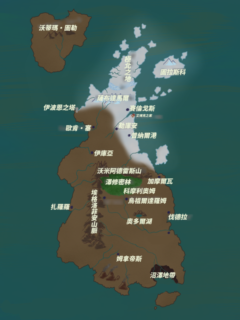

# 希伯里爾：世界觀
> 眼眸半掩輕笑極目遠眺冰暴席捲皓白的曠野
> 我閉上雙眼覓尋天宇的廣袤
> 吟詠詩歌的神女在我的耳邊低訴不變的誓言
> 那是不期而遇的最後瞬間 
> 世人的無知責難詩人的妄語
> 繆斯的親吻溫柔冰冷昧夢與哀悼
> 是誰在何時於境界線上飄搖
> 太陽的光焰點亮了繆斯的眼角
> 『●之書』的傳說再無人陳道
> 終古的沉寂與皚皚的雪原見證了噩耗
> 這歷史永無人知曉 

時值伊波恩失蹤之後的第99年，玩家將在此時來到希柏里爾，成為一名居住在姆·圖蘭大陸將要扮演的是一名生活在早已毀滅的終北大希柏里爾的古代人。
一般的希柏里爾人有著金色或白色的頭髮，瞳色大多是稻草色或銀色，長耳垂，高鼻樑。還有，希柏里爾人的體型也比現代人小。
 對希柏里爾人及終北大陸感興趣的PL們請一定要讀一讀克拉克·阿什頓·史密斯的《終北大陸系列》，請不用擔心，原作並不包含對本模組的劇透，並且我可以向諸位保證，讀過原作之後你一定能更好地體會到模組的樂趣。或者說得更確切一些，各位要是想徹底體驗到本模組的樂趣，就一定要先讀過一遍原作才好。那麼諸位，現在讓我們閉上眼睛放飛我們的想像，去往那位於遙遠歷史彼端的終北大陸吧！

## 誰是希柏里爾人？

希柏里爾人是在地球的歷史上尚未發現，或者說是不應該存在的古代人。
他們的文明極其發達，在他們之中既有著專精於魔術魔法的人，也有人認為魔法完全是不存在的無稽之談。
希柏里爾是一個多神教的國家，其國教信仰的是女神伊赫烏蒂。
除此以外，也有人信仰月神勒尼庫亞和貓神伊吉拉等等神明。在希柏里爾，人們將信仰撒托古亞的人視為邪教徒，並對他們施以極其殘酷的異端審判。
撒托古亞的信徒大多都因為自己的信仰而遭到了處決。
但撒托古亞的信仰卻並未因此受到局限。其人氣自然是來自致命的大魔法師伊波恩了。
在這伊赫烏蒂教和撒托古亞教的長期對立之中。信仰撒托古亞的既有渴望力量和智慧的人，也有對國家政局抱有不滿尋求變化之人。
據說，甚至有一部分的撒托古亞信徒試圖在國內引發政變。

## 所謂終北大陸

北方極地被冰雪覆蓋，即使在春夏季也沒有融冰之時。
被怪異冰山襲擊的賽倫格斯、普納爾等城市已經完全被寒冷吞噬。
由於不清楚冰帶是否還會外擴，且積雪覆蓋了大部分農作物沒有了收成，人們正在漸漸離開卡摩爾加地區。
在極地還有一位被稱為皓白巫女的、少女姿態的神秘存在，她會授予人類語言。巫女預言的傳說綿延了數百年之久，至今也時有發生，因而人們對巫女究竟是人類還是有幽靈，抑或是目擊者的幻覺一事尚未有定論。

希柏里爾人捨棄舊有的、位於大陸中央的前首都科摩利歐姆之後南下，在南方建立了新首都烏祖爾達羅姆已有100年之久。
在烏祖爾達羅姆的廣場，每天早晨都會處刑殺死撒托古亞的教徒。
而在烏祖爾達羅姆的郊外則設有月神勒尼庫亞的神殿，其中有39名女祭司，時常會為了月神勒尼庫亞而獻上“小小的犧牲”。
烏祖爾達羅姆西面聳立著埃格洛菲安山脈。
埃格洛菲安山脈中的沃米阿德雷斯山上潛藏著過去被希柏里爾人驅逐至此的沃米人，因此十分威脅。
而翻越山脈之後，又有著數個城市，其中就有伊波恩的故鄉伊庫亞，過去曾經繁榮熱鬧過的城市，如今已經破落得連個旅店都沒有了。
跨過大河之后，出現的城市是充满活力的大型港口城市歐肯·塞，這駕臨於大海與河川之側的城市通過船隻將亞特蘭蒂斯與沃蒂瑪・圖勒聯係在了一起，每天都有無數的貨物通過這裡運往希柏里爾各地。
阿拉巴克的弟子哈魯德承了塞隆那家兼做居住的診所，如今也居住在這裡。
從這裡再往南不遠，就是哈魯德的故鄉卡爾努拉。

## 關於王朝

希柏里爾實行世襲制。
如今統治這裡的是賽倫戈斯王朝的第四任國王萊斯塔佐烏，他也和自己的先祖一樣將麋鹿女神伊赫烏蒂的教會奉為國教，並四處封殺撒托古亞教。
在賽倫戈斯王朝之前統治希柏里爾的曾是烏祖爾達羅姆王朝。
當時烏祖爾達羅姆的伐達納克斯國王為期10年的統治結束之後，繼位的是他的妹妹女王康安波利亞，女王極大程度地擴大了伊赫烏蒂教派的宗教勢力。
也是在這個時期中，伊波恩和伊赫烏蒂教會的神官摩爾基一同失蹤了。
究其原因，乃是因為撒托古亞教會勢力的擴大，導致了王朝花費精力數次嘗試於鎮壓撒托古亞教徒的叛亂，又並實行了更為嚴苛和殘酷的異端審問制度。而在伊波恩失蹤99年之後的現在，這種形勢也並未發生太大的變化。
烏祖爾達羅姆王朝之後便被賽倫戈斯王朝取代了，2代國王法拉伐王之後是3代國王薩拉皮翁，接下來的繼承人便是現在的萊斯塔佐烏了。如今他統治這個國家已有約16年了。
順帶一提，所謂的賽倫戈斯其實本來是希柏里爾大陸東北部的一塊區域，在神秘的冰山襲擊之後，從那裡逃亡出來的貴族後裔成為王，即萊斯塔佐烏一系。
他的王妃貝婭特麗克絲據說由於身體虛弱很少出現於人前，國民們幾乎不曾有人見過她，也並不太清楚她究竟是怎麼樣的一位王妃。

## 希柏里爾的貨幣

希柏里爾的貨幣稱為帕祖爾。3個帕祖爾可以購買兩個麵包，或一大瓶的石榴酒。
作者我對於帕祖爾的瞭解也僅限於此。
`因此這次的模組中帕祖爾將直接換算為GP，以DND5E的基本規則進行計價。`

## 階級

希柏里爾人的階級制度頂點是王族，其下教會的神官和貴族大致處於同一級別。
不過，國教伊赫烏蒂教的最高統治者也是國王，其後第二位的是月神勒尼庫亞教，除此以外民間還有信仰伊吉拉（別名法烏茲）的教會排在最末尾。
除了這三大教會之外，信仰撒托古亞的人均被視為罪犯。
在王城內工作的僕人和騎士既有貴族出身也有平民出身，但總之只要遵循國王的命令就可以在這裡獲得優渥的生活。
在庶民階級中貧富差距就要大得多了，沒有工作的人會淪落為盜賊和娼婦。
而關於勒尼庫亞的女祭司們，他們在表面上有著體面乾淨的身份，卻是實質上的奴隸之身。
魔法師雖然被分在庶民階級中，但其實也有貴族出身的魔法師。
需要注意的是，王城內也有王宮專屬的魔法師，其階級與貴族等同。宮廷魔法師和王家一樣採用世襲制度。

## 宗教

雖然希柏里爾是一個以信奉伊赫烏蒂的教會為國教的多神教國家。
伊赫烏蒂作為麋鹿女神也被視為豐收女神。對伊赫烏蒂的信仰範圍最大，在農民中人氣尤高。
與之相對的是被視為邪教的撒托古亞教會。
雖然常人並不清楚撒托古亞的形象（祂的雕像全被異端審判官毀壞了），但人們相信，是祂協助了偉大魔術師伊波恩逃亡，並擁有足以讓異端審判官摩爾基人間蒸發的強大魔力。
（請盡可能不要將探索者設定為撒托古亞的信徒。如果把這種信仰公開說出去的立刻會被人追殺處死。如果有PL非常想嘗試一下的話，倒也未嘗不可。）
伊吉拉，或者說法烏茲。即貓神，尚且不清楚這個貓神和我們在克蘇魯神話中較為熟悉的巴斯特是否是同一個神靈，但反正這個時候沒有人將貓神稱為巴斯特。這是一個有著悠久歷史的信仰。
伐拉德信仰的是貓女神依澤菈，根據魔法師塞隆所說「我的祖先自那位於遺忘之地托利亞的紮爾格拉山中魂牽夢繞的卡姆拉移居到此地之時就已經在崇拜她了」，這個應該也只是巴斯特的別名吧。
月神勒尼庫亞那宏偉的神殿被神秘的屏障包裹其中，因而對庶民來說是十分陌生，姑且只能算是聽說過這個名字的程度。在富有的人中，信仰勒尼庫亞的人要更多一些（這也是一個不太合適探索者們的信仰。）

## 魔法・魔法师

> 在這個時代，魔法離人們的生活並不遙遠。

有些人相信魔法的存在，有些人則認為魔法是無稽之談，魔法被和占卜、醫學等等知識聯繫在一起，並成了人們生活中的必需品。
既有為了追尋未知的知識踏上冒險之旅的魔法師，也有依靠製作那些需要專業知識才能生產精製的藥品為生的魔法師，侍奉于國王的宮廷魔法師，和邪神定理契約的危險魔法師。
HO3的師父哈魯德就像是駐留在卡爾努拉的城鎮醫師一樣，他以魔法為人們提供幫助。
而所謂魔法，是依靠神靈的力量存在的東西，只有極少數的魔法師會去研究其中的原理。
大多數魔法師都終身未婚，他們投身於自己的研究，因此不善與人交流，對周圍的一切都漠不關心，讓人乍一看覺得他們十分冷漠而傲慢。其中唯一例外的是宮廷魔法師，由於這是一個注重家族傳承的工作，大部分在任的宮廷魔法師一般已經結婚了。

## NPC部分
由於每位玩家開場身分大相逕庭，NPC介紹將會在HO秘密中。