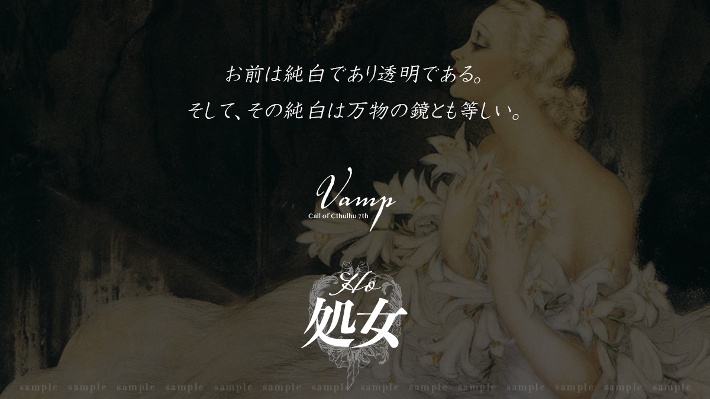

> ⚠️ **秘匿 HO・閱覽警告**
> 本文件為 **HO1 處女（卡薩布蘭卡）** 的個別秘密（秘匿背景故事），含有僅限該角色之 PL 閱覽的劇情內容。
> 若你並非扮演 HO1 的玩家，**請立即關閉本頁，不要繼續往下閱讀**，以免破壞自己與其他玩家的遊戲體驗。

# HO 處女 / Virgin — 個別秘密

### 角色框：卡薩布蘭卡（Casablanca）

> 香水百合

- **才能**：演技　〈藝術（演技）〉：**[ 初始值 5 ] + 60 + 1d10**
- 你是歌劇團的新人。村莊遭襲，你為求援而前來歌劇團。

---

## 背景故事

你在一座名為「**法斯汀（ファースティン）**」的小村莊裡，與**養母**、**雙胞胎哥哥**三人組成的家庭和睦地生活著。雖非親生，母親仍毫不吝惜地給予你愛。

你常與雙胞胎哥哥一起讀故事、玩著像演劇扮家家酒般的遊戲。你具有演技的才能，演技不知不覺間成了你不可或缺之物。你曾聽母親提起一個名為「**歌劇團 布凱**」、從事助人活動的劇團，對劇團懷有不小的憧憬之情。

平和的日常持續著，但某天，村子的樣貌驟然一變──一隻如**白色大芋蟲**般的怪物襲擊了村莊。母親犧牲自己阻擋白色芋蟲，讓你與哥哥得以逃脫。

村子附近，正好有「歌劇團 布凱」造訪。哥哥與你抱著一線希望，前往這座歌劇團的帳篷。

---

## 角色製作資料

- **年齡**：17 歲固定。
- **性別**：建議女性 PC（若要製作男性 PC，請先確認事前資訊）。
- **生日**：若設定生日，則設為**春天**。
- **能力**：〈藝術（演技）〉 **[ 初始值 5 ] + 60 + 1d10**。**不加算職業 P／興趣 P**。
- **關係 NPC**：養母、雙胞胎哥哥（母、兄之名將於劇本導入時公開）。

---

## 秘匿背景故事

### ① 特別之人：雙胞胎哥哥

哥哥對你而言是難以割捨的存在，長久以來一同生活。

> （若 PL 願意，亦可建構為戀人等更深的關係。）

### ② 以演技施展的「特技」

你能夠模仿任何曾見過一面、或曾交談過的人。那演技足以令人與本人混淆，且**不受本人容貌影響**便能顯現效果。可透過〈演技〉**假冒成他人**。

> 但此效果**僅在交談期間有效**，且只有短暫的時間。

---

> ＊ 本文件為《VAMP》DL 特典資料之繁中翻譯。原文嚴禁轉讓，譯文僅供持有正版者個人遊玩參考。
