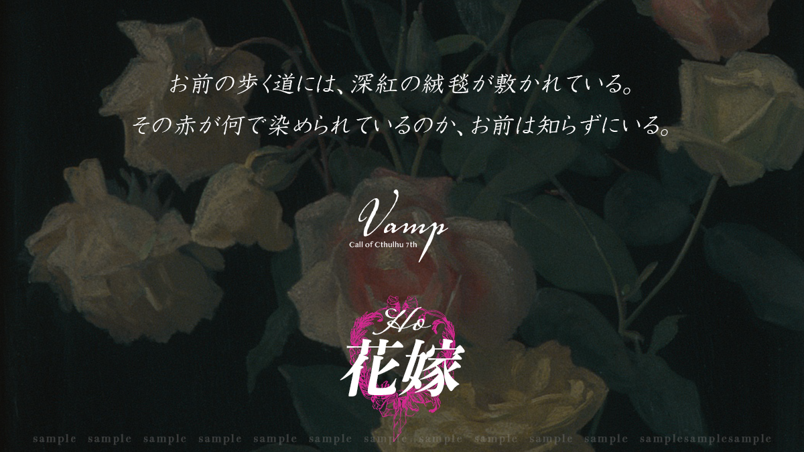

> ⚠️ **秘匿 HO・閱覽警告**
> 本文件為 **HO2 花嫁（玫瑰）** 的個別秘密（秘匿背景故事），含有僅限該角色之 PL 閱覽的劇情內容。
> 若你並非扮演 HO2 的玩家，**請立即關閉本頁，不要繼續往下閱讀**，以免破壞自己與其他玩家的遊戲體驗。

# HO 花嫁 / Wedding Bride — 個別秘密

### 玫瑰（Rose）

- **才能**：舞蹈　〈藝術（舞蹈）〉：**[ 初始值 5 ] + 60 + 1d10**
- 你從監禁中逃出。在 ｛HO 姬｝ 失去記憶之前，你曾與 ｛HO 姬｝ 在一起。

## 秘匿背景故事

你與 ｛HO 姬｝曾被**監禁**在某座村莊裡。被監禁了多久、外界的生活又是如何，你都已沒有記憶。

那裡只有書本充足，食物僅有最低限度，你們僅靠門縫間透入的微光生活。

某天，｛HO 姬｝將小說如歌劇般演繹，你便配合著起舞。配合 ｛HO 姬｝的歌起舞，成了被囚禁期間唯一的生存意義。

劇本三年前，兩人從地下逃了出來。監禁你們的村莊陷入火海，村民全數死去。原因不明，但你們趁著那場混亂，得以離開被監禁的房間。

雖然好不容易逃出，｛HO 姬｝卻**失去了記憶**。

之後，你被來到村莊附近的歌劇團所保護。**副座長卡斯米**欣然接納了兩人。得知你具有舞蹈技術後，你便被招攬入團。

自此三年。你作為歌劇團的一員持續活動，同時幫助 ｛HO 姬｝恢復記憶。

## 角色製作資料

- **年齡**：18～25 歲。
- **性別**：建議女性 PC（若要製作男性 PC，請先確認事前資訊）。
- **能力**：〈藝術（舞蹈）〉 **[ 初始值 5 ] + 60 + 1d10**。**不加算職業 P／興趣 P**。
  - ※ 由於是使用手腳的技能，**手腳不自由時成功率為 1/5**。

## 秘匿關係

### ① 被監禁的過去與記憶

你對被監禁前的記憶模糊不清，連是否曾有父母或家人都記不得。而被監禁時與你一同度過的 ｛HO 姬｝，則在失憶狀態下度過了三年歲月。

對於 ｛HO 姬｝的記憶，你現在想怎麼做都可**自由決定**。

> ▶ 決定被監禁村莊的名稱。村名**與你喜歡之物的名字相似**。

### ② 特別的團員「阿涅墨涅」

她在你逃出村莊時幫助了你。在歌劇團中最為關心你，是你無話不談的對象。

明明你從未離開過村莊，卻**感覺過去曾在某處見過阿涅墨涅**。

### ③ 身體不適

這幾個月來，你不斷做著一個奇怪的夢。夢中，下腹部從內側被某物頂動，肚子破裂，湧出**綠色的爛泥**，最後從那裡傳來「**媽媽**」的聲音。

起初你以為只是夢，但那聲音漸漸變得能聽見「**就快見面了**」「**你就快死了**」。

> 對此，你只向擔任**衛生・醫療**的阿涅墨涅一人傾訴過。

---

> ＊ 本文件為《VAMP》DL 特典資料之繁中翻譯。原文嚴禁轉讓，譯文僅供持有正版者個人遊玩參考。
