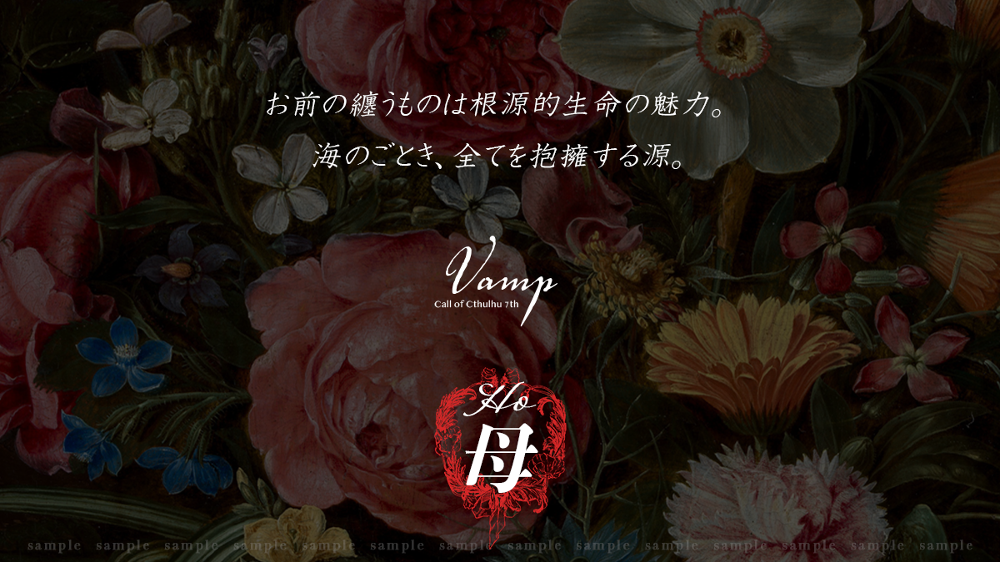

> ⚠️ **秘匿 HO・閱覽警告**
> 本文件為 **HO3 母（康乃馨）** 的個別秘密（秘匿背景故事），含有僅限該角色之 PL 閱覽的劇情內容。
> 若你並非扮演 HO3 的玩家，**請立即關閉本頁，不要繼續往下閱讀**，以免破壞自己與其他玩家的遊戲體驗。

# HO 母 / Mommy — 個別秘密

### 康乃馨（Carnation）

- **才能**：演出　〈演出技能〉：**[ 初始值 0 ] + 65 + 1d10**
- 三人之中的領頭。你是資深成員，正在尋找失蹤的座長。
- **特記**：不可男性 PC。

## 秘匿背景故事

你的故鄉是名為「**薩多諾列斯特（サードノレスト）**」的村莊。村內有座礦山，這座礦山偶爾會挖掘出美麗的**水晶**。

起初水晶能賣得高價，但這種水晶似乎帶有特殊的力量（**魔力**），村莊因此屢屢遭到**魔術師**襲擊。

在村中平凡度日的某天，你竟**處女懷胎**，有了身孕。就在臨盆在即之際，你夢見自己的腹部被剖開、孩子被取走。醒來時，剛出生的**雙胞胎**已在你雙臂之中──因此，你並沒有「**生產的記憶**」。

孩子出生五年後，你的肉體被發現毫無任何衰老與成長，因而被村民懷疑是**女巫**。在這個厭惡魔術的村莊裡，你再也無法居住，遭到驅逐。

你判斷獨自一人撫養孩子有困難，便在村外將孩子託付給一對親切的夫婦──你相信，離開自己身邊才是兩個孩子通往幸福的路。

之後，你被歌劇團收留，直到現在。你在歌劇團已隸屬**十年以上**。

## 角色製作資料

- **年齡**：18～25 歲（**外觀**）。
- **性別**：不建議男性 PC（若身體具備可生產的構造，**兩性具有的男性亦可**）。
- **能力**：〈演出技能〉 **[ 初始值 0 ] + 65 + 1d10**。擔任演出方面的職責（樂器演奏、整體指揮等）。**不加算職業 P／興趣 P**。
- **關係 NPC**：黑玫瑰座長（BlackRose）。

## 秘匿關係

### ① 雙胞胎的孩子

你曾有一對雙胞胎孩子。即使如今已分離，你仍掛念著兩個孩子是否平安。孩子若還活著，現在應是 **17 歲**。

> ▶ 決定雙胞胎（一男一女）的名字。
> ▶ 以**外觀年齡**（18～25 歲）製作 PC。**實際年齡已超過 30 歲**（能力值的年齡修正以外觀年齡為準）。

### ② 重要之人「黑玫瑰座長」

你曾向黑玫瑰座長與卡斯米坦白①的秘密，而他一直貼心地陪伴著你。

三年前，在旅途中順道停留的村莊裡兩人獨處時，座長對你說了「**我愛你**」。那或許只是身為同一劇團夥伴的話語，但對你而言，那是無比特別的一件事。

> ▶ 若想決定與座長的關係，亦可指定為戀人等更深的關係。

---

> ＊ 本文件為《VAMP》DL 特典資料之繁中翻譯。原文嚴禁轉讓，譯文僅供持有正版者個人遊玩參考。
