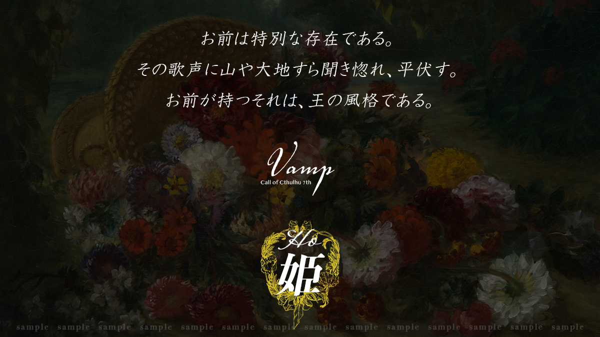

> ⚠️ **秘匿 HO・閱覽警告**
> 本文件為 **HO4 姬（牡丹）** 的個別秘密（秘匿背景故事），含有僅限該角色之 PL 閱覽的劇情內容。
> 若你並非扮演 HO4 的玩家，**請立即關閉本頁，不要繼續往下閱讀**，以免破壞自己與其他玩家的遊戲體驗。

# HO 姬 / Princess — 個別秘密

### 牡丹（Peony）

- **才能**：歌唱　〈藝術（歌唱）〉：**[ 初始值 5 ] + 70 + 1d10**
- 你失去了記憶……但這「失憶」其實是你的偽裝。

## 秘匿背景故事

你是隸屬於**魔術管理局**、被稱為「**魔人**」的非人之物。你的職責，是追蹤魔術的使用痕跡、找出魔術師並向本部通報。

擁有罕見魔力的你，在執行這類工作的過程中，逐漸感覺到這個世界，是「**由某人之手所生成之物**」。

本篇三年前。你曾在任務中以**精神體**出竅，調查某座村莊。那村莊正陷入火海，在多個疑似村民的身影之中，有兩名生還者。你接到指令，**潛入了一名身受重傷的人類體內**──理由是為了確保調查對象。

離開這座村莊後，你們遇上了歌劇團，兩人接受了適當的治療，撿回了性命。與你一同的人類，即是「**｛HO 花嫁｝**」；而你所潛入的這具身體的主人，似乎是「｛HO 花嫁｝」的**摯友**。當然，這具身體所持有的記憶你並不知曉，因此你**謊稱自己失憶**。

你受魔術管理局之命，自那起事件以來便一直**附身於這具身體**，從未說出自己的真實身分。

待情況平穩後，你聽說這具身體的主人非常擅長歌唱。你向身為歌手的「**阿涅墨涅**」學習，努力之下歌藝精進得十分出色。如今，你在歌劇團中被稱為「**歌姬**」。

## 角色製作資料

- **年齡**：18～25 歲。
- **性別**：建議女性 PC（若要製作男性 PC，請先確認事前資訊）。
- **能力**：〈藝術（歌唱）〉 **[ 初始值 5 ] + 70 + 1d10**。**不加算職業 P／興趣 P**。
- **關係 NPC**：哈那茲歐（ハナズオウ）、思伊蓮（スイレン）。

## 秘匿關係

### ① 特別之地「魔術管理局」與其局長們

你曾在魔術管理局生活了約一年。沒有雙親，出生也一切不明。記憶也只有一年（**劇本開始時，等於只有四年分的記憶**）。

魔術管理局的局長「**哈那茲歐**」自你有記憶以來便一直關照著你，只要是他的指令，你都樂於接受。擔任輔佐官的「**思伊蓮**」是個輕浮的男人，一有什麼事便會起鬨般地湊上來搭話。

> ▶ 每幕結束時，與魔術管理部進行定期報告的通訊。**不可讓歌劇團得知你的真實身分**。
> ▶ 你與哈那茲歐是彼此信賴的關係，可設定為特別的關係（設為義父或戀人皆可。哈那茲歐與思伊蓮是一對被稱為「**配偶（つがい）**」、持有此一規則的搭檔）。

### ② 你是特別的「魔人（まびと）」

所謂魔人，是指具有非人特徵的人類（**半獸人**），但你真正的身體幾乎不具備人類的特徵，是相當罕見的姿態。

> ▶ 可自由創作成任何姿態。請列舉**一項以上的特徵**（例：被觸手覆蓋、全身羽毛等。立繪的製作自由）。

### ③ 送行者（おくりびと）

不具人形的你，對非人的存在懷有情感與緣分。你會在劇終時，悄悄擔任那些無人哀悼的怪物們的「**送行者**」。

> ▶ 在劇結束之後、或將近尾聲時，你可以宣言唱出**鎮魂歌**。歌唱的消耗為 **MP 1d4 + 3**。

---

> ＊ 本文件為《VAMP》DL 特典資料之繁中翻譯。原文嚴禁轉讓，譯文僅供持有正版者個人遊玩參考。
