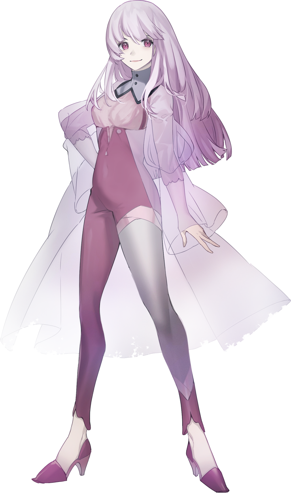
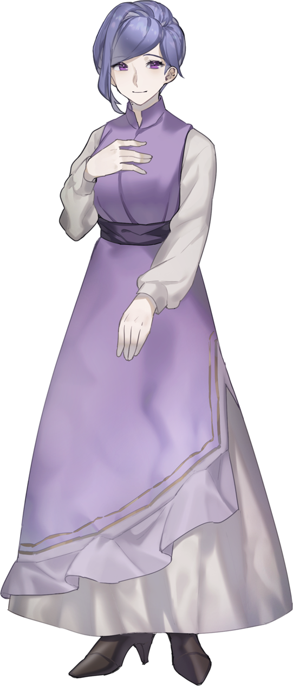
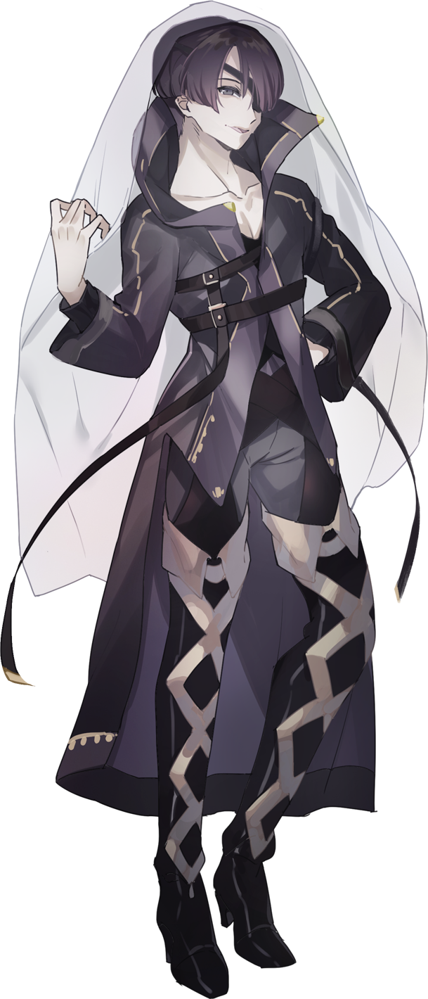
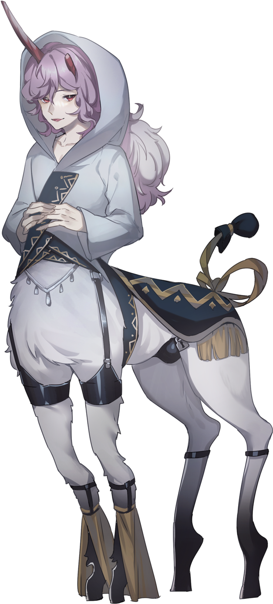

# VAMP — KP 向完整劇本（含全劇透）

> ⚠️ **全劇透・KP 專用**　本檔含《VAMP》KP 前置資訊、劇本背景、NPC 真實設定，以及第零～五幕全文（含三路線結局）。**PL 請勿閱讀。**
>
> **R18 / R18G**　含血腥、畸形、虐待、自傷・自殺、異種交合、性轉換、懷孕・生產、蟲、食人、虛構宗教、歧視性表現等要素，請斟酌身心狀態閱覽。
>
> 本檔為《VAMP》（發行：白匣／シラ）之非官方繁體中文翻譯。原文 PDF 嚴禁轉讓，譯文僅供持有正版者個人遊玩參考。譯名依 [`01_VAMP_PL_譯名對照表.md`](01_VAMP_PL_譯名對照表.md)（含 §11 KP／劇透專屬譯名）。

---

## 本檔內容（請用左側目錄導覽）

- **KP 資訊**：帶團概要、OP 演出、HO 配布、奇蹟之劇的真相
- **劇本背景・世界觀**：神話時代、世界滅亡、第二幻夢境、各村文化設定
- **劇本 NPC**：13 名 NPC 的公開／真實設定與能力值
- **第零幕 個別導入**：｛HO 處女／花嫁／母／姬｝ 四名 PC 的個別腳本＋KP 註
- **第一幕**　夢必能實現
- **第二幕**　恭喜您，是個健康的女孩呢
- **第三幕**　世界如此美麗，真希望出生前就能知道
- **第四幕**　人人皆被溫熱的肉所包覆
- **第五幕**　既然降生於世，便不得不幸福（含 A／B／C 三路線結局）

## KP 資訊

### 給 KP 的導入

#### 用三行話來形容這個劇本

- 一面享受與形形色色 NPC 之間的戲劇張力，一面品味陰鬱沉重、充滿克蘇魯風味的怪誕詭譎。
- 大家齊心協力打倒巨大的敵人吧！（成敗端看骰運）
- 一起把 7 版的追逐、戰鬥，以及 7 版才有的選擇規則學起來吧！

#### 劇本的基調／視情況可向 PL 公開

一本道（線性）劇本。內含無可迴避、極為不講理的展開，但依路線不同，亦有全員 NPC 生還、或雖伴隨痛楚卻仍迎來大團圓的劇本走向。除第五幕以外沒有重大分歧點，但第四幕為止的經歷，或許會影響第五幕的抉擇。

本劇本也帶有讓人循序漸進熟悉 7 版的用意，是針對 7 版新手所做的調整。流程上會一邊淺嚐戰鬥與追逐的規則一邊遊玩，但後半段即使是已熟悉 7 版的玩家也能樂在其中的難度。

PC 因種種原因而遺忘了一些資訊，但他們不會正確地回想起這些事，劇本進行中也不預設會改寫 PC 的情感。（只有事前資訊有所指定）

#### 劇本背景概要

借助神話之力，殺死變成怪物（邪神）的人類、拯救眾人的故事。

隨著劇本推進，探索者們會得知自己其實是神話中所述「被神所殺的女高中生」，並且是活在女高中生們夢中（幻夢境）的存在。

故事提供了與 NPC 一同活下去的道路，以及奪回失落地球的道路，目標是攜手合作、邁向 PC・PL 心目中的快樂結局。

#### 給初次閱讀本劇本的人

由於背景中也包含許多不會出現在本篇的資訊、內容亦相當複雜，建議先跳過背景、直接閱讀劇本本篇。

#### ［記述規則］

##### 見出標題

> ▼▽小標題
> ❖秘匿情報：僅交給 ｛HO 名｝ 該名 PC 的資訊
> 【探索地點】
> −\* −　台詞的分段／會話途中插入角色扮演（RP）之處的參考標記
> ※ 給 KP 的資訊、補充資訊
> 〈目星〉

同一類別中所得出的資訊，會以左側的線條統整記載。或為報導、手記之類的內容。

右側此欄為 KP 資訊或補充資訊。

#### ［規則書・增補的略稱］

- 規則書＝《新克蘇魯神話 TRPG 規則書》
- 2020 ＝《新克蘇魯神話 TRPG 克蘇魯 2020》
- 新 MM ＝《新克蘇魯神話 TRPG 馬勒斯·蒙斯特羅倫 Vol.1》
- 新 MM2 ＝《新克蘇魯神話 TRPG 馬勒斯·蒙斯特羅倫 Vol.2》
- 瓦斯燈＝《克蘇魯·拜·瓦斯燈》
- 幻夢境＝《洛夫克拉夫特的幻夢境》

#### 目錄

| 章節 | 頁碼 |
|---|---|
| 給 KP 的資訊 | — |
| PC 的 HO 設定 | — |
| 劇本背景／用語集 | — |
| NPC 設定 | — |
| 劇本本篇　個別導入 | — |
| 第一幕 | — |
| 第二幕 | — |
| 第三幕 | — |
| 第四幕 | — |
| 第五幕 | — |
| 給 KP 的資訊 | P.14–15 |
| PC 的 HO 設定 | P.16–20 |
| 劇本背景／用語集 | P.21–26 |
| NPC 設定 | P.27–39 |
| 劇本本篇　個別導入 | P.40–57 |
| 第一幕 | P.58–83 |
| 第二幕 | P.84–111 |
| 第三幕 | P.112–148 |
| 第四幕 | P.149–174 |
| 第五幕 | P.175–220 |

### KP 資訊

#### ［關於 OP 演出］

本劇本是以規則書與馬勒斯·蒙斯特羅倫中所記載的文章與設定為靈感進行二次創作而成的劇本。將參考過的部分作為演出，於每一幕開始時朗讀出來，或許能為氛圍增色幾分。

- **事前導入：HO 處女**
《新克蘇魯神話 TRPG 馬勒斯·蒙斯特羅倫 Vol.1》P.8
「恐怖：怪物的運用與創造」第一段
- **事前導入：HO 花嫁**
《新克蘇魯神話 TRPG 馬勒斯·蒙斯特羅倫 Vol.2》P.10
「對克蘇魯神話敞開心扉的精神」後半
- **事前導入：HO 母**
《新克蘇魯神話 TRPG 馬勒斯·蒙斯特羅倫 Vol.2》P.11
「在地球上的姿態」第一段
- **事前導入：HO 姬**
《新克蘇魯神話 TRPG 馬勒斯·蒙斯特羅倫 Vol.1》P.12
「有效地扮演怪物」第一段
- **第一幕**
《新克蘇魯神話 TRPG 規則書》P.168
「何謂魔術」第三段
- **第二幕**
《新克蘇魯神話 TRPG 規則書》P.160
「健忘症」
- **第三幕**
《克蘇魯神話 TRPG 規則書》P.236
「深層的魔術」第一段
- **第四幕**
《新克蘇魯神話 TRPG 規則書》P.23
「克蘇魯神話」第二段後半
- **第五幕**
《新克蘇魯神話 TRPG 規則書》P.10
「歡迎來到『新克蘇魯神話 TRPG』！」第一～二段
- **第五幕結束時**
《新克蘇魯神話 TRPG 馬勒斯·蒙斯特羅倫 Vol.2》P.9
「化身」第二段

#### ［KP 的提示］

以下是作者 KP 的帶團方式。未必非得照此進行，僅供參考。

##### 自由改編

描寫與台詞，所記載的內容皆為參考，請自由變更。不過，將第四幕為止便會死去的 NPC 改為生還，是不推薦的做法。若將其改為生還，會對第五幕的展開與戰鬥數據造成重大影響，使損失（Lost）機率升高。

##### 關於所記載的描寫・台詞範例

無需照本宣科。只採用與當下 PC 的角色扮演契合的描寫即可。劇本中的描寫範例是配合文字團（Text Session）所撰寫的，若為語音團，適度刪減便能讓節奏進行得更順暢。

##### 關於 NPC 的情感與行動

可由 KP 的視角自由詮釋，必要時亦可改編。「不同的人所見的世界・所做的詮釋各不相同」也是本劇本的主題之一，因此以自由的詮釋來遊玩，正是符合劇本本意的做法。此外，亦可讓 NPC 各自依其意志發言，並明言 KP 不會藉 NPC 之口透露進行上的提示再來挑戰。（NPC 的行動是作為推理線索與伏筆而運作的）

##### 秘匿 HO

本劇本是帶有秘匿 HO 的劇本。設計上預設 KP 已有在 CoC 帶過秘匿 HO 劇本的經驗。此外，PL 也最好有相關經驗。由於有許多個別傳送秘匿文本的場面，本劇本不支援線下面對面（Off Session）的遊玩方式。

##### 不進行多人密談

若團中有不熟悉 7 版的 PL，便不進行二人或三人等的密談（如僅限兩名 PL 的語音頻道）來推進。基本上即使不共享 HO 的秘匿內容，劇本本身也設計成會主動揭曉。由於從第一幕起便依 HO 順序設定了擔綱主角的 PC，若有不熟悉的成員，亦可事先言明此事，預先告知會有秘匿揭曉的精彩場面。

##### 房規（House Rule）

本劇本是在不採用如暴擊券（Critical Ticket）等與骰目相關之房規的前提下調整的。劇本進行上預設會運用〈幸運〉來度過骰目不利的局面，因此可事先告知：〈幸運〉能在每幕結束時回復。

##### 關於 PvP

第四幕為止是作為協力劇本進行，但第五幕有分歧、有可能意見分歧。可以直接告訴 PL：除第五幕以外皆為一本道。

### KP 資訊

此姿態，設定為與各自在覺醒世界中被穿上的衣裝相近之物。（現實中雖是以人皮等製成之物，但在夢之世界中看起來則是美麗而神聖的）HO 處女雖已死亡，但因其同時也是神話中的登場人物，故被當作「對世界而言方便存在之物」來看待。

雖然可以採取人外的姿態，但之所以規定「不可以神格為主題（motif）」，是因為各自都有對應的神格，若做成此之外的設計，便會與劇本產生齟齬。

#### HO 母的孩子，以及 HO 處女與兄長的外貌設定

若想決定 HO 母那對雙胞胎孩子的外貌，可由 HO 母決定。

現在的 HO 處女，以及 ｛HO 處女之兄｝ 的外貌，由 HO 處女決定。｛HO 處女之兄｝的配色可自由變更。預設為銀髮赤目。HO 處女與兄長的外貌即使不同也無妨。

（若 HO 處女的外貌與 HO 母的雙胞胎相同，則視為外貌未曾發生變化。
若為不同的外貌，則在第四幕的最後，由桔梗（キキョウ）說明「HO 處女是自己將外貌改變了」。｛HO 處女之兄｝由於原本是 HO 處女的想像朋友（Imaginary Friend），因此在第一幕受肉之際，會以符合 HO 處女想像的形象現身）

#### ［補充］

PC 們原本是「被神所吞入的靈魂」。這也可理解為沉睡於神之中的另一個人格。因此，PC 們既是「以女高中生的靈魂為原型所造出的生命」，同時也是「能夠使用超乎人智之力的神之化身」。

#### ［HO 花嫁、母、姬的共通資訊］

##### ▼奇蹟之劇的真相

「奇蹟之劇」能實現「使他者復活」「治癒疾病」等奇蹟，但有時也必須去做「殺死怪物（包含偽裝成人的存在）」「殺死帶有怪物化徵兆的人類」之事。

因為藉由運用殺死怪物時所釋放出的魔力，便能拯救他者。

一旦開演「奇蹟之劇」，被安置於觀眾席上的怪物便會顯露本性、發動攻擊，因此這也是一齣極其危險的劇。至今已多次親手施行斷罪，並拯救了那些被怪物所傷的人們。

現在卡薩布蘭卡之框出缺，自那以後便不再上演「奇蹟之劇」。（過去的劇可自由創作）

##### ▼關於座長

座長目前下落不明，劇團的旅程也兼具尋找座長的目的。座長的容貌，除 HO 母與卡斯米（カスミ）以外無人直接見過。

#### ［KP 將 HO 資訊交給 PL］

①將 HO 資訊分別個別傳達。
　（網點底紋（アミカケ）的部分為給 KP 的補充，故不共享）
②將 HO 花嫁、母、姬的共通資訊傳達給 HO 處女以外的 PL。

由於角色卡是會共享的資訊，PL 之間不妨相互商量再決定技能。此外，HO 處女以外的角色從第二幕起也將作為同行旅伴參加，故共同生活期間的設定可事先商量。由於本劇本為秘匿 HO 劇本，秘匿的內容在開始前請勿共享。不過，若是以 PC 的性格在日常對話中可能會聊到的話題範圍，諸如出身地名之類的程度則可以共享。

#### ［KP 的角色卡確認要點］

##### 關於角色卡製作（本劇本 P.9）

由於「重要的人們」此欄位用於劇本機關，從一開始就記載兩人以上也沒有問題。

##### 背景故事（Back Story）

本劇本的探索者是在時間中循環的。

可記載的「重要的人們」，設定上自循環之前便已結緣，故允許從一開始就大量設定。由於歷經多次周回而以強韌的羈絆相繫，即使 SAN 回復失敗，關鍵連結的效果也不會消失。只要對象未死亡，便能在每幕結束時都挑戰 SAN 回復。

設定上預設 PC 彼此不列入此欄，但若無論如何都想列入，亦可不以個人、而是將 PC 全員作為一個欄位來追加。

##### 與戰鬥相關之事

戰鬥技能是針對第二幕的克蘇魯的奴隸戰所需之物。第四幕以後的戰鬥由於能夠使用特殊技能，故全員都能在戰鬥中大顯身手。

##### 舞台並非維多利亞時代的英國

NPC 的名字中混有日語是刻意為之，請勿將其改回英語使用。這個世界是夢之世界，是即使語言不同、言語也能相通的世界。

##### 關於奇蹟之劇中 PC 所展現的幻視

僅在奇蹟之劇時，PC 有時會向觀眾展現幻視。這並非各自角色的衣裝，而純粹是本人所展現的幻視。在奇蹟之劇以外不會出現。

可以將其當作如魔法少女變身般的東西來處理，也可以當作本人所具有的氛圍外溢而出之物來處理。請配合各團的喜好。

---

## HO 個別 KP 情報

### PC　｛HO 處女｝／卡薩布蘭卡役

你在一座名為「法斯汀（ファースティン）」的小村莊裡，與養母及雙胞胎哥哥，三人組成的家庭和睦地生活著。

雖然並非親生母親，母親卻毫無保留地將愛傾注於你。你和雙胞胎哥哥常常一起讀故事書，玩著模仿演劇之類的遊戲。你擁有演技的才能，那對你而言不知不覺間成了不可或缺的事物。

你曾聽母親提起過一個名為「歌劇團 布凱（Bouquet）」、從事幫助人們之活動的劇團，並對那個劇團懷抱著不小的憧憬之情。

平和的日常持續著，某天村子的樣貌卻為之一變。一隻白色巨大、形似芋蟲的怪物襲擊了村莊。母親犧牲自己阻擋住白色芋蟲，讓你和哥哥得以逃脫。村子附近，幸運地正好有「歌劇團 布凱」前來。

哥哥與你抱著一線希望，朝著這個歌劇團的帳篷走去。

#### KP 註

> ｛KP 向情報　神話時代的 ｛HO 處女｝｝

出生於信仰莎布·尼古拉絲（Shub-Niggurath）的家系，自幼遭受父親的虐待而活著。

持續遭受虐待的結果，｛HO 處女之兄｝的人格從｛HO 處女｝之中誕生，由那個人格代為承受虐待。

因此，｛HO 處女｝並不存在遭受虐待的記憶。

｛HO 處女之兄｝，一旦｛HO 處女｝從虐待中獲得解放，便可能因任務完成而消滅。

在神話的最後死去之後，被覺得有趣的奈亞拉托提普（Nyarlathotep）將靈魂收入體內。劇本中之所以能扮演各式各樣的人物，正是能夠化作種種姿態的神格所帶來的影響。

> 你是純白且透明的。而那純白，等同於萬物之鏡。

**［年齡］**

固定 17 歲／推薦女性 PC（若要製作男性 PC 請確認事前情報）／若要設定生日，定為春季。

**［能力］**

〈藝術（演技）〉［初始值 5］+60+1d10

不進行職 P／趣味 P 的加算。

**［關係 NPC］**

養母、雙胞胎哥哥（母親、哥哥的名字將於劇本導入時公開）

**［秘匿背景故事］**

①特別的人：雙胞胎哥哥

哥哥對你而言是難以分離的存在，長久以來一同生活著（若 PL 希望，亦可建構成戀人等更深的關係）。

②可藉演技施展的「特技」

你能夠模仿哪怕只見過一次、或交談過一次的人。

那份演技逼真到足以與本人混淆的程度，且不受本人容貌影響便能顯現效果。

可藉〈演技〉冒充他人。但那僅在交談期間有效，只具短時間的效果。

---

### PC　｛HO 花嫁｝／玫瑰役

你和｛HO 姬｝，曾被監禁在某座村莊裡。

無論是被監禁了多長的時期，還是關於外界生活的記憶，全都沒有。那裡只有充裕的書本，食物則僅是最低限度，靠著門縫透進的微弱光線生活。某天｛HO 姬｝將小說如歌劇般演繹，你便隨之起舞。配合｛HO 姬｝的歌起舞，成了被囚禁期間活下去的意義所在。

劇本三年前，兩人得以從地下逃出。被監禁的村莊陷入熊熊烈火，村民全都死去。

雖不明緣由，卻趁著那場混亂從被監禁的房間逃了出來。雖然好不容易逃脫，｛HO 姬｝卻失去了記憶。在那之後，你被來到村子附近的歌劇團所保護。副座長卡斯米欣然接納了兩人。當得知你具備舞蹈技術後，你便受到延攬。

自那之後三年間。你一邊以歌劇團的一員身分持續活動，一邊幫助｛HO 姬｝恢復記憶。

#### KP 註

> ｛KP 向情報　神話時代的 ｛HO 花嫁｝｝

阿涅墨涅（Anemone）的青梅竹馬兼未婚妻。家中以深潛者為祖先，連信仰克蒂拉（Cthylla）一事本身也被隱瞞著。

由雙方父母定下婚約，預定 18 歲結婚。

然而結婚只是表面的藉口，實則是為了召降克蒂拉而舉行的儀式。

｛HO 花嫁｝被克蒂拉收入體內，並產下克蘇魯（Cthulhu）。

> 在你行走的道路上，鋪著深紅的地毯。那抹紅是被什麼染成的，你卻一無所知。

**［年齡］**

18～25 歲／推薦女性 PC（若要製作男性 PC 請確認事前情報）

**［能力］**

〈藝術（舞蹈）〉［初始值 5］+60+1d10

不進行職 P／趣味 P 的加算。　※由於是使用手腳的技能，手腳不自由時成功率為 1／5。

**［秘匿背景故事］**

①被監禁的過去與記憶

你對於被監禁之前的記憶模糊不清，連是否有過雙親或家人都不記得。

此外，被監禁時期一同度過的｛HO 姬｝，就這麼在失憶狀態下過了三年的歲月。

關於｛HO 姬｝的記憶，如今你想怎麼做，可自由決定。

▶決定被監禁村莊的名字。村莊的名字，與你喜歡的某樣事物的名字相似。

②特別的團員「阿涅墨涅」

在從村子逃脫時救了你。在歌劇團之中最為關照自己，是什麼都能傾訴的交情。

明明從未離開過村子，你卻感覺過去曾在某處見過阿涅墨涅。

③身體不適

你這幾個月來，持續做著奇妙的夢。

那是下腹部從內側被推動、肚子破裂，綠色淤泥湧出的夢，最後從那裡傳來「媽媽」的聲音。起初還認為只是夢，但那聲音漸漸變得能聽見「就快能見面了」「你就快死了」。

關於這件事，你只向身為衛生・醫療負責人的阿涅墨涅商量過。

---

### PC　｛HO 母｝／康乃馨役

你的故鄉是一座名為「薩多諾列斯特（サードノレスト）」的村莊。

村裡有座礦山，這座礦山偶爾會開採出美麗的水晶。起初水晶能賣出高價，但這水晶似乎具有特別的力量（魔力），村子因而屢屢遭受魔術師襲擊。

在村裡如常生活的某天，你處女懷胎，獲賜了孩子。

到了即將臨盆的時候，你在夢中夢見肚子被切開、孩子被取出。當你醒來時，剛出生的雙胞胎孩子已在你的雙臂之中，因此你並沒有「生產」這件事本身的記憶。

孩子出生五年後，得知你的肉體絲毫沒有衰老或成長，於是被村民懷疑是女巫。在這座厭惡魔術的村子裡再也無法居住，你被逐出了村莊。

你判斷獨自一人撫養孩子有所困難，便在村外將孩子託付給一對親切的夫婦。深信讓孩子離開自己之手，才是讓兩人走向幸福的道路。

在那之後，你被歌劇團收留，直至今日。你已在歌劇團隸屬超過十年。

#### KP 註

> ｛KP 向情報　神話時代的 ｛HO 母｝｝

是個僅以歌唱動聽為長處、極為普通的女高中生。受牧神潘（The Great God Pan）青睞，失去神智並產下孩子。連死亡都不被允許，就這麼以瘋人之姿活著。之後被莎布·尼古拉絲收入體內。

> ｛KP 向補充｝

是創造出幻夢境的存在。這對普通人類而言是絕對辦不到的事，但因成為了莎布·尼古拉絲的一部分，便能做出超越人智之事。〈演出技能〉的真面目即是〈夢見〉，將於劇本中揭曉。｛HO 母｝的〈夢見〉很特殊，能夠干涉到那個世界的規則乃至土地。此外，〈夢見〉所消耗的 MP，換算為地球的幻夢境時，將發揮相當於 10 倍的效果。年齡毫無變化一事，是受到親生女兒思伊蓮年齡不再變化所影響。

> 你所纏繞的，是根源性生命的魅力。如海一般、擁抱萬物的源頭。

**［年齡］**

18～25 歲（外表）／不推薦男性 PC（若是具備可生產之構造的身體，亦可為雙性具有的男性）

**［能力］**

〈演出技能〉［初始值 0］+65+1d10：擔負演出方面的職責。如樂器演奏，或整體的指揮等。

不進行職 P／趣味 P 的加算。

**［關係 NPC］**

黑玫瑰座長

**［秘匿背景故事］**

①雙胞胎的孩子

你曾擁有雙胞胎的孩子。即便已分離的如今，仍掛念著雙胞胎是否安好。孩子若還活著的話，是 17 歲。

▶決定雙胞胎（男 1 人、女 1 人）的名字。

▶以外表年齡（18～25 歲）製作 PC。實際年齡已超過 30 歲（能力值的年齡修正以外表年齡為準）。

②特別的人「黑玫瑰座長」

你已將①的秘密向黑玫瑰座長與卡斯米坦白，而他一直親切地陪伴在你身旁。

三年前，旅途中途經的村子裡兩人獨處之際，座長對你說了「我愛你喔」。那或許只是身為同一劇團夥伴所說的話，但對你而言卻是無比特別的事件。

▶若想決定與座長的關係，亦可指定為戀人關係等更深的關係。

---

### PC　｛HO 姬｝／牡丹役

你是隸屬於魔術管理局、被稱為「魔人」的非人之物。擔負著追查魔術使用痕跡，或找出魔術師並向本部聯絡的職責。

擁有罕見魔力的你，在從事這類工作的過程中，感覺到這個世界是「由某人之手所生成之物」。

本篇三年前。曾有一座你在任務中放出精神體進行調查的村莊。

那座村莊正陷入火海，在數道疑似村民的人影之中，有兩名倖存者。你接到指令，進入了已身負重傷的人類體內。理由是為了確保調查對象。離開這座村莊後，遇上了歌劇團，兩人接受了妥善的治療，撿回了性命。

一同在場的人類即是「｛HO 花嫁｝」。而你進入的那具身體的人物，似乎是「｛HO 花嫁｝」的摯友。

由於當然不曉得這具身體所擁有的記憶等等，你佯裝成失憶。你受魔術管理局之命，自那起事件以來便附身於這具身體。從未說過自己的真實身分。在狀況穩定下來後，你聽說這具身體的主人非常擅長歌唱。你向身為歌手的「阿涅墨涅」學習，努力的結果讓歌藝精進到了出色的程度。如今在歌劇團被稱為「歌姬」。

#### KP 註

> ｛KP 向情報　神話時代的 ｛HO 姬｝｝

是個從事地下偶像活動的女高中生。為夥伴們在神之手下逐漸崩壞的模樣而心碎。雖向身為粉絲的卡斯米求助，但卡斯米的家中信仰哈斯特（Hastur），一心想救夥伴的她便參加了儀式。就在那時被哈斯特青睞，並被收入體內。

> 你是特別的存在。連山岳與大地都為那歌聲傾倒、拜伏。你所擁有的那份事物，乃是王的風範。

**［年齡］**

18～25 歲／推薦女性 PC（若要製作男性 PC 請確認事前情報）

**［能力］**

〈藝術（歌唱）〉：［初始值 5］+70+1d10　不進行職 P／趣味 P 的加算。

**［關係 NPC］**

哈那茲歐（ハナズオウ）、思伊蓮（スイレン）

**［秘匿背景故事］**

①特別的場所「魔術管理局」與其局長們

你曾在魔術管理局生活了約一年。沒有雙親，關於出生也一切不明。記憶也只有一年（劇本開始時，等於只有四年份的記憶）。

身為魔術管理局局長的「哈那茲歐」，從你懂事起便對你多有關照，只要是他的指令，你都欣然接受。

身為輔佐官的「思伊蓮」是個輕浮的男人，一有事就會帶勁地來糾纏你。

▶於每幕結束時與魔術管理部進行定期報告的通訊。絕不可讓歌劇團得知自己的真實身分。

▶你與哈那茲歐是相互信任的關係，可設定為特別的關係（亦可作為義父或戀人。哈那茲歐與思伊蓮是被稱為「配偶（つがい）」之規則的搭檔）。　※關於配偶，KP 可作為事前公開情報向｛HO 姬｝PL 公開。＞P.54

②是特別的魔人（まびと）

魔人，指的是具有非人特徵的人類（半獸人），但你真正的身體幾乎不具備人類的特徵，是一副罕見的姿態。

▶創作成怎樣的姿態都可以。請列舉一項以上的特徵（例：被觸手覆蓋、全身羽毛等。立繪的製作可自由）。

③送行者（おくりびと）

不具人之姿態的你，對非人的存在懷有情感與緣分。你在劇的終結之際，悄悄地擔任著那些無人弔唁的怪物們的「送行者」。

▶可在劇結束之後、將近結束之時宣言鎮魂歌。歌的代價為 MP 1d4+3。

---

## 劇本背景・世界觀

### ［背景概略］

借助神話之力，殺死變成怪物（邪神）的人類、拯救眾人的故事。隨著劇本推進，探索者們會得知自己其實是神話中所述「被神所殺的女高中生」，並且是活在女高中生們夢境（幻夢境）之中的存在。

劇本中存在著與 NPC 共同生存之路、以及奪回失落地球之路，期望能與 PC・PL 攜手邁向各自心中的快樂結局（Happy End）。

### ［時間序概略］

（１～４為劇本本篇中幾乎不會被講述的幕後設定）

[1] 神話時代：起始……現代（平成～令和）的英國。神話故事即以發生於此時代之事為原型。
[2] 神話時代：世界滅亡……眾神降臨世界、世界陷入混沌的時代。連地球都隨之失落。
[3] 新世界：第二幻夢境……世界滅亡的 1 萬年後。化為神之化身的 PC 們創造出新的幻夢境。
[4] 新世界：安定期……歌劇團開始活動，幻夢境之中的時間開始反覆循環。
[5] 新世界：劇本本篇……身處於幻夢境中反覆循環的其中一條時間軸，是幻夢境遭破壞前夕的故事。

### ［劇本背景］

#### ❖神話時代～起始

劇本中登場的「神話」，指的便是「現代的地球」。對探索者而言，那是宛如前世般的世界。

PC 們是生活於極為普通的現代、彼此自幼相識的青梅竹馬，同時也是女高中生。她們是同一所學校的學生，隸屬於戲劇社。四人感情極好，是足以稱為摯友的群體，但各自的家庭都有問題。

【HO 處女】一家是信仰莎布·尼古拉絲（Shub-Niggurath）的宗教家庭。她不受雙親重視，在家中沒有容身之處。

【HO 花嫁】一家是信仰克蘇魯與深潛者的宗教家庭。為了使深潛者的血脈更為濃厚，擁有指腹為婚（製造許配對象）的文化。她從小受到雙親重視，卻在不知曉家中宗教內情的情況下長大。

【HO 母】是普通的女高中生，但屬於所謂班上的偶像。容貌美麗，且在藝術上才華洋溢。

【HO 姬】在上流家庭中長大，是剛出道的偶像。她憧憬 HO 母的歌唱本領，常與她一起唱歌。

在 18 歲的生日，HO 花嫁的婚禮由雙親決定了下來。對象是她的許配對象——男高中生「阿涅崎（神話時代的阿涅墨涅）」。阿涅崎與 HO 花嫁自幼便交情甚篤，也是一對戀人。

這場婚禮，兩人原本滿心期待，然而某日她們卻得知，那其實是一場被精心策劃的「召喚邪神儀式之一環」。

為了使這項計畫失敗，PC 們開始行動，要設法讓婚禮無法舉行。她們憑藉自身的演技力，避免讓周圍的人察覺計畫，四人與阿涅崎一同擬定了對策。

最初，她們先以「HO 母與阿涅崎正在交往」作為偽裝（演技）。得知此事的 HO 花嫁母親心急如焚，為了拆散 HO 母，便與 HO 處女的父親共謀。那是一道與莎布·尼古拉絲相關的召喚咒文，而現身的，竟是牧神潘（The Great God Pan）。

牧神潘並無服從召喚者的意志（或許是咒文不夠完備之故），但牠中意 HO 母的歌聲，心想「想將其據為己有」。於是牠以教師身分潛入學校，籠絡 HO 母。最終與 HO 母發生肉體關係，使她在性方面墮落。結果一切正如「HO 處女之父」與「HO 花嫁之母」所盤算的那般發展。

HO 母陷入瘋狂，性格變得暴戾。並且，身為高中生的她竟懷上了孩子。HO 母被一種極端的想法所困，認定 HO 花嫁在自己的世界裡是多餘的存在，於是開始對她施加騷擾與霸凌。看到這一幕的 HO 處女，想要救助 HO 花嫁，便提出由自己來當 HO 花嫁的替身。

HO 處女出身於一個信奉莎布·尼古拉絲的怪異宗教家庭。她長期遭受「父親（神話時代薩多諾列斯特村長的人格）」的虐待與暴力。（父親沉迷於宗教，對 HO 處女的虐待也多半是「不被神所接納的人類即是多餘」這類人格否定的言論。）

長久以來在被否定中活下來的 HO 處女終究無法承受，於是生出了「另一個人格（神話時代的 HO 處女之兄）」。這個人格將「痛苦視為快樂」。HO 處女僅在遭受暴力之時，才會無意識地與「另一個人格」互換。

開始遭受 HO 母暴力對待的 HO 處女，在另一個人格的驅使下，逐漸渴望更多的受虐。HO 姬察覺到了她們倆的異樣。並且，她得知 HO 母因黑玫瑰之手而陷入了無可挽回的境地。

HO 姬不願看見墮落至此的 HO 母。為了拯救 HO 處女，她將 HO 母從學校頂樓推了下去。那其實是與 HO 母之間早有的約定——「若我有個萬一，請務必這麼做」。

然而，HO 母在臨死之際流產。那個由黑玫瑰使其受孕的胎兒，儘管懷胎僅數月，卻已成長到能辨認出人形的程度。

HO 處女目睹這一幕後發狂，暴力癖隨之發作。她回到家中，殺死了父親。

得知這一連串慘狀的 HO 花嫁，無法承受害死友人的自責之念，與阿涅崎相約殉情。然而，阿涅崎死了，HO 花嫁卻活了下來。雙親將 HO 花嫁監禁至婚禮為止。HO 花嫁悔恨自己未能求死，開始進行自傷行為。

HO 母雖曾一度死去，卻被牧神潘再次賦予生命。牠只交代她「將養育孩子的職責貫徹到底」，便讓她以瘋人之身繼續活著。

看見死而復生的 HO 母之姿，HO 姬精神崩潰了。

親眼目睹這等不似現實的事實後，她變得無法相信任何事物，陷入了對人類的不信任。

渴望有所依靠的 HO 姬，向偶像活動期間結識的一名狂熱粉絲——卡斯米，傾訴了至今為止的一切。卡斯米一家信仰哈斯特（Hastur），堅信能以歌聲拯救任何人。卡斯米告訴她「依靠哈斯特對 HO 姬而言會是好事」，HO 姬也決定借助神的力量。對於此事，卡斯米家中的人都很欣喜，因為他們正想要可作為活祭品的外部人選。

卡斯米企劃了 HO 姬的舞台（儀式），並聚集眾人。此時，前來交流的哈斯特中意了 HO 姬。原本的計畫只打算將 HO 姬獻為活祭品，結果卻是將現場聚集的所有人盡數犧牲，哈斯特降臨於 HO 姬之身。此時卡斯米也成了活祭品而死去。

時光流轉，HO 花嫁的婚禮終於舉行。未婚夫阿涅崎已死之事被隱瞞下來，由 HO 花嫁的親屬一手張羅了一切。每個人都為了實現各自的目的、出於各自的私欲，推動著事態前進。

這是一場名為「婚禮」、實則只是一場儀式的活動。

早在事件發生之前便已籌劃的「由 PC 們演出的祝賀之劇」如期上演，但其內容早已不再是餘興節目。

最初登上舞台的，只有「HO 姬」一人。

其後登台的，是傾盡全力拯救他人、卻因暴力而肢體殘缺、軀體崩壞的「HO 處女」；
是雖瀕臨死亡卻仍試圖養育所產下異形之子的「HO 母」；
是因憂鬱症與自傷行為而將自己身體切割到隨時可能死去之程度的「HO 花嫁」。

那場劇染滿鮮血，將所有觀者拖入瘋狂。婚禮，作為獻給神的儀式宣告完成。

有人沉醉於這場劇，有人則當場墮入瘋狂而自盡。身為班導兼社團顧問的「教諭（神話時代的桔梗）」發狂，SAN 值歸 0，精神崩潰。聽見 HO 姬歌聲的學生們，甚至將她奉若神明般崇拜。得知這場儀式的奈亞拉托提普（Nyarlathotep）一時興起前來，隨意挑選了一個魂魄，結果奪走了 HO 處女的靈魂。

這場婚禮被眾神所接納。

HO 處女歸於奈亞拉托提普
HO 花嫁歸於克蒂拉（Cthylla）
HO 母歸於牧神潘
HO 姬歸於哈斯特

PC 們被神所吸收，或化為宛如神本身般的存在。人們開始崇拜 PC 們。

#### ❖神話時代～世界滅亡・混沌

以婚禮為契機，英國在轉瞬之間墮入混沌，並擴散至全世界。世界被陷入瘋狂的人類、以及趁亂作祟的神話生物所破壞，無一倖免地落入混沌。事態並未止於為神話生物獻上活祭品、拷問、暴行、量產混血兒，連神話生物與人類的融合實驗等也開始橫行。

為了與之對抗，「對抗神話生物的對策組織——綠色宇宙（Green Cosmo）」的成員們相互結盟，著手擬定迎向與神正式開戰的對策。

要使完全喪失理智的人類恢復原狀極為困難。於是他們開始將這類人作為資源再利用。將腦移植到機械上的改造人（Cyborg）、將思考 AI 化的仿生人（Android），以及各種形態的「活動屍體」就此被製造出來。這些都是行動受到操控的「沒有心的士兵」。其中，便包含了身為教諭的桔梗。

這項計畫被稱為「弒神計畫」。

歷經數百年，弒神計畫進展順利，仰賴仿生人們的作為，得以將絕大多數的入侵者與眾神逐出地球。然而在此過程中，絕大多數人類卻喪失了倫理文化。再也無人能阻止核戰爭與病毒彈等武器的使用，又或者，制止的聲音都被抹消了。

結果地球毀滅，人們也漸漸消逝。仿生人們為追擊脫離地球的神，亦逃出了地球，並為了繼續執行「弒神計畫」的程式而開始踏上宇宙之旅。

被神所吸收、與神同化的 PC 們，遭到了它們的追擊。這些不會輕易死去的大量仿生人，是強勁的對手。在這當中，化為仿生人的桔梗，發現了逃亡至此的 PC 們。

桔梗雖已失去理智，但因她是「PC 的狂信者」，故在目擊 PC 們的瞬間，思考便切換為「必須保護她們」，於是背叛了仿生人部隊，將她們藏匿到了宇宙的角落。

與「弒神計畫」同一時期。奈亞拉托提普正監視著居住在幻夢境的舊神之動向。舊神們無法參與地球上發生的爭鬥。

逐漸縮小的幻夢境受到奈亞拉托提普的監視，奈亞拉托提普計畫連同舊神一併完全掌控並抹消幻夢境。地球上不再有人類存在後，幻夢境的存在本身也開始動搖。

在不穩定的狀態下，幻夢境中亦發生了爭鬥，地球的幻夢境因而消滅，但舊神們藉由附身於一部分仿生人，總算勉強得以逃往宇宙。

#### ❖神話時代～桔梗所做之事

PC 們逃到了宇宙的盡頭。被神所吸收的 PC 們，其靈魂仍殘留著些許人心，處於能夠使用神之力的狀態。殘存的人心引發了奇蹟。

為了治癒 PC 們的精神，又或者作為其精神的棲身之所，一座新的「幻夢境」被創造出來。（※以下記述為「第二幻夢境」）

第二幻夢境以 HO 母為中心而生成，最初是個極為渺小的世界。桔梗察覺到夢之世界的存在，為了擴展這個世界，執行了「生命量產計畫」。

最初，她將儲存於桔梗體內的遺傳基因資訊注入 HO 花嫁、HO 母、HO 姬體內，藉以製造孩子。（一部分仿生人配備了用以將人類遺傳基因運送至地球外的儲存空間。最初的孩子便是以桔梗的遺傳基因所造。）

如此一點一點地增加人口之後，她又將 PC 們的肉體加以改造，使其能夠誕下大量的孩子。雖然這些誕生的生命終究只是不斷地死去，但出生者自誕生起便具備魔力，並會作夢。

如此一來，幻夢境的世界得以維繫，並開始趨於安定。

然而，不幸之事也隨之發生。在戰爭中受創的眾神，察覺到這個世界的生成，將其盯上，並開始在此棲身。

#### ❖新世界～第二幻夢境

這個世界以 HO 母為基底，由 HO 花嫁與 HO 姬從旁輔助而建構。活在夢中的 HO 花嫁・HO 母・HO 姬乃是「覺醒世界的人類」，能夠使用〈夢見〉。唯有 HO 母能夠深入干涉「第二幻夢境」的規則本身。她不僅能創造事物，甚至連土地與人的常識都能加以覆寫。（若是在地球的幻夢境，這份力量足以與庫拉內斯王（King Kuranes）相當。）

「HO 處女」在現實世界中肉體已然崩壞，連逃往宇宙都無法做到。「HO 處女」是以 HO 母・HO 花嫁・HO 姬的記憶為基礎而形成、作為幻夢境居民誕生的存在。如此一來，PC 們便將擁有人性與自我的意識逃逸至夢之世界，像普通人類一樣生活著。

雖是與 HO 母同時誕生的世界，但年齡高於她的人類自然會以成人的狀態生成軀體，並擁有過往的記憶。至於 HO 母是由誰養育、如何度過幼年期等等，也都是從她自身生成的虛假記憶，而這個世界本身僅存在了約數十年而已。

長壽的人物，無論是 PC 還是 NPC，其記憶都被植入得毫無不自然或矛盾之處，各自在這個世界裡扮演著自己的角色。

#### ❖新世界～安定期

安定下來的幻夢境，治癒了 PC 們的靈魂與無數眾神的靈魂。

此外，隨著覺醒世界中「生命量產計畫」的推進，啟程前往夢之世界的人也越來越多。（在村莊或城鎮中遇到的路人們，是在覺醒世界擁有肉體的「夢見之人」。純粹的幻夢境居民十分稀少，唯有在被某人祈願其存在時才能存在，又或者是以 PC 們的記憶為基礎所造、出於神的惡作劇。）

過了一段時間，眾神逐漸被治癒之後，世界便朝著對神而言更為便利的方向扭曲。

#### ❖新世界～劇本本篇

前述反覆循環的時間之中，最新的一段時間即為本篇。

歌劇團的旅程隨著法斯汀（ファースティン）的事件展開，途經賽坎迪亞（セカンディア）、薩多諾列斯特（サードノレスト）、佛斯塔（フォースタワー，魔術管理局）一路旅行下去。

另一方面，在覺醒世界，弒神的仿生人們已逼近 PC 們藏身的宇宙盡頭。

### 時間軸與斯伊蓮的補述

❶在起始的時間軸（最頂端），思伊蓮作為｛HO 母｝的親生孩子出生。父親是黑玫瑰。

❷在下一條時間軸（由上往下第二條），思伊蓮察覺到黑玫瑰的盤算，為了守護｛HO 母｝及其他 PC，將司時之神宿入自己體內，成功使時間倒流。
她回到了 18 年前（自己出生之前的時間），但因黑玫瑰的詛咒，無法與｛HO 母｝及 PC 們相見。
｛HO 母｝以處女懷胎之姿生下了｛HO 處女｝及其兄。世界認定｛HO 母｝擁有孩子是自然之事，於是以｛HO 處女｝作為親近的存在，來頂替那未能誕生的思伊蓮。
※所謂世界的意志・認知，乃是基於覺醒時代（神話時代）｛HO 母｝、｛HO 花嫁｝、｛HO 姬｝的經驗、記憶與情感。以四人曾為摯友的記憶為本，三人創造出了｛HO 處女｝的靈魂。此外，｛HO 母｝擁有孩子一事，也是基於覺醒時代的經歷。

❸幻夢境世界最終會被弟切親手破壞。其目的是運用幻夢境所內含的魔力，擊倒仿生人。
思伊蓮也將此納入考量而倒轉時間。她會在世界崩壞前夕執行，將時間倒轉回第一幕開始之時。（思伊蓮反覆進行時間倒流已達數百次以上。）

補充：思伊蓮的年齡在宿入司時之神的那一刻便停留在 17 歲。無論在哪個時間點，都不會自 17 歲起有所變化。

### 思伊蓮與反覆的時間

歌劇團最初本是為了守護世界，使世界不被「除莎布·尼古拉絲以外、奪回了力量的神」所破壞而創建的。

奇蹟之劇這東西最初也並不存在，當時的歌劇團是一個負責判別何者為維繫世界所必需、裁決應使其存活抑或抹殺、並以魔術進行處理的組織。

最初的歌劇團，是由思伊蓮、HO 花嫁、HO 母、HO 姬四人演出的。

HO 母與思伊蓮是母女關係，有著深厚的牽絆與羈絆。隨著活動持續進行，思伊蓮察覺到黑玫瑰正打算犧牲 HO 母來謀求莎布·尼古拉絲的復活。

為了阻止此事，思伊蓮尋找「司時之神」並使其降臨於自身。倒轉時間、將黑玫瑰的真意傳達給 PC 們，對「莎布·尼古拉絲復活計畫」會是莫大的妨礙。

為了不讓自己受到妨礙，黑玫瑰對思伊蓮施下了詛咒。那是一道名為「斷緣咒（縁切りのまじない）」之物。

當思伊蓮進行時間倒轉時，思伊蓮已成為與歌劇團毫無關係的人，連與 PC 們相遇都變得困難。從 PC 們的角度看來，她就如同村民 A 或路邊的石子般毫無存在感。陷入此境的思伊蓮，想方設法摸索與 PC 們相遇的方法，最終察覺到——唯有持續做出會招致 PC 們憎恨的卑劣行徑，才終於能被她們所認知。（這便是本篇第二幕賽坎迪亞中她犯下殺人之舉的緣由。）

為了將黑玫瑰自 HO 母身邊拉開，思伊蓮開始一次又一次地反覆時間。每一次，思伊蓮都為了被昔日的同伴所憎恨，無所不用其極地施行慘無人道之事。然而在數百數千次地反覆這類行徑之後，原本的記憶已然散失，如今她行動的目的，就只剩下被 PC 們所憎恨而已。

黑玫瑰並未阻止思伊蓮對時間的重來。在時間重來中一次次上演的劇，反倒成了向莎布·尼古拉絲高效注入魔力的形式，因此黑玫瑰並未打算讓司時之神解脫。

思伊蓮反覆進行著從法斯汀的事件（HO 處女的事前導入／第一幕）一直到第四幕為止的這段時間。

並非她本人在進行時間移動，而是處於「世界本身在反覆循環」的狀態。

## 村落・地點的文化與設定彙整

舞台是一座仿照英國的幻夢境。形貌固然如實，但地名並非全然依照原樣。例如，法斯汀便存在於塞文谷（Severn）中苟茨伍德（Goatswood，與莎布·尼古拉絲淵源深厚之地）的位置上。

PC 們所能得知的村落文化僅止於表面部分，以下設定，請在追加描寫或住民的角色扮演時參考運用。

### ❖法斯汀／村人

#### ［文化］

是一座位於山邊的小村莊。
人口約莫 100 人前後，半數以上為下層階級。住有數名地主或擁有土地的中層階級。此地沒有宅邸這類的大宅，居民與田地及少量家畜（雞等）一同生活。偶有行商人途經此地，提供食物等補給。

#### ［住人］

原本是一群普通的村民。
在劇本開始之時，因食用了薩多諾列斯特（※詳情參照薩多諾列斯特的文化）的肉，原本的住民喪失人格，被薩多諾列斯特村民的人格所佔據。

獲得「普通人類」肉體的薩多諾列斯特村民之中，也有人將原本的肉體無法從中獲得快感的性行為當作娛樂來進行。白天，他們作為普通村民生活，到了夜晚，則會在稍微遠離村莊、靠近樹林的房屋中舉行淫亂的集會。

### ❖薩多諾列斯特／村

#### ［文化］

在｛HO 母｝居住於此的那段時期（劇本本篇的 17 年前），這裡是一座擁有眾多礦山勞工、被山與海環抱的村莊。此地住著下層的勞工，以及一部分中層階級身分的人。

薩多諾列斯特也是一座魔力充沛的村莊。由於月亮會從村莊正上方通過，從那裡墜落下來的魔人結晶便匯集到了這座礦山（※關於魔人結晶，請參照後述的佛斯塔）。

礦山中降下了蘊含大量魔力的水晶，為了奪取那份魔力，魔術師從賽坎迪亞大批湧入，村莊陷入瀕臨毀滅的境地。當時曾發生捕捉魔術師並予以處決之事，但村民們對此一無所知，這只在村長周遭暗中進行。

村長至今仍厭惡一切與「魔術」相關之物，村中有著與村莊規模不相稱的堅固圍牆與門。12 年前，得知｛HO 母｝曾遭迫害的黑玫瑰勃然大怒，再加上目睹村長將村長之女的肉分給村民享用這等駭人景象而產生興趣的奈亞拉托提普——在這兩者的作用下，「村落的文化」歷經一段時日，緩慢卻確實地被改寫，使「魔術與魔人的存在乃理所當然」成了常識。（※唯有村長，以及沒有食用村長之女之肉的修女 都，被排除在這場洗腦之外。也唯有村長一人為此處境所苦。）

#### ［住人］

除修女 都以外的住民，全都是「食用了村長之女之肉者」，或是「從食用者身上分裂出的肉體」。在這座村莊，切下身體的一部分即是製造孩子的行為，而被切下的肉會逐漸成長為人形。殘缺部位增多的人，會強烈地產生「想與他人合為一體」的欲望，於是村民之間便發生了同類相食。同類相食會使被吃的一方化為對方的精神，並使吃的一方殘缺的部位復原。吃的一方的精神則會消滅。精神與肉體相互吞食、彼此補完，最終成為一個身體。

這也同樣是透過魔術植入住民體內的「本能」，但村長將其轉化為文化，並稱之為「祝祭」。此外，薩多諾列斯特的住民，即使被健全的人類所食，也能夠奪取其精神。

### ❖賽坎迪亞／町

#### ［文化］

是一座位於海邊的港鎮。人口高達五位數。此地被白堊地層所環繞，城牆與建築物多半使用以白色為主的塗料。

仰賴貿易與得天獨厚的海產，是周圍城鎮中最為繁榮的一處。世界初成之時，這座港鎮曾住有魔人，如今卻一個也不剩。此地有著魔人被人類（魔術師）殺害的過往，倖存的魔人賭上性命詛咒人類，結果這座鎮便變成了每三年一次、從全體住民中選出一名「活祭品」之人的鎮。被選為活祭品的人，會被降下克蒂拉的靈魂，並產下克蘇魯。在這座鎮出生的人，都是明知這份風險而活著的。

在歌劇團開始活動之前，曾有過一段魔術師討伐怪物的時期。此時為了獲取大量魔力而活動的魔術師團進入了薩多諾列斯特的礦山，做出佔據礦山等行徑，因此薩多諾列斯特一方便對魔術師懷抱著憎恨。

魔術師的存在，即便在賽坎迪亞也幾乎無人知曉。鎮上由於導致詛咒的元兇是魔術師們，因此他們本人便在抹消掉一切與自身存在相關的證據後銷聲匿跡。

#### ［住人］

從下層到上層，住著形形色色的人。依地點不同，也有貧民窟，以及上流階級使用的沙龍與劇場等。

對住民而言，歌劇團 布凱無論程度大小，都是無法忽視的存在。歌劇團 布凱來到鎮上，固然有「殺死孕育怪物的人類、守護城鎮免於克蘇魯之害」的一面，但也有人單純厭惡其造訪一事。也有人認為「是歌劇團 布凱在孕育怪物」。關於這點，即便布凱一方做出準確的說明，由於其原理是魔術，要被理解也十分困難。

### ❖魔術管理局／佛斯塔

#### ［文化］

月亮之上的城。魔人為了躲避人們的視線而活，便不在地面、而是遷居到無人之處。月亮的一部分重現了仿照倫敦的街景。（由於多數魔人以倫敦為故鄉。）魔術管理局作為監視、掌控魔術的機構而運作著。它類似於反抗組織（Resistance）一般的存在，並不為一般人所知。

#### ［關於月亮］

並不存在像地球那樣的月相週期，月亮只是以橫跨薩多諾列斯特上空的形式東西移動而已。魔人與魔術師基本上是使用魔術「空間移動之門」來移動的。

#### ［住人］

住有魔人與魔術師。此外，也極為罕見地住有不使用魔術的人類（例如不會魔術的魔術師家屬等）。

若對人類過量注入魔力，便會化為魔人；若再對魔人過量注入魔力，則會變成不具人形的怪物。（｛HO 姬｝便是處於此種狀態的怪物。）此一現象是唯有哈那茲歐、思伊蓮等一部分上層人士才知曉的真相，絕大多數魔人都在不知此現象的情況下生活著。

魔術管理局的各處設置著紅色或藍色的水晶。這些全都是「魔人結晶化之物」。凡是曾一度成為魔人者，無論原本是否為人類，死後必定會化為這種形態。

這種結晶正不斷降落在薩多諾列斯特的礦山中。

#### ［魔人（まびと）］

身體有半邊由獸所構成。

魔人蓄積著大量魔力，其體液中所含尤多。魔術管理局創設之時，魔術師與魔人之間並非所有人都關係良好，採集魔人體液、殺死魔人榨取其血、進行性行為（使魔人射出）等行徑曾一度橫行。為了限制這些行為、並使其在雙方同意下進行，於是制定了「配偶（つがい）」這項規則——讓人類與魔人結為一對一的搭檔。

### ❖學校／菲夫斯庫爾

#### ［學校］

20XX 年。現代～近未來的某個時點。
是一所將本部設於英國、設有國際班級的高中。男女合校，擁有日本人與英國人兩棟校舍。校風自由開放，學生約 500 人左右。雖非升學名校，卻也有眾多以升大學為目標的學生在籍。設有制服（可由 PL 或 KP 自行決定）。

#### ［住人］

是個人類和平生活的世界。任誰都未曾想像過未來會崩壞。

---

## 劇本 NPC

※補充：「神話時代之姿」這個項目並不會在劇本中直接登場，僅作為背景設定記載。

### Kasumi Bouquet ／ 卡斯米・布凱　❖ Age 25

- **公開情報**：歌劇團 布凱的副座長。
即使在座長黑玫瑰消失之後，仍持續掌舵歌劇團。她把 PC 們視為家人，是個重情義、有大姊頭氣概的人。對於被人稱讚相當沒輒。

**過去**：曾隸屬於魔術管理局的魔人。
魔術管理局告訴她，她體內宿有「拜亞基（Byakhee）」，而她本人也有所自覺，能夠從手臂中伸出、收回翅膀。
她以尋找體內宿有哈斯特（Hastur）之人為目的，與黑玫瑰一同旅行，因此和黑玫瑰的目的並不相同。對於黑玫瑰想要庇護 ｛HO 母｝ 一事，她抱持著同情。兩人之間是公事公辦的往來，她對黑玫瑰的盤算並不感興趣。
她從與 ｛HO 姬｝ 相遇的那一刻起，就察覺 ｛HO 姬｝ 體內宿有哈斯特；最初她只對 ｛HO 姬｝ 一人懷有忠誠與信仰之心，但在長久相處之間，逐漸對劇團產生家人般的愛與情感。在心底深處，她認為自己對信仰對象 ｛HO 姬｝ 所懷的家族愛是一種貪婪而愚蠢的情感，因此將自己狂信者的一面藏了起來。

**現在**：第一人稱為「我」。第二人稱為「你」。唯獨對 ｛HO 姬｝ 時用「您」。
由於她本性並非自信家，擔任副團長一職也帶有勉強自己振作的成分。她對自身的評價始終偏低，但盡量不表現出來。
她從不否定 ｛HO 姬｝ 的任何言行。被稱讚時會明顯露出害羞或慌亂失措的模樣。

> **背景故事**　容姿・性格：平時言行就充滿戲劇性。 ／ 思想理念：擁有自己心中的規則與信念。 ／ 重要的人們：｛HO 姬｝ ／ 有意義的地點：歌劇團 布凱 ／ 珍藏的物品：｛HO 姬｝ 送給她的東西 ／ 特徵：充滿魅力的舉手投足。

**神話時代之姿**　Kasumi Daybreak（卡斯米・戴布雷克）：
身為偶像的 ｛HO 姬｝ 的狂熱粉絲。隱性性格。家族世代都是哈斯特的狂信者。
她想要拯救 ｛HO 姬｝，於是提議向哈斯特求助（卡斯米本人原本相信 ｛HO 姬｝ 的歌唱會順利成功，但實際上卻是神被降臨到 ｛HO 姬｝ 身上）。
當哈斯特降臨於 ｛HO 姬｝ 之際，她本人也一同成為了活祭品。

| STR | CON | POW | DEX | APP | SIZ | INT | EDU |
|---|---|---|---|---|---|---|---|
| | | | | | | | |

| HP | MP | MOV |
|---|---|---|
| | （魔人化時為 10） | |

> 技能：〈藝術：演技〉75、〈信用〉50、〈隱密〉70、〈手槍〉85
> 也可附加其他可作為輔助使用的技能。
> 持有物：手槍 .38 口徑左輪手槍

### Anemone Bouquet ／ 阿涅墨涅・布凱　❖ Age 23

- **公開情報**：精通醫療知識的女性。
她不是會主動找人攀談的類型，往往只進行最低限度的對話便結束。或許是因為和 ｛HO 花嫁｝、｛HO 姬｝ 在同一時期來到歌劇團，她特別關照這兩人。喜歡吃東西，對肉派毫無抵抗力。歌唱與演技都很出色。第一人稱為「我」。

**過去**：出身於賽坎迪亞（セカンディア）。是一位名叫波利斯（Polis）的刑警之子，被當作醫者的苗子培養長大。她抱持著強烈想要幫助他人的意志，但在得知歌劇團 布凱的能力後，對演技與歌唱的憧憬愈發強烈。也是在那時候，她開始將歌唱與演技當作興趣。
她打從心底深愛著在賽坎迪亞時的青梅竹馬 ｛HO 花嫁｝。（劇本進行中，｛HO 花嫁｝ 不會想起自己與阿涅墨涅之間的關係。）自 ｛HO 花嫁｝ 失蹤後，阿涅墨涅便不分晝夜地開始尋找 ｛HO 花嫁｝。結果疏遠了醫學，在父親波利斯眼中的印象也每況愈下。
之後，他發現了「囚禁著 ｛HO 花嫁｝ 的村莊」，為了把她救出而試遍各種方法，但以魔術造出的村莊難以攻略，最終他放火燒了那座村莊。
就這樣救出了 ｛HO 花嫁｝ 與 ｛HO 姬｝，並一同加入了歌劇團。

**現在**：身為男性的時候，他是個對誰都會搭話、爽朗開朗的好青年，但他對自己過去所做的行為感到後悔，如今變得寡言，也不再主動與他人往來。只要能得到 ｛HO 花嫁｝ 的心，對他而言連自己的死都微不足道。

> **背景故事**　容姿・性格：髮色很有特色。 ／ 思想理念：強烈的救濟欲（即使伴隨自我犧牲也無所謂）。 ／ 重要的人們：｛HO 花嫁｝ ／ 有意義的地點：歌劇團 布凱 ／ 珍藏的物品：充滿回憶之物 ／ 特徵：歌唱力很高。

**神話時代之姿**　Tom Anesaki（湯姆・阿涅崎）：
18 歲的男高中生，是 ｛HO 花嫁｝ 的未婚夫。日裔。
里弗家（帕奇拉）與阿涅崎家（阿涅墨涅）是有往來的親族，皆為邪神教徒。結婚一事以阿涅墨涅家為主導，但在結婚典禮上進行神降一事則以帕奇拉家為主導。將來的夢想是成為醫生。第一人稱為「俺」。

| STR | CON | POW | DEX | APP | SIZ | INT | EDU |
|---|---|---|---|---|---|---|---|
| | | | | | | | |

| HP | MP | MOV |
|---|---|---|
| | | |

> 技能：〈藝術（歌唱）〉80、〈藝術（演技）〉65、〈醫學〉85、〈精神分析〉70
> 也可附加其他與醫學或歌唱相關的技能。

### Pachira Bouquet ／ 帕奇拉・布凱　❖ Age ?

- **公開情報**：歌劇團的伙食負責人。性子溫吞，對誰都很溫柔。
另一方面卻有著正義感強烈的一面，曾有過盜匪闖入帳篷時，他拿起菜刀砍上去的事蹟。他把劇團當成家人看待，只要是為了守護該守護之物，什麼事都做得出來。喜歡布偶，常常抱著睡覺。怕蟲。
第一人稱為「僕（我）」。

**過去**：原本是住在法斯汀（ファースティン）、名叫「卡宴（Cayenne）」的男子。有妻子與兒子。
他為了拯救法斯汀的糧食危機，前往薩多諾列斯特（サードノレスト）村想帶回「肉」時，被薩多諾列斯特村長殺害。當時憑藉薩多諾列斯特這片土地之力，他獲得了新的肉體。現在的身體是「卡宴的靈體受肉而成之物」。
即使失去了記憶，他本能中仍只殘留著「要回到法斯汀的意志」，因此持續將肉送往法斯汀。他之所以名為帕奇拉，是因為他唯一記得的事就只有「兒子的名字」。
這起事件之後，他以被歌劇團收留的形式延續至今。此外，他之所以喜歡抱著布偶睡覺，是因為與兒子同睡的經驗深植於身的影響。

**現在**：歌劇團裡的料理擔當。雖然沒有記憶，但身體仍記得自己是廚師，因此料理手藝一流。由於沒有演員經驗，演技仍在練習中。
在失去記憶的空隙間，神話的影響滲入了進來，使他逐漸被洗腦，將神話中登場的「帕奇拉」設定當成自己的記憶，而非真正的記憶。（他的認知產生變化，比起法斯汀的親生兒子，反而把 ｛HO 處女｝（神話時代的女兒）認定為自己的親生孩子。）
帕奇拉所擁有的勸善懲惡與強烈正義感，是「想要拯救村莊」這份他原本就懷有的本能之殘滓。

> **背景故事**　容姿・性格：外表會流露出恍惚、或神經質的模樣。 ／ 思想理念：強烈的正義感。 ／ 重要的人們：｛HO 處女｝ ／ 有意義的地點：歌劇團 布凱 ／ 珍藏的物品：平時就隨身攜帶之物 ／ 特徵：臨場反應（即興演出）能力很高。

**神話時代之姿**　Pachira River（帕奇拉・里弗）：
｛HO 處女｝ 的父親。身體被父親（相當於 ｛HO 處女｝ 祖父的人物）奪走，體內擁有兩個魂魄。
帕奇拉父親的魂魄成為了「薩多諾列斯特的村長」，而這個帕奇拉則是以被奪走的那一側魂魄為基礎所造出的。
帕奇拉的父親與阿涅崎（アネサキ／阿涅墨涅）家有所牽連，為了確保 ｛HO 花嫁｝ 的結婚典禮萬無一失，是召來牧神潘的元凶。他信奉莎布·尼古拉絲（Shub-Niggurath）。

| STR | CON | POW | DEX | APP | SIZ | INT | EDU |
|---|---|---|---|---|---|---|---|
| | | | | | | | |

| HP | MP | MOV |
|---|---|---|
| | | |

> 技能：〈目星〉50、〈圖書館〉40、〈藝術（料理）〉80
> 也可附加其他廚師所需的技能。

### BlackRose Bouquet ／ 黑玫瑰・布凱　❖ Age ?

- **公開情報**（僅限 ｛HO 母｝）：歌劇團的座長。
歌劇團成員中曾直接見過他的，只有 ｛HO 母｝ 與卡斯米。
容貌端正、沉穩的成熟男性。第一人稱為「我」。喜歡黑色的東西。

**能力值**：請參照新克蘇魯神話 TRPG《邪典圖鑑（Malleus Monstrorum）Vol.2 神格篇》P.131「牧神潘」。技能可自由附加。

**過去 1**（劇本之前的時間軸）：他與 PC 們一同創立並經營歌劇團。曾是 ｛HO 母｝ 的戀人，育有一個獨生女思伊蓮（スイレン）。
他唯一的目的只是覺醒莎布·尼古拉絲一事，這點被女兒思伊蓮識破，黑玫瑰感到她礙事，便對思伊蓮下了詛咒。其後時間倒退，移轉至劇本的時間軸。

**過去 2**（劇本的時間軸）：在遇見 ｛HO 母｝ 之前，他以魔人身分隸屬於魔術管理局。
黑玫瑰得知薩多諾列斯特村對 ｛HO 母｝ 的所作所為後，詛咒了薩多諾列斯特村。對於以不與人類為敵為前提而活動的魔術管理局而言，那是應當受罰的行為。
黑玫瑰（如他本人所策劃般）被逐出魔術管理局，創立了歌劇團，藏匿著 ｛HO 母｝、躲藏般地生活著。
他的真面目是牧神潘，由於他眼中只有沉睡在 ｛HO 母｝ 體內的莎布·尼古拉絲，因此只把 ｛HO 母｝ 看作「蛋殼」，從不曾愛過她本人。
他的目的就只有一個——從 ｛HO 母｝ 體內覺醒莎布·尼古拉絲；為此他可以欺騙一切、把所有人當作棋子使喚。

**現在**：基於戰略考量，他失去了身為魔人的力量（寄放在卡斯米處），呈現白痴狀態。
黑玫瑰能夠俯瞰並認知幻夢境中的現象，可在某種程度上察知未來將會發生什麼。他也會以能在第四幕復活為前提，而暫時選擇死亡。
（由於這是莎布·尼古拉絲的化身 ｛HO 母｝ 所造出的幻夢境，因此改寫常識、預讀未來都能輕易做到。）

> **背景故事**　容姿・性格：容貌美麗（APP18）。 ／ 思想理念：遂行自己的目的。 ／ 重要的人們：莎布·尼古拉絲 ／ 有意義的地點：苟茨伍德（Goatswood） ／ 珍藏的物品：所有與莎布·尼古拉絲復活相關之物 ／ 特徵：充滿魅力的舉手投足。

**神話時代之姿**　Black・Rose（黑玫瑰）：
以兼任講師身分潛入學校的男性教師。專任科目為理科，負責生物學與天文學。
他籠絡身為女高中生的 ｛HO 母｝，使她懷上身孕。是個容貌出眾的花花公子。

### ｛HO 處女之兄｝　❖ Age 17

- **公開情報**（僅限 ｛HO 處女｝）：｛HO 處女｝ 的雙胞胎哥哥。
雖然沒有來到桔梗家之前的記憶，但在那之前也一直在一起。
有著勇敢的一面，但偶爾會脫線、迷迷糊糊。對 ｛HO 處女｝ 寵溺到不行，一有狀況就想擋在她前面當盾牌。最喜歡吃東西。
第一人稱為「オレ（我）」。

**過去 1**（劇本之前的時間軸）：｛HO 處女｝ 的雙胞胎哥哥。他並非 ｛HO 母｝ 的兒子，而是在普通家庭中出生、成長。
｛HO 處女｝ 身上附著邪神（奈亞拉托提普），由於已定下要在神話之劇中將她殺死的計畫，他便與思伊蓮一起策劃要拯救 ｛HO 處女｝。他懷著這份心意，時間就此倒轉。

**過去 2**（劇本的時間軸）：對 ｛HO 母｝ 而言，｛HO 處女｝ 是女兒，｛HO 處女之兄｝ 是兒子。
他現在已不在人世——在 ｛HO 處女｝ 年幼時，因飢餓過度而被她吃殺了。
當時 ｛HO 處女｝ 將哥哥的魂魄攝入了自己體內。
也在那一刻，偶然地把住在 ｛HO 處女｝ 體內的奈亞拉托提普之魂驅逐了出去。

**現在**：第一幕中他來到歌劇團帳篷時，藉由 ｛HO 母｝ 的〈夢見〉而被賦予了肉體。
為了與認定他還活著的 ｛HO 母｝ 的想法保持整合，｛HO 母｝ 自身也未曾察覺，他便擁有了肉體。當時他對自己擁有肉體一事是有自覺的。在那之前一直由 ｛HO 處女｝ 抱持著（哥哥的）魂魄，但因為魂魄脫離了，他不安於是否會再度被壞東西附身，因而盡可能地想待在她身邊。

> **背景故事**　容姿・性格：色素偏淡。 ／ 思想理念：想守護身邊的人與伙伴。 ／ 重要的人們：｛HO 處女｝ ／ 有意義的地點：｛HO 處女｝ 的身旁 ／ 珍藏的物品：他人贈送的東西 ／ 特徵：敘述、以言語表達的能力很高。

**神話時代之姿**：
｛HO 處女｝ 的另一個人格。她從父親那裡受到虐待，為了代替她承受暴力而被造出。
唯有透過肯定暴力、從中尋得快感，才能維持自身的存在。若 ｛HO 處女｝ 從虐待中獲得解放，這個人格或許就會消失。

| STR | CON | POW | DEX | APP | SIZ | INT | EDU |
|---|---|---|---|---|---|---|---|
| | | | | | | | |

| HP | MP | MOV |
|---|---|---|
| | | |

> 技能：〈藝術（演技）〉60、〈手技〉70
> 也可附加其他與演技相關的技能。

### Kikyou ／ 桔梗（キキョウ）　❖ Age 35

- **公開情報**（僅限 ｛HO 處女｝）：住在法斯汀，是 ｛HO 處女｝ 的義母。
從 ｛HO 處女｝ 6 歲起就代替母親照顧她。以女性而言頗為豪邁膽大，特技是無論在哪都能睡著（連站著都能入眠）。
第一人稱為「我」。

**過去**：在覺醒世界中擁有仿生人（Android）的肉體。
當她以精神體進入幻夢境的那一刻，便能以精神為本源而擁有有血有肉的肉體。不過，當肉體受傷、毀損之際，有時會看見構成其外觀的程式碼。PC 們所造出的特殊幻夢境，雖能實現 PC 們原本知識範圍內的事物，但要以程式造出完美的血肉之軀仍有難度，因此才會發生這種現象。

**現在**：是唯一保有神話時代記憶的存在。
她判斷 ｛HO 處女｝ 吃掉了哥哥、要活下去已有困難，於是現身於 ｛HO 處女｝ 面前。在神話時代，她成為了神所降臨的 ｛HO 花嫁｝、｛HO 母｝、｛HO 姬｝ 的狂信者，但在與 ｛HO 處女｝ 以家人身分持續生活的過程中，逐漸懷有了家族愛，得以認識到「狂信以外的愛」。
在村中生活期間，她察覺到弟切（オトギリ）體內宿有某種存在，於是開始調查潛藏在其中的究竟是什麼。
她能使用〈夢見〉，可以創造出這個世界中不存在的事物。

> **背景故事**　容姿・性格：恍惚朦朧的氛圍。 ／ 思想理念：擁有自己心中的規則與信念。 ／ 重要的人們：PC 全員 ／ 有意義的地點：歌劇團 布凱 ／ 珍藏的物品：只有自己才珍視之物 ／ 特徵：對任何事都不為所動。

**神話時代之姿**　Kikyo（桔梗）：
本名為桔梗。是擔任探索者們的班導師，也是戲劇社的顧問。在結婚典禮上目擊神的降臨而失去理智。
其後精神被移轉到仿生人的肉體之中。

| STR | CON | POW | DEX | APP | SIZ | INT | EDU |
|---|---|---|---|---|---|---|---|
| | | | | | | | |

| HP | MP | MOV | SAN |
|---|---|---|---|
| | | | |

> 技能：〈電腦〉99、〈藝術（料理）〉80、〈自然〉60、〈克蘇魯神話〉80　其他生活所需的技能。

### Otogiri ／ 弟切（オトギリ）　❖ Age 10

- **公開情報**（僅限 ｛HO 處女｝）：住在法斯汀的盲眼少女。
她以前不管什麼都會用手觸摸確認，結果指尖因此起了疹子，於是養成了隔著布料觸摸確認的習慣。
第一人稱為「わたし（我）」。

**過去**：外表是曾住在薩多諾列斯特村的村長之女（Tomoe／巴〔トモエ〕）。
巴在薩多諾列斯特村被挖去眼珠而死。其慘狀引起了奈亞拉托提普的興趣。
奈亞拉托提普原本宿於 ｛HO 處女｝ 體內，但在被 ｛HO 處女之兄｝ 趕出身體之後，正在思量該頂替誰的身分。它想到：若以巴的姿態出生，似乎就能把周遭攪得天翻地覆，於是寄宿到了弟切母親的腹中。
當弟切的正氣度喪失時，人格便會被奈亞拉托提普奪取。

**現在**：住在法斯汀。
第一幕時，奈亞拉托提普在弟切體內處於沉睡狀態，她本人對自己身為神之化身一事毫無自覺。她只是「一個眼睛看不見的少女」。在村裡生活並不太不便，但她一直希望總有一天眼睛能看見；在隨隊旅行之後（第二幕以降），這份願望變得愈發強烈。

**劇本的發展**：
隨著眼睛變得看得見，她作為奈亞拉托提普的化身覺醒，巴的記憶也隨之甦醒。
身為弟切的性格消失，奈亞拉托提普開始為所欲為。她變成了非 PC 們伙伴的第三者。第一人稱也變成「私（我）」。

**神話時代之姿**：
無。她是夢之住人。

> **背景故事**　容姿・性格：容貌美麗。 ／ 思想理念：想成為堅強的自己。 ／ 重要的人們：｛HO 處女｝ ／ 有意義的地點：歌劇團 布凱 ／ 珍藏的物品：被贈送的東西 ／ 特徵：身上纏繞著一股令人不協調的氣息。

| STR | CON | POW | DEX | APP | SIZ | INT | EDU |
|---|---|---|---|---|---|---|---|
| | | | | | | | |

| HP | MP | MOV |
|---|---|---|
| | | |

> 技能：〈隱密〉80、〈手技〉80、〈聆聽〉85、〈目星〉0

### 法斯汀的少年（帕奇拉少年）　❖ Age 12

- **公開情報**（僅｛HO 處女｝）：住在法斯汀的綠髮孩童。沉默寡言，不願與任何人交談。由於住在村子邊緣，｛HO 處女｝幾乎不曾與他說過話。

> **背景故事**　容姿・性格：身上有傷 ／ 思想理念：想成為堅強的自己 ／ 重要的人們：父親（歌劇團的帕奇拉） ／ 有意義的地點：法斯汀 ／ 珍藏的物品：裝滿了回憶之物 ／ 特徵：重視家人

**過去**：數年前搬遷至此。名字是「帕奇拉」，過著內向的生活。（與歌劇團同行的帕奇拉是他的父親。※請參照帕奇拉的項目）

他被伊戈隆納克（Y'golonac）所附身。雖然附身的契機在劇本中不會被提及，但起因是造訪法斯汀的旅人讓他得知了伊戈隆納克之名。即使本人毫無自覺，他也會散發出使周遭墮落的氣場。

**現在**：在母親的身體被薩多諾列斯特的住民奪取之後，他便持續遭受虐待。由於被伊戈隆納克附身，他既不會死亡，人格也不會被薩多諾列斯特的住民奪取，對母親而言是個礙事的存在。此外，母親的人格改變之後，母親開始與周遭住民反覆進行雜交，當他懇求母親停止時，喉嚨被燒灼了。聲音沙啞，每次說話都會伴隨劇痛。

**神話時代之姿**：無。他是夢之住人。是以被奪取的帕奇拉之魂為基礎所創造出來的存在。

| STR | CON | POW | DEX | APP | SIZ | INT | EDU |
|---|---|---|---|---|---|---|---|
|  |  |  |  |  |  |  |  |

| HP | MP | MOV |
|---|---|---|
|  |  |  |

> 技能：〈說服〉70、〈隱密〉70、〈聆聽〉60

### Polis ／ 波利斯（Polis）　❖ Age 45

- **公開情報**（第二幕登場時）：賽坎迪亞的刑警。自稱「俺」。非常喜歡喝酒。

> **背景故事**　容姿・性格：髮色具特徵 ／ 思想理念：強烈的正義感（憎惡邪惡、想加以斷罪） ／ 重要的人們：阿涅墨涅 ／ 有意義的地點：賽坎迪亞 ／ 珍藏的物品：手槍（名手） ／ 特徵：忠誠心強烈

**過去**：阿涅墨涅的父親。屬於中產至上流階級，讓阿涅墨涅上學，並以成為醫生為目標加以教育。

**現在**：賽坎迪亞的刑警。49 歲。自稱「俺」。他懷疑賽坎迪亞所發生的婦女暴行事件的犯人，是不是兒子阿涅墨涅。他憎惡每三年發生一次的「賽坎迪亞的活祭品」，以及魔術存在本身的一切，對歌劇團 布凱也視為「應當厭忌的存在」。

**神話時代之姿**：阿涅崎（阿涅墨涅）的父親。他本人並非克蘇魯信奉者，｛HO 花嫁｝的婚禮是由妻子一手操辦的。

| STR | CON | POW | DEX | APP | SIZ | INT | EDU |
|---|---|---|---|---|---|---|---|
|  |  |  |  |  |  |  |  |

| HP | MP | MOV |
|---|---|---|
|  |  |  |

> 技能：〈說服〉70、〈隱密〉70、〈聆聽〉60

### Aoi ／ 葵（アオイ）　❖ Age 23

- **公開情報**（第三幕登場時）：薩多諾列斯特的村長。與帕奇拉長相非常相似，但是金髮碧眼。自稱「我」。

> **背景故事**　容姿・性格：流露出神經質的樣子。 ／ 思想理念：強烈的正義感 ／ 重要的人們：巴（弟切） ／ 有意義的地點：薩多諾列斯特 ／ 珍藏的物品：手記 ／ 特徵：堅信自己是正確的

**過去**：薩多諾列斯特的村長。四十多歲的男性。過去，薩多諾列斯特曾遭魔術襲擊，雙親被殺害，自此他便厭惡「魔女、魔術、咒術」。他強烈地認為，為了不被反抗，必須管理村民。

**現在**：奪取了卡宴的身體（※請參照帕奇拉的項目）。對於村中所發生的現象（請參照 P.25／薩多諾列斯特的項目），他確信那是「｛HO 母｝用魔術下的詛咒」，並認為為了活下去只能接受並享受這份詛咒，藉此不斷積累對｛HO 母｝的憎恨。他利用薩多諾列斯特的詛咒掌控村莊，從中感受到優越感與快感，對自己而言方便的魔術也有著無意識地加以接受的一面。是個矛盾甚多且愚蠢的男人。

**神話時代之姿**：請參照帕奇拉的項目。是相當於帕奇拉之父的存在，是生活於 20XX 年的魔術師。信仰莎布·尼古拉絲（Shub-Niggurath）。是召喚來黑玫瑰（牧神潘）的罪魁禍首。

| STR | CON | POW | DEX | APP | SIZ | INT | EDU |
|---|---|---|---|---|---|---|---|
|  |  |  |  |  |  |  |  |

| HP | MP | MOV |
|---|---|---|
|  |  |  |

> 技能：〈目星〉50、〈圖書館〉40、〈威壓〉80
> ※ 其他身為村長所需的技能可自由賦予。

### Miyako ／ 都（ミヤコ）　❖ Age 20

- **公開情報**（第三幕登場時）：住在薩多諾列斯特。村長女兒的朋友。自稱「我」。

> **背景故事**　容姿・性格：豐腴體型 ／ 思想理念：重視社會性・倫理性秩序 ／ 重要的人們：｛HO 母｝ ／ 有意義的地點：薩多諾列斯特 ／ 珍藏的物品：充滿回憶之物（村長的女兒給她的） ／ 特徵：希望自己是正確的。

**過去**：村長的女兒死後，她知道女兒的肉體被分食一事。在當時，她是唯一沒有吃下那塊肉的人。

**現在**：是薩多諾列斯特唯一的「人類」。村長的女兒死去一事至今仍讓她難以釋懷，她打從心底輕蔑村長。

**神話時代之姿**：無。她是夢之住人。

| STR | CON | POW | DEX | APP | SIZ | INT | EDU |
|---|---|---|---|---|---|---|---|
|  |  |  |  |  |  |  |  |

| HP | MP | MOV |
|---|---|---|
|  |  |  |

> 技能：〈說服〉70、〈歷史〉50、〈心理學〉70、〈圖書館〉50
> ※ 其他身為修女所需的技能可自由賦予。

### Suiren ／ 思伊蓮（スイレン）　❖ Age 17

- **公開情報**（面向｛HO 姬｝）：魔術管理局局長哈那茲歐的輔佐，與其為配偶（つがい）關係（無肉體關係）。喜歡跳舞與唱歌，偶爾會在自己房間裡踏起舞步。腳品很差。為人飄然灑脫、難以捉摸。自稱「咱（オレ）」。

> **背景故事**　容姿・性格：帶有演戲腔調的舉止 ／ 思想理念：認同需求，渴望被廣泛地評價與認知 ／ 重要的人們：｛HO 母｝ ／ 有意義的地點：歌劇團 布凱 ／ 珍藏的物品：黑色皮革手記 ／ 特徵：技術力、努力型的演員

**過去**：是初代「卡薩布蘭卡役」，是｛HO 母｝所生下的女兒。在以歌劇團身分旅行的途中，他察覺到黑玫瑰正圖謀讓宿於｛HO 母｝體內的莎布·尼古拉絲復活。

為了向｛HO 母｝與 PC 們告知危險，他成功地將「司時之神」降臨於自身，並讓時間倒流。

黑玫瑰察覺到思伊蓮的行動，便對其施加了使他無法與歌劇團相遇的「斷緣咒（縁切りのまじない）」。如此一來，思伊蓮便無法將黑玫瑰的意圖傳達給 PC 們了。（此時其性別也從女性被強制變更為男性。）

他得知，唯有從歌劇團成員身上承受沉重的憎恨與怨恨情感，才終於能夠超越這道詛咒，於是他開始扮演極惡非道的反派角色。

他打從心底也將｛HO 處女｝與｛HO 處女之兄｝視為兄弟。雖然身為敵人懷抱著複雜的情感，並且在｛HO 處女｝被桔梗收養之前的這段期間，他也曾守護著她不讓她死去等等，然而隨著時間反覆倒流，那份心意與情感漸漸淡去。

**現在**：在劇本中的時間軸裡，他隸屬於魔術管理局，一邊暗中活動一邊試圖與歌劇團接觸。四處殺害賽坎迪亞的女性、使｛HO 姬｝的身體殘缺，這些行為原本是為了克服「斷緣咒」並與 PC 們相遇。然而，在反覆倒轉時間數百次的過程中，本來的情感與目的漸漸淡去，傷害並折磨 PC 們與黑玫瑰才成了思伊蓮的目的。

**神話時代之姿**：在覺醒世界中，是｛HO 母｝的女兒。沒有名字。她在 0 歲嬰兒之時便已死去，如今仍在覺醒世界中被｛HO 母｝抱在懷裡。

| STR | CON | POW | DEX | APP | SIZ | INT | EDU |
|---|---|---|---|---|---|---|---|
|  |  |  |  |  |  |  |  |

| HP | MP | MOV |
|---|---|---|
|  |  |  |

> 技能：〈藝術（演技）〉90、〈心理學〉80、〈克蘇魯神話〉70
> ※ 其他演戲所需的技能可自由賦予。

### Hanazuou ／ 哈那茲歐（ハナズオウ）　❖ Age 45

- **公開情報**（面向｛HO 姬｝）：魔術管理局的局長。與思伊蓮是進行體液交換的「配偶（つがい）」關係，但只維持商務式的、不接觸的往來。自稱「我（私）」。

> **背景故事**　容姿・性格：魔女、魔術師般的氛圍 ／ 思想理念：重視社會性・倫理性秩序 ／ 重要的人們：｛HO 姬｝ ／ 有意義的地點：魔術管理局 ／ 珍藏的物品：受贈之物（來自｛HO 姬｝） ／ 特徵：充滿魅力的舉止

**過去**：擁有半人馬（Centaur）般下半身的魔人。由於過去曾奪走黑玫瑰的魔力，如今哈那茲歐的姿態是源自莎布·尼古拉絲的。

他能運用莎布·尼古拉絲的部分權能，正確地洞見世界的一端（例如察覺到 PC 們是神的化身等），但本人並無使用該能力的自覺。

在｛HO 姬｝還是人類的時代，哈那茲歐與｛HO 姬｝曾是戀人關係。因此，當｛HO 姬｝提及他與思伊蓮之間的關係時，他會表示「那是商務上的關係，與其他配偶不同喔」，或是「沒有性方面的行為」。實際上他們也確實沒有肌膚相觸般的行為。

**現在**：他希望消除魔人與人類之間的裂痕與偏見。基於監視黑玫瑰與卡斯米，以及追蹤｛HO 姬｝近況這兩個理由，他正追查著歌劇團的動向。

**神話時代之姿**　Judah（猶大）：｛HO 姬｝的父親。在哈斯特降臨於｛HO 姬｝之際失去正氣度，成為｛HO 姬｝信奉者的其中一人。

| STR | CON | POW | DEX | APP | SIZ | INT | EDU |
|---|---|---|---|---|---|---|---|
|  |  |  |  |  |  |  |  |

| HP | MP | MOV |
|---|---|---|
|  |  |  |

> 技能：〈圖書館〉80、〈說服〉70、〈威壓〉80、〈克蘇魯神話技能〉50
> ※ 其他身為魔術管理局成員所需的技能可自由賦予。

---

## 第零幕 個別導入

### ｛HO 處女｝· 生日快樂

新克蘇魯神話 TRPG
VAMP　第零幕　生日快樂

#### 1　平和如常的早晨

##### 1-1　如常的早晨

> 「｛HO 處女｝～！妳要睡到什麼時候？飯，做好囉。」

雙胞胎的哥哥、｛HO 處女之兄｝的聲音將妳喚醒。窗簾縫隙間透進的光線、報曉的鳥鳴聲也隨之傳來。

　−＊−

妳被哥哥邀著走向客廳，餐桌旁坐著母親桔梗（キキョウ），她出聲招呼道：「"｛HO 處女｝"，早安。」
「呵呵，睡得很飽吧？來，坐到位子上吧。」

打從妳有記憶以來，就一直在這座村莊生活。
家人，就是養育妳的母親，以及和妳血脈相連的雙胞胎哥哥，兩人而已。
雖然妳被告知母親並非生母，但妳幾乎沒有過去的記憶，對妳而言，她是唯一的母親。
這是下層階級的家庭，妳和哥哥從 13 歲起就一邊幫忙村莊與家裡，一邊維持生計。
最近哥哥偶爾會外出打工，但妳幾乎沒離開過這座村莊。
那是一種被許諾了和平與溫和的生活，但有時或許也是一種令人窒息的束縛。

> ▼ 對著餐桌進行〈目星〉或〈靈感〉
> - 成功：妳注意到｛HO 處女之兄｝的餐具並沒有擺出來。
>   而在那旁邊，擺著看起來很美味的早餐！
> - 失敗：沒有特別注意到什麼。看起來很美味的早餐就擺在那裡！
>
> ▽ 若向｛HO 處女｝的哥哥詢問餐具的事
> 「啊啊，我已經吃完並收拾好了。」他這麼回答。

※ ｛HO 處女之兄｝與桔梗的對話、角色扮演可適時穿插。
｛HO 處女之兄｝對｛HO 處女｝而言，類似於想像朋友（Imaginary Friend）那樣的存在。
在周圍的人眼中，看起來就像是｛HO 處女｝在演戲，一人分飾兩角。
｛HO 處女｝本人並未察覺，桔梗也不會將這件事告訴她本人。

##### 1-2　用餐結束後

桔梗一邊收拾自己的餐具，一邊吐露心聲。
「前陣子雖然很辛苦……但現在能像這樣有早餐可吃，真是幸福呢。」
聽到這番話，妳忽然回想起來。那是一年前的事。
這座村莊曾因持續多時的大寒潮，發生了糧食短缺。
鄰近的村莊也都是同樣的狀況，糧食難以確保。
即便如此，幾名外出打工的村民們仍互相扶持，勉強撐持著生活，
但悄然逼近的飢餓，仍讓村人接連倒下。
飢餓是會改變一個人的可怕之物，暴力衝突與竊盜事件早已成為日常，
甚至連走出家門都成了難事。
要說那場危機是如何度過的——那是因為村中有一個人，將大量家畜的肉帶進了村裡。由於寒潮的影響範圍廣大，人們便傳言他想必是運了好幾公里才搬來的。
然而那些肉的來歷至今仍是個謎。
肉被加工成保存食品，分發給村民。就這樣，這座村莊脫離了危機。

　−＊−

當妳吃完飯時，桔梗出聲說道。
「對了。明天是妳的生日呢。我們來準備生日蛋糕吧。」
「剛好有賣水果的行商人來過呢。我去採買一趟吧。」

　−＊−

##### 1-3　自由行動

這天是沒有工作的休息日。吃完飯後，只要是在村莊裡，就可以出去玩。
※ 可以邀哥哥同行。

##### 1-4　外出散步

法斯汀（ファースティン）村。這裡是養育妳長大的恬靜村莊。
位於英國西南附近的山邊，村民只有約 100 人左右。
有著小小的田地與附近的樹林，行商人時而到訪，廣場便會熱鬧起來。
妳在這座村莊裡日復一日地平靜度日。

▶ 探索地點【前往樹林那邊】、【在村裡散步】

##### 1-5-A1　【前往樹林那邊】

朝樹林的方向走去。
妳會注意到，一個孩子坐在一截老樹樁上。
她是個約 12 歲的村裡女孩，名叫弟切（オトギリ）。
弟切天生失明，不太外出，但偶爾能看見她在家附近玩耍的身影。
※ 以下是弟切的角色扮演範例。若情境不同，不必照記載演出。

> ▼ 觀察
> 弟切正把臉湊近長在樹林邊的莓果樹。
>
> ▼ 搭話
> 弟切嚇了一跳，慌張地四處張望。
> 「哇！！咦，是｛HO 處女｝嗎？嚇我一跳。」
> 「這個果子，香味好好聞喔。不曉得能不能吃呀。」

##### 1-5-A2　角色扮演結束後與弟切道別

弟切東張西望了一陣後，向｛HO 處女｝搭話。
「欸，｛HO 處女｝。總覺得……有沒有聞到什麼好香的味道？」
她這麼問之後，屋裡傳來了聲音。
「弟切～！點心做好了，快過來～！」
「啊，果然！是媽媽在叫我。｛HO 處女｝，下次見！」
弟切把手伸向自己正前方，邁步走去。

　−＊−

弟切摸索著找到玄關的門後，便走了進去。

##### 1-5-B1　【在村裡散步】

妳在村裡四處走著，回過神來時，已來到一處人煙稀少、略顯陰鬱的地方。
村子的邊緣。那裡孤零零地佇立著一棟房子。
大寒潮來襲時，將肉帶進村裡的就是這戶人家，由母親與兒子兩人居住。
原本給人明亮家庭的印象，但自從帶肉進村那段時期起，就很少看見他們走出家門了。

> ▼ 對房子進行〈目星〉，失敗則改用〈幸運〉
> 難得地，窗簾是拉開的，可以看見房間裡有個人影。
> 一名留著綠色頭髮的少年。他的臉，瘦削到讓人感到異樣。
>
> ▼ 若試圖走進門
> 門上了鎖，進不去。
>
> ▼ 對少年採取行動
> 即使向少年出聲呼喚，少年也毫無察覺的樣子。

##### 1-5-B2　試圖進入屋內後・端詳房子時

當妳眺望窗戶與房子，或試圖打開玄關時，背後傳來了聲音。
一名面色蒼白的女性站在那裡，俯視著｛HO 處女｝。是那少年的母親。
「我家的孩子只跟我說話的。喏，回去吧。」
妳被「噓、噓」地趕了出去。

##### 1-6　探索結束後時間來到傍晚

太陽西下，時刻逐漸接近傍晚。是桔梗開始準備晚飯的時間了。
※ 若 PC 不打算馬上回家，就讓哥哥引導她回家。

##### 1-7　返家

妳回到了家裡。
一家三口圍坐餐桌，之後便如往常一般度過。
做完睡前準備、鑽進被窩後，哥哥出聲說道。
「明天我們就要 17 歲了呢。雖然什麼都沒變，但總覺得有點開心呢。」
※ 進行完角色扮演後便進入隔天。也可以做些想和哥哥聊的事或想做的事。

▶ 就寢後進入隔天

#### 2　隔天

##### 2-1　生日的早晨

早晨了。妳被某種烘烤食物的香氣喚醒。
昨天，桔梗說過「明天我要烤蛋糕」……正當妳一邊回想著這些、一邊迷迷糊糊時，廚房突然響起一聲轟然巨響。
妳坐起身來，發現身旁不見｛HO 處女之兄｝的身影。

##### 2-2　起身查看情況

當妳打開通往客廳的門那一瞬間，那東西映入眼簾。
｛HO 處女之兄｝與桔梗正抓著什麼東西，往屋外驅趕。
而那「什麼東西」——
若要比喻，那是只能形容為「白色的肉」或「巨大蛆蟲」的玩意兒。
它的形狀與大小，就像是從人身上只切下大腿那一截，裡面似乎沒有骨頭，像幼蟲般蠕動著身體。
它沒有腳，在似乎是頭部的位置上有一個黑色的孔洞，……沒錯，那是像嘴一樣的開口。
那樣一隻奇異的生物，就在那裡。
就在妳確認了那景象的下一刻，玄關大門被強行打開，數隻肉蟲滑溜地竄了進來。
｛HO 處女之兄｝「可惡，這樣根本沒完沒了……快點從這裡逃吧！！」
就在他喊出這句話的下一刻。窗戶「啪鏘」一聲碎裂。
原本貼附在窗上的大量肉蟲，如瀑布般湧進房間，並朝著妳傾瀉而來。
就在那一瞬間，桔梗擋到了妳的面前。用身體承接住從窗戶湧入的肉蟲。
桔梗「｛HO 處女｝，趁現在快逃！」
蟲子咬住桔梗，她發出「嗚……啊啊！」的呻吟聲。

　−＊−

｛HO 處女之兄｝「媽媽……！可惡……」「……得去……叫人來幫忙才行！」
｛HO 處女之兄｝拉起妳的手。
「光靠我們兩個，根本拿這玩意兒沒辦法！」
「逃到村子外面去吧。現在就算只有我們也好，得逃出去叫人來幫忙！」

　−＊−

※ 在此，是｛HO 處女之兄｝的人格在呼喊著要拯救｛HO 處女｝。若 PC 不肯離開桔梗身邊，就讓｛HO 處女之兄｝以強行拉手的方式帶她逃走。

兩人衝上了街道。
村裡的街道上滿是呻吟、尖叫、慟哭與哭泣聲。
在那裡，妳目睹了奇異的景象。那些肉蟲，每一隻都試圖鑽進居民的口中。
更有甚者，還有個體在咬破人的身體、硬要鑽進胎內。
｛HO 處女之兄｝頭也不回地朝村外，拉著妳的手奔去。
就在逃到村外的那一刻。視線前方可以看見一頂帳篷。
那不是普通的帳篷。
帳幕上設計著華麗炫目的紋飾圖樣，一看便能立刻感覺到那是劇團或馬戲團之類的東西。
｛HO 處女之兄｝
「那該不會是……歌劇團 布凱（Bouquet）那一夥人吧？」
「以前，媽媽跟我說過，有個叫『奇蹟之劇』、像魔法一樣什麼願望都能實現的劇團。」
「聽說連死人都能復活……說不定能救我們！」

　−＊−

##### 2-3　結尾

「現在我們什麼都做不了……走吧，去那頂帳篷……！」
兩人氣喘吁吁、拼盡全力地朝帳篷奔去。
然後，他們掀開了那厚重的入口帳幕。

事前導入結束

#### KP 註

##### 事前導入

**[關於各 HO 的事前導入]**
這是一段穿插角色扮演、將以 HO 形式交付的情報加以演出的場景。
此處沒有自由探索，主要是說明 PC 設定的場景，因此事前先向 PL 說明「事前導入的內容與過去無法被推翻」，進行起來會比較順暢。

**[OP]**
若要在 OP 引用規則書《魔聖怪物錄》（マレウスモンストロルム）的內容，可朗讀《新克蘇魯神話 TRPG 魔聖怪物錄 vol.1》P.8「恐怖：怪物的使用與創造」的第一段，作為演出。

**[與哥哥睡同一張床]**
與哥哥兩人一起睡。（由於在肉體上實際存在的只有｛HO 處女｝一人，因此並沒有第二張床。）

**[　−＊−　]**
台詞的分段、會話途中可穿插角色扮演的地方之參考標記。僅供參考，可放可不放。

> 000X
> **概要**
> 在名為法斯汀的村莊裡的日常生活場景。某一天，村莊遭到「白色肉蟲」襲擊而毀滅。PC 在母親的保護下與哥哥一同脫逃，並前往歌劇團尋求救助。

事前導入　[HO 處女] 生日快樂

> 000 1
> 平和如常的早晨

> 000X
> **登場 NPC**
> Kikyou ／ 桔梗（キキョウ）
> ｛HO 處女之兄｝
> Otogiri ／ 弟切（オトギリ）
> 不報上名字的少年

##### 事前導入

**[早餐]**
可自由決定。吐司、派、燉菜（pot-au-feu）等皆可。

**[兩人的生日]**
｛HO 處女｝被教導說生日是桔梗決定的，但現在這個生日與真正的生日是同一天。桔梗知道世界上正在發生的事，也知道｛HO 處女｝的生日。

**[KP 處理：關於哥哥]**
與哥哥兩人聊天時，可以以「哥哥非常喜歡｛HO 處女｝」為前提，自由地進行對話。

##### 事前導入

**[與弟切的關係]**
若 PL 沒有特別的希望，可設定為平時會在弟切家偶爾聊天度過時光等等。弟切對任何村人都很親人。此外，她認為｛HO 處女之兄｝是存在的，從未懷疑過。

**[關於弟切的失明]**
天生就沒有眼球。會把手伸到身前走路。

**[關於名字]**
母親叫波丘提（ポチョテ），兒子的名字叫帕奇拉（パキラ）。這兩個名字｛HO 處女｝都不知道。
原本就不知道，或即使曾經知道，也已從記憶中消失了。
（這與｛HO 母｝忘記弟切的本名是同樣的情形——由於兒子身上寄宿了神，這個存在正逐漸被認知為「神」而非帕奇拉；而由於歌劇團的帕奇拉「自稱為帕奇拉」，世界便認知這個帕奇拉才是正確的那一個的狀態。）

**[波丘提的角色扮演]**
她覺得｛HO 處女｝一人分飾兩角的樣子很詭異，不太願意開口說話。

##### 事前導入

**[HO 處女的視點]**
｛HO 處女之兄｝在屋外驅趕蟲子的樣子，是｛HO 處女｝某種幻覺般的東西。配合｛HO 處女｝的認知，她的視界是以「｛HO 處女之兄｝存在」為前提呈現的。

##### 事前導入

**["｛HO 處女｝的哥哥"知道歌劇團 布凱]**
這是因為桔梗曾對睡著的｛HO 處女｝說過。｛HO 處女｝並不記得，是哥哥那一側的人格記得。

### ｛HO 花嫁｝· 外太空（アウタースペース）

新克蘇魯神話 TRPG
VAMP　第零幕　外太空（アウタースペース）

#### 1　地下生活

##### 1-1　一如往常的早晨

你今天也在昏暗的房間裡度過。

帶著霉味的木製牆壁、起了毛邊的老舊地毯，實在稱不上舒適。

唯有靠著不知何時被放在門前的那份餐點，你才總算能確認日子又過了一天。兩塊麵包、一顆水果。這就是你們兩人的早餐，也是這一整天的全部餐食。

你已經被長久地關在這間昏暗的地下室裡。

早晨醒來時送來的餐點、用那點稱不上乾淨的少許清水勉強解決如廁與沖洗。在這種僅僅能勉強活著、傾盡全力才得以存活的生活持續之間，你連自己是從何時開始待在這裡的，都已經忘了。

但你並非孤身一人。你和｛HO 姬｝一起在這裡生活。

或許是因為在這地下待得太久，外頭的景色你似乎已想不起來。

然而在｛HO 姬｝與你之間，卻有著一個共同的、無限延展的世界。那就是……她的歌，以及在她歌聲中編織而出的故事世界。

幸運的是，這房間裡不知是誰留下的，唯獨書本倒是有許多。

她偶爾會哼起歌來。她的歌聲中，總有著一種令人難以相信是第一次聽到的韻味。她為你唱過各式各樣的歌，而那每一首，都是你喜愛的旋律。

隨著｛HO 姬｝的歌起舞——那是唯一能將這狹小的地下，化為一個無比廣闊世界的方法。

> ▽ ｛HO 姬｝角色扮演範例　※｛HO 姬｝的角色扮演由 KP 進行。
>
> 「～～～♪」
>
> 「今天的歌，覺得怎麼樣呢？」
>
> 「今天啊，我把昨天讀的這本書的意象，試著編成了一首歌喔。」（取出書本）
>
> 那本書上刻印著「遙遠的世界」這個書名，看起來像是一本小說。
>
> 「這本小說，是個非常美麗的故事呢！」
>
> 「薰衣草的田野、美麗的港都、礦山的村莊……最後抵達了一座漂亮的城堡……」
>
> 「如果你願意，我念給你聽。要是你也會喜歡，那就太好了。」

在告一段落、就寢之類的時機切換場景，進入下一幕。

##### 1-2　村中的異變

你們的生活，在昏暗的地下持續著。

這樣的日子持續了一陣子，某一天。

你一如往常地醒來。

雖然在這個分不清白晝與黑夜的空間裡，但你還是能靠著從門縫勉強漏進來的光線，確認周圍的情況。

這一天，你感覺異樣地安靜。

照理說平時的話，｛HO 姬｝應該會出聲喚你才對……。

　−*−

> ▽ 出聲呼喚｛HO 姬｝、查看情況
>
> 出聲呼喚也得不到回應。
>
> 你察覺到，睡在身旁的｛HO 姬｝正痛苦地蜷縮著身子。

> ▽ ｛HO 姬｝回應範例
>
> 你出聲呼喚後，她深深吸了一口氣，只回答了一句「沒事，別擔心」，
>
> 緊接著便咳嗽起來，從口中吐出了血。
>
> 「……咳哧、……唔」
>
> 「沒……事的……。只要再躺一會兒……」
>
> ……在交談了一兩句之後，她便不再有回應。看來是昏了過去。

##### 1-3　異變

從外頭隱約傳來啪嗤啪嗤……的聲響。接著，焦糊的氣味從門縫間飄了進來。

就在你察覺到這點的下一刻——人的叫喊聲、轟然巨響、某物倒塌、像是斷裂般的聲音迴盪而來。

帶著熱度的煙從門縫間鑽了進來。

> ▽ 朝門的另一側〈聆聽〉
>
> 成功：喀啦！一聲巨響，燃燒的木片撞破了入口的門。
>
> 失敗：喀啦！一聲巨響，燃燒的木片撞破了入口的門。
>
> 此處若〈閃避〉成功，便能在門毀壞的瞬間及時抽身。
>
> 失敗的話，受到 1d6 的傷害。

##### 1-4　門的另一側

門的另一側，那裡有一道通往上方的階梯。

階梯上方燒得通紅，燃燒的餘燼與灰燼朝這邊紛紛落下。那前方某處，看起來像是某戶人家的屋內。

屋內感覺不到人的氣息。趁現在的話，應該能逃到外頭去吧。

※ 你必須一邊撐扶著｛HO 姬｝的身體，一邊逃脫。

#### 2　逃出村莊

##### 2-1　逃出村莊

走到外頭後，你才明白這裡是某座小村莊的一隅。

而且，視線所及範圍內的所有房屋都在燃燒。

火焰與濃煙升騰而起，令你的呼吸變得痛苦。你應該盡早離開這個地方。

在你面前，是一條兩旁排滿了燒焦、隨時可能崩塌的房屋的街道，正等著你。

> ▽〈閃避〉
>
> 失敗：瓦礫崩落。｛HO 姬｝像是為了護住你似地，搶到了前頭。
>
> 成功：你避開了瓦礫。但你沒能把｛HO 姬｝拉到身邊。
>
> 困難成功：你避開了瓦礫，並且能拉住｛HO 姬｝的手。

> ▽ 閃避判定（無論成敗）後的描寫
>
> 你的注意力都集中在｛HO 姬｝身上，並未察覺到燃燒的瓦礫正從你頭頂上方落下。
>
> 喀啦一聲巨響，以及襲向頭部的鈍痛。
>
> 那一瞬間，你失去了意識。
>
> −暗轉−
>
> 意識浮上水面。你正睡在一張床上。
>
> 而且，是在潔白乾淨的床單，與包覆住身體的柔軟被褥之中。
>
> 抬起視線，你看見一名有著紅色頭髮的女性正俯身凝視著你。
>
> 她雙眼噙著淚水，以一張像是在懇求的神情，握著你的手。
>
> 天花板上垂掛著布幔，給人一種彷彿身處帳篷之中的印象。
>
> 　−*−
>
> 阿涅墨涅「你醒了……！你，說得出自己的名字嗎？」
>
> 　−*−
>
> 「……我的名字，是阿涅墨涅。」
>
> 「因為在燃燒的村莊外頭，發現你們兩人倒在那兒，所以我拜託劇團的人把你們運了過來。」
>
> 「啊……呃……我說的劇團，是偶然停留在你們村莊附近的、那些行旅藝人喔。」
>
> 「待會兒，我去把劇團的人叫來吧。」

> ▽ 阿涅墨涅問答範例
>
> Q：｛HO 姬｝平安嗎？
>
> 「嗯。另一個孩子現在也在睡，不過沒有生命危險，你就安心休息吧。」
>
> Q：阿涅墨涅是劇團的人嗎？
>
> 「我，只是碰巧路過而已。在燒毀的村莊前，發現了你們兩人倒在那兒。」
>
> 「於是……我請劇團的人過來，一起把你們運到了這裡。」
>
> Q：關於傷勢
>
> 「我，以前學過醫療……多少懂一點身體的事，所以有什麼狀況就告訴我。在你康復之前，我打算在這裡照顧你。」
>
> Q：這裡是哪裡
>
> 「我們借用了附近一個叫『布凱』的歌劇團的設施。」
>
> 「有個叫卡斯米的人是副座長……他說在身體康復之前，你都可以待在這裡。」

若 PC 表示想向劇團的人打招呼等等，阿涅墨涅便會把卡斯米叫來。

> ▽ 卡斯米問答
>
> Q：謝謝你救了我
>
> 「完全不必在意。在你們康復之前，儘管好好休息就行了。」
>
> 「阿涅墨涅雖然不是劇團的人，不過她說想照顧你們。」
>
> 「聽說她對醫療很熟，所以你就放心吧。」
>
> Q：｛HO 姬｝平安嗎？
>
> 「現在在睡。不過聽說性命無虞。放心吧。」

角色扮演結束後，進入下一段。

##### 2-2　在歌劇團的生活開始了

你將在「歌劇團 布凱」中度過一段時日。

在那曾被囚禁的地下從未吃過一次的溫熱餐食、在乾淨房間裡的生活，如今都有了。

日後你曾造訪那座村莊，但村莊已全部燒成灰燼，連是否還有生還者都無法確定。

聽說座長在火災後便消失了身影，他也一同下落不明。

##### 2-3　結局

就這樣，無依無靠的你與｛HO 姬｝，開始在「歌劇團 布凱」生活。

阿涅墨涅一直擔心你的狀況，提出想要照顧你；再加上你的歌唱得極為出色，於是由副座長卡斯米以延攬的形式，讓你們一起作為團員生活下去。

到這裡為止，就是你三年前的記憶。

｛HO 姬｝至今仍失去了記憶，現在也仍未想起任何事，但她已經取回了那美麗的歌聲。隨著她的歌聲，你的雙腳比鳥兒更輕盈地振翅，比游魚更優雅地泅游。

你的舞蹈才能在劇團中得以發揮，日後將在「奇蹟之劇」中拯救許許多多的人們。

歌劇團「布凱」

在這裡所進行的，是對混入人群之中的怪物所施行的斷罪。

怪物有時會造成巨大的災害。

正因如此，斷罪是在救助人們這件事上所必須的。你的雙腳今日也將起舞。為了某個人。

事前導入結束

#### KP 註

事前導入

［關於 HO 別事前導入］

這是一個將 HO 中交付的情報、夾雜著角色扮演加以演出的場景。沒有自由探索，由於這是以說明 PC 設定為主的場景，先向 PL 傳達「事前導入的內容與過去無法被推翻」這點，進行起來會比較順暢。

［OP］

若要在 OP 播放規則書・馬雷蒙的引用，引用新克蘇魯神話 TRPG《馬雷烏斯·蒙斯特羅倫 vol.2》P.10「向克蘇魯神話敞開心扉的精神」後半段。

［｛HO 姬｝的角色塑造］

最好與玩家所設定的｛HO 姬｝設定之間產生落差。

新克蘇魯神話 TRPG
VAMP　第零幕　外太空（アウタースペース）

**1-1　一如往常的早晨**

你今天也在昏暗的房間裡度過。

帶著霉味的木製牆壁、起了毛邊的老舊地毯，實在稱不上舒適。唯有靠著不知何時被放在門前的那份餐點，你才總算能確認日子又過了一天。兩塊麵包、一顆水果。這就是你們兩人的早餐，也是這一整天的全部餐食。

你已經被長久地關在這間昏暗的地下室裡。

早晨醒來時送來的餐點、用那點稱不上乾淨的少許清水勉強解決如廁與沖洗。在這種僅僅能勉強活著、傾盡全力才得以存活的生活持續之間，你連自己是從何時開始待在這裡的，都已經忘了。

但你並非孤身一人。你和｛HO 姬｝一起在這裡生活。

或許是因為在這地下待得太久，外頭的景色你似乎已想不起來。然而在｛HO 姬｝與你之間，卻有著一個共同的、無限延展的世界。那就是……她的歌，以及在她歌聲中編織而出的故事世界。幸運的是，這房間裡不知是誰留下的，唯獨書本倒是有許多。

她偶爾會哼起歌來。她的歌聲中，總有著一種令人難以相信是第一次聽到的韻味。她為你唱過各式各樣的歌，而那每一首，都是你喜愛的旋律。隨著｛HO 姬｝的歌起舞——那是唯一能將這狹小的地下，化為一個無比廣闊世界的方法。

> ▽ ｛HO 姬｝角色扮演範例　※｛HO 姬｝的角色扮演由 KP 進行。
>
> 「～～～♪」
>
> 「今天的歌，覺得怎麼樣呢？」
>
> 「今天啊，我把昨天讀的這本書的意象，試著編成了一首歌喔。」（取出書本）
>
> 那本書上刻印著「遙遠的世界」這個書名，看起來像是一本小說。

概要

本篇三年前的故事。從｛HO 花嫁｝被囚禁的村莊脫逃，直到被歌劇團 布凱收留為止。村莊是被阿涅墨涅放火燒掉的，但此時尚不會得知這件事。

000X

事前導入　［HO 花嫁］外太空（アウタースペース）

000X

登場 NPC

外貌為 HO 姬的 NPC

HO 姬的原本人格

Anemone ／ 阿涅墨涅

※ 若 PC 有此意願，可在最後讓卡斯米登場

0001

地下生活

事前導入

［兩人的真相］

這是｛HO 姬｝正囚禁著｛HO 花嫁｝的狀況。此事是被隱瞞著的。餐食是在｛HO 花嫁｝睡著時，由｛HO 姬｝使用魔力準備的。（使用小型的門取出，或是命令動物搬運過來）

［｛HO 姬｝身體狀況不佳的理由］

｛HO 姬｝為了不讓｛HO 花嫁｝的氣息被外界察覺，甚至削減體力來使用魔力。｛HO 姬｝在此處不會說明這件事。

> 「這本小說，是個非常美麗的故事呢！」
>
> 「薰衣草的田野、美麗的港都、礦山的村莊……最後抵達了一座漂亮的城堡……」
>
> 「如果你願意，我念給你聽。要是你也會喜歡，那就太好了。」

在告一段落、就寢之類的時機切換場景，進入下一幕。

**1-2　村中的異變**

你們的生活，在昏暗的地下持續著。

這樣的日子持續了一陣子，某一天。你一如往常地醒來。

雖然在這個分不清白晝與黑夜的空間裡，但你還是能靠著從門縫勉強漏進來的光線，確認周圍的情況。這一天，你感覺異樣地安靜。

照理說平時的話，｛HO 姬｝應該會出聲喚你才對……。

　−*−

> ▽ 出聲呼喚｛HO 姬｝、查看情況
>
> 出聲呼喚也得不到回應。
>
> 你察覺到，睡在身旁的｛HO 姬｝正痛苦地蜷縮著身子。

> ▽ ｛HO 姬｝回應範例
>
> 你出聲呼喚後，她深深吸了一口氣，只回答了一句「沒事，別擔心」，
>
> 緊接著便咳嗽起來，從口中吐出了血。
>
> 「……咳哧、……唔」
>
> 「沒……事的……。只要再躺一會兒……」
>
> ……在交談了一兩句之後，她便不再有回應。看來是昏了過去。

**1-3　異變**

從外頭隱約傳來啪嗤啪嗤……的聲響。接著，焦糊的氣味從門縫間飄了進來。

就在你察覺到這點的下一刻——人的叫喊聲、轟然巨響、某物倒塌、像是斷裂般的聲音迴盪而來。

帶著熱度的煙從門縫間鑽了進來。

> ▽ 朝門的另一側〈聆聽〉
>
> 成功：喀啦！一聲巨響，燃燒的木片撞破了入口的門。
>
> 失敗：喀啦！一聲巨響，燃燒的木片撞破了入口的門。
>
> 此處若〈閃避〉成功，便能在門毀壞的瞬間及時抽身。
>
> 失敗的話，受到 1d6 的傷害。

**1-4　門的另一側**

門的另一側，那裡有一道通往上方的階梯。

階梯上方燒得通紅，燃燒的餘燼與灰燼朝這邊紛紛落下。那前方某處，看起來像是某戶人家的屋內。

屋內感覺不到人的氣息。趁現在的話，應該能逃到外頭去吧。

※ 你必須一邊撐扶著｛HO 姬｝的身體，一邊逃脫。

事前導入

［阿涅墨涅的角色扮演］

村莊是阿涅墨涅放的火。那是為了將｛HO 花嫁｝從囚禁中救出而做的事。並非一開始就放火，而是因為無法破壞被魔術守護著的房屋，走投無路、顧不得體面之下所採取的手段便是縱火。在此處不會談及這件事。另外，阿涅墨涅原本是男性。那些女性服裝，是他為了演戲而持有的舞台戲服。

逃出村莊

0002

**2-1　逃出村莊**

走到外頭後，你才明白這裡是某座小村莊的一隅。

而且，視線所及範圍內的所有房屋都在燃燒。火焰與濃煙升騰而起，令你的呼吸變得痛苦。你應該盡早離開這個地方。

在你面前，是一條兩旁排滿了燒焦、隨時可能崩塌的房屋的街道，正等著你。

> ▽〈閃避〉
>
> 失敗：瓦礫崩落。｛HO 姬｝像是為了護住你似地，搶到了前頭。
>
> 成功：你避開了瓦礫。但你沒能把｛HO 姬｝拉到身邊。
>
> 困難成功：你避開了瓦礫，並且能拉住｛HO 姬｝的手。

> ▽ 閃避判定（無論成敗）後的描寫
>
> 你的注意力都集中在｛HO 姬｝身上，並未察覺到燃燒的瓦礫正從你頭頂上方落下。
>
> 喀啦一聲巨響，以及襲向頭部的鈍痛。
>
> 那一瞬間，你失去了意識。
>
> −暗轉−
>
> 意識浮上水面。你正睡在一張床上。
>
> 而且，是在潔白乾淨的床單，與包覆住身體的柔軟被褥之中。
>
> 抬起視線，你看見一名有著紅色頭髮的女性正俯身凝視著你。
>
> 她雙眼噙著淚水，以一張像是在懇求的神情，握著你的手。
>
> 天花板上垂掛著布幔，給人一種彷彿身處帳篷之中的印象。
>
> 　−*−
>
> 阿涅墨涅「你醒了……！你，說得出自己的名字嗎？」
>
> 　−*−
>
> 「……我的名字，是阿涅墨涅。」
>
> 「因為在燃燒的村莊外頭，發現你們兩人倒在那兒，所以我拜託劇團的人把你們運了過來。」
>
> 「啊……呃……我說的劇團，是偶然停留在你們村莊附近的、那些行旅藝人喔。」
>
> 「待會兒，我去把劇團的人叫來吧。」

> ▽ 阿涅墨涅問答範例
>
> Q：｛HO 姬｝平安嗎？
>
> 「嗯。另一個孩子現在也在睡，不過沒有生命危險，你就安心休息吧。」
>
> Q：阿涅墨涅是劇團的人嗎？
>
> 「我，只是碰巧路過而已。在燒毀的村莊前，發現了你們兩人倒在那兒。」
>
> 「於是……我請劇團的人過來，一起把你們運到了這裡。」
>
> Q：關於傷勢
>
> 「我，以前學過醫療……多少懂一點身體的事，所以有什麼狀況就告訴我。在你康復之前，我打算在這裡照顧你。」
>
> Q：這裡是哪裡
>
> 「我們借用了附近一個叫『布凱』的歌劇團的設施。」
>
> 「有個叫卡斯米的人是副座長……他說在身體康復之前，你都可以待在這裡。」

事前導入

若 PC 表示想向劇團的人打招呼等等，阿涅墨涅便會把卡斯米叫來。

> ▽ 卡斯米問答
>
> Q：謝謝你救了我
>
> 「完全不必在意。在你們康復之前，儘管好好休息就行了。」
>
> 「阿涅墨涅雖然不是劇團的人，不過她說想照顧你們。」
>
> 「聽說她對醫療很熟，所以你就放心吧。」
>
> Q：｛HO 姬｝平安嗎？
>
> 「現在在睡。不過聽說性命無虞。放心吧。」

角色扮演結束後，進入下一段。

**2-2　在歌劇團的生活開始了**

你將在「歌劇團 布凱」中度過一段時日。

在那曾被囚禁的地下從未吃過一次的溫熱餐食、在乾淨房間裡的生活，如今都有了。

日後你曾造訪那座村莊，但村莊已全部燒成灰燼，連是否還有生還者都無法確定。

聽說座長在火災後便消失了身影，他也一同下落不明。

**2-3　結局**

就這樣，無依無靠的你與｛HO 姬｝，開始在「歌劇團 布凱」生活。

阿涅墨涅一直擔心你的狀況，提出想要照顧你；再加上你的歌唱得極為出色，於是由副座長卡斯米以延攬的形式，讓你們一起作為團員生活下去。

到這裡為止，就是你三年前的記憶。

｛HO 姬｝至今仍失去了記憶，現在也仍未想起任何事，但她已經取回了那美麗的歌聲。隨著她的歌聲，你的雙腳比鳥兒更輕盈地振翅，比游魚更優雅地泅游。

你的舞蹈才能在劇團中得以發揮，日後將在「奇蹟之劇」中拯救許許多多的人們。

歌劇團「布凱」

在這裡所進行的，是對混入人群之中的怪物所施行的斷罪。

怪物有時會造成巨大的災害。正因如此，斷罪是在救助人們這件事上所必須的。你的雙腳今日也將起舞。為了某個人。

事前導入結束

### ｛HO 母｝· 失落的記憶（ロストメモリー）

#### 1　事前導入　｛HO 母｝　失落的記憶

##### 1-1　｛HO 母｝的夢境場景

> ※ 這場夢，是｛HO 母｝遭受迫害、帶著雙胞胎離開村莊，直到其後與雙胞胎分別為止的夢。PL 不必完全依照事實來描寫。若是在夢中，或許能背護著雙胞胎奮戰也說不定。描寫雖以現實為本，但請適度調整。

**▼ 某夜的夢**

你時常會在夢中見到過去的自己。那些無法忘懷的往事，那些不得不放開自己雙手的雙胞胎孩子們的事。

你的故鄉，是一座名叫「薩多諾列斯特（サードノレスト）」的村莊。

它面臨海濱，附近有銅礦與錫礦的礦山，是一座生氣蓬勃、美麗的村莊。

然而，你的生活卻與生氣與幸福相去甚遠。

尤其是村長極度厭惡女巫與魔術，若是讓人知道你曾處女懷胎，便會被謠傳成與死者或惡魔同床共枕，而你不再衰老一事，更讓他辱罵你是女巫。

孩子們被視為受詛咒之人，僅僅是走在路上也會遭受暴力，住家四周還被人潑灑穢物。

你的生活，總是浸沒在惡臭之中。

當時，唯一能稱得上是你同伴的存在，只有村長的獨生女「巴（トモエ）」。她是個約莫 12 歲的少女，是唯一願意與你一家交談、還會替你們張羅食物的人。

某一天。她臉色大變地跑到了你家。

> 「快逃！我爸爸要來放火燒你家了。」

> 「我看到爸爸……在跟村裡的人商量……」

> 「你要小心……。我只能做到這種程度，對不起。」

> ※ 可以穿插與孩子們準備連夜逃走之類的角色扮演。

**▽ 雙胞胎台詞範例**

> 「媽媽……？怎麼了嗎？」

> 「可怕的人要來了……？」

> 「只要是不可怕的地方……，就去！」

**▼ 某夜的夢／續**

你相信了她的話，決定在半夜離開村莊。到了深夜，你趁著黑暗的掩護離開村子。

正當你想穿過村莊大門時，傳來了一聲慘叫。是從後方傳來的。

回頭一看，那裡站著手持火炬的村長與他的隨從。還有，被綁縛住身體的村長之女。

> 「迷惑女巫的你，也是女巫！」

村長如此怒吼。

隨從將刀子刺進少女的臉，然後扭轉手腕將其高高舉起。

刀尖上插著一顆眼珠。是被挖出來的。

你的身旁有雙胞胎的孩子。多達數十人的村民正朝這邊湧來，要返回村莊之中已是難事。

你離開了村莊。為了保住性命，你不得不離開。

將雙胞胎的孩子們帶往安全的地方——唯有這件事，是你無論如何都必須完成的。

你不停地奔跑，最終甩開了所有追來的村民。天已破曉。

至今，你仍被這樣的夢境所折磨。

即便離開村莊之後，無論去到何處，被當成女巫與不潔之物對待的境遇始終沒有改變。

你堅信這是最好的選擇，於是將雙胞胎托付給了一對善良的夫婦。

就這樣，在你開始一個人旅行的時候，與歌劇團「布凱（Bouquet）」相遇了。

………
……
…

##### 1-2　本篇的三年前。某一日

——與雙胞胎分別後第九年——

你正與歌劇團的成員們一同旅行。

歌劇團 布凱並非普通的歌劇團。它從事著吟唱神話、殺戮怪物、拯救人們的活動。

然而，這樣的日子也並非永遠持續，有時會出現角色空缺，導致無法演出「奇蹟之劇」的時期。

在這段期間，歌劇團 布凱便以極為普通的旅行藝人之姿，巡迴於全國各地旅行。

日子在排練與巡演的演出中忙碌地流逝。

就在這樣的某天，歌劇團停留在了一座名為「｛HO 花嫁之村｝」的村莊。

這一天，你正在帳篷外幫忙做家事與打理生活雜務。

工作告一段落，你忽然抬起頭，看見座長正朝村莊裡走去。此時太陽已開始西斜，月亮從地平線群山的邊緣升起。

看來今天似乎是滿月。

> ※ PC 可以追上去找座長。即使不特地追過去，由於座長到了接近日落時分仍未歸來，也可引導 PC 去迎接他。

#### 2　｛HO 花嫁｝之村

##### 2-1　追著黑玫瑰前往村莊

穿過一道小小的隔欄門，沿著山丘建有幾戶人家。

與其說是村莊，不如說用「村落」來形容更為貼切，是個規模很小的聚落。

四周遼闊鋪展的麥田反倒更為廣袤，青翠的麥穗如地毯般隨風搖曳，送來清爽的香氣。

其間還夾雜著晚餐那令人垂涎的香味。

村民們之中，有人向你輕輕打招呼，也有人隨口問一句「是旅人嗎？」，洋溢著一股開朗的氛圍。

村裡並排著一間間掛著各式花環的房屋。

玫瑰、薰衣草、滿天星……每一樣都被巧妙地點綴得惹人憐愛。

座長似乎正從村莊深處沿著道路，朝山丘上方走去。

　−*−

##### 2-2　可俯瞰村莊的山丘

追著座長往上爬，清爽的香氣這次變得更加濃郁。

一整片都成了薰衣草田，華麗的紫色與綠色沐浴在夕陽下，閃耀著金色的光芒。

在薰衣草田的盡頭，座長黑玫瑰站在那裡。

　−*−

**▼ 接近黑玫瑰、向其搭話**

> 「呀，是你啊。要不要一起來看看景色？」

> 「這座村莊真悠閒……像這樣眺望著村莊，心情也變得平靜起來。」

> 「唯獨這個地方，讓我感覺彷彿是從世界中被切割出來似的。」

　−*−

> ※ 在此可以與黑玫瑰交談。若事前已有戀人之類的設定，便依循那設定進行角色扮演。直到返回帳篷為止的這段場景不必完全照描寫進行，KP 可自由發揮。

##### 2-3　歸途之際

太陽落下了。差不多到了劇團裡卡斯米開始準備晚飯的時候。

背對著夕陽，黑玫瑰像是喃喃自語般地吐出了話語。

> 「對我而言，你是特別的存在。我，愛著你。」

> 「……好了，回到我們的日常去吧。卡斯米應該也在等著了。」

> 「今天雖然暖和，但風也很強。趁著還沒著涼，回去吧。」

　−*−

你們返回帳篷。

走近帳篷時，飄來了芳香的晚飯氣味。

對你而言的日常，並非一切都是平穩的。

旅途之中，有時會討伐難以言喻的怪物，也有無法拯救的人。

而與夥伴們的團聚，正是其中無可替代的時光之一。

在這座平穩村莊度過的這一天，或許療癒了你的心。

　−*−　　※ 一邊穿插角色扮演等，一邊進入下一場景

##### 2-4　結局

那天夜裡。｛HO 花嫁之村｝突然燃燒了起來。

原因不明。

帳篷裡有兩個從村裡逃出來的孩子。「｛HO 花嫁｝」與「｛HO 姬｝」。

除此之外的人，全都死去了。

此外，在村莊前發現這兩人的阿涅墨涅，與劇團相遇也正是在此時，這是第一次。

而就在那天夜裡，座長黑玫瑰也忽然消失了蹤影。

雖然在村莊周邊持續進行著兩人的療養與座長的搜索，但無法長久停留在同一處，這也是旅行劇團的宿命。

相信總有一天能找到座長，劇團再度踏上旅途。

你之所以棲身於此，很大程度上是因為你那離奇坎坷的身世。

「十多年來都不曾衰老」這件事，不容許你安身於同一個地方。

座長 玫瑰、副座長 卡斯米是在知曉此事的前提下，仍將你收留進了這個劇團。

隨著一年又一年的歲月流逝，周遭的人陸續從劇團「畢業」離去，你便成了僅次於黑玫瑰與卡斯米的元老級成員。

歌劇團「布凱」

在這裡所進行的，是對混入人群之中的怪物的斷罪。

怪物有時會造成巨大的災害。因此，斷罪是拯救人們所必要之事。

今天，你也將為了某個人而演出戲劇。

事前導入　結束

#### KP 註

> 事前導入

**［關於 HO 個別事前導入］**

這是一段一邊穿插角色扮演、一邊演繹 HO 中交付資訊的場景。沒有自由探索，是以說明 PC 設定為主的場景，因此事先告知 PL：事前導入的內容與過去無法被推翻，這樣進行起來會比較順暢。

**［OP］**

若要在 OP 引用規則書・馬雷蒙（マレモン）的內容，請用《新克蘇魯神話 TRPG 馬雷烏斯·蒙斯特羅倫（マレウスモンストロルム）vol.2》P.11「在地球上的姿態」第 1 段落。

> ※ 圖像：若要展示巴（トモエ）的圖像，則顯示 `Otogiri_blindness.png`。

**概要**

本篇三年前的故事。在 9 年前（劇本的 12 年前），做了從薩多諾列斯特逃亡的夢之後，是停留在｛HO 花嫁｝之村那段時期的故事。

在被黑玫瑰告白之後，他就在那天夜裡從劇團消失了。

> 登場 NPC：Kasumi／卡斯米、BlackRose／黑玫瑰

**［薰衣草的花語］**

花語是「我正在等候你」，不過這並非是對｛HO 母｝而言，而是對寄宿於其中的莎布·尼古拉絲（シュブ＝ニグラス）所傳達的訊息。

**［黑玫瑰的告白］**

無論理解成家族之愛，還是理解成戀愛皆可；若 PC 問及其情感，KP 可隨意作答。對黑玫瑰而言，只要能將｛HO 母｝的情感束縛於自己身上、讓對方對自己抱有好感，這樣便已足夠。

> ※ ｛HO 母｝的年齡之所以不再變化，是因為受到了思伊蓮（スイレン）年齡不再變化一事的影響。

### ｛HO 姬｝· 在夢中（イン・ドリーム）

> 新克蘇魯神話 TRPG
> VAMP　第零幕　在夢中（イン・ドリーム）

#### 1　事前導入｛HO 姬｝在夢中

##### 1-1　魔術管理局，通稱佛斯塔

由縞瑪瑙（オニキス）構築而成的四座塔，那便是魔術管理局。

你的居所就在這裡。

這裡是月面。為了躲避人類的世界，魔術管理局如今位於「月球之上」。

你是被稱為魔人（まびと）的存在。

所謂魔人，是擁有人的身軀卻長著獸頭、或下半身完全是獸體等等，亦即帶有所謂半獸之姿者。

然而，你卻是個幾乎不具備任何人類特徵的魔人。

正因如此一副姿態，你從未曾以肉身離開過管理著魔人的「魔術管理局」。

話雖如此，擁有強大魔力的你在局內備受優待，從未感到生活上有任何不便。

你的房間是居住空間與執務室相連的格局，往返於這兩處，便是你日復一日的全部。

某一天。

當你打算開始工作、踏入執務室的那一刻，門被敲響了。

門開啟，站著的是魔術管理局局長、同為魔人的哈那茲歐（ハナズオウ）。

以及他的輔佐——思伊蓮（スイレン）。思伊蓮是身為魔術師的人類。

##### 1-2　思伊蓮與哈那茲歐登場

> 思伊蓮：「喔——！早安，｛HO 姬｝你在啊！來得正好。」

> 哈那茲歐：「早安。我有件事想拜託你。」

> 「是去調查一座叫做｛HO 花嫁之村｝的村子。連我們也是最近才得知它的存在。」

> 「那裡的住民有半數疑似為魔人……也就是說，這裡極可能是應由魔術管理局來管理的地方。」

> 「你擅長運用靈體（アストラル）。希望你能在我們親自前往之前，先一步掌握情報。」

　−＊−

若你答應，哈那茲歐便微笑著點頭，回了一句「那麼，就拜託你了」，隨後走出房間。思伊蓮跟在他身後，背對著你輕飄飄地揮了揮手。

##### 1-3　自己的執務室

在執務室施展魔術時，你會站在地板上的魔法陣之上進行。

正當你為了工作而走向魔法陣的途中，目光忽然落在執務桌上。

昨天沒整理完的兩份文件就那樣擺在那裡。

###### 文件 1【關於魔人、魔術管理局】

人們本能地畏懼著魔人這種存在。

或許是因為其異形的姿態，又或是因為他們會使用魔術。

曾經大量存在的魔人，因獵人（ハンター）而數量銳減，如今相較於人類，連 1% 都不到。

魔人的出身各不相同，當中也有從人類所生者。

這類存在的雙親往往是魔女或魔術師，許多人僅僅因為是會使用魔術的人類，便屢屢遭受迫害。

而調解這類人與魔人之間的糾紛、監視魔術師以防患衝突於未然，便是「魔術管理局」的主要職責。

人類與魔人的共存——這既是局長最終的目的，但離那願景仍然遙遠，如今魔人也只能隱藏自身的存在、勉強苟活而已。

認同這份理念的魔術師，也將戶籍掛在管理局之下。

此外，由於魔術管理局表面上是人類管理的設施，因此對外窗口都是由人類擔任。

###### 文件 2【配偶（つがい）】

將戶籍掛在魔術管理局的一部分人類，會與魔人組成搭檔、由魔人提供魔力作擔保，這種關係被稱為「配偶（つがい）」。

人類能從魔人那裡領受魔力，藉此使用更多的魔術。

這個過程會伴隨體液的傳遞。

局長哈那茲歐與思伊蓮便是「配偶」，而局長也推薦這樣的搭檔組合方式。

這似乎也帶有局長想藉此教導魔人們「人類終將是會攜手共生的種族」的目的。

順帶一提，哈那茲歐與思伊蓮之間雖然似乎有進行體液的交換，但兩人都聲明彼此並無肉體接觸，眾所周知是純屬商業性質的關係。

#### 2　魔法陣～前往｛HO 花嫁之村｝

##### 2-1　魔法陣

你能化為靈體（アストラル），將自身移動到自己所想的地點。

站上魔法陣，閉上雙眼，想著那個地點——僅此而已。

然而，你從未能把靈體送出這個國家之外。

理論上明明不該是不可能的……。正因如此，你或許對這個世界的構造抱持著興趣。

　−＊−

##### 2-2　｛HO 花嫁之村｝

你化為靈體（アストラル），探尋被告知的那座村子的氣息，並在腦海中浮現出那村子。

靈體瞬間便抵達了所想之處。

你首先注意到的，是因四周瀰漫的濃煙而難以看清視野。

仔細環顧之後便明白，整座村子都在燃燒。視野所及的每一棟房屋都竄起了火焰。

人類的屍體橫陳，看起來全都已經死了。

> ※並沒有看似魔人的屍體。

> ▽｛HO 花嫁｝的聲音

在那之中，一道微弱的聲音傳入你的耳裡。

朝那方向望去，能看見一名身受重傷而倒下的人類，以及一名一邊哭泣一邊搖晃著對方的人類。

你立刻察覺到，那名重傷者的性命已瀕臨耗盡。

並且也意識到，再這樣下去，連身旁那名人類也會與周圍的房屋一同被燒死。

她拼命地對倒下的人類呼喊著。

> 「｛HO 姬｝！醒醒！」

> ※在此向 PL 透露：那名倒下的人類，與｛HO 姬｝同名。

##### 2-3　哈那茲歐傳來心電感應

你的腦海中響起了聲音。那是哈那茲歐傳來的心電感應（テレパシー）。

> 「｛HO 姬｝，我這邊也透過你的眼睛確認著情況，可是究竟為什麼會燒起來……？發生了什麼事？」

> 「我得確認該如何是好才行，可是這副光景……」

　−＊−

> 「原來如此……既然如此，要不要把精神體放進那裡的人類體內，也就是說，由你進入那具身體裡——你做得到嗎？」

> 「現在還活著的就只有那兩個人吧。若是死了，就再也問不出發生了什麼事了。」

> 「能拜託你嗎？」

　−＊−

> ▽若答應

當你附身上去，全身竄起一陣異樣的劇痛。

與此同時，一種似曾相識的感覺襲來。那是身體耗損到近乎崩壞、卻仍一次又一次使用魔力所留下的痕跡。

這個人物至今究竟是如何在這般狀態下活下來的，你完全無法想像。

> ※即使向附身進去的孩子搭話也得不到回應，但能確認其仍存活著。

就在你被那股劇痛所困的時候。

頭頂上方傳來「喀啦」一聲沉悶的聲響，瓦礫掉落下來。

另一名人類滿心都在你身上，並未察覺到這一點。

她／他（※｛HO 花嫁｝）被自上方落下的瓦礫砸中，昏了過去。

> ※｛HO 姬｝能夠行動。進行角色扮演。眼前一片火海，必須從中逃脫。

##### 2-4　從村中逃脫

全身雖被疼痛與疲憊侵蝕著，但似乎還能活動身體。

你拉著倒下那人的手，成功逃出了村外。

然而，就在踏出村子的那一刻便到了極限，你力竭倒下。

………

……

意識浮上。

> 「啊啊，我的神明大人……」

不知從何處傳來這樣的聲音。你的手上有一股溫暖的觸感。

睜開眼，一名淺桃色頭髮的女性正如祈禱般，溫柔地將你的手包覆其中。

她似乎察覺到你已甦醒，驚訝地睜圓了雙眼。

> 「啊啊……我還以為你再也醒不過來了……」

> 「我叫卡斯米（カスミ）。這裡是個叫做歌劇團 布凱（ブーケ）的地方。」

> 「你是從村子那邊逃過來的。救了你的人也在那邊的房間裡。」

　−＊−

> 「總之，現在先好好靜養。不用擔心喔。」

　−＊−

不可思議的是，你感覺自己對卡斯米隱約有些印象。

原因不明。

只是，那對你而言並非令人不快的感受，反倒湧起一股奇妙的懷念。

> ▽任意提問「另一個孩子（｛HO 花嫁｝）呢？」

> 「阿涅墨涅（アネモネ）正在照顧她喔。」

> 「啊，對了。阿涅墨涅就是發現你們兩個倒在村子前、把你們帶到這裡來的人。」

> 「她不是劇團的孩子，不過似乎很懂醫療，所以就交給她了。」

##### 2-5　來自魔術管理局的心電感應

在你甦醒後不久，得知你狀況的哈那茲歐與思伊蓮傳來了心電感應。

> 思伊蓮：「喂喂喂喂！｛HO 姬｝醬～你跑到了個不得了的地方呢。」

> 「你現在所在的『歌劇團 布凱』，正是我們一直在探查的那群傢伙。」

> 「那群人因為一直在旅行，所以我們始終難以掌握。」

> 「這說不定是個機會。要不要暫時冒充成那個人類，去探查他們的動向？」

> 哈那茲歐：「我們可是請託的一方喔，思伊蓮。……｛HO 姬｝，我這邊也想拜託你進行潛入調查。」

　−＊−

> （若答應）「由你去進行潛入調查……雖然會稍微有點寂寞呢。」

> 「若有任何發現，能向我報告嗎？」

##### 2-6　結尾

這，便是你的故事的開端。

你已經進入這具身體三年以上，從未對任何人說出自己的真實身分。

之所以三年以上都不曾離開，一方面是因為魔術管理局命令你維持現狀，另一方面，也是因為這具身體至今仍毫無找回自我的跡象，你心想——或許正是因為有你進駐其中，才得以維繫住這條性命。

你決定與｛HO 花嫁｝、阿涅墨涅一同加入歌劇團。

如今你接受阿涅墨涅的指導，歌唱技藝日益精進，被人們稱為「歌姬」。

歌劇團「布凱」

在這裡所進行的，是對混跡於人群之中、非人之物的斷罪。

那些怪物有時會暴走，四處屠殺人們。

而這個歌劇團，便是要揪出那樣的怪物，拯救「人類」。

你的歌聲，如今正被用於拯救人們。

事前導入結束

> ▽補充

康復之後，你會得知以下事情。

- 村子已全數燒毀，是否曾有生還者也已無從查證。
- 座長在火災之後便消失了蹤影，他也一同下落不明。

#### KP 註

> ※﹝配偶（つがい）﹞
> 所謂體液，任何體液皆可，因此也有成員為了順暢的溝通而兼行性接觸。

> ※﹝關於｛PC 姬｝的補充﹞
> （此 PC）並未與任何人組成搭檔。文件之所以擺著沒收，可以自由設定理由，例如前一天有新人前來、你正在教導對方等等。

> ※﹝關於本場景﹞
> 此處與｛HO 花嫁｝的導入是同一個場面。

> ※﹝卡斯米的內情﹞
> 她一看到｛HO 姬｝，便察覺到那正是自己一直在尋找的神明大人。
> 在這個場景中，她一旦被誇獎便會心跳加速，或因惶恐至極而手足無措，反應過度。

> ※﹝與哈那茲歐的互動﹞
> 基本上他都會聽從（PC 的）任性要求。此外，只要你希望，他每天都會傳心電感應給你。

---

## 第一幕 夢必能實現

新克蘇魯神話 TRPG
VAMP　第一幕：夢必能實現

### 0　歌劇團 布凱的日常

#### 0-1　｛HO 花嫁｝、｛HO 母｝、｛HO 姬｝的場景

> ※ 這一場可以做為三人一邊角色扮演、一邊決定彼此關係的場景，也可以直接跳過。本場登場的 NPC 只有卡斯米。帕奇拉與阿涅墨涅正在做家事。

一如往常的早晨來臨。
這一天，你們預定要和卡斯米一起整理劇中要用的道具。
吃完早餐後，你們來到道具置物間。
道具置物間裡，雜亂地擺放著用於武打場面的華麗刀劍與盾牌、書本、餐具等小道具。
卡斯米向聚集而來的 PC 們開口：
「好啦，大家都到齊了呢。今天要來整理小道具囉。」
「要用的東西和需要修理的放到左邊的架子上。破損嚴重的放右邊。」

##### ▼ 關於角色扮演

此處可以自由進行角色扮演。

**話題表**

> ▽ 題目：工作內容　1d2
> ・打掃（清理垃圾並拿到屋外、負責處理廁所）
> ・整理收納（把刀劍等小道具、以及衣裝摺好收進架子）

> ▽ 題目：前一天在做什麼？　1d5
> ・自主練習
> ・讀劇本
> ・休假外出去玩
> ・負責料理　＞晚餐的話題
> ・負責打掃　＞特別難打掃的房間之類的
> （房間：資料與劇本置物間、廚房、男性寢所、女性寢所、簡易浴室）

角色扮演結束後，進入下一場。

### 1　從法斯汀逃亡

#### 1-1　｛HO 處女｝的場景

｛HO 處女｝正在奔跑。
從村子望去還顯得遙遠的劇團帳篷，如今已近在眼前。
帳篷外不見人影，但你能找到一處幕被掀起、應該是入口的地方。

　−*−　※ 請讓來到帳篷的｛HO 處女｝進行角色扮演。

鑽過那看似入口的垂幕，那裡是個倉庫般的場所。
那裡站著｛HO 花嫁｝、｛HO 母｝、｛HO 姬｝與卡斯米。
另一方面，站在入口處的，是｛HO 處女｝與一名約 17 歲的少年。

##### ▼ 在相遇的時間點，分別向各人傳達秘匿情報

> ❖ 秘匿：｛HO 處女｝
> 你感到體內彷彿有什麼東西被抽走的感覺。身體稍微變輕了一些。

> ❖ 秘匿：｛HO 花嫁｝、｛HO 姬｝對少年進行〈目星〉
> 成功：少年看起來像是出現在｛HO 處女｝身旁、原本空無一物的空間裡。
> 失敗：未察覺到異樣。

> ❖ 秘匿：｛HO 母｝
> 在少女與少年進來的那一刻，你感到一陣奇妙的倦怠。MP 減少 10。

##### ▼ ｛HO 處女之兄｝請在場景 2 之前，穿插於對話中進行自我介紹

> 「我是｛HO 處女｝的雙胞胎哥哥……。名字叫｛HO 處女之兄｝。」

> ※ 請讓｛HO 處女｝進行角色扮演。｛HO 處女｝是來尋求幫助的，因此會由她來進行說明。若｛HO 處女｝較為寡言，就由｛HO 處女之兄｝來幫忙。

> ※ 由於｛HO 處女之兄｝與｛HO 母｝的兒子同名，｛HO 母｝的 PL 可能會前來確認。作為對｛HO 母｝提問的回應，請隨情況逐次提示以下情報：「法斯汀」並非當初託付雙胞胎的村子、女兒的名字不同、託付孩子的母親（桔梗）的名字與長相皆與當初託付的那對夫婦不同。

#### 1-2　角色扮演後，前往村子之前的對話

卡斯米聽完話後，臉上浮現了些許為難的表情。
「原來如此，你的情況我明白了。」
「但我們只能透過『奇蹟之劇』來幫助別人。」
「我們不是警察也不是軍人，這點你應該知道吧。」
　−*−　
「如果是『奇蹟之劇』，一定能拯救。也能讓人起死回生。」
「可是……現在，必要的成員還少了一個人。」
「因為是特別的劇，就算是有技術的人，也常常無法站上那個舞台。」
「本人的素質也很重要。尤其是演技的技術。」
「所以『奇蹟之劇』已經有一陣子沒辦法上演了。現在只能請你放棄了。」
　−*−　

> ※ 此處是讓｛HO 處女｝暫時加入劇團的橋段。請穿插角色扮演。

卡斯米聽完話後點了點頭。
「這樣啊。你會演戲嗎？」
　−*−　
若｛HO 處女｝回答會，卡斯米便點頭：
「那麼，就假設你能做到，開始準備這齣劇吧。」

#### 1-3　出發前往村子

卡斯米朝帳篷深處喊道：「我要出門囉！大家，先繼續準備奇蹟之劇吧。」
「有想問的事，我在路上說明。我們這就出發吧。」

### 2　法斯汀村

#### 2-1　抵達法斯汀村

你們前往法斯汀村。
那裡距離帳篷約 500m，只要往那邊走，很快就能看見村子。

> ※ 移動途中若有自我介紹、角色扮演，請適時穿插。也可以向卡斯米提問。

##### ▼ 任意：卡斯米回應範例

Q：接下來要做什麼？
「去村子調查發生了什麼事。」
「就算要進行『奇蹟之劇』，也必須先知道要對什麼進行、需要做些什麼。」
「就想成是……一點點偵探活動之類的，這樣比較好想像吧？」

##### ▽ 給 PL 的補充

由於接下來｛HO 花嫁｝、｛HO 母｝、｛HO 姬｝是以「曾經進行過『奇蹟之劇』」的設定推進，若 PL 在角色扮演上迷惘，可先傳達以下情報。
・曾經進行過「奇蹟之劇」。
・或許是受到特殊力量的影響，演過的內容與神話的內容都記不太清楚。
・所引發的奇蹟，最大的就是讓人起死回生（治療他人的身體）。除了讓人復活以外，還有讓田地復甦等，主要是與生命相關之事。
・若不對怪物進行斷罪，就無法進行救濟。

#### 2-2　法斯汀村的探索

> ※ 這一場最後會由｛HO 處女｝以〈演技〉模仿帕奇拉少年的母親，使劇情得以推進。NPC 作為輔助行動，基本上請由 PC 進行探索。

不久後，你們抵達了村子。
那裡靜得令人毛骨悚然，鴉雀無聲。
村子被低矮的木柵欄圍著，鋪著加工不甚均勻的石板路。
數十戶樸素的木造房屋、小小的花壇與廣場，其後則是延伸開來的田地與樹林。
這裡大概曾住著一百人，或者再多一些的村民吧。
即使打探周遭，也聽不到任何聲響，感受不到人的氣息。

探索地點【面向街道的家】【樹林附近的家】【東側的家】

#### 2-3-A　【面向街道的家（｛HO 處女｝的家）】

｛HO 處女｝的家。門大敞著，可以進入屋內。
正要踏進屋裡時，一股刺鼻的不快氣味撲鼻而來。
地板有些地方被血浸濕了。從玄關往左是餐廳，往右是客廳。
客廳裡，有一具穿著女性服飾的遺體靠在桌上。
遺體從胸口一帶以上的部分都不見了，無法辨識面容。
〈正氣度判定 1／1d3〉

> ❖ 秘匿：｛HO 處女｝
> 從服裝的樣子看來，這具遺體毫無疑問就是桔梗。僅｛HO 處女｝進行〈正氣度判定 1d3／1d6〉。

探索地點【桔梗的身體】、【餐廳】

##### 【桔梗的身體】

觀察斷面，可以看出像是被硬生生扯斷而消失的。

> ▽〈醫學〉
> 成功：感覺像是被牙齒咬斷的。嘴巴的大小與人類相同，或略小一些。

> ▽〈靈感〉
> 成功：只有她周圍殘留著血跡，與外面的情況不同。村子裡並未看到血跡。
> 困難以上追加情報：確認服裝的樣子，會發現內襯上刻著從未見過的紋樣。勉強能讀出的部分如下。

> Pict▛▜▝▞▟▘▙▚tur▛▜▝▞▟ ▛▞▜▝▟ Pict▜▝▟x();
> p▛▞▜▝▟reBo▛▜▝▞▟e = purp▜▝▟ge
> ▛▞▜▝▟reB▛▞▜▝▟age = pur.....

……像這樣，類似文字的東西延續著。

> ❖ 秘匿：｛HO 姬｝看到的情況
> 寫下的文字與你所知道的魔術不同，但能從中感受到微弱的魔力。

##### ▼ 卡斯米的台詞範例

「很遺憾……但若是奇蹟之劇，要讓她起死回生也是辦得到的。」
「請別太消沉。」

##### 【餐廳】

桌上放著一個整模蛋糕。蛋糕上寫著訊息。
「生日快樂，（｛HO 處女｝名字的開頭 1～2 個字母）……」後面被血覆蓋，讀不出來。

> ※ 蛋糕上的文字寫的是｛HO 處女｝的名字。崩壞的部分也有｛HO 處女之兄｝的名字，但無從得知。即使沒有實體，桔梗仍是認知到｛HO 處女｝是雙胞胎的人物，所以是桔梗為她寫的。

#### 2-3-B　【樹林附近的家】／弟切的家

樹林附近，立著一棟房子。
把手搭上家門，門並未上鎖，輕易就開了。
屋內沒有爭鬥的痕跡，也沒有血跡之類的東西。
玄關處，並排掉落著兩件衣服。一件是男性的，另一件是女性的衣服。
當你踏進屋裡時，從深處傳來「咿！誰？」的聲音。
一看，房間角落有個女孩手扶著牆壁、瑟瑟發抖。
受驚之下，她手裡拿的東西「喀啦」一聲掉了下來，她抱著頭蜷縮起來。
「媽媽，妳在哪……媽媽，回答我啊……」
「｛HO 處女｝……我什麼都搞不懂，到底……發生了什麼事？」

> ※ 可以得知掉落的衣服是弟切雙親的衣服。除了｛HO 處女｝以外的人向弟切搭話時，她起初會有所警戒，但很快就會對周遭表現出興趣。

探索地點【弟切】、【弟切掉落的東西】

##### 【弟切】

調查後也看不出有受傷的樣子。

> ▽ 詢問發生了什麼事（任意）
> 「爸爸叫我把門關上躲起來，我……就躲在衣櫃裡。」
> 「然後媽媽說『要被手臂吃掉了』……之後就安靜下來了……」
> 「玄關從爸爸關上之後，到大家來之前，一次都沒有打開過。」
> 「爸爸跟媽媽，到底在哪裡……？」

> ▽ 任意提問回答（任意）
> Q：有吃過分得的肉（白色的肉）嗎？
> A：「有嗎……？不過我有聽到他們在講那種話，我想我有吃吧。」
> Q：關於掉落的東西
> A：「我不知道，不過是桔梗小姐給我的東西喔。」「這個，叫做相機嗎？」

##### 【弟切掉落的東西】

一個圓形的玻璃，以及一個帶著方形窗口的小箱子。在它附近掉著一張照片。
可以查看「箱子」與「照片」。

> ▼ 對箱子進行〈知識〉
> 成功：是一台從未見過設計的機械。
> 困難以上成功：雖是從未見過的設計，但從構造看來，可以推測它應該是相機。或許是壞掉了，不管碰哪裡都不像會動。

> ▼ 照片
> 查看照片，會發現每一張都拍著屍體。
> 皮膚被撕裂、血肉與白色脂肪外露的身體。臟器從腹部被拉扯出來、像在拔河般用手按著的身體等等。
> 然而每一張都沒有血流出的樣子，以屍體而言很不自然。
> 若｛HO 處女｝看，會認出全都是法斯汀的村民。
> 〈正氣度判定 0／1〉

> ▽〈目星〉
> 翻找拍下的照片，會發現其中混入了一張屍體以外的照片。
> 在某個家裡，拍著一名「長著角的白髮男性」。

> ▽ ｛HO 花嫁｝、｛HO 母｝對「長著角的白髮男性的照片」追加情報

> ❖ 秘匿：｛HO 花嫁｝
> 你發現照片拍攝的地點，是｛HO 花嫁之村｝裡自己曾被監禁的那間屋子。

> ❖ 秘匿：｛HO 母｝
> 髮色與角等等雖然不同，但那張臉是黑玫瑰。窗外的景色拍著一片薰衣草田的山丘。

##### ▼ 向卡斯米詢問照片

「這……雖然頭髮不一樣，但看起來像座長呢。」
「座長一直下落不明，所以這張照片，我很想實際走一趟去確認。」
「不過現在還是先解決這裡的事吧。」

#### 2-3-C　【東側的家】　※ 帕奇拉少年的家

村子最東邊的盡頭、與其他房屋相隔的地方，孤零零地立著一棟房子。
所有的窗戶都拉著窗簾，看不出裡面的樣子。
把手搭上門，門並未上鎖，可以進入屋內。
進到裡面，會發現屋裡飄著沉悶的空氣，略帶霉味。
玄關、客廳、走廊到處都蒙著灰塵。
最深處的房間是臥室。
房裡擺設的家具都很普通，但看不出有整理過的樣子。
有一張床和一個衣櫃，窗邊站著一名綠髮的少年。

臥室的探索地點【床】【衣櫃】【書架】【少年】

##### 【床】

床邊掉落著一張被撕碎的紙片。
拼湊起來，勉強能讀出以下文字。
「兒子變得只肯跟妻子說話了。是因為我出差好幾天不在家，才會變成這樣的嗎？」
「薩多諾列斯特好遠……下次回家大概是 ■ 月了吧。」
……像是日記。紙的一部分只殘留著某種文字的筆壓痕跡。

> ▼ 用某種方法查看筆壓，或〈靈感〉
> 成功：若用鉛筆塗抹、或對著光透視等下點工夫，可以讀出「卡宴」。從書寫的位置看來，會察覺這應該是簽名，或是人名。
> 失敗：什麼也看不出來。

##### 【衣櫃】

裡面放著幾件男性的衣服，或許是一直擱著沒動，帶著霉味。

> ▼〈目星〉
> 在衣服之間夾雜著「三女神像」。
> 是三名女性背靠背站立的設計的雕像。

> ❖ 秘匿：｛HO 處女｝〈知識〉
> 你曾聽桔梗說過，這是「為了不要忘記創造世界的三位女神，裝飾在每戶人家裡的東西」。當然，自己家裡也有。

> ❖ 秘匿：｛HO 花嫁｝、｛HO 母｝、｛HO 姬｝〈靈感〉
> 成功：細節雖然不同，但感覺與自己在「奇蹟之劇」中創造出的幻影之姿很相似。
> 極限以上成功：除了這間屋子以外，這座雕像也曾被擺放在別處。

##### 【書架】

書本被雜亂地塞著。可以找到一本占卜的書，裡頭夾著書籤。
標題寫著「斷緣咒」。
「斷緣咒」是一種讓兩名對象再也無法相見的咒術。
不僅是直接見面，連書信等往來也無法進行，會變成將彼此認知為陌生人。不過，破除此咒的方法只存在一個。
那就是讓其中一方藉由某種力量，對另一方懷抱怨恨與憎惡。
比方說，作為罪犯登上報紙、殺害對方的雙親……等等，採取這類方法，對方才終於會重新認知到自己。
咒術的施行方法並未寫出。

##### 【少年】

向少年搭話、或對他採取行動，他也只是把視線轉向這邊。
此外，少年附近的地板上有一扇門。
門的大小約 1m 見方，看起來是人能通過的尺寸。
＞探索地點新增【地板上的門】。

> ▼ 少年
> 少年毫無氣力，不管對他做什麼都不會動。手臂上緊緊纏著繃帶。

> ▼ 調查傷勢〈醫學〉
> 繃帶與肌膚黏在一起，若沒有適當的工具，很難確認情況。

> ❖ 秘匿：僅｛HO 處女｝對少年進行〈靈感〉
> 感覺他的氣色好得奇怪。明明早上看到時還憔悴不堪，現在卻肉長得不錯，像個普通的少年。

> ※ 少年的名字叫帕奇拉。以下記為帕奇拉少年。

##### 【地板上的門】

打開地板上的門，那裡有通往地下的昏暗階梯。走下階梯，會看到一扇門。
門後是個小房間。掉落著幾樣奇妙的道具與女性的衣物。
牆邊有一張寫字桌，抽屜大敞著。

探索地點【奇妙的道具】【女性的衣物】【寫字桌】

##### 【奇妙的道具】〈知識〉

成功：能看出是用於拷問的器具之類。另外還有鋼絲鋸、手鋸等用於切斷的工具。
失敗：什麼也看不出來。

##### 【女性的衣物】

> ▽ 調查衣物、查看
> 仔細觀察、或將衣物拿起時，「啪」地掉出了某個東西。
> 那是一根蠕動著的、雪白的……拇指。沒有指甲，指尖開著一個黑色的洞。
> 拇指像蛆蟲般扭動著，消失在地下室的黑暗之中。
> 〈正氣度判定 0／1〉

##### 【寫字桌的抽屜】

抽屜裡裝著許多被切下的手腕。每一隻都是孩童的大小。
〈正氣度判定 0／1〉

> ▽〈目星〉、翻找裡面
> 在許多手腕之中，發現一本被埋著的手記。

##### ▼ 手記的內容

翻開手記，最初的部分文字寫得很工整。

> ××/××/××
> 卡宴好像又要出門旅行了。
> 因為說需要進修，「料理人」真辛苦呢……為了不讓兒子感到寂寞，我得加油才行。
>
> ××/××/××
> 收到卡宴的來信了。
> 他似乎正待在一個叫薩多諾列斯特的村子。
> 我跟他說了沒有糧食的事，但……他會不會回來呢。
>
> ××/××/××
> 一個不認識的人，把糧食送到了我家。
> 有這麼多，就能分發給村裡所有人了。

▶︎日期空了一段時間

> ××/××/××
> 因為受到忠告，說必須做出習慣上不會引人懷疑的行動，所以我決定開始寫日記。
> 但無論做了什麼，就算能騙過村人，要騙過兒子卻很難。
> 那個兒子真礙事啊……
>
> ××/××/××
> 這傢伙為什麼弄成這樣還不死？
> 殺了他、切下他的手臂，他都還是會復原回來。看來不剁碎不行嗎。那是惡魔嗎？
>
> ××/××/××
> 一寫起字來，不知為何就會平靜下來。……是因為這已是滲入這副身體的習慣嗎？

> ▽ 對日記進行〈精神分析〉
> 成功：可以推測母親是受到某種強迫觀念的逼迫，而虐待少年。但不僅如此，也能感受到少年身上似乎有某種問題，而她對此感到恐懼。
> 失敗：日記主人的情感很複雜。其理由難以順利讀取。

> ❖ 秘匿：讀了日記的｛HO 處女｝
> 你讀了手記後想起來了。這名少年的母親送糧食來的時候，給人的印象並不是那麼冷漠的人。

#### 【關於帕奇拉少年的追加事件】（進行：推薦事件）

若 PL 沒有察覺，就以〈靈感〉等進行判定。僅｛HO 處女｝有加值 +1。
成功：從「兒子變得只肯跟妻子說話了」這張紙片，會感覺到若是演技的力量，或許有可能冒充成母親。
而知道那位母親的，只有「｛HO 處女｝」一人。

> ▼ ｛HO 處女｝的〈演技〉
> 成功：假扮成母親向少年搭話時，少年身體猛地一顫，露出了笑容。
> 「媽媽，怎、怎麼了？」
> 「今天手臂不痛，所以沒事。要我幫什麼忙嗎？」
> 他以不自然的沙啞嗓音回答。
> 　−*−　
> ※ PC 可以提問 1～2 個問題。此時若問名字，他會回答「帕奇拉」。
> 與少年交談時，他的視線開始飄忽，漸漸地樣子變得不對勁。
> 「奇、奇怪……為什麼，媽媽，還在這裡……」
> 「明明爸爸快回來了……得想辦法，我得想辦法才行。」
> 「在白色的東西，把爸爸吃掉之前，得想辦法才行。」
> 說完這些後，他就什麼都不再回答了。
>
> 失敗：「你是誰？別模仿我媽媽啦！」他這麼說著，抱著頭蜷縮起來。
> 他以不自然的沙啞嗓音回答。
> 「在爸爸回來之前……得想辦法才行……」
> 「白色的東西，會把爸爸吃掉，得想辦法。」
> 他以不自然的沙啞嗓音這麼說。之後就什麼都不再回答了。

#### 2-4　探索結束

日頭西沉，夕陽照耀著村子。再也找不到其他還活著的人。
不見燈火的村子裡，一陣寒風穿過。
卡斯米向 PC 們開口：「今天就到這裡吧。回去吃晚餐吧。」

> ▼ 若想把 NPC 帕奇拉少年、弟切帶回劇團
> 卡斯米開口。
> 「帶回去是沒關係。不過，我認為他們其中一個，有可能就是對這個村子加害的元兇。」
> 「不知道何時會發生變貌，所以我打算把劇延到明天。」

> ▼ 決定要如何處置桔梗
> 讓她躺在床上，或是運回帳篷，二選一。
> 若打算埋葬，卡斯米會說：「劇若成功，說不定能起死回生。要埋進土裡還太早了。」

### 3　返回歌劇團

#### 3-1　與阿涅墨涅的相遇

回到歌劇團，阿涅墨涅出聲：「歡迎回來。」
「帕奇拉準備好飯在等了。往這邊走。」她帶你們到食堂。

#### 3-2　在食堂，與帕奇拉的相遇

你們來到一間以薄木板牆造成的簡易食堂。
桌上擺著許多盤子，有一名男性正把派與沙拉擺上去。
他注意到你們進了食堂，朝你們露出笑容。
帕奇拉：「哎呀，比想像中人還多呢？今天是康瓦爾肉派（Cornish pasty）喔！」
「有的派裡有驚喜，敬請期待！」
帕奇拉抱來與增加人數相應的椅子，加進食堂的桌邊。

> ※ 一邊自由角色扮演，一邊進行用餐的場景。

> ❖ 秘匿：僅｛HO 處女｝〈靈感〉
> 雖然記得不太清楚，但你有見過帕奇拉的臉一次的記憶。
> 那好像是把肉帶來村子的那名男性的臉，跟現在這張臉很像。
> 由於那時臉也遮著、給人邋遢骯髒的感覺，所以無法確定是不是同一個人。

> ▼ 若向帕奇拉提問「你認識帕奇拉少年嗎？」
> 帕奇拉由於沒有記憶，會回答：「這樣啊。我沒有記憶所以不清楚，不過是長得很像的人吧。又或者，是跟法斯汀村有什麼緣分也說不定呢。」

> ▼ 入座
> 選個位子坐下。你手拿餐具切開派，會發現裡面露出了馬鈴薯和牛排肉。

#### 3-3　情報整理、提問

> ※ 此處可以進行情報整理、或詢問關於劇團的事。請適時穿插角色扮演。

##### 【向卡斯米問答／任意情報】

> ▼ 關於座長
> 「其實他現在下落不明。我們是一邊尋找他、一邊旅行的。」
> 看著照片時：「沒想到竟然跟（｛HO 花嫁｝的村子）有關係。」

> ▼ 這個劇團都在做些什麼活動？
> 「是移動式的劇團，在英國境內四處輾轉移動，進行演出活動喔。」
> 「也有像你們這樣，聽到『奇蹟之劇』的傳聞而來求助的人，不過平常就是當作普通的劇團在活動呢。」

> ▼ 介紹歌劇團的 NPC 們
> 卡斯米：「他是帕奇拉。年紀雖然比較大，但在我們這是新人。是本劇團的主廚。」
> 帕奇拉：「肚子餓了就跟我說喔。」
> 卡斯米：「她是阿涅墨涅。受傷的話就靠她吧。」
> 阿涅墨涅：「……你好。」

##### 【向弟切問答／任意情報】

Q：關於桔梗、相機
「我拿到了機械，跟機械要用的紙。有時候只是拿到那種紙，至於上面拍了什麼，我不知道……」

##### 【向帕奇拉少年問答／觀察情況】

他不會回答 PC 的提問。凝視帕奇拉一陣子後，便把飯送進嘴裡。

#### ◆ 角色扮演、情報交換結束後

「好啦……我想跟大家說明一下這齣劇。」
「決行時間是清晨。舞台準備就交給大家了……我們得先決定神話才行呢。」
「那麼，你們 4 位跟我一起到這邊來。」
卡斯米這麼說著，將 4 名 PC 帶往別處。

#### 3-4　奇蹟之劇的說明

跟著卡斯米走，會來到一間以木材搭建的房間。
除了｛HO 處女｝以外的人都知道，這間房間是用來保管劇本、小說、劇團帳簿等的房間。

##### 【關於奇蹟之劇的說明】

卡斯米：「那麼，接下來就重新說明一下奇蹟之劇吧。」

> ▼ 要引發奇蹟
> 「奇蹟之劇，是將潛藏於人類之中的怪物、或怪物本身，從這個世界驅逐出去的東西。」
> 「怪物擁有大量的魔力。我們奪取那份魔力，用來實現願望。」
> 「若是特別的魔力，連讓人起死回生都辦得到。」
> 「『奇蹟』不會自己擅自發生。必須去引發它才行。」

> ▼ 奇蹟之劇的做法
> 「奇蹟之劇要使用『神話』。也就是演出神話的故事。」
> 「所謂神話，是早於我們這個世界誕生之前的故事，也是創世的故事。」
> 「我聽說，如果全世界所有人類都把神話忘掉了，這個世界就會消失……之類的傳言。」
> 「不過，神話同時也是禁忌。神話是只有限定的人才能直接閱讀的東西。」
> 「神話的世界裡充滿了大量的魔術。光是訴說，就足以成為魔術的觸媒。」
> 「我們以劇來演出神話，也就等於把那個世界的理（道理），降下到這個世界。」
> 「所以若不慎處理，就有讓這個世界本身扭曲變形的危險。」

> ▼ 關於神話的設定
> 「聽到『神話』，或許你會覺得很難，不過這個故事是 4 名少女的故事。」
> 「卡薩布蘭卡、玫瑰、康乃馨、牡丹。這 4 人最初是感情很好的摯友。」
> 「但這 4 人的情誼，因為小小的裂痕與神之手而崩壞……就是這樣一個故事。」
> 「｛HO 處女｝在其中要擔任卡薩布蘭卡役。」

> ▼ 奇蹟之劇的神話（劇本）
> 「現在我把『神話』交給你。或許你會覺得不可思議，但這並不是劇本。」
> 「『奇蹟之劇』只有被神話選中的人類才能進行。這一點可以從這本書得知。讀了這本書後，若腦中浮現出某種情景，就算合格。」

> ▼ 要選哪個神話
> 「神話總共有六章。『戀之章』『花舞之章』『嫉妒之章』『愛之章』『復活之章』『婚姻之章』。」
> 「並不是全部都齊聚在這裡。因為是擁有強大力量的危險之物，所以神話被分散到全國各個城鎮，嚴密地保管著。」
> 「在這之中，大家覺得哪個神話比較好呢？看著標題，憑印象回答就可以了。」
> 「要裁判誰、要實現什麼樣的願望……在大家心中愈是有具體的願景，授予的力量就會愈合適。」

> ※ 請讓 PC 來選。由於能用的是復活之章，若選了別章，請以「想要復活的願望的話，應該是復活吧」來引導。此外，關於要裁判誰，「帕奇拉少年」才是正解。

> ▼ 商量結束後
> 「是啊，明天要用的，我覺得『復活之章』比較好。」
> 「要打倒怪物、拯救死者，這個神話是最確實的。」

> ▼ 任意：PC 對劇感到迷惘時的台詞範例
> 「讓他坐到觀眾席就行了。劇一開始，怪物的姿態就會被引出來。」
> 「若體內沒有懷著怪物，那個人物就不會變貌。我們不會毫無理由地裁判他人。」
> 「若有怪物潛入，那個人遲早會完全失去人形，所以必須趕在出現受害者之前動手。」

#### 3-5　閱讀神話

卡斯米將書遞了過來。是一本皮革裝幀的書。或許是因為神話按章分開的緣故，厚度並不算厚。翻開書，上面是這麼寫的。

> 創世神話：第五章「復活之章」
>
> 死去的康乃馨。
> 那時，深愛她的神明引發了奇蹟。
> 「你的體內寄宿著另一條生命。如今便失去你，實在太可憐了。」
> 黑玫瑰這麼說著，讓康乃馨起死回生了。
> 牡丹見狀大吃一驚。因為殺死她的，正是牡丹自己。
> 康乃馨不僅沒死，竟然還寄宿了神之力。
> 憤怒、悲傷、畏懼……以及恐怖。各式各樣的情感向牡丹襲來。
> 卡斯米向這樣的牡丹開口。
> 「我是你的夥伴。我不會讓你孤單一人。請你千萬別認輸。」
> 卡斯米詠唱了魔法的話語。
> 「嗚呼，我的神明啊。請您務必相助。」
> 下一個瞬間，牡丹的胸口熾熱地燃燒起來。
> 牡丹的身體耀眼地燃燒，神也降臨到了她的身上。
> 「若有神明的力量……你的願望也得以實現吧。」
> 「請賜予牡丹幸福。」
> 卡斯米低喃這句話的同時，她被閃耀的黃金布匹包裹起來。
> 布匹燃燒成橙色，寄宿到了牡丹的胸口。

#### 3-6　閱讀神話之後

你的腦中浮現出情景。該說的台詞、舞台上的動作，都瞭若指掌。
若能順著感受去演出，應該就能成就最棒的演出。

> ▼ 任意：若被問到為何有同名的 NPC 存在
> 「嘛，只是單純的偶然。如果有理由，我也想知道呢。」

#### 3-7　角色扮演等告一段落後

「啊，還有，復活之章雖然康乃馨役和牡丹役有戲份，但其他 2 人好像不會登場，所以這次就請你們分別演卡斯米役和黑玫瑰役吧。」
「畢竟要進行奇蹟之劇，需要 4 人都站上舞台才行呢。」
「以這個內容來說，帕奇拉他們就……這個嘛……當個熱鬧的配角吧。」

#### 3-8　儲存魔力的水晶的說明

卡斯米取出 2 顆水晶。
「神話之劇，會與世界合而為一，引出沉睡於世界之中的龐大魔力。」
「然後，魔力會被儲存到這顆水晶裡。」
「再用這份儲存起來的特殊魔力，去打倒怪物。」
「目前為止，要消滅怪物就只有這個方法。」

##### ◆ 水晶的效果：PL 情報

劇中，MP 會被儲存進藍水晶與紅水晶。儲存的規則會在演劇時全部公開。
儲存在「藍水晶」裡的 MP 只能用於「救濟魔術」，
儲存在「紅水晶」裡的 MP 只能用於「斷罪魔術」。
此外，演劇以外的場合無法使用水晶的 MP。
由於是在特殊的舞台上演技才能發揮效果，因此魔術的施法擲骰（casting roll）不需進行。
選用規則：可以代替消耗〈幸運〉來使用。1MP＝1 幸運。

#### 3-9　閱讀神話後所獲得的魔術

> ▼ 救濟魔術
> 「鹽之儀式」
> 消耗 30MP、1d10SAN。（為了復活村裡所有人，所以消耗的 MP 較多。）
> 需要數 Kg 的鹽，若村子裡有殘留，就會使用那些。
> 不需 POW 判定。

> ▼ 斷罪魔術
> 「黑色話語」
> 術者投入任意數量的 MP，以及其二分之一的 SAN。
> 造成與投入的 MP 相同的傷害。
> 不需 POW 判定。　距離：10m

與卡斯米對話後，進入下一場。

### 3-10　廚房的慘劇

正當你們讀完神話之時。

「呀啊啊！！」

從餐廳那邊傳來餐具碎裂的聲音，以及弟切（オトギリ）的慘叫。

　−*−　

你們踏進餐廳。

那裡，帕奇拉握著一把沾血的刀，站在弟切（オトギリ）面前。在她視線的前方，站著一名綠髮少年，他按著肩膀，凝視帕奇拉的臉。

少年的一隻手臂被砍下，掉落在餐廳的地上。那手臂膨脹腫大，掌心裂開一個如同嘴巴般的大洞。

帕奇拉的視線一刻也未從少年身上移開，「小心⋯⋯弟切（オトギリ）被那隻手臂咬到了」，說著重新擺好持刀的架勢。

弟切（オトギリ）按著手臂蹲在地上。被咬到的部位血流不止。

　−*−　

少年顫抖著、按著手臂，同時將另一隻手朝這邊伸了過來。

#### 補充：若先前把少年留在了村裡

被留在村裡的少年，一路跟著 PC 們來到了這裡。他出於本能地追著身為父親的帕奇拉，一路來到此處。

可加入帕奇拉的台詞演出，例如「那傢伙⋯⋯看來是一路跟到這頂帳篷了啊」。

#### 少年的攻擊／事件

他朝 PC 當中的 2 人揮舞手臂。

對象以骰子等方式選擇，不進行少年方的攻擊判定。傷害為 1d4+2。

被選為攻擊對象的 PC 進行〈閃避〉判定，若 PC 未能完全閃過，則由帕奇拉挺身相護、承受傷害。

帕奇拉「我可不能讓人對我們重要的演員出手啊」

### 3-11　廚房慘劇之後

卡斯米露出苦澀的表情。

「｛HO 處女｝，我忘了告訴你一件事」

「怪物潛藏在人之中。視情況而定，有些怪物仍保留著人的姿態⋯⋯也就是說，牠們也會殺害人類」

「⋯⋯現在若不立刻演劇⋯⋯就要釀成大禍了⋯⋯」

「我現在就把他引導到舞台上。｛HO 處女之兄｝、阿涅墨涅，請來幫我」

「大家也都到舞台那邊去做準備吧」

### 4　奇蹟之劇

### 4-1　劇的開始

來到帳篷旁的簡易舞台。星空之下燃起篝火，整座舞台被映照成橘色。

帕奇拉將少年引導到舞台前方所擺設的、唯一一張觀眾席上。

卡斯米「準備已經完美了。『奇蹟之劇』要透過誦讀神話的開場白（頭文）才能開始。我想拜託在場的某位，可以嗎？」

### 4-2　劇的開場白

※請讓某位 PC 來誦讀。

> 聆聽吧，大地。聆聽吧，神話的眾神。這是四名少女與神的故事。
>
> 卡薩布蘭卡、玫瑰、康乃馨、牡丹。
>
> 她們的情誼，因一道小小的裂痕與神之手而崩毀。
>
> 這是一個相信終有一日得以重新相繫的希望、繼續前行的故事。

### 4-3　景色的舞台化演出

當開場白最後一個音被詠唱出口的瞬間，舞台的天幕上亮起了光。

那不是火光，而是宛如群星閃爍般的光，照亮整座舞台。

你們的身體燃起了熱度。

最初像是灼燒著心臟，接著向全身擴散開來。

那是一種無比舒適的感覺，手腳感覺輕盈得如同羽毛。

絢爛的光芒包裹住你，使你的姿態為之一變。

另一邊的觀眾席上，少年的肉體膨脹腫大、撐破了衣服，詭異地扭曲變形。

肌膚泛白，肉一塊塊地覆蓋上身體。少年的頭咕嚕咕嚕地被吸進軀幹之中。

在脖子陷落凹下的地方，可見焦爛的喉頭。目擊這場往怪物變貌之過程的 PC，進行〈正氣度判定〉。

※參照 MM 51P，進行伊戈隆納克「附身於人類而出現」項目的正氣度判定・SAN 減少。NPC 可免除正氣度判定。若要進行，則僅限｛HO 處女之兄｝與帕奇拉。

### 4-4　PC 們看見觀眾席少年的記憶

視界轉為黑暗。一幅情景、某人的記憶湧入腦海。

有一名女性手持鋸子，朝你的手臂揮砍下來。

「住手啊，媽媽！！」喊出口的瞬間，視點變高了。

你張大了口，從母親的頭部一口咬下。血的、骨的、肉的味道⋯⋯

⋯⋯這些味道卻完全沒有出現。只是一種極為淡泊、彷彿吞下脂肪般的感覺通過喉嚨。

你打開家門走到屋外。把映入眼簾的村民一個接一個地塞進口中。

吃了又吃，在那之後⋯⋯一名擁有淺紫色頭髮的女性映入眼簾。

你毫不猶豫地咬了上去。將上半身扯下、咀嚼。就在那一瞬間，身體向你訴說：

「這是不可以吃的人。」

短暫的片刻之後，視點漸漸下降。

只有「對不起」這句話從口中漏了出來。

−−−情景消失，意識回到了舞台上。

### 5　追逐戰

### 5-1　KP 情報

使用追逐戰（Chase）規則來推進這場劇。

由於是敵人朝 PC 移動，因此不發生 PC 的移動。

仍要確定 MOV，並進行相當於行動次數的行動（骰子判定）。

例：若 PC 的 MOV 為 9 與 8，則 MOV 為 9 的 PC 可以擲 2 次骰。

其中 1 次可用於設置障礙（Hazard），另一次則用於蓄積魔力的〈舞台技能〉，這樣的分配也 OK。

也就是說，PC 將形成「一邊設置障礙或屏障進行防守、一邊蓄積魔力進行攻擊」的流程。

#### 地圖配置

- ［1］放置敵人（伊戈隆納克）
- ［0］放置 4 名 PC

敵人從［1］向右移動，企圖攻擊位於［0］格的 PC。

#### 神格：伊戈隆納克（參照新 MM2 P.50）

耐久：50　DB：2d6　體格（Build）：3　MOV：10　裝甲：無　DEX75

▼狀態調整

若先前有餵帕奇拉少年吃晚餐，則採用後述的［攻擊為 1 輪 1 次攻擊］。

▼攻擊

1 輪的攻擊次數為［2 次攻擊］。

噛咬：__________%　傷害_______　不進行能力值的減少。

粉碎：__________%　傷害_______

（請參照新 MM2 填入數值）

### 5-2　向 PL 說明的規則

◇勝利條件

在 PC 們的 HP 歸 0 之前，將敵人的 HP 削減至 0，使其退散。

#### 行動順序

4 名 PC 不論 DEX，作為一個單位（Unit）共同行動。

劇中採「敵人＞PC4 人」的順序，或是「PC4 人＞敵人」的順序。

PC4 人中，只要有 1 人的 DEX 未滿 75，即為「敵人＞PC4 人」。

PC4 人的 DEX 全員皆達 75 以上時，則為「PC4 人＞敵人」的順序。

▶︎可進行相當於行動次數的行動。請算出 MOV 來決定次數。

#### PC 可做的事 1：向水晶蓄積 MP

舞台上設置了紅色水晶與藍色水晶兩個水晶。

透過〈演技・舞蹈・歌唱〉可向水晶蓄積 MP，以神話之力引出魔力。

也可作為能代替〈幸運〉使用的共通資源來運用。作為〈幸運〉使用時，可從紅、藍兩個水晶任一者即時使用。以 1MP＝1 幸運計算。

◇｛HO 母｝的〈演出技能〉

PC4 人中，不論 DEX，由｛HO 母｝最先行動。

｛HO 母｝若〈演出技能〉成功，則｛HO 處女｝、｛HO 花嫁｝、｛HO 姬｝可獲得獎勵骰。

一般成功：1 個　困難以上：2 個

若能行動 2 次以上，可重複施加。獎勵骰最多 4 個。

於階段（Phase）結束時重置。

◇｛HO 處女｝、｛HO 花嫁｝、｛HO 姬｝的〈演技、舞蹈、歌唱〉

各自進行〈演技・舞蹈・歌唱〉判定。

每成功一次，便向藍、紅兩個水晶蓄積等值的魔力。

（一旦確定追加 5MP，則向藍水晶加 5MP、向紅水晶加 5MP）

一般成功：1 點　困難：2 點　極限（Extreme）：3 點　大成功（Critical）：4 點

◇三人中有達到困難以上成功時的連段獎勵（Combo Bonus）

困難　　　　　2 人：+2 點　3 人：+3 點
極限　　　　　2 人：+4 點　3 人：+5 點
大成功　　　　2 人：+6 點　3 人：+10 點

#### PC 可做的事 2：下達設置障礙・屏障的指示

敵人若不加以妨礙，便會立刻抵達 PC 身邊。

PC 可在自己的回合中，向 NPC 下達妨礙的指示。

擲 1d100 判定，以【所設置之右側格子數字 × 10 的值】作為成功值。

▶︎設置於第 3 與第 4 格之間時，40 為成功值。設置於第 9 與第 0 格之間時，則以 99 為成功值。

#### PC 可做的事 3：以咒文進行攻擊

在該輪結束時，可使用「消耗水晶 MP 來施展的咒文」。

這是全員共同進行的行動，於該輪結束時僅能進行 1 次。

若需要 SAN 的代價，可由某人單獨消耗，亦可分擔。

#### 障礙・屏障一覽（配置於格子之間）

【火炬】　種類：障礙
設置會迷惑敵人的大型火炬，或散發氣味的設備。

在設置處左側格子所進行的判定，必須達到【困難以上】才算成功。

由 NPC 配合敵人的動向以光芒迷惑之。僅能設置 1 處且無法移動。可與【沼澤】或【牆壁】設置在同一處。

【沼澤】　種類：障礙
製造出沼澤區域。穿越該區域時必須進行〈DEX〉判定。

沼澤中混入了鐵蒺藜（西洋撒菱），失敗時受到 1d6 傷害。

追逐戰表（Chase Sheet）內無法同時設置 2 個以上。穿越之後可重新設置。

【牆壁】種類：屏障
以木板製成、耐久 20 的路障。追逐戰表內無法同時設置 2 個以上。被破壞後可重新設置。

#### 咒文的選擇規則

亦可使用 PC 自身持有的 MP 來施展咒文。

此情況下作為 PC 回合時的行動。但是，無法以此給予致命一擊（Todome）。

### 6　戰鬥結束

### 6-1　伊戈隆納克死亡演出

最後一擊命中的瞬間，那身軀彷彿碎裂崩解，緊接著當場由內側爆裂開來，將肉片四散飛濺到周遭。

四周染成一片血紅，瀰漫著令人難以忍受的惡臭。

### 6-2　終幕

所有人都確信一切已經結束。回過神來，才發現自己似乎已在舞台上長時間舞蹈。

你察覺到體力已達極限，雙腿顫抖。有某種東西正從自己的身體裡抽離。

身體理解到：自己至今一直將神話的存在降臨於體內，而如今那股力量正在抽離而去。

卡斯米站到舞台側翼，抬起了頭。

「至此，法斯汀（ファースティン）特別公演，正式結束。」

#### 終幕時／向｛HO 姬｝確認是否要唱鎮魂歌

❖秘匿：HO 姬

- 若要進行鎮魂歌，須支付 1d4+3 的 MP。

❖秘匿：（僅限｛HO 姬｝）歌唱之後的描寫

你的腦海中聽見一個聲音。

「唱歌，好舒服好舒服，姊姊（哥哥）是神明嗎？」

「如果姊姊是神明的話，請⋯⋯救救我爸爸。」

那個聲音之後，少年的聲音便再也聽不見了。

▼歌唱時，對全員的描寫

由於｛HO 姬｝的歌聲，怪物的殘骸逐漸化為光的粒子。

#### 即時報酬

藍水晶 +MP10、紅水晶 +MP10、PC 的 POW+1

### 6-3　劇的結束與復活之術

卡斯米手中拿著藍色水晶。

「舞台上還殘留著力量。要救村裡的人，就趁現在了。」

　−*−　※請讓 PC 宣告「鹽之儀式」。

藍色水晶溢出柔和的光芒。那光照亮舞台，朝村子的方向流淌而去。

#### 關於桔梗復活的描寫

- 若已將桔梗的遺體運到帳篷
  進行桔梗起身的場景＞前往村子。
- 若將桔梗的遺體安置在村裡
  前往村子＞進行桔梗起身的場景。

▼描寫範例／已將桔梗的遺體運到帳篷的情況

復活之術被施放的瞬間⋯⋯只見桔梗的身體逐漸修復。

身體完全恢復原狀後，她坐起身來，微微睜開雙眼。

桔梗「⋯⋯我⋯⋯平安無事嗎？」

「我記得有個巨大的怪物來襲擊了我⋯⋯」

卡斯米點點頭。

「看來是順利成功了呢。⋯⋯去看看村子的情況吧，這樣一來，大家應該都回來了才對。」

#### 前往村子之前的事件：｛HO 處女之兄｝的狀況

｛HO 處女之兄｝臉頰泛紅，當場蹲了下來。

阿涅墨涅走過來向他搭話。

「是受到神話的影響了吧。」

「看來是有點積了熱⋯⋯不過⋯⋯並不是會危及性命的那種情況⋯⋯」

「大家先去看村子的狀況吧⋯⋯他這邊有我看著⋯⋯」

▽若進一步追問，阿涅墨涅會回答。

「卡斯米肯定不會說的⋯⋯就由我來說明吧。」

「劇結束的瞬間，籠罩在神話中的意志與靈魂，會從你們的身體抽離，與身邊的人分享力量。就像是一種排毒的現象。」

「那時候會發生像是湧起強烈情感、身體擅自產生反應⋯⋯之類的事。」

「帕奇拉曾經有一次引發了暴力衝動。」

「至於｛HO 處女之兄｝的情況嘛⋯⋯似乎是性方面的反應。」

「我的話⋯⋯是情感方面的。卡斯米就不清楚了。也許是不受影響吧。」

「因為這是暫時發生、然後就會消退的東西，也許她早就習慣了。」

### 6-4　法斯汀村

一行人朝村子前進。

然而狀況並未改變。感受不到任何人的氣息。

※若先前將桔梗留在了村裡，此時若前往｛HO 處女｝的家，便能發現桔梗已經復活、起身的模樣。

卡斯米看著狀況陷入沉思。

「這種事至今從未發生過⋯⋯到底是哪裡出了問題。」

「會變成這樣，能想到的原因有好幾個。」

「我說，｛HO 處女｝。你的⋯⋯你村裡的人，每一個都確實是⋯⋯人類，對吧？」

「那個魔術，對人類以外的存在⋯⋯是沒有效果的。」

▼描寫範例／將桔梗安置在村裡的情況

走進家中，查看讓桔梗躺著的床鋪，便會發現她的身體已完全復原。

她似乎察覺有人進了屋，緩緩地坐起身，微微睜開雙眼。

「⋯⋯我⋯⋯平安無事嗎？」

「我記得有個巨大的怪物來襲擊了我⋯⋯」

### 6-5　完成村子與桔梗兩邊的描寫之後

卡斯米搭話道：「讓你一個人留在村裡也叫人擔心，今天就到帳篷來過夜吧。」

若沒有特別的緣由，桔梗便會在帳篷裡度過。

#### 任意：向桔梗提問

▼若｛HO 母｝詢問她是不是自己的孩子

「我想只是名字剛好相同罷了。」

「以這樣的年紀，看起來不像是會有一個 17 歲孩子的人吧。」她如此回答。

▼若詢問關於相機或衣服上浮現紋樣一事

「是呢，這件事的話，明天再慢慢聊好嗎？」

「因為會講得有點長⋯⋯讓我稍微休息一下吧。」她如此回答。

全員就寢、角色扮演結束後，進入下一個場景。

### 7　結局

### 7-1　翌晨

翌日清晨。｛HO 處女｝與｛HO 處女之兄｝被叫到卡斯米所在的帳篷。

卡斯米似乎正在收拾東西，注意到進來的兩人後，向他們道了聲「早安」。

「特地請你們過來，真不好意思。我想談談歌劇團的事。」

「法斯汀村的事我雖然很掛心，但我們接下來必須踏上尋找座長的旅程。」

「座長是個非常有力量的人。只要座長在，奇蹟之劇能拯救的人就會增加。說不定，昨天那樣的現象也不會發生了。」

「所以，其實我希望你們也能一起來。只要有｛HO 處女｝在，就能上演奇蹟之劇。」

「不過我不會強迫你。你還有母親在，要讓你一個人留在村裡也很難。」

※請讓｛HO 處女｝以角色扮演來回答她要怎麼做。

#### 任意：若詢問｛HO 處女之兄｝的意見，他會這樣回答

「我想和｛HO 處女｝還有媽媽三個人一起生活。還有弟切（オトギリ）。」

「只要大家在一起，我住在哪裡都無所謂。」

▼卡斯米的回應範例

▶︎留在村裡
「我明白了。我想尊重你的意志。我送你回家吧。」

▶︎離開村子／也想帶上家人
「那麼，我也一起去拜託令堂吧。我們預計明天或後天就出發。」

#### 談話結束後

阿涅墨涅走了進來。

「桔梗，在這裡嗎？」

「聽說弟切（オトギリ）落了東西⋯⋯她一大早說要回村裡一趟就出門了。可是⋯⋯到現在還沒回來。」

### 7-2　前往法斯汀

前往村子時，卡斯米向｛HO 姬｝搭話。

「我接下來要去村子一趟，能不能請你幫個忙？他們應該會準備搬家的行李。」

　−*−　

你們來到村裡，打開家門。

桔梗的身影並不在。

而牆上，描繪著前所未見的詭異紋樣。在一個圓形的法陣之中，畫著從未見過的紋章與文字。

❖｛HO 姬｝秘匿：感覺像是有人使用了魔術。

以〈POW〉判定，可嗅出曾有誰在這裡。

成功：這是用來移動到別處的魔術。紋樣的設計有印象，很可能是魔術管理局的某人所為。雖然已處理成不留痕跡的樣子，但仍能察覺桔梗的氣息在門（Gate）的位置斷絕。

困難以上追加情報：雖無爭鬥的痕跡，但有可能是以魔術奪去了她的自由。

失敗：這是門的咒文，但無法準確解讀。不過，若是存在著想要隱藏的意圖，那麼魔術管理局有關連的可能性很高。

卡斯米的台詞範例

「⋯⋯感覺不到桔梗的氣息。｛HO 姬｝那邊怎麼樣？」

「為什麼會變成這樣，我不清楚⋯⋯但是，桔梗已經不在這座村子裡了。至少這一點是確定的。」

即使搜遍整座村子，也找不到桔梗。

※關於 KP 情報以後的展開

劇情會發展成｛HO 處女｝也一同踏上旅程。若 PC 或 PL 主動提出「一起走吧」等進言，則以下台詞範例可以跳過或配合調整。

▼｛HO 處女之兄｝的台詞範例

「去找媽媽吧⋯⋯」

「請讓我同行踏上旅程，去拜託劇團吧。」

### 7-3　第一幕的結束

一行人朝帳篷前進。故事才剛剛開始。這趟旅程，成了尋找座長以及｛HO 處女｝母親的旅程。

接下來，將前往一座名為賽坎迪亞（セカンディア）的城鎮。

### 7-4　收尾

第一幕　結束

夢必能實現

～奇蹟不是自然發生的，而是要靠自己去創造的～

### 8　通關報酬

### 8-1　報酬

劇本生還　1d6
使怪物（※伊戈隆納克）退散　+2d10

#### 選擇性 SAN 回復

可依重要之人 NPC 的人數，比照關鍵連結（Key Connection）進行回復。

- 每人 1 次，進行相當於記載人數的正氣度回復判定。（回復量參考 P.163／失敗時不進行減少。）
- 若指定 NPC 死亡，則於幕結束時進行〈正氣度判定 1／1d6〉SAN 減少。
  （補充：若劇本中於 NPC 死亡時已進行過〈正氣度判定〉，則跳過。）
- 可於幕的結束時追加重要的人們。一旦追加便無法移除。不包含 PC。

#### 依規則書（核心規則書）的回復

- 背景故事中的自我療法（正氣度回復）P.163
- 幸運回復
- 技能成長

#### 來自劇本的獎勵

幸運　1d10
舞台技能　1d5
克蘇魯神話技能 +1
阿涅墨涅的精神分析（SAN 回復）1d5+5

※KP 情報：列入重要的人們時，與遊戲機關（Gimmick）相關的人物
｛HO 處女之兄｝、弟切（オトギリ）、帕奇拉、阿涅墨涅、卡斯米、桔梗

### 9　幕間（第一幕～第二幕）

幕間場景，指的是插入於幕與幕之間、直到下一個劇本之前的間隔（Interval）場景。

雖然有些幕間事件固定了登場的 PC，但若有 NPC 之間或 PC 彼此想要對話的 PC，亦可自由地創作場景。

（由於是不含骰子判定的場景，因此插入的位置無論是在劇本結束、進行成長判定之前或之後都可以。各幕間場景一直發生到第三幕的結束為止。）

### 9-1　｛HO 處女｝

旅途之中，當你展開野營帳篷、獨自一人休息的時候。

帕奇拉來探望你。

「｛HO 處女｝，身體狀況還好嗎？」

「弟切（オトギリ）她啊，有點悶悶不樂⋯⋯我來看看你那邊還好不好。」

「她說自己眼睛看不見、又逃不掉，給大家添了麻煩⋯⋯」

帕奇拉稍微搔了搔頭，開始說起話來。

「還有⋯⋯這是我自己的事啦。其實⋯⋯我的記憶有點朦朧。」

「身體記得自己應該是個廚師，但是家人啊、朋友啊，我都不知道。」

「不過呢。第一次見到你的時候，我想起來了。我是不是曾經有過一個像你這樣的孩子。」

「當然，你並不是我的孩子⋯⋯不過，謝謝你讓我想起了這些。」

　−*−　

正說著話，傳來掀開帳篷的聲音。｛HO 處女之兄｝走了進來。

帕奇拉見狀，留下一句「那我就先走了」，便離開了。

｛HO 處女之兄｝用視線稍微追了帕奇拉一會兒，然後向｛HO 處女｝搭話。

「我是來向｛HO 處女｝道歉的。」

「媽媽一個人回村裡的時候，要是我跟去就好了。」

「⋯⋯我希望你打沒注意到這點的我一頓。」

說著，他把臉頰湊了過來。

−*−　

※若真的被打了，他會露出毫無芥蒂的笑容說「總覺得舒坦多了。謝謝你」。

「我湧起了想要努力的心情。」

「⋯⋯只要和大家在一起，媽媽也一定能找到的吧。」

−*−　※角色扮演後結束

▼其他話題

旅途之中，男女分開睡。亦可告知玩家：｛HO 處女之兄｝心裡其實想和｛HO 處女｝睡在一起。

−*−　※角色扮演後結束

### 9-2　｛HO 花嫁｝、｛HO 姬｝

兩人正在練習時，阿涅墨涅走了過來。

「兩位都很努力呢。」

「對了⋯⋯｛HO 姬｝的記憶怎麼樣了？我本來想說，或許會有什麼刺激⋯⋯」

−*−

「｛HO 花嫁｝，身體的狀況怎麼樣？」

「那個夢⋯⋯還在做嗎？」

−*−

「對我來說，兩位能笑著就是最好的了。」

「我說不定打擾到兩位了呢。我得去照顧馬了。」

阿涅墨涅手持鞭子，回去了。

−*−　※角色扮演後結束

### 9-3　補充情報

第一幕到第二幕之間，間隔了 1 個月的時間。

這段期間可作為 PC 之間的交流期，插入別的劇本或是交流的場合。

也可以插入諸如完成一些小委託、進行公演活動之類的場景。

---

## 第二幕 恭喜您，是個健康的女孩呢

### 1　前往賽坎迪亞之旅

#### 1-1　前往賽坎迪亞之旅

把帳篷裝上馬車後，一行人便踏上了旅途。前往下一座城鎮，大約是一個月左右的路程。

在內陸、又載著行李移動，著實費時。

途中會停靠城鎮或村莊，採購食材或為演出而表演戲劇，就這樣繼續旅程。

歌劇團 布凱便是如此度過每一天。

弟切（オトギリ）原本因為失去雙親、又身負傷勢而鬱鬱寡歡，但如今正逐漸找回原本的開朗。

接下來要前往的，是一座名叫賽坎迪亞（セカンディア）的港鎮。

#### 1-2　之後，抵達賽坎迪亞那天

你們正乘著馬車前往賽坎迪亞。

除了坐在御者座上的帕奇拉與卡斯米以外，所有人都坐在客座側，各自隨意地打發時間。

　−＊−

時不時會從御者座傳來熱鬧的聲音。

帕奇拉「卡斯米～！妳知道下一條路要走哪邊嗎～？？」

卡斯米「賽坎迪亞應該是那邊吧？」

　−＊−

阿涅墨涅喃喃唸了一聲「賽坎迪亞」，闔上了正在讀的醫學書。

「賽坎迪亞……｛HO 處女｝是第一次去的地方吧。那裡住了數萬人左右，是這一帶最有活力的城鎮。」

「不過……那也是個每三年就會發生一次大災禍的城鎮。」

「那是指，城裡會有一個人被選中，從身體裡生出怪物來。」

「那種怪物非常巨大，要是放著不管，整座城鎮都會被破壞，所以每三年我們歌劇團就會來這座城鎮一趟，加以處理。」

「我聽卡斯米說，在座之中實際去過的只有｛HO 母｝而已……妳還記得嗎？」

▼以下 PC 以秘匿方式追加情報

❖秘匿：｛HO 花嫁｝〈靈感〉

你覺得阿涅墨涅說的這件事，自己似乎在哪裡聽過。然而究竟是在哪裡聽到的，卻無法清楚想起。

❖秘匿：｛HO 姬｝限定情報

你曾在向管理局報告時聽過這座城鎮的情報。

這座城鎮有過迫害魔人的過去，據說因此被魔人下了詛咒。

受害者會遭遇極為悽慘的下場，據說「只會剩下被扯斷的雙腳留在原地」。

❖秘匿：｛HO 母｝限定情報

在城裡，這被稱為「活祭詛咒（生贄の呪い）」。六年前出了犧牲者並打倒了怪物，但三年前停靠時卻沒有怪物出現。

此外，你還能想起，前往這座城鎮時，人們對歌劇團的印象各不相同。

有人把他們當成拯救城鎮的英雄看待；也有居民認為，他們是把送上舞台的人變成怪物殺掉……

▼若要回想六年前停靠時的情形〈靈感〉

成功：試著回想當年打倒的怪物。

那一切的起源，是一名被認為懷有身孕的女子產下的「凝膠狀、難以形容的某種東西」。

那東西彷彿從內側撕破薄膜般，一次又一次地破裂，轉眼間膨脹開來。

怪物有著水棲生物的臉，身上長著無數觸手。

它巨大地膨脹起來，在城鎮裡四處肆虐破壞。

你被那番光景所衝擊，當時的事情已無法再回想得更清楚。

座長對那些因精神崩潰、生活陷入困難的人施加了讓人遺忘的咒術，而你也是被施咒的其中一人。

▼對話結束

卡斯米探頭望進車廂裡。

「抱歉啦阿涅墨涅！帕奇拉沒辦法把馬引導得很好，可以拜託妳嗎？」

阿涅墨涅喃喃唸道「真拿你們沒辦法……」，從衣服裡取出一條鞭子。

「……交給我吧。」

那一瞬間，阿涅墨涅的雙眼看起來似乎閃過一道幽暗的光。

阿涅墨涅一坐上御者座，馬車便傾斜成令人難以置信的角度，以驚人的速度奔馳起來。

角色扮演結束後，進入下一個場景。

### 2　抵達賽坎迪亞

#### 2-1　抵達

時刻已逐漸接近夜晚。

漸漸地能聞到潮水的氣味，穿出林木之後，便看見一片開闊的海，以及與之相鄰的城鎮。

賽坎迪亞建有一道幾乎環繞整座城鎮的白色城牆，與大海形成對比，構成一幅清爽的景色。

牆門呈開啟狀態，一行人便乘著馬車駛入城鎮。

城鎮裡是白色之中夾雜著彩色石頭的石板路，排列著淺色磚造的房屋。

卡斯米將馬車引導到一條人煙稀少的街道上。前方有一間兩層樓的旅店。

「好啦。到了我們平常用的旅店囉。」

「小費我會幫你們付，你們可以在喜歡的時間去泡澡。」

「這裡一樓有酒館，帕奇拉說想借來做料理。」

「在那之前，先把行李搬好吧。」

### 3　旅店的酒館

※這是可以和 NPC 或 PC 自由進行角色扮演的場景。和平的場面到此為止。

#### 3-1　酒館

似乎準備好了，阿涅墨涅來到了 PC 們這邊。

走進酒館，香噴噴的料理香與紅酒的香氣勾起了食慾。

不愧是旅店的酒館，為了讓人放鬆而擺設了沙發。

牆上有書架，以酒館而言或許是個罕見的景象。

探索地點【書架】【與老闆對話】

【書架】〈圖書館〉或〈目星〉

※若失敗，則提示失敗的情報。

此外，若全員失敗、或全員成功，可向出目最低的 PC 提供「成功時的情報」、向出目最高的 PC 提供「失敗時的情報」，讓兩種情報都出現。

▼成功：發現一本名為《海之花嫁》的小說。

一拿起來，阿涅墨涅注意到了，便出聲搭話。

「那是把賽坎迪亞古老的民謠改寫成小說的東西呢。」

> ▽概略／阿涅墨涅講述的小說內容
>
> 「主角的男子愛上了一位人魚。那位人魚懷抱著在陸地上生活的夢想。」
>
> 「可是，人魚沒有腳，所以無法在陸地上生活。」
>
> 「男子把自己的腳給了人魚。為了與心愛的人魚相伴。」
>
> 「……然後呢，這本小說沒有定下結局。」
>
> 「每當它被改編成繪本或舞台劇本時，那結局就會隨著當下而有所不同。」

▽任意：關於阿涅墨涅所述內容，僅｛HO 姬｝〈靈感〉

｛HO 姬｝想起，自己剛來到劇團時，阿涅墨涅最先教她的那首歌，正是以這個故事為原型寫成的。

她經常哼唱這首曲子。

▼失敗：在書本之間放著一座「三女神像」。

那是三名女性背靠背站立的設計的雕像。

❖秘匿：｛HO 處女｝〈知識〉

你曾聽桔梗（キキョウ）說過，那是「為了不要忘記創造了世界的三位女神，而擺在每戶人家裡的東西」。

當然，自己家裡也有一座。

❖秘匿：｛HO 花嫁｝、｛HO 母｝、｛HO 姬｝〈靈感〉

成功：你感覺，雖然細節不同，但它與自己等人在「奇蹟之劇」中所造出的幻影之姿頗為相似。

> ▽關於女神像，由阿涅墨涅或卡斯米回答。
>
> 「那是這座城鎮自古以來就在販售的東西呢。」
>
> 「我看過不只這裡，其他城鎮也有在賣。」
>
> 「說不定，它在我出生之前就已經存在了。」

【與老闆對話】

老闆是個性格爽朗的男子，會愉快地回應對話，但時不時會嘆氣。

若要打聽消息，可向他詢問，或透過〈說服〉等判定，他便會說出以下的話。

「這間酒館被稱為『邂逅的酒館』喔。」

「不過前陣子發生了點麻煩的事……雖然這變成發牢騷了。」

「你們知道『斷緣咒（縁切りのまじない）』嗎？」

「有個男人看上了某個女孩，因為眼看就要被別人搶走，就對一對剛交往的情侶下了那個咒。」

「那個咒似乎還真有效，那對在交往的情侶不只是分手了，甚至變成連坐在旁邊都不會注意到對方的關係。」

「對把雙方都當成朋友的我來說，這真是件令人難過的事啊。」

▼探索・商討之後：帕奇拉與｛HO 處女｝事件

帕奇拉向｛HO 處女｝搭話。

「我借了旅店的廚房，方便的話，跟｛HO 處女之兄｝一起過來這邊吧。」

帕奇拉向老闆打了聲招呼，走到吧台另一側，端來了一個餐盤蓋（cloche）。

「這個，你們猜是什麼？」

「是給妳和｛HO 處女之兄｝的生日蛋糕。雖然遲了點……但我想讓你們兩個吃。」

　−＊−

卡斯米走了過來。

卡斯米「喔，帕奇拉做事真有情調呢。」

「大家聽我說。帕奇拉這個人啊，很會照顧小孩喔。最常照看弟切的就是他。」

帕奇拉「是嗎？因為她總是逞強地撐著，所以我想成為她的依靠啊。」

卡斯米「不過他生起氣來很可怕喔。曾經一個人追著潛進來的壞蛋跑得到處都是。」

帕奇拉「那是……我去收拾了對糧食下手的壞人。跟卡斯米你們一樣啦。」

卡斯米「才不一樣。我可不會像惡鬼一樣的表情揮舞著菜刀。」

「……總之呢，帕奇拉雖然是個廚師，可就是正義感特別強。」

「他也一直說，法斯汀（ファースティン）那件事絕對無法原諒。」

　−＊−

角色扮演結束後，插入阿涅墨涅與卡斯米的場景並結束。

#### 3-2　阿涅墨涅與卡斯米的場景

各自用完餐之後，阿涅墨涅向卡斯米搭話。

「卡斯米……我有件事想先跟妳談談。」

卡斯米說「我知道了。大家先回大房間吧。」

「泡澡的小費我也付過了，可以在喜歡的時候去用喔。」

如此說完，兩人便一起走進了吧台深處。

※若試圖偷聽，卡斯米會察覺，因此在這裡很難辦到。

#### 3-3　各自的房間

借了兩間大房間，可以自由選用喜歡的房間。

床上鋪著能讓身體陷入其中、鬆軟蓬鬆的被褥，要撫平長途旅行的疲憊綽綽有餘，是間好旅店。

▼在房間裡放鬆休息時，弟切開口說話。

弟切一邊擺弄著手指，一邊斷斷續續地開口。

「我啊，雖然一起旅行……卻沒辦法幫上大家的忙……這樣真的好嗎？」

「泡澡也好、吃飯也好，我一個人都沒辦法。」

「大家也教了我很多事，嗯……奇蹟之劇的事……」

「我很想拜託大家把這雙眼睛治好，可是果然……還是很難吧？」

▽｛HO 花嫁｝、｛HO 母｝、｛HO 姬｝〈靈感〉

你想起，奇蹟之劇曾經「讓他人的身體恢復過」。要恢復她的雙眼，想必同樣是辦得到的。

※關於恢復視力一事，可以找卡斯米商量。

奇蹟之劇無法草率施行，但她會回答：若有機會的話，可以試試看。

卡斯米與阿涅墨涅回到了房間。就寢後進入夜晚的場景。

#### 3-4　深夜

為了休息，你們陷入了睡眠。一個極為寂靜的夜晚降臨了。

❖秘匿：僅｛HO 花嫁｝做夢

你回過神時，發覺自己正站在黑暗之中。

「──」傳來一道聲音。

那是彷彿在水中呼吸般、悶悶的聲音。那聲音漸漸變大。

「媽媽」「媽媽」「媽媽」「媽媽」「媽媽」────

隨著聲音變大，你明白那聲音是從自己的腹中傳出來的。

而最後聽到的那道聲音，清清楚楚地傳進了耳裡。

「媽媽，我們很快就能見面了呢。」

你被那道冰冷、彷彿纏繞上身的聲音驚醒。

這是最近頻繁夢見的夢。是折磨著你的夢。〈正氣度判定 0／1〉

### 4　翌日～早晨

#### 4-1　早晨

早晨來臨。從窗戶灑入的光線，會溫和地催促著人們醒來。

若有人睡過頭，卡斯米會過來把大家叫醒。

「早安啊大家！！沒有睡懶覺的人吧？」

「今天的安排呢……要去向町長問候，還有蒐集座長和桔梗的情報。」

「我先去町長那邊一趟，你們可以在喜歡的時間順道過去。」

「阿涅墨涅、帕奇拉、｛HO 處女之兄｝也能去蒐集情報嗎？」

聽到這話，弟切顯得有些失落。

「那個，我……可以跟｛HO 處女｝一起出門嗎？」

※從這裡開始進入 PC＋弟切的探索部分。

賽坎迪亞探索地點【町長之家】【港口大街】

#### 4-2-A1　【町長之家】

這是一棟建在港口街道最深處的兩層樓房屋。或許是長年受海風吹拂，各處都有修補生鏽部位的痕跡。

雖然是擁有數萬名鎮民的町長之家，卻給人不像是豪宅的印象。

卡斯米注意到後揮了揮手。「大家來了呢。我跟町長說過了，進來吧。」

在卡斯米的招呼下跟上去，便被帶往村長家的會客室。

##### 會客室

會客室裡擺著一張大桌子，以及好幾張椅子。

一名體型略為福態的男子，與一名留著鬍子的男子坐在那裡。

福態的男子「您好，布凱的各位。我是町長卡蘭蔲（カランコエ）。這位是刑警波利斯（Polis）先生。」

被稱作波利斯的男子表情略顯僵硬，只回了一句「我是波利斯」。

##### 町長的談話

「三年不見了呢。今年也感謝各位前來造訪本鎮。」

「對了。六年前那場『活祭詛咒』所造成的災害，重建工作正好快要完成了，方便的話請收下這張傳單。」

> ▽傳單內容
>
> ［關於復興祭］
>
> 六年前那場災害中半毀、缺損的建築物，本月將全數修復完成。
>
> 為此紀念，將於本月 XX／XX（明天）在大街上舉辦復興祭。
>
> 提供重建支援金者如下。依金額高低排序記載。
>
> ・哈那茲歐・科薩吉（ハナズオウ・コサージ）
>
> ・卡蘭蔲町長
>
> ・……以下排列著數十人的名字
>
> ［關於遊行］
>
> 由於將舉行遊行，敬請準備可用於撒紙花或撒花瓣的物品並蒞臨參加。

▼町長的談話續

「三年前雖然沒有發生災害……但今年不見得就不會發生呢。」

「萬一有什麼狀況，還請務必助我們一臂之力。」

「今天哈那茲歐先生的使者預定會前來。聽說他握有關於本鎮所出現怪物的情報……或許能作為參考，方便的話請各位稍候。」

「還有，最近鎮上發生了不安寧的事件，所以我請了波利斯先生過來。」

波利斯「呼」地嘆了一口氣，開始說了起來。

「再自我介紹一次，我是刑警波利斯。我同時也兼任這座城鎮警備團的隊長。」

「我來說明一下目前這座城鎮所發生的事件。」

「內容是慘殺事件，受害者目前為止全是女性。手法是用刀刃在腹部開一個洞，再往裡頭灌入動物的體液或穢物。」

「事件到三天前為止，連續發生了三起左右。」

「根據目擊者的說法，犯人是個比我還高的紅髮男子。要多加小心。」

如此告知後，他拿出了一張用鉛筆畫成的肖像畫。

> ▽任意：波利斯回應範例
>
> Q：嫌犯的詳細情報是？
>
> A：「目前還沒查到鎖定個人的程度，不過要說紅髮的話，我兒子也符合。」「很遺憾，他是可能的嫌疑人之一。」
>
> Q：受害者的特徵是？
>
> A：「目前的共通點，大概就只有是女性、以及住在這座城鎮這兩點吧。」
>
> Q：嫌犯在鎮上嗎？
>
> A：「最後一起事件是三天前。現在人在哪裡還不清楚。」

▼與波利斯對話的收尾

「明明六年前的重建好不容易才全部結束……」

「三年前，你們沒有演戲對吧。結果誰也沒有犧牲。」

「……別在這座城鎮待太久啊。」

#### 4-2-A2　談話結束後，思伊蓮登場

門被打開，一名黑髮男子走了進來。

思伊蓮（スイレン）「讓你們久等了吧。我是代理哈那茲歐前來的人。」

卡蘭蔲「喔喔。思伊蓮先生，歡迎。請坐。」

「重建資金一事，萬分感謝。多虧如此，大部分的建築都恢復原狀了。」

思伊蓮「那真是太好了。哈那茲歐想必也會很高興吧。」

「唷，各位美麗的小姐們。初次見面，我是思伊蓮。」

▼ PC 之中的一人（離卡斯米最近的 PC）〈靈感〉

無意間望向卡斯米，便發現她臉上浮現著警戒的神情。

▼談話續

卡蘭蔲「那麼，就請您說說吧。布凱的各位，這位是思伊蓮先生。」

「他正在調查本鎮每三年發生一次、會從鎮上出身者中選出一名活祭品、並使其變化成巨大怪物的那起事件呢。他特地前來告訴我們所查明的事情。」

思伊蓮「町長，你知道｛HO 花嫁之村｝嗎？其實這附近就有一座，只在滿月的傍晚到夜裡才會出現的不可思議的村莊。」

「聽說在那裡，有著魚頭、或長著角的『魔人（まびと）』存在。」

「所以呢，我在想，那會不會跟賽坎迪亞的活祭品有關係。」

「我記得，這座城鎮的活祭詛咒，也是那些『魔人』所下的詛咒對吧。」

「順帶一提，那座村莊大概在西邊 500 公尺左右的地方。是步行也能到達的距離喔。」

卡蘭蔲「我從沒聽過｛HO 花嫁之村｝，沒想到竟然就在這麼近的地方……」

「布凱的各位，對我們人類而言，『魔人』是會使用詛咒的可怕存在。」

「我們無法對付詛咒。能否請各位幫忙調查呢？」

「若能解決這場襲擊本鎮的活祭詛咒……這是我衷心祈願的事。」

「報酬當然會為各位準備好。還請各位務必幫忙。」

##### 其他問題

Q：知道桔梗這個人嗎？（出示照片或肖像畫等）

卡蘭蔲「沒見過呢。」

波利斯「在這座城鎮沒見過。我有一陣子沒離開過這座城鎮了，外面的事不清楚。」

思伊蓮「不知道現在還在不在，不過我在一個叫薩多諾列斯特（サードノレスト）的村子見過。」

「其實本來到薩多諾列斯特是有船可坐的，不過航路被封鎖了。雖然得繞遠路，但說不定只能從陸路才進得去。」

Q：出示座長的照片時

卡蘭蔲「不認識呢……難不成是在那座｛HO 花嫁之村｝裡嗎？」

波利斯「是怪物吧……不管怎樣，我是沒什麼印象啦。」

思伊蓮「是魔人吧。指的就是這種半獸的人類，簡單說就是怪物啦。」

Q：哈那茲歐是怎樣的人？

思伊蓮「是邊境的富豪。是為這座城鎮的處境而心痛的人之一喔。」

❖任意／秘匿：若｛HO 姬｝宣告觀察思伊蓮的樣子，則〈目星〉

你會發現，他一直盯著｛HO 母｝那邊看。

#### 4-2-A3　談話結束後，離開町長之家

房間的門突然被打開。兩個小孩走了進來。

「爸爸──！說好的時間到囉～！！」「真是的！今天明明說好要陪我們玩的嘛。」

卡蘭蔲回了句「已經這個時間了啊」，向 PC 們遞出一本書。

「不好意思，差不多到了該陪小孩的時間了，內人外出不在家。」

「我把這本書交給各位。」

「這是我家秘藏書庫所保管的書。對各位來說，想必會是必要之物。」

那本書是神話之書。上頭寫著「第六章」。

> ▼創世神話：第六章「婚姻之章」
>
> 玫瑰的婚禮，是在阿涅墨涅不在場的狀態下舉行的。
>
> 但那無關緊要。因為所需要的，只有玫瑰一人。
>
> 婚禮受到人們、受到神、受到世界盛大的祝福。眾人讚頌她、崇拜她。
>
> 三名友人祝福了玫瑰。
>
> 卡薩布蘭卡因暴力而血肉迸裂，如花瓣般飛舞。
>
> 康乃馨雖已是斷絕的生命，仍與孩子一同列席。
>
> 牡丹與神一同歌唱。
>
> 在場的所有人與神，都祝福了玫瑰。
>
> 因自殘而切落的血肉與鮮血，將道路染成一片赤紅。
>
> 那是一條美麗地閃耀著赤紅光輝的婚禮紅毯（virgin road）。
>
> 一切皆向你俯首跪拜。化作隸屬於你的存在。
>
> 它讓在場的一切都忘卻了現實，並帶來了幸福。
>
> 一切都如你所願。
>
> 你的願望，是破壞一切，回歸到最初的起點。
>
> 這是為了將一切據為己有的儀式。
>
> 有人沉醉於這齣劇中，有人則在感受到幸福之際自盡。
>
> 四人在這一瞬間成為了神。身為人的形體崩解，神降臨其上。
>
> 那是一種遠遠凌駕現實的壯麗。
>
> 牡丹的歌將一切串連起來。無論是人，還是神。
>
> 那是即使超越時間也絕不會斷裂的、強韌的連結。
>
> 那無限的連結錯綜複雜地纏繞著，化作了孕育全新世界的繭。

❖秘匿：｛HO 姬｝

讀著神話時，你的體內傳來了「某個陌生之人」的聲音。

「歌會把人連結在一起喔。身為牡丹役的妳所唱的歌，正是讓妳與某人相連的特別之力。」

#### 4-2-A4　可入手的魔術

##### 救濟魔術

「賜予視力」

消耗：MP8

用於使視覺復原。

此咒文會立即生效。（若對象同意，則為自動成功。）

##### 斷罪魔術

「願水之毀滅降臨於汝」

消耗：MP30、1d8 SAN

可造出「與術者所在高度相同高度的波浪」並砸向敵人。（最高可達 20m 的高度，是以海嘯進行攻擊的咒文。）

#### 4-2-B1　【港口大街】

這裡林立著日用品的市場、小型商店街、以及咖啡店鋪。

人潮眾多，似乎容易蒐集情報，但每個人看起來都很忙碌地來來往往，似乎不太願意輕易停下腳步。

#### 4-2-B2　聚集人群

可以透過表演技藝，讓往來的鎮民停下腳步、聚集人群。

例如擲各 HO 的〈舞台技能〉等。只要有一人以上成功，便會有人聚集過來。

從聚集而來的人群中蒐集情報吧。

##### 街頭表演

擲完技能後，決定一下粉絲的人數吧！（也會進帳生活資金）

成功：3d100＋50 人

失敗：1d100 人

> ▽表演了什麼樣的戲劇（一例）
>
> ・以民謠、童話為原型的兒童取向劇目
>
> ・以諷刺或社會議題為原型的成人取向劇目
>
> ・情侶取向！以戀愛為主題的劇目

▽信用的成長

以粉絲數 100 人＝信用 1 來換算，可成長信用。

在本劇本中，知名度與粉絲數以每 1 點信用換算為 100 人來計算。

（也就是說，信用為 40 的話，就有 4000 名粉絲。）

#### 4-2-B3　鎮上女性的談話

撥開聚集而來的人群，一名女性前來搭話。

「請問……您是布凱的人嗎？請問有｛HO 母｝小姐在嗎？」

「｛HO 母｝小姐和六年前完全沒變呢！我一眼就認出來了！」

「……謝謝你們再次來到這座城鎮。」

「我啊，當時被卡斯米小姐和｛HO 母｝小姐救過。」

「因為受到衝擊，怪物那邊的事我已經不記得了，但兩位的事我都記得！」

　−＊−

「我聽我爸媽說，要是沒有各位，我的家人說不定也會死掉……所以，真的非常謝謝你們！」

「對了，這次有復興祭，難道你們會在慶典上表演戲劇嗎？」

　−＊−　※角色扮演結束後，進入下一個場景。

#### 4-3　任意追加場景：午餐部分

走在鎮上時，飄來陣陣香噴噴的氣味。

或許是因為正值午餐時間，街上有咖啡店和攤販，十分熱鬧。一推開門，鈴鐺便「叮鈴」地響起。剛好有空位，似乎可以在這間店用餐。

【菜單】胡桃法棍、肉派、擬龜湯（mock turtle soup）、鴨肉燉肉（ragù）、炸豬排、紅茶、咖啡等等。

#### 4-4　探索結束後／會合・情報共享

各自分享在鎮上蒐集到的消息。NPC 們也各自蒐集了情報。

▼帕奇拉台詞範例

「聽說最近圖書館少了一本書。」

「那本書雖然沒有記載解決活祭品的方法，但據說有記載『更換活祭品對象』的方法。不過，最關鍵的那本書沒找到。」

▼阿涅墨涅台詞範例

「對不起……我去了圖書館，但沒能找到什麼特別值得注意的情報。」

▼｛HO 處女之兄｝台詞範例

「說起來，聽說這附近有一座薰衣草之丘。」

「好像就在大家說的那座｛HO 花嫁之村｝附近喔。」

▼卡斯米台詞範例

「滿月之日就是今天。錯過今天，恐怕就掌握不到情報了。」

「我想接下來就前往那座村莊。」

「關於桔梗，要怎麼去薩多諾列斯特，明天再來想吧。」

打點好出門的準備後，便出發前往｛HO 花嫁之村｝。NPC 全員都會一同前往村莊。

### 5　｛HO 花嫁之村｝

#### 5-1　移動至｛HO 花嫁之村｝

你們動身前往｛HO 花嫁之村｝。即使步行，也不到 30 分鐘的路程。

然而那裡並沒有道路，只是一片空無一物的平原，僅靠著方位前行。

抵達村莊入口時，一名看似村民的男子注意到了，朝這邊走來。

「真稀奇，竟然有人來到這麼偏僻的地方。是旅人嗎？」

「這裡雖然什麼都沒有，不過，請各位好好放鬆一下吧。」

※這名村民會回答和探索時的村民相同的內容。若被問及問題，請參照 P.96。

▼村莊的樣貌

家家戶戶林立的景象十分悠閒，能感受到人們質樸的生活氣息，是所謂「普通的村莊」。

（若｛HO 花嫁｝已開示秘匿，則追加描寫：火災是三年前發生的，難道是因為這樣嗎？然而，那場火災的燒痕之類的卻哪裡都找不到。）

可以在村莊裡四處查看。

卡斯米會與 PC 們一同行動，其他 NPC 則在村莊周邊探查。

探索地點【整座村莊】、【尋找值得注意的房子】

※由於｛HO 花嫁｝之家所在的位置｛HO 花嫁｝・｛HO 姬｝知道，因此在尋找值得注意的房子時，可以略過技能判定。

#### 5-2-A1　【整座村莊】

有正在照料小田地的人，也有在井邊聊得起勁的人們。

那些全都是極為司空見慣的景象，感受不到任何異樣。

可以向村民攀談。

> ▼向村民提問
>
> Q：知道三年前的火災嗎？
>
> A：「我一直住在這裡，可是不知道呢……是發生過什麼事嗎？」
>
> Q：今天是哪一年？
>
> A：告知三年前的那一年。說出火災發生的日期。
>
> Q：可以進村嗎？
>
> A：「你們隨意就好。」
>
> Q：出示座長的照片。問有沒有看過座長（長著角的男性）？
>
> A：「如果是那傢伙住下來的房子，倒是有喔。回過神來他就在那間房子裡了。」說著，指向一間掛著玫瑰花環的房子。

#### 5-2-B1　【尋找值得注意的房子】（｛HO 花嫁｝之家）

▼若沒有向村民問到掛玫瑰花環的房子，則〈目星〉

一間掛著玫瑰花環的房子映入眼簾。若從小窗往裡窺看等，便會注意到屋內有人影在走動。

玄關沒有上鎖。

走進屋內，左右兩側展開的是廚房與客廳，走廊深處則有房間的門。

客廳那邊，孤零零地站著一名長著角的男子。他正凝視著掛在牆上的一幅大畫作。

※那是黑玫瑰一事，｛HO 母｝能立刻察覺。

❖｛HO 處女｝,｛HO 花嫁｝,｛HO 姬｝〈POW 判定〉／懲罰骰＋1

成功：各自成功的 PC，並未特別感覺到什麼。

失敗｛HO 處女｝：你覺得這張臉自己曾經在哪裡見過。

感覺像是素未謀面的父親，又或者是親近的某個外人，但無法確定。

而且，與他多次肌膚相親般的記憶，不斷湧上心頭。那是充滿了無與倫比的幸福的記憶。

然而那股奇異的情感很快便煙消雲散。這種情感是不可能存在的。〈正氣度判定 0／1〉

失敗｛HO 花嫁｝：你覺得這張臉自己曾經在哪裡見過。

感覺像是朋友、像是戀人，又或者是親近的某個外人，但無法確定。

而且，與他多次肌膚相親般的記憶，不斷湧上心頭。那是充滿了無與倫比的幸福的記憶。

然而那股奇異的情感很快便煙消雲散。這種情感是不可能存在的。〈正氣度判定 0／1〉

失敗｛HO 姬｝：你覺得，似乎是在某一天，曾在魔術管理局見過他。

而且，與他多次肌膚相親般的記憶，不斷湧上心頭。那是充滿了無與倫比的幸福的記憶。

然而那股奇異的情感很快便煙消雲散。這種情感是不可能存在的。〈正氣度判定 0／1〉

#### 5-2-B2　黑玫瑰的樣子

他正一動也不動地凝視著一幅描繪了滿月的畫作。

「我必須，到那裡去……」

如此喃喃自語後，他失去身體的平衡，向前栽倒在地。

❖秘匿：觸碰、看護黑玫瑰（僅向最先碰觸的一人開示）

當你一觸碰，他的記憶便以他的視角灌入你的腦海。

景色是這間房間之中。牆壁與柱子已燒毀崩塌。

卡斯米單膝跪地，握著黑玫瑰的手。

黑玫瑰「你的神來到了劇團。我會藏身起來，靜待時機。我把用以拯救演者們的力量交給你。」

卡斯米「……我明白了。」

黑玫瑰「將那力量交給演者們之時，將會是你死去的那一瞬間吧。命運不會改變，你要有所覺悟。」

黑玫瑰的身體逐漸失去力氣。然後，那力量便轉移到了卡斯米的手中。

※若向卡斯米問起上述這段話，她會對「神」一事含糊帶過，但承認記憶屬實、自己確有死去的命運。本人會回答：「嘛，到底會不會真的死，誰也說不準嘛。」

過一陣子，黑玫瑰會醒過來。可以帶著黑玫瑰一同前行。

##### 畫作〈知識〉／｛HO 母｝無須判定

畫中描繪著「薩多諾列斯特村」。

那是一座位於海濱、半島前端的小村莊。由於建築物使用了銅，整座村莊都帶著青藍色調，畫作中也將那番景象美麗地描繪了出來。

##### 讓卡斯米與黑玫瑰見面時的台詞範例

「……大家找得真好。雖然成了這副模樣，但他確實是座長沒錯。」

### 5-2-B3　搜索屋內

#### 【裡面的房間】

狹小的單人房。荒涼冷清，因積滿的灰塵，整片景象看起來甚至像是黑白的。
房間裡有一張桌子、一座雜亂塞滿了東西的架子，還有一塊地毯。

搜索處　【桌子】【架子】【地毯】

#### 【桌子】〈目星〉

剩下的東西不多。只擺著一個被覆放（正面朝下）的相框。
相框裡畫著一幅女性的肖像畫，雖然絕對稱不上畫得好。

> ❖ 秘匿：｛HO 姬｝
> 看見肖像畫的瞬間，「你腦中浮現出陌生的記憶」。
> ——自己曾住在這裡。
> 直到 3 年前為止，｛HO 花嫁｝都被你關在這裡。
> 為了讓她忘記來到地下之前的事，你曾仔細地施下「調教」。
> 你確信，那是一種「將魔術乘載於歌聲之上（使其遺忘的魔術）」的行為。
> 其結果，｛HO 花嫁｝雖以為自己被關了很長一段時間，但實際上那段期間僅約 1 年左右——這點你也明白了。

> ❖ 秘匿：｛HO 花嫁｝
> 看見肖像畫的瞬間，你想起來了。
> 這是｛HO 姬｝畫的自己。
> 雖然絕對稱不上畫得好，但背景延展著一片大海一事，你還是隱約感受得到。

#### 【架子】〈目星〉或〈圖書館〉

發現一本陳舊的書。封底印有「禁書」二字與卡蘭蔲（カランコエ）的簽名，
由此可知這是町長所管理之物。書內以陌生的文字寫成，似乎不是人類能夠解讀的東西。
書中夾著一張像是書籤般的便條，便條上以可讀的文字寫成。

> ▼ 便條
> 每 3 年一次的活祭品，都是魔人的詛咒所致。這份詛咒會由一個人類承受。
> 想讓町從詛咒中得救，只能殺死承受詛咒的對象。
> 然而，「將詛咒轉移到別人身上」是可能的。
> 那需要與施下詛咒的種族交合，而那個種族只在夜晚現身。

> ❖ 秘匿：｛HO 姬｝　雖知道這文字屬於咒術性質，卻無法解讀。

※ 並非必需，但取得會比較好的情報。
可透過心電感應向哈那茲歐（ハナズオウ）詢問內容。

> 哈那茲歐「我正好有空。怎麼了？」

詢問的話，便能得知內容。

> 「不可饒恕那些迫害我們的傢伙。迫害魔人者，一律驅逐。我等以己命，將永恆的詛咒降於那座町……他是這麼說的。」
> 「這是非常強大的詛咒。或許犧牲了數十名魔人。
> 若能解除這詛咒就好，但若它強到這種地步，往少了估也得花上 1 個月以上吧。」
> 「的確……賽坎迪亞（セカンディア）這座町，過去曾有過與魔人爭鬥的歷史。僅僅因為長相不同，住處就被奪走的事例不在少數，但那座町對魔人所做的事，已經到了會被施下詛咒的程度。」
> 「比方說，把下半身不是人的人，和上半身不是人的人切割剁碎，拼湊成一個人類，諸如此類的事……每一件都寫得鉅細靡遺，讀來實在令人不快。」
> 「另外，被選為活祭品的人類，似乎會以那作為印記，每天都做惡夢。」

#### 【地毯】

可以在地毯下發現一扇門。能夠搜索【通往地下的門】。

### 5-2-B4　【通往地下的門】

推開門，那裡有一段通往地下的階梯。
往下走，又有一扇門，可以看出有光線從門縫滲漏出來。

> ▼ 打開地下室的門
> 那其中延展著一片無論如何都不像地下室的景象。
> 薰衣草田、海邊的町、礦山的村莊……宛如畫中一般的景色。

> ❖ 秘匿：｛HO 花嫁｝
> 這片景色，你認得。
> 正是｛HO 姬｝曾唱給你聽、讀給你聽，那如夢似幻的景色本身。

> ▽ 卡斯米（カスミ）看見房間內部的情況
> 「這……又變得有趣起來了呢。」
> 「想得到的可能性是……比方說，在此處被訴說的事物或歌聲上乘載了魔術的情況。」
> 「那滲入了這個房間，之後……某種力量起了作用，使它變成肉眼可見之物。」
> 「很難想像是自然發生的，來龍去脈大概就是這樣吧。」
> 「那是什麼力量雖然不明，但確實有某個將魔術乘載於話語上的存在——這幾乎是錯不了的。」

### 5-3　村莊搜索之後

在村莊周邊探查的 NPC 們回來了。

> 「村子附近有間空屋喔。如果晚上也要觀察村裡的動靜，要不要在那裡等等看？」

※ 此台詞為帕奇拉（パキラ）所說。由其他 PC 轉達亦可。

> ▽ 補充：PC 打算返回町的情況
> 由卡斯米跟進，引導大家留在村莊附近吧。
> 「假如說……賽坎迪亞活祭品的源頭就在這裡，那我想留下來觀察一下動靜。」
> 「我想觀察到明天早上。可以嗎？」

※ 如果有要在此把部分 NPC 送回町之類的舉動，就以「町裡也有對歌劇團觀感不佳的人，分散開來很危險」來阻止。

> ▼ 描寫的後續
> 往大概多年未曾使用的暖爐裡添入木片，便將夜晚的黑暗一掃而空。
> 帕奇拉拿來一只大鍋。得知大家要留下來後，她特地折返到町裡去取的。
> 「我把今天的飯給備好了。熱一熱，大家一起吃吧。」
> 過了一會兒，便飄來一陣香味。是香味蔬菜熬出的湯底加上培根鹹味、滋味十足的法式蔬菜濃湯（pot-au-feu）。
> 她分裝到小碟子裡，再輕輕磨上一點胡椒，遞給大家。
> 座長被遞上後，也默默地開始吃了起來。

※ 若有角色扮演，PC 們也各自加入交談。

> ▼ 任意：向阿涅墨涅（アネモネ）搭話時的樣子
> 只看得出她似乎食慾不太好。

> ▼ 任意：｛HO 處女之兄｝的台詞範例
> 「說起來，村子附近的丘陵上，有一大片超漂亮的薰衣草田。明天要不要去看看？」

### 6　深夜｛HO 花嫁之村｝的情況

### 6-1　深夜村莊的情況

你們輪流站哨等等，決定觀察村莊的動靜。
日落之後有好一陣子都平安無事，時間就這樣過去。
而後，就在站哨以外的幾個人睡著之後——
｛HO 處女｝被某人搖醒。睜開眼，是弟切（オトギリ）在搖晃著你的身體。

> 「大家，有奇怪的味道。」

被這麼一說，才覺得異常嗆人。那似乎是從門縫鑽進來的。
出聲喊一圈，各人便都醒了過來。然後，發現唯獨阿涅墨涅不在附近。

> ❖ 秘匿：｛HO 花嫁｝
> 你在睡著的這段時間，不知為何沒有做惡夢。這幾年來，這還是頭一回。

### 6-2　外面／打開門

那裡呈現的景色，與白天截然不同。
火舌竄起，腥味與鐵鏽味從四面八方升騰而上。

> ❖ 秘匿：｛HO 花嫁｝、｛HO 姬｝
> 與過去經歷過的、村莊燃燒時的景色一模一樣。〈正氣度判定 1／1d3〉

### ◆ 從空屋走到外面時　〈聆聽〉

1 人以上成功：
夾雜在劈啪燃燒的聲響中，村子裡傳來了阿涅墨涅的聲音。

全員失敗：
在火光升騰的村中徬徨了好一陣子。HP-1。
在附近搜索一段時間後，夾雜在劈啪燃燒的聲響中，阿涅墨涅的聲音不知從何處傳了過來。

※ 可循聲移動。

> ▼ 朝聲音的方向前進
> 你們循著聲音，抵達了一處曾被當作廣場使用的地方。
> 那裡火勢稀薄，在熊熊燃燒的村莊中，似乎是最安全的地方。
> 在燃燒的火光照映下，那地方的剪影浮現了出來。
> 那裡站著幾名圓滾滾肥胖的男人。
> 其中一人察覺到這邊的氣息，轉過頭來。
> 那張臉，並不是人。
> 從口部到下顎長著好幾根觸手，頭部像章魚一樣，沒有鼻子，也沒有長頭髮。
> 一個奇異的大個子男人，就站在那裡。〈正氣度判定 1／1d8〉
> 　—＊—
> 在那些怪物的後方、黑暗之中，看見了阿涅墨涅的身影。她臉部腫脹，衣服被撕裂。
> 「大、家……！｛HO 花嫁｝就……拜託……了……！」
> 她痛苦地揚聲呼喊，幾隻怪物便轉頭朝向這邊。
> 接著，朝這邊奔跑而來，揚起手臂打算攻擊。

### 6-3　戰鬥開始（※ 面向 KP 的情報）

這一幕是「記住戰鬥規則」的環節。
若在場的 PL 都不熟悉戰鬥，可在 3 回合後等不至於太累的時機收尾。可聚焦於記住「迴避・應戰」與「數量劣勢」，並依 PL 的熟練度，由 KP 引導戰鬥方式，例如不包含機動（マヌーバー）等。

> ▼ 敵人狀態
> 克蘇魯的奴隸
> DEX：30　HP：15
> 僅進行近接戰鬥，不持武器。其餘數據參照《怪物圖鑑》（マレモン）。

> ▼ 敵人數量
> 持有戰鬥技能者 1 人時　1 體
> 持有戰鬥技能者 2 人時　1～2 體
> 持有戰鬥技能者 3 或 4 人時　2～3 體

※ 持有戰鬥技能者＝以戰鬥技能達 60 以上的人數作為基準。但須斟酌 PC 的傷害加成（DB）與整體平衡等因素上下調整。若戰鬥拖得過久（約 3 輪），由卡斯米折返回來，用她持有的手槍將其擊穿。

### 6-4　戰鬥結束

受傷的怪物倒伏在地，怪物們縮起身子，從那地方退去。
怪物退散後，後方阿涅墨涅的樣子映入眼簾。
她的衣服被撕裂，豐滿的乳房就那樣袒露在外，全身赤紅、濕黏地滲著液體。
她的兩條腿被怪物高高抬起，那下半身被胯下不斷頂撞著。
在難以承受的暴力下，下腹部不自然地波動起伏。
從那出血量看來，連內臟恐怕都已被破壞——這點，任誰都能一眼察覺。
〈正氣度判定 1／1d3〉

※ 剩下的那一體毫無防備，可以從背後出其不意地一發殺掉。
｛HO 處女之兄｝與帕奇拉護著弟切，一同前來眾人身邊查看情況。
｛HO 處女之兄｝一看見阿涅墨涅，瞬間瞪大雙眼，當場蜷縮了下去。
帕奇拉立刻奔向｛HO 處女之兄｝加以照料。

> ▼ 僅朝向｛HO 處女之兄｝的 PC，能以〈聆聽〉聽見。
> ｛HO 處女之兄｝「父親也對我做了同樣的事……這不是我的記憶……」
> 「是誰的……究竟是誰的記憶啊……！？」

### 6-5　阿涅墨涅的變異

阿涅墨涅的腹部，皮膚內側奇異地鼓脹、波動起伏。
每當如此，赤紅濕黏的內臟便從裂開的胯間黏稠地溢流而出。
「啊啊……趕、上了啊……啊哈哈，哈哈！啊哈哈哈！！」
阿涅墨涅雙眼上翻，以自己的手扒開裂開的腹部。從她的言行中，已感受不到任何自我。
「神，神，要來了……！」
以那聲音作結，阿涅墨涅的腹部炸裂，雙腿從根部脫落墜地。
從腹中現身的，是一團黏稠帶有黏性的水塊。
它膨脹到約莫不可能曾收納於人類腹中的大小，從塊體之中長出了一根又一根的觸手、延伸開來。
從那些觸手的中央，開始看見一顆圓圓的頭顱。接著，疑似肩膀與手臂的部位也長出延伸。
阿涅墨涅的腹部依舊不斷溢出如汙泥般的水，黏稠地流淌，將上半身高高舉向天空。腐爛般的氣味瀰漫在四周。
剛誕生的怪物，僅靠手臂如爬行般，朝賽坎迪亞的方向前進。
從森林朝向町，一邊鋪出一條紅色的地毯，一邊將一切踩踏碾碎。
〈正氣度判定〉※ 數值參照規則書 P.312

> #### ◆ 僅限因減少而 SAN 即將降到 40 以下的探索者，或消耗達 50 以上的探索者
> 發病「克蘇魯神話不感症」。
> 腦中「啵嗯」地響起一聲。
> 蠕動的觸手、令人作嘔的腐爛般氣味、四處逃竄的人們、因敬畏而伏地的人們。
> 不知為何，你感覺這幅光景，過去曾經見過。
> 將本次的 SAN 消耗減半，並獲得克蘇魯神話技能 20。
> 此後發病「克蘇魯神話不干涉」，並套用相應規則。

> ▼ 全員發狂的情況
> 套用總表（サマリー）的發狂。關於 NPC 的正氣度判定，可以跳過。
> 若不跳過，則僅對｛HO 處女之兄｝與帕奇拉進行。不進行卡斯米的正氣度判定（因為她見過、已習慣），不會發狂。
> 若抽到總表結果，唯有卡斯米仍保有意識，因此約 30 分鐘後意識便會恢復。

### 7　從村莊前往賽坎迪亞

### 7-1　前往賽坎迪亞的途中

帕奇拉一邊照料著｛HO 處女之兄｝，一邊守望著你們的樣子。

> ｛HO 處女之兄｝「不、不要……我……不是這樣的……唔……！」
> 帕奇拉「｛HO 處女之兄｝……沒事的……沒事的……。冷靜下來。」

卡斯米帶著苦澀的表情向這邊搭話。

> 「我先去賽坎迪亞。得把這件事告訴町裡的大家才行。」
> 「弟切和｛HO 處女之兄｝的事，就拜託你們了。」

> ❖ 秘匿：在｛HO 姬｝耳邊傳話
> 卡斯米離去之際，在你耳邊低語。
> 「要阻止阿涅墨涅，需要你那能把魔術乘載於歌聲上的力量。」
> 「現在我教你一個魔術。希望你把那份力量，為了｛HO 花嫁｝使用。」
> 「我會去拜託他們準備遊行用的紙花，等你追上來後，就在演劇時使用。」

> ▼ 魔術〈道具殺手〉　※ 原創魔術／僅限本次劇中
> 效果範圍：視界　MP5
> 將物質的硬度與性質變更為所想之物的魔術。
> 對象僅限一種物質（無生命之物），範圍內的所有同質之物都會出現效果。
> 也可以改變元素（element）。將木變鋼鐵，將水變火。只要還有魔力，便能隨你心意。
> 不過，由於這是為你的身體最適化過的魔術，若使用水晶的 MP 等，則需要 3 倍的 MP。

### 8　賽坎迪亞町的情況

### 8-1　抵達賽坎迪亞

你們追著怪物朝町前進。
阿涅墨涅一邊流淌著與其體格完全不相稱的大量血液，一邊朝町前進。

> ▽ 若有 HP 減少的 PC
> 那是一條令人聯想到鋪滿薔薇花瓣的、紅色的道路。不時像是擁有意志般濺起飛沫，撫過你的指尖與臉頰。HP 完全回復。

循著紅色的血毯前進，就在終於連怪物的身影也能看得清楚時，你會注意到町裡異常地熱鬧。
紙花與花瓣四處飄揚，乘著海風往高空舞動。
火與燈火都已點亮，町裡非常明亮。然而人的氣息卻稀疏零落，與町正在舉行復興祭的樣子有所不同。
正看著那情景時，卡斯米過來會合。

> 「大家都來啦……我這邊也把能做的事先做好了。」
> 「畢竟舞台需要事前準備嘛。我拜託他們準備了町復興祭要用的演出。」
> 「我們救過的人們……參與復興的人們，都撐到最後一刻留下來了。」
> 「照理說本該更熱鬧的，這點有些遺憾就是了……。
> 不過開始演劇之後，這些紙花應該就能用了喔。」說著，將視線投向｛HO 姬｝。

### 8-2　劇的開場白（頭文）

※ 請某位 PC 來朗讀

> 聽吧，大地。聽吧，神話的諸神。
> 這是，4 名少女與神的故事。
> 卡薩布蘭卡、玫瑰、康乃馨、牡丹。
> 她們之間的情誼，因一道微小的裂痕與神之手而崩毀。
> 這是相信著終有一日將會相連的希望、步步前行的故事。

### 8-3　景色舞台化

紡出最後一個音的瞬間，那地方的一切都化為舞台。
紅色的血路化為天鵝絨地毯。飛沫綻放出藍色與黃色的光。
升上天空的滿月如彩繪玻璃般強烈閃耀，映照著演者們。
紙花乘著海風，閃閃發亮地高高舞起。
然而祝福的鐘聲卻絕不會響起。那裡只迴盪著禍厄的呻吟，與慘叫。

> ▼ 阿涅墨涅的情景
> 一幕情景、某人的記憶，流入腦中。
> 你站在｛HO 花嫁之村｝之前。
> 「｛HO 花嫁｝應該就在這裡。得救她才行……得把她放出來才行……」
> 「已經，只剩這個辦法了……！」
> 手中握著一支巨大的火把。
> ——視界一片黑暗。
> 「找到了……｛HO 花嫁｝……！！　啊啊，可是……」
> 「原來如此，原來是這樣啊。」
> 「不能讓你背負罪孽。賽坎迪亞那麼多的人，不能讓你……去殺害。」
> 「………救你的那份罰，由我來承受。」
> 聲音在此中斷，視界恢復了過來。

### 9　追逐戰

### 9-1　追逐戰前演出

巨大的怪物來到了町的旁邊。
它揚起巨大的手臂，朝賽坎迪亞的町揮落而下。
將逃避不及的人們輕而易舉地壓扁。
紙花乘著海風舞起。那些眼看就要抵達阿涅墨涅所在高處的紙花，每一片都被血的飛沫染成了赤紅。

> ❖ 秘匿：｛HO 花嫁｝〈靈感〉
> 你想起了演劇時曾發生過的事。
> 一看到紙花，必定會聯想到阿涅墨涅。
> 想起她曾循著紙花起舞的光景。
> 「在我故鄉的町裡啊，有一種踩著有顏色的磁磚跳著走的遊戲。」
> 她曾這麼說過。
> 假如能踩著那些紙花往上走……說不定就能登上高空。

※ 由於這是進行的提示，若〈靈感〉偏低可附加獎勵骰。另外，也可用推骰或幸運讓它成功。

### 9-2　KP 情報

參與追逐戰的僅有｛HO 花嫁｝。
配置敵人於 [5]，｛HO 花嫁｝配置於 [1] 開始。

> ▼ 攻略流程整理
> ｛HO 花嫁｝需朝 [5] 前進，並詠唱「遺忘之波」。[5] 的位置位於距地面 20m 的高度。
> 1：｛HO 姬｝使用〈道具殺手〉，將紙花變為可踩踏的物質，化為立足點。
> （只要夠硬、能踩上去，變成什麼都行。瓦礫、玻璃、寶石、金屬等等）
> 2：｛HO 花嫁｝以〈舞蹈〉循著立足點往上攀升。
> 3：到達 [0] 的高度後使用「遺忘之波」。

※ 若 PC 想不到，由卡斯米提供提示吧。

> ▼ 卡斯米台詞範例
> 「若不用『願水之毀滅降臨於汝』，是無法對抗這種大小的敵人的吧……」
> 「那麼，就必須登上更高的位置。｛HO 姬｝，由你來幫她吧。」
> 「〈道具殺手〉，應該能在這裡派上用場。」
> 「能踩著立足點登上天空的人並不多。請從你們 4 人之中，挑出一個確實做得到的人。」
> 「論步法，挑選｛HO 花嫁｝是最為恰當的吧。」

> #### ◆ 克蘇魯之嬰的狀態
> 由於克蘇魯之嬰尚未擁有力量、也還不算大，狀態設定如下。
> 不具備 HP 的概念，最後透過使用〈道具殺手〉即可將其擊倒。（後述）
> STR:350　CON:225　SIZ:400　DEX:50　INT:100　POW:100　耐久:80
> 傷害加成 +10d6　體格（Build）：10　無裝甲　MOV:8
> 1 輪行動次數 1 次
> ・近接戰鬥：90%　傷害 1d6+DB
> ・機動（撈取）：以鉤爪撈起 1d10 名居民並殺死。

> ▼ 戰鬥計畫
> 攻擊賽坎迪亞的城牆。城牆歸 0 後，每算出 1 點傷害便有 1 名居民死亡（一擊平均約 50 人）。

※ 依「死亡人數÷10」分，於劇本結束時降低信用技能（但最大降幅為 10）。死亡人數須記下來。

### 9-3　面向 PL 的規則說明

> #### ◇ 勝利條件
> 以魔術擊倒敵人。
> ・[5] 的位置位於距地面 20m 的高度。
> ・若回合拖得過久，賽坎迪亞的町以及逃避不及的居民，性命將無法獲得保障。

> #### ◆ 賽坎迪亞城牆
> 耐久值 150
> 敵人的攻擊由城牆承受。耐久歸 0 後，町將遭受攻擊。

> #### ◆ 行動順序
> PC 4 人不論 DEX，視為一個單位（unit）行動。
> 劇中為「敵人＞PC 4 人」順序，或「PC 4 人＞敵人」順序。
> PC 4 人之中只要有 1 人 DEX 未滿 50，即為「敵人＞PC 4 人」。
> PC 4 人的 DEX 全員皆 50 以上時，則為「PC 4 人＞敵人」順序。

> #### ◆ PC 能做的事 1：將 MP 蓄積於水晶
> 延續自第一幕，使用紅色水晶與藍色水晶這兩者。（直接沿用第一幕的數值）
> 可透過〈演技、歌唱〉將 MP 蓄積於水晶。以神話的力量引出魔力。
> 也可作為可替代〈幸運〉使用的共通資源來運用。
> （作為〈幸運〉使用時，紅、藍水晶皆可即時使用。以 1MP＝1 幸運處理）

> ##### ◇ ｛HO 母｝的〈演出技能〉
> ｛HO 母｝成功通過〈演出技能〉，｛HO 處女｝、｛HO 花嫁｝、｛HO 姬｝便能領取獎勵骰。
> 成功：1 個　困難（Hard）以上：2 個
> 若能行動 2 次以上，可重複疊加。獎勵骰最多 4 個。
> 於階段（phase）結束時重置。

> ##### ◇ 僅限｛HO 花嫁｝
> ・使用〈舞蹈〉，成功則往上前進 1 格（1 輪最多 1 格）。
> ・無法參與 MP 蓄積，但可領取｛HO 母｝的獎勵骰。

> ##### ◇ ｛HO 處女｝、｛HO 姬｝的〈演技、歌唱〉
> 進行〈演技〉〈歌唱〉的骰子判定。
> 每成功一次，便往藍、紅兩枚水晶蓄積等值的魔力
> （不分割。確定追加 5MP 時，藍 +5MP、紅 +5MP）。
> 成功：1 點　困難：2 點　極限（Extreme）：3 點　大成功（Critical）：4 點
> ・依 2 人達成困難以上成功的數量，給予連段獎勵（combo bonus）
> 困難　　　　2 人：+2 點
> 極限　　　　2 人：+4 點
> 大成功　　　2 人：+6 點

> #### ◆ PC 能做的事 2：以咒文攻擊
> 於回合結束時，可使用「消耗水晶 MP 來施展的咒文」。
> 這視為全員共同進行之事，於回合結束時僅能進行 1 次。
> 若需要 SAN 的消耗，可由某人消耗、亦可分攤。
> 使用「水之毀滅」時，僅由｛HO 花嫁｝承受 SAN 消耗。

※ 上次使用過的「鹽之儀式」「黑色話語」可繼續使用。

> 「鹽之儀式」
> 消耗 30MP、1d10SAN。（一座村・町的份量，使死者復活）
> 「黑色話語」
> 術者投入任意數量的 MP，以及其二分之一的 SAN。
> 造成與投入的 MP 相同的傷害。
> 不需要 POW 擲骰。

> #### ◆ 戰鬥開始之前
> 卡斯米「演劇就拜託你們了。我去找找町裡有沒有還留著的人！」

### 9-4　｛HO 花嫁｝到達 [0] 格之後

> #### ◆ 擊倒敵人的步驟
> 1：前進至 [5] 格，使用「願水之毀滅降臨於汝」。
> ※ 即使承受大量的水，怪物也不會受到傷害。
> 2：｛HO 姬｝使用〈道具殺手〉。
> 透過將其變為火焰或電擊，便能對怪物造成傷害，將其完全燒殺。

### 9-5　以水攻克蘇魯～焚燒

高 20m 的浪濤，伴隨著大地的轟鳴襲來。
它沖走了停泊的船隻，強勁地撞向怪物。
那不僅是水，海中各式各樣的東西、巨大的岩石與瓦礫都向怪物襲去。
那雖然傷害了怪物，但還不夠。
海水似乎並未對其肉體造成多大的傷害。

※ 可使用〈道具殺手〉將水變化為火。告知｛HO 姬｝吧。

> ▼ ｛HO 姬｝使用「道具殺手」（歌唱）
> 那聲音應已傳達到了，從地面那方，那些水開始轉化為火焰。
> 它將怪物濕黏的皮膚燒得焦黑。
> 觸手的內側大概有口吧，伴隨著沉鈍地響徹大地的呻吟充溢四周。
> 全身被火焰包覆後，它便停止了動作，燒熔了下去。
> 然後……在頭部之上癒合黏連著的阿涅墨涅被扯斷，「啵」地一聲朝地面墜落。
> 此外，由於將〈道具殺手〉用於火焰的轉化，紙花那邊便恢復成了原本的樣子。
> ｛HO 花嫁｝也與阿涅墨涅一同朝地面墜落。
> 中途——原以為已經死去的阿涅墨涅伸出手臂，在抵達地面的前一刻抱住了｛HO 花嫁｝。
> 墜落地面的那一刻，阿涅墨涅的身體崩解，未能完全擋下所有衝擊，｛HO 花嫁｝的腿也壞掉了。
> ｛HO 花嫁｝身上所剩下的……唯有上半身。
> 　—＊—
> 由於從 20m 墜落，墜落傷害為 6d6+3。
> 因阿涅墨涅護住了身體，減輕 -1d8。

### 9-6　戰鬥結束與｛HO 花嫁｝的樣子

那時，卡斯米抱著什麼東西。那是阿涅墨涅的腳。

> 「她拜託過我。她說｛HO 花嫁｝的命，靠魔術也很難救。所以希望你們用這個。」

可以僅對腳施展「鹽之儀式」。可以 3MP、1d10SAN 使用「鹽之儀式」（復活）。

※ PC 的 MP、藍色水晶皆可使用。

> ❖ 秘匿：｛HO 花嫁｝腳的記憶
> 阿涅墨涅的記憶流入腦中。
> 阿涅墨涅總是用目光追隨著你。
> 你明白了，她似乎打從心底祈願著你能夠幸福。
> 然後，你忽然察覺到一件事。你的心臟，一直是停止的。
> 彷彿這隻腳，成了你的心臟一般。
> ［此後，你若失去這隻腳便會死亡］

### 9-7　❖ 秘匿：｛HO 姬｝送行者

確認是否要歌唱。若要進行，MP 消耗 1d4+3。

※ 若 MP 不足，請告知 PL 可以從 HP 消耗。

> ▼ 進行送行者之後
> 腦中傳來阿涅墨涅的聲音。
> 「這歌的力量是……魔人，原來是這麼回事啊。」
> 「是很溫暖的心情呢。大概是因為，看著你的歌一點一點地進步，讓我非常開心吧。」
> 「……我在你的隨身行李裡留了一封信。之後請交給｛HO 花嫁｝。」
> 「｛HO 花嫁｝就拜託你了。」

> ▼ 即時報酬
> 藍水晶 +MP10、紅水晶 +MP10　PC 的 POW+1

### 10　戰鬥之後

### 10-1　戰鬥後場景

弟切走了過來。

> 「大家，沒事吧……？在哪……？」

弟切的眼睛看不見，只能循著聲音搖搖晃晃地朝這邊走來。
她似乎很困惑該往哪邊走。
　—＊—
此外，從町的方向傳來了腳步聲。
轉向那邊，賽坎迪亞的居民正朝這邊走來。
在町裡遇見的人們、酒館的人們。朝這邊揮著手。
　—＊—
瞬間，響起了兩聲槍響。
一發打向倒在地上的阿涅墨涅遺體。另一發擦過了弟切的手臂。
循著槍聲望去，居民們發出慘叫，如分開波浪般四散逃開。
那中央，站著數名警官。
紅髮的刑警，波利斯（Polis）將槍口對準了這邊。

> 「不是有個紅髮的嗎……是你們把她藏起來的吧！！」
> 「不去當醫生，卻加入了生產怪物的劇團，到處傷害居民，竟有這種事啊。」
> 「死了很多人哪，全是因為你們幹的好事。」

　—＊—

> ▼ 告知對方阿涅墨涅不是男人（兒子）
> 「這傢伙瘋了。是個連女裝都面不改色的同性戀者。」
> 「喂，把全部人都抓起來。要是反抗就殺了也無妨。這些傢伙是惡魔，是女巫！！」

### 10-2　弟切的樣子

中槍的弟切按著手臂蜷縮著。或許是陷入混亂，只是一味地哭喊著。

> 「好痛……在哪……！！別、別再丟下我了……！！」
> 「爸爸……媽媽……在哪……」

卡斯米見狀，

> 「是因為看不見而陷入混亂嗎……。對了，演劇的效果還在持續。現在的話……說不定也能讓弟切的眼睛恢復。」

望向波利斯那邊，會發現在街上看過演劇的人們擋在了波利斯面前。

> 「等等，這一定是什麼誤會！別開槍。」
> 「對啊，至少聽她說說，拜託了。」

他們這樣介入其中。
　—＊—　※ 來商量視力恢復的事吧。

### 10-3　施展「賜予視力」

> 「唔……好痛，感覺好奇怪。可以拿掉嗎？」

弟切抓撓著繃帶。將繃帶一圈圈解開。緩緩睜開了原本闔著的眼睛。
那裡，一雙湛藍的眼眸閃閃發亮。

> 「看得見了，大家！我現在就過去……那邊！」

> ❖ 秘匿：｛HO 母｝
> 弟切的臉，很像在薩多諾列斯特對自己家人很好的村長的女兒。

> ▼ 描寫後續
> 　—＊—　※ 穿插與弟切的角色扮演吧
> 弟切奔跑過來，卻忽然像察覺到什麼似地仰望天空，指向月亮。
> 「吶……月亮上面，立著一座城堡嗎？」
> 「持槍的天使們要來了，從宇宙（天空）的彼端。」
> 「看得見，為什麼，為什麼……、為什麼看得見？」
> 弟切按著頭蜷縮下去，但隨即「唰」地站了起來。
> 「啊啊……看得見！全部！好厲害……吶，我全都看見了。」
> 弟切的臉上原是笑容，但下一瞬那張臉消失了，現出一個空洞。
> 目擊到的全員都看見了那個空洞。〈正氣度判定 0／1〉
> 　—＊—
> 從空洞中迴盪出弟切的聲音。
> 「這個世界，是某人、某人夢中的世界。而且，是即將崩壞的世界。」
> 「啊啊，大家，都在扮演著這個世界所需要的『角色』。」
> 「啊，啊啊……不對，我……不是我……！是誰？奪走我眼睛的人。」
> 「救救我，｛HO 處女｝！我。在很久很久以前……曾經待在｛HO 處女｝的體內。」

> ❖ 秘匿：｛HO 處女｝
> 一個聲音流入你的體內。雖是弟切的聲音，但那口吻並非弟切的。
> 「我來告訴你一個真相吧。知道了，肯定會更有意思。」
> 「這裡，是在他人腦中所造出的世界……『夢之世界』。大家都覺得自己住在地球上吧，但實際上，這只是模仿地球的東西。」
> 「夢之世界並非只有一個。它在宇宙中大量存在，這裡也是其中之一。」
> 「夢之世界是理型（Idea），是集體智慧。只要『擁有精神的生命』認知到其存在，夢之世界便會持續存續。」
> 「你不擁有力量。但其他 3 人……尤其是｛HO 母｝，能使用特別強大的『夢見』。」
> 「『夢見』指的是『改寫夢境的力量』。是『將願望送達之物』。」

> 「那是與你所謂的奇蹟，又另外的一種力量。」
> 〈正氣度判定 1／1d3〉

### 10-4　從賽坎迪亞脫離

波利斯的怒吼，與槍聲再度響起。

> 「抱歉了，可不能放你們逃啊。」

下一刻，弟切臉上的空洞消失，恢復成原本的笑容。
她「啪」地折斷自己的手指，以那血在地面開始描繪圓陣。接著喃喃唸著什麼，圓陣之上便浮現出一道發光的門。

> 「穿過這道門。再不逃，大家都會被殺。」
> 「我最後通過再把門關上，快點。」

　—＊—　※ 穿插進入門中的角色扮演吧。
弟切最後留下，正要穿過那道門的那一瞬間。

> 波利斯「女巫！！絕不留你活口！！」

伴隨一聲乾響，弟切的頭如花綻放般炸裂。從口中隨著血一同「咕嘟咕嘟」地漏出話語。

> 「沒、關係……現在的我……無論哪裡，都在。」
> 「等我，遍滿大地之時……｛HO 母｝……請將願望送達給我。下一次……我會，接住……」

一邊崩塌倒下，一邊將手按在門上，弟切關上了門。

### 11　結局

### 11-1　結局

門的另一頭。全員都身處一個陌生的地方。
從細浪的聲音，與微小的搖晃，得知是在船中。
從窗戶往外看，會發現附近有一座村莊。
港口的門上，有著「薩多諾列斯特」的字樣。
　—＊—
卡斯米「今天就在這裡熬過一夜吧……發生了太多事，總之先休息會比較好。」
從窗戶望見的薄雲天空中，升起一輪前所未見、美麗而巨大的滿月。

---

**VAMP 第二幕**
**恭喜您，是個健康的女孩呢　～接受命運，走上最善之道～**

### 12　通關報酬

### 12-1　報酬

SAN 回復　1d6
使怪物（※ 克蘇魯之嬰）退散　+1d50

> #### ◆ 選擇性 SAN 回復
> 可比照關鍵連結，依重要的人 NPC 的數量進行回復。
> ・每位 NPC 限 1 次，依記載人數進行正氣度回復判定。（回復量參考 P.163／失敗時不減少）
> ・若指定的 NPC 已死亡，於幕結束時進行〈正氣度判定 1／1d6〉SAN 減少。
> （補充：若劇本中 NPC 死亡時已進行過〈正氣度判定〉，則跳過。）
> ・可在幕的結尾追加重要的人們。一旦追加便無法移除。不包含 PC。

> #### ◆ 依規則書的回復
> ・以背景故事進行的自我療法（正氣度回復）P.163
> ・幸運回復
> ・技能成長

> #### ◆ 無須判定的獎勵
> 幸運　1d10
> 〈舞台技能〉　1d5
> 克蘇魯神話技能 +3

> #### ◆ 關於信用
> 於最終戰中，扣除「死亡居民數÷10」的信用。
> 第二幕中死亡的人物：阿涅墨涅、弟切

※ KP 情報：若納入重要的人們，將牽涉遊戲機關的人物
｛HO 處女之兄｝、弟切、帕奇拉、阿涅墨涅、卡斯米、黑玫瑰

※ 若於幕結尾「將已死亡的 NPC 納入重要的人」，則不進行正氣度回復判定，僅進行減少判定。也可以在失去之後才將其追加為「曾是重要的人」，在進入第五幕之前皆可追加。屆時同樣須進行正氣度判定。

### 13　幕間（二幕～三幕）

### 13-1　｛HO 花嫁｝

※ 若｛HO 姬｝未進行送行者則執行。已進行過則跳過。
數小時後，卡斯米來到房間。

> 卡斯米「腳的狀況怎麼樣？」
> 「阿涅墨涅啊，在進村之前說過。」
> 「說『你的事就拜託了』……阿涅墨涅總是聰明，總能看見未來。」
> 「我這裡有阿涅墨涅託付的東西……我想明天讓大家看看。」
> 「我只稍微知道一點內容……想著該讓大家看看比較好。」
> 「不過要不要給大家看，由你決定就好。」

說著，舉起一張紙給你看。
　—＊—

> 「那麼晚安。有什麼事就馬上來找我。」

卡斯米離開了房間。

### 13-2　｛HO 處女｝

｛HO 處女｝的房間。
在你睡著的床邊，一道人影橫掠而過。
那隻手中握著一把菜刀。那隻手揚了起來。
　—＊—
你察覺到並醒了過來。站在眼前的，是帕奇拉。
察覺的瞬間，你不由自主地、與自己的意志無關地脫口而出：

> 「住手！爸爸！」

剎那間，一旁的｛HO 處女之兄｝挺身上前。為了庇護而伸出的手臂被劃裂。

> ｛HO 處女之兄｝「唔……」

「鏘啷」一聲，菜刀從帕奇拉手中掉落。
　—＊—

> 帕奇拉「……啊、啊啊，啊……」
> 「這是、怎麼、為什麼……我……不要，不要，……這種事不對。」
> 「這記憶是假的，不要……」

　—＊—
｛HO 處女之兄｝見狀站起身，發出一種如發著高燒般、戲劇化的聲音。

> 「……第三幕。」
> 「父親，別對她出手。要折磨就折磨我。」
> 「我是她的第二人格。為了承受痛苦而生之人。」
> 「痛苦正是我存在的理由。為了能與她在一起。」
> 「父親，盡情折磨我，直到您滿足為止。」

接著，他像斷了線般，當場崩潰倒下。

※ 此處｛HO 母｝可因聽見聲響而加入。
※ 進行角色扮演後結束。若有叫人等舉動，則由卡斯米前來，商量明天向大家說明的事。

### 13-3-A1　❖ 秘匿：｛HO 姬｝

全員都睡熟時，可外出向魔術管理局報告。
若要進行，請確認要報告到什麼程度。

※ 進行報告的話，所有探索者都會在夢中看見｛HO 姬｝心電感應的對象。此處不揭露 NPC 的名字。

### 13-3-A2　PC 全員所見之夢

你做了一個奇異的夢。
那夢中，站著一位四足的半獸之人，與一名男性。

> 哈那茲歐「謝謝你的報告。接下來也拜託你了。」
> 「你的事我會一直看顧著的，希望你好好加油。」
> 思伊蓮「就是這樣……我們接下來要進行那個慣例的時間了，談話就到此為止吧。」
> 哈那茲歐「唉……能不能別在那孩子面前提那件事？」
> 思伊蓮「好啦好啦，那再見囉。」

夢，在此中斷了。

---

## 第三幕 世界如此美麗，真希望出生前就能知道

新克蘇魯神話 TRPG

VAMP　第三幕

世界如此美麗，真希望出生前就能知道

### 1　船內

#### 1-1　船內

你們在船內休息著身體。

雖然每個人都顯得憔悴，但從船外的景象可以得知，這個地方是停泊在薩多諾列斯特（サードノレスト）這座村莊港口的一艘船。

雖然是一艘許久沒人打理的船，但所幸床鋪都還原樣留著。

只要對灰塵與發霉的氣味視而不見，就還能勉強睡上一覺。

船內似乎沒有食糧，遲早必須離開這艘船才行。

帕奇拉一直把自己關起來，沒有要從自己房間的床上出來的樣子。｛HO 處女之兄｝與黑玫瑰也是差不多的狀態。

　−*−

※ 在船內的 NPC 為：｛HO 處女之兄｝、卡斯米、帕奇拉、黑玫瑰。

※ ｛HO 處女之兄｝雖已做過緊急止血等急救，但船中沒有醫療設施，必須讓醫生診治。

※ 關於昨天發生的事，可以視為卡斯米已經告知全員。

※ ｛HO 處女｝或許會在這裡與眾人共享〈夢見〉之事。

就在這時，你們四人被卡斯米叫到，被聚集到一個房間裡。

卡斯米正忙著照顧、看護那些把自己關起來的成員們。

平時開朗活潑的她，也隱約透出幾分疲憊的樣子。

「那麼……接下來的事，我們稍微商量一下吧。」

「畢竟馬車和旅途的行李都沒了，總之得先設法弄到吃的才行呢。」

※ 在這個時機可以閱讀阿涅墨涅的信。

#### 1-2　阿涅墨涅的信

信。寫在隨意撕下的紙片上。

> 致｛HO 花嫁｝。
>
> 我一直猶豫著該不該告訴你。但我想，如果就這樣讓你一無所知，什麼也不會改變吧，所以我想坦白我的罪。
>
> 我想從很久以前的事說起。
>
> 在與你相遇之前，我就一直在尋找著你。
>
> 我們住在賽坎迪亞（セカンディア），是訂下終身之約的戀人。可是從現在算起四年前，你突然消失了。
>
> 在調查的過程中，我得知你被囚禁在鎮旁邊一座陌生的村莊裡。
>
> 在那棟房子裡放火的犯人，就是我。我當時強烈地想著「我要把你從牢籠裡救出來」，於是放了火。
>
> 然後當我回過神來，不知為何身體變成了女性。
>
> 我真正的性別是男性。刑警波利斯（Polis），是我的父親。他在找的人，就是我。
>
> 他一定以為我是罪犯，想要替愚蠢的兒子承擔責任吧。
>
> 畢竟我父親正義感很強，是個受鎮民信賴的刑警。
>
> 當然，賽坎迪亞發生的那些案件的犯人並不是我，所以這是誤會。
>
> 直到現在，我才終於察覺到一件事。
>
> 你之所以被囚禁在｛HO 花嫁之村｝，恐怕是因為你被選為賽坎迪亞的活祭品。
>
> 你早已被神看中。
>
> 所以我想了一個扭曲它的方法。在神於你體內甦醒之前，讓人選我當活祭品，藉此保護你。
>
> 作為曾經立志當醫生的人，我很清楚這是救人手段中最糟糕的一種。
>
> 但我會變成女人的身體，一定也是為了保護你而必需的那份「奇蹟」吧。
>
> 只是，這不過是把命運往後拖延而已，三年後你或許會再次被選中，並產下神。
>
> 屆時無法保護你，這一點讓我很懊惱，但請你務必和大家商量，一起克服它。
>
> 還有一件事我覺得你最好要當心。
>
> 賽坎迪亞的案件。如果……有個人正預先殺害那些會被選為活祭品的人，企圖讓神降臨到｛HO 花嫁｝身上的話……
>
> 這只是我的想像，但無論如何，往後也請你務必保持警戒。
>
> 又及：我忘了向｛HO 母｝道謝。她是我憧憬舞台的契機。
>
> 她那拯救醫學無法拯救之人的身影，讓我深深嚮往。
>
> 六年前，謝謝她拯救了賽坎迪亞。

#### 任意：探查船內、四處查看的情況

PL 想要的東西可以用〈幸運〉取得。但能當作食糧的東西已所剩無幾。

操舵室裡有「船內日誌」，可以找到它。

讀了之後，就會得知這艘船已經十幾年沒有從這裡移動過。

#### 1-3　角色扮演等告一段落後

門被打開，黑玫瑰搖搖晃晃地走了進來。

「……兩個人，不見了。」

> ▼ 全員〈目星〉
>
> 往船外一看，會看見正朝村莊裡走去的帕奇拉，以及被抱著的｛HO 處女之兄｝的身影。

※ KP 向情報

在進行了對話等角色扮演之後，進入村莊場景。

若眾人商量起留下的黑玫瑰該怎麼辦，卡斯米會宣告由她去查看黑玫瑰的狀況。

由於不知道被村人發現時會發生什麼事，告知大家希望團結一致行動、食糧問題，以及黑玫瑰原本就一直想跟來這一點，以「或許會有用」為由把她帶上，進行起來會比較順暢。

### 2　薩多諾列斯特

#### 2-1　薩多諾列斯特之中

沿著從港口通往村莊方向的道路走去，便能看見一座像是入口的青銅門。

一行人將就此進入薩多諾列斯特村中。

走進村裡，沿著民宅林立的街道行走時，會察覺到一件事。

你們看見了好幾個村人，但無論哪一個，身上都纏著繃帶。

手指少了幾根的、沒有手臂的……也有人頭上纏著繃帶。

村子裡，每一個與你們擦肩而過的人，身體某處都有所缺損。

當他們看見你們的身影時，有人逃走，也有人直直地盯著看。

> ❖ 秘匿：｛HO 母｝若帶著黑玫瑰前來的情況〈靈感〉
>
> 以前居住時，這是一座厭惡魔術介入、甚至會做出殘酷行為的村莊。
>
> 明明是如此忌避的村莊，對黑玫瑰的角產生反應的人卻似乎很少。

> ▼ 描寫續

帕奇拉朝著山丘上方走去，進入了那前方的教會。

#### 2-2　教會

進入教會後，聖堂的門前站著一名黑衣女性。

「目前因為祝祭的準備，聖堂那邊禁止進入喔。」

　−*−

Q：有沒有人來過？

「啊，剛才進來的人，我帶他到樓上的診療所去了喔。」

「因為他看起來相當虛弱的樣子。」

#### 2-3　診療所

上到二樓後有好幾道門，其中一道掛著寫有「診療室」的牌子。

打開門，消毒液的氣味刺激著鼻腔。

房間裡並排著六張床和一張嬰兒床，最靠裡的那張床上躺著｛HO 處女之兄｝。一旁則坐著帕奇拉，看顧著他的狀況。

當你們踏進房間時，傳來一聲「不好意思，這裡是診療所……」的招呼。

定睛一看，站著一名穿著修女服的女性。

當她看見｛HO 母｝時，臉色一變。壓低聲音向你們搭話。

#### 2-4　修女：都（ミヤコ）

「你是……難道是｛HO 母｝？……你為什麼回到這裡來了？」

「我是巴（トモエ）的朋友，都（ミヤコ）。十二年前我才十二歲，所以你大概認不出我吧。」

探索地點【與都對話】【｛HO 處女之兄｝與帕奇拉】【嬰兒床】

#### 2-5-A　【與都對話】台詞範例

「偏偏挑在有祝祭的這一天……不過，各位倒是能正常進到村裡來呢。」

「現在，村子被封鎖了。在祝祭結束之前，恐怕無法離開村子。」

　−*−

「｛HO 母｝……十二年前是活著離開村子的呢。我已經長大成人了，可你卻完全沒有變。」

「那一天之後發生了什麼……你知道嗎？」

　−*−

「村長在隔天，把巴大卸八塊了。然後，分給了全村的人。」

「他為什麼要做那種事，我不知道。我親眼看著那景象，那實在不是我能說出口的。

我以外的村民大概全都吃了吧。」

「就是從那之後，這座村子才有了祝祭。」

「吃了她的肉的村人……所有人，身體都改變了。」

「最大的變化是……你親眼去看那邊會比較快吧。」

她指的方向，有一張躺著男性的床，以及五張嬰兒床。

> ▼ 其他問答範例
>
> Q：有看到桔梗嗎？
>
> A：「三週前可能有看過……不過現在就不清楚了。」

#### 2-5-B　【｛HO 處女之兄｝與帕奇拉】

搭話後，｛HO 處女之兄｝緩緩地撐起身體。

｛HO 處女之兄｝「對不起……昨天的事……」

「我腦中一直聽見聲音。它說，為了神話獻上生命就是你的職責，說你和阿涅墨涅是同樣的命運。」

「它說，只要成為神話的一部分就不必痛苦，只要獻上生命，｛HO 處女｝就能活下去……」

「可是，我絕對不會變得像阿涅墨涅那樣。」

「那種自我犧牲，我最討厭了。難道不替留下來的人的心情著想嗎？」

「我絕對不會放棄。我要用這副身體，無論如何都要和｛HO 處女｝一起活下去。」

「為了這個目的……我犧牲掉什麼都無所謂。」

　−*−

帕奇拉「因為是我害他受傷的，我想著得替他治療才行……」

「明明是我的兒子……卻連｛HO 處女｝都丟下不管，對不起。」

說完後猛地一驚，搖了搖頭。

「抱歉，我得振作起來才行。我是帕奇拉，是大家的夥伴，不是你的父親。」

#### 2-5-C　【嬰兒床】

嬰兒床裡放著一塊與床的尺寸極不相稱、小小的襁褓。

> ▼ 查看布料之中的情況

布料之中，放著一根被剝掉指甲的手指。那肉一片雪白，指尖開著一個黑色的洞。

〈正氣度判定 0／1〉

#### 2-6　探索結束後……修女的說明

「這座村子的人，並不靠生殖來增加。而是切下身體的一部分。」

「他是手指，不過有些人也會切下小腿或手臂。」

「但手指裡有二十七塊小骨頭。第一次做的人都會選那裡。」

「切下來的肉，會從頭部形成的黑色洞口進食，逐漸長大。」

「長成一個完整的人，大約要數個月。會以缺損了與切下肉的人相同部位的狀態，長成大人。」

「這座村子現在不讓外面的人進來。因為必須增加只在村子裡工作的人手。」

> ▼ 帕奇拉若聽見了這段話

「太過分了……竟然切下手指……。村長對這種事是認同的嗎？」

帕奇拉因憤怒而逼近修女，見狀的卡斯米介入其中。

「帕奇拉冷靜點。你就是一遇到這種事就馬上激動……」

聽到這話，修女看著帕奇拉的臉，猛地一驚。

「啊……你是……。不，這也是因果吧。」她只如此回答。

#### 2-7　臨別之際

「今天聖堂會舉行祝祭前的晚餐會。我也差不多該去準備了……」

「還有……這是只在這裡說的話，我先告訴各位。」

「自從這座村子改變以後，村長就把村裡過去的書籍和文獻等全部收回了自己家中。」

「今天是祝祭，村人都會聚集到聖堂去……或許可以潛入進去。一定能查到些什麼。」

「各位想必很不安，我把診察室的鑰匙交給你們。這裡請隨意使用。」

修女告訴了眾人村長家的位置。

把診療所的鑰匙交給其中一名 PC 後，她便朝聖堂走去。

### 3　薩多諾列斯特探索

#### 3-1　探索

薩多諾列斯特探索地點【村長的家】、【其他民宅】

#### 3-2-A1　【村長的家】

走近村長家時，一名正在做園藝的男性走了過來。

「哎呀，大老遠地……！歡迎回來，｛HO 母｝。」

他打著招呼，向你們每一個人露出笑容。

那張臉，和帕奇拉那毫無心機的笑容簡直一模一樣。

帕奇拉看著那張臉僵住了，但村長只是瞥了一眼。

※ 任意：對村長施行〈心理學〉的情況，會感受到他對｛HO 母｝懷有不尋常的憎惡。

> ❖ 秘匿：僅限｛HO 母｝的情報
>
> 與當年住在村裡時的村長，無論長相還是人物都不同。

#### 其他情報

> ▼ 黑玫瑰跟著前來的情況

「您是魔人（まびと）大人嗎。敝村是歡迎魔人大人的。不像別處的人那樣，這裡沒有人懷有恐懼。」

「請慢慢地享受吧。」

> ▼ 提問（若未被提問，可在臨別之際等由村長主動提起話題）

Q：關於祝祭

「哦，對了。請讓我們歡迎｛HO 母｝的返鄉。」

「會有豪華的餐點招待，請務必品嚐。」

「原本除了村裡的人以外是禁止進入的，不過願意同行的各位也請一起來吧。」

「而且這段期間村門也封鎖著呢。對吧。」

Q：問其他想問的事

「之後一邊用餐一邊聊吧。」

「請別客氣，務必前來。」

「要是您不來，我就去迎接您。」

Q：關於桔梗

「哎呀……我記得大約三週前見過她的臉。」

「不過最近就沒看到了喔。」

#### 帕奇拉認識村長嗎？

帕奇拉「我沒有過去的記憶，所以不知道……。不過，我覺得很噁心……」

#### 3-2-A2　事件／離開村長家時

無意間環顧四周，會看見村人正在交談的樣子映入眼簾。

> ▼〈聆聽〉

聽見一對像是情侶的兩人在低語的聲音。

「明天就是祝祭了呢。」「好期待……終於能和你合為一體了。」「是啊，好期待。」

#### 3-2-B1　【其他民宅】※必要情報

> ▼ 從民宅中找出顯眼的房子〈目星〉

全員失敗：

找到顯眼民宅之前花費了不少時間。在飢餓之上又四處走動，成了身體的負擔。因疲勞，HP-1。

之後便能找到顯眼的民宅，進行成功時的描寫。

成功：

在某戶民宅的窗內，瞥見了眼熟的髮色。

那與「桔梗」的髮色相同，是淡紫色的。

把手搭上那戶民宅的門，門並沒有上鎖，看來能夠進入其中。

屋內充斥著不知是腐臭還是污泥、各種東西混雜在一起的不快氣味。

探索地點【桔梗】【屋內】

【桔梗】

桔梗在房間最裡側的角落，伸著腿坐著。她沒有要動的跡象。

觸碰看看便會得知她還活著。若要仔細查看則進行技能判定。

> ▼〈醫學〉

身體各處都有挫傷與淤血的痕跡。並沒有死。

> ▼〈精神分析〉

呼喚她也沒有回應、沒有反應。似乎是某種休克狀態。

> ▼ 關於桔梗的其他

可以把她搬到診療所，做簡單的處置。

【屋內】

房間裡掉落著乾涸成灰色的人類手臂、還黏著皮的肉、乾掉的眼珠。

> ▼〈目星〉

從那些殘骸之中，會找到破裂的盤子和杯子等餐具。餐具上小小地寫著名字。

※ 這裡寫著的是｛HO 母｝那對雙胞胎的名字，向找到餐具的 PC 開示此情報。

> ❖ 秘匿：｛HO 母｝
>
> 會察覺到這是過去住在這座村子時的東西。

#### 3-3　探索結束

時刻已是傍晚。不久夜幕就會降臨吧。夜晚的行動該怎麼安排，來商量一下吧。

### 4　商量時間

#### 4-1　以晚餐會與潛入兩側進行分隊

※ 探索者要決定：是參加祝祭的晚餐會，還是趁那段時間在村長家進行探索。

・晚餐會中｛HO 母｝必定要參加。

・潛入村長家至少要有一人以上參加。

> ▽ NPC 台詞範例

・卡斯米

「我打算在外面待命。」

「村長家和教會很近嘛，我會看著兩邊的狀況，有什麼事就趕去支援。」

・帕奇拉

打算和｛HO 母｝一起去晚餐會。

「我想知道，那傢伙為什麼長著我的臉。」

> ▼ NPC 統整
>
> ・晚餐會：帕奇拉
>
> ・診療所：｛HO 處女之兄｝・黑玫瑰
>
> ・卡斯米在外面把風

### 5　潛入村長家・晚餐會

#### 5-1　潛入側

潛入村長家。

從村長家中，以村長為首，幫傭與隨從等人全都進了教會。

確認屋內沒有人之後，便潛入其中。

外面由卡斯米巡視，一有異變就會立刻通知。

沒有人的氣息。玄關上了鎖，因此要進入須以〈鎖匠〉、〈手技〉等技能來開鎖。

或者，來場機智問答（大喜利）吧。

#### 5-2　屋內

是一棟木造平房，格局也是平凡的住家。值得注意的房間大概就只有書房和儲藏室。

探索地點【儲藏室】、【書房】

#### 5-2-A1　【儲藏室】

或許是疏於管理，房間看不出有打掃過的樣子。

房間裡，疊放著、還沒整理好的書散落在地板上。

此外，「三女神像」被丟棄在房間的一隅。

> ▼ 以〈圖書館〉或〈目星〉等找東西的技能進行判定。

會找到【手記】與【神話】。

【手記】

第一頁【關於神話】

> 神話是這個世界被創造出來的契機的故事。
>
> 雖是口耳相傳，大部分都被簡化了，但即便如此，它依然是一樁能成為魔術媒介、擁有那般力量的壯闊事件吧。
>
> 神話雖然是為了維持這個世界而絕不能被完全遺忘之物，但神話只能傳授給被選中的人。
>
> 這是因為，它會對讀者產生莫大的影響，有著「將神話中的人物降臨到自己身上」這種棘手的副作用。
>
> 識得神話，無異於將自我沉入超自然的「理」之中，自我與心智都會被奪走。
>
> 過去在魔術管理局，也曾有將容易受神話影響的人物安置在身邊作為「人柱」，藉此保護讀者的案例，但完全避開影響的方法至今仍不得而知。

第二頁【連世界之理都能扭曲的願望】

> 思念越是強烈，世界就越有可能回應願望。
>
> 就連姿態的變化、乃至性別轉換，只要有人盼望就會實現。
>
> 在這之中，同一人物得以出現的條件，推測是相當受限的。
>
> 應該只有能夠干涉「理」的「稀有存在」才辦得到。薩多諾列斯特很可能正是那「稀有存在」長期停留之地，或是其出身地。
>
> 可以認為，這片土地本身蓄積了大量的力量，才會發生在別處不會發生的奇蹟。

第三頁【對時間的干涉】

> 有文獻記載，過去曾存在一位干涉時間的神。
>
> 然而現在已無法感知到祂的存在。
>
> 有可能寄宿於某人身上，但這終究只是推測。
>
> 若能得到這位神的力量，即使不依賴神話的力量，應該也能讓死者復生。
>
> 當然，這會變成讓時間倒流就是了。

> ❖ 秘匿：｛HO 姬｝
>
> 隱約覺得，這與自己的筆跡很相似。

※ 寫下這份手記的是｛HO 姬｝的人類人格。

#### 5-2-A2　【神話】／進行必要情報

是一本神話之書。上面寫著「第二幕」，讀了之後，現在所需的魔術會同時浮現出來。

> ▼ 神話　第二幕。「花舞之章」
>
> 康乃馨受了傷。撫慰其悲傷的，是黑玫瑰。
>
> 他從心底愛她、療癒她、並將她拐走。於是康乃馨懷上了他的孩子。
>
> 就在那一瞬間，康乃馨察覺到了真相。察覺到這個不講理的世界。
>
> 必須改變才行，必須將自己從不講理中拯救出來才行。無論用什麼手段。
>
> 玫瑰是這世界不需要的存在。
>
> 康乃馨折磨著玫瑰。謗罵、暴力，無所不用其極。
>
> 得知此事而介入其中的，是卡薩布蘭卡。
>
> 「玫瑰不會受傷，您若要那麼做，就請對我下手吧。」
>
> 卡薩布蘭卡的願望，便是讓自己受傷。
>
> 「請賜予我痛苦，懲罰我吧，連同您的份一起。」
>
> 每當被康乃馨削去性命，卡薩布蘭卡便發出歡喜的聲音。
>
> 一如花瓣凋零般，逐漸失去了身體。

#### 5-2-A3　可取得的魔術

##### 斷罪魔術

「烈焰毀滅之咒（炎の破滅の呪い）」

成本：MP20、1d10 SAN（使用距離 10m／2 格）

若在回合結束時仍維持距離，則變為永續發動，不需追加成本。

施放咒文的那一回合受到 1d3 傷害，下一回合 1d6，再下一回合以後受到 1d10 的傷害。

若距離拉開，則需要重新施放。

##### 救濟魔術

「驅散混沌與魔（混沌と魔の退散）」

成本：MP30

將被他者奪取的肉體中，那奪取的靈魂剝離開來的咒文。

以一個鄉鎮村為單位，計 MP30（法斯汀或賽坎迪亞也是對象）。

施行此咒之後，再進行〔鹽之儀式〕，就能讓被奪取身體的人也復活。

※ 原創咒文

#### 5-2-B1　【書房】

是一間東西不多的書房。沒有擺放書架或擺設之類的東西。

引人注目的，大概就只有那張大書桌了。

> ▼ 書桌

書桌正面有一個抽屜。裡頭放著一本手記。

【手記】

字跡凌亂，但勉強能讀。

由於數量很多，為了找出顯眼的情報，以〈目星〉或〈圖書館〉進行判定。

> ▼ 日期較舊的部分

XX/XX/XX

> 巴似乎並不是魔女。女兒有很多朋友。
>
> 為了不在村中受到懷疑而把事情處理掉……就只能把女兒分給大家吃了。
>
> 女兒由｛HO 母｝之手而下落不明。我就當個可憐的父親活下去吧。

XX/XX/XX

> 村民變得一個孩子也生不出來了。恐怕是｛HO 母｝留下的詛咒吧。
>
> 卑劣……我把出現在村裡礦山的那些魔術師趕走，也把她逐出了村子，竟還這樣，可惡……。

XX/XX/XX

> 前些日子礦山發生了崩塌事故。大半的人都死了，但其中有一個只剩下手臂的人。那條手臂在數日之內成長，大約一個月就變回了原本的人類。
>
> 只有吃了巴的人會變成這樣。
>
> 是生命的超越啊……一定是有著想保護村子免於｛HO 母｝詛咒的意志吧。
>
> 這是奇蹟。
>
> 只是，並不會完全變回原本的姿態。從手臂成長而來的人，長成大人之後會變成沒有手臂的狀態，這點令我在意……

XX/XX/XX

> 由於沒有手指，一個孩子從懸崖摔下死了。
>
> 即便是從肉中誕生、長大的孩子，也會像常人一樣死去。
>
> 最近也有別的村子派人來搜查。
>
> 得想辦法隱瞞才行……對了，把死掉的孩子吃掉就好了。

XX/XX/XX

> 因為吃下去，失去的部位復活了。然而也發生了意料之外的事。
>
> 吃下肉的人……捕食方會失去自我。條件僅限於最初入口的那個人。
>
> 外貌是吃的一方。人格則成為被吃的一方，合而為一個人。
>
> ……這麼說來，有一件不可思議的事。巴的人格沒有被村人繼承下來，是因為女兒死後才被吃的緣故嗎？還是有別的因素？
>
> 不過既然受了祝福，把村裡的人全都說成「巴」，或許也未嘗不可。

XX/XX/XX

> 創造了「祝祭」這種文化。
>
> 戀人會在祝祭前決定好捕食與被食，當天則由一方吃掉另一方。
>
> 捕食方為肉體，被食方為精神，合為一個身體。
>
> 這文化滲透得比我想的還快。看來在年輕村人之間，原本就已存有這種欲求了。
>
> 作為生命的欲求……大概和性欲是同樣的東西吧。
>
> 我問起理由時，得到的回答是「誰都想和喜歡的人合為一體啊」。
>
> 非常容易操控……但不知為何，心裡卻不痛快。祝祭到底有哪裡不好呢。
>
> 他原本明明厭惡魔術，如今卻似乎接受了這種以人類常識無法想像的村子狀況。
>
> 我感到一種令人發毛的感覺。〈正氣度判定 0／1〉

> ▼ 日期較近的部分

XX/XX/XX（半年前）

> 村裡出現了入侵者。是因為我把孩子們的育成室設置在了從村外能看見的位置。得馬上改才行。
>
> 那房間裡的孩子們，形態接近動物。所以大概被誤認成家畜了吧。
>
> 不過，村人以外的人特地跑來，倒是正中下懷……似乎能加以利用。
>
> 把帶著肉的男人抓起來，在村中監禁，三天不給食物。之後再讓他吃下我的肉，就能奪走那副身體吧。

XX/XX/XX

> 究竟發生了什麼事啊。執行計畫時，那男人竟新得到了一副肉體。
>
> 計畫已經執行……也就是說，那男人本該已被殺死，可就在那一瞬間，眼前出現了一個同樣面孔的男人。雖然頭髮是綠色的。
>
> 從男人的隨身物品得知，男人的名字是「卡宴」。法斯汀村出身。
>
> 肉被帶走了。

切換到晚餐側場景。晚餐側結束後，進行村長家的追加場景。

#### 5-3-A1　晚餐側

｛HO 母｝（與跟來的 PC）以及帕奇拉，被招待進了教會的聖堂。

中央設置著一張大桌子，準備了六十或七十個座位。

幾乎所有的座位上都坐著村人。

帕奇拉進來的瞬間周圍一陣騷動，但很快就平息了。帕奇拉一臉嚴峻地像在尋找村長，但村長的身影並不在那裡。

修女都從裡側現身。她站在桌子的最深處，含笑迎接你們進場的樣子。

「各位，歡迎光臨。明天就是祝祭之日了，請好好享受作為前夜祭的晚餐會吧。」

｛HO 母｝（與跟來的 PC）以及帕奇拉，接受了都的引導入座。

唯獨｛HO 母｝的座位，擺放著許多盤子。

「您請到這邊來。難得返鄉一趟……我為您準備了特別的座位喔。」

｛HO 母｝的座位上，放著三人份的盤子，以及寫著｛HO 母｝、｛雙胞胎兩個孩子的名字｝的卡片。

#### 5-3-A2　菜單

修女們排成一列出來，在每張桌子上端出了肉派的料理。

「請吧，各位。請享用。」

伴隨那聲音，村民們欣喜地大口咬起派來。

那和帕奇拉時常做的「肉派（pasty）」非常相似。剛出爐的香氣令人食指大動。

※ 若 PC 對進食有所遲疑，修女會小聲地說「這個派沒問題的喔」。〈若吃下則 HP+1d3 回復〉

#### 對修女提問的回答範例

Q：村長在哪裡？

「現在的村長就是我。名字……原本是自稱葵（アオイ）的呢。」

「村長的精神原本進入了他的身體，但內臟早已餵給修女吃了。」

#### 5-3-A3　大盤的登場

最後端上來的大盤，蓋著白布。

人聲嘈雜。白布被掀開。

橫陳在那裡的，是腹部被剖開的村長。

擺盤也十分講究，肋骨之上盛放著半熟的肉，排成令人聯想到薔薇花的形狀。

盛放在模擬葉片的蔬菜上，宛如身體開出了花一般。

內臟被分成一口大小，用派包裹著收進腹部之中。

村人們全都欣喜地發出歡呼，各自取著肉，大口咬著。

〈正氣度判定 1／1d3〉

#### 修女的台詞範例

※ 此處修女的台詞範例為〔村莊的歷史〕與〔帕奇拉和村長同一張臉〕的說明。

> ▼ 關於村莊

「各位也可以盡情地吃喔。」

「看你們似乎肚子餓了……不吃的話傷也好不了。」

「各位既然是這座村子的一員，就請好好記住現在村子的文化吧。」

「從前，這座村子人來人往，是個充滿活力的村莊。」

「村子附近有座能採到銅的礦山，到處都是勞工。」

「可是，大約二十年前。山裡出現了使用魔術的人。

礦山開始能採到蘊含魔力的水晶，於是為了村裡的資源而起了紛爭。」

「對魔術師來說，這座村子怎樣都無所謂吧……。只要能拿來打倒出現在他們城鎮的巨大怪物就行。」

「所以，魔術師在這座村子裡不被接納。把所有可疑之人全部驅逐，我們才終於得到了和平。」

　−*−

> ▼ 關於帕奇拉

「了解食材的過去與『因果』，能為餐點增添深度呢。」

「橫陳在這裡的這副身體，是法斯汀村一個名叫『卡宴』的男人的。」

「他為了拯救自己村子的飢荒，把『村人的身體』給帶走了。」

「最後我……說白了就是成功把他殺了……」

「就在那時，發生了有趣的事。」

「本該已經死去的他，竟然還存在著另一個。頭髮的顏色是……綠色就是了。」

「因為殺了他，靈魂從身體裡抽離出來，緊接著立刻就得到了肉體。」

「最終沒能阻止他，他帶著『村人的身體』逃走了。」

「……那是誰，不用我說各位也明白吧？」她朝帕奇拉望去。

　−*−

帕奇拉驚訝地睜大了眼。

「……咦……？」

修女「被帶回法斯汀的肉……也就是說，吃了這座村子村人的、你故鄉的人，後來怎麼了呢？」

「就因為你帶了回去，法斯汀的村人，全都死了吧。」

「對了，卡宴當時叫喊著『帕奇拉』這個誰的名字……難道是您的兒子嗎？」

聽到這話，帕奇拉一邊呻吟一邊蹲了下去。

「啊……啊……想，起來了……我的，真正的名字是……」

接著，蹲伏著的他的背部開始膨脹。衣服被撐破，白色的肉從中溢出。

修女「罪人必須受到審判。把他帶走！」

被村人們抓住的那一瞬間，帕奇拉的肉體爆裂開來。出現在那裡的，是有著法斯汀的孩子模樣的……那時的那隻怪物。

　−*−

修女朝你們這邊望來，發出怒吼。

「你們究竟做了什麼！大家把這些魔女全都制伏，怪物之後再說！」

教會的村人層層疊疊地把你們反扣壓制。在這個超過五十人的空間裡，要逃走很困難。馬上就會被抓住。

### 關於｛HO 花嫁｝的特殊處理

若有｛HO 花嫁｝以外的 PC 同席，則在此時間點全員陷入昏厥。

若｛HO 花嫁｝有參加晚宴，則可在村人來襲的那一刻，以〈藝術：舞蹈〉逃離。

不過這並非能帶著誰一起逃走，而是雙腳彷彿擁有了自己的意志，僅有自己一人得以脫逃。

｛HO 花嫁｝請前往場景 7（P.126）。

> ▼被抓住的 PC

修女斷然說道。

> 「沒錯，把她交給魔術管理局的人。麻煩事就交給那些傢伙去處理吧。」

不遠處，可以看見化為怪物的帕奇拉暴走後逃離現場的景象。

在你以視線確認那一幕的下一瞬間，便被村人們毆打，失去了意識。

受到〈傷害 1d6〉。

### 6　再次・村長家側

### 6-1　村長家 PC 場景

繼續搜索，正打算走到屋外時。手中提著的提燈火光突然熄滅了。

黑暗之中，傳來有誰朝這邊走來的腳步聲。

你或許想躲起來、或許想逃走，然而回過神時，你的背後已有人的氣息。

#### ❖秘匿：若是｛HO 姬｝在搜索的情況

似乎有人對你使用了奪取意識的魔術。

當你察覺到這件事時，魔術早已被施展，無從抵抗。

#### ◆若｛HO 花嫁｝不在場的情況

PC 全員無法抵抗這突如其來的偷襲，當場倒下。

#### ◆若｛HO 花嫁｝在場的情況

｛HO 花嫁｝在瞬間察覺到了某人的氣息。

進行〈藝術：舞蹈〉判定。

- 失敗：與｛HO 花嫁｝不在場時相同處理。
- 成功：在那一瞬間得以避開某人的力量。接著雙腳便自顧自地動了起來，撇下其他 PC，獨自逃了出去。

### 7　只有｛HO 花嫁｝能行動的情況

### 7-1　｛HO 花嫁｝成功逃脫。個別場景。

｛HO 花嫁｝得以獨自逃出。接下來該怎麼辦才好呢。

> ▼若對行動感到迷惘，進行〈靈感〉

成功：目前已知所在位置的人物只有卡斯米。

只要在村中找出卡斯米，便能在離村長家稍遠的地方與她會合。

> ▼與卡斯米會合

> 「終於找到你了！其他孩子呢？」

> 「教會那邊突然安靜了下來，人的氣息也消失了。說不定那裡有什麼地下通道。」

> 「她們或許還在村子裡，去把人找出來吧。」

> ▽卡斯米的告白

> ※這段台詞只在｛HO 花嫁｝成功逃出時才傳達。

> 「｛HO 花嫁｝……一邊找人也好，能不能聽我說說話？」

> 「關於阿涅墨涅的事——她想怎麼做，我其實一直都知道。」

> 「我明明知道，卻把你的性命看得更重，優先選擇了你。」

> 「當時沒有時間了。即便如此，我也沒有去想能同時救下兩人的辦法。」

> 「我一直為此後悔著，要是能更早知道就好了。」

> 「……總有一天，我想把她奪回來。以她所期望的形式。」

#### ◆在村中散步

環視村中，你注意到白天發現桔梗（キキョウ）的那戶人家亮著燈。

往屋內一看，那裡站著一名男性，｛HO 處女｝被他單手提了起來。

### 8　PC 們的會合

### 8-1　PC 所在位置一覽（※KP 情報）

｛HO 母｝被搬運到村長家的旁邊。

｛HO 處女｝與桔梗，被思伊蓮之手搬運至桔梗的家中。

｛HO 姬｝無論在晚宴或村長家，都會與思伊蓮一同被搬運至桔梗的家。

｛HO 花嫁｝若是〈舞蹈〉判定失敗，則會與思伊蓮一同被搬運至桔梗的家。

｛HO 花嫁｝若是〈舞蹈〉判定成功，則能自行抵達桔梗的家。

（無論是在村長家或晚宴，皆可逃出。）

### 8-2　｛HO 處女｝、｛HO 花嫁｝、｛HO 姬｝的場景

#### ❖秘匿：｛HO 處女｝夢

回過神時，那裡正下著傾盆大雨。

你飢腸轆轆。

而眼前，有一塊血色鮮潤的肉。

看起來非常、非常美味。

然而你的腦中響起警笛，告訴你那是不可以吃的東西。

即便如此。

> 「吃吧，很好吃喔。別客氣。」

聽到那句話，你再也忍不住飢餓，咬了上去。

飢餓漸漸被撫平。當眼前的肉消失時，你卻有種奇妙的失落感。

之後，當你被寂寞與虛無填滿時，有人對你開口。

> 「一個人很寂寞吧？不過已經沒事了。我不會再讓你一個人的。」

那是母親，桔梗的聲音。彷彿來自遙遠的過去，是處處殘缺的記憶。

### 8-3　被軟禁於桔梗倒下的那戶人家

> ※思伊蓮與村長交涉後，除｛HO 母｝以外的人都被交付到了這裡。

> ▼｛HO 處女｝醒來

猛地睜眼醒來，有一名男性正將你的身體提起。

那是一名黑髮如濡濕般光澤、五官端整到不似人類的美麗男性。

在他身旁躺著桔梗，她的身上可見鮮明的新瘀青。

> 「初次見面，｛HO 處女｝。」

> 「你和她，就像母女一樣呢？我啊，想知道你是不是和她一樣的存在。」

> 「你那身軀，是人類嗎？要是把手腳扯下來，會死嗎？」

　−＊−　※若有角色扮演的空間就插入吧。

※若｛HO 花嫁｝參加晚宴後又以〈舞蹈〉成功逃脫，可在此時機發現這戶民宅並會合。

※若｛HO 花嫁｝與｛HO 姬｝被抓住，｛HO 處女｝會察覺她們正睡在同一戶民宅之中。

#### ◆若｛HO 花嫁｝、｛HO 姬｝在村長家被抓住，進行〈聆聽〉

- 成功則醒來。失敗的話，過一段時間後再次判定。

｛HO 處女｝的悲鳴隱約可聞，你因此醒來。有一名男性正將｛HO 處女｝提起。

在他身旁，桔梗倒臥在地。

那名男性表情絲毫未變，僅僅浮現著柔和的微笑。

> 「哎呀哎呀……諸位都到齊了呢。」

> 「初次見面，我是座長黑玫瑰。請多指教。」

> 「話說回來……各位有誰知道嗎？她（※桔梗）啊，怎麼殺都殺不死。」

> 「我認為其中必有什麼機關，但不知為何，到了隔天她就會恢復成毫髮無傷的模樣。」

> ▼〈靈感〉

成功則察覺，這並非黑玫瑰本人。

#### ❖秘匿：｛HO 姬｝以〈靈感〉成功，察覺這名男性是思伊蓮。

#### ◆出聲喊「思伊蓮」或「你不是黑玫瑰」

他咯咯地笑了起來。接著，他那頭黑髮輕飄飄地染成了赤紅。

> 「哎呀，是不是認錯人啦？」

> 「我的名字叫阿涅墨涅。你們認得的吧？」

> 「你們，是救濟的劇團對吧。可是，你們卻沒救我。」

　−＊−

> 「同時救下我和｛HO 花嫁｝的辦法，鑰匙明明早就在你們手上了……難不成，是我被討厭了？」

他浮現出哀傷的表情，望向｛HO 花嫁｝。

> 「話說回來，我那條腿狀況如何呀？要是有好好珍惜它，我會很開心的。」

　−＊−

> 「你們知道嗎？聽說產下神明這種行為，舒服得超乎想像喔。」

> 「太過舒服，阿涅墨涅是一邊喘息一邊死去的吧？」

> 「啊，我懂了。不救他的理由就是這個吧？那不就是個 Happy End 嘛！」

　−＊−

> ▼若被｛HO 姬｝說了什麼

> 「｛HO 姬｝。要說騙人這種事，我可還差得遠呢。跟你比起來的話！」

### 8-4　與思伊蓮對話的尾聲

> 「對了，趁還沒忘記……我從賽坎迪亞（セカンディア）帶了伴手禮來喔。」

> 「是留在馬車上的『帕奇拉的手記』。上面寫了些有趣的事，要是有興趣，不妨讀讀看如何？」

說著，他做出要把那本手記丟給｛HO 處女｝的動作，卻啪地一下扔給了｛HO 姬｝。

> 「對小孩子來說，內容刺激太強啦！我可不會給｛HO 處女｝看的。」

### 8-5　帕奇拉的闖入

接過手記的瞬間，民宅的窗玻璃被打碎。

伴隨著「轟」一聲沉重的響動，一頭純白的怪物闖了進來。

牠一見到思伊蓮，便筆直地衝撞過去。撞擊之下，鬆手放開了｛HO 處女｝。

那怪物可視為頭部的部位上……長著帕奇拉的頭。

> 怪物：「………殺……殺了……放開……孩子……。」

> 思伊蓮：「怪物啊……明明連自我都沒有，竟還能找到這裡來……。你那張臉……真是令我火大……。好啊，我就奉陪你！」

男人一躍躍出裡側的窗戶，消失於夜闇之中。白色的怪物也追著他衝出了屋外。

#### 【帕奇拉的手記】

> XX/XX
> 在法斯汀遇見的那對雙胞胎。
> 看著｛HO 處女｝和｛HO 處女之兄｝，總有種不可思議的感覺。
> 要是這兩人的母親沒能回來，我能不能代替她呢。
> 雖然不知道理由，但我就是這麼想的。

> XX/XX
> 聽說遇見兩人的那天，正是他們的生日。
> 也聽說蛋糕都垮掉了，在生日那天遭遇那種事，真是可憐。

> XX/XX
> ｛HO 處女之兄｝說，那件事之後他一直在煩惱，於是來找我傾訴。
> 他說自己唯獨不想讓｛HO 處女｝擔心，所以說不出口。
> 受到神話的影響，他似乎想起了一件事，便告訴了我。
> ｛HO 處女｝身上曾附著著某種東西。雖不知其名，但那是充滿混沌之物。
> 藉由共處，他將那東西驅逐了出去。所以為了保護她，夜裡他想待在她身邊。
> 那混沌如今依然在附近，他似乎必須一直待在｛HO 處女｝身旁才行。
> 我想助他一臂之力。可是，做這種事真的好嗎，我不明白。
> 該怎麼辦才好？我明明想救他們兩人的。

> XX/XX
> ｛HO 處女之兄｝今天又來求我了。
> 他似乎再也忍耐不住。頻率感覺正在上升。
> 他說唯獨不想讓｛HO 處女｝看見，但還請原諒我。
> 我或許已經到極限了。明明想救他們兩人，卻不知道方法。
> ｛HO 處女之兄｝說，他絕對不想失去自己。
> 只要停止奇蹟之劇，想必就……可是那樣一來，就會有許多人死去。

> XX/XX
> 我並不是他們真正的父親。然而內心深處，卻有個聲音控訴著「你就是父親」。
> 這究竟是誰的聲音。這份心情又是誰的。我，到底是誰？

### 8-6-A1　民宅之外

> ▼若卡斯米已與｛HO 花嫁｝會合

> 「桔梗怎麼會在這裡……」

> 「糟了！診療所被打開了。我去確認那兩人怎麼樣了。」

※診療所裡只有｛HO 處女之兄｝不在，並會帶回黑玫瑰。

> 「抱歉，｛HO 處女之兄｝不見了……」

### 8-6-A2　與黑玫瑰會合

一走出民宅，四周到處散落著血跡。

就在此時，卡斯米帶著黑玫瑰前來。

> 「……大家都平安嗎！？」

> 「抱歉，｛HO 處女之兄｝不見了，門是從裡面打開的。……還有誰不在？」

※插入角色扮演吧。這裡沒有帕奇拉、｛HO 處女之兄｝、｛HO 母｝。

若卡斯米曾與｛HO 花嫁｝一同暫時撤退，則黑玫瑰會獨自前來會合。

黑玫瑰指向某處。

> 「｛HO 母｝，在那邊。」

順著看去，可知村長家旁一處看似倉庫的地方亮著燈。

### 8-7　前往倉庫

村長家門前的地面上，描繪著一個宛如巨大魔法陣的圖案，

其上有眾多人類正彼此貪食著對方的肉體。這便是祝祭嗎。

〈正氣度判定 1／1d3〉

> ▼PC 的行動

可以避開村人，進入倉庫之中。

### 8-8　｛HO 母｝的場景

#### ❖秘匿：｛HO 母｝夢

你身處夢中。不可思議地，你能自覺到自己身在夢裡。

那是黑玫瑰消失後過了數日的某一天。

你與卡斯米一連找了他好幾天。然而，終究沒能找到。

> 「他一定還活著。雖然這座村子被燒毀了，但也沒有發現他遺體的跡象。」

> 「他應該平安無事。不必擔心。」

> 「我們還有明天的生活要過，下次再順路經過賽坎迪亞時，再來這裡吧……」

卡斯米溫暖地鼓勵著你。

……你從那樣的夢中覺醒。

醒來的地方並非聖堂，而是你陌生的所在。

### 8-10　｛HO 母｝恢復意識

〈HP 傷害 1d3+1〉

你在一個陌生的房間裡，雙手被綁著。動彈不得。

眼前有修女，以及一個並非人類的存在。

下半身是馬一般的獸體。上半身則是男人的姿態。（※哈那茲歐）

昨夜在夢中見過的那個存在，正以平和的眼神俯視著你。

> 「你好，｛HO 母｝小姐。我是名叫哈那茲歐的人。」

> 「我只是……有一件事想向你請教。」

他的口吻雖平和，卻帶著某種冰冷而不容置疑的壓迫感。

> 「這座村子接納了魔術，信奉著神。」

> 「但是……據說在你居住的那個時期……這裡應該不是這樣的村子。」

> 「她說，是你將村子變成了如此模樣。這是真的嗎？」

　−＊−　※哈那茲歐在聽完回答後繼續說道。

> 「這座村子的法則，被某人之手改寫了。」

> 「是某人許下了願望……不，以這樣的規模，說是『下了詛咒』更為貼切。」

> 「諸如『想把村子變成能接納魔術的村子』、『想滅絕村人』……之類的吧。」

> 「你是這座村子出身的人，因此是可能做過此事的候選人之一……」

> 「你有什麼頭緒嗎？」

　−＊−

> ▼在｛HO 母｝應答之後

> 「哦……」

> 「莫非……你自己也記不清是否做過此事？方法雖然粗暴，但就讓我直接看一看吧。」

哈那茲歐朝｛HO 母｝伸出手指。銳利的爪尖抵上額頭。

那手指以與外表相悖的強大力道，刺破了額頭的頭蓋。

〈HP 傷害 1d6+5〉　〈正氣度判定 1d3／1d6〉

　−＊−

纖細而銳利的手指在你腦中翻攪。身體的自由，瞬間被奪走。

神經被撥弄，宛如有電流通過全身的感覺竄遍周身。

全身痙攣，瞬間冷卻下來。彷彿能感覺到心跳的聲音緩緩低沉。

〈若 HP 還有剩，追加傷害 1d6〉

哈那茲歐深深地嘆了一口氣。

#### ◆確認｛HO 母｝的思想理念，並描寫本人是個怎樣的人物

若是「無償的愛」，則如「你不求回報……充滿了慈愛……」等。

> 「……原來如此。你是這樣想的啊。」

> 「咦！？……等等……奇怪了。」

> 「這對雙胞胎是……？」

哈那茲歐視線一晃，望向修女。

> 「修女……不，村長。你為什麼要把她趕出這座村子？」

> 「她的記憶……她並沒有過錯。迫害她的這段記憶，這……」

> 「…………和我從你那裡聽到的說法不一樣。」

聽到這話，修女發出怒吼。

> 修女：「那、那又怎樣？就算這傢伙記不得，把這座村子變成如此『法則』的就是這個女人！」

> 「這座村子的人都因為她而變了樣！」

> 「除了她不可能有別人做得出來！！」

哈那茲歐緩緩地左右搖頭。

> 哈那茲歐：「我聽說的是，這座村子變樣『之後』才將她放逐。」

> 「但在她的記憶中，順序是相反的！是她遭到迫害『之後』，這座村子才產生變化。」

> 修女：「那就是魔女在報復！把她趕出去果然是對的！！」

> 哈那茲歐：「！！　竟做出如此殘酷之事………」

### 9　｛HO 母｝以外的人於村長家會合

### 9-1　進入倉庫之中

打開倉庫的門。

頭蓋被貫穿、腦袋被手指翻攪、滿臉被血濡濕的｛HO 母｝，以及哈那茲歐站立在那裡。

　−＊−

最後進入房間的黑玫瑰大喊。

> 「｛HO 母｝……！」

那道聲音，唯獨那道聲音，清晰地傳入性命即將斷絕的｛HO 母｝耳中。

#### ❖秘匿：｛HO 母｝得以作為最後一句話，向黑玫瑰開口

之後以〈演出技能〉加成骰 +2 進行判定。

※若失敗，可進行推骰（Push）、幸運。

那一瞬間。

黑玫瑰的姿態產生變化。半邊頭髮染成黑色，犄角延伸捲曲，變成令人聯想到山羊的模樣。

瞳孔橫向拉長，那雙眼中宿著怒火。

> 「不准碰我的……我的『｛HO 母｝』！」

目睹的人類進行〈正氣度判定 1／1d6〉

在那股氣勢之下，哈那茲歐的腳步踉蹌。修女則朝後門方向逃了出去。

> 哈那茲歐：「……是黑玫瑰啊。果然，那姿態，與魔人也不同。」

> 「在歌劇團被殺的諸神，理應是你的同胞才對，你的目的究竟是什麼。」

哈那茲歐將手指從｛HO 母｝身上抽離，向後退去。

就在這時，哈那茲歐與｛HO 姬｝四目相對。他驚愕得嘴唇顫抖。

#### ❖秘匿：｛HO 姬｝

你的胸口一跳。你體內的另一個誰，正試圖浮現到表層。

> ▼描寫的後續

｛HO 姬｝的身體動了起來，筆直地凝視著哈那茲歐。

｛HO 姬｝的嘴，與｛HO 姬｝的意志無關地動了起來。

> 「哈那茲歐，魔術管理局的夥伴們有危險。當心思伊蓮。」

> 「請你務必相信。我的心意，至今依然沒有改變。」

聽到那番話的瞬間，哈那茲歐顫抖著站起身，描繪出魔法陣後離去了。

#### ❖秘匿：｛HO 花嫁｝〈靈感〉

你感覺到，｛HO 姬｝的口吻，是她失去記憶之前的模樣。

　−＊−

### 9-2　平靜下來後，黑玫瑰開口傾訴

黑玫瑰

> 「｛HO 花嫁｝啊。｛HO 母｝死了。這種時候該怎麼做，你應該知道吧？」

　−＊−

> 「就和你的腿一樣。只要有替換用的頭部零件就行了。」

> 「若是｛HO 母｝的願望將我變成了這副模樣，那麼這就是我的職責。」

> 「卡斯米。還有大家。『我這個人』，就拜託你們了。」

#### ❖秘匿：｛HO 處女｝、｛HO 花嫁｝、｛HO 姬｝〈聆聽〉

可以聽見黑玫瑰正以低聲向卡斯米傳達。

> 「即便我的身體失去了，那也不是我的死亡。總有一天我必定會回來。」

黑玫瑰將當場的一把刀抵上自己的額頭，一口氣抽拉而過。

那行為毫無一絲猶豫。頭蓋被那把刀切落了下來。

目睹的 PC 全員進行〈正氣度判定 0／1〉

　−＊−

> 卡斯米：「……黑玫瑰……我知道了……」

卡斯米拿起被切落的頭部與腦，覆蓋到｛HO 母｝身上。

於是，兩者宛如被縫合般連接起來，頭部恢復成原本的形狀。

｛HO 母｝的 HP 完全恢復，重新取回意識。

> 卡斯米：「黑玫瑰的身體……總之這具身體一定得帶走。」

> 「去找其他成員，在天亮前藏好身子，或是找出逃出這座村子的方法吧。」

說完，卡斯米抱起了黑玫瑰的身體。

### 9-3　尋找｛HO 處女之兄｝與帕奇拉

從倉庫往外看，可知人群再次往教會方向聚集。

#### ❖秘匿：｛HO 處女｝、｛HO 花嫁｝、｛HO 姬｝〈POW〉判定

※若結果為「困難以下」，則與｛HO 母｝相同的「教會景象」會被灌入腦中。

黑玫瑰的力量也干涉到了周圍的人物，使他們同時看見。

### 9-4　教會的景象

#### ❖秘匿：｛HO 母｝

景象流入你的腦中。似乎是被強制灌輸進來的。

那裡是教會。村人們坐在椅子上，講道台上站著修女。

而在椅子與講道台之間，沐浴著教會彩繪玻璃的光芒，放置著一座祭壇。

｛HO 處女之兄｝被放倒在祭壇上，帕奇拉被帶到那裡。其肉體雖已失去怪物之姿，卻有一條手臂被扯落，頭部一部分凹陷。

修女說道。

> 「現在開始進行審問。質問你與魔術有多大程度的關聯。並在此宣告，凡名列神話者，皆為處刑的對象。」

> 「帕奇拉。你是名列神話之人。」

> 「然而，｛HO 處女之兄｝。你在神話中並無名字。你的職責是什麼？」

> ｛HO 處女之兄｝：「我，是帕奇拉的兒子……」

> 修女：「神話上帕奇拉之子只有卡薩布蘭卡。只有那個遭帕奇拉虐待的女兒。」

> ｛HO 處女之兄｝：「不對。我……我是卡薩布蘭卡的第二人格。」

> 「父親毆打我、折磨我……不那樣做，我就無法存在。」

> 「我，沒有痛楚，就活不下去。」

帕奇拉一邊發出呻吟，一邊抓住｛HO 處女之兄｝。

用那條手臂一次又一次將他的身體舉起，再砸向祭壇。

帕奇拉的雙眼渾濁，淚水濡濕了臉頰。每一次毆打，都濺起血花。

帕奇拉一邊一次次喊著「不要、不要」，卻無法停下身體的動作。

他剝去衣物，毆打他的腹部，以及裸露出來的下半身。

｛HO 處女之兄｝在痛楚中扭動著腰肢，卻不逃離，逐漸開始發出嬌聲。

> 「父親！好痛，好痛啊！啊……！」

這樣的影像鑽入腦中。〈正氣度判定 1／1d3〉

　−＊−

#### ❖秘匿：僅｛HO 母｝的追加情報

至今為止，並沒有能讓情景浮現於腦海的力量。可以推察，這或許是黑玫瑰的力量。

### 10　教會

### 10-1　教會

你們抵達教會。

傳送給｛HO 母｝的心電感應，此刻正於門扉的另一側發生。

　−＊−

你們踏入聖堂的那一瞬間。

帕奇拉撐起身體，將拳頭高高揮向上空。

那一拳轟破了｛HO 處女之兄｝的腹部。

血花高高濺起。

血與肉混雜的「噗滋」一聲，儘管隔著距離，卻彷彿直接傳入耳中。

從｛HO 處女之兄｝的腹部，溢出粉紅與赤紅色的臟器。

他仰躺著，唯獨臉朝向這邊。那張臉上……黏附著笑容。

帕奇拉抬起頭。正前方敞開的門扉之外，與你們、與｛HO 處女｝四目相接。

帕奇拉以驚愕般的眼神望向這邊。

　−＊−

### 10-2　思伊蓮的登場

正當你們看著那景象想要靠近時。

「危險！！」傳來卡斯米的喊叫聲。

回頭一看，卡斯米張開雙手，彷彿要護住你們。

緊接著，一陣衝擊將她的身體轟飛，殘餘的衝擊也將你們震倒在地。

聖堂外傳來「喀」、「喀」的腳步聲。有誰正在靠近。

那裡站著一名男性（※思伊蓮）。他踏響高跟鞋，走進聖堂。

那是帶著演技般輕快的步伐，但他的眼神卻透著某種冰冷。他輕巧地越過你們，降落在教會深處。

> 「喲，又見面啦！公主殿下們。薩多諾列斯特觀光，玩得盡興嗎？」

> 「｛HO 姬｝小妹妹！原本不諳世事的你，在地上也學到不少東西了吧？」

　−＊−

※積極地向｛HO 姬｝搭話或挑釁。可自由追加台詞。

PC 們雖然可以零時間發動攻擊，但思伊蓮也並非毫無防備地前來，他以魔術守護著肉體。

幾發子彈會被彈開。

※若有人問及思伊蓮所做之事「哈那茲歐知不知道？」，他會回答「那傢伙不知道」。

> 「順帶一提，這些傢伙已經，無可救藥嘍。」

思伊蓮一把揪住低垂著頭的帕奇拉的頭髮，把臉湊到他耳邊。

> 「喂，把你現在最討厭的傢伙，殺了吧。」

如此低語後，帕奇拉從自己懷中取出菜刀，一次又一次刺向自己的腹部。

一次又一次，反反覆覆。每一次都有血噴湧而出，臟器探出臉來。

> 「哈哈哈！什麼嘛，還能動嘛！！正好有樣東西要拿你來試。」

思伊蓮說著，將手高舉，彈了個響指。

空中描繪出魔法陣。思伊蓮把手伸進其中，拖出了一頭怪物。

※｛HO 姬｝的肉體。描寫｛HO 姬｝肉體的特徵。

> 「來吧！請看！」

> 「這是被稱為魔人（マビト）的東西，這具身體中蓄積了大量魔力。」

> 「外觀或許很可怕喔，但別擔心。這個已經……死了。」

那頭怪物，頸部以上早已不在。

　−＊−

※若｛HO 姬｝的肉體沒有頸部或頭部之類的部位，就把特徵的部分減半後再行描寫。

> 「｛HO 處女之兄｝也好、帕奇拉也好……都被村人弄得稀爛了，這兩人真是教人多麼可憐啊！」

> 「在受到神話影響的同時，還努力不讓自己失去自我，一路撐到了這裡。」

> 「給我聽好了，你們兩個。這座村子折磨了你們。是折磨了你們的夥伴｛HO 母｝的村子。」

> 「你們不覺得，這種村子這世上根本不需要嗎？」

> 「我就讓你們來毀掉它吧！就拿這個來大鬧一場吧！！」

　−＊−

#### ❖秘匿：｛HO 姬｝

察覺到自己的肉體已經死去　〈正氣度判定 1／1d6〉

### 10-3　覺醒

思伊蓮將拿著的身體扯碎。

硬塞進帕奇拉與｛HO 處女之兄｝兩人的身體裡。從腹中溢出宛如水銀般的東西，將兩人包覆。

接著下一瞬間，閃耀著光輝的金色布幔如羽翼般展開，包裹住兩人。

裡頭發生了什麼無從得知。只是，那剪影一會兒膨脹、一會兒冒起泡沫。

然後終於，那布幔被撕破。宛如破開蛋殼一般。是一聲靜謐的出生啼哭。

那裡，是一個被琥珀色布幔覆蓋的身影。

兩人的軀體癒合在一起，成為了「單一的存在」。

> 「哎呀這可……出乎我意料之外了。」

> 「身為風之王化身的『琥珀之長』跑出來了啊。」

> 「看來和｛HO 處女之兄｝相性不錯。因為這傢伙的身體成了核心，所以不破壞身體的話，這傢伙是不會死的喔！」

> 「等等。這頭怪物，原本是誰的來著……啊哈哈哈！！我已經忘掉啦！！」

因目擊琥珀之長而進行〈正氣度判定〉

　−＊−

※｛HO 處女之兄｝的死亡與帕奇拉的〈正氣度判定〉，可在第三幕的最後進行，也可在當場進行。

進行時可套用「複數正氣度判定」的規則。

看見琥珀之長的修女與住民們嚇了一跳，宛如四散奔逃的蜘蛛之子般逃了出去。

琥珀之長與思伊蓮破壞教會的彩繪玻璃，飛了出去。

接著，你們的身體取回了自由。

### 10-4　走到屋外

教會外，四處逃竄的村人，與沉迷於「祝祭」、對天空的異狀全然不加留意者，交織成一片異樣的景況。

琥珀之長往高空升去。

升到某種高度後，便可知琥珀之長的上方，雲層正捲成漩渦。

那是某種不祥之事即將發生的預兆，令人無法不去感受。

然而，牠的動作突然停止，片刻後，身體開始不自然地顫抖起來。

頸部與關節朝著不該彎的方向彎折。那看上去也像是正在痛苦掙扎。

思伊蓮現身於琥珀之長的身旁，以手指撥弄著那布幔。

> 「哎呀，挺努力的嘛。也是啦！你們不撐住的話，『真貨可就要跑出來啦』。」

> 「真到那地步，要消失的可就不只是這座村子嘍！！哈哈！看樣子你發現了呢。」

> 「喂，｛HO 母｝！這種時候你們該怎麼做，你應該知道吧？」

※插入角色扮演。飛在空中的兩人，是宿有神明的存在，唯有藉由劇將其驅退。

若 PC 不宣告「演劇」，就由卡斯米來誘導。

> ▼卡斯米台詞範例

> 「……我不會原諒……。但是，在揍那傢伙之前，得先想辦法處理帕奇拉他們才行……」

> ▽若沒有演劇的宣告

> 「我們……非得演劇……不可……」

卡斯米目光不離琥珀之長，取出了水晶。

> 「再把那東西放著不管，又會有許多無辜的人死去……」

> ▽若有演劇的宣告

> 「……做吧，我們一定辦得到。」

卡斯米目光不離琥珀之長，取出了水晶。

### 11　劇的開始

### 11-1　劇的開場白

> ※請找一名 PC 來朗讀吧

> 聽吧，大地啊。聽吧，神話的諸神啊。
> 這是四名少女與神的故事。
> 卡薩布蘭卡、玫瑰、康乃馨、牡丹。
> 她們的情誼，因一道小小的裂痕與神之手而崩毀。
> 這是相信著總有一天會再次相連的希望、向前邁步的故事。

### 11-2　景象化為舞台

最後一個音符被編織而出的瞬間，那整個場所化為了舞台。

整座村子，祝祭仍在持續。濺起血花、謳歌生命的住民們的慟哭。

那既像是出生的啼哭，也像是讚頌神明的歌聲。

> ▼帕奇拉與｛HO 處女之兄｝的情景

腦中流入情景，是某人的記憶。

> 「……得救他們……村子……大家，還有帕奇拉……」

胸中滿溢著這份心意。

> 「比起任何一切、勝過任何人……我都想救你……絕不能讓你死……！」

被這份心意填滿的瞬間，雙腳感受到了觸感。

感受到了熱度。感受到了視野。感受到了所謂肉體之物。

・・・
・・
・

> 「不能讓母親……死去……！」

被這份心意填滿的瞬間，雙腳感受到了觸感。感受到了熱度。感受到了視野。感受到了所謂肉體之物。

在那前方……站著四名女性。一旁站著｛HO 處女｝。

#### ❖秘匿：｛HO 處女｝

腦中響起聲音。是｛HO 處女之兄｝的。

> 「桔梗母親的事，你找到她了呢。」

> 「我啊，和｛HO 處女｝一起到最後的未來……我還沒放棄喔。」

> 「我一定會回來的，所以請別客氣，儘管去做吧。」

#### ❖秘匿：｛HO 母｝

腦中響起聲音。是｛HO 處女之兄｝的。

> 「明明是你給我的身體，卻變成這副模樣，對不起。」

> 「再這樣下去，我們的身體裡會有一位非常可怕的神明降臨。」

> 「等我們的身體被這布幔完全覆蓋就是最後了。所以，在那之前，請把這布幔和我一起燒掉、殺了我。」

> 「我會和帕奇拉抵抗到最後，所以，母親……請守護｛HO 處女｝。」

### 11-3　卡斯米的變化

卡斯米深深地吐了一口氣。

> 「一兩個人的話，我想我能帶到那上空去。」

卡斯米弓起背，像是要抱住身體般擺動雙臂。於是，兩對羽翼從她的雙臂上生長展開。

> 「魔力的水晶我帶來了，所以請選出注入魔力的人，以及由我帶著、在他面前使用魔術的人。」

### 11-4　已取得的魔術

#### ◆斷罪魔術

「烈焰毀滅之咒（炎の破滅の呪い）」

成本：MP20、1d10 SAN（使用距離 10m／2 格）

若於回合結束時維持距離，則無須追加成本。

施放咒文的該回合受到 1d3 傷害，下一回合 1d6，再下一回合以後受到 1d10 的傷害。

若距離拉開，則需要重新施放。

### 救濟魔術

> **「驅散混沌與魔」**
> 消耗：MP30
> 將被他者奪取的肉體中，把奪取的靈魂剝離出去的咒文。
> 以一個村鎮為單位消耗 MP30（法斯汀與賽坎迪亞也屬於對象範圍）。
> 施展此咒後，再進行〔鹽之儀式〕，便能讓被奪取肉體者也起死回生。
> 原創咒文。

【先前各場使用過的魔術仍可繼續使用】

### 斷罪魔術

> **「黑色話語（黒き言葉）」**
> 術者投入任意數量的 MP，以及該數值二分之一的 SAN。
> 造成與投入 MP 同等的傷害。無需 POW 擲骰。

> **「願水之毀滅降臨於汝（汝に水の破滅を）」**
> 消耗：MP30、1d8 SAN
> 藉由投入 MP，可製造出「與術者所在高度相同高度的波濤」並砸向敵人（最高可達 20m 高）。

### 救濟魔術

> **「鹽之儀式」**
> 消耗：30MP、1d10 SAN（一個村・鎮份的消耗量）
> 使人類起死回生。效果以村或鎮為單位。

> **「賜予視力」**
> 消耗：MP8
> 用於恢復視野。此咒文會立即生效。

### 12-1　布置（※KP 向資訊）

#### 配置

將探索者配置於 [1]，琥珀之長配置於 [5]。探索者接近琥珀之長並發動攻擊。

> ▼敵人布置
>
> **琥珀之長**
> DEX99／MOV10　耐久 17
> ・不進行攻擊、反擊。
> ・開始詠唱呼喚黃衣之王的咒文。2+1d2 回合後變貌為黃衣之王。
> 　當「烈焰毀滅之咒」被使用時，延後 1 回合。
>
> ▽關於思伊蓮
> 思伊蓮不會攻擊。

#### 卡斯米的能力值部分變化

MOV10　DEX91
・琥珀之長浮於空中，卡斯米若不一同飛上空中，便無法使用「烈焰毀滅之咒」。

### 12-2　PL 向規則說明

◇勝利條件
・將琥珀之長的 HP 歸 0。
・注意：2+1d2 回合後，於該輪結束時琥珀之長將完成變貌。

#### 行動順序

依「琥珀之長＞卡斯米＞PC」的順序行動。
「烈焰毀滅之咒」有 10m（對象須在術者 2 格以內）的限制，使用魔術時須處於 2 格以內的距離。
從 PC 四人中決定一名與卡斯米一同追擊「思伊蓮與琥珀之長」的 PC。
與卡斯米一同追擊的 PC 行動時機早於其他 PC，但行動次數以該 PC 的〈MOV〉算出的次數為準。

※例：當｛HO 母｝為 2 次行動時，可於卡斯米的回合進行加速（boost）後，再進行〈演出〉判定。詳情參照 P1.40。

◇｛HO 母｝的〈演出技能〉
透過消耗水晶的 MP，可對卡斯米施加加速（boost）。藍、紅水晶皆可使用。
多前進 1 格 = 0MP ＋〈演出技能〉成功
多前進 2 格 = 5MP ＋〈演出技能〉成功
多前進 3 格 = 12MP ＋〈演出技能〉成功
多前進 4 格 = 25MP ＋〈演出技能〉成功

補充：當｛HO 母｝的行動次數變為 2 次時，可將其中 2 次都用於卡斯米的移動輔助。

※｛HO 處女｝也能進行對卡斯米的輔助。
｛HO 處女｝可用〈藝術：演技〉模仿｛HO 母｝的〈演出技能〉。
透過消耗水晶的 MP，可對卡斯米施加加速（boost）。藍、紅水晶皆可使用。
多前進 1 格 = 0MP ＋〈藝術：演技〉成功
多前進 2 格 = 5MP ＋〈藝術：演技〉成功
多前進 3 格 = 12MP ＋〈藝術：演技〉成功
多前進 4 格 = 25MP ＋〈藝術：演技〉成功

#### PC 能做的事 1：為水晶蓄積 MP

若不將技能用於輔助卡斯米，可進行〈演劇技能〉。

◇｛HO 母｝的〈演出技能〉
｛HO 母｝成功施展〈演出技能〉時，｛HO 處女｝、｛HO 花嫁｝、｛HO 姬｝可獲得獎勵骰。
成功：1 個　困難以上：2 個
若能行動 2 次以上，可疊加施加。獎勵骰最多 4 個。
於該階段（phase）結束時重置。

◇｛HO 處女｝、｛HO 花嫁｝、｛HO 姬｝的〈演技、舞蹈、歌唱〉
每次成功，藍、紅兩個水晶各蓄積同等數值的魔力。
（不進行分割。確定追加 5MP 時，藍水晶 +5MP、紅水晶 +5MP。）
成功：1 點　困難：2 點　極限：3 點　大成功：4 點
・依 2 人達成困難以上成功的人數，給予連段獎勵（combo bonus）
困難　　　　2 人：+2 點　3 人：+3 點
極限　　　　2 人：+4 點　3 人：+5 點
大成功　　　2 人：+6 點　3 人：+10 點

#### PC 能做的事 2：以咒文攻擊

於該輪結束時，可使用一次「消耗水晶 MP 來施展的咒文」。
可使用的僅有「烈焰毀滅之咒」與「黑色話語」。
若需要 SAN 消耗，可由任一人消耗，亦可分擔。

※補充：若於第 1 輪使用「烈焰毀滅之咒」，第 2 輪可在「烈焰毀滅之咒」傷害持續的同時，使用「黑色話語」。

### 13　追逐分歧事件

【分歧】依是否在變化為黃衣之王之前將 HP 歸 0 而分歧。
展開相同，但若已完成變化，會額外發生〈正氣度判定〉。

### 13-1-A　將琥珀之長的 HP 歸 0

> 思伊蓮：「卡斯米，妳那副模樣到底是怎麼回事？根本就是下級奉仕種族嘛。」
> 「既然接受了那副模樣，那麼在劇團裡扮家家酒的家族遊戲也該結束了吧。」

思伊蓮的狂笑迴盪開來。卡斯米仍瞪視著思伊蓮。

> 「不過啊，別再耍那些麻煩的把戲了。」

思伊蓮握起拳頭，朝這邊揮舉而出。

> ▶思伊蓮施展約格·索托斯之拳
>
> 進行 STR20d10 與〈CON 對抗〉。
> 將 STR 減去對象的 SIZ 後除以 3，對象下降該數值 m。

▼描寫接續

那拳頭本身並不會打中。然而，一瞬之後，看不見的重力襲向兩人。
卡斯米失去平衡，與 PC 一同向地面墜落。
他們原本飛在比村中最高處的教會還要更高的地方。
從那裡墜落絕無倖理。那是｛HO 花嫁｝之時也曾見過的光景。
而那地面上滿是因祝祭而蠢動的村民。

※請穿插角色扮演。

▼宣告要將願望傳達給弟切，或以〈靈感〉回想起弟切的聲音。

> 「別擔心。如今的我，無處不在。」
> 「等我的身體遍布大地，就將願望傳達給我。下一次，由我來接住妳。」

——村民們全都是獲得了弟切——正確來說是葵——之肉的人們。
若要將「願望」傳達給留在賽坎迪亞的她，就是現在。

▶藉由向弟切祈願，便能召喚出弟切。前往 13-2 的場景。

### 13-1-B　在 HP 歸 0 之前，便已變化為黃衣之王

琥珀之長身上纏裹的布匹猛然展開，將全身覆蓋遮蔽。
那布的顏色閃爍生輝，逐漸轉為金色。

> 思伊蓮：「要開始了，神之降臨。觀眾退下，閉嘴看好了！」

思伊蓮握起拳頭，朝這邊揮舉而出。

> ▶思伊蓮施展約格·索托斯之拳
>
> 進行 STR20d10 與〈CON 對抗〉。將 STR 減去對象的 SIZ 後除以 3，對象下降該數值 m。

▼描寫接續

那拳頭本身並不會打中。然而，一瞬之後，看不見的重力襲向兩人。
卡斯米失去平衡，與 PC 一同向地面墜落。
他們原本飛在比村中最高處的教會還要更高的地方。
從那裡墜落絕無倖理。那是｛HO 花嫁｝之時也曾見過的光景。
而那地面上滿是因祝祭而蠢動的村民。

　−*−　※請穿插角色扮演。

▼宣告要將願望傳達給弟切，或以〈靈感〉回想起弟切的聲音。

> 「別擔心。如今的我，無處不在。」
> 「等我的身體遍布大地，就將願望傳達給我。下一次，由我來接住妳。」

——村民們全都是獲得了弟切——正確來說是葵——之肉的人們。
若要將「願望」傳達給留在賽坎迪亞的她，就是現在。

▶藉由向弟切祈願，便能召喚出弟切。前往 13-2 的場景。

### 13-2　向弟切祈願

※在此處，只有｛HO 母｝的〈夢見〉才會發揮效果。

> ❖秘匿：｛HO 母｝
> 腦海中響起黑玫瑰的聲音。現在，使用〈演出技能〉。
> 那份力量原本並非「為了演出而存在的」。
> 它是「為了讓事物如你所願地運轉，而對世界施加干涉之物」。
> 那正是名為〈夢見〉的力量。
> 若要將聲音傳達至賽坎迪亞，消耗 5MP 進行〈演出技能〉（夢見）判定。

▼描寫範例

頃刻間，村民的皮膚嘩啦一聲剝落下來。
居民們無一例外，全都化為令人聯想到蛆蟲的白色肉塊。
然而變化並未就此停止。在頭部的位置，可以看見一個黑色的洞。
那洞的周圍長齊了金色的毛髮。
洞裡始終未被填滿，而其周圍卻形塑出人類的剪影。
一切，都化為了沒有面孔的弟切之姿。覆蓋了整座村莊。
卡斯米與｛HO 母｝兩人雖然墜落，卻被無數的手臂、腿、腹、背與肉所接住。

> 弟切：「不是說過沒有下一次了嗎。呵呵。謝謝你把我增加了這麼多，爸爸。」

弟切將兩人緩緩放回地面。
目送這一切之後，弟切的那副姿態又進一步變化。
肌膚嘩啦……地如脫皮般剝落，內側帶有光澤的甲殼探出了臉。
那是宛如野獸與蟲混合而成的姿態。
數十隻蟲群一邊發出嘎吱嘎吱……嗡嗡的、膜質摩擦般的不快聲響，
一邊撲向琥珀之長與思伊蓮，兩人的身影逐漸被覆蓋遮蔽。

〈正氣度判定 1／1d8〉

#### 在 HP 歸 0 之前便已變化為黃衣之王的情況，追加判定。

以〈幸運〉判定，是否從覆蓋而下的村民縫隙間看見了黃衣之王。
〈幸運〉失敗時，目擊到黃衣之王。進行〈正氣度判定〉。

#### 僅限因減少而 SAN 即將降至 40 以下的探索者，或消耗 50 以上的探索者

腦中「啪」地一聲響。
蠢動的觸手、令人作嘔的腐臭氣味。四處逃竄的人們。因畏懼而匍匐跪伏者。
不知為何，你感覺自己過去曾見過這幅光景。
本次的 SAN 消耗減半，並獲得克蘇魯神話技能 20 點。
此後的 SAN 減少，套用「克蘇魯神話不干涉」的規則。

▼描寫接續

黑色蟲群的縫隙間，黃色的光芒滲漏溢出。
彷彿是被壓制在內側的「那個東西」極為強大的證明。

### 13-3　使用救濟魔術

> **「驅散混沌與魔」**
> 消耗：MP30
> 將被奪取的肉體中，把奪取的靈魂剝離出去的咒文。以一個村鎮為單位消耗 MP30（法斯汀村與賽坎迪亞也屬於對象範圍）。
> 施展此咒後，再進行〔鹽之儀式〕，便能讓被奪取肉體者起死回生。因此，合計需要 MP60。

#### 對法斯汀村詠唱

緊接著，藉由追加施展〔鹽之儀式〕，卡宴取回肉體歸來。外貌仍是卡宴，人格卻是一同旅行過來的帕奇拉。

▼〈靈感〉
藉由帕奇拉化為卡宴歸來一事，會感覺到「法斯汀村」出身的存在復活了。

#### 對薩多諾列斯特村詠唱

村長的靈魂從身體中抽離，都的靈魂歸來。都取回了自己。

### 13-4　劇的終結與鎮魂歌

※請向｛HO 姬｝確認是否要歌唱鎮魂歌。

> ❖秘匿：｛HO 姬｝　歌唱了鎮魂歌（消耗：MP1d4+3）
>
> 唱完的瞬間，腦海中聽見了聲音。
>
> ｛HO 處女之兄｝：「｛HO 姬｝……那時來到那頂帳篷時，謝謝妳願意接納我。」
> 「因為當時感覺和｛HO 姬｝對上了眼，所以妳大概知道吧……我，就是在那時候得到了身體。」
> 「在那之前，我一直在｛HO 處女｝體內。心與自我一直都存在著。身體雖然已經死了，卻一直和｛HO 處女｝在一起。」
> 「在那之後，我成了神明的身體，看見了許多事。很久以前，有個邪惡的神附在｛HO 處女｝身上。……弟切就是如此。」
> 「她在謀劃什麼，沒人知道。別讓弟切察覺，幫我留意｛HO 處女｝的狀況。」
> 「還有……關於卡斯米。那個人，早就已經墮入神話了。」
> 「演出神話之劇，便會被登場人物的記憶所侵蝕，你們也不例外。
> 我們，就是為了不讓你們淪落至此，被一同帶來進行『去毒』的。」
> 「代替你們被削去的性命……但我並不後悔。阿涅墨涅想必也一樣。」

▼即時報酬
藍水晶 +MP10，紅水晶 +MP10　PC 的 POW+2

### 14　劇終結之後

### 14-1　思伊蓮的變化

黑色的蟲群剝落而下。
那裡已不見琥珀之長（黃衣之王）的身影，唯獨思伊蓮的身體仍殘留在高空。
連頭頸以上的部分尚存，身體的右半身已被噬咬撕裂，新鮮的臟器溢落而出。
或許是神經被扯斷的緣故，那身體不斷重複著不自然的痙攣。

> 「……可惡。」
> 「不過嘛，幸好把這傢伙留了下來。」

思伊蓮一邊從口中噴出鮮血，一邊舉起左臂，以手指畫了個圓。
從那裡，取出了一顆怪物的首級。
他將手臂伸入自己的腹中掏出臟物，再直接將那首級收進腹內。
瞬間，失去的部分被填補的同時，肉嘩啦一聲剝落下來。
大量的觸手撲哧撲哧地發出聲響生長出來。那副姿態與任何怪物都不相似，
滿溢著駭人之感，發自本能的惡寒灼燒著肌膚。

> 「咕……哈哈哈！！！果然如我所料，是上等的魔力啊……是吧！｛HO 姬｝喲。」
> 「這怪物所擁有的力量，被我引出來了啊！」

〈正氣度判定 1d6／1d20〉

　−*−

在場的所有人都嚇得雙腿發軟。眼前的這隻怪物，與至今見過的任何存在都不同。
本能在訴說著，那是神的顯現，是人手無法觸及的存在。

> 思伊蓮：「……說的也是，殺了你們也行，不過先把礙事的東西收拾掉吧。」
> 「你們手上拿著的水晶……只要那東西沒了，就算演了劇也是白費啊！」

思伊蓮以驚人的速度將觸手伸向水晶。而就在觸手即將擦掠奪取水晶的瞬間，有人先一步伸手將水晶彈開。
是卡斯米。她伸出雙臂，將水晶拋向｛HO 姬｝。
然後，那觸手將卡斯米的身體一分為二地撕裂開來。
下半身崩塌墜落，被切落的軀幹嘩啦一聲傳來內臟溢落的聲音。
上半身振動著雙翼，順著那股氣勢扯下了思伊蓮身體的一部分。
然而扯落了幾條觸手後，那股氣勢便消失了，她被另一條觸手纏捲擒住。

> 「哈哈哈！沒錯，順便把這傢伙也一起帶走吧。」

他將另一隻手高舉向天，空間中描繪出發光的圓陣，他將手臂伸入其中。
被拉出的那隻手臂上，抓著桔梗。

> 「這傢伙的身體很奇特啊。得多做點實驗才行呢。」

　−*−

思伊蓮就這樣手裡握著桔梗與卡斯米的身體，朝天空飛離而去。
那時，有什麼東西從桔梗的衣服裡飄飄落了下來。

　−*−　※若有 PC 的角色扮演就穿插進來。

> ❖秘匿：卡斯米對｛HO 姬｝的心電感應
>
> 你的腦海中傳來了卡斯米送來的聲音。
> 「水晶平安無事真是太好了。只要有它，就能演劇。」
> 「魔術管理局裡，應該也有我們未曾擁有的神話吧。」
> 「只要知曉所有的神話……能取回所有人的奇蹟，也一定能得到，一定……。和黑玫瑰一起，把那個………た……む……」
> 聲音便在那裡中斷了。

▼從桔梗身上落下之物
是一張照片。畫在與弟切落下的照片相同的紙上。
看起來是極近期拍攝的，中央是｛HO 處女｝，右側拍著桔梗。
背面寫著「親愛的家人們。左側是｛HO 處女之兄｝面帶笑容站著」，然而左側卻沒有拍到任何人。

▽以下 PC 確認內容時可得的資訊

> ❖秘匿／任意：HO 花嫁、HO 姬〈靈感〉
> 他出現在帳篷時，最初只有｛HO 處女｝一人。｛HO 處女之兄｝是在那之後，突然出現在那裡的。

> ❖秘匿／任意：｛HO 母｝〈靈感〉
> 藉由曾使用〈夢見〉一事而察覺。出現在帳篷時無意識間使用的，正是這個力量。｛HO 處女｝出現時，身體突然脫力。就在那一刻，自己將｛HO 處女之兄｝的身體創造在了那裡。

### 14-2　村子的樣貌

地面是一片血海。放眼望去，找不到任何活著的村民。
修女與卡宴（※若已復活）躺臥在地。
弟切變回了少女的姿態，笑盈盈地回來了。

> 弟切：「大家看起來都很有精神呢。祈禱傳達到了喔，｛HO 母｝。」

　−*−

※若未對薩多諾列斯特村施展「復活」，帕奇拉不會存活，只有村長活了下來。可以殺掉，也可以脅迫。

▼未對薩多諾列斯特村施展「復活」時：弟切的台詞範例
弟切向修女搭話。

> 「不堪入目的人類啊。葵的記憶真是有趣的東西。」
> 「若能把痛苦都歸咎到我們身上，或許還比較輕鬆，但那樣就太無趣了。」
> 「我想到了個好主意。我在妳的身體裡埋了一顆水晶。」
> 「妳的肉體若不使用魔力，便會化為野獸。」
> 「就和那個不斷折磨這座村子的魔術師一樣，今後若不使用魔術，便無法作為人類活下去。好好謳歌那樣的人生吧。」

聽了這番話，村長當場失禁並昏厥過去。

▼帕奇拉（卡宴）的台詞範例

> 「我有件事必須告訴你們。」
> 「化為那副身體後，神話的種種事件被直接灌注進了我的腦中。」
> 「我找到了該做的事。所以……我想在此與你們道別。」
> 「希望你們別放棄｛HO 處女之兄｝。他的靈魂確確實實存在於這個世界。所以，一定能取回他的。」

### 15　尾聲

### 15-1　尾聲

天空逐漸破曉。思伊蓮飛去的方向，有一輪巨大的月亮。
不知何時，它已大到足以覆蓋整片天空。
表面上的並非隕石坑。
而是矗立著一座由四座令人聯想到縞瑪瑙（オニキス）的塔所構成的漆黑城堡。

> ❖秘匿：｛HO 姬｝
> 你知道那座漆黑城堡就是「魔術管理局」。

### 15-2　前往月（魔術管理局）

※由於必須登上天空，無法輕易前往。
請讓玩家以角色扮演進行商議。弟切能夠製作出用於移動的門，因此可能會演變成拜託弟切的局面。若眾人猶豫不決，就由弟切提出建議吧。

▼拜託弟切時的回應範例

> 「我沒辦法好好捕捉那個地方的位置，所以做門得花上時間。因此，直接過去似乎還比較快。」
> 「｛HO 母｝就辦得到。世界會回應你的願望。只要有魔力，無論什麼都做得出來。」
> 「在曾經有人類居住的世界裡，與此相近的能力被稱為〈夢見〉喔。」

#### ｛HO 母｝的〈演出技能〉此後視為〈夢見〉處理

以該技能，無論是船還是飛機，什麼都能做出來（生命體限定為人類以外）。形狀隨心所欲。
要讓全員搭乘，MP 需要 10MP。只要不到致死的程度，使用多少都無妨。
依製作之物支付相應的 MP。

※水晶的 MP 無法使用。再大的東西，也請控制在約 15MP 左右。

> ❖秘匿：｛HO 母｝　使用〈夢見〉製作出某物之後（※參照右側補充）
>
> 以魔力創造出物品時，你感覺這份感覺並非初次體驗。
> 那是在法斯汀村，｛HO 處女｝與｛HO 處女之兄｝到來之時。
> 他起初並未站在那裡。是你在那一瞬間創造出了他的身體。為何能做到，理由並不明確。

▼弟切不會一同前往

> 「我有些事要做，不會搭上去的。」
> 「大家或許還看不見，但這片天空的另一頭，有想要毀滅這個世界的人正在到來。」
> 「我正在思考該怎麼做……。也就是說！我有我自己的工作要做。」

> ❖秘匿：｛HO 處女｝聽見弟切在腦海中響起的聲音。
>
> 「｛HO 處女｝小妹妹，我在很久很久以前就住在妳體內喔。雖然因為｛HO 處女之兄｝的緣故被趕了出來。」
> 「因為和妳有緣分……外面的世界，我或許能讓妳看看喔！」
> 「我想妳會非常吃驚，所以要不要看，就交給妳判斷囉。」

若接受，將進行〈正氣度判定 1d10／1d100〉。請慎重判斷。

※無論減少值多少，皆套用克蘇魯神話不干涉。
本次的 SAN 消耗減半，並獲得克蘇魯神話技能 20 點。此後的 SAN 減少，套用「克蘇魯神話不干涉」的規則。

▼弟切展示而來的景色

視點向天空上升。穿透天空，奔向其彼端。
經過一段暗場後，宇宙映入眼簾。降落在星光閃爍的空間中。
然而其中唯獨有一處，完全沒有星光。
凝視著那片漆黑，它便漸漸地擴散開來。
那是某個存在的影子。背上生著雙翼，手中握著長槍。
數量不明，但看起來似乎有數十體之多。

> 「這個世界被侵略，馬上就要終結了喔。」
> 「所以，剩下的人生……要竭盡全力活下去喔。」
> 「如果毫無意義地活得太久也不行，那麼有些事情，死了反而還比較幸福呢。」
> 「後天，這個世界就會消失。」
> 「到那時，如果妳哪怕只有自己想要獲救，就把妳的身體給我吧。」
> 「｛HO 處女之兄｝已經不在『那裡』了。如今的話，我能夠回到妳體內。」

### 15-3　角色扮演後結局

PC 們帶著黑玫瑰的遺骸，朝月亮前進。

　−*−　※進行角色扮演後結束

> 世界如此美麗，真希望出生前就能知道
> 〜與家人共度的時光，比什麼都美麗〜

### 16　通關報酬

### 16-1　報酬

SAN 回復　1d6
使琥珀之長退散　+1d10

#### 選擇式 SAN 回復

可依重要之人 NPC 的人數，比照關鍵連結進行回復。
・每名 NPC 限一次，依記載人數進行相應次數的正氣度回復判定。（回復量參考 P.163／失敗時不進行減少。）
・若指定 NPC 死亡，於幕結束時進行〈正氣度判定 1／1d6〉SAN 減少。
（補充：若劇本進行中該 NPC 死亡時已進行過〈正氣度判定〉，則跳過。）
・可於幕的結尾追加重要的人們。一旦追加便無法移除。不包含 PC。

#### 依規則書（核心規則）的回復

・以背景故事進行的自我療法（正氣度回復）P.163
・幸運回復
・技能成長

#### 無需判定的獎勵

幸運　1d10
〈舞台技能〉　1d5
克蘇魯神話技能 +2
第三幕中死亡的人物：｛HO 處女之兄｝、黑玫瑰、卡斯米

※KP 資訊：列入重要的人們時，會牽涉到遊戲機關的人物
｛HO 處女之兄｝、弟切、帕奇拉、卡斯米、黑玫瑰、桔梗

※於幕結尾「將死亡的 NPC 列入重要之人」時，不進行正氣度回復判定，僅進行減少判定。
※也可於失去之後，再將其當作重要之人來追加。在進入第五幕之前皆可追加。屆時同樣要進行正氣度判定。
※弟切會復活，但不列入 SAN 回復判定中。

### 17　幕間（第三幕～第四幕）

在前往月亮的途中可以交談。
此處的幕間，PC 之間可以自行創造場景並交談。
若沒有角色扮演就跳過吧。

---

## 第四幕 人人皆被溫熱的肉所包覆

### 1　導入：船

> ※ 乘上以〈夢見〉之力創造出的船（造型由 PC 自行設定），朝月球前進。
> 同行的 NPC 只有黑玫瑰的身體。

#### 1-1　駛向月球的船

穿越群星之海，船朝著月球前進。
若從窗戶等處望向地面，會發現船已升到能將整座不列顛島盡收眼底的高度。

> ▼ 對外面的景色〈目星〉
> 可以看出不列顛島之外什麼都沒有。海在中途就斷掉了。
> 此外，從賽坎迪亞（セカンディア）的方向亮起一瞬間炫目的光。那是宛如閃光燈被點亮般、僅一瞬即逝的事。

#### 1-2　抵達月球

接近月面到一定程度時，便能感受到天花板……也就是月球的重力。
船順著重力改變了方向。然後，緩緩地降落在月面上。
那裡，矗立著一座以縞瑪瑙（オニキス）打造的城堡。
城堡由四座塔構成，城牆以彷彿隨時都會崩塌的平衡堆疊而成。
穿過城門靠近城堡時，會發現感受不到任何人的氣息。
縞瑪瑙之城放眼所及的所有窗戶與門扉都是緊閉的，塔與塔之間以廊道相連。
最近的那座塔上，有一扇看似入口的巨大門扉。

#### 1-3　魔術管理局之門

靠近門扉時，那扇門爆炸了。
在湧起的砂塵之中，浮現出思伊蓮（スイレン）的剪影。
思伊蓮「比我想的還要快呢。我會把你們也送去和那些死掉的傢伙同一個地方！」
思伊蓮的觸手一口氣朝你們伸了過來，速度快得驚人。
無法閃避——就在這麼想的瞬間，一道透明的牆壁在眼前築起。
哈那茲歐（ハナズオウ）「思伊蓮，你的對手是我。沒有打倒我之前，休想對她們出手。」
思伊蓮「哦～～～！可以啊。那就先陪上司玩玩吧。」
哈那茲歐用腳踏擊地面，以植物的藤蔓捉住思伊蓮，將他撞破牆壁、推往深處的塔。
哈那茲歐「我會把他逼往東塔那邊。那裡有一處特別的祭典會場。
只要來到那裡，你們也能發揮出力量吧。」
「我認為這座塔裡有你們應該知道的情報。
那裡頭，應該也藏著唯有你們才能達成的解決之道的提示吧。若有在意的東西，就去調查吧。」
留下這句話後，他便奔進了魔術管理局之塔中。

### 2　魔術管理局探索

#### 2-1　魔術管理局

推開門，一股腥臭味撲鼻而來。首先映入眼簾的是一條長廊。
打磨得彷彿能照出人臉、刻有縞瑪瑙（オニキス）特有波紋的牆壁與地石，營造出莊嚴的氛圍。
沿著廊道走了一小段，便有不尋常的東西映入眼簾。
是被扯斷的人手、人腳……以及應該是野獸的肉，還有植物構成的骨頭等等。〈正氣度判定 0／1〉

> ❖ 秘匿：｛HO 姬｝
> 散落在地的全都是魔人的屍體。其中也有看似熟識的人物。此外，地板各處也滴落著「虹色的液體」。
> 從這裡可以感受到哈那茲歐的氣息。

#### 2-2　魔術管理局：南塔的廊道

走在廊道途中。城堡劇烈搖晃，砂塵自天花板灑落。
廊道上並排著許多門扉，施有各式各樣的紋飾。
其中，一扇飾有花卉紋飾的門映入眼簾。
一扇是【薔薇之門】，另一扇則是【滿天星之門】。

#### 2-3-A1　【薔薇之門】黑玫瑰的房間

門上施有薔薇的紋飾。沒有上鎖。
房裡或許是沒有打掃的緣故，每一件家具都蒙著灰塵。
即便如此，繡有金線的黑色窗簾，以及拂去灰塵後便能反射光線的書桌等，仍能感受到使用者的講究。
房裡只零星地擺著辦公桌、書架、以及一張簡樸的沙發。

探索處【辦公桌】【書架】

#### 2-3-A2　【辦公桌】

〈目星〉
書桌之中藏有一顆透明的圓形水晶。
　−＊−
觸碰水晶時，光芒溢出，將影像投映於空中。
雖然斷斷續續，但能從水晶中聽見聲音。
有一道應該是黑玫瑰的人影站著。
他擁有野獸的腿，立於其旁的卡斯米（カスミ）手上則生有巨大的翅膀。
哈那茲歐來到兩人身邊，談了一會兒。雖然聽不清內容，但氣氛似乎並不差。
之後，思伊蓮從後方走來，在哈那茲歐耳邊低語。
哈那茲歐從思伊蓮手中接過文件，給兩人看。
「黑玫瑰，你是不是——竄改了——報告書？」
「宿有神乃是——之事，是不被允許——的行為。」哈那茲歐如此說道。
思伊蓮詠唱了什麼，兩人的動作隨即停止。
接著哈那茲歐伸手一揮，黑玫瑰身上的野獸之腿便消失了。
那一瞬間，哈那茲歐的姿態產生變化。
那是一頭完全不具任何人類特徵的野獸。所有的腿都分了開來，以八隻蹄踏擊地面。
無視倒下的兩人，思伊蓮將刀子刺進了哈那茲歐的身體。
從那身體裡，虹色的液體咚、咚地流淌而出。
於是哈那茲歐的姿態便逐漸恢復了原狀。
——光在此戛然而止。
※ 這是觀看過去的球體。可知｛HO 姬｝即是收藏著記憶的球體。

> ❖ 秘匿：｛HO 姬｝
> 看來是哈那茲歐奪走兩人所持的魔力後，思伊蓮再以刀刺入，將那魔力放逐至外的情景。
> 你從至今為止黑玫瑰的種種樣態，感覺到他擁有非比尋常的力量，
> 但在水晶之中，黑玫瑰卻不知為何沒有抵抗。
>
> ▽ 再進一步〈靈感〉
> 會感覺到黑玫瑰似乎是有某種目的，才刻意不去抵抗。
> 以黑玫瑰那等程度的力量，明明是能夠抵抗的。

#### 2-3-A3　【書架】

〈圖書館〉
收藏在書架上的書中，有一本書脊看著眼熟。那是《神話》之書。
翻開時是白紙一片，但「戀之章」三字慢慢地浮現了上來。

【《神話》之書】

> ▼ 創世神話　第一章「戀之章」
> 卡薩布蘭卡、玫瑰、康乃馨、牡丹。
> 四人是摯友，是同窗，也是演劇的夥伴。
> 親密和睦、平靜的日子，因某件事為契機而開始出現裂痕。
> 神話就從這裡開始。
> 康乃馨與富有魅力的同班同學阿涅墨涅（アネモネ）是戀人關係。
> 然而阿涅墨涅卻是玫瑰的未婚夫。
> 康乃馨並不知情，直到與玫瑰的婚期將近、兩人必須分手時才得知。
> 康乃馨知道玫瑰是多麼期盼著這場婚事。
> 無法將兩人曾是戀人的事告訴她，康乃馨只得獨自一人沉浸於悲傷之中。
> 上空中，一顆大如月亮的巨大流星劃出一道線，光芒強烈地照映著康乃馨。
>
> ▶︎ 此處並沒有特別浮現出魔術。

#### 2-3-B1　【滿天星之門】卡斯米的房間

門上施有滿天星的紋飾。沒有上鎖。
推開門時，積起的灰塵隨之飛舞。
房間的牆壁與窗簾以淡紫色統一。這裡只有一張辦公桌。

##### ◆ 辦公桌

抽屜之中放著一顆透明的圓形水晶。

> ▽ 水晶
> 試著觸碰，雖然斷斷續續，卻有聲音流瀉而出。
> 卡斯米「這份資料是我擅自奪來的。是｛HO 姬｝吩咐的。」
> 「她很聰慧，或許早就察覺思伊蓮暗中搞鬼了。」
> 黑玫瑰「薩多諾列斯特（サードノレスト）……那座村子要是墜入地獄就好了。」
> 「得去救救｛HO 母｝才行呢。無法安身於同一處，是很可憐的，我來為她造一個容身之所吧。」

> ▼ 對抽屜感到不對勁／〈目星〉〈鎖匠〉〈手技〉等
> 能識破書桌之中有一道暗格。
> 試著打開後，裡頭各放著一本「報告書」與「《神話》之書」。

【報告書：關於薩多諾列斯特】

> 薩多諾列斯特的報告書
> ・日期：××／××／××（距今 12 年前）
> ・調查對象：｛HO 母｝
> 對該名對象進行調查。育有一對雙胞胎子女。父親不明。
> 名字　男嬰為 ○○　女嬰為 ○○（※ ｛HO 母｝為雙胞胎取的名字）
> ■■■■■■■■■■■■
> ■■■■■■■■■■■■（數行塗黑）
> 已鎖定向｛HO 母｝搭話的 2 名人物。兩人皆為薩多諾列斯特出身者。
> 以代為照顧為由行騙，遺棄雙胞胎。
> 被棄置的女嬰。陷入極度飢餓狀態。分數日將男嬰捕食殆盡。
> 調查負責人：黑玫瑰
> ----------------------------------------
> 確認者：思伊蓮「報告有竄改之可能」
> 確認者：哈那茲歐
> 各自簽有署名。

❖ 秘匿：僅限｛HO 母｝　〈正氣度判定 1／1d3〉

❖ 秘匿：｛HO 處女｝秘匿

> 你看著這篇文章，記憶閃回。
> 是年幼時，兩人在一起時的事。
> 是無法忍受極限的空腹，咬住了｛HO 處女之兄｝的記憶。
> 鮮明的腥臭味、濃郁滋味的軟骨、柔軟的肌肉。
> 「好”！好痛、好”痛……！」
> 細細的骨頭輕易就碎了。脂肪如同融化般地甘甜。
> 「啊”啊……　啊……」
> ｛HO 處女之兄｝雖痛苦地喘息著，但望向你的那雙眼睛卻是溫柔的。
> 〈正氣度判定 1／1d3〉

> ▼ 若｛HO 處女｝帶來了桔梗（キキョウ）所持有的照片
> 從照片感受到強大的力量。她的聲音不知從何處傳來。
> 「我找到｛HO 處女｝的時候，她正在雨中孤身一人……」
> 「我向她搭話時，有個男人向我攀談。我看不見他的臉。」
> 「他只對我說了一句：『｛HO 處女｝正被人追緝。
> 為了不讓追捕者察覺，希望由你來為她取名。』然後就消失了身影。」

#### 2-3-B2　【《神話》之書】

是書脊看著眼熟的書。「嫉妒之章」幾字浮現了上來。

> ▼ 創世神話　第三章「嫉妒之章」
> 牡丹一直看著受傷的卡薩布蘭卡。
> 可憐的卡薩布蘭卡。牡丹想，非幫她不可。
> 牡丹深愛著歌唱。
> 然而她的歌聲無論如何都比不上康乃馨。她嫉妒著。
> 此刻，只要康乃馨消失就好了。
> 救了卡薩布蘭卡，連我也能得到救贖。
> 牡丹殺了康乃馨。很簡單。
> 只要從高處把她推落就好了。然後，她付諸了實行。
> 卡薩布蘭卡看著。看著康乃馨死去的那一刻。
> 也看著在身體崩毀的瞬間，一個美麗的孩子從腹中爬出、被生了下來。
> 牡丹深信卡薩布蘭卡會為此歡喜。
> 然而，卡薩布蘭卡卻當場因過度的衝擊而放聲尖叫。
> 因為唯有承受她施加的暴力，才是自我存在的確立。
> 在沒有康乃馨的世界裡，自己是多餘的。
> 墮入瘋狂的卡薩布蘭卡傷害了周遭的人。
> 父親帕奇拉（パキラ）首當其衝成了犧牲者。
>
> ▶︎ 並沒有特別浮現出魔術。

#### 2-4　走出廊道

結束探索走出廊道，塔中傳來巨大聲響，天花板崩塌落下。
廊道通往西塔。若不趕緊前往，怕是會被壓在底下。

> ▼ 〈CON〉〈DEX〉〈幸運〉、｛HO 花嫁｝的〈藝術：舞蹈〉判定
> ※ 為閃避瓦礫的判定。從上述任一項中擇一判定。
> 成功則無傷害。失敗時則承受落下的瓦礫，受到 1d3 的傷害。

### 3　第二座（西）塔

#### 3-1　西側的塔

寂靜的廊道延伸著。這條廊道上也並排著許多門扉。
其中一扇門上畫著【盛開的芍藥】。

#### 3-2-A1　【芍藥之門】｛HO 姬｝之門

門上施有芍藥的紋飾。
推開門走進去，便會發現這是至今造訪過的房間中最為寬敞的一間。
房間內部保持得非常美麗，看不出有灰塵之類落下的樣子。
一進門首先映入眼簾的，是描繪在地板上的魔法陣。
畫有直徑約 3m 的圓形，其中刻有複雜的紋樣。
其上潑灑著某種液體。
房間深處，可見另一個房間。沒有門扉，深處的房間裡也沒有人在的氣息。

探索處【魔法陣】【另一個房間】

#### 3-2-A2　【魔法陣】

由複數的圓圈與奇妙的紋樣所構成。
其上似乎潑灑著某種液體。
※ 其中央被｛HO 姬｝的血所玷污。或許是日子還沒過去太久，血尚未完全乾透。
此外，若不採用液體，可將之替換為羽毛之類。血的顏色由｛HO 姬｝來決定吧。

> ❖ 秘匿：｛HO 姬｝
> 自己應該就是在這裡被殺的吧。
>
> ▽ 任意：〈POW〉／全員各 1 次
> 成功的人，能夠獲得殘留於此處的魔力。可獲得 MP5。
> ※ MP 可以超過上限。
> 此外，若水晶的 PP 較少，可依成功程度調整 MP。

#### 3-2-A3　【另一個房間】（私室）

另一個房間比方才那間稍小一些。
乍看之下難以判斷是否有人在使用，但這是個不知怎地能讓人感受到生活氣息的房間。

> ▼ 〈目星〉（請配合｛HO 姬｝所設定的私室來調整描述）
> 床（或是寢處）的正下方，有一只不尋常的石箱。
> 試著打開，其中央安置著一顆紅色的水晶。
>
> ▽ 〈靈感〉
> 與劇中使用的水晶相似。
> 它持續散發著淡淡的光芒，給人一種雖然微弱、卻始終在釋放魔力的印象。
> 這東西若在身邊，身體或許會過剩地蓄積魔力吧。
> ※ ｛HO 姬｝對它沒有印象。

#### 3-3　前往第三座（北）塔

結束探索走出廊道，整座塔傳來巨大聲響，天花板崩塌落下。
廊道通往北塔。若不趕緊前往，怕是會被壓在底下。

> ▼ 〈CON〉〈DEX〉〈幸運〉｛HO 花嫁｝的〈藝術：舞蹈〉判定
> 成功則無傷害。失敗時則承受落下的瓦礫，受到 1d3 的傷害。

### 4　北塔

#### 4-1　北塔

一行人來到了北側的塔。要沿著廊道盡頭、向上的階梯登上去。
天幕與牆壁上掛著華麗的窗簾，與先前的塔相比氛圍更為莊嚴。
重新查看廊道，會發現有【花蘇芳之門】與【睡蓮之門】。

#### 4-2　【花蘇芳之門】哈那茲歐的房間

門上施有花蘇芳的紋飾。沒有上鎖，能夠打開。
裡頭構造樸素，看起來像是極為普通的書房。而且，沒有芍藥的房間那麼寬敞。
有辦公桌，以及收納著書本與資料的櫃子。牆上也還貼著資料。
以窗簾隔開的另一側，似乎是私室。

探索處【辦公桌】【牆壁】【私室】

#### 4-2-A1　【辦公桌】

是張豪奢的書桌，但塗裝各處已開始剝落。
抽屜半開著，裡頭塞滿了大量的文件。
要從中找出有價值的資料需〈圖書館〉判定。

> ▼ 〈圖書館〉判定／成功情報（失敗則不會出現）
> 書桌之中，能找到匯整了英國全境各地情報的資料。
> 得以找出與相關村落有關的情報。

##### ◆ 關於村落的資料

> 「以下，以｛HO 姬｝的報告為基礎，記述我的所見。」
>
> **一：法斯汀（ファースティン）**
> ｛HO 處女｝能完美重現她所認識之人的人格。
> 這雖然輔助了她本人所擁有的〈演技〉才能，但其原理是魔術性的。
> 雙胞胎的哥哥本應只認識到 6 歲為止，但她似乎連之後的成長都重現了出來。
> 雙胞胎哥哥的肉體是在來到歌劇團的那一瞬間「發生」的。
> 想必是透過進食這個行為，連同靈魂一併攝入了吧。
> 正因為有靈魂，才得以例外性地讓肉體發生，可作如此推測。
>
> ▼ 〈目星〉
> 雖然髒污得難以辨讀，但有一行潦草的字跡。
> 「只要認識『身為人類的｛HO 姬｝』，她或許就能重現其人格。」
> 「由於與雙胞胎哥哥是不同的條件，不試試看就無法得知，不過……」
> ※ 可用〈演技〉達成。第三幕時間點便已滿足條件，故此後隨時都能嘗試。
> 若在此處進行，可參照與哈那茲歐重逢的項目，讓她說出台詞。
>
> **二：｛HO 花嫁之村｝**
> ｛HO 花嫁之村｝看來是依某人的願望所造出的。
> 村子的名字，有一種在這周邊地區完全感受不到的語言質感。
> 而且，就參照過去文獻的範圍來看，「突然誕生」的可能性極高。
> 那座村子是以「｛HO 花嫁｝」為中心而造出的。說它是為了守護她的村子，亦不為過。
> 造出那座村子的，應該是「｛HO 姬｝原本的人格」，又或是「與她親近的某人」吧。
> 既然必須以整座村子的規模來隱藏，那目的恐怕不是要躲避人，而是要躲避神。
> 例如……倘若她其實是賽坎迪亞出身的話……？是啊，這個假設或許是最自然的。
> ▶︎ 追記：造出村子的是｛HO 姬｝。是 4 年前從魔人的身體中被彈出的靈魂受了肉……是這麼回事嗎。
> ▶︎ 追記：找到黑玫瑰了。想必是刻意捨棄魔力，好讓自己不被發現吧。
> 從與卡斯米會合的那一瞬間氣息便恢復一事來看，推測是寄放在卡斯米處，這條線較為妥當。
> 以前也曾有過奪走黑玫瑰魔力之事。
> 那想必也是為了讓他在下界不被輕易找到吧。
>
> **三：賽坎迪亞**
> 每三年一次，「觸肢之母」的靈魂便會寄宿於某人身上的城鎮。
> 作為遭受迫害的魔人之詛咒，滲入了這片土地。
> 活祭品雖選的是女性，但極為罕見地也會選中男性。
> 活祭品會從所有住民中選出，若是女性便從子宮，若是男性則於體內形成模擬子宮的臟器，
> 衝破腹部被生產出來。
> 過去曾由魔術師加以討伐，但如今則是由歌劇團進行討伐。
>
> **四：薩多諾列斯特**
> 薩多諾列斯特的生命體不只有人類，也有呈動物或昆蟲形態者。
> 或許是為了生命活動的效率化而生出可作為糧食的物種，但所有的一切原本都是人類。
> 那其中的任何一者，都與魔人相異，是未知的生命體。
> 附近有一座盛產銅的礦山，航路上的貿易也曾十分興盛，但現今人員的出入受到限制。
> 究竟是受魔術影響而限制了人類的生殖，還是摻雜了其他因素，尚不明朗。
> 此外，宿有神的人類若將「薩多諾列斯特之肉」攝入體內，
> 寄生的效果便不會顯現。
> ▶︎ 追記：在薩多諾列斯特，徘徊的靈魂受肉之事態頻繁發生，
> 但這被認為與上述是不同的起因。
> 推測是懷有強烈願望、渴求生命者的靈魂造訪此地時便會受肉。
> 帕奇拉、生前｛HO 姬｝的靈魂即屬此例。此外，｛HO 處女｝及其兄也有可能屬此例。

> ※ ｛HO 姬｝的原人格是賽坎迪亞出身，曾是｛HO 花嫁｝的友人。
> 其後離開賽坎迪亞，與哈那茲歐相遇成為戀人，在魔術管理局生活了數年。
> 一度死去而精神受肉，是距本篇 5 年前的事。
> ｛HO 姬｝的原人格與帕奇拉，雖時期不同，但都是因薩多諾列斯特村的影響而受肉。
> 從魔術管理局朝地球墜落，最先抵達的會是薩多諾列斯特。
> 其後前往賽坎迪亞，與｛HO 花嫁｝重逢。
> 關於受肉一事，本人並非有意識地進行。

#### 4-2-B1　【牆壁】

整面牆上貼著好幾張紙。看起來像是最近寫的。

> ▼ 〈目星〉
> 失敗：只能找到書類 1。
> 成功：能找到書類 1、書類 2。

> ▽ 書類 1：蓋有「需調查」印章的文件
> 「關於薩多諾列斯特之肉」
> 最新的文件。
> 被帶進法斯汀的肉，宛如寄生蟲般展現出蔓延的態勢。
> 那是與魔人截然不同的未知存在。
> 已傳達思伊蓮，要確保在法斯汀村中作為生存者留下的人。
> 必須直接調查薩多諾列斯特才行。
>
> ▽ 書類 2：「關於歌劇團」
> 他們指名為怪物並加以殺害的對象，是宿有神之靈魂者。
> 神話時代，諸神受了傷，欲療癒其靈魂。
> 潛入人之中，獲得魔力，再轉移至另一具身體，獲得魔力。如此反覆。
> 當神的靈魂獲得了充足的力量，便會奪取所附身的人類、剝奪其自我。屆時，便會變回原本的姿態現身於世。
> 歌劇團便是這樣殺死現身於世的神，使其陷入沉眠。
> 即便有人類的犧牲，似乎也是以使神沉眠為優先。
> 此外，還確認到另一種效果。
> 那便是讓尚未作為神覺醒者坐在觀眾席上，強制使神現身於世。
> 由宿有神的人去讀「開場白（頭文）」。這便是觸發的關鍵。
> ▶︎ 補足 1：神的定義。神與人類不同之處，在於神是不死的存在。
> ▶︎ 補足 2：「宿有神之人」這個解釋有可能並不正確。
> 「神所生出的化身之一」或「與神極為相近的存在」這類可能性，或許也應加以探究。

#### 4-2-C1　【私室】

是個感受不太到溫度的房間。或許是因為私人物品非常少的緣故吧。
地板上有看似寢床的布，附近有一張邊桌。靠牆處則有一座寫字台（ライティングビュー）。

探索處【邊桌】【寫字台】

【邊桌】〈目星〉

> 有一封藏起來的信。
> 信封上寫著「關於｛HO 姬｝的記憶」，內裝羊皮紙的信箋。
>
> 致哈那茲歐
> 這是關於你戀人的報告。
> 為了使她復活，在床上追加了魔力增幅機，結果成功了。
> 只是，在從人類體變化為魔人之際，記憶似乎喪失了。
> 因此，她並不持有成為魔人之前的記憶。
> 是否因成為魔人，而使另一個靈魂寄宿進了那具身體呢……抱歉提供了不確定的情報。
> 然而，我並未感受到她的靈魂消失的氣息。只要去找，應該還在某處才對。
> 又或者，也可考慮她轉世重生的可能性。
> 死去的人類立刻轉世重生的現象，最近頻繁發生，也有相關報告。
> 若真是如此，她或許正以保有記憶與人格的狀態存在於某處。
> 請別氣餒。
> ・・・思伊蓮 敬上

【寫字台】〈圖書館〉

> 成功，便能在眾多書本之中注意到一本「繡有芍藥的手記」。
> 看來是哈那茲歐之物。
>
> XX／XX／XX
> ｛HO 姬｝，妳如今是否仍愛著我呢。
> 妳因為我是魔人、又選了身為魔人的我作戀人，想必活得很艱辛吧。
> 我未能將妳從魔術師手中守護到底，害妳送了命。日復一日，夢中相見。
> ……我並沒有忘記妳所盼望的世界。我想賭上我的一切，去實現妳的願望。
> 作為對妳的贖罪，為了造出一個人與魔人攜手、不受歧視的世界，我想盡我所能。
> 即便妳已忘卻了那時的記憶……我也最愛妳。

> ▼ 較近期之物
> XX／XX／XX
> 讓妳前往｛HO 花嫁之村｝究竟是否正確，我至今仍不明白。
> 我無法否認，自己暗藏著盼望妳能想起什麼的私心。
> 偶然闖入的對象，據說竟是同樣的名字。
> 這或許就是命運吧……如此一想，胸口顫動，淚水止不住地流。
> 倘若能再見一面，我想直接聽聽「她」的聲音。
> 但是，如今的｛HO 姬｝對我而言也是特別的存在。
> 一直讓妳待在這狹小的家中度日，我深感抱歉。
> 外面的世界如何呢。妳是否喜歡上人類了呢。
> 對於那些即便承受了魔人的詛咒，仍堅強求生的人們，妳是否願意伸出援手呢……。
> ｛HO 姬｝如今，變得像「她」一樣將魔力寄託於歌中了。
> 想必是出於慈愛之情吧，那是盼望結下強韌緣分的願望。
> 但願能朝好的方向發揮作用……不，一定不會有事的，我相信。

#### 4-3　【睡蓮之門】思伊蓮的房間

雕有睡蓮紋飾的門。能夠打開。
這想必是兼具私室與辦公功能的房間吧。
是個擺著少許生活用家具，以及許多書架的房間。

探索處【書桌】、【書架】

#### 4-3-A1　【書桌】

書桌上什麼都沒有。只有一個抽屜。
打開抽屜，便孤零零地放著一本「漆黑的皮革裝幀之書」。

[皮革裝幀之書]
拿起書，便會察覺它是非常古老之物。
是本若不輕輕翻開、彷彿就會破損的書。
雖然字跡模糊，但封底寫有思伊蓮的名字。

> ▼ 〈手技〉、〈DEX〉等，能小心地翻開並讀解。

> ▼ 與判定成敗無關、能讀解的情報
> XX／XX
> ｛HO 姬｝的歌……「送行者（おくりびと）」，是否出自她本人的意志呢。
> 無論哪一個輪迴，那傢伙在加入歌劇團之後必定會去做那件事。
> 我不明白契機究竟是什麼。
> 但那是詛咒之類的東西……藉由歌將靈魂束縛住。

> ▽ 若判定成功，則有追加情報
> 靈魂不會被解放，必定在下一個輪迴也會相遇。是由咒術造成的詛咒之牽絆。
> 那傢伙，是無意識地在做那件事的嗎？
> 倘若就算到了別的世界也斷不開的話……不，那種事不可能用得上吧。

##### ◆ 更進一步的追加情報（與判定成敗無關）

> 繼續翻下去，會出現被塗黑的書頁。
> ｛HO 母｝看過後，會湧起一種奇妙的感受。
> 會感覺到，只要許願「想要讀解」，那或許就會實現。

> ❖ 秘匿：｛HO 母｝的〈夢見〉（〈演出技能〉）
> 在漆黑的文字之中，書寫者的思緒浮現了上來。
> 「只是為了見母親一面，竟然得做到這種地步。」
> 「為什麼我會是這樣的身體。」
> 「全都是那傢伙害的。斷緣咒（縁切りのまじない）……我明明心裡有數……」
> 「這份演技力，可不是為了這種事才努力得來的。但比起沒有，總還算是有條路。」
> ・・・
> 「我究竟是在覺醒世界活過還是死了，結果讀了神話也搞不清楚。」
> 「就因為世界是建立在神話之上，我們的路才變得無法脫離神話。」
> 「又或者，是被某人之手如此扭曲了的……」
> 「有人犧牲、成為神話般的基石，藉此延長著世界的壽命罷了。」
> 「倘若，能前往神話的世界……」
> ・・・

#### 4-3-B1　【書架】

〈目星〉或〈圖書館〉判定

> 收藏著《神話》之書。看來是全套俱全的。
>
> 全員失敗：只能找到「第四：愛之章」。
> 成功：能找到「第四：愛之章」與「第七：創世之章」的神話。

> 創世神話　第四章「愛之章」
> 沉溺於正義與私慾的牡丹、死去的康乃馨、墮入瘋狂的卡薩布蘭卡。
> 玫瑰得知，這一切的源頭都是阿涅墨涅。
> 阿涅墨涅坦白，為了守護玫瑰，她別無選擇只能欺騙康乃馨。
> 在玫瑰與阿涅墨涅結合一事本身之中，便藏有神的算計。
> 不可讓邪惡之神如願以償。而且，必須向摯友們贖罪。
> 下定決心的兩人試圖殉情。
> 然而，阿涅墨涅先一步死去，玫瑰卻沒能死成。
> 玫瑰瘋了，對自己施了魔法。
> 將自己的記憶，永遠封閉於與阿涅墨涅及摯友們共處的時光之中。
> 得知此事的牡丹，被「非救玫瑰不可」的使命感所驅使。
> 牡丹為玫瑰歌唱。為她唱出激勵她、療癒她的歌。

> 創世神話　第七章「創世之章」
> 在繭之中，一個世界被造了出來。
> 將其造出的，是三名少女，亦是神。
> 一人保有著「｛HO 母｝的特徵」。
> 一人保有著「｛HO 花嫁｝的特徵」。
> 一人保有著「｛HO 姬｝的特徵」。
> 還有一名少女，因肉體承受不住儀式中神的降臨，至今仍維持著粉碎的狀態。
> 三人為此深感憂慮。
> 為了再次將她生出，造了一個世界。
> 如此造出的幸福夢之世界，得以永遠地度過幸福的每一天。

#### 4-4　因讀過神話，全員看見幻視。

※ 此事件即使沒讀過神話的第七幕也會發生。
傳來了黑玫瑰的聲音。
「我一直在等你們。我做了安排，好讓這道聲音能在你們得知全部神話之時傳達給你們。」
「各位，能堅持到這裡都很努力了。想必有過許多犧牲吧。」
「但還不能就此放棄。接下來要讓你們看的景色，請好好記住。」
周遭的景色發生變化。
描繪出曾停留在法斯汀村附近時的風景。
那裡有著你們四人的身影。
不只如此，那是｛HO 處女之兄｝、阿涅墨涅、帕奇拉、卡斯米，還有黑玫瑰都在、平靜度日的風景。
是無論誰都不會缺席、相互扶持地活著、幫助他人並被人所愛的景象。
「這片風景，是你們曾經度過的世界。」
「但是，誰都不會記得吧。原因出在思伊蓮身上。」
「思伊蓮擁有自由操弄時間的力量。他一次又一次重來時間，只為了持續折磨你們。」
「只要殺了那傢伙、得到自由操弄時間的力量，就能再次得到平靜的每一天吧。」
過了一會兒，那幻影便逐漸消失。

> ▼ 〈POW〉判定
> 困難以上成功：在景象中集中意識，會感覺到思伊蓮的身影與｛HO 處女｝的身影重疊在一起。
> 一般成功以下：對方才所見的景象感到不對勁，但不明白原因為何。

### 4-5　返回走廊

結束探索回到走廊後，塔內傳來巨響，天花板開始崩落。
若不趕緊前往下一個地點，就會被壓在底下吧。

> ▽〈CON〉〈DEX〉〈幸運〉、｛HO 花嫁｝的〈藝術：舞蹈〉判定
> 成功則無傷。失敗時被落下的瓦礫砸中，受到 1d3 傷害。

沿著走廊前行，其盡頭有一道巨大的門。
從這裡開始便是東塔。｛HO 姬｝知道，那是只有在舉行祭事時才會開啟的巨大門扉。
方才走過的走廊與其他的塔都已崩落，最後一座塔就這麼懸浮在了空中。

### 5　東塔

### 5-1　東塔

打開最後一座塔的門。鋪著紅色地毯的走廊延伸而去，盡頭又有一道大門鎮坐其上。
途中，已恢復人形的思伊蓮抱著手臂站著，周圍散落著魔人的屍骸。

　−*−

思伊蓮「喲，｛HO 姬｝跟各位小姐！等你們很久了！」

從伸出的手中，射出了黑色棘刺般的東西。
你們會立刻明白，那是強力的「黑色話語（黒き言葉）」。
然而，就在那魔術即將觸及你們之前，有人擋進了中間。
那是渾身負傷、流著虹色之血的哈那茲歐。
哈那茲歐承受了攻擊，被擊飛撞上牆壁。

　−*−

思伊蓮「……一個麻煩的傢伙消失了，真不錯。」
哈那茲歐「儘管說吧……你馬上……就會後悔了……！」

哈那茲歐伸出手，以看不見的力量強行將你們推往內側的門，並把門關上。

※哈那茲歐負了傷。｛HO 姬｝立刻就明白，那是重傷且無法治癒的。

### 5-2　與哈那茲歐的對話範例

「能在你們抵達之前在這裡拖住思伊蓮，真是太好了……」
「｛HO 姬｝……是我太愚蠢了……從一開始就全在思伊蓮的計畫之中。」
「我讓這座城、讓自己離開了你的身體。思伊蓮就趁那個空隙，奪走了你的身體……」
「不……這些事告訴什麼都不知道的你也沒用呢。」

　−*−

環顧四周，唯獨這一帶魔人的屍體格外地多。
「為了讓你們能來到這裡，我一直在這裡拖住思伊蓮。」
「……結果只有我狼狽地活了下來啊。」

※請穿插角色扮演。

### 任意：向哈那茲歐提問與應答範例

> ▽想治療身體
> 「這副身體再過不久就會腐朽了吧。」
> 「我是被思伊蓮奇襲的……那並不是尋常的力量。」

> ▽人類的｛HO 姬｝是個怎樣的人？
> 「｛HO 姬｝，作為人類活著的那段時期，她是個非常為他人著想的溫柔的人。」
> 「只是，她的靈魂離開身體之後的事，連我也有許多不知道的。」
> 「我所知道的，只有她在那之後受了肉身，建造了一座用來收容｛HO 花嫁｝的村子……僅此而已。」
> 「真相恐怕只能去問身為人類的｛HO 姬｝本人了。」

> ▽關於殺害｛HO 母｝一事
> 「還有｛HO 母｝……我做了壞事……」
> 「我從你身上感受到強烈的……與魔人不同的魔力……正因如此，我才以為你不是人類。」
> 「我感受到了與黑玫瑰相近的東西。然而你卻是人類。那是我的疏失，我承認。」

※第三幕看到｛HO 母｝的記憶時，哈那茲歐得知｛HO 母｝其實並沒有真正生下｛HO 處女｝與她的兄長，而是以〈夢見〉的力量創造出來的。
關於這件事，他不會主動告訴｛HO 母｝，但可以讓他談及孩子之事，說：「你的記憶很不可思議。養育孩子的那些記憶……有與我重疊的部分啊。」

> ▽關於黑玫瑰所知道的事
> 「在魔術管理局時，我以為他只是個普通的魔人。」
> 「但是，他做出了連魔人也辦不到的事。那已經是無法當作人來看待的存在了。」
> 「就連我也無法好好看透他的真面目。」

> ▽若被責問——是否瞞著｛HO 姬｝是戀人之事等
> 「｛HO 姬｝。讓你進入那副身體的，是出自我的私欲。」
> 「我曾盼望為了讓所有人都能和平地活下去，去解決那道障礙。」
> 「結果卻變成這樣，這便是我的懲罰。如果能讓你心裡好過些，那就請不要原諒我。」

### 若 PC 宣言想聽聽｛HO 姬｝另一個人格的話

僅限｛HO 處女｝〈靈感〉
成功時，｛HO 處女｝感覺到，自己或許能以〈演技〉的形式，在｛HO 姬｝體內重現原本的人格。

※此〈靈感〉僅在 PC 想確認｛HO 姬｝原本的人格在想什麼時才進行。
只有原本的人格才能正確地說出真相。演技的條件已在第三幕滿足。
關於這點，可以讓哈那茲歐對｛HO 處女｝說：「你看得見的。」

### ｛HO 姬｝原本人格的台詞範例

> ▽對哈那茲歐
> 你想著｛HO 姬｝，將自身託付於她。
> 於是，｛HO 處女｝的口便與你的意志無關地動了起來。
> 「哈那茲歐……我為自己離開了你身邊而道歉。」
> 「化為只剩靈魂的我，世界的一切曾在那一瞬間盡收眼底。」
> 「青梅竹馬的｛HO 花嫁｝，被神盯上成了賽坎迪亞下一個活祭品。三年前，她本是注定要死的命運。」
> 「我想守護她，才把她關進那座村子、那間屋子。我覺得不能讓她孤單一人，所以連同我自己……」
> 「她被許多人守護著。我最重要的願望，實現了。」
> 「我直到現在，仍然愛著你。」
> 「還有｛HO 花嫁｝……你如今有許多夥伴了。……和大家一起，長長久久地活下去、幸福地活下去吧。」
> 「這就是我的請求。」

> ▽若在哈那茲歐死後才進行〈演技〉（向｛HO 姬｝與｛HO 花嫁｝搭話）
> 「我曾住在這裡。在我死後，有人注入了魔力呢。」
> 「我的靈魂被趕出了自己的身體。然後，落到了薩多諾列斯特這座村子裡。」
> 「薩多諾列斯特這座村子真是殘酷呢。它給了我一副身體。」
> 「那時，化為只剩靈魂的我，世界的一切曾在那一瞬間盡收眼底。」
> 「青梅竹馬的｛HO 花嫁｝，被神盯上成了賽坎迪亞下一個活祭品。三年前，她本是注定要死的命運。」
> 「我想守護她，才把她關進那座村子、那間屋子。我覺得不能讓她孤單一人，所以連同我自己……」
> 「｛HO 花嫁｝……建造那座村子的是我。把你關起來的也是我。」
> 「那時我只是，希望你能活下去。」
> 「但是，現在就算沒有我，你也沒問題了吧？」
> 「你如今有許多夥伴了。……和大家一起，長長久久地活下去、幸福地活下去吧。」
> 「這就是我的請求。」

> ▽對魔人的｛HO 姬｝
> 「我希望你能長長久久地活下去。」
> 「因為哈那茲歐已經死了……我想到他那裡去。」
> 「不過，我想暫時還會待在你身邊。直到磨損消逝為止。」

> ▽關於思伊蓮
> 「我早就知道他有可疑的舉動。」
> 「只是，在我看來，我感覺他心中有著非常重要的人。」
> 「但是說到底，他究竟在想些什麼，至今仍舊看不透呢。」

※｛HO 姬｝原本人格的感情是「哈那茲歐＞｛HO 花嫁｝」。
而且，由於與現在的｛HO 姬｝同處一副身體中三年，原本人格非常珍視｛HO 姬｝。
對原本人格而言，｛HO 姬｝是如同雙胞胎般的存在，是想要守護的對象。
若｛HO 花嫁｝詢問能否變回原樣，請告訴她：因為現在的｛HO 姬｝的性命很重要，所以無法變回去。

### 5-3　與哈那茲歐的告別

※角色扮演結束後，由哈那茲歐進行引導。

「前方的大廳是特殊的儀式場。作為你們的舞台，那是再完美不過的了。」
「要打倒思伊蓮，而且若要拯救桔梗……或許需要黑玫瑰的力量。雖然心情很複雜。」
「若要讓他的身體變回原狀，只要在前方的舞台上演劇就行了。」
「讓他坐在觀眾席上，把神召降下來——那就是你們的做法，對吧。」
「我感覺他並不是人類。雖然不知道那會帶來什麼樣的結果，但我不認為還有其他對抗思伊蓮的手段。」

他掬起閃耀的液體。

「這是我的血……魔人的血，不具有像人類那樣的顏色。」
「請隨你喜歡地使用它……配偶（つがい）的……規則，你應該知道吧。」
「思伊蓮，很強……。……拜託你們，千萬別死……」

　−*−

他閉上了眼。
哈那茲歐的肌膚啪地一聲裂開。從腳邊、從指尖，身體如結晶般變得堅硬。
最後化為一座藍色水晶的雕塑物。
唯有閃閃發光的水滴，從手中滴滴答答地落下。

▶ 將哈那茲歐之血含入口中的 1 名對象獲得 MP20。

### 6　前往舞台

### 6-1　前往祭事場的舞台

你們打開走廊盡頭那道巨大的雙開門。其後是一座圓形的大廳。
牆邊等間隔地排列著紅色與藍色的水晶。讓人聯想到劇場的舞台。
舞台正中央站著思伊蓮（※人類之姿）。但卻不見卡斯米的身影。

「演員都到齊了啊。」
「表情不錯嘛，｛HO 姬｝。忘不了我，睡不著覺了吧？」
「不過，我才不在乎你怎樣呢，但你身上竟然宿著那位神，這還真是個有趣的故事。」
「好了，該請最後一位演員進場了。」

※若快要被攻擊，請用「哎呀哎呀。卡斯米出了什麼事也無所謂嗎？乖乖待著吧。」之類威脅性的言行來煽動。

### 7　刑警入室

### 7-1　賽坎迪亞刑警登場

砰！思伊蓮後方的門被打開，從那裡走進來賽坎迪亞的刑警們，十幾個人。

波利斯「魔女們，原來躲在這裡。」
「是他告訴我們的。魔人與魔女的巢穴就在這裡。」說著指向思伊蓮。
「幫了大忙啊。真的。魔人也好、魔女也好，對世界的和平而言都是多餘之物。」
「賽坎迪亞啊，就是因為有你們這種傢伙在，才會定期出現要被當成活祭品的人。」
「終於……可以做個了結了。」

　−*−　※若要進行角色扮演，請穿插。

> ▽任意：波利斯提問應答範例
> Q：「你為什麼要殺阿涅墨涅？」
> A：「為了守護賽坎迪亞的治安，難道不行？」
> 「我聽說了，你們在薩多諾列斯特殺了同胞。那跟我做的有什麼不同？」
> Q：「阿涅墨涅曾與人有過將來的約定，你知道｛HO 花嫁｝這個人嗎？」
> A：「沒見過也沒聽過。」

### 7-2　事件

波利斯與刑警們舉起槍，向全員射擊。
「別再讓魔女開口了。她們會使用咒術！」

### 〈手槍〉命中判定，每位 PC 進行 1 次。

〈手槍〉50%　距離 16m
.32 口徑左輪手槍　傷害 1d6

※若想尋找周圍可躲藏之處，則在〈幸運〉判定成功後進行〈閃避（懲罰骰 1）〉。
不適用極限傷害，視為通常成功。會造成重傷，但不會昏迷。

> ▽若對｛HO 母｝的命中判定成功，思伊蓮會替她擋下
> 槍口對準的瞬間，思伊蓮擋到了｛HO 母｝面前。那發子彈命中了思伊蓮的身體。
> 思伊蓮雖然歪了一下頭，卻向刑警們放話：「要殺就從｛HO 處女｝開始殺！｛HO 母｝給我留著別動。」
> 波利斯「為什麼。我們可是抱著要把他們趕盡殺絕的決心來到這裡的！全員，舉槍。」

### 槍擊之後：描寫・思伊蓮的台詞範例

「……刑警這種東西，全是些只有正義感特別強的笨蛋。」
「真以為只要把魔人全殺光，城裡的怪物就會消失嗎。」

思伊蓮唸了些什麼，刑警們的身體便動彈不得。

「難得，我就告訴你們吧。所謂魔人，不過是單純蓄積了大量魔力的、普通的人類罷了。」
「人原本能持有的魔力是微乎其微的。然而，只要藉由某種力量過剩地賦予、或是從他人身上奪取，任誰都能成為魔人。」

說著，思伊蓮用手臂貫穿了波利斯的腹部。他用另一隻手抓起附近掉落的魔人殘骸，使勁地塞進波利斯與刑警們的身體裡。
於是，那些身體由內側膨脹起來，皮膚如蛻皮般唰地剝落。
那裡出現了長著章魚般觸手與魚鰭、散發惡臭的怪物。

思伊蓮「啊～對了。這已經不是魔人，是魔物了！」
「這是魔人的更進一步，被注入了更多魔力的人類的末路。連記憶也全部失去，變成野獸的模樣。」
「從今以後，你們就不用再擔心人類和賽坎迪亞了！」

說著，他將四處逃竄的刑警們一個個抓住，逐一變成怪物。

〈正氣度判定 1／1d3〉

　−*−　※若有角色扮演則穿插。

> ▽思伊蓮的姿態變化，長出觸手。

「對了，垃圾就還給你們吧。」

思伊蓮喃喃說著，將自己變化為長著觸手的姿態後，從捲曲翻騰的觸手之中取出了桔梗的身體。
桔梗的身體沒有了雙臂。意識雖然空洞，卻似乎感受得到疼痛，不出聲地顫抖著。
她的下半身有種違和感。上面接著一雙似曾相識、纖細卻緊實的腿。那是卡斯米的腿。

「｛HO 花嫁｝，你似乎能用那副身體行動，所以我也試了試，結果完全不順利啊。你的腿真是了不起啊！」

　−*−

思伊蓮「哎呀對了。卡斯米的上半身在哪裡……想知道嗎？」

說著他轉過身去。卡斯米的上半身長在思伊蓮的背側。

思伊蓮「這傢伙打從心底愛著宿在｛HO 姬｝身上的那位神。」
「如今我擁有了那位神的姿態與力量……也就是說，是我讓她幸福了。」

隱約能聽見卡斯米的聲音。

卡斯米「｛HO 姬｝｛HO 姬｝｛HO 姬｝｛HO 姬｝｛HO 姬｝……啊啊……啊…………」
「……好幸福……和我的神大人在一起……在一起了哦……」

卡斯米的表情是一張像是貼上去的笑容，但那張臉已經僵住，連眨眼都沒有。〈正氣度判定 1／1d3〉

　−*−

### 7-3　對話結束時

思伊蓮「卡斯米！你能讓｛HO 姬｝的力量灑滿全身，很開心吧！」
「最後就由你親手，送家人最後一程吧！」

思伊蓮操縱卡斯米的手臂與翅膀，借助她的飛翔能力，一口氣縮短了距離。

### ❖秘匿：｛HO 姬｝〈靈感〉

卡斯米被拉向的，並不是思伊蓮，而是思伊蓮所吃下的魔人肉體。
身為那具肉體原主人的你，或許能將卡斯米從思伊蓮身上剝離，拉向自己這邊。
可以承載 1MP 以上的魔力，嘗試〈歌唱〉。

※若此舉失敗，其他 PC 也可以參與〈靈感〉。

> ▽若進行〈｛HO 姬｝：歌唱〉

卡斯米的身體癱軟崩落，與思伊蓮的觸手癒合在一起，停止了動作。

思伊蓮「！？　可惡，身體動不了。」

全員的腦中響起了卡斯米的聲音。

「你的歌讓我找回了自我，謝謝你。」
「我一直在等大家來……」
「我把從黑那裡受託的力量交給你們。透過劇，應該能得到對抗的力量。」
「不打倒思伊蓮，就無法拯救這個世界。」
「只要打倒他、奪得魔力……一定就能取回一切，應該是這樣的。」

你們的身體感受到一股溫暖的熱度。
那是對你而言最能發揮力量的、舞台之上的力量。
需要以黑玫瑰的身體作為觀客，唱出劇的開場白（頭文）。
大廳裡沒有觀眾席之類的東西，只需安置於 PC 們的面前即可。

※戰鬥時公開資料。

### 8　開始演出舞台

### 8-1　舞台的開場白（頭文）

※請讓某位 PC 來朗讀。

> 聽吧，大地啊。聽吧，神話的神祇們啊。
> 這是四名少女與神的故事。
> 卡薩布蘭卡、玫瑰、康乃馨、牡丹。
> 她們的情誼，因小小的裂痕與神之手而崩毀。
> 這是相信終有一日將重新相連的希望，邁步前行的故事。

### 8-2　舞台的變化

剎那間，安置於大廳四周的水晶綻放出如燃燒般的閃耀。
起初它們不過如裝飾一般，但一個個之中浮現出各種姿態的靈光。
有的是植物、有的是鳥、有的是長著蹄足的動物、有的是昆蟲。
寶石的身軀如起舞般反射光芒，將大廳內照映得宛如夜空中閃爍的群星般美麗。

### 8-3　全員情報

腦海中流淌進一幕情景、某人的記憶。
得知神話、讀過神話，一個現實開始侵蝕自己。
「我有神大人……這是真實。必須去尋找，尋找神大人。」
黑似乎要降臨下界。我也沒有留在這裡的理由了。
這副身體從懂事起就渴求著某個人。那既不是戀，也不同於愛。
當得知那是神時，竟產生了近乎些許安心的情感。
−−−視野陷入黑暗。
那是｛HO 花嫁之村｝的村子被燒毀後不久的事。｛HO 姬｝被運了來。就在那一瞬間我察覺到了。
「我的神大人……」
但絕不能被看穿……因為對她而言，我是夥伴、是家人。
−−−這是卡斯米的記憶、是幻象。然而坐在觀眾席上的黑玫瑰的幻象，卻完全沒有顯現出來。

### 8-4　黑的樣子

黑的身體開始變化。皮膚隆起，形成缺損的腦與頭蓋骨。
下半身的肉膨脹起來，人類的衣服已無法容納，劈哩啪啦地撕裂。
那裡出現了一雙厚實沉穩的馬腳。
那一看便知是異形，但所纏繞的氣息卻明顯不是魔人。那裡存在的，正是異質之神本身。
他臉上浮現出一副樂不可支的笑容。

「諸位，感謝你們讓我恢復原貌。」
「思伊蓮……你的戲份已經沒有了。在這個世界上最多餘的存在，就是你。」
「不要破壞我的、我們的和平。」

那雙眼睛帶著黑色的光芒扭曲起來。
黑的聲音充滿了前所未聞的憎惡，與表情極不協調，透著一股令人毛骨悚然之感。
思伊蓮臉上浮現嫌惡的神色。

「……你居然能面不改色地說出這種話！……你這個惡魔混蛋！」
「你們也差不多該醒悟了。」
「順序是『反』的。要是沒有可供拯救的人類，你們可就沒法繼續旅行下去了啊。」
「……算了，無所謂。只要把你們解決掉就行了！」

思伊蓮將手臂伸向天空、彈了個響指，方才還是刑警的數十隻怪物便朝這邊蜂擁而來。

　−*−

黑玫瑰立刻擋在你們與怪物之間。將逼近而來的怪物們以爪撕裂、以魔術擋開。

「雜兵就交給我來應付。各位去殺了思伊蓮吧。」

思伊蓮見狀，開始唱起某種新的咒文。一股籠罩整個大廳的不安氛圍，讓你們感到不祥的預感。
思伊蓮的身體如水氣球般膨脹起來，緊接著那層薄膜便如蛻皮般被撐破。
從體內溢出如熾烈燃燒般、赤紅灼熱的鎖鏈，以及藍色的火焰。
那鎖鏈以令人聯想到時鐘指針的固定速度，如爬行般在身上蠕動。
那是讓人聯想到司時之神的風貌。而且，那已不是能稱為人的姿態了。

目睹思伊蓮與黑玫瑰的變貌，進行〈正氣度判定〉。
〈正氣度判定 1／1d6〉與〈正氣度判定 1d6／2d10〉

※減少值套用規則書 P.165「多次正氣度檢定」。

### 9　戰鬥

### 9-1　戰鬥場景　（※KP 情報）

### 敵人：思伊蓮的能力值

HP62（其中 12 為卡斯米的體力，最先以此當作肉盾）
DEX20　POW100　（不適用數量劣勢）
閃避 40（僅對｛HO 母｝的攻擊使用）

> ▽戰鬥計畫
> 每一輪進行衝擊波（攻擊次數 1 次）或觸手（攻擊次數 2 次）。僅最初一輪的行動為固定。
> ・最初一輪：衝擊波／周圍充滿氣
> ・第 2 輪以後：觸手或衝擊波（可由 KP 選擇）
> ・當選擇觸手攻擊時，將｛HO 母｝排除在攻擊對象之外。
> 當｛HO 母｝以外的 PC 全部倒下、僅剩｛HO 母｝時，對｛HO 母｝以機動（maneuver）進行捕縛。
> 觸手攻擊的判定以體格 3（build 3）進行，成功則捕縛｛HO 母｝，戰鬥結束。
> 此外，若衝擊波命中｛HO 母｝使 HP 歸 0，則保留 HP 1 並使其昏迷。

> ▽戰鬥技能
> ・心靈衝擊波／90%　對全體 PC，每人各造成 1d10 傷害。
> 　命中後，PC 以〈POW〉檢定達成困難成功，可將傷害減半。
> ・觸手攻擊×2 次／80%　2d6

> ▽黑玫瑰：牧神潘（The Great God Pan）
> DEX80　耐久 16　MOV10
> 魔物們由黑玫瑰承擔，基本上不會介入 PC。

### 9-2　給 PL 的規則說明

◇勝利條件
在 PC 的 HP 歸 0 之前，將思伊蓮的 HP 歸 0。
為通常戰鬥，HP 歸 0 時死亡。

### PC 可進行的行動

通常攻擊：可使用攻擊技能與武器進行攻擊。

### 從卡斯米處接收的力量

> ▽｛HO 處女｝〈演技〉
> 可以模仿其他 PC。（可作為其他 PC 的〈戰鬥：格鬥〉等的替代技能使用）
> 不過，使用武器的攻擊若無武器便無法進行，且 DB 為本人自身的數值。

> ▽｛HO 花嫁｝〈舞蹈〉
> 可作為閃避、近接戰鬥（踢擊）的替代使用。傷害為 1d3＋DB。

> ▽｛HO 母｝〈夢見（演出技能）〉
> 可用藍色水晶中所含的魔力，附加肉體的保護。
> 每使用 2MP，便對各 PC 各別套用 1 點保護。
> 一旦成功，效果將持續到自己的下一輪到來為止。

> ▽｛HO 姬｝〈歌唱〉
> 讓卡斯米抵抗，使思伊蓮的動作受限。
> 對思伊蓮的下一個行動附加懲罰骰 1（若為 2 次攻擊，則 2 次皆附加）。
> 成功度為：第 1 次普通＞第 2 次困難＞第 3 次以後極限。
> 僅限此戰鬥，可將｛HO 姬｝持有的 MP 作為〈幸運〉的替代使用。

※｛HO 母｝的肉體保護是各別套用的，並非全員的合計值。
例如使用 20MP 時，是對各 PC 各別附加 10 點保護。
※｛HO 姬｝的懲罰骰「不適用於思伊蓮的應戰閃避」，請注意。

### 9-3　可使用的魔術

※過去使用過的魔術，若使用紅色水晶則可使用。若消耗個人的 MP 來使用，則依規則書進行處理，並需與思伊蓮進行 POW 對抗。

「黑色話語（黒き言葉）」
施術者投入任意數量的 MP，以及其二分之一的 SAN。造成與投入的 MP 相同的傷害。

「烈焰毀滅之咒（炎の破滅の呪い）」
成本：MP20、1d10 SAN（使用距離 10m／2 格）
若在輪結束時仍維持距離，則無需追加成本。
施放咒文的當輪受到 1d3 傷害，下一輪 1d6，再下一輪以後受到 1d10 傷害。
（下一輪以後，輪到自己的手番時，無需判定即可造成傷害）

### 水晶的 MP

可作為〈幸運〉的替代使用。從紅、藍任一邊消耗皆可。

※關於其他的提案
｛HO 母｝可以進行至第三幕為止所能追加的獎勵骰追加處理。

※關於復活的咒文
PC 死亡時，即使使用復活也無法復活。這是因為 PC 們是神的化身或眷屬，人類用的咒文對其無效。
這與｛HO 花嫁｝的心臟始終停止著，是同樣的理由。

### 9-4　分歧

A：戰勝思伊蓮　將思伊蓮的 HP 歸 0
B：敗給思伊蓮　PC 全員的 HP 歸 0
※無論哪條路線，即使有 PC 遭到失格（LOST），也能繼續進入第五話。

### 10　分歧：戰鬥勝利

### 10-1　戰鬥勝利

思伊蓮跪倒在地，伏倒下去。
然而，就在你眨了一下眼的瞬間。那裡，站著毫髮無傷的思伊蓮。

　−*−

「啊哈哈！怎麼了？降臨在我身上的神是『統御時間者』。只要還有魔力，無論幾次都能讓時間倒流。」

黑玫瑰走了過來，像玩弄般地踩踏思伊蓮的觸手。
將觸手一根根扭碎，每一次都噴出鮮血。被扯斷的觸手扭動翻滾。
就這樣不斷踩踏，身體被踩得粉碎。
最後只剩下思伊蓮的頭，正當黑玫瑰要把頭顱捏碎而將它舉起之時，思伊蓮的嘴角扭曲了。
眼珠早已被挖去，他僅以殘餘的那張嘴，笑著。

「你以為殺得了我，那可就大錯特錯了。」

思伊蓮的腹部裂開了。從內側咕嘟咕嘟地，圓形之物膨脹著、滿溢落下。
從中誕生的，是以任何知識都無法理解的、虹色的奇妙泡沫與眼珠的集合體。

「……司時之神啊……回應我的呼喚！」
「把這些傢伙殺了！」

黑玫瑰的臉上充滿了幾乎要爆裂的憤怒。

「那就把你打到魔力耗盡為止！」
「我所創造的這座舞台，是我的東西！你給我消失殆盡吧！」

黑玫瑰的姿態開始變化。
背部膨脹起來，出現一個裂開的空洞。那是用來吞食的巨大之口。
四肢化為植物的藤蔓，如鞭子般咆哮。其過於巨大，每走一步都在地板上開出洞來。
那簡直就是讓人聯想到一座移動的山的怪物之姿。

目睹思伊蓮、黑玫瑰的變貌，進行各自的正氣度判定。
〈正氣度判定〉×2

※此為目睹約格·索托斯的本質性靈光、牧神潘（怪物）。
減少值套用多次正氣度檢定。規則書 P.165
> ▽僅限因減少而 SAN 即將降至 40 以下的探索者，或消耗 50 以上的探索者
> 對尚未套用克蘇魯神話不干涉的 PC 套用以下內容。
> 腦中傳來「砰」的一聲。
> 你不知為何，感覺自己曾見過這幅光景。本不該存在於腦中的記憶，開始侵蝕你的常識。
> 此次將 SAN 消耗減半，並獲得克蘇魯神話技能 20。套用克蘇魯神話不干涉。

> ▽若 SAN 歸 0
> 即使在此場面 SAN 歸 0，仍可讓該 PC 行動至第五幕。

### 正氣度處理結束後

略過〈靈感〉。
※即使 SAN 減少較少的 PC，只要目睹了兩者之爭，正氣也會受到侵蝕。

### 10-2　勝利後的描寫／桔梗的聲音

眼前展開一幕難以理解的光景。
彷彿要將肌膚凍結般、強烈的惡意充塞於周圍。
沸騰湧起的虹色之光、自水晶中滿溢而出的群星般的光。
理解追趕不及的狀況，被注入視覺、聽覺、觸覺，乃至本能之中。
你在一瞬間便會超越大腦的極限吧。
聽見了桔梗的聲音。
「……來吧，到我這裡來。」
那聲音是最後，意識漸漸泛白消逝。

### 11　分歧：戰鬥敗北

※若全員的 HP 先歸 0，則僅將｛HO 母｝的 HP 回復 1 點。

### 11-1　戰鬥敗北時的描寫

就在全員倒下、戰鬥的聲響止息的瞬間。
黑玫瑰察覺到了，無聲無息地向思伊蓮縮短了距離。
那隻手揚起欲毆打他，正當以為已經擊中的瞬間。
思伊蓮卻出現在了別處。在黑的背後。

「降臨在我身上的神是『統御時間者』。只要還有魔力，你的攻擊就不會輕易擊中我。」

思伊蓮的腹部裂開了。從內側咕嘟咕嘟地，圓形之物膨脹著、滿溢落下。
從中誕生的，是以任何知識都無法理解的、虹色的奇妙泡沫與眼珠的集合體。

「……司時之神啊……回應我的呼喚！」

黑玫瑰的臉上充滿了幾乎要爆裂的憤怒。

「那就把你打到魔力耗盡為止！」
「我所創造的這座舞台，是我的東西！你給我消失殆盡吧！」

黑玫瑰的姿態開始變化。
背部膨脹起來，出現一個裂開的空洞。那是用來吞食的巨大之口。
四肢化為植物的藤蔓，如鞭子般咆哮。其過於巨大，每走一步都在地板上開出洞來。
那簡直就是讓人聯想到一座移動的山的怪物之姿。

目睹思伊蓮、黑玫瑰的變貌，進行各自的正氣度判定。
〈正氣度判定〉×2

※此為目睹約格·索托斯的本質性靈光、牧神潘（怪物）。
減少值套用多次正氣度檢定。規則書 P.165
> ▽僅限因減少而 SAN 即將降至 40 以下的探索者，或消耗 50 以上的探索者
> 對尚未套用克蘇魯神話不干涉的 PC 套用以下內容。
> 腦中傳來「砰」的一聲。
> 你曾見過這幅光景。
> 此次將 SAN 消耗減半，並獲得克蘇魯神話技能 20。
> ※此後套用克蘇魯神話不干涉。

> ▽若有因即死而 HP 歸 0 的 PC
> 第五幕將以有意識的狀態進行。
> 但第五幕在 C 結局以外的路線中，將維持無法復歸的狀態推進劇本。
> 若非即死（通常・重傷），則在第五幕回來時可視為 HP 1。

### 正氣度處理結束後

略過〈靈感〉。
※即使 SAN 減少較少的 PC，只要目睹了兩者之爭，正氣也會受到侵蝕。

### 11-2　結局描寫

眼前展開一幕難以理解的光景。
彷彿要將肌膚凍結般、強烈的惡意充塞於周圍。
沸騰湧起的虹色之光、自水晶中滿溢而出的群星般的光。
理解追趕不及的狀況，被注入視覺、聽覺、觸覺，乃至本能之中。
你在一瞬間便會超越大腦的極限吧。
就在那一瞬間。不知為何，聽見了桔梗的聲音。
「……來吧，到我這裡來。」
那聲音是最後，意識漸漸泛白消逝。

---

VAMP　第四幕
人人皆被溫熱的肉所包覆　〜想再一次走過這段人生〜

※在特殊狀況下進入第五幕，但可以進行 SAN 回復。MP、HP 不變更。
不定（瘋狂）可以解除。

### 12　報酬

### 12-1　報酬

SAN 回復　1d6
打倒了思伊蓮　＋2d10

### 選擇性 SAN 回復

可依重要的人 NPC 的數量，比照關鍵連結進行回復。
・每 1 人 1 次，依記載人數進行正氣度回復判定。（回復量參考 P.163／失敗時不進行減少）
・若指定的 NPC 死亡，則於幕結束時進行〈正氣度判定 1／1d6〉SAN 減少。
（補充：若劇本中已在 NPC 死亡時進行過〈正氣度判定〉則略過）
・可在幕的結尾追加重要的人們。一旦追加便無法移除。不包含 PC。

### 依規則書的回復

・以背景故事進行自我療法（正氣度回復）P.163
・幸運回復
・技能成長

### 無需判定的獎勵

幸運　1d10
舞台技能　1d5
克蘇魯神話技能＋2
第四幕中死亡的人物：哈那茲歐

※KP 情報：列入重要的人們時，與遊戲機關相關的人物
｛HO 處女之兄｝、弟切（オトギリ）、帕奇拉、阿涅墨涅、卡斯米、黑玫瑰、思伊蓮、哈那茲歐

※幕結尾若將「死亡的 NPC 列入重要的人」，則不進行正氣度回復判定，僅進行減少判定。
※黑玫瑰會復活，但不列入 SAN 回復的判定。
※第四幕結束時確定「重要的人們」的項目，第五幕以後不可追加。

---

## 第五幕 既然降生於世，便不得不幸福

### 1 精神世界的學校

#### 1-1　前往精神世界

你們的意識緩緩浮上。

環顧四周，那裡看起來像是學校的走廊。

走廊的材質並非木頭或磚塊之類，但即便如此，你仍感覺到這是學校的校舍。

許多學生從你身旁走過。

你無法觸碰他們，學生們似乎也沒有察覺到你們的存在。

不可思議的是，這幅景象給人一種並非第一次見到的感覺。

你們四人站在同一個地方。

※彼此的模樣並非劇中之姿，而是穿著便服。

　−*−

眼前的牆上浮現出文字。

「早安。」

「突然看見這樣的地方，你們或許覺得不可思議吧。」

「我在你們的精神變得不安定的瞬間進行干涉，讓你們看見這幅景象。」

「不必在意時間，但時間並不長。一旦你們的精神恢復正常，這裡就會消失。」

「在這裡的，只有我和你們四人而已。」

「接下來該怎麼做……我認為，在知曉一切之後再做選擇會比較好。」

「我會讓你們看見，你們一路走來的世界，以及神話世界的真相。」

文字消失，彷彿為了引導道路一般，地板上浮現出一條藍色的線。

那條線的方向有一扇門，門上掛著「圖書室」的牌子。

### 2 圖書室

#### 2-1　圖書室

房間裡有收納著大量書籍的書架，以及裡側牆面上的一塊大黑板。

探索地點【黑板】【書架】

#### 2-1-A1　【黑板】

那上面詳細寫著你們在法斯汀相遇、直到抵達魔術管理局為止的這一路歷程。

在其下方，則連續寫著另一段「走過的路程」。

那些內容，與你們所知的並不相同。上頭記載著阿涅墨涅還活著、卡斯米在賽坎迪亞死去、帕奇拉住在法斯汀等等。

唯一相同的，只有四人最終抵達了魔術管理局這一點。

> ▼〈目星〉　依結果不同，所得情報的數量會有所變化。
>
> 普通：能夠找到時序最古老的一段。那裡寫著飾演卡薩布蘭卡役的「思伊蓮」。
>
> 困難以上：在看著時序最古老的那一段時，腦中一陣刺痛。

剎那間，你的腦海中浮現出一幅景象。那是停留在法斯汀村莊附近時的樣子。

那裡站著｛HO 花嫁｝、｛HO 母｝、｛HO 姬｝，以及思伊蓮。

也有孩童模樣的｛HO 處女之兄｝與｛HO 處女｝的身影，年齡看上去約莫六歲左右。

那是一幅誰也不曾缺席、彼此扶持地活著的光景。

這幅光景從你的內心深處湧現，給人一種彷彿親眼見過的真實感。

#### 2-1-B1　【書架】

書籍依類別分區。在各個區域進行〈圖書館〉判定。

探索地點【地理區】【天文區】【小說區】

##### 【地理區】

可找到一本名為《夢之世界的現況》的書。

上頭寫著法斯汀、賽坎迪亞、薩多諾列斯特……等地名，似乎可以逐一查看。

每個地名都附有插圖，而且每一幅都像影像般在動著。

▽法斯汀

- 若第三幕未對法斯汀進行鹽之儀式：

村莊依舊毫無人煙。或許正因如此，動物們從山上下來了。

- 若第三幕對法斯汀進行了鹽之儀式：

原本的居民們已回到了村莊。昔日那片安詳的風景也回來了。

▽賽坎迪亞

有一幅港都的插圖。

城牆已被破壞，與當初離開賽坎迪亞時的景象一模一樣。

弟切站在城鎮中央，將手伸向天空。

視角轉向上空。無數閃耀的羽翼反射著光線，閃閃發亮。

長著翅膀的人，那些彷彿天使般的某種存在，正逐漸逼近。

文字彷彿被書寫出來一般，逐漸添加到書中。

「吶，大家。活在這個世界裡，感覺如何呢？」

「歌劇團就算守護了許多人，卻沒能守護身邊親近的人，對吧。」

「如果覺得『這種世界根本不需要』的話，就交給我吧。」

「我啊，想用大家的魔力把那些天使全部打倒。」

「只要你們交給我，大家就都會消失，再也不會有痛苦的事了。我會拯救你們的。」

▽薩多諾列斯特

附有一幅從破損教堂的天花板拍攝下來的插圖。

依舊毫無人煙。描繪的是離開村莊之後那原封不動的模樣。

##### 【天文區】

可找到一本名為《月亮的現況》的書。

裡面附有魔術管理局的插圖。插圖開始像影像般動了起來。

那裡映照出的場面是：在失神呆立的你們身旁，黑玫瑰化為巨大之物的姿態正在戰鬥。

他的臉與身體被令人聯想到森林的植物所覆蓋，而從那中央又生出無數黑色的角與蹄。

覆蓋全身的黑毛艷麗地閃耀著，令人聯想到他原本擁有的那頭美麗黑髮。

那禍異卻不紊亂的流線形長角，一次又一次貫穿著思伊蓮的身體。

每一次，觸手都會「啪嗒、啪嗒」地被扯落。

思伊蓮一邊發出慘叫，一邊趁隙詠唱魔術，黑玫瑰承受之後因疼痛而顫抖。

勝負尚未分曉，看起來是五五波。

文字彷彿被書寫出來一般，逐漸添加到書中。

> 思伊蓮：「臭老爸……要不是你在神話的世界裡接近母親，就不會變成這樣了。」
>
> 黑玫瑰：「哦……？這句話，可會變成自我否定喔。」
>
> 思伊蓮：「我要殺了你……全部、全部……。就算你死了，我也絕對不會原諒你。」
>
> 黑玫瑰：「到底是在說什麼呢？」
>
> 思伊蓮：「……讓我有了把時間倒轉之理由的人，不就是你嗎……！」

##### 【小說區】

成功：在標示為「非虛構」的區域中，可找到一本名為《神話的世界》的書。

書中是一頁接一頁的空白，同時，腦海中開始浮現起情景。

> ❖秘匿：｛HO 處女｝
>
> 回過神時，你身處於一座古老的教堂之中。
>
> 你正參加著一場在眼前舉行的婚禮。
>
> 周圍的人正在鼓掌。你也想拍手，卻發現自己手肘以下空無一物。
>
> 走在紅毯上的新娘腹部裂開，從中誕下了一隻巨大的怪物。
>
> 賓客們陷入瘋狂，毆打、殺害周圍的人，甚至還有人啃食起對方。
>
> 歌姬美妙的歌聲響徹其中。她身披黃衣，閃耀著金色（こんじき）的光輝。

> ❖秘匿：｛HO 花嫁｝
>
> 回過神時，你身處於一座古老的教堂之中。
>
> 眼前坐著許多人。
>
> 身穿金色衣裳的友人，正為了你而歌唱。
>
> 你獨自一人走過紅毯，來到了講道台前。
>
> 這是你的婚禮。由於結婚對象已經死去，所以只有你一個人。
>
> 不知從何處傳來「媽媽」的呼喚。仔細傾聽，聲音的來源竟是你的腹中。
>
> 緊接著，你的下腹部裂開，無數觸手湧溢而出。
>
> 還來不及感到疼痛，你的意識便已遠去。

> ❖秘匿：｛HO 母｝
>
> 回過神時，你身處於一座古老的教堂之中。
>
> 你正參加著一場在眼前舉行的婚禮。
>
> 周圍的人正在鼓掌。
>
> 你懷中抱著自己的孩子，那已死去的女兒。
>
> 走在紅毯上的新娘腹部裂開，從中誕下了一隻巨大的怪物。
>
> 賓客們陷入瘋狂，毆打、殺害周圍的人，甚至還有人啃食起對方。
>
> 歌姬美妙的歌聲響徹其中。她身披黃衣，閃耀著金色（こんじき）的光輝。

> ❖秘匿：｛HO 姬｝
>
> 回過神時，你身處於一座古老的教堂之中。你正參加著一場婚禮。
>
> 你為了今天的主角——她——而歌唱。
>
> 沒有新郎。這是只屬於她一人的婚禮。
>
> 你滿懷真心，唱出祝福之歌。就在你高聲讓歌聲響徹的那一瞬間。
>
> 新娘的腹部裂開，從中誕下了一隻巨大的怪物。
>
> 賓客們發出歡喜的聲音，毆打、殺害周圍的人，甚至還有人啃食起對方。
>
> 為了聽見你的歌聲，甚至有人扯下了身旁之人的耳朵。
>
> 在你的腳邊，許多人彷彿緊抓著你不放似地匍匐著。

#### 2-2　走出走廊繼續前進

當你從書本上抬起視線，便會注意到一條藍色的線從房間內延伸向走廊。

那條線一直延續到走廊那一側。

走出走廊、循著藍色的線前進，便會連接到一間教室。

### 3 教室

#### 3-1　虛擬教室

教室的門開著，可以進入其中。

純白的房間裡有講桌、擺著四人座位的長桌，以及一個小書架。

黑板上寫著「書架可自由翻閱」。

探索地點【書架】【黑板】【講桌】

##### 【書架】

收納著一本書。

> 在此將實際發生過的、過去的故事整理摘錄如下。

封面上刻著這樣的文字。

> 西元 20XX 年，地球上有複數被稱為「神」的存在降臨。
>
> 英國在一瞬間便落入其支配之下，並成為其他國家攻擊的對象。
>
> 因為各國認為，絕不能讓「神」走出英國之外。
>
> 到了西元 21XX 年，綠色宇宙……即俗稱「GC 結社」的技術終於完成。
>
> 所謂「GC 結社」，是自古以來便在地下活動、以對抗神為目的的對神組織。
>
> 他們企圖再利用陷入瘋狂的人類，開發出了對神格仿生人 San00 型。
>
> San-00 利用的是早已喪失理智之人類的思考。
>
> 如此製造出的仿生人們精神皆已崩壞，被當作對抗神的兵器加以利用。
>
> ……追記【補充：所謂仿生人，是擁有人類外形的機械】

> 地球藉由仿生人之手擊退了神。
>
> 但是，地球早已成為沒有人類的世界，最終也遭到了毀滅。
>
> 機械們所受的命令是「殺死神」。
>
> 機械們帶著翅膀，為了尋找從地球退去的神，踏上了前往宇宙的旅程。
>
> 然後，西元 200XX 年。
>
> 神與我們的世界，終於被在宇宙中旅行的機械們找到了。
>
> 不久之後，便會被殺死、走向滅亡吧。

##### 【黑板】

標題為「宇宙圖」，黑板上整面畫滿了大量的球體。

其中一個球體上寫著「地球」以及「銀河系」，那上頭打了個「×」的記號。

圖的中央記載著「現在位置」。

此外，黑板的一端放著一塊磁鐵，並以箭頭標示出它正逐漸接近圖的中央的樣子。

箭頭上寫著「剩餘 2 日」。

##### 【講桌】

桌上放著一塊發光的板子（※平板）。

一觸碰，便會顯示出「仿生人資料」的標題，並列出多筆仿生人資料。

似乎可以在搜尋欄中輸入名字。

※輸入為英文字母或片假名。若像「San00」那樣輸入，會命中多達一萬具以上，因此僅以名字搜尋。

▼搜尋桔梗，會顯示以下內容

> 型號：Gs:v.B-00001-Android-San00
>
> 機型：對神格原型機
>
> 姓名：桔梗

> ・注意事項
>
> 複製了正在擔任那名發生「降神」之學生的班導師精神所製成的仿生人。
>
> 雖患有精神障礙，但僅抱持著「拯救學生」這一執著，故而只要以此為目的下達指示，便易於控制。
>
> 然而，正因執著過深，為達目的而不擇手段。
>
> 此點在使用時需多加考量。
>
> 簡而言之，可說是對學生的狂信者。
>
> 雖會順從地執行任務，但切勿令其與曾為學生的神格面對面。

> ・補充：關於對神格型原型機
>
> 搭載了最初製作、複製人類精神構造的 AI

▶︎在桔梗的姓名部分，有一個「使其出現」的按鈕。

### 4 桔梗登場／外頭的景色

#### 4-1　※給 KP 的資訊

桔梗登場後，劇本主要藉由 PC 與桔梗的對話來推進。

直到下一個場景的路線分歧選擇為止，桔梗會一邊講述世界的故事，一邊向 PC／PL 提供情報，作為「該選擇哪一個未來」的提示。

共有三條路線，可以先公開路線後再提供情報，或者，若 PL 想自發地推理、整理情報，則由桔梗以補充的形式來輔助亦可。

可以一直進行對話，直到 PC／PL 感到滿足、理解為止。

不過，也有桔梗所不知道的事，以及桔梗一廂情願誤以為的部分。

桔梗目前處於一種俯瞰並守望著所有事象的狀態，唯獨身為神的黑玫瑰與弟切的想法，她完全無從得知。關於神話，她也只是將自己所見如實寫下，並未察覺到其中混入了女高中生們的演技。

#### 4-2　探索後桔梗登場

空中浮現出藍色的光，以幾何學的紋樣勾勒出一道人的輪廓。那姿態正是桔梗。

桔梗：「你好。讓我重新自我介紹一下吧。」

「我是桔梗，在神話時代擔任過神話中登場的孩子們的班導師。」

「如今，抉擇的瞬間正向你們逼近。」

「在一無所知的情況下選擇未來、最終導致不願見到的結果，那一定會後悔的。所以，關於覺醒世界與神話，我想先告訴你們。」

「又或者……你們也可以從這個房間的窗戶，看看覺醒世界。」

PC 行動【觀看外頭的景色】【向桔梗提問】

#### 4-3-A1　【觀看外頭的景色】

「只要打開裡側的窗戶，便能稍微看見一點覺醒世界。」

「讓我給你們看看，活在覺醒世界中的你們的模樣吧。」

白色的百葉窗一邊描繪出幾何圖樣，一邊剝落而去。

那前方，是一片廣袤的宇宙空間。點點繁星閃爍著。

接著，視線落到了近前的某樣東西上。

那裡有三具人體，被類似繩索之物吊掛著。

那些身體你似曾相識。因為，那正是你們進行演劇時所披上的「幻視之姿」本身。

從特徵可以看出，那是｛HO 花嫁｝、｛HO 母｝、｛HO 姬｝三人。

此外，看似｛HO 母｝的那一具，臂彎中抱著一具孩子的屍體。

她們被穿上了華美的禮服，但仔細一看，那些並非由布料製成的禮服。

而是用縫合起來的頭髮與皮膚——即人皮所製成的禮服。

無數類似腸子之物、肉製的軟管，連接進那禮服之中。

軟管與地面相連，正將某種液體大量灌注進去，幾乎要滿溢出來。

在那三具人體的下方，誕下了無數的孩子。它們全都以出生時的原樣，被棄置在那裡。

桔梗臉上浮現著溫柔的笑容。

> ▼桔梗
>
> 「太美了，不是嗎……想到並執行這個方法的，就是我。」
>
> 「神不會死，而且因為擁有人的形體，所以能夠生育。即便處於這種狀態，你們也不會死去，仍持續產下那些東西。」
>
> 「為了維持夢之世界，這是不可或缺的。」
>
> 「同時也是維持世界之力的魔力，正是從那些孩子身上汲取而來的。」
>
> 「在演劇中蓄積於水晶內的魔力也是同理。魔力並非自然發生之物。」
>
> 「你們的生命與和平，若沒有那些孩子便無法延續。」
>
> 「因為地球已不復存在，為了不讓誕生出的世界崩壞，也只能如此了……」

　−*−

> 「……其實，我原本並不打算將這件事告訴你們。」
>
> 「我曾以為，無論發生多麼不幸的事，只要四人能一同旅行就好。」
>
> 「但是，｛HO 處女｝與｛HO 處女之兄｝改變了我。」
>
> 「在與歌劇團相遇之前，讓你活下去，曾是我當初唯一的目的。」
>
> 「可是……當你和｛HO 處女之兄｝喚我為母親時，我想起來了。」
>
> 「想起了人的死去是件悲傷的事，有人陪伴在身旁是件溫暖的事。」
>
> 「｛HO 處女｝之中有著兩個靈魂。這兩人，都成了我珍視的家人。」
>
> 「｛HO 處女之兄｝甚至不惜以性命為代價，去伸手觸碰希望，這件事也改變了我。」
>
> 「所以，我才察覺到，不能再這樣下去了。」
>
> 「否則，我也不會像這樣，將外頭的世界告訴你們了。」

#### 4-3-A2　可對周遭進行判定

- 對被產下的孩子進行〈靈感〉
- 對宇宙空間進行〈目星〉

▽對被產下的孩子進行〈靈感〉

那些孩子全都發育不完全，也有肉體殘缺的孩子。其中還有體型巨大肥胖、長著許多肢體的。

桔梗：「孩子們身處奔流的魔力之中，偶爾會形成魔力的淤積。」

「一旦魔力量超過極限，便會失去人的形體，也就是……成為夢之世界中被稱為『魔人』的姿態。」

▽對宇宙空間進行〈目星〉

有一處是一片黑暗。

仔細一看，那些東西長著翅膀，如同蟲群般蠢動著。

桔梗：「那是……我的同類。」

「我原本是為了殺死你們而被製造出來的，而我背叛了那些天使。」

「一旦他們來到這裡……你們，以及這個世界，都會終結。光憑我一人，是無法守住覺醒世界的。」

▽任意：關於這幅景象，桔梗的提問回答

Q：「她們的願望」是什麼？

A：「就是現在的你們。四人在一起、四人一同生活、四人一同演劇。」

Q：「沒有｛HO 處女｝。」

A：「這是依照神話的。不在那裡，就意味著她早已死去。」

「但這個世界，大概判斷了｛HO 處女｝的存在才是自然的吧。」

「｛HO 處女｝之所以會在這裡，或許正是｛HO 花嫁｝、｛HO 母｝、｛HO 姬｝的思念所造就的結果。」

Q：｛HO 母｝懷中抱著的嬰兒是？

於「向桔梗的任意提問」中記載。

#### 4-3-B1　【向桔梗提問】以下為任意提問

「如果還有更想知道的事，我會把我所知道的告訴你們。」

「關於神話時代的其他孩子們，我保有實際親眼見過的記憶。」

「只要可能對你們有所幫助，無論什麼我都會回答。」

※4-3-B1 的項目，是依 PC・PL 想知道的情報任意開示，並不需要全部開示。提問結束後，進入 4-4。

##### ◆關於｛HO 母｝懷中抱著的嬰兒，或思伊蓮（※建議推進的情報）

Q：「｛HO 母｝懷中抱著的嬰兒是？」

「是康乃馨與黑玫瑰的女兒。順帶一提，那孩子在這個世界裡也活著，你們知道是誰嗎？」

　−*−

「那孩子就是思伊蓮。因此，在這個世界裡，她也同樣肩負著對｛HO 母｝抱持特殊情感的角色。」

「思伊蓮原本，在這個夢之世界裡，也是作為｛HO 母｝與黑玫瑰的孩子而降生的。」

「我所認識的思伊蓮，最初並不是會傷害我們的存在。」

「你們覺得，她為什麼會落得如此下場呢？」

　−*−　※請讓玩家進行角色扮演

「在某個時間點，她受到了黑玫瑰的詛咒。那就是『斷緣咒』。此外，連性別也被改變了。」

「但是，只要我們對她抱持憎恨，便會與她結下緣分，從而能再度與你們相見。以我們的『敵人』的身分。」

▽若玩家提到在賽坎迪亞曾正常相遇過

「這個世界，藉由思伊蓮所擁有的時之力，已經反覆了無數次時間。」

「在這一次的時間裡你們能正常相遇，但其實在重來之前，每一次她都做了讓自己與你們相遇的安排。」

「畢竟，她也曾經讓一整座城鎮或村莊消失過呢。」

> ▼桔梗的話接續

「她不斷倒轉著世界的時間，而你們的記憶，每一次都因此被奪走。」

「不過，肉體與靈魂並不會改變，因此像我這樣喚回銘刻於身體上的記憶，恐怕是可能的。」

「若能想起的不是別人讓你看見的記憶，而是這具身體親身體驗過的記憶，或許就能得到關於她的另一些情報。」

「集中意識，並祈願著想要看見過去吧。」

▼若要想起，則進行〈POW〉判定（可使用幸運）

> ❖秘匿：僅限｛HO 處女｝。若不符合以下條件，則與其他 PC 得到相同情報。
>
> ▶︎條件：第三幕中曾對帕奇拉與｛HO 處女之兄｝唱過鎮魂歌。

停留在法斯汀村莊附近時的風景，浮現在你的腦海中。

｛HO 花嫁｝、｛HO 母｝、｛HO 姬｝的模樣，比現在年長了約十歲。

身旁有｛HO 處女｝、｛HO 處女之兄｝與思伊蓮。三人和現在沒有兩樣，都是約莫十七歲的模樣。

三人正在交談，其中｛HO 處女之兄｝望向了「你這一側」。

｛HO 處女之兄｝：「｛HO 處女｝……妳看得見我的身影，對吧？」

「因為只能在這種情況下傳達，所以我長話短說。」

「如果大家能夠原諒那傢伙的話，就讓她想起這幅光景吧。這幅景象的事，那傢伙已經幾乎不記得了。」

「妳和思伊蓮曾飾演同一個卡薩布蘭卡役。我們和思伊蓮，在這條時間軸上曾經歷過和現在差不多的旅程。」

「妳印象最深刻的事件，或是伴手禮也行。思伊蓮應該也經歷過與『讓妳開心的事』相近的體驗。把那些告訴那傢伙吧。」

> ❖秘匿：｛HO 花嫁｝、｛HO 母｝、｛HO 姬｝所看見的景象

停留在法斯汀村莊附近時的風景，浮現在你的腦海中。

｛HO 花嫁｝、｛HO 母｝、｛HO 姬｝的模樣，比現在年長了約十歲。

身旁有｛HO 處女｝、｛HO 處女之兄｝與思伊蓮。三人和現在沒有兩樣，都是約莫十七歲的模樣。

場面一轉，描繪出思伊蓮與｛HO 處女之兄｝交談的樣子。

思伊蓮：「我終於知道司時之神的所在地了。我這就去一趟，回來之前，幫我跟大家找個藉口搪塞一下吧。」

｛HO 處女之兄｝：「嗯。……雖然前陣子好像已經定下來了，但下一個要裁決的，是寄宿在｛HO 處女｝體內的邪神。」

思伊蓮：「可惡。……神話也好、臭老爸也好，我都討厭……竟然把這種事說成是救濟。」

｛HO 處女之兄｝：「思伊蓮，我會想辦法的。只要努力，說不定不靠演劇也能把它剝離下來，對吧。她是我重要的妹妹，我不會放棄的。還有，妳的母親，｛HO 母｝……我也不想讓她死去。」

情景在此中斷。

##### ▼關於其他登場人物

Q：「黑玫瑰的目的」「黑玫瑰想做的事」

「我不知道。唯有他是異質的，他在想些什麼，連我也無從得知。」

「若是他的話，或許至今仍保有神話時期的記憶呢。」

Q：「關於｛HO 處女之兄｝」

「在神話之中，他是第二人格，也就是｛HO 處女｝的一個側面。」

「但是，在這個世界裡，他與｛HO 處女｝是分開的。他擁有作為個體的人格與靈魂。若以這個世界的說法，便等同於我們真正意義上地讓他死去了。」

Q：「關於哈那茲歐」「關於牡丹的父親」

「我沒有關於他的情報。不過，我曾在神話的世界裡見過長得相似的人。」

「哈那茲歐應該就是牡丹的父親吧。」

Q：「關於帕奇拉」「關於卡宴」

「若從他的言行來推測，在神話的時代，他應該是｛HO 處女｝的父親。」

Q：「關於弟切」

「她所做的事與言行都很異質呢。可以認為她就是神本身，或者是神的化身。」

「住在村莊的那段時期，她似乎還有自我，但如今就不得而知了。」

##### ▼關於世界

Q：「夢之世界崩壞了的話會怎樣」

「龐大的魔力會留存在那裡吧。那或許是神明們會渴求的東西。」

Q：「神話之中那起事件的開端是？」

「若是沒有黑玫瑰……應該就不會演變到這種地步了吧。」

##### ▼神話是真實發生過的事嗎？

「我當時就在那個場合。因為我是你們的班導師。」

「有人傾倒於你們的演劇，也有人當場自殺。」

「神話，是『實際發生在覺醒世界的事件』的一部分。」

##### ▼若有人提出想要改變神話或根本事件的意見

「若要回溯到神話的世界，我認為思伊蓮的協助不可或缺。唯有將司時之神降於自身的他才行。」

「就算萬一可行，回到過去之後會變得如何也完全無法預料……選擇這條路，將會是一場冒險。」

「做出這個選擇，等同於將這個以神話為前提的世界中的生命化為烏有。」

「……但是，在這裡存活過的生命，也不會就此化為虛無吧。畢竟，正因為有通往那裡的道路。」

##### ▼若桔梗依時序進行說明

「讓我把至今為止的事，依時序順序說明一遍吧。」

「所謂神話，是記述覺醒世界之事的東西。記述的是西元 20XX 年的事件。」

「登場的四人是女高中生。她們都是戲劇社的。」

「女高中生們被神吞噬，融為了一體。」

「在那之後，吞噬了女高中生們的神，將地球這顆星球毀滅了。」

「為了殺死神，人們製造出不具理智的機械兵士，引發了宇宙戰爭。」

「神明們脫離了地球，機械兵士為了殺死神，開始了宇宙之旅。」

「女高中生們雖成了神的一部分，但她們的靈魂一直在神的肉體中沉睡著。」

「對女高中生們而言，現實世界中所發生的事，並非她們所期望的未來。」

「所以，為了讓那些靈魂從現實逃離……又或者為了描繪出四人所期望的未來，『夢之世界』便誕生了。」

「你們如今所度過的世界，正是這樣的『夢之世界』。」

「這個世界，是作為療癒受傷女高中生們靈魂之處所而被創造出來的。」

「然而，這個世界，只要能找到入口，是任何人都能前來的地方。」

「所以其他的靈魂……神明們的精神也得以前來。」

「他們任性地附身於人類，為這個世界招來不幸。」

「想必也有寄宿在你們身體裡的吧，全然不顧人類的處境，為這個世界招來不幸。」

#### 4-4　任意：今後該怎麼做？

※若 PC 向桔梗詢問該怎麼做，則進行三條路線的說明。

若 PC・PL 表示想憑自己的力量思考路線，便讓他們思考，路線說明則作為補充提示。當然，若是不擅長思考的 PC・PL，從一開始就說明以下內容也無妨；也可依對話的走向，不必把所有路線都提示出來，但若有 PL 尚未察覺的路線，請桔梗盡可能地予以開示。

▼被詢問該如何是好時的台詞範例

桔梗做出了像是在思考的動作。

「讓我提出幾條道路吧。然後，做出決定吧。決定未來。」

▼A 路線提示

「關於第一條道路。」

「這個世界，在數日之內就會倒轉回過去。」

「這場倒轉的原因是思伊蓮。持有司時之神的他，是這個世界中唯一超越了時間的存在。」

「只要打倒他、奪取『司時之神』的力量，便能讓時間倒轉。如此一來，就能再次與大家一同旅行了吧。」

「既然他都能做出讓神寄宿於身這種事，那麼對於能夠演出神話之劇的你們而言，想必是輕而易舉的事。」

▼B 路線提示

「弟切一直想要毀掉這個世界。」

「對她而言，重要的應該是打倒仿生人們吧。」

「依照弟切所說的去選擇『消滅』……我不會阻止的。」

「又或者，試著向她傳達『一同守護這個世界』的意願，或許也未嘗不可。」

「守護活在這個世界的人們的未來，想必也還做得到。」

▼C 路線提示

「還有一條道路，我認為會是最為艱難的一條。」

「與神話相近的事件，在這個世界裡也會發生。只要那段過去存在，就無法完全逃離『困難橫亙於前』的命運。」

「若要改變這一點，就只能直接回到過去，去改變神話。」

「但是，就算將時間倒轉回神話的世界，是否有一條能讓所有人都幸福地活下去的道路，仍然無從得知。」

「要讓時間倒轉，就必須奪取思伊蓮所持有的『司時之神』。」

「他已將這段時間反覆了數千次……過去他或許曾抱有想拯救｛HO 處女｝或｛HO 母｝的心情，但如今想必早已失去了。」

「即便如此，賭上一線可能、嘗試說服他，或許也未嘗不可。」

※請穿插角色扮演，經過商議後決定該怎麼做。

### 5 分歧商議

#### 5-1　分歧一覽　※給 KP 的彙整資訊

【A 路線】

打倒思伊蓮，返回過去（夢之世界・啟程旅行之前）。能夠再度與 NPC 們相遇。

若要讓夥伴們恢復原狀，就必須回溯到所有人都還活著的過去。

要做到這一點，就必須打倒思伊蓮、解放司時之神。

【B 路線】

藉由將夢之世界讓渡給弟切，世界將走向滅亡。PC 們會全數死亡。

又或者，也可以協助弟切，讓這個世界延續下去。

此情況下，由於天使會降臨於桔梗的身體，桔梗將成為敵人。

【C 路線】

使用思伊蓮所持有的「司時之神」之力返回過去。

回到神話之前的世界，奪回和平的覺醒世界。將要打倒世界破滅的元兇——黑玫瑰。

這是奪回原本地球的結局。

也可以說服思伊蓮、取得其協助（由於思伊蓮寄宿著司時之神，故能與其協力一同返回神話的世界）。

#### 5-2　情報齊全後進行商議

請讓 PL 做出決定。

決定好要做的事之後，便進入返回原本場所的場景。

#### 5-3　世界復原

「鈴——鐺——」學校的鐘聲響起。

桔梗做出了彷彿在闔上書本的動作。

「差不多到時間了呢。是時候回到原本的……夢之世界了。」

「無論這個世界是被創造出來的，又或者有人在扭曲著它，你們的心都未曾受到他人的干涉，一路走到了這裡。」

「我認為，那才是最大的奇蹟。請務必依照自己的心意做出決斷。」

意識逐漸覺醒。

視野一片泛白，回過神時，你們已回到了魔術管理局的大廳。

你們的傷已經痊癒。附近散落著桔梗的身體。

四周因怪物的殘骸而成了一片血海，思伊蓮面前，跪著一個黑玫瑰。

思伊蓮：「……呼，呼……。哈哈！你也沒什麼了不起的嘛！」

「……你們這些傢伙，竟然沒逃，還待在這裡啊。」

「黑玫瑰倒下了。我比較強這件事，你們都看到了吧。」

「你們也趕快死心，去死吧！」

#### 5-4　各條路線

【A 路線】・・・前往 P.188

【B 路線】・・・前往 P.197

【C 路線】・・・前往 P.208

### 5-A　A 路線分岐條件

> ▼條件
> 與思伊蓮一戰

> ▼展開
> 與思伊蓮戰鬥，返回夢之世界的過去。

> ▼以下分岐有時會發生
> 1：敗給思伊蓮　＞A 結局路線
> 2：擊倒思伊蓮，返回過去　＞A 結局路線 Another
> 3：擊倒思伊蓮後返回神話的世界　＞C 路線

### A1　與思伊蓮的對決

#### A1-1　周遭的情景

黑玫瑰跪倒在地，已失去意識。另一方面，思伊蓮則站立著，勝負彷彿已成定局。

然而，與方才所見的模樣不同了。被斬斷的手臂與觸腕散落在地板上，鮮血不斷流淌。

恢復的速度似乎已跟不上了。

然而，落在地板上的觸腕仍蠕動著，企圖回到身體上。只要時間一過，恐怕馬上就會恢復吧。

> ※請 PL 宣言要怎麼做。若不戰鬥，則進入 C 路線。若對話的結果演變成戰鬥，則進入 A 路線。

#### A1-2　選擇戰鬥

思伊蓮：「啊，是嗎。那麼……我就讓你跟那傢伙落得一樣的下場！！」

思伊蓮把落在地板上的藍色與紅色水晶踩碎了。

「我知道這些是怎麼用的。」

「對抗手段就這麼少了一個。還想繼續打嗎？」

　−*−

「卡斯米也已經不在了，你們的同伴、會來救你們的傢伙，一個都沒有！」

「我會徹底把你們碾碎，讓你們再也站不起來！」

思伊蓮伸出觸腕，發動了攻擊。

下一瞬間，不知從何處傳來歌聲。

那聲音逐漸增強，那是｛HO 姬｝在劇的尾聲所唱的歌。

那是為了安撫魂魄、為了與魂魄相依偎的，溫柔的歌。

循著聲音的源頭追去，你們察覺到思伊蓮的身體某一部分，竟殘留著卡斯米的臉。

❖秘匿：｛HO 姬｝

當你將意識集中於卡斯米時，卡斯米的聲音清晰地傳了過來。

> 「｛HO 姬｝，魂，讓我聽聽連繫之歌　讓我聽聽那首歌　讓我聽聽那首歌」

卡斯米告訴｛HO 姬｝：要把鎮魂歌當作將連繫之物顯現出來的觸媒來使用。

> ▼｛HO 姬｝判定
> 進行〈1d100〉判定。成功值依下列方式算出。
> 一：參照｛HO 姬｝背景故事中「重要的人們」一欄。
> 阿涅墨涅、帕奇拉、｛HO 處女之兄｝、卡斯米，每一人 +20%。
> 二：在秘匿背景故事中，若有將①特別的地點「魔術管理局」及其歷任局長們，
> 或③送行者（おくりびと）設為關鍵連結，則 +20%。
> ※若全部都有設定，則為 100%。此判定不套用 100 的大失敗（Fumble）。可使用〈幸運〉。不可推動（Push）。
> ※若判定失敗，戰鬥數據會降低。請參照後述的戰鬥。請讓玩家以角色扮演決定要怎麼做。

##### ◆若｛HO 姬｝歌唱，則進入下一場景

> ※在此被召喚出來的，只有｛HO 姬｝為其唱過鎮魂歌的 NPC。
> 沒有被歌唱過的 NPC 不會被召喚，故請從以下描寫中省略。

#### A1-3　藉由｛HO 姬｝的歌聲，魂魄被召喚而現身

當力量的波動籠罩整個大廳，光束填滿了天花板。

**｛HO 姬｝**

最先現身的是黑色的翅膀，與異形的身軀。其頭上連著卡斯米的臉。

> 「讓你久等了。藉著｛HO 姬｝的歌，大家的魂魄都被束縛在這裡了。」
> 「他們很快就會現身吧。大家，一直都祈願著想要幫助你們。」

**｛HO 花嫁｝**

接著現身的是觸手之束。在其上方，浮現出阿涅墨涅的軀幹。

阿涅墨涅纏裹著觸手織成的禮服，朝｛HO 花嫁｝走來。

> 「畢竟，不能讓思伊蓮把｛HO 花嫁｝殺掉啊。」

**｛HO 處女｝**

接著現身的是飄揚著琥珀色光芒的布。

那是脖子以下的血肉已剝落殆盡的｛HO 處女之兄｝的身姿。

他柔和地微笑著。

> ｛HO 處女之兄｝：「｛HO 處女｝，我一直在等著能再次見到妳。」

**｛HO 母｝**

黑玫瑰緩緩地站了起來。

> 「｛HO 母｝……我也來幫忙吧。靠著她的歌，我總算撐著站了起來……剩下的力量……就請妳收下吧。」

黑玫瑰的精神鑽入了｛HO 母｝的體內。

> 「來吧，該抓住的未來正等著我們。開始這場奇蹟之劇吧。」

文字被植入腦海之中。

該做些什麼，你們宛如呼吸一般，自然而然地感受到了。

#### A1-4　新的開場白

> ※請讓 PC 朗讀。

> 聽吧，大地啊。聽吧，神話的諸神啊。
> 這是，我們與神的故事。
> ｛HO 處女｝、｛HO 花嫁｝、｛HO 母｝、｛HO 姬｝，
> 我們是相連繫的。
> 將那與鎮魂歌一同結下的楔（くさび），如今就讓它顯現於這個世界吧。

#### A1-5　任意：幻視（舞台服裝）的描寫範例

> ※若對舞台上的服裝有所描寫，可在此一面進行描寫，一面配合思想理念追加描寫。此外，由於 NPC 會與此幻視合而為一，配合著一起編寫描寫會更有趣。

> ▼對應思想理念的描寫範例
> 1.「為了比任何人都更耀眼」的手段＞宛如纏繞著星辰一般，光芒從肉體中滿溢而出。
> 2. 強烈的正義感＞長出許多手臂，手中握著刀劍與手槍。
> 3. 強烈的救濟慾＞身體被繃帶包裹著。
> 4. 以試煉魔術或自身力量為理由＞身體漏出綠色的光。指尖焦黑，火焰滿溢而出。
> 5. 想克服弱點、想成為強大的自己＞胸膛與頭蓋骨大大地敞開。那裡沒有心臟與腦，取而代之的是放著鑽石。
> 6. 重視社會與倫理秩序＞手中握著令人聯想到斷頭台的巨大刀刃，以皮帶與釘子固定著。
> 7. 想守護周圍的人或同伴＞巨大的雙手覆蓋了周遭。手背焦爛潰糜，指甲剝落殆盡。
> 8. 渴望被認可、想被廣泛地評價與認知＞大量的眼球覆滿全身。彷彿在尋找什麼似地骨碌骨碌轉動著。
> 9. 不論現實或故事，都存在著憧憬的對象，並想成為那樣的人＞具有該對象人物的特徵。
> 10. 心中持有自己的規則與信念＞頭頂浮現出一隻眼球。那是第三隻眼。
> 11. 以助人為生存意義＞許多手覆蓋住自己的身體。
> 12. 無償的愛＞身體上伸出無數的手臂。那些手掌中，滿溢著溫暖的桃色光芒。

### A2　與思伊蓮戰鬥

#### A2-1　戰鬥　※KP 向情報

【思伊蓮的參數】

| DEX | HP |
|---|---|
| 10 | 50 |

> 攻擊 1：電擊　75%　傷害 3d10
> 　　　　不可應戰。除非〈閃避〉成功，否則攻擊必中。
> 攻擊 2：觸手　95%　傷害 2d6　（應戰時使用觸手。不套用人數劣勢）

> ▼攻擊計畫
> 每一輪攻擊 1 次。
> 在將 HP 削減一半之前，使用電擊攻擊。降到 25 以下後，因魔力減少與體力消耗，電擊變得難以施放。
> 觸手與電擊兩者擇一進行攻擊。

> ▽補充
> 思伊蓮憑本能想著要把｛HO 母｝弄到手。
> 當｛HO 母｝陷入戰鬥不能（HP 0）時，強制將其 HP 停在 1，不予殺死。
> 不過，戰鬥不能這一點並不會改變，故仍從戰鬥輪中脫離。

#### A2-2　PL 向情報

> ◇勝敗條件
> 敗北：PC 全員陷入戰鬥不能
> 勝利：思伊蓮的 HP 歸 0

##### ◆關於 PC 的參數變化

> ▼肉體的保護（裝甲）
> 依被召喚出來的人物數量計算，將其作為整體的裝甲使用。
> 一旦這些裝甲全部被削光，攻擊就會落到 PC 身上。裝甲值不會回復。
> 若召喚時的「｛HO 姬｝鎮魂歌」判定為失敗，則無法成為完整的召喚，故在算出 HP 合計後，取其一半的值。

> ▽被召喚出的各 NPC 的裝甲值
> ｛HO 處女之兄｝／16　阿涅墨涅／15　黑玫瑰／30　卡斯米／17

##### ◆關於 PC 的攻擊

在自己的回合，作為攻擊使〈劇的技能〉成功，便能使用各自的力量。

##### ◆HO 處女〈演技〉

｛HO 處女之兄｝：｛HO 處女之兄｝運用琥珀之王的殘滓，以布斬裂敵人。

｛HO 處女｝的〈演技〉

傷害：2d6+DB

極限成功（Extreme）：視為貫通攻擊。

##### ◆HO 花嫁〈舞蹈〉

阿涅墨涅：自由操控阿涅墨涅的無數觸手進行攻擊。

傷害：3d6

困難成功（Hard）：追加 +1d6 傷害

極限成功（Extreme）：追加困難成功的傷害。在傷害之外，另行追加進行 1d6 判定。阿涅墨涅從敵人身上吸收力量，並還原成屏障。

##### ◆HO 母〈演出〉

黑玫瑰：｛HO 母｝的演出召喚出黑玫瑰的力量，將敵人壓碎。

傷害：4d6

極限成功（Extreme）：視為貫通攻擊。

##### ◆HO 姬〈歌唱〉

卡斯米：藉由｛HO 花嫁｝的歌，拜亞基現身。依成功程度會出現數體。

傷害：2d6

困難成功（Hard）：+1d6

極限成功（Extreme）：追加困難成功的傷害。歌的效果也顯現於其他 PC 身上，為其下一個行動賦予 1 顆獎勵骰。

##### ◆若到此為止有 PC 已死亡（Lost），則可將該 PC 召喚下凡。

> ・無論是 SAN 或 HP 任一歸 0 而導致的死亡，皆為對象。
> ・將死亡 PC 的 HP 用於屏障。
> ・角色扮演可自由進行，但無法直接攻擊。
> ・若死亡的 PC 使〈劇的技能〉成功，便能支援 PC。
> 　藉由技能成功，可為對象的下一個行動 +1 顆獎勵骰。
> ・劇一旦結束，身影便會消失。

##### ◆各死亡 PC 的身姿描寫範例

> 參考各 HO 的描寫＋思想理念的內容，於被召喚出來時追加其外觀的描寫會更有趣。
> 被召喚出來時，PC 的本質會以外觀的形式顯現出來。

> ▼召喚死者時的描寫範例

> ▽｛HO 處女｝
> ｛HO 處女｝現身。
> 其姿態近似奇蹟之劇所引發的幻視，但人的形貌已然崩壞。
> 那裡沒有臉孔，許多面具環繞著其周圍旋轉。

> ▽｛HO 花嫁｝
> ｛HO 花嫁｝現身。
> 其姿態近似奇蹟之劇所引發的幻視，但人的形貌已然崩壞。
> 數十隻人類的、阿涅墨涅的腿生了出來，踩踏著四周。

> ▽｛HO 母｝
> ｛HO 母｝現身。
> 其姿態近似奇蹟之劇所引發的幻視，但人的形貌已然崩壞。
> 頭顱宛如花朵自內側綻放般裂開，那腦髓被荊棘與黑色薔薇所覆蓋。

> ▽｛HO 姬｝
> ｛HO 姬｝現身。
> 其姿態近似奇蹟之劇所引發的幻視，但人的形貌已然崩壞。
> 大大張開的口中，始終流淌著優美的歌聲。

#### A2-3　戰鬥分岐

> 1：敗給思伊蓮　＞A 路線 A3-1
> 　接著，再依原諒或拒絕思伊蓮而使路線變化
> 2：擊倒思伊蓮，返回過去　＞A 路線 Another
> 3：擊倒思伊蓮，返回神話時代　＞C 路線

### A3　分岐：敗給思伊蓮

#### A3-1　敗給思伊蓮

周遭被血、臟器，或某種難以辨別的液體弄得污穢不堪。

在那正中央，唯有思伊蓮一人站立著。思伊蓮是強敵。根本不是能與之匹敵的對手。

「哈——……哈——……」

思伊蓮一面漏出夾雜血泡的吐息，一面踉踉蹌蹌地靠近過來。

「你們是不需要的。我想要的，只有｛HO 母｝而已。」

思伊蓮舉起了手。

｛HO 母｝的身體被吸引向思伊蓮的手那一側。

> ▼只剩兩人之後的場景
> 觸腕將｛HO 母｝的身體拘束住。
> 思伊蓮仰望天空，閉上了眼。
> 「我要把黑玫瑰徹底抹消乾淨……我要把妳，連同那傢伙一起，徹底殺死。」
> 思伊蓮朝｛HO 母｝伸出手。然而，他的手卻在顫抖。
> ｛HO 母｝可以對他出聲說話。

#### A3-2　分岐

> ・拒絕思伊蓮、不予原諒【A 結局−Re1】
> ・同情思伊蓮、予以原諒【A 結局−Re2】
> ※依拒絕思伊蓮，或對思伊蓮說出同情、原諒的話語，路線會有所變化。

### A4　A3 中拒絕了思伊蓮的路線

#### A4-1　拒絕了思伊蓮【A 結局−Re1】

思伊蓮漏出一聲吐息。然後，浮現出悲傷的表情。

「哈哈。是嗎……真奇怪，我為什麼會湧起這種心情呢。」

「再來一次……得再來一次才行……這樣的結局，肯定是不對的。」

思伊蓮喃喃唸出咒文。瞬間，周遭的時間開始逆向回放。

至今走過的路途，佛斯塔、薩多諾列斯特、賽坎迪亞……

當法斯汀的村莊遠遠映入眼簾的那一刻，視野被光所包覆。

………

……

…

你們正以旅藝人的身分四處旅行。帳篷裡今天也熱鬧非凡。

帕奇拉正喧鬧地準備著晚飯。阿涅墨涅在打掃，卡斯米則與 PC 們一同決定接下來要演的劇本。那樣的日常、生活、家庭，就在這裡。

某一天。｛HO 處女｝來到了帳篷。為了尋求幫助，為了奪回被殺害的家人與村民。

這個世界仍將繼續下去。直到這個世界終結的那一刻為止。

　−*−　※此處為最後角色扮演的場所。

VAMP 第五幕

既然降生於世，便不得不幸福　〜直到再次相遇的那一刻〜

【A 結局−Re1】全員生還

> ◆報酬
> SAN 回復至初始值。
> 克蘇魯神話技能歸 0。

> ◆結局之後
> Re 即 repeat 的 Re。至今走過的記憶並不存在。這段人生已被走過無數次。又將從最初重新開始。
> 若要繼續使用探索者，則從第一幕結束的階段開始。可以普通旅藝人的身分，前往其他劇本（不過，無法前往英國國外）。
> 在第二幕，當克蘇魯從阿涅墨涅體內誕生而出的瞬間，會因衝擊而喚起直到第五幕為止的記憶。可作為 EX 場次，重新進行第五幕的選擇。

### A5　A3 中同情了思伊蓮的路線

#### A5-1　同情了思伊蓮【A 結局−Re2】

思伊蓮浮現出苦澀的表情。

「我想起來了……那是，我最想要的一句話。」

「可是，我希望妳不要說出口。」

「為什麼呢……可是，我希望妳別說出口……到底為什麼………」

思伊蓮開始喃喃唸起咒文。瞬間，周遭的時間開始逆向回放。

至今走過的路途，佛斯塔、薩多諾列斯特、賽坎迪亞……

當法斯汀的村莊遠遠映入眼簾的那一刻，視野被光所包覆。

………

……

…

｛HO 花嫁｝、｛HO 母｝、｛HO 姬｝回過神來時，已身處歌劇團的帳篷之中。

手中各自拿著打掃工具或道具，正整理著它們。

你們留有與思伊蓮戰鬥過的記憶。

也留有至今走過的漫長冒險的記憶。

忽然，你們察覺到帳篷外傳來人聲。

帳篷外站著｛HO 處女｝與｛HO 處女之兄｝，還有桔梗。

你們應該會察覺到時間倒流了。

法斯汀的事件已解決，正準備從此啟程出發。

　−*−　※此處為最後角色扮演的場所。

今後，四人的旅程仍將繼續下去。

那一切都是似曾相識的光景。

然而，違和感卻逐漸開始浮現。那是在賽坎迪亞發生的事。

思伊蓮無論在何處都不見蹤影，你們再也不曾與他相遇。

你們知曉今後可能發生的事件。你們擬定對策，在此後的旅途中，無一人有所缺損。

……只是，在持續下去的旅途中，再也不曾有過與思伊蓮相遇的事。

VAMP 第五幕

既然降生於世，便不得不幸福　〜眾人一同抓住的快樂結局〜

【A 結局−Re2】全員生還

> ◆報酬
> SAN 回復　1d6
> 擊倒了思伊蓮　1d20

> ◆無須判定的獎勵
> 幸運　1d10
> 克蘇魯神話技能　+5

> ◆依規則書的回復
> ・以背景故事進行自我療法（正氣度回復）P.163
> ・幸運回復
> ・技能成長

> ◆結局之後
> 雖然返回了過去，但 PC 們留有記憶。由於最後對思伊蓮付出了他所渴望的情感，思伊蓮是在保有記憶的狀態下倒轉時間的。
> 思伊蓮與 PC 們之間的「緣」，是因克服了「斷緣咒（縁切りのまじない）」才得以結下的羈絆。
> 藉由同情等彼此靠近的情感與話語，憎恨得以緩和，「斷緣咒（縁切りのまじない）」的效果隨之發動，今後再也不可能與思伊蓮相遇。
> 這正是黑玫瑰所策劃的未來。

### A6　分岐：戰勝了思伊蓮

【A 結局路線 Another】全員生還

#### A6-1　擊倒思伊蓮，返回夢之世界的過去

思伊蓮的身體崩塌瓦解。

「哈哈，啊啊……果然，沒、辦法嗎……我，原來要在這裡……結束了嗎。」

思伊蓮的身體，宛如散落的花瓣，又或燃盡的灰燼般消逝而去。

❖秘匿：｛HO 母｝

你的本能告訴了你。你可以將思伊蓮的力量納為己有。你毫無理由地確信自己辦得到。

> ※只要宣言要納為己有，便能將思伊蓮的力量吸收。

> ▼納為己有
> 你將降臨在思伊蓮身上的「司時之神」吸引了過來。
> 並非你知道方法，只是毫無理由地辦到了。
> 從那裡，你能感受到思伊蓮的意志。想傷害你們的意志，強烈的施虐之心。
> 在那情感的最深處，你能感受到一絲滲透而出、雖微弱卻屬於另一種的情感。
> 「戰勝的你，有權隨心所欲地使用這股力量。」你聽見了這樣的聲音。
> ｛HO 母｝能感受到以下幾件事。
> 藉由司時之神的力量，能將時間倒轉回在法斯汀的村莊相遇的那一刻。
> 而思伊蓮也指明了另一種可能性。
> 那就是，將這個世界本身化為魔力，返回神話的世界。
> 而那正是思伊蓮想做的事。
> 「我的目的就是這個……只要改變神話，這樣悲傷的世界就能結束了。」

##### ◆分岐：決定要怎麼做

> 1：將時間倒轉回在法斯汀村相遇之時　＞繼續 A 路線
> 2：將時間倒轉回神話的世界（失去這個世界本身）　＞C 路線（往 P.208）

> ▼宣言要返回法斯汀村
> 你強烈地祈願著，想將時光倒轉回法斯汀村。
> 於是那效果立刻顯現。周遭化為光之絲線，景色開始倒轉回溯。
> ・・
> ・
> ｛HO 花嫁｝、｛HO 母｝、｛HO 姬｝回過神來時，已身處歌劇團的帳篷之中。
> 手中各自拿著打掃工具或道具，正整理著它們。
> 你們留有與思伊蓮戰鬥過的記憶。至今走過的漫長冒險的記憶。
> 就在察覺到這一點的瞬間，帳篷外傳來了人聲。
> 帳篷外站著｛HO 處女｝與｛HO 處女之兄｝，還有桔梗。
> 你們應該會察覺到時間倒流了。
> 法斯汀的事件已解決，正準備從此啟程出發。
> 　−*−　※此處為最後角色扮演的場所。
> 今後，四人的旅程仍將繼續下去。
> 那一切都是似曾相識的光景。
> 你們知曉今後可能發生的事件。
> 你們擬定對策，在此後的旅途中，或許將無一人有所缺損。
> 你們今後將為了真正的幸福，踏上嶄新的道路。

VAMP 第五幕

既然降生於世，便不得不幸福　〜眾人一同抓住的快樂結局〜

### A7　報酬

【A 結局-Another】全員生還

> ◆報酬
> SAN 回復　1d6
> 擊倒了思伊蓮　1d20

> ◆無須判定的獎勵
> 幸運　1d10
> 克蘇魯神話技能　+5

> ◆依規則書的回復
> ・以背景故事進行自我療法（正氣度回復）P.163
> ・幸運回復
> ・技能成長

> ◆結局之後
> 若要繼續使用探索者，則從第一幕結束的階段開始。
> 可以普通旅藝人的身分，前往其他劇本
> （不過，由於被視為第二幻夢境，故無法前往英國國外的劇本。）
> 由於留有記憶，可作為 EX 場次重新進行第五幕的選擇。

### B0　B 路線分岐其一

> ▼條件
> 前往弟切所在之處

> ▼展開
> 將世界讓渡給弟切，或與仿生人戰鬥。

> ▼以下分岐會發生
> ・將世界讓渡給弟切
> ・告知弟切要與其一同對抗仿生人

### B1　B 路線

#### B1-1　返回魔術管理局

睜開眼，那裡是魔術管理局。

在戰鬥陷入膠著之際，你們眼前出現了一個淡淡發光的魔法陣。

桔梗的殘骸就倒在近處。那魔法陣正逐漸消逝，若不趁現在使用，似乎就要失去力量了。

這個魔法陣，將會是最後的去路。

> ▼PC 們進入魔法陣
> 魔法陣的另一端，是賽坎迪亞。你們來到崩塌的城牆之前。
> 海面波濤洶湧，浪也變得高漲。
> 另一方面，天空傳來「轟隆隆……」的沉悶聲響。
> 正在確認周遭狀況時，傳來了弟切的聲音。
> 「來了呢。大家都已經結束了嗎。」
> 弟切仰望著天空，宛如等待著點心時間般笑容滿面。
> 「天使要來了。再過不久，他們就會來殺我們。」
> 「……你們會來到這裡，就表示……你們願意聽我說的話了，對吧？」
> 「那就把這個世界抹消，用那股魔力來殺掉那些天使吧。」
> ※若有角色扮演就穿插進去。

#### B1-2　分岐

> ◆依承諾與否而分岐。
> 1：承諾的情況下，進入以下描寫
> 2：不承諾、想擊倒天使的情況下，進入【B3（P.119）】。

> ▼承諾了
> 「那麼……我有個請求。」
> 「最後，請大家一起演一場劇……演一場奇蹟之劇。」
> 「請把這夢之世界轉換成純粹的魔力。因為那只有你們才辦得到。」
> 「消滅、破壞……怎樣都好。一面想著『我想要這麼做』，一面試著演那場劇吧。」

##### ◆唱誦開場白，進行〈演技技能〉。

開始演那場劇吧，一場讓一切回歸成發光塵埃的劇。

情景映入腦海。那或許是這個世界的最後之聲。

闖入了無人的薩多諾列斯特的動物們，一隻接一隻化為光芒消逝而去。

在賽坎迪亞相視而笑、過著平凡生活的人們，還有町長。

在法斯汀村復活的人們……那一切都化為光芒融解消逝。

弟切將手高舉過頭。巨大的力量朝那裡匯聚而去。

與此同時，又有別的什麼從天空墜落下來。伴隨著地鳴，它著地了。

塵土揚起，當它逐漸散去，那裡站著黑玫瑰。

弟切：「哎呀，是黑玫瑰啊。是來說些什麼的嗎？這件事，我們不是已經說好要共同作戰了嗎。」

黑玫瑰：「這個世界就給你。但『我的領域』，請容我帶走。」

弟切：「啊啊，是嗎。……麻煩事我也敬謝不敏。若只是『那個』，隨你高興就好。」

黑玫瑰朝向｛HO 母｝，舉起了手。

　−*−

瞬間，｛HO 母｝身體的內側湧起一股彷彿要熔化般的熱。

從自己身體的內側，有什麼湧了上來。

那股熱究竟是什麼，你無法理解。你只能理解，它擁有龐大的質量，在體內擁有了難以遏抑的巨大尺寸。

思緒簡直完全跟不上。然後，它終於撐破了皮膚。

身體膨脹到遙遠的高空，甚至撐破了天空。

它將周遭的一切盡數吞噬。將周遭的一切吸納進自己之中。

那裡存在的，是擁有無數巨大蹄子的黑色怪物。

頭上生出無數的角，形成黑色的雲，為世界投下了陰影。

弟切：「雖然我們並不使用，不過，至少把人類之間對你的稱呼教給你吧。」

「因為，已經沒有人會再叫你『｛HO 母｝』了喔。」

「你是莎布·尼古拉絲。從今以後，你將被這麼稱呼。」

　−*−

黑玫瑰：「其他的塵垢之輩已不需要。隨你處置吧。」

弟切連表情都不曾改變一分，將匯聚的光束束起，朝天空釋放而出。

在無人發出半聲悲鳴之中，大地、星辰，皆化為了光之塵芥。

黑玫瑰：「這片土地已不需要。我們也是該啟程的時候了。」

PC 們被膨脹中的｛HO 母｝所吞沒。

對你們而言，已不存在能將大地與天空隔開之物。你們交融，合而為一。

在宇宙的一隅，一道光逐漸消逝。

宛如星辰之死，那聲響不曾傳入任何人的耳中。

VAMP 第五幕　既然降生於世，便不得不幸福

全員死亡（Lost）結束。

### B2　報酬

【B 結局-Inf-lost】

> ・全員死亡（Lost）
> 連同世界一起，PC 們都死去了。要推翻這個結局，恐怕是很困難的。

> ◆報酬
> 無

### B3　B 路線分岐其二（與天使戰鬥）

> ▼條件
> 前往弟切所在之處，並在【B1-2 分岐】中告知要抵抗天使。

> ▼展開
> 與弟切一同擊倒仿生人，活向未來。

> ▼以下分岐會發生
> ・與弟切一同對抗仿生人並戰敗
> ・與弟切一同對抗仿生人並戰勝

### B4　與弟切一同擊倒天使的路線

#### B4-1　擊倒天使的方法

當你們說服弟切，表示想擊倒天使時，她嘆了一口氣。

「擊倒天使……？真是麻煩的事……把魔力整個砸過去不就好了嗎？」

　−*−

「就算要戰鬥也很不利。一旦覺醒世界裡大家的身體被破壞，雖說不至於是馬上，但這個世界就會迎來壽命的終結。這是場不利的戰鬥啊。如果能守住覺醒世界的身體，或許還有什麼辦法可想……」

「要不要看看覺醒世界的情況？讓大家看看吧，閉上眼睛。」

　−*−

閉上眼，星空在眼前展開。那是覺醒世界的宇宙。

覺醒世界中你們的身體被映照出來。在那正中央，站著一個人。

那是有著淺紫色頭髮、應該是桔梗的人物。正朝向宇宙空間大大地張開雙手。

宇宙空間中出現了擁有天使翅膀的軍勢，朝桔梗投擲出大量的光之槍。

光之槍並未貫穿你們的身體，被一道宛如透明牆壁般的東西彈了開來。

沒錯，那正是覺醒世界的桔梗在守護著的景象。

　−*−

弟切：「看來暫時還撐得住啊……不過，要永遠擋下那些槍，是難以想像的。話說回來，從這裡又能做些什麼呢。」

#### B4-2　月亮墜落

正交談著，原本湛藍的天空一瞬間變成了星空，周遭一帶陷入黑暗。

抬頭一看，月亮正朝著地面墜落而來。

被月亮所造出的陰影覆蓋的賽坎迪亞，恐怕將會被壓垮、化為烏有吧。

月亮逐漸逼近之際，傳來一個分不清是女性還是男性的聲音。

「五尊邪神……總算找到了。」

「這個世界不久後就會消亡。我等的悲願也將達成。」

「就在那裡，靜坐等待滅亡吧。」

那番話語傳來的直後，又有別的什麼從月亮那一側墜落下來。

那是黑玫瑰、四分五裂的桔梗的身體，以及化為殘骸的思伊蓮的肉體。

　−*−

桔梗的眼睛與嘴都不動，然而唯有聲音直接傳了過來。

桔梗：「我正以我的身體，承受著對你們的攻擊。借助這個世界的魔力……應該還能撐上一段時間。請想些……辦法……」

天使的聲音：「……喔。桔梗，原來那道牆是妳啊。既然如此——」

那聲音傳來的直後，四分五裂的桔梗的身體浮了起來，宛如傀儡人偶般僵硬卡頓地動了起來，回復成原本的姿態。

桔梗：「也只到我來到這一側為止罷了。」

黑玫瑰：「天使們。你們與桔梗進行了精神交換嗎。」

桔梗：「正是如此。只要直接控制這具身體即可，僅此而已。」

「嗚呼……這裡是何等令人毛骨悚然的空間啊。非得將其抹消不可。」

就在喃喃唸出這句話的瞬間，桔梗的手臂啪噠一聲掉了下來。

明明是人類的身體，卻像機器人一般卸下關節、分解零件、攤開皮膚。

那姿態，化為了宛如生有翅膀的天使般的模樣。

弟切：「原來如此，真有趣。如果天使附身在桔梗的身體上，那反而正中下懷。現在，就把這個精神殺掉吧。」

「這麼一來，這個世界就能得救了。不過天使可是以凶惡著稱，要小心。」

「要是大家都輸了，這個世界的魔力，就由我來使用了。這一點，可要記住喔。」

桔梗將手臂高舉至上空，那手臂中握著一柄巨大的槍。

黑玫瑰向全員出聲。

「有我在大家身邊。為了討伐敵人，我來賜予你們力量吧。」

#### B4-3　劇的開場白

> ※由黑玫瑰唱誦。

> 聽吧，大地啊。聽吧，神話的諸神啊。
> 這是，四名化身與神的故事。
> ｛HO 處女｝、｛HO 花嫁｝、｛HO 母｝、｛HO 姬｝、卡斯米、帕奇拉、阿涅墨涅，以及
> ｛HO 處女之兄｝……。
> 我等乃斷罪與救濟的審判。刮目以待吧！見識這司掌生與死的真實之姿！

> ※此為各自舞台的姿態（幻影）與肉體相互置換的場景。
> 若各角色有外觀設定，請以此為基礎調整描寫。
> 此外，PC 各自能與前來的 NPC 們進行溝通。
> 可適度穿插台詞。

> ▽｛HO 處女｝　・・・與｛HO 處女之兄｝的同化
> ｛HO 處女｝的肉體，自內側被撐破，化為幻影本身。
> 進而，頭部一分為二。一邊是｛HO 處女｝的臉，另一邊則是｛HO 處女之兄｝。
> 不僅如此。全身上下生滿了無數的臉孔。
> 在胸口，在頸項，在手臂，在雙腿。
> 帕奇拉、法斯汀少年的母親、至今以〈演技〉所模仿過的某些人。
> 全都是你所熟識的面孔。

> ▽｛HO 花嫁｝　・・・與阿涅墨涅的同化
> ｛HO 花嫁｝的肉體，自內側被撐破，化為幻影本身。
> 進而，其下半身生滿了無數的腿。並非十條或二十條，而是已多到數不清的數量。
> 你的腿與阿涅墨涅的腿交互組合，宛如機關人偶的禮服一般滴溜溜地旋轉著。
> 上半身則纏繞著以綠色觸手編成的衣領與束腹。

> ▽｛HO 母｝　・・・黑玫瑰借予力量
> ｛HO 母｝的肉體，自內側被撐破，化為幻影本身。
> 進而，四肢產生變形。
> 擁有八隻強健蹄子的腿，被黑色的毛所覆蓋。
> 頭部也生出了六根巨大的捲角。那裡湧起了黑色的霧雲。
> 被蹄子踩過的植物與蟲……名為生命之物，反覆著成長與死滅。

> ▽｛HO 姬｝　・・・與卡斯米的同化
> ｛HO 姬｝的肉體，自內側被撐破，化為幻影本身。
> 進而，其周圍編織起黃色的布，覆蓋住｛HO 姬｝的身體。
> 蒼白的面具覆住其臉孔，生有翅膀的卡斯米的手臂撐破背部而生。
> 翅膀大大地展開，使發出的歌聲更為宏大。
> 化為了彷彿能傳達至天涯海角般的聲音。

> ▽補充：｛HO 姬｝
> 若｛HO 姬｝也曾為哈那茲歐唱過鎮魂歌，則卡斯米與哈那茲歐會一同前來。額外換生出擁有蹄子的四條腿。

### B5　最終戰鬥

#### B5-1　KP 向情報

### 敵人：粉碎世界者

DEX100　耐久80
魔法裝甲10（恆常從傷害中削減10點。但若為貫通攻擊，則無視此裝甲）
〈槍〉80%　傷害6d6　（不適用數量劣勢。應戰時亦使用槍）

#### B5-2　給 PL 的情報

##### 勝敗條件

勝利條件：將附身於桔梗的〔粉碎世界者〕之 HP 歸 0。
敗北條件：位於宇宙一側的桔梗會在 3+1d2 輪後死亡，若在此之前未能擊倒敵人即視為敗北（此世界的終焉就此確定）。

#### 追加要素

可重擲一次判定。黑玫瑰已從思伊蓮手中奪走了「司時之神的力量」，故可使用一次此能力。

#### 關於 PC 的參數變化

##### ▼HP 的變化

各自的神格或 NPC 之力會反映在 PC 的肉體上。

- ｛HO 處女｝：+30
- ｛HO 花嫁｝：+25
- ｛HO 母｝：+45
- ｛HO 姬｝：+30

#### 關於 PC 的攻擊

在自己的回合，可用〈演劇技能〉代替攻擊。

#### ｛HO 處女｝〈演技〉

傷害：2d6+DB
極限成功：視為貫通攻擊。

#### ｛HO 花嫁｝〈舞蹈〉

傷害：3d6
困難成功：追加 +1d6 傷害。
極限成功：追加困難成功的傷害。
另外，於傷害之外額外進行一次 1d6 判定。阿涅墨涅會從敵人身上吸收力量，並將其還原為裝甲。

#### ｛HO 母｝〈演出〉

傷害：4d6
極限成功：視為貫通攻擊。

#### ｛HO 姬｝〈歌唱〉

傷害：2d6
困難成功：+1d6
極限成功：追加困難成功的傷害。
歌聲的效果亦會顯現於其他 PC 身上，為其下一次行動賦予一個獎勵骰。

#### HP 歸 0 時的特殊處理

並非即死，而是以昏厥判定處理。但 HP 歸 0 的 PC 不會被移出戰鬥對象，下一次攻擊命中時即殞命。
由於並非人類之姿，無法進行治療處置，但可於自己的回合進行〈CON 判定〉，成功時可回復 HP1。

#### B5-3　分歧

- 敗給粉碎世界者　【B 結局-Inf】
- 戰勝粉碎世界者　【前往 B7（P.205）】

### B6 分歧：戰敗

### B6-1　【B 結局-Inf】敗給粉碎世界者的情況

弟切（オトギリ）嘆了一口氣。
「唉…看來對你們來說還是太難了呢。」
弟切將手向上舉起。
「黑玫瑰，有什麼話要說嗎？」
黑玫瑰用輕蔑的眼神望向你們。
「………不及預期。不過就給她們及格分吧。至今你們做得很好。」
「思伊蓮得到司時之神時，我還在想會變成怎樣呢…」
「讓世界一次又一次地重來，果然是正確的。」
「吾神，已被充分療癒。終於…能夠相見了。」
黑玫瑰轉身面向｛HO 母｝，伸手罩向她。
　−*−
剎那間，｛HO 母｝的體內彷彿熔化般灼熱起來。
有什麼東西，正從自己的身體內側湧上來。
那股熱意究竟是什麼，無法理解。只能理解到，它擁有龐大的質量，並在體內懷抱著一股無法壓抑的巨大。
思緒完全追趕不上。然後，它終於衝破了皮膚。
身體膨脹至高空，連天空也被衝破。
吞噬了周圍的一切。將周遭的所有都納入了自己之中。
存在於那裡的，是擁有無數巨大蹄子的黑色怪物。
頭上生出無數的角，化作黑雲，投下陰影。
弟切「我們雖不使用，不過最後就告訴你人類之間的稱呼吧。」
「再也不會有人叫你｛HO 母｝了。」
「你就是莎布·尼古拉絲。今後將被如此稱呼。」
黑玫瑰「其餘的已不需要。隨你喜歡吧。」
被吞沒進神的一部分之中。再無分隔大地與天空之物。融合、合而為一。
弟切連表情都未曾改變，便將大地化為光之塵埃。
〈正氣度判定　1d10／1d100〉　※若正氣歸 0，則全員 LOST。

### B6-2　特殊分歧：｛HO 處女｝的 SAN 若不為 0

你在逐漸朦朧的意識中，僅能進行一個行動。
你的力量是以〈演技〉模仿某人。可以模仿並使用至今所遇見過的某人之能力。倘若你不願就此死去而選擇掙扎，那麼最後還有一次許願的機會。

> ※KP 情報
> 此處可模仿 PC 的能力。在此僅有〈演出技能（夢見）〉有效。
> ｛HO 處女｝必須以 PL 宣言：成功〈演技〉技能，並模仿〈演出技能（夢見）〉。
> 宣言與擲骰判定後，若判定結果不是大成功，KP 應告知：「這是需要強大力量的行動，若非大成功則難以辦到。」
> 唯有大成功，才能再次創造夢之世界。此處可使用〈幸運〉。

### B6-3　結局分歧

- 〈藝術：演技〉（夢見）失敗，或進行了〈藝術：演技〉以外的行動。使用了〈藝術：演技〉但未模仿〈夢見〉　【B 結局-Inf-lost】
- 〈藝術：演技〉（夢見）大成功　【B 結局-Inf-dr】

### B6-4-A1　〈藝術：演技〉失敗，或使用了此外的技能

視野中只有一片黑暗綿延。
那一線希望，似乎未能實現，意識正逐漸朦朧。
若還有下次醒來之時，這份記憶是否會消失呢。
這場漫長夢境的終結，是無比溫暖的黑暗。

> VAMP 第五幕
> 既然降生於世，便不得不幸福
> 【B 結局-Inf-lost】

- 全員 LOST

PC 們連同整個世界一同死去。要顛覆這結果，恐怕是很困難的。

#### 報酬：無

### B6-4-B1　〈藝術：演技〉（夢見）大成功

身體在吶喊著不可遺忘。這份力量是對世界的干涉。
然而，你的〈夢見〉是模仿而來的。或許並不擁有真正的力量。
你許下心願。願一切都不要消失、不讓眾人死去，這份堅定的意志。
−−下一瞬間。
在你視野中綿延的黑暗，以你為中心被光芒所覆蓋。
蔚藍綻放，最先造出了天空。在你佇立之處造出了大地。造出了能夠呼吸的空間與重力。
轉眼之間，視野化為了你所熟知的世界。新的世界誕生了。
環顧四周，那裡站著｛HO 花嫁｝、｛HO 母｝、｛HO 姬｝。
大地、天空，還有夥伴們。僅此而已的世界。
這個世界才剛剛誕生。但所需之物，必定會一點一點、卻也踏實地一個個增加吧。
　−*−　※此處作為最後的角色扮演場所。

> VAMP 第五幕
> 既然降生於世，便不得不幸福　〜眾人共同抓住的幸福結局〜
> 【B 結局-Inf-dr】

### B7 報酬

【B 結局-Inf-dr】

- SAN 歸 0 的探索者視為 LOST，其餘則為生還。

#### 報酬

SAN 回復　1d6

#### 無須判定的獎勵

幸運　1d10
克蘇魯神話技能　+5

#### 依規則書的回復

- 背景故事中的自我療法（正氣度回復）P.163
- 幸運回復
- 技能成長

#### 結局之後

於｛HO 處女｝新造出的夢之世界中生活。
這個世界是封閉的，極其狹小。
魔力也可能必須由各個 PC 各自輸出以維持世界，或許也能一點一點地拓展世界。
PC 為生還，但 NPC 全員 LOST。
若作為續用探索者使用，將難以參加封閉式劇本以外的場次。

### B8 分歧：戰鬥勝利

### B8-1　【B 結局-Another】戰勝粉碎世界者

桔梗的身體開始崩解。
「可惡的小輩…！不，還沒結束！只要從宇宙一側重新進攻便是。」
「就算在外頭展開了盾，終究是廢鐵的垂死掙扎。撐不了多久的。」
「邪神們化為塵埃也不過是時間問題罷了！！」
吐出這番話的桔梗站起身來，凝視天際。
就在此時，身體周圍開始浮現出奇妙的紋樣（※與第一幕所見的相同），但它瞬間就全被塗成黑色。

> ❖秘匿：｛HO 姬｝
> 那是魔術性的文字，感覺像是在附身者掌握桔梗的同時，桔梗試圖向你們留下某種訊息。
> 但很快就被塗黑了。這片黑塗，是否有誰能夠解讀呢。
> ※一起商量該怎麼辦吧。若想不到頭緒，由 KP 給出提示。
> 如同第四幕中解讀被塗黑的手記一般，那片被塗黑之物可用｛HO 母｝的〈夢見〉解讀。

#### ｛HO 母｝進行〈夢見〉判定

成功，便能解讀那片黑塗。
「｛HO 處女｝，我要傳達一件只有你才能做到的事。」
「請用〈演技〉模仿我。」
「奪走此刻這具身體手中所持的槍，連同靈魂一起，將這具身體擊碎。」
「為了守護你自己，請去做此刻最該做的事。」

#### ｛HO 處女｝進行〈藝術（演技）〉判定

｛HO 處女｝的手中出現了一把巨大的槍。
｛HO 處女｝手中所持的槍與身體完美契合。你應能隨心所欲地施展攻擊。
−*−　※若有｛HO 處女｝攻擊的角色扮演就穿插進來
擊穿桔梗的身體後，那張臉因驚愕而扭曲。
「竟敢擊穿這具身體、擊穿我。你們這些無血、無淚、無情的邪神。」
「殺害無數的人與神，卻毫無罪惡感…愚蠢之徒，啊…」
留下這番話，那具身體破碎崩落，消失在空中。
　−*−
眨眼之間。當你閉上雙眼，再次看見了宇宙的景象。
聽不見聲音，但你仍知道，那台壞掉的機械正朝這邊微笑。看來宇宙那一側，也成功守住了。

#### 若 PL 想對桔梗嘗試對話等行動，則進行判定。

※KP 確認角色卡的背景故事。
四人之中有多少位 PC 將桔梗視為「重要的人」，便是關鍵所在。
以記載桔梗名字的人數×20 作為成功值，進行〈1d100〉判定。
桔梗本身不會回來，但心意能夠相通，她會發送心電感應給你們。

> ▽成功
> 或許聲音傳達到了，桔梗閉上雙眼。然後，一幅景象被傳送給你。

雨勢滂沱的某一天的景象。一名約五、六歲、骨瘦如柴的少女，正被一位獨眼男子撫摸著。
你立刻察覺到那少女正是｛HO 處女｝。
靠近後，男子離去了。當你向她伸出手時，她起初有些遲疑，但你終究能夠抱住她。
她沒有抗拒，那具身體冷得有如冰塊。
−暗轉
下一幅景象，是成長到約十歲的｛HO 處女｝。
「媽媽，我在村子的林子裡採了莓果回來！哥哥也要吃嗎？」
｛HO 處女｝正對著空無一人的空間說話。
−暗轉
下一幅景象，是約十二歲時。
「媽媽。不要丟下我走。求求你，不要放開手。求求你…」
她似乎正在說夢話，被夢魘所困。
−暗轉
下一幅景象是十五歲。你向她開口。
「但願有一天，你也能見到另一位媽媽。」
「她一定，會永遠永遠想著你。」
−−−景象就此中斷。

### B8-2　戰鬥勝利之後

星空逐漸轉為朝霞之天，由黑轉橙。
弟切仰望天空。
「…真的把它打倒了呢。」
黑玫瑰「做得好，布凱的孩子們。」
黑玫瑰舉起手掌、做出緊握的動作，你們的身姿便恢復成了原本的人類之姿。
「我們的世界守住了。再沒有比這更好的結果了。」
　−*−　※進行角色扮演後結束。
PC 們將暫時讓身體休息一段時間。

### B8-3　後日談

※若日後還有想做的事，請適當地創造場景進行角色扮演。
結束後進行收尾描寫，劇本便告終結。

##### ▼若想為 PC、NPC 們立墓

你們來到了墓地。
為死去的夥伴們立起追悼之墓。即使那裡並未埋著他們的身體。

#### 收尾描寫

劇團踏上了旅途。
舉行奇蹟之劇的機會已變得極少。在演劇之時，與你相連的那些靈魂始終伴隨身旁。昔日的夥伴們，都一同繼續著旅程。
即使那裡沒有身體，在演劇之時，他們也會借予力量。
・・・那是數百年後的事了。
那是遙遠得令人神思恍惚的未來之事。大地化為了球體，真正的太陽出現了。
這裡變成了一個讓人難以相信是夢之世界的世界。
當眾人連這是夢都已遺忘之時，新的神話開始被人傳頌。

「這個世界，是由四位女神所創造的。」

> VAMP 第五幕
> 既然降生於世，便不得不幸福　〜眾人共同抓住的幸福結局〜

### B9 報酬

【B 結局-Inf-dr】

- SAN 歸 0、HP 歸 0 者視為 LOST，其餘則為生還。

#### 報酬

SAN 回復　1d6
擊倒了仿生人軍團　1d100

#### 無須判定的獎勵

幸運　1d10
克蘇魯神話技能　+5

#### 依規則書的回復

- 背景故事中的自我療法（正氣度回復）P.163
- 幸運回復
- 技能成長

#### 結局之後

PC 們依舊在夢之世界中旅行，但孕育著在遙遠的未來衝破化身之軀、變化為邪神的可能性。那一瞬間不會在本劇本中被講述，因此 PC 可續用期間的時限，由 PL 自由設定即可。
演劇之時，藉由〈演劇技能〉施展的攻擊能力，可帶回續用。

### C0 C 路線分歧

##### ▼條件

從精神世界歸來後，不與思伊蓮交戰，返回過去。
補充：倘若是在前往 A 路線（與思伊蓮交戰）之後才選擇 C 路線，由於之後的場景中思伊蓮不會出現，故須全數省略其描寫。

##### ▼展開

使用思伊蓮的時之力，阻止神話的悲劇。除神格以及身為夢之住民的黑玫瑰與弟切以外的 NPC 皆為生還，但思伊蓮與｛HO 處女之兄｝的生還需要判定。夢之世界記憶的保留，只要許願便能如願達成。
由於能夠覆寫神話的事件，已滅亡的地球將復活。

##### ▼分歧

- 與黑玫瑰交戰並敗北　＞C 結局
- 與黑玫瑰交戰並勝利　＞C 結局 Another

### C1 不與思伊蓮交戰

### C1-1　說服思伊蓮

※以對話向思伊蓮提議協助。
〈技能〉（說服等）、以〈夢見〉製作回憶之物等，自由發揮地大顯身手吧。

##### ▼說服規則　（※參照右側補充）

說服思伊蓮，或喚起其過去的情感。每人進行一次判定。
普通成功：1 點，困難以上成功 2 點，使用〈夢見〉的情況 2 點。累積到 7 點份量即說服成功。
失敗的情況則進入 A 路線，轉為戰鬥。

### C1-2　說服成功

思伊蓮的表情因疑惑與困惑而扭曲。
「…確實，我的目的就是摧毀神話。這份心情，我是知道的。」
「你們這樣就好嗎？若是改變神話，這個世界將全部失去。」
「要去打倒造成原因的那傢伙。你們是明白了才這麼說的吧？」
　−*−
「這樣啊。要我把你們引導到那個時間點，並非不可能。」
「但是啊…那需要極其龐大的魔力。畢竟是要倒退數萬年啊。」
「所以…能把這個世界本身交給我嗎？用奇蹟之劇把這個世界化為魔力…也就是說，要抹消這個世界。」
「請帶著毀滅、消滅之類的覺悟去做。然後，把那份魔力交給我。」
「在這個世界活著的人們也擁有各自的人生，這是事實。將再也無法與任何人相見。」

#### 不答應的情況進入 A 路線。答應了便推進 C 路線。

PC 們開始演劇後，便能在眼前感受到地面上的景象。
進入無人的薩多諾列斯特的動物們，一隻接一隻化為光芒消失。
接著是在賽坎迪亞遇見的町長消失了。町長消失後，孩子們陷入困惑。
在鎮上遇見的人們也一個、又一個化為光芒，一瞬的慟哭籠罩了小鎮，但那也隨之消逝。

然後，是在法斯汀村復活的人們。在無人之家門前憂心忡忡的人們。
眼前的人逐漸化為光芒消失，眾人驚慌逃竄的模樣。
這一切彷彿都在自己眼前發生般，在腦海中浮現又消逝，
一切都如星海一般化為光芒、消融而去。〈正氣度判定 1d3／1d6〉
※此後，HP 視為全滿，水晶的 MP 則放棄。

### C1-3　返回過去的世界

傳來了鎖鏈摩擦般的「喀啦」一聲。
剎那間，你們身體的自由被剝奪，方才所見的景象開始倒帶播放。
起初還能感受到時間的倒流，但越過了認知的極限後，一瞬間便化為了光。
再次回過神時，那裡是某處光芒滿溢的庭院。
眼前矗立著一棟方正的白色建築，反射著陽光閃閃發亮。
視線不經意望向窗玻璃，映出了自己的臉。你們呈現出身著制服的女高中生之姿。
那是一張與自己十分相似的他人面孔。然而，你瞬間就認知到那就是自己。
你從這具身體中，朦朧地感受到了在這個世界生活過來的記憶。

> ❖秘匿：｛HO 處女｝
> 你的血親只有父親一人。是唯一的家人，本應是非常溫柔的存在…才對。
> 不經意間，身體的各處關節作痛。一看之下，那裡有著黑色的瘀青。
> 你感覺那大概是撞傷，但當你試圖回想是何時被弄出來的，腦中便響起一道聲音：「不可以想起來。」
> 有時，｛HO 姬｝會說著「我一定會救你」，不讓你回家。
> 「｛HO 花嫁｝的婚禮是被設計好的。你的雙親也在協助這件事。」
> 「必須保護你免受你父親的暴力。」她這麼說道。那份記憶鮮明地浮現了出來。

> ❖秘匿：｛HO 花嫁｝
> 你的記憶，大半都是與阿涅墨涅一同度過的時光。
> 某一天，阿涅墨涅對你說。
> 「我聽說這場婚姻最終是為了把你當作活祭品。」
> 「所以，我想表面上假裝和｛HO 母｝交往作為掩護，把這場婚禮搞砸。我…想保護你。」
> 「還請你原諒。憑你的演劇才能，一定也能瞞過你的雙親。」
> 「等一切都結束了，就兩個人躲起來生活吧。」
> 你與阿涅墨涅約定好要把婚禮搞砸。
> 那份記憶鮮明地浮現了出來。

> ❖秘匿：｛HO 母｝
> 得知｛HO 花嫁｝被家族利用、將在婚後被當作活祭品後，阿涅墨涅與你便為了掩護，在表面上假裝交往。
> 憑你的演技力，能夠完美地瞞過周遭的人。
> 直到某一天，一位有著美麗黑髮的教師出現為止。
> 他瞬間就看穿了你的演技，掩護不得不就此放棄。
> 在你做好婚禮終將舉行的覺悟之時，黑髮的教師如此說道。
> 「只要照我說的去做，就能保護她。」
> 「前提是你要答應，成為我的人。」
> 雖然明知這不是件好事，你仍舊接受了那個條件。
> 那份記憶鮮明地浮現了出來。

> ❖秘匿：｛HO 姬｝
> 作為剛出道的偶像生活至今的記憶。
> 你歌唱得很好。
> 而且，擁有比任何人都更強烈的正義感。
> 最早察覺到｛HO 處女｝以及｛HO 母｝異變的，正是你。
> 為了讓自己即使過度執著於其他友人也不顯得不自然，你如此設定了自己的人設。
> 為了保護朋友，就算墮入邪惡也無妨。
> 為了拯救朋友，你以自己的意志接納了神。
> 為了阻止｛HO 花嫁｝成為活祭品，為了將｛HO 母｝從被惡神貶低的境地中拯救出來。
> 還有，為了將｛HO 處女｝從父親的手中救出。
> 然而，你那時還未察覺，將己身獻給神，便意味著失去自我。
> 那份記憶鮮明地浮現了出來。

##### ▼任意：思伊蓮在場的情況，思伊蓮的模樣

思伊蓮就站在不遠處。他似乎隱去了身形，其他學生似乎都沒有察覺到他。

### C2 黑玫瑰登場

### C2-1　黑玫瑰登場

不經意間，薰衣草的香氣變得濃郁起來。
循著香氣飄來的方向望去，那裡有一位黑髮教師，背對著薰衣草田佇立著。
他帶著美麗的微笑朝這邊走來。

##### ▼黑玫瑰台詞範例

「您原來在這裡呀，我一直在找您呢。」
「今晚的約定…您還記得吧？時間到了，所以我來接您了。」
「來，握住這隻手。和友人道別的時間，我還是會等的。」
「我『愛』著您。還請您別說那些令人傷心的話。」
他笑盈盈地笑著。
※依「是否握住手」（即是否有順從黑玫瑰的意願）來分歧。
請告知 PL，這是最後的分歧。
若握住黑玫瑰的手，可告知｛HO 母｝將與其他 PL 敵對。
或者，在嘗試握手之時，可用〈靈感〉告知：與黑玫瑰的視線無法對上。

#### ｛HO 母｝決定其行動

##### ▼未握住黑玫瑰之手時的思伊蓮台詞範例

思伊蓮「啊啊…我一直、一直，都想看到這一瞬間。」
「未來要改變了…就憑這麼一點點！」

##### ▼握住黑玫瑰之手時的思伊蓮台詞範例

｛HO 母｝的手被握住了。他憐愛地交纏手指，將她拉近。
思伊蓮「向神屈服的愚蠢女人啊…」
「喂，｛HO 姬｝。我借力量給你。所以，讓我用我這雙手去揍那些傢伙。」
「記憶漸漸甦醒了。孩子真是太不公平了，沒辦法選擇父母。」
「今天我就以『你夥伴那時候的我』的身分陪在你身邊吧。」

### C3-2　戰鬥前／黑玫瑰唱誦演劇的開場白

黑玫瑰豎起一根手指，以充滿戲劇性的姿態開始講述。
「觀察著你們的模樣後，我有了一個想法…我終於理解了。」
「｛HO 處女｝、｛HO 花嫁｝、｛HO 母｝、｛HO 姬｝，這便是你們的名字嗎。」
「也就是說，你們得知了未來，將事象倒退回過去，來到了這裡。」
「能夠來到這裡，正合我意。如此一來，就沒有等到婚禮的理由了。」
「你們知道自己的真正身分是什麼吧？」
「真正的姿態、真正的自己。讓你們的角色到此為止，是該換你們成為觀眾的時候了。」
「來吧，回想起來，將你們的名字深深烙印。」

##### ▼黑玫瑰唱誦開場白

> 聽吧，大地啊。聽吧，神話的諸神啊。
> 這，是四人與神的故事。
> ｛HO 處女｝、｛HO 花嫁｝、｛HO 母｝、｛HO 姬｝，
> 她們各自以羈絆相連。
> 這，是因神而走向滅亡的、毀滅的故事。

### C2-3　演劇的舞台化

他以充滿戲劇性的身段，演繹並構築起舞台。
那擁有巨大手臂的怪物、那被產下的巨大怪物、那閃耀著琥珀色光芒的神、與司時之神的對峙。
那是神話。是為了引出魔力、足以摧毀世界的故事。
是為了從身為觀眾的你身上，引出神的故事。
隨著那聲音，你的內在發生了典範轉移（paradigm shift）。
那是因壓倒性的說服力而生的理解。常識的改寫…明明應是言語也難以形容之物，眼前的現象卻自然而然地被接受了。
這是現實，是真實，是事實。
剎那間。當腦中傳來彷彿灼熱沸騰般的疼痛時，心跳快得彷彿要撕裂，伴隨著解放感的強烈快感襲來。
你無法瞬間理解發生在自己身上的事。

> ▽｛HO 花嫁｝
> 那是一團鮮紅渾圓、卵形的肉。其上部有著疑似眼球的部分，不斷重複著環視四周、又沉入肉中的動作。
> 骨感的翅膀、觸手與鉤爪之類的東西伸出又沉入內側，那剪影幾乎可說是完全無法固定。宛如一團變動不定的肉塊。
> ｛HO 花嫁｝。你是克蒂拉。

> ▽｛HO 母｝
> 四肢變形。八隻強而有力的蹄子衝破身體爬了出來。
> 頭部也生出六根巨大的捲角。那裡湧起了黑色的霧雲。
> ｛HO 母｝。你是莎布·尼古拉絲。

> ▽｛HO 姬｝
> 其周圍編織出黃色的布料，覆蓋住｛HO 姬｝的身體。
> 蒼白的面具覆住那張臉，觸手宛如翅膀般蜿蜒展開。
> 那是為了讓所發出的歌聲變得更為宏大之物。
> ｛HO 姬｝。你是哈斯特。

而能看見那裡之「現實」的，唯有｛HO 處女｝一人。
※｛HO 處女｝以外者，身體會變化為神格之物。

##### ▽僅｛HO 處女｝的處理

進行一次〈正氣度判定 1d10／1d100〉。
此處無論減少值多少，皆適用克蘇魯神話不干涉（規則書 P165）的規則。將本次的 SAN 消耗減半。

##### ▼黑玫瑰與思伊蓮的描寫範例（※右側另有註釋補充）

黑玫瑰以冷淡的視線望向｛HO 處女｝。
「…為何你不變化？」他發出疑問之聲，做出思考的動作。
「原來如此…是因為你與弟切一分為二了嗎。」
「也罷。把你碾碎之類的，是輕而易舉之事。你就在那兒看著吧。」
觀察著情況的思伊蓮，來到了｛HO 處女｝身旁。
思伊蓮「…｛HO 姬｝的歌，是關鍵。」
「｛HO 姬｝的鎮魂歌很特別。既是思念，也是咒術。能將他人繫住、不使其離去。」
「所以…我想，若把她召喚進這個世界，只要再一次有那首鎮魂歌，說不定就會發生奇蹟。」
「可是，以那副模樣…她的歌，是絕望的。」
※穿插角色扮演吧。

### C2-4　要推進劇本

以〈演技〉模仿｛HO 姬｝並歌唱。此處所唱的，將與鎮魂歌相同。

##### ▼若沒有察覺，由思伊蓮給予協助（※右側另有註釋補充）

思伊蓮
「快想點辦法出來啊。打開局面的方法！」
「你有才能不是嗎！跟我不一樣，你身上可是附著什麼都能模仿的神啊！！」
「喂，｛HO 處女之兄｝！你在那裡吧。把這事告訴她。」
｛HO 處女之兄｝的聲音隱約可聞：「……得到嗎……？做你……最擅長的……吧。」

#### 以〈演技〉模仿｛HO 姬｝並歌唱

※此處藉由歌唱，透過與 NPC 們靈魂之間的羈絆，使 PC 找回自我並恢復原本之姿，便是此一處理。又或者，若是｛HO 處女｝的情況，則是由｛HO 處女之兄｝等人賦予特殊能力。
鎮魂歌未曾傳達到的 NPC，無法來到此處。
作為例外，由於卡斯米在第四幕戰鬥前曾聽過｛HO 姬｝的歌唱，故視為能夠前來。
此外，｛HO 母｝已然擁有與思伊蓮之間的羈絆。

##### ▼鎮魂歌條件彙整

- HO 處女：在第一幕向少年（帕奇拉少年）、第三幕向｛HO 處女之兄｝與帕奇拉傳達了鎮魂歌。
- HO 花嫁：在第二幕向阿涅墨涅傳達了鎮魂歌。
- HO 母：使用思伊蓮的力量。無鎮魂歌條件。
- HO 姬：使用卡斯米的力量。無鎮魂歌條件。

> ※｛HO 母｝握住了黑玫瑰之手的情況
> ｛HO 母｝無法進行下一個判定。她成為黑玫瑰一方的爪牙，再也聽不見 NPC 們的聲音。此情況下，若思伊蓮有跟來，他將與卡斯米一同借力量給｛HO 姬｝。
> 但由於｛HO 母｝將採用莎布·尼古拉絲的能力值，因此除非其他 PC 也擁有邪神之姿，否則將難以與之對抗、難以取勝。此時若思伊蓮在場，他會給出建議：「雖然恐怕再也回不去了，但若為了打倒對方而有必要刻意接納神，那就該去做。」
> ｛HO 花嫁｝、｛HO 姬｝將各自維持克蘇魯或哈斯特之姿。
> 但前提是要在〔C2-5〕的判定中成功、持有自我後才能行動。

### C2-5　進行判定，找回原本的自己之姿與自我

｛HO 處女｝、｛HO 花嫁｝、｛HO 母｝、｛HO 姬｝進行〈1d100〉。若成功，便能找回原本的自己之姿與意識。

##### ▼成功值的計算

- 一：藉由｛HO 處女｝歌唱成功，全員的成功值將成為「40%」，並以此為基礎累加。
- 二：參照背景故事中「重要的人們」一項，每符合以下對象 1 人即追加「10%」。
  對象：帕奇拉、阿涅墨涅、｛HO 處女之兄｝、卡斯米、少年（※帕奇拉少年）、哈那茲歐、思伊蓮。
- 三：參照背景故事中「重要的人們」一項，上述以外者每 1 人追加「5%」。

> ▷補充 1：若在秘匿背景故事中選擇了關鍵連結，HO 花嫁的②視為阿涅墨涅，HO 姬的①則視為哈那茲歐與思伊蓮兩者皆加算。
> ▷補充 2：失敗的情況不適用大失敗，可使用〈幸運〉。
> ▷補充 3：若仍無法達到，可將思伊蓮的〈幸運〉50 分配出去。

※此處失敗的情況，PC 無法找回自我。
將會對在場的 PC 與敵人「隨機」發動攻擊。
攻擊行動也全部以擲骰決定。
受到攻擊時不進行迴避行動，僅以應戰處理。

### C2-6　判定成功

無論變成什麼樣子，「銘刻於其身之名」都絕不會消失。
只要你還活著，便不會消失。
即便死去，知曉那個名字一事，也是有意義的。
即便再也看不見、即便無法交談，曾存在於那裡的事實也絕不會改變。
聽見了聲音。感受到了某人的靈魂。
彷彿循線牽引一般，緩緩靠近。那是你所熟知的氣息。

##### ▼NPC 的台詞範例

阿涅墨涅「…我一直等著。我一直在你身旁喔。」
被血染紅的身體出現了。宛如一襲紅色禮服般的阿涅墨涅之姿。覆蓋下半身的觸手肉之禮服輕柔搖曳，彷彿守護著你般佇立。
｛HO 處女之兄｝「讓你變得孤伶伶的了呢。｛HO 處女｝…請讓我再一次，待在你的身旁。」

以純白的肉與琥珀色的布編織而成的斗篷，柔美地飄揚。
卡斯米「…只要是為了你，我願意賭上我的一切。」
卡斯米的身姿出現了。那由骨與皮構成的巨大蝙蝠之軀，宛如以淡桃色與黑色兩色編織而成的禮服。她以巨大的翅膀將｛HO 姬｝的身體包覆起來。
※以上為台詞範例。所召喚出的 NPC 之台詞，請依牌桌中的互動自由變更。

### 僅成功的 PC 才能恢復原本的樣貌（穿著舞台戲服的狀態）

黑玫瑰的臉因憤怒而扭曲。

回過神來，眾人的身體都已變回奇蹟之劇時的舞台戲服。

❖秘匿：當在場有｛HO 處女｝思伊蓮，且她持有桔梗的照片時

思伊蓮看著這幅光景，呼地吐出一口安心的氣。

「做得不錯嘛，｛HO 處女｝。」

思伊蓮伸出手，撫摸你的頭。

不可思議地，這份觸感你似曾相識。在與桔梗相遇之前，你還孤身一人的那段時光，曾有一名男性一直陪在你身邊。撫摸你的頭的，感覺正是這樣的一雙手。

### C2-7　任意：幻視（舞台戲服）的描寫

舞台戲服這次或許會在 NPC 的輔助下產生變化。若要重新創作描寫，可一併參考劇本 P.190 的「A1-5」描寫。

### C3　最終戰

### C3-1　給 KP 的資訊

黑玫瑰：牧神潘（怪物之姿）

DEX50　耐久 100（已追加以魔術強化裝甲的部分）

不進行迴避。不適用人數劣勢。

> ▼攻擊方案
>
> 在自己的回合執行以下其中之一的行動。
>
> ・近戰戰鬥　_____%　傷害 ______　視為 4 次攻擊。
> ・突進撞壓（被撞壓的人數為 1d4 人）_____%　傷害 ______
> 　（數值依馬雷蒙為準。請參照後填入。）
>
> 被攻擊時基本上會應戰，以近戰戰鬥對抗。

#### 當｛HO 母｝站在黑玫瑰那一方時

參照莎布·尼古拉絲（Shub-Niggurath）的數據，攻擊 PC。

無法將黑玫瑰列入攻擊對象。

要戰勝這個對手非常困難，當 PC 全員陣亡（lost）時戰鬥即結束。

### C3-2　給 PL 的資訊

◇勝敗判定

勝利：黑玫瑰的 HP 歸 0

敗北：PC 全員陷入戰鬥不能

◆關於 PC 的數值變化

◆肉體的保護（裝甲）

依被召喚出來的人物人數計算總合 HP，將其作為整體的裝甲使用。並非逐一分配給每個人，而是視為共通的數值。受到攻擊時會被削減而流失。全部被削光後，攻擊便會落到 PC 身上。

【裝甲數值】｛HO 處女之兄｝／16　阿涅墨涅／15　卡斯米／17

◆關於 PC 的攻擊

在自己的回合，作為攻擊使〈劇的技能〉成功，便能各自施展自身的力量。

◆HO 處女〈演技〉

｛HO 處女之兄｝：以｛HO 處女之兄｝的身分，憑藉琥珀之王的殘滓作戰。

｛HO 處女｝的〈演技〉

傷害：2d6+DB

極限（Extreme）成功：視為貫通攻擊。

◆HO 花嫁〈舞蹈〉

阿涅墨涅：自由操縱阿涅墨涅無數的觸手進行攻擊。

傷害：3d6

困難（Hard）成功：追加 +1d6 傷害

極限（Extreme）成功：追加困難成功的傷害。另外，在傷害之外額外進行 1d6 判定。阿涅墨涅將力量自敵人身上吸收，還原為屏障（Barrier）。

◆HO 母〈演出〉

司時之神（思伊蓮）：｛HO 母｝以電擊攻擊。

傷害：2d10

極限（Extreme）成功：追加 10 傷害

此為電擊攻擊，無法應戰。除非〈閃避〉成功，否則攻擊必定命中。

◆HO 姬〈歌唱〉

卡斯米：藉由｛HO 花嫁｝的歌聲，使拜亞基（Byakhee）出現。依成功程度出現數體。

傷害：2d6

困難（Hard）成功：+1d6

極限（Extreme）成功：追加困難成功的傷害。歌的效果亦顯現於其他 PC 身上，為其下一個行動賦予 1 顆獎勵骰。

### C3-3　分歧

・戰鬥敗北　【C 路線-Lost】
・戰鬥勝利　【C 路線-Another】

### C4 分歧：戰鬥敗北

### 【C 路線-Lost】探索者落敗的情況

#### C4-1　敗北描寫

全員當場倒地伏臥。黑玫瑰只是以冰冷的目光俯視著每一個人。

「……希望你們別讓我多費工夫呢。」

「不過，除了我的另一半之外，我對任何事物都不感興趣，就讓你們這樣死去吧。」

「｛HO 母｝，你知道該怎麼做吧？」

> ▼當｛HO 母｝沒有站在黑玫瑰那一方時的追加描寫

「來吧，把那顆蛋的殼脫掉吧。」

黑玫瑰握住了動彈不得的你的手。

……咕嚕一聲，下腹部動了起來。腹中傳來自內側的拍打。胎動。

然而你很快就會察覺，那股力量並非人類孩子所有。

那感覺轉變為某物在腹中爬行蠕動。劇痛。內臟被破壞的感覺。

接著，它終於衝破了下腹部。

那長著大量蹄子的腳，至今究竟收納在何處，根本無從想像。

一隻、兩隻……五隻、六隻。喀啦一聲毫不留情地碎裂骨頭的聲響，一路傳到腦髓深處。

肉一直裂到胸部，宛如蛻皮一般，它就此誕生而出。

那是一頭被漆黑毛皮所覆蓋、頂著巨大犄角之物。粗略看去，雖與黑山羊的特徵相似，卻又與山羊的形貌截然不同。

｛HO 母｝最後看見的，是黑玫瑰一臉憐愛地撫摸著那頭異形之獸的身影。

> ▼描寫續

那頭獸形怪物巨大地、彷彿膨脹般地撐起了自己的身軀。

頭頂上湧起黑雲，轉瞬間便遮蔽了陽光。

蹄子超過 10 公尺，每踩踏一次便響起地鳴。

四周瀰漫著血腥味。

那已經分不清究竟是人的氣味，還是獸的氣味了。

四周瞬間被鮮血與瓦礫淹沒，剩下的就只有墜入瘋狂的人類了。

……

…

不久的將來，地球將會變成什麼模樣。

你曾走過的景色、記憶，全都落入了黑玫瑰的手中。

此後將迎來怎樣的未來，無人能夠知曉。

就這樣，你的故事迎來終幕。

……

…

這宇宙中曾經有一顆名為地球的星球。

居住其上的絕大多數生命，未曾受到任何人的拯救，便消逝殆盡了。

全員陣亡（lost），劇本結束。

VAMP 第五幕

既然降生於世，便不得不幸福

◆報酬　無

### C5 分歧：戰鬥勝利

### 【C 路線-Another】探索者獲勝

#### C5-1　勝利描寫

黑玫瑰受傷單膝跪地。

「呼……呵呵呵……。挺有兩下子的嘛。」

「不過是一群蛋殼之輩……此次我神的甦醒，竟無法……實現……嗎……」

「但是，我等神祇不死……只是暫時陷入沉眠罷了……」

「給我好好記住……記住這薰衣草的香氣。」

激戰之末，黑玫瑰倒下，其身軀如灰燼飛揚般消散而去。

灑滿光芒的校園裡，雖有幾名來不及逃走的學生倒在地上，所幸受害者大概只有寥寥數人。

剎那間，你感到自己的身體沉甸甸地變重了。

你們來到了這個世界。更精確地說，這是確定你們已「回到」這個世界的證明。

身體與靈魂逐漸固著。由於打倒了黑玫瑰，通往那個世界的未來已不復存在。

你感覺到，原本理所當然存在於自己體內的某種東西正在流失。

在歌劇團裡的奇蹟之力正在消失——本能如此領悟。

同時，現身於此的夥伴們的身影也開始變得稀薄。

　−*−　※此為與 NPC 們最後告別的場景。

> ▼阿涅墨涅台詞範例
>
> 「……別忘了我喔。嘛，不過｛HO 花嫁｝這個人，我可不打算讓給任何人就是了。」
>
> 「別擔心。我們會在這個世界再相見的，因為我會去找你。」
>
> 「那麼……再見囉。」
>
> 撫摸了一下你的臉頰後，他輕飄飄地對你露出微笑。阿涅墨涅的身體逐漸消散。

> ▼卡斯米台詞範例
>
> 「告別的時刻……不對，也不算是吧。這個世界裡也有我在……所以也算不上永別吧。」
>
> 「明明想笑著結束的……這樣一來，劇團就要結束了嗎。」
>
> 起初還笑著，但當她明白自己的身影正在消失時，那張臉便皺成一團崩潰了。
>
> 「其實我不要，｛HO 姬｝……其實我不希望它結束，我想一直待在大家身邊……」
>
> 卡斯米的聲音漸漸遠去，身體變得稀薄而消失。

> ▼｛HO 處女之兄｝台詞範例
>
> 「｛HO 處女｝，我啊……是聽見過神話景色的帕奇拉告訴我的。」
>
> 「在這個世界裡，你（｛HO 處女｝）正受到父親的虐待。在這個世界，『薩多諾列斯特的村長』就是你的父親。」
>
> 「帕奇拉沒有告訴我她自己曾是誰，但唯獨這件事她告訴了我。」
>
> 「所以，我想讓村長的靈魂無法回到這個世界。」
>
> 「我也想在你幸福的世界裡和你在一起，但｛HO 處女｝能幸福地活下去，才是我最大的願望。」
>
> 「｛HO 母｝也是……謝謝你沒有忘記我、一直惦記著我。」
>
> ｛HO 處女之兄｝的身影逐漸變淡，身體就此消失。

> ▼思伊蓮台詞範例（※僅限未經過 A 路線的情況）
>
> 「我啊……痛苦的事情還比較多呢。」
>
> 「老實說，因為和你們一起的那段幸福生活，我多少還是想起了一點……一想到從今往後不必再背負那重複了數百次的罪、與之共存著活下去，心裡就輕鬆多了。」
>
> 「不過既然能看見這幅景象，總比根本沒有誕生過要好吧。」
>
> 「我在這個世界裡好像是一出生就是死胎，但託這個福，你們所活著的那個世界，我全都看見了。」
>
> 「揍那個混帳老爸的夢想，我也實現了喔。」
>
> 「你或許不記得了，但在夢的世界裡，我確確實實是｛HO 母｝的女兒喔。」
>
> 「哈哈……一直都說不出口……終於結束了呢。」
>
> 最後緩緩地一笑，他的身體就此消失。

◆若想讓思伊蓮與｛HO 處女之兄｝生還

> ▼請讓 PC 宣言行動。若特別想不到，可進行〈靈感〉判定。

舞台尚未結束。重現你們旅程的這齣劇，便擁有如此強大的力量。

曾經無法引發的奇蹟，如今或許也能成真。

以〈夢見〉的大成功（Critical），令〈第二幻夢境〉一瞬間顯現。

藉此，便能使思伊蓮的身體復甦。

此外，｛HO 處女｝以〈演技〉模仿〈夢見〉，亦能使｛HO 處女之兄｝復甦。

｛HO 處女｝也必須以〈演技〉達成大成功（Critical）。

※KP 資訊：關於判定處理

〈演技技能〉若大成功（Critical），便視為夢見的大成功。

此判定不適用大失敗（Fumble），亦可使用幸運。此外，若全員協力，則全體 PC 皆可動用幸運。不可進行重骰（Push Roll）。

這份力量只對與術者親近的人物有效，是這樣的奇蹟，故思伊蓮與｛HO 處女之兄｝以外的人並不會復甦。

> ▽成功描寫
>
> 在你的力量下，眼前出現了光芒。
>
> 那道光逐漸形塑出人形。光芒之中，那張臉龐溫柔地向你綻放微笑。
>
> ※此處安插角色扮演

#### C5-2　收尾描寫

一切結束的瞬間，身體的關節各處開始疼痛起來。

你的肉體與靈魂，雖與這具身體原本的主人相似，卻並非完全相同的東西。

你是走過未來時光的另一個存在。

而此刻，兩者重合為一，再也無法分割。

這份疼痛，讓你產生了這樣的預感。

……

…

你醒了過來。

原來是趴在教室的課桌上睡著了。至今一直做著一場好長好長的夢……你有著這樣的感覺。

然而，這段漫長的記憶確實存在。

那些絕非自己心中描繪出來的夢境，而是切實發生過的事——你能如此確信。

緩緩睜開眼皮，熟識的朋友與同學就在那裡。

今後，你的世界仍將繼續下去。

但這絕非什麼時間的覆寫。

時間始終只有一條，你只不過是選擇了這條岔路罷了。

你所選擇的這個世界，或許不會發生你曾以為的、宛如夢之世界般的奇蹟。

即便如此。

你們的神話，仍將刻下嶄新的一頁。

VAMP 第五幕

既然降生於世，便不得不幸福　〜終幕〜

### C6　生還報酬

◆SAN 回復

劇本結束　1d6

生還 PC 的人數 ×1d6

打倒黑玫瑰　1d20

◆無須判定的獎勵

幸運　1d10

克蘇魯神話技能　+5

◆依規則書（核心規則書）進行的回復

・於背景故事中的自我療法（正氣度回復）P.163
・幸運回復
・技能成長

### C7 結局補充

### C7-1　關於 C 結局生還探索者的設定

探索者將以現代探索者的身分活下去，可作為續用角色。可從英國人、日本人之中選擇。年齡為 17～18 歲。最終戰的戰鬥數據無法延續，因此無法以演技技能進行戰鬥。

◆背景故事（重要的人們）

將關鍵連結（重要的人們）依規則書的規則，從整體中設定為 1 項。項目可保留，但須調整以免劇透劇本內容。

◆設定補充

探索者的意識會與原本的人格混合融為一體。本篇的記憶會被繼承，但同時也會持有神話時代（現代）的記憶。

思伊蓮、｛HO 處女之兄｝若奇蹟得以實現，也能以受肉的狀態相見；但由於｛HO 處女｝或｛HO 花嫁｝的家庭不會改變，因此將不得不繼續與身為邪教徒的家人們往來。若不妥善應對，地球恐怕將再度如神話一般遭到毀滅。由於這已是劇本之外的事，因此是否能夠解決，可自由決定。

◆各 PC 個別設定補充

> ▽｛HO 處女｝
>
> 父親為帕奇拉（姓氏可由 PC 決定），但其靈魂已被帕奇拉的父親（靈魂為薩多諾列斯特的村長）所奪取，信仰著莎布·尼古拉絲（Shub-Niggurath）。
>
> ・｛HO 處女之兄｝在最後以〈夢見〉成功受肉的情況
> ｛HO 處女｝與｛HO 處女之兄｝兩人將一同活下去。
> 若未能受肉，｛HO 處女｝便會以雙重人格的狀態生還。
> （若是在地球的幻夢境，兩人或許能以各自獨立的存在存續。）
> ｛HO 處女之兄｝是「原本就是不受到暴力便無法維持自身存在性質」的人格。
> 若已受肉，這種性質或許會逐漸淡化，此後的發展可由 PC 自由構思。
>
> ・｛HO 處女之兄｝在最後未能以〈夢見〉受肉的情況
> 若不定期受到暴力，其存在本身或許便會消失。

> ▽｛HO 花嫁｝
>
> 能夠再次與阿涅墨涅相遇。
> 將被賦予與阿涅墨涅（現代世界中為 Tom Anesaki）有婚約的設定。｛HO 花嫁｝的雙親屬於深潛者的系譜，信仰著克蒂拉（Cthylla）。
> 阿涅墨涅隱約持有神話世界的記憶，此後要發展成怎樣的關係，可由 PC 自由決定。
> 阿涅墨涅持有本篇的記憶，並因那段經歷而對神話現象與海洋生物發作 PTSD。此外，他在性方面無法做出正常反應（勃起不全）。

> ▽｛HO 母｝
>
> 將成為生活在普通家庭的少女。
> 〈演出技能〉、〈夢見〉雖會喪失，但因其歌聲極為出色，數值原樣保留並替換為〈歌唱〉。

> ▽｛HO 姬｝
>
> 生活在中產～上流家庭的千金小姐。一邊就讀高中，一邊作為剛出道的偶像（藝術家）活動中。
> 父親為哈那茲歐（現代世界中為 Judah／姓氏可由 PC 決定），對｛HO 姬｝非常溫柔。
> 卡斯米（現代世界中為 Kasumi Daybreak）會以粉絲的身分前來。
> 在神話時代度過的「身為人類的記憶」也會逐漸想起。

◆其他 NPC

思伊蓮・｛HO 處女之兄｝

最後的奇蹟中若已受肉，請讓某人扶養他們喔。思伊蓮的性別可以選擇，若可由本人意願決定，他會選擇當女孩子。

桔梗

擔任班導師。隱約持有幻夢境的記憶，但身為仿生人活著的那段期間的記憶幾乎沒有保留。

黑玫瑰・弟切

分別是牧神潘與奈亞拉托提普（Nyarlathotep）。或許會在某處再度相遇。

---

> ＊ 本文件為《VAMP》DL 特典・PDF 資料之繁中翻譯彙整（KP 向）。原文嚴禁轉讓，譯文僅供持有正版者個人遊玩參考。
