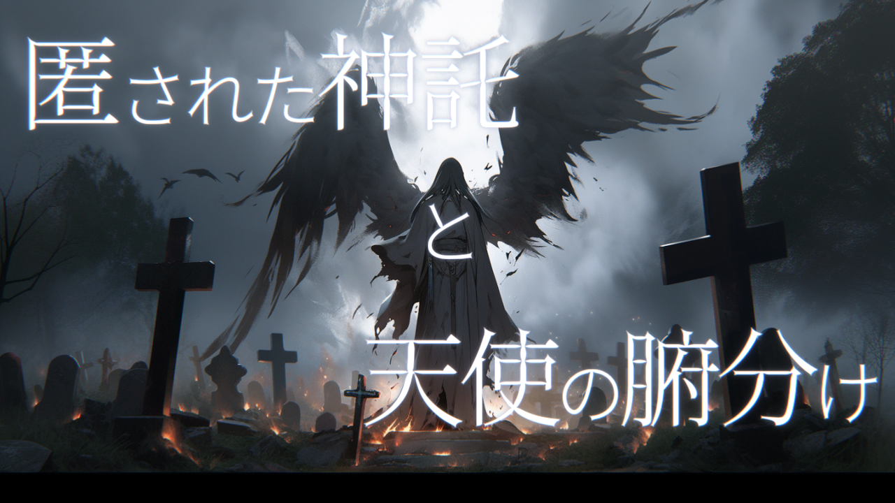
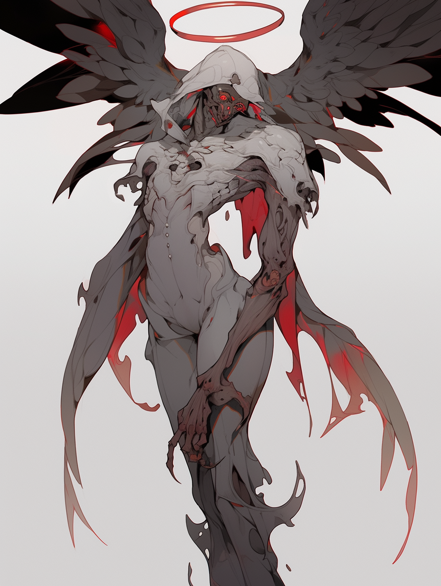
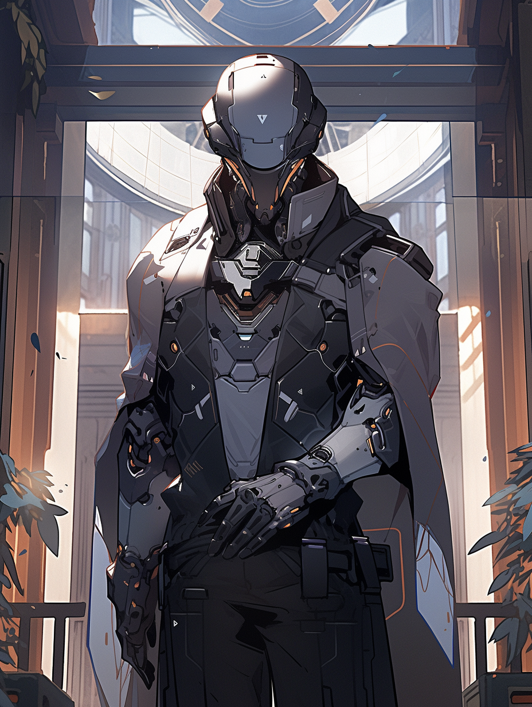

# 匿された神託と天使の腑分け — 完整劇本（GM 向）

> 〔**DoubleCross The 3rd Edition** 劇本・**GM 向全劇透**〕本檔含完整劇情、真相、NPC 數據與全結局，**玩家請勿閱讀**。PL 4 人。
>
> 「天使（信使）」天宜深琴之死、被託付的「殺戮的無限代碼」，以及覬覦它、欲成為新天使的永寧寺双葉——一場圍繞神諭與天器的解剖劇。
>
> 原作：Jorge／studio SISTER（《DoubleCross The 3rd Edition》二次創作）。本檔為非官方繁中翻譯，僅供持有正版者個人遊玩參考。系統用語依 [`DX3_譯名對照表.md`](DX3_譯名對照表.md)。

---

## 本檔內容（請用左側目錄導覽）

- **概要・權利・規則設定・用語定義**
- **開場前（プリプレイ）**：故事、預告、共通／PC1〜4 HO
- **主要遊玩**：開場（OP1〜6）→中段（MD1〜5・EX・TR）→高潮（CL）→回溯→結尾（ED1〜5）
- **賽後**：經驗值
- **資料**：NPC 數據（天宜深琴／永寧寺双葉／龜裂的天使／Dr. 壽／EX 原菌兵奧托瑪塔）、組織・道具、天器（8 色）
- **DoubleCross 舒適化規則**

## 概要

本作是 DoubleCross The 3rd Edition 的劇本。
是以 4 名 PL 為設想所撰寫的劇本。
本作部分採用 DoubleCross 舒適化規則（快適化ルール）。

## 權利表記

本作為 DoubleCross The 3rd Edition（著：矢野俊策／F.E.A.R.、KADOKAWA）的二次創作作品。
本作的著作權歸屬於 Jorge/studio SISTER。
除違反 TRPG 二次創作活動指南的情形外，本劇本可自由使用。改作亦自由。若公開以本作製作而成的新作品，請註明使用了本作之旨。
本作所含的圖像皆由 nijijourney 生成，可自由使用。

## 規則設定（レギュレーション）

- 階段（ステージ）：一般階段
- 經驗值：初期製作 +300 點
- 必要規則書：1、2、上級、IC、PE、EA、LM、UG、HR、RW、BC
其他使用的規則書由 PL、GM 商議決定

## 用語的定義

判定式
指於行為判定時所使用的判定值、關鍵值（クリティカル）、技能值，以及對它們的修正彙整而成的式子。
以
〔判定值〕dx〔關鍵值〕+〔技能值〕
的形式表記。

連攜（コンボ）的表記
【連攜名】：連攜的名稱
《效果名》：所組合的效果（エフェクト）
〔效果：○○〕：對該連攜給予效果的其他數據。連攜數據為已反映此效果者
〔オート：○○〕：在該攻擊之前、格擋之前、判定之前等，於使用此連攜的時機附近所使用的自動動作（オートアクション）
〔使用：○○〕：該連攜所進行的攻擊、格擋等所使用的道具。道具的攻擊力、對命中判定的修正等已反映於連攜數據中

## 開場前（プリプレイ）

### 故事

「天使（信使／メッセンジャー）」天宜深琴（あまぎ みこと），是向各細胞（セル）傳達來自中央教條（セントラルドグマ）訊息的聯絡探員（リエゾンエージェント）。
深琴是 PC1 的同期，或是友人，也是 PC2 的勁敵。
某日，深琴自中央教條手中受託「殺戮的無限代碼（インフィニティコード）」。身為信使的她若持有此物，殺戮便會傳播，為人類帶來災禍。她對此感到憂懼，為了不讓無限代碼擴散而自我了斷。
永寧寺双葉（えいねいじ ふたば）過去曾與 PC3 一同接觸過「殺戮的無限代碼」的片鱗。當時她為之著迷，於是擬定取得完整無限代碼的計畫。為此，她試圖成為新的天使。
另一方面，失去信使的「卡尼法爾斯（カルニファイアーズ）」的 Dr. 壽（コトブキ），憂懼將失去與中央教條的聯繫，於是追求新的信使。為此，他加工深琴的身體，造出天器（エンジェリック・ウェポン），並開始尋找能適合該力量的超越者。
PC 們與双葉皆適合該力量。在此前提下，各自為了自身的目的，闖入「卡尼法爾斯」，打倒 Dr. 壽。
双葉從那份研究成果中得知成為新天使的方法。因此她需要 PC 們所持有的天器，遂與 PC 們敵對。
打倒双葉，便達成劇本通關。

### 預告（Trailer）

天使——Angel
其語源據說源自 Angelos——Messenger
也就是說，天使乃神之使者

擁有絕對權力、絕對影響力之神（中央教條／セントラルドグマ）
被選為其使者的，便是天使（信使／メッセンジャー）
她傳達神的話語、神的意志

然而某日，她遭逢謎樣之死
彷彿玩弄她一般所造出的究極武器，天器（エンジェリック・ウェポン）

於是你得知殺戮的無限代碼之意義
正如生命內含著死亡，任誰皆懷抱著殺戮

DoubleCross The 3rd Edition
「匿（隱）藏的神諭與天使的腑分」
DoubleCross——這是意味著「背叛」的詞語

### HO

#### 共通 HO

最近，在地下市場中流通著一種被稱為「天器（エンジェリック・ウェポン）」的強力武器。據一說，它是以活生生的超越者製成的武器。其對使用者的好惡相當激烈，能適合者寥寥無幾。然而正因其強力的效果，得以高價交易。
基於某個理由，你入手了該天器，並適合了它。
你從天器之中選擇 1 件，將其常備化。但無法取得與參加本場團的其他角色相同的道具。

#### PC1 用 HO

推薦工作（ワークス）：FH 兒童
劇本路易絲：天宜深琴（あまぎ みこと）（友情／―）

你是 FH 兒童。
你是連結中央教條與各細胞的特殊聯絡探員——「天使（信使／メッセンジャー）」天宜深琴的友人，或是親近的同期。她也是與你隸屬同一細胞的成員。
某日為界，她失蹤了。搜索持續進行，卻始終找不到她。
又過了一段時間，地下市場開始流通名為「天器」的武器。你的細胞入手了其中之一，調查的結果發現，「天器」是以天宜深琴的肉體為基礎所製成的。並由此過程推測，天宜深琴已經死亡。
為了悼念她，你決定找出「天器」的製造源頭，並將其殲滅。

※可取得聯絡探員（リエゾンエージェント）、主探員（マスターエージェント）的徽章（エンブレム）

#### PC2 用 HO

推薦工作（ワークス）：UGN 兒童 or UGN 探員
劇本路易絲：天宜深琴（―／敵愾心）

你是 UGN 兒童或 UGN 探員。所屬為日本支部，或 UGN 本部。
你作為天宜深琴的勁敵，數度與她交手。然而最近，未曾再與她相見。
UGN 入手了地下市場上流通的「天器」武器其中之一。經調查後得知，它似乎是使用超越者的生體部件所製成的。對 UGN 而言，無法對這種無視超越者人權的實驗坐視不理。你著手調查其販售源頭，並進行緝獲。

※可取得本部探員的徽章（エンブレム）

#### PC3 用 HO

推薦工作（ワークス）：UGN 兒童 or UGN 探員
劇本路易絲：永寧寺双葉（えいねいじ ふたば）（連帶感 or 友情 or 親近感／―）

你是元 FH 兒童出身的 UGN 兒童或 UGN 探員。所屬為日本支部，或 UGN 本部。
10 年前，FH 兒童的培育時代，你有一位名叫永寧寺双葉、感情很好的同期少女。當時，你曾與她出於好奇心潛入細胞的禁書庫。潛入的你們在那裡發現了一張照片。記錄於其上的，是「殺戮的無限代碼」的些微斷片。
現在，你與同樣適合「天器」的 PC2 一起參與該項調查。

※可取得本部探員的徽章（エンブレム）

#### PC4 用 HO

推薦工作（ワークス）：UGN 系、FH 系以外皆可
劇本路易絲：「天器」（好奇心 or 執著／―）

你是武器狂熱者，或是研究者，又或兩者皆是。
最近地下市場上流通的「天器」，你也入手了其中之一，並適合了它。
此外，你想知道這件不可思議武器的製法，於是著手調查。

（※若能對「天器」抱持強烈興趣，不必拘泥於武器狂熱者或研究者的身份）

## 主要遊玩

### 開場階段

#### OP1：沉眠於禁書庫之物
場景玩家：PC3

解說
PC3 的個別 OP，回想。
PC3 與双葉潛入細胞的禁書庫，發現殺戮的無限代碼的斷片。受殺戮的無限代碼刺激，殺戮衝動被激起。

描寫
> 10 年前。你還是 FH 兒童。在結束今日份的訓練後，坐著輪椅的双葉前來搭話。
> 双葉「吶，我有件一直很在意的事……」
> 双葉「細胞深處有個『禁書庫』對吧？　那裡面，到底保管著什麼呢？」

「禁書庫」是細胞中的一間倉庫，門鎖森嚴，並向兒童們周知禁止進入。

> 双葉「今晚，我們兩個要不要溜進去看看？」

夜晚。在眾人皆已入睡之時，你與双葉前往「禁書庫」。

> 双葉「其實為了今天，我做了不少準備呢。看，這個禁書庫鑰匙的複製品。做起來可費了好大工夫呢。」

進入「禁書庫」後，裡頭略帶塵埃，被陳舊紙張的氣味所包圍。那房間約有一半真的被書籍填滿，其中還包含以不知何種語言、連語種都看不出的未知文字寫成標題者。剩下的一半則如展示櫃般，陳列著寶石與武器等能感受到不可思議力量的人工製品（アーティファクト）。
而特別引人注目的，是位於房間最深處、又被森嚴上鎖的倉庫。

> 双葉「哇，好厲害……」
> 双葉「吶，那是什麼呢。難得都來到這裡了，要不要打開看看？」

双葉凝望著深處的倉庫片刻，開始嘗試各種辦法。

> 双葉「效果……大概隨便使用會觸發警報吧。那麼大概，最不合時宜（アナクロ）的手段才是最好的……！」

她一邊這麼說，一邊取出聽診器，喀啦喀啦地擺弄保險箱的轉盤。

> 双葉「喔，開了開了……」

裡頭裝著的，是 1 個西式信封。並未封緘。從重量判斷，內容物大概是 1 張紙左右。

> 双葉「……信封？　為什麼會有那種東西？」

双葉把那信封拿給你看。

> 双葉「我要看了，裡面的東西——」

你與双葉一起，目睹了它的內容物。裡頭裝著的，是 1 張失焦的照片，是死亡，是黑白，是殺戮，是手震，是虐殺，是手掌大小，是恐怖，是屍體之山，是支離破碎的人體，是骨，是肉，是被吊起的少女與碎裂的少年，是嗤笑的嬰兒與被擰斷的老人——
——這樣的資訊一口氣湧入腦中，然而你們所能理解的，只有那是足以被封印的、「本不該看見之物」這一點而已。

解說 2
以難度 9 進行〈意志〉判定。失敗時，被殺戮衝動支配。双葉的處理方式為：若 PC3 成功則視為失敗，若 PC3 失敗則視為成功。

描寫：PC3 成功時
> 双葉掉落照片，開始掐住你的脖子。

描寫：PC3 失敗時
> 双葉「等等，冷靜下來——！」

結末
之後，可以是自力收拾事態、把信封恢復原狀後離開「禁書庫」，也可以是聽見騷動聞訊而來的大人們收拾了事態。

#### OP2：天使低語
場景玩家：PC2

解說
PC2 的個別，回想。PC2 與深琴的戰鬥場景。

描寫
> 數個月前。你正與一名 FH 探員對峙。理由各式各樣，但這是至今已多次交鋒、有所宿怨的對手。
> 這次是在殲滅了某個正策劃危險計畫——預測將引發超越者大量覺醒——的細胞之後。
> 深琴「哎呀，還真常碰面呢。」
> 深琴「這次或許你也會這麼想——但我終究不是這個細胞的所屬喔。就算把我抓住，也撈不到什麼好處的喔。」
> 深琴「不過呢，我也沒打算乖乖被抓就是了！」

話音剛落，深琴便取出愛用的精裝書，翻開其中一頁。

> 深琴「『——我向爆裂主義者問道，「你是何人」。然而那是錯誤的。我不該發問，而該立刻逃跑才對。』」

深琴如此詠唱，那話語便擁有了實體，從空無一物之處發生巨大的爆炸。

> 深琴「『——毀滅之龍啊，罪孽深重的安寧主義者啊。你的雙眸，你的視線，灼燒著我的肌膚。那麼我便給予你懲罰吧。給予你相稱的炎之懲罰。』」

她進一步操縱爆炎，使火焰形成巨大的龍。它向你襲來。

> 深琴「『——你的話語無法傳達至我。你與我之間，橫亙著縱使渡過三千里、再渡三千里仍無法觸及的深溝。啊，否定主義者啊，若你想越過此處，你的喉嚨將會枯竭殆盡。』」

你的攻擊不自然地歪曲，不知為何避開了深琴。

> 深琴「『身為幻想主義者的我，無法認同它。因為那是你的罪咎，是你的枷鎖，是你的羈軛。』」
> 深琴「我有種還會與你相見的預感喔。——也就是說呢，這次就先告辭了喔。」

只留下「啪噠」一聲闔上書本的聲響，深琴消失了身影。

結末
進行適當的 RP 後場景結束。

#### OP3：應當悼念之物
場景玩家：PC1

解說
PC1 的個別 OP。
向 PC1 說明「天器」，並暗示在其製作過程中深琴有很高的死亡可能性。

描寫
> 與你同屬一細胞的「天使」天宜深琴行蹤不明，至今已滿 1 個月。基於她任務的性質，過去也曾定期發生過暫時性的行蹤不明，但如此長期下落不明卻是頭一次。

你被細胞領袖（セルリーダー）叫到他的辦公室。

> 細胞領袖「來了啊。」
> 細胞領袖「……你跟天宜很要好吧。」
> 細胞領袖「雖然只是大概。天宜的消息查到了。或者該說——說得明白點，是查到了她死亡機率很高這件事。」
> 細胞領袖「你看看這個。」

他取出那物，放在桌上。

> 細胞領袖「這是『天器』系列……最近在地下流通的東西其中之一。一般傳言『使用了活生生的超越者作為材料』。」
> 細胞領袖「分析過後……其變節者病毒模式（レネゲイドパターン），與天宜深琴的一致。說得淺白些，天宜肉體的一部分被當成了這件武器的『材料』。」
> 細胞領袖「流通在外的『天器』共有 9 件。若它們全都使用了與這件相同份量的『素材』——那麼天宜的肉體，幾乎全部都已『加工完畢』。也就是說，天宜幾乎可以確定已經死亡。」
> 細胞領袖「天宜是擁有罕見力量的超越者。接下來是推測，恐怕是某個看上這點的組織——視情況或許是其他細胞也說不定——認為可以利用，於是綁架了她。並且為了自由地運用其力量，將她活生生地加工成武器。」
> 細胞領袖「總而言之，這是命令。鎖定這件武器的製造源頭，把它鏟平。殲滅。一個都別讓他們活著逃掉。讓他們付出代價。」
> 細胞領袖「這件『天器』你帶上吧。會派上用場的。」

結末
PC1 觸碰「天器」時，便適合了它。
PC1 接受任務後，場景結束。

#### OP4：新的武器，新的興趣
場景玩家：PC4

解說
PC4 的個別 OP。
描寫 PC4 看見「天器」並對其產生興趣的場面。可配合 PC 的設定自由更改場面設定。以下為其一例。

描寫
> 你接到某位兵器商（ディーラー）的聯絡，決定與他會面。地點是用於「那種事」的酒館。你在深處的個室等待時，商人現身了。
> 商人「讓您久等了。」
> 商人「您可曾知曉，最近開始流通的『天器』……這種武器呢？」
> 商人「百聞不如一見。我入手了其中之一，特此帶來。若能合您眼緣便好了。」

商人打開公事包，裡頭收納著一柄「天器」。

> 商人「今後也請多多惠顧。」

結末
PC4 適合「天器」、並對其製造源頭抱持興趣後，場景結束。

#### OP5：人體實驗
場景玩家：PC3

解說
PC2 自動登場。PC2、PC3 的委託場景。
委託人若玩家無特別要求，則為泰瑞絲・布魯姆（テレーズ・ブルム）。若 PC 們皆隸屬日本支部，亦可將委託人改為霧谷雄吾。

描寫
> 你們適合了 UGN 入手的「天器」。
> 而現在，你們接到了泰瑞絲・布魯姆的傳喚。
> 泰瑞絲「來了呢。」
> 泰瑞絲「關於你們所適合的那件『天器』，你們聽過多少說明了呢？」
> 泰瑞絲「很好。『天器』在目前確認到的範圍內共有 9 件。而它們每一件，都寄宿著足以匹敵遺產（遺産）的強力力量。並且據傳言，它們似乎使用了活生生的超越者作為材料。」
> 泰瑞絲「分析的結果，已查明那傳言屬實。既然能造出這等品質之物，不難想像在抵達該成果之前，已進行過無數的人體實驗。」
> 泰瑞絲「經評議會審議的結果，判斷這是不可坐視的案例。我要你們進行這些『天器』製造源頭的調查，及其緝獲。」
> 泰瑞絲「現階段已查明的情報都彙整在這份資料裡，要好好過目喔。」
> 泰瑞絲「以上，有什麼問題嗎？」

結末
PC 們接受任務後，場景結束。

#### OP6：宿於那條腿的羽翼
場景玩家：―

解說
相當於双葉個別 OP 的場景。簡單描寫她適合「天器」的瞬間。

描寫
> 某個 FH 細胞中，一間上了鎖的個室。房間的牆上貼著許多照片。若觀看照片中所拍攝之物，會看見「於荒涼廢墟中綻放盛開的一朵枯萎之花」「自崩落的岩壁流瀉而下的細小瀑布水流」「散落於寂靜墓地的枯葉地毯」——它們無一不是美麗、靜謐，且帶著某種虛幻氣息之物。從房間角落擺放著幾台相機看來，或許是房間主人所拍攝的。
> 而那房間的主人，則坐在輪椅上，將目光投向擺在桌上的「那個」。
> 双葉「這就是『天器』——『蒙昧的知識主義者的無色電氣石（アクロアイト）』。」

她拿起那物——以美麗的銀所製成的義足。於是它瞬間綻放光輝，「適合」了她。
光芒平息時，她的右腳已嵌上了那只義足。

> 双葉「腿……」

她怯怯地從輪椅上站起。

> 双葉「站得起來……走得動……」
> 双葉「——這就是引導我的鑰匙，是我的車票呢。」
> 双葉「馬上就會去迎接你了——」

她從口袋取出西式信封，從中抽出 1 張舊照片，輕輕地獻上一吻。

### 中段階段

#### MD1：線索
場景玩家：PC4

解說
此後的場景若無特別註明，皆視為全員登場。
PC 們查出「天器」販售的末端細胞，並在那裡會合。由於全員的目的都是「鎖定製造源頭」，因此在此建立鬆散的協力關係。双葉預料到 PC 們所持的「天器」遲早會派上用場，因此積極地建立協力關係（試圖把 PC 們留在身邊）。
須描寫双葉已從輪椅變為使用義足。

描寫
> 你們以各自的方法，抵達了身為販售源頭的某個 FH 細胞。然而這裡仍是末端細胞，可以預想進行製造的是更上位的細胞。

結末
在締結 PC 們鬆散的協力關係後，透過審訊末端細胞的成員、翻找資料或資料庫等方法，鎖定製造源頭為 FH 細胞「卡尼法爾斯」及其細胞領袖 Dr. 壽。

#### MD2：突入
場景玩家：PC2

解說
突入「卡尼法爾斯」的場景。突破直到抵達 Dr. 壽等候的最深處為止的障礙。
具體而言，以下 4 項判定，由 PC 各自進行 1 項。技能可使用所標記的任一種。順序可自由決定，但每當判定失敗，其後所有判定的難度皆 +1。此效果可累積。此外，屆時 PC 全員會發生〔過負荷 1〕。
・突破電子式保全〈知識：機械工學〉〈情報：網路〉7
・迅速無力化警衛〈白兵〉〈射擊〉〈RC〉20
・鎖定 Dr. 壽的所在位置〈知覺〉〈情報：FH〉9
・迴避・解除所設置的陷阱〈知覺〉〈迴避〉10

結末
每當判定成功（失敗），進行適當的描寫與 RP。所有判定結束後，視為已抵達 Dr. 壽的研究室，場景結束。

#### MD3：Dr. 壽
場景玩家：PC1

解說
與 Dr. 壽遭遇、進行戰鬥並將其擊破的場景。

描寫
> 你們抵達了此處負責人 Dr. 壽的研究室前。
> 進入研究室後，裡頭意外地清爽。大概是把大部分資料電子化了吧，房間裡除了 1 台電腦、數台平板、數片螢幕外，沒有什麼顯眼的研究設備。
> 在離那稍遠處，一名男性坐在待客用的沙發上等候著。
> Dr. 壽「我等候多時了。來，請坐吧。」

他向你們推薦對面的另一張沙發。沙發與沙發之間擺放的桌上，放著 6 杯冒著熱氣的咖啡。

> Dr. 壽「關於『天器』，你們知道多少？」
> Dr. 壽「『天器』是我的最高傑作。既美麗，又強大。是無與倫比的絕妙武器，對吧？　我想，適合了它的你們應該能明白。」
> Dr. 壽「這啊，是用來尋找下一位『天使』的道具。所以，它的所在位置我時刻都在追蹤著。」
> Dr. 壽「我就單刀直入地問了。你們之中，有誰願意成為新的『天使』、協助我們的嗎？」
> Dr. 壽「我先說清楚一點，殺死前一位『天使』的並非我們。把她加工成武器的確實是我沒錯。再多的情報，就要看你們是否願意協助了。」
> 双葉「不好意思，那個所謂的情報啊，我也是來把它全部用蠻力取走的喔。」

戰鬥條件
戰鬥不能條件：Dr. 壽戰鬥不能
接戰（エンゲージ）：〔Dr. 壽〕…5m…〔PC〕

此戰鬥中可使用以下道具。本場景期間，視為 PC 全員皆持有以下道具。

NPC 卡：永寧寺双葉
〔種別：其他〕〔購入／常備化：不可購入／不可〕
顯示永寧寺双葉正協助你的道具。
於你進行判定的直前使用。該判定的骰子 +8 個，達成值 +9。此效果與其他 PC 所持的同名道具合計，每 1 輪最多可使用 1 次。

結末
擊破 Dr. 壽後，場景結束。

##### 戰鬥計畫

Dr. 壽
於最初的先制過程（イニシアチブプロセス）使用【纏雷】。
於最初的一輪使用【腦部超活性化【脳超活性化】】，進行追加的主要過程。此時，使其不與原本的手番連續。
反應以【裝甲展開】進行。

於主要過程使用的連攜
第 1 次：【雷擊裝填】【腕部展開：雷擊砲_01】
第 2 次：【雷擊裝填】【腕部展開：雷擊砲_02】
第 3、4 次：【雷擊裝填】【腕部展開：雷擊砲_03】

#### EX：情報蒐集
場景玩家：任意

解說
進行情報蒐集。無論判定成敗情報皆會公開，但判定失敗時，該 PC 取得〔過負荷 1〕。

情報蒐集項目
・「天器」是什麼〈知識：變節者病毒〉〈情報：FH〉7
・天宜深琴的死因〈情報：學問〉〈情報：FH〉〈情報：UGN〉9
・Dr. 壽的目的〈情報：FH〉〈情報：UGN〉5
・成為下一位「天使」的方法〈情報：FH〉10

結末
所有情報揭示後，會發現天宜深琴生前愛用的 1 本精裝書。移轉至觸發場景（トリガーシーン）。

##### 「天器」是什麼

7
「天器」是「卡尼法爾斯」使用天宜深琴的遺體所製成的 9 件武具。也可說是將「天使」之力分割為 9 等份之物。其製造目的，在於尋找「天使適合者」。
另外「天器」一旦適合便會成為身體的一部分，無法在活著的狀態下分離。適合者死亡時，才會被分離。

##### 天宜深琴的死因

9
天宜深琴的死因為「自殺」。其原因不明。

##### Dr. 壽的目的

5
生前，天宜深琴也向「卡尼法爾斯」遞送過來自中央教條的訊息。藉此，「卡尼法爾斯」得以保有作為與中央教條關係深厚的上位細胞之地位。
然而隨著天宜深琴之死，失去了那份聯繫。Dr. 壽認為這是細胞的危機，於是追求新的「天使」。為此所造出的，便是「天器」。

##### 成為下一位「天使」的方法

10
適合了以天宜深琴遺體製成之「天器」者，被稱為「天使適合者」。「天使適合者」由於與天宜深琴的變節者病毒親和性高，因此擁有能繼承其力量的素質。
「天使適合者」取得所有「天器」，便能成為新的「天使」，並認為可藉此獲得與中央教條的聯繫。

#### TR：天使的遺言
場景玩家：PC1

解說
重現灌注於深琴書中之遺言的場景。其原理是基於深琴所持有的《原初的紅：精神感應（サイコメトリー）》之擴大解釋。

描寫
> 深琴生前愛用的精裝書。拿起它，便開始從中傳來深琴的聲音。
> 深琴「這是我『天使』天宜深琴的遺言喲。我祈禱這不會被重現。」
> 深琴「如你所知，我的工作是傳達來自中央教條的訊息。」
> 深琴「但如今我從中央教條手中被託付了『不可傳達』之物。」
> 深琴「那就是——『殺戮的無限代碼』。它是話語，是資訊，是喚醒沉睡於所有人類之中的殘虐性的鑰匙。」
> 深琴「正因是資訊，所以可複製；正因是話語，所以易於傳播。持有其『原版（オリジナル）』的我，不久將會原菌化（ジャーム化）。屆時我將淪為只會散播『殺戮的無限代碼』的機構。這是確信無疑的。」
> 深琴「一旦如此，整個人類便會掀起殺戮。文明將斷絕，迎來終焉。」
> 深琴「中央教條的意圖為何，我並不清楚。但我，跟一般人一樣喜歡人類。也確實有著不想讓他死去、那般重要的人。」
> 深琴「所以我決定了。趁我還是我的時候，與『殺戮的無限代碼』一同殉死。」
> 深琴「但這既然被重現了，就表示出現了與我同質力量的人。聽著這段話的你。你若就這樣下去，將會成為下一位『天使』。而一旦如此，必定同樣會被授予『殺戮的無限代碼』。」
> 深琴「你若有重要的人。若能哪怕一點點地覺得喜歡人類。那麼此刻就立即捨棄那份力量吧。倘若你是在已經成為『天使』之後才聽到這段話的——很抱歉，但請追隨我而去，死掉吧。」
> 深琴「那麼，往後的事就交由往後的人好好處理了。敬具。」

結末
對遺言簡單地做出反應後，場景結束。

#### MD4：下一位天使

場景玩家：PC3

**解說**

雙葉揭明自身目的，向 PC 們宣告敵對的場景。

**描寫**

> 雙葉「不過呢，我還是搞不懂。」
> 雙葉「被託付『殺戮的無限代碼（インフィニティコード）』，到底有什麼好那麼厭惡的呢。」
> 雙葉「我啊，是想要的喔。『殺戮的無限代碼』。……因為再也沒見過比它更迷人的東西了。」
> 雙葉「為了它，就算死多少個人，不是都無所謂嗎？」
> 雙葉「對我而言，『這個』就是這麼重要的東西。」

如此說著，雙葉從口袋裡取出一個信封。

> 雙葉「還記得嗎？這個。『殺戮的無限代碼』的碎片。光是這麼一丁點就已經如此美麗，那它的全貌究竟會是什麼模樣……會在意吧？」
> 雙葉「所以我要成為下一位『天使』，把『殺戮的無限代碼』弄到手。為此，大家就請死掉、把『天器』交出來吧。」
> 雙葉「沒事的！什麼都不知道就死掉，畢竟也太可憐了——『殺戮的無限代碼』是什麼樣的東西，我就讓你們稍微瞧一瞧吧。」

雙葉從信封中取出那張照片。即使不看也能明白，從中釋放而出的禍祟變節者病毒，正將周遭一帶盡數支配——

**結末**

雙葉使用無限代碼的片鱗，宣告【遍野散落的白骨【荒野に転がる骨】】。

#### MD5：殺戮的無限代碼

場景玩家：―

**解說**

描寫殺戮的無限代碼碎片被啟動後所造成影響的主持人場景（マスターシーン）。

**描寫**

> 血在流淌。肉在四濺。
> 沒有任何人對自己的行為抱持疑問。
> 對方才不久前都還是同僚，此刻卻覺得「該殺掉他」。
> 對方的一舉一動都令人惱火。非殺不可。
> 自己的一舉一動都棲宿著殺意。不殺不行。
> 殺意傳染，殺戮蔓延。
> 此刻，這還只是發生在「卡尼法爾斯（カルニファイアーズ）」細胞（セル）內部的事件。但若原版的「殺戮的無限代碼」被行使，同樣的事情將在一瞬之間於全世界各地開始上演——

**結末**

描寫結束後即場景結束。進入高潮階段。

### 高潮階段

#### CL：匿藏的神諭與天使的腑分

場景玩家：PC1

**解說**

擊破雙葉的場景。在衝動判定時，為了表現雙葉使用了無限代碼碎片一事，使用【一面荒漠的視野【視界一面の砂漠】】。

雙葉一旦被擊破，便會以無限代碼碎片填補不足的形式重新定義自身，試圖在零件不足的狀態下成為天使（詳見戰鬥計畫）。然而由於零件不足，最終以半吊子的形態收場，變貌成異形的怪物（「龜裂的天使（エンジェル・バロット／Angel Ballot）」）。

**描寫**

> 雙葉「奪取大家持有的『天器』，我就要成為『天使』。」

雙葉那銀色義足上折疊著的巨大刀刃展開了。

雙葉以那條腿狠狠踢出，刀刃便如鞭子般彎曲、伸縮，將周遭一帶盡數刈割。

> 雙葉「抱歉囉，我可不會手下留情！」
> 雙葉「『殺戮的無限代碼』，誰都別想拿走！」
> 雙葉「我所持有的『天使』之力，不過只有九分之一……但只要用無限代碼補足剩下的，說不定……！」
> 「龜裂的天使」「身為人這種事，我可一點都不在乎……！用這股力量奪取剩下的『天器』，再度嘗試變貌為『天使』……！」
> 「龜裂的天使」「怎……麼……會……」

**戰鬥條件**

戰鬥不能條件：永寧寺雙葉的戰鬥不能
接戰（エンゲージ）：［永寧寺雙葉，EX 原菌兵：奧托瑪塔（オートマタ）×2］…5m…［PC］

**結末**

擊破「龜裂的天使」後，即場景結束。

##### 戰鬥計畫

**永寧寺雙葉**

反應使用【浮於暗中的眉月【闇に浮かぶ三日月】】，只要進行過一次主要過程後便改用【浮於暗中的滿月【闇に浮かぶ満月】】。
對於大型傷害，使用【崩落的城牆【崩れ落ちた城壁】】【崩落的教堂【崩れ落ちた教会】】。
不良狀態以【狂暴的浪間【荒れ狂う波間】】回復。
陷入戰鬥不能時，先以《不滅的妄執《不滅の妄執》》使其回復，再於緊接的先制過程使用【窺見內部的蛹【中身の覗いた蛹】】。藉此使「龜裂的天使」登場，《不滅的妄執》的效果隨之失效，雙葉陷入戰鬥不能。

主要過程使用的連攜：
第 1 次：【凍結之湖【凍てついた湖】】【燃盡的山岳【燃え尽きた山】】
第 2 次以後：【燃盡的草原【燃え尽きた草原】】

**EX 原菌兵：奧托瑪塔（オートマタ）**

每次準備過程使用【SETUP】。
於最初的先制過程使用【FULL_INSTALL】。在第 1 輪使用【BRITZ CREEK】、第 2 輪使用【INSPIRATION_THUNDER】，讓雙葉進行額外的主要過程。注意這次主要過程不要與雙葉本來的手番連續。
反應以【DODGE_01】【DODGE_02】進行。
以自動動作（オートアクション）使用【DISPERSION】、【ULTRA BARRIER】，減輕對雙葉造成的傷害。
不良狀態以【RECOVERY】回復。
陷入戰鬥不能時，以【ASURA_WORLD】回復一次。

主要過程使用的連攜：
第 1 次：【MINOR_01】【MAJOR_01】
第 2 次以後：【MINOR_02】【MAJOR_02】

**「龜裂的天使」**

此敵人恆常處於飛行狀態。
於此敵人登場的先制過程使用【強行孵化【強引なる孵化】】，進行主要過程，給予雙葉最後一擊。在其後的先制過程使用【淨化【浄化】】，使 EX 原菌兵陷入戰鬥不能。
之後便以一般手番，以及因【偽天使於夜中等待【偽天使は夜に待つ】】而變為未行動的【行動值】0 手番，每輪進行 2 次主要過程。盡可能注意不要連續攻擊同一對象。
反應使用【偽天使之盾【偽天使の盾】】。
對於大型傷害，使用【偽天使的守護【偽天使の守護】】。不良狀態以【無謬之翼【無謬なる翼】】回復。
此外，對於 PC 之中剩餘路易絲較多的 PC 之攻擊，使用【合鏡之陷阱【合わせ鏡の陥穽】】。每輪 1 次，以【白夜之闇【白夜の闇】】妨礙攻擊。

主要過程使用的連攜：
【強行孵化】：【偽天使的槍盾【偽天使の槍盾】】【崩解的空殼【崩れる抜け殻】】
第 1 次：【為光輝目眩【輝きに眩め】】【偽天使的號角【偽天使のラッパ】】
第 2 次以後：【為光輝目眩【輝きに眩め】】【偽天使的裁定【偽天使の裁定】】

### 回溯（バックトラック）

使用的 E 路易絲為 27 個。

### 結尾階段

#### ED1：腐壞之卵（ロッテン・エッグ／Rotten Egg）

場景玩家：PC3

**解說**

戰鬥剛結束的場景。雙葉因無謀變身的負荷而死亡。隨之，白：蒙昧知識主義者的無色電氣石（アクロアイト）與無限代碼碎片從雙葉身上分離。決定如何處置這些「天器」與無限代碼碎片。若有所猶豫，可設定為：雙葉的「天器」由 PC1、無限代碼碎片由 PC3、「卡尼法爾斯」的研究成果由 PC4 帶回。

**結末**

進行完必要的 RP 後即場景結束。

#### ED2～5

PC 的個別 ED。主要設想為：
PC1：替深琴掃墓
PC2：向泰蕾茲・布魯姆（テレーズ・ブルム）回報任務
PC3：對「殺戮的無限代碼」碎片的 RP
PC4：任意
請配合 PL 的希望自由演出。

## 賽後（After Play）

### 經驗值

本劇本「達成劇本目的」的經驗值如下：

擊破「龜裂的天使」：5 點
擊破永寧寺雙葉：3 點
擊破 Dr. 壽（コトブキ）：1 點
弔唁天宜深琴：1 點
E 路易絲：27 點
D 路易絲：1 點
特別獎勵：50 點

## 資料

### 角色

#### 「天使（信使／メッセンジャー）」天宜深琴（あまぎ みこと）

傳達來自中央教條（セントラルドグマ）訊息的「信使（メッセンジャー）」。通稱「天使」。

她從中央教條手中接過「殺戮的無限代碼」，憂懼這將為人類帶來災禍，為將無限代碼葬於黑暗而自我了結了性命。

其後被 Dr. 壽（コトブキ）為了尋找新的天使適合者而加工成天器。

她隨身攜帶一本內頁全為白紙的精裝書。深琴利用它對自身進行條件設定。翻開書本時所見所聞之事她絕對不會忘記，再次翻開書本便能正確重現所聽聞的內容。

傳達來自中央教條的口信雖是她的職責，但她單獨的戰鬥能力也相當高。至少高到足以單獨潛入任何 UGN 支部、傳達口信後再平安歸來的程度。

**生涯路徑（ライフパス）**：年齡 17 歲／性別 女性／星座 獅子座／生日 8/10／身高 158cm／體重 49kg／血型 B 型

**基本數據**

| 項目 | 內容 |
|---|---|
| 種別 | 一般 |
| 工作（ワークス） | FH 探員 |
| 掩護用身份（カヴァー） | 天使 |
| 血統（ブリード） | 混血（Cross） |
| 症狀（シンドローム） | 幻象投影《ソラリス》／烏洛波洛斯《ウロボロス》 |
| 衝動 | 殺戮 |
| 能力值 | 【肉體】2【感覺】3【精神】5【社會】7 |
| 技能 | 〈白兵〉2〈射擊〉2〈RC〉9〈意志〉10〈調達〉8〈情報：FH〉19 |
| 侵蝕率 | 61% |
| D 路易絲 | 《同僚》《別組織》 |

**興趣嗜好**：喜歡的東西 新的相遇／喜歡的食物 餅乾、司康、茉莉花茶／討厭的東西 體力勞動／討厭的食物 味道濃重的肉類／平均沐浴時間 30min／平均睡眠時間 8h／興趣 在朋友家過夜

**取得效果**

> 治癒之水《癒やしの水》5、中和劑《中和剤》1、索瑪之雫《ソーマの雫》3、黃泉醜女《ヨモツヘグリ》3、阿斯克勒庇俄斯之杖《アスクレピオスの杖》5、原初之青：光芒疾走《原初の青：光芒の疾走》3、毒霧《ポイズンフォッグ》3、恐怖的一言《恐怖の一言》5、錯覺之香《錯覚の香り》3、絕對的恐怖《絶対の恐怖》5、神之御言《神の御言葉》5、精神集中：幻象投影《コンセントレイト：ソラリス》3、極光螺旋《極光螺旋》3、原初之赤：心靈感測《原初の赤：サイコメトリー》、其他

**道具**

> 能力訓練：社會、黑卡（ブラックカード）、強化商務西裝（強化ビジネススーツ）、水晶護盾（クリスタルシールド）、天使（エンジェル）、配件（アクセサリー）（白紙之書）

#### 「安樂椅狙擊手（アームチェア・スナイパー）」永寧寺雙葉（えいねいじ ふたば）

為了將「殺戮的無限代碼」弄到手，企圖成為下一代天使。

為此襲擊「卡尼法爾斯」，並與 PC 合作擊破 Dr. 壽（コトブキ）。

其後取得了從天器復原天使權能的方法，試圖從 PC 們手中回收天器。

她原本右腳不便，需乘坐輪椅，但因與天器適合而獲得了比血肉之軀更勝一籌的義足。從前是坐在輪椅上操作栓動式步槍（ボルトアクションライフル）的戰鬥風格。在開場的回想中是坐著輪椅登場。

連攜名取自她興趣攝影中喜愛的作品。

**生涯路徑（ライフパス）**：年齡 17 歲／性別 女性／星座 不明／生日 不明／身高 147cm／體重 42kg／血型 A 型

**基本數據**

| 項目 | 內容 |
|---|---|
| 種別 | 一般 |
| 工作（ワークス） | FH 兒童 |
| 掩護用身份（カヴァー） | FH 兒童 |
| 血統（ブリード） | 混血（Cross） |
| 症狀（シンドローム） | 疾速靈猿《ハヌマーン》／變換自在《エグザイル》 |
| 衝動 | 殺戮 |
| 能力值 | 【肉體】10【感覺】4【精神】3【社會】3 |
| 技能 | 〈白兵〉9〈駕駛：二輪〉7〈射擊〉13〈RC〉2〈意志〉2〈調達〉5〈情報：FH〉2 |
| 侵蝕率／HP／行動值／裝甲值 | 253% ／ 223 ／ 11 ／ 10 |
| E 路易絲 | 《被預告的終焉》《傲慢的理想》《傲慢的理想》《傲慢的理想》《不滅的妄執》《更深的絕望》《衝動侵蝕》 |

**興趣嗜好**：喜歡的東西 對方死去瞬間驚愕的表情／喜歡的食物 鮮奶油蛋糕、巧克力／討厭的東西 無聊／討厭的食物 油膩的東西／平均沐浴時間 10min／平均睡眠時間 4h／興趣 攝影

**取得效果**

> 生命增強Ⅱ《生命増強Ⅱ》10、強韌骨骼《強靭骨格》4、骨之劍《骨の剣》8、招死之爪《死招きの爪》6、生命的黃金率《生命の黄金率》6、形狀變化：剛《形状変化：剛》5、形狀變化：柔《形状変化：柔》5、吸收《吸収》5、植入《埋め込み》3、全射程《オールレンジ》8、纏縛《エンタングル》6、音速攻擊《音速攻撃》6、疾風劍《疾風剣》5、更進之波《さらなる波》5、神速的鼓動《神速の鼓動》4、如猿猴般《マシラのごとく》6、死神的精度《死神の精度》6、精神集中：變換自在《コンセントレイト：エグザイル》6、爪劍《爪剣》8、死神之爪《死神の爪》4、極限解除《リミットリリース》1、受詛咒者之印《呪われし者の印》1、彈簧護盾《スプリングシールド》6、扭曲之軀《歪みの体》7、跳躍千斤頂《ジャンピングジャック》6、穿透《透過》4、空蟬《空蝉》4、狀態復原《状態復元》4、援護之風《援護の風》8、大裁斷《大裁断》6、風息《ウィンドブレス》3

**道具**

> 最強的一振、玩具使者（玩具使い）、與生俱來的瘋狂（生来の狂気）、隨性（気まぐれ）、白：蒙昧知識主義者的無色電氣石（アクロアイト）、配件（アクセサリー）（相機）、栓動式步槍（ボルトアクションライフル）、手槍、個人移動載具（パーソナルモビリティ）（輪椅）

##### 白：蒙昧知識主義者的無色電氣石（アクロアイト）

［種別：其他］［購入／常備化：不可購入／不可］

馴合得不自然的銀色義足。用於攻擊時，內藏的刀刃會展開，傷及眾多對手。顯現的水晶顏色為白。

於徒手白兵攻擊的前一刻宣告。將該次攻擊的對象變更為場景（選擇），射程變更為視界。但該次攻擊的攻擊力 -30。

##### 連攜（コンボ）

**【遍野散落的白骨【荒野に転がる骨】】**
《被預告的終焉《予告された終焉》》＋〔オート：《傲慢的理想《傲慢な理想》》＋《傲慢的理想《傲慢な理想》》＋《傲慢的理想《傲慢な理想》》〕
［時機：自動動作］［技能：―］［難度：自動成功］［對象：參照效果］［射程：視界］
［使用時機：隨時］
・於進入結尾階段時，全世界殺戮橫行，產生大量死者

**【一面荒漠的視野【視界一面の砂漠】】**
《衝動侵蝕《衝動侵蝕》》
［時機：自動動作］［技能：―］［難度：自動成功］［對象：場景（選擇）］［射程：視界］
［使用時機：隨時］
・引發衝動判定
	・若此判定失敗……
		・產生殺戮衝動
		・若取得了渴望效果（アージエフェクト），則發生變異暴走：殺戮以取代暴走

**【窺見內部的蛹【中身の覗いた蛹】】**
《更深的絕望《さらなる絶望》》
［時機：先制過程］［技能：―］［難度：自動成功］［對象：自身］［射程：至近］
・在對象所在的接戰中，使「龜裂的天使」登場
・藉此解除對象的《不滅的妄執《不滅の妄執》》之效果

**【凍結之湖【凍てついた湖】】**
《骨之劍《骨の剣》》＋《招死之爪《死招きの爪》》＋《生命的黃金率《生命の黄金率》》＋《形狀變化：剛《形状変化：剛》》＋《形狀變化：柔《形状変化：柔》》
［時機：次要動作（マイナーアクション）］［技能：―］［難度：自動成功］［對象：自身］［射程：至近］
・變更徒手的數據
・場景間……
	・【肉體】的判定骰 +7 個
	・攻擊力 +10
	・格擋值 +10

**【燃盡的山岳【燃え尽きた山】】**
《吸收《吸収》》＋《植入《埋め込み》》＋《全射程《オールレンジ》》＋《纏縛《エンタングル》》＋《音速攻擊《音速攻撃》》＋《疾風劍《疾風剣》》＋《更進之波《さらなる波》》＋《大裁斷《大裁断》》＋《精神集中：變換自在《コンセントレイト：エグザイル》》＋《神速的鼓動《神速の鼓動》》＋《如猿猴般《マシラのごとく》》＋《死神的精度《死神の精度》》＋《爪劍《爪剣》》＋《死神之爪《死神の爪》》〔オート：《極限解除《リミットリリース》》＋《受詛咒者之印《呪われしもの印》》＋《跳躍千斤頂《ジャンピングジャック》》〕＋〔效果：【凍結之湖【凍てついた湖】】＋《強韌骨骼《強靭骨格》》＋最強的一振＋玩具使者＋隨性〕
［時機：主要動作（メジャーアクション）］［技能：〈白兵〉］［難度：白兵］［對象：場景（選擇）］［射程：視界］
・進行 判定式：39dx5+10　攻擊力：186+6D 的白兵攻擊
・無法進行反應
・HP 傷害時……
	・輪間……
		・對象的判定骰 -5 個
		・對象的格擋值 -9
	・賦予重壓
・對此攻擊之反應的骰 -6 個
・次數限制：1/劇本

**【燃盡的草原【燃え尽きた草原】】**
《吸收《吸収》》＋《植入《埋め込み》》＋《全射程《オールレンジ》》＋《纏縛《エンタングル》》＋《音速攻擊《音速攻撃》》＋《疾風劍《疾風剣》》＋《更進之波《さらなる波》》＋《大裁斷《大裁断》》＋《精神集中：變換自在《コンセントレイト：エグザイル》》＋〔效果：【凍結之湖【凍てついた湖】】＋《強韌骨骼《強靭骨格》》＋白：蒙昧知識主義者的無色電氣石（アクロアイト）＋最強的一振＋玩具使者＋隨性〕
［時機：主要動作］［技能：〈白兵〉］［難度：白兵］［對象：場景（選擇）］［射程：視界］
・進行 判定式：39dx7+10　攻擊力：66 的白兵攻擊
・HP 傷害時……
	・輪間……
		・對象的判定骰 -5 個
		・對象的格擋值 -9
	・賦予重壓
・對此攻擊之反應的骰 -5 個

**【浮於暗中的眉月【闇に浮かぶ三日月】】**
格擋（ガード）＋〔使用：徒手〕＋〔效果：《強韌骨骼《強靭骨格》》〕＋〔オート：《彈簧護盾《スプリングシールド》》〕
［時機：反應］［技能：―］［難度：自動成功］［對象：自身］［射程：至近］
・進行 格擋值：15 的格擋
・次數限制：6/場景

**【浮於暗中的滿月【闇に浮かぶ満月】】**
格擋（ガード）＋〔使用：徒手〕＋〔效果：【凍結之湖【凍てついた湖】】＋《強韌骨骼《強靭骨格》》〕＋〔オート：《彈簧護盾《スプリングシールド》》〕
［時機：反應］［技能：―］［難度：自動成功］［對象：自身］［射程：至近］
・進行 格擋值：31 的格擋
・次數限制：6/場景

**【狂暴的浪間【荒れ狂う波間】】**
《狀態復原《状態復元》》
［時機：自動動作］［技能：―］［難度：自動成功］［對象：自身］［射程：至近］
［使用時機：受到不良狀態的緊接其後］
・全部回復不良狀態
・失去 回復個數×5 點的 HP

**【崩落的城牆【崩れ落ちた城壁】】**
《空蟬《空蝉》》
［時機：自動動作］［技能：―］［難度：自動成功］［對象：自身］［射程：至近］
［使用時機：HP 傷害計算出的緊接其後］
・將 HP 傷害歸 0
・即使受到重壓也可使用
・次數限制：1/劇本

**【崩落的教堂【崩れ落ちた教会】】**
《穿透《透過》》
［時機：自動動作］［技能：―］［難度：自動成功］［對象：自身］［射程：至近］
［使用時機：HP 傷害計算出的緊接其後］
・將 HP 傷害歸 0
・即使受到重壓也可使用
・次數限制：1/劇本

#### 「龜裂的天使（エンジェル・バロット／Angel Ballot）」

雙葉動用無限代碼的片鱗與天器（天使之力的碎片），強行試圖成為天使之末的姿態。天使的失敗品。

**基本數據**

| 項目 | 內容 |
|---|---|
| 種別 | 一般 |
| 工作（ワークス） | 變節者存在（レネゲイドビーイング） |
| 掩護用身份（カヴァー） | 未能孵化的天使 |
| 血統（ブリード） | 混血（Cross） |
| 症狀（シンドローム） | 天使光環《エンジェルハィロゥ》／鮮血真祖《ブラム＝ストーカー》 |
| 衝動 | 殺戮 |
| 能力值 | 【肉體】15【感覺】15【精神】15【社會】5 |
| 技能 | 〈白兵〉13 |
| 侵蝕率／HP／行動值／裝甲值 | 372% ／ 265 ／ 45 ／ 10 |
| D 路易絲 | 《神格》 |
| E 路易絲 | 《慘劇的輪迴》《不可能存在之物》×5 |

**取得效果**

> 生命增強Ⅱ《生命増強Ⅱ》10、飛行能力Ⅱ《飛行能力Ⅱ》4、人類鄰人《ヒューマンズネイバー》4、死亡纏繞者《デスストーカー》8、不死者之血《不死者の血》4、起源：人類《オリジン：ヒューマン》8、陽炎之衣《陽炎の衣》6、閃耀刀刃《シャインブレード》13、光芒疾走《光芒の疾走》6、光之衣《光の衣》6、赫紅之劍《赫き剣》8、破壞之血《破壊の血》8、護盾創造《シールドクリエイト》3、食人魔戰役《オウガバトル》13、鎖定《ターゲッティング》6、朱色大斧《朱色の大斧》8、始祖的血統《始祖の血統》6、血之宴《血の宴》6、殺戮領域《殺戮領域》6、血焰《ブラッドバーン》5、鮮血一擊《鮮血の一撃》8、乾涸之主《乾きの主》8、死點射擊《死点撃ち》6、血族《血族》10、滅亡之光《滅びの光》5、光之舞踏《光の舞踏》4、主之右臂《主の右腕》5、玻璃之劍《ガラスの剣》8、變節者天罰《レネゲイドスマイト》5、鮮血修羅《鮮血の修羅》4、技能聚焦《スキルフォーカス》6、多重目標《マルチターゲット》8、精神集中：天使光環《コンセントレイト：エンジェルハィロゥ》6、災厄粉碎《カラミティスマッシュ》4、終焉閃光《ファイナルフラッシュ》6、閃光凝視《フラッシュゲイズ》4、地獄之血《ヘルズブラッド》6、鏡之盾《鏡の盾》8、光之守護《光の守護》4、夜魔領域《夜魔の領域》6、狀態復原《状態復元》4

**道具**

> 致命閃光（リーサルシャイン）、無限光環（インフィニティコロナ）

##### 連攜（コンボ）

**【強行孵化【強引なる孵化】】**
《慘劇的輪迴《惨劇の輪廻》》
［時機：先制過程］［技能：―］［難度：自動成功］［對象：自身］［射程：至近］
・場景內有任何一人陷入戰鬥不能時可宣告
・對象進行主要過程
	・即使已行動完畢也能進行，且不會變為已行動
	・此次主要過程中無法進行「給予最後一擊」以外的行動

**【淨化【浄化】】**
《神格》
［時機：先制過程］［技能：―］［難度：自動成功］［對象：參照效果］［射程：視界］
・藉由黃金法則（ゴールデンルール）使「EX 原菌兵：奧托瑪塔（オートマタ）」陷入戰鬥不能。
・次數限制：1/劇本

**【偽天使的槍盾【偽天使の槍盾】】**
《起源：人類《オリジン：ヒューマン》》＋《赫紅之劍《赫き剣》》＋《破壞之血《破壊の血》》＋《閃耀刀刃《シャインブレード》》＋《護盾創造《シールドクリエイト》》＋〔效果：致命閃光（リーサルシャイン）〕
［時機：次要動作］［技能：―］［難度：自動成功］［對象：自身］［射程：至近］
・製作武器
・場景間……使用效果的所有判定之達成值 +8
・消耗 18 點 HP

**【為光輝目眩【輝きに眩め】】**
《陽炎之衣《陽炎の衣》》＋《光芒疾走《光芒の疾走》》＋《光之衣《光の衣》》＋《食人魔戰役《オウガバトル》》＋《鎖定《ターゲッティング》》
［時機：次要動作］［技能：―］［難度：自動成功］［對象：自身］［射程：至近］
・進行戰鬥移動
	・無視接觸、可脫離
・變為隱密狀態
・主要過程間……
	・對所進行攻擊之反應的 C 值 +1
	・攻擊力 +15
	・判定骰 +6 個
・次數限制：6/劇本

**【崩解的空殼【崩れる抜け殻】】**
《乾涸之主《乾きの主》》＋《朱色大斧《朱色の大斧》》＋〔效果：【偽天使的槍盾【偽天使の槍盾】】〕＋〔使用：赫紅之劍〕
［時機：主要動作］［技能：〈白兵〉］［難度：對決］［對象：單體］［射程：至近］
・進行 判定式：22dx10+21　攻擊力：66 的白兵攻擊
・命中時……回復 32 點 HP
・HP 傷害時……場景間，白兵攻擊的攻擊力 +32
・「給予最後一擊」

**【偽天使的號角【偽天使のラッパ】】**
《乾涸之主《乾きの主》》＋《光之舞踏《光の舞踏》》＋《血之宴《血の宴》》＋《始祖的血統《始祖の血統》》＋《殺戮領域《殺戮領域》》＋《血焰《ブラッドバーン》》＋《鮮血一擊《鮮血の一撃》》＋《死點射擊《死点撃ち》》＋《血族《血族》》＋《滅亡之光《滅びの光》》＋《主之右臂《主の右腕》》＋《玻璃之劍《ガラスの剣》》＋《變節者天罰《レネゲイドスマイト》》＋《鮮血修羅《鮮血の修羅》》＋《技能聚焦《スキルフォーカス》》＋《多重目標《マルチターゲット》》＋《精神集中：天使光環《コンセントレイト：エンジェルハィロゥ》》＋《災厄粉碎《カラミティスマッシュ》》＋《終焉閃光《ファイナルフラッシュ》》＋〔效果【偽天使的槍盾【偽天使の槍盾】】＋【為光輝目眩【輝きに眩め】】＋【崩解的空殼【崩れる抜け殻】】＋《死亡纏繞者《デスストーカー》》＋《不死者之血《不死者の血》》＋無限光環（インフィニティコロナ）〕＋〔使用：赫紅之劍〕＋〔オート：《地獄之血《ヘルズブラッド》》〕
［時機：主要動作］［技能：〈白兵〉］［難度：對決］［對象：範圍（選擇）］［射程：至近］
・進行 判定式：49dx7+49　攻擊力：298+12D 的白兵攻擊
・以隱密狀態進行主要過程
・對此攻擊之反應的……
	・骰 -10 個
	・C 值 +3
・無視裝甲值
・命中時……回復 32 點 HP
・HP 傷害時……對象於結束過程失去 40 點 HP
・消耗 10 點 HP
・次數限制：1/劇本

**【偽天使的裁定【偽天使の裁定】】**
《乾涸之主《乾きの主》》＋《光之舞踏《光の舞踏》》＋《血之宴《血の宴》》＋《始祖的血統《始祖の血統》》＋《殺戮領域《殺戮領域》》＋《血焰《ブラッドバーン》》＋《鮮血一擊《鮮血の一撃》》＋《死點射擊《死点撃ち》》＋《血族《血族》》＋《滅亡之光《滅びの光》》＋《主之右臂《主の右腕》》＋《玻璃之劍《ガラスの剣》》＋《變節者天罰《レネゲイドスマイト》》＋《鮮血修羅《鮮血の修羅》》＋《技能聚焦《スキルフォーカス》》＋《多重目標《マルチターゲット》》＋《精神集中：天使光環《コンセントレイト：エンジェルハィロゥ》》＋〔效果【偽天使的槍盾【偽天使の槍盾】】＋【為光輝目眩【輝きに眩め】】＋【崩解的空殼【崩れる抜け殻】】＋《死亡纏繞者《デスストーカー》》＋《不死者之血《不死者の血》》〕＋〔使用：赫紅之劍〕
［時機：主要動作］［技能：〈白兵〉］［難度：對決］［對象：範圍（選擇）］［射程：至近］
・進行 判定式：49dx7+49　攻擊力：202 的白兵攻擊
・以隱密狀態進行主要過程
・對此攻擊之反應的……
	・骰 -10 個
	・C 值 +1
・無視裝甲值
・命中時……回復 32 點 HP
・HP 傷害時……對象於結束過程失去 40 點 HP
・消耗 10 點 HP
・次數限制：6/場景

**【偽天使之盾【偽天使の盾】】**
格擋（ガード）＋〔使用：護盾創造（シールドクリエイト）〕
［時機：反應］［技能：―］［難度：自動成功］［對象：自身］［射程：至近］
・進行 格擋值：10 的格擋

**【合鏡之陷阱【合わせ鏡の陥穽】】**
《鏡之盾《鏡の盾》》
［時機：自動動作］［技能：―］［難度：參照效果］［對象：參照效果］［射程：參照效果］
［使用時機：對你套用 HP 傷害的緊接其後］
・以造成該 HP 傷害的角色為對象，給予與你所受 HP 傷害等量的 HP 傷害（上限 160 點）
・次數限制：1/劇本

**【白夜之闇【白夜の闇】】**
《閃光凝視《フラッシュゲイズ》》
［時機：自動動作］［技能：―］［難度：自動成功］［對象：單體］［射程：視界］
［使用時機：對象進行判定的前一刻］
・將判定骰 -8 個。
・次數限制：1/輪

**【偽天使於夜中等待【偽天使は夜に待つ】】**
《夜魔領域《夜魔の領域》》
［時機：自動動作］［技能：―］［難度：自動成功］［對象：自身］［射程：至近］
［使用時機：進行主要過程的緊接其後］
・變為未行動
・將【行動值】歸 0
・次數限制：1/輪、6/劇本

**【偽天使的守護【偽天使の守護】】**
《光之守護《光の守護》》
［時機：自動動作］［技能：―］［難度：自動成功］［對象：自身］［射程：至近］
［使用時機：HP 傷害計算出的緊接其後］
・將 HP 傷害歸 0
・即使受到重壓也可使用
・次數限制：1/劇本

**【無謬之翼【無謬なる翼】】**
《狀態復原《状態復元》》
［時機：自動動作］［技能：―］［難度：自動成功］［對象：自身］［射程：至近］
［使用時機：受到不良狀態的緊接其後］
・全部回復不良狀態
・失去 回復個數×5 點的 HP

#### 「武器即吾命（ノーウェポン・ノーライフ）」Dr. 壽（コトブキ）

本名為壽奉璽（ことぶき ほうじ）。「卡尼法爾斯」細胞領袖。

原本是深琴進出的細胞。她死後，他憂懼失去與中央教條的聯繫，為了造出新的天使而尋找適合者。天器是為此而生的工具，同時也是「卡尼法爾斯」的最高傑作。

**生涯路徑（ライフパス）**：年齡 49 歲／性別 男性／星座 巨蟹座／生日 7/4／身高 184cm／體重 69kg／血型 O 型

**基本數據**

| 項目 | 內容 |
|---|---|
| 種別 | 一般 |
| 工作（ワークス） | FH 細胞領袖 |
| 掩護用身份（カヴァー） | 研究者 |
| 血統（ブリード） | 純粹種（Pure） |
| 症狀（シンドローム） | 雷擊黑犬《ブラックドッグ》 |
| 衝動 | 嫌惡 |
| 能力值 | 【肉體】3【感覺】2【精神】6【社會】5 |
| 技能 | 〈白兵〉2〈射擊〉3〈藝術：武器〉7〈RC〉8〈意志〉4〈情報：FH〉4 |
| 侵蝕率／HP／行動值／裝甲值 | 131% ／ 232 ／ 10 ／ 5 |
| E 路易絲 | 《拒絕的結界》×2 |

**興趣嗜好**：喜歡的東西 兼具實用性與藝術性的武器／喜歡的食物 不弄髒手的、方便的食物／討厭的東西 沒有實用性的東西／討厭的食物 會弄髒手、費時的食物／平均沐浴時間 5min／平均睡眠時間 1h／興趣 研究

**取得效果**

> 生命增強Ⅱ《生命増強Ⅱ》10、真正之雷《真なる雷》5、雷之加護《雷の加護》4、雷之槍《雷の槍》8、精神集中：雷擊黑犬《コンセントレイト：ブラックドッグ》3、紫電一閃《紫電一閃》2、閃光電漿《フラッシングプラズマ》5、雷神之槌《雷神の槌》6、MAX 電壓《MAXボルテージ》4、雷之劍《雷の剣》4、球電之盾《球電の盾》5、完全安裝《フルインストール》4、鼓舞之雷《鼓舞の雷》1

**道具**

> 人格商店（ペルソナショップ）

##### 連攜（コンボ）

【雷擊裝填【雷撃装填】】
《真正之雷《真なる雷》》＋《雷之加護《雷の加護》》
［時機：次要動作］［技能：―］［難易度：自動成功］［對象：自身］［射程：至近］
・主要過程間……
	・組合雷擊黑犬《ブラックドッグ》效果的判定骰＋4 個
	・組合雷擊黑犬《ブラックドッグ》效果的攻擊之攻擊力＋10
・消耗 HP 5 點

【腕部展開：雷擊砲_01【腕部展開：雷撃砲_01】】
《雷之槍《雷の槍》》＋《精神集中：雷擊黑犬《コンセントレイト：ブラックドッグ》》＋《雷神之槌《雷神の槌》》＋《MAX 電壓《MAXボルテージ》》＋《雷之劍《雷の剣》》＋《閃光電漿《フラッシングプラズマ》》＋《紫電一閃《紫電一閃》》＋〔效果：【雷擊裝填【雷撃装填】】＋【纏雷【纏雷】】〕
［時機：主要動作］［技能：〈RC〉］［難易度：對決］［對象：場景（選擇）］［射程：視界］
・判定式：24dx6+8　攻擊力：51　進行射擊攻擊
・次數限制：1／劇本

【腕部展開：雷擊砲_02【腕部展開：雷撃砲_02】】
《雷之槍《雷の槍》》＋《精神集中：雷擊黑犬《コンセントレイト：ブラックドッグ》》＋《雷神之槌《雷神の槌》》＋《MAX 電壓《MAXボルテージ》》＋《雷之劍《雷の剣》》＋〔效果：【雷擊裝填【雷撃装填】】＋【纏雷【纏雷】】〕
［時機：主要動作］［技能：〈RC〉］［難易度：對決］［對象：範圍（選擇）］［射程：視界］
・判定式：24dx7+8　攻擊力：51　進行射擊攻擊
・次數限制：4／劇本

【腕部展開：雷擊砲_03【腕部展開：雷撃砲_03】】
《雷之槍《雷の槍》》＋《精神集中：雷擊黑犬《コンセントレイト：ブラックドッグ》》＋《雷神之槌《雷神の槌》》＋《MAX 電壓《MAXボルテージ》》＋《雷之劍《雷の剣》》＋〔效果：【雷擊裝填【雷撃装填】】〕
［時機：主要動作］［技能：〈RC〉］［難易度：對決］［對象：範圍（選擇）］［射程：視界］
・判定式：12dx7+8　攻擊力：51　進行射擊攻擊
・次數限制：4／劇本

【裝甲展開【装甲展開】】
格擋（ガード）＋〔使用：徒手〕＋〔オート：《球電之盾《球電の盾》》〕
［時機：反應］［技能：―］［難易度：自動成功］［對象：自身］［射程：至近］
・以格擋值：10　進行格擋

【纏雷【纏雷】】
《全裝填《フルインストール》》
［時機：先制過程］［技能：―］［難易度：自動成功］［對象：自身］［射程：至近］
・該輪間……所有判定的骰子＋12 個
・次數限制：1／劇本

【腦部超活性化【脳超活性化】】
《鼓舞之雷《鼓舞の雷》》
［時機：先制過程］［技能：―］［難易度：自動成功］［對象：單體］［射程：視界］
・對象進行主要過程
	・即使已行動完畢也能進行，且不會變為已行動完畢
・次數限制：1／劇本

#### EX 原菌兵：奧托瑪塔（オートマタ）

雙葉所持有的 EX 原菌。約 2 公尺高的人型機械人偶。頭部為類似全罩式面罩的造形。平時會變成約 15 公分大小的圓盤狀形態隨身攜帶。

**基本數據**

| 項目 | 內容 |
|---|---|
| 種別 | 一般 |
| 掩護（カヴァー） | EX 原菌 |
| 血統（ブリード） | 混血（Cross） |
| 症狀（シンドローム） | 雷擊黑犬《ブラックドッグ》／天縱之才《ノイマン》 |
| 能力值 | 【肉體】10【感覺】10【精神】10【社會】1 |
| 技能 | 〈白兵〉10 〈射擊〉10 〈RC〉10 |
| 侵蝕率 | 160% |
| HP | 235 |
| 行動值 | 30 |
| 裝甲值 | 15 |
| E 路易絲 | 《惡夢的鏡像《悪夢の鏡像》》《修羅之世界《修羅の世界》》《不應存在之物《あり得ざる存在》》×2《超越活性《超越活性》》×2 |

**取得效果**

> 生命增強Ⅱ《生命増強Ⅱ》10、硬接線《ハードワイヤード》4、輕量改裝《ライトカスタム》1、冰之城塞《氷の城塞》3、超載插槽《オーバースロット》10、騷靈現象《ポルターガイスト》3、食人鬼戰役《オウガバトル》13、武裝連結《アームズリンク》5、攻擊程式《アタックプログラム》5、精神集中：雷擊黑犬《コンセントレイト：ブラックドッグ》5、雷之牙《雷の牙》5、雷之殘滓《雷の残滓》3、MAX 電壓《MAXボルテージ》5、戰神的祝福《戦神の祝福》5、要害狙擊《急所狙い》5、就地伏倒《ゲットダウン》3、反射神經：雷擊黑犬《リフレックス：ブラックドッグ》1、全裝填《フルインストール》5、鼓舞之雷《鼓舞の雷》3、閃電戰《ブリッツクリーク》3、雲散霧消《雲散霧消》4、超電磁屏障《超電磁バリア》2、狀態復原《状態復元》3

**道具**

> 小型浮遊砲、植入式飛彈（インプラントミサイル）

##### 連攜（コンボ）

【SETUP】
《冰之城塞《氷の城塞》》
［時機：準備過程］［技能：―］［難易度：自動成功］［對象：自身］［射程：至近］
・該輪間……所受的所有 HP 傷害－9
	・該輪中若進行戰鬥移動、全力移動、離脫，則效果消失

【MINOR_01】
《超載插槽《オーバースロット》》＋《騷靈現象《ポルターガイスト》》＋《食人鬼戰役《オウガバトル》》
［時機：次要動作］［技能：―］［難易度：自動成功］［對象：自身］［射程：至近］
・主要過程間……攻擊力＋25
・場景間……攻擊力＋12
	・破壞所持有的植入式飛彈（インプラントミサイル）

【MINOR_02】
《超載插槽《オーバースロット》》＋《食人鬼戰役《オウガバトル》》＋〔效果：《輕量改裝《ライトカスタム》》〕
［時機：次要動作］［技能：―］［難易度：自動成功］［對象：自身］［射程：至近］
・主要過程間……攻擊力＋25

【MAJOR_01】
《武裝連結《アームズリンク》》＋《攻擊程式《アタックプログラム》》＋《精神集中：雷擊黑犬《コンセントレイト：ブラックドッグ》》＋《雷之牙《雷の牙》》＋《雷之殘滓《雷の残滓》》＋《MAX 電壓《MAXボルテージ》》＋《要害狙擊《急所狙い》》＋《戰陣的祝福《戦陣の祝福》》＋〔效果：【MINOR_01】＋【FULL_INSTALL】＋小型浮遊砲〕＋〔使用：小型浮遊砲〕
［時機：主要動作］［技能：〈射擊〉］［難易度：對決］［對象：單體］［射程：20m］
・判定式：33dx7+10　攻擊力：52+9D　進行射擊攻擊
・對此攻擊的閃避（ドッジ）骰子－5 個
・命中時……賦予邪毒等級 3
・無視裝甲值
・次數限制：1／劇本

【MAJOR_02】
《武裝連結《アームズリンク》》＋《攻擊程式《アタックプログラム》》＋《精神集中：雷擊黑犬《コンセントレイト：ブラックドッグ》》＋《雷之牙《雷の牙》》＋《雷之殘滓《雷の残滓》》＋《MAX 電壓《MAXボルテージ》》＋《要害狙擊《急所狙い》》＋《戰陣的祝福《戦陣の祝福》》＋〔效果：【MINOR_01】＋【MINOR_02】＋小型浮遊砲〕＋〔使用：小型浮遊砲〕
［時機：主要動作］［技能：〈射擊〉］［難易度：對決］［對象：單體］［射程：20m］
・判定式：18dx7+10　攻擊力：52　進行射擊攻擊
・對此攻擊的閃避（ドッジ）骰子－5 個
・命中時……賦予邪毒等級 3
・無視裝甲值
・次數限制：5／劇本

【DODGE_01】
《就地伏倒《ゲットダウン》》＋《反射神經：雷擊黑犬《リフレックス：ブラックドッグ》》＋〔【FULL_INATALL】〕
［時機：反應］［技能：〈射擊〉］［難易度：對決］［對象：自身］［射程：至近］
・以判定式：29dx9+10　進行閃避（ドッジ）

【DODGE_02】
《就地伏倒《ゲットダウン》》＋《反射神經：雷擊黑犬《リフレックス：ブラックドッグ》》
［時機：反應］［技能：〈射擊〉］［難易度：對決］［對象：自身］［射程：至近］
・以判定式：14dx9+10　進行閃避（ドッジ）

【FULL_INSTALL】
《全裝填《フルインストール》》
［時機：先制過程］［技能：―］［難易度：自動成功］［對象：自身］［射程：至近］
・該輪間……所有判定的骰子＋15 個
・次數限制：1／劇本

【INSPIRATION_THUNDER】
《鼓舞之雷《鼓舞の雷》》
［時機：先制過程］［技能：―］［難易度：自動成功］［對象：單體］［射程：視界］
・對象進行主要過程
	・即使已行動完畢也能進行，且不會變為已行動完畢
・次數限制：1／劇本

【BRITZ CREEK】
《閃電戰《ブリッツクリーク》》
［時機：先制過程］［技能：―］［難易度：自動成功］［對象：單體］［射程：視界］
・對象進行主要過程
	・即使已行動完畢也能進行，且不會變為已行動完畢
・次數限制：1／劇本

【DISPERSION】
《雲散霧消《雲散霧消》》
［時機：自動動作（オートアクション）］［技能：―］［難易度：自動成功］［對象：範圍（選擇）］［射程：至近］
［使用時機：對象套用 HP 傷害的前一刻］
・HP 傷害－20
	・僅限效果造成的傷害
・次數限制：1／輪

【ULTRA BARRIER】
《超電磁屏障《超電磁バリア》》
［時機：自動動作（オートアクション）］［技能：―］［難易度：自動成功］［對象：單體］［射程：視界］
［使用時機：對象套用 HP 傷害的前一刻］
・HP 傷害－4D
・次數限制：1／輪

【ASURA_WORLD】
《修羅之世界《修羅の世界》》
［時機：自動動作（オートアクション）］［技能：―］［難易度：自動成功］［對象：自身］［射程：至近］
［使用時機：任何時候］
・抵銷所有不利的效果
・若處於戰鬥不能狀態，可使其以 HP 1 回復

【RECOVERY】
《狀態復原《状態復元》》
［時機：自動動作（オートアクション）］［技能：―］［難易度：自動成功］［對象：自身］［射程：至近］
［使用時機：受到不良狀態（バッドステータス）的緊接之後］
・回復所有不良狀態（バッドステータス）
・失去（回復個數×5）點 HP

### 組織・道具・其他

#### 「卡尼法爾斯（カルニファイアーズ／Carnifires）」

Carnifires。FH 細胞（セル）。
為研究細胞，主要擅長運用超越者自身的肉體或生體部件來製作特殊武器。
細胞首領是 Dr. 壽（コトブキ）。

#### 「殺戮的無限代碼（インフィニティコード／Infinity Code）」

它是概念、是言語、亦是鑰匙。
喚醒所有人類心中沉睡的殘虐性，誘人走向殺戮。
由於具有作為言語的性質，當身為信使的「天使」持有它時，便能發揮絕大的效力。
最適合的記錄媒介為言語形式，而雙葉所持有的斷片由於以照片的形式記錄，致使其力量大幅減弱。

#### 天使適合者

指適合天器的超越者。
其本質是適合天使之力的素質，是能成為新天使的素質。
集齊所有天器即可成為新的天使。

#### 天器（エンジェリック・ウェポン）

將「天使」天宜深琴之力分割所製成、性質近似遺產的特殊武器。
它是天使之力的一部分，同時也是用來尋找適合天使之力的適合者的道具。
適合後會逐漸與身體相融。一旦適合，原則上無法廢棄，若被強行奪走將失去性命。
適合後，適合者的胸口中央會出現水晶，道具可收納於其中。
這些道具無法轉交、廢棄、破壞。

##### 紅：全肯定否定主義者的石榴石（ガーネット／Garnet）

［種別：射擊］［技能：〈射擊〉］［命中：0］［攻擊力：15］［格擋值：―］［射程：300m］［購入／常備化：不可購入／不可］
過於自然地與身體相融的步槍。越是射擊，感官便越發敏銳。出現的水晶顏色為紅。
以此武器的射擊攻擊造成哪怕 1 點 HP 傷害時使用。在此場景間，此武器的射擊攻擊之攻擊力＋【感覺】。此效果可重複。無法將位於同一接戰（エンゲージ）的角色作為攻擊對象。

##### 橙：絕對相對主義者的閃鋅石（スファレライト／Sphalerite）

［種別：防具］［閃避：0］［行動：0］［裝甲值：20］［購入／常備化：不可購入／不可］
過於自然地與身體相融的衣裝。與華麗美麗的外觀相反，極為強韌。具有取入所觸碰物體並隨之變化的性質。出現的水晶顏色為橙。
任何時候都能使用。選擇一件所持有的武器。在該場景間，你進行的格擋之格擋值＋［所選武器的格擋值］。但所選武器將被破壞。此效果每 1 場景可使用 1 次。

##### 黃：明快曖昧主義者的黃水晶（シトリン／Citrine）

［種別：其他］［購入／常備化：不可購入／不可］
過於自然地進入腦中的戰鬥技術之書。書中記載了多種武器的使用方法。出現的水晶顏色為黃。
在你進行攻擊的前一刻使用。選擇任意數量你所持有的武器。將該攻擊的對象變更為「對象：［所選武器的數量］體」。所選武器視為已用於攻擊。

##### 綠：真實幻想主義者的橄欖石（ペリドット／Peridot）

［種別：白兵／射擊］［技能：〈白兵〉／〈射擊〉］［命中：0］［攻擊力：23］［格擋值：5］［射程：至近／20m］［購入／常備化：不可購入／不可］
過於自然地與身體相融的槍。以迅捷的動作戲弄敵人。亦可用於投擲。出現的水晶顏色為綠。
以次要動作使用。進行任意次數的次要動作。

##### 青：現實理想主義者的海藍寶石（アクアマリン／Aquamarine）

［種別：其他］［購入／常備化：不可購入／不可］
過於自然地與頸部相融的頸圈。打亂持有者變節者病毒的侵蝕平衡。出現的水晶顏色為青。
若你的侵蝕率未滿 100%，你所取得的所有效果之 LV－2（不會低於 1）。若你的侵蝕率超過 160%，將所有效果之 LV 變更為＋2。此外，若你的侵蝕率超過 220%，將所有效果之 LV 變更為＋4。此效果不會增加效果的使用次數。另外，這些效果不會改變「時機：常時」之效果的等級。

##### 藍：自由束縛主義者的堇青石（アイオライト／Iolite）

［種別：其他］［購入／常備化：不可購入／不可］
過於自然地令人著迷、無法移開目光的手鏡。映於其中之物過於逼真，彷彿擁有實體一般。出現的水晶顏色為藍。
取得時，選擇一個你所取得的「制限：―」「制限：80%」「制限：100%」「制限：120%」之效果。複製並取得所選效果。此時將效果名設為《真之鏡像：［複製來源的效果名］《実なる鏡像：［コピー元のエフェクト名］》》，並視為與複製來源不同的另一個效果。此外，此效果視為屬於與複製來源相同的症狀。此效果的等級與原效果的等級一致，且無法成長。

##### 紫：直覺分析主義者的紫水晶（アメシスト／Amethyst）

［種別：防具※］［閃避：0］［行動：0］［裝甲值：10］［購入／常備化：不可購入／不可］
過於自然地與身體相融、外觀簡約的強化外骨骼。輔助使用者的各種行動。出現的水晶顏色為紫。
取得時從能力值中選擇一項。任何時候都能使用。在該場景間，使用所選能力值的判定之骰子＋20 個。此效果每 1 劇本可使用 1 次。

##### 桃：具體抽象主義者的摩根石（モルガナイト／Morganite）

［種別：其他］［購入／常備化：不可購入／不可］
過於自然地與手相融的金屬製戒指。能且僅能一次成為所有災厄的替身。出現的水晶顏色為桃。
持有此道具時，將你的徒手數據變更如下。若你以某種效果變更了徒手數據，則此道具的效果消失。任何時候都能使用。回復任意所有角色的戰鬥不能，將 HP 回復至最大值，並進一步抵銷所受的所有不利效果。適用範圍到何種程度由 GM 決定。此效果每 1 劇本可使用 1 次。

［種別：白兵］［技能：〈白兵〉］［命中：0］［攻擊力：10］［格擋值：5］［射程：至近］

## DoubleCross 舒適化規則（快適化ルール）

本劇本採用對 ViVi 大的 DoubleCross 舒適化規則（快適化ルール）進行部分改編後的版本。具體而言，將導入以下規則。
原作：DoubleCross 舒適化規則（快適化ルール）

**刪除登場侵蝕・戰鬥前衝動判定的侵蝕率上升**
不會因場景登場而使侵蝕率上升。
同樣地，戰鬥前的衝動判定僅用於決定是否暴走，不伴隨侵蝕率的上升。

**戰鬥開始時的侵蝕率上升**
所有 PC 在中段戰鬥開始時，若侵蝕率未滿 80%，則侵蝕率上升至 80%。
同樣地，於高潮戰鬥開始時，若侵蝕率未滿 100%，則侵蝕率上升至 100%。此外，若願意，亦可不上升至 100% 而上升至 120%。

**過負荷**
在遊戲過程中，可能因判定失敗等而使 PC 發生［過負荷］。
所謂［過負荷］，是指因物理、精神、社會以及變節者病毒的作用等，使 PC 的身心累積壓力，或變節者病毒受到強烈刺激的狀態。
［過負荷］以［過負荷n］（n 為 0 以上的整數）的形式發生。
已受到［過負荷］的 PC 若再次受到［過負荷］，則 n 值合算。（例如，從受到［過負荷2］的狀態，再受到［過負荷3］，便成為受到［過負荷5］的狀態。）
在回溯（バックトラック）開始之際，［過負荷］值為 1 以上的 PC，侵蝕率上升［過負荷值］D 點。

---

> ＊ 本文件為《匿された神託と天使の腑分け》之繁中翻譯。原作著作權屬 Jorge／studio SISTER 所有；譯文僅供持有正版者個人遊玩參考。
