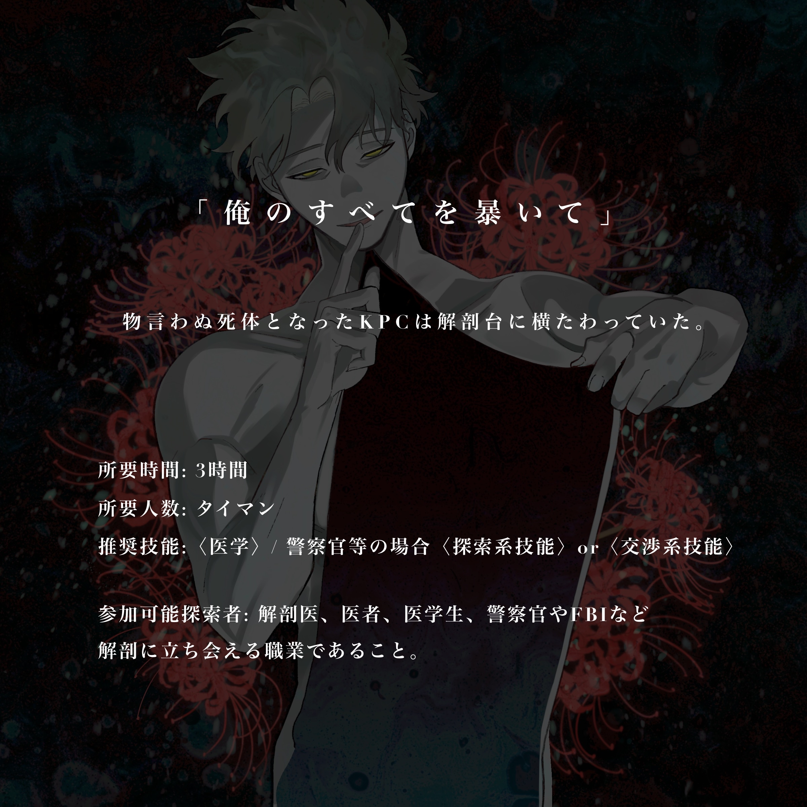
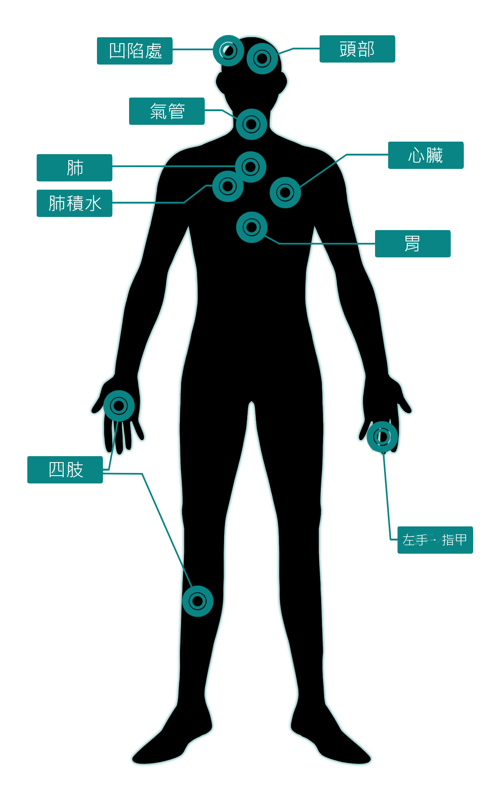

# Call of Cthulhu《暴く深淵（揭露深淵）》完整劇本（KP 向）

<div class="cover-art"></div>

> **「揭露我的一切。」**
>
> 化作不再言語之屍體的 KPC，靜靜躺在解剖台上。
>
> ▲預告圖：おふで（Ofude）　X @ofudeirai　https://x.com/ofudeirai

> **⚠ 本檔含全劇透，僅供 KP 閱覽。** 內含遺體、內臟、解剖等描寫。譯名與用語請對照《暴く深淵_譯名對照表》。

---

## ■ 劇本概要

- **所需人數**：1 對 1（タイマン）
- **所需時間**：3 小時
- **推薦技能**：〈醫學〉／若為警官等身分，則為〈探索類技能〉or〈交涉類技能〉
- **可參加的探索者**：解剖醫、醫師、醫學生，以及警官、FBI 等能夠在場參與解剖的立場之探索者皆可參加。

**備考**
- 即使是平常個性上不會去解剖 KPC 的探索者，也可參加。
- 即使是警官等、平常個性上不會去觀摩 KPC 解剖的探索者，也可參加。
- 解剖可隨時中止。

**注意事項**
- 這是一本**解剖 KPC** 的劇本。為了解剖，含有遺體、內臟等描寫。
- 對神話生物加入了原創的詮釋。

---

## ■ 劇本背景

　原始修格斯（Proto-Shoggoth）會吞食人類的血肉或同類以成長其能力。具有智能的原始修格斯會複製那名人類、取而代之，藉此混入人類社會。然而，經過一定期間後，複製來源的資訊會逐漸淡去，因此牠會定期擄走人類食用。

　這一次，牠擄走了偶然在場的 KPC，打算複製 KPC 之後再將其吞食。過程中被擄來的 KPC 醒了過來、與牠扭打起來，雖然成功將原始修格斯從橋上推落，但 KPC 也被抓住腳一同墜落、昏厥。原始修格斯因頭部受到打擊而昏倒，便以 KPC 的姿態溺死。隨後屍體被沖往下游，這具 KPC 模樣的原始修格斯屍體被人發現，因身上留有打擊痕等傷痕，遂委託探索者進行解剖。

　真正的 KPC 雖未落入河中，卻身負重傷，倒在河灘動彈不得。因此，探索者必須透過解剖查明真正的 KPC 仍然活著，並展開搜救。距離負傷的時間愈久，KPC 的生存機率就愈低。

　此外，探索者在導入時得知受託解剖的對象是 KPC，因而發狂。所以在解剖過程中，探索者會一直看見 KPC 的幻覺。

### ■ 附加方案

　在劇本終盤，探索者會與原始修格斯的原型對峙。原始修格斯保留著「被複製前一刻的 KPC」的記憶，會脫口說出被複製前一刻 KPC 所想、所感受到的事。若想讓「探索者與 KPC 既有關係」更具獨特性，可在導入之前設置一段序章——例如與探索者吵架、告白被打斷之類的場面，或許會很有意思。

---

## ■ KPC 視點　短篇故事

　潮濕的樹葉氣味、柔軟的泥土觸感，以及某個俯視著你的影子。

　抬起頭，是「你自己」正俯視著你。那個與你一模一樣的人物先是露出略為驚訝的表情，接著張大了口。那裡頭闇黑翻湧，黏滑的觸手彷彿要推開狹窄的出口般滿溢而出。你想逃，扭動著身體，卻發覺手臂被壓制、整個人被按倒在地。腥臭的吐息噴上頸側的同時，你反射性地踹向怪物的腹部。

　「咕——」聽見自己發出的悶哼，這詭異的情境讓你起了一身雞皮疙瘩。趁牠退縮的空隙跳起、環顧四周，周圍卻被茂密的林木覆蓋，視野極差，根本不像有人會經過的地方。顯然無法呼救。

　聽見流水聲。看來附近有條河。往下游走應該總會有些什麼吧。你逃離怪物朝那方向走去，但就在視野開闊的瞬間，觸手抓住了你的手臂。你拚命抵抗、扭打成一團，面對那不像人類的怪力卻束手無策，被牠壓制在地。視野裡映入一根白漆剝落的木製柱子。這裡是棧橋上，橋下似乎有河流經過。

　一隻手掐上你的脖子。一點一點地用力，使你無法呼吸。你掙扎著，拚命在周圍摸索，抓到了一塊拳頭大的石頭。使盡全力朝怪物砸去，呼吸這才稍微順暢。「咳。」輕咳一聲。視野模糊。在那模糊的視野中，怪物正按著太陽穴，搖搖晃晃。

　你推開怪物的身體。失去重心的怪物本以為要從橋上墜落，卻抓住了橋緣、懸吊在那。握著石頭的手臂使上了力。然後，你朝著抓在橋上的怪物之手猛力揮下。同一瞬間，你的視野也天旋地轉——觸手抓住了你的腳。墜落只在一瞬，緊接著襲來的是強烈的衝擊，以及遲來的疼痛。天地翻覆了好幾次，近處傳來「嘩啦」一聲巨大的水聲。你明白那傢伙落進河裡了。腳已不再被抓住。然而，你的意識也漸漸沉了下去。

　啊啊，誰來……探索者。

---

## ■ 劇本的閱讀方式

```
■ 章標題
● 大項目
○ 小項目
▶ 判定
▽ 情報　（左右各縮排 3 字）
KP 情報
（描寫）
```

> 本繁中版以：`##／###／####` 對應 ■／●／○；`▶ 判定：` 為擲骰指示；`【KP 情報】`／`【演出】`／`Topics`／事件描寫以引用區塊呈現。

---

## ■ 1. 導入

**——於解剖準備室前——**

**▶ 判定：理智檢定。**
無論成功與否，理智值 −5。

　明明令人煩悶的夏天已經結束了，卻不知為何滲出黏膩的汗。

　冰冷的風拍打著窗戶，捲起樹葉發出乾啞的沙沙聲。窗外是一片陰沉的烏雲密布，彷彿隨時都會下起雨來。在這樣一個哀愁的、某個秋日。

　你手持檢視調書，站在解剖室前。擔任解剖工作的你，會解剖偵查機關送來的遺體、查明其死因。就在剛才，有人委託你解剖「在河中發現的遺體」，如今你正準備著手。

　聽著「啪嗒」一聲雨滴在窗上點出花紋，你再次低頭看向手中的文件。

> **▼ 檢視調書**
>
> **【申告者】**
> 姓名：望月 茂男（モチヅキ モブオ）　年齡：62 歲　職業：水産養殖業者
> 發現者：同上
> 發現日期時間：昨日 12 時左右
> 地點及狀況：源自 A 山與 B 山的 C 川匯流處的沙洲。匯流處位於山麓一帶。
> 備考：發現者為 A 山所有者。有不在場證明。
>
> **【死者】**
> 年齡：○歲
> 性別：男性／女性
> 推定死亡日期時間、地點及狀況：死亡推定時刻為昨日 3～4 時左右，疑似死於 A 山、B 山、C 川其中之一處。
> 檢視時的屍體狀況：頭部、全身數處外傷。口腔內未見泡沫。死後僵直已遍及全身。
> 所持金品：無。

> **【演出】**
> KP 最好不要事先告知成功值、失敗值，而是讓玩家在看到擲骰結果後再執行「−5」。

> **【KP 情報】**
> 探索者已經看過檢視調書。檢視調書上記載著 KPC 的名字。針對這項事實所做的理智檢定，引發了暫時性發狂。
>
> 探索者的暫時性發狂固定為「**幻覺・幻聽**」與「**查明 KPC 的死因**」。因此，探索者會認不出檢視調書上 KPC 的名字，或看見、聽見 KPC 的幻覺・幻聽。
>
> 文件中的「○」請套入 KPC 的資訊。
> KP 請務必把劇本中標示的「Topics」公開給 PL。Topics 記載的是專業術語、或法醫應當知曉的知識。

> **Topics**
> - **口鼻泡沫（ほうまつ）**：約 50% 的溺死者身上可見的生活反應之一。因在水中劇烈呼吸而產生。
> - **死後僵直**：遍及全身約在死後 6～8 小時。→ 此時點尚不能斷定為溺死。如調書所載，大致的死亡推定時刻是昨日清晨。

　視野一角，看得見檢視官與解剖助手正推著推床。當然，上頭載著裝有遺體的屍袋。

　時刻是下午 3:00。現在才開始的話，恐怕得超過下班時間了。差不多，自己也該過去了。

> 「探索者。」

　就在你站到門前時。冷不防地，你彷彿被人喚了名字。那聲音，好像是 KPC 的。
　環顧周圍，除了你以外，空無一人。

### ● 前往解剖室

　你踏入解剖室。

　橫陳於解剖台上的，是一具未含水分、乾淨整潔的遺體。「啊啊，大概是發現得早吧」——你的思緒在一瞬間被奪走。

　它有著 KPC 的模樣。○色的頭髮、長長的睫毛、薄薄的嘴唇，無一不是不容錯認的 KPC。即使只是一眼，也看得出像是扭打過、或遭受襲擊，身上有著刻意造成的瘀青與傷痕。你的思緒彷彿被潑灑上黑色墨水般停滯了。

**▶ 判定：理智檢定 0/1d6+1**

> 「探索者。」

　忽然，傳來 KPC 的聲音。視野一角映出一雙赤裸的腳。

> 「拜託你，查明我的死因。我只能拜託你了。」

　無論抬起頭、還是環顧四周，KPC 的身影都不見蹤影。眼前只有那具土色的 KPC 遺體。你必須查明死因。即使你不願如此，因為 KPC 是這麼希望的。不是別人，正是你，非做不可。KPC 的最後究竟發生了什麼？

　解剖助手問：「您怎麼了嗎？」你大概會回答：「沒什麼。」別說是道出 KPC 的名字，連暗示彼此有關係都不行。否則就無法參與這場解剖了。你這麼想著。

> **【KP 情報】**
> 警官等身分的探索者僅能觀摩。執刀醫為 NPC，請適當變更描寫。探索者所見的幻覺・幻聽等，無論是解剖醫或其他職業皆相同。

> **【演出】**
> 若在此處發狂，KP 不需以對 PL・探索者公開的形式處理，因為探索者早已發狂。
> 發作「幻覺・幻聽」「查明死因」的探索者，即使本來並非會去解剖 KPC 那種個性・思維的人，也會著手解剖。

　雨滴拍打窗戶之中，隨著你一聲開始的信號，解剖開始了。你的對面是解剖助手，白板前是書記，還有一名警官在場見證。

> **▼ 解剖流程**
> 你將依照以下流程進行解剖。
>
> **● 1. 檢案**
> 全身概觀（がいかん）：以「看」獲取資訊。觀察全身、屍體現象、損傷部位等，並拍攝全身正面・背面。
>
> **● 2. 三腔開檢（さんくうかいけん）**
> ① 開胸：解剖胸部。
> ② 開腹：解剖腹部。
> ③ 開顱：解剖頭部。
>
> **● 3. 各種檢查**
> 視需要進行組織學、藥毒物、生化、微生物、DNA 檢查等。
>
> **● 4. 術後處置**
> 縫合遺體、清拭、復原。
>
> **● 5. 文件製作**
> 製作鑑定書、進行記錄。

### ● 解剖規則

　探索者開始解剖。為取得資訊雖需對應的技能，但身為專家、經驗豐富的探索者，**無論技能成功與否都能取得資訊**。在本劇本中，技能的成敗代表的是「取得該資訊所花費的時間長短」之意。

　此外，其他技能若失敗，亦可重擲任意次數。當然，也可選擇不重擲——大概是所見較難判讀，或是花了較多時間吧。

### ● 特殊機制　【？】值與【？】判定

> **KP 處理事項**

- **【？】值**：KPC 能否撐過傷勢的「成功值」。
- **【？】判定**：於劇本提示的時機進行判定。成功 −1／失敗 −1d3，KPC 的 HP 隨之減少。

**【？】的初期值**
　KPC 的 CON×10。上限為 100。

**KPC 的 HP 現在值**
　最大值 −1d3。可依 KPC 的 HP 調整數值。最多有 5 次左右進行【？】判定的機會，換算下來會受到 6～18+α 的傷害。

> **【KP 情報】**
> 此刻，真正的 KPC 雖然活著，卻身負傷勢、處於危險狀態。
> KP 依探索者技能判定的結果，逐步減少【？】值。【？】值是「KPC 能否撐過傷勢」的成功值，是一種隨時間經過、成功率逐漸下降的機制。
> KP 在劇本指示的時機，以【？】為成功率擲 1d100。骰出的結果若**低於**【？】則 KPC 的 HP −1，若**高於**則 −1d3。
>
> 【？】減少一事可公開給 PL。事先告知「擲哪個技能會讓【？】減少多少」會比較貼心。
> 【？】判定時，只擲 1d100、不揭示成敗，或許會更有趣。另外，KPC 的 HP 減少最好不要公開。

> **【演出】**
> 若使用 CCFOLIA 等工具，可在 KP 角色卡等的狀態欄追加【？】並逐步減少，會比較好管理。

> **【KP 情報】**
> 解剖途中，下起了雨。因此 KPC 除了傷勢，還陷入低體溫症，生命危險更增。已是撐不過數日的狀況。

---

## ■ 2. 檢案開始

　探索者開始檢案。
　為了死者而揮動醫學。為了守護無法言語的 KPC 之人權。探索者首先觀察體表，會逐一確認全身概觀與損傷所見。

**檢查部位**：全身／頭部／顏面・口腔／胸腹部／四肢

> **▼ 首次看見 KPC 幻覺時的事件描寫**
>
> 自此之後，探索者一面進行技能判定、一面推進檢案・解剖。**技能失敗時，探索者會看見幻覺。** 首次技能失敗時，發生以下事件。
>
> 在進行「技能失敗時的描寫」之後，接續以下描寫：
>
> 　窗外「啪」地閃了一下，緊接著是雷鳴。
> 　你不禁因映入視野一角的影子抬起頭，望向那邊。那裡站著 KPC。是你看慣的那身打扮、身上沒有一處傷、與平常無異的 KPC。

**▶ 判定：〈POW×5〉**
- **成功**：能將視線移回遺體。若手持工具，也不至於掉落。
- **失敗**：無法將視線從 KPC 身上移開。若手持工具，會掉落。

> 「不可以看喔。」
> 「你看，會被起疑的。被發現的話就沒辦法繼續了。」

　KPC 催促你繼續。眼前的解剖助手順著你的視線回過頭，卻什麼也沒看見，歪著頭問：「您怎麼了嗎？」你只能把視線移回去。

> **【KP 情報】**
> 探索者就像這樣看見 KPC 的幻覺。
> 這份幻覺反映了探索者的願望、記憶與深層心理。因此，KP 可以讓 KPC 說出探索者可能期望聽到的台詞。
> 「2. 檢案開始」中由 KPC 單方面向探索者搭話，可依 KPC 的個性給予鼓勵、調侃或關心。

> **【演出】**
> 「2. 檢案開始」若不發生技能失敗，KPC 的出場機會就少，會變成只是淡淡地吐出資訊。
> 因此，建議適時加入 NPC 向探索者搭話的演出。請參考台詞範例。

### ● 全身

　解剖助手說道：「身高○cm、體重○kg、性別男性／女性、瘦削／普通／肥胖體型。」書記在黑板上記錄，攝影員逐一拍照。明明是與平常無異的光景，你卻不可能毫無所感。

　化作不再言語之軀的 KPC 靜靜橫陳於解剖台上。觸碰肌膚，是陶器覆上橡膠般、柔軟而又僵硬的觸感。正是你觸碰慣了的那種「屍體」。

**▶ 判定：〈醫學〉或〈交涉類技能〉　【？】成功 −2／失敗 −4**
- **成功**：角膜混濁，屍斑以手指按壓亦難消退，死後僵直開始緩解，由此可知已經過死後 24 小時以上。漂母皮形成（ひょうぼひけいせい）出現於指尖至手掌，看來泡在水中的時間約為 5～6 小時。
- **失敗**：忽然間，KPC 從視野一角伸出手，描摹著 KPC 的手指。
> 「這手上的皺紋，是吸了水泡爛才有的吧。在河裡待了 5～6 小時左右嗎？」

　與解剖助手一同將遺體側轉，攝影員拍下照片。鼻腔與口腔內流出混濁的液體。

**▶ 判定：〈偵查〉　【？】成功 −1／失敗 −2**
- **成功**：頭髮上沾著枯葉碎屑。雖看不出整體形狀，但邊緣像鋸齒般呈鋸狀。
- **失敗**：「你看，是枯葉嗎？」視野一角映入 KPC 的手，指向遺體略為濕潤的頭髮。

　你若採取樣本，解剖助手便遞上培養皿。
解剖助手：「這是什麼？我都沒注意到。」

> **【KP 情報】**
> 沒有〈醫學〉的探索者，可用〈交涉類技能〉（向解剖醫或相關者問出資訊）、或察覺異樣的〈偵查〉〈聆聽〉代替。無論成敗皆能取得資訊，故判定 1 次即可。
> 即使技能失敗，KPC 仍會告訴你，那是因為「探索者有意識時想不起來的資訊，也仍留存於腦中」。是在無意識間，透過 KPC 的幻覺回想起來的。
> 即使不是解剖醫，只要是能在場參與解剖的探索者，這些知識想必都至少聽過一次。

> **Topics**
> - **漂母皮形成（ひょうぼひけいせい）**：長時間泡水後，手腳皮膚發白泡爛、變得皺巴巴的現象。

**▶ 判定：〈生物學〉〈生存（山）〉〈植物相關技能〉等　【？】成功 −0／失敗 −1**
- **成功**：聯想到這也許是麻櫟（クヌギ）的葉子。是自生於雜木林或山地的樹。
- **失敗**：「不是麻櫟嗎？在山裡或雜木林會看到的樹喔。」KPC 的聲音從你正後方傳來。

解剖助手：「麻櫟？您真清楚。」
警官：「A 山、B 山都有自生呢。」
書記：「……話說回來，這雨，愈下愈大了呢。」

### ● 頭部

　顳部（側頭部）有一處呈不規則圓形的傷。

**▶ 判定：〈醫學〉或〈交涉類技能〉　【？】成功 −2／失敗 −4**
- **成功**：可推測是被拳頭大小的鈍器毆打的痕跡。幾乎沒有殘留血液，無法判別是死後才造成、還是被沖洗掉了。
- **失敗**：KPC 的手撫上 KPC 的頭。「是被打之後嗎？感覺好像很痛。」

**▶ 判定：〈偵查〉　【？】成功 −1／失敗 −2**
- **成功**：創洞（そうどう／傷口內部的空腔）內附著暗黑色的泥土。衣物上似乎也沾著同樣的泥土。
- **失敗**：「傷口髒髒的呢。是泥土嗎？」KPC 的聲音從身旁傳來。

**▶ 判定：〈地質學〉〈生存（山）〉等　【？】成功 −0／失敗 −1**
- **成功**：大概是褐色森林土。是落葉與枯枝腐化形成的泥土，帶黑的茶色。常見於山地。
- **失敗**：「黑黑的土呢。山裡的土就是這樣的吧。」

解剖助手：「看來是被毆打了。凶器是什麼呢？」
　你想像著一個能造成不規則傷口、附著泥土、拳頭大小的堅硬物。答案大概是石頭之類的吧。死因仍不明朗。

解剖助手：「總覺得，是不是有股怪味？像淤泥一樣的……」
書記：「確實……」
警官：「不，我是聞不出來。」
　你並未感到什麼異味。有的，只是屍體特有的氣味罷了。

> **【KP 情報】**
> 此傷為 KPC 以拳頭大的石頭毆打原始修格斯 KPC 時所造成。
> 此現象因「解剖原始修格斯」而起，有人能認知、有人不能。探索者因發狂故無法認知。

### ● 顏面・口腔

　肌膚光滑而青白的 KPC。濕潤而凌亂的頭髮。紫色的嘴唇彷彿有話想說般微微張開，唯有「那雙眼再也不會睜開」這件事，將現實狠狠擺在眼前。

　為了查看口腔內部，你拿起了壓舌板（ぜつあつし／舌壓子）。

> **▼ 事件**
> 　將壓舌板插入微張的齒列、撐開口腔的那一刻。舌頭脈動、做出類似吞嚥的動作，下一瞬間——顏面上所有的孔竅，都鑽出了冒著泡的黑色觸手。它們像海葵伸展腕足般纏上你的手臂。黏滑的黏膜彷彿吸附而上，令你毛骨悚然。
>
> 「呀——！！」
>
> 　在你尖叫之前，解剖室裡已先一步響起慘叫。隨著夾紙板掉落地面刺耳的聲響，書記頭也不回地衝出解剖室、逃走了。
> 　再看向手邊，並沒有什麼觸手，依舊只是 KPC 躺在那裡而已。

**▶ 判定：對奇異現象進行理智檢定 0/1d3　【？】成功 −1／失敗 −3**

　探索者若想去查看書記的狀況，警官會說「醫師請繼續」並退出。過一會兒回來後，拿起夾紙板說：「他說看見了什麼，整個人完全沒辦法繼續的狀態。記錄就由我來代替。」

　張開的口腔內，果然未見泡沫。顏面沒有顯眼的傷痕，頂多只有在河中漂流過程中造成的擦傷。

> **Topics**
> - **壓舌板（ぜつあつし／舌壓子）**：扁平棒狀的金屬或木製、用來壓下舌頭的器具。用於觀察口腔或咽喉。

> **【KP 情報】**
> 原始修格斯隨時間經過正逐漸復甦。這並非幻覺，但在探索者眼中看來像是幻覺。
> 書記認知到了，其他人則無法認知。為了之後製造 KPC 與探索者獨處的場面，書記就此退場。
> 即使探索者前去查看，書記也因驚恐過度而早退，無法把他帶回。

### ● 胸腹部

　陶器般的肌膚已不再留有生前的水潤。腹部殘留著瘀青。

**▶ 判定：〈醫學〉或〈交涉類技能〉　【？】成功 −2／失敗 −4**
- **成功**：這也是生前所造成的。大概是被狠狠毆打過。從形狀來看，似乎是被棍棒或腳等具一定面積之物毆打。
- **失敗**：視野一角，KPC 揉著腹部。「嗚……開始想起來了，好痛。」

**▶ 判定：〈偵查〉　【？】成功 0／失敗 −1**
- **成功**：總覺得解剖助手的臉色有點差。
- **失敗**：「欸，解剖助手先生的臉色是不是不太好？」KPC 的聲音在耳邊響起。

　向解剖助手出聲關心，他會說：「啊……總覺得有點不太舒服。我沒事。」

> **【KP 情報】**
> 這是 KPC 扭打時踹向原始修格斯 KPC 所留下的痕跡。
> 此為原始修格斯近在身旁所引起的身體不適。若探索者在此勸他退出，解剖助手可以照辦。那種情況下，「3. 解剖開始」事件中倒下的人會改為警官。

### ● 四肢

　各處殘留著擦傷。值得注意的是，左手食指至無名指的背面有傷，以及拇指與食指之間有擦傷。

**▶ 判定：〈醫學〉或〈交涉類技能〉　【？】成功 −2／失敗 −4**
- **成功**：四肢的擦傷大概是在河中漂流過程中造成的。左手手指的傷，像是被一定大小的石頭等毆打而成的傷，或許與顳部凶器相同。
拇指與食指間的傷，會不會是抓痕呢？比方說，用手掐住對方脖子時，對方為了扳開而抓撓所造成的那種。
　**KPC 曾打算殺死某人？　理智檢定 0/1**
→【情報①　左手 3 根手指上有傷】
→【情報②　拇指與食指之間有抓痕】
- **失敗**：「左手手指，像是被什麼東西打過的痕跡呢。我不記得了。」
> 「拇指和食指之間的傷啊，看起來像吉川線呢。那本來不是指被害者脖子上的傷嗎？這樣的話，變成是我掐了別人的脖子嗎？」

→【情報①　左手 3 根手指上有傷】
→【情報②　拇指與食指之間有抓痕】

**▶ 判定：〈醫學〉或〈偵查〉　【？】成功 −1／失敗 −2**
- **成功**：可從指甲縫間採取到皮膚組織片。
- **失敗**：「指甲縫間可以採到皮膚組織片之類的吧。試試看。」KPC 指向 KPC 的指尖。

→【檢查①　指甲縫間的皮膚組織片】

解剖助手：「看來可以做 DNA 鑑定呢。」
「那個……總覺得，是不是有種被人盯著看的感覺？是我多心了嗎……」
警官：「總覺得我也開始有那種感覺了。」
　你並沒有那種感覺。有的，只是 KPC 的遺體而已。

> **【KP 情報】**
> 【情報○】是重要線索。由於是「5. 推理」中要使用的資訊，KP 最好以 PL 看得見的形式保留下來。「5. 推理」中已彙整資訊，故 KP 不需另行整理。
> 若使用 CCFOLIA 等工具，可登載於劇本附屬的「KPC 解剖所見」上。
>
> 〈吉川線等可在「4. 各種檢查」中進行檢查。「4. 檢查」已彙整可調查的項目，KP 不必背下。〉

**▶ 判定：〈偵查〉　【？】成功 −1／失敗 −2**
- **成功**：在左手手指的正面發現刺入了一根木刺。用鑷子拔出後，可知那是木製的刺。
→【檢查②　木刺】
- **失敗**：KPC「手指那邊，有沒有什麼東西？」「木刺？差點就看漏了呢。」
→【檢查②　木刺】

### ● 【？】判定

　「2. 檢案開始」全部結束後，KP 以【？】為成功率進行 1d100 判定。
　成功時 KPC 的 HP −1，失敗時 HP −1d3。

---

## ■ 3. 解剖開始

　接著探索者進入解剖。
　此外，若探索者表示無法再繼續解剖，探索者可隨時中止解剖。這點 KP 可以告知 PL。該情況下，移至 **● 結局 C**。

### ● 事件

　雨勢只增不減。雨「劈啪劈啪」地打在窗上。
　當你的注意力被窗外吸引時，「咚」地一聲傳來。回過神來，眼前的解剖助手身體一傾、倒了下去。臉色蒼白、意識尚存，但身體不適一目了然。你確認他無事後，原本在場見證的警官開了口。

> 「我送他去醫務室。醫師請繼續。」

　說完，解剖助手便由警官帶離了解剖室。留下來的，只有你和 KPC 的遺體。

　忽然抬起頭，KPC 正站在解剖台的對面。隔著眼前 KPC 的遺體。
　KPC 從消毒器械台上拿起手術刀，遞向你。

> 「來，揭露我的一切吧。」

> **▼ 若探索者並非解剖醫**
> 「大家都不在了呢。」
> 「我啊，要被解剖的話，希望是你來。」
> 「沒事的，我會幫你。」
> KPC 如此說著，催促探索者進行解剖。

> **【演出】**
> 此處為了讓 KPC 與探索者獨處，會發生使 NPC 退出的事件。若前一章解剖助手已退出，倒下的便改為警官，請變更描寫。
> 此外，若探索者並非解剖醫，倒下的會是執刀醫。解剖一度中斷，但 KPC 會催促探索者繼續。
> 看起來像是 KPC 遞出手術刀，實際上是探索者自己拿起了手術刀。

> **【KP 情報】**
> 這具遺體是原始修格斯，因此即使是沒有解剖醫資格的探索者切剖也無妨。最終這場解剖本身都將不復存在，所以可以隨意處置。
> 即使沒有法醫學知識，身處能在場參與解剖之立場的探索者，想必也至少見聞過一次法醫學知識。因此，這些知識會藉 KPC 之口傳達出來。

### ● 與 KPC 對話

KPC：「終於只剩我們兩個了呢。這樣就能說話了。」
　KPC 如此說著、微笑了。

　自此之後，可與 KPC 對話。欲提問時，參照以下：

- **為何而死？真的死了嗎？等，關於死因・死亡：**
> 「不知道。回過神來就在這裡了。所以，我才希望由你來查明。」
- **真的是 KPC？還是幻覺？**
> 「在你看來是怎樣呢？」「我也不知道。」「或許是想在最後見你一面吧。」
- **自己是否還清醒（正氣）？**
> 「你覺得呢？」「『清醒』是什麼呢？」
- **懷疑是否為真正的 KPC：**
> 「那一天，我們一起做了○○對吧。」等，說出只有探索者與 KPC 才知道的事。

> **【KP 情報】**
> 這個 KPC 是探索者所見的幻覺，因此只不過是探索者記憶或想像中的 KPC。它會給予探索者想聽的話語，或做出「KPC 的話應該會這麼做」的想像行動。因此，**不會出現與案件相關的資訊**。
> 它會說出只有探索者與 KPC 才知道的事，但理所當然地，探索者不知道的事它也不會說。

**解剖部位**：胸部 → 腹部 → 頭部

　首先從頸部（けいぶ）、胸腹部的切開開始。必須剝開胸大肌、切開皮膚。

　不知是因為已無旁人，還是因為害怕對 KPC 的身體下刀，持刀的手顫抖了。明明雨還在下、略帶寒意，那隻手卻滲著黏膩的汗。忽然，KPC 的手從對面伸來，輕輕覆上你持刀的手。

> 「沒事的。是你的話，做得到喔。」

　你讓手術刀自胸部滑向腹部。劃開皮膚與血肉，那腔室被揭露開來。傳出獨特的「死」之氣味。對於慣了的人而言，這氣味並不算難受，腐敗看來確實尚未怎麼進展。

**▶ 判定：理智檢定 0/1**

### ● 胸部

　當你為了用骨剪剪斷肋骨而觸碰肋骨時。橫陳於軀幹側邊的手指，彷彿微微動了一下。

**▶ 判定：〈偵查〉　【？】成功 0／失敗 −1**
- **成功**：肺上長著一張小小的人類嘴巴，感覺像在動。
- **失敗**：肺上長著一張小小的人類嘴巴，看起來像在呼吸。

**▶ 判定：理智檢定 1/1d3　【？】成功 −1／失敗 −1d3**

　探索者若做出任何反應，KPC 會說「怎麼了？」「是你多心了啦」。再看一次，那裡什麼也沒有。

**解剖部位**：氣管、肺、心臟

#### ○ 氣管

**▶ 判定：〈醫學〉或〈DEX×5〉〈靈感〉等　【？】成功 −2／失敗 −4**
- **成功**：打開空氣的通道——氣管。裡頭可見泡沫。氣管內的泡沫，是溺水時在水中劇烈呼吸、使水與氣管黏液被攪拌而產生的，是溺死生活反應之一。
→【情報③　氣管內可見泡沫】
- **失敗**：
> KPC「切開沒關係喔。」
> 「切得很漂亮呢。你看，還留著泡沫。那個確實是溺死的生活反應之一對吧。」
→【情報③　氣管內可見泡沫】

> **【KP 情報】**
> 這也不是幻覺。原始修格斯正在復原途中，此時點還不會襲擊。

> **【演出】**
> KPC 可自由交談，建議讓它一邊與探索者對話一邊推進。KPC 明明不可能知道、卻說得出醫學術語，那是因為那是探索者的知識。

> **Topics**
> - **生活反應（せいかつはんのう）**：僅在活人身體組織中發生的變化。屍體不會發生，故可作為「鑑別傷口、燒傷等異常變化是生前造成、抑或死後造成」的所見依據。

#### ○ 肺

**▶ 判定：〈醫學〉或〈靈感〉等　【？】成功 −1／失敗 −2**
- **成功**：剪開肋骨、取下。那裡收著膨脹的肺。取起時，像吸了水的海綿般沉甸甸的。這也是吸入大量水分所致、溺死生活反應之一。另外，可將肺的水分（胸腔內）送驗。
→【情報④　肺吸水膨脹】
→【檢查③　肺的水】
- **失敗**：
> KPC「肺差不多是 1 kg 左右吧？看起來比那還重不是嗎？」
> 「肺裡好像積了水呢。這也是溺死的生活反應之一對吧。」
> 「肺的水可以送去化驗來著？」
→【情報④　肺吸水膨脹】
→【檢查③　肺的水】

#### ○ 心臟

**▶ 判定：〈醫學〉或〈DEX×5〉〈靈感〉等　【？】成功 −2／失敗 −4**
- **成功**：摘出肺後，心臟便露了出來。可知因肺部移轉而來的水分影響，心臟血液被稀釋了。此處可採取全身血液送驗。
→【檢查④　全身血液】
- **失敗**：
> KPC「是心臟呢。聽說肺裡的水移過來，心臟的血也會被稀釋喔。會變成怎樣呢？」
> 「血液也一起送去化驗吧。」
→【檢查④　全身血液】

> **【KP 情報】**
> 溺死的所見其實還有好幾種，劇本內予以省略。

### ● 腹部

　被切開的腹部塞滿了內臟。每一個都失去血色、黯淡成灰。是看慣了的「死」之色。

**解剖部位**：胃

#### ○ 胃

**▶ 判定：〈醫學〉或〈DEX×5〉　【？】成功 −2／失敗 −4**
- **成功・失敗**：切開胃，未消化的肉塊便滿溢而出。你大概會不禁嚇得一驚。它像拔了塞子般眼看著流瀉出來，「啪嚓」一聲落在地上。超出人類胃容量的內容物溢出後，止住了。**理智檢定 1/1d3**
→【檢查⑤　胃內容物】
- **成功**：若胃內容物未消化，可知是在進食後立即～進食後未滿 1 小時內死亡。溢出的肉塊像是生肉，各處殘留著白色脂肪。
- **失敗**：
> KPC「……」
> 「是生肉嗎？我沒有吃過的記憶。看起來沒消化，那就變成是在進食後立即～未滿 1 小時內死亡了吧。」

> **【KP 情報】**
> 這是因為原始修格斯在襲擊 KPC 之前，曾吃下一整個人類。

### ● 頭部

　有必要調查凹陷處對身體造成了什麼影響。要調查這點，必須切開皮膚、在頭蓋骨上鑽孔開顱。

　切開皮膚翻開後，白色的骨頭便露了出來。為手持鑽接上電源，前端旋轉起來，發出無機質的聲響、傳來震動。用這個鑽孔、沿著孔切開骨頭，腦髓大概就會露出來吧。
　照平常那樣做就行了。然而，眼前躺著的是闔著眼的 KPC。你，做得到嗎？

> **▼ 若停手**
> 「沒事吧？不想繼續了？」
> 「畢竟臉是最能讓人留下印象的部位，要下刀果然很難吧。」
> 「難受的話，果然還是別做了也沒關係喔。」
> KPC 如此說著，像在擔心般將手覆上探索者的手。
> 停手 → 移至 **● 結局 C**

> **▼ 若繼續**
> 「瘋狂，從來都近在咫尺。」
> 「與怪物戰鬥的人，應當小心自己不要在過程中也成了怪物。當你凝視深淵時，深淵也凝視著你。很有名對吧——這是弗里德里希・尼采的話喔。」
> 「你也要小心，別變成怪物了。」

　頭蓋骨被鑽出了孔。那一瞬間，黑色黏液湧了出來。比黑更深的黑滿溢而出，浸濕解剖台，終於在地上積成一灘黑水。
　忽然，身體彷彿失去了平衡。雙腳「噗滋噗滋」地被黑水吞沒。一種吸附而上的感覺從鞋底竄起。彷彿正踩在濕潤的黏膜上，令人作嘔的觸感。

**▶ 判定：理智檢定 1/1d3　【？】成功 −1／失敗 −2**

> **【KP 情報】**
> 持續發狂的探索者，其精神為了從壓力中逃離，正無意識地拋出「停止解剖」這個選項。
>
> 　這是幻覺。在持續承受的壓力下，幻覺的作用增強了。

> KPC「探索者！！」

　你反射性地抓住 KPC 伸出的手臂。將沉重的腳從無底沼澤中拔起，總算重整了姿勢。一面調勻紊亂的呼吸，再看一次地面，那裡已什麼都沒有，只剩解剖室無機質的地板延展開來。

　KPC 會做出「怎麼了？」「看見什麼了嗎？」等擔心的反應。待你冷靜下來後，會再問一次：「還能繼續嗎？」

　探索者若繼續，這次便能毫無波折地在頭蓋骨上鑽孔、沿之開顱。

**解剖部位**：凹陷處

#### ○ 凹陷處

**▶ 判定：〈醫學〉或〈STR×5〉〈DEX×5〉　【？】成功 −2／失敗 −4**
- **成功**：雖造成了凹陷性骨折，但未見腦部的挫滅或壞死。或許曾引起腦震盪，但並非死因。然而，無法否定其可能是間接死因。
→【情報⑤　未見腦部的挫滅或壞死】
- **失敗**：
> KPC「腦髓本身沒有變色呢。也許沒受到損傷。」
→【情報⑤　未見腦部的挫滅或壞死】

### ● 【？】判定

　「3. 解剖開始」全部結束後，KP 以【？】為成功率進行 1d100 判定。
　成功時 KPC 的 HP −1，失敗時 HP −1d3。

> **【KP 情報】**
> 看起來像是 KPC 為你伸出了手，但這大概也只是抓住了解剖台的邊緣罷了。

> **Topics**
> - **挫滅（ざめつ）**：因外部衝擊或壓迫，使組織遭到破壞。
> - **壞死（えし）**：細胞、組織或器官死滅。

---

## ■ 4. 各種檢查

　探索者能取得在「2. 檢案開始」與「3. 解剖開始」採取的檢體之檢查結果。

<div class="cover-art"></div>

### ● 各種檢查

　探索者會查看送達的檢查結果資料與檢驗儀器。你們背對解剖台，面向檢驗儀器。雨還在下。

| 檢查結果 | 對【？】影響 |
|---|---|
| 檢查①　指甲縫間的皮膚組織片 | 【？】−5 |
| 檢查②　木刺 | 【？】−1 |
| 檢查③　肺的水 | 【？】−1 |
| 檢查④　全身血液 | 【？】−1 |
| 檢查⑤　胃內容物 | 【？】−1 |

#### ○ 檢查①　指甲縫間的皮膚組織片　【？】−5

　這是從指甲縫間採取的皮膚組織片之 DNA 檢查結果。
　結果是，不知為何竟檢出了 KPC 的 DNA。無論驗幾次，都只檢出 KPC 的。然而，你很清楚 KPC 身上並沒有「自己抓得到的位置」會有那種傷。

KPC「這是怎麼回事呢。我不懂。」
→【檢查結果①　檢出了 KPC 的 DNA】

#### ○ 檢查②　木刺　【？】−1

　成分分析的結果，檢出了松（木材）、二氧化鈦與樹脂。從成分來看符合「**塗料**」。特別是二氧化鈦，大量用於白色塗料。也就是說，可知 KPC 是在抓住「塗成白色的木材」時被木刺刺入的。

**▶ 判定：〈交涉類技能〉或〈導航〉　【？】成功 −1／失敗 −1d3**
　若向檢視官或望月先生詢問，可知 A 山有一座塗成白色的棧橋。

KPC「也就是說，我是用左手抓住了棧橋對吧。」
「除非用力摩擦或緊握，否則木刺是不會刺進去的吧。」

→【檢查結果②　左手正面刺有來自白色塗裝橋梁的木刺】

> **【KP 情報】**
> 通常解剖室並不會有檢驗儀器，DNA 檢查等也不會立刻出結果，但基於虛構與演出需要，請多多包涵。

> **【演出】**
> 「5. 推理」中使用的只有【檢查結果○】。若使用劇本附屬的「KPC 解剖所見」，可在其上覆寫、或疊加新的畫面面板（screen panel）。

#### ○ 事件

　「鏘啷。」
　背後傳來物聲。回過頭，手術刀掉在地上。無論你撿不撿起它，你都會察覺到一股異樣感——KPC 遺體的手臂，正軟軟地從解剖台上垂落。**理智檢定 0/1**

#### ○ 檢查③　肺的水　【？】−1

　可知為淡水。另外，檢出了稀有的藍藻（らんそう）。

**▶ 判定：〈生物學〉或〈交涉類技能〉　【？】成功 −1／失敗 −1d3**
　這種藻類，與望月先生在 A 山栽培的「水前寺海苔（スイゼンジノリ）」成分一致。水前寺海苔僅在極少數地區栽培。這一帶也只有望月先生的栽培場有。

→【檢查結果③　胸腔內檢出稀有藍藻】

#### ○ 檢查④　全身血液　【？】−1

　從全身血液中檢出了浮游生物。這是「大量水分進入肺部、由破裂的肺泡使水分循環至全身血液」所引起的，是溺死的診斷依據之一。另外，這種浮游生物與 C 川的浮游生物一致。

　若探索者並非解剖醫，KPC 會說：「全身血液中檢出浮游生物，是溺死的診斷依據之一對吧。死因看來可以判定是溺死了呢。」

→【檢查結果④　全身血液中檢出浮游生物】
→【檢查結果⑤　檢出的浮游生物與棲息於 C 川者一致】

#### ○ 檢查⑤　胃內容物　【？】−1

　從細胞組織、成分分析、生化檢查得出「為人類的可能性極高」的結果。探索者大概會毛骨悚然。畢竟，從腹中溢出的，是足以令人聯想到「一整個人份」的量。**理智檢定 1/1d4**

KPC「那麼，變成是我吃了人嗎？」
→【檢查結果⑥　胃內容物為人肉】

> **【KP 情報】**
> 原始修格斯覺醒了。它會窺伺探索者的空隙，準備發動襲擊。
> 若向警方相關人員詢問，可知這份人肉屬於一名先前失蹤的人物。

### ● 【？】判定

　「4. 各種檢查」全部結束後，KP 以【？】為成功率進行 1d100 判定。
　成功時 KPC 的 HP −1，失敗時 HP −1d3。

---

## ■ 5. 推理

KPC「解剖和檢查大致都結束了吧。」
「那麼，來整理一下情報吧。」

　KPC 如此說著，在附近的折疊椅上坐下。雨仍未停。

### ● 推理規則

　與 KPC 一問一答，查明 KPC 之死的真相吧。針對 KPC 的提問，從下列**▼ 情報一覽**中選出詞條來作答。

> **▼ 情報一覽**
> - 情報①　左手 3 根手指上有傷
> - 情報②　拇指與食指之間有抓痕
> - 情報③　氣管內可見泡沫
> - 情報④　肺吸水膨脹
> - 情報⑤　未見腦部的挫滅或壞死
> - 檢查結果①　檢出了 KPC 的 DNA
> - 檢查結果②　左手正面刺有來自白色塗裝橋梁的木刺
> - 檢查結果③　胸腔內檢出稀有藍藻
> - 檢查結果④　全身血液中檢出浮游生物
> - 檢查結果⑤　檢出的浮游生物與棲息於 C 川者一致
> - 檢查結果⑥　胃內容物為人肉

> **【KP 情報】**
> 現實中，這只不過是探索者在自問自答罷了。
> 若導不出答案，請 KP 給予協助。

#### KPC 的死因

KPC「首先從我的死因開始吧。」
**Q.**「頭部的傷並非直接死因對吧。知道為什麼嗎？」
**A.** 情報⑤　未見腦部的挫滅或壞死

**Q.**「正確。我的死因是溺死。溺死的依據有哪些呢？應該有 3 個。」
**A.** 情報③　氣管內可見泡沫／情報④　肺吸水膨脹／檢查結果④　全身血液中檢出浮游生物

**Q.**「就是這樣。死因是溺死，但我身上留有與人爭執過的痕跡。再加上，有可疑「被人故意推落河中」的所見。這 2 個，知道是哪些嗎？」
**A.** 情報①　左手 3 根手指上有傷／檢查結果②　左手正面刺有來自白色塗裝橋梁的木刺

KPC「沒錯。所以，他殺的線索很濃厚對吧。也就是說，我或許是抓住了塗成白色的橋，卻被犯人施加打擊，不得不鬆手。」

> （對應：○ 凹陷處／● 胸部・○ 檢查④ 全身血液 −1／● 四肢・○ 檢查② 木刺 −1）

#### 犯案現場

KPC「那麼，犯案現場在哪裡呢。雖然是 A 山、B 山、C 川其中之一，但可能還留有什麼，想再把地點縮小一點呢。」
**Q.**「死因是溺死，可以推測是在 C 川溺水的吧。能佐證這點的是？」
**A.** 檢查結果⑤　檢出的浮游生物與棲息於 C 川者一致

**Q.**「很順利。不過，我想鎖定是在 C 川的哪裡溺水的。從傷口、衣物上附著的泥土與樹葉來看，山中是犯案現場的可能性很高，但 C 川從 A 山、B 山都有流經。有沒有能鎖定是哪座山的線索呢？」
**A.** 檢查結果③　胸腔內檢出稀有藍藻

KPC「是啊。檢出的水前寺海苔在 B 山沒有，是望月先生在 A 山養殖的。也就是說，我很可能是在 A 山水前寺海苔栽培地附近被推落河中的。那栽培地附近一定有座塗成白色的橋。」

**▶ 判定：〈偵查〉〈導航〉〈交涉類技能〉等　【？】成功 −1／失敗 −2**
　能鎖定水前寺海苔栽培地附近、有棧橋的地點。

KPC「那裡一定就是犯人與我爭執的地方。或許有什麼線索。」
「不過，等一下。還有不自然的地方。」

> （對應：○ 檢查④ 全身血液 −1／○ 檢查③ 肺的水 −1）

#### 不自然之處

**Q.**「我身上留有『加害他人』的痕跡對吧。」
**A.** 情報②　拇指與食指之間有抓痕

**Q.**「對。像是掐住別人脖子時被反抗留下的傷。而且，從指甲縫間檢出的東西是？」
**A.** 檢查結果①　檢出了 KPC 的 DNA

**Q.**「嗯。可是，並沒有自己傷害自己那樣的痕跡。還有，死前所吃的東西是？」
**A.** 檢查結果⑥　胃內容物為人肉

KPC「正確。也就是說，我吃下了一整個人份。可是，那種事我做得到嗎？這個我，真的是我嗎？」

**〈靈感〉**
- **成功**：KPC「我有兩個，而真正的我，現在說不定還在某處等著你的救援呢。」
- **失敗**：也就是說，真正的 KPC 仍「未死」。KPC 有兩個，殺死這個冒牌 KPC 的真正 KPC，或許還在某處——你赫然想到。

### ● 【？】判定

　「5. 推理」全部結束後，KP 以【？】為成功率進行 1d100 判定。
　成功時 KPC 的 HP −1，失敗時 HP −1d3。

> **【KP 情報】**
> 此處的〈靈感〉是「狂人的洞察」。探索者自覺察知到，反而是在〈靈感〉**失敗時**。會想到通常不可能、出乎意料的真相。

---

## ■ 6. 前往 KPC 之處

　探索者抵達真相後，原始修格斯暴走。必須阻止暴走，趕到真正的 KPC 身邊。

### ● 原始修格斯的暴走

　探索者抵達真相時，發生事件。

> 「探索者。」

　背後傳來聲音。是 KPC 的聲音。回過頭，解剖台上 KPC 的遺體猛然坐起。彷彿被操縱的人偶般，腰部浮起、肩膀抬高，頭顱遲一步跟上。又一道強光「啪」地閃過，使那身軀明滅閃爍。

　它袒露著青白的身軀、走下解剖台，搖搖晃晃地向你靠近。

　就在探索者做出任何反應的瞬間，那青白的肌膚像融蠟般「黏稠」地融化了，染上帶光澤的褐色。身體的輪廓崩解，扭曲地隆起，逐漸形成肉塊般的不定形。腥臭的褐色液體「啪嚓啪嚓」地灑落在地，模仿人類器官的構造在體表浮現、又埋沒消失。一根手臂般粗的觸手朝你伸來。

> 「救救我。」

　肉塊這麼說。雷鳴轟然作響。
　**目睹具有智能的變形之物　理智檢定 1/1d10**

> **【KP 情報】**
> 已恢復到一定程度的原始修格斯，為了襲擊探索者而起身。
> 此處原始修格斯所說的台詞，是 KPC 被複製前一刻所想的事。KPC 可能會想的事，什麼都可以讓它說。
> **例：**
> - 與探索者分別前曾吵架 →「對不起。」
> - 本想向探索者告白 →「早知道會變成這樣，當初就該說出口的。」
> - 對探索者有好感 →「最喜歡你了。」
>
> 此處不發狂也無妨。因為探索者早已發狂。

　自此進入回合處理。每回合經過之初，【？】−1。另外，KP 每 4 回合進行一次【？】判定。

> **▼ 不定形肉塊－原始修格斯**
> STR 35　CON 25　SIZ 28　INT 13　POW 16　DEX 11　DB +3d6
> HP：3　MP：16
> 〈觸肢〉50%　傷害 3d6
> **原始修格斯對任何攻擊都只承受最低值。**

　探索者可採取以下行動。可向 PL 開示：
- **○ 進行 DEX 對抗以逃走**：DEX 對抗成功 3 次即可逃脫。
- **○ 雖耗時但藏匿著逃走**：不需技能判定。代價是耗費 1d12+3 回合。
- **○ 戰鬥**：擊倒或使其行動不能即勝利。使用〈偵查〉或〈戰鬥技能〉。

> **【KP 情報】**
> 由於推薦技能僅設為〈醫學〉〈交涉類技能〉，因此設計成：即使能力值偏低、不具戰鬥技能，只要肯花時間也能擊退原始修格斯。

### ● 進行 DEX 對抗以逃走

KPC「探索者！！」
　KPC 的聲音讓你彷彿被彈開般踢地起跑。

#### ● 逃走規則

　與 DEX 11 進行 DEX 對抗。成功 3 次即可甩開。若 5 回合內未能以 DEX 對抗逃脫，將被追上，強制移至戰鬥。

#### ● 描寫與判定

　探索者若成功指定技能，便能為 DEX 判定加上修正。
- **○ 第 1 回合**：朝門口奔去。〈STR×5〉〈DEX×5〉〈踢擊〉等成功，可推倒消毒器械台（放置不鏽鋼器械的台子）。可以 DEX +1 進行判定。
- **○ 第 2 回合**：不定形肉塊一面散濺淤泥一面追來。〈靈感〉〈偵查〉〈導航〉等成功，可走最短路徑往外。可以 DEX +1 進行判定。
- **○ 第 3 回合**：不顧淋濕衝出了戶外。停車場近在眼前。〈STR×5〉〈導航〉〈跳躍〉〈攀爬〉等成功，可翻越柵欄。可以 DEX +1 進行判定。
- **○ 第 4 回合**：得以跳上車。〈DEX×5〉〈駕駛（汽車）〉等成功，可俐落地把車開出。可以 DEX +1 進行判定。
- **○ 第 5 回合**：你猛然踩下油門。〈STR×5〉〈DEX×5〉〈駕駛（汽車）〉等成功，可撞倒不定形肉塊。傷害 1d10。之後進行 DEX 對抗。

　造成 3 以上傷害時，原始修格斯將無法動彈、不再追來。若在原始修格斯 HP 尚存的狀態下逃走成功，原始修格斯會逃往某處。

→ **5 回合內成功 3 次**
　回頭一看，不定形肉塊似乎已不再追來。

→ **5 回合內未能成功 3 次**
　移至 **○ 戰鬥**。

> **【KP 情報】**
> 此路線中【？】值上升 3～5，進行約 1 次【？】判定。
> 若探索者在意幻覺 KPC 的存在，幻覺 KPC 隨時都會陪在身邊。可由 KP 裁量給予協助，但探索者無暇進行物理性干涉，故無法做到。
> 若探索者不會開車，搭計程車等也可以。也可加入聽見其他路人慘叫等演出。

### ● 雖耗時但藏匿著逃走

　不需技能判定。代價是耗費 1d12+3 回合。

**▶ 判定：1d12+3 回合**

KPC「探索者，這邊！！」

　KPC 的聲音讓你彷彿被彈開般踢地起跑。在 KPC 的引導下奔過走廊，逃進另一個房間。豎耳細聽，不定形肉塊似乎跟丟了你，過了一會兒，房外蠢動的氣息消失了。探索者戰戰兢兢地出來一看，那裡只落著骯髒的黏液，別無他物。安心也只是一瞬，你猛然驚覺：得快點趕到 KPC 身邊。遠處傳來雷鳴。

> **【KP 情報】**
> 此路線中【？】值上升 4～15，進行約 1～3 次【？】判定。

### ● 戰鬥

　擺出臨戰態勢的你，確認周遭狀況。你身旁是放著手術刀等的消毒器械台，背後是排列著藥品的櫥櫃與工作台。門在隔著解剖台的對面，門邊放著一具滅火器。

**▶ 判定：第 1 回合進行〈醫學〉〈藥學〉〈靈感〉等**
　你回想起藥品的種類。生理食鹽水、消毒液與清潔劑、福馬林……。雖不知對眼前的怪物什麼有效，但其中危險度最高的是福馬林。每種都有複數瓶。

> **▼ 潑灑、投擲福馬林**
> - **〈投擲〉**：傷害 1+db。POT 15 與原始修格斯 CON 25 對抗。因能把藥品全潑上去故自動成功，可造成 POT 一半的傷害（8 點傷害）。
> - **〈DEX×5〉等**：POT 15 與原始修格斯 CON 25 對抗（自動成功）。依潑到多少藥品，傷害值不同。探索者以 1d8 計算傷害。
>
> 　你反射性地抓起瓶子，把裡頭的液體潑灑出去。瞬間，巨大的肉塊發出臨死的哀號。它痛苦地翻滾、扭動，反覆伸縮。

> **▼ 物理攻擊**
> 　像攻擊泥巴般毫無手感。看來不太有效。

> **▼ 擊倒**
> 「找到我。」
> 肉塊以 KPC 的聲音這麼說完後，終於不再動彈。你確信了——KPC 還活著。一定就在犯案現場，不，就在與這傢伙爭執的地方。

> **【KP 情報】**
> 原始修格斯幾乎無法以物理攻擊造成傷害。但由於是曾經死過一次的原始修格斯，HP 只回復到 3。即使只持有物理性的攻擊手段，也有擊倒的可能。
> 失敗時，可在每回合之初重新判定，直到成功為止。
> 這句台詞同樣可反映「KPC 被複製前一刻所想的事」。

### ● 前往 KPC 之處

　探索者擊退原始修格斯後，必須趕往 KPC 身邊。
　探索者大概會前往「A 山的白色橋」。雖可委託警方搜索，但若選擇等待警方行動，除【？】−10 外，還需進行【？】判定。

　探索者衝出解剖室時，雨已停了。氣溫進一步驟降，濃藍的黑暗壟罩街道，你在其中奔跑。快點、快點，趕到 KPC 身邊。

　探索者踏入了 A 山。通往望月先生栽培地的路雖經鋪設，但只要偏離一步，便是無人工修整的自然蔓延開來。因連日降雨，腳下泥濘不堪。

　過了一會兒，看見了塗成白色的橋。抵達那裡後，你大概會呼喊你的 KPC。那聲音融入夜的黑暗。僅靠手邊微弱的燈光，你拚命尋找 KPC。

　忽然，你察覺橋的一部分損壞了。雖也看似只是欄杆因年久劣化而崩塌，但在你眼中，那是「有人為抵抗墜落而留下的痕跡」。因為，那欄杆上黏附著褐色的淤泥。

　你想都沒想便望向橋下。被闇黑包覆的谷底，一條因水量增加、映著月光反射出銀色的河流淌著。兩側是斜坡，並非不能下去。

**▶ 判定：下河時進行〈DEX×3〉或〈攀爬〉〈跳躍〉**
- **成功**：毫髮無傷地下去。
- **失敗**：被泥濘絆住打滑、或被樹枝勾到，身體受傷。HP −1d3

> **【KP 情報】**
> 幻覺 KPC 不必勉強讓它出現。在探索者陷入困境、或在意 KPC 存在時，才現身。因為「KPC 或許還活著」的現實正讓探索者看見希望。

> **▼ 發現時，KPC 的 HP 為 1 以上**
> 　你不顧一切地往谷底下去。一面呼喊 KPC 的名字，一面撥開河畔的草木持續前進。露水沾濕身體也毫不在意。
> 　接著，從高高的草叢中，看見了一隻人類的腳。
>
> 「太好了呢。」
> 　背後彷彿傳來只有自己聽得見的 KPC 的聲音。
>
> 　你奔上前去，那是 KPC。
> 　氣息奄奄、身上滿是傷痕。即便如此，仍在呼吸。心臟在跳動。有體溫。KPC 活著。微微睜開眼的 KPC，喚了你的名字。
> → **● 結局 A**

> **【KP 情報】**
> 依 KPC 的 HP 是否為 1 以上，處理不同。
> 此處 KPC 的幻覺消失。

> **▼ 發現時，KPC 的 HP 為 0 以下**
> 　你不顧一切地往谷底下去。一面呼喊 KPC 的名字，一面撥開河畔的草木持續前進。只是一味地、不顧露水沾濕身體，以瘋狂塗抹掉理性。
> 　接著，從高高的草叢中，看見了一隻人類的腳。
>
> 　你奔上前去，那是 KPC。
> 　觸碰時明明感覺像還有體溫，卻動也不動。你急忙將手指按上頸側。確認呼吸。心臟，已經停了。沒有呼吸。
> 　你開始進行心肺復甦。這次，是為了「活著的人」而揮動醫學。

**▶ 判定：探索者進行〈醫學〉3 次**
　KPC 進行〈幸運〉或〈CON×5〉3 次
　合計 6 次中，成功 3 次則 KPC 復甦。

> **▼ 6 次中成功 3 次**
> 　你用力按壓 KPC 胸口正中。一次又一次，為了讓血液流遍全身。汗從額頭滑落，滴在交疊的自己的手背上。明明風是冷的，氣息卻急促，熱得難受。即便如此，仍停不下來。
> 　不知過了幾分鐘。然而，胸廓彷彿微微動了一下。確認心跳，察覺已經重新開始。KPC 復甦了。你會一次次呼喚 KPC、施以適當處置，等待救援。→ 移至 **● 結局 A**

> **▼ 6 次中未能成功 3 次**
> 　你用力按壓 KPC 胸口正中。一次又一次，為了讓血液流遍全身。汗從額頭滑落，滴在交疊的自己的手背上。明明風是冷的，氣息卻急促，熱得難受。即便如此，仍停不下來。
> 　一次，又一次，再一次。用力、按壓、氣息急促、全身發出悲鳴、汗水流淌、淚水滑落、呼喊，消失在黑暗中。無論你多麼拚命地反覆那個動作、無論你多麼苦苦掙扎不讓那條生命流逝，KPC 的脈搏都不曾重新跳動。
> 救護隊趕到。對你說「已經沒用了」。嗚咽溢出。你不得不放手。這裡是深淵的底。死，將你們斷絕。→ 移至 **● 結局 B**

> **【KP 情報】**
> 只要探索者不去在意，便看不見 KPC 的幻覺。

---

## ■ 7. ENDING（結局）

- **● 結局 A**：KPC 還活著
- **● 結局 B**：KPC 死了
- **● 結局 C**：中止了解剖

### ● 結局 A　KPC 還活著

　過了一會兒，救護隊發現你們。
　探索者們大概會被送往醫院。KPC 雖須住院，但保住了一命。據說因外傷失血與外氣溫下降造成的低體溫症，曾處於相當危險的狀態。哪怕再晚一點被發現，恐怕就沒命了。

　由於周遭的證詞，「解剖 KPC」這件事本身變成了不曾發生過。

　正如「愛裡總有幾分瘋狂，瘋狂裡也總有幾分理性」，探索者的那些「愛與瘋狂」，將 KPC 繫留了下來。然而，總有一天必須當心，別讓自己也成了怪物——因為，你已揭露過深淵。

　探索者們大概能回歸日常。

> **▼ 生還報酬**
> **兩者生還**
> 生還　1d10
> 解剖了原始修格斯的身體　克蘇魯神話技能 +1
>
> 　（這也是弗里德里希・尼采的話。）

### ● 結局 B　KPC 死了

　你還會再一次，站到解剖台前嗎？
　還是，再也做不到那種事了呢？
　至少，驅策你的那份瘋狂，不會再發作了。

　你站在棺木前。外頭，秋日冰冷的雨仍淅淅瀝瀝地下著。
　眼前躺著彷彿隨時都會醒來的 KPC。將頭埋進冰冷的絲質枕中，臉頰淡淡敷上胭脂，露出彷彿已忘卻恐懼般安詳的表情。

　火葬的時間就快到了。一切都將化為灰燼。愛、瘋狂，還有殘留的傷痕。

KPC「沒事的。我會在你身邊喔。」

　你忽然回過頭。那裡，有 KPC。

> **▼ 生還報酬**
> **探索者生還／KPC 失格（Lost）**
> 生還　1d8
> 解剖了原始修格斯　克蘇魯神話技能 +1
>
> **【後遺症：KPC 的幻覺】**
> 　在 1d3 年間，探索者會看見 KPC 的幻覺。它會給予探索者想聽的話語，或做出「在探索者看來 KPC 會採取」的行動。

> **【KP 情報】**
> 這個 KPC 是探索者所見的幻覺。劇本中的發狂仍在持續。

### ● 結局 C　中止了解剖

　你放下了手術刀。再也無法繼續傷害 KPC 的身體。那是理性戰勝瘋狂的一刻。

　數日後，你看見了一則新聞。
　A 山發現了 KPC 的遺體。看來是從橋上墜落，且似乎還有一段時間尚存氣息。怎麼可能有這種荒謬的事。因為，那時你明明正打算解剖「從河中撈起的 KPC 遺體」。那麼，那具遺體又是……

　你慌忙去調查那具遺體現在如何了。然而，既沒有解剖報告書，也不知道遺體去了哪裡。彷彿憑空消失了一般。

KPC「沒事的。一切都只是個惡夢。」
　KPC 關掉了電視。你的身旁，有 KPC。

> **▼ 生還報酬**
> **探索者生還／KPC 失格（Lost）**
> 生還　1d5
>
> **【後遺症：KPC 的幻覺】**
> 　在 1d3 個月間，探索者會看見 KPC 的幻覺。它會給予探索者想聽的話語，或做出「在探索者看來 KPC 會採取」的行動。

> **【KP 情報】**
> 這個 KPC 是探索者所見的幻覺。因無法承受 KPC 已死的事實，將否定 KPC 之死本身。劇本中的發狂仍在持續。
> 後遺症解除之時，探索者將自覺到 KPC 已不在這世上。

---

## ■ 後記

　這次非常感謝您的購買！！
　自從朋友送我一本法醫學教科書後，我一直很想寫一本解剖劇本。某次在 X 上看到「想玩解剖 KPC 的劇本」這則貼文，以此為契機才得以動筆。謝謝發文的那位。
　屍體會說話。明明真的不會開口，卻能從痕跡中得知種種事實——我喜歡這樣的法醫學，以及解讀它的法醫。謹向那些直面死亡的人們，獻上深深的敬意與感謝。

　2025.05.30　大和（Yamato）

## ■ 特別感謝（Special Thanks）

　透過 marshmallow 提供情報的各位、為我進行測試遊玩的朋友們、為我製作預告圖的おふで（Ofude）先生／小姐，以及購買・遊玩本劇本的各位。

## ■ 參考文獻

- **原始修格斯（原ショゴス）**：《Malleus Monstrorum》舊版 P.45／新版 P.70
- **《標準法醫學》第 7 版**　監修：石津日出雄・高津光洋　發行：株式會社 醫學書院
- **《屍體會說話》／《屍體會說話 2》**　作者：上野正彥　出版社：文藝春秋
- **《希波克拉底的誓言》／《希波克拉底的憂鬱》**　作者：中山七里　出版社：祥傳社

## ■ 主題色

- `#19190f`
- `#4b9187`

## ■ 取り扱い（使用規範）

> 以下為原作者所載之使用規範，繁中版照錄供 KP 參照。

著作權並未放棄。
另外，預告圖・劇本附屬素材的著作權歸屬於おふで先生／小姐（X：@ofudeirai　https://x.com/ofudeirai）。請勿轉載預告圖・劇本附屬素材，或將其截圖發布至 SNS。

本劇本檔案中封入的劇本資料・線上用素材等，禁止二次散布、自稱原創、轉售行為、讓渡・出借、AI 學習等。

於 SNS 等發布感想或插畫時，原則上禁止劇透機制（ギミック）等內容。請使用無劇透的範圍，或可防止劇透的工具（如「ふせったー」）。

公開本劇本的遊戲記錄・回放・影片等並無問題，但請註明劇本標題；若進行了改編，請一併註明該事項。另外，若有意進行影片化或實況，能透過推特 DM 或郵件與作者聯繫，作者會很高興。

描寫・機制・處理的改編，只要在「不損及劇本意涵」的程度內皆可自由為之。另外，進行改編時，請務必告知玩家該事項。

- **劇本**：大和（Yamato）　X @ymttrpg525　Mail yamatotrpg@gmail.com
- **預告圖**：おふで（Ofude）先生／小姐　X @ofudeirai　https://x.com/ofudeirai
　（每一次都從我含糊的委託中生出最棒的預告圖，おふで因此開設了帳號！！（2025.5～）　請務必也去逛逛本人的作品集🎶）

## ■ 製作群（Credit）

本作是「株式會社 Arclight（アークライト）」及「株式會社 KADOKAWA」擁有權利之《克蘇魯神話 TRPG》的二次創作物。

Call of Cthulhu is copyright ©1981, 2015, 2019 by Chaosium Inc.; all rights reserved. Arranged by Arclight Inc. Call of Cthulhu is a registered trademark of Chaosium Inc. PUBLISHED BY KADOKAWA CORPORATION
